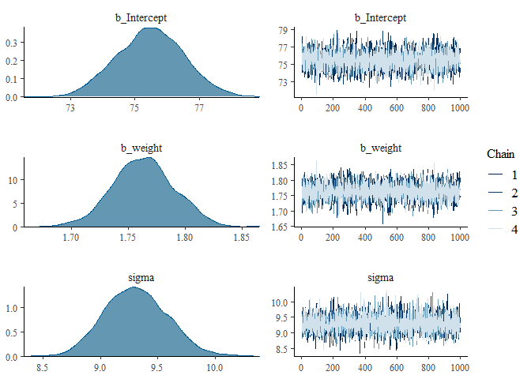
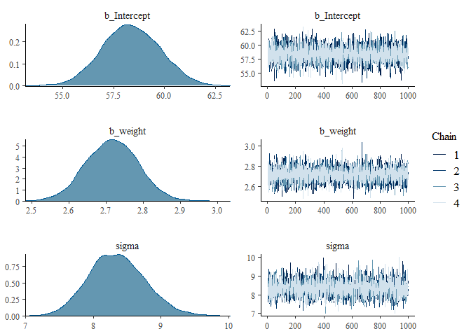
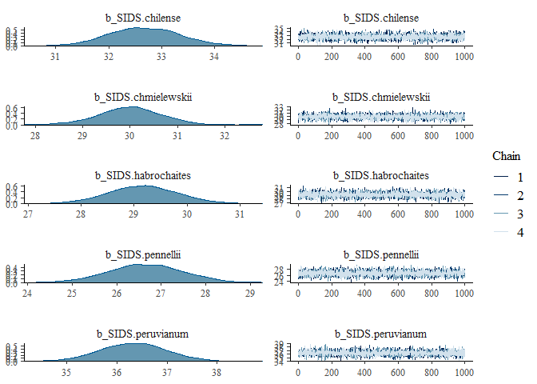

# Assignment


```r
library(rethinking)
```

```
## Loading required package: rstan
```

```
## Loading required package: StanHeaders
```

```
## Loading required package: ggplot2
```

```
## rstan (Version 2.21.2, GitRev: 2e1f913d3ca3)
```

```
## For execution on a local, multicore CPU with excess RAM we recommend calling
## options(mc.cores = parallel::detectCores()).
## To avoid recompilation of unchanged Stan programs, we recommend calling
## rstan_options(auto_write = TRUE)
```

```
## Do not specify '-march=native' in 'LOCAL_CPPFLAGS' or a Makevars file
```

```
## Loading required package: parallel
```

```
## rethinking (Version 2.12)
```

```
## 
## Attaching package: 'rethinking'
```

```
## The following object is masked from 'package:stats':
## 
##     rstudent
```

```r
library(brms)
```

```
## Loading required package: Rcpp
```

```
## Loading 'brms' package (version 2.13.5). Useful instructions
## can be found by typing help('brms'). A more detailed introduction
## to the package is available through vignette('brms_overview').
```

```
## 
## Attaching package: 'brms'
```

```
## The following objects are masked from 'package:rethinking':
## 
##     LOO, stancode, WAIC
```

```
## The following object is masked from 'package:rstan':
## 
##     loo
```

```
## The following object is masked from 'package:stats':
## 
##     ar
```

```r
library(tidyverse)
```

```
## -- Attaching packages --------------------------------------- tidyverse 1.3.0 --
```

```
## √ tibble  3.0.3     √ dplyr   1.0.1
## √ tidyr   1.1.1     √ stringr 1.4.0
## √ readr   1.3.1     √ forcats 0.5.0
## √ purrr   0.3.4
```

```
## -- Conflicts ------------------------------------------ tidyverse_conflicts() --
## x tidyr::extract() masks rstan::extract()
## x dplyr::filter()  masks stats::filter()
## x dplyr::lag()     masks stats::lag()
## x purrr::map()     masks rethinking::map()
```

Revisit the following homework problems and try to fit the with brms.  Make your first attempt without looking at the rethinking to brms translation, but if you get stuck definitely look!  Compare the coefficients or predictions that you obtain with brms and those with quap or ulam.

* 4H1, 4H2 (you probably need the function `posterior_predict()`)

### 4H1, The weights listed below were recorded in the !Kung census, but heights were not recorded for these individuals. Provide predicted heights and 89% intervals (either HPDI or PI) for each of these individuals. That is, fill in the table below, using model-based predictions.

Individual weight expected height 89% interval
1 46.95
2 43.72
3 64.78
4 32.59
5 54.63


```r
weights <- c(46.95,43.72,64.78,32.59,54.63)
```


```r
## change from R code 4.42
# load data again, since it's a long way back
library(rethinking)
data(Howell1)
d <- Howell1
str(d)
```

```
## 'data.frame':	544 obs. of  4 variables:
##  $ height: num  152 140 137 157 145 ...
##  $ weight: num  47.8 36.5 31.9 53 41.3 ...
##  $ age   : num  63 63 65 41 51 35 32 27 19 54 ...
##  $ male  : int  1 0 0 1 0 1 0 1 0 1 ...
```


```r
d2 <- d
str(d2)
```

```
## 'data.frame':	544 obs. of  4 variables:
##  $ height: num  152 140 137 157 145 ...
##  $ weight: num  47.8 36.5 31.9 53 41.3 ...
##  $ age   : num  63 63 65 41 51 35 32 27 19 54 ...
##  $ male  : int  1 0 0 1 0 1 0 1 0 1 ...
```

```r
m4H1brm <- brm(height ~ weight, data=d2,
               prior=c(
                 set_prior("normal(178, 20)", class = "Intercept"),
                 set_prior("lognormal(0,1)", class = "b",lb=0),
                 set_prior("exponential(1)", class = "sigma"))
               )
```

```
## Compiling Stan program...
```

```
## Start sampling
```

```
## 
## SAMPLING FOR MODEL '4f686d4abcd6152a27b0e5a2aad2c9a4' NOW (CHAIN 1).
## Chain 1: 
## Chain 1: Gradient evaluation took 0 seconds
## Chain 1: 1000 transitions using 10 leapfrog steps per transition would take 0 seconds.
## Chain 1: Adjust your expectations accordingly!
## Chain 1: 
## Chain 1: 
## Chain 1: Iteration:    1 / 2000 [  0%]  (Warmup)
## Chain 1: Iteration:  200 / 2000 [ 10%]  (Warmup)
## Chain 1: Iteration:  400 / 2000 [ 20%]  (Warmup)
## Chain 1: Iteration:  600 / 2000 [ 30%]  (Warmup)
## Chain 1: Iteration:  800 / 2000 [ 40%]  (Warmup)
## Chain 1: Iteration: 1000 / 2000 [ 50%]  (Warmup)
## Chain 1: Iteration: 1001 / 2000 [ 50%]  (Sampling)
## Chain 1: Iteration: 1200 / 2000 [ 60%]  (Sampling)
## Chain 1: Iteration: 1400 / 2000 [ 70%]  (Sampling)
## Chain 1: Iteration: 1600 / 2000 [ 80%]  (Sampling)
## Chain 1: Iteration: 1800 / 2000 [ 90%]  (Sampling)
## Chain 1: Iteration: 2000 / 2000 [100%]  (Sampling)
## Chain 1: 
## Chain 1:  Elapsed Time: 0.118 seconds (Warm-up)
## Chain 1:                0.078 seconds (Sampling)
## Chain 1:                0.196 seconds (Total)
## Chain 1: 
## 
## SAMPLING FOR MODEL '4f686d4abcd6152a27b0e5a2aad2c9a4' NOW (CHAIN 2).
## Chain 2: 
## Chain 2: Gradient evaluation took 0 seconds
## Chain 2: 1000 transitions using 10 leapfrog steps per transition would take 0 seconds.
## Chain 2: Adjust your expectations accordingly!
## Chain 2: 
## Chain 2: 
## Chain 2: Iteration:    1 / 2000 [  0%]  (Warmup)
## Chain 2: Iteration:  200 / 2000 [ 10%]  (Warmup)
## Chain 2: Iteration:  400 / 2000 [ 20%]  (Warmup)
## Chain 2: Iteration:  600 / 2000 [ 30%]  (Warmup)
## Chain 2: Iteration:  800 / 2000 [ 40%]  (Warmup)
## Chain 2: Iteration: 1000 / 2000 [ 50%]  (Warmup)
## Chain 2: Iteration: 1001 / 2000 [ 50%]  (Sampling)
## Chain 2: Iteration: 1200 / 2000 [ 60%]  (Sampling)
## Chain 2: Iteration: 1400 / 2000 [ 70%]  (Sampling)
## Chain 2: Iteration: 1600 / 2000 [ 80%]  (Sampling)
## Chain 2: Iteration: 1800 / 2000 [ 90%]  (Sampling)
## Chain 2: Iteration: 2000 / 2000 [100%]  (Sampling)
## Chain 2: 
## Chain 2:  Elapsed Time: 0.125 seconds (Warm-up)
## Chain 2:                0.088 seconds (Sampling)
## Chain 2:                0.213 seconds (Total)
## Chain 2: 
## 
## SAMPLING FOR MODEL '4f686d4abcd6152a27b0e5a2aad2c9a4' NOW (CHAIN 3).
## Chain 3: 
## Chain 3: Gradient evaluation took 0 seconds
## Chain 3: 1000 transitions using 10 leapfrog steps per transition would take 0 seconds.
## Chain 3: Adjust your expectations accordingly!
## Chain 3: 
## Chain 3: 
## Chain 3: Iteration:    1 / 2000 [  0%]  (Warmup)
## Chain 3: Iteration:  200 / 2000 [ 10%]  (Warmup)
## Chain 3: Iteration:  400 / 2000 [ 20%]  (Warmup)
## Chain 3: Iteration:  600 / 2000 [ 30%]  (Warmup)
## Chain 3: Iteration:  800 / 2000 [ 40%]  (Warmup)
## Chain 3: Iteration: 1000 / 2000 [ 50%]  (Warmup)
## Chain 3: Iteration: 1001 / 2000 [ 50%]  (Sampling)
## Chain 3: Iteration: 1200 / 2000 [ 60%]  (Sampling)
## Chain 3: Iteration: 1400 / 2000 [ 70%]  (Sampling)
## Chain 3: Iteration: 1600 / 2000 [ 80%]  (Sampling)
## Chain 3: Iteration: 1800 / 2000 [ 90%]  (Sampling)
## Chain 3: Iteration: 2000 / 2000 [100%]  (Sampling)
## Chain 3: 
## Chain 3:  Elapsed Time: 0.09 seconds (Warm-up)
## Chain 3:                0.063 seconds (Sampling)
## Chain 3:                0.153 seconds (Total)
## Chain 3: 
## 
## SAMPLING FOR MODEL '4f686d4abcd6152a27b0e5a2aad2c9a4' NOW (CHAIN 4).
## Chain 4: 
## Chain 4: Gradient evaluation took 0 seconds
## Chain 4: 1000 transitions using 10 leapfrog steps per transition would take 0 seconds.
## Chain 4: Adjust your expectations accordingly!
## Chain 4: 
## Chain 4: 
## Chain 4: Iteration:    1 / 2000 [  0%]  (Warmup)
## Chain 4: Iteration:  200 / 2000 [ 10%]  (Warmup)
## Chain 4: Iteration:  400 / 2000 [ 20%]  (Warmup)
## Chain 4: Iteration:  600 / 2000 [ 30%]  (Warmup)
## Chain 4: Iteration:  800 / 2000 [ 40%]  (Warmup)
## Chain 4: Iteration: 1000 / 2000 [ 50%]  (Warmup)
## Chain 4: Iteration: 1001 / 2000 [ 50%]  (Sampling)
## Chain 4: Iteration: 1200 / 2000 [ 60%]  (Sampling)
## Chain 4: Iteration: 1400 / 2000 [ 70%]  (Sampling)
## Chain 4: Iteration: 1600 / 2000 [ 80%]  (Sampling)
## Chain 4: Iteration: 1800 / 2000 [ 90%]  (Sampling)
## Chain 4: Iteration: 2000 / 2000 [100%]  (Sampling)
## Chain 4: 
## Chain 4:  Elapsed Time: 0.11 seconds (Warm-up)
## Chain 4:                0.077 seconds (Sampling)
## Chain 4:                0.187 seconds (Total)
## Chain 4:
```

```r
m4H1brm
```

```
##  Family: gaussian 
##   Links: mu = identity; sigma = identity 
## Formula: height ~ weight 
##    Data: d2 (Number of observations: 544) 
## Samples: 4 chains, each with iter = 2000; warmup = 1000; thin = 1;
##          total post-warmup samples = 4000
## 
## Population-Level Effects: 
##           Estimate Est.Error l-95% CI u-95% CI Rhat Bulk_ESS Tail_ESS
## Intercept    75.49      1.05    73.46    77.52 1.00     3650     2825
## weight        1.76      0.03     1.71     1.82 1.00     3916     2896
## 
## Family Specific Parameters: 
##       Estimate Est.Error l-95% CI u-95% CI Rhat Bulk_ESS Tail_ESS
## sigma     9.31      0.28     8.79     9.87 1.00     3803     2772
## 
## Samples were drawn using sampling(NUTS). For each parameter, Bulk_ESS
## and Tail_ESS are effective sample size measures, and Rhat is the potential
## scale reduction factor on split chains (at convergence, Rhat = 1).
```

```r
plot(m4H1brm)
```

<!-- -->


```r
## predicted responses
p_m4H1brm <- predict(m4H1brm, newdata = data.frame(weight=weights))
head(p_m4H1brm)
```

```
##      Estimate Est.Error     Q2.5    Q97.5
## [1,] 158.4481  9.349326 140.5001 176.6525
## [2,] 152.4734  9.269280 134.6502 170.6988
## [3,] 189.6795  9.419969 171.2380 208.2047
## [4,] 133.1888  9.199538 115.5698 151.2295
## [5,] 171.4583  9.189240 153.3233 188.7710
```

```r
pp_m4H1brm <- posterior_predict(m4H1brm, newdata = data.frame(weight=weights))
head(pp_m4H1brm)
```

```
##          [,1]     [,2]     [,3]     [,4]     [,5]
## [1,] 164.2052 149.1159 200.1473 137.3924 163.3048
## [2,] 154.5215 147.4828 204.1276 148.3846 169.6186
## [3,] 165.4908 162.5322 171.8712 147.9591 172.7076
## [4,] 159.3514 161.0935 189.2526 134.9999 179.4298
## [5,] 152.3399 150.3073 189.2246 121.4227 164.0084
## [6,] 158.9320 139.2636 181.9064 135.6389 178.1158
```

### 4H2 Select out all the rows in the Howell1 data with ages below 18 years of age. If you do it right, you should end up with a new data frame with 192 rows in it.


```r
## change from R code 4.42
# load data again, since it's a long way back
library(rethinking)
data(Howell1)
d <- Howell1
d4H2 <- d[ d$age < 18 , ]
str(d4H2)
```

```
## 'data.frame':	192 obs. of  4 variables:
##  $ height: num  121.9 105.4 86.4 129.5 109.2 ...
##  $ weight: num  19.6 13.9 10.5 23.6 16 ...
##  $ age   : num  12 8 6.5 13 7 17 16 11 17 8 ...
##  $ male  : int  1 0 0 1 0 1 0 1 0 1 ...
```
#### (a) Fit a linear regression to these data, using quap. Present and interpret the estimates. For every 10 units of increase in weight, how much taller does the model predict a child gets?


```r
m4H2brm <- brm(height ~ weight, data=d4H2,
               prior=c(
                 set_prior("normal(178, 20)", class = "Intercept"),
                 set_prior("lognormal(0,1)", class = "b",lb=0),
                 set_prior("exponential(1)", class = "sigma"))
               )
```

```
## Compiling Stan program...
```

```
## recompiling to avoid crashing R session
```

```
## Start sampling
```

```
## 
## SAMPLING FOR MODEL '4f686d4abcd6152a27b0e5a2aad2c9a4' NOW (CHAIN 1).
## Chain 1: 
## Chain 1: Gradient evaluation took 0 seconds
## Chain 1: 1000 transitions using 10 leapfrog steps per transition would take 0 seconds.
## Chain 1: Adjust your expectations accordingly!
## Chain 1: 
## Chain 1: 
## Chain 1: Iteration:    1 / 2000 [  0%]  (Warmup)
## Chain 1: Iteration:  200 / 2000 [ 10%]  (Warmup)
## Chain 1: Iteration:  400 / 2000 [ 20%]  (Warmup)
## Chain 1: Iteration:  600 / 2000 [ 30%]  (Warmup)
## Chain 1: Iteration:  800 / 2000 [ 40%]  (Warmup)
## Chain 1: Iteration: 1000 / 2000 [ 50%]  (Warmup)
## Chain 1: Iteration: 1001 / 2000 [ 50%]  (Sampling)
## Chain 1: Iteration: 1200 / 2000 [ 60%]  (Sampling)
## Chain 1: Iteration: 1400 / 2000 [ 70%]  (Sampling)
## Chain 1: Iteration: 1600 / 2000 [ 80%]  (Sampling)
## Chain 1: Iteration: 1800 / 2000 [ 90%]  (Sampling)
## Chain 1: Iteration: 2000 / 2000 [100%]  (Sampling)
## Chain 1: 
## Chain 1:  Elapsed Time: 0.073 seconds (Warm-up)
## Chain 1:                0.057 seconds (Sampling)
## Chain 1:                0.13 seconds (Total)
## Chain 1: 
## 
## SAMPLING FOR MODEL '4f686d4abcd6152a27b0e5a2aad2c9a4' NOW (CHAIN 2).
## Chain 2: 
## Chain 2: Gradient evaluation took 0 seconds
## Chain 2: 1000 transitions using 10 leapfrog steps per transition would take 0 seconds.
## Chain 2: Adjust your expectations accordingly!
## Chain 2: 
## Chain 2: 
## Chain 2: Iteration:    1 / 2000 [  0%]  (Warmup)
## Chain 2: Iteration:  200 / 2000 [ 10%]  (Warmup)
## Chain 2: Iteration:  400 / 2000 [ 20%]  (Warmup)
## Chain 2: Iteration:  600 / 2000 [ 30%]  (Warmup)
## Chain 2: Iteration:  800 / 2000 [ 40%]  (Warmup)
## Chain 2: Iteration: 1000 / 2000 [ 50%]  (Warmup)
## Chain 2: Iteration: 1001 / 2000 [ 50%]  (Sampling)
## Chain 2: Iteration: 1200 / 2000 [ 60%]  (Sampling)
## Chain 2: Iteration: 1400 / 2000 [ 70%]  (Sampling)
## Chain 2: Iteration: 1600 / 2000 [ 80%]  (Sampling)
## Chain 2: Iteration: 1800 / 2000 [ 90%]  (Sampling)
## Chain 2: Iteration: 2000 / 2000 [100%]  (Sampling)
## Chain 2: 
## Chain 2:  Elapsed Time: 0.077 seconds (Warm-up)
## Chain 2:                0.058 seconds (Sampling)
## Chain 2:                0.135 seconds (Total)
## Chain 2: 
## 
## SAMPLING FOR MODEL '4f686d4abcd6152a27b0e5a2aad2c9a4' NOW (CHAIN 3).
## Chain 3: 
## Chain 3: Gradient evaluation took 0 seconds
## Chain 3: 1000 transitions using 10 leapfrog steps per transition would take 0 seconds.
## Chain 3: Adjust your expectations accordingly!
## Chain 3: 
## Chain 3: 
## Chain 3: Iteration:    1 / 2000 [  0%]  (Warmup)
## Chain 3: Iteration:  200 / 2000 [ 10%]  (Warmup)
## Chain 3: Iteration:  400 / 2000 [ 20%]  (Warmup)
## Chain 3: Iteration:  600 / 2000 [ 30%]  (Warmup)
## Chain 3: Iteration:  800 / 2000 [ 40%]  (Warmup)
## Chain 3: Iteration: 1000 / 2000 [ 50%]  (Warmup)
## Chain 3: Iteration: 1001 / 2000 [ 50%]  (Sampling)
## Chain 3: Iteration: 1200 / 2000 [ 60%]  (Sampling)
## Chain 3: Iteration: 1400 / 2000 [ 70%]  (Sampling)
## Chain 3: Iteration: 1600 / 2000 [ 80%]  (Sampling)
## Chain 3: Iteration: 1800 / 2000 [ 90%]  (Sampling)
## Chain 3: Iteration: 2000 / 2000 [100%]  (Sampling)
## Chain 3: 
## Chain 3:  Elapsed Time: 0.135 seconds (Warm-up)
## Chain 3:                0.059 seconds (Sampling)
## Chain 3:                0.194 seconds (Total)
## Chain 3: 
## 
## SAMPLING FOR MODEL '4f686d4abcd6152a27b0e5a2aad2c9a4' NOW (CHAIN 4).
## Chain 4: 
## Chain 4: Gradient evaluation took 0 seconds
## Chain 4: 1000 transitions using 10 leapfrog steps per transition would take 0 seconds.
## Chain 4: Adjust your expectations accordingly!
## Chain 4: 
## Chain 4: 
## Chain 4: Iteration:    1 / 2000 [  0%]  (Warmup)
## Chain 4: Iteration:  200 / 2000 [ 10%]  (Warmup)
## Chain 4: Iteration:  400 / 2000 [ 20%]  (Warmup)
## Chain 4: Iteration:  600 / 2000 [ 30%]  (Warmup)
## Chain 4: Iteration:  800 / 2000 [ 40%]  (Warmup)
## Chain 4: Iteration: 1000 / 2000 [ 50%]  (Warmup)
## Chain 4: Iteration: 1001 / 2000 [ 50%]  (Sampling)
## Chain 4: Iteration: 1200 / 2000 [ 60%]  (Sampling)
## Chain 4: Iteration: 1400 / 2000 [ 70%]  (Sampling)
## Chain 4: Iteration: 1600 / 2000 [ 80%]  (Sampling)
## Chain 4: Iteration: 1800 / 2000 [ 90%]  (Sampling)
## Chain 4: Iteration: 2000 / 2000 [100%]  (Sampling)
## Chain 4: 
## Chain 4:  Elapsed Time: 0.108 seconds (Warm-up)
## Chain 4:                0.045 seconds (Sampling)
## Chain 4:                0.153 seconds (Total)
## Chain 4:
```

```r
m4H2brm
```

```
##  Family: gaussian 
##   Links: mu = identity; sigma = identity 
## Formula: height ~ weight 
##    Data: d4H2 (Number of observations: 192) 
## Samples: 4 chains, each with iter = 2000; warmup = 1000; thin = 1;
##          total post-warmup samples = 4000
## 
## Population-Level Effects: 
##           Estimate Est.Error l-95% CI u-95% CI Rhat Bulk_ESS Tail_ESS
## Intercept    58.37      1.36    55.77    61.00 1.00     4008     2864
## weight        2.72      0.07     2.59     2.85 1.00     4019     2713
## 
## Family Specific Parameters: 
##       Estimate Est.Error l-95% CI u-95% CI Rhat Bulk_ESS Tail_ESS
## sigma     8.36      0.42     7.58     9.23 1.00     3878     2818
## 
## Samples were drawn using sampling(NUTS). For each parameter, Bulk_ESS
## and Tail_ESS are effective sample size measures, and Rhat is the potential
## scale reduction factor on split chains (at convergence, Rhat = 1).
```

```r
plot(m4H2brm)
```

<!-- -->
> For every 10 units of increase in weight, the model predict a child gets 27.2 cm taller.

#### (b) Plot the raw data, with height on the vertical axis and weight on the horizontal axis. Super-impose the MAP regression line and 89% HPDI for the mean. Also superimpose the 89% HPDI for predicted heights.


```r
## change from R code 4.54
# define sequence of weights to compute predictions for
# these values will be on the horizontal axis
weight.seq <- seq( from= min(d4H2$weight) , to= max(d4H2$weight) , by=1 )

## predicted responses
p_m4H2brm <- predict(m4H2brm, newdata = data.frame(weight=weight.seq))
head(p_m4H2brm)
```

```
##      Estimate Est.Error     Q2.5     Q97.5
## [1,] 69.99689  8.455166 52.71844  86.45932
## [2,] 72.84415  8.487955 56.22047  89.02253
## [3,] 75.43517  8.384830 58.86083  92.09113
## [4,] 78.05875  8.314451 61.55646  94.48309
## [5,] 80.82191  8.419815 64.47294  97.64610
## [6,] 83.57391  8.348141 67.04805 100.41237
```

```r
df_p_m4H2brm <- data.frame(p_m4H2brm)
str(df_p_m4H2brm)
```

```
## 'data.frame':	41 obs. of  4 variables:
##  $ Estimate : num  70 72.8 75.4 78.1 80.8 ...
##  $ Est.Error: num  8.46 8.49 8.38 8.31 8.42 ...
##  $ Q2.5     : num  52.7 56.2 58.9 61.6 64.5 ...
##  $ Q97.5    : num  86.5 89 92.1 94.5 97.6 ...
```


```r
## change from R code 4.61
# plot raw data
plot( height ~ weight , d4H2 , col=col.alpha(rangi2,1) )
# draw MAP line
lines( weight.seq , df_p_m4H2brm$Estimate )
# draw HPDI region for line
lines( weight.seq , df_p_m4H2brm$Q2.5 )
lines( weight.seq , df_p_m4H2brm$Q97.5 )
```

<!-- -->


#### (c) What aspects of the model fit concern you? Describe the kinds of assumptions you would change, if any, to improve the model. You don’t have to write any new code. Just explain what the model appears to be doing a bad job of, and what you hypothesize would be a better model.

> I think a parabolic (second order) polynomial would be a better model.


* From chapter 8 I assigned a tomato problem from my data "Use the tomato.csv data set and evaluate whether hypocotyl length ("hyp") is affected by shade ("trt"), species ("species") and their interaction."

#### 1. Use the tomato.csv (attached) data set and evaluate whether hypocotyl length ("hyp") is affected by shade ("trt"), species ("species") and their interaction.


```r
tomato <- read.csv("Tomato.csv")
str(tomato)
```

```
## 'data.frame':	1008 obs. of  25 variables:
##  $ shelf   : chr  "Z" "Z" "Z" "Z" ...
##  $ flat    : int  1 1 1 1 1 1 1 1 1 1 ...
##  $ col     : chr  "B" "C" "D" "E" ...
##  $ row     : int  1 1 1 1 1 1 1 2 2 2 ...
##  $ acs     : chr  "LA2580" "LA1305" "LA1973" "LA2748" ...
##  $ trt     : chr  "H" "H" "H" "H" ...
##  $ days    : int  28 28 28 28 28 28 28 28 28 28 ...
##  $ date    : chr  "5/5/08" "5/5/08" "5/5/08" "5/5/08" ...
##  $ hyp     : num  19.5 31.3 56.6 35.2 35.3 ...
##  $ int1    : num  2.37 3.34 8.43 0.56 0.82 1.07 2.85 2.08 5.43 4.08 ...
##  $ int2    : num  1.59 0.01 2.39 0 0.02 6.69 0.41 0.53 0.81 3.26 ...
##  $ int3    : num  1.87 9.19 6.7 1.6 1.49 5.72 3.79 1.9 3.63 3.49 ...
##  $ int4    : num  0.51 1.62 3.69 0.61 0.46 4.76 3.25 NA 2.66 3.02 ...
##  $ intleng : num  6.34 14.16 21.21 2.77 2.79 ...
##  $ totleng : num  25.8 45.4 77.9 38 38.1 ...
##  $ petleng : num  15.78 12.36 13.05 8.08 7.68 ...
##  $ leafleng: num  30.5 22.9 46.7 26.8 22.4 ...
##  $ leafwid : num  34.4 14 43.8 33.3 23.6 ...
##  $ leafnum : int  5 4 5 5 5 5 5 4 5 5 ...
##  $ ndvi    : int  111 120 110 105 106 132 118 112 107 123 ...
##  $ lat     : num  -9.52 -13.38 -16.23 -20.48 -20.92 ...
##  $ lon     : num  -78 -75.4 -71.7 -70 -69.1 ...
##  $ alt     : int  740 3360 2585 1020 2460 2000 2920 480 75 3540 ...
##  $ species : chr  "S. pennellii" "S. peruvianum" "S. peruvianum" "S. chilense" ...
##  $ who     : chr  "Dan" "Dan" "Dan" "Dan" ...
```

```r
head(tomato)
```

```
##   shelf flat col row    acs trt days   date   hyp int1 int2 int3 int4 intleng
## 1     Z    1   B   1 LA2580   H   28 5/5/08 19.46 2.37 1.59 1.87 0.51    6.34
## 2     Z    1   C   1 LA1305   H   28 5/5/08 31.28 3.34 0.01 9.19 1.62   14.16
## 3     Z    1   D   1 LA1973   H   28 5/5/08 56.65 8.43 2.39 6.70 3.69   21.21
## 4     Z    1   E   1 LA2748   H   28 5/5/08 35.18 0.56 0.00 1.60 0.61    2.77
## 5     Z    1   F   1 LA2931   H   28 5/5/08 35.32 0.82 0.02 1.49 0.46    2.79
## 6     Z    1   G   1 LA1317   H   28 5/5/08 28.74 1.07 6.69 5.72 4.76   18.24
##   totleng petleng leafleng leafwid leafnum ndvi      lat      lon  alt
## 1   25.80   15.78    30.53   34.44       5  111  -9.5167 -78.0083  740
## 2   45.44   12.36    22.93   13.99       4  120 -13.3833 -75.3583 3360
## 3   77.86   13.05    46.71   43.78       5  110 -16.2333 -71.7000 2585
## 4   37.95    8.08    26.82   33.28       5  105 -20.4833 -69.9833 1020
## 5   38.11    7.68    22.40   23.61       5  106 -20.9167 -69.0667 2460
## 6   46.98   23.66    42.35   42.35       5  132 -13.4167 -73.8417 2000
##           species who
## 1    S. pennellii Dan
## 2   S. peruvianum Dan
## 3   S. peruvianum Dan
## 4     S. chilense Dan
## 5     S. chilense Dan
## 6 S. chmielewskii Dan
```


```r
tomato2 <- subset(tomato, select = c(hyp, trt, species))
str(tomato2)
```

```
## 'data.frame':	1008 obs. of  3 variables:
##  $ hyp    : num  19.5 31.3 56.6 35.2 35.3 ...
##  $ trt    : chr  "H" "H" "H" "H" ...
##  $ species: chr  "S. pennellii" "S. peruvianum" "S. peruvianum" "S. chilense" ...
```

```r
head(tomato2)
```

```
##     hyp trt         species
## 1 19.46   H    S. pennellii
## 2 31.28   H   S. peruvianum
## 3 56.65   H   S. peruvianum
## 4 35.18   H     S. chilense
## 5 35.32   H     S. chilense
## 6 28.74   H S. chmielewskii
```


```r
tomato2$SID <- as.numeric(as.factor(tomato2$species))
tomato2$TID <- as.numeric(as.factor(tomato2$trt))-1
str(tomato2)
```

```
## 'data.frame':	1008 obs. of  5 variables:
##  $ hyp    : num  19.5 31.3 56.6 35.2 35.3 ...
##  $ trt    : chr  "H" "H" "H" "H" ...
##  $ species: chr  "S. pennellii" "S. peruvianum" "S. peruvianum" "S. chilense" ...
##  $ SID    : num  4 5 5 1 1 2 3 4 5 5 ...
##  $ TID    : num  0 0 0 0 0 0 0 0 0 0 ...
```

```r
head(tomato2)
```

```
##     hyp trt         species SID TID
## 1 19.46   H    S. pennellii   4   0
## 2 31.28   H   S. peruvianum   5   0
## 3 56.65   H   S. peruvianum   5   0
## 4 35.18   H     S. chilense   1   0
## 5 35.32   H     S. chilense   1   0
## 6 28.74   H S. chmielewskii   2   0
```

```r
summary(tomato2)
```

```
##       hyp            trt              species               SID       
##  Min.   : 6.17   Length:1008        Length:1008        Min.   :1.000  
##  1st Qu.:26.81   Class :character   Class :character   1st Qu.:2.000  
##  Median :32.02   Mode  :character   Mode  :character   Median :3.000  
##  Mean   :33.36                                         Mean   :2.927  
##  3rd Qu.:38.56                                         3rd Qu.:4.000  
##  Max.   :74.60                                         Max.   :5.000  
##       TID        
##  Min.   :0.0000  
##  1st Qu.:0.0000  
##  Median :1.0000  
##  Mean   :0.5089  
##  3rd Qu.:1.0000  
##  Max.   :1.0000
```
#### no interaction model
##### rethinking

```r
tomato_m1 <- quap(
  alist(
    hyp ~ dnorm( mu , sigma ) ,
    mu <- a[SID] + b*TID ,
    a[SID] ~ dnorm( 30 , 5 ) ,
    b ~ dnorm( 0 , 1 ) ,
    sigma ~ dexp( 1 )) ,
    data=tomato2 )
precis(tomato_m1, depth=2)
```

```
##            mean        sd      5.5%     94.5%
## a[1]  32.663133 0.6676470 31.596104 33.730162
## a[2]  29.985745 0.6454225 28.954235 31.017255
## a[3]  29.173825 0.6373834 28.155163 30.192486
## a[4]  26.651505 0.8172813 25.345331 27.957678
## a[5]  36.328284 0.6560458 35.279796 37.376772
## b      4.044584 0.4923935  3.257644  4.831524
## sigma  9.000937 0.1998749  8.681499  9.320376
```


```r
### interaction model
tomato_m2 <- quap(
  alist(
    hyp ~ dnorm( mu , sigma ) ,
    mu <- a[SID] + b*TID + bST[SID]*TID,
    a[SID] ~ dnorm( 30 , 5 ) ,
    b ~ dnorm( 0 , 1 ) ,
    bST[SID] ~ dnorm( 0 , 1 ),
    sigma ~ dexp( 1 )) ,
    data=tomato2 )

precis(tomato_m2, depth=2)
```

```
##               mean        sd       5.5%     94.5%
## a[1]   32.33603547 0.7512657 31.1353678 33.536703
## a[2]   30.36112941 0.7298603 29.1946717 31.527587
## a[3]   29.42598037 0.7093592 28.2922874 30.559673
## a[4]   26.01154694 0.9185975 24.5434507 27.479643
## a[5]   35.97788898 0.7413337 34.7930946 37.162683
## b       3.58215738 0.5852947  2.6467433  4.517571
## bST[1]  1.11954888 0.8112026 -0.1769095  2.416007
## bST[2] -0.27376468 0.8020529 -1.5556001  1.008071
## bST[3] -0.07796379 0.8023524 -1.3602778  1.204350
## bST[4]  1.66407424 0.8581249  0.2926249  3.035524
## bST[5]  1.14965808 0.8061860 -0.1387829  2.438099
## sigma   8.96047252 0.1992948  8.6419610  9.278984
```


##### brms


```r
get_prior(hyp ~ 1 + SID + TID, data=tomato2)
```

```
##                   prior     class coef group resp dpar nlpar bound
## 1                               b                                 
## 2                               b  SID                            
## 3                               b  TID                            
## 4 student_t(3, 32, 8.5) Intercept                                 
## 5  student_t(3, 0, 8.5)     sigma
```

```r
get_prior(hyp ~ 0 + SID + TID, data=tomato2)
```

```
##                  prior class coef group resp dpar nlpar bound
## 1                          b                                 
## 2                          b  SID                            
## 3                          b  TID                            
## 4 student_t(3, 0, 8.5) sigma
```


```r
tomato_m1_brms <-
  brm(data = tomato2, 
      family = gaussian,
      hyp ~ 1 + TID,
      prior = c(prior(normal(30 , 5), class = Intercept),
                prior(normal(0 , 1), class = b),
                prior(exponential(1), class = sigma)),
      iter = 2000, warmup = 1000, chains = 4, cores = 4,
      seed = 8)
```

```
## Compiling Stan program...
```

```
## Start sampling
```

```r
tomato_m1_brms
```

```
##  Family: gaussian 
##   Links: mu = identity; sigma = identity 
## Formula: hyp ~ 1 + TID 
##    Data: tomato2 (Number of observations: 1008) 
## Samples: 4 chains, each with iter = 2000; warmup = 1000; thin = 1;
##          total post-warmup samples = 4000
## 
## Population-Level Effects: 
##           Estimate Est.Error l-95% CI u-95% CI Rhat Bulk_ESS Tail_ESS
## Intercept    31.37      0.40    30.58    32.15 1.00     4041     3271
## TID           3.88      0.52     2.87     4.89 1.00     3703     2905
## 
## Family Specific Parameters: 
##       Estimate Est.Error l-95% CI u-95% CI Rhat Bulk_ESS Tail_ESS
## sigma     9.58      0.22     9.15    10.02 1.00     3763     3082
## 
## Samples were drawn using sampling(NUTS). For each parameter, Bulk_ESS
## and Tail_ESS are effective sample size measures, and Rhat is the potential
## scale reduction factor on split chains (at convergence, Rhat = 1).
```

```r
plot(tomato_m1_brms)
```

<!-- -->


```r
# tomato_m1_brms_2 <-
#   brm(data = tomato2, 
#       family = gaussian,
#       hyp ~ 0 + SID + TID,
#       prior = c(prior(normal(30 , 5), class = b, coef = SID1),
#                 prior(normal(30 , 5), class = b, coef = SID2),
#                 prior(normal(30 , 5), class = b, coef = SID3),
#                 prior(normal(30 , 5), class = b, coef = SID4),
#                 prior(normal(30 , 5), class = b, coef = SID5),
#                 prior(normal(0 , 1), class = b),
#                 prior(exponential(1), class = sigma)),
#       iter = 2000, warmup = 1000, chains = 4, cores = 4,
#       seed = 8)

tomato_m1_brms_2 <-
  brm(data = tomato2, 
      family = gaussian,
      hyp ~ 0 + SID + TID,
      prior = c(prior(normal(30 , 5), class = b , coef = SID),
                prior(normal(0 , 1), class = b, coef = TID),
                prior(exponential(1), class = sigma)),
      iter = 2000, warmup = 1000, chains = 4, cores = 4,
      seed = 8)
```

```
## Compiling Stan program...
```

```
## Start sampling
```

```r
tomato_m1_brms_2
```

```
##  Family: gaussian 
##   Links: mu = identity; sigma = identity 
## Formula: hyp ~ 0 + SID + TID 
##    Data: tomato2 (Number of observations: 1008) 
## Samples: 4 chains, each with iter = 2000; warmup = 1000; thin = 1;
##          total post-warmup samples = 4000
## 
## Population-Level Effects: 
##     Estimate Est.Error l-95% CI u-95% CI Rhat Bulk_ESS Tail_ESS
## SID     8.21      0.18     7.87     8.55 1.00     2704     2589
## TID     8.14      0.68     6.81     9.48 1.00     2697     2787
## 
## Family Specific Parameters: 
##       Estimate Est.Error l-95% CI u-95% CI Rhat Bulk_ESS Tail_ESS
## sigma    15.29      0.35    14.62    15.99 1.00     2630     2254
## 
## Samples were drawn using sampling(NUTS). For each parameter, Bulk_ESS
## and Tail_ESS are effective sample size measures, and Rhat is the potential
## scale reduction factor on split chains (at convergence, Rhat = 1).
```


```r
plot(tomato_m1_brms_2)
```

<!-- -->


* From chapter 9: 8M1 (remember that the problem numbers were offset it is actually called 9M1 in the Nov 24 PDF)

#### 8M1. Re-estimate the terrain ruggedness model from the chapter, but now using a uniform prior and an exponential prior for the standard deviation, sigma. The uniform prior should be dunif(0,10) and the exponential should be dexp(1). Do the different priors have any detectible influence on the posterior distribution?


```r
## R code 9.9
library(rethinking)
data(rugged)
d <- rugged
```


```r
d <- 
  d %>%
  mutate(log_gdp = log(rgdppc_2000))

dd <-
  d %>%
  drop_na(rgdppc_2000) %>% 
  mutate(log_gdp_std = log_gdp / mean(log_gdp),
         rugged_std  = rugged / max(rugged),
         cid         = ifelse(cont_africa == 1, "1", "2")) %>% 
  mutate(rugged_std_c = rugged_std - mean(rugged_std))
```

#### exponential prior


```r
b9.1 <- 
  brm(data = dd, 
      family = gaussian,
      bf(log_gdp_std ~ 0 + a + b * (rugged_std - 0.215), 
         a ~ 0 + cid, 
         b ~ 0 + cid,
         nl = TRUE),
      prior = c(prior(normal(1, 0.1), class = b, coef = cid1, nlpar = a),
                prior(normal(1, 0.1), class = b, coef = cid2, nlpar = a),
                prior(normal(0, 0.3), class = b, coef = cid1, nlpar = b),
                prior(normal(0, 0.3), class = b, coef = cid2, nlpar = b),
                prior(exponential(1), class = sigma)),
      chains = 4, cores = 4,
      seed = 9)
```

```
## Compiling Stan program...
```

```
## Start sampling
```

```r
b9.1
```

```
##  Family: gaussian 
##   Links: mu = identity; sigma = identity 
## Formula: log_gdp_std ~ 0 + a + b * (rugged_std - 0.215) 
##          a ~ 0 + cid
##          b ~ 0 + cid
##    Data: dd (Number of observations: 170) 
## Samples: 4 chains, each with iter = 2000; warmup = 1000; thin = 1;
##          total post-warmup samples = 4000
## 
## Population-Level Effects: 
##        Estimate Est.Error l-95% CI u-95% CI Rhat Bulk_ESS Tail_ESS
## a_cid1     0.89      0.02     0.85     0.92 1.00     4771     3531
## a_cid2     1.05      0.01     1.03     1.07 1.00     4634     3044
## b_cid1     0.13      0.08    -0.02     0.28 1.00     4427     2818
## b_cid2    -0.14      0.06    -0.26    -0.03 1.00     4898     3176
## 
## Family Specific Parameters: 
##       Estimate Est.Error l-95% CI u-95% CI Rhat Bulk_ESS Tail_ESS
## sigma     0.11      0.01     0.10     0.12 1.00     4605     3288
## 
## Samples were drawn using sampling(NUTS). For each parameter, Bulk_ESS
## and Tail_ESS are effective sample size measures, and Rhat is the potential
## scale reduction factor on split chains (at convergence, Rhat = 1).
```

```r
plot(b9.1)
```

<!-- -->


#### The uniform prior should be dunif(0,10)


```r
b9.1_unif <- 
  brm(data = dd, 
      family = gaussian,
      bf(log_gdp_std ~ 0 + a + b * (rugged_std - 0.215), 
         a ~ 0 + cid, 
         b ~ 0 + cid,
         nl = TRUE),
      prior = c(prior(normal(1, 0.1), class = b, coef = cid1, nlpar = a),
                prior(normal(1, 0.1), class = b, coef = cid2, nlpar = a),
                prior(normal(0, 0.3), class = b, coef = cid1, nlpar = b),
                prior(normal(0, 0.3), class = b, coef = cid2, nlpar = b),
                prior(uniform(0,10), class = sigma)),
      chains = 4, cores = 4,
      seed = 9)
```

```
## Warning: It appears as if you have specified an upper bounded prior on a parameter that has no natural upper bound.
## If this is really what you want, please specify argument 'ub' of 'set_prior' appropriately.
## Warning occurred for prior 
## sigma ~ uniform(0, 10)
```

```
## Compiling Stan program...
```

```
## Start sampling
```

```r
b9.1_unif
```

```
##  Family: gaussian 
##   Links: mu = identity; sigma = identity 
## Formula: log_gdp_std ~ 0 + a + b * (rugged_std - 0.215) 
##          a ~ 0 + cid
##          b ~ 0 + cid
##    Data: dd (Number of observations: 170) 
## Samples: 4 chains, each with iter = 2000; warmup = 1000; thin = 1;
##          total post-warmup samples = 4000
## 
## Population-Level Effects: 
##        Estimate Est.Error l-95% CI u-95% CI Rhat Bulk_ESS Tail_ESS
## a_cid1     0.89      0.02     0.86     0.92 1.00     4622     3064
## a_cid2     1.05      0.01     1.03     1.07 1.00     4611     3005
## b_cid1     0.13      0.07    -0.01     0.28 1.00     4247     2849
## b_cid2    -0.14      0.06    -0.25    -0.03 1.00     5140     2960
## 
## Family Specific Parameters: 
##       Estimate Est.Error l-95% CI u-95% CI Rhat Bulk_ESS Tail_ESS
## sigma     0.11      0.01     0.10     0.12 1.00     4552     3271
## 
## Samples were drawn using sampling(NUTS). For each parameter, Bulk_ESS
## and Tail_ESS are effective sample size measures, and Rhat is the potential
## scale reduction factor on split chains (at convergence, Rhat = 1).
```

```r
plot(b9.1_unif)
```

<!-- -->

> It looks like the different priors have no detectible influence on the posterior distribution.
