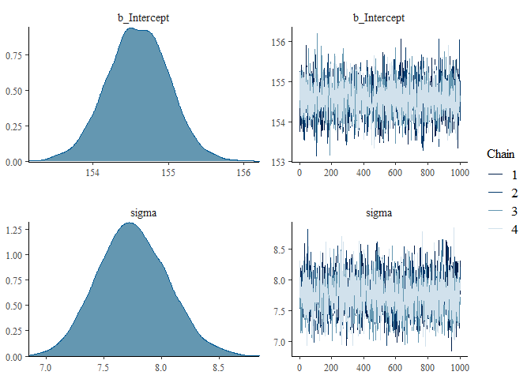
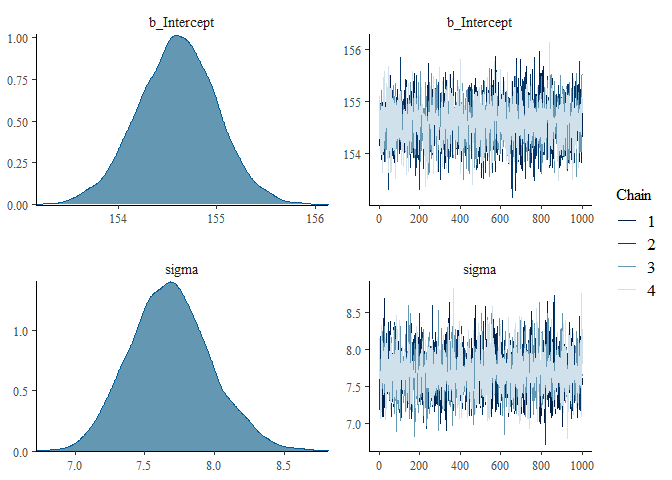

Brms uses the standard R formula notation that you may be familiar with from R and lme4 and fits stan models.  You have options for setting priors, etc.  It also has many kinds of glm models and others bells and whistles.  See links further down.  I will illustrate simplest use with a couple of examples from rethinking.


```r
library(rethinking)
```

```
## Loading required package: rstan
```

```
## Loading required package: StanHeaders
```

```
## Loading required package: ggplot2
```

```
## rstan (Version 2.21.2, GitRev: 2e1f913d3ca3)
```

```
## For execution on a local, multicore CPU with excess RAM we recommend calling
## options(mc.cores = parallel::detectCores()).
## To avoid recompilation of unchanged Stan programs, we recommend calling
## rstan_options(auto_write = TRUE)
```

```
## Do not specify '-march=native' in 'LOCAL_CPPFLAGS' or a Makevars file
```

```
## Loading required package: parallel
```

```
## rethinking (Version 2.12)
```

```
## 
## Attaching package: 'rethinking'
```

```
## The following object is masked from 'package:stats':
## 
##     rstudent
```

```r
library(brms)
```

```
## Loading required package: Rcpp
```

```
## Loading 'brms' package (version 2.13.5). Useful instructions
## can be found by typing help('brms'). A more detailed introduction
## to the package is available through vignette('brms_overview').
```

```
## 
## Attaching package: 'brms'
```

```
## The following objects are masked from 'package:rethinking':
## 
##     LOO, stancode, WAIC
```

```
## The following object is masked from 'package:rstan':
## 
##     loo
```

```
## The following object is masked from 'package:stats':
## 
##     ar
```

```r
library(tidyverse)
```

```
## -- Attaching packages -------------------------------------------------------------------- tidyverse 1.3.0 --
```

```
## √ tibble  3.0.3     √ dplyr   1.0.1
## √ tidyr   1.1.1     √ stringr 1.4.0
## √ readr   1.3.1     √ forcats 0.5.0
## √ purrr   0.3.4
```

```
## -- Conflicts ----------------------------------------------------------------------- tidyverse_conflicts() --
## x tidyr::extract() masks rstan::extract()
## x dplyr::filter()  masks stats::filter()
## x dplyr::lag()     masks stats::lag()
## x purrr::map()     masks rethinking::map()
```

## A simple model from Chapter 4

```r
data("Howell1")
d <- Howell1[Howell1$age>=18,] #match rethinking
```

### Intercept only model.  Let BRMS pick the priors.

The "1" in the model formula stands for the intercept.

```r
m4.1brm <- brm(height~1, data=d)
```

```
## Compiling Stan program...
```

```
## Start sampling
```

```
## 
## SAMPLING FOR MODEL '496a89931924a0b11eb787b5b27cef2e' NOW (CHAIN 1).
## Chain 1: 
## Chain 1: Gradient evaluation took 0 seconds
## Chain 1: 1000 transitions using 10 leapfrog steps per transition would take 0 seconds.
## Chain 1: Adjust your expectations accordingly!
## Chain 1: 
## Chain 1: 
## Chain 1: Iteration:    1 / 2000 [  0%]  (Warmup)
## Chain 1: Iteration:  200 / 2000 [ 10%]  (Warmup)
## Chain 1: Iteration:  400 / 2000 [ 20%]  (Warmup)
## Chain 1: Iteration:  600 / 2000 [ 30%]  (Warmup)
## Chain 1: Iteration:  800 / 2000 [ 40%]  (Warmup)
## Chain 1: Iteration: 1000 / 2000 [ 50%]  (Warmup)
## Chain 1: Iteration: 1001 / 2000 [ 50%]  (Sampling)
## Chain 1: Iteration: 1200 / 2000 [ 60%]  (Sampling)
## Chain 1: Iteration: 1400 / 2000 [ 70%]  (Sampling)
## Chain 1: Iteration: 1600 / 2000 [ 80%]  (Sampling)
## Chain 1: Iteration: 1800 / 2000 [ 90%]  (Sampling)
## Chain 1: Iteration: 2000 / 2000 [100%]  (Sampling)
## Chain 1: 
## Chain 1:  Elapsed Time: 0.082 seconds (Warm-up)
## Chain 1:                0.064 seconds (Sampling)
## Chain 1:                0.146 seconds (Total)
## Chain 1: 
## 
## SAMPLING FOR MODEL '496a89931924a0b11eb787b5b27cef2e' NOW (CHAIN 2).
## Chain 2: 
## Chain 2: Gradient evaluation took 0 seconds
## Chain 2: 1000 transitions using 10 leapfrog steps per transition would take 0 seconds.
## Chain 2: Adjust your expectations accordingly!
## Chain 2: 
## Chain 2: 
## Chain 2: Iteration:    1 / 2000 [  0%]  (Warmup)
## Chain 2: Iteration:  200 / 2000 [ 10%]  (Warmup)
## Chain 2: Iteration:  400 / 2000 [ 20%]  (Warmup)
## Chain 2: Iteration:  600 / 2000 [ 30%]  (Warmup)
## Chain 2: Iteration:  800 / 2000 [ 40%]  (Warmup)
## Chain 2: Iteration: 1000 / 2000 [ 50%]  (Warmup)
## Chain 2: Iteration: 1001 / 2000 [ 50%]  (Sampling)
## Chain 2: Iteration: 1200 / 2000 [ 60%]  (Sampling)
## Chain 2: Iteration: 1400 / 2000 [ 70%]  (Sampling)
## Chain 2: Iteration: 1600 / 2000 [ 80%]  (Sampling)
## Chain 2: Iteration: 1800 / 2000 [ 90%]  (Sampling)
## Chain 2: Iteration: 2000 / 2000 [100%]  (Sampling)
## Chain 2: 
## Chain 2:  Elapsed Time: 0.077 seconds (Warm-up)
## Chain 2:                0.056 seconds (Sampling)
## Chain 2:                0.133 seconds (Total)
## Chain 2: 
## 
## SAMPLING FOR MODEL '496a89931924a0b11eb787b5b27cef2e' NOW (CHAIN 3).
## Chain 3: 
## Chain 3: Gradient evaluation took 0 seconds
## Chain 3: 1000 transitions using 10 leapfrog steps per transition would take 0 seconds.
## Chain 3: Adjust your expectations accordingly!
## Chain 3: 
## Chain 3: 
## Chain 3: Iteration:    1 / 2000 [  0%]  (Warmup)
## Chain 3: Iteration:  200 / 2000 [ 10%]  (Warmup)
## Chain 3: Iteration:  400 / 2000 [ 20%]  (Warmup)
## Chain 3: Iteration:  600 / 2000 [ 30%]  (Warmup)
## Chain 3: Iteration:  800 / 2000 [ 40%]  (Warmup)
## Chain 3: Iteration: 1000 / 2000 [ 50%]  (Warmup)
## Chain 3: Iteration: 1001 / 2000 [ 50%]  (Sampling)
## Chain 3: Iteration: 1200 / 2000 [ 60%]  (Sampling)
## Chain 3: Iteration: 1400 / 2000 [ 70%]  (Sampling)
## Chain 3: Iteration: 1600 / 2000 [ 80%]  (Sampling)
## Chain 3: Iteration: 1800 / 2000 [ 90%]  (Sampling)
## Chain 3: Iteration: 2000 / 2000 [100%]  (Sampling)
## Chain 3: 
## Chain 3:  Elapsed Time: 0.074 seconds (Warm-up)
## Chain 3:                0.069 seconds (Sampling)
## Chain 3:                0.143 seconds (Total)
## Chain 3: 
## 
## SAMPLING FOR MODEL '496a89931924a0b11eb787b5b27cef2e' NOW (CHAIN 4).
## Chain 4: 
## Chain 4: Gradient evaluation took 0 seconds
## Chain 4: 1000 transitions using 10 leapfrog steps per transition would take 0 seconds.
## Chain 4: Adjust your expectations accordingly!
## Chain 4: 
## Chain 4: 
## Chain 4: Iteration:    1 / 2000 [  0%]  (Warmup)
## Chain 4: Iteration:  200 / 2000 [ 10%]  (Warmup)
## Chain 4: Iteration:  400 / 2000 [ 20%]  (Warmup)
## Chain 4: Iteration:  600 / 2000 [ 30%]  (Warmup)
## Chain 4: Iteration:  800 / 2000 [ 40%]  (Warmup)
## Chain 4: Iteration: 1000 / 2000 [ 50%]  (Warmup)
## Chain 4: Iteration: 1001 / 2000 [ 50%]  (Sampling)
## Chain 4: Iteration: 1200 / 2000 [ 60%]  (Sampling)
## Chain 4: Iteration: 1400 / 2000 [ 70%]  (Sampling)
## Chain 4: Iteration: 1600 / 2000 [ 80%]  (Sampling)
## Chain 4: Iteration: 1800 / 2000 [ 90%]  (Sampling)
## Chain 4: Iteration: 2000 / 2000 [100%]  (Sampling)
## Chain 4: 
## Chain 4:  Elapsed Time: 0.08 seconds (Warm-up)
## Chain 4:                0.055 seconds (Sampling)
## Chain 4:                0.135 seconds (Total)
## Chain 4:
```

Take a look at the fit, similar to precis(), just by typing the model name.  You can also use `summary(m4.1brm)` and get the same output

```r
m4.1brm
```

```
##  Family: gaussian 
##   Links: mu = identity; sigma = identity 
## Formula: height ~ 1 
##    Data: d (Number of observations: 352) 
## Samples: 4 chains, each with iter = 2000; warmup = 1000; thin = 1;
##          total post-warmup samples = 4000
## 
## Population-Level Effects: 
##           Estimate Est.Error l-95% CI u-95% CI Rhat Bulk_ESS Tail_ESS
## Intercept   154.59      0.41   153.78   155.38 1.00     4128     2634
## 
## Family Specific Parameters: 
##       Estimate Est.Error l-95% CI u-95% CI Rhat Bulk_ESS Tail_ESS
## sigma     7.75      0.30     7.19     8.37 1.00     3085     2619
## 
## Samples were drawn using sampling(NUTS). For each parameter, Bulk_ESS
## and Tail_ESS are effective sample size measures, and Rhat is the potential
## scale reduction factor on split chains (at convergence, Rhat = 1).
```


```r
summary(m4.1brm)
```

```
##  Family: gaussian 
##   Links: mu = identity; sigma = identity 
## Formula: height ~ 1 
##    Data: d (Number of observations: 352) 
## Samples: 4 chains, each with iter = 2000; warmup = 1000; thin = 1;
##          total post-warmup samples = 4000
## 
## Population-Level Effects: 
##           Estimate Est.Error l-95% CI u-95% CI Rhat Bulk_ESS Tail_ESS
## Intercept   154.59      0.41   153.78   155.38 1.00     4128     2634
## 
## Family Specific Parameters: 
##       Estimate Est.Error l-95% CI u-95% CI Rhat Bulk_ESS Tail_ESS
## sigma     7.75      0.30     7.19     8.37 1.00     3085     2619
## 
## Samples were drawn using sampling(NUTS). For each parameter, Bulk_ESS
## and Tail_ESS are effective sample size measures, and Rhat is the potential
## scale reduction factor on split chains (at convergence, Rhat = 1).
```

we can plot the posterior distributions and chains with:


```r
plot(m4.1brm)
```

<!-- -->

### what priors were used?

`prior_summary()` retrieves the priors from the model.


```r
prior_summary(m4.1brm)
```

```
##                      prior     class coef group resp dpar nlpar bound
## 1 student_t(3, 154.3, 8.5) Intercept                                 
## 2     student_t(3, 0, 8.5)     sigma
```

### what priors could have been set? (can do this before fitting model)

If you want to see your options before fitting a model, use `get_prior()`


```r
get_prior(height ~ 1, data=d)
```

```
##                      prior     class coef group resp dpar nlpar bound
## 1 student_t(3, 154.3, 8.5) Intercept                                 
## 2     student_t(3, 0, 8.5)     sigma
```

### how is brms picking these priors?


```r
mean(d$height)
```

```
## [1] 154.5971
```

```r
sd(d$height)
```

```
## [1] 7.742332
```

Looks like it must be sampling the data

### set your own priors:

I am switching the prior for sigma from m4.1 in the book, because the uniform prior doesn't converge well.


```r
m4.1brm2 <- brm(height ~ 1, data = d,
                prior=c(set_prior("normal(178, 20)", class="Intercept"),
                        set_prior("exponential(1)", class="sigma")))
```

```
## Compiling Stan program...
```

```
## Start sampling
```

```
## 
## SAMPLING FOR MODEL 'efd3faacafc88eecdd661fbfe6d34a42' NOW (CHAIN 1).
## Chain 1: 
## Chain 1: Gradient evaluation took 0 seconds
## Chain 1: 1000 transitions using 10 leapfrog steps per transition would take 0 seconds.
## Chain 1: Adjust your expectations accordingly!
## Chain 1: 
## Chain 1: 
## Chain 1: Iteration:    1 / 2000 [  0%]  (Warmup)
## Chain 1: Iteration:  200 / 2000 [ 10%]  (Warmup)
## Chain 1: Iteration:  400 / 2000 [ 20%]  (Warmup)
## Chain 1: Iteration:  600 / 2000 [ 30%]  (Warmup)
## Chain 1: Iteration:  800 / 2000 [ 40%]  (Warmup)
## Chain 1: Iteration: 1000 / 2000 [ 50%]  (Warmup)
## Chain 1: Iteration: 1001 / 2000 [ 50%]  (Sampling)
## Chain 1: Iteration: 1200 / 2000 [ 60%]  (Sampling)
## Chain 1: Iteration: 1400 / 2000 [ 70%]  (Sampling)
## Chain 1: Iteration: 1600 / 2000 [ 80%]  (Sampling)
## Chain 1: Iteration: 1800 / 2000 [ 90%]  (Sampling)
## Chain 1: Iteration: 2000 / 2000 [100%]  (Sampling)
## Chain 1: 
## Chain 1:  Elapsed Time: 0.08 seconds (Warm-up)
## Chain 1:                0.067 seconds (Sampling)
## Chain 1:                0.147 seconds (Total)
## Chain 1: 
## 
## SAMPLING FOR MODEL 'efd3faacafc88eecdd661fbfe6d34a42' NOW (CHAIN 2).
## Chain 2: 
## Chain 2: Gradient evaluation took 0 seconds
## Chain 2: 1000 transitions using 10 leapfrog steps per transition would take 0 seconds.
## Chain 2: Adjust your expectations accordingly!
## Chain 2: 
## Chain 2: 
## Chain 2: Iteration:    1 / 2000 [  0%]  (Warmup)
## Chain 2: Iteration:  200 / 2000 [ 10%]  (Warmup)
## Chain 2: Iteration:  400 / 2000 [ 20%]  (Warmup)
## Chain 2: Iteration:  600 / 2000 [ 30%]  (Warmup)
## Chain 2: Iteration:  800 / 2000 [ 40%]  (Warmup)
## Chain 2: Iteration: 1000 / 2000 [ 50%]  (Warmup)
## Chain 2: Iteration: 1001 / 2000 [ 50%]  (Sampling)
## Chain 2: Iteration: 1200 / 2000 [ 60%]  (Sampling)
## Chain 2: Iteration: 1400 / 2000 [ 70%]  (Sampling)
## Chain 2: Iteration: 1600 / 2000 [ 80%]  (Sampling)
## Chain 2: Iteration: 1800 / 2000 [ 90%]  (Sampling)
## Chain 2: Iteration: 2000 / 2000 [100%]  (Sampling)
## Chain 2: 
## Chain 2:  Elapsed Time: 0.08 seconds (Warm-up)
## Chain 2:                0.058 seconds (Sampling)
## Chain 2:                0.138 seconds (Total)
## Chain 2: 
## 
## SAMPLING FOR MODEL 'efd3faacafc88eecdd661fbfe6d34a42' NOW (CHAIN 3).
## Chain 3: 
## Chain 3: Gradient evaluation took 0 seconds
## Chain 3: 1000 transitions using 10 leapfrog steps per transition would take 0 seconds.
## Chain 3: Adjust your expectations accordingly!
## Chain 3: 
## Chain 3: 
## Chain 3: Iteration:    1 / 2000 [  0%]  (Warmup)
## Chain 3: Iteration:  200 / 2000 [ 10%]  (Warmup)
## Chain 3: Iteration:  400 / 2000 [ 20%]  (Warmup)
## Chain 3: Iteration:  600 / 2000 [ 30%]  (Warmup)
## Chain 3: Iteration:  800 / 2000 [ 40%]  (Warmup)
## Chain 3: Iteration: 1000 / 2000 [ 50%]  (Warmup)
## Chain 3: Iteration: 1001 / 2000 [ 50%]  (Sampling)
## Chain 3: Iteration: 1200 / 2000 [ 60%]  (Sampling)
## Chain 3: Iteration: 1400 / 2000 [ 70%]  (Sampling)
## Chain 3: Iteration: 1600 / 2000 [ 80%]  (Sampling)
## Chain 3: Iteration: 1800 / 2000 [ 90%]  (Sampling)
## Chain 3: Iteration: 2000 / 2000 [100%]  (Sampling)
## Chain 3: 
## Chain 3:  Elapsed Time: 0.077 seconds (Warm-up)
## Chain 3:                0.055 seconds (Sampling)
## Chain 3:                0.132 seconds (Total)
## Chain 3: 
## 
## SAMPLING FOR MODEL 'efd3faacafc88eecdd661fbfe6d34a42' NOW (CHAIN 4).
## Chain 4: 
## Chain 4: Gradient evaluation took 0 seconds
## Chain 4: 1000 transitions using 10 leapfrog steps per transition would take 0 seconds.
## Chain 4: Adjust your expectations accordingly!
## Chain 4: 
## Chain 4: 
## Chain 4: Iteration:    1 / 2000 [  0%]  (Warmup)
## Chain 4: Iteration:  200 / 2000 [ 10%]  (Warmup)
## Chain 4: Iteration:  400 / 2000 [ 20%]  (Warmup)
## Chain 4: Iteration:  600 / 2000 [ 30%]  (Warmup)
## Chain 4: Iteration:  800 / 2000 [ 40%]  (Warmup)
## Chain 4: Iteration: 1000 / 2000 [ 50%]  (Warmup)
## Chain 4: Iteration: 1001 / 2000 [ 50%]  (Sampling)
## Chain 4: Iteration: 1200 / 2000 [ 60%]  (Sampling)
## Chain 4: Iteration: 1400 / 2000 [ 70%]  (Sampling)
## Chain 4: Iteration: 1600 / 2000 [ 80%]  (Sampling)
## Chain 4: Iteration: 1800 / 2000 [ 90%]  (Sampling)
## Chain 4: Iteration: 2000 / 2000 [100%]  (Sampling)
## Chain 4: 
## Chain 4:  Elapsed Time: 0.08 seconds (Warm-up)
## Chain 4:                0.062 seconds (Sampling)
## Chain 4:                0.142 seconds (Total)
## Chain 4:
```


```r
m4.1brm2
```

```
##  Family: gaussian 
##   Links: mu = identity; sigma = identity 
## Formula: height ~ 1 
##    Data: d (Number of observations: 352) 
## Samples: 4 chains, each with iter = 2000; warmup = 1000; thin = 1;
##          total post-warmup samples = 4000
## 
## Population-Level Effects: 
##           Estimate Est.Error l-95% CI u-95% CI Rhat Bulk_ESS Tail_ESS
## Intercept   154.60      0.40   153.80   155.38 1.00     3631     2874
## 
## Family Specific Parameters: 
##       Estimate Est.Error l-95% CI u-95% CI Rhat Bulk_ESS Tail_ESS
## sigma     7.68      0.29     7.15     8.28 1.00     3245     2623
## 
## Samples were drawn using sampling(NUTS). For each parameter, Bulk_ESS
## and Tail_ESS are effective sample size measures, and Rhat is the potential
## scale reduction factor on split chains (at convergence, Rhat = 1).
```


```r
plot(m4.1brm2)
```

<!-- -->


## Model 4.3

Model 4.3 from the book adds weight as a predictor of height.  Let's start by seeing what prior we could set.


```r
get_prior(height ~ weight, data=d)
```

```
##                      prior     class   coef group resp dpar nlpar bound
## 1                                  b                                   
## 2                                  b weight                            
## 3 student_t(3, 154.3, 8.5) Intercept                                   
## 4     student_t(3, 0, 8.5)     sigma
```

"b" priors are for the slopes.  we can either set for the whole class or specify particular coefficients. In this case since we only have one slope that is the same thing.  Note that no prior is listed!  I am not sure what it ends up using but I am pretty sure it is something inappropriate.  __b priors need to be set in brms__

Note that we specify the distribution for the prior using STAN functions.  You can see what is available in the [STAN manual](https://mc-stan.org/docs/2_24/functions-reference/index.html) (See sections for discrete and continuous distributions)


```r
d2 <- d
d2$weight <- d$weight - mean(d$weight)
m4.3brm <- brm(height ~ weight, data=d2,
               prior=c(
                 set_prior("normal(178, 20)", class = "Intercept"),
                 set_prior("lognormal(0,1)", class = "b",lb=0),
                 set_prior("exponential(1)", class = "sigma"))
               )
```

```
## Compiling Stan program...
```

```
## Start sampling
```

```
## 
## SAMPLING FOR MODEL '4f686d4abcd6152a27b0e5a2aad2c9a4' NOW (CHAIN 1).
## Chain 1: 
## Chain 1: Gradient evaluation took 0.001 seconds
## Chain 1: 1000 transitions using 10 leapfrog steps per transition would take 10 seconds.
## Chain 1: Adjust your expectations accordingly!
## Chain 1: 
## Chain 1: 
## Chain 1: Iteration:    1 / 2000 [  0%]  (Warmup)
## Chain 1: Iteration:  200 / 2000 [ 10%]  (Warmup)
## Chain 1: Iteration:  400 / 2000 [ 20%]  (Warmup)
## Chain 1: Iteration:  600 / 2000 [ 30%]  (Warmup)
## Chain 1: Iteration:  800 / 2000 [ 40%]  (Warmup)
## Chain 1: Iteration: 1000 / 2000 [ 50%]  (Warmup)
## Chain 1: Iteration: 1001 / 2000 [ 50%]  (Sampling)
## Chain 1: Iteration: 1200 / 2000 [ 60%]  (Sampling)
## Chain 1: Iteration: 1400 / 2000 [ 70%]  (Sampling)
## Chain 1: Iteration: 1600 / 2000 [ 80%]  (Sampling)
## Chain 1: Iteration: 1800 / 2000 [ 90%]  (Sampling)
## Chain 1: Iteration: 2000 / 2000 [100%]  (Sampling)
## Chain 1: 
## Chain 1:  Elapsed Time: 0.078 seconds (Warm-up)
## Chain 1:                0.053 seconds (Sampling)
## Chain 1:                0.131 seconds (Total)
## Chain 1: 
## 
## SAMPLING FOR MODEL '4f686d4abcd6152a27b0e5a2aad2c9a4' NOW (CHAIN 2).
## Chain 2: 
## Chain 2: Gradient evaluation took 0 seconds
## Chain 2: 1000 transitions using 10 leapfrog steps per transition would take 0 seconds.
## Chain 2: Adjust your expectations accordingly!
## Chain 2: 
## Chain 2: 
## Chain 2: Iteration:    1 / 2000 [  0%]  (Warmup)
## Chain 2: Iteration:  200 / 2000 [ 10%]  (Warmup)
## Chain 2: Iteration:  400 / 2000 [ 20%]  (Warmup)
## Chain 2: Iteration:  600 / 2000 [ 30%]  (Warmup)
## Chain 2: Iteration:  800 / 2000 [ 40%]  (Warmup)
## Chain 2: Iteration: 1000 / 2000 [ 50%]  (Warmup)
## Chain 2: Iteration: 1001 / 2000 [ 50%]  (Sampling)
## Chain 2: Iteration: 1200 / 2000 [ 60%]  (Sampling)
## Chain 2: Iteration: 1400 / 2000 [ 70%]  (Sampling)
## Chain 2: Iteration: 1600 / 2000 [ 80%]  (Sampling)
## Chain 2: Iteration: 1800 / 2000 [ 90%]  (Sampling)
## Chain 2: Iteration: 2000 / 2000 [100%]  (Sampling)
## Chain 2: 
## Chain 2:  Elapsed Time: 0.081 seconds (Warm-up)
## Chain 2:                0.053 seconds (Sampling)
## Chain 2:                0.134 seconds (Total)
## Chain 2: 
## 
## SAMPLING FOR MODEL '4f686d4abcd6152a27b0e5a2aad2c9a4' NOW (CHAIN 3).
## Chain 3: 
## Chain 3: Gradient evaluation took 0 seconds
## Chain 3: 1000 transitions using 10 leapfrog steps per transition would take 0 seconds.
## Chain 3: Adjust your expectations accordingly!
## Chain 3: 
## Chain 3: 
## Chain 3: Iteration:    1 / 2000 [  0%]  (Warmup)
## Chain 3: Iteration:  200 / 2000 [ 10%]  (Warmup)
## Chain 3: Iteration:  400 / 2000 [ 20%]  (Warmup)
## Chain 3: Iteration:  600 / 2000 [ 30%]  (Warmup)
## Chain 3: Iteration:  800 / 2000 [ 40%]  (Warmup)
## Chain 3: Iteration: 1000 / 2000 [ 50%]  (Warmup)
## Chain 3: Iteration: 1001 / 2000 [ 50%]  (Sampling)
## Chain 3: Iteration: 1200 / 2000 [ 60%]  (Sampling)
## Chain 3: Iteration: 1400 / 2000 [ 70%]  (Sampling)
## Chain 3: Iteration: 1600 / 2000 [ 80%]  (Sampling)
## Chain 3: Iteration: 1800 / 2000 [ 90%]  (Sampling)
## Chain 3: Iteration: 2000 / 2000 [100%]  (Sampling)
## Chain 3: 
## Chain 3:  Elapsed Time: 0.088 seconds (Warm-up)
## Chain 3:                0.049 seconds (Sampling)
## Chain 3:                0.137 seconds (Total)
## Chain 3: 
## 
## SAMPLING FOR MODEL '4f686d4abcd6152a27b0e5a2aad2c9a4' NOW (CHAIN 4).
## Chain 4: 
## Chain 4: Gradient evaluation took 0 seconds
## Chain 4: 1000 transitions using 10 leapfrog steps per transition would take 0 seconds.
## Chain 4: Adjust your expectations accordingly!
## Chain 4: 
## Chain 4: 
## Chain 4: Iteration:    1 / 2000 [  0%]  (Warmup)
## Chain 4: Iteration:  200 / 2000 [ 10%]  (Warmup)
## Chain 4: Iteration:  400 / 2000 [ 20%]  (Warmup)
## Chain 4: Iteration:  600 / 2000 [ 30%]  (Warmup)
## Chain 4: Iteration:  800 / 2000 [ 40%]  (Warmup)
## Chain 4: Iteration: 1000 / 2000 [ 50%]  (Warmup)
## Chain 4: Iteration: 1001 / 2000 [ 50%]  (Sampling)
## Chain 4: Iteration: 1200 / 2000 [ 60%]  (Sampling)
## Chain 4: Iteration: 1400 / 2000 [ 70%]  (Sampling)
## Chain 4: Iteration: 1600 / 2000 [ 80%]  (Sampling)
## Chain 4: Iteration: 1800 / 2000 [ 90%]  (Sampling)
## Chain 4: Iteration: 2000 / 2000 [100%]  (Sampling)
## Chain 4: 
## Chain 4:  Elapsed Time: 0.065 seconds (Warm-up)
## Chain 4:                0.063 seconds (Sampling)
## Chain 4:                0.128 seconds (Total)
## Chain 4:
```


```r
m4.3brm
```

```
##  Family: gaussian 
##   Links: mu = identity; sigma = identity 
## Formula: height ~ weight 
##    Data: d2 (Number of observations: 352) 
## Samples: 4 chains, each with iter = 2000; warmup = 1000; thin = 1;
##          total post-warmup samples = 4000
## 
## Population-Level Effects: 
##           Estimate Est.Error l-95% CI u-95% CI Rhat Bulk_ESS Tail_ESS
## Intercept   154.59      0.27   154.06   155.13 1.00     3904     2788
## weight        0.90      0.04     0.82     0.99 1.00     3794     2830
## 
## Family Specific Parameters: 
##       Estimate Est.Error l-95% CI u-95% CI Rhat Bulk_ESS Tail_ESS
## sigma     5.07      0.18     4.72     5.45 1.00     4198     3247
## 
## Samples were drawn using sampling(NUTS). For each parameter, Bulk_ESS
## and Tail_ESS are effective sample size measures, and Rhat is the potential
## scale reduction factor on split chains (at convergence, Rhat = 1).
```


```r
plot(m4.3brm)
```

<!-- -->

## Resources

### brms help functions
The brms help functions are *very* detailed and helpful:


```r
?brm
```

```
## starting httpd help server ... done
```

```r
?brmsformula
?set_prior
```

### brms vignettes
The vignettes may be a bit much too swallow at once but they can also be helpful.


```r
vignette(package="brms")
```

### online tutorial
Rens Van de Schoot has a series of online tutorials that look quite accessible and helpful:

[getting started](https://www.rensvandeschoot.com/tutorials/brms-started/)  
[priors](https://www.rensvandeschoot.com/tutorials/brms-priors/)  
[when to worry](https://www.rensvandeschoot.com/brms-wambs/)  
[glm](https://www.rensvandeschoot.com/tutorials/generalised-linear-models-with-brms/)

### brms and rethinking

The second edition of rethinking has been [partially translated into brms] (https://bookdown.org/content/4857/)

The first edition of rethinking has been [translated into brms](https://bookdown.org/connect/#/apps/1850/access)


# Assignment

Revisit the following homework problems and try to fit the with brms.  Make your first attempt without looking at the rethinking to brms translation, but if you get stuck definitely look!  Compare the coefficients or predictions that you obtain with brms and those with quap or ulam.

* 4H1, 4H2 (you probably need the function `posterior_predict()`)
* From chapter 8 I assigned a tomato problem from my data "Use the tomato.csv data set and evaluate whether hypocotyl length ("hyp") is affected by shade ("trt"), species ("species") and their interaction."
* From chapter 9: 8M1 (remember that the problem numbers were offset it is actually called 9M1 in the Nov 24 PDF)

