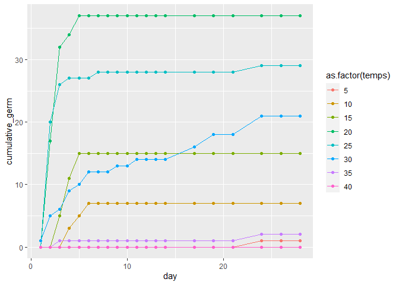
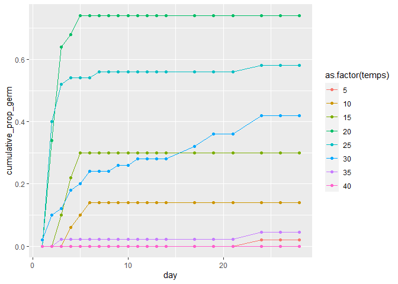
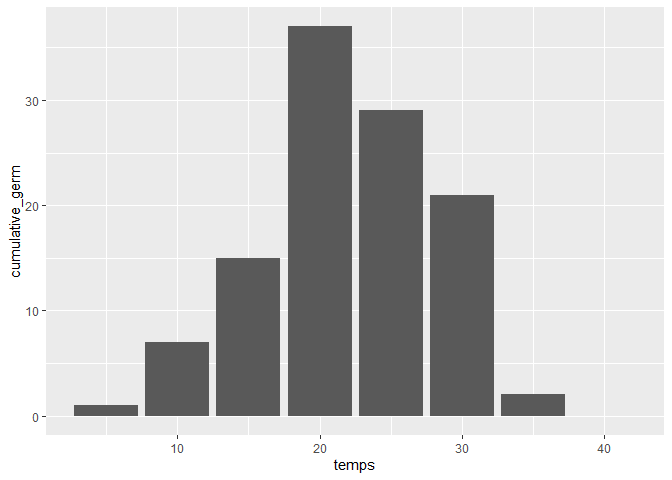
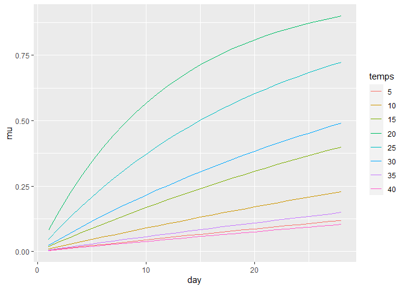
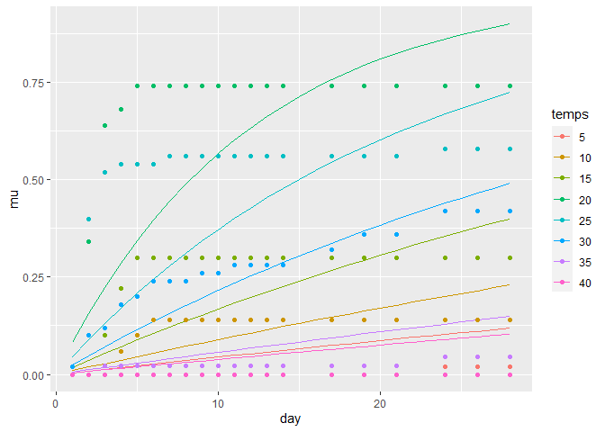

```r
library(rethinking)
```

```
## Loading required package: rstan
```

```
## Loading required package: StanHeaders
```

```
## Loading required package: ggplot2
```

```
## rstan (Version 2.21.2, GitRev: 2e1f913d3ca3)
```

```
## For execution on a local, multicore CPU with excess RAM we recommend calling
## options(mc.cores = parallel::detectCores()).
## To avoid recompilation of unchanged Stan programs, we recommend calling
## rstan_options(auto_write = TRUE)
```

```
## Do not specify '-march=native' in 'LOCAL_CPPFLAGS' or a Makevars file
```

```
## Loading required package: parallel
```

```
## rethinking (Version 2.12)
```

```
## 
## Attaching package: 'rethinking'
```

```
## The following object is masked from 'package:stats':
## 
##     rstudent
```

```r
library(brms)
```

```
## Loading required package: Rcpp
```

```
## Loading 'brms' package (version 2.13.5). Useful instructions
## can be found by typing help('brms'). A more detailed introduction
## to the package is available through vignette('brms_overview').
```

```
## 
## Attaching package: 'brms'
```

```
## The following objects are masked from 'package:rethinking':
## 
##     LOO, stancode, WAIC
```

```
## The following object is masked from 'package:rstan':
## 
##     loo
```

```
## The following object is masked from 'package:stats':
## 
##     ar
```

```r
library(tidyverse)
```

```
## -- Attaching packages --------------------------------------- tidyverse 1.3.0 --
```

```
## √ tibble  3.0.3     √ dplyr   1.0.1
## √ tidyr   1.1.1     √ stringr 1.4.0
## √ readr   1.3.1     √ forcats 0.5.0
## √ purrr   0.3.4
```

```
## -- Conflicts ------------------------------------------ tidyverse_conflicts() --
## x tidyr::extract() masks rstan::extract()
## x dplyr::filter()  masks stats::filter()
## x dplyr::lag()     masks stats::lag()
## x purrr::map()     masks rethinking::map()
```


```r
data <- read_csv("light_round1_tall.csv")
```

```
## Parsed with column specification:
## cols(
##   pops = col_character(),
##   temps = col_double(),
##   wps = col_double(),
##   date = col_character(),
##   total_seeds = col_double(),
##   germ = col_double(),
##   start_date = col_date(format = ""),
##   census_date = col_date(format = ""),
##   day = col_double(),
##   cumulative_germ = col_double(),
##   cumulative_prop_germ = col_double()
## )
```

```r
head(data)
```

```
## # A tibble: 6 x 11
##   pops  temps   wps date  total_seeds  germ start_date census_date   day
##   <chr> <dbl> <dbl> <chr>       <dbl> <dbl> <date>     <date>      <dbl>
## 1 CAAM      5  -0.6 June~          50     0 2020-06-05 2020-06-06      1
## 2 CAAM      5  -0.6 June~          50     0 2020-06-05 2020-06-07      2
## 3 CAAM      5  -0.6 June~          50     0 2020-06-05 2020-06-08      3
## 4 CAAM      5  -0.6 June~          50     0 2020-06-05 2020-06-09      4
## 5 CAAM      5  -0.6 June~          50     0 2020-06-05 2020-06-10      5
## 6 CAAM      5  -0.6 June~          50     0 2020-06-05 2020-06-11      6
## # ... with 2 more variables: cumulative_germ <dbl>, cumulative_prop_germ <dbl>
```

```r
summary(data)
```

```
##      pops               temps            wps           date          
##  Length:11520       Min.   : 5.00   Min.   :-0.6   Length:11520      
##  Class :character   1st Qu.:13.75   1st Qu.:-0.6   Class :character  
##  Mode  :character   Median :22.50   Median :-0.3   Mode  :character  
##                     Mean   :22.50   Mean   :-0.3                     
##                     3rd Qu.:31.25   3rd Qu.: 0.0                     
##                     Max.   :40.00   Max.   : 0.0                     
##   total_seeds         germ           start_date          census_date        
##  Min.   :30.00   Min.   : 0.0000   Min.   :2020-06-05   Min.   :2020-06-06  
##  1st Qu.:48.00   1st Qu.: 0.0000   1st Qu.:2020-06-05   1st Qu.:2020-06-10  
##  Median :50.00   Median : 0.0000   Median :2020-06-05   Median :2020-06-15  
##  Mean   :47.57   Mean   : 0.3348   Mean   :2020-06-05   Mean   :2020-06-17  
##  3rd Qu.:50.00   3rd Qu.: 0.0000   3rd Qu.:2020-06-05   3rd Qu.:2020-06-22  
##  Max.   :52.00   Max.   :36.0000   Max.   :2020-06-05   Max.   :2020-07-03  
##       day        cumulative_germ  cumulative_prop_germ
##  Min.   : 1.00   Min.   : 0.000   Min.   :0.00000     
##  1st Qu.: 5.75   1st Qu.: 0.000   1st Qu.:0.00000     
##  Median :10.50   Median : 0.000   Median :0.00000     
##  Mean   :12.00   Mean   : 4.639   Mean   :0.09955     
##  3rd Qu.:17.50   3rd Qu.: 4.000   3rd Qu.:0.08000     
##  Max.   :28.00   Max.   :51.000   Max.   :1.02857
```

```r
str(data)
```

```
## tibble [11,520 x 11] (S3: spec_tbl_df/tbl_df/tbl/data.frame)
##  $ pops                : chr [1:11520] "CAAM" "CAAM" "CAAM" "CAAM" ...
##  $ temps               : num [1:11520] 5 5 5 5 5 5 5 5 5 5 ...
##  $ wps                 : num [1:11520] -0.6 -0.6 -0.6 -0.6 -0.6 -0.6 -0.6 -0.6 -0.6 -0.6 ...
##  $ date                : chr [1:11520] "June_6_2020" "June_7_2020" "June_8_2020" "June_9_2020" ...
##  $ total_seeds         : num [1:11520] 50 50 50 50 50 50 50 50 50 50 ...
##  $ germ                : num [1:11520] 0 0 0 0 0 0 0 0 0 0 ...
##  $ start_date          : Date[1:11520], format: "2020-06-05" "2020-06-05" ...
##  $ census_date         : Date[1:11520], format: "2020-06-06" "2020-06-07" ...
##  $ day                 : num [1:11520] 1 2 3 4 5 6 7 8 9 10 ...
##  $ cumulative_germ     : num [1:11520] 0 0 0 0 0 0 0 0 0 0 ...
##  $ cumulative_prop_germ: num [1:11520] 0 0 0 0 0 0 0 0 0 0 ...
##  - attr(*, "spec")=
##   .. cols(
##   ..   pops = col_character(),
##   ..   temps = col_double(),
##   ..   wps = col_double(),
##   ..   date = col_character(),
##   ..   total_seeds = col_double(),
##   ..   germ = col_double(),
##   ..   start_date = col_date(format = ""),
##   ..   census_date = col_date(format = ""),
##   ..   day = col_double(),
##   ..   cumulative_germ = col_double(),
##   ..   cumulative_prop_germ = col_double()
##   .. )
```
The Maloof, Gremer, Schmitt, and Strauss labs have a joint project examining variation in life history traits and adaptation in a group of Sierra wildflower species known as Jewelflowers, from the genus Streptanthus and related species.

As part of this project we (meaning Megan with help from many others including John) examined how different species germination rate is affected by tempserature and water potential.

The data for water potential zero is shown in this plot:

Each subplot is a different population. Species are denoted by the four letters (e.g. CAAM).  Numbers are appended when there are more than one population per species (e.g. STPO1, STPO2, STPO3).  Different colored lines represent different species.

For this week's assignment we want to model the effect of tempserature on germination rate for the different species/populations.

Handcuffs are off, I am going to let you decide what types of models to use.  (But you might want to look at 11.4 "Censoring and Survival" and 12.1 "Over-dispersed counts" and maybe 12.2 "Zero-inflated outcomes".).  

In the data sheet:

pops: species/population
temps: tempserature
wps: water potential
date: date of observation
total_seeds: number of seeds plated for the experiment
germ: the number of germinants found on this day
day: day of the observation relative to start date of the experiment

### 1.  Subset the data to only include wps==0.  We may look at water potential in a future week.


```r
data_wps0 <- data %>%
  filter(wps == 0)
head(data_wps0)
```

```
## # A tibble: 6 x 11
##   pops  temps   wps date  total_seeds  germ start_date census_date   day
##   <chr> <dbl> <dbl> <chr>       <dbl> <dbl> <date>     <date>      <dbl>
## 1 CAAM      5     0 June~          50     0 2020-06-05 2020-06-06      1
## 2 CAAM      5     0 June~          50     0 2020-06-05 2020-06-07      2
## 3 CAAM      5     0 June~          50     0 2020-06-05 2020-06-08      3
## 4 CAAM      5     0 June~          50     0 2020-06-05 2020-06-09      4
## 5 CAAM      5     0 June~          50     0 2020-06-05 2020-06-10      5
## 6 CAAM      5     0 June~          50     0 2020-06-05 2020-06-11      6
## # ... with 2 more variables: cumulative_germ <dbl>, cumulative_prop_germ <dbl>
```

```r
summary(data_wps0)
```

```
##      pops               temps            wps        date          
##  Length:3840        Min.   : 5.00   Min.   :0   Length:3840       
##  Class :character   1st Qu.:13.75   1st Qu.:0   Class :character  
##  Mode  :character   Median :22.50   Median :0   Mode  :character  
##                     Mean   :22.50   Mean   :0                     
##                     3rd Qu.:31.25   3rd Qu.:0                     
##                     Max.   :40.00   Max.   :0                     
##   total_seeds         germ           start_date          census_date        
##  Min.   :30.00   Min.   : 0.0000   Min.   :2020-06-05   Min.   :2020-06-06  
##  1st Qu.:48.00   1st Qu.: 0.0000   1st Qu.:2020-06-05   1st Qu.:2020-06-10  
##  Median :50.00   Median : 0.0000   Median :2020-06-05   Median :2020-06-15  
##  Mean   :47.49   Mean   : 0.6815   Mean   :2020-06-05   Mean   :2020-06-17  
##  3rd Qu.:50.00   3rd Qu.: 0.0000   3rd Qu.:2020-06-05   3rd Qu.:2020-06-22  
##  Max.   :52.00   Max.   :36.0000   Max.   :2020-06-05   Max.   :2020-07-03  
##       day        cumulative_germ  cumulative_prop_germ
##  Min.   : 1.00   Min.   : 0.000   Min.   :0.0000      
##  1st Qu.: 5.75   1st Qu.: 0.000   1st Qu.:0.0000      
##  Median :10.50   Median : 3.000   Median :0.0600      
##  Mean   :12.00   Mean   : 9.577   Mean   :0.2061      
##  3rd Qu.:17.50   3rd Qu.:15.000   3rd Qu.:0.3200      
##  Max.   :28.00   Max.   :51.000   Max.   :1.0286
```

```r
str(data_wps0)
```

```
## tibble [3,840 x 11] (S3: spec_tbl_df/tbl_df/tbl/data.frame)
##  $ pops                : chr [1:3840] "CAAM" "CAAM" "CAAM" "CAAM" ...
##  $ temps               : num [1:3840] 5 5 5 5 5 5 5 5 5 5 ...
##  $ wps                 : num [1:3840] 0 0 0 0 0 0 0 0 0 0 ...
##  $ date                : chr [1:3840] "June_6_2020" "June_7_2020" "June_8_2020" "June_9_2020" ...
##  $ total_seeds         : num [1:3840] 50 50 50 50 50 50 50 50 50 50 ...
##  $ germ                : num [1:3840] 0 0 0 0 0 0 0 0 0 0 ...
##  $ start_date          : Date[1:3840], format: "2020-06-05" "2020-06-05" ...
##  $ census_date         : Date[1:3840], format: "2020-06-06" "2020-06-07" ...
##  $ day                 : num [1:3840] 1 2 3 4 5 6 7 8 9 10 ...
##  $ cumulative_germ     : num [1:3840] 0 0 0 0 0 0 0 0 0 0 ...
##  $ cumulative_prop_germ: num [1:3840] 0 0 0 0 0 0 0 0 0 0 ...
##  - attr(*, "spec")=
##   .. cols(
##   ..   pops = col_character(),
##   ..   temps = col_double(),
##   ..   wps = col_double(),
##   ..   date = col_character(),
##   ..   total_seeds = col_double(),
##   ..   germ = col_double(),
##   ..   start_date = col_date(format = ""),
##   ..   census_date = col_date(format = ""),
##   ..   day = col_double(),
##   ..   cumulative_germ = col_double(),
##   ..   cumulative_prop_germ = col_double()
##   .. )
```


### 2. Let's start with a single pop "STDI".  Evaluate models relate germination rate to tempserature.  Explain your model choice and prior choice.  Try to do this both with ulam and brm.


```r
data_wps0_STDI <- data_wps0 %>%
  filter(pops == "STDI")
head(data_wps0_STDI)
```

```
## # A tibble: 6 x 11
##   pops  temps   wps date  total_seeds  germ start_date census_date   day
##   <chr> <dbl> <dbl> <chr>       <dbl> <dbl> <date>     <date>      <dbl>
## 1 STDI      5     0 June~          50     0 2020-06-05 2020-06-06      1
## 2 STDI      5     0 June~          50     0 2020-06-05 2020-06-07      2
## 3 STDI      5     0 June~          50     0 2020-06-05 2020-06-08      3
## 4 STDI      5     0 June~          50     0 2020-06-05 2020-06-09      4
## 5 STDI      5     0 June~          50     0 2020-06-05 2020-06-10      5
## 6 STDI      5     0 June~          50     0 2020-06-05 2020-06-11      6
## # ... with 2 more variables: cumulative_germ <dbl>, cumulative_prop_germ <dbl>
```

```r
summary(data_wps0_STDI)
```

```
##      pops               temps            wps        date          
##  Length:160         Min.   : 5.00   Min.   :0   Length:160        
##  Class :character   1st Qu.:13.75   1st Qu.:0   Class :character  
##  Mode  :character   Median :22.50   Median :0   Mode  :character  
##                     Mean   :22.50   Mean   :0                     
##                     3rd Qu.:31.25   3rd Qu.:0                     
##                     Max.   :40.00   Max.   :0                     
##   total_seeds        germ        start_date          census_date        
##  Min.   :45.0   Min.   : 0.0   Min.   :2020-06-05   Min.   :2020-06-06  
##  1st Qu.:50.0   1st Qu.: 0.0   1st Qu.:2020-06-05   1st Qu.:2020-06-10  
##  Median :50.0   Median : 0.0   Median :2020-06-05   Median :2020-06-15  
##  Mean   :49.5   Mean   : 0.7   Mean   :2020-06-05   Mean   :2020-06-17  
##  3rd Qu.:50.0   3rd Qu.: 0.0   3rd Qu.:2020-06-05   3rd Qu.:2020-06-22  
##  Max.   :51.0   Max.   :20.0   Max.   :2020-06-05   Max.   :2020-07-03  
##       day        cumulative_germ cumulative_prop_germ
##  Min.   : 1.00   Min.   : 0.00   Min.   :0.000       
##  1st Qu.: 5.75   1st Qu.: 0.00   1st Qu.:0.000       
##  Median :10.50   Median : 7.00   Median :0.140       
##  Mean   :12.00   Mean   :11.59   Mean   :0.232       
##  3rd Qu.:17.50   3rd Qu.:18.50   3rd Qu.:0.370       
##  Max.   :28.00   Max.   :37.00   Max.   :0.740
```

```r
str(data_wps0_STDI)
```

```
## tibble [160 x 11] (S3: spec_tbl_df/tbl_df/tbl/data.frame)
##  $ pops                : chr [1:160] "STDI" "STDI" "STDI" "STDI" ...
##  $ temps               : num [1:160] 5 5 5 5 5 5 5 5 5 5 ...
##  $ wps                 : num [1:160] 0 0 0 0 0 0 0 0 0 0 ...
##  $ date                : chr [1:160] "June_6_2020" "June_7_2020" "June_8_2020" "June_9_2020" ...
##  $ total_seeds         : num [1:160] 50 50 50 50 50 50 50 50 50 50 ...
##  $ germ                : num [1:160] 0 0 0 0 0 0 0 0 0 0 ...
##  $ start_date          : Date[1:160], format: "2020-06-05" "2020-06-05" ...
##  $ census_date         : Date[1:160], format: "2020-06-06" "2020-06-07" ...
##  $ day                 : num [1:160] 1 2 3 4 5 6 7 8 9 10 ...
##  $ cumulative_germ     : num [1:160] 0 0 0 0 0 0 0 0 0 0 ...
##  $ cumulative_prop_germ: num [1:160] 0 0 0 0 0 0 0 0 0 0 ...
##  - attr(*, "spec")=
##   .. cols(
##   ..   pops = col_character(),
##   ..   temps = col_double(),
##   ..   wps = col_double(),
##   ..   date = col_character(),
##   ..   total_seeds = col_double(),
##   ..   germ = col_double(),
##   ..   start_date = col_date(format = ""),
##   ..   census_date = col_date(format = ""),
##   ..   day = col_double(),
##   ..   cumulative_germ = col_double(),
##   ..   cumulative_prop_germ = col_double()
##   .. )
```

```r
ggplot(data_wps0_STDI, aes(x = day, y = cumulative_germ, color = as.factor(temps))) +
  geom_line() +
  geom_point()
```

<!-- -->

```r
ggplot(data_wps0_STDI, aes(x = day, y = cumulative_prop_germ, color = as.factor(temps))) +
  geom_line() +
  geom_point()
```

<!-- -->

```r
data_wps0_STDI %>% filter(day==28) %>%
  ggplot(aes(x=temps,y=cumulative_germ)) +
  geom_col()
```

<!-- -->

we need one event per row:


```r
one_per_row <- function(df) {
  total_seed <- max(df$total_seeds, sum(df$germ))
  newdata <- tibble(id=1:total_seed, germ=0, day=max(df$day))
  df <- df %>% filter(germ>0)
  count <- 1
  if (nrow(df) > 0) {
    for (i in 1:nrow(df)) { # we look at each row of the df where dataination occured
      for (j in 1:df$germ[i]) { # now update the newdata to reflect the germiantion of each seed
        newdata$germ[count] <- 1
        newdata$day[count]=df$day[i]
        count <- count+1 # count keeps track of which individual we are at in the new data
      } # for j
    } # for i
  } # if 
  return(newdata)
}
data_wps0_one <- data_wps0 %>% group_by(pops, temps) %>%
  select(-cumulative_germ) %>% # not needed in this encoding (I think...in any case would need to be recalculated)
  nest() %>%
  mutate(newdata=map(data, one_per_row)) %>%
  select(-data) %>%
  unnest(newdata)
head(data_wps0_one)
```

```
## # A tibble: 6 x 5
## # Groups:   pops, temps [1]
##   pops  temps    id  germ   day
##   <chr> <dbl> <int> <dbl> <dbl>
## 1 CAAM      5     1     0    28
## 2 CAAM      5     2     0    28
## 3 CAAM      5     3     0    28
## 4 CAAM      5     4     0    28
## 5 CAAM      5     5     0    28
## 6 CAAM      5     6     0    28
```

```r
summary(data_wps0_one)
```

```
##      pops               temps             id             germ      
##  Length:9120        Min.   : 5.00   Min.   : 1.00   Min.   :0.000  
##  Class :character   1st Qu.:10.00   1st Qu.:12.00   1st Qu.:0.000  
##  Mode  :character   Median :20.00   Median :24.00   Median :0.000  
##                     Mean   :22.47   Mean   :24.53   Mean   :0.287  
##                     3rd Qu.:30.00   3rd Qu.:36.00   3rd Qu.:1.000  
##                     Max.   :40.00   Max.   :52.00   Max.   :1.000  
##       day       
##  Min.   : 1.00  
##  1st Qu.:17.00  
##  Median :28.00  
##  Mean   :22.13  
##  3rd Qu.:28.00  
##  Max.   :28.00
```


```r
data_wps0_one_STDI <- data_wps0_one %>% filter(pops=="STDI") %>% select(-pops)
```

```
## Adding missing grouping variables: `pops`
```

```r
head(data_wps0_one_STDI)
```

```
## # A tibble: 6 x 5
## # Groups:   pops, temps [1]
##   pops  temps    id  germ   day
##   <chr> <dbl> <int> <dbl> <dbl>
## 1 STDI      5     1     1    24
## 2 STDI      5     2     0    28
## 3 STDI      5     3     0    28
## 4 STDI      5     4     0    28
## 5 STDI      5     5     0    28
## 6 STDI      5     6     0    28
```

```r
summary(data_wps0_one_STDI)
```

```
##      pops               temps             id             germ       
##  Length:396         Min.   : 5.00   Min.   : 1.00   Min.   :0.0000  
##  Class :character   1st Qu.:10.00   1st Qu.:13.00   1st Qu.:0.0000  
##  Mode  :character   Median :20.00   Median :25.00   Median :0.0000  
##                     Mean   :22.39   Mean   :25.28   Mean   :0.2828  
##                     3rd Qu.:30.00   3rd Qu.:38.00   3rd Qu.:1.0000  
##                     Max.   :40.00   Max.   :51.00   Max.   :1.0000  
##       day       
##  Min.   : 1.00  
##  1st Qu.: 6.75  
##  Median :28.00  
##  Mean   :21.45  
##  3rd Qu.:28.00  
##  Max.   :28.00
```
### rethinking


```r
d <- list(Germ=data_wps0_one_STDI$germ, 
          temps=as.numeric(as.factor(data_wps0_one_STDI$temps)),
          day=data_wps0_one_STDI$day)

m1.1 <- ulam(
  alist(
    day | Germ==1 ~ exponential(lambda),
    day | Germ==0 ~ custom(exponential_lccdf( !Y | lambda)),
    lambda <- 1.0 / mu,
    log(mu) <- a[temps],
    a[temps] ~ normal(0,1)),
  data=d,
  chains=4,
  cores = 4
)
```

```r
precis(m1.1, depth = 2)
```

```
##          mean        sd     5.5%    94.5%    n_eff     Rhat4
## a[1] 5.457889 0.3721182 4.874856 6.079145 2766.998 0.9999888
## a[2] 4.705495 0.2764061 4.296728 5.164966 2498.618 0.9990268
## a[3] 4.017186 0.2226241 3.671710 4.389019 3471.161 0.9992897
## a[4] 2.482551 0.1547057 2.238061 2.735978 2747.590 0.9989293
## a[5] 3.075516 0.1788976 2.793412 3.371609 3026.177 0.9993456
## a[6] 3.732168 0.1913776 3.435928 4.053981 3946.893 0.9993816
## a[7] 5.205300 0.3498490 4.669308 5.802501 3768.380 0.9985425
## a[8] 5.620160 0.4115947 4.998236 6.337103 4155.930 0.9983700
```

The above represent log(mean time to germination)


```r
exp(5.45)
```

```
## [1] 232.7582
```

```r
exp(2.48)
```

```
## [1] 11.94126
```

posterior

```r
preddata <- expand_grid(temps=1:8, day=1:28)
pred <- link(m1.1, data = preddata)
str(pred)
```

```
## List of 2
##  $ lambda: num [1:2000, 1:224] 0.0059 0.00352 0.00514 0.00436 0.00558 ...
##  $ mu    : num [1:2000, 1:224] 169 284 194 229 179 ...
```

mu is average day to germ, lambda is rate parameter.  neither change over time, of course, so having day doesn't really make sense.


```r
preddata$mu <- apply(pred$mu,2,mean)
preddata$low <- apply(pred$mu,2,HPDI)[1,]
preddata$high <- apply(pred$mu, 2, HPDI)[2,]
```

Single temps.  Don't need day
posterior

```r
preddata <- expand_grid(temps=3)
pred <- link(m1.1, data = preddata)
str(pred)
```

```
## List of 2
##  $ lambda: num [1:2000, 1] 0.0207 0.0305 0.0135 0.0157 0.0195 ...
##  $ mu    : num [1:2000, 1] 48.4 32.8 74 63.7 51.2 ...
```

how to convert to probs? use pexp.


```r
predprobs <- pexp(1:28,rate=pred$lambda[1])
```


```r
#plot(x=1:28,y=predprobs, type="l") # crashes on plot
```

even though it isn't using day, including day in the prediction data frame will help me keep data in the correct format.  Maybe.


```r
preddata <- expand_grid(temps=1:8, day=1:28)
pred <- link(m1.1, data = preddata)
str(pred)
```

```
## List of 2
##  $ lambda: num [1:2000, 1:224] 0.0059 0.00352 0.00514 0.00436 0.00558 ...
##  $ mu    : num [1:2000, 1:224] 169 284 194 229 179 ...
```


```r
predresults <- preddata %>%
  mutate(lambda=as.list(as.data.frame(pred$lambda)))
predresults
```

```
## # A tibble: 224 x 3
##    temps   day lambda       
##    <int> <int> <named list> 
##  1     1     1 <dbl [2,000]>
##  2     1     2 <dbl [2,000]>
##  3     1     3 <dbl [2,000]>
##  4     1     4 <dbl [2,000]>
##  5     1     5 <dbl [2,000]>
##  6     1     6 <dbl [2,000]>
##  7     1     7 <dbl [2,000]>
##  8     1     8 <dbl [2,000]>
##  9     1     9 <dbl [2,000]>
## 10     1    10 <dbl [2,000]>
## # ... with 214 more rows
```


```r
predresults <- predresults %>%
  mutate(probs=map2(day, lambda, ~ pexp(.x, .y)),
         mu=map_dbl(probs, mean),
         lower=map_dbl(probs, ~ HPDI(.)[1] %>% unlist()),
         upper=map_dbl(probs, ~ HPDI(.)[2]) %>% unlist())
predresults
```

```
## # A tibble: 224 x 7
##    temps   day lambda        probs              mu   lower   upper
##    <int> <int> <named list>  <list>          <dbl>   <dbl>   <dbl>
##  1     1     1 <dbl [2,000]> <dbl [2,000]> 0.00455 0.00180 0.00679
##  2     1     2 <dbl [2,000]> <dbl [2,000]> 0.00907 0.00360 0.0135 
##  3     1     3 <dbl [2,000]> <dbl [2,000]> 0.0136  0.00539 0.0202 
##  4     1     4 <dbl [2,000]> <dbl [2,000]> 0.0180  0.00719 0.0269 
##  5     1     5 <dbl [2,000]> <dbl [2,000]> 0.0225  0.00897 0.0335 
##  6     1     6 <dbl [2,000]> <dbl [2,000]> 0.0269  0.0108  0.0401 
##  7     1     7 <dbl [2,000]> <dbl [2,000]> 0.0313  0.0125  0.0466 
##  8     1     8 <dbl [2,000]> <dbl [2,000]> 0.0357  0.0143  0.0531 
##  9     1     9 <dbl [2,000]> <dbl [2,000]> 0.0401  0.0161  0.0595 
## 10     1    10 <dbl [2,000]> <dbl [2,000]> 0.0444  0.0179  0.0659 
## # ... with 214 more rows
```


```r
predresults %>% select(-lambda, -probs) %>%
  mutate(temps=factor(temps, labels=as.character(sort(unique(data_wps0_one_STDI$temps))))) %>%
  ggplot(aes(x=day,y=mu,color=temps,group=temps)) +
  geom_line() 
```

<!-- -->

Add realdata:


```r
stdi.plot <- data_wps0 %>% filter(pops=="STDI") %>% 
  select(day, temps, cumulative_germ, total_seeds) %>%
  mutate(temps=as.factor(temps),
         prop_germ=cumulative_germ/total_seeds)
predresults %>% select(-lambda, -probs) %>%
  mutate(temps=factor(temps, labels=as.character(sort(unique(data_wps0_one_STDI$temps))))) %>%
  ggplot(aes(x=day,y=mu,color=temps,group=temps)) +
  geom_line() +
  geom_point(aes(y=prop_germ), data=stdi.plot)
```

<!-- -->

Poor!

### 3. now expand the data set to all species/populations.  Include species/pop (use "pops" as the predictor, don't worry about having a separate predictor for pops nested within species).  is partial pooling appropriate here?
