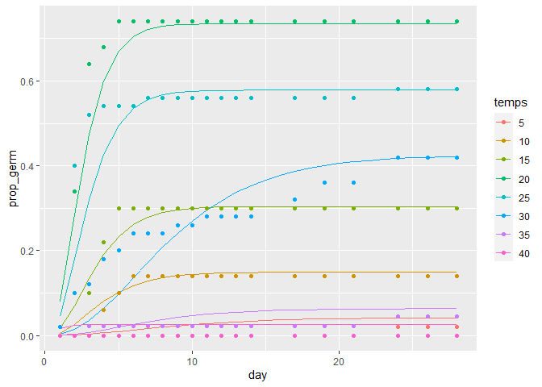
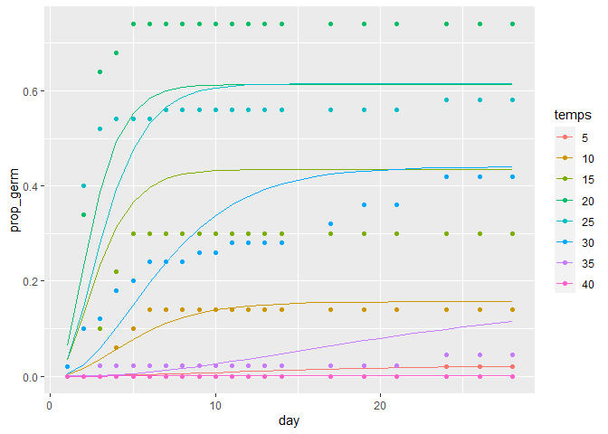

```r
library(rethinking)
```

```
## Loading required package: rstan
```

```
## Loading required package: StanHeaders
```

```
## Loading required package: ggplot2
```

```
## rstan (Version 2.21.2, GitRev: 2e1f913d3ca3)
```

```
## For execution on a local, multicore CPU with excess RAM we recommend calling
## options(mc.cores = parallel::detectCores()).
## To avoid recompilation of unchanged Stan programs, we recommend calling
## rstan_options(auto_write = TRUE)
```

```
## Do not specify '-march=native' in 'LOCAL_CPPFLAGS' or a Makevars file
```

```
## Loading required package: parallel
```

```
## rethinking (Version 2.12)
```

```
## 
## Attaching package: 'rethinking'
```

```
## The following object is masked from 'package:stats':
## 
##     rstudent
```

```r
library(brms)
```

```
## Loading required package: Rcpp
```

```
## Loading 'brms' package (version 2.13.5). Useful instructions
## can be found by typing help('brms'). A more detailed introduction
## to the package is available through vignette('brms_overview').
```

```
## 
## Attaching package: 'brms'
```

```
## The following objects are masked from 'package:rethinking':
## 
##     LOO, stancode, WAIC
```

```
## The following object is masked from 'package:rstan':
## 
##     loo
```

```
## The following object is masked from 'package:stats':
## 
##     ar
```

```r
library(tidyverse)
```

```
## -- Attaching packages ----------------------------------------------------------------------------- tidyverse 1.3.0 --
```

```
## √ tibble  3.0.3     √ dplyr   1.0.1
## √ tidyr   1.1.1     √ stringr 1.4.0
## √ readr   1.3.1     √ forcats 0.5.0
## √ purrr   0.3.4
```

```
## -- Conflicts -------------------------------------------------------------------------------- tidyverse_conflicts() --
## x tidyr::extract() masks rstan::extract()
## x dplyr::filter()  masks stats::filter()
## x dplyr::lag()     masks stats::lag()
## x purrr::map()     masks rethinking::map()
```


```r
germ <- read_csv("light_round1_tall.csv") %>%
  filter(wps == 0) %>%
  select(pops, temps, total_seeds, germ, day, cumulative_germ)
```

```
## Parsed with column specification:
## cols(
##   pops = col_character(),
##   temps = col_double(),
##   wps = col_double(),
##   date = col_character(),
##   total_seeds = col_double(),
##   germ = col_double(),
##   start_date = col_date(format = ""),
##   census_date = col_date(format = ""),
##   day = col_double(),
##   cumulative_germ = col_double(),
##   cumulative_prop_germ = col_double()
## )
```

```r
germ
```

```
## # A tibble: 3,840 x 6
##    pops  temps total_seeds  germ   day cumulative_germ
##    <chr> <dbl>       <dbl> <dbl> <dbl>           <dbl>
##  1 CAAM      5          50     0     1               0
##  2 CAAM      5          50     0     2               0
##  3 CAAM      5          50     0     3               0
##  4 CAAM      5          50     0     4               0
##  5 CAAM      5          50     0     5               0
##  6 CAAM      5          50     0     6               0
##  7 CAAM      5          50     0     7               0
##  8 CAAM      5          50     0     8               0
##  9 CAAM      5          50     0     9               0
## 10 CAAM      5          50     0    10               0
## # ... with 3,830 more rows
```

#### Convert to one event per row

```r
one_per_row <- function(df) {
  total_seed <- max(df$total_seeds, sum(df$germ))
  newdata <- tibble(id=1:total_seed, germ=0, day=max(df$day))
  df <- df %>% filter(germ>0)
  count <- 1
  if (nrow(df) > 0) {
    for (i in 1:nrow(df)) { # we look at each row of the df where germination occured
      for (j in 1:df$germ[i]) { # now update the newdata to reflect the germiantion of each seed
        newdata$germ[count] <- 1
        newdata$day[count]=df$day[i]
        count <- count+1 # count keeps track of which individual we are at in the new data
      } # for j
    } # for i
  } # if 
  return(newdata)
}
germone <- germ %>% group_by(pops, temps) %>%
  select(-cumulative_germ) %>% # not needed in this encoding (I think...in any case would need to be recalculated)
  nest() %>%
  mutate(newdata=map(data, one_per_row)) %>%
  select(-data) %>%
  unnest(newdata)
germone
```

```
## # A tibble: 9,120 x 5
## # Groups:   pops, temps [192]
##    pops  temps    id  germ   day
##    <chr> <dbl> <int> <dbl> <dbl>
##  1 CAAM      5     1     0    28
##  2 CAAM      5     2     0    28
##  3 CAAM      5     3     0    28
##  4 CAAM      5     4     0    28
##  5 CAAM      5     5     0    28
##  6 CAAM      5     6     0    28
##  7 CAAM      5     7     0    28
##  8 CAAM      5     8     0    28
##  9 CAAM      5     9     0    28
## 10 CAAM      5    10     0    28
## # ... with 9,110 more rows
```
#### STDI only

```r
germ.stdi <- germone %>% filter(pops=="STDI") %>% select(-pops)
```

```
## Adding missing grouping variables: `pops`
```

```r
germ.stdi
```

```
## # A tibble: 396 x 5
## # Groups:   pops, temps [8]
##    pops  temps    id  germ   day
##    <chr> <dbl> <int> <dbl> <dbl>
##  1 STDI      5     1     1    24
##  2 STDI      5     2     0    28
##  3 STDI      5     3     0    28
##  4 STDI      5     4     0    28
##  5 STDI      5     5     0    28
##  6 STDI      5     6     0    28
##  7 STDI      5     7     0    28
##  8 STDI      5     8     0    28
##  9 STDI      5     9     0    28
## 10 STDI      5    10     0    28
## # ... with 386 more rows
```

# Assignment:

You can start from my models if you want to.  The three relevant ones from my code are

## m1.1/m1.2: censored exponential (the worst)

### m1.1: rethinking

exponential rate curve, censoring seed that don't germinate.


```r
d <- list(germ=germ.stdi$germ, 
          temps=as.numeric(as.factor(germ.stdi$temps)),
          day=germ.stdi$day)
m1.1 <- ulam(
  alist(
    day | germ==1 ~ exponential( lambda),
    day | germ==0 ~ custom(exponential_lccdf( !Y | lambda)),
    lambda <- 1.0 / mu,
    log(mu) <- a[temps],
    a[temps] ~ normal(0,1)),
  data=d,
  chains=4,
  cores = 4
)
```


```r
precis(m1.1, depth = 2)
```

```
##          mean        sd     5.5%    94.5%    n_eff     Rhat4
## a[1] 5.454740 0.3708651 4.894927 6.066141 2675.068 0.9989761
## a[2] 4.703917 0.2767352 4.289418 5.160302 2692.623 0.9995150
## a[3] 4.018457 0.2189796 3.677970 4.382773 2777.395 0.9988091
## a[4] 2.477641 0.1600836 2.235990 2.735896 2501.310 0.9985846
## a[5] 3.074638 0.1772367 2.796915 3.366283 2662.546 0.9987900
## a[6] 3.733415 0.1984087 3.425073 4.048695 2509.928 0.9985943
## a[7] 5.197811 0.3604693 4.660696 5.798506 2134.901 0.9996917
## a[8] 5.616911 0.3903176 5.025888 6.272231 2771.035 0.9997966
```

The above represent log(mean time to germination)

### m1.2: brms censoring model

need to set up indicator for censoring.

```r
germ.stdi <- germ.stdi %>%
  mutate(cens=ifelse(germ==0, "right", "none"),
         tempsc=as.character(temps) %>% str_pad(width=2, pad="0"))
germ.stdi
```

```
## # A tibble: 396 x 7
## # Groups:   pops, temps [8]
##    pops  temps    id  germ   day cens  tempsc
##    <chr> <dbl> <int> <dbl> <dbl> <chr> <chr> 
##  1 STDI      5     1     1    24 none  05    
##  2 STDI      5     2     0    28 right 05    
##  3 STDI      5     3     0    28 right 05    
##  4 STDI      5     4     0    28 right 05    
##  5 STDI      5     5     0    28 right 05    
##  6 STDI      5     6     0    28 right 05    
##  7 STDI      5     7     0    28 right 05    
##  8 STDI      5     8     0    28 right 05    
##  9 STDI      5     9     0    28 right 05    
## 10 STDI      5    10     0    28 right 05    
## # ... with 386 more rows
```


```r
get_prior(day | cens(cens) ~ 0 + tempsc, family = exponential, data=germ.stdi)
```

```
##   prior class     coef group resp dpar nlpar bound
## 1           b                                     
## 2           b tempsc05                            
## 3           b tempsc10                            
## 4           b tempsc15                            
## 5           b tempsc20                            
## 6           b tempsc25                            
## 7           b tempsc30                            
## 8           b tempsc35                            
## 9           b tempsc40
```


```r
m1.2 <- brm(day | cens(cens) ~ 0 + tempsc,
            family = exponential(),
            set_prior("normal(0,1)", class="b"),
            data = germ.stdi, )
```

```
## Compiling Stan program...
```

```
## Start sampling
```

```
## 
## SAMPLING FOR MODEL '02cbacdf9a005d8fb72b95a50f9e274d' NOW (CHAIN 1).
## Chain 1: 
## Chain 1: Gradient evaluation took 0 seconds
## Chain 1: 1000 transitions using 10 leapfrog steps per transition would take 0 seconds.
## Chain 1: Adjust your expectations accordingly!
## Chain 1: 
## Chain 1: 
## Chain 1: Iteration:    1 / 2000 [  0%]  (Warmup)
## Chain 1: Iteration:  200 / 2000 [ 10%]  (Warmup)
## Chain 1: Iteration:  400 / 2000 [ 20%]  (Warmup)
## Chain 1: Iteration:  600 / 2000 [ 30%]  (Warmup)
## Chain 1: Iteration:  800 / 2000 [ 40%]  (Warmup)
## Chain 1: Iteration: 1000 / 2000 [ 50%]  (Warmup)
## Chain 1: Iteration: 1001 / 2000 [ 50%]  (Sampling)
## Chain 1: Iteration: 1200 / 2000 [ 60%]  (Sampling)
## Chain 1: Iteration: 1400 / 2000 [ 70%]  (Sampling)
## Chain 1: Iteration: 1600 / 2000 [ 80%]  (Sampling)
## Chain 1: Iteration: 1800 / 2000 [ 90%]  (Sampling)
## Chain 1: Iteration: 2000 / 2000 [100%]  (Sampling)
## Chain 1: 
## Chain 1:  Elapsed Time: 0.959 seconds (Warm-up)
## Chain 1:                1.082 seconds (Sampling)
## Chain 1:                2.041 seconds (Total)
## Chain 1: 
## 
## SAMPLING FOR MODEL '02cbacdf9a005d8fb72b95a50f9e274d' NOW (CHAIN 2).
## Chain 2: 
## Chain 2: Gradient evaluation took 0 seconds
## Chain 2: 1000 transitions using 10 leapfrog steps per transition would take 0 seconds.
## Chain 2: Adjust your expectations accordingly!
## Chain 2: 
## Chain 2: 
## Chain 2: Iteration:    1 / 2000 [  0%]  (Warmup)
## Chain 2: Iteration:  200 / 2000 [ 10%]  (Warmup)
## Chain 2: Iteration:  400 / 2000 [ 20%]  (Warmup)
## Chain 2: Iteration:  600 / 2000 [ 30%]  (Warmup)
## Chain 2: Iteration:  800 / 2000 [ 40%]  (Warmup)
## Chain 2: Iteration: 1000 / 2000 [ 50%]  (Warmup)
## Chain 2: Iteration: 1001 / 2000 [ 50%]  (Sampling)
## Chain 2: Iteration: 1200 / 2000 [ 60%]  (Sampling)
## Chain 2: Iteration: 1400 / 2000 [ 70%]  (Sampling)
## Chain 2: Iteration: 1600 / 2000 [ 80%]  (Sampling)
## Chain 2: Iteration: 1800 / 2000 [ 90%]  (Sampling)
## Chain 2: Iteration: 2000 / 2000 [100%]  (Sampling)
## Chain 2: 
## Chain 2:  Elapsed Time: 1.101 seconds (Warm-up)
## Chain 2:                1.012 seconds (Sampling)
## Chain 2:                2.113 seconds (Total)
## Chain 2: 
## 
## SAMPLING FOR MODEL '02cbacdf9a005d8fb72b95a50f9e274d' NOW (CHAIN 3).
## Chain 3: 
## Chain 3: Gradient evaluation took 0 seconds
## Chain 3: 1000 transitions using 10 leapfrog steps per transition would take 0 seconds.
## Chain 3: Adjust your expectations accordingly!
## Chain 3: 
## Chain 3: 
## Chain 3: Iteration:    1 / 2000 [  0%]  (Warmup)
## Chain 3: Iteration:  200 / 2000 [ 10%]  (Warmup)
## Chain 3: Iteration:  400 / 2000 [ 20%]  (Warmup)
## Chain 3: Iteration:  600 / 2000 [ 30%]  (Warmup)
## Chain 3: Iteration:  800 / 2000 [ 40%]  (Warmup)
## Chain 3: Iteration: 1000 / 2000 [ 50%]  (Warmup)
## Chain 3: Iteration: 1001 / 2000 [ 50%]  (Sampling)
## Chain 3: Iteration: 1200 / 2000 [ 60%]  (Sampling)
## Chain 3: Iteration: 1400 / 2000 [ 70%]  (Sampling)
## Chain 3: Iteration: 1600 / 2000 [ 80%]  (Sampling)
## Chain 3: Iteration: 1800 / 2000 [ 90%]  (Sampling)
## Chain 3: Iteration: 2000 / 2000 [100%]  (Sampling)
## Chain 3: 
## Chain 3:  Elapsed Time: 0.925 seconds (Warm-up)
## Chain 3:                0.934 seconds (Sampling)
## Chain 3:                1.859 seconds (Total)
## Chain 3: 
## 
## SAMPLING FOR MODEL '02cbacdf9a005d8fb72b95a50f9e274d' NOW (CHAIN 4).
## Chain 4: 
## Chain 4: Gradient evaluation took 0 seconds
## Chain 4: 1000 transitions using 10 leapfrog steps per transition would take 0 seconds.
## Chain 4: Adjust your expectations accordingly!
## Chain 4: 
## Chain 4: 
## Chain 4: Iteration:    1 / 2000 [  0%]  (Warmup)
## Chain 4: Iteration:  200 / 2000 [ 10%]  (Warmup)
## Chain 4: Iteration:  400 / 2000 [ 20%]  (Warmup)
## Chain 4: Iteration:  600 / 2000 [ 30%]  (Warmup)
## Chain 4: Iteration:  800 / 2000 [ 40%]  (Warmup)
## Chain 4: Iteration: 1000 / 2000 [ 50%]  (Warmup)
## Chain 4: Iteration: 1001 / 2000 [ 50%]  (Sampling)
## Chain 4: Iteration: 1200 / 2000 [ 60%]  (Sampling)
## Chain 4: Iteration: 1400 / 2000 [ 70%]  (Sampling)
## Chain 4: Iteration: 1600 / 2000 [ 80%]  (Sampling)
## Chain 4: Iteration: 1800 / 2000 [ 90%]  (Sampling)
## Chain 4: Iteration: 2000 / 2000 [100%]  (Sampling)
## Chain 4: 
## Chain 4:  Elapsed Time: 1.182 seconds (Warm-up)
## Chain 4:                1.121 seconds (Sampling)
## Chain 4:                2.303 seconds (Total)
## Chain 4:
```


```r
summary(m1.2)
```

```
##  Family: exponential 
##   Links: mu = log 
## Formula: day | cens(cens) ~ 0 + tempsc 
##    Data: germ.stdi (Number of observations: 396) 
## Samples: 4 chains, each with iter = 2000; warmup = 1000; thin = 1;
##          total post-warmup samples = 4000
## 
## Population-Level Effects: 
##          Estimate Est.Error l-95% CI u-95% CI Rhat Bulk_ESS Tail_ESS
## tempsc05     5.45      0.39     4.76     6.27 1.00     7721     2629
## tempsc10     4.71      0.28     4.20     5.29 1.00     8055     3156
## tempsc15     4.03      0.23     3.61     4.50 1.00     6958     2776
## tempsc20     2.48      0.15     2.19     2.80 1.00     7634     3035
## tempsc25     3.07      0.17     2.74     3.42 1.00     7129     2981
## tempsc30     3.74      0.20     3.37     4.13 1.00     6963     2767
## tempsc35     5.20      0.35     4.56     5.92 1.00     7802     2737
## tempsc40     5.61      0.40     4.89     6.48 1.00     7082     2872
## 
## Samples were drawn using sampling(NUTS). For each parameter, Bulk_ESS
## and Tail_ESS are effective sample size measures, and Rhat is the potential
## scale reduction factor on split chains (at convergence, Rhat = 1).
```

### m1.5: ZI exponential

Try to write a model with different dormancy probs for the different temps.

```r
d <- list(N=nrow(germ.stdi),
          germ=germ.stdi$germ,
          temps=as.numeric(as.factor(germ.stdi$temps)),
          day=germ.stdi$day)
stanmodel1.5 <-
  "
data{
    int<lower=1> N;  // number of observations
    int germ[N];
    vector[N] day;
    int temps[N];
}
parameters{
    vector[8] a; // alpha for the exponential curve, one for each temp
    vector[8] ap; // alpha for the proportion dormant, one for each temp
}
model{
    vector[N] p;
    vector[N] lambda;
    vector[N] mu;
    a ~ normal( 0 , 1 );
    ap ~ normal( 0, 1 );
    for (i in 1:N) {
        p[i] = ap[temps[i]];
        p[i] = inv_logit(p[i]); // inverse link function
    }
    for ( i in 1:N ) {
        mu[i] = a[temps[i]];
        mu[i] = exp(mu[i]); // inverse link function
    }
    for ( i in 1:N ) {
        lambda[i] = 1/mu[i];
    }
    for ( i in 1:N ) 
        if ( germ[i] == 0 ) target += log_mix(p[i], 0, exponential_lccdf(day[i] | lambda[i]));
    for ( i in 1:N ) 
        if ( germ[i] == 1 ) target += log1m(p[i]) +  exponential_lpdf(day[i] | lambda[i]);
    for ( i in 1:N ) 
        if ( germ[i] == 1 ) day[i] ~ exponential( lambda[i] );
}
"
m1.5 <- stan(model_code=stanmodel1.5, data=d)
```

```
## 
## SAMPLING FOR MODEL '9064b37d517551d81d83ff3f0e4fe626' NOW (CHAIN 1).
## Chain 1: 
## Chain 1: Gradient evaluation took 0 seconds
## Chain 1: 1000 transitions using 10 leapfrog steps per transition would take 0 seconds.
## Chain 1: Adjust your expectations accordingly!
## Chain 1: 
## Chain 1: 
## Chain 1: Iteration:    1 / 2000 [  0%]  (Warmup)
## Chain 1: Iteration:  200 / 2000 [ 10%]  (Warmup)
## Chain 1: Iteration:  400 / 2000 [ 20%]  (Warmup)
## Chain 1: Iteration:  600 / 2000 [ 30%]  (Warmup)
## Chain 1: Iteration:  800 / 2000 [ 40%]  (Warmup)
## Chain 1: Iteration: 1000 / 2000 [ 50%]  (Warmup)
## Chain 1: Iteration: 1001 / 2000 [ 50%]  (Sampling)
## Chain 1: Iteration: 1200 / 2000 [ 60%]  (Sampling)
## Chain 1: Iteration: 1400 / 2000 [ 70%]  (Sampling)
## Chain 1: Iteration: 1600 / 2000 [ 80%]  (Sampling)
## Chain 1: Iteration: 1800 / 2000 [ 90%]  (Sampling)
## Chain 1: Iteration: 2000 / 2000 [100%]  (Sampling)
## Chain 1: 
## Chain 1:  Elapsed Time: 5.453 seconds (Warm-up)
## Chain 1:                3.165 seconds (Sampling)
## Chain 1:                8.618 seconds (Total)
## Chain 1: 
## 
## SAMPLING FOR MODEL '9064b37d517551d81d83ff3f0e4fe626' NOW (CHAIN 2).
## Chain 2: 
## Chain 2: Gradient evaluation took 0.001 seconds
## Chain 2: 1000 transitions using 10 leapfrog steps per transition would take 10 seconds.
## Chain 2: Adjust your expectations accordingly!
## Chain 2: 
## Chain 2: 
## Chain 2: Iteration:    1 / 2000 [  0%]  (Warmup)
## Chain 2: Iteration:  200 / 2000 [ 10%]  (Warmup)
## Chain 2: Iteration:  400 / 2000 [ 20%]  (Warmup)
## Chain 2: Iteration:  600 / 2000 [ 30%]  (Warmup)
## Chain 2: Iteration:  800 / 2000 [ 40%]  (Warmup)
## Chain 2: Iteration: 1000 / 2000 [ 50%]  (Warmup)
## Chain 2: Iteration: 1001 / 2000 [ 50%]  (Sampling)
## Chain 2: Iteration: 1200 / 2000 [ 60%]  (Sampling)
## Chain 2: Iteration: 1400 / 2000 [ 70%]  (Sampling)
## Chain 2: Iteration: 1600 / 2000 [ 80%]  (Sampling)
## Chain 2: Iteration: 1800 / 2000 [ 90%]  (Sampling)
## Chain 2: Iteration: 2000 / 2000 [100%]  (Sampling)
## Chain 2: 
## Chain 2:  Elapsed Time: 3.907 seconds (Warm-up)
## Chain 2:                3.321 seconds (Sampling)
## Chain 2:                7.228 seconds (Total)
## Chain 2: 
## 
## SAMPLING FOR MODEL '9064b37d517551d81d83ff3f0e4fe626' NOW (CHAIN 3).
## Chain 3: 
## Chain 3: Gradient evaluation took 0.001 seconds
## Chain 3: 1000 transitions using 10 leapfrog steps per transition would take 10 seconds.
## Chain 3: Adjust your expectations accordingly!
## Chain 3: 
## Chain 3: 
## Chain 3: Iteration:    1 / 2000 [  0%]  (Warmup)
## Chain 3: Iteration:  200 / 2000 [ 10%]  (Warmup)
## Chain 3: Iteration:  400 / 2000 [ 20%]  (Warmup)
## Chain 3: Iteration:  600 / 2000 [ 30%]  (Warmup)
## Chain 3: Iteration:  800 / 2000 [ 40%]  (Warmup)
## Chain 3: Iteration: 1000 / 2000 [ 50%]  (Warmup)
## Chain 3: Iteration: 1001 / 2000 [ 50%]  (Sampling)
## Chain 3: Iteration: 1200 / 2000 [ 60%]  (Sampling)
## Chain 3: Iteration: 1400 / 2000 [ 70%]  (Sampling)
## Chain 3: Iteration: 1600 / 2000 [ 80%]  (Sampling)
## Chain 3: Iteration: 1800 / 2000 [ 90%]  (Sampling)
## Chain 3: Iteration: 2000 / 2000 [100%]  (Sampling)
## Chain 3: 
## Chain 3:  Elapsed Time: 3.68 seconds (Warm-up)
## Chain 3:                3.212 seconds (Sampling)
## Chain 3:                6.892 seconds (Total)
## Chain 3: 
## 
## SAMPLING FOR MODEL '9064b37d517551d81d83ff3f0e4fe626' NOW (CHAIN 4).
## Chain 4: 
## Chain 4: Gradient evaluation took 0.001 seconds
## Chain 4: 1000 transitions using 10 leapfrog steps per transition would take 10 seconds.
## Chain 4: Adjust your expectations accordingly!
## Chain 4: 
## Chain 4: 
## Chain 4: Iteration:    1 / 2000 [  0%]  (Warmup)
## Chain 4: Iteration:  200 / 2000 [ 10%]  (Warmup)
## Chain 4: Iteration:  400 / 2000 [ 20%]  (Warmup)
## Chain 4: Iteration:  600 / 2000 [ 30%]  (Warmup)
## Chain 4: Iteration:  800 / 2000 [ 40%]  (Warmup)
## Chain 4: Iteration: 1000 / 2000 [ 50%]  (Warmup)
## Chain 4: Iteration: 1001 / 2000 [ 50%]  (Sampling)
## Chain 4: Iteration: 1200 / 2000 [ 60%]  (Sampling)
## Chain 4: Iteration: 1400 / 2000 [ 70%]  (Sampling)
## Chain 4: Iteration: 1600 / 2000 [ 80%]  (Sampling)
## Chain 4: Iteration: 1800 / 2000 [ 90%]  (Sampling)
## Chain 4: Iteration: 2000 / 2000 [100%]  (Sampling)
## Chain 4: 
## Chain 4:  Elapsed Time: 4.279 seconds (Warm-up)
## Chain 4:                3.512 seconds (Sampling)
## Chain 4:                7.791 seconds (Total)
## Chain 4:
```


```r
precis(m1.5, depth = 2)
```

```
##              mean        sd       5.5%      94.5%     n_eff     Rhat4
## a[1]   2.79401885 0.5924463  1.9274938  3.7996150  5681.177 0.9993761
## a[2]   1.52621572 0.2686507  1.1231995  1.9762741  7599.334 0.9995718
## a[3]   1.34575526 0.1820006  1.0684903  1.6443453  8591.169 0.9992636
## a[4]   1.00710262 0.1159117  0.8262497  1.2039809  7665.100 0.9991796
## a[5]   1.15528276 0.1336829  0.9461114  1.3719578 10438.192 0.9995927
## a[6]   2.34336855 0.1809902  2.0645540  2.6409624  6790.611 0.9995166
## a[7]   2.42496580 0.4809178  1.7358373  3.2626269  4650.114 0.9996092
## a[8]   0.03337269 1.0102595 -1.5662005  1.6774523  8334.373 0.9991619
## ap[1]  2.40186337 0.5729135  1.5121562  3.3030042  5408.224 0.9995803
## ap[2]  1.60772444 0.3504353  1.0715419  2.1851695  7858.920 0.9992536
## ap[3]  0.78968542 0.2881983  0.3286732  1.2475262  7659.988 0.9996420
## ap[4] -0.96255008 0.2985942 -1.4324076 -0.4972350  9204.948 0.9998475
## ap[5] -0.29978855 0.2863277 -0.7673003  0.1601942  9330.850 0.9994665
## ap[6]  0.16919731 0.3116841 -0.3127336  0.6561786  8500.883 0.9995528
## ap[7]  2.18688443 0.4797899  1.4549519  2.9481071  6513.347 0.9994265
## ap[8]  2.91305604 0.5363576  2.1204248  3.8207300  8305.446 0.9994808
```

### m1.7/m1.7a : ZI Gamma (the best)

Look at gamma stancode from brms:


```r
make_stancode(day ~ tempsc, 
             family="Gamma",
             prior=set_prior("normal(0,1)"),
             data=germ.stdi,
             sample=FALSE)
```

```
## // generated with brms 2.13.5
## functions {
## }
## data {
##   int<lower=1> N;  // number of observations
##   vector[N] Y;  // response variable
##   int<lower=1> K;  // number of population-level effects
##   matrix[N, K] X;  // population-level design matrix
##   int prior_only;  // should the likelihood be ignored?
## }
## transformed data {
##   int Kc = K - 1;
##   matrix[N, Kc] Xc;  // centered version of X without an intercept
##   vector[Kc] means_X;  // column means of X before centering
##   for (i in 2:K) {
##     means_X[i - 1] = mean(X[, i]);
##     Xc[, i - 1] = X[, i] - means_X[i - 1];
##   }
## }
## parameters {
##   vector[Kc] b;  // population-level effects
##   real Intercept;  // temporary intercept for centered predictors
##   real<lower=0> shape;  // shape parameter
## }
## transformed parameters {
## }
## model {
##   // initialize linear predictor term
##   vector[N] mu = Intercept + Xc * b;
##   for (n in 1:N) {
##     // apply the inverse link function
##     mu[n] = shape * exp(-(mu[n]));
##   }
##   // priors including all constants
##   target += normal_lpdf(b | 0,1);
##   target += student_t_lpdf(Intercept | 3, 3.3, 2.5);
##   target += gamma_lpdf(shape | 0.01, 0.01);
##   // likelihood including all constants
##   if (!prior_only) {
##     target += gamma_lpdf(Y | shape, mu);
##   }
## }
## generated quantities {
##   // actual population-level intercept
##   real b_Intercept = Intercept - dot_product(means_X, b);
## }
```


Try developing a ZI gamma model:

stan uses that gamma(alpha, beta) parameterization where "alpha" is shape" and "beta" is "rate".  So try having the shape be the same for all temps.

```r
d <- list(N=nrow(germ.stdi),
          germ=germ.stdi$germ,
          temps=as.numeric(as.factor(germ.stdi$temps)),
          day=germ.stdi$day)
stanmodel1.7 <-
  "
data{
    int<lower=1> N;  // number of observations
    int germ[N];
    vector[N] day;
    int temps[N];
}
parameters{
    real<lower=0> shape; // should set lower bound
    vector[8] a; // alpha for the gamma curve, one for each temp
    vector[8] ap; // alpha for the proportion dormant, one for each temp
}
model{
    vector[N] p;
    vector[N] mu;
    a ~ normal( 0 , .5 ); //narrow priors to overcome divergent transitions
    ap ~ normal( 0, 1.5 ); 
    shape ~ normal(0, .5); //narrow priors to overcome divergent transitions
    for (i in 1:N) {
        p[i] = ap[temps[i]];
        p[i] = inv_logit(p[i]);
    }
    for ( i in 1:N ) {
        mu[i] = a[temps[i]];
         // apply the inverse link function
        mu[i] = shape * exp(-(mu[i]));
    }
    for ( i in 1:N ) 
       if ( germ[i] == 0 ) target += log_mix(p[i], 0, gamma_lccdf(day[i] | shape, mu[i]));
    for ( i in 1:N ) 
       if ( germ[i] == 1 ) target += log1m(p[i]) + gamma_lpdf(day[i] | shape, mu[i]);
    for ( i in 1:N ) 
       if ( germ[i] == 1 ) day[i] ~ gamma( shape, mu[i] );
}
"
m1.7 <- stan(model_code=stanmodel1.7, data=d, chains=4, cores=4, control=list(adapt_delta=.99))
```


```r
precis(m1.7, depth = 2)
```

```
##                mean         sd       5.5%      94.5%    n_eff     Rhat4
## shape  2.3510523774 0.20226950  2.0317559  2.6772539 5177.562 0.9996517
## a[1]   2.1738565617 0.25170742  1.7902703  2.5853451 5029.957 0.9997999
## a[2]   1.4315356216 0.15414353  1.1931187  1.6825306 5456.954 0.9994211
## a[3]   1.3022417440 0.11497867  1.1177958  1.4863140 5238.374 0.9999086
## a[4]   0.9942321104 0.07596876  0.8725851  1.1153419 5018.538 0.9996424
## a[5]   1.1354080418 0.08451821  1.0043750  1.2737239 5376.686 0.9995558
## a[6]   2.2120247716 0.09819040  2.0624272  2.3689821 5614.620 0.9997539
## a[7]   2.0117807033 0.22244887  1.6633502  2.3734348 4843.761 0.9998593
## a[8]  -0.0003979289 0.51019406 -0.8169995  0.8101317 5024.113 0.9996683
## ap[1]  3.1287371145 0.65269753  2.1882467  4.2246663 5271.200 1.0003785
## ap[2]  1.7420840302 0.39012414  1.1431006  2.3953743 6037.450 0.9992766
## ap[3]  0.8348639891 0.30317594  0.3576639  1.3243651 6735.630 1.0002113
## ap[4] -1.0144434992 0.32073488 -1.5399325 -0.5147180 6127.007 1.0000033
## ap[5] -0.3190143627 0.28909477 -0.7862910  0.1360041 5942.738 0.9995012
## ap[6]  0.2916216211 0.29023422 -0.1666817  0.7481870 4958.969 0.9999538
## ap[7]  2.6792820140 0.55050223  1.8588805  3.6184508 5850.294 0.9999154
## ap[8]  3.6225393480 0.72065655  2.5534515  4.8444074 5128.853 0.9995805
```


```r
#shinystan::launch_shinystan(m1.7)
```

playing with priors:

Make shape exponential


```r
d <- list(N=nrow(germ.stdi),
          germ=germ.stdi$germ,
          temps=as.numeric(as.factor(germ.stdi$temps)),
          day=germ.stdi$day)
stanmodel1.7a <-
  "
data{
    int<lower=1> N;  // number of observations
    int germ[N];
    vector[N] day;
    int temps[N];
}
parameters{
    real<lower=0> shape; // should set lower bound
    vector[8] a; // alpha for the gamma curve, one for each temp
    vector[8] ap; // alpha for the proportion dormant, one for each temp
}
model{
    vector[N] p;
    vector[N] mu;
    a ~ normal( 0 , .5 ); //narrow priors to overcome divergent transitions
    ap ~ normal( 0, 1.5 ); 
    shape ~ exponential(.5); 
    for (i in 1:N) {
        p[i] = ap[temps[i]];
        p[i] = inv_logit(p[i]);
    }
    for ( i in 1:N ) {
        mu[i] = a[temps[i]];
         // apply the inverse link function
        mu[i] = shape * exp(-(mu[i]));
    }
    for ( i in 1:N ) 
       if ( germ[i] == 0 ) target += log_mix(p[i], 0, gamma_lccdf(day[i] | shape, mu[i]));
    for ( i in 1:N ) 
       if ( germ[i] == 1 ) target += log1m(p[i]) + gamma_lpdf(day[i] | shape, mu[i]);
    for ( i in 1:N ) 
       if ( germ[i] == 1 ) day[i] ~ gamma( shape, mu[i] );
}
"
m1.7a <- stan(model_code=stanmodel1.7a, data=d, chains=4, cores=4, control=list(adapt_delta=.99))
```


```r
precis(m1.7a, depth = 2)
```

```
##               mean         sd       5.5%      94.5%    n_eff     Rhat4
## shape  2.885591358 0.27408092  2.4653942  3.3388947 5124.380 1.0000792
## a[1]   2.271683236 0.25298263  1.8804857  2.6850731 5554.048 0.9997877
## a[2]   1.456599101 0.14425302  1.2295260  1.6918382 6246.886 0.9992640
## a[3]   1.316596693 0.10339760  1.1494007  1.4842652 6827.457 0.9992627
## a[4]   0.997910368 0.06636120  0.8927786  1.1084874 6905.504 0.9995920
## a[5]   1.139416717 0.07691877  1.0182439  1.2654467 6838.234 0.9997718
## a[6]   2.220582297 0.08866945  2.0814824  2.3636050 5733.920 1.0007529
## a[7]   2.085502170 0.20901174  1.7615096  2.4307126 5972.809 0.9999309
## a[8]   0.004361216 0.49613516 -0.7866222  0.7890791 5760.195 1.0001255
## ap[1]  3.141942972 0.63531534  2.2027109  4.2183126 5047.362 1.0003992
## ap[2]  1.744127879 0.39821653  1.1335942  2.4066096 6125.756 0.9993856
## ap[3]  0.829741821 0.30033793  0.3633941  1.3229739 6974.318 0.9994748
## ap[4] -1.017558187 0.30809302 -1.5218066 -0.5295063 6203.161 0.9999324
## ap[5] -0.315310488 0.27831576 -0.7655266  0.1222670 6482.960 0.9997063
## ap[6]  0.306174297 0.28590327 -0.1508874  0.7690546 7162.291 0.9993651
## ap[7]  2.698690338 0.57051620  1.8394798  3.6491491 4516.922 0.9992952
## ap[8]  3.637578543 0.76274223  2.5157174  4.9352948 5394.495 1.0000797
```


```r
post <- as.data.frame(m1.7a)
post_logavgdays <- post %>% select(shape, starts_with("a["
)) # these are the shape and the log(mean(avg time to germinate))
mu_rate <- post_logavgdays %>% 
  mutate(across(-shape, ~ shape*exp(-(.))) ) %>%
  summarize(across(everything(), mean)) %>% select(-shape) # posterior mean
mu_rate
```

```
##        a[1]      a[2]      a[3]     a[4]      a[5]      a[6]      a[7]     a[8]
## 1 0.3056671 0.6788714 0.7773009 1.066341 0.9256058 0.3144779 0.3654122 3.247215
```

```r
mu_shape <- mean(post$shape)
post_logitp <- post %>% select(starts_with("ap")) #logit p dormant
mu_p <- post_logitp %>%
  summarize_all(mean) %>%
  mutate_all(inv_logit)
mu_p
```

```
##       ap[1]     ap[2]     ap[3]     ap[4]    ap[5]     ap[6]     ap[7]
## 1 0.9585901 0.8512106 0.6963003 0.2655033 0.421819 0.5759512 0.9369493
##       ap[8]
## 1 0.9743588
```

```r
posterior_coef <- tibble(shape=mu_shape, temps=as.factor(unique(germ.stdi$temps)),
                         rate=t(mu_rate),
                         p=t(mu_p))
post_plot1.7a <- expand_grid(posterior_coef, day=1:28) %>%
  mutate(prop_germ=pgamma(day, shape=mu_shape, rate=rate) * (1-p))
stdi.plot <- germ %>% filter(pops=="STDI") %>% 
  select(day, temps, cumulative_germ, total_seeds) %>%
  mutate(temps=as.factor(temps),
         prop_germ=cumulative_germ/total_seeds)
post_plot1.7a %>% 
  ggplot(aes(x=day,y=prop_germ,color=temps,group=temps)) +
  geom_line() +
  geom_point(data=stdi.plot)
```

<!-- -->

### Choose at least one model from above (or your own) to work from. 
### From the base model:

### 1) Try using temperature as a continuous predictor.  Perhaps as a quadratic, or perhaps using the equation that Rongkui showed. (Or try both).


```r
d <- list(N=nrow(germ.stdi),
          germ=germ.stdi$germ,
          temps=as.vector(scale(germ.stdi$temps)),
          day=germ.stdi$day)

stanmodel1.7a_quad <-
  "
data{
    int<lower=1> N;  // number of observations
    int germ[N];
    vector[N] day;
    real temps[N];
}
parameters{
    real<lower=0> shape; // should set lower bound
    real a; // alpha for the gamma curve, one for each temp
    real ap; // alpha for the proportion dormant, one for each temp
    real b; // b for the gamma curve, one for each temp
    real bp; // b for the proportion dormant, one for each temp
    real c; // c for the gamma curve, one for each temp
    real cp; // c for the proportion dormant, one for each temp
}
model{
    vector[N] p;
    vector[N] mu;
    a ~ normal( 0 , .5 ); //narrow priors to overcome divergent transitions
    ap ~ normal( 0, 1.5 );
    b ~ normal( 0 , .5 ); //narrow priors to overcome divergent transitions
    bp ~ normal( 0, 1.5 );
    c ~ normal( 0 , .5 ); //narrow priors to overcome divergent transitions
    cp ~ normal( 0, 1.5 );
    shape ~ exponential(.5); 
    for (i in 1:N) {
        p[i] = ap + bp*temps[i] + cp*(temps[i]^2);
        p[i] = inv_logit(p[i]);
    }
    for ( i in 1:N ) {
        mu[i] = a + b*temps[i] + c*(temps[i]^2);
         // apply the inverse link function
        mu[i] = shape * exp(-(mu[i]));
    }
    for ( i in 1:N ) 
       if ( germ[i] == 0 ) target += log_mix(p[i], 0, gamma_lccdf(day[i] | shape, mu[i]));
    for ( i in 1:N ) 
       if ( germ[i] == 1 ) target += log1m(p[i]) + gamma_lpdf(day[i] | shape, mu[i]);
    for ( i in 1:N ) 
       if ( germ[i] == 1 ) day[i] ~ gamma( shape, mu[i] );
}
"
m1.7a_quad <- stan(model_code=stanmodel1.7a_quad, data=d, chains=4, cores=4, control=list(adapt_delta=.99))
```


```r
precis(m1.7a_quad)
```

```
##              mean         sd       5.5%      94.5%    n_eff     Rhat4
## shape  2.86590518 0.26146601  2.4556300  3.3025507 3754.905 0.9997360
## a      1.10207960 0.05228646  1.0188760  1.1885031 2350.160 1.0003248
## ap    -0.55759347 0.18426168 -0.8518505 -0.2637496 2549.489 1.0011836
## b      0.68281087 0.07818375  0.5544965  0.8049264 3383.598 0.9994840
## bp    -0.01782085 0.23120976 -0.3913496  0.3558076 3257.109 1.0002236
## c      1.27847154 0.12053034  1.0826843  1.4748738 2174.710 0.9998912
## cp     2.16455181 0.34269749  1.6133856  2.7179811 2286.124 1.0015174
```


```r
post <- as.data.frame(m1.7a_quad)

predict_post <- function(temp, post, days=1:28) {
    p <- post$ap + post$bp*temp + post$cp*temp^2
    p <- inv_logit(p)
    mu <- post$a + post$b*temp + post$c*temp^2
    mu <- post$shape*exp(-mu)
    postparams <- tibble(id = 1:length(p), p=p, mu=mu, shape=post$shape) %>%
      nest(params=-id)
    prop_germ <- postparams %>% 
      mutate(prop_germ=map(params, ~ pgamma(days, shape=.$shape, rate=.$mu) * (1-.$p))) %>% 
      select(-params) %>% 
      unnest(prop_germ) %>%
      mutate(day=rep(days, length.out=nrow(.)))
}

post_predictions <- tibble(realtemp = unique(germ.stdi$temps)) %>%
  mutate(scaletemp = scale(realtemp)) %>%
  mutate(predictions = map(scaletemp, predict_post, post)) %>% unnest(predictions)

post_predictions_summary <- post_predictions %>%
  group_by(realtemp, day) %>%
  summarize(low89=HPDI(prop_germ)[1], 
            high90=HPDI(prop_germ)[2],
            prop_germ=mean(prop_germ)) %>%
  mutate(temps=as.factor(realtemp))
```

```
## `summarise()` regrouping output by 'realtemp' (override with `.groups` argument)
```

```r
stdi.plot <- germ %>% filter(pops=="STDI") %>% 
  select(day, temps, cumulative_germ, total_seeds) %>%
  mutate(temps=as.factor(temps),
         prop_germ=cumulative_germ/total_seeds)

post_predictions_summary %>% 
  ggplot(aes(x=day,y=prop_germ,color=temps,group=temps)) +
  geom_line() +
  geom_point(data=stdi.plot)
```

<!-- -->

### 2) Try incorporating multiple populations.
