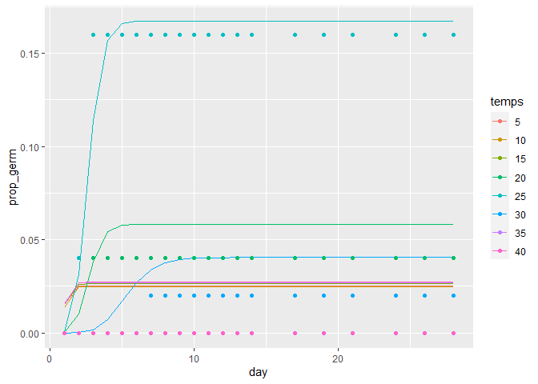
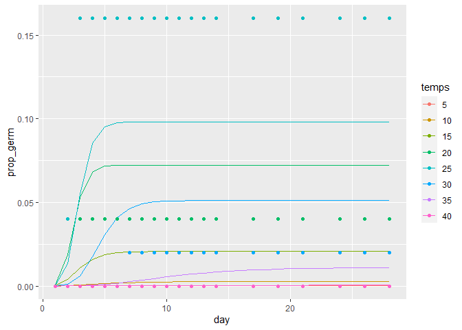

```r
library(rethinking)
```

```
## Loading required package: rstan
```

```
## Loading required package: StanHeaders
```

```
## Loading required package: ggplot2
```

```
## rstan (Version 2.21.2, GitRev: 2e1f913d3ca3)
```

```
## For execution on a local, multicore CPU with excess RAM we recommend calling
## options(mc.cores = parallel::detectCores()).
## To avoid recompilation of unchanged Stan programs, we recommend calling
## rstan_options(auto_write = TRUE)
```

```
## Do not specify '-march=native' in 'LOCAL_CPPFLAGS' or a Makevars file
```

```
## Loading required package: parallel
```

```
## rethinking (Version 2.12)
```

```
## 
## Attaching package: 'rethinking'
```

```
## The following object is masked from 'package:stats':
## 
##     rstudent
```

```r
library(brms)
```

```
## Loading required package: Rcpp
```

```
## Loading 'brms' package (version 2.13.5). Useful instructions
## can be found by typing help('brms'). A more detailed introduction
## to the package is available through vignette('brms_overview').
```

```
## 
## Attaching package: 'brms'
```

```
## The following objects are masked from 'package:rethinking':
## 
##     LOO, stancode, WAIC
```

```
## The following object is masked from 'package:rstan':
## 
##     loo
```

```
## The following object is masked from 'package:stats':
## 
##     ar
```

```r
library(tidyverse)
```

```
## -- Attaching packages ----------------------------------------------------------------------------- tidyverse 1.3.0 --
```

```
## √ tibble  3.0.3     √ dplyr   1.0.1
## √ tidyr   1.1.1     √ stringr 1.4.0
## √ readr   1.3.1     √ forcats 0.5.0
## √ purrr   0.3.4
```

```
## -- Conflicts -------------------------------------------------------------------------------- tidyverse_conflicts() --
## x tidyr::extract() masks rstan::extract()
## x dplyr::filter()  masks stats::filter()
## x dplyr::lag()     masks stats::lag()
## x purrr::map()     masks rethinking::map()
```

### wps = -0.6

```r
germ <- read_csv("light_round1_tall.csv") %>%
  filter(wps == -0.6) %>%
  select(pops, temps, total_seeds, germ, day, cumulative_germ)
```

```
## Parsed with column specification:
## cols(
##   pops = col_character(),
##   temps = col_double(),
##   wps = col_double(),
##   date = col_character(),
##   total_seeds = col_double(),
##   germ = col_double(),
##   start_date = col_date(format = ""),
##   census_date = col_date(format = ""),
##   day = col_double(),
##   cumulative_germ = col_double(),
##   cumulative_prop_germ = col_double()
## )
```

```r
germ
```

```
## # A tibble: 3,840 x 6
##    pops  temps total_seeds  germ   day cumulative_germ
##    <chr> <dbl>       <dbl> <dbl> <dbl>           <dbl>
##  1 CAAM      5          50     0     1               0
##  2 CAAM      5          50     0     2               0
##  3 CAAM      5          50     0     3               0
##  4 CAAM      5          50     0     4               0
##  5 CAAM      5          50     0     5               0
##  6 CAAM      5          50     0     6               0
##  7 CAAM      5          50     0     7               0
##  8 CAAM      5          50     0     8               0
##  9 CAAM      5          50     0     9               0
## 10 CAAM      5          50     0    10               0
## # ... with 3,830 more rows
```

#### Convert to one event per row

```r
one_per_row <- function(df) {
  total_seed <- max(df$total_seeds, sum(df$germ))
  newdata <- tibble(id=1:total_seed, germ=0, day=max(df$day))
  df <- df %>% filter(germ>0)
  count <- 1
  if (nrow(df) > 0) {
    for (i in 1:nrow(df)) { # we look at each row of the df where germination occured
      for (j in 1:df$germ[i]) { # now update the newdata to reflect the germiantion of each seed
        newdata$germ[count] <- 1
        newdata$day[count]=df$day[i]
        count <- count+1 # count keeps track of which individual we are at in the new data
      } # for j
    } # for i
  } # if 
  return(newdata)
}
germone <- germ %>% group_by(pops, temps) %>%
  select(-cumulative_germ) %>% # not needed in this encoding (I think...in any case would need to be recalculated)
  nest() %>%
  mutate(newdata=map(data, one_per_row)) %>%
  select(-data) %>%
  unnest(newdata)
germone
```

```
## # A tibble: 9,148 x 5
## # Groups:   pops, temps [192]
##    pops  temps    id  germ   day
##    <chr> <dbl> <int> <dbl> <dbl>
##  1 CAAM      5     1     0    28
##  2 CAAM      5     2     0    28
##  3 CAAM      5     3     0    28
##  4 CAAM      5     4     0    28
##  5 CAAM      5     5     0    28
##  6 CAAM      5     6     0    28
##  7 CAAM      5     7     0    28
##  8 CAAM      5     8     0    28
##  9 CAAM      5     9     0    28
## 10 CAAM      5    10     0    28
## # ... with 9,138 more rows
```

#### STDI only

```r
germ.stdi <- germone %>% filter(pops=="STDI") %>% select(-pops)
```

```
## Adding missing grouping variables: `pops`
```

```r
germ.stdi
```

```
## # A tibble: 399 x 5
## # Groups:   pops, temps [8]
##    pops  temps    id  germ   day
##    <chr> <dbl> <int> <dbl> <dbl>
##  1 STDI      5     1     0    28
##  2 STDI      5     2     0    28
##  3 STDI      5     3     0    28
##  4 STDI      5     4     0    28
##  5 STDI      5     5     0    28
##  6 STDI      5     6     0    28
##  7 STDI      5     7     0    28
##  8 STDI      5     8     0    28
##  9 STDI      5     9     0    28
## 10 STDI      5    10     0    28
## # ... with 389 more rows
```

# Assignment:

You can start from my models if you want to.  The three relevant ones from my code are

### m1.7/m1.7a : ZI Gamma (the best)

Make shape exponential


```r
d <- list(N=nrow(germ.stdi),
          germ=germ.stdi$germ,
          temps=as.numeric(as.factor(germ.stdi$temps)),
          day=germ.stdi$day)
stanmodel1.7a <-
  "
data{
    int<lower=1> N;  // number of observations
    int germ[N];
    vector[N] day;
    int temps[N];
}
parameters{
    real<lower=0> shape; // should set lower bound
    vector[8] a; // alpha for the gamma curve, one for each temp
    vector[8] ap; // alpha for the proportion dormant, one for each temp
}
model{
    vector[N] p;
    vector[N] mu;
    a ~ normal( 0 , .5 ); //narrow priors to overcome divergent transitions
    ap ~ normal( 0, 1.5 ); 
    shape ~ exponential(.5); 
    for (i in 1:N) {
        p[i] = ap[temps[i]];
        p[i] = inv_logit(p[i]);
    }
    for ( i in 1:N ) {
        mu[i] = a[temps[i]];
         // apply the inverse link function
        mu[i] = shape * exp(-(mu[i]));
    }
    for ( i in 1:N ) 
       if ( germ[i] == 0 ) target += log_mix(p[i], 0, gamma_lccdf(day[i] | shape, mu[i]));
    for ( i in 1:N ) 
       if ( germ[i] == 1 ) target += log1m(p[i]) + gamma_lpdf(day[i] | shape, mu[i]);
    for ( i in 1:N ) 
       if ( germ[i] == 1 ) day[i] ~ gamma( shape, mu[i] );
}
"
m1.7a <- stan(model_code=stanmodel1.7a, data=d, chains=4, cores=4, control=list(adapt_delta=.99))
```

```
## Warning: There were 2687 divergent transitions after warmup. See
## http://mc-stan.org/misc/warnings.html#divergent-transitions-after-warmup
## to find out why this is a problem and how to eliminate them.
```

```
## Warning: There were 27 transitions after warmup that exceeded the maximum treedepth. Increase max_treedepth above 10. See
## http://mc-stan.org/misc/warnings.html#maximum-treedepth-exceeded
```

```
## Warning: Examine the pairs() plot to diagnose sampling problems
```


```r
precis(m1.7a, depth = 2)
```

```
##              mean         sd       5.5%      94.5%     n_eff    Rhat4
## shape 12.02378970 3.56663310  6.9707598 18.4052337  709.7848 1.006630
## a[1]   0.03746237 0.44540288 -0.6303579  0.7809841 1115.9983 1.000995
## a[2]   0.08009956 0.46587145 -0.6136049  0.8848880  717.3322 1.002018
## a[3]   0.05149389 0.45166316 -0.6659503  0.7933513  964.0667 1.004491
## a[4]   1.01670042 0.14072199  0.7951396  1.2348135 1071.4375 1.001797
## a[5]   0.99364440 0.07098245  0.8801102  1.1039442 1527.5920 1.000756
## a[6]   1.69614473 0.18659552  1.3957644  2.0007389 1004.7252 1.002950
## a[7]   0.05838149 0.44839570 -0.6234794  0.8003843 1004.4453 1.003000
## a[8]   0.06647305 0.45949965 -0.6357673  0.8550858  982.6280 1.002307
## ap[1]  3.65064010 0.76110087  2.5542883  4.9514168  976.6459 1.009984
## ap[2]  3.67006250 0.77072830  2.5540813  4.9649965 1223.0402 1.002209
## ap[3]  3.61593857 0.76174380  2.5009947  4.8947862  970.5292 1.002758
## ap[4]  2.78367192 0.55981350  1.9663412  3.7131220 1085.0751 1.000182
## ap[5]  1.60651933 0.36992895  1.0409946  2.2034310 1074.2931 1.001858
## ap[6]  3.16840177 0.63460857  2.2041420  4.2204911 1229.9889 1.001421
## ap[7]  3.58356985 0.72730255  2.4735771  4.7963486  898.4539 1.003622
## ap[8]  3.58138938 0.73593432  2.4927103  4.8676486  984.8195 1.003098
```


```r
post <- as.data.frame(m1.7a)
post_logavgdays <- post %>% select(shape, starts_with("a["
)) # these are the shape and the log(mean(avg time to germinate))
mu_rate <- post_logavgdays %>% 
  mutate(across(-shape, ~ shape*exp(-(.))) ) %>%
  summarize(across(everything(), mean)) %>% select(-shape) # posterior mean
mu_rate
```

```
##       a[1]     a[2]     a[3]     a[4]     a[5]     a[6]    a[7]     a[8]
## 1 12.56481 12.06442 12.41229 4.364599 4.456846 2.202608 12.3739 12.22075
```

```r
mu_shape <- mean(post$shape)
post_logitp <- post %>% select(starts_with("ap")) #logit p dormant
mu_p <- post_logitp %>%
  summarize_all(mean) %>%
  mutate_all(inv_logit)
mu_p
```

```
##       ap[1]    ap[2]     ap[3]     ap[4]     ap[5]     ap[6]     ap[7]
## 1 0.9746831 0.975158 0.9738126 0.9417871 0.8329276 0.9596277 0.9729743
##       ap[8]
## 1 0.9729169
```

```r
posterior_coef <- tibble(shape=mu_shape, temps=as.factor(unique(germ.stdi$temps)),
                         rate=t(mu_rate),
                         p=t(mu_p))
post_plot1.7a <- expand_grid(posterior_coef, day=1:28) %>%
  mutate(prop_germ=pgamma(day, shape=mu_shape, rate=rate) * (1-p))
stdi.plot <- germ %>% filter(pops=="STDI") %>% 
  select(day, temps, cumulative_germ, total_seeds) %>%
  mutate(temps=as.factor(temps),
         prop_germ=cumulative_germ/total_seeds)
post_plot1.7a %>% 
  ggplot(aes(x=day,y=prop_germ,color=temps,group=temps)) +
  geom_line() +
  geom_point(data=stdi.plot)
```

<!-- -->

### Choose at least one model from above (or your own) to work from. 
### From the base model:

### 1) Try using temperature as a continuous predictor.  Perhaps as a quadratic, or perhaps using the equation that Rongkui showed. (Or try both).

from m1.7a : ZI Gamma (the best)


```r
d <- list(N=nrow(germ.stdi),
          germ=germ.stdi$germ,
          temps=as.vector(scale(germ.stdi$temps)),
          day=germ.stdi$day)

stanmodel1.7a_quad <-
  "
data{
    int<lower=1> N;  // number of observations
    int germ[N];
    vector[N] day;
    real temps[N];
}
parameters{
    real<lower=0> shape; // should set lower bound
    real a; // alpha for the gamma curve, one for each temp
    real ap; // alpha for the proportion dormant, one for each temp
    real b; // b for the gamma curve, one for each temp
    real bp; // b for the proportion dormant, one for each temp
    real c; // c for the gamma curve, one for each temp
    real cp; // c for the proportion dormant, one for each temp
}
model{
    vector[N] p;
    vector[N] mu;
    a ~ normal( 0 , .5 ); //narrow priors to overcome divergent transitions
    ap ~ normal( 0, 1.5 );
    b ~ normal( 0 , .5 ); //narrow priors to overcome divergent transitions
    bp ~ normal( 0, 1.5 );
    c ~ normal( 0 , .5 ); //narrow priors to overcome divergent transitions
    cp ~ normal( 0, 1.5 );
    shape ~ exponential(.5); 
    for (i in 1:N) {
        p[i] = ap + bp*temps[i] + cp*(temps[i]^2);
        p[i] = inv_logit(p[i]);
    }
    for ( i in 1:N ) {
        mu[i] = a + b*temps[i] + c*(temps[i]^2);
         // apply the inverse link function
        mu[i] = shape * exp(-(mu[i]));
    }
    for ( i in 1:N ) 
       if ( germ[i] == 0 ) target += log_mix(p[i], 0, gamma_lccdf(day[i] | shape, mu[i]));
    for ( i in 1:N ) 
       if ( germ[i] == 1 ) target += log1m(p[i]) + gamma_lpdf(day[i] | shape, mu[i]);
    for ( i in 1:N ) 
       if ( germ[i] == 1 ) day[i] ~ gamma( shape, mu[i] );
}
"
m1.7a_quad <- stan(model_code=stanmodel1.7a_quad, data=d, chains=4, cores=4, control=list(adapt_delta=.99))
```

```
## Warning: There were 136 divergent transitions after warmup. See
## http://mc-stan.org/misc/warnings.html#divergent-transitions-after-warmup
## to find out why this is a problem and how to eliminate them.
```

```
## Warning: Examine the pairs() plot to diagnose sampling problems
```


```r
precis(m1.7a_quad)
```

```
##             mean         sd        5.5%      94.5%    n_eff     Rhat4
## shape 11.8430689 3.77705044  6.55131976 18.5024146 1863.535 0.9999381
## a      0.9709000 0.07924521  0.84910814  1.0991826 2199.603 1.0021286
## ap     2.3006343 0.34369354  1.77054524  2.8694780 2706.514 1.0007418
## b      0.3562208 0.25012166 -0.03203989  0.7612817 2273.033 0.9997714
## bp    -0.8575301 0.69585136 -2.00524098  0.2271957 2715.868 1.0028004
## c      0.9645945 0.43302585  0.27513114  1.6512789 2062.494 0.9997862
## cp     3.2795531 0.94826989  1.85985759  4.8577883 2525.047 1.0004629
```


```r
post <- as.data.frame(m1.7a_quad)

predict_post <- function(temp, post, days=1:28) {
    p <- post$ap + post$bp*temp + post$cp*temp^2
    p <- inv_logit(p)
    mu <- post$a + post$b*temp + post$c*temp^2
    mu <- post$shape*exp(-mu)
    postparams <- tibble(id = 1:length(p), p=p, mu=mu, shape=post$shape) %>%
      nest(params=-id)
    prop_germ <- postparams %>% 
      mutate(prop_germ=map(params, ~ pgamma(days, shape=.$shape, rate=.$mu) * (1-.$p))) %>% 
      select(-params) %>% 
      unnest(prop_germ) %>%
      mutate(day=rep(days, length.out=nrow(.)))
}

post_predictions <- tibble(realtemp = unique(germ.stdi$temps)) %>%
  mutate(scaletemp = scale(realtemp)) %>%
  mutate(predictions = map(scaletemp, predict_post, post)) %>% unnest(predictions)

post_predictions_summary <- post_predictions %>%
  group_by(realtemp, day) %>%
  summarize(low89=HPDI(prop_germ)[1], 
            high90=HPDI(prop_germ)[2],
            prop_germ=mean(prop_germ)) %>%
  mutate(temps=as.factor(realtemp))
```

```
## `summarise()` regrouping output by 'realtemp' (override with `.groups` argument)
```

```r
stdi.plot <- germ %>% filter(pops=="STDI") %>% 
  select(day, temps, cumulative_germ, total_seeds) %>%
  mutate(temps=as.factor(temps),
         prop_germ=cumulative_germ/total_seeds)

post_predictions_summary %>% 
  ggplot(aes(x=day,y=prop_germ,color=temps,group=temps)) +
  geom_line() +
  geom_point(data=stdi.plot)
```

<!-- -->
