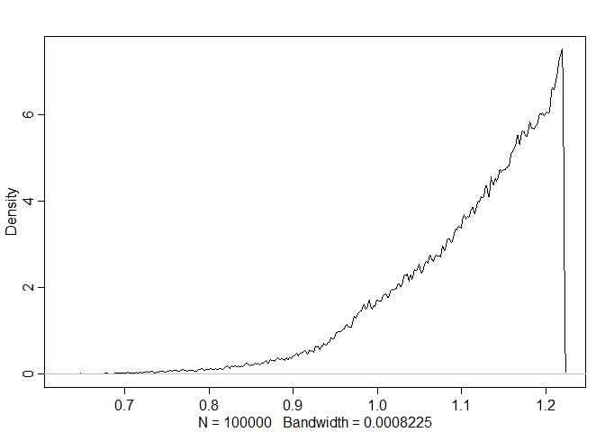

# 10. Big Entropy and the Generalized Linear Model

## 10.1. Maximum entropy


```r
library(rethinking)
```

```
## Loading required package: rstan
```

```
## Loading required package: StanHeaders
```

```
## Loading required package: ggplot2
```

```
## rstan (Version 2.19.2, GitRev: 2e1f913d3ca3)
```

```
## For execution on a local, multicore CPU with excess RAM we recommend calling
## options(mc.cores = parallel::detectCores()).
## To avoid recompilation of unchanged Stan programs, we recommend calling
## rstan_options(auto_write = TRUE)
```

```
## For improved execution time, we recommend calling
## Sys.setenv(LOCAL_CPPFLAGS = '-march=native')
## although this causes Stan to throw an error on a few processors.
```

```
## Loading required package: parallel
```

```
## Loading required package: dagitty
```

```
## rethinking (Version 1.90)
```

```
## 
## Attaching package: 'rethinking'
```

```
## The following object is masked from 'package:stats':
## 
##     rstudent
```


```r
## R code 10.1
p <- list()
p$A <- c(0,0,10,0,0)
p$B <- c(0,1,8,1,0)
p$C <- c(0,2,6,2,0)
p$D <- c(1,2,4,2,1)
p$E <- c(2,2,2,2,2)

## R code 10.2
p_norm <- lapply( p , function(q) q/sum(q))

## R code 10.3
( H <- sapply( p_norm , function(q) -sum(ifelse(q==0,0,q*log(q))) ) )
```

```
##         A         B         C         D         E 
## 0.0000000 0.6390319 0.9502705 1.4708085 1.6094379
```

```r
## R code 10.4
ways <- c(1,90,1260,37800,113400)
logwayspp <- log(ways)/10
```

### 10.1.1. Gaussian.
### 10.1.2. Binomial.


```r
## R code 10.5
# build list of the candidate distributions
p <- list()
p[[1]] <- c(1/4,1/4,1/4,1/4)
p[[2]] <- c(2/6,1/6,1/6,2/6)
p[[3]] <- c(1/6,2/6,2/6,1/6)
p[[4]] <- c(1/8,4/8,2/8,1/8)

# compute expected value of each
sapply( p , function(p) sum(p*c(0,1,1,2)) )
```

```
## [1] 1 1 1 1
```

```r
## R code 10.6
# compute entropy of each distribution
sapply( p , function(p) -sum( p*log(p) ) )
```

```
## [1] 1.386294 1.329661 1.329661 1.213008
```

```r
## R code 10.7
p <- 0.7
( A <- c( (1-p)^2 , p*(1-p) , (1-p)*p , p^2 ) )
```

```
## [1] 0.09 0.21 0.21 0.49
```

```r
## R code 10.8
-sum( A*log(A) )
```

```
## [1] 1.221729
```

```r
## R code 10.9
sim.p <- function(G=1.4) {
    x123 <- runif(3)
    x4 <- ( (G)*sum(x123)-x123[2]-x123[3] )/(2-G)
    z <- sum( c(x123,x4) )
    p <- c( x123 , x4 )/z
    list( H=-sum( p*log(p) ) , p=p )
}

## R code 10.10
H <- replicate( 1e5 , sim.p(1.4) )
dens( as.numeric(H[1,]) , adj=0.1 )
```

<!-- -->

```r
## R code 10.11
entropies <- as.numeric(H[1,])
distributions <- H[2,]

## R code 10.12
max(entropies)
```

```
## [1] 1.221729
```

```r
## R code 10.13
distributions[ which.max(entropies) ]
```

```
## [[1]]
## [1] 0.09005196 0.20998212 0.20991395 0.49005196
```

## 10.2. Generalized linear models

### 10.2.1. Meet the family.

### 10.2.2. Linking linear models to distributions.

### 10.2.3. Absolute and relative diff erences.

### 10.2.4. GLMs and information criteria.

## 10.3. Maximum entropy priors

## 10.4. Summary
