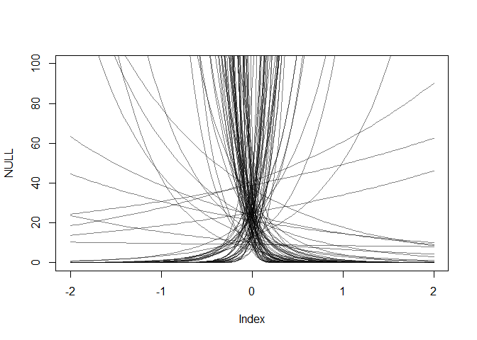
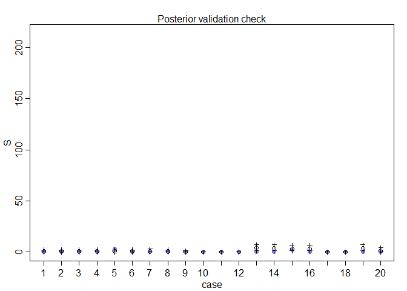
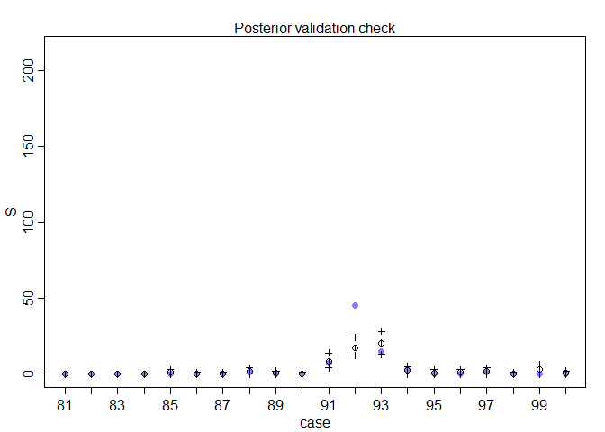

## 11.2. Poisson regression


```r
## R code 11.38
y <- rbinom(1e5,1000,1/1000)
c( mean(y) , var(y) )
```

```
## [1] 1.00031 1.00724
```

### 11.2.1. Example: Oceanic tool complexity.


```r
## R code 11.39
library(rethinking)
```

```
## Loading required package: rstan
```

```
## Loading required package: StanHeaders
```

```
## Loading required package: ggplot2
```

```
## rstan (Version 2.19.2, GitRev: 2e1f913d3ca3)
```

```
## For execution on a local, multicore CPU with excess RAM we recommend calling
## options(mc.cores = parallel::detectCores()).
## To avoid recompilation of unchanged Stan programs, we recommend calling
## rstan_options(auto_write = TRUE)
```

```
## For improved execution time, we recommend calling
## Sys.setenv(LOCAL_CPPFLAGS = '-march=native')
## although this causes Stan to throw an error on a few processors.
```

```
## Loading required package: parallel
```

```
## Loading required package: dagitty
```

```
## rethinking (Version 1.90)
```

```
## 
## Attaching package: 'rethinking'
```

```
## The following object is masked from 'package:stats':
## 
##     rstudent
```

```r
data(Kline)
d <- Kline
d
```

```
##       culture population contact total_tools mean_TU
## 1    Malekula       1100     low          13     3.2
## 2     Tikopia       1500     low          22     4.7
## 3  Santa Cruz       3600     low          24     4.0
## 4         Yap       4791    high          43     5.0
## 5    Lau Fiji       7400    high          33     5.0
## 6   Trobriand       8000    high          19     4.0
## 7       Chuuk       9200    high          40     3.8
## 8       Manus      13000     low          28     6.6
## 9       Tonga      17500    high          55     5.4
## 10     Hawaii     275000     low          71     6.6
```

```r
## R code 11.40
d$P <- scale( log(d$population) )
d$contact_id <- ifelse( d$contact=="high" , 2 , 1 )

## R code 11.41
curve( dlnorm( x , 0 , 10 ) , from=0 , to=100 , n=200 )
```

<!-- -->

```r
## R code 11.42
a <- rnorm(1e4,0,10)
lambda <- exp(a)
mean( lambda )
```

```
## [1] 3.22041e+12
```

```r
## R code 11.43
curve( dlnorm( x , 3 , 0.5 ) , from=0 , to=100 , n=200 )
```

<!-- -->

```r
## R code 11.44
N <- 100
a <- rnorm( N , 3 , 0.5 )
b <- rnorm( N , 0 , 10 )
plot( NULL , xlim=c(-2,2) , ylim=c(0,100) )
for ( i in 1:N ) curve( exp( a[i] + b[i]*x ) , add=TRUE , col=col.alpha("black",0.5) )
```

<!-- -->

```r
## R code 11.45
set.seed(10)
N <- 100
a <- rnorm( N , 3 , 0.5 )
b <- rnorm( N , 0 , 0.2 )
plot( NULL , xlim=c(-2,2) , ylim=c(0,100) )
for ( i in 1:N ) curve( exp( a[i] + b[i]*x ) , add=TRUE , col=col.alpha("black",0.5) )
```

<!-- -->

```r
## R code 11.46
x_seq <- seq( from=log(100) , to=log(200000) , length.out=100 )
lambda <- sapply( x_seq , function(x) exp( a + b*x ) )
plot( NULL , xlim=range(x_seq) , ylim=c(0,500) , xlab="log population" , ylab="total tools" )
for ( i in 1:N ) lines( x_seq , lambda[i,] , col=col.alpha("black",0.5) , lwd=1.5 )
```

<!-- -->

```r
## R code 11.47
plot( NULL , xlim=range(exp(x_seq)) , ylim=c(0,500) , xlab="population" , ylab="total tools" )
for ( i in 1:N ) lines( exp(x_seq) , lambda[i,] , col=col.alpha("black",0.5) , lwd=1.5 )
```

<!-- -->

```r
## R code 11.48
dat <- list(
    T = d$total_tools ,
    P = d$P ,
    cid = d$contact_id )

# intercept only
m11.9 <- ulam(
    alist(
        T ~ dpois( lambda ),
        log(lambda) <- a,
        a ~ dnorm(3,0.5)
    ), data=dat , chains=4 , log_lik=TRUE )
```

```
## 
## SAMPLING FOR MODEL '1016dad00d71412e9dffb1c8f58132a3' NOW (CHAIN 1).
## Chain 1: 
## Chain 1: Gradient evaluation took 0 seconds
## Chain 1: 1000 transitions using 10 leapfrog steps per transition would take 0 seconds.
## Chain 1: Adjust your expectations accordingly!
## Chain 1: 
## Chain 1: 
## Chain 1: Iteration:   1 / 1000 [  0%]  (Warmup)
## Chain 1: Iteration: 100 / 1000 [ 10%]  (Warmup)
## Chain 1: Iteration: 200 / 1000 [ 20%]  (Warmup)
## Chain 1: Iteration: 300 / 1000 [ 30%]  (Warmup)
## Chain 1: Iteration: 400 / 1000 [ 40%]  (Warmup)
## Chain 1: Iteration: 500 / 1000 [ 50%]  (Warmup)
## Chain 1: Iteration: 501 / 1000 [ 50%]  (Sampling)
## Chain 1: Iteration: 600 / 1000 [ 60%]  (Sampling)
## Chain 1: Iteration: 700 / 1000 [ 70%]  (Sampling)
## Chain 1: Iteration: 800 / 1000 [ 80%]  (Sampling)
## Chain 1: Iteration: 900 / 1000 [ 90%]  (Sampling)
## Chain 1: Iteration: 1000 / 1000 [100%]  (Sampling)
## Chain 1: 
## Chain 1:  Elapsed Time: 0.011 seconds (Warm-up)
## Chain 1:                0.011 seconds (Sampling)
## Chain 1:                0.022 seconds (Total)
## Chain 1: 
## 
## SAMPLING FOR MODEL '1016dad00d71412e9dffb1c8f58132a3' NOW (CHAIN 2).
## Chain 2: 
## Chain 2: Gradient evaluation took 0 seconds
## Chain 2: 1000 transitions using 10 leapfrog steps per transition would take 0 seconds.
## Chain 2: Adjust your expectations accordingly!
## Chain 2: 
## Chain 2: 
## Chain 2: Iteration:   1 / 1000 [  0%]  (Warmup)
## Chain 2: Iteration: 100 / 1000 [ 10%]  (Warmup)
## Chain 2: Iteration: 200 / 1000 [ 20%]  (Warmup)
## Chain 2: Iteration: 300 / 1000 [ 30%]  (Warmup)
## Chain 2: Iteration: 400 / 1000 [ 40%]  (Warmup)
## Chain 2: Iteration: 500 / 1000 [ 50%]  (Warmup)
## Chain 2: Iteration: 501 / 1000 [ 50%]  (Sampling)
## Chain 2: Iteration: 600 / 1000 [ 60%]  (Sampling)
## Chain 2: Iteration: 700 / 1000 [ 70%]  (Sampling)
## Chain 2: Iteration: 800 / 1000 [ 80%]  (Sampling)
## Chain 2: Iteration: 900 / 1000 [ 90%]  (Sampling)
## Chain 2: Iteration: 1000 / 1000 [100%]  (Sampling)
## Chain 2: 
## Chain 2:  Elapsed Time: 0.012 seconds (Warm-up)
## Chain 2:                0.012 seconds (Sampling)
## Chain 2:                0.024 seconds (Total)
## Chain 2: 
## 
## SAMPLING FOR MODEL '1016dad00d71412e9dffb1c8f58132a3' NOW (CHAIN 3).
## Chain 3: 
## Chain 3: Gradient evaluation took 0 seconds
## Chain 3: 1000 transitions using 10 leapfrog steps per transition would take 0 seconds.
## Chain 3: Adjust your expectations accordingly!
## Chain 3: 
## Chain 3: 
## Chain 3: Iteration:   1 / 1000 [  0%]  (Warmup)
## Chain 3: Iteration: 100 / 1000 [ 10%]  (Warmup)
## Chain 3: Iteration: 200 / 1000 [ 20%]  (Warmup)
## Chain 3: Iteration: 300 / 1000 [ 30%]  (Warmup)
## Chain 3: Iteration: 400 / 1000 [ 40%]  (Warmup)
## Chain 3: Iteration: 500 / 1000 [ 50%]  (Warmup)
## Chain 3: Iteration: 501 / 1000 [ 50%]  (Sampling)
## Chain 3: Iteration: 600 / 1000 [ 60%]  (Sampling)
## Chain 3: Iteration: 700 / 1000 [ 70%]  (Sampling)
## Chain 3: Iteration: 800 / 1000 [ 80%]  (Sampling)
## Chain 3: Iteration: 900 / 1000 [ 90%]  (Sampling)
## Chain 3: Iteration: 1000 / 1000 [100%]  (Sampling)
## Chain 3: 
## Chain 3:  Elapsed Time: 0.011 seconds (Warm-up)
## Chain 3:                0.011 seconds (Sampling)
## Chain 3:                0.022 seconds (Total)
## Chain 3: 
## 
## SAMPLING FOR MODEL '1016dad00d71412e9dffb1c8f58132a3' NOW (CHAIN 4).
## Chain 4: 
## Chain 4: Gradient evaluation took 0 seconds
## Chain 4: 1000 transitions using 10 leapfrog steps per transition would take 0 seconds.
## Chain 4: Adjust your expectations accordingly!
## Chain 4: 
## Chain 4: 
## Chain 4: Iteration:   1 / 1000 [  0%]  (Warmup)
## Chain 4: Iteration: 100 / 1000 [ 10%]  (Warmup)
## Chain 4: Iteration: 200 / 1000 [ 20%]  (Warmup)
## Chain 4: Iteration: 300 / 1000 [ 30%]  (Warmup)
## Chain 4: Iteration: 400 / 1000 [ 40%]  (Warmup)
## Chain 4: Iteration: 500 / 1000 [ 50%]  (Warmup)
## Chain 4: Iteration: 501 / 1000 [ 50%]  (Sampling)
## Chain 4: Iteration: 600 / 1000 [ 60%]  (Sampling)
## Chain 4: Iteration: 700 / 1000 [ 70%]  (Sampling)
## Chain 4: Iteration: 800 / 1000 [ 80%]  (Sampling)
## Chain 4: Iteration: 900 / 1000 [ 90%]  (Sampling)
## Chain 4: Iteration: 1000 / 1000 [100%]  (Sampling)
## Chain 4: 
## Chain 4:  Elapsed Time: 0.012 seconds (Warm-up)
## Chain 4:                0.011 seconds (Sampling)
## Chain 4:                0.023 seconds (Total)
## Chain 4:
```

```
## Warning: Tail Effective Samples Size (ESS) is too low, indicating posterior variances and tail quantiles may be unreliable.
## Running the chains for more iterations may help. See
## http://mc-stan.org/misc/warnings.html#tail-ess
```

```r
# interaction model
m11.10 <- ulam(
    alist(
        T ~ dpois( lambda ),
        log(lambda) <- a[cid] + b[cid]*P,
        a[cid] ~ dnorm( 3 , 0.5 ),
        b[cid] ~ dnorm( 0 , 0.2 )
    ), data=dat , chains=4 , log_lik=TRUE )
```

```
## 
## SAMPLING FOR MODEL '764b6f1d9a7aa55a03b1520aed83f315' NOW (CHAIN 1).
## Chain 1: 
## Chain 1: Gradient evaluation took 0 seconds
## Chain 1: 1000 transitions using 10 leapfrog steps per transition would take 0 seconds.
## Chain 1: Adjust your expectations accordingly!
## Chain 1: 
## Chain 1: 
## Chain 1: Iteration:   1 / 1000 [  0%]  (Warmup)
## Chain 1: Iteration: 100 / 1000 [ 10%]  (Warmup)
## Chain 1: Iteration: 200 / 1000 [ 20%]  (Warmup)
## Chain 1: Iteration: 300 / 1000 [ 30%]  (Warmup)
## Chain 1: Iteration: 400 / 1000 [ 40%]  (Warmup)
## Chain 1: Iteration: 500 / 1000 [ 50%]  (Warmup)
## Chain 1: Iteration: 501 / 1000 [ 50%]  (Sampling)
## Chain 1: Iteration: 600 / 1000 [ 60%]  (Sampling)
## Chain 1: Iteration: 700 / 1000 [ 70%]  (Sampling)
## Chain 1: Iteration: 800 / 1000 [ 80%]  (Sampling)
## Chain 1: Iteration: 900 / 1000 [ 90%]  (Sampling)
## Chain 1: Iteration: 1000 / 1000 [100%]  (Sampling)
## Chain 1: 
## Chain 1:  Elapsed Time: 0.041 seconds (Warm-up)
## Chain 1:                0.044 seconds (Sampling)
## Chain 1:                0.085 seconds (Total)
## Chain 1: 
## 
## SAMPLING FOR MODEL '764b6f1d9a7aa55a03b1520aed83f315' NOW (CHAIN 2).
## Chain 2: 
## Chain 2: Gradient evaluation took 0 seconds
## Chain 2: 1000 transitions using 10 leapfrog steps per transition would take 0 seconds.
## Chain 2: Adjust your expectations accordingly!
## Chain 2: 
## Chain 2: 
## Chain 2: Iteration:   1 / 1000 [  0%]  (Warmup)
## Chain 2: Iteration: 100 / 1000 [ 10%]  (Warmup)
## Chain 2: Iteration: 200 / 1000 [ 20%]  (Warmup)
## Chain 2: Iteration: 300 / 1000 [ 30%]  (Warmup)
## Chain 2: Iteration: 400 / 1000 [ 40%]  (Warmup)
## Chain 2: Iteration: 500 / 1000 [ 50%]  (Warmup)
## Chain 2: Iteration: 501 / 1000 [ 50%]  (Sampling)
## Chain 2: Iteration: 600 / 1000 [ 60%]  (Sampling)
## Chain 2: Iteration: 700 / 1000 [ 70%]  (Sampling)
## Chain 2: Iteration: 800 / 1000 [ 80%]  (Sampling)
## Chain 2: Iteration: 900 / 1000 [ 90%]  (Sampling)
## Chain 2: Iteration: 1000 / 1000 [100%]  (Sampling)
## Chain 2: 
## Chain 2:  Elapsed Time: 0.04 seconds (Warm-up)
## Chain 2:                0.033 seconds (Sampling)
## Chain 2:                0.073 seconds (Total)
## Chain 2: 
## 
## SAMPLING FOR MODEL '764b6f1d9a7aa55a03b1520aed83f315' NOW (CHAIN 3).
## Chain 3: 
## Chain 3: Gradient evaluation took 0 seconds
## Chain 3: 1000 transitions using 10 leapfrog steps per transition would take 0 seconds.
## Chain 3: Adjust your expectations accordingly!
## Chain 3: 
## Chain 3: 
## Chain 3: Iteration:   1 / 1000 [  0%]  (Warmup)
## Chain 3: Iteration: 100 / 1000 [ 10%]  (Warmup)
## Chain 3: Iteration: 200 / 1000 [ 20%]  (Warmup)
## Chain 3: Iteration: 300 / 1000 [ 30%]  (Warmup)
## Chain 3: Iteration: 400 / 1000 [ 40%]  (Warmup)
## Chain 3: Iteration: 500 / 1000 [ 50%]  (Warmup)
## Chain 3: Iteration: 501 / 1000 [ 50%]  (Sampling)
## Chain 3: Iteration: 600 / 1000 [ 60%]  (Sampling)
## Chain 3: Iteration: 700 / 1000 [ 70%]  (Sampling)
## Chain 3: Iteration: 800 / 1000 [ 80%]  (Sampling)
## Chain 3: Iteration: 900 / 1000 [ 90%]  (Sampling)
## Chain 3: Iteration: 1000 / 1000 [100%]  (Sampling)
## Chain 3: 
## Chain 3:  Elapsed Time: 0.039 seconds (Warm-up)
## Chain 3:                0.038 seconds (Sampling)
## Chain 3:                0.077 seconds (Total)
## Chain 3: 
## 
## SAMPLING FOR MODEL '764b6f1d9a7aa55a03b1520aed83f315' NOW (CHAIN 4).
## Chain 4: 
## Chain 4: Gradient evaluation took 0 seconds
## Chain 4: 1000 transitions using 10 leapfrog steps per transition would take 0 seconds.
## Chain 4: Adjust your expectations accordingly!
## Chain 4: 
## Chain 4: 
## Chain 4: Iteration:   1 / 1000 [  0%]  (Warmup)
## Chain 4: Iteration: 100 / 1000 [ 10%]  (Warmup)
## Chain 4: Iteration: 200 / 1000 [ 20%]  (Warmup)
## Chain 4: Iteration: 300 / 1000 [ 30%]  (Warmup)
## Chain 4: Iteration: 400 / 1000 [ 40%]  (Warmup)
## Chain 4: Iteration: 500 / 1000 [ 50%]  (Warmup)
## Chain 4: Iteration: 501 / 1000 [ 50%]  (Sampling)
## Chain 4: Iteration: 600 / 1000 [ 60%]  (Sampling)
## Chain 4: Iteration: 700 / 1000 [ 70%]  (Sampling)
## Chain 4: Iteration: 800 / 1000 [ 80%]  (Sampling)
## Chain 4: Iteration: 900 / 1000 [ 90%]  (Sampling)
## Chain 4: Iteration: 1000 / 1000 [100%]  (Sampling)
## Chain 4: 
## Chain 4:  Elapsed Time: 0.038 seconds (Warm-up)
## Chain 4:                0.033 seconds (Sampling)
## Chain 4:                0.071 seconds (Total)
## Chain 4:
```

```r
## R code 11.49
compare( m11.9 , m11.10 , func=LOO )
```

```
## Warning: Some Pareto k diagnostic values are slightly high. See help('pareto-k-diagnostic') for details.
```

```
## Warning: Some Pareto k diagnostic values are too high. See help('pareto-k-diagnostic') for details.
```

```
##              LOO     pLOO     dLOO       weight       SE      dSE
## m11.10  85.14433 6.933443  0.00000 1.000000e+00 13.05607       NA
## m11.9  141.14691 8.240517 56.00258 6.905476e-13 33.41569 32.83222
```

```r
## R code 11.50
k <- LOOPk(m11.10)
```

```
## Warning: Some Pareto k diagnostic values are too high. See help('pareto-k-diagnostic') for details.
```

```r
plot( dat$P , dat$T , xlab="log population (std)" , ylab="total tools" ,
    col=rangi2 , pch=ifelse( dat$cid==1 , 1 , 16 ) , lwd=2 ,
    ylim=c(0,75) , cex=1+normalize(k) )

# set up the horizontal axis values to compute predictions at
ns <- 100
P_seq <- seq( from=-1.4 , to=3 , length.out=ns )

# predictions for cid=1 (low contact)
lambda <- link( m11.10 , data=data.frame( P=P_seq , cid=1 ) )
lmu <- apply( lambda , 2 , mean )
lci <- apply( lambda , 2 , PI )
lines( P_seq , lmu , lty=2 , lwd=1.5 )
shade( lci , P_seq , xpd=TRUE )

# predictions for cid=2 (high contact)
lambda <- link( m11.10 , data=data.frame( P=P_seq , cid=2 ) )
lmu <- apply( lambda , 2 , mean )
lci <- apply( lambda , 2 , PI )
lines( P_seq , lmu , lty=1 , lwd=1.5 )
shade( lci , P_seq , xpd=TRUE )
```

<!-- -->

```r
## R code 11.51
plot( d$population , d$total_tools , xlab="population" , ylab="total tools" ,
    col=rangi2 , pch=ifelse( dat$cid==1 , 1 , 16 ) , lwd=2 ,
    ylim=c(0,75) , cex=1+normalize(k) )

ns <- 100
P_seq <- seq( from=-5 , to=3 , length.out=ns )
# 1.53 is sd of log(population)
# 9 is mean of log(population)
pop_seq <- exp( P_seq*1.53 + 9 )

lambda <- link( m11.10 , data=data.frame( P=P_seq , cid=1 ) )
lmu <- apply( lambda , 2 , mean )
lci <- apply( lambda , 2 , PI )
lines( pop_seq , lmu , lty=2 , lwd=1.5 )
shade( lci , pop_seq , xpd=TRUE )

lambda <- link( m11.10 , data=data.frame( P=P_seq , cid=2 ) )
lmu <- apply( lambda , 2 , mean )
lci <- apply( lambda , 2 , PI )
lines( pop_seq , lmu , lty=1 , lwd=1.5 )
shade( lci , pop_seq , xpd=TRUE )
```

<!-- -->

```r
## R code 11.52
dat2 <- list( T=d$total_tools, P=d$population, cid=d$contact_id )
m11.11 <- ulam(
    alist(
        T ~ dpois( lambda ),
        lambda <- exp(a[cid])*P^b[cid]/g,
        a[cid] ~ dnorm(1,1),
        b[cid] ~ dexp(1),
        g ~ dexp(1)
    ), data=dat2 , chains=4 , log_lik=TRUE )
```

```
## 
## SAMPLING FOR MODEL '1d9bfc94a8db83d885271311e6e47d39' NOW (CHAIN 1).
## Chain 1: 
## Chain 1: Gradient evaluation took 0 seconds
## Chain 1: 1000 transitions using 10 leapfrog steps per transition would take 0 seconds.
## Chain 1: Adjust your expectations accordingly!
## Chain 1: 
## Chain 1: 
## Chain 1: Iteration:   1 / 1000 [  0%]  (Warmup)
## Chain 1: Iteration: 100 / 1000 [ 10%]  (Warmup)
## Chain 1: Iteration: 200 / 1000 [ 20%]  (Warmup)
## Chain 1: Iteration: 300 / 1000 [ 30%]  (Warmup)
## Chain 1: Iteration: 400 / 1000 [ 40%]  (Warmup)
## Chain 1: Iteration: 500 / 1000 [ 50%]  (Warmup)
## Chain 1: Iteration: 501 / 1000 [ 50%]  (Sampling)
## Chain 1: Iteration: 600 / 1000 [ 60%]  (Sampling)
## Chain 1: Iteration: 700 / 1000 [ 70%]  (Sampling)
## Chain 1: Iteration: 800 / 1000 [ 80%]  (Sampling)
## Chain 1: Iteration: 900 / 1000 [ 90%]  (Sampling)
## Chain 1: Iteration: 1000 / 1000 [100%]  (Sampling)
## Chain 1: 
## Chain 1:  Elapsed Time: 0.573 seconds (Warm-up)
## Chain 1:                0.453 seconds (Sampling)
## Chain 1:                1.026 seconds (Total)
## Chain 1: 
## 
## SAMPLING FOR MODEL '1d9bfc94a8db83d885271311e6e47d39' NOW (CHAIN 2).
## Chain 2: 
## Chain 2: Gradient evaluation took 0 seconds
## Chain 2: 1000 transitions using 10 leapfrog steps per transition would take 0 seconds.
## Chain 2: Adjust your expectations accordingly!
## Chain 2: 
## Chain 2: 
## Chain 2: Iteration:   1 / 1000 [  0%]  (Warmup)
## Chain 2: Iteration: 100 / 1000 [ 10%]  (Warmup)
## Chain 2: Iteration: 200 / 1000 [ 20%]  (Warmup)
## Chain 2: Iteration: 300 / 1000 [ 30%]  (Warmup)
## Chain 2: Iteration: 400 / 1000 [ 40%]  (Warmup)
## Chain 2: Iteration: 500 / 1000 [ 50%]  (Warmup)
## Chain 2: Iteration: 501 / 1000 [ 50%]  (Sampling)
## Chain 2: Iteration: 600 / 1000 [ 60%]  (Sampling)
## Chain 2: Iteration: 700 / 1000 [ 70%]  (Sampling)
## Chain 2: Iteration: 800 / 1000 [ 80%]  (Sampling)
## Chain 2: Iteration: 900 / 1000 [ 90%]  (Sampling)
## Chain 2: Iteration: 1000 / 1000 [100%]  (Sampling)
## Chain 2: 
## Chain 2:  Elapsed Time: 0.534 seconds (Warm-up)
## Chain 2:                0.722 seconds (Sampling)
## Chain 2:                1.256 seconds (Total)
## Chain 2: 
## 
## SAMPLING FOR MODEL '1d9bfc94a8db83d885271311e6e47d39' NOW (CHAIN 3).
## Chain 3: 
## Chain 3: Gradient evaluation took 0 seconds
## Chain 3: 1000 transitions using 10 leapfrog steps per transition would take 0 seconds.
## Chain 3: Adjust your expectations accordingly!
## Chain 3: 
## Chain 3: 
## Chain 3: Iteration:   1 / 1000 [  0%]  (Warmup)
## Chain 3: Iteration: 100 / 1000 [ 10%]  (Warmup)
## Chain 3: Iteration: 200 / 1000 [ 20%]  (Warmup)
## Chain 3: Iteration: 300 / 1000 [ 30%]  (Warmup)
## Chain 3: Iteration: 400 / 1000 [ 40%]  (Warmup)
## Chain 3: Iteration: 500 / 1000 [ 50%]  (Warmup)
## Chain 3: Iteration: 501 / 1000 [ 50%]  (Sampling)
## Chain 3: Iteration: 600 / 1000 [ 60%]  (Sampling)
## Chain 3: Iteration: 700 / 1000 [ 70%]  (Sampling)
## Chain 3: Iteration: 800 / 1000 [ 80%]  (Sampling)
## Chain 3: Iteration: 900 / 1000 [ 90%]  (Sampling)
## Chain 3: Iteration: 1000 / 1000 [100%]  (Sampling)
## Chain 3: 
## Chain 3:  Elapsed Time: 0.542 seconds (Warm-up)
## Chain 3:                0.79 seconds (Sampling)
## Chain 3:                1.332 seconds (Total)
## Chain 3: 
## 
## SAMPLING FOR MODEL '1d9bfc94a8db83d885271311e6e47d39' NOW (CHAIN 4).
## Chain 4: 
## Chain 4: Gradient evaluation took 0 seconds
## Chain 4: 1000 transitions using 10 leapfrog steps per transition would take 0 seconds.
## Chain 4: Adjust your expectations accordingly!
## Chain 4: 
## Chain 4: 
## Chain 4: Iteration:   1 / 1000 [  0%]  (Warmup)
## Chain 4: Iteration: 100 / 1000 [ 10%]  (Warmup)
## Chain 4: Iteration: 200 / 1000 [ 20%]  (Warmup)
## Chain 4: Iteration: 300 / 1000 [ 30%]  (Warmup)
## Chain 4: Iteration: 400 / 1000 [ 40%]  (Warmup)
## Chain 4: Iteration: 500 / 1000 [ 50%]  (Warmup)
## Chain 4: Iteration: 501 / 1000 [ 50%]  (Sampling)
## Chain 4: Iteration: 600 / 1000 [ 60%]  (Sampling)
## Chain 4: Iteration: 700 / 1000 [ 70%]  (Sampling)
## Chain 4: Iteration: 800 / 1000 [ 80%]  (Sampling)
## Chain 4: Iteration: 900 / 1000 [ 90%]  (Sampling)
## Chain 4: Iteration: 1000 / 1000 [100%]  (Sampling)
## Chain 4: 
## Chain 4:  Elapsed Time: 0.529 seconds (Warm-up)
## Chain 4:                0.517 seconds (Sampling)
## Chain 4:                1.046 seconds (Total)
## Chain 4:
```

### 11.2.2. Negative binomial (gamma-Poisson) models.
### 11.2.3. Example: Exposure and the offset.


```r
## R code 11.53
num_days <- 30
y <- rpois( num_days , 1.5 )

## R code 11.54
num_weeks <- 4
y_new <- rpois( num_weeks , 0.5*7 )

## R code 11.55
y_all <- c( y , y_new )
exposure <- c( rep(1,30) , rep(7,4) )
monastery <- c( rep(0,30) , rep(1,4) )
d <- data.frame( y=y_all , days=exposure , monastery=monastery )

## R code 11.56
# compute the offset
d$log_days <- log( d$days )

# fit the model
m11.12 <- quap(
    alist(
        y ~ dpois( lambda ),
        log(lambda) <- log_days + a + b*monastery,
        a ~ dnorm( 0 , 1 ),
        b ~ dnorm( 0 , 1 )
    ), data=d )

## R code 11.57
post <- extract.samples( m11.12 )
lambda_old <- exp( post$a )
lambda_new <- exp( post$a + post$b )
precis( data.frame( lambda_old , lambda_new ) )
```

```
##                 mean        sd      5.5%     94.5%   histogram
## lambda_old 1.6260041 0.2319869 1.2844316 2.0180348  ▁▁▃▇▇▃▁▁▁▁
## lambda_new 0.4201511 0.1215776 0.2573395 0.6379235 ▁▃▇▇▃▁▁▁▁▁▁
```

### 11.2.4. Multinomial in disguise as Poisson. 


```r
## R code 11.58
library(rethinking)
data(UCBadmit)
d <- UCBadmit

## R code 11.59
# binomial model of overall admission probability
m_binom <- map(
    alist(
        admit ~ dbinom(applications,p),
        logit(p) <- a,
        a ~ dnorm(0,100)
    ),
    data=d )

# Poisson model of overall admission rate and rejection rate
d$rej <- d$reject # 'reject' is a reserved word
m_pois <- map2stan(
    alist(
        admit ~ dpois(lambda1),
        rej ~ dpois(lambda2),
        log(lambda1) <- a1,
        log(lambda2) <- a2,
        c(a1,a2) ~ dnorm(0,100)
    ),
    data=d , chains=3 , cores=3 )
```

```
## Warning: Variable 'applicant.gender' contains dots '.'.
## Will attempt to remove dots internally.
```

```
## Computing WAIC
```

```r
## R code 11.60
logistic(coef(m_binom))
```

```
##         a 
## 0.3877596
```

```r
## R code 11.61
k <- as.numeric(coef(m_pois))
exp(k[1])/(exp(k[1])+exp(k[2]))
```

```
## [1] 0.3875657
```


### 10E4. Why do Poisson regressions sometimes require the use of an offset? Provide an example.

> Poisson distribution models number of events per some unit of time/spatial region. Measurement of the outcome variable can be provided on the different scale for each observation (daily vs weekly). > Offset is used to bring all observations on the same scale.Based on the example in the book, the offset parameter is used to convert all measurements to the daily basis.  
> For example, in a tomato field, the number of plants in the area is another possible example where offset is helpful. Square of the area in different units can be treated as an offset in this case.


### 10M2. If a coefficient in a Poisson regression has value 1.7, what does this imply about the change in the outcome?


```r
exp(1.7)
```

```
## [1] 5.473947
```

> exp(1.7)=5.4739 times. This imply about the change in the outcome increases in 5.47 times.

### 10M3. Explain why the logit link is appropriate for a binomial generalized linear model.

> In a binomial generalized linear model we are typically modeling the `p` parameter with a linear model. Because this parameter is defined as a probability, it must be constrained to the interval [0, 1], and the logit link function ensures this constraint.

### 10M4. Explain why the log link is appropriate for a Poisson generalized linear model.

> In a Poisson generalized linear model we are typically modeling the `lambda` parameter with a linear model. This parameter must be positive, and the log link function ensures this constraint.

### 10H4. The data contained in data(salamanders) are counts of salamanders (Plethodon elongatus) from 47 different 49-m 2 plots in northern California. 175 The column SALAMAN is the count in each plot, and the columns PCTCOVER and FORESTAGE are percent of ground cover and age of trees in the plot, respectively. You will model SALAMAN as a Poisson variable.


```r
library(ggplot2)
data(salamanders)
d <- salamanders
summary(d)
```

```
##       SITE         SALAMAN          PCTCOVER       FORESTAGE    
##  Min.   : 1.0   Min.   : 0.000   Min.   : 0.00   Min.   :  0.0  
##  1st Qu.:12.5   1st Qu.: 0.000   1st Qu.:18.00   1st Qu.: 29.5  
##  Median :24.0   Median : 1.000   Median :83.00   Median : 64.0  
##  Mean   :24.0   Mean   : 2.468   Mean   :58.98   Mean   :168.8  
##  3rd Qu.:35.5   3rd Qu.: 3.000   3rd Qu.:88.00   3rd Qu.:266.5  
##  Max.   :47.0   Max.   :13.000   Max.   :93.00   Max.   :675.0
```

```r
str(d)
```

```
## 'data.frame':	47 obs. of  4 variables:
##  $ SITE     : int  1 2 3 4 5 6 7 8 9 10 ...
##  $ SALAMAN  : int  13 11 11 9 8 7 6 6 5 5 ...
##  $ PCTCOVER : int  85 86 90 88 89 83 83 91 88 90 ...
##  $ FORESTAGE: int  316 88 548 64 43 368 200 71 42 551 ...
```

```r
pairs(d)
```

<!-- -->


#### (a) Model the relationship between density and percent cover, using a log-link (same as the example in the book and lecture). Use weakly informative priors of your choosing. Check the quadratic approximation again, by comparing map to map2stan. Then plot the expected counts and their 89% interval against percent cover. In which ways does the model do a good job? In which ways does it do a bad job?


```r
## R code 11.43
curve( dlnorm( x , 3 , 0.5 ) , from=0 , to=100 , n=200 )
```

<!-- -->

```r
curve( dlnorm( x , 2 , 0.5 ) , from=0 , to=100 , n=200 )
```

<!-- -->

```r
curve( dlnorm( x , 1 , 0.5 ) , from=0 , to=100 , n=200 )
```

<!-- -->

```r
#choose 2
```


```r
## R code 11.45
set.seed(10)
N <- 100
a <- rnorm( N , 2 , 0.5 )
b <- rnorm( N , 0 , 0.5 )
plot( NULL , xlim=c(-2,2) , ylim=c(0,100) )
for ( i in 1:N ) curve( exp( a[i] + b[i]*x ) , add=TRUE , col=col.alpha("black",0.5) )
```

<!-- -->


```r
## R code 11.48
dat <- list(
    S = d$SALAMAN ,
    P = scale(d$PCTCOVER) ,
    FO = scale(d$FORESTAGE),
    SI = d$SITE)
str(dat)
```

```
## List of 4
##  $ S : int [1:47] 13 11 11 9 8 7 6 6 5 5 ...
##  $ P : num [1:47, 1] 0.727 0.755 0.867 0.811 0.839 ...
##   ..- attr(*, "scaled:center")= num 59
##   ..- attr(*, "scaled:scale")= num 35.8
##  $ FO: num [1:47, 1] 0.761 -0.418 1.96 -0.542 -0.65 ...
##   ..- attr(*, "scaled:center")= num 169
##   ..- attr(*, "scaled:scale")= num 194
##  $ SI: int [1:47] 1 2 3 4 5 6 7 8 9 10 ...
```

```r
head(dat)
```

```
## $S
##  [1] 13 11 11  9  8  7  6  6  5  5  4  3  3  3  3  3  2  2  2  1  1  1  1
## [24]  1  1  1  1  1  1  0  0  0  0  0  0  0  0  0  0  0  0  0  0  0  0  0
## [47]  0
## 
## $P
##             [,1]
##  [1,]  0.7273231
##  [2,]  0.7552742
##  [3,]  0.8670786
##  [4,]  0.8111764
##  [5,]  0.8391275
##  [6,]  0.6714209
##  [7,]  0.6714209
##  [8,]  0.8950297
##  [9,]  0.8111764
## [10,]  0.8670786
## [11,]  0.7832253
## [12,]  0.6714209
## [13,]  0.7832253
## [14,]  0.8391275
## [15,]  0.9229807
## [16,]  0.9509318
## [17,] -1.5926175
## [18,]  0.7832253
## [19,]  0.9509318
## [20,] -1.4528621
## [21,] -1.2013023
## [22,] -1.1174490
## [23,] -0.8379381
## [24,] -0.6981826
## [25,] -0.3627695
## [26,]  0.5875676
## [27,]  0.7552742
## [28,]  0.8111764
## [29,]  0.9229807
## [30,] -1.6485197
## [31,] -1.6205686
## [32,] -1.5646665
## [33,] -1.5087643
## [34,] -1.4249110
## [35,] -1.3969599
## [36,] -1.3410577
## [37,] -1.2572044
## [38,] -1.1733512
## [39,] -0.9776935
## [40,] -0.4186717
## [41,] -0.1950629
## [42,]  0.5037144
## [43,]  0.5316655
## [44,]  0.5875676
## [45,]  0.7552742
## [46,]  0.8391275
## [47,]  0.8950297
## attr(,"scaled:center")
## [1] 58.97872
## attr(,"scaled:scale")
## [1] 35.77678
## 
## $FO
##              [,1]
##  [1,]  0.76062747
##  [2,] -0.41758646
##  [3,]  1.95951182
##  [4,] -0.54160898
##  [5,] -0.65012868
##  [6,]  1.02934293
##  [7,]  0.16118530
##  [8,] -0.50543575
##  [9,] -0.65529629
## [10,]  1.97501464
## [11,]  2.61579765
## [12,]  0.24903458
## [13,]  0.22319655
## [14,]  1.18437108
## [15,]  0.97249927
## [16,]  1.59777948
## [17,] -0.84649767
## [18,] -0.71730755
## [19,]  1.97501464
## [20,] -0.85683288
## [21,] -0.79482162
## [22,] -0.71213994
## [23,] -0.82065965
## [24,] -0.61912305
## [25,] -0.71730755
## [26,]  0.23869937
## [27,]  2.15588081
## [28,] -0.32973718
## [29,]  0.21286134
## [30,] -0.87233570
## [31,] -0.85166528
## [32,] -0.85683288
## [33,] -0.86200049
## [34,] -0.82065965
## [35,] -0.83099486
## [36,] -0.84133007
## [37,] -0.61912305
## [38,] -0.72247515
## [39,] -0.57778221
## [40,] -0.56744700
## [41,] -0.46926251
## [42,] -0.61395545
## [43,]  0.78129789
## [44,]  1.25154994
## [45,] -0.18504424
## [46,] -0.56227940
## [47,]  0.09400643
## attr(,"scaled:center")
## [1] 168.8085
## attr(,"scaled:scale")
## [1] 193.5132
## 
## $SI
##  [1]  1  2  3  4  5  6  7  8  9 10 11 12 13 14 15 16 17 18 19 20 21 22 23
## [24] 24 25 26 27 28 29 30 31 32 33 34 35 36 37 38 39 40 41 42 43 44 45 46
## [47] 47
```

```r
m11.4H <- ulam(
    alist(
        S ~ dpois( lambda ),
        log(lambda) <- a+b*P,
        a ~ dnorm(2,0.5),
        b ~ dnorm(0,0.5)
    ), data=dat , chains=4 , log_lik=TRUE )
```

```
## 
## SAMPLING FOR MODEL 'c9936c189bcb1ec56c3a4929e210fc30' NOW (CHAIN 1).
## Chain 1: 
## Chain 1: Gradient evaluation took 0 seconds
## Chain 1: 1000 transitions using 10 leapfrog steps per transition would take 0 seconds.
## Chain 1: Adjust your expectations accordingly!
## Chain 1: 
## Chain 1: 
## Chain 1: Iteration:   1 / 1000 [  0%]  (Warmup)
## Chain 1: Iteration: 100 / 1000 [ 10%]  (Warmup)
## Chain 1: Iteration: 200 / 1000 [ 20%]  (Warmup)
## Chain 1: Iteration: 300 / 1000 [ 30%]  (Warmup)
## Chain 1: Iteration: 400 / 1000 [ 40%]  (Warmup)
## Chain 1: Iteration: 500 / 1000 [ 50%]  (Warmup)
## Chain 1: Iteration: 501 / 1000 [ 50%]  (Sampling)
## Chain 1: Iteration: 600 / 1000 [ 60%]  (Sampling)
## Chain 1: Iteration: 700 / 1000 [ 70%]  (Sampling)
## Chain 1: Iteration: 800 / 1000 [ 80%]  (Sampling)
## Chain 1: Iteration: 900 / 1000 [ 90%]  (Sampling)
## Chain 1: Iteration: 1000 / 1000 [100%]  (Sampling)
## Chain 1: 
## Chain 1:  Elapsed Time: 0.091 seconds (Warm-up)
## Chain 1:                0.078 seconds (Sampling)
## Chain 1:                0.169 seconds (Total)
## Chain 1: 
## 
## SAMPLING FOR MODEL 'c9936c189bcb1ec56c3a4929e210fc30' NOW (CHAIN 2).
## Chain 2: 
## Chain 2: Gradient evaluation took 0 seconds
## Chain 2: 1000 transitions using 10 leapfrog steps per transition would take 0 seconds.
## Chain 2: Adjust your expectations accordingly!
## Chain 2: 
## Chain 2: 
## Chain 2: Iteration:   1 / 1000 [  0%]  (Warmup)
## Chain 2: Iteration: 100 / 1000 [ 10%]  (Warmup)
## Chain 2: Iteration: 200 / 1000 [ 20%]  (Warmup)
## Chain 2: Iteration: 300 / 1000 [ 30%]  (Warmup)
## Chain 2: Iteration: 400 / 1000 [ 40%]  (Warmup)
## Chain 2: Iteration: 500 / 1000 [ 50%]  (Warmup)
## Chain 2: Iteration: 501 / 1000 [ 50%]  (Sampling)
## Chain 2: Iteration: 600 / 1000 [ 60%]  (Sampling)
## Chain 2: Iteration: 700 / 1000 [ 70%]  (Sampling)
## Chain 2: Iteration: 800 / 1000 [ 80%]  (Sampling)
## Chain 2: Iteration: 900 / 1000 [ 90%]  (Sampling)
## Chain 2: Iteration: 1000 / 1000 [100%]  (Sampling)
## Chain 2: 
## Chain 2:  Elapsed Time: 0.074 seconds (Warm-up)
## Chain 2:                0.07 seconds (Sampling)
## Chain 2:                0.144 seconds (Total)
## Chain 2: 
## 
## SAMPLING FOR MODEL 'c9936c189bcb1ec56c3a4929e210fc30' NOW (CHAIN 3).
## Chain 3: 
## Chain 3: Gradient evaluation took 0 seconds
## Chain 3: 1000 transitions using 10 leapfrog steps per transition would take 0 seconds.
## Chain 3: Adjust your expectations accordingly!
## Chain 3: 
## Chain 3: 
## Chain 3: Iteration:   1 / 1000 [  0%]  (Warmup)
## Chain 3: Iteration: 100 / 1000 [ 10%]  (Warmup)
## Chain 3: Iteration: 200 / 1000 [ 20%]  (Warmup)
## Chain 3: Iteration: 300 / 1000 [ 30%]  (Warmup)
## Chain 3: Iteration: 400 / 1000 [ 40%]  (Warmup)
## Chain 3: Iteration: 500 / 1000 [ 50%]  (Warmup)
## Chain 3: Iteration: 501 / 1000 [ 50%]  (Sampling)
## Chain 3: Iteration: 600 / 1000 [ 60%]  (Sampling)
## Chain 3: Iteration: 700 / 1000 [ 70%]  (Sampling)
## Chain 3: Iteration: 800 / 1000 [ 80%]  (Sampling)
## Chain 3: Iteration: 900 / 1000 [ 90%]  (Sampling)
## Chain 3: Iteration: 1000 / 1000 [100%]  (Sampling)
## Chain 3: 
## Chain 3:  Elapsed Time: 0.076 seconds (Warm-up)
## Chain 3:                0.073 seconds (Sampling)
## Chain 3:                0.149 seconds (Total)
## Chain 3: 
## 
## SAMPLING FOR MODEL 'c9936c189bcb1ec56c3a4929e210fc30' NOW (CHAIN 4).
## Chain 4: 
## Chain 4: Gradient evaluation took 0 seconds
## Chain 4: 1000 transitions using 10 leapfrog steps per transition would take 0 seconds.
## Chain 4: Adjust your expectations accordingly!
## Chain 4: 
## Chain 4: 
## Chain 4: Iteration:   1 / 1000 [  0%]  (Warmup)
## Chain 4: Iteration: 100 / 1000 [ 10%]  (Warmup)
## Chain 4: Iteration: 200 / 1000 [ 20%]  (Warmup)
## Chain 4: Iteration: 300 / 1000 [ 30%]  (Warmup)
## Chain 4: Iteration: 400 / 1000 [ 40%]  (Warmup)
## Chain 4: Iteration: 500 / 1000 [ 50%]  (Warmup)
## Chain 4: Iteration: 501 / 1000 [ 50%]  (Sampling)
## Chain 4: Iteration: 600 / 1000 [ 60%]  (Sampling)
## Chain 4: Iteration: 700 / 1000 [ 70%]  (Sampling)
## Chain 4: Iteration: 800 / 1000 [ 80%]  (Sampling)
## Chain 4: Iteration: 900 / 1000 [ 90%]  (Sampling)
## Chain 4: Iteration: 1000 / 1000 [100%]  (Sampling)
## Chain 4: 
## Chain 4:  Elapsed Time: 0.086 seconds (Warm-up)
## Chain 4:                0.071 seconds (Sampling)
## Chain 4:                0.157 seconds (Total)
## Chain 4:
```

```r
precis(m11.4H, depth = 2)
```

```
##        mean        sd      5.5%     94.5%    n_eff     Rhat
## a 0.6016855 0.1280645 0.3938013 0.7986178 524.7447 1.006239
## b 0.9564795 0.1515923 0.7176174 1.2035105 527.4439 1.005076
```

```r
plot(precis(m11.4H, depth = 2))
```

<!-- -->


```r
## R code 11.50
plot( dat$P , dat$S , xlab="PCTCOVER" , ylab="SALAMAN" ,
    col=rangi2 , lwd=2 ,
    ylim=c(0,15))

# set up the horizontal axis values to compute predictions at
ns <- 100
P_seq <- seq( from=-3 , to=3 , length.out=ns )

# predictions for cid=1 (low contact)
lambda <- link( m11.4H , data=data.frame( P=P_seq ) )
lmu <- apply( lambda , 2 , mean )
lci <- apply( lambda , 2 , PI )
lines( P_seq , lmu , lty=2 , lwd=1.5 )
shade( lci , P_seq , xpd=TRUE )
```

<!-- -->


#### (b) Can you improve the model by using the other predictor, FORESTAGE? Try any models you think useful. Can you explain why FORESTAGE helps or does not help with prediction?


```r
m11.4H2 <- ulam(
    alist(
        S ~ dpois( lambda ),
        log(lambda) <- a+b*P+c*FO,
        a ~ dnorm(2,0.5),
        c(b,c) ~ dnorm(0,0.5)
    ), data=dat , chains=4 , log_lik=TRUE )
```

```
## 
## SAMPLING FOR MODEL '20f2450b964865dc34de9447c141353b' NOW (CHAIN 1).
## Chain 1: 
## Chain 1: Gradient evaluation took 0 seconds
## Chain 1: 1000 transitions using 10 leapfrog steps per transition would take 0 seconds.
## Chain 1: Adjust your expectations accordingly!
## Chain 1: 
## Chain 1: 
## Chain 1: Iteration:   1 / 1000 [  0%]  (Warmup)
## Chain 1: Iteration: 100 / 1000 [ 10%]  (Warmup)
## Chain 1: Iteration: 200 / 1000 [ 20%]  (Warmup)
## Chain 1: Iteration: 300 / 1000 [ 30%]  (Warmup)
## Chain 1: Iteration: 400 / 1000 [ 40%]  (Warmup)
## Chain 1: Iteration: 500 / 1000 [ 50%]  (Warmup)
## Chain 1: Iteration: 501 / 1000 [ 50%]  (Sampling)
## Chain 1: Iteration: 600 / 1000 [ 60%]  (Sampling)
## Chain 1: Iteration: 700 / 1000 [ 70%]  (Sampling)
## Chain 1: Iteration: 800 / 1000 [ 80%]  (Sampling)
## Chain 1: Iteration: 900 / 1000 [ 90%]  (Sampling)
## Chain 1: Iteration: 1000 / 1000 [100%]  (Sampling)
## Chain 1: 
## Chain 1:  Elapsed Time: 0.106 seconds (Warm-up)
## Chain 1:                0.099 seconds (Sampling)
## Chain 1:                0.205 seconds (Total)
## Chain 1: 
## 
## SAMPLING FOR MODEL '20f2450b964865dc34de9447c141353b' NOW (CHAIN 2).
## Chain 2: 
## Chain 2: Gradient evaluation took 0 seconds
## Chain 2: 1000 transitions using 10 leapfrog steps per transition would take 0 seconds.
## Chain 2: Adjust your expectations accordingly!
## Chain 2: 
## Chain 2: 
## Chain 2: Iteration:   1 / 1000 [  0%]  (Warmup)
## Chain 2: Iteration: 100 / 1000 [ 10%]  (Warmup)
## Chain 2: Iteration: 200 / 1000 [ 20%]  (Warmup)
## Chain 2: Iteration: 300 / 1000 [ 30%]  (Warmup)
## Chain 2: Iteration: 400 / 1000 [ 40%]  (Warmup)
## Chain 2: Iteration: 500 / 1000 [ 50%]  (Warmup)
## Chain 2: Iteration: 501 / 1000 [ 50%]  (Sampling)
## Chain 2: Iteration: 600 / 1000 [ 60%]  (Sampling)
## Chain 2: Iteration: 700 / 1000 [ 70%]  (Sampling)
## Chain 2: Iteration: 800 / 1000 [ 80%]  (Sampling)
## Chain 2: Iteration: 900 / 1000 [ 90%]  (Sampling)
## Chain 2: Iteration: 1000 / 1000 [100%]  (Sampling)
## Chain 2: 
## Chain 2:  Elapsed Time: 0.112 seconds (Warm-up)
## Chain 2:                0.124 seconds (Sampling)
## Chain 2:                0.236 seconds (Total)
## Chain 2: 
## 
## SAMPLING FOR MODEL '20f2450b964865dc34de9447c141353b' NOW (CHAIN 3).
## Chain 3: 
## Chain 3: Gradient evaluation took 0 seconds
## Chain 3: 1000 transitions using 10 leapfrog steps per transition would take 0 seconds.
## Chain 3: Adjust your expectations accordingly!
## Chain 3: 
## Chain 3: 
## Chain 3: Iteration:   1 / 1000 [  0%]  (Warmup)
## Chain 3: Iteration: 100 / 1000 [ 10%]  (Warmup)
## Chain 3: Iteration: 200 / 1000 [ 20%]  (Warmup)
## Chain 3: Iteration: 300 / 1000 [ 30%]  (Warmup)
## Chain 3: Iteration: 400 / 1000 [ 40%]  (Warmup)
## Chain 3: Iteration: 500 / 1000 [ 50%]  (Warmup)
## Chain 3: Iteration: 501 / 1000 [ 50%]  (Sampling)
## Chain 3: Iteration: 600 / 1000 [ 60%]  (Sampling)
## Chain 3: Iteration: 700 / 1000 [ 70%]  (Sampling)
## Chain 3: Iteration: 800 / 1000 [ 80%]  (Sampling)
## Chain 3: Iteration: 900 / 1000 [ 90%]  (Sampling)
## Chain 3: Iteration: 1000 / 1000 [100%]  (Sampling)
## Chain 3: 
## Chain 3:  Elapsed Time: 0.114 seconds (Warm-up)
## Chain 3:                0.117 seconds (Sampling)
## Chain 3:                0.231 seconds (Total)
## Chain 3: 
## 
## SAMPLING FOR MODEL '20f2450b964865dc34de9447c141353b' NOW (CHAIN 4).
## Chain 4: 
## Chain 4: Gradient evaluation took 0 seconds
## Chain 4: 1000 transitions using 10 leapfrog steps per transition would take 0 seconds.
## Chain 4: Adjust your expectations accordingly!
## Chain 4: 
## Chain 4: 
## Chain 4: Iteration:   1 / 1000 [  0%]  (Warmup)
## Chain 4: Iteration: 100 / 1000 [ 10%]  (Warmup)
## Chain 4: Iteration: 200 / 1000 [ 20%]  (Warmup)
## Chain 4: Iteration: 300 / 1000 [ 30%]  (Warmup)
## Chain 4: Iteration: 400 / 1000 [ 40%]  (Warmup)
## Chain 4: Iteration: 500 / 1000 [ 50%]  (Warmup)
## Chain 4: Iteration: 501 / 1000 [ 50%]  (Sampling)
## Chain 4: Iteration: 600 / 1000 [ 60%]  (Sampling)
## Chain 4: Iteration: 700 / 1000 [ 70%]  (Sampling)
## Chain 4: Iteration: 800 / 1000 [ 80%]  (Sampling)
## Chain 4: Iteration: 900 / 1000 [ 90%]  (Sampling)
## Chain 4: Iteration: 1000 / 1000 [100%]  (Sampling)
## Chain 4: 
## Chain 4:  Elapsed Time: 0.105 seconds (Warm-up)
## Chain 4:                0.132 seconds (Sampling)
## Chain 4:                0.237 seconds (Total)
## Chain 4:
```

```r
precis(m11.4H2, depth = 2)
```

```
##         mean         sd       5.5%     94.5%     n_eff     Rhat
## a 0.59708534 0.12537379  0.3992998 0.7890863  789.3106 1.005663
## c 0.02064728 0.09327913 -0.1271423 0.1691226 1027.0399 1.001397
## b 0.93578512 0.16105232  0.6885546 1.1910271  842.8946 1.002654
```

```r
plot(precis(m11.4H2, depth = 2))
```

<!-- -->

```r
compare(m11.4H,m11.4H2)
```

```
##             WAIC    pWAIC    dWAIC    weight       SE      dSE
## m11.4H  213.8946 4.049624 0.000000 0.8948637 25.14479       NA
## m11.4H2 218.1775 6.947626 4.282829 0.1051363 25.99638 1.592348
```

> not better?


```r
pairs(m11.4H)
```

<!-- -->

```r
pairs(m11.4H2)
```

<!-- -->


### Week6 PDF # 3 
3. The data in data(Primates301) were first introduced at the end of Chapter 7.
In this problem, you will consider how brain size is associated with social learning. There are three parts.

First, model the number of observations of social_learning for each species as a function of the log brain size. Use a Poisson distribution for the social_learning outcome variable. Interpret the resulting posterior.


```r
library(rethinking)
data(Primates301)
d <- Primates301
str(d)
```

```
## 'data.frame':	301 obs. of  16 variables:
##  $ name               : Factor w/ 301 levels "Allenopithecus_nigroviridis",..: 1 2 3 4 5 6 7 8 9 10 ...
##  $ genus              : Factor w/ 68 levels "Allenopithecus",..: 1 2 3 3 3 3 3 3 3 4 ...
##  $ species            : Factor w/ 258 levels "abelii","aeeclis",..: 172 242 26 42 96 181 190 215 220 23 ...
##  $ subspecies         : Factor w/ 34 levels "alaotrensis",..: NA NA NA NA NA NA NA NA NA NA ...
##  $ spp_id             : int  1 2 3 4 5 6 7 8 9 10 ...
##  $ genus_id           : int  1 2 3 3 3 3 3 3 3 4 ...
##  $ social_learning    : int  0 0 0 0 0 3 0 0 0 0 ...
##  $ research_effort    : int  6 6 15 45 37 79 25 4 82 22 ...
##  $ brain              : num  58 NA 52.8 52.6 51.7 ...
##  $ body               : num  4655 78.1 6395 5383 5175 ...
##  $ group_size         : num  40 1 7.4 8.9 7.4 13.1 5.5 NA 7.9 4.1 ...
##  $ gestation          : num  NA NA NA 186 NA ...
##  $ weaning            : num  106 NA NA 323 NA ...
##  $ longevity          : num  276 NA NA 244 NA ...
##  $ sex_maturity       : num  NA NA NA 1277 NA ...
##  $ maternal_investment: num  NA NA NA 509 NA ...
```

```r
summary(d)
```

```
##                           name                genus            species   
##  Allenopithecus_nigroviridis:  1   Macaca        : 24   fulvus     :  7  
##  Allocebus_trichotis        :  1   Cercopithecus : 22   griseus    :  5  
##  Alouatta_belzebul          :  1   Microcebus    : 17   troglodytes:  4  
##  Alouatta_caraya            :  1   Lepilemur     : 16   cephus     :  3  
##  Alouatta_guariba           :  1   Trachypithecus: 13   geoffroyi  :  3  
##  Alouatta_palliata          :  1   Eulemur       : 12   nemestrina :  3  
##  (Other)                    :295   (Other)       :197   (Other)    :276  
##         subspecies      spp_id       genus_id     social_learning
##  alaotrensis :  1   Min.   :  1   Min.   : 1.00   Min.   :  0.0  
##  albifrons   :  1   1st Qu.: 76   1st Qu.:17.00   1st Qu.:  0.0  
##  albocollaris:  1   Median :151   Median :36.00   Median :  0.0  
##  atys        :  1   Mean   :151   Mean   :34.19   Mean   :  2.3  
##  boliviensis :  1   3rd Qu.:226   3rd Qu.:48.00   3rd Qu.:  0.0  
##  (Other)     : 29   Max.   :301   Max.   :68.00   Max.   :214.0  
##  NA's        :267                                 NA's   :98     
##  research_effort      brain             body             group_size    
##  Min.   :  1.00   Min.   :  1.63   Min.   :    31.23   Min.   : 1.000  
##  1st Qu.:  6.00   1st Qu.: 11.82   1st Qu.:   739.44   1st Qu.: 3.125  
##  Median : 16.00   Median : 58.55   Median :  3553.50   Median : 7.500  
##  Mean   : 38.76   Mean   : 68.49   Mean   :  6795.18   Mean   :13.263  
##  3rd Qu.: 37.75   3rd Qu.: 86.20   3rd Qu.:  7465.00   3rd Qu.:18.225  
##  Max.   :755.00   Max.   :491.27   Max.   :130000.00   Max.   :91.200  
##  NA's   :115      NA's   :117      NA's   :63          NA's   :114     
##    gestation         weaning         longevity       sex_maturity   
##  Min.   : 59.99   Min.   :  40.0   Min.   : 103.0   Min.   : 283.2  
##  1st Qu.:138.35   1st Qu.: 121.7   1st Qu.: 216.0   1st Qu.: 701.5  
##  Median :166.03   Median : 234.2   Median : 301.2   Median :1427.2  
##  Mean   :164.50   Mean   : 311.1   Mean   : 332.0   Mean   :1480.2  
##  3rd Qu.:183.26   3rd Qu.: 388.8   3rd Qu.: 393.3   3rd Qu.:1894.1  
##  Max.   :274.78   Max.   :1260.8   Max.   :1470.0   Max.   :5582.9  
##  NA's   :161      NA's   :185      NA's   :181      NA's   :194     
##  maternal_investment
##  Min.   :  99.99    
##  1st Qu.: 255.88    
##  Median : 401.35    
##  Mean   : 478.64    
##  3rd Qu.: 592.22    
##  Max.   :1492.30    
##  NA's   :197
```

```r
d2 <- d[ complete.cases( d$social_learning , d$brain , d$research_effort ) , ]
dat <- list(
    S = d2$social_learning,
    B = scale(log(d2$brain)),
    R = log(d2$research_effort)
)
```


```r
PDFm3.1 <- ulam(
    alist(
        S ~ dpois( lambda ),
        log(lambda) <- a + b*B,
        c(a,b) ~ normal(0,0.5)
        ), data=dat , chains=4 , cores=4 )
precis( PDFm3.1 )
```

```
##        mean         sd      5.5%      94.5%    n_eff     Rhat
## b  2.735638 0.07514642  2.620531  2.8548200 459.3562 1.003116
## a -1.128907 0.11495854 -1.310781 -0.9485675 467.4863 1.003175
```


```r
postcheck(PDFm3.1)
```

<!-- --><!-- --><!-- --><!-- --><!-- --><!-- --><!-- --><!-- -->

Second, some species are studied much more than others. So the number of reported instances of social_learning could be a product of research eff ort. Use the research_effort variable, specifi cally its logarithm, as an additional predictor variable. Interpret the coeffi cient for log research_effort. Does this model disagree with the previous one?


```r
PDFm3.2 <- ulam(
    alist(
        S ~ poisson( lambda ),
        log(lambda) <- a + b*B + c*R,
        c(a,b,c) ~ normal(0,0.5)
), data=dat , chains=4 , cores=4 )
precis( PDFm3.2 )
```

```
##         mean         sd       5.5%     94.5%    n_eff     Rhat
## c  1.2949154 0.05240668  1.2124693  1.378846 448.0079 1.002394
## b  0.6188776 0.07985435  0.4896039  0.743901 545.5621 1.001825
## a -4.8112060 0.23324304 -5.1935536 -4.446911 501.2784 1.001720
```


```r
postcheck(PDFm3.2)
```

<!-- --><!-- --><!-- --><!-- --><!-- --><!-- --><!-- --><!-- -->


Third, draw a DAG to represent how you think the variables social_learning, brain, and research_effort interact. Justify the DAG with the measured associations in the two models above (and any other models you used).


```r
library(dagitty)
library(ggdag)
```

```
## 
## Attaching package: 'ggdag'
```

```
## The following object is masked from 'package:ggplot2':
## 
##     expand_scale
```

```
## The following object is masked from 'package:stats':
## 
##     filter
```

```r
# S = social_learning, B = brain, R = research_effort

dag <- dagitty("dag{B -> R -> S; B->S }")
tidy_dagitty(dag)
```

```
## # A DAG with 3 nodes and 3 edges
## #
## # A tibble: 4 x 8
##   name      x     y direction to     xend  yend circular
##   <chr> <dbl> <dbl> <fct>     <chr> <dbl> <dbl> <lgl>   
## 1 B      4.63  1.32 ->        R      4.96  2.26 FALSE   
## 2 B      4.63  1.32 ->        S      3.98  2.07 FALSE   
## 3 R      4.96  2.26 ->        S      3.98  2.07 FALSE   
## 4 S      3.98  2.07 <NA>      <NA>  NA    NA    FALSE
```

```r
ggdag(dag, layout = "circle")
```

<!-- -->

