## 11.3. Censoring and survival


```r
library(rethinking)
```

```
## Loading required package: rstan
```

```
## Loading required package: StanHeaders
```

```
## Loading required package: ggplot2
```

```
## rstan (Version 2.19.2, GitRev: 2e1f913d3ca3)
```

```
## For execution on a local, multicore CPU with excess RAM we recommend calling
## options(mc.cores = parallel::detectCores()).
## To avoid recompilation of unchanged Stan programs, we recommend calling
## rstan_options(auto_write = TRUE)
```

```
## For improved execution time, we recommend calling
## Sys.setenv(LOCAL_CPPFLAGS = '-march=native')
## although this causes Stan to throw an error on a few processors.
```

```
## Loading required package: parallel
```

```
## Loading required package: dagitty
```

```
## rethinking (Version 1.90)
```

```
## 
## Attaching package: 'rethinking'
```

```
## The following object is masked from 'package:stats':
## 
##     rstudent
```

```r
## R code 11.62
N <- 2
x <- replicate( 1e5 , min(runif(N,1,100)) )
dens(x)
```

<!-- -->

```r
## R code 11.63
N <- 10
M <- 2
x <- replicate( 1e5 , sort(runif(N,1,100))[M] )
dens(x)
```

<!-- -->

### 11.3.1. Simulated cats.
### 11.3.2. Actual cats.


```r
## R code 11.64
library(rethinking)
data(AustinCats)
d <- AustinCats

d$adopt <- ifelse( d$out_event=="Adoption" , 1L , 0L )
dat <- list(
    days_to_event = as.numeric( d$days_to_event ),
    color_id = ifelse( d$color=="Black" , 1L , 2L ) ,
    adopted = d$adopt
)

m11.14 <- ulam(
    alist(
        days_to_event|adopted==1 ~ exponential( lambda ),
        days_to_event|adopted==0 ~ custom(exponential_lccdf( !Y | lambda )),
        lambda <- 1.0/mu,
        log(mu) <- a[color_id],
        a[color_id] ~ normal(0,1)
    ), data=dat , chains=4 , cores=4 )

precis( m11.14 , 2 )
```

```
##          mean          sd     5.5%    94.5%    n_eff     Rhat
## a[1] 4.050846 0.025952834 4.008215 4.092501 1505.324 1.002892
## a[2] 3.879921 0.009926435 3.863670 3.895786 1303.481 1.000096
```

```r
## R code 11.65
post <- extract.samples( m11.14 )
post$D <- exp(post$a)
precis( post , 2 )
```

```
##           mean          sd      5.5%     94.5%       histogram
## a[1]  4.050846 0.025952834  4.008215  4.092501       ▁▁▂▅▇▅▂▁▁
## a[2]  3.879921 0.009926435  3.863670  3.895786 ▁▁▁▂▃▅▇▇▅▃▂▁▁▁▁
## D[1] 57.465375 1.490995540 55.048530 59.889515     ▁▁▁▃▅▇▅▃▁▁▁
## D[2] 48.422789 0.480743923 47.639886 49.194704        ▁▁▃▇▇▂▁▁
```

```r
### R code 11.66
#model{
#    vector[22356] lambda;
#    b ~ normal( 0 , 1 );
#    a ~ normal( 0 , 1 );
#    for ( i in 1:22356 ) {
#        lambda[i] = a + b * black[i];
#        lambda[i] = exp(lambda[i]);
#    }
#    for ( i in 1:22356 )
#        if ( adopted[i] == 0 ) target += exponential_lccdf(days_to_event[i] | lambda[i]);
#    for ( i in 1:22356 )
#        if ( adopted[i] == 1 ) days_to_event[i] ~ exponential( lambda[i] );
#}

### R code 11.67
#    for ( i in 1:22356 ) {
#        if ( adopted[i] == 0 ) target += -lambda[i]*days_to_event[i];
#        if ( adopted[i] == 1 ) target += log(lambda[i]) - lambda[i]*days_to_event[i];
#    }
```

## 11.4. Summary

### 10H3 (more binomial practice, so relevant to previous weeks, but good for us)
The data contained in library(MASS);data(eagles) are records of salmon pirating attempts by Bald Eagles in Washington State. See ?eagles for details. While one eagle feeds, sometimes another will swoop in and try to steal the salmon from it. Call the feeding eagle the “victim” and the thief the “pirate.” Use the available data to build a binomial GLM of successful pirating attempts.

(a) Consider the following model:
y i ~ Binomial(n i; p i)
log pi/(1 - pi) = a + bP Pi + bV Vi + bA Ai
a ~ Normal (0 ; 10)
bP ~ Normal (0 ; 5)
bV ~ Normal (0 ; 5)
bA ~ Normal (0 ; 5)
where y is the number of successful attempts, n is the total number of attempts, P is a dummy variable indicating whether or not the pirate had large body size, V is a dummy variable indicating whether or not the victim had large body size, and fi nally A is a dummy variable indicating whether or not the pirate was an adult. Fit the model above to the eagles data, using both map and map2stan. Is the quadratic approximation okay?


```r
#?eagles
library(MASS)
data(eagles)
d <- eagles
str(d)
```

```
## 'data.frame':	8 obs. of  5 variables:
##  $ y: int  17 29 17 20 1 15 0 1
##  $ n: int  24 29 27 20 12 16 28 4
##  $ P: Factor w/ 2 levels "L","S": 1 1 1 1 2 2 2 2
##  $ A: Factor w/ 2 levels "A","I": 1 1 2 2 1 1 2 2
##  $ V: Factor w/ 2 levels "L","S": 1 2 1 2 1 2 1 2
```

```r
head(d)
```

```
##    y  n P A V
## 1 17 24 L A L
## 2 29 29 L A S
## 3 17 27 L I L
## 4 20 20 L I S
## 5  1 12 S A L
## 6 15 16 S A S
```

```r
summary(d)
```

```
##        y               n         P     A     V    
##  Min.   : 0.00   Min.   : 4.00   L:4   A:4   L:4  
##  1st Qu.: 1.00   1st Qu.:15.00   S:4   I:4   S:4  
##  Median :16.00   Median :22.00                    
##  Mean   :12.50   Mean   :20.00                    
##  3rd Qu.:17.75   3rd Qu.:27.25                    
##  Max.   :29.00   Max.   :29.00
```


```r
d$p_is_l <- ifelse(d$P=='L', 1L, 0L) # P: Size of pirating eagle (L = large, S = small).
d$p_is_a <- ifelse(d$A=='A', 1L, 0L) # A: Age of pirating eagle (I = immature, A = adult).
d$v_is_l <- ifelse(d$V=='L', 1L, 0L) # V: Size of victim eagle (L = large, S = small).

d$prob <- d$y/d$n # y: Number of successful attempts. n: Total number of attempts.

# prior trimmed data list
dat_list <- list(
    p_is_l = d$p_is_l,
    p_is_a = d$p_is_a,
    v_is_l = d$v_is_l,
    y = d$y,
    n = d$n)

str(dat_list)
```

```
## List of 5
##  $ p_is_l: int [1:8] 1 1 1 1 0 0 0 0
##  $ p_is_a: int [1:8] 1 1 0 0 1 1 0 0
##  $ v_is_l: int [1:8] 1 0 1 0 1 0 1 0
##  $ y     : int [1:8] 17 29 17 20 1 15 0 1
##  $ n     : int [1:8] 24 29 27 20 12 16 28 4
```

```r
head(dat_list)
```

```
## $p_is_l
## [1] 1 1 1 1 0 0 0 0
## 
## $p_is_a
## [1] 1 1 0 0 1 1 0 0
## 
## $v_is_l
## [1] 1 0 1 0 1 0 1 0
## 
## $y
## [1] 17 29 17 20  1 15  0  1
## 
## $n
## [1] 24 29 27 20 12 16 28  4
```

```r
summary(dat_list)
```

```
##        Length Class  Mode   
## p_is_l 8      -none- numeric
## p_is_a 8      -none- numeric
## v_is_l 8      -none- numeric
## y      8      -none- numeric
## n      8      -none- numeric
```


```r
m10H3.a <- ulam(
    alist(
        y ~ dbinom(n, p),
        logit(p) <- a + bp*p_is_l + bv*v_is_l + ba*p_is_a,
        a ~ dnorm(0, 10),
        c(bp, bv, ba) ~ dnorm(0, 5)), 
    data=dat_list, chains=4, cores = 4, log_lik=TRUE)
precis(m10H3.a)
```

```
##          mean        sd       5.5%     94.5%     n_eff     Rhat
## a   0.6262144 0.6991222 -0.4996252  1.762186  955.9263 1.005073
## ba  1.1446762 0.5585785  0.2580876  2.073533 1051.0323 1.003476
## bv -4.9783102 1.0537857 -6.7566016 -3.453451  823.0398 1.010127
## bp  4.5948297 0.9897821  3.2061423  6.280678  788.3772 1.005038
```


(b) Now interpret the estimates. If the quadratic approximation turned out okay, then it’s okay to use the map estimates. Otherwise stick to map2stan estimates. Then plot the posterior predictions. Compute and display both (1) the predicted probability of success and its 89% interval for each row (i) in the data, as well as (2) the predicted success count and its 89% interval. What different information does each type of posterior prediction provide?


```r
plot(precis(m10H3.a))
```

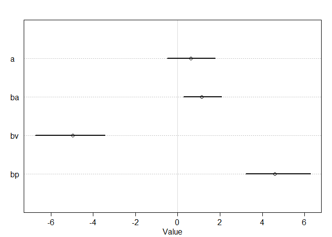<!-- -->

```r
postcheck(m10H3.a, prob=0.89)
```

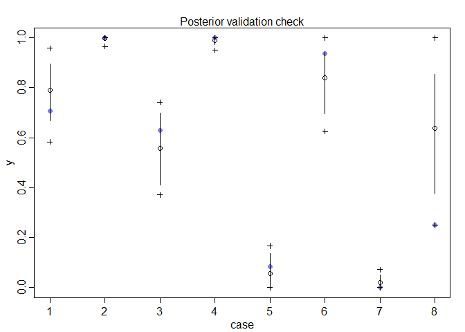<!-- -->

```r
pairs(m10H3.a)
```

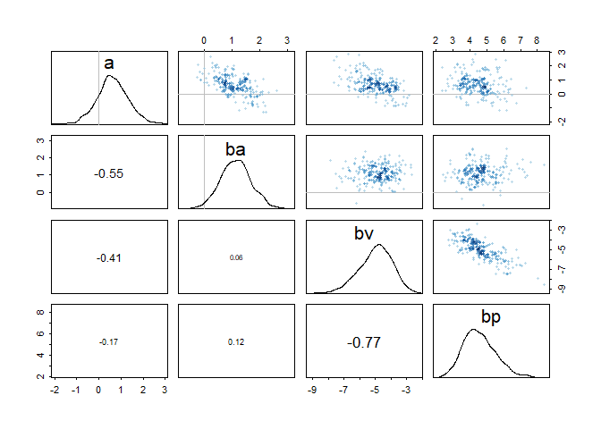<!-- -->


```r
p <- link(m10H3.a)
y <- sim(m10H3.a)

p.mean <- apply(X = p, MARGIN = 2, FUN = mean)
p.PI <- apply(X = p, MARGIN = 2, FUN = PI)
y.mean <- apply(X = y, MARGIN = 2, FUN = mean)
y.PI <- apply(X = y, MARGIN = 2, FUN = PI)

# plot the model predictions for `p` vs. the actual proportion of successes for each case
d$success.proportion <- d$y / d$n
plot(d$success.proportion, col=rangi2, ylab="successful proportion", xlab="case", xaxt="n", xlim=c(0.75,8.25) , ylim = c(0, 1), pch=16)
axis(1, at=1:8, labels=c( "LAL","LAS","LIL","LIS","SAL","SAS","SIL","SIS" ))
points( 1:8 , p.mean )
for ( i in 1:8 ) lines( c(i, i), p.PI[,i] )
```

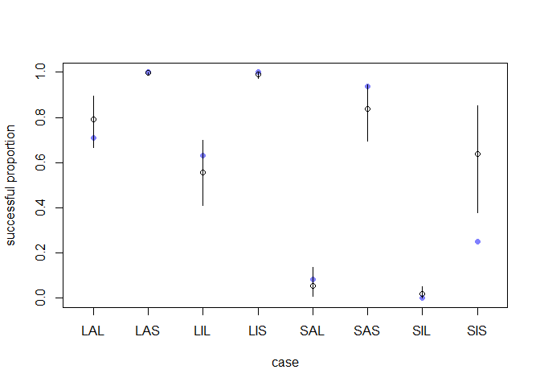<!-- -->


(c) Now try to improve the model. Consider an interaction between the pirate’s size and age (immature or adult). Compare this model to the previous one, using WAIC. Interpret.


```r
m10H3.c <- ulam(
  alist(
    y ~ dbinom(n, p),
    logit(p) <- a + bp*p_is_l + bv*v_is_l + ba*p_is_a + bpa*p_is_l*p_is_a,
    a ~ dnorm(0, 10),
    c(bp, bv, ba, bpa) ~ dnorm(0, 5)), 
  data=dat_list, chains=4, cores = 4, log_lik=TRUE)
precis(m10H3.c)
```

```
##          mean       sd      5.5%      94.5%    n_eff     Rhat
## a   -0.806065 1.066589 -2.619575  0.7584641 486.7331 1.009510
## bpa -3.019317 1.388412 -5.395968 -0.8786082 454.3850 1.005438
## ba   3.474185 1.265265  1.563574  5.5901064 409.3897 1.005971
## bv  -5.258505 1.115367 -7.169542 -3.6474185 563.5008 1.008346
## bp   6.579955 1.417282  4.456859  8.9336875 420.3822 1.007542
```

```r
pairs(m10H3.c)
```

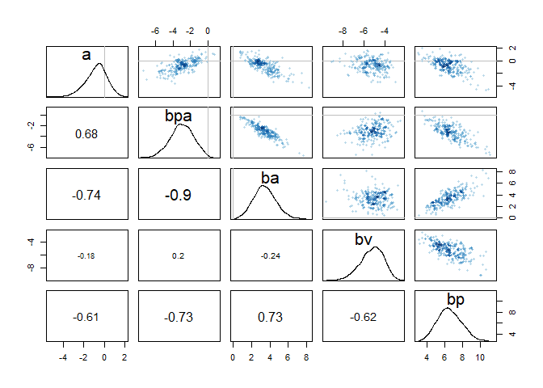<!-- -->

```r
compare(m10H3.a, m10H3.c)
```

```
##             WAIC    pWAIC    dWAIC      weight       SE      dSE
## m10H3.c 20.41595 1.933060  0.00000 0.994137944 5.546591       NA
## m10H3.a 30.68270 5.176868 10.26675 0.005862056 7.748471 3.394475
```

```r
postcheck(m10H3.c, prob=0.89)
```

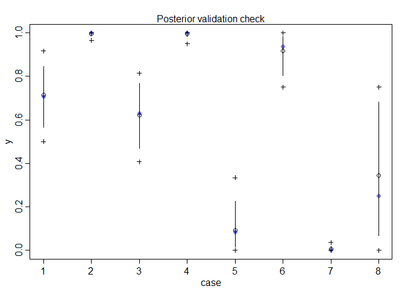<!-- -->


> the model with interaction between the pirate’s size and age looks like better (smaller WAIC and reasonable set of parameters)

# 12 Monsters and Mixtures

## 12.1. Over-dispersed outcomes

### 12.1.1. Beta-binomial.


```r
## R code 12.1
pbar <- 0.5
theta <- 5
curve( dbeta2(x,pbar,theta) , from=0 , to=1 ,
    xlab="probability" , ylab="Density" )
```

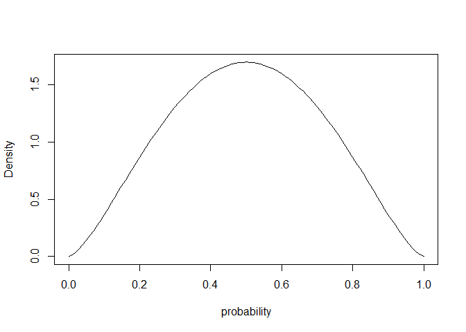<!-- -->

```r
pbar <- 0.5
theta <- 2
curve( dbeta2(x,pbar,theta) , from=0 , to=1 ,
    xlab="probability" , ylab="Density" )
```

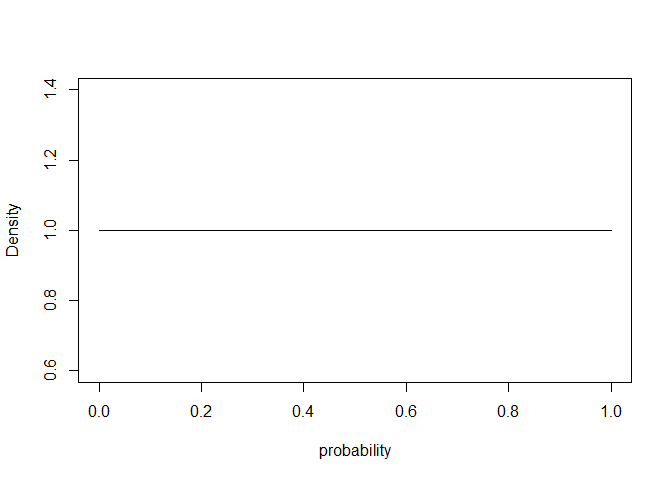<!-- -->

```r
pbar <- 0.5
theta <- 1
curve( dbeta2(x,pbar,theta) , from=0 , to=1 ,
    xlab="probability" , ylab="Density" )
```

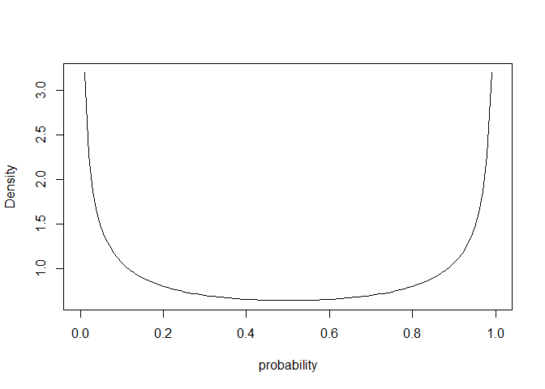<!-- -->


```r
## R code 12.2
library(rethinking)
data(UCBadmit)
d <- UCBadmit
d$gid <- ifelse( d$applicant.gender=="male" , 1L , 2L )
dat <- list( A=d$admit , N=d$applications , gid=d$gid )
m12.1 <- ulam(
    alist(
        A ~ dbetabinom( N , pbar , theta ),
        logit(pbar) <- a[gid],
        a[gid] ~ dnorm( 0 , 1.5 ),
        theta ~ dexp(1)
    ), data=dat , chains=4 )
```

```
## 
## SAMPLING FOR MODEL '379c3c9629d2ce418bfe29904221f6bc' NOW (CHAIN 1).
## Chain 1: 
## Chain 1: Gradient evaluation took 0 seconds
## Chain 1: 1000 transitions using 10 leapfrog steps per transition would take 0 seconds.
## Chain 1: Adjust your expectations accordingly!
## Chain 1: 
## Chain 1: 
## Chain 1: Iteration:   1 / 1000 [  0%]  (Warmup)
## Chain 1: Iteration: 100 / 1000 [ 10%]  (Warmup)
## Chain 1: Iteration: 200 / 1000 [ 20%]  (Warmup)
## Chain 1: Iteration: 300 / 1000 [ 30%]  (Warmup)
## Chain 1: Iteration: 400 / 1000 [ 40%]  (Warmup)
## Chain 1: Iteration: 500 / 1000 [ 50%]  (Warmup)
## Chain 1: Iteration: 501 / 1000 [ 50%]  (Sampling)
## Chain 1: Iteration: 600 / 1000 [ 60%]  (Sampling)
## Chain 1: Iteration: 700 / 1000 [ 70%]  (Sampling)
## Chain 1: Iteration: 800 / 1000 [ 80%]  (Sampling)
## Chain 1: Iteration: 900 / 1000 [ 90%]  (Sampling)
## Chain 1: Iteration: 1000 / 1000 [100%]  (Sampling)
## Chain 1: 
## Chain 1:  Elapsed Time: 0.084 seconds (Warm-up)
## Chain 1:                0.082 seconds (Sampling)
## Chain 1:                0.166 seconds (Total)
## Chain 1: 
## 
## SAMPLING FOR MODEL '379c3c9629d2ce418bfe29904221f6bc' NOW (CHAIN 2).
## Chain 2: 
## Chain 2: Gradient evaluation took 0 seconds
## Chain 2: 1000 transitions using 10 leapfrog steps per transition would take 0 seconds.
## Chain 2: Adjust your expectations accordingly!
## Chain 2: 
## Chain 2: 
## Chain 2: Iteration:   1 / 1000 [  0%]  (Warmup)
## Chain 2: Iteration: 100 / 1000 [ 10%]  (Warmup)
## Chain 2: Iteration: 200 / 1000 [ 20%]  (Warmup)
## Chain 2: Iteration: 300 / 1000 [ 30%]  (Warmup)
## Chain 2: Iteration: 400 / 1000 [ 40%]  (Warmup)
## Chain 2: Iteration: 500 / 1000 [ 50%]  (Warmup)
## Chain 2: Iteration: 501 / 1000 [ 50%]  (Sampling)
## Chain 2: Iteration: 600 / 1000 [ 60%]  (Sampling)
## Chain 2: Iteration: 700 / 1000 [ 70%]  (Sampling)
## Chain 2: Iteration: 800 / 1000 [ 80%]  (Sampling)
## Chain 2: Iteration: 900 / 1000 [ 90%]  (Sampling)
## Chain 2: Iteration: 1000 / 1000 [100%]  (Sampling)
## Chain 2: 
## Chain 2:  Elapsed Time: 0.094 seconds (Warm-up)
## Chain 2:                0.067 seconds (Sampling)
## Chain 2:                0.161 seconds (Total)
## Chain 2: 
## 
## SAMPLING FOR MODEL '379c3c9629d2ce418bfe29904221f6bc' NOW (CHAIN 3).
## Chain 3: 
## Chain 3: Gradient evaluation took 0 seconds
## Chain 3: 1000 transitions using 10 leapfrog steps per transition would take 0 seconds.
## Chain 3: Adjust your expectations accordingly!
## Chain 3: 
## Chain 3: 
## Chain 3: Iteration:   1 / 1000 [  0%]  (Warmup)
## Chain 3: Iteration: 100 / 1000 [ 10%]  (Warmup)
## Chain 3: Iteration: 200 / 1000 [ 20%]  (Warmup)
## Chain 3: Iteration: 300 / 1000 [ 30%]  (Warmup)
## Chain 3: Iteration: 400 / 1000 [ 40%]  (Warmup)
## Chain 3: Iteration: 500 / 1000 [ 50%]  (Warmup)
## Chain 3: Iteration: 501 / 1000 [ 50%]  (Sampling)
## Chain 3: Iteration: 600 / 1000 [ 60%]  (Sampling)
## Chain 3: Iteration: 700 / 1000 [ 70%]  (Sampling)
## Chain 3: Iteration: 800 / 1000 [ 80%]  (Sampling)
## Chain 3: Iteration: 900 / 1000 [ 90%]  (Sampling)
## Chain 3: Iteration: 1000 / 1000 [100%]  (Sampling)
## Chain 3: 
## Chain 3:  Elapsed Time: 0.086 seconds (Warm-up)
## Chain 3:                0.079 seconds (Sampling)
## Chain 3:                0.165 seconds (Total)
## Chain 3: 
## 
## SAMPLING FOR MODEL '379c3c9629d2ce418bfe29904221f6bc' NOW (CHAIN 4).
## Chain 4: 
## Chain 4: Gradient evaluation took 0 seconds
## Chain 4: 1000 transitions using 10 leapfrog steps per transition would take 0 seconds.
## Chain 4: Adjust your expectations accordingly!
## Chain 4: 
## Chain 4: 
## Chain 4: Iteration:   1 / 1000 [  0%]  (Warmup)
## Chain 4: Iteration: 100 / 1000 [ 10%]  (Warmup)
## Chain 4: Iteration: 200 / 1000 [ 20%]  (Warmup)
## Chain 4: Iteration: 300 / 1000 [ 30%]  (Warmup)
## Chain 4: Iteration: 400 / 1000 [ 40%]  (Warmup)
## Chain 4: Iteration: 500 / 1000 [ 50%]  (Warmup)
## Chain 4: Iteration: 501 / 1000 [ 50%]  (Sampling)
## Chain 4: Iteration: 600 / 1000 [ 60%]  (Sampling)
## Chain 4: Iteration: 700 / 1000 [ 70%]  (Sampling)
## Chain 4: Iteration: 800 / 1000 [ 80%]  (Sampling)
## Chain 4: Iteration: 900 / 1000 [ 90%]  (Sampling)
## Chain 4: Iteration: 1000 / 1000 [100%]  (Sampling)
## Chain 4: 
## Chain 4:  Elapsed Time: 0.094 seconds (Warm-up)
## Chain 4:                0.069 seconds (Sampling)
## Chain 4:                0.163 seconds (Total)
## Chain 4:
```

```r
## R code 12.3
post <- extract.samples( m12.1 )
post$da <- post$a[,1] - post$a[,2]
precis( post , depth=2 )
```

```
##             mean        sd       5.5%     94.5%       histogram
## a[1]  -0.4164595 0.4294970 -1.0887445 0.2786077        ▁▁▁▇▇▂▁▁
## a[2]  -0.2975572 0.4388439 -0.9993795 0.3985269        ▁▁▃▇▃▁▁▁
## theta  2.6388327 0.9029629  1.4006187 4.2041976 ▁▁▂▅▇▇▃▂▁▁▁▁▁▁▁
## da    -0.1189023 0.5981142 -1.0821130 0.8731436       ▁▁▁▃▇▇▂▁▁
```


```r
## R code 12.4
gid <- 2
# draw posterior mean beta distribution
curve( dbeta2(x,mean(logistic(post$a[,gid])),mean(post$theta)) , from=0 , to=1 ,
    ylab="Density" , xlab="probability admit", ylim=c(0,3) , lwd=2 )

# draw 50 beta distributions sampled from posterior
for ( i in 1:50 ) {
    p <- logistic( post$a[i,gid] )
    theta <- post$theta[i]
    curve( dbeta2(x,p,theta) , add=TRUE , col=col.alpha("black",0.2) )
}
mtext( "distribution of female admission rates" )
```

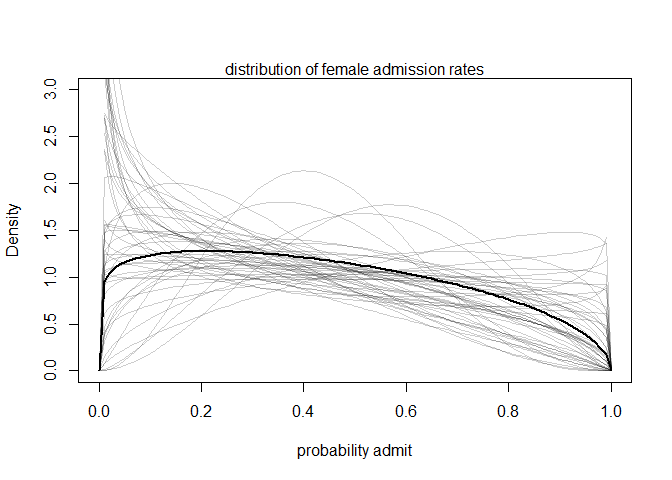<!-- -->

```r
## R code 12.5
postcheck( m12.1 )
```

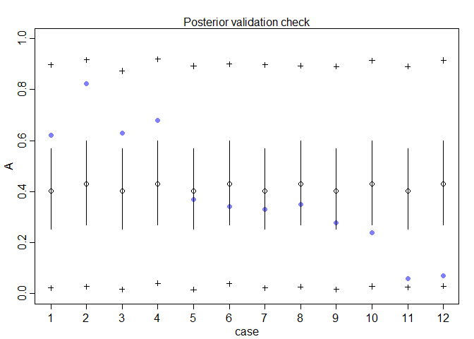<!-- -->

### 12.1.2. Negative-binomial or gamma-Poisson.


```r
## R code 12.6
library(rethinking)
data(Kline)
d <- Kline
d$P <- standardize( log(d$population) )
d$contact_id <- ifelse( d$contact=="high" , 2L , 1L )

dat2 <- list(
    T = d$total_tools,
    P = d$population,
    cid = d$contact_id )

m12.3 <- ulam(
    alist(
        T ~ dgampois( lambda , phi ),
        lambda <- exp(a[cid])*P^b[cid] / g,
        a[cid] ~ dnorm(1,1),
        b[cid] ~ dexp(1),
        g ~ dexp(1),
        phi ~ dexp(1)
    ), data=dat2 , chains=4 , log_lik=TRUE )
```

```
## 
## SAMPLING FOR MODEL '1b1b1ec6a021defe7ac1cbee74458ec5' NOW (CHAIN 1).
## Chain 1: 
## Chain 1: Gradient evaluation took 0 seconds
## Chain 1: 1000 transitions using 10 leapfrog steps per transition would take 0 seconds.
## Chain 1: Adjust your expectations accordingly!
## Chain 1: 
## Chain 1: 
## Chain 1: Iteration:   1 / 1000 [  0%]  (Warmup)
## Chain 1: Iteration: 100 / 1000 [ 10%]  (Warmup)
## Chain 1: Iteration: 200 / 1000 [ 20%]  (Warmup)
## Chain 1: Iteration: 300 / 1000 [ 30%]  (Warmup)
## Chain 1: Iteration: 400 / 1000 [ 40%]  (Warmup)
## Chain 1: Iteration: 500 / 1000 [ 50%]  (Warmup)
## Chain 1: Iteration: 501 / 1000 [ 50%]  (Sampling)
## Chain 1: Iteration: 600 / 1000 [ 60%]  (Sampling)
## Chain 1: Iteration: 700 / 1000 [ 70%]  (Sampling)
## Chain 1: Iteration: 800 / 1000 [ 80%]  (Sampling)
## Chain 1: Iteration: 900 / 1000 [ 90%]  (Sampling)
## Chain 1: Iteration: 1000 / 1000 [100%]  (Sampling)
## Chain 1: 
## Chain 1:  Elapsed Time: 0.619 seconds (Warm-up)
## Chain 1:                0.465 seconds (Sampling)
## Chain 1:                1.084 seconds (Total)
## Chain 1: 
## 
## SAMPLING FOR MODEL '1b1b1ec6a021defe7ac1cbee74458ec5' NOW (CHAIN 2).
## Chain 2: 
## Chain 2: Gradient evaluation took 0 seconds
## Chain 2: 1000 transitions using 10 leapfrog steps per transition would take 0 seconds.
## Chain 2: Adjust your expectations accordingly!
## Chain 2: 
## Chain 2: 
## Chain 2: Iteration:   1 / 1000 [  0%]  (Warmup)
## Chain 2: Iteration: 100 / 1000 [ 10%]  (Warmup)
## Chain 2: Iteration: 200 / 1000 [ 20%]  (Warmup)
## Chain 2: Iteration: 300 / 1000 [ 30%]  (Warmup)
## Chain 2: Iteration: 400 / 1000 [ 40%]  (Warmup)
## Chain 2: Iteration: 500 / 1000 [ 50%]  (Warmup)
## Chain 2: Iteration: 501 / 1000 [ 50%]  (Sampling)
## Chain 2: Iteration: 600 / 1000 [ 60%]  (Sampling)
## Chain 2: Iteration: 700 / 1000 [ 70%]  (Sampling)
## Chain 2: Iteration: 800 / 1000 [ 80%]  (Sampling)
## Chain 2: Iteration: 900 / 1000 [ 90%]  (Sampling)
## Chain 2: Iteration: 1000 / 1000 [100%]  (Sampling)
## Chain 2: 
## Chain 2:  Elapsed Time: 0.573 seconds (Warm-up)
## Chain 2:                0.569 seconds (Sampling)
## Chain 2:                1.142 seconds (Total)
## Chain 2: 
## 
## SAMPLING FOR MODEL '1b1b1ec6a021defe7ac1cbee74458ec5' NOW (CHAIN 3).
## Chain 3: 
## Chain 3: Gradient evaluation took 0 seconds
## Chain 3: 1000 transitions using 10 leapfrog steps per transition would take 0 seconds.
## Chain 3: Adjust your expectations accordingly!
## Chain 3: 
## Chain 3: 
## Chain 3: Iteration:   1 / 1000 [  0%]  (Warmup)
## Chain 3: Iteration: 100 / 1000 [ 10%]  (Warmup)
## Chain 3: Iteration: 200 / 1000 [ 20%]  (Warmup)
## Chain 3: Iteration: 300 / 1000 [ 30%]  (Warmup)
## Chain 3: Iteration: 400 / 1000 [ 40%]  (Warmup)
## Chain 3: Iteration: 500 / 1000 [ 50%]  (Warmup)
## Chain 3: Iteration: 501 / 1000 [ 50%]  (Sampling)
## Chain 3: Iteration: 600 / 1000 [ 60%]  (Sampling)
## Chain 3: Iteration: 700 / 1000 [ 70%]  (Sampling)
## Chain 3: Iteration: 800 / 1000 [ 80%]  (Sampling)
## Chain 3: Iteration: 900 / 1000 [ 90%]  (Sampling)
## Chain 3: Iteration: 1000 / 1000 [100%]  (Sampling)
## Chain 3: 
## Chain 3:  Elapsed Time: 0.582 seconds (Warm-up)
## Chain 3:                0.601 seconds (Sampling)
## Chain 3:                1.183 seconds (Total)
## Chain 3: 
## 
## SAMPLING FOR MODEL '1b1b1ec6a021defe7ac1cbee74458ec5' NOW (CHAIN 4).
## Chain 4: 
## Chain 4: Gradient evaluation took 0 seconds
## Chain 4: 1000 transitions using 10 leapfrog steps per transition would take 0 seconds.
## Chain 4: Adjust your expectations accordingly!
## Chain 4: 
## Chain 4: 
## Chain 4: Iteration:   1 / 1000 [  0%]  (Warmup)
## Chain 4: Iteration: 100 / 1000 [ 10%]  (Warmup)
## Chain 4: Iteration: 200 / 1000 [ 20%]  (Warmup)
## Chain 4: Iteration: 300 / 1000 [ 30%]  (Warmup)
## Chain 4: Iteration: 400 / 1000 [ 40%]  (Warmup)
## Chain 4: Iteration: 500 / 1000 [ 50%]  (Warmup)
## Chain 4: Iteration: 501 / 1000 [ 50%]  (Sampling)
## Chain 4: Iteration: 600 / 1000 [ 60%]  (Sampling)
## Chain 4: Iteration: 700 / 1000 [ 70%]  (Sampling)
## Chain 4: Iteration: 800 / 1000 [ 80%]  (Sampling)
## Chain 4: Iteration: 900 / 1000 [ 90%]  (Sampling)
## Chain 4: Iteration: 1000 / 1000 [100%]  (Sampling)
## Chain 4: 
## Chain 4:  Elapsed Time: 0.682 seconds (Warm-up)
## Chain 4:                0.504 seconds (Sampling)
## Chain 4:                1.186 seconds (Total)
## Chain 4:
```

### 12.1.3. Over-dispersion, entropy, and information criteria.

## 12.2. Zero-inflated outcomes

### 12.2.1. Example: Zero-inflated Poisson.


```r
## R code 12.7
# define parameters
prob_drink <- 0.2 # 20% of days
rate_work <- 1    # average 1 manuscript per day

# sample one year of production
N <- 365

# simulate days monks drink
set.seed(365)
drink <- rbinom( N , 1 , prob_drink )

# simulate manuscripts completed
y <- (1-drink)*rpois( N , rate_work )

## R code 12.8
simplehist( y , xlab="manuscripts completed" , lwd=4 )
zeros_drink <- sum(drink)
zeros_work <- sum(y==0 & drink==0)
zeros_total <- sum(y==0)
lines( c(0,0) , c(zeros_work,zeros_total) , lwd=4 , col=rangi2 )
```

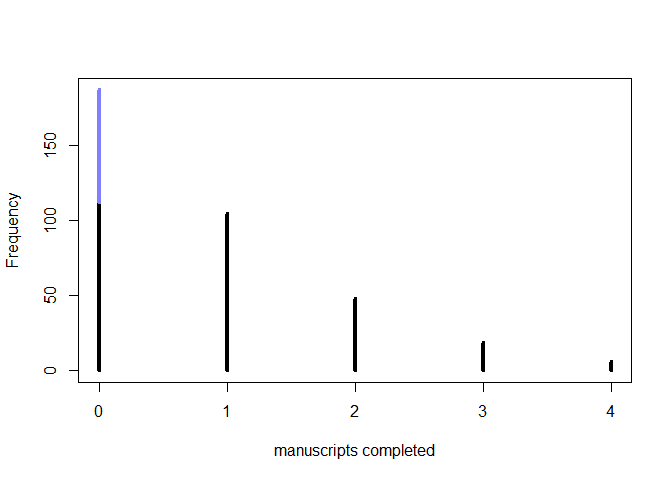<!-- -->


```r
## R code 12.9
m12.4 <- ulam(
    alist(
        y ~ dzipois( p , lambda ),
        logit(p) <- ap,
        log(lambda) <- al,
        ap ~ dnorm( -1.5 , 1 ),
        al ~ dnorm( 1 , 0.5 )
    ) , data=list(y=as.integer(y)) , chains=4 )
```

```
## 
## SAMPLING FOR MODEL '093bf5868db629d3ec8886eb28c1a9d1' NOW (CHAIN 1).
## Chain 1: 
## Chain 1: Gradient evaluation took 0 seconds
## Chain 1: 1000 transitions using 10 leapfrog steps per transition would take 0 seconds.
## Chain 1: Adjust your expectations accordingly!
## Chain 1: 
## Chain 1: 
## Chain 1: Iteration:   1 / 1000 [  0%]  (Warmup)
## Chain 1: Iteration: 100 / 1000 [ 10%]  (Warmup)
## Chain 1: Iteration: 200 / 1000 [ 20%]  (Warmup)
## Chain 1: Iteration: 300 / 1000 [ 30%]  (Warmup)
## Chain 1: Iteration: 400 / 1000 [ 40%]  (Warmup)
## Chain 1: Iteration: 500 / 1000 [ 50%]  (Warmup)
## Chain 1: Iteration: 501 / 1000 [ 50%]  (Sampling)
## Chain 1: Iteration: 600 / 1000 [ 60%]  (Sampling)
## Chain 1: Iteration: 700 / 1000 [ 70%]  (Sampling)
## Chain 1: Iteration: 800 / 1000 [ 80%]  (Sampling)
## Chain 1: Iteration: 900 / 1000 [ 90%]  (Sampling)
## Chain 1: Iteration: 1000 / 1000 [100%]  (Sampling)
## Chain 1: 
## Chain 1:  Elapsed Time: 0.662 seconds (Warm-up)
## Chain 1:                0.531 seconds (Sampling)
## Chain 1:                1.193 seconds (Total)
## Chain 1: 
## 
## SAMPLING FOR MODEL '093bf5868db629d3ec8886eb28c1a9d1' NOW (CHAIN 2).
## Chain 2: 
## Chain 2: Gradient evaluation took 0 seconds
## Chain 2: 1000 transitions using 10 leapfrog steps per transition would take 0 seconds.
## Chain 2: Adjust your expectations accordingly!
## Chain 2: 
## Chain 2: 
## Chain 2: Iteration:   1 / 1000 [  0%]  (Warmup)
## Chain 2: Iteration: 100 / 1000 [ 10%]  (Warmup)
## Chain 2: Iteration: 200 / 1000 [ 20%]  (Warmup)
## Chain 2: Iteration: 300 / 1000 [ 30%]  (Warmup)
## Chain 2: Iteration: 400 / 1000 [ 40%]  (Warmup)
## Chain 2: Iteration: 500 / 1000 [ 50%]  (Warmup)
## Chain 2: Iteration: 501 / 1000 [ 50%]  (Sampling)
## Chain 2: Iteration: 600 / 1000 [ 60%]  (Sampling)
## Chain 2: Iteration: 700 / 1000 [ 70%]  (Sampling)
## Chain 2: Iteration: 800 / 1000 [ 80%]  (Sampling)
## Chain 2: Iteration: 900 / 1000 [ 90%]  (Sampling)
## Chain 2: Iteration: 1000 / 1000 [100%]  (Sampling)
## Chain 2: 
## Chain 2:  Elapsed Time: 0.729 seconds (Warm-up)
## Chain 2:                0.601 seconds (Sampling)
## Chain 2:                1.33 seconds (Total)
## Chain 2: 
## 
## SAMPLING FOR MODEL '093bf5868db629d3ec8886eb28c1a9d1' NOW (CHAIN 3).
## Chain 3: 
## Chain 3: Gradient evaluation took 0 seconds
## Chain 3: 1000 transitions using 10 leapfrog steps per transition would take 0 seconds.
## Chain 3: Adjust your expectations accordingly!
## Chain 3: 
## Chain 3: 
## Chain 3: Iteration:   1 / 1000 [  0%]  (Warmup)
## Chain 3: Iteration: 100 / 1000 [ 10%]  (Warmup)
## Chain 3: Iteration: 200 / 1000 [ 20%]  (Warmup)
## Chain 3: Iteration: 300 / 1000 [ 30%]  (Warmup)
## Chain 3: Iteration: 400 / 1000 [ 40%]  (Warmup)
## Chain 3: Iteration: 500 / 1000 [ 50%]  (Warmup)
## Chain 3: Iteration: 501 / 1000 [ 50%]  (Sampling)
## Chain 3: Iteration: 600 / 1000 [ 60%]  (Sampling)
## Chain 3: Iteration: 700 / 1000 [ 70%]  (Sampling)
## Chain 3: Iteration: 800 / 1000 [ 80%]  (Sampling)
## Chain 3: Iteration: 900 / 1000 [ 90%]  (Sampling)
## Chain 3: Iteration: 1000 / 1000 [100%]  (Sampling)
## Chain 3: 
## Chain 3:  Elapsed Time: 0.617 seconds (Warm-up)
## Chain 3:                0.559 seconds (Sampling)
## Chain 3:                1.176 seconds (Total)
## Chain 3: 
## 
## SAMPLING FOR MODEL '093bf5868db629d3ec8886eb28c1a9d1' NOW (CHAIN 4).
## Chain 4: 
## Chain 4: Gradient evaluation took 0 seconds
## Chain 4: 1000 transitions using 10 leapfrog steps per transition would take 0 seconds.
## Chain 4: Adjust your expectations accordingly!
## Chain 4: 
## Chain 4: 
## Chain 4: Iteration:   1 / 1000 [  0%]  (Warmup)
## Chain 4: Iteration: 100 / 1000 [ 10%]  (Warmup)
## Chain 4: Iteration: 200 / 1000 [ 20%]  (Warmup)
## Chain 4: Iteration: 300 / 1000 [ 30%]  (Warmup)
## Chain 4: Iteration: 400 / 1000 [ 40%]  (Warmup)
## Chain 4: Iteration: 500 / 1000 [ 50%]  (Warmup)
## Chain 4: Iteration: 501 / 1000 [ 50%]  (Sampling)
## Chain 4: Iteration: 600 / 1000 [ 60%]  (Sampling)
## Chain 4: Iteration: 700 / 1000 [ 70%]  (Sampling)
## Chain 4: Iteration: 800 / 1000 [ 80%]  (Sampling)
## Chain 4: Iteration: 900 / 1000 [ 90%]  (Sampling)
## Chain 4: Iteration: 1000 / 1000 [100%]  (Sampling)
## Chain 4: 
## Chain 4:  Elapsed Time: 0.732 seconds (Warm-up)
## Chain 4:                0.63 seconds (Sampling)
## Chain 4:                1.362 seconds (Total)
## Chain 4:
```

```r
precis( m12.4 )
```

```
##           mean         sd       5.5%      94.5%    n_eff     Rhat
## ap -1.27555731 0.35365513 -1.8893135 -0.7905834 656.5848 1.001745
## al  0.01332671 0.09141209 -0.1391286  0.1595870 758.6212 1.000953
```

```r
## R code 12.10
inv_logit(-1.28) # probability drink
```

```
## [1] 0.2175502
```

```r
exp(0.01)       # rate finish manuscripts, when not drinking
```

```
## [1] 1.01005
```

```r
## R code 12.11
m12.4_alt <- ulam(
    alist(
        y|y>0 ~ custom( log1m(p) + poisson_lpmf(y|lambda) ),
        y|y==0 ~ custom( log_mix( p , 0 , poisson_lpmf(0|lambda) ) ),
        logit(p) <- ap,
        log(lambda) <- al,
        ap ~ dnorm(-1.5,1),
        al ~ dnorm(1,0.5)
    ) , data=list(y=as.integer(y)) , chains=4 )
```

```
## 
## SAMPLING FOR MODEL 'cd6a69d8fda3e51c662be899dbb6b0db' NOW (CHAIN 1).
## Chain 1: 
## Chain 1: Gradient evaluation took 0 seconds
## Chain 1: 1000 transitions using 10 leapfrog steps per transition would take 0 seconds.
## Chain 1: Adjust your expectations accordingly!
## Chain 1: 
## Chain 1: 
## Chain 1: Iteration:   1 / 1000 [  0%]  (Warmup)
## Chain 1: Iteration: 100 / 1000 [ 10%]  (Warmup)
## Chain 1: Iteration: 200 / 1000 [ 20%]  (Warmup)
## Chain 1: Iteration: 300 / 1000 [ 30%]  (Warmup)
## Chain 1: Iteration: 400 / 1000 [ 40%]  (Warmup)
## Chain 1: Iteration: 500 / 1000 [ 50%]  (Warmup)
## Chain 1: Iteration: 501 / 1000 [ 50%]  (Sampling)
## Chain 1: Iteration: 600 / 1000 [ 60%]  (Sampling)
## Chain 1: Iteration: 700 / 1000 [ 70%]  (Sampling)
## Chain 1: Iteration: 800 / 1000 [ 80%]  (Sampling)
## Chain 1: Iteration: 900 / 1000 [ 90%]  (Sampling)
## Chain 1: Iteration: 1000 / 1000 [100%]  (Sampling)
## Chain 1: 
## Chain 1:  Elapsed Time: 0.591 seconds (Warm-up)
## Chain 1:                0.537 seconds (Sampling)
## Chain 1:                1.128 seconds (Total)
## Chain 1: 
## 
## SAMPLING FOR MODEL 'cd6a69d8fda3e51c662be899dbb6b0db' NOW (CHAIN 2).
## Chain 2: 
## Chain 2: Gradient evaluation took 0 seconds
## Chain 2: 1000 transitions using 10 leapfrog steps per transition would take 0 seconds.
## Chain 2: Adjust your expectations accordingly!
## Chain 2: 
## Chain 2: 
## Chain 2: Iteration:   1 / 1000 [  0%]  (Warmup)
## Chain 2: Iteration: 100 / 1000 [ 10%]  (Warmup)
## Chain 2: Iteration: 200 / 1000 [ 20%]  (Warmup)
## Chain 2: Iteration: 300 / 1000 [ 30%]  (Warmup)
## Chain 2: Iteration: 400 / 1000 [ 40%]  (Warmup)
## Chain 2: Iteration: 500 / 1000 [ 50%]  (Warmup)
## Chain 2: Iteration: 501 / 1000 [ 50%]  (Sampling)
## Chain 2: Iteration: 600 / 1000 [ 60%]  (Sampling)
## Chain 2: Iteration: 700 / 1000 [ 70%]  (Sampling)
## Chain 2: Iteration: 800 / 1000 [ 80%]  (Sampling)
## Chain 2: Iteration: 900 / 1000 [ 90%]  (Sampling)
## Chain 2: Iteration: 1000 / 1000 [100%]  (Sampling)
## Chain 2: 
## Chain 2:  Elapsed Time: 0.641 seconds (Warm-up)
## Chain 2:                0.571 seconds (Sampling)
## Chain 2:                1.212 seconds (Total)
## Chain 2: 
## 
## SAMPLING FOR MODEL 'cd6a69d8fda3e51c662be899dbb6b0db' NOW (CHAIN 3).
## Chain 3: 
## Chain 3: Gradient evaluation took 0.001 seconds
## Chain 3: 1000 transitions using 10 leapfrog steps per transition would take 10 seconds.
## Chain 3: Adjust your expectations accordingly!
## Chain 3: 
## Chain 3: 
## Chain 3: Iteration:   1 / 1000 [  0%]  (Warmup)
## Chain 3: Iteration: 100 / 1000 [ 10%]  (Warmup)
## Chain 3: Iteration: 200 / 1000 [ 20%]  (Warmup)
## Chain 3: Iteration: 300 / 1000 [ 30%]  (Warmup)
## Chain 3: Iteration: 400 / 1000 [ 40%]  (Warmup)
## Chain 3: Iteration: 500 / 1000 [ 50%]  (Warmup)
## Chain 3: Iteration: 501 / 1000 [ 50%]  (Sampling)
## Chain 3: Iteration: 600 / 1000 [ 60%]  (Sampling)
## Chain 3: Iteration: 700 / 1000 [ 70%]  (Sampling)
## Chain 3: Iteration: 800 / 1000 [ 80%]  (Sampling)
## Chain 3: Iteration: 900 / 1000 [ 90%]  (Sampling)
## Chain 3: Iteration: 1000 / 1000 [100%]  (Sampling)
## Chain 3: 
## Chain 3:  Elapsed Time: 0.792 seconds (Warm-up)
## Chain 3:                0.564 seconds (Sampling)
## Chain 3:                1.356 seconds (Total)
## Chain 3: 
## 
## SAMPLING FOR MODEL 'cd6a69d8fda3e51c662be899dbb6b0db' NOW (CHAIN 4).
## Chain 4: 
## Chain 4: Gradient evaluation took 0 seconds
## Chain 4: 1000 transitions using 10 leapfrog steps per transition would take 0 seconds.
## Chain 4: Adjust your expectations accordingly!
## Chain 4: 
## Chain 4: 
## Chain 4: Iteration:   1 / 1000 [  0%]  (Warmup)
## Chain 4: Iteration: 100 / 1000 [ 10%]  (Warmup)
## Chain 4: Iteration: 200 / 1000 [ 20%]  (Warmup)
## Chain 4: Iteration: 300 / 1000 [ 30%]  (Warmup)
## Chain 4: Iteration: 400 / 1000 [ 40%]  (Warmup)
## Chain 4: Iteration: 500 / 1000 [ 50%]  (Warmup)
## Chain 4: Iteration: 501 / 1000 [ 50%]  (Sampling)
## Chain 4: Iteration: 600 / 1000 [ 60%]  (Sampling)
## Chain 4: Iteration: 700 / 1000 [ 70%]  (Sampling)
## Chain 4: Iteration: 800 / 1000 [ 80%]  (Sampling)
## Chain 4: Iteration: 900 / 1000 [ 90%]  (Sampling)
## Chain 4: Iteration: 1000 / 1000 [100%]  (Sampling)
## Chain 4: 
## Chain 4:  Elapsed Time: 0.601 seconds (Warm-up)
## Chain 4:                0.643 seconds (Sampling)
## Chain 4:                1.244 seconds (Total)
## Chain 4:
```

## 12.6. Practice

### 11E3. When count data are zero-inflated, using a model that ignores zero-inflation will tend to induce which kind of inferential error?

> It will underestimate true value of "lambda" for Poisson regression or parameter "p" for Binomial regression, as it would try to explain large number of zeros with small values of lambda. Using an example from the chapter:


```r
## R code 12.7
# define parameters
prob_drink <- 0.2 # 20% of days
rate_work <- 1    # average 1 manuscript per day

# sample one year of production
N <- 365

# simulate days monks drink
set.seed(365)
drink <- rbinom( N , 1 , prob_drink )

# simulate manuscripts completed
y <- (1-drink)*rpois( N , rate_work )

## fit zero-inflated Poisson 
m12.4 <- ulam(
    alist(
        y ~ dzipois( p , lambda ),
        logit(p) <- ap,
        log(lambda) <- al,
        ap ~ dnorm( -1.5 , 1 ),
        al ~ dnorm( 1 , 0.5 )
    ) , data=list(y=as.integer(y)) , chains=4 , log_lik=TRUE)
```

```
## 
## SAMPLING FOR MODEL '8cca1d36f151560892c11c83444426e2' NOW (CHAIN 1).
## Chain 1: 
## Chain 1: Gradient evaluation took 0.001 seconds
## Chain 1: 1000 transitions using 10 leapfrog steps per transition would take 10 seconds.
## Chain 1: Adjust your expectations accordingly!
## Chain 1: 
## Chain 1: 
## Chain 1: Iteration:   1 / 1000 [  0%]  (Warmup)
## Chain 1: Iteration: 100 / 1000 [ 10%]  (Warmup)
## Chain 1: Iteration: 200 / 1000 [ 20%]  (Warmup)
## Chain 1: Iteration: 300 / 1000 [ 30%]  (Warmup)
## Chain 1: Iteration: 400 / 1000 [ 40%]  (Warmup)
## Chain 1: Iteration: 500 / 1000 [ 50%]  (Warmup)
## Chain 1: Iteration: 501 / 1000 [ 50%]  (Sampling)
## Chain 1: Iteration: 600 / 1000 [ 60%]  (Sampling)
## Chain 1: Iteration: 700 / 1000 [ 70%]  (Sampling)
## Chain 1: Iteration: 800 / 1000 [ 80%]  (Sampling)
## Chain 1: Iteration: 900 / 1000 [ 90%]  (Sampling)
## Chain 1: Iteration: 1000 / 1000 [100%]  (Sampling)
## Chain 1: 
## Chain 1:  Elapsed Time: 0.998 seconds (Warm-up)
## Chain 1:                0.568 seconds (Sampling)
## Chain 1:                1.566 seconds (Total)
## Chain 1: 
## 
## SAMPLING FOR MODEL '8cca1d36f151560892c11c83444426e2' NOW (CHAIN 2).
## Chain 2: 
## Chain 2: Gradient evaluation took 0 seconds
## Chain 2: 1000 transitions using 10 leapfrog steps per transition would take 0 seconds.
## Chain 2: Adjust your expectations accordingly!
## Chain 2: 
## Chain 2: 
## Chain 2: Iteration:   1 / 1000 [  0%]  (Warmup)
## Chain 2: Iteration: 100 / 1000 [ 10%]  (Warmup)
## Chain 2: Iteration: 200 / 1000 [ 20%]  (Warmup)
## Chain 2: Iteration: 300 / 1000 [ 30%]  (Warmup)
## Chain 2: Iteration: 400 / 1000 [ 40%]  (Warmup)
## Chain 2: Iteration: 500 / 1000 [ 50%]  (Warmup)
## Chain 2: Iteration: 501 / 1000 [ 50%]  (Sampling)
## Chain 2: Iteration: 600 / 1000 [ 60%]  (Sampling)
## Chain 2: Iteration: 700 / 1000 [ 70%]  (Sampling)
## Chain 2: Iteration: 800 / 1000 [ 80%]  (Sampling)
## Chain 2: Iteration: 900 / 1000 [ 90%]  (Sampling)
## Chain 2: Iteration: 1000 / 1000 [100%]  (Sampling)
## Chain 2: 
## Chain 2:  Elapsed Time: 1.003 seconds (Warm-up)
## Chain 2:                0.905 seconds (Sampling)
## Chain 2:                1.908 seconds (Total)
## Chain 2: 
## 
## SAMPLING FOR MODEL '8cca1d36f151560892c11c83444426e2' NOW (CHAIN 3).
## Chain 3: 
## Chain 3: Gradient evaluation took 0 seconds
## Chain 3: 1000 transitions using 10 leapfrog steps per transition would take 0 seconds.
## Chain 3: Adjust your expectations accordingly!
## Chain 3: 
## Chain 3: 
## Chain 3: Iteration:   1 / 1000 [  0%]  (Warmup)
## Chain 3: Iteration: 100 / 1000 [ 10%]  (Warmup)
## Chain 3: Iteration: 200 / 1000 [ 20%]  (Warmup)
## Chain 3: Iteration: 300 / 1000 [ 30%]  (Warmup)
## Chain 3: Iteration: 400 / 1000 [ 40%]  (Warmup)
## Chain 3: Iteration: 500 / 1000 [ 50%]  (Warmup)
## Chain 3: Iteration: 501 / 1000 [ 50%]  (Sampling)
## Chain 3: Iteration: 600 / 1000 [ 60%]  (Sampling)
## Chain 3: Iteration: 700 / 1000 [ 70%]  (Sampling)
## Chain 3: Iteration: 800 / 1000 [ 80%]  (Sampling)
## Chain 3: Iteration: 900 / 1000 [ 90%]  (Sampling)
## Chain 3: Iteration: 1000 / 1000 [100%]  (Sampling)
## Chain 3: 
## Chain 3:  Elapsed Time: 0.833 seconds (Warm-up)
## Chain 3:                0.71 seconds (Sampling)
## Chain 3:                1.543 seconds (Total)
## Chain 3: 
## 
## SAMPLING FOR MODEL '8cca1d36f151560892c11c83444426e2' NOW (CHAIN 4).
## Chain 4: 
## Chain 4: Gradient evaluation took 0 seconds
## Chain 4: 1000 transitions using 10 leapfrog steps per transition would take 0 seconds.
## Chain 4: Adjust your expectations accordingly!
## Chain 4: 
## Chain 4: 
## Chain 4: Iteration:   1 / 1000 [  0%]  (Warmup)
## Chain 4: Iteration: 100 / 1000 [ 10%]  (Warmup)
## Chain 4: Iteration: 200 / 1000 [ 20%]  (Warmup)
## Chain 4: Iteration: 300 / 1000 [ 30%]  (Warmup)
## Chain 4: Iteration: 400 / 1000 [ 40%]  (Warmup)
## Chain 4: Iteration: 500 / 1000 [ 50%]  (Warmup)
## Chain 4: Iteration: 501 / 1000 [ 50%]  (Sampling)
## Chain 4: Iteration: 600 / 1000 [ 60%]  (Sampling)
## Chain 4: Iteration: 700 / 1000 [ 70%]  (Sampling)
## Chain 4: Iteration: 800 / 1000 [ 80%]  (Sampling)
## Chain 4: Iteration: 900 / 1000 [ 90%]  (Sampling)
## Chain 4: Iteration: 1000 / 1000 [100%]  (Sampling)
## Chain 4: 
## Chain 4:  Elapsed Time: 1.023 seconds (Warm-up)
## Chain 4:                0.731 seconds (Sampling)
## Chain 4:                1.754 seconds (Total)
## Chain 4:
```

```r
precis( m12.4 )
```

```
##           mean         sd       5.5%      94.5%    n_eff     Rhat
## ap -1.27555731 0.35365513 -1.8893135 -0.7905834 656.5848 1.001745
## al  0.01332671 0.09141209 -0.1391286  0.1595870 758.6212 1.000953
```

```r
## fit ordinary Poisson
m12.4_2 <- ulam(
    alist(
        y ~ dpois(lambda),
        log(lambda) <- al,
        al ~ dnorm( 1 , 0.5 )
    ) , data=list(y=as.integer(y)) , chains=4 , log_lik=TRUE)
```

```
## 
## SAMPLING FOR MODEL '67fcd1f548cef95fb377eed4d34504e6' NOW (CHAIN 1).
## Chain 1: 
## Chain 1: Gradient evaluation took 0 seconds
## Chain 1: 1000 transitions using 10 leapfrog steps per transition would take 0 seconds.
## Chain 1: Adjust your expectations accordingly!
## Chain 1: 
## Chain 1: 
## Chain 1: Iteration:   1 / 1000 [  0%]  (Warmup)
## Chain 1: Iteration: 100 / 1000 [ 10%]  (Warmup)
## Chain 1: Iteration: 200 / 1000 [ 20%]  (Warmup)
## Chain 1: Iteration: 300 / 1000 [ 30%]  (Warmup)
## Chain 1: Iteration: 400 / 1000 [ 40%]  (Warmup)
## Chain 1: Iteration: 500 / 1000 [ 50%]  (Warmup)
## Chain 1: Iteration: 501 / 1000 [ 50%]  (Sampling)
## Chain 1: Iteration: 600 / 1000 [ 60%]  (Sampling)
## Chain 1: Iteration: 700 / 1000 [ 70%]  (Sampling)
## Chain 1: Iteration: 800 / 1000 [ 80%]  (Sampling)
## Chain 1: Iteration: 900 / 1000 [ 90%]  (Sampling)
## Chain 1: Iteration: 1000 / 1000 [100%]  (Sampling)
## Chain 1: 
## Chain 1:  Elapsed Time: 0.077 seconds (Warm-up)
## Chain 1:                0.076 seconds (Sampling)
## Chain 1:                0.153 seconds (Total)
## Chain 1: 
## 
## SAMPLING FOR MODEL '67fcd1f548cef95fb377eed4d34504e6' NOW (CHAIN 2).
## Chain 2: 
## Chain 2: Gradient evaluation took 0 seconds
## Chain 2: 1000 transitions using 10 leapfrog steps per transition would take 0 seconds.
## Chain 2: Adjust your expectations accordingly!
## Chain 2: 
## Chain 2: 
## Chain 2: Iteration:   1 / 1000 [  0%]  (Warmup)
## Chain 2: Iteration: 100 / 1000 [ 10%]  (Warmup)
## Chain 2: Iteration: 200 / 1000 [ 20%]  (Warmup)
## Chain 2: Iteration: 300 / 1000 [ 30%]  (Warmup)
## Chain 2: Iteration: 400 / 1000 [ 40%]  (Warmup)
## Chain 2: Iteration: 500 / 1000 [ 50%]  (Warmup)
## Chain 2: Iteration: 501 / 1000 [ 50%]  (Sampling)
## Chain 2: Iteration: 600 / 1000 [ 60%]  (Sampling)
## Chain 2: Iteration: 700 / 1000 [ 70%]  (Sampling)
## Chain 2: Iteration: 800 / 1000 [ 80%]  (Sampling)
## Chain 2: Iteration: 900 / 1000 [ 90%]  (Sampling)
## Chain 2: Iteration: 1000 / 1000 [100%]  (Sampling)
## Chain 2: 
## Chain 2:  Elapsed Time: 0.079 seconds (Warm-up)
## Chain 2:                0.079 seconds (Sampling)
## Chain 2:                0.158 seconds (Total)
## Chain 2: 
## 
## SAMPLING FOR MODEL '67fcd1f548cef95fb377eed4d34504e6' NOW (CHAIN 3).
## Chain 3: 
## Chain 3: Gradient evaluation took 0 seconds
## Chain 3: 1000 transitions using 10 leapfrog steps per transition would take 0 seconds.
## Chain 3: Adjust your expectations accordingly!
## Chain 3: 
## Chain 3: 
## Chain 3: Iteration:   1 / 1000 [  0%]  (Warmup)
## Chain 3: Iteration: 100 / 1000 [ 10%]  (Warmup)
## Chain 3: Iteration: 200 / 1000 [ 20%]  (Warmup)
## Chain 3: Iteration: 300 / 1000 [ 30%]  (Warmup)
## Chain 3: Iteration: 400 / 1000 [ 40%]  (Warmup)
## Chain 3: Iteration: 500 / 1000 [ 50%]  (Warmup)
## Chain 3: Iteration: 501 / 1000 [ 50%]  (Sampling)
## Chain 3: Iteration: 600 / 1000 [ 60%]  (Sampling)
## Chain 3: Iteration: 700 / 1000 [ 70%]  (Sampling)
## Chain 3: Iteration: 800 / 1000 [ 80%]  (Sampling)
## Chain 3: Iteration: 900 / 1000 [ 90%]  (Sampling)
## Chain 3: Iteration: 1000 / 1000 [100%]  (Sampling)
## Chain 3: 
## Chain 3:  Elapsed Time: 0.083 seconds (Warm-up)
## Chain 3:                0.089 seconds (Sampling)
## Chain 3:                0.172 seconds (Total)
## Chain 3: 
## 
## SAMPLING FOR MODEL '67fcd1f548cef95fb377eed4d34504e6' NOW (CHAIN 4).
## Chain 4: 
## Chain 4: Gradient evaluation took 0 seconds
## Chain 4: 1000 transitions using 10 leapfrog steps per transition would take 0 seconds.
## Chain 4: Adjust your expectations accordingly!
## Chain 4: 
## Chain 4: 
## Chain 4: Iteration:   1 / 1000 [  0%]  (Warmup)
## Chain 4: Iteration: 100 / 1000 [ 10%]  (Warmup)
## Chain 4: Iteration: 200 / 1000 [ 20%]  (Warmup)
## Chain 4: Iteration: 300 / 1000 [ 30%]  (Warmup)
## Chain 4: Iteration: 400 / 1000 [ 40%]  (Warmup)
## Chain 4: Iteration: 500 / 1000 [ 50%]  (Warmup)
## Chain 4: Iteration: 501 / 1000 [ 50%]  (Sampling)
## Chain 4: Iteration: 600 / 1000 [ 60%]  (Sampling)
## Chain 4: Iteration: 700 / 1000 [ 70%]  (Sampling)
## Chain 4: Iteration: 800 / 1000 [ 80%]  (Sampling)
## Chain 4: Iteration: 900 / 1000 [ 90%]  (Sampling)
## Chain 4: Iteration: 1000 / 1000 [100%]  (Sampling)
## Chain 4: 
## Chain 4:  Elapsed Time: 0.084 seconds (Warm-up)
## Chain 4:                0.088 seconds (Sampling)
## Chain 4:                0.172 seconds (Total)
## Chain 4:
```

```r
precis( m12.4_2 )
```

```
##          mean         sd       5.5%      94.5%    n_eff     Rhat
## al -0.2413576 0.06044357 -0.3347747 -0.1449705 554.2046 1.010428
```

```r
compare( m12.4, m12.4_2)
```

```
##             WAIC    pWAIC    dWAIC      weight       SE      dSE
## m12.4   875.3630 2.016731 0.000000 0.990551564 28.53715       NA
## m12.4_2 884.6678 1.265820 9.304825 0.009448436 30.46100 6.633845
```


### 11E4. Over-dispersion is common in count data. Give an example of a natural process that might produce over-dispersed counts. Can you also give an example of a process that might produce underdispersed counts?

> One of possible artificial examples of under-dispersed variable is a Binomial varibale with all observations smaller than a threshold substituted with the threshold itself. For example, some tomato cultivars are susceptible to Cuscuta and some cultivars are resistant to Cuscuta. If we overexpress a R protein in susceptible clutivars, it will make susceptible plants become resistant. However, if the R gene expression is not high enough in some individual plants, then it won't be able to triger the resistant response. So, these individual plants will still be classified as susceptible.


### 11M3. (optional).  Can you modify the derivation of the zero-inflated Poisson distribution (ZIPoisson) from the chapter to construct a zero-inflated binomial distribution?

> just change Poisson likelihood to Binomial 

 p - probability of zero
 n - number of trials
 L - probability of completed manuscripts with some average rate 
 $Pr(0|p,L) = Pr(drink|p) + Pr(work|p)* Pr(0|L) = p + (1-p) exp(-L)$
 
 yi ~ ZIPoisson(pi; Li)


### 11H6. 
#### The data in data(Fish) are records of visits to a national park. See ?Fish for details. The question of interest is how many fish an average visitor takes per hour, when fishing. The problemis that not everyone tried to fish, so the fish_caught numbers are zero-inflated. As with the monks example in the chapter, there is a process that determines who is fishing (working) and another process that determines fish per hour (manuscripts per day), conditional on fishing (working). We want to model both. Otherwise we’ll end up with an underestimate of rate of fish extraction from the park. You will model these data using zero-inflated Poisson GLMs. Predict fish_caught as a function of any of the other variables you think are relevant. One thing you must do, however, is use a proper Poisson off set/exposure in the Poisson portion of the zero-inflated model. Then usethe hours variable to construct the off set. This will adjust the model for the diff ering amount of time individuals spent in the park.


```r
library(rethinking)
data("Fish")
d <- Fish
str(d)
```

```
## 'data.frame':	250 obs. of  6 variables:
##  $ fish_caught: int  0 0 0 0 1 0 0 0 0 1 ...
##  $ livebait   : int  0 1 1 1 1 1 1 1 0 1 ...
##  $ camper     : int  0 1 0 1 0 1 0 0 1 1 ...
##  $ persons    : int  1 1 1 2 1 4 3 4 3 1 ...
##  $ child      : int  0 0 0 1 0 2 1 3 2 0 ...
##  $ hours      : num  21.124 5.732 1.323 0.548 1.695 ...
```

```r
head(d)
```

```
##   fish_caught livebait camper persons child  hours
## 1           0        0      0       1     0 21.124
## 2           0        1      1       1     0  5.732
## 3           0        1      0       1     0  1.323
## 4           0        1      1       2     1  0.548
## 5           1        1      0       1     0  1.695
## 6           0        1      1       4     2  0.493
```

```r
summary(d)
```

```
##   fish_caught         livebait         camper         persons     
##  Min.   :  0.000   Min.   :0.000   Min.   :0.000   Min.   :1.000  
##  1st Qu.:  0.000   1st Qu.:1.000   1st Qu.:0.000   1st Qu.:2.000  
##  Median :  0.000   Median :1.000   Median :1.000   Median :2.000  
##  Mean   :  3.296   Mean   :0.864   Mean   :0.588   Mean   :2.528  
##  3rd Qu.:  2.000   3rd Qu.:1.000   3rd Qu.:1.000   3rd Qu.:4.000  
##  Max.   :149.000   Max.   :1.000   Max.   :1.000   Max.   :4.000  
##      child           hours        
##  Min.   :0.000   Min.   : 0.0040  
##  1st Qu.:0.000   1st Qu.: 0.2865  
##  Median :0.000   Median : 1.8315  
##  Mean   :0.684   Mean   : 5.5260  
##  3rd Qu.:1.000   3rd Qu.: 7.3427  
##  Max.   :3.000   Max.   :71.0360
```

```r
#?Fish
#fish_caught : Number of fish caught during visit
#livebait : Whether or not group used livebait to fish
#camper : Whether or not group had a camper
#persons : Number of adults in group
#child : Number of children in group
#hours : Number of hours group spent in park

d$persons_std <- (d$persons - mean(d$persons)) / sd(d$persons)
d$hours_std <- (d$hours - mean(d$hours)) / sd(d$hours)
d$loghours <- log(d$hours)

str(d)
```

```
## 'data.frame':	250 obs. of  9 variables:
##  $ fish_caught: int  0 0 0 0 1 0 0 0 0 1 ...
##  $ livebait   : int  0 1 1 1 1 1 1 1 0 1 ...
##  $ camper     : int  0 1 0 1 0 1 0 0 1 1 ...
##  $ persons    : int  1 1 1 2 1 4 3 4 3 1 ...
##  $ child      : int  0 0 0 1 0 2 1 3 2 0 ...
##  $ hours      : num  21.124 5.732 1.323 0.548 1.695 ...
##  $ persons_std: num  -1.373 -1.373 -1.373 -0.475 -1.373 ...
##  $ hours_std  : num  1.667 0.022 -0.449 -0.532 -0.409 ...
##  $ loghours   : num  3.05 1.746 0.28 -0.601 0.528 ...
```

```r
head(d)
```

```
##   fish_caught livebait camper persons child  hours persons_std   hours_std
## 1           0        0      0       1     0 21.124  -1.3731989  1.66711339
## 2           0        1      1       1     0  5.732  -1.3731989  0.02201938
## 3           0        1      0       1     0  1.323  -1.3731989 -0.44921370
## 4           0        1      1       2     1  0.548  -0.4745085 -0.53204555
## 5           1        1      0       1     0  1.695  -1.3731989 -0.40945441
## 6           0        1      1       4     2  0.493   1.3228722 -0.53792394
##     loghours
## 1  3.0504098
## 2  1.7460645
## 3  0.2799019
## 4 -0.6014800
## 5  0.5276827
## 6 -0.7072461
```

```r
summary(d)
```

```
##   fish_caught         livebait         camper         persons     
##  Min.   :  0.000   Min.   :0.000   Min.   :0.000   Min.   :1.000  
##  1st Qu.:  0.000   1st Qu.:1.000   1st Qu.:0.000   1st Qu.:2.000  
##  Median :  0.000   Median :1.000   Median :1.000   Median :2.000  
##  Mean   :  3.296   Mean   :0.864   Mean   :0.588   Mean   :2.528  
##  3rd Qu.:  2.000   3rd Qu.:1.000   3rd Qu.:1.000   3rd Qu.:4.000  
##  Max.   :149.000   Max.   :1.000   Max.   :1.000   Max.   :4.000  
##      child           hours          persons_std        hours_std      
##  Min.   :0.000   Min.   : 0.0040   Min.   :-1.3732   Min.   :-0.5902  
##  1st Qu.:0.000   1st Qu.: 0.2865   1st Qu.:-0.4745   1st Qu.:-0.5600  
##  Median :0.000   Median : 1.8315   Median :-0.4745   Median :-0.3949  
##  Mean   :0.684   Mean   : 5.5260   Mean   : 0.0000   Mean   : 0.0000  
##  3rd Qu.:1.000   3rd Qu.: 7.3427   3rd Qu.: 1.3229   3rd Qu.: 0.1942  
##  Max.   :3.000   Max.   :71.0360   Max.   : 1.3229   Max.   : 7.0017  
##     loghours      
##  Min.   :-5.5215  
##  1st Qu.:-1.2516  
##  Median : 0.6051  
##  Mean   : 0.2525  
##  3rd Qu.: 1.9932  
##  Max.   : 4.2632
```


```r
m11H6.1 <- ulam(
  alist(
    fish_caught ~ dzipois(p, lambda),
    logit(p) <-  ap + bp_c*camper + bp_p*persons,
    log(lambda) <- loghours + al + bl_lb*livebait + bl_c*camper + bl_p*persons_std,
    ap ~ dnorm(0,10),
    al ~ dnorm(0,10),
    c(bp_c, bp_p) ~ dnorm(0,2),
    c(bl_lb, bl_c, bl_p) ~ dnorm(0,2)),
  data=d, chains=4 , cores=4, log_lik=TRUE)
precis(m11H6.1)
```

```
##             mean         sd        5.5%      94.5%    n_eff      Rhat
## ap     1.0476883 0.73451186 -0.09747866  2.2061887 1139.964 1.0035034
## al    -1.6452038 0.24561054 -2.04783248 -1.2685475 1129.328 1.0018382
## bp_p  -1.1900884 0.32689718 -1.72841510 -0.6949340 1171.570 0.9995475
## bp_c  -0.1040626 0.58818306 -1.01285055  0.8056138 1284.201 1.0060042
## bl_p   0.7811685 0.04531678  0.71023294  0.8545905 1663.462 1.0007474
## bl_c  -0.4108059 0.09402736 -0.55528660 -0.2587762 1687.626 0.9996816
## bl_lb  1.4957386 0.23954554  1.13011335  1.8871732 1082.908 1.0032532
```

```r
postcheck(m11H6.1)
```

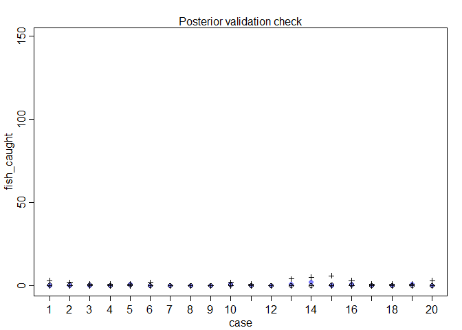<!-- -->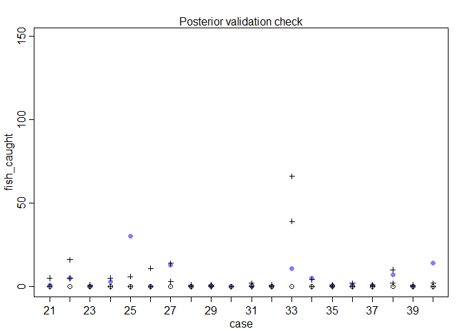<!-- -->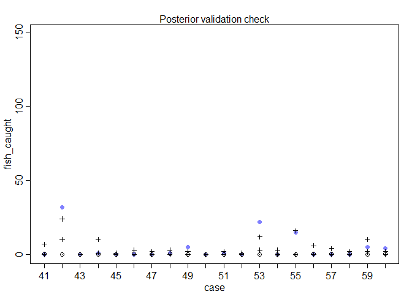<!-- -->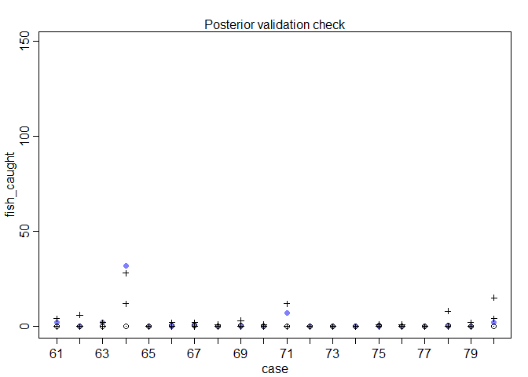<!-- -->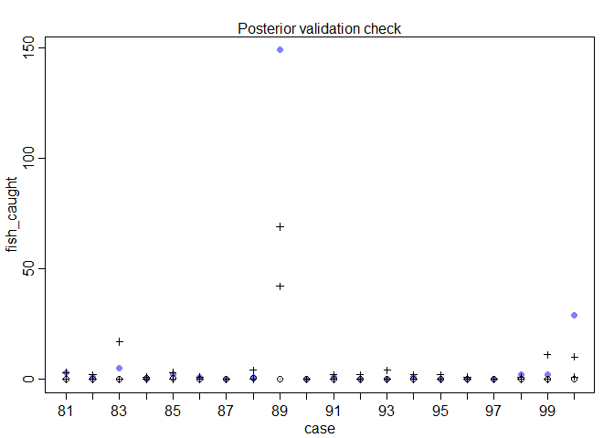<!-- -->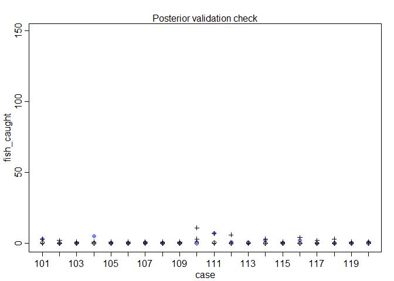<!-- -->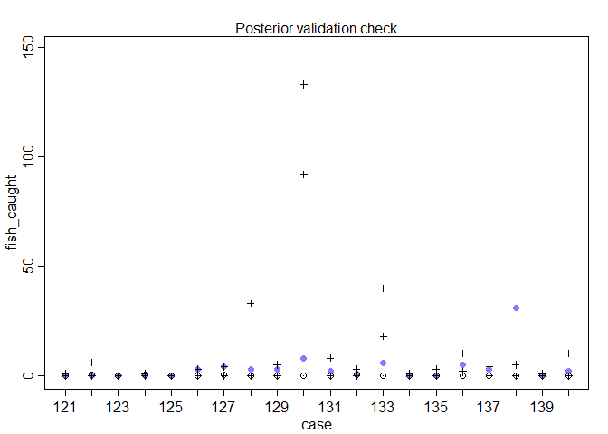<!-- -->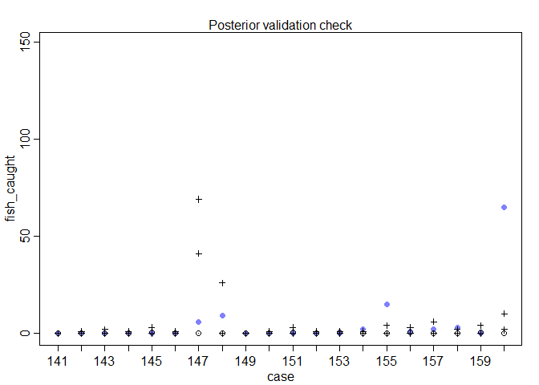<!-- -->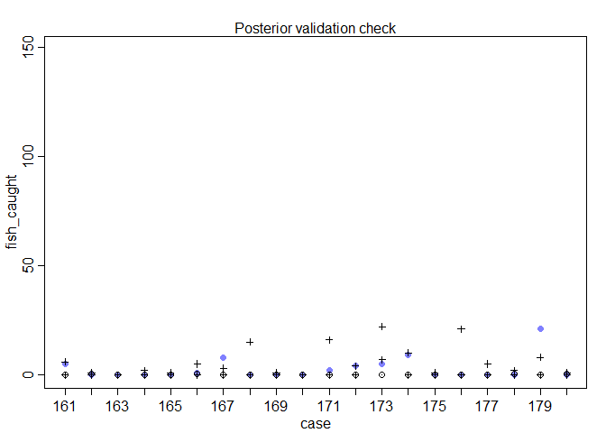<!-- -->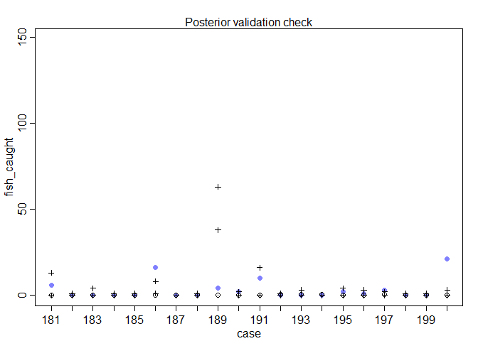<!-- -->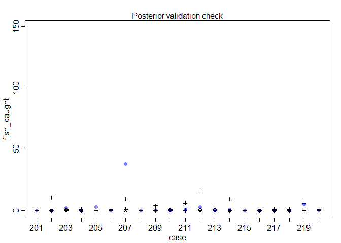<!-- -->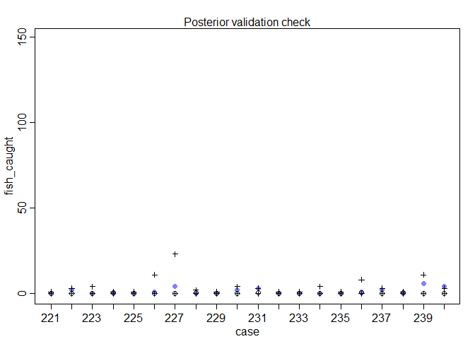<!-- -->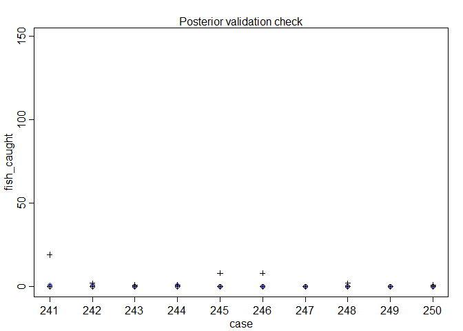<!-- -->


```r
m11H6.0 <- ulam(
  alist(
    fish_caught ~ dzipois(p, lambda),
    logit(p) <-  ap,
    log(lambda) <- loghours + al ,
    ap ~ dnorm(0,10),
    al ~ dnorm(0,10)),
  data=d, chains=4 , cores=4, log_lik=TRUE)
precis(m11H6.0)
```

```
##          mean         sd       5.5%       94.5%    n_eff      Rhat
## ap -0.7558908 0.18163519 -1.0550861 -0.46764286 1430.468 0.9989408
## al -0.1445307 0.03440801 -0.1996518 -0.08883327 1265.226 1.0028077
```

```r
postcheck(m11H6.0)
```

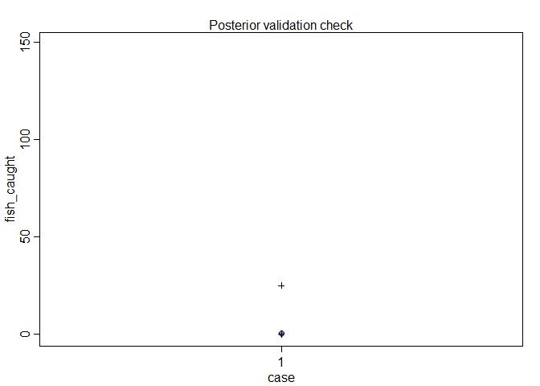<!-- -->


```r
compare(m11H6.0, m11H6.1)
```

```
##             WAIC    pWAIC    dWAIC       weight       SE      dSE
## m11H6.1 2150.142 96.61711   0.0000 1.000000e+00 391.2928       NA
## m11H6.0 2560.134 40.33420 409.9926 9.359024e-90 466.1472 238.6785
```


### 11H1. 
#### In 2014, a paper was published that was entitled “Female hurricanes are deadlier than male hurricanes.” 185 As the title suggests, the paper claimed that hurricanes with female names have caused greater loss of life, and the explanation given is that people unconsciously rate female hurricanes as less dangerous and so are less likely to evacuate. Statisticians severely criticized the paper after publication. Here, you’ll explore the complete data used in the paper and consider the hypothesis that hurricanes with female names are deadlier. Load the data with:


```r
library(rethinking)
data(Hurricanes)
```


#### Acquaint yourself with the columns by inspecting the help ?Hurricanes. In this problem, you’ll focus on predicting deaths using femininity of each hurricane’s name. Fit and interpret the simplest possible model, a Poisson model of deaths using femininity as a predictor. You can use map or map2stan. Compare the model to an intercept-only Poisson model of deaths. How strong is the association between femininity of name and deaths? Which storms does the model fit (retrodict) well? Which storms does it fit poorly?


```r
library(rethinking)
data(Hurricanes)
d <- Hurricanes
str(d)
```

```
## 'data.frame':	92 obs. of  8 variables:
##  $ name        : Factor w/ 83 levels "Able","Agnes",..: 38 77 1 9 47 20 40 60 27 33 ...
##  $ year        : int  1950 1950 1952 1953 1953 1954 1954 1954 1955 1955 ...
##  $ deaths      : int  2 4 3 1 0 60 20 20 0 200 ...
##  $ category    : int  3 3 1 1 1 3 3 4 3 1 ...
##  $ min_pressure: int  960 955 985 987 985 960 954 938 962 987 ...
##  $ damage_norm : int  1590 5350 150 58 15 19321 3230 24260 2030 14730 ...
##  $ female      : int  1 0 0 1 1 1 1 1 1 1 ...
##  $ femininity  : num  6.78 1.39 3.83 9.83 8.33 ...
```

```r
head(d)
```

```
##       name year deaths category min_pressure damage_norm female femininity
## 1     Easy 1950      2        3          960        1590      1    6.77778
## 2     King 1950      4        3          955        5350      0    1.38889
## 3     Able 1952      3        1          985         150      0    3.83333
## 4  Barbara 1953      1        1          987          58      1    9.83333
## 5 Florence 1953      0        1          985          15      1    8.33333
## 6    Carol 1954     60        3          960       19321      1    8.11111
```

```r
summary(d)
```

```
##        name         year          deaths          category    
##  Bob     : 3   Min.   :1950   Min.   :  0.00   Min.   :1.000  
##  Bonnie  : 2   1st Qu.:1965   1st Qu.:  2.00   1st Qu.:1.000  
##  Charley : 2   Median :1985   Median :  5.00   Median :2.000  
##  Cindy   : 2   Mean   :1982   Mean   : 20.65   Mean   :2.087  
##  Danny   : 2   3rd Qu.:1999   3rd Qu.: 20.25   3rd Qu.:3.000  
##  Florence: 2   Max.   :2012   Max.   :256.00   Max.   :5.000  
##  (Other) :79                                                  
##   min_pressure     damage_norm        female         femininity    
##  Min.   : 909.0   Min.   :    1   Min.   :0.0000   Min.   : 1.056  
##  1st Qu.: 950.0   1st Qu.:  245   1st Qu.:0.0000   1st Qu.: 2.667  
##  Median : 964.0   Median : 1650   Median :1.0000   Median : 8.500  
##  Mean   : 964.9   Mean   : 7270   Mean   :0.6739   Mean   : 6.781  
##  3rd Qu.: 982.2   3rd Qu.: 8162   3rd Qu.:1.0000   3rd Qu.: 9.389  
##  Max.   :1003.0   Max.   :75000   Max.   :1.0000   Max.   :10.444  
## 
```


```r
# prior trimmed data list
dat_list <- list(
    femininity = d$femininity,
    deaths = d$deaths)

# fit Poisson regression using `femininity` as a predictor
m11H1.1 <- ulam(
  alist(
    deaths ~ dpois( lambda ),
    log(lambda) <- a + bf*femininity,
    a ~ dnorm(0, 10),
    bf ~ dnorm(0, 10)),
  data = dat_list, chains=4 , cores=4, log_lik=TRUE)

precis(m11H1.1)
```

```
##          mean          sd       5.5%      94.5%    n_eff     Rhat
## a  2.50074996 0.058629743 2.40552709 2.59654311 560.3833 1.002799
## bf 0.07369129 0.007311856 0.06157415 0.08544329 548.7995 1.003618
```


```r
# fit Poisson regression using intercept only
m11H1.2 <- ulam(
  alist(
    deaths ~ dpois( lambda ),
    log(lambda) <- alpha,
    alpha ~ dnorm(0, 10)),
  data = dat_list, chains=4 , cores=4, log_lik=TRUE)

# compare models
compare(m11H1.1, m11H1.2)
```

```
##             WAIC     pWAIC    dWAIC       weight       SE      dSE
## m11H1.1 4397.070 125.42367  0.00000 1.000000e+00  993.181       NA
## m11H1.2 4450.931  79.93478 53.86113 2.014669e-12 1077.215 146.0694
```


```r
# plot posterior predictions
prediction.data <- list(femininity = seq(from = 1, to = 11, length.out = 30))

# simulate lambda values
lambda <- link(fit = m11H1.1, data = prediction.data)
lambda.mean <- apply(X = lambda, MARGIN = 2, FUN = mean)
lambda.PI <- apply(X = lambda, MARGIN = 2, FUN = PI)

# simulate Poisson predictions
simulated.predictions <- sim(fit = m11H1.1, data = prediction.data)
simulated.predictions.PI <- apply(X = simulated.predictions, MARGIN = 2, FUN = PI)

plot( d$femininity, d$deaths, pch=16, col=rangi2, xlab="femininity", ylab="deaths" )
lines(x = prediction.data$femininity, y = lambda.mean)
shade(object = lambda.PI, lim = prediction.data$femininity)
lines(x = prediction.data$femininity, y = simulated.predictions.PI[1,], lty = 2)
lines(x = prediction.data$femininity, y = simulated.predictions.PI[2,], lty = 2)
```

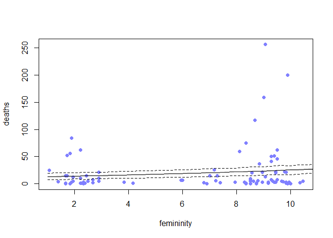<!-- -->

> Summary: Intuitively, there is some hidden variable that better explains deaths.

### 11H2. 
#### Counts are nearly always over-dispersed relative to Poisson. So fit a gamma-Poisson (aka negative-binomial) model to predict deaths using femininity. Show that the over-dispersed model no longer shows as precise a positive association between femininity and deaths, with an 89% interval that overlaps zero. Can you explain why the association diminished in strength?


```r
# fit model
model.11H2 <- ulam(
  alist(
    deaths ~ dgampois( lambda , phi ),
    log(lambda) <- a + bf*femininity,
    a ~ dnorm(0, 10),
    bf ~ dnorm(0, 10),
    phi ~ dexp(1)
  ),
  data=dat_list,chains=4 , cores=4, log_lik=TRUE)

# inspect estimates
precis(model.11H2)
```

```
##           mean         sd         5.5%     94.5%    n_eff     Rhat
## a   2.55900063 0.36375481  2.016576481 3.1606568 839.0384 1.000817
## bf  0.06827973 0.04770773 -0.009634815 0.1443575 818.0306 1.000318
## phi 0.45213581 0.05998191  0.361079456 0.5524212 935.7319 1.001826
```

> This may be because a much larger range of values of (alpha, beta_femininity) can produce through the Gamma distribution.
