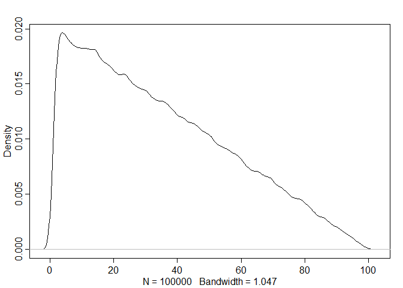

## 11.3. Censoring and survival


```r
library(rethinking)
```

```
## Loading required package: rstan
```

```
## Loading required package: StanHeaders
```

```
## Loading required package: ggplot2
```

```
## rstan (Version 2.19.2, GitRev: 2e1f913d3ca3)
```

```
## For execution on a local, multicore CPU with excess RAM we recommend calling
## options(mc.cores = parallel::detectCores()).
## To avoid recompilation of unchanged Stan programs, we recommend calling
## rstan_options(auto_write = TRUE)
```

```
## For improved execution time, we recommend calling
## Sys.setenv(LOCAL_CPPFLAGS = '-march=native')
## although this causes Stan to throw an error on a few processors.
```

```
## Loading required package: parallel
```

```
## Loading required package: dagitty
```

```
## rethinking (Version 1.90)
```

```
## 
## Attaching package: 'rethinking'
```

```
## The following object is masked from 'package:stats':
## 
##     rstudent
```

```r
## R code 11.62
N <- 2
x <- replicate( 1e5 , min(runif(N,1,100)) )
dens(x)
```

<!-- -->

```r
## R code 11.63
N <- 10
M <- 2
x <- replicate( 1e5 , sort(runif(N,1,100))[M] )
dens(x)
```

<!-- -->

### 11.3.1. Simulated cats.
### 11.3.2. Actual cats.


```r
## R code 11.64
library(rethinking)
data(AustinCats)
d <- AustinCats

d$adopt <- ifelse( d$out_event=="Adoption" , 1L , 0L )
dat <- list(
    days_to_event = as.numeric( d$days_to_event ),
    color_id = ifelse( d$color=="Black" , 1L , 2L ) ,
    adopted = d$adopt
)

m11.14 <- ulam(
    alist(
        days_to_event|adopted==1 ~ exponential( lambda ),
        days_to_event|adopted==0 ~ custom(exponential_lccdf( !Y | lambda )),
        lambda <- 1.0/mu,
        log(mu) <- a[color_id],
        a[color_id] ~ normal(0,1)
    ), data=dat , chains=4 , cores=4 )

precis( m11.14 , 2 )
```

```
##          mean          sd     5.5%    94.5%    n_eff      Rhat
## a[1] 4.050003 0.026669631 4.008978 4.093001 1031.732 1.0031548
## a[2] 3.880377 0.009871839 3.864732 3.896441 1464.300 0.9997667
```

```r
## R code 11.65
post <- extract.samples( m11.14 )
post$D <- exp(post$a)
precis( post , 2 )
```

```
##           mean          sd      5.5%     94.5%      histogram
## a[1]  4.050003 0.026669631  4.008978  4.093001      ▁▁▂▇▇▅▂▁▁
## a[2]  3.880377 0.009871839  3.864732  3.896441 ▁▁▁▂▃▅▇▇▅▃▂▁▁▁
## D[1] 57.418082 1.534910534 55.090530 59.919455     ▁▁▃▇▇▅▃▁▁▁
## D[2] 48.444833 0.478278451 47.690468 49.226917        ▁▁▃▇▇▂▁
```

```r
### R code 11.66
#model{
#    vector[22356] lambda;
#    b ~ normal( 0 , 1 );
#    a ~ normal( 0 , 1 );
#    for ( i in 1:22356 ) {
#        lambda[i] = a + b * black[i];
#        lambda[i] = exp(lambda[i]);
#    }
#    for ( i in 1:22356 )
#        if ( adopted[i] == 0 ) target += exponential_lccdf(days_to_event[i] | lambda[i]);
#    for ( i in 1:22356 )
#        if ( adopted[i] == 1 ) days_to_event[i] ~ exponential( lambda[i] );
#}

### R code 11.67
#    for ( i in 1:22356 ) {
#        if ( adopted[i] == 0 ) target += -lambda[i]*days_to_event[i];
#        if ( adopted[i] == 1 ) target += log(lambda[i]) - lambda[i]*days_to_event[i];
#    }
```

## 11.4. Summary

### 10H3 (more binomial practice, so relevant to previous weeks, but good for us)
Th e data contained in library(MASS);data(eagles) are records of salmon pirating at-
tempts by Bald Eagles in Washington State. See ?eagles for details. While one eagle feeds, some-
times another will swoop in and try to steal the salmon from it. Call the feeding eagle the “victim” and
the thief the “pirate.” Use the available data to build a binomial GLM of successful pirating attempts.
(a) Consider the following model:
y i  Binomial(n i; p i)
log
p i
1   p i
=  + P P i + V V i + A A i
  Normal(0; 10)
P  Normal(0; 5)
V  Normal(0; 5)
A  Normal(0; 5)
where y is the number of successful attempts, n is the total number of attempts, P is a dummy variable
indicating whether or not the pirate had large body size, V is a dummy variable indicating whether
or not the victim had large body size, and fi nally A is a dummy variable indicating whether or not the
pirate was an adult. Fit the model above to the eagles data, using both map and map2stan. Is the
quadratic approximation okay?
(b) Now interpret the estimates. If the quadratic approximation turned out okay, then it’s okay to
use the map estimates. Otherwise stick to map2stan estimates. Th en plot the posterior predictions.
Compute and display both (1) the predicted probability of success and its 89% interval for each row (i)
in the data, as well as (2) the predicted success count and its 89% interval. What diff erent information
does each type of posterior prediction provide?
(c) Now try to improve the model. Consider an interaction between the pirate’s size and age
(immature or adult). Compare this model to the previous one, using WAIC. Interpret.


# 12 Monsters and Mixtures

## 12.1. Over-dispersed outcomes

### 12.1.1. Beta-binomial.


```r
## R code 12.1
pbar <- 0.5
theta <- 5
curve( dbeta2(x,pbar,theta) , from=0 , to=1 ,
    xlab="probability" , ylab="Density" )
```

<!-- -->

```r
## R code 12.2
library(rethinking)
data(UCBadmit)
d <- UCBadmit
d$gid <- ifelse( d$applicant.gender=="male" , 1L , 2L )
dat <- list( A=d$admit , N=d$applications , gid=d$gid )
m12.1 <- ulam(
    alist(
        A ~ dbetabinom( N , pbar , theta ),
        logit(pbar) <- a[gid],
        a[gid] ~ dnorm( 0 , 1.5 ),
        theta ~ dexp(1)
    ), data=dat , chains=4 )
```

```
## 
## SAMPLING FOR MODEL '379c3c9629d2ce418bfe29904221f6bc' NOW (CHAIN 1).
## Chain 1: 
## Chain 1: Gradient evaluation took 0 seconds
## Chain 1: 1000 transitions using 10 leapfrog steps per transition would take 0 seconds.
## Chain 1: Adjust your expectations accordingly!
## Chain 1: 
## Chain 1: 
## Chain 1: Iteration:   1 / 1000 [  0%]  (Warmup)
## Chain 1: Iteration: 100 / 1000 [ 10%]  (Warmup)
## Chain 1: Iteration: 200 / 1000 [ 20%]  (Warmup)
## Chain 1: Iteration: 300 / 1000 [ 30%]  (Warmup)
## Chain 1: Iteration: 400 / 1000 [ 40%]  (Warmup)
## Chain 1: Iteration: 500 / 1000 [ 50%]  (Warmup)
## Chain 1: Iteration: 501 / 1000 [ 50%]  (Sampling)
## Chain 1: Iteration: 600 / 1000 [ 60%]  (Sampling)
## Chain 1: Iteration: 700 / 1000 [ 70%]  (Sampling)
## Chain 1: Iteration: 800 / 1000 [ 80%]  (Sampling)
## Chain 1: Iteration: 900 / 1000 [ 90%]  (Sampling)
## Chain 1: Iteration: 1000 / 1000 [100%]  (Sampling)
## Chain 1: 
## Chain 1:  Elapsed Time: 0.076 seconds (Warm-up)
## Chain 1:                0.059 seconds (Sampling)
## Chain 1:                0.135 seconds (Total)
## Chain 1: 
## 
## SAMPLING FOR MODEL '379c3c9629d2ce418bfe29904221f6bc' NOW (CHAIN 2).
## Chain 2: 
## Chain 2: Gradient evaluation took 0 seconds
## Chain 2: 1000 transitions using 10 leapfrog steps per transition would take 0 seconds.
## Chain 2: Adjust your expectations accordingly!
## Chain 2: 
## Chain 2: 
## Chain 2: Iteration:   1 / 1000 [  0%]  (Warmup)
## Chain 2: Iteration: 100 / 1000 [ 10%]  (Warmup)
## Chain 2: Iteration: 200 / 1000 [ 20%]  (Warmup)
## Chain 2: Iteration: 300 / 1000 [ 30%]  (Warmup)
## Chain 2: Iteration: 400 / 1000 [ 40%]  (Warmup)
## Chain 2: Iteration: 500 / 1000 [ 50%]  (Warmup)
## Chain 2: Iteration: 501 / 1000 [ 50%]  (Sampling)
## Chain 2: Iteration: 600 / 1000 [ 60%]  (Sampling)
## Chain 2: Iteration: 700 / 1000 [ 70%]  (Sampling)
## Chain 2: Iteration: 800 / 1000 [ 80%]  (Sampling)
## Chain 2: Iteration: 900 / 1000 [ 90%]  (Sampling)
## Chain 2: Iteration: 1000 / 1000 [100%]  (Sampling)
## Chain 2: 
## Chain 2:  Elapsed Time: 0.07 seconds (Warm-up)
## Chain 2:                0.068 seconds (Sampling)
## Chain 2:                0.138 seconds (Total)
## Chain 2: 
## 
## SAMPLING FOR MODEL '379c3c9629d2ce418bfe29904221f6bc' NOW (CHAIN 3).
## Chain 3: 
## Chain 3: Gradient evaluation took 0 seconds
## Chain 3: 1000 transitions using 10 leapfrog steps per transition would take 0 seconds.
## Chain 3: Adjust your expectations accordingly!
## Chain 3: 
## Chain 3: 
## Chain 3: Iteration:   1 / 1000 [  0%]  (Warmup)
## Chain 3: Iteration: 100 / 1000 [ 10%]  (Warmup)
## Chain 3: Iteration: 200 / 1000 [ 20%]  (Warmup)
## Chain 3: Iteration: 300 / 1000 [ 30%]  (Warmup)
## Chain 3: Iteration: 400 / 1000 [ 40%]  (Warmup)
## Chain 3: Iteration: 500 / 1000 [ 50%]  (Warmup)
## Chain 3: Iteration: 501 / 1000 [ 50%]  (Sampling)
## Chain 3: Iteration: 600 / 1000 [ 60%]  (Sampling)
## Chain 3: Iteration: 700 / 1000 [ 70%]  (Sampling)
## Chain 3: Iteration: 800 / 1000 [ 80%]  (Sampling)
## Chain 3: Iteration: 900 / 1000 [ 90%]  (Sampling)
## Chain 3: Iteration: 1000 / 1000 [100%]  (Sampling)
## Chain 3: 
## Chain 3:  Elapsed Time: 0.078 seconds (Warm-up)
## Chain 3:                0.071 seconds (Sampling)
## Chain 3:                0.149 seconds (Total)
## Chain 3: 
## 
## SAMPLING FOR MODEL '379c3c9629d2ce418bfe29904221f6bc' NOW (CHAIN 4).
## Chain 4: 
## Chain 4: Gradient evaluation took 0 seconds
## Chain 4: 1000 transitions using 10 leapfrog steps per transition would take 0 seconds.
## Chain 4: Adjust your expectations accordingly!
## Chain 4: 
## Chain 4: 
## Chain 4: Iteration:   1 / 1000 [  0%]  (Warmup)
## Chain 4: Iteration: 100 / 1000 [ 10%]  (Warmup)
## Chain 4: Iteration: 200 / 1000 [ 20%]  (Warmup)
## Chain 4: Iteration: 300 / 1000 [ 30%]  (Warmup)
## Chain 4: Iteration: 400 / 1000 [ 40%]  (Warmup)
## Chain 4: Iteration: 500 / 1000 [ 50%]  (Warmup)
## Chain 4: Iteration: 501 / 1000 [ 50%]  (Sampling)
## Chain 4: Iteration: 600 / 1000 [ 60%]  (Sampling)
## Chain 4: Iteration: 700 / 1000 [ 70%]  (Sampling)
## Chain 4: Iteration: 800 / 1000 [ 80%]  (Sampling)
## Chain 4: Iteration: 900 / 1000 [ 90%]  (Sampling)
## Chain 4: Iteration: 1000 / 1000 [100%]  (Sampling)
## Chain 4: 
## Chain 4:  Elapsed Time: 0.083 seconds (Warm-up)
## Chain 4:                0.067 seconds (Sampling)
## Chain 4:                0.15 seconds (Total)
## Chain 4:
```

```r
## R code 12.3
post <- extract.samples( m12.1 )
post$da <- post$a[,1] - post$a[,2]
precis( post , depth=2 )
```

```
##             mean        sd       5.5%     94.5%      histogram
## a[1]  -0.4105079 0.4289774 -1.0898977 0.2919039 ▁▁▁▂▃▅▇▇▅▃▂▁▁▁
## a[2]  -0.2856130 0.4225502 -0.9646262 0.3822820        ▁▁▃▇▃▁▁
## theta  2.6834961 0.9049623  1.4249911 4.3153140   ▁▂▅▇▇▅▂▁▁▁▁▁
## da    -0.1248949 0.6001424 -1.0752297 0.8164453      ▁▁▁▃▇▇▂▁▁
```

```r
## R code 12.4
gid <- 2
# draw posterior mean beta distribution
curve( dbeta2(x,mean(logistic(post$a[,gid])),mean(post$theta)) , from=0 , to=1 ,
    ylab="Density" , xlab="probability admit", ylim=c(0,3) , lwd=2 )

# draw 50 beta distributions sampled from posterior
for ( i in 1:50 ) {
    p <- logistic( post$a[i,gid] )
    theta <- post$theta[i]
    curve( dbeta2(x,p,theta) , add=TRUE , col=col.alpha("black",0.2) )
}
mtext( "distribution of female admission rates" )
```

<!-- -->

```r
## R code 12.5
postcheck( m12.1 )
```

<!-- -->

### 12.1.2. Negative-binomial or gamma-Poisson.


```r
## R code 12.6
library(rethinking)
data(Kline)
d <- Kline
d$P <- standardize( log(d$population) )
d$contact_id <- ifelse( d$contact=="high" , 2L , 1L )

dat2 <- list(
    T = d$total_tools,
    P = d$population,
    cid = d$contact_id )

m12.3 <- ulam(
    alist(
        T ~ dgampois( lambda , phi ),
        lambda <- exp(a[cid])*P^b[cid] / g,
        a[cid] ~ dnorm(1,1),
        b[cid] ~ dexp(1),
        g ~ dexp(1),
        phi ~ dexp(1)
    ), data=dat2 , chains=4 , log_lik=TRUE )
```

```
## 
## SAMPLING FOR MODEL '1b1b1ec6a021defe7ac1cbee74458ec5' NOW (CHAIN 1).
## Chain 1: 
## Chain 1: Gradient evaluation took 0 seconds
## Chain 1: 1000 transitions using 10 leapfrog steps per transition would take 0 seconds.
## Chain 1: Adjust your expectations accordingly!
## Chain 1: 
## Chain 1: 
## Chain 1: Iteration:   1 / 1000 [  0%]  (Warmup)
## Chain 1: Iteration: 100 / 1000 [ 10%]  (Warmup)
## Chain 1: Iteration: 200 / 1000 [ 20%]  (Warmup)
## Chain 1: Iteration: 300 / 1000 [ 30%]  (Warmup)
## Chain 1: Iteration: 400 / 1000 [ 40%]  (Warmup)
## Chain 1: Iteration: 500 / 1000 [ 50%]  (Warmup)
## Chain 1: Iteration: 501 / 1000 [ 50%]  (Sampling)
## Chain 1: Iteration: 600 / 1000 [ 60%]  (Sampling)
## Chain 1: Iteration: 700 / 1000 [ 70%]  (Sampling)
## Chain 1: Iteration: 800 / 1000 [ 80%]  (Sampling)
## Chain 1: Iteration: 900 / 1000 [ 90%]  (Sampling)
## Chain 1: Iteration: 1000 / 1000 [100%]  (Sampling)
## Chain 1: 
## Chain 1:  Elapsed Time: 0.535 seconds (Warm-up)
## Chain 1:                0.408 seconds (Sampling)
## Chain 1:                0.943 seconds (Total)
## Chain 1: 
## 
## SAMPLING FOR MODEL '1b1b1ec6a021defe7ac1cbee74458ec5' NOW (CHAIN 2).
## Chain 2: 
## Chain 2: Gradient evaluation took 0 seconds
## Chain 2: 1000 transitions using 10 leapfrog steps per transition would take 0 seconds.
## Chain 2: Adjust your expectations accordingly!
## Chain 2: 
## Chain 2: 
## Chain 2: Iteration:   1 / 1000 [  0%]  (Warmup)
## Chain 2: Iteration: 100 / 1000 [ 10%]  (Warmup)
## Chain 2: Iteration: 200 / 1000 [ 20%]  (Warmup)
## Chain 2: Iteration: 300 / 1000 [ 30%]  (Warmup)
## Chain 2: Iteration: 400 / 1000 [ 40%]  (Warmup)
## Chain 2: Iteration: 500 / 1000 [ 50%]  (Warmup)
## Chain 2: Iteration: 501 / 1000 [ 50%]  (Sampling)
## Chain 2: Iteration: 600 / 1000 [ 60%]  (Sampling)
## Chain 2: Iteration: 700 / 1000 [ 70%]  (Sampling)
## Chain 2: Iteration: 800 / 1000 [ 80%]  (Sampling)
## Chain 2: Iteration: 900 / 1000 [ 90%]  (Sampling)
## Chain 2: Iteration: 1000 / 1000 [100%]  (Sampling)
## Chain 2: 
## Chain 2:  Elapsed Time: 0.564 seconds (Warm-up)
## Chain 2:                0.404 seconds (Sampling)
## Chain 2:                0.968 seconds (Total)
## Chain 2: 
## 
## SAMPLING FOR MODEL '1b1b1ec6a021defe7ac1cbee74458ec5' NOW (CHAIN 3).
## Chain 3: 
## Chain 3: Gradient evaluation took 0 seconds
## Chain 3: 1000 transitions using 10 leapfrog steps per transition would take 0 seconds.
## Chain 3: Adjust your expectations accordingly!
## Chain 3: 
## Chain 3: 
## Chain 3: Iteration:   1 / 1000 [  0%]  (Warmup)
## Chain 3: Iteration: 100 / 1000 [ 10%]  (Warmup)
## Chain 3: Iteration: 200 / 1000 [ 20%]  (Warmup)
## Chain 3: Iteration: 300 / 1000 [ 30%]  (Warmup)
## Chain 3: Iteration: 400 / 1000 [ 40%]  (Warmup)
## Chain 3: Iteration: 500 / 1000 [ 50%]  (Warmup)
## Chain 3: Iteration: 501 / 1000 [ 50%]  (Sampling)
## Chain 3: Iteration: 600 / 1000 [ 60%]  (Sampling)
## Chain 3: Iteration: 700 / 1000 [ 70%]  (Sampling)
## Chain 3: Iteration: 800 / 1000 [ 80%]  (Sampling)
## Chain 3: Iteration: 900 / 1000 [ 90%]  (Sampling)
## Chain 3: Iteration: 1000 / 1000 [100%]  (Sampling)
## Chain 3: 
## Chain 3:  Elapsed Time: 0.57 seconds (Warm-up)
## Chain 3:                0.527 seconds (Sampling)
## Chain 3:                1.097 seconds (Total)
## Chain 3: 
## 
## SAMPLING FOR MODEL '1b1b1ec6a021defe7ac1cbee74458ec5' NOW (CHAIN 4).
## Chain 4: 
## Chain 4: Gradient evaluation took 0 seconds
## Chain 4: 1000 transitions using 10 leapfrog steps per transition would take 0 seconds.
## Chain 4: Adjust your expectations accordingly!
## Chain 4: 
## Chain 4: 
## Chain 4: Iteration:   1 / 1000 [  0%]  (Warmup)
## Chain 4: Iteration: 100 / 1000 [ 10%]  (Warmup)
## Chain 4: Iteration: 200 / 1000 [ 20%]  (Warmup)
## Chain 4: Iteration: 300 / 1000 [ 30%]  (Warmup)
## Chain 4: Iteration: 400 / 1000 [ 40%]  (Warmup)
## Chain 4: Iteration: 500 / 1000 [ 50%]  (Warmup)
## Chain 4: Iteration: 501 / 1000 [ 50%]  (Sampling)
## Chain 4: Iteration: 600 / 1000 [ 60%]  (Sampling)
## Chain 4: Iteration: 700 / 1000 [ 70%]  (Sampling)
## Chain 4: Iteration: 800 / 1000 [ 80%]  (Sampling)
## Chain 4: Iteration: 900 / 1000 [ 90%]  (Sampling)
## Chain 4: Iteration: 1000 / 1000 [100%]  (Sampling)
## Chain 4: 
## Chain 4:  Elapsed Time: 0.567 seconds (Warm-up)
## Chain 4:                0.58 seconds (Sampling)
## Chain 4:                1.147 seconds (Total)
## Chain 4:
```

### 12.1.3. Over-dispersion, entropy, and information criteria.

## 12.2. Zero-infl ated outcomes

### 12.2.1. Example: Zero-infl ated Poisson.


```r
## R code 12.7
# define parameters
prob_drink <- 0.2 # 20% of days
rate_work <- 1    # average 1 manuscript per day

# sample one year of production
N <- 365

# simulate days monks drink
set.seed(365)
drink <- rbinom( N , 1 , prob_drink )

# simulate manuscripts completed
y <- (1-drink)*rpois( N , rate_work )

## R code 12.8
simplehist( y , xlab="manuscripts completed" , lwd=4 )
zeros_drink <- sum(drink)
zeros_work <- sum(y==0 & drink==0)
zeros_total <- sum(y==0)
lines( c(0,0) , c(zeros_work,zeros_total) , lwd=4 , col=rangi2 )
```

<!-- -->

```r
## R code 12.9
m12.4 <- ulam(
    alist(
        y ~ dzipois( p , lambda ),
        logit(p) <- ap,
        log(lambda) <- al,
        ap ~ dnorm( -1.5 , 1 ),
        al ~ dnorm( 1 , 0.5 )
    ) , data=list(y=as.integer(y)) , chains=4 )
```

```
## 
## SAMPLING FOR MODEL '093bf5868db629d3ec8886eb28c1a9d1' NOW (CHAIN 1).
## Chain 1: 
## Chain 1: Gradient evaluation took 0 seconds
## Chain 1: 1000 transitions using 10 leapfrog steps per transition would take 0 seconds.
## Chain 1: Adjust your expectations accordingly!
## Chain 1: 
## Chain 1: 
## Chain 1: Iteration:   1 / 1000 [  0%]  (Warmup)
## Chain 1: Iteration: 100 / 1000 [ 10%]  (Warmup)
## Chain 1: Iteration: 200 / 1000 [ 20%]  (Warmup)
## Chain 1: Iteration: 300 / 1000 [ 30%]  (Warmup)
## Chain 1: Iteration: 400 / 1000 [ 40%]  (Warmup)
## Chain 1: Iteration: 500 / 1000 [ 50%]  (Warmup)
## Chain 1: Iteration: 501 / 1000 [ 50%]  (Sampling)
## Chain 1: Iteration: 600 / 1000 [ 60%]  (Sampling)
## Chain 1: Iteration: 700 / 1000 [ 70%]  (Sampling)
## Chain 1: Iteration: 800 / 1000 [ 80%]  (Sampling)
## Chain 1: Iteration: 900 / 1000 [ 90%]  (Sampling)
## Chain 1: Iteration: 1000 / 1000 [100%]  (Sampling)
## Chain 1: 
## Chain 1:  Elapsed Time: 0.659 seconds (Warm-up)
## Chain 1:                0.519 seconds (Sampling)
## Chain 1:                1.178 seconds (Total)
## Chain 1: 
## 
## SAMPLING FOR MODEL '093bf5868db629d3ec8886eb28c1a9d1' NOW (CHAIN 2).
## Chain 2: 
## Chain 2: Gradient evaluation took 0.001 seconds
## Chain 2: 1000 transitions using 10 leapfrog steps per transition would take 10 seconds.
## Chain 2: Adjust your expectations accordingly!
## Chain 2: 
## Chain 2: 
## Chain 2: Iteration:   1 / 1000 [  0%]  (Warmup)
## Chain 2: Iteration: 100 / 1000 [ 10%]  (Warmup)
## Chain 2: Iteration: 200 / 1000 [ 20%]  (Warmup)
## Chain 2: Iteration: 300 / 1000 [ 30%]  (Warmup)
## Chain 2: Iteration: 400 / 1000 [ 40%]  (Warmup)
## Chain 2: Iteration: 500 / 1000 [ 50%]  (Warmup)
## Chain 2: Iteration: 501 / 1000 [ 50%]  (Sampling)
## Chain 2: Iteration: 600 / 1000 [ 60%]  (Sampling)
## Chain 2: Iteration: 700 / 1000 [ 70%]  (Sampling)
## Chain 2: Iteration: 800 / 1000 [ 80%]  (Sampling)
## Chain 2: Iteration: 900 / 1000 [ 90%]  (Sampling)
## Chain 2: Iteration: 1000 / 1000 [100%]  (Sampling)
## Chain 2: 
## Chain 2:  Elapsed Time: 0.734 seconds (Warm-up)
## Chain 2:                0.597 seconds (Sampling)
## Chain 2:                1.331 seconds (Total)
## Chain 2: 
## 
## SAMPLING FOR MODEL '093bf5868db629d3ec8886eb28c1a9d1' NOW (CHAIN 3).
## Chain 3: 
## Chain 3: Gradient evaluation took 0 seconds
## Chain 3: 1000 transitions using 10 leapfrog steps per transition would take 0 seconds.
## Chain 3: Adjust your expectations accordingly!
## Chain 3: 
## Chain 3: 
## Chain 3: Iteration:   1 / 1000 [  0%]  (Warmup)
## Chain 3: Iteration: 100 / 1000 [ 10%]  (Warmup)
## Chain 3: Iteration: 200 / 1000 [ 20%]  (Warmup)
## Chain 3: Iteration: 300 / 1000 [ 30%]  (Warmup)
## Chain 3: Iteration: 400 / 1000 [ 40%]  (Warmup)
## Chain 3: Iteration: 500 / 1000 [ 50%]  (Warmup)
## Chain 3: Iteration: 501 / 1000 [ 50%]  (Sampling)
## Chain 3: Iteration: 600 / 1000 [ 60%]  (Sampling)
## Chain 3: Iteration: 700 / 1000 [ 70%]  (Sampling)
## Chain 3: Iteration: 800 / 1000 [ 80%]  (Sampling)
## Chain 3: Iteration: 900 / 1000 [ 90%]  (Sampling)
## Chain 3: Iteration: 1000 / 1000 [100%]  (Sampling)
## Chain 3: 
## Chain 3:  Elapsed Time: 0.618 seconds (Warm-up)
## Chain 3:                0.555 seconds (Sampling)
## Chain 3:                1.173 seconds (Total)
## Chain 3: 
## 
## SAMPLING FOR MODEL '093bf5868db629d3ec8886eb28c1a9d1' NOW (CHAIN 4).
## Chain 4: 
## Chain 4: Gradient evaluation took 0 seconds
## Chain 4: 1000 transitions using 10 leapfrog steps per transition would take 0 seconds.
## Chain 4: Adjust your expectations accordingly!
## Chain 4: 
## Chain 4: 
## Chain 4: Iteration:   1 / 1000 [  0%]  (Warmup)
## Chain 4: Iteration: 100 / 1000 [ 10%]  (Warmup)
## Chain 4: Iteration: 200 / 1000 [ 20%]  (Warmup)
## Chain 4: Iteration: 300 / 1000 [ 30%]  (Warmup)
## Chain 4: Iteration: 400 / 1000 [ 40%]  (Warmup)
## Chain 4: Iteration: 500 / 1000 [ 50%]  (Warmup)
## Chain 4: Iteration: 501 / 1000 [ 50%]  (Sampling)
## Chain 4: Iteration: 600 / 1000 [ 60%]  (Sampling)
## Chain 4: Iteration: 700 / 1000 [ 70%]  (Sampling)
## Chain 4: Iteration: 800 / 1000 [ 80%]  (Sampling)
## Chain 4: Iteration: 900 / 1000 [ 90%]  (Sampling)
## Chain 4: Iteration: 1000 / 1000 [100%]  (Sampling)
## Chain 4: 
## Chain 4:  Elapsed Time: 0.733 seconds (Warm-up)
## Chain 4:                0.585 seconds (Sampling)
## Chain 4:                1.318 seconds (Total)
## Chain 4:
```

```r
precis( m12.4 )
```

```
##           mean         sd       5.5%      94.5%    n_eff     Rhat
## ap -1.27555731 0.35365513 -1.8893135 -0.7905834 656.5848 1.001745
## al  0.01332671 0.09141209 -0.1391286  0.1595870 758.6212 1.000953
```

```r
## R code 12.10
inv_logit(-1.28) # probability drink
```

```
## [1] 0.2175502
```

```r
exp(0.01)       # rate finish manuscripts, when not drinking
```

```
## [1] 1.01005
```

```r
## R code 12.11
m12.4_alt <- ulam(
    alist(
        y|y>0 ~ custom( log1m(p) + poisson_lpmf(y|lambda) ),
        y|y==0 ~ custom( log_mix( p , 0 , poisson_lpmf(0|lambda) ) ),
        logit(p) <- ap,
        log(lambda) <- al,
        ap ~ dnorm(-1.5,1),
        al ~ dnorm(1,0.5)
    ) , data=list(y=as.integer(y)) , chains=4 )
```

```
## 
## SAMPLING FOR MODEL 'cd6a69d8fda3e51c662be899dbb6b0db' NOW (CHAIN 1).
## Chain 1: 
## Chain 1: Gradient evaluation took 0 seconds
## Chain 1: 1000 transitions using 10 leapfrog steps per transition would take 0 seconds.
## Chain 1: Adjust your expectations accordingly!
## Chain 1: 
## Chain 1: 
## Chain 1: Iteration:   1 / 1000 [  0%]  (Warmup)
## Chain 1: Iteration: 100 / 1000 [ 10%]  (Warmup)
## Chain 1: Iteration: 200 / 1000 [ 20%]  (Warmup)
## Chain 1: Iteration: 300 / 1000 [ 30%]  (Warmup)
## Chain 1: Iteration: 400 / 1000 [ 40%]  (Warmup)
## Chain 1: Iteration: 500 / 1000 [ 50%]  (Warmup)
## Chain 1: Iteration: 501 / 1000 [ 50%]  (Sampling)
## Chain 1: Iteration: 600 / 1000 [ 60%]  (Sampling)
## Chain 1: Iteration: 700 / 1000 [ 70%]  (Sampling)
## Chain 1: Iteration: 800 / 1000 [ 80%]  (Sampling)
## Chain 1: Iteration: 900 / 1000 [ 90%]  (Sampling)
## Chain 1: Iteration: 1000 / 1000 [100%]  (Sampling)
## Chain 1: 
## Chain 1:  Elapsed Time: 0.588 seconds (Warm-up)
## Chain 1:                0.559 seconds (Sampling)
## Chain 1:                1.147 seconds (Total)
## Chain 1: 
## 
## SAMPLING FOR MODEL 'cd6a69d8fda3e51c662be899dbb6b0db' NOW (CHAIN 2).
## Chain 2: 
## Chain 2: Gradient evaluation took 0 seconds
## Chain 2: 1000 transitions using 10 leapfrog steps per transition would take 0 seconds.
## Chain 2: Adjust your expectations accordingly!
## Chain 2: 
## Chain 2: 
## Chain 2: Iteration:   1 / 1000 [  0%]  (Warmup)
## Chain 2: Iteration: 100 / 1000 [ 10%]  (Warmup)
## Chain 2: Iteration: 200 / 1000 [ 20%]  (Warmup)
## Chain 2: Iteration: 300 / 1000 [ 30%]  (Warmup)
## Chain 2: Iteration: 400 / 1000 [ 40%]  (Warmup)
## Chain 2: Iteration: 500 / 1000 [ 50%]  (Warmup)
## Chain 2: Iteration: 501 / 1000 [ 50%]  (Sampling)
## Chain 2: Iteration: 600 / 1000 [ 60%]  (Sampling)
## Chain 2: Iteration: 700 / 1000 [ 70%]  (Sampling)
## Chain 2: Iteration: 800 / 1000 [ 80%]  (Sampling)
## Chain 2: Iteration: 900 / 1000 [ 90%]  (Sampling)
## Chain 2: Iteration: 1000 / 1000 [100%]  (Sampling)
## Chain 2: 
## Chain 2:  Elapsed Time: 0.638 seconds (Warm-up)
## Chain 2:                0.565 seconds (Sampling)
## Chain 2:                1.203 seconds (Total)
## Chain 2: 
## 
## SAMPLING FOR MODEL 'cd6a69d8fda3e51c662be899dbb6b0db' NOW (CHAIN 3).
## Chain 3: 
## Chain 3: Gradient evaluation took 0 seconds
## Chain 3: 1000 transitions using 10 leapfrog steps per transition would take 0 seconds.
## Chain 3: Adjust your expectations accordingly!
## Chain 3: 
## Chain 3: 
## Chain 3: Iteration:   1 / 1000 [  0%]  (Warmup)
## Chain 3: Iteration: 100 / 1000 [ 10%]  (Warmup)
## Chain 3: Iteration: 200 / 1000 [ 20%]  (Warmup)
## Chain 3: Iteration: 300 / 1000 [ 30%]  (Warmup)
## Chain 3: Iteration: 400 / 1000 [ 40%]  (Warmup)
## Chain 3: Iteration: 500 / 1000 [ 50%]  (Warmup)
## Chain 3: Iteration: 501 / 1000 [ 50%]  (Sampling)
## Chain 3: Iteration: 600 / 1000 [ 60%]  (Sampling)
## Chain 3: Iteration: 700 / 1000 [ 70%]  (Sampling)
## Chain 3: Iteration: 800 / 1000 [ 80%]  (Sampling)
## Chain 3: Iteration: 900 / 1000 [ 90%]  (Sampling)
## Chain 3: Iteration: 1000 / 1000 [100%]  (Sampling)
## Chain 3: 
## Chain 3:  Elapsed Time: 0.659 seconds (Warm-up)
## Chain 3:                0.564 seconds (Sampling)
## Chain 3:                1.223 seconds (Total)
## Chain 3: 
## 
## SAMPLING FOR MODEL 'cd6a69d8fda3e51c662be899dbb6b0db' NOW (CHAIN 4).
## Chain 4: 
## Chain 4: Gradient evaluation took 0 seconds
## Chain 4: 1000 transitions using 10 leapfrog steps per transition would take 0 seconds.
## Chain 4: Adjust your expectations accordingly!
## Chain 4: 
## Chain 4: 
## Chain 4: Iteration:   1 / 1000 [  0%]  (Warmup)
## Chain 4: Iteration: 100 / 1000 [ 10%]  (Warmup)
## Chain 4: Iteration: 200 / 1000 [ 20%]  (Warmup)
## Chain 4: Iteration: 300 / 1000 [ 30%]  (Warmup)
## Chain 4: Iteration: 400 / 1000 [ 40%]  (Warmup)
## Chain 4: Iteration: 500 / 1000 [ 50%]  (Warmup)
## Chain 4: Iteration: 501 / 1000 [ 50%]  (Sampling)
## Chain 4: Iteration: 600 / 1000 [ 60%]  (Sampling)
## Chain 4: Iteration: 700 / 1000 [ 70%]  (Sampling)
## Chain 4: Iteration: 800 / 1000 [ 80%]  (Sampling)
## Chain 4: Iteration: 900 / 1000 [ 90%]  (Sampling)
## Chain 4: Iteration: 1000 / 1000 [100%]  (Sampling)
## Chain 4: 
## Chain 4:  Elapsed Time: 0.629 seconds (Warm-up)
## Chain 4:                0.505 seconds (Sampling)
## Chain 4:                1.134 seconds (Total)
## Chain 4:
```

## 12.6. Practice

11E3
11E4
11M3 (optional)
11H6
11H1
11H2
