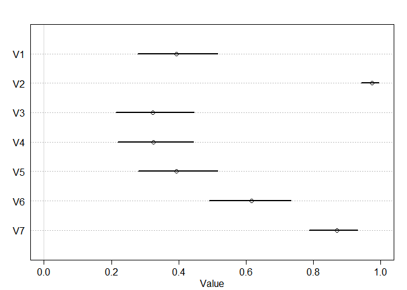
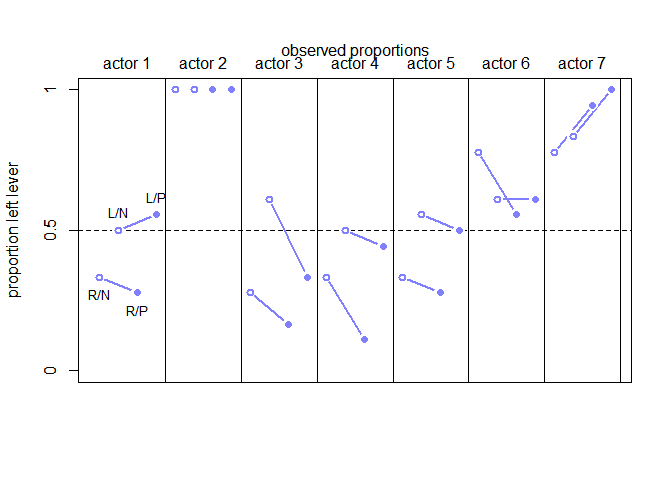
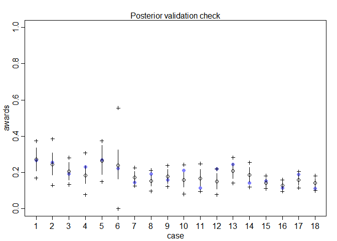

# 11. God Spiked the Integers

## 11.1. Binomial regression

### 11.1.1. Logistic regression: Prosocial chimpanzees.


```r
## R code 11.1
library(rethinking)
```

```
## Loading required package: rstan
```

```
## Loading required package: StanHeaders
```

```
## Loading required package: ggplot2
```

```
## rstan (Version 2.19.2, GitRev: 2e1f913d3ca3)
```

```
## For execution on a local, multicore CPU with excess RAM we recommend calling
## options(mc.cores = parallel::detectCores()).
## To avoid recompilation of unchanged Stan programs, we recommend calling
## rstan_options(auto_write = TRUE)
```

```
## For improved execution time, we recommend calling
## Sys.setenv(LOCAL_CPPFLAGS = '-march=native')
## although this causes Stan to throw an error on a few processors.
```

```
## Loading required package: parallel
```

```
## Loading required package: dagitty
```

```
## rethinking (Version 1.90)
```

```
## 
## Attaching package: 'rethinking'
```

```
## The following object is masked from 'package:stats':
## 
##     rstudent
```

```r
data(chimpanzees)
d <- chimpanzees

## R code 11.2
d$treatment <- 1 + d$prosoc_left + 2*d$condition

## R code 11.3
xtabs( ~ treatment + prosoc_left + condition , d )
```

```
## , , condition = 0
## 
##          prosoc_left
## treatment   0   1
##         1 126   0
##         2   0 126
##         3   0   0
##         4   0   0
## 
## , , condition = 1
## 
##          prosoc_left
## treatment   0   1
##         1   0   0
##         2   0   0
##         3 126   0
##         4   0 126
```

```r
## R code 11.4
m11.1 <- quap(
    alist(
        pulled_left ~ dbinom( 1 , p ) ,
        logit(p) <- a ,
        a ~ dnorm( 0 , 10 )
    ) , data=d )

## R code 11.5
set.seed(1999)
prior <- extract.prior( m11.1 , n=1e4 )

## R code 11.6
p <- inv_logit( prior$a )
dens( p , adj=0.1 )
```

<!-- -->


```r
## R code 11.7
m11.2 <- quap(
    alist(
        pulled_left ~ dbinom( 1 , p ) ,
        logit(p) <- a + b[treatment] ,
        a ~ dnorm( 0 , 1.5 ),
        b[treatment] ~ dnorm( 0 , 10 )
    ) , data=d )
set.seed(1999)
prior <- extract.prior( m11.2 , n=1e4 )
p <- sapply( 1:4 , function(k) inv_logit( prior$a + prior$b[,k] ) )

## R code 11.8
dens( abs( p[,1] - p[,2] ) , adj=0.1 )
```

<!-- -->


```r
## R code 11.9
m11.3 <- quap(
    alist(
        pulled_left ~ dbinom( 1 , p ) ,
        logit(p) <- a + b[treatment] ,
        a ~ dnorm( 0 , 1.5 ),
        b[treatment] ~ dnorm( 0 , 0.5 )
    ) , data=d )
set.seed(1999)
prior <- extract.prior( m11.3 , n=1e4 )
p <- sapply( 1:4 , function(k) inv_logit( prior$a + prior$b[,k] ) )
mean( abs( p[,1] - p[,2] ) )
```

```
## [1] 0.09838663
```

```r
## R code 11.8
dens( abs( p[,1] - p[,2] ) , adj=0.1 )
```

<!-- -->


```r
## R code 11.10
# prior trimmed data list
dat_list <- list(
    pulled_left = d$pulled_left,
    actor = d$actor,
    treatment = as.integer(d$treatment) )

# particles in 11-dimensional space
m11.4 <- ulam(
    alist(
        pulled_left ~ dbinom( 1 , p ) ,
        logit(p) <- a[actor] + b[treatment] ,
        a[actor] ~ dnorm( 0 , 1.5 ),
        b[treatment] ~ dnorm( 0 , 0.5 )
    ) ,
    data=dat_list , chains=4 )
```

```
## 
## SAMPLING FOR MODEL '7792d8704b89b351a44288bb97dd1b8c' NOW (CHAIN 1).
## Chain 1: 
## Chain 1: Gradient evaluation took 0 seconds
## Chain 1: 1000 transitions using 10 leapfrog steps per transition would take 0 seconds.
## Chain 1: Adjust your expectations accordingly!
## Chain 1: 
## Chain 1: 
## Chain 1: Iteration:   1 / 1000 [  0%]  (Warmup)
## Chain 1: Iteration: 100 / 1000 [ 10%]  (Warmup)
## Chain 1: Iteration: 200 / 1000 [ 20%]  (Warmup)
## Chain 1: Iteration: 300 / 1000 [ 30%]  (Warmup)
## Chain 1: Iteration: 400 / 1000 [ 40%]  (Warmup)
## Chain 1: Iteration: 500 / 1000 [ 50%]  (Warmup)
## Chain 1: Iteration: 501 / 1000 [ 50%]  (Sampling)
## Chain 1: Iteration: 600 / 1000 [ 60%]  (Sampling)
## Chain 1: Iteration: 700 / 1000 [ 70%]  (Sampling)
## Chain 1: Iteration: 800 / 1000 [ 80%]  (Sampling)
## Chain 1: Iteration: 900 / 1000 [ 90%]  (Sampling)
## Chain 1: Iteration: 1000 / 1000 [100%]  (Sampling)
## Chain 1: 
## Chain 1:  Elapsed Time: 0.807 seconds (Warm-up)
## Chain 1:                0.904 seconds (Sampling)
## Chain 1:                1.711 seconds (Total)
## Chain 1: 
## 
## SAMPLING FOR MODEL '7792d8704b89b351a44288bb97dd1b8c' NOW (CHAIN 2).
## Chain 2: 
## Chain 2: Gradient evaluation took 0 seconds
## Chain 2: 1000 transitions using 10 leapfrog steps per transition would take 0 seconds.
## Chain 2: Adjust your expectations accordingly!
## Chain 2: 
## Chain 2: 
## Chain 2: Iteration:   1 / 1000 [  0%]  (Warmup)
## Chain 2: Iteration: 100 / 1000 [ 10%]  (Warmup)
## Chain 2: Iteration: 200 / 1000 [ 20%]  (Warmup)
## Chain 2: Iteration: 300 / 1000 [ 30%]  (Warmup)
## Chain 2: Iteration: 400 / 1000 [ 40%]  (Warmup)
## Chain 2: Iteration: 500 / 1000 [ 50%]  (Warmup)
## Chain 2: Iteration: 501 / 1000 [ 50%]  (Sampling)
## Chain 2: Iteration: 600 / 1000 [ 60%]  (Sampling)
## Chain 2: Iteration: 700 / 1000 [ 70%]  (Sampling)
## Chain 2: Iteration: 800 / 1000 [ 80%]  (Sampling)
## Chain 2: Iteration: 900 / 1000 [ 90%]  (Sampling)
## Chain 2: Iteration: 1000 / 1000 [100%]  (Sampling)
## Chain 2: 
## Chain 2:  Elapsed Time: 0.916 seconds (Warm-up)
## Chain 2:                0.86 seconds (Sampling)
## Chain 2:                1.776 seconds (Total)
## Chain 2: 
## 
## SAMPLING FOR MODEL '7792d8704b89b351a44288bb97dd1b8c' NOW (CHAIN 3).
## Chain 3: 
## Chain 3: Gradient evaluation took 0.001 seconds
## Chain 3: 1000 transitions using 10 leapfrog steps per transition would take 10 seconds.
## Chain 3: Adjust your expectations accordingly!
## Chain 3: 
## Chain 3: 
## Chain 3: Iteration:   1 / 1000 [  0%]  (Warmup)
## Chain 3: Iteration: 100 / 1000 [ 10%]  (Warmup)
## Chain 3: Iteration: 200 / 1000 [ 20%]  (Warmup)
## Chain 3: Iteration: 300 / 1000 [ 30%]  (Warmup)
## Chain 3: Iteration: 400 / 1000 [ 40%]  (Warmup)
## Chain 3: Iteration: 500 / 1000 [ 50%]  (Warmup)
## Chain 3: Iteration: 501 / 1000 [ 50%]  (Sampling)
## Chain 3: Iteration: 600 / 1000 [ 60%]  (Sampling)
## Chain 3: Iteration: 700 / 1000 [ 70%]  (Sampling)
## Chain 3: Iteration: 800 / 1000 [ 80%]  (Sampling)
## Chain 3: Iteration: 900 / 1000 [ 90%]  (Sampling)
## Chain 3: Iteration: 1000 / 1000 [100%]  (Sampling)
## Chain 3: 
## Chain 3:  Elapsed Time: 0.829 seconds (Warm-up)
## Chain 3:                0.817 seconds (Sampling)
## Chain 3:                1.646 seconds (Total)
## Chain 3: 
## 
## SAMPLING FOR MODEL '7792d8704b89b351a44288bb97dd1b8c' NOW (CHAIN 4).
## Chain 4: 
## Chain 4: Gradient evaluation took 0 seconds
## Chain 4: 1000 transitions using 10 leapfrog steps per transition would take 0 seconds.
## Chain 4: Adjust your expectations accordingly!
## Chain 4: 
## Chain 4: 
## Chain 4: Iteration:   1 / 1000 [  0%]  (Warmup)
## Chain 4: Iteration: 100 / 1000 [ 10%]  (Warmup)
## Chain 4: Iteration: 200 / 1000 [ 20%]  (Warmup)
## Chain 4: Iteration: 300 / 1000 [ 30%]  (Warmup)
## Chain 4: Iteration: 400 / 1000 [ 40%]  (Warmup)
## Chain 4: Iteration: 500 / 1000 [ 50%]  (Warmup)
## Chain 4: Iteration: 501 / 1000 [ 50%]  (Sampling)
## Chain 4: Iteration: 600 / 1000 [ 60%]  (Sampling)
## Chain 4: Iteration: 700 / 1000 [ 70%]  (Sampling)
## Chain 4: Iteration: 800 / 1000 [ 80%]  (Sampling)
## Chain 4: Iteration: 900 / 1000 [ 90%]  (Sampling)
## Chain 4: Iteration: 1000 / 1000 [100%]  (Sampling)
## Chain 4: 
## Chain 4:  Elapsed Time: 0.805 seconds (Warm-up)
## Chain 4:                0.672 seconds (Sampling)
## Chain 4:                1.477 seconds (Total)
## Chain 4:
```

```r
precis( m11.4 , depth=2 )
```

```
##             mean        sd        5.5%       94.5%     n_eff     Rhat
## a[1] -0.44662951 0.3212620 -0.95066238  0.06345093  646.1365 1.006385
## a[2]  3.92555845 0.7748581  2.79870885  5.19339940 1272.0420 1.001519
## a[3] -0.75580528 0.3381962 -1.30777047 -0.21802458  782.1167 1.006893
## a[4] -0.75012741 0.3297006 -1.27397722 -0.22916035  674.1171 1.006087
## a[5] -0.44065330 0.3140066 -0.94178658  0.06137972  800.5656 1.006077
## a[6]  0.48443470 0.3259878 -0.03715598  1.01053287  826.2722 1.006794
## a[7]  1.95778498 0.4181679  1.30450901  2.62047870  965.5209 1.003335
## b[1] -0.04355881 0.2783216 -0.51699325  0.36488910  715.0729 1.011344
## b[2]  0.47616555 0.2839300  0.01648295  0.93302454  735.5020 1.004997
## b[3] -0.38455012 0.2809016 -0.84347442  0.04779866  720.9321 1.006081
## b[4]  0.37235142 0.2766925 -0.07208403  0.81423277  664.8869 1.010324
```


```r
## R code 11.11
post <- extract.samples(m11.4)
p_left <- inv_logit( post$a )
plot( precis( as.data.frame(p_left) ) , xlim=c(0,1) )
```

<!-- -->


```r
## R code 11.12
labs <- c("R/N","L/N","R/P","L/P")
plot( precis( m11.4 , depth=2 , pars="b" ) , labels=labs )
```

<!-- -->


```r
## R code 11.13
diffs <- list(
    db13 = post$b[,1] - post$b[,3],
    db24 = post$b[,2] - post$b[,4] )
plot( precis(diffs) )
```

<!-- -->


```r
## R code 11.14
pl <- by( d$pulled_left , list( d$actor , d$treatment ) , mean )
pl[1,]
```

```
##         1         2         3         4 
## 0.3333333 0.5000000 0.2777778 0.5555556
```


```r
## R code 11.15
plot( NULL , xlim=c(1,28) , ylim=c(0,1) , xlab="" ,
    ylab="proportion left lever" , xaxt="n" , yaxt="n" )
axis( 2 , at=c(0,0.5,1) , labels=c(0,0.5,1) )
abline( h=0.5 , lty=2 )
for ( j in 1:7 ) abline( v=(j-1)*4+4.5 , lwd=0.5 )
for ( j in 1:7 ) text( (j-1)*4+2.5 , 1.1 , concat("actor ",j) , xpd=TRUE )
for ( j in (1:7)[-2] ) {
    lines( (j-1)*4+c(1,3) , pl[j,c(1,3)] , lwd=2 , col=rangi2 )
    lines( (j-1)*4+c(2,4) , pl[j,c(2,4)] , lwd=2 , col=rangi2 )
}
points( 1:28 , t(pl) , pch=16 , col="white" , cex=1.7 )
points( 1:28 , t(pl) , pch=c(1,1,16,16) , col=rangi2 , lwd=2 )
yoff <- 0.01
text( 1 , pl[1,1]-yoff , "R/N" , pos=1 , cex=0.8 )
text( 2 , pl[1,2]+yoff , "L/N" , pos=3 , cex=0.8 )
text( 3 , pl[1,3]-yoff , "R/P" , pos=1 , cex=0.8 )
text( 4 , pl[1,4]+yoff , "L/P" , pos=3 , cex=0.8 )
mtext( "observed proportions\n" )
```

<!-- -->


```r
## R code 11.16
dat <- list( actor=rep(1:7,each=4) , treatment=rep(1:4,times=7) )
p_post <- link_ulam( m11.4 , data=dat )
p_mu <- apply( p_post , 2 , mean )
p_ci <- apply( p_post , 2 , PI )

## R code 11.17
d$side <- d$prosoc_left + 1 # right 1, left 2
d$cond <- d$condition + 1 # no partner 1, partner 2

## R code 11.18
dat_list2 <- list(
    pulled_left = d$pulled_left,
    actor = d$actor,
    side = d$side,
    cond = d$cond )
m11.5 <- ulam(
    alist(
        pulled_left ~ dbinom( 1 , p ) ,
        logit(p) <- a[actor] + bs[side] + bc[cond] ,
        a[actor] ~ dnorm( 0 , 1.5 ),
        bs[side] ~ dnorm( 0 , 0.5 ),
        bc[cond] ~ dnorm( 0 , 0.5 )
    ) ,
    data=dat_list2 , chains=4 , log_lik=TRUE )
```

```
## 
## SAMPLING FOR MODEL '1e8ca8c75419cf9bc49e27f99cb338e6' NOW (CHAIN 1).
## Chain 1: 
## Chain 1: Gradient evaluation took 0 seconds
## Chain 1: 1000 transitions using 10 leapfrog steps per transition would take 0 seconds.
## Chain 1: Adjust your expectations accordingly!
## Chain 1: 
## Chain 1: 
## Chain 1: Iteration:   1 / 1000 [  0%]  (Warmup)
## Chain 1: Iteration: 100 / 1000 [ 10%]  (Warmup)
## Chain 1: Iteration: 200 / 1000 [ 20%]  (Warmup)
## Chain 1: Iteration: 300 / 1000 [ 30%]  (Warmup)
## Chain 1: Iteration: 400 / 1000 [ 40%]  (Warmup)
## Chain 1: Iteration: 500 / 1000 [ 50%]  (Warmup)
## Chain 1: Iteration: 501 / 1000 [ 50%]  (Sampling)
## Chain 1: Iteration: 600 / 1000 [ 60%]  (Sampling)
## Chain 1: Iteration: 700 / 1000 [ 70%]  (Sampling)
## Chain 1: Iteration: 800 / 1000 [ 80%]  (Sampling)
## Chain 1: Iteration: 900 / 1000 [ 90%]  (Sampling)
## Chain 1: Iteration: 1000 / 1000 [100%]  (Sampling)
## Chain 1: 
## Chain 1:  Elapsed Time: 1.7 seconds (Warm-up)
## Chain 1:                1.554 seconds (Sampling)
## Chain 1:                3.254 seconds (Total)
## Chain 1: 
## 
## SAMPLING FOR MODEL '1e8ca8c75419cf9bc49e27f99cb338e6' NOW (CHAIN 2).
## Chain 2: 
## Chain 2: Gradient evaluation took 0.001 seconds
## Chain 2: 1000 transitions using 10 leapfrog steps per transition would take 10 seconds.
## Chain 2: Adjust your expectations accordingly!
## Chain 2: 
## Chain 2: 
## Chain 2: Iteration:   1 / 1000 [  0%]  (Warmup)
## Chain 2: Iteration: 100 / 1000 [ 10%]  (Warmup)
## Chain 2: Iteration: 200 / 1000 [ 20%]  (Warmup)
## Chain 2: Iteration: 300 / 1000 [ 30%]  (Warmup)
## Chain 2: Iteration: 400 / 1000 [ 40%]  (Warmup)
## Chain 2: Iteration: 500 / 1000 [ 50%]  (Warmup)
## Chain 2: Iteration: 501 / 1000 [ 50%]  (Sampling)
## Chain 2: Iteration: 600 / 1000 [ 60%]  (Sampling)
## Chain 2: Iteration: 700 / 1000 [ 70%]  (Sampling)
## Chain 2: Iteration: 800 / 1000 [ 80%]  (Sampling)
## Chain 2: Iteration: 900 / 1000 [ 90%]  (Sampling)
## Chain 2: Iteration: 1000 / 1000 [100%]  (Sampling)
## Chain 2: 
## Chain 2:  Elapsed Time: 1.827 seconds (Warm-up)
## Chain 2:                1.603 seconds (Sampling)
## Chain 2:                3.43 seconds (Total)
## Chain 2: 
## 
## SAMPLING FOR MODEL '1e8ca8c75419cf9bc49e27f99cb338e6' NOW (CHAIN 3).
## Chain 3: 
## Chain 3: Gradient evaluation took 0 seconds
## Chain 3: 1000 transitions using 10 leapfrog steps per transition would take 0 seconds.
## Chain 3: Adjust your expectations accordingly!
## Chain 3: 
## Chain 3: 
## Chain 3: Iteration:   1 / 1000 [  0%]  (Warmup)
## Chain 3: Iteration: 100 / 1000 [ 10%]  (Warmup)
## Chain 3: Iteration: 200 / 1000 [ 20%]  (Warmup)
## Chain 3: Iteration: 300 / 1000 [ 30%]  (Warmup)
## Chain 3: Iteration: 400 / 1000 [ 40%]  (Warmup)
## Chain 3: Iteration: 500 / 1000 [ 50%]  (Warmup)
## Chain 3: Iteration: 501 / 1000 [ 50%]  (Sampling)
## Chain 3: Iteration: 600 / 1000 [ 60%]  (Sampling)
## Chain 3: Iteration: 700 / 1000 [ 70%]  (Sampling)
## Chain 3: Iteration: 800 / 1000 [ 80%]  (Sampling)
## Chain 3: Iteration: 900 / 1000 [ 90%]  (Sampling)
## Chain 3: Iteration: 1000 / 1000 [100%]  (Sampling)
## Chain 3: 
## Chain 3:  Elapsed Time: 1.822 seconds (Warm-up)
## Chain 3:                1.533 seconds (Sampling)
## Chain 3:                3.355 seconds (Total)
## Chain 3: 
## 
## SAMPLING FOR MODEL '1e8ca8c75419cf9bc49e27f99cb338e6' NOW (CHAIN 4).
## Chain 4: 
## Chain 4: Gradient evaluation took 0.001 seconds
## Chain 4: 1000 transitions using 10 leapfrog steps per transition would take 10 seconds.
## Chain 4: Adjust your expectations accordingly!
## Chain 4: 
## Chain 4: 
## Chain 4: Iteration:   1 / 1000 [  0%]  (Warmup)
## Chain 4: Iteration: 100 / 1000 [ 10%]  (Warmup)
## Chain 4: Iteration: 200 / 1000 [ 20%]  (Warmup)
## Chain 4: Iteration: 300 / 1000 [ 30%]  (Warmup)
## Chain 4: Iteration: 400 / 1000 [ 40%]  (Warmup)
## Chain 4: Iteration: 500 / 1000 [ 50%]  (Warmup)
## Chain 4: Iteration: 501 / 1000 [ 50%]  (Sampling)
## Chain 4: Iteration: 600 / 1000 [ 60%]  (Sampling)
## Chain 4: Iteration: 700 / 1000 [ 70%]  (Sampling)
## Chain 4: Iteration: 800 / 1000 [ 80%]  (Sampling)
## Chain 4: Iteration: 900 / 1000 [ 90%]  (Sampling)
## Chain 4: Iteration: 1000 / 1000 [100%]  (Sampling)
## Chain 4: 
## Chain 4:  Elapsed Time: 1.939 seconds (Warm-up)
## Chain 4:                1.508 seconds (Sampling)
## Chain 4:                3.447 seconds (Total)
## Chain 4:
```

```r
m11.4 <- ulam(
    alist(
        pulled_left ~ dbinom( 1 , p ) ,
        logit(p) <- a[actor] + b[treatment] ,
        a[actor] ~ dnorm( 0 , 1.5 ),
        b[treatment] ~ dnorm( 0 , 0.5 )
    ) ,
    data=dat_list , chains=4 , log_lik=TRUE)
```

```
## 
## SAMPLING FOR MODEL '80e2b6267e3dc4ff0c2916d0cf0879e8' NOW (CHAIN 1).
## Chain 1: 
## Chain 1: Gradient evaluation took 0 seconds
## Chain 1: 1000 transitions using 10 leapfrog steps per transition would take 0 seconds.
## Chain 1: Adjust your expectations accordingly!
## Chain 1: 
## Chain 1: 
## Chain 1: Iteration:   1 / 1000 [  0%]  (Warmup)
## Chain 1: Iteration: 100 / 1000 [ 10%]  (Warmup)
## Chain 1: Iteration: 200 / 1000 [ 20%]  (Warmup)
## Chain 1: Iteration: 300 / 1000 [ 30%]  (Warmup)
## Chain 1: Iteration: 400 / 1000 [ 40%]  (Warmup)
## Chain 1: Iteration: 500 / 1000 [ 50%]  (Warmup)
## Chain 1: Iteration: 501 / 1000 [ 50%]  (Sampling)
## Chain 1: Iteration: 600 / 1000 [ 60%]  (Sampling)
## Chain 1: Iteration: 700 / 1000 [ 70%]  (Sampling)
## Chain 1: Iteration: 800 / 1000 [ 80%]  (Sampling)
## Chain 1: Iteration: 900 / 1000 [ 90%]  (Sampling)
## Chain 1: Iteration: 1000 / 1000 [100%]  (Sampling)
## Chain 1: 
## Chain 1:  Elapsed Time: 0.978 seconds (Warm-up)
## Chain 1:                1.064 seconds (Sampling)
## Chain 1:                2.042 seconds (Total)
## Chain 1: 
## 
## SAMPLING FOR MODEL '80e2b6267e3dc4ff0c2916d0cf0879e8' NOW (CHAIN 2).
## Chain 2: 
## Chain 2: Gradient evaluation took 0 seconds
## Chain 2: 1000 transitions using 10 leapfrog steps per transition would take 0 seconds.
## Chain 2: Adjust your expectations accordingly!
## Chain 2: 
## Chain 2: 
## Chain 2: Iteration:   1 / 1000 [  0%]  (Warmup)
## Chain 2: Iteration: 100 / 1000 [ 10%]  (Warmup)
## Chain 2: Iteration: 200 / 1000 [ 20%]  (Warmup)
## Chain 2: Iteration: 300 / 1000 [ 30%]  (Warmup)
## Chain 2: Iteration: 400 / 1000 [ 40%]  (Warmup)
## Chain 2: Iteration: 500 / 1000 [ 50%]  (Warmup)
## Chain 2: Iteration: 501 / 1000 [ 50%]  (Sampling)
## Chain 2: Iteration: 600 / 1000 [ 60%]  (Sampling)
## Chain 2: Iteration: 700 / 1000 [ 70%]  (Sampling)
## Chain 2: Iteration: 800 / 1000 [ 80%]  (Sampling)
## Chain 2: Iteration: 900 / 1000 [ 90%]  (Sampling)
## Chain 2: Iteration: 1000 / 1000 [100%]  (Sampling)
## Chain 2: 
## Chain 2:  Elapsed Time: 0.942 seconds (Warm-up)
## Chain 2:                0.743 seconds (Sampling)
## Chain 2:                1.685 seconds (Total)
## Chain 2: 
## 
## SAMPLING FOR MODEL '80e2b6267e3dc4ff0c2916d0cf0879e8' NOW (CHAIN 3).
## Chain 3: 
## Chain 3: Gradient evaluation took 0 seconds
## Chain 3: 1000 transitions using 10 leapfrog steps per transition would take 0 seconds.
## Chain 3: Adjust your expectations accordingly!
## Chain 3: 
## Chain 3: 
## Chain 3: Iteration:   1 / 1000 [  0%]  (Warmup)
## Chain 3: Iteration: 100 / 1000 [ 10%]  (Warmup)
## Chain 3: Iteration: 200 / 1000 [ 20%]  (Warmup)
## Chain 3: Iteration: 300 / 1000 [ 30%]  (Warmup)
## Chain 3: Iteration: 400 / 1000 [ 40%]  (Warmup)
## Chain 3: Iteration: 500 / 1000 [ 50%]  (Warmup)
## Chain 3: Iteration: 501 / 1000 [ 50%]  (Sampling)
## Chain 3: Iteration: 600 / 1000 [ 60%]  (Sampling)
## Chain 3: Iteration: 700 / 1000 [ 70%]  (Sampling)
## Chain 3: Iteration: 800 / 1000 [ 80%]  (Sampling)
## Chain 3: Iteration: 900 / 1000 [ 90%]  (Sampling)
## Chain 3: Iteration: 1000 / 1000 [100%]  (Sampling)
## Chain 3: 
## Chain 3:  Elapsed Time: 1.041 seconds (Warm-up)
## Chain 3:                0.794 seconds (Sampling)
## Chain 3:                1.835 seconds (Total)
## Chain 3: 
## 
## SAMPLING FOR MODEL '80e2b6267e3dc4ff0c2916d0cf0879e8' NOW (CHAIN 4).
## Chain 4: 
## Chain 4: Gradient evaluation took 0 seconds
## Chain 4: 1000 transitions using 10 leapfrog steps per transition would take 0 seconds.
## Chain 4: Adjust your expectations accordingly!
## Chain 4: 
## Chain 4: 
## Chain 4: Iteration:   1 / 1000 [  0%]  (Warmup)
## Chain 4: Iteration: 100 / 1000 [ 10%]  (Warmup)
## Chain 4: Iteration: 200 / 1000 [ 20%]  (Warmup)
## Chain 4: Iteration: 300 / 1000 [ 30%]  (Warmup)
## Chain 4: Iteration: 400 / 1000 [ 40%]  (Warmup)
## Chain 4: Iteration: 500 / 1000 [ 50%]  (Warmup)
## Chain 4: Iteration: 501 / 1000 [ 50%]  (Sampling)
## Chain 4: Iteration: 600 / 1000 [ 60%]  (Sampling)
## Chain 4: Iteration: 700 / 1000 [ 70%]  (Sampling)
## Chain 4: Iteration: 800 / 1000 [ 80%]  (Sampling)
## Chain 4: Iteration: 900 / 1000 [ 90%]  (Sampling)
## Chain 4: Iteration: 1000 / 1000 [100%]  (Sampling)
## Chain 4: 
## Chain 4:  Elapsed Time: 1.016 seconds (Warm-up)
## Chain 4:                0.838 seconds (Sampling)
## Chain 4:                1.854 seconds (Total)
## Chain 4:
```

```r
## R code 11.19
compare( m11.5 , m11.4 , func=LOO )
```

```
##            LOO     pLOO     dLOO    weight       SE      dSE
## m11.5 530.9591 7.786011 0.000000 0.6444946 19.11233       NA
## m11.4 532.1489 8.398927 1.189852 0.3555054 18.90951 1.271846
```


```r
## R code 11.20
post <- extract.samples( m11.4 , clean=FALSE )
str(post)
```

```
## List of 4
##  $ log_lik: num [1:2000, 1:504] -0.4 -0.693 -0.649 -0.572 -0.473 ...
##  $ a      : num [1:2000, 1:7] -0.8105 -0.5149 -0.0578 -0.5623 -0.2899 ...
##  $ b      : num [1:2000, 1:4] 0.1008 0.5151 -0.0324 0.3022 -0.2123 ...
##  $ lp__   : num [1:2000(1d)] -268 -272 -270 -269 -268 ...
##  - attr(*, "source")= chr "ulam posterior: 2000 samples from m11.4"
```

```r
## R code 11.21
m11.4_stan_code <- stancode(m11.4)
```

```
## data{
##     int pulled_left[504];
##     int treatment[504];
##     int actor[504];
## }
## parameters{
##     vector[7] a;
##     vector[4] b;
## }
## model{
##     vector[504] p;
##     b ~ normal( 0 , 0.5 );
##     a ~ normal( 0 , 1.5 );
##     for ( i in 1:504 ) {
##         p[i] = a[actor[i]] + b[treatment[i]];
##         p[i] = inv_logit(p[i]);
##     }
##     pulled_left ~ binomial( 1 , p );
## }
## generated quantities{
##     vector[504] log_lik;
##     vector[504] p;
##     for ( i in 1:504 ) {
##         p[i] = a[actor[i]] + b[treatment[i]];
##         p[i] = inv_logit(p[i]);
##     }
##     for ( i in 1:504 ) log_lik[i] = binomial_lpmf( pulled_left[i] | 1 , p[i] );
## }
```

```r
m11.4_stan <- stan( model_code=m11.4_stan_code , data=dat_list , chains=4 )
```

```
## recompiling to avoid crashing R session
```

```
## 
## SAMPLING FOR MODEL '80e2b6267e3dc4ff0c2916d0cf0879e8' NOW (CHAIN 1).
## Chain 1: 
## Chain 1: Gradient evaluation took 0 seconds
## Chain 1: 1000 transitions using 10 leapfrog steps per transition would take 0 seconds.
## Chain 1: Adjust your expectations accordingly!
## Chain 1: 
## Chain 1: 
## Chain 1: Iteration:    1 / 2000 [  0%]  (Warmup)
## Chain 1: Iteration:  200 / 2000 [ 10%]  (Warmup)
## Chain 1: Iteration:  400 / 2000 [ 20%]  (Warmup)
## Chain 1: Iteration:  600 / 2000 [ 30%]  (Warmup)
## Chain 1: Iteration:  800 / 2000 [ 40%]  (Warmup)
## Chain 1: Iteration: 1000 / 2000 [ 50%]  (Warmup)
## Chain 1: Iteration: 1001 / 2000 [ 50%]  (Sampling)
## Chain 1: Iteration: 1200 / 2000 [ 60%]  (Sampling)
## Chain 1: Iteration: 1400 / 2000 [ 70%]  (Sampling)
## Chain 1: Iteration: 1600 / 2000 [ 80%]  (Sampling)
## Chain 1: Iteration: 1800 / 2000 [ 90%]  (Sampling)
## Chain 1: Iteration: 2000 / 2000 [100%]  (Sampling)
## Chain 1: 
## Chain 1:  Elapsed Time: 1.784 seconds (Warm-up)
## Chain 1:                1.516 seconds (Sampling)
## Chain 1:                3.3 seconds (Total)
## Chain 1: 
## 
## SAMPLING FOR MODEL '80e2b6267e3dc4ff0c2916d0cf0879e8' NOW (CHAIN 2).
## Chain 2: 
## Chain 2: Gradient evaluation took 0 seconds
## Chain 2: 1000 transitions using 10 leapfrog steps per transition would take 0 seconds.
## Chain 2: Adjust your expectations accordingly!
## Chain 2: 
## Chain 2: 
## Chain 2: Iteration:    1 / 2000 [  0%]  (Warmup)
## Chain 2: Iteration:  200 / 2000 [ 10%]  (Warmup)
## Chain 2: Iteration:  400 / 2000 [ 20%]  (Warmup)
## Chain 2: Iteration:  600 / 2000 [ 30%]  (Warmup)
## Chain 2: Iteration:  800 / 2000 [ 40%]  (Warmup)
## Chain 2: Iteration: 1000 / 2000 [ 50%]  (Warmup)
## Chain 2: Iteration: 1001 / 2000 [ 50%]  (Sampling)
## Chain 2: Iteration: 1200 / 2000 [ 60%]  (Sampling)
## Chain 2: Iteration: 1400 / 2000 [ 70%]  (Sampling)
## Chain 2: Iteration: 1600 / 2000 [ 80%]  (Sampling)
## Chain 2: Iteration: 1800 / 2000 [ 90%]  (Sampling)
## Chain 2: Iteration: 2000 / 2000 [100%]  (Sampling)
## Chain 2: 
## Chain 2:  Elapsed Time: 1.751 seconds (Warm-up)
## Chain 2:                1.462 seconds (Sampling)
## Chain 2:                3.213 seconds (Total)
## Chain 2: 
## 
## SAMPLING FOR MODEL '80e2b6267e3dc4ff0c2916d0cf0879e8' NOW (CHAIN 3).
## Chain 3: 
## Chain 3: Gradient evaluation took 0.001 seconds
## Chain 3: 1000 transitions using 10 leapfrog steps per transition would take 10 seconds.
## Chain 3: Adjust your expectations accordingly!
## Chain 3: 
## Chain 3: 
## Chain 3: Iteration:    1 / 2000 [  0%]  (Warmup)
## Chain 3: Iteration:  200 / 2000 [ 10%]  (Warmup)
## Chain 3: Iteration:  400 / 2000 [ 20%]  (Warmup)
## Chain 3: Iteration:  600 / 2000 [ 30%]  (Warmup)
## Chain 3: Iteration:  800 / 2000 [ 40%]  (Warmup)
## Chain 3: Iteration: 1000 / 2000 [ 50%]  (Warmup)
## Chain 3: Iteration: 1001 / 2000 [ 50%]  (Sampling)
## Chain 3: Iteration: 1200 / 2000 [ 60%]  (Sampling)
## Chain 3: Iteration: 1400 / 2000 [ 70%]  (Sampling)
## Chain 3: Iteration: 1600 / 2000 [ 80%]  (Sampling)
## Chain 3: Iteration: 1800 / 2000 [ 90%]  (Sampling)
## Chain 3: Iteration: 2000 / 2000 [100%]  (Sampling)
## Chain 3: 
## Chain 3:  Elapsed Time: 1.873 seconds (Warm-up)
## Chain 3:                1.539 seconds (Sampling)
## Chain 3:                3.412 seconds (Total)
## Chain 3: 
## 
## SAMPLING FOR MODEL '80e2b6267e3dc4ff0c2916d0cf0879e8' NOW (CHAIN 4).
## Chain 4: 
## Chain 4: Gradient evaluation took 0 seconds
## Chain 4: 1000 transitions using 10 leapfrog steps per transition would take 0 seconds.
## Chain 4: Adjust your expectations accordingly!
## Chain 4: 
## Chain 4: 
## Chain 4: Iteration:    1 / 2000 [  0%]  (Warmup)
## Chain 4: Iteration:  200 / 2000 [ 10%]  (Warmup)
## Chain 4: Iteration:  400 / 2000 [ 20%]  (Warmup)
## Chain 4: Iteration:  600 / 2000 [ 30%]  (Warmup)
## Chain 4: Iteration:  800 / 2000 [ 40%]  (Warmup)
## Chain 4: Iteration: 1000 / 2000 [ 50%]  (Warmup)
## Chain 4: Iteration: 1001 / 2000 [ 50%]  (Sampling)
## Chain 4: Iteration: 1200 / 2000 [ 60%]  (Sampling)
## Chain 4: Iteration: 1400 / 2000 [ 70%]  (Sampling)
## Chain 4: Iteration: 1600 / 2000 [ 80%]  (Sampling)
## Chain 4: Iteration: 1800 / 2000 [ 90%]  (Sampling)
## Chain 4: Iteration: 2000 / 2000 [100%]  (Sampling)
## Chain 4: 
## Chain 4:  Elapsed Time: 1.721 seconds (Warm-up)
## Chain 4:                1.525 seconds (Sampling)
## Chain 4:                3.246 seconds (Total)
## Chain 4:
```

```r
compare( m11.4_stan , m11.4 )
```

```
## Warning in compare(m11.4_stan, m11.4): Not all model fits of same class.
## This is usually a bad idea, because it implies they were fit by different algorithms.
## Check yourself, before you wreck yourself.
```

```
##                WAIC    pWAIC     dWAIC    weight       SE      dSE
## m11.4_stan 531.8908 8.331427 0.0000000 0.5243044 18.93144       NA
## m11.4      532.0854 8.367135 0.1945887 0.4756956 18.88696 0.172347
```

### 11.1.2. Relative shark and absolute penguin.


```r
## R code 11.22
post <- extract.samples(m11.4)
mean( exp(post$b[,4]-post$b[,2]) )
```

```
## [1] 0.9278741
```

### 11.1.3. Aggregated binomial: Chimpanzees again, condensed.


```r
## R code 11.23
data(chimpanzees)
d <- chimpanzees
d$treatment <- 1 + d$prosoc_left + 2*d$condition
d$side <- d$prosoc_left + 1 # right 1, left 2
d$cond <- d$condition + 1 # no partner 1, partner 2
d_aggregated <- aggregate(
    d$pulled_left ,
    list( treatment=d$treatment , actor=d$actor ,
          side=d$side , cond=d$cond ) ,
    sum )
colnames(d_aggregated)[5] <- "left_pulls"

## R code 11.24
dat <- with( d_aggregated , list(
    left_pulls = left_pulls,
    treatment = treatment,
    actor = actor,
    side = side,
    cond = cond ) )

m11.6 <- ulam(
    alist(
        left_pulls ~ dbinom( 18 , p ) ,
        logit(p) <- a[actor] + b[treatment] ,
        a[actor] ~ dnorm( 0 , 1.5 ) ,
        b[treatment] ~ dnorm( 0 , 0.5 )
    ) ,
    data=dat , chains=4 , log_lik=TRUE )
```

```
## 
## SAMPLING FOR MODEL 'fe7afceed303d5d7dc6e181ecdd9c372' NOW (CHAIN 1).
## Chain 1: 
## Chain 1: Gradient evaluation took 0.001 seconds
## Chain 1: 1000 transitions using 10 leapfrog steps per transition would take 10 seconds.
## Chain 1: Adjust your expectations accordingly!
## Chain 1: 
## Chain 1: 
## Chain 1: Iteration:   1 / 1000 [  0%]  (Warmup)
## Chain 1: Iteration: 100 / 1000 [ 10%]  (Warmup)
## Chain 1: Iteration: 200 / 1000 [ 20%]  (Warmup)
## Chain 1: Iteration: 300 / 1000 [ 30%]  (Warmup)
## Chain 1: Iteration: 400 / 1000 [ 40%]  (Warmup)
## Chain 1: Iteration: 500 / 1000 [ 50%]  (Warmup)
## Chain 1: Iteration: 501 / 1000 [ 50%]  (Sampling)
## Chain 1: Iteration: 600 / 1000 [ 60%]  (Sampling)
## Chain 1: Iteration: 700 / 1000 [ 70%]  (Sampling)
## Chain 1: Iteration: 800 / 1000 [ 80%]  (Sampling)
## Chain 1: Iteration: 900 / 1000 [ 90%]  (Sampling)
## Chain 1: Iteration: 1000 / 1000 [100%]  (Sampling)
## Chain 1: 
## Chain 1:  Elapsed Time: 0.122 seconds (Warm-up)
## Chain 1:                0.095 seconds (Sampling)
## Chain 1:                0.217 seconds (Total)
## Chain 1: 
## 
## SAMPLING FOR MODEL 'fe7afceed303d5d7dc6e181ecdd9c372' NOW (CHAIN 2).
## Chain 2: 
## Chain 2: Gradient evaluation took 0 seconds
## Chain 2: 1000 transitions using 10 leapfrog steps per transition would take 0 seconds.
## Chain 2: Adjust your expectations accordingly!
## Chain 2: 
## Chain 2: 
## Chain 2: Iteration:   1 / 1000 [  0%]  (Warmup)
## Chain 2: Iteration: 100 / 1000 [ 10%]  (Warmup)
## Chain 2: Iteration: 200 / 1000 [ 20%]  (Warmup)
## Chain 2: Iteration: 300 / 1000 [ 30%]  (Warmup)
## Chain 2: Iteration: 400 / 1000 [ 40%]  (Warmup)
## Chain 2: Iteration: 500 / 1000 [ 50%]  (Warmup)
## Chain 2: Iteration: 501 / 1000 [ 50%]  (Sampling)
## Chain 2: Iteration: 600 / 1000 [ 60%]  (Sampling)
## Chain 2: Iteration: 700 / 1000 [ 70%]  (Sampling)
## Chain 2: Iteration: 800 / 1000 [ 80%]  (Sampling)
## Chain 2: Iteration: 900 / 1000 [ 90%]  (Sampling)
## Chain 2: Iteration: 1000 / 1000 [100%]  (Sampling)
## Chain 2: 
## Chain 2:  Elapsed Time: 0.1 seconds (Warm-up)
## Chain 2:                0.114 seconds (Sampling)
## Chain 2:                0.214 seconds (Total)
## Chain 2: 
## 
## SAMPLING FOR MODEL 'fe7afceed303d5d7dc6e181ecdd9c372' NOW (CHAIN 3).
## Chain 3: 
## Chain 3: Gradient evaluation took 0 seconds
## Chain 3: 1000 transitions using 10 leapfrog steps per transition would take 0 seconds.
## Chain 3: Adjust your expectations accordingly!
## Chain 3: 
## Chain 3: 
## Chain 3: Iteration:   1 / 1000 [  0%]  (Warmup)
## Chain 3: Iteration: 100 / 1000 [ 10%]  (Warmup)
## Chain 3: Iteration: 200 / 1000 [ 20%]  (Warmup)
## Chain 3: Iteration: 300 / 1000 [ 30%]  (Warmup)
## Chain 3: Iteration: 400 / 1000 [ 40%]  (Warmup)
## Chain 3: Iteration: 500 / 1000 [ 50%]  (Warmup)
## Chain 3: Iteration: 501 / 1000 [ 50%]  (Sampling)
## Chain 3: Iteration: 600 / 1000 [ 60%]  (Sampling)
## Chain 3: Iteration: 700 / 1000 [ 70%]  (Sampling)
## Chain 3: Iteration: 800 / 1000 [ 80%]  (Sampling)
## Chain 3: Iteration: 900 / 1000 [ 90%]  (Sampling)
## Chain 3: Iteration: 1000 / 1000 [100%]  (Sampling)
## Chain 3: 
## Chain 3:  Elapsed Time: 0.107 seconds (Warm-up)
## Chain 3:                0.107 seconds (Sampling)
## Chain 3:                0.214 seconds (Total)
## Chain 3: 
## 
## SAMPLING FOR MODEL 'fe7afceed303d5d7dc6e181ecdd9c372' NOW (CHAIN 4).
## Chain 4: 
## Chain 4: Gradient evaluation took 0 seconds
## Chain 4: 1000 transitions using 10 leapfrog steps per transition would take 0 seconds.
## Chain 4: Adjust your expectations accordingly!
## Chain 4: 
## Chain 4: 
## Chain 4: Iteration:   1 / 1000 [  0%]  (Warmup)
## Chain 4: Iteration: 100 / 1000 [ 10%]  (Warmup)
## Chain 4: Iteration: 200 / 1000 [ 20%]  (Warmup)
## Chain 4: Iteration: 300 / 1000 [ 30%]  (Warmup)
## Chain 4: Iteration: 400 / 1000 [ 40%]  (Warmup)
## Chain 4: Iteration: 500 / 1000 [ 50%]  (Warmup)
## Chain 4: Iteration: 501 / 1000 [ 50%]  (Sampling)
## Chain 4: Iteration: 600 / 1000 [ 60%]  (Sampling)
## Chain 4: Iteration: 700 / 1000 [ 70%]  (Sampling)
## Chain 4: Iteration: 800 / 1000 [ 80%]  (Sampling)
## Chain 4: Iteration: 900 / 1000 [ 90%]  (Sampling)
## Chain 4: Iteration: 1000 / 1000 [100%]  (Sampling)
## Chain 4: 
## Chain 4:  Elapsed Time: 0.224 seconds (Warm-up)
## Chain 4:                0.178 seconds (Sampling)
## Chain 4:                0.402 seconds (Total)
## Chain 4:
```

```r
## R code 11.25
compare( m11.6 , m11.4 , func=LOO )
```

```
## Warning in compare(m11.6, m11.4, func = LOO): Different numbers of observations found for at least two models.
## Information criteria only valid for comparing models fit to exactly same observations.
## Number of observations for each model:
## m11.6 28 
## m11.4 504
```

```
## Warning: Some Pareto k diagnostic values are too high. See help('pareto-k-diagnostic') for details.
```

```
##            LOO     pLOO     dLOO       weight        SE      dSE
## m11.6 114.6251 8.674112   0.0000 1.000000e+00  8.580698       NA
## m11.4 532.1489 8.398927 417.5238 2.166955e-91 18.909508 9.591801
```

```r
## R code 11.26
# deviance of aggregated 6-in-9
-2*dbinom(6,9,0.2,log=TRUE)
```

```
## [1] 11.79048
```

```r
# deviance of dis-aggregated
-2*sum(dbern(c(1,1,1,1,1,1,0,0,0),0.2,log=TRUE))
```

```
## [1] 20.65212
```

```r
## R code 11.27
( k <- LOOPk(m11.6) )
```

```
## Warning: Some Pareto k diagnostic values are too high. See help('pareto-k-diagnostic') for details.
```

```
##  [1] 0.6756109 0.2575527 0.5411004 0.5044837 0.5028388 0.7223187 0.7173016
##  [8] 0.1431004 0.1820397 0.5924489 0.4019318 0.3976388 0.5537284 0.4332142
## [15] 0.3229962 0.4954246 0.4558055 0.6517628 0.3300467 0.4370379 0.7730449
## [22] 0.4400692 0.3176280 0.3823142 0.4899842 0.5107161 0.6417374 0.4932049
```


### 11.1.4. Aggregated binomial: Graduate school admissions.


```r
## R code 11.28
library(rethinking)
data(UCBadmit)
d <- UCBadmit

## R code 11.29
d$gid <- ifelse( d$applicant.gender=="male" , 1 , 2 )
m11.7 <- quap(
    alist(
        admit ~ dbinom( applications , p ) ,
        logit(p) <- a[gid] ,
        a[gid] ~ dnorm( 0 , 1.5 )
    ) , data=d )
precis( m11.7 , depth=2 )
```

```
##            mean         sd       5.5%      94.5%
## a[1] -0.2199868 0.03877483 -0.2819565 -0.1580171
## a[2] -0.8295341 0.05073355 -0.9106161 -0.7484521
```


```r
## R code 11.30
post <- extract.samples(m11.7)
diff_a <- post$a[,1] - post$a[,2]
diff_p <- inv_logit(post$a[,1]) - inv_logit(post$a[,2])
precis( list( diff_a=diff_a , diff_p=diff_p ) )
```

```
##             mean         sd      5.5%     94.5%    histogram
## diff_a 0.6111096 0.06398073 0.5099509 0.7145745   ▁▁▁▃▇▇▅▂▁▁
## diff_p 0.1417595 0.01441498 0.1189095 0.1651894 ▁▁▁▁▃▇▇▅▂▁▁▁
```


```r
## R code 11.31
postcheck( m11.7 , n=1e4 )
# draw lines connecting points from same dept
d$dept_id <- rep( 1:6 , each=2 )
for ( i in 1:6 ) {
    x <- 1 + 2*(i-1)
    y1 <- d$admit[x]/d$applications[x]
    y2 <- d$admit[x+1]/d$applications[x+1]
    lines( c(x,x+1) , c(y1,y2) , col=rangi2 , lwd=2 )
    text( x+0.5 , (y1+y2)/2 + 0.05 , d$dept[x] , cex=0.8 , col=rangi2 )
}
```

<!-- -->


```r
## R code 11.32
d$dept_id <- rep(1:6,each=2)
m11.8 <- quap(
    alist(
        admit ~ dbinom( applications , p ) ,
        logit(p) <- a[gid] + delta[dept_id] ,
        a[gid] ~ dnorm( 0 , 1.5 ) ,
        delta[dept_id] ~ dnorm( 0 , 1.5 )
    ) , data=d )
precis( m11.8 , depth=2 )
```

```
##                mean        sd       5.5%      94.5%
## a[1]     -0.5279990 0.5322783 -1.3786825  0.3226846
## a[2]     -0.4313103 0.5330873 -1.2832868  0.4206662
## delta[1]  1.1081069 0.5350322  0.2530221  1.9631918
## delta[2]  1.0633114 0.5371968  0.2047671  1.9218557
## delta[3] -0.1501530 0.5347763 -1.0048288  0.7045228
## delta[4] -0.1825682 0.5350902 -1.0377456  0.6726092
## delta[5] -0.6245575 0.5378490 -1.4841441  0.2350290
## delta[6] -2.1726222 0.5468628 -3.0466146 -1.2986298
```

```r
## R code 11.33
post <- extract.samples(m11.8)
diff_a <- post$a[,1] - post$a[,2]
diff_p <- inv_logit(post$a[,1]) - inv_logit(post$a[,2])
precis( list( diff_a=diff_a , diff_p=diff_p ) )
```

```
##               mean         sd        5.5%       94.5%      histogram
## diff_a -0.09721458 0.08045119 -0.22628948 0.031670296 ▁▁▁▁▂▅▇▇▅▂▁▁▁▁
## diff_p -0.02172102 0.01835057 -0.05158245 0.007082958      ▁▁▁▂▇▇▂▁▁
```


```r
## R code 11.34
pg <- sapply( 1:6 , function(k)
    d$applications[d$dept_id==k]/sum(d$applications[d$dept_id==k]) )
rownames(pg) <- c("male","female")
colnames(pg) <- unique(d$dept)
round( pg , 2 )
```

```
##           A    B    C    D    E    F
## male   0.88 0.96 0.35 0.53 0.33 0.52
## female 0.12 0.04 0.65 0.47 0.67 0.48
```

### 11.1.5. Multinomial and categorical models. 


```r
## R code 11.35
# simulate career choices among 500 individuals
N <- 500             # number of individuals
income <- 1:3        # expected income of each career
score <- 0.5*income  # scores for each career, based on income
# next line converts scores to probabilities
p <- softmax(score[1],score[2],score[3])

# now simulate choice
# outcome career holds event type values, not counts
career <- rep(NA,N)  # empty vector of choices for each individual
# sample chosen career for each individual
for ( i in 1:N ) career[i] <- sample( 1:3 , size=1 , prob=p )

## R code 11.36
# fit the model, using dcategorical and softmax link
m10.16 <- map(
    alist(
        career ~ dcategorical( softmax(0,s2,s3) ),
        s2 <- b*2,    # linear model for event type 2
        s3 <- b*3,    # linear model for event type 3
        b ~ dnorm(0,5)
    ) ,
    data=list(career=career) )

## R code 11.37
N <- 100
# simulate family incomes for each individual
family_income <- runif(N)
# assign a unique coefficient for each type of event
b <- (1:-1)
career <- rep(NA,N)  # empty vector of choices for each individual
for ( i in 1:N ) {
    score <- 0.5*(1:3) + b*family_income[i]
    p <- softmax(score[1],score[2],score[3])
    career[i] <- sample( 1:3 , size=1 , prob=p )
}

m10.17 <- map(
    alist(
        career ~ dcategorical( softmax(0,s2,s3) ),
        s2 <- a2 + b2*family_income,
        s3 <- a3 + b3*family_income,
        c(a2,a3,b2,b3) ~ dnorm(0,5)
    ) ,
    data=list(career=career,family_income=family_income) )
```


## 11.4. Summary

## 11.5. Practice

### Easy.

#### 10E1. If an event has probability 0.35, what are the log-odds of this event?


```r
p <- 0.35
log(p/(1-p))
```

```
## [1] -0.6190392
```

```r
logit(0.35)
```

```
## [1] -0.6190392
```


#### 10E2. If an event has log-odds 3.2, what is the probability of this event?

$\ L = p/(1-p)$
$\ L(1-p) = p$
$\ L-L*p = p$
$\ L = p + L*p$
$\ L = p(1+L)$
$\ p = L/(1+L)$


```r
inv_logit(3.2)
```

```
## [1] 0.9608343
```

```r
L <- 3.2
exp(L)/(1+exp(L))
```

```
## [1] 0.9608343
```


#### 10E3. Suppose that a coefficient in a logistic regression has value 1.7. What does this imply about the proportional change in odds of the outcome?

$$\ logit(p)=log(p/(1-p))=1.7$$

$$\ p/(1-p)=exp(1.7)$$


```r
exp(1.7)
```

```
## [1] 5.473947
```


### Medium.

#### 10M1. As explained in the chapter, binomial data can be organized in aggregated and disaggregated forms, without any impact on inference. But the likelihood of the data does change when the data are converted between the two formats. Can you explain why?

> The major reason is the the aggregated model contains an extra factor in its log-probabilities, because of the way the data are organized.

> if set a = successes, b = trials

likelihood in the aggregated format: $\Pr(a|b,p) = [a!/a!*(b-a)!]*p^a*(1-p)^{b-a}$

likelihood in the non-aggregated format: $\ Pr(1,1,...,0,...|p) = p^a*(1-p)^{b-a}$

#### 1. The data in data(NWOGrants) are outcomes for scientific funding applications for the Netherlands Organization for Scientific Research (NWO) from 2010–2012 (see van der Lee and Ellemers doi:10.1073/pnas.1510159112). These data have a very similar structure to the UCBAdmit data discussed in Chapter 11. I want you to consider a similar question: What are the total and indirect causal effects of gender on grant awards? Consider a mediation path (a pipe) through discipline. Draw the corresponding DAG and then use one or more binomial GLMs to answer the question. What is your causal interpretation? If NWO’s goal is to equalize rates of funding between the genders, what type of intervention would be most effective?


```r
library(rethinking)
data(NWOGrants)

data_NWOGrants <- NWOGrants
summary(data_NWOGrants)
```

```
##                discipline gender  applications        awards     
##  Chemical sciences  :2    f:9    Min.   :  9.00   Min.   : 2.00  
##  Earth/life sciences:2    m:9    1st Qu.: 69.75   1st Qu.:14.00  
##  Humanities         :2           Median :130.50   Median :24.00  
##  Interdisciplinary  :2           Mean   :156.83   Mean   :25.94  
##  Medical sciences   :2           3rd Qu.:219.75   3rd Qu.:32.75  
##  Physical sciences  :2           Max.   :425.00   Max.   :65.00  
##  (Other)            :6
```

```r
str(data_NWOGrants)
```

```
## 'data.frame':	18 obs. of  4 variables:
##  $ discipline  : Factor w/ 9 levels "Chemical sciences",..: 1 1 6 6 7 7 3 3 9 9 ...
##  $ gender      : Factor w/ 2 levels "f","m": 2 1 2 1 2 1 2 1 2 1 ...
##  $ applications: int  83 39 135 39 67 9 230 166 189 62 ...
##  $ awards      : int  22 10 26 9 18 2 33 32 30 13 ...
```

```r
head(data_NWOGrants)
```

```
##          discipline gender applications awards
## 1 Chemical sciences      m           83     22
## 2 Chemical sciences      f           39     10
## 3 Physical sciences      m          135     26
## 4 Physical sciences      f           39      9
## 5           Physics      m           67     18
## 6           Physics      f            9      2
```


```r
library(dagitty)
library(ggdag)
```

```
## 
## Attaching package: 'ggdag'
```

```
## The following object is masked from 'package:ggplot2':
## 
##     expand_scale
```

```
## The following object is masked from 'package:stats':
## 
##     filter
```

```r
# A = awards, G = gender, D = discipline

dag <- dagitty("dag{G -> D -> A; G->A }")
tidy_dagitty(dag)
```

```
## # A DAG with 3 nodes and 3 edges
## #
## # A tibble: 4 x 8
##   name      x     y direction to     xend  yend circular
##   <chr> <dbl> <dbl> <fct>     <chr> <dbl> <dbl> <lgl>   
## 1 D      3.24  2.37 ->        A      2.26  2.19 FALSE   
## 2 G      2.91  1.43 ->        A      2.26  2.19 FALSE   
## 3 G      2.91  1.43 ->        D      3.24  2.37 FALSE   
## 4 A      2.26  2.19 <NA>      <NA>  NA    NA    FALSE
```

```r
ggdag(dag, layout = "circle")
```

<!-- -->


#### overall


```r
data_list1 <- list(
    awards = as.integer(data_NWOGrants$awards),
    applications = as.integer(data_NWOGrants$applications),
    gender = as.integer(data_NWOGrants$gender) # male=2, female=1
    )
summary(data_list1)
```

```
##              Length Class  Mode   
## awards       18     -none- numeric
## applications 18     -none- numeric
## gender       18     -none- numeric
```

```r
str(data_list1)
```

```
## List of 3
##  $ awards      : int [1:18] 22 10 26 9 18 2 33 32 30 13 ...
##  $ applications: int [1:18] 83 39 135 39 67 9 230 166 189 62 ...
##  $ gender      : int [1:18] 2 1 2 1 2 1 2 1 2 1 ...
```

```r
head(data_list1)
```

```
## $awards
##  [1] 22 10 26  9 18  2 33 32 30 13 12 17 38 18 65 47 46 29
## 
## $applications
##  [1]  83  39 135  39  67   9 230 166 189  62 105  78 156 126 425 409 245
## [18] 260
## 
## $gender
##  [1] 2 1 2 1 2 1 2 1 2 1 2 1 2 1 2 1 2 1
```

```r
m11.1_total <- ulam(
    alist(
        awards ~ dbinom( applications , p ),
        logit(p) <- a[gender],
        a[gender] ~ normal(0,1.5)), 
    data=data_list1 , chains=4 , cores = 4)

precis(m11.1_total,2)
```

```
##           mean        sd      5.5%     94.5%    n_eff     Rhat
## a[1] -1.737200 0.0837806 -1.873247 -1.605383 1348.362 1.000273
## a[2] -1.533898 0.0648278 -1.640075 -1.435779 1314.797 1.001297
```


```r
## R code 11.30
post <- extract.samples(m11.1_total)
diff_a <- post$a[,1] - post$a[,2]
diff_p <- inv_logit(post$a[,1]) - inv_logit(post$a[,2])
precis( list( diff_a=diff_a , diff_p=diff_p ) )
```

```
##               mean         sd        5.5%        94.5%  histogram
## diff_a -0.20330217 0.10597940 -0.37554784 -0.032208931   ▁▁▃▇▇▃▁▁
## diff_p -0.02764037 0.01424252 -0.05039659 -0.004475972 ▁▁▁▃▇▇▅▂▁▁
```

> relative: women are 20% less likely to receive the award.

> absolute: women are 3% less likely to receive the award.

#### add discipline


```r
data_list2 <- list(
    awards = as.integer(data_NWOGrants$awards),
    applications = as.integer(data_NWOGrants$applications),
    gender = as.integer(data_NWOGrants$gender), # male=2, female=1
    discipline = as.integer(data_NWOGrants$discipline)
    )
summary(data_list2)
```

```
##              Length Class  Mode   
## awards       18     -none- numeric
## applications 18     -none- numeric
## gender       18     -none- numeric
## discipline   18     -none- numeric
```

```r
str(data_list2)
```

```
## List of 4
##  $ awards      : int [1:18] 22 10 26 9 18 2 33 32 30 13 ...
##  $ applications: int [1:18] 83 39 135 39 67 9 230 166 189 62 ...
##  $ gender      : int [1:18] 2 1 2 1 2 1 2 1 2 1 ...
##  $ discipline  : int [1:18] 1 1 6 6 7 7 3 3 9 9 ...
```

```r
head(data_list2)
```

```
## $awards
##  [1] 22 10 26  9 18  2 33 32 30 13 12 17 38 18 65 47 46 29
## 
## $applications
##  [1]  83  39 135  39  67   9 230 166 189  62 105  78 156 126 425 409 245
## [18] 260
## 
## $gender
##  [1] 2 1 2 1 2 1 2 1 2 1 2 1 2 1 2 1 2 1
## 
## $discipline
##  [1] 1 1 6 6 7 7 3 3 9 9 4 4 2 2 8 8 5 5
```

```r
m11.1_dis <- ulam(
    alist(
        awards ~ dbinom( applications , p ),
        logit(p) <- a[gender] + b[discipline],
        a[gender] ~ normal(0,1.5),
        b[discipline] ~ dnorm(0,1.5)), 
    data=data_list2 , chains=4 , cores = 4)
```

```
## Warning: Bulk Effective Samples Size (ESS) is too low, indicating posterior means and medians may be unreliable.
## Running the chains for more iterations may help. See
## http://mc-stan.org/misc/warnings.html#bulk-ess
```

```
## Warning: Tail Effective Samples Size (ESS) is too low, indicating posterior variances and tail quantiles may be unreliable.
## Running the chains for more iterations may help. See
## http://mc-stan.org/misc/warnings.html#tail-ess
```

```r
precis(m11.1_dis,2)
```

```
##             mean        sd       5.5%        94.5%    n_eff     Rhat
## a[1] -1.27290220 0.4240233 -1.9133457 -0.631379329 167.2018 1.011790
## a[2] -1.13164241 0.4209351 -1.7942322 -0.499922150 165.1541 1.010841
## b[1]  0.13170781 0.4532220 -0.5696627  0.830776750 202.8304 1.008754
## b[2] -0.20697504 0.4442354 -0.8987089  0.493551557 182.6766 1.009976
## b[3] -0.44113179 0.4384099 -1.0852986  0.260095976 183.1548 1.011075
## b[4] -0.48386175 0.4545874 -1.1905266  0.238122036 189.3261 1.010189
## b[5] -0.54558838 0.4325756 -1.2137446  0.139321993 175.2297 1.009619
## b[6] -0.22620670 0.4515176 -0.9424025  0.485032993 183.5366 1.009967
## b[7]  0.09310856 0.4887117 -0.6648761  0.849366117 200.9182 1.007540
## b[8] -0.66442225 0.4283867 -1.3229406  0.002968012 166.7156 1.011990
## b[9] -0.41137473 0.4447350 -1.0994585  0.293041576 179.4908 1.010179
```


```r
## R code 11.30
post <- extract.samples(m11.1_dis)
diff_a <- post$a[,1] - post$a[,2]
diff_p <- inv_logit(post$a[,1]) - inv_logit(post$a[,2])
precis( list( diff_a=diff_a , diff_p=diff_p ) )
```

```
##               mean         sd        5.5%       94.5% histogram
## diff_a -0.14125979 0.10699949 -0.31588879 0.024032507  ▁▁▃▇▅▂▁▁
## diff_p -0.02479837 0.02008012 -0.05995962 0.004708717 ▁▁▁▃▇▇▂▁▁
```

```r
## R code 11.31
postcheck( m11.1_dis , n=1e4 )
```

<!-- -->

> relative: women are 14% less likely to receive the award.

> absolute: women are 2% less likely to receive the award.

> The difference reduced, but Women still have less chance to receive the award. Based on the figure, it seems like some disciplines have relative large number differences between male and female. If NWO’s goal is to equalize rates of funding between the genders, they should investigate why these specific disciplines have these differences. In addition, there may be also other factors influence the differences. like race, age, their research institute... etc. 

#### 2. Suppose that the NWO Grants sample has an unobserved confound that influences both choice of discipline and the probability of an award. One example of such a confound could be the career stage of each applicant. Suppose that in some disciplines, junior scholars apply for most of the grants. In other disciplines, scholars from all career stages compete. As a result, career stage influences discipline as well as the probability of being awarded a grant. Add these influences to your DAG from Problem 1. What happens now when you condition on discipline? Does it provide an un-confounded estimate of the direct path from gender to an award? Why or why not? Justify your answer with the back-door criterion. Hint: This is structurally a lot like the grandparents-parents-children-neighborhoods example from a preen analyze it using the model from Problem 1. What do you conclude? Is it possible for gender to have a real direct causal influence but for a regression conditioning on both gender and discipline to suggest zero influence?


```r
library(dagitty)
library(ggdag)

# A = awards, G = gender, D = discipline, C = career stage

dag <- dagitty("dag{G -> D -> A; G -> A; D <- C -> A}")
tidy_dagitty(dag)
```

```
## # A DAG with 4 nodes and 5 edges
## #
## # A tibble: 6 x 8
##   name      x     y direction to     xend  yend circular
##   <chr> <dbl> <dbl> <fct>     <chr> <dbl> <dbl> <lgl>   
## 1 C      6.92  6.87 ->        A      6.52  5.86 FALSE   
## 2 C      6.92  6.87 ->        D      7.44  5.91 FALSE   
## 3 D      7.44  5.91 ->        A      6.52  5.86 FALSE   
## 4 G      7.04  4.89 ->        A      6.52  5.86 FALSE   
## 5 G      7.04  4.89 ->        D      7.44  5.91 FALSE   
## 6 A      6.52  5.86 <NA>      <NA>  NA    NA    FALSE
```

```r
ggdag(dag, layout = "circle")
```

<!-- -->

> If I condition on discipline, there is still a back door from G -> D -> C -> A. Like the grandparents-parents-children-neighborhoods example, Now D is a common consequence of G and C, so if we condition on D, it will bias inference about G -> A. Let's use the code from chapter 6 to do the simulation.


```r
## R code 6.26
N <- 200  # number of applicants
b_GD <- 1 # direct effect of G on D
b_GA <- 0 # direct effect of G on A
b_DA <- 1 # direct effect of D on A
b_C <- 2  # direct effect of C on D and A

library(Rlab)
```

```
## Rlab 2.15.1 attached.
```

```
## 
## Attaching package: 'Rlab'
```

```
## The following objects are masked from 'package:rethinking':
## 
##     dbern, rbern
```

```
## The following objects are masked from 'package:stats':
## 
##     dexp, dgamma, dweibull, pexp, pgamma, pweibull, qexp, qgamma,
##     qweibull, rexp, rgamma, rweibull
```

```
## The following object is masked from 'package:datasets':
## 
##     precip
```

```r
## R code 6.27
set.seed(1)
C <- 2*rbern( N , 0.5 ) - 1 # Random Sample From Bernoulli Distribution
G <- rnorm( N )
D <- rnorm( N , b_GD*G + b_C*C )
A <- rnorm( N , b_DA*D + b_GA*G + b_C*C )
d <- data.frame( A=A , D=D , G=G , C=C )
summary(d)
```

```
##        A                   D                  G            
##  Min.   :-10.60150   Min.   :-7.00821   Min.   :-2.888921  
##  1st Qu.: -3.78584   1st Qu.:-1.91451   1st Qu.:-0.623525  
##  Median :  0.81874   Median : 0.28815   Median :-0.071610  
##  Mean   : -0.03988   Mean   : 0.04217   Mean   :-0.004067  
##  3rd Qu.:  3.88112   3rd Qu.: 1.82149   3rd Qu.: 0.648447  
##  Max.   :  8.87347   Max.   : 5.27950   Max.   : 2.649167  
##        C        
##  Min.   :-1.00  
##  1st Qu.:-1.00  
##  Median : 1.00  
##  Mean   : 0.02  
##  3rd Qu.: 1.00  
##  Max.   : 1.00
```

```r
str(d)
```

```
## 'data.frame':	200 obs. of  4 variables:
##  $ A: num  -3.65 -5.3 3.88 3.79 -2.01 ...
##  $ D: num  -1.73 -3.01 3.06 1.77 -1 ...
##  $ G: num  -0.6204 0.0421 -0.9109 0.158 -0.6546 ...
##  $ C: num  -1 -1 1 1 -1 1 1 1 1 -1 ...
```

```r
head(d)
```

```
##           A         D           G  C
## 1 -3.649390 -1.726693 -0.62036668 -1
## 2 -5.302051 -3.005182  0.04211587 -1
## 3  3.877173  3.060416 -0.91092165  1
## 4  3.785689  1.774397  0.15802877  1
## 5 -2.008838 -1.000439 -0.65458464 -1
## 6  8.873467  5.279500  1.76728727  1
```

>  I’ve assumed that gender G have zero effect on their awards A.


```r
## R code 6.28
m11.2 <- ulam(
    alist(
        A ~ dnorm( mu , sigma ),
        mu <- a + b_DA*D + b_GA*G,
        a ~ dnorm( 0 , 1 ),
        c(b_DA,b_GA) ~ dnorm( 0 , 1 ),
        sigma ~ dexp( 1 )
    ), data=d , chains=4 , cores=4)
precis(m11.2)
```

```
##             mean         sd       5.5%       94.5%    n_eff      Rhat
## a     -0.1159580 0.10518412 -0.2858119  0.04887506 2222.836 1.0003733
## b_GA  -0.8395346 0.10682962 -1.0115157 -0.66956282 1825.088 0.9990385
## b_DA   1.7864358 0.04532187  1.7126512  1.85909527 1929.453 0.9994703
## sigma  1.4307669 0.07358310  1.3140620  1.55102273 1788.999 1.0014973
```

```r
## R code 6.29
m11.2_C <- ulam(
    alist(
        A ~ dnorm( mu , sigma ),
        mu <- a + b_DA*D + b_GA*G + b_C*C,
        a ~ dnorm( 0 , 1 ),
        c(b_DA,b_GA,b_C) ~ dnorm( 0 , 1 ),
        sigma ~ dexp( 1 )
    ), data=d , chains=4 , cores=4)
precis(m11.2_C)
```

```
##              mean         sd       5.5%        94.5%     n_eff     Rhat
## a     -0.12124685 0.07375148 -0.2413708 -0.005301629 1370.5009 1.000553
## b_C    2.00300078 0.14599242  1.7677948  2.225688385  930.8004 1.003244
## b_GA  -0.03613993 0.09774235 -0.1930515  0.119625924 1005.3010 1.001256
## b_DA   1.00738439 0.06484489  0.9066665  1.108738353  907.0381 1.002181
## sigma  1.03935799 0.05412924  0.9589702  1.130848463 1452.4102 1.000501
```

> Simpson’s paradox! The unmeasured C makes D a collider, and conditioning on D produces collider bias, so we have to include C.
