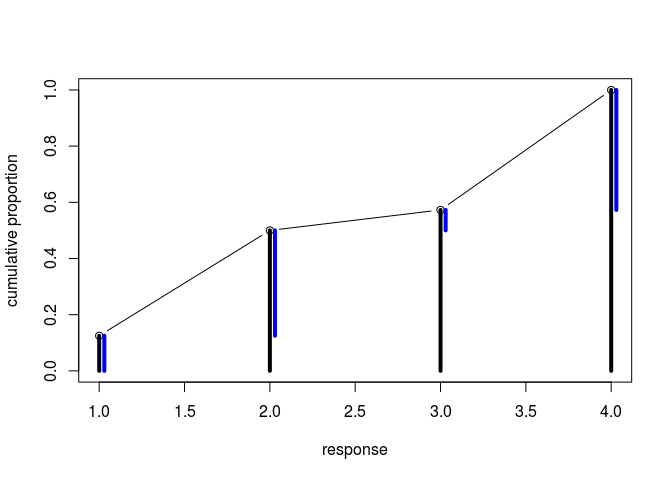

## 12.5. Summary
## 12.6. Practice

#### 11E1. What is the difference between an ordered categorical variable and an unordered one? Define and then give an example of each.

> Ordered categorical variables have a natural ordering of levels within ordered category variable. For example, rating of the movie 4 is greater(better) than rating 3. The difference between levels is not equal and usually subjective. Increasing a rating from 1 to 2, in general, is very different from moving it from 4 to 5. 
> However, levels of the unordered categorical variable are not comparable. Examples of unordered categorical variable include gender (Male/Female).

#### 11E2. What kind of link function does an ordered logistic regression employ? How does it differ from an ordinary logit link?

> Ordered logistic regression employs 'cumulative logit link' function (log-cumulative-odds). This means constructing the odds of a cumulative probability and then taking a logarithm. For each level, this function returns a sum of probabilities of all levels less than or equal to a given one (P(y<=k)).
#### 11M1. At a certain university, employees are annually rated from 1 to 4 on their productivity, with 1 being least productive and 4 most productive. In a certain department at this certain university in a certain year, the numbers of employees receiving each rating were (from 1 to 4): 12, 36, 7, 41. Compute the log cumulative odds of each rating.


```r
ratings <- c(12, 36, 7, 41)
ratings.proportions <- ratings / sum(ratings)
ratings.proportions.cdf <- cumsum(ratings.proportions)
log.cumulative.odds <- log(ratings.proportions.cdf / (1 - ratings.proportions.cdf))
print(log.cumulative.odds)
```

```
## [1] -1.9459101  0.0000000  0.2937611        Inf
```

#### 11M2. Make a version of Figure 12.5 for the employee ratings data given just above.


```r
## R code 12.14
# plot
plot( 1:4 , ratings.proportions.cdf , type="b" , xlab="response" ,
ylab="cumulative proportion" , ylim=c(0,1) )
prev <- 0
prev2 <- 0
for(i in 1:4){
  lines(c(i,i),c(0,ratings.proportions.cdf[i]), lwd=4)
  lines(c(i+0.03,i+0.03), c(prev, ratings.proportions.cdf[i]), lwd=4, col='blue')
  #if(i>1){
  #  lines(c(i-1+0.03, i+0.03), c(prev2,  prev))
  #}
  prev2 <- prev
  prev <- ratings.proportions.cdf[i]
}
```

<!-- -->
