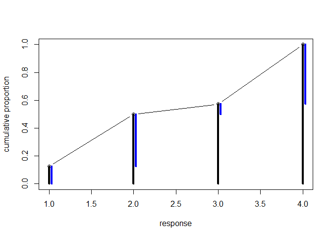
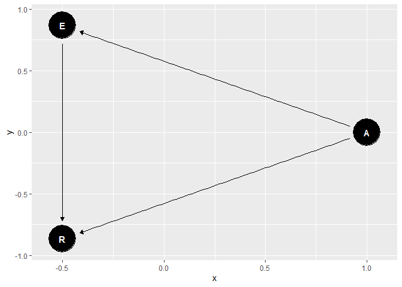
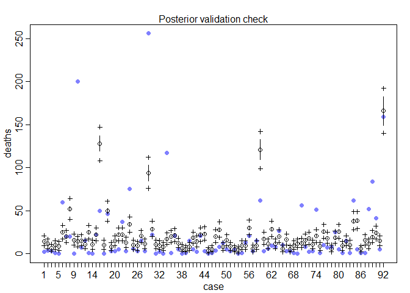
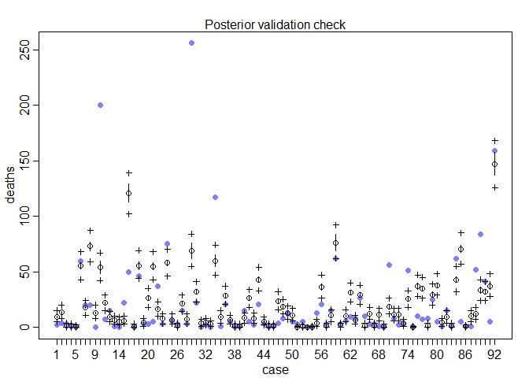
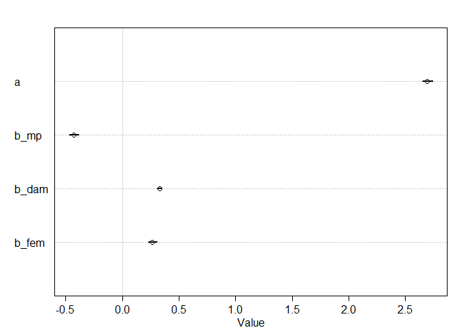
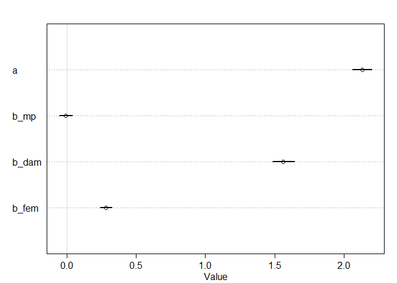

## 12.5. Summary
## 12.6. Practice

#### 11E1. What is the difference between an ordered categorical variable and an unordered one? Define and then give an example of each.

> Ordered categorical variables have a natural ordering of levels within ordered category variable. For example, rating of the movie 4 is greater(better) than rating 3. The difference between levels is not equal and usually subjective. Increasing a rating from 1 to 2, in general, is very different from moving it from 4 to 5. 

> However, levels of the unordered categorical variable are not comparable. Examples of unordered categorical variable include gender (Male/Female).


#### 11E2. What kind of link function does an ordered logistic regression employ? How does it differ from an ordinary logit link?

> Ordered logistic regression employs 'cumulative logit link' function (log-cumulative-odds). This means constructing the odds of a cumulative probability and then taking a logarithm. For each level, this function returns a sum of probabilities of all levels less than or equal to a given one (P(y<=k)).

#### 11M1. At a certain university, employees are annually rated from 1 to 4 on their productivity, with 1 being least productive and 4 most productive. In a certain department at this certain university in a certain year, the numbers of employees receiving each rating were (from 1 to 4): 12, 36, 7, 41. Compute the log cumulative odds of each rating.


```r
ratings <- c(12, 36, 7, 41)
ratings.proportions <- ratings / sum(ratings)
ratings.proportions.cdf <- cumsum(ratings.proportions)
log.cumulative.odds <- log(ratings.proportions.cdf / (1 - ratings.proportions.cdf))
print(log.cumulative.odds)
```

```
## [1] -1.9459101  0.0000000  0.2937611        Inf
```

#### 11M2. Make a version of Figure 12.5 for the employee ratings data given just above.


```r
## R code 12.14

# plot
plot( 1:4 , ratings.proportions.cdf , type="b" , xlab="response" ,
ylab="cumulative proportion" , ylim=c(0,1) )

prev <- 0
prev2 <- 0
for(i in 1:4){
  lines(c(i,i),c(0,ratings.proportions.cdf[i]), lwd=4)
  lines(c(i+0.03,i+0.03), c(prev, ratings.proportions.cdf[i]), lwd=4, col='blue')
  #if(i>1){
  #  lines(c(i-1+0.03, i+0.03), c(prev2,  prev))
  #}
  prev2 <- prev
  prev <- ratings.proportions.cdf[i]
}
```

<!-- -->

#### PDF week 7 problems 1. In the Trolley data—data(Trolley)—we saw how education level (modeled as an ordered category) is associated with responses. Is this association causal? One plausible confound is that education is also associated with age, through a causal process: People are older when they finish school than when they begin it. Reconsider the Trolley data in this light. Draw a DAG that represents hypothetical causal relationships among response, education, and age. Which statical model or models do you need to evaluate the causal influence of education on responses? Fit these models to the trolley data. What do you conclude about the causal relationships among these three variables?


```r
library(dagitty)
library(ggdag)
```

```
## Loading required package: ggplot2
```

```
## 
## Attaching package: 'ggdag'
```

```
## The following object is masked from 'package:ggplot2':
## 
##     expand_scale
```

```
## The following object is masked from 'package:stats':
## 
##     filter
```

```r
# R = response; E = education, A = age
dag <- dagitty("dag{A -> E -> R; A -> R }")
tidy_dagitty(dag)
```

```
## # A DAG with 3 nodes and 3 edges
## #
## # A tibble: 4 x 8
##   name      x      y direction to      xend   yend circular
##   <chr> <dbl>  <dbl> <fct>     <chr>  <dbl>  <dbl> <lgl>   
## 1 A     1.24   0.814 ->        E      1.01  -0.156 FALSE   
## 2 A     1.24   0.814 ->        R      0.285  0.526 FALSE   
## 3 E     1.01  -0.156 ->        R      0.285  0.526 FALSE   
## 4 R     0.285  0.526 <NA>      <NA>  NA     NA     FALSE
```

```r
ggdag(dag, layout = "circle")
```

<!-- -->


```r
## R code 12.30
library(rethinking)
```

```
## Loading required package: rstan
```

```
## Loading required package: StanHeaders
```

```
## rstan (Version 2.19.2, GitRev: 2e1f913d3ca3)
```

```
## For execution on a local, multicore CPU with excess RAM we recommend calling
## options(mc.cores = parallel::detectCores()).
## To avoid recompilation of unchanged Stan programs, we recommend calling
## rstan_options(auto_write = TRUE)
```

```
## For improved execution time, we recommend calling
## Sys.setenv(LOCAL_CPPFLAGS = '-march=native')
## although this causes Stan to throw an error on a few processors.
```

```
## Loading required package: parallel
```

```
## rethinking (Version 1.90)
```

```
## 
## Attaching package: 'rethinking'
```

```
## The following object is masked from 'package:stats':
## 
##     rstudent
```

```r
data(Trolley)
d <- Trolley
levels(d$edu)
```

```
## [1] "Bachelor's Degree"    "Elementary School"    "Graduate Degree"     
## [4] "High School Graduate" "Master's Degree"      "Middle School"       
## [7] "Some College"         "Some High School"
```

```r
## R code 12.31
edu_levels <- c( 6 , 1 , 8 , 4 , 7 , 2 , 5 , 3 )
d$edu_new <- edu_levels[ d$edu ]
str(d)
```

```
## 'data.frame':	9930 obs. of  13 variables:
##  $ case     : Factor w/ 30 levels "cfaqu","cfbur",..: 1 2 3 4 5 6 7 8 9 10 ...
##  $ response : int  4 3 4 3 3 3 5 4 4 4 ...
##  $ order    : int  2 31 16 32 4 9 29 12 23 22 ...
##  $ id       : Factor w/ 331 levels "96;434","96;445",..: 1 1 1 1 1 1 1 1 1 1 ...
##  $ age      : int  14 14 14 14 14 14 14 14 14 14 ...
##  $ male     : int  0 0 0 0 0 0 0 0 0 0 ...
##  $ edu      : Factor w/ 8 levels "Bachelor's Degree",..: 6 6 6 6 6 6 6 6 6 6 ...
##  $ action   : int  0 0 0 0 0 0 1 1 1 1 ...
##  $ intention: int  0 0 0 1 1 1 0 0 0 0 ...
##  $ contact  : int  1 1 1 1 1 1 0 0 0 0 ...
##  $ story    : Factor w/ 12 levels "aqu","boa","box",..: 1 4 8 3 4 11 1 2 3 4 ...
##  $ action2  : int  1 1 1 1 1 1 1 1 1 1 ...
##  $ edu_new  : num  2 2 2 2 2 2 2 2 2 2 ...
```


```r
## R code 12.34
dat <- list(
    R = d$response ,
    action = d$action,
    intention = d$intention,
    contact = d$contact,
    E = as.integer( d$edu_new ),   # edu_new as an index
    alpha = rep( 2.1 , 7 ),        # delta prior
    Age = scale(d$age))       
str(dat)
```

```
## List of 7
##  $ R        : int [1:9930] 4 3 4 3 3 3 5 4 4 4 ...
##  $ action   : int [1:9930] 0 0 0 0 0 0 1 1 1 1 ...
##  $ intention: int [1:9930] 0 0 0 1 1 1 0 0 0 0 ...
##  $ contact  : int [1:9930] 1 1 1 1 1 1 0 0 0 0 ...
##  $ E        : int [1:9930] 2 2 2 2 2 2 2 2 2 2 ...
##  $ alpha    : num [1:7] 2.1 2.1 2.1 2.1 2.1 2.1 2.1
##  $ Age      : num [1:9930, 1] -1.65 -1.65 -1.65 -1.65 -1.65 ...
##   ..- attr(*, "scaled:center")= num 37.5
##   ..- attr(*, "scaled:scale")= num 14.2
```


```r
mweek7.1 <- ulam(
    alist(
        R ~ ordered_logistic( phi , kappa ),
        phi <- bE*sum( delta_j[1:E] ) + bA*action + BI*intention + bC*contact +bAG*Age,
        BI <- bI + bIA*action + bIC*contact,
        kappa ~ normal( 0 , 1.5 ),
        c(bA,bI,bC,bE,bAG,bIA,bIC) ~ normal( 0 , 1 ),
        vector[8]: delta_j <<- append_row( 0 , delta ),
        simplex[7]: delta ~ dirichlet( alpha )
    ),
    data=dat , chains=4 , cores=4 )
```

```
## Warning: Tail Effective Samples Size (ESS) is too low, indicating posterior variances and tail quantiles may be unreliable.
## Running the chains for more iterations may help. See
## http://mc-stan.org/misc/warnings.html#tail-ess
```

```r
precis(mweek7.1)
```

```
## 13 vector or matrix parameters hidden. Use depth=2 to show them.
```

```
##            mean         sd        5.5%       94.5%     n_eff     Rhat
## bIC -1.27049966 0.09785880 -1.42791784 -1.11674070 1011.0085 1.003089
## bIA -0.44615071 0.08099493 -0.57616246 -0.31593647  923.6660 1.002252
## bAG -0.09957776 0.02135209 -0.13207929 -0.06276683  635.9983 1.001193
## bE   0.21364937 0.13144586 -0.05804034  0.36603165  260.7605 1.006761
## bC  -0.33484543 0.06905233 -0.44243283 -0.22807122 1013.8759 1.003116
## bI  -0.28279554 0.05755564 -0.37630919 -0.19148828  835.5319 1.003656
## bA  -0.47472182 0.05359213 -0.56484705 -0.39355683  984.3724 1.001649
```

#### PDF week 7 problems 2. Consider one more variable in the Trolley data: Gender. Suppose that gender might influence education as well as response directly. Draw the DAG now that includes response, education, age, and gender. Using only the DAG, is it possible that the inferences from Problem 1 are confounded by gender? If so, define any additional models you need to infer the causal influence of education on response. What do you conclude?


```r
library(dagitty)
library(ggdag)
# R = response; E = education, A = age, G = gender
dag <- dagitty("dag{A -> E -> R; A -> R ; G -> E ; G -> R }")
tidy_dagitty(dag)
```

```
## # A DAG with 4 nodes and 5 edges
## #
## # A tibble: 6 x 8
##   name      x     y direction to     xend  yend circular
##   <chr> <dbl> <dbl> <fct>     <chr> <dbl> <dbl> <lgl>   
## 1 A      12.1  10.9 ->        E      12.1  12.0 FALSE   
## 2 A      12.1  10.9 ->        R      11.2  11.6 FALSE   
## 3 E      12.1  12.0 ->        R      11.2  11.6 FALSE   
## 4 G      11.2  12.6 ->        E      12.1  12.0 FALSE   
## 5 G      11.2  12.6 ->        R      11.2  11.6 FALSE   
## 6 R      11.2  11.6 <NA>      <NA>   NA    NA   FALSE
```

```r
ggdag(dag, layout = "circle")
```

<!-- -->


```r
dat$male <- d$male
str(dat)
```

```
## List of 8
##  $ R        : int [1:9930] 4 3 4 3 3 3 5 4 4 4 ...
##  $ action   : int [1:9930] 0 0 0 0 0 0 1 1 1 1 ...
##  $ intention: int [1:9930] 0 0 0 1 1 1 0 0 0 0 ...
##  $ contact  : int [1:9930] 1 1 1 1 1 1 0 0 0 0 ...
##  $ E        : int [1:9930] 2 2 2 2 2 2 2 2 2 2 ...
##  $ alpha    : num [1:7] 2.1 2.1 2.1 2.1 2.1 2.1 2.1
##  $ Age      : num [1:9930, 1] -1.65 -1.65 -1.65 -1.65 -1.65 ...
##   ..- attr(*, "scaled:center")= num 37.5
##   ..- attr(*, "scaled:scale")= num 14.2
##  $ male     : int [1:9930] 0 0 0 0 0 0 0 0 0 0 ...
```

```r
mweek7.2 <- ulam(
    alist(
        R ~ ordered_logistic( phi , kappa ),
        phi <- bE*sum( delta_j[1:E] ) + bA*action + BI*intention + bC*contact + bAG*Age + bM*male,
        BI <- bI + bIA*action + bIC*contact ,
        kappa ~ normal( 0 , 1.5 ),
        c(bA,bI,bC,bE,bAG,bIA,bIC,bM) ~ normal( 0 , 1 ),
        vector[8]: delta_j <<- append_row( 0 , delta ),
        simplex[7]: delta ~ dirichlet( alpha )
    ),
    data=dat , chains=4 , cores=4 )
precis(mweek7.2)
```

```
## 13 vector or matrix parameters hidden. Use depth=2 to show them.
```

```
##            mean         sd       5.5%       94.5%     n_eff     Rhat
## bM   0.56892329 0.03473184  0.5126011  0.62288573 2078.9218 1.001232
## bIC -1.29242458 0.09805000 -1.4539375 -1.13557285 1385.3338 1.000579
## bIA -0.44854248 0.07788314 -0.5743374 -0.32436106 1372.6781 1.000158
## bAG -0.06807667 0.02308806 -0.1053286 -0.03053281 1169.5612 1.001067
## bE  -0.01709123 0.17501517 -0.3069596  0.23940616  673.6518 1.002110
## bC  -0.33598772 0.06884779 -0.4422729 -0.22932192 1408.7857 1.000286
## bI  -0.28700601 0.05717607 -0.3808185 -0.19602912 1175.2940 1.001397
## bA  -0.47726457 0.05311778 -0.5620597 -0.39137979 1360.6755 1.000181
```

#### Optional: 
#### 11H3. In order to infer a strong association between deaths and femininity, it’s necessary to include an interaction effect. In the data, there are two measures of a hurricane’s potential to cause death: damage_norm and min_pressure. Consult ?Hurricanes for their meanings. It makes some sense to imagine that femininity of a name matters more when the hurricane is itself deadly. This implies an interaction between femininity and either or both of damage_norm and min_pressure. Fit a series of models evaluating these interactions. Interpret and compare the models. In interpreting the estimates, it may help to generate counterfactual predictions contrasting hurricanes with masculine and feminine names. Are the effect sizes plausible?

name : Given name of hurricane

year : Year of hurricane

deaths : number of deaths

category : Severity code for storm

min_pressure : Minimum pressure, a measure of storm strength; low is stronger

damage_norm : Normalized estimate of damage in dollars

female : Indicator variable for female name

femininity : 1-11 scale from totally masculine (1) to totally feminine (11) for name. Average of 9 scores from 9 raters.


```r
## R code 12.38
library(rethinking)
data(Hurricanes)
d <- Hurricanes
str(d)
```

```
## 'data.frame':	92 obs. of  8 variables:
##  $ name        : Factor w/ 83 levels "Able","Agnes",..: 38 77 1 9 47 20 40 60 27 33 ...
##  $ year        : int  1950 1950 1952 1953 1953 1954 1954 1954 1955 1955 ...
##  $ deaths      : int  2 4 3 1 0 60 20 20 0 200 ...
##  $ category    : int  3 3 1 1 1 3 3 4 3 1 ...
##  $ min_pressure: int  960 955 985 987 985 960 954 938 962 987 ...
##  $ damage_norm : int  1590 5350 150 58 15 19321 3230 24260 2030 14730 ...
##  $ female      : int  1 0 0 1 1 1 1 1 1 1 ...
##  $ femininity  : num  6.78 1.39 3.83 9.83 8.33 ...
```

```r
#?Hurricanes
```


```r
normalise <- function(x){
  (x-mean(x))/sd(x)
}

# prior trimmed data list
dat_list <- list(
  damage_norm_c = normalise(d$damage_norm),
  femininity_c = normalise(d$femininity),
  min_pressure_c = normalise(d$min_pressure),
  deaths = d$deaths)

str(dat_list)
```

```
## List of 4
##  $ damage_norm_c : num [1:92] -0.439 -0.148 -0.55 -0.558 -0.561 ...
##  $ femininity_c  : num [1:92] -0.000935 -1.670758 -0.913314 0.94587 0.481074 ...
##  $ min_pressure_c: num [1:92] -0.258 -0.52 1.054 1.158 1.054 ...
##  $ deaths        : int [1:92] 2 4 3 1 0 60 20 20 0 200 ...
```


```r
# fit Poisson regression using `femininity_c, damage_norm_c, min_pressure_c` as predictors
m11h3 <- ulam(
  alist(
    deaths ~ dpois( lambda ),
    log(lambda) <- a + b_fem*femininity_c + b_dam*damage_norm_c + b_mp*min_pressure_c,
    a ~ dnorm(0, 10),
    c(b_fem,b_dam,b_mp) ~ dnorm(0, 2)),
  data = dat_list, chains=4 , cores=4, log_lik=TRUE)

precis(m11h3)
```

```
##             mean         sd       5.5%      94.5%    n_eff      Rhat
## a      2.6967359 0.02921755  2.6493150  2.7439586 1434.750 1.0028024
## b_mp  -0.4281020 0.02640007 -0.4695462 -0.3855091 1152.428 1.0025420
## b_dam  0.3276036 0.01478460  0.3039390  0.3515030 1341.911 0.9988418
## b_fem  0.2656050 0.02612752  0.2243369  0.3075106 1525.571 0.9989155
```

```r
postcheck(m11h3, window = 100)
```

<!-- -->

#### 11H4 In the original hurricanes paper, storm damage (damage_norm) was used directly. This assumption implies that mortality increases exponentially with a linear increase in storm strength, because a Poisson regression uses a log link. So it’s worth exploring an alternative hypothesis: that the logarithm of storm strength is what matters. Explore this by using the logarithm of damage_norm as a predictor. Using the best model structure from the previous problem, compare a model that uses log(damage_norm) to a model that uses damage_norm directly. Compare their DIC/WAIC values as well as their implied predictions. What do you conclude?


```r
dat_list$log_damage_norm_c <- normalise(log(d$damage_norm))
str(dat_list)
```

```
## List of 5
##  $ damage_norm_c    : num [1:92] -0.439 -0.148 -0.55 -0.558 -0.561 ...
##  $ femininity_c     : num [1:92] -0.000935 -1.670758 -0.913314 0.94587 0.481074 ...
##  $ min_pressure_c   : num [1:92] -0.258 -0.52 1.054 1.158 1.054 ...
##  $ deaths           : int [1:92] 2 4 3 1 0 60 20 20 0 200 ...
##  $ log_damage_norm_c: num [1:92] 0.0828 0.5921 -0.9083 -1.3071 -1.8748 ...
```

```r
m11h4 <- ulam(
  alist(
    deaths ~ dpois( lambda ),
    log(lambda) <- a + b_fem*femininity_c + b_dam*log_damage_norm_c + b_mp*min_pressure_c,
    a ~ dnorm(0, 10),
    c(b_fem,b_dam,b_mp) ~ dnorm(0, 2)),
  data = dat_list, chains=4 , cores=4, log_lik=TRUE)

precis(m11h4)
```

```
##               mean         sd        5.5%      94.5%    n_eff     Rhat
## a      2.130083316 0.04503744  2.05767854 2.20086440 1250.644 1.001302
## b_mp  -0.007181581 0.02883435 -0.05273291 0.03984834 1393.618 1.001281
## b_dam  1.562820125 0.04905436  1.48603103 1.64232716 1192.794 1.000964
## b_fem  0.281538690 0.02619858  0.24059017 0.32393222 1696.733 1.000456
```

```r
postcheck(m11h4, window = 100)
```

<!-- -->

```r
plot(precis(m11h3))
```

<!-- -->

```r
plot(precis(m11h4))
```

<!-- -->

