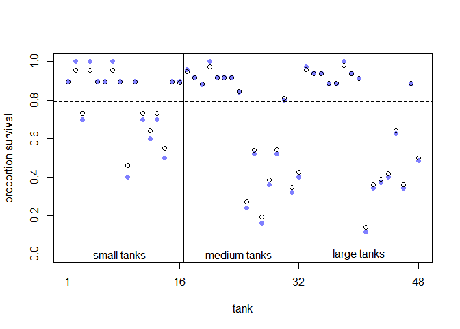
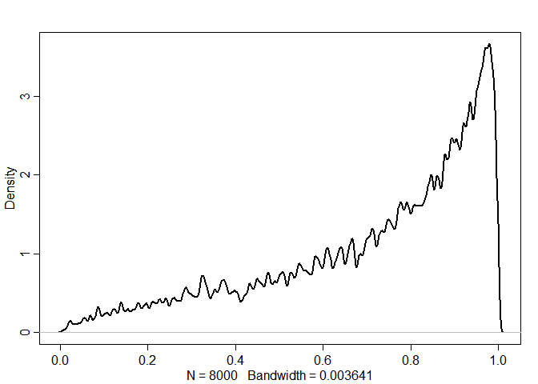

# 13 Models With Memory
## 13.1. Example: Multilevel tadpoles

```r
## R code 13.1
library(rethinking)
```

```
## Loading required package: rstan
```

```
## Loading required package: StanHeaders
```

```
## Loading required package: ggplot2
```

```
## rstan (Version 2.19.2, GitRev: 2e1f913d3ca3)
```

```
## For execution on a local, multicore CPU with excess RAM we recommend calling
## options(mc.cores = parallel::detectCores()).
## To avoid recompilation of unchanged Stan programs, we recommend calling
## rstan_options(auto_write = TRUE)
```

```
## For improved execution time, we recommend calling
## Sys.setenv(LOCAL_CPPFLAGS = '-march=native')
## although this causes Stan to throw an error on a few processors.
```

```
## Loading required package: parallel
```

```
## Loading required package: dagitty
```

```
## rethinking (Version 1.93)
```

```
## 
## Attaching package: 'rethinking'
```

```
## The following object is masked from 'package:stats':
## 
##     rstudent
```

```r
data(reedfrogs)
d <- reedfrogs
str(d)
```

```
## 'data.frame':	48 obs. of  5 variables:
##  $ density : int  10 10 10 10 10 10 10 10 10 10 ...
##  $ pred    : Factor w/ 2 levels "no","pred": 1 1 1 1 1 1 1 1 2 2 ...
##  $ size    : Factor w/ 2 levels "big","small": 1 1 1 1 2 2 2 2 1 1 ...
##  $ surv    : int  9 10 7 10 9 9 10 9 4 9 ...
##  $ propsurv: num  0.9 1 0.7 1 0.9 0.9 1 0.9 0.4 0.9 ...
```

```r
## R code 13.2
# make the tank cluster variable
d$tank <- 1:nrow(d)

dat <- list(
    S = d$surv,
    N = d$density,
    tank = d$tank )

# approximate posterior
m13.1 <- ulam(
    alist(
        S ~ dbinom( N , p ) ,
        logit(p) <- a[tank] ,
        a[tank] ~ dnorm( 0 , 1.5 )
    ), data=dat , chains=4 , log_lik=TRUE )
```

```
## 
## SAMPLING FOR MODEL 'cb3dfdd4abafffee16ea86593d6ba62d' NOW (CHAIN 1).
## Chain 1: 
## Chain 1: Gradient evaluation took 0 seconds
## Chain 1: 1000 transitions using 10 leapfrog steps per transition would take 0 seconds.
## Chain 1: Adjust your expectations accordingly!
## Chain 1: 
## Chain 1: 
## Chain 1: Iteration:   1 / 1000 [  0%]  (Warmup)
## Chain 1: Iteration: 100 / 1000 [ 10%]  (Warmup)
## Chain 1: Iteration: 200 / 1000 [ 20%]  (Warmup)
## Chain 1: Iteration: 300 / 1000 [ 30%]  (Warmup)
## Chain 1: Iteration: 400 / 1000 [ 40%]  (Warmup)
## Chain 1: Iteration: 500 / 1000 [ 50%]  (Warmup)
## Chain 1: Iteration: 501 / 1000 [ 50%]  (Sampling)
## Chain 1: Iteration: 600 / 1000 [ 60%]  (Sampling)
## Chain 1: Iteration: 700 / 1000 [ 70%]  (Sampling)
## Chain 1: Iteration: 800 / 1000 [ 80%]  (Sampling)
## Chain 1: Iteration: 900 / 1000 [ 90%]  (Sampling)
## Chain 1: Iteration: 1000 / 1000 [100%]  (Sampling)
## Chain 1: 
## Chain 1:  Elapsed Time: 0.168 seconds (Warm-up)
## Chain 1:                0.144 seconds (Sampling)
## Chain 1:                0.312 seconds (Total)
## Chain 1: 
## 
## SAMPLING FOR MODEL 'cb3dfdd4abafffee16ea86593d6ba62d' NOW (CHAIN 2).
## Chain 2: 
## Chain 2: Gradient evaluation took 0 seconds
## Chain 2: 1000 transitions using 10 leapfrog steps per transition would take 0 seconds.
## Chain 2: Adjust your expectations accordingly!
## Chain 2: 
## Chain 2: 
## Chain 2: Iteration:   1 / 1000 [  0%]  (Warmup)
## Chain 2: Iteration: 100 / 1000 [ 10%]  (Warmup)
## Chain 2: Iteration: 200 / 1000 [ 20%]  (Warmup)
## Chain 2: Iteration: 300 / 1000 [ 30%]  (Warmup)
## Chain 2: Iteration: 400 / 1000 [ 40%]  (Warmup)
## Chain 2: Iteration: 500 / 1000 [ 50%]  (Warmup)
## Chain 2: Iteration: 501 / 1000 [ 50%]  (Sampling)
## Chain 2: Iteration: 600 / 1000 [ 60%]  (Sampling)
## Chain 2: Iteration: 700 / 1000 [ 70%]  (Sampling)
## Chain 2: Iteration: 800 / 1000 [ 80%]  (Sampling)
## Chain 2: Iteration: 900 / 1000 [ 90%]  (Sampling)
## Chain 2: Iteration: 1000 / 1000 [100%]  (Sampling)
## Chain 2: 
## Chain 2:  Elapsed Time: 0.162 seconds (Warm-up)
## Chain 2:                0.144 seconds (Sampling)
## Chain 2:                0.306 seconds (Total)
## Chain 2: 
## 
## SAMPLING FOR MODEL 'cb3dfdd4abafffee16ea86593d6ba62d' NOW (CHAIN 3).
## Chain 3: 
## Chain 3: Gradient evaluation took 0 seconds
## Chain 3: 1000 transitions using 10 leapfrog steps per transition would take 0 seconds.
## Chain 3: Adjust your expectations accordingly!
## Chain 3: 
## Chain 3: 
## Chain 3: Iteration:   1 / 1000 [  0%]  (Warmup)
## Chain 3: Iteration: 100 / 1000 [ 10%]  (Warmup)
## Chain 3: Iteration: 200 / 1000 [ 20%]  (Warmup)
## Chain 3: Iteration: 300 / 1000 [ 30%]  (Warmup)
## Chain 3: Iteration: 400 / 1000 [ 40%]  (Warmup)
## Chain 3: Iteration: 500 / 1000 [ 50%]  (Warmup)
## Chain 3: Iteration: 501 / 1000 [ 50%]  (Sampling)
## Chain 3: Iteration: 600 / 1000 [ 60%]  (Sampling)
## Chain 3: Iteration: 700 / 1000 [ 70%]  (Sampling)
## Chain 3: Iteration: 800 / 1000 [ 80%]  (Sampling)
## Chain 3: Iteration: 900 / 1000 [ 90%]  (Sampling)
## Chain 3: Iteration: 1000 / 1000 [100%]  (Sampling)
## Chain 3: 
## Chain 3:  Elapsed Time: 0.162 seconds (Warm-up)
## Chain 3:                0.144 seconds (Sampling)
## Chain 3:                0.306 seconds (Total)
## Chain 3: 
## 
## SAMPLING FOR MODEL 'cb3dfdd4abafffee16ea86593d6ba62d' NOW (CHAIN 4).
## Chain 4: 
## Chain 4: Gradient evaluation took 0 seconds
## Chain 4: 1000 transitions using 10 leapfrog steps per transition would take 0 seconds.
## Chain 4: Adjust your expectations accordingly!
## Chain 4: 
## Chain 4: 
## Chain 4: Iteration:   1 / 1000 [  0%]  (Warmup)
## Chain 4: Iteration: 100 / 1000 [ 10%]  (Warmup)
## Chain 4: Iteration: 200 / 1000 [ 20%]  (Warmup)
## Chain 4: Iteration: 300 / 1000 [ 30%]  (Warmup)
## Chain 4: Iteration: 400 / 1000 [ 40%]  (Warmup)
## Chain 4: Iteration: 500 / 1000 [ 50%]  (Warmup)
## Chain 4: Iteration: 501 / 1000 [ 50%]  (Sampling)
## Chain 4: Iteration: 600 / 1000 [ 60%]  (Sampling)
## Chain 4: Iteration: 700 / 1000 [ 70%]  (Sampling)
## Chain 4: Iteration: 800 / 1000 [ 80%]  (Sampling)
## Chain 4: Iteration: 900 / 1000 [ 90%]  (Sampling)
## Chain 4: Iteration: 1000 / 1000 [100%]  (Sampling)
## Chain 4: 
## Chain 4:  Elapsed Time: 0.163 seconds (Warm-up)
## Chain 4:                0.147 seconds (Sampling)
## Chain 4:                0.31 seconds (Total)
## Chain 4:
```

```r
## R code 13.3
m13.2 <- ulam(
    alist(
        S ~ dbinom( N , p ) ,
        logit(p) <- a[tank] ,
        a[tank] ~ dnorm( a_bar , sigma ) ,
        a_bar ~ dnorm( 0 , 1.5 ) ,
        sigma ~ dexp( 1 )
    ), data=dat , chains=4 , log_lik=TRUE )
```

```
## 
## SAMPLING FOR MODEL 'b657fd8d4fc97d5f194fdc27ef33e50f' NOW (CHAIN 1).
## Chain 1: 
## Chain 1: Gradient evaluation took 0 seconds
## Chain 1: 1000 transitions using 10 leapfrog steps per transition would take 0 seconds.
## Chain 1: Adjust your expectations accordingly!
## Chain 1: 
## Chain 1: 
## Chain 1: Iteration:   1 / 1000 [  0%]  (Warmup)
## Chain 1: Iteration: 100 / 1000 [ 10%]  (Warmup)
## Chain 1: Iteration: 200 / 1000 [ 20%]  (Warmup)
## Chain 1: Iteration: 300 / 1000 [ 30%]  (Warmup)
## Chain 1: Iteration: 400 / 1000 [ 40%]  (Warmup)
## Chain 1: Iteration: 500 / 1000 [ 50%]  (Warmup)
## Chain 1: Iteration: 501 / 1000 [ 50%]  (Sampling)
## Chain 1: Iteration: 600 / 1000 [ 60%]  (Sampling)
## Chain 1: Iteration: 700 / 1000 [ 70%]  (Sampling)
## Chain 1: Iteration: 800 / 1000 [ 80%]  (Sampling)
## Chain 1: Iteration: 900 / 1000 [ 90%]  (Sampling)
## Chain 1: Iteration: 1000 / 1000 [100%]  (Sampling)
## Chain 1: 
## Chain 1:  Elapsed Time: 0.192 seconds (Warm-up)
## Chain 1:                0.174 seconds (Sampling)
## Chain 1:                0.366 seconds (Total)
## Chain 1: 
## 
## SAMPLING FOR MODEL 'b657fd8d4fc97d5f194fdc27ef33e50f' NOW (CHAIN 2).
## Chain 2: 
## Chain 2: Gradient evaluation took 0 seconds
## Chain 2: 1000 transitions using 10 leapfrog steps per transition would take 0 seconds.
## Chain 2: Adjust your expectations accordingly!
## Chain 2: 
## Chain 2: 
## Chain 2: Iteration:   1 / 1000 [  0%]  (Warmup)
## Chain 2: Iteration: 100 / 1000 [ 10%]  (Warmup)
## Chain 2: Iteration: 200 / 1000 [ 20%]  (Warmup)
## Chain 2: Iteration: 300 / 1000 [ 30%]  (Warmup)
## Chain 2: Iteration: 400 / 1000 [ 40%]  (Warmup)
## Chain 2: Iteration: 500 / 1000 [ 50%]  (Warmup)
## Chain 2: Iteration: 501 / 1000 [ 50%]  (Sampling)
## Chain 2: Iteration: 600 / 1000 [ 60%]  (Sampling)
## Chain 2: Iteration: 700 / 1000 [ 70%]  (Sampling)
## Chain 2: Iteration: 800 / 1000 [ 80%]  (Sampling)
## Chain 2: Iteration: 900 / 1000 [ 90%]  (Sampling)
## Chain 2: Iteration: 1000 / 1000 [100%]  (Sampling)
## Chain 2: 
## Chain 2:  Elapsed Time: 0.214 seconds (Warm-up)
## Chain 2:                0.146 seconds (Sampling)
## Chain 2:                0.36 seconds (Total)
## Chain 2: 
## 
## SAMPLING FOR MODEL 'b657fd8d4fc97d5f194fdc27ef33e50f' NOW (CHAIN 3).
## Chain 3: 
## Chain 3: Gradient evaluation took 0 seconds
## Chain 3: 1000 transitions using 10 leapfrog steps per transition would take 0 seconds.
## Chain 3: Adjust your expectations accordingly!
## Chain 3: 
## Chain 3: 
## Chain 3: Iteration:   1 / 1000 [  0%]  (Warmup)
## Chain 3: Iteration: 100 / 1000 [ 10%]  (Warmup)
## Chain 3: Iteration: 200 / 1000 [ 20%]  (Warmup)
## Chain 3: Iteration: 300 / 1000 [ 30%]  (Warmup)
## Chain 3: Iteration: 400 / 1000 [ 40%]  (Warmup)
## Chain 3: Iteration: 500 / 1000 [ 50%]  (Warmup)
## Chain 3: Iteration: 501 / 1000 [ 50%]  (Sampling)
## Chain 3: Iteration: 600 / 1000 [ 60%]  (Sampling)
## Chain 3: Iteration: 700 / 1000 [ 70%]  (Sampling)
## Chain 3: Iteration: 800 / 1000 [ 80%]  (Sampling)
## Chain 3: Iteration: 900 / 1000 [ 90%]  (Sampling)
## Chain 3: Iteration: 1000 / 1000 [100%]  (Sampling)
## Chain 3: 
## Chain 3:  Elapsed Time: 0.222 seconds (Warm-up)
## Chain 3:                0.174 seconds (Sampling)
## Chain 3:                0.396 seconds (Total)
## Chain 3: 
## 
## SAMPLING FOR MODEL 'b657fd8d4fc97d5f194fdc27ef33e50f' NOW (CHAIN 4).
## Chain 4: 
## Chain 4: Gradient evaluation took 0 seconds
## Chain 4: 1000 transitions using 10 leapfrog steps per transition would take 0 seconds.
## Chain 4: Adjust your expectations accordingly!
## Chain 4: 
## Chain 4: 
## Chain 4: Iteration:   1 / 1000 [  0%]  (Warmup)
## Chain 4: Iteration: 100 / 1000 [ 10%]  (Warmup)
## Chain 4: Iteration: 200 / 1000 [ 20%]  (Warmup)
## Chain 4: Iteration: 300 / 1000 [ 30%]  (Warmup)
## Chain 4: Iteration: 400 / 1000 [ 40%]  (Warmup)
## Chain 4: Iteration: 500 / 1000 [ 50%]  (Warmup)
## Chain 4: Iteration: 501 / 1000 [ 50%]  (Sampling)
## Chain 4: Iteration: 600 / 1000 [ 60%]  (Sampling)
## Chain 4: Iteration: 700 / 1000 [ 70%]  (Sampling)
## Chain 4: Iteration: 800 / 1000 [ 80%]  (Sampling)
## Chain 4: Iteration: 900 / 1000 [ 90%]  (Sampling)
## Chain 4: Iteration: 1000 / 1000 [100%]  (Sampling)
## Chain 4: 
## Chain 4:  Elapsed Time: 0.192 seconds (Warm-up)
## Chain 4:                0.144 seconds (Sampling)
## Chain 4:                0.336 seconds (Total)
## Chain 4:
```

```r
## R code 13.4
compare( m13.1 , m13.2 )
```

```
##          WAIC       SE    dWAIC      dSE    pWAIC       weight
## m13.2 199.272 7.292323  0.00000       NA 20.64716 0.9992411763
## m13.1 213.638 4.600206 14.36596 3.905702 25.18397 0.0007588237
```


```r
## R code 13.5
# extract Stan samples
post <- extract.samples(m13.2)

# compute median intercept for each tank
# also transform to probability with logistic
d$propsurv.est <- logistic( apply( post$a , 2 , mean ) )

# display raw proportions surviving in each tank
plot( d$propsurv , ylim=c(0,1) , pch=16 , xaxt="n" ,
    xlab="tank" , ylab="proportion survival" , col=rangi2 )
axis( 1 , at=c(1,16,32,48) , labels=c(1,16,32,48) )

# overlay posterior means
points( d$propsurv.est )

# mark posterior mean probability across tanks
abline( h=mean(inv_logit(post$a_bar)) , lty=2 )

# draw vertical dividers between tank densities
abline( v=16.5 , lwd=0.5 )
abline( v=32.5 , lwd=0.5 )
text( 8 , 0 , "small tanks" )
text( 16+8 , 0 , "medium tanks" )
text( 32+8 , 0 , "large tanks" )
```

<!-- -->


```r
## R code 13.6
# show first 100 populations in the posterior
plot( NULL , xlim=c(-3,4) , ylim=c(0,0.35) ,
    xlab="log-odds survive" , ylab="Density" )
for ( i in 1:100 )
    curve( dnorm(x,post$a_bar[i],post$sigma[i]) , add=TRUE ,
    col=col.alpha("black",0.2) )
```

<!-- -->

```r
# sample 8000 imaginary tanks from the posterior distribution
sim_tanks <- rnorm( 8000 , post$a_bar , post$sigma )

# transform to probability and visualize
dens( inv_logit(sim_tanks) , lwd=2 , adj=0.1 )
```

<!-- -->

## 13.2. Varying effects and the underfitting/overfitting trade-off
### 13.2.1. The model.
### 13.2.2. Assign values to the parameters.

```r
## R code 13.7
a_bar <- 1.5
sigma <- 1.5
nponds <- 60
Ni <- as.integer( rep( c(5,10,25,35) , each=15 ) )

## R code 13.8
set.seed(5005)
a_pond <- rnorm( nponds , mean=a_bar , sd=sigma )

## R code 13.9
dsim <- data.frame( pond=1:nponds , Ni=Ni , true_a=a_pond )

## R code 13.10
class(1:3)
```

```
## [1] "integer"
```

```r
class(c(1,2,3))
```

```
## [1] "numeric"
```

### 13.2.3. Simulate survivors.


```r
## R code 13.11
dsim$Si <- rbinom( nponds , prob=logistic(dsim$true_a) , size=dsim$Ni )
```

### 13.2.4. Compute the no-pooling estimates.

```r
## R code 13.12
dsim$p_nopool <- dsim$Si / dsim$Ni
```

### 13.2.5. Compute the partial-pooling estimates.

```r
## R code 13.13
dat <- list( Si=dsim$Si , Ni=dsim$Ni , pond=dsim$pond )
m13.3 <- ulam(
    alist(
        Si ~ dbinom( Ni , p ),
        logit(p) <- a_pond[pond],
        a_pond[pond] ~ dnorm( a_bar , sigma ),
        a_bar ~ dnorm( 0 , 1.5 ),
        sigma ~ dexp( 1 )
    ), data=dat , chains=4 )
```

```
## 
## SAMPLING FOR MODEL 'dec18dc74da68fd44dec3f986f9d0eb6' NOW (CHAIN 1).
## Chain 1: 
## Chain 1: Gradient evaluation took 0 seconds
## Chain 1: 1000 transitions using 10 leapfrog steps per transition would take 0 seconds.
## Chain 1: Adjust your expectations accordingly!
## Chain 1: 
## Chain 1: 
## Chain 1: Iteration:   1 / 1000 [  0%]  (Warmup)
## Chain 1: Iteration: 100 / 1000 [ 10%]  (Warmup)
## Chain 1: Iteration: 200 / 1000 [ 20%]  (Warmup)
## Chain 1: Iteration: 300 / 1000 [ 30%]  (Warmup)
## Chain 1: Iteration: 400 / 1000 [ 40%]  (Warmup)
## Chain 1: Iteration: 500 / 1000 [ 50%]  (Warmup)
## Chain 1: Iteration: 501 / 1000 [ 50%]  (Sampling)
## Chain 1: Iteration: 600 / 1000 [ 60%]  (Sampling)
## Chain 1: Iteration: 700 / 1000 [ 70%]  (Sampling)
## Chain 1: Iteration: 800 / 1000 [ 80%]  (Sampling)
## Chain 1: Iteration: 900 / 1000 [ 90%]  (Sampling)
## Chain 1: Iteration: 1000 / 1000 [100%]  (Sampling)
## Chain 1: 
## Chain 1:  Elapsed Time: 0.309 seconds (Warm-up)
## Chain 1:                0.16 seconds (Sampling)
## Chain 1:                0.469 seconds (Total)
## Chain 1: 
## 
## SAMPLING FOR MODEL 'dec18dc74da68fd44dec3f986f9d0eb6' NOW (CHAIN 2).
## Chain 2: 
## Chain 2: Gradient evaluation took 0 seconds
## Chain 2: 1000 transitions using 10 leapfrog steps per transition would take 0 seconds.
## Chain 2: Adjust your expectations accordingly!
## Chain 2: 
## Chain 2: 
## Chain 2: Iteration:   1 / 1000 [  0%]  (Warmup)
## Chain 2: Iteration: 100 / 1000 [ 10%]  (Warmup)
## Chain 2: Iteration: 200 / 1000 [ 20%]  (Warmup)
## Chain 2: Iteration: 300 / 1000 [ 30%]  (Warmup)
## Chain 2: Iteration: 400 / 1000 [ 40%]  (Warmup)
## Chain 2: Iteration: 500 / 1000 [ 50%]  (Warmup)
## Chain 2: Iteration: 501 / 1000 [ 50%]  (Sampling)
## Chain 2: Iteration: 600 / 1000 [ 60%]  (Sampling)
## Chain 2: Iteration: 700 / 1000 [ 70%]  (Sampling)
## Chain 2: Iteration: 800 / 1000 [ 80%]  (Sampling)
## Chain 2: Iteration: 900 / 1000 [ 90%]  (Sampling)
## Chain 2: Iteration: 1000 / 1000 [100%]  (Sampling)
## Chain 2: 
## Chain 2:  Elapsed Time: 0.241 seconds (Warm-up)
## Chain 2:                0.156 seconds (Sampling)
## Chain 2:                0.397 seconds (Total)
## Chain 2: 
## 
## SAMPLING FOR MODEL 'dec18dc74da68fd44dec3f986f9d0eb6' NOW (CHAIN 3).
## Chain 3: 
## Chain 3: Gradient evaluation took 0 seconds
## Chain 3: 1000 transitions using 10 leapfrog steps per transition would take 0 seconds.
## Chain 3: Adjust your expectations accordingly!
## Chain 3: 
## Chain 3: 
## Chain 3: Iteration:   1 / 1000 [  0%]  (Warmup)
## Chain 3: Iteration: 100 / 1000 [ 10%]  (Warmup)
## Chain 3: Iteration: 200 / 1000 [ 20%]  (Warmup)
## Chain 3: Iteration: 300 / 1000 [ 30%]  (Warmup)
## Chain 3: Iteration: 400 / 1000 [ 40%]  (Warmup)
## Chain 3: Iteration: 500 / 1000 [ 50%]  (Warmup)
## Chain 3: Iteration: 501 / 1000 [ 50%]  (Sampling)
## Chain 3: Iteration: 600 / 1000 [ 60%]  (Sampling)
## Chain 3: Iteration: 700 / 1000 [ 70%]  (Sampling)
## Chain 3: Iteration: 800 / 1000 [ 80%]  (Sampling)
## Chain 3: Iteration: 900 / 1000 [ 90%]  (Sampling)
## Chain 3: Iteration: 1000 / 1000 [100%]  (Sampling)
## Chain 3: 
## Chain 3:  Elapsed Time: 0.41 seconds (Warm-up)
## Chain 3:                0.158 seconds (Sampling)
## Chain 3:                0.568 seconds (Total)
## Chain 3: 
## 
## SAMPLING FOR MODEL 'dec18dc74da68fd44dec3f986f9d0eb6' NOW (CHAIN 4).
## Chain 4: 
## Chain 4: Gradient evaluation took 0 seconds
## Chain 4: 1000 transitions using 10 leapfrog steps per transition would take 0 seconds.
## Chain 4: Adjust your expectations accordingly!
## Chain 4: 
## Chain 4: 
## Chain 4: Iteration:   1 / 1000 [  0%]  (Warmup)
## Chain 4: Iteration: 100 / 1000 [ 10%]  (Warmup)
## Chain 4: Iteration: 200 / 1000 [ 20%]  (Warmup)
## Chain 4: Iteration: 300 / 1000 [ 30%]  (Warmup)
## Chain 4: Iteration: 400 / 1000 [ 40%]  (Warmup)
## Chain 4: Iteration: 500 / 1000 [ 50%]  (Warmup)
## Chain 4: Iteration: 501 / 1000 [ 50%]  (Sampling)
## Chain 4: Iteration: 600 / 1000 [ 60%]  (Sampling)
## Chain 4: Iteration: 700 / 1000 [ 70%]  (Sampling)
## Chain 4: Iteration: 800 / 1000 [ 80%]  (Sampling)
## Chain 4: Iteration: 900 / 1000 [ 90%]  (Sampling)
## Chain 4: Iteration: 1000 / 1000 [100%]  (Sampling)
## Chain 4: 
## Chain 4:  Elapsed Time: 0.289 seconds (Warm-up)
## Chain 4:                0.157 seconds (Sampling)
## Chain 4:                0.446 seconds (Total)
## Chain 4:
```

```r
## R code 13.14
precis( m13.3 , depth=2 )
```

```
##                   mean        sd        5.5%       94.5%    n_eff      Rhat
## a_pond[1]   1.66111570 1.0448881  0.08933258  3.40453189 3823.715 0.9991587
## a_pond[2]   2.87958020 1.2808424  0.99004749  5.09506236 3692.212 0.9993657
## a_pond[3]  -0.63555131 0.8939399 -2.12236714  0.74383763 2985.740 0.9990597
## a_pond[4]   2.91087532 1.3127237  0.97215848  5.09321856 2298.642 1.0006633
## a_pond[5]   2.87844145 1.2806454  0.97519040  5.11831352 2954.498 0.9984856
## a_pond[6]   2.87604271 1.2177439  1.05552647  4.95450364 3062.143 0.9989396
## a_pond[7]   0.06231492 0.8425360 -1.27496655  1.41827714 3981.753 0.9989013
## a_pond[8]   2.93179366 1.2916668  1.08083368  5.11292954 2910.188 0.9998007
## a_pond[9]   1.63334356 0.9950475  0.17640558  3.29276195 3474.367 0.9983910
## a_pond[10]  1.64861671 1.0040089  0.16519105  3.33273125 2605.818 1.0008102
## a_pond[11]  2.88598794 1.3076806  1.01516913  5.09907996 2163.977 1.0013677
## a_pond[12]  0.06623442 0.8785104 -1.29167006  1.47599347 4240.158 0.9991261
## a_pond[13]  2.87953142 1.2262030  1.02966507  4.99084176 3483.164 0.9992785
## a_pond[14]  2.89075141 1.3172357  0.98580266  5.22164843 2888.001 0.9984107
## a_pond[15]  2.90306382 1.2675318  1.07064629  4.98121233 3868.620 0.9985295
## a_pond[16]  1.57215593 0.7670109  0.42706474  2.86450371 4612.604 0.9991402
## a_pond[17] -1.45200492 0.7726461 -2.71095752 -0.32117871 3437.554 0.9996658
## a_pond[18]  1.03849743 0.6699546  0.01286656  2.12646504 4395.961 0.9994081
## a_pond[19] -0.96134473 0.6759301 -2.05768254  0.05227626 4125.470 0.9987436
## a_pond[20]  1.56311723 0.7499271  0.44031253  2.85632351 3468.821 0.9991852
## a_pond[21] -0.13169782 0.6216938 -1.12256060  0.85077219 5035.376 0.9988067
## a_pond[22]  2.26171642 0.9011584  0.93141415  3.75588475 3310.066 0.9992951
## a_pond[23]  3.27572901 1.1388764  1.59761496  5.30223784 3176.867 0.9992486
## a_pond[24]  0.62516495 0.6359365 -0.37879625  1.68166763 3081.801 1.0007483
## a_pond[25]  3.26177369 1.1681345  1.60133854  5.34474974 2867.195 1.0000737
## a_pond[26]  2.24616089 0.9142104  0.90120906  3.88044104 3351.673 0.9984271
## a_pond[27]  1.06638635 0.6799714  0.03902116  2.17660068 3694.038 0.9993702
## a_pond[28]  2.26438238 0.9158909  0.93203740  3.85879730 3198.481 0.9989781
## a_pond[29]  1.57214216 0.7462163  0.46734553  2.81728441 3746.944 0.9994346
## a_pond[30]  1.06144581 0.6724961  0.05183590  2.16873985 3708.475 0.9995238
## a_pond[31]  2.49332687 0.7091099  1.43861697  3.73893756 3241.822 0.9988718
## a_pond[32]  2.06757963 0.6119497  1.15188481  3.07687655 3472.907 0.9998570
## a_pond[33]  1.72256597 0.5296681  0.91800727  2.57583523 4397.741 0.9996637
## a_pond[34]  1.24483824 0.4682812  0.53264152  2.02028272 5662.890 0.9988005
## a_pond[35]  0.67084453 0.4230265 -0.01747554  1.35129636 4403.020 0.9988185
## a_pond[36]  3.83745075 1.0587493  2.32707766  5.60023153 2817.127 0.9988925
## a_pond[37] -1.00093881 0.4449205 -1.71686583 -0.30629806 4523.585 0.9986087
## a_pond[38] -1.20422248 0.4613374 -1.98338286 -0.52973732 4085.160 0.9989249
## a_pond[39]  0.65493061 0.4180371 -0.02123506  1.33034651 4090.468 0.9983756
## a_pond[40]  3.87085753 1.0941249  2.32182919  5.78524112 2144.358 0.9994880
## a_pond[41]  3.84917622 1.0749834  2.30996180  5.75636520 2814.172 1.0006371
## a_pond[42]  2.45707757 0.6869919  1.42652387  3.63326586 3633.217 0.9996922
## a_pond[43] -0.14420101 0.4252355 -0.83404005  0.53735452 4827.604 0.9985616
## a_pond[44]  0.67004554 0.4070127  0.02455681  1.32091576 4196.232 0.9994161
## a_pond[45] -1.19967748 0.4734029 -1.99407033 -0.45878364 4651.723 0.9991661
## a_pond[46]  0.01971671 0.3471006 -0.52447435  0.57036772 4115.986 0.9991126
## a_pond[47]  4.10115837 1.0041187  2.68349300  5.87945821 2393.377 1.0021396
## a_pond[48]  2.11039354 0.5121347  1.30047475  2.95419543 4740.663 0.9985320
## a_pond[49]  1.85396328 0.4765872  1.14494701  2.64978723 3865.599 1.0003692
## a_pond[50]  2.78463932 0.6883627  1.76151487  3.95546571 3139.144 0.9989716
## a_pond[51]  2.42380285 0.6352523  1.46670098  3.49313132 3614.454 0.9992378
## a_pond[52]  0.35855646 0.3574032 -0.18785188  0.94203774 5120.891 0.9989477
## a_pond[53]  2.10545047 0.5317848  1.30495749  3.02677638 3597.455 0.9992611
## a_pond[54]  4.05594127 0.9806303  2.68220677  5.76800764 3097.130 0.9988815
## a_pond[55]  1.12748554 0.3967074  0.52143452  1.76837243 4229.688 1.0000304
## a_pond[56]  2.77928986 0.6348048  1.83468342  3.84342633 3082.520 0.9987385
## a_pond[57]  0.71759874 0.3551279  0.14536668  1.29068631 5195.541 0.9984938
## a_pond[58]  4.10384840 1.0732020  2.64136699  6.04983451 1825.827 1.0002676
## a_pond[59]  1.64899980 0.4496064  0.96983831  2.40465146 3571.277 0.9991387
## a_pond[60]  2.40137063 0.5881841  1.53812158  3.43188666 3342.506 0.9988623
## a_bar       1.66838790 0.2470707  1.29247684  2.08262671 2290.941 0.9986284
## sigma       1.68731672 0.2391745  1.35471476  2.09247208 1070.199 1.0023916
```


```r
## R code 13.15
post <- extract.samples( m13.3 )
dsim$p_partpool <- apply( inv_logit(post$a_pond) , 2 , mean )

## R code 13.16
dsim$p_true <- inv_logit( dsim$true_a )

## R code 13.17
nopool_error <- abs( dsim$p_nopool - dsim$p_true )
partpool_error <- abs( dsim$p_partpool - dsim$p_true )

## R code 13.18
plot( 1:60 , nopool_error , xlab="pond" , ylab="absolute error" ,
    col=rangi2 , pch=16 )
points( 1:60 , partpool_error )
```

<!-- -->


```r
## R code 13.19
nopool_avg <- aggregate(nopool_error,list(dsim$Ni),mean)
partpool_avg <- aggregate(partpool_error,list(dsim$Ni),mean)

## R code 13.20
a <- 1.5
sigma <- 1.5
nponds <- 60
Ni <- as.integer( rep( c(5,10,25,35) , each=15 ) )
a_pond <- rnorm( nponds , mean=a , sd=sigma )
dsim <- data.frame( pond=1:nponds , Ni=Ni , true_a=a_pond )
dsim$Si <- rbinom( nponds,prob=inv_logit( dsim$true_a ),size=dsim$Ni )
dsim$p_nopool <- dsim$Si / dsim$Ni
newdat <- list(Si=dsim$Si,Ni=dsim$Ni,pond=1:nponds)
m13.3new <- stan( fit=m13.3@stanfit , data=newdat , chains=4 )
```

```
## 
## SAMPLING FOR MODEL 'dec18dc74da68fd44dec3f986f9d0eb6' NOW (CHAIN 1).
## Chain 1: 
## Chain 1: Gradient evaluation took 0 seconds
## Chain 1: 1000 transitions using 10 leapfrog steps per transition would take 0 seconds.
## Chain 1: Adjust your expectations accordingly!
## Chain 1: 
## Chain 1: 
## Chain 1: Iteration:    1 / 2000 [  0%]  (Warmup)
## Chain 1: Iteration:  200 / 2000 [ 10%]  (Warmup)
## Chain 1: Iteration:  400 / 2000 [ 20%]  (Warmup)
## Chain 1: Iteration:  600 / 2000 [ 30%]  (Warmup)
## Chain 1: Iteration:  800 / 2000 [ 40%]  (Warmup)
## Chain 1: Iteration: 1000 / 2000 [ 50%]  (Warmup)
## Chain 1: Iteration: 1001 / 2000 [ 50%]  (Sampling)
## Chain 1: Iteration: 1200 / 2000 [ 60%]  (Sampling)
## Chain 1: Iteration: 1400 / 2000 [ 70%]  (Sampling)
## Chain 1: Iteration: 1600 / 2000 [ 80%]  (Sampling)
## Chain 1: Iteration: 1800 / 2000 [ 90%]  (Sampling)
## Chain 1: Iteration: 2000 / 2000 [100%]  (Sampling)
## Chain 1: 
## Chain 1:  Elapsed Time: 0.361 seconds (Warm-up)
## Chain 1:                0.356 seconds (Sampling)
## Chain 1:                0.717 seconds (Total)
## Chain 1: 
## 
## SAMPLING FOR MODEL 'dec18dc74da68fd44dec3f986f9d0eb6' NOW (CHAIN 2).
## Chain 2: 
## Chain 2: Gradient evaluation took 0 seconds
## Chain 2: 1000 transitions using 10 leapfrog steps per transition would take 0 seconds.
## Chain 2: Adjust your expectations accordingly!
## Chain 2: 
## Chain 2: 
## Chain 2: Iteration:    1 / 2000 [  0%]  (Warmup)
## Chain 2: Iteration:  200 / 2000 [ 10%]  (Warmup)
## Chain 2: Iteration:  400 / 2000 [ 20%]  (Warmup)
## Chain 2: Iteration:  600 / 2000 [ 30%]  (Warmup)
## Chain 2: Iteration:  800 / 2000 [ 40%]  (Warmup)
## Chain 2: Iteration: 1000 / 2000 [ 50%]  (Warmup)
## Chain 2: Iteration: 1001 / 2000 [ 50%]  (Sampling)
## Chain 2: Iteration: 1200 / 2000 [ 60%]  (Sampling)
## Chain 2: Iteration: 1400 / 2000 [ 70%]  (Sampling)
## Chain 2: Iteration: 1600 / 2000 [ 80%]  (Sampling)
## Chain 2: Iteration: 1800 / 2000 [ 90%]  (Sampling)
## Chain 2: Iteration: 2000 / 2000 [100%]  (Sampling)
## Chain 2: 
## Chain 2:  Elapsed Time: 0.331 seconds (Warm-up)
## Chain 2:                0.198 seconds (Sampling)
## Chain 2:                0.529 seconds (Total)
## Chain 2: 
## 
## SAMPLING FOR MODEL 'dec18dc74da68fd44dec3f986f9d0eb6' NOW (CHAIN 3).
## Chain 3: 
## Chain 3: Gradient evaluation took 0 seconds
## Chain 3: 1000 transitions using 10 leapfrog steps per transition would take 0 seconds.
## Chain 3: Adjust your expectations accordingly!
## Chain 3: 
## Chain 3: 
## Chain 3: Iteration:    1 / 2000 [  0%]  (Warmup)
## Chain 3: Iteration:  200 / 2000 [ 10%]  (Warmup)
## Chain 3: Iteration:  400 / 2000 [ 20%]  (Warmup)
## Chain 3: Iteration:  600 / 2000 [ 30%]  (Warmup)
## Chain 3: Iteration:  800 / 2000 [ 40%]  (Warmup)
## Chain 3: Iteration: 1000 / 2000 [ 50%]  (Warmup)
## Chain 3: Iteration: 1001 / 2000 [ 50%]  (Sampling)
## Chain 3: Iteration: 1200 / 2000 [ 60%]  (Sampling)
## Chain 3: Iteration: 1400 / 2000 [ 70%]  (Sampling)
## Chain 3: Iteration: 1600 / 2000 [ 80%]  (Sampling)
## Chain 3: Iteration: 1800 / 2000 [ 90%]  (Sampling)
## Chain 3: Iteration: 2000 / 2000 [100%]  (Sampling)
## Chain 3: 
## Chain 3:  Elapsed Time: 0.357 seconds (Warm-up)
## Chain 3:                0.508 seconds (Sampling)
## Chain 3:                0.865 seconds (Total)
## Chain 3: 
## 
## SAMPLING FOR MODEL 'dec18dc74da68fd44dec3f986f9d0eb6' NOW (CHAIN 4).
## Chain 4: 
## Chain 4: Gradient evaluation took 0 seconds
## Chain 4: 1000 transitions using 10 leapfrog steps per transition would take 0 seconds.
## Chain 4: Adjust your expectations accordingly!
## Chain 4: 
## Chain 4: 
## Chain 4: Iteration:    1 / 2000 [  0%]  (Warmup)
## Chain 4: Iteration:  200 / 2000 [ 10%]  (Warmup)
## Chain 4: Iteration:  400 / 2000 [ 20%]  (Warmup)
## Chain 4: Iteration:  600 / 2000 [ 30%]  (Warmup)
## Chain 4: Iteration:  800 / 2000 [ 40%]  (Warmup)
## Chain 4: Iteration: 1000 / 2000 [ 50%]  (Warmup)
## Chain 4: Iteration: 1001 / 2000 [ 50%]  (Sampling)
## Chain 4: Iteration: 1200 / 2000 [ 60%]  (Sampling)
## Chain 4: Iteration: 1400 / 2000 [ 70%]  (Sampling)
## Chain 4: Iteration: 1600 / 2000 [ 80%]  (Sampling)
## Chain 4: Iteration: 1800 / 2000 [ 90%]  (Sampling)
## Chain 4: Iteration: 2000 / 2000 [100%]  (Sampling)
## Chain 4: 
## Chain 4:  Elapsed Time: 0.332 seconds (Warm-up)
## Chain 4:                0.459 seconds (Sampling)
## Chain 4:                0.791 seconds (Total)
## Chain 4:
```

```r
post <- extract.samples( m13.3new )
dsim$p_partpool <- apply( inv_logit(post$a_pond) , 2 , mean )
dsim$p_true <- inv_logit( dsim$true_a )
nopool_error <- abs( dsim$p_nopool - dsim$p_true )
partpool_error <- abs( dsim$p_partpool - dsim$p_true )
plot( 1:60 , nopool_error , xlab="pond" , ylab="absolute error" , col=rangi2 , pch=16 )
points( 1:60 , partpool_error )
```

<!-- -->

## 13.6. Summary

## 13.7. Practice

###Easy.

### 12E1. Which of the following priors will produce more shrinkage in the estimates? (a) αtank ∼ Normal(0, 1); (b) αtank ∼ Normal(0, 2).

> I think (a) will produce more shrinkage in the estimates, as it is more 'regularising'(narrow because of lower sigma), thus I expect it forces estimates to be shifted to the mean more than (b). It results in stronger shrinkage.

### 12E2. Make the following model into a multilevel model.
y i ∼ Binomial(1, p i)
logit(p i) = αgroup[i] + βxi
αgroup ∼ Normal(0, 10)
β ∼ Normal(0, 1)

> multilevel model

y_i ~ Binomial(1,p_i)
logit(p_i) = a[i] + beta*x_i
αgroup ∼ Normal(α_bar, sigma)
α_bar ~ Normal(0, 10)
sigma ~ Exponential(1)
β ∼ Normal(0, 1)

### 12E3. Make the following model into a multilevel model.
y i ∼ Normal(µi, σ)
µi = αgroup[i] + βx i
αgroup ∼ Normal(0, 10)
β ∼ Normal(0, 1)
σ ∼ HalfCauchy(0, 2)

> multilevel model

y i ∼ Normal(µi, σ)
µi = αgroup[i] + βx i
αgroup ∼ Normal(α_bar, sigma)
α_bar ~ Normal(0, 10)
sigma ~ Exponential(1)
β ∼ Normal(0, 1)
σ ∼ HalfCauchy(0, 2)

### Medium.

### 12M1. Revisit the Reed frog survival data, data(reedfrogs), and add the predation and size treatment variables to the varying intercepts model. Consider models with either main effect alone, both main effects, as well as a model including both and their interaction. Instead of focusing on inferences about these two predictor variables, focus on the inferred variation across tanks. Explain why it changes as it does across models.


### 12M2. Compare the models you fit just above, using WAIC. Can you reconcile the differences in WAIC with the posterior distributions of the models?


### 12H1. In 1980, a typical Bengali woman could have 5 or more children in her lifetime. By the year 200, a typical Bengali woman had only 2 or 3. You’re going to look at a historical set of data, when contraception was widely available but many families chose not to use it. These data reside in data(bangladesh) and come from the 1988 Bangladesh Fertility Survey. Each row is one of 1934 women. There are six variables, but you can focus on three of them for this practice problem:

(1) district: ID number of administrative district each woman resided in
(2) use.contraception: An indicator (0/1) of whether the woman was using contraception
(3) urban: An indicator (0/1) of whether the woman lived in a city, as opposed to living in a
rural area

The first thing to do is ensure that the cluster variable, district, is a contiguous set of integers. Recall that these values will be index values inside the model. If there are gaps, you’ll have parameters for which there is no data to inform them. Worse, the model probably won’t run. Look at the unique values of the district variable:

```r
## R code 13.40
sort(unique(d$district))
```

```
## NULL
```

District 54 is absent. So district isn’t yet a good index variable, because it’s not contiguous. Th is is
easy to fi x. Just make a new variable that is contiguous. Th is is enough to do it:

```r
## R code 13.41
#d$district_id <- as.integer(as.factor(d$district))
#sort(unique(d$district_id))
```

Now there are 60 values, contiguous integers 1 to 60.
Now, focus on predicting use.contraception, clustered by district_id. Do not include
urban just yet. Fit both (1) a traditional fi xed-eff ects model that uses dummy variables for district and
(2) a multilevel model with varying intercepts for district. Plot the predicted proportions of women
in each district using contraception, for both the fi xed-eff ects model and the varying-eff ects model.
Th at is, make a plot in which district ID is on the horizontal axis and expected proportion using con-
traception is on the vertical. Make one plot for each model, or layer them on the same plot, as you
prefer. How do the models disagree? Can you explain the pattern of disagreement? In particular, can
you explain the most extreme cases of disagreement, both why they happen where they do and why
the models reach diff erent inferences?
