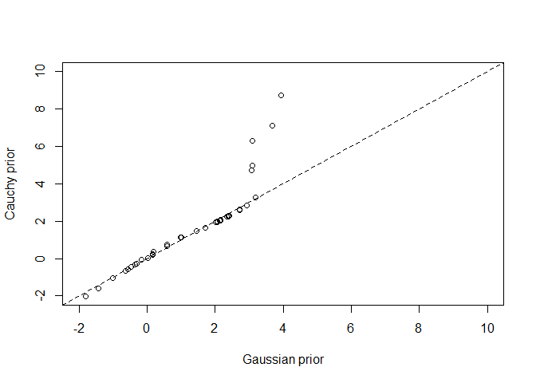

#### 12M3. Re-estimate the basic Reed frog varying intercept model, but now using a Cauchy distribution in place of the Gaussian distribution for the varying intercepts. That is, fit this model:

s i ∼ Binomial(n i, p i)
logit(p i) = α
tank[i]
αtank ∼ Cauchy(α, σ)
α ∼ Normal(0, 1)
σ ∼ HalfCauchy(0, 1)

Compare the posterior means of the intercepts, αtank , to the posterior means produced in the chapter, using the customary Gaussian prior. Can you explain the pattern of diff erences?


```r
## R code 13.1
library(rethinking)
```

```
## Loading required package: rstan
```

```
## Loading required package: StanHeaders
```

```
## Loading required package: ggplot2
```

```
## rstan (Version 2.19.2, GitRev: 2e1f913d3ca3)
```

```
## For execution on a local, multicore CPU with excess RAM we recommend calling
## options(mc.cores = parallel::detectCores()).
## To avoid recompilation of unchanged Stan programs, we recommend calling
## rstan_options(auto_write = TRUE)
```

```
## For improved execution time, we recommend calling
## Sys.setenv(LOCAL_CPPFLAGS = '-march=native')
## although this causes Stan to throw an error on a few processors.
```

```
## Loading required package: parallel
```

```
## Loading required package: dagitty
```

```
## rethinking (Version 1.93)
```

```
## 
## Attaching package: 'rethinking'
```

```
## The following object is masked from 'package:stats':
## 
##     rstudent
```

```r
data(reedfrogs)
d <- reedfrogs
str(d)
```

```
## 'data.frame':	48 obs. of  5 variables:
##  $ density : int  10 10 10 10 10 10 10 10 10 10 ...
##  $ pred    : Factor w/ 2 levels "no","pred": 1 1 1 1 1 1 1 1 2 2 ...
##  $ size    : Factor w/ 2 levels "big","small": 1 1 1 1 2 2 2 2 1 1 ...
##  $ surv    : int  9 10 7 10 9 9 10 9 4 9 ...
##  $ propsurv: num  0.9 1 0.7 1 0.9 0.9 1 0.9 0.4 0.9 ...
```

```r
head(d)
```

```
##   density pred  size surv propsurv
## 1      10   no   big    9      0.9
## 2      10   no   big   10      1.0
## 3      10   no   big    7      0.7
## 4      10   no   big   10      1.0
## 5      10   no small    9      0.9
## 6      10   no small    9      0.9
```


```r
# make the tank cluster variable
d$tank <- 1:nrow(d)
d$has_pred<- ifelse(test = d$pred == "pred", yes = 1, no = 0)
d$is_big<- ifelse(test = d$size == "big", yes = 1, no = 0)
str(d)
```

```
## 'data.frame':	48 obs. of  8 variables:
##  $ density : int  10 10 10 10 10 10 10 10 10 10 ...
##  $ pred    : Factor w/ 2 levels "no","pred": 1 1 1 1 1 1 1 1 2 2 ...
##  $ size    : Factor w/ 2 levels "big","small": 1 1 1 1 2 2 2 2 1 1 ...
##  $ surv    : int  9 10 7 10 9 9 10 9 4 9 ...
##  $ propsurv: num  0.9 1 0.7 1 0.9 0.9 1 0.9 0.4 0.9 ...
##  $ tank    : int  1 2 3 4 5 6 7 8 9 10 ...
##  $ has_pred: num  0 0 0 0 0 0 0 0 1 1 ...
##  $ is_big  : num  1 1 1 1 0 0 0 0 1 1 ...
```

```r
dat <- list(
    S = d$surv,
    N = d$density,
    P = d$has_pred,
    B = d$is_big,
    tank = d$tank )

str(dat)
```

```
## List of 5
##  $ S   : int [1:48] 9 10 7 10 9 9 10 9 4 9 ...
##  $ N   : int [1:48] 10 10 10 10 10 10 10 10 10 10 ...
##  $ P   : num [1:48] 0 0 0 0 0 0 0 0 1 1 ...
##  $ B   : num [1:48] 1 1 1 1 0 0 0 0 1 1 ...
##  $ tank: int [1:48] 1 2 3 4 5 6 7 8 9 10 ...
```


```r
## original model from R code 13.3
m13.2 <- ulam(
    alist(
        S ~ dbinom( N , p ) ,
        logit(p) <- a[tank] ,
        a[tank] ~ dnorm( a_bar , sigma ) ,
        a_bar ~ dnorm( 0 , 1.5 ) ,
        sigma ~ dexp( 1 )
    ), data=dat , chains=4, cores=4, log_lik=TRUE )

precis(m13.2)
```

```
## 48 vector or matrix parameters hidden. Use depth=2 to show them.
```

```
##           mean        sd      5.5%    94.5%    n_eff      Rhat
## a_bar 1.346113 0.2603198 0.9381254 1.768725 2811.423 0.9988106
## sigma 1.626873 0.2194260 1.3183066 2.004100 1117.702 0.9992567
```


```r
## Cauchy distribution model
m12M3 <- ulam(
    alist(
        S ~ dbinom( N , p ) ,
        logit(p) <- a[tank] ,
        a[tank] ~ dcauchy( a_bar , sigma ) ,
        a_bar ~ dnorm( 0 , 1.5 ) ,
        sigma ~ dexp( 1 )
    ), data=dat , chains=4, cores=4, log_lik=TRUE )
```

```
## Warning: There were 115 divergent transitions after warmup. Increasing adapt_delta above 0.95 may help. See
## http://mc-stan.org/misc/warnings.html#divergent-transitions-after-warmup
```

```
## Warning: Examine the pairs() plot to diagnose sampling problems
```

```
## Warning: Bulk Effective Samples Size (ESS) is too low, indicating posterior means and medians may be unreliable.
## Running the chains for more iterations may help. See
## http://mc-stan.org/misc/warnings.html#bulk-ess
```

```
## Warning: Tail Effective Samples Size (ESS) is too low, indicating posterior variances and tail quantiles may be unreliable.
## Running the chains for more iterations may help. See
## http://mc-stan.org/misc/warnings.html#tail-ess
```

```r
precis(m12M3)
```

```
## 48 vector or matrix parameters hidden. Use depth=2 to show them.
```

```
##           mean        sd      5.5%    94.5%    n_eff     Rhat
## a_bar 1.477557 0.2994090 0.9931788 1.948913 1018.961 1.003789
## sigma 1.012283 0.2254066 0.6842597 1.404805 1349.098 1.002284
```


```r
compare(m13.2, m12M3)
```

```
##           WAIC       SE     dWAIC      dSE    pWAIC    weight
## m12M3 200.7603 8.364980 0.0000000       NA 21.95000 0.5898672
## m13.2 201.4871 7.514104 0.7268325 2.694832 21.40558 0.4101328
```

```r
plot(compare(m13.2, m12M3))
```

<!-- -->

```r
plot(coeftab(m13.2, m12M3))
```

<!-- -->


```r
# plot a distributions
s1 <- extract.samples(m13.2)
s2 <- extract.samples(m12M3)

a_tank_normal <- apply(s1$a, 2, mean)
a_tank_cauchy <- apply(s2$a, 2, mean)

plot(a_tank_normal, a_tank_cauchy, xlab="Gaussian prior" , ylab="Cauchy prior", xlim=c(-2,10), ylim=c(-2,10) )
abline(a=0, b=1, lty=2)
```

<!-- -->

#### 12H2. Return to the Trolley data, data(Trolley), from Chapter 12. Define and fit a varying intercepts model for these data. Cluster intercepts on individual participants, as indicated by the unique values in the id variable. Include action, intention, and contact as ordinary terms. Compare the varying intercepts model and a model that ignores individuals, using both WAIC and posterior predictions. What is the impact of individual variation in these data?


```r
data("Trolley")
d <- Trolley
str(d)
```

```
## 'data.frame':	9930 obs. of  12 variables:
##  $ case     : Factor w/ 30 levels "cfaqu","cfbur",..: 1 2 3 4 5 6 7 8 9 10 ...
##  $ response : int  4 3 4 3 3 3 5 4 4 4 ...
##  $ order    : int  2 31 16 32 4 9 29 12 23 22 ...
##  $ id       : Factor w/ 331 levels "96;434","96;445",..: 1 1 1 1 1 1 1 1 1 1 ...
##  $ age      : int  14 14 14 14 14 14 14 14 14 14 ...
##  $ male     : int  0 0 0 0 0 0 0 0 0 0 ...
##  $ edu      : Factor w/ 8 levels "Bachelor's Degree",..: 6 6 6 6 6 6 6 6 6 6 ...
##  $ action   : int  0 0 0 0 0 0 1 1 1 1 ...
##  $ intention: int  0 0 0 1 1 1 0 0 0 0 ...
##  $ contact  : int  1 1 1 1 1 1 0 0 0 0 ...
##  $ story    : Factor w/ 12 levels "aqu","boa","box",..: 1 4 8 3 4 11 1 2 3 4 ...
##  $ action2  : int  1 1 1 1 1 1 1 1 1 1 ...
```

```r
summary(d)
```

```
##       case         response         order            id            age       
##  cfaqu  : 331   Min.   :1.000   Min.   : 1.0   96;434 :  30   Min.   :10.00  
##  cfbur  : 331   1st Qu.:3.000   1st Qu.: 9.0   96;445 :  30   1st Qu.:26.00  
##  cfrub  : 331   Median :4.000   Median :16.5   96;451 :  30   Median :36.00  
##  cibox  : 331   Mean   :4.199   Mean   :16.5   96;456 :  30   Mean   :37.49  
##  cibur  : 331   3rd Qu.:6.000   3rd Qu.:24.0   96;458 :  30   3rd Qu.:48.00  
##  cispe  : 331   Max.   :7.000   Max.   :32.0   96;466 :  30   Max.   :72.00  
##  (Other):7944                                  (Other):9750                  
##       male                         edu           action         intention     
##  Min.   :0.000   Bachelor's Degree   :3540   Min.   :0.0000   Min.   :0.0000  
##  1st Qu.:0.000   Some College        :2460   1st Qu.:0.0000   1st Qu.:0.0000  
##  Median :1.000   Master's Degree     :1410   Median :0.0000   Median :0.0000  
##  Mean   :0.574   Graduate Degree     :1050   Mean   :0.4333   Mean   :0.4667  
##  3rd Qu.:1.000   High School Graduate: 870   3rd Qu.:1.0000   3rd Qu.:1.0000  
##  Max.   :1.000   Some High School    : 420   Max.   :1.0000   Max.   :1.0000  
##                  (Other)             : 180                                    
##     contact        story         action2      
##  Min.   :0.0   box    :1324   Min.   :0.0000  
##  1st Qu.:0.0   bur    :1324   1st Qu.:0.0000  
##  Median :0.0   spe    : 993   Median :1.0000  
##  Mean   :0.2   swi    : 993   Mean   :0.6333  
##  3rd Qu.:0.0   aqu    : 662   3rd Qu.:1.0000  
##  Max.   :1.0   boa    : 662   Max.   :1.0000  
##                (Other):3972
```

```r
head(d)
```

```
##    case response order     id age male           edu action intention contact
## 1 cfaqu        4     2 96;434  14    0 Middle School      0         0       1
## 2 cfbur        3    31 96;434  14    0 Middle School      0         0       1
## 3 cfrub        4    16 96;434  14    0 Middle School      0         0       1
## 4 cibox        3    32 96;434  14    0 Middle School      0         1       1
## 5 cibur        3     4 96;434  14    0 Middle School      0         1       1
## 6 cispe        3     9 96;434  14    0 Middle School      0         1       1
##   story action2
## 1   aqu       1
## 2   bur       1
## 3   rub       1
## 4   box       1
## 5   bur       1
## 6   spe       1
```

```r
d$person_id <- as.integer(d$id)
str(d)
```

```
## 'data.frame':	9930 obs. of  13 variables:
##  $ case     : Factor w/ 30 levels "cfaqu","cfbur",..: 1 2 3 4 5 6 7 8 9 10 ...
##  $ response : int  4 3 4 3 3 3 5 4 4 4 ...
##  $ order    : int  2 31 16 32 4 9 29 12 23 22 ...
##  $ id       : Factor w/ 331 levels "96;434","96;445",..: 1 1 1 1 1 1 1 1 1 1 ...
##  $ age      : int  14 14 14 14 14 14 14 14 14 14 ...
##  $ male     : int  0 0 0 0 0 0 0 0 0 0 ...
##  $ edu      : Factor w/ 8 levels "Bachelor's Degree",..: 6 6 6 6 6 6 6 6 6 6 ...
##  $ action   : int  0 0 0 0 0 0 1 1 1 1 ...
##  $ intention: int  0 0 0 1 1 1 0 0 0 0 ...
##  $ contact  : int  1 1 1 1 1 1 0 0 0 0 ...
##  $ story    : Factor w/ 12 levels "aqu","boa","box",..: 1 4 8 3 4 11 1 2 3 4 ...
##  $ action2  : int  1 1 1 1 1 1 1 1 1 1 ...
##  $ person_id: int  1 1 1 1 1 1 1 1 1 1 ...
```

```r
summary(d)
```

```
##       case         response         order            id            age       
##  cfaqu  : 331   Min.   :1.000   Min.   : 1.0   96;434 :  30   Min.   :10.00  
##  cfbur  : 331   1st Qu.:3.000   1st Qu.: 9.0   96;445 :  30   1st Qu.:26.00  
##  cfrub  : 331   Median :4.000   Median :16.5   96;451 :  30   Median :36.00  
##  cibox  : 331   Mean   :4.199   Mean   :16.5   96;456 :  30   Mean   :37.49  
##  cibur  : 331   3rd Qu.:6.000   3rd Qu.:24.0   96;458 :  30   3rd Qu.:48.00  
##  cispe  : 331   Max.   :7.000   Max.   :32.0   96;466 :  30   Max.   :72.00  
##  (Other):7944                                  (Other):9750                  
##       male                         edu           action         intention     
##  Min.   :0.000   Bachelor's Degree   :3540   Min.   :0.0000   Min.   :0.0000  
##  1st Qu.:0.000   Some College        :2460   1st Qu.:0.0000   1st Qu.:0.0000  
##  Median :1.000   Master's Degree     :1410   Median :0.0000   Median :0.0000  
##  Mean   :0.574   Graduate Degree     :1050   Mean   :0.4333   Mean   :0.4667  
##  3rd Qu.:1.000   High School Graduate: 870   3rd Qu.:1.0000   3rd Qu.:1.0000  
##  Max.   :1.000   Some High School    : 420   Max.   :1.0000   Max.   :1.0000  
##                  (Other)             : 180                                    
##     contact        story         action2         person_id  
##  Min.   :0.0   box    :1324   Min.   :0.0000   Min.   :  1  
##  1st Qu.:0.0   bur    :1324   1st Qu.:0.0000   1st Qu.: 83  
##  Median :0.0   spe    : 993   Median :1.0000   Median :166  
##  Mean   :0.2   swi    : 993   Mean   :0.6333   Mean   :166  
##  3rd Qu.:0.0   aqu    : 662   3rd Qu.:1.0000   3rd Qu.:249  
##  Max.   :1.0   boa    : 662   Max.   :1.0000   Max.   :331  
##                (Other):3972
```

```r
head(d)
```

```
##    case response order     id age male           edu action intention contact
## 1 cfaqu        4     2 96;434  14    0 Middle School      0         0       1
## 2 cfbur        3    31 96;434  14    0 Middle School      0         0       1
## 3 cfrub        4    16 96;434  14    0 Middle School      0         0       1
## 4 cibox        3    32 96;434  14    0 Middle School      0         1       1
## 5 cibur        3     4 96;434  14    0 Middle School      0         1       1
## 6 cispe        3     9 96;434  14    0 Middle School      0         1       1
##   story action2 person_id
## 1   aqu       1         1
## 2   bur       1         1
## 3   rub       1         1
## 4   box       1         1
## 5   bur       1         1
## 6   spe       1         1
```


```r
dat <- list(
    R = d$response,
    A = d$action,
    I = d$intention,
    C = d$contact,
    id = d$person_id)
str(dat)
```

```
## List of 5
##  $ R : int [1:9930] 4 3 4 3 3 3 5 4 4 4 ...
##  $ A : int [1:9930] 0 0 0 0 0 0 1 1 1 1 ...
##  $ I : int [1:9930] 0 0 0 1 1 1 0 0 0 0 ...
##  $ C : int [1:9930] 1 1 1 1 1 1 0 0 0 0 ...
##  $ id: int [1:9930] 1 1 1 1 1 1 1 1 1 1 ...
```


```r
## basic model from R code 12.24
m12H2.base <- ulam(
    alist(
        R ~ dordlogit( phi , cutpoints ),
        phi <- bA*A + bC*C + BI*I ,
        BI <- bI + bIA*A + bIC*C ,
        c(bA,bI,bC,bIA,bIC) ~ dnorm( 0 , 0.5 ),
        cutpoints ~ dnorm( 0 , 1.5 )
    ) , data=dat , chains=4 , cores=4 , log_lik=TRUE)
precis( m12H2.base )
```

```
## 6 vector or matrix parameters hidden. Use depth=2 to show them.
```

```
##           mean         sd       5.5%      94.5%     n_eff     Rhat
## bIC -1.2335105 0.09652232 -1.3895263 -1.0828502  963.4198 1.004872
## bIA -0.4326337 0.08180301 -0.5602768 -0.3040328  823.7419 1.005060
## bC  -0.3443410 0.06910581 -0.4531292 -0.2336762 1050.2353 1.003950
## bI  -0.2923390 0.05994781 -0.3830550 -0.1946340  789.2760 1.003768
## bA  -0.4724997 0.05599591 -0.5612890 -0.3832174  828.5175 1.003755
```


```r
## fixed effect model
m12H2.fixed <- ulam(
    alist(
        R ~ dordlogit( phi , cutpoints ),
        phi <- a_person[id] + bA*A + bC*C + BI*I ,
        BI <- bI + bIA*A + bIC*C ,
        c(bA,bI,bC,bIA,bIC) ~ dnorm( 0 , 0.5 ),
        cutpoints ~ dnorm( 0 , 1.5 ),
        a_person[id] ~ dnorm(0, 1.5)
    ) , data=dat , chains=4 , cores=4 , log_lik=TRUE)
```

```
## Warning: Bulk Effective Samples Size (ESS) is too low, indicating posterior means and medians may be unreliable.
## Running the chains for more iterations may help. See
## http://mc-stan.org/misc/warnings.html#bulk-ess
```

```
## Warning: Tail Effective Samples Size (ESS) is too low, indicating posterior variances and tail quantiles may be unreliable.
## Running the chains for more iterations may help. See
## http://mc-stan.org/misc/warnings.html#tail-ess
```

```r
precis( m12H2.fixed )
```

```
## 337 vector or matrix parameters hidden. Use depth=2 to show them.
```

```
##           mean         sd       5.5%      94.5%     n_eff     Rhat
## bIC -1.6402868 0.10279824 -1.8081914 -1.4737752  964.5779 1.009221
## bIA -0.5494814 0.08041118 -0.6777949 -0.4165125 1076.8916 1.002517
## bC  -0.4500882 0.07173765 -0.5658922 -0.3340103 1145.1050 1.005433
## bI  -0.3812024 0.05817665 -0.4715158 -0.2879047  905.6420 1.006374
## bA  -0.6402986 0.05484419 -0.7294069 -0.5543625 1077.8263 1.002836
```


```r
# multilevel model
m12H2.multilevel <- ulam(
    alist(
        R ~ dordlogit( phi , cutpoints ),
        phi <- a_person[id] + bA*A + bC*C + BI*I ,
        BI <- bI + bIA*A + bIC*C ,
        c(bA,bI,bC,bIA,bIC) ~ dnorm( 0 , 0.5 ),
        cutpoints ~ dnorm( 0 , 1.5 ),
        a_person[id] ~ dnorm(a_bar, sigma),
        a_bar ~ dnorm( 0 , 1.5 ) ,
        sigma ~ dexp( 1 )
    ) , data=dat , chains=4 , cores=4 , log_lik=TRUE)
```

```
## Warning: The largest R-hat is 1.72, indicating chains have not mixed.
## Running the chains for more iterations may help. See
## http://mc-stan.org/misc/warnings.html#r-hat
```

```
## Warning: Bulk Effective Samples Size (ESS) is too low, indicating posterior means and medians may be unreliable.
## Running the chains for more iterations may help. See
## http://mc-stan.org/misc/warnings.html#bulk-ess
```

```
## Warning: Tail Effective Samples Size (ESS) is too low, indicating posterior variances and tail quantiles may be unreliable.
## Running the chains for more iterations may help. See
## http://mc-stan.org/misc/warnings.html#tail-ess
```

```r
precis( m12H2.multilevel )
```

```
## 337 vector or matrix parameters hidden. Use depth=2 to show them.
```

```
##             mean         sd       5.5%      94.5%      n_eff      Rhat
## bIC   -1.6548693 0.09845823 -1.8153573 -1.4964838  813.82751 1.0111151
## bIA   -0.5485741 0.08228861 -0.6803797 -0.4163341  691.30831 1.0121941
## bC    -0.4640042 0.07100269 -0.5754357 -0.3496917  861.96677 1.0099889
## bI    -0.3951260 0.05822957 -0.4880521 -0.3030743  539.66943 1.0169659
## bA    -0.6564659 0.05612724 -0.7476462 -0.5701303  685.75482 1.0135439
## a_bar  1.1761055 0.61027230  0.1740733  2.2561998    4.00767 1.7084531
## sigma  1.9171961 0.08325706  1.7952853  2.0567597 1757.78225 0.9995168
```


```r
compare(m12H2.base, m12H2.fixed, m12H2.multilevel)
```

```
##                      WAIC        SE      dWAIC        dSE     pWAIC
## m12H2.multilevel 31059.49 179.44453    0.00000         NA 357.72663
## m12H2.fixed      31074.69 173.67081   15.20137   7.047419 344.21633
## m12H2.base       36929.64  80.65054 5870.14678 173.582984  11.15274
##                        weight
## m12H2.multilevel 0.9995001425
## m12H2.fixed      0.0004998575
## m12H2.base       0.0000000000
```

```r
plot(compare(m12H2.base, m12H2.fixed, m12H2.multilevel))
```

<!-- -->

```r
plot(coeftab(m12H2.base, m12H2.fixed, m12H2.multilevel))
```

<!-- -->
