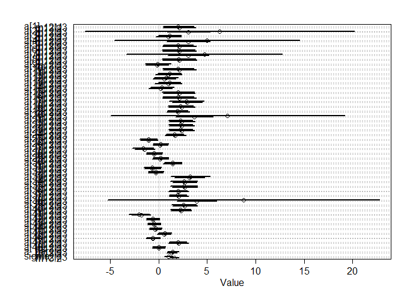

#### 12M3. Re-estimate the basic Reed frog varying intercept model, but now using a Cauchy distribution in place of the Gaussian distribution for the varying intercepts. That is, fit this model:

s i ∼ Binomial(n i, p i)
logit(p i) = α
tank[i]
αtank ∼ Cauchy(α, σ)
α ∼ Normal(0, 1)
σ ∼ HalfCauchy(0, 1)

Compare the posterior means of the intercepts, αtank , to the posterior means produced in the chapter, using the customary Gaussian prior. Can you explain the pattern of diff erences?


```r
## R code 13.1
library(rethinking)
```

```
## Loading required package: rstan
```

```
## Loading required package: StanHeaders
```

```
## Loading required package: ggplot2
```

```
## rstan (Version 2.19.2, GitRev: 2e1f913d3ca3)
```

```
## For execution on a local, multicore CPU with excess RAM we recommend calling
## options(mc.cores = parallel::detectCores()).
## To avoid recompilation of unchanged Stan programs, we recommend calling
## rstan_options(auto_write = TRUE)
```

```
## For improved execution time, we recommend calling
## Sys.setenv(LOCAL_CPPFLAGS = '-march=native')
## although this causes Stan to throw an error on a few processors.
```

```
## Loading required package: parallel
```

```
## Loading required package: dagitty
```

```
## rethinking (Version 1.93)
```

```
## 
## Attaching package: 'rethinking'
```

```
## The following object is masked from 'package:stats':
## 
##     rstudent
```

```r
data(reedfrogs)
d <- reedfrogs
str(d)
```

```
## 'data.frame':	48 obs. of  5 variables:
##  $ density : int  10 10 10 10 10 10 10 10 10 10 ...
##  $ pred    : Factor w/ 2 levels "no","pred": 1 1 1 1 1 1 1 1 2 2 ...
##  $ size    : Factor w/ 2 levels "big","small": 1 1 1 1 2 2 2 2 1 1 ...
##  $ surv    : int  9 10 7 10 9 9 10 9 4 9 ...
##  $ propsurv: num  0.9 1 0.7 1 0.9 0.9 1 0.9 0.4 0.9 ...
```

```r
head(d)
```

```
##   density pred  size surv propsurv
## 1      10   no   big    9      0.9
## 2      10   no   big   10      1.0
## 3      10   no   big    7      0.7
## 4      10   no   big   10      1.0
## 5      10   no small    9      0.9
## 6      10   no small    9      0.9
```


```r
# make the tank cluster variable
d$tank <- 1:nrow(d)
d$has_pred<- ifelse(test = d$pred == "pred", yes = 1, no = 0)
d$is_big<- ifelse(test = d$size == "big", yes = 1, no = 0)
str(d)
```

```
## 'data.frame':	48 obs. of  8 variables:
##  $ density : int  10 10 10 10 10 10 10 10 10 10 ...
##  $ pred    : Factor w/ 2 levels "no","pred": 1 1 1 1 1 1 1 1 2 2 ...
##  $ size    : Factor w/ 2 levels "big","small": 1 1 1 1 2 2 2 2 1 1 ...
##  $ surv    : int  9 10 7 10 9 9 10 9 4 9 ...
##  $ propsurv: num  0.9 1 0.7 1 0.9 0.9 1 0.9 0.4 0.9 ...
##  $ tank    : int  1 2 3 4 5 6 7 8 9 10 ...
##  $ has_pred: num  0 0 0 0 0 0 0 0 1 1 ...
##  $ is_big  : num  1 1 1 1 0 0 0 0 1 1 ...
```

```r
dat <- list(
    S = d$surv,
    N = d$density,
    P = d$has_pred,
    B = d$is_big,
    tank = d$tank )

str(dat)
```

```
## List of 5
##  $ S   : int [1:48] 9 10 7 10 9 9 10 9 4 9 ...
##  $ N   : int [1:48] 10 10 10 10 10 10 10 10 10 10 ...
##  $ P   : num [1:48] 0 0 0 0 0 0 0 0 1 1 ...
##  $ B   : num [1:48] 1 1 1 1 0 0 0 0 1 1 ...
##  $ tank: int [1:48] 1 2 3 4 5 6 7 8 9 10 ...
```


```r
## original model from R code 13.3
m13.2 <- ulam(
    alist(
        S ~ dbinom( N , p ) ,
        logit(p) <- a[tank] ,
        a[tank] ~ dnorm( a_bar , sigma ) ,
        a_bar ~ dnorm( 0 , 1.5 ) ,
        sigma ~ dexp( 1 )
    ), data=dat , chains=4, cores=4, log_lik=TRUE )

precis(m13.2)
```

```
## 48 vector or matrix parameters hidden. Use depth=2 to show them.
```

```
##           mean        sd      5.5%    94.5%    n_eff      Rhat
## a_bar 1.343887 0.2581596 0.9472359 1.771687 2744.476 0.9988461
## sigma 1.623442 0.2194907 1.3094716 2.004966 1605.963 1.0010792
```


```r
## Cauchy distribution model
m12M3 <- ulam(
    alist(
        S ~ dbinom( N , p ) ,
        logit(p) <- a[tank] ,
        a[tank] ~ dcauchy( a_bar , sigma ) ,
        a_bar ~ dnorm( 0 , 1.5 ) ,
        sigma ~ dexp( 1 )
    ), data=dat , chains=4, cores=4, log_lik=TRUE )
```

```
## Warning: There were 89 divergent transitions after warmup. Increasing adapt_delta above 0.95 may help. See
## http://mc-stan.org/misc/warnings.html#divergent-transitions-after-warmup
```

```
## Warning: Examine the pairs() plot to diagnose sampling problems
```

```
## Warning: Tail Effective Samples Size (ESS) is too low, indicating posterior variances and tail quantiles may be unreliable.
## Running the chains for more iterations may help. See
## http://mc-stan.org/misc/warnings.html#tail-ess
```

```r
precis(m12M3)
```

```
## 48 vector or matrix parameters hidden. Use depth=2 to show them.
```

```
##           mean        sd      5.5%    94.5%     n_eff     Rhat
## a_bar 1.497982 0.2909813 1.0202114 1.947230  923.0334 1.002131
## sigma 1.013065 0.2327159 0.6748818 1.413679 1149.7085 1.001648
```


```r
compare(m13.2, m12M3)
```

```
##           WAIC       SE    dWAIC      dSE    pWAIC    weight
## m13.2 199.9846 7.286647 0.000000       NA 20.89179 0.8135596
## m12M3 202.9312 8.430558 2.946615 2.561138 22.83935 0.1864404
```

```r
plot(compare(m13.2, m12M3))
```

<!-- -->

```r
plot(coeftab(m13.2, m12M3))
```

<!-- -->


```r
# plot a distributions
s1 <- extract.samples(m13.2)
s2 <- extract.samples(m12M3)

a_tank_normal <- apply(s1$a, 2, mean)
a_tank_cauchy <- apply(s2$a, 2, mean)

plot(a_tank_normal, a_tank_cauchy, xlab="Gaussian prior" , ylab="Cauchy prior", xlim=c(-2,10), ylim=c(-2,10) )
abline(a=0, b=1, lty=2)
```

<!-- -->

#### 12H2. Return to the Trolley data, data(Trolley), from Chapter 12. Define and fit a varying intercepts model for these data. Cluster intercepts on individual participants, as indicated by the unique values in the id variable. Include action, intention, and contact as ordinary terms. Compare the varying intercepts model and a model that ignores individuals, using both WAIC and posterior predictions. What is the impact of individual variation in these data?


```r
data("Trolley")
d <- Trolley
str(d)
```

```
## 'data.frame':	9930 obs. of  12 variables:
##  $ case     : Factor w/ 30 levels "cfaqu","cfbur",..: 1 2 3 4 5 6 7 8 9 10 ...
##  $ response : int  4 3 4 3 3 3 5 4 4 4 ...
##  $ order    : int  2 31 16 32 4 9 29 12 23 22 ...
##  $ id       : Factor w/ 331 levels "96;434","96;445",..: 1 1 1 1 1 1 1 1 1 1 ...
##  $ age      : int  14 14 14 14 14 14 14 14 14 14 ...
##  $ male     : int  0 0 0 0 0 0 0 0 0 0 ...
##  $ edu      : Factor w/ 8 levels "Bachelor's Degree",..: 6 6 6 6 6 6 6 6 6 6 ...
##  $ action   : int  0 0 0 0 0 0 1 1 1 1 ...
##  $ intention: int  0 0 0 1 1 1 0 0 0 0 ...
##  $ contact  : int  1 1 1 1 1 1 0 0 0 0 ...
##  $ story    : Factor w/ 12 levels "aqu","boa","box",..: 1 4 8 3 4 11 1 2 3 4 ...
##  $ action2  : int  1 1 1 1 1 1 1 1 1 1 ...
```

```r
summary(d)
```

```
##       case         response         order            id            age       
##  cfaqu  : 331   Min.   :1.000   Min.   : 1.0   96;434 :  30   Min.   :10.00  
##  cfbur  : 331   1st Qu.:3.000   1st Qu.: 9.0   96;445 :  30   1st Qu.:26.00  
##  cfrub  : 331   Median :4.000   Median :16.5   96;451 :  30   Median :36.00  
##  cibox  : 331   Mean   :4.199   Mean   :16.5   96;456 :  30   Mean   :37.49  
##  cibur  : 331   3rd Qu.:6.000   3rd Qu.:24.0   96;458 :  30   3rd Qu.:48.00  
##  cispe  : 331   Max.   :7.000   Max.   :32.0   96;466 :  30   Max.   :72.00  
##  (Other):7944                                  (Other):9750                  
##       male                         edu           action         intention     
##  Min.   :0.000   Bachelor's Degree   :3540   Min.   :0.0000   Min.   :0.0000  
##  1st Qu.:0.000   Some College        :2460   1st Qu.:0.0000   1st Qu.:0.0000  
##  Median :1.000   Master's Degree     :1410   Median :0.0000   Median :0.0000  
##  Mean   :0.574   Graduate Degree     :1050   Mean   :0.4333   Mean   :0.4667  
##  3rd Qu.:1.000   High School Graduate: 870   3rd Qu.:1.0000   3rd Qu.:1.0000  
##  Max.   :1.000   Some High School    : 420   Max.   :1.0000   Max.   :1.0000  
##                  (Other)             : 180                                    
##     contact        story         action2      
##  Min.   :0.0   box    :1324   Min.   :0.0000  
##  1st Qu.:0.0   bur    :1324   1st Qu.:0.0000  
##  Median :0.0   spe    : 993   Median :1.0000  
##  Mean   :0.2   swi    : 993   Mean   :0.6333  
##  3rd Qu.:0.0   aqu    : 662   3rd Qu.:1.0000  
##  Max.   :1.0   boa    : 662   Max.   :1.0000  
##                (Other):3972
```

```r
head(d)
```

```
##    case response order     id age male           edu action intention contact
## 1 cfaqu        4     2 96;434  14    0 Middle School      0         0       1
## 2 cfbur        3    31 96;434  14    0 Middle School      0         0       1
## 3 cfrub        4    16 96;434  14    0 Middle School      0         0       1
## 4 cibox        3    32 96;434  14    0 Middle School      0         1       1
## 5 cibur        3     4 96;434  14    0 Middle School      0         1       1
## 6 cispe        3     9 96;434  14    0 Middle School      0         1       1
##   story action2
## 1   aqu       1
## 2   bur       1
## 3   rub       1
## 4   box       1
## 5   bur       1
## 6   spe       1
```

```r
d$person_id <- as.integer(d$id)
str(d)
```

```
## 'data.frame':	9930 obs. of  13 variables:
##  $ case     : Factor w/ 30 levels "cfaqu","cfbur",..: 1 2 3 4 5 6 7 8 9 10 ...
##  $ response : int  4 3 4 3 3 3 5 4 4 4 ...
##  $ order    : int  2 31 16 32 4 9 29 12 23 22 ...
##  $ id       : Factor w/ 331 levels "96;434","96;445",..: 1 1 1 1 1 1 1 1 1 1 ...
##  $ age      : int  14 14 14 14 14 14 14 14 14 14 ...
##  $ male     : int  0 0 0 0 0 0 0 0 0 0 ...
##  $ edu      : Factor w/ 8 levels "Bachelor's Degree",..: 6 6 6 6 6 6 6 6 6 6 ...
##  $ action   : int  0 0 0 0 0 0 1 1 1 1 ...
##  $ intention: int  0 0 0 1 1 1 0 0 0 0 ...
##  $ contact  : int  1 1 1 1 1 1 0 0 0 0 ...
##  $ story    : Factor w/ 12 levels "aqu","boa","box",..: 1 4 8 3 4 11 1 2 3 4 ...
##  $ action2  : int  1 1 1 1 1 1 1 1 1 1 ...
##  $ person_id: int  1 1 1 1 1 1 1 1 1 1 ...
```

```r
summary(d)
```

```
##       case         response         order            id            age       
##  cfaqu  : 331   Min.   :1.000   Min.   : 1.0   96;434 :  30   Min.   :10.00  
##  cfbur  : 331   1st Qu.:3.000   1st Qu.: 9.0   96;445 :  30   1st Qu.:26.00  
##  cfrub  : 331   Median :4.000   Median :16.5   96;451 :  30   Median :36.00  
##  cibox  : 331   Mean   :4.199   Mean   :16.5   96;456 :  30   Mean   :37.49  
##  cibur  : 331   3rd Qu.:6.000   3rd Qu.:24.0   96;458 :  30   3rd Qu.:48.00  
##  cispe  : 331   Max.   :7.000   Max.   :32.0   96;466 :  30   Max.   :72.00  
##  (Other):7944                                  (Other):9750                  
##       male                         edu           action         intention     
##  Min.   :0.000   Bachelor's Degree   :3540   Min.   :0.0000   Min.   :0.0000  
##  1st Qu.:0.000   Some College        :2460   1st Qu.:0.0000   1st Qu.:0.0000  
##  Median :1.000   Master's Degree     :1410   Median :0.0000   Median :0.0000  
##  Mean   :0.574   Graduate Degree     :1050   Mean   :0.4333   Mean   :0.4667  
##  3rd Qu.:1.000   High School Graduate: 870   3rd Qu.:1.0000   3rd Qu.:1.0000  
##  Max.   :1.000   Some High School    : 420   Max.   :1.0000   Max.   :1.0000  
##                  (Other)             : 180                                    
##     contact        story         action2         person_id  
##  Min.   :0.0   box    :1324   Min.   :0.0000   Min.   :  1  
##  1st Qu.:0.0   bur    :1324   1st Qu.:0.0000   1st Qu.: 83  
##  Median :0.0   spe    : 993   Median :1.0000   Median :166  
##  Mean   :0.2   swi    : 993   Mean   :0.6333   Mean   :166  
##  3rd Qu.:0.0   aqu    : 662   3rd Qu.:1.0000   3rd Qu.:249  
##  Max.   :1.0   boa    : 662   Max.   :1.0000   Max.   :331  
##                (Other):3972
```

```r
head(d)
```

```
##    case response order     id age male           edu action intention contact
## 1 cfaqu        4     2 96;434  14    0 Middle School      0         0       1
## 2 cfbur        3    31 96;434  14    0 Middle School      0         0       1
## 3 cfrub        4    16 96;434  14    0 Middle School      0         0       1
## 4 cibox        3    32 96;434  14    0 Middle School      0         1       1
## 5 cibur        3     4 96;434  14    0 Middle School      0         1       1
## 6 cispe        3     9 96;434  14    0 Middle School      0         1       1
##   story action2 person_id
## 1   aqu       1         1
## 2   bur       1         1
## 3   rub       1         1
## 4   box       1         1
## 5   bur       1         1
## 6   spe       1         1
```


```r
dat <- list(
    R = d$response,
    A = d$action,
    I = d$intention,
    C = d$contact,
    id = d$person_id)
str(dat)
```

```
## List of 5
##  $ R : int [1:9930] 4 3 4 3 3 3 5 4 4 4 ...
##  $ A : int [1:9930] 0 0 0 0 0 0 1 1 1 1 ...
##  $ I : int [1:9930] 0 0 0 1 1 1 0 0 0 0 ...
##  $ C : int [1:9930] 1 1 1 1 1 1 0 0 0 0 ...
##  $ id: int [1:9930] 1 1 1 1 1 1 1 1 1 1 ...
```


```r
## basic model from R code 12.24
m12H2.base <- ulam(
    alist(
        R ~ dordlogit( phi , cutpoints ),
        phi <- bA*A + bC*C + BI*I ,
        BI <- bI + bIA*A + bIC*C ,
        c(bA,bI,bC,bIA,bIC) ~ dnorm( 0 , 0.5 ),
        cutpoints ~ dnorm( 0 , 1.5 )
    ) , data=dat , chains=4 , cores=4 , log_lik=TRUE)
precis( m12H2.base , depth=2)
```

```
##                    mean         sd       5.5%      94.5%     n_eff     Rhat
## bIC          -1.2361924 0.09494108 -1.3871490 -1.0834505 1197.5987 1.001885
## bIA          -0.4331131 0.08058406 -0.5608253 -0.3037098  946.3002 1.003351
## bC           -0.3426804 0.06652138 -0.4526350 -0.2345905 1103.5757 1.002345
## bI           -0.2918183 0.05793247 -0.3843546 -0.2028176  890.5827 1.004736
## bA           -0.4728825 0.05415708 -0.5610194 -0.3870962  908.3854 1.004596
## cutpoints[1] -2.6329350 0.05101631 -2.7169560 -2.5509010  888.0214 1.001967
## cutpoints[2] -1.9373970 0.04761049 -2.0157943 -1.8632753  967.2282 1.004195
## cutpoints[3] -1.3433201 0.04538627 -1.4174667 -1.2722177  917.5884 1.004226
## cutpoints[4] -0.3084075 0.04414795 -0.3790057 -0.2388894  893.6722 1.004629
## cutpoints[5]  0.3619565 0.04368741  0.2913108  0.4308050  921.4505 1.003937
## cutpoints[6]  1.2678417 0.04704285  1.1908800  1.3411293 1032.5405 1.002303
```


```r
## fixed effect model
m12H2.fixed <- ulam(
    alist(
        R ~ dordlogit( phi , cutpoints ),
        phi <- a_person[id] + bA*A + bC*C + BI*I ,
        BI <- bI + bIA*A + bIC*C ,
        c(bA,bI,bC,bIA,bIC) ~ dnorm( 0 , 0.5 ),
        cutpoints ~ dnorm( 0 , 1.5 ),
        a_person[id] ~ dnorm(0, 1.5)
    ) , data=dat , chains=4 , cores=4 , log_lik=TRUE)
```

```
## Warning: Bulk Effective Samples Size (ESS) is too low, indicating posterior means and medians may be unreliable.
## Running the chains for more iterations may help. See
## http://mc-stan.org/misc/warnings.html#bulk-ess
```

```
## Warning: Tail Effective Samples Size (ESS) is too low, indicating posterior variances and tail quantiles may be unreliable.
## Running the chains for more iterations may help. See
## http://mc-stan.org/misc/warnings.html#tail-ess
```

```r
precis( m12H2.fixed , depth=2)
```

```
##                      mean         sd         5.5%       94.5%     n_eff
## bIC           -1.63979511 0.09947148 -1.800519699 -1.48057377 1212.5385
## bIA           -0.54866287 0.08347994 -0.679418885 -0.41567506  987.5218
## bC            -0.44839938 0.07203852 -0.567546744 -0.33130430 1161.3586
## bI            -0.38008484 0.06035024 -0.474805343 -0.28250672  970.8289
## bA            -0.64053313 0.05688288 -0.731558437 -0.55149662 1112.1215
## cutpoints[1]  -3.66258525 0.09697358 -3.815394393 -3.50517215  195.6382
## cutpoints[2]  -2.72559552 0.09317803 -2.872727279 -2.57419760  184.8901
## cutpoints[3]  -1.93126031 0.09175437 -2.075459305 -1.78235569  179.8843
## cutpoints[4]  -0.45316427 0.09133491 -0.600094355 -0.30612393  167.8459
## cutpoints[5]   0.58055111 0.09189047  0.432804984  0.72858418  171.8285
## cutpoints[6]   1.96486669 0.09595198  1.812519446  2.11803178  180.7931
## a_person[1]   -0.55128042 0.28029611 -1.003943060 -0.11732938 1489.6064
## a_person[2]   -1.69339313 0.40858812 -2.340638939 -1.03852823 2089.5848
## a_person[3]   -2.83942985 0.37527179 -3.475733253 -2.24310536 2383.0542
## a_person[4]   -0.34177518 0.46337156 -1.073013279  0.39127425 1841.3988
## a_person[5]   -3.33187672 0.40851624 -4.012763122 -2.69146754 2326.6325
## a_person[6]    0.60645039 0.30160996  0.141715749  1.08954044 1582.8731
## a_person[7]   -0.42677724 0.32594837 -0.934452164  0.12101068 1747.7950
## a_person[8]    3.70349423 0.43856036  2.999710274  4.43705050 2243.9166
## a_person[9]   -0.84230415 0.30852874 -1.318247641 -0.33976583 1994.2097
## a_person[10]   0.75038154 0.29847834  0.279136053  1.22622916 1331.9009
## a_person[11]   0.56302897 0.31096735  0.062619824  1.05973811 1893.2111
## a_person[12]   2.31938295 0.37177125  1.737948280  2.92386881 2192.4625
## a_person[13]  -0.42349815 0.28703504 -0.872647036  0.03482409 1481.6651
## a_person[14]  -0.98524604 0.30596893 -1.485196912 -0.48039883 1701.8485
## a_person[15]   1.57341181 0.32811445  1.065791744  2.10480442 1460.3705
## a_person[16]  -1.77336986 0.41998844 -2.430279878 -1.09978442 2445.3908
## a_person[17]   1.54189363 0.44741244  0.827293890  2.26294962 1993.8371
## a_person[18]  -1.14245768 0.36317287 -1.743465590 -0.57988950 2007.5755
## a_person[19]  -1.27904707 0.31408016 -1.785704169 -0.78475518 1922.0955
## a_person[20]  -0.50142128 0.28655042 -0.935577184 -0.02840099 1738.1745
## a_person[21]  -2.08046554 0.32235879 -2.602565196 -1.55433778 1314.5514
## a_person[22]  -0.01579317 0.36542594 -0.594672428  0.55354225 1570.6223
## a_person[23]  -4.89804285 0.51062148 -5.742382607 -4.12821672 2076.9236
## a_person[24]  -1.61938094 0.30344053 -2.099214515 -1.13856582 1908.9296
## a_person[25]  -0.65732469 0.32297039 -1.170902568 -0.15682784 2123.0262
## a_person[26]   0.89384691 0.32591684  0.360557852  1.40129648 2004.2958
## a_person[27]   1.04335874 0.43426757  0.337442709  1.74702094 2225.9422
## a_person[28]  -0.77817025 0.32282510 -1.310659128 -0.26156141 1518.9194
## a_person[29]   1.14014150 0.30946550  0.625416834  1.62941034 1293.1905
## a_person[30]   1.60863559 0.31066734  1.117718577  2.11496965 2074.1895
## a_person[31]   3.64235762 0.40936242  2.989799512  4.32134820 2174.3913
## a_person[32]  -0.72570193 0.30542669 -1.217941362 -0.23198078 2004.6664
## a_person[33]  -0.19823688 0.31006705 -0.684362637  0.30324689 1405.2396
## a_person[34]  -1.85304155 0.32198381 -2.384530086 -1.35449633 2265.6395
## a_person[35]   1.35132227 0.31702535  0.851016501  1.86511166 1914.9929
## a_person[36]   1.56264480 0.30346534  1.079974111  2.03912255 1881.8627
## a_person[37]   1.07837640 0.42451241  0.391210645  1.75432414 2317.8016
## a_person[38]   0.63208028 0.29498915  0.155608071  1.09512478 1756.2719
## a_person[39]   1.15313705 0.34121441  0.598056740  1.70803900 1797.9932
## a_person[40]   1.17507956 0.37189195  0.570209132  1.74852133 1554.9214
## a_person[41]  -0.78246214 0.29559500 -1.254498666 -0.31145935 1334.3995
## a_person[42]   1.65672859 0.29663217  1.192745369  2.12818067 1471.9644
## a_person[43]   1.69158246 0.30636736  1.201789316  2.18097615 1377.2892
## a_person[44]   0.17629890 0.31991610 -0.334611784  0.69280982 1296.5192
## a_person[45]   0.72196279 0.31256461  0.233613022  1.23029995 1766.9511
## a_person[46]   1.89048709 0.34022017  1.344627666  2.42099612 1972.6171
## a_person[47]   1.96471963 0.29119884  1.503867110  2.42402096 1034.6183
## a_person[48]   2.32505994 0.31401477  1.816375726  2.84022816 1327.9247
## a_person[49]  -1.92578971 0.28706762 -2.391770658 -1.47179701 1356.3929
## a_person[50]   1.16082119 0.31197834  0.628754183  1.65412464 1974.1763
## a_person[51]  -0.39040820 0.35455464 -0.965494088  0.15662702 2447.1526
## a_person[52]   0.62141389 0.29164779  0.149363555  1.09070834 1757.9034
## a_person[53]  -2.37256625 0.42393895 -3.040543022 -1.70618560 1854.3691
## a_person[54]  -0.44270365 0.34126500 -0.982168837  0.10529108 2078.7014
## a_person[55]   1.93327241 0.29370964  1.479883173  2.40206514 1588.9257
## a_person[56]   3.71316924 0.41251105  3.083530287  4.37687763 1469.1906
## a_person[57]  -0.14581902 0.35963610 -0.727000934  0.40377401 2156.8526
## a_person[58]  -1.42657545 0.30070150 -1.903737681 -0.94394587 1712.7007
## a_person[59]  -2.37353621 0.40286269 -3.019243834 -1.75366079 2218.4329
## a_person[60]  -1.12685932 0.31309585 -1.626527850 -0.63611950 1972.9201
## a_person[61]  -1.17400229 0.29646852 -1.636251107 -0.71794343 1757.2309
## a_person[62]   0.30532009 0.28972359 -0.153535807  0.76873856 1789.0480
## a_person[63]  -1.54072580 0.28455302 -2.003488235 -1.07819005 1289.3108
## a_person[64]  -0.29437774 0.30719813 -0.790612480  0.19047815 1304.3129
## a_person[65]  -0.78195043 0.43749432 -1.462508185 -0.07269713 1698.6030
## a_person[66]   4.40875175 0.49950435  3.645399711  5.27733544 1938.6076
## a_person[67]   0.15683530 0.31382835 -0.354368520  0.66566480 1617.7050
## a_person[68]   2.19291317 0.35312024  1.636219191  2.76562976 1924.5782
## a_person[69]   3.15586274 0.38534329  2.558848909  3.78990583 1799.5662
## a_person[70]  -0.90298529 0.28207021 -1.341982129 -0.46001037 1958.9848
## a_person[71]   0.43945374 0.28356229 -0.009604235  0.89360325 1689.0853
## a_person[72]   1.04730703 0.45739210  0.340303584  1.80986106 2097.0316
## a_person[73]   1.88131625 0.29582764  1.390028644  2.34535040 1730.1553
## a_person[74]   0.96674513 0.30949236  0.474069357  1.46752553 1064.6490
## a_person[75]   0.69334220 0.31976277  0.186685229  1.20326087 1990.1869
## a_person[76]   3.43735160 0.36805190  2.870303120  4.06702306 1916.6073
## a_person[77]   0.04132043 0.32044669 -0.484201311  0.53795269 1244.9661
## a_person[78]   0.19797870 0.31940086 -0.319915322  0.70012610 1839.1183
## a_person[79]   0.96340838 0.39409795  0.338988987  1.60048080 1894.5061
## a_person[80]   0.40440306 0.35308676 -0.142229715  0.98545146 1518.6125
## a_person[81]  -1.48345609 0.46132471 -2.201240068 -0.75675561 2383.7110
## a_person[82]   1.05054431 0.33840780  0.512600574  1.59369328 2268.2638
## a_person[83]  -3.83379010 0.41506757 -4.499755326 -3.17919863 2315.5005
## a_person[84]   1.00818617 0.32582855  0.486798104  1.52283858 2400.9016
## a_person[85]   1.26284705 0.39416371  0.615299640  1.88485469 2507.6903
## a_person[86]  -1.27924644 0.32609047 -1.803622140 -0.77326107 2238.4989
## a_person[87]   2.60468382 0.41087126  1.941000531  3.25187253 2087.2372
## a_person[88]  -0.19086098 0.30543093 -0.679676925  0.30234968 1409.9868
## a_person[89]  -1.10199640 0.30586935 -1.584739254 -0.61598048 2216.6096
## a_person[90]  -0.06806144 0.33409198 -0.592910006  0.45506531 1450.9699
## a_person[91]   0.70473601 0.34228970  0.160131354  1.24509463 1643.5550
## a_person[92]   0.28498418 0.31150189 -0.206212452  0.78213532 2006.0151
## a_person[93]   4.79234433 0.52948054  3.990132455  5.67044659 2345.8815
## a_person[94]   0.73128581 0.29554496  0.267879833  1.20437452 1529.1184
## a_person[95]   2.00797201 0.47114916  1.283210411  2.74537071 2042.3622
## a_person[96]   1.31402043 0.30636240  0.836169288  1.82053941 1444.9091
## a_person[97]   1.12926549 0.36620815  0.520170345  1.71207834 1799.2758
## a_person[98]  -1.19539296 0.35204737 -1.755376291 -0.64164619 1642.4323
## a_person[99]   0.56877117 0.29581590  0.107369107  1.05134611 1244.3233
## a_person[100] -0.43926044 0.28436559 -0.882923322  0.01309928 1768.8010
## a_person[101] -1.78252396 0.30257210 -2.272736423 -1.29749733 1852.2644
## a_person[102]  5.23221340 0.60579476  4.308971968  6.23129796 2132.9729
## a_person[103] -1.02905858 0.30759899 -1.520796374 -0.54402011 2238.0253
## a_person[104] -1.97895632 0.34145364 -2.521175021 -1.44721363 2059.5366
## a_person[105] -1.59689948 0.33067429 -2.116454048 -1.05118209 1517.2999
## a_person[106]  0.13703811 0.31378571 -0.368861181  0.63245876 1541.8057
## a_person[107] -0.77950028 0.35714296 -1.365152454 -0.20832094 1574.0133
## a_person[108] -0.08402294 0.32087347 -0.595371003  0.41909916 2014.5553
## a_person[109] -0.24805244 0.31255635 -0.735127876  0.24932027 2689.8355
## a_person[110] -0.19031643 0.32257685 -0.728160777  0.31970358 1344.5965
## a_person[111] -0.98397428 0.36508672 -1.576980591 -0.40627960 2030.5832
## a_person[112] -3.89915178 0.44843914 -4.659852526 -3.22061204 2082.3096
## a_person[113]  1.75640857 0.31156684  1.266945546  2.23868373 1937.1576
## a_person[114]  0.51585549 0.29183436  0.057482827  0.98119492 1554.5622
## a_person[115] -1.48625519 0.34947122 -2.052138881 -0.93215850 1620.9029
## a_person[116]  0.85300647 0.32331083  0.336543628  1.37316008 1784.8821
## a_person[117]  0.58519315 0.32849717  0.056294017  1.08603617 1503.0696
## a_person[118] -1.52355898 0.39309266 -2.150628490 -0.86648409 2292.2881
## a_person[119] -2.64795500 0.43070972 -3.329306545 -1.95355126 1580.6929
## a_person[120] -1.67196697 0.31927933 -2.187361650 -1.16809406 1629.0600
## a_person[121] -0.22994602 0.30088441 -0.697722182  0.25514487 1527.8150
## a_person[122] -0.86434567 0.30550122 -1.355415788 -0.36277940 1769.5166
## a_person[123]  0.92381610 0.29954214  0.438324498  1.39574245 1521.2203
## a_person[124] -0.85275431 0.29272854 -1.330379860 -0.40231089 1903.8019
## a_person[125] -1.77089042 0.29672177 -2.243546891 -1.29754642 1591.8052
## a_person[126] -0.39248596 0.28970018 -0.857884302  0.06368831 1778.3054
## a_person[127]  1.83647846 0.32512204  1.312210387  2.37479980 1624.4809
## a_person[128]  0.68935534 0.31189643  0.194677919  1.19490694 1599.9881
## a_person[129] -1.38010119 0.32210950 -1.900641051 -0.87849987 1578.2312
## a_person[130] -1.08380288 0.36003682 -1.656301190 -0.50924433 1581.9780
## a_person[131]  0.61679495 0.31304358  0.127086520  1.11951275 1652.9548
## a_person[132]  1.35059998 0.34575304  0.789272202  1.89064496 2053.8139
## a_person[133]  0.81641642 0.33938784  0.265058906  1.36116503 1415.3176
## a_person[134] -0.99101201 0.39930400 -1.647505918 -0.36633124 1964.9110
## a_person[135]  0.27124663 0.30930263 -0.229691120  0.77385822 1357.7110
## a_person[136] -0.85144559 0.29832479 -1.322059985 -0.39103183 1649.3468
## a_person[137] -0.29604629 0.35181216 -0.841806157  0.26648011 1944.9059
## a_person[138] -2.04930619 0.48004932 -2.772884198 -1.27488607 2852.2709
## a_person[139] -1.30585566 0.34450203 -1.872220441 -0.75427800 1529.8545
## a_person[140]  0.40393024 0.39319771 -0.231608238  1.05365162 2227.0265
## a_person[141]  5.56825842 0.63544178  4.629135298  6.61266571 2143.8011
## a_person[142]  0.48565392 0.29675810  0.015338295  0.96091687 1242.7318
## a_person[143] -3.59068211 0.40098580 -4.271327321 -2.97067062 2362.4327
## a_person[144] -2.85663194 0.37800010 -3.437419816 -2.27351975 1981.8228
## a_person[145]  4.55330965 0.51099755  3.787037985  5.40100480 2530.6389
## a_person[146] -1.08113283 0.30756070 -1.578776619 -0.60036087 1956.5661
## a_person[147]  4.35828261 0.49642699  3.622382464  5.17294200 1331.5109
## a_person[148]  3.82349765 0.42400629  3.169898664  4.50680357 1865.4003
## a_person[149]  0.07282320 0.31222212 -0.422540035  0.57515745 2009.6767
## a_person[150] -0.43780915 0.31223600 -0.944015737  0.04638709 1688.0535
## a_person[151] -1.34648374 0.34270733 -1.888146908 -0.78723826 1714.2020
## a_person[152]  1.79329777 0.28596108  1.349223940  2.23797949 1808.5971
## a_person[153] -0.04282955 0.36100403 -0.614918194  0.52827650 1645.0145
## a_person[154] -2.38550829 0.36650002 -2.970275604 -1.80565413 2019.9447
## a_person[155]  2.50228065 0.38588223  1.884068026  3.13775336 2402.9672
## a_person[156] -1.60506109 0.31254341 -2.121072220 -1.12768179 1333.6122
## a_person[157]  0.02294640 0.29692352 -0.442239657  0.49260788 2047.3855
## a_person[158]  1.01942488 0.29569652  0.539075981  1.49457475 1207.4427
## a_person[159] -0.88346623 0.29704473 -1.337015191 -0.40473295 1665.2953
## a_person[160]  0.76771777 0.28286804  0.304027703  1.21770414 1241.6504
## a_person[161] -1.21567627 0.31725613 -1.715607348 -0.69931194 1741.5237
## a_person[162]  0.86323520 0.34418109  0.312828686  1.41315009 1861.2548
## a_person[163] -1.61121295 0.31763117 -2.125751489 -1.09739902 1959.2794
## a_person[164]  1.87854650 0.29446434  1.432371344  2.35121688 1340.5738
## a_person[165]  3.01277195 0.36106769  2.458354583  3.59194215 1838.2417
## a_person[166] -0.15726770 0.30375473 -0.634342891  0.33269459 1649.1184
## a_person[167]  0.76364632 0.29325752  0.304249623  1.22086130 1195.4723
## a_person[168] -0.28510034 0.30110607 -0.754394708  0.19868821 1375.5299
## a_person[169]  0.06849950 0.29386990 -0.397467696  0.53527256 1375.8560
## a_person[170]  0.65353980 0.32099797  0.149266468  1.17410068 1137.2249
## a_person[171]  0.33213386 0.31236250 -0.161584589  0.82949278 2064.5249
## a_person[172]  0.21084552 0.31385560 -0.290650775  0.69649846 2188.9289
## a_person[173] -0.50683528 0.32093622 -1.025552997  0.01384626 1538.7940
## a_person[174]  1.97646196 0.31819277  1.476484319  2.48574036 1704.1756
## a_person[175] -1.04236409 0.29561601 -1.506966783 -0.56959958 1935.9581
## a_person[176] -0.55307736 0.31532494 -1.073343177 -0.05694725 1659.7712
## a_person[177] -0.06448575 0.30370334 -0.550508446  0.41983616 1387.8891
## a_person[178]  1.17930281 0.31363834  0.682860848  1.66401253 1369.0719
## a_person[179]  0.68843829 0.28840614  0.225907727  1.14254891  971.4711
## a_person[180]  2.20999479 0.35344980  1.644109129  2.79039610 1747.8100
## a_person[181] -1.35682115 0.38853677 -1.977454496 -0.75375884 1707.0712
## a_person[182]  4.92685650 0.53405501  4.098500413  5.78914420 2412.5137
## a_person[183] -0.49485645 0.28719176 -0.946281937 -0.04752006 1351.9372
## a_person[184] -0.74389916 0.29382285 -1.225260961 -0.25910474 1792.8957
## a_person[185]  1.01567385 0.49468425  0.261531228  1.80274242 2734.1203
## a_person[186] -3.12605825 0.43986609 -3.839097765 -2.42884728 2497.5515
## a_person[187] -2.27679552 0.32807489 -2.790813700 -1.75742325 1720.2266
## a_person[188]  1.36252714 0.31396894  0.887475051  1.87235363 1534.8915
## a_person[189]  0.94627433 0.30444051  0.466557660  1.42287795 1502.7144
## a_person[190]  1.35640996 0.29059363  0.897010802  1.81955700 1374.4331
## a_person[191] -0.56725768 0.31028126 -1.072111126 -0.07116060 1330.9748
## a_person[192]  0.28001683 0.30851670 -0.217726133  0.78065618 1368.5459
## a_person[193]  1.93811583 0.43066994  1.266458909  2.62584136 1693.7435
## a_person[194] -1.31217208 0.32534713 -1.822587728 -0.81826394 1446.0883
## a_person[195] -1.81304922 0.32334722 -2.316143047 -1.31030226 2124.3718
## a_person[196] -1.63105896 0.36316660 -2.201531264 -1.05676034 2418.6877
## a_person[197]  0.69402350 0.30496363  0.209771461  1.18966626 1747.6431
## a_person[198]  1.36776688 0.31909108  0.866423123  1.87133190 1616.3883
## a_person[199] -0.72650714 0.29018462 -1.192821907 -0.26780828 1324.6709
## a_person[200] -0.88475865 0.31921838 -1.388150352 -0.36607134 1655.6013
## a_person[201]  2.45632076 0.39748919  1.823373709  3.08880755 1735.0704
## a_person[202]  2.32066739 0.40047951  1.686991190  2.96445466 2200.2640
## a_person[203] -0.46253617 0.34899362 -1.017650082  0.10568104 2166.0430
## a_person[204] -0.10516094 0.33517702 -0.658103881  0.42216182 1836.6885
## a_person[205] -0.74258868 0.29092991 -1.203195490 -0.27321683 1672.2886
## a_person[206] -1.92015797 0.35576562 -2.487143249 -1.35259210 2477.9565
## a_person[207] -2.12595668 0.30107937 -2.595600264 -1.64335913 1387.7153
## a_person[208] -0.57315087 0.29645440 -1.056430139 -0.10451093 1436.0903
## a_person[209] -0.74507554 0.33940791 -1.289493933 -0.21222306 1826.7299
## a_person[210]  0.64305817 0.30253638  0.141620014  1.12282375 2075.6759
## a_person[211]  0.22460303 0.35470212 -0.352132226  0.78585537 1974.9960
## a_person[212]  0.34257091 0.33838590 -0.191395257  0.87040599 2050.3912
## a_person[213] -0.61491418 0.35758567 -1.177136799 -0.05333730 1423.2099
## a_person[214] -1.52731104 0.32246362 -2.052012218 -1.01605695 2382.4686
## a_person[215] -1.45954172 0.27751668 -1.895085175 -1.01406312 1140.0579
## a_person[216]  0.45210418 0.38494522 -0.176312270  1.05224880 1990.4495
## a_person[217]  1.21639096 0.28453991  0.758880724  1.67810283 1474.4965
## a_person[218] -3.33338557 0.38559407 -3.951425527 -2.72605888 2494.2417
## a_person[219] -1.93760439 0.30609559 -2.416227736 -1.43226718 1947.8945
## a_person[220]  0.46208887 0.28657977  0.008980416  0.92304478 1668.2432
## a_person[221] -0.01361270 0.35152293 -0.571932662  0.55253596 1511.1834
## a_person[222] -0.84966046 0.30081697 -1.333300145 -0.36773145 1434.6702
## a_person[223]  5.57631512 0.63792914  4.611138969  6.60998187 2043.1665
## a_person[224] -1.18824033 0.42242330 -1.850255589 -0.48816301 2936.6582
## a_person[225] -0.02320688 0.38253664 -0.626583479  0.57368870 1318.4087
## a_person[226]  1.01979656 0.29735450  0.526624057  1.48237330 1669.2910
## a_person[227] -1.67114621 0.34380651 -2.219489759 -1.12480983 2163.4417
## a_person[228] -0.39834968 0.29425104 -0.863275126  0.07617548 1811.2033
## a_person[229] -0.30778518 0.32520053 -0.827040978  0.20211985 1639.4639
## a_person[230] -0.92755063 0.28943172 -1.386639964 -0.47271294 2138.9188
## a_person[231] -2.72861909 0.43475941 -3.430819706 -2.03094687 2045.2220
## a_person[232] -0.07363945 0.51491112 -0.913687617  0.73362214 2334.5250
## a_person[233] -2.23210898 0.33061708 -2.752816796 -1.70030346 2318.6021
## a_person[234] -0.09157793 0.31861960 -0.602251413  0.41476054 1434.3958
## a_person[235]  4.64743829 0.49308254  3.891668273  5.46279042 1769.2950
## a_person[236] -1.78315362 0.30457946 -2.271555800 -1.29590792 1710.5579
## a_person[237] -2.22801773 0.36122176 -2.812777750 -1.64911263 1864.7834
## a_person[238] -0.57033689 0.29254743 -1.031123278 -0.09624062 1333.3337
## a_person[239] -0.28550181 0.29490106 -0.756051085  0.18975003 1253.3210
## a_person[240] -0.89257183 0.29133731 -1.360670334 -0.41985672 2472.4865
## a_person[241] -0.97079200 0.30856339 -1.470222197 -0.47706968 1595.6015
## a_person[242] -0.24739765 0.30037479 -0.731471291  0.23228210 1300.8420
## a_person[243]  1.89754474 0.29741433  1.421050815  2.38432215 1422.8949
## a_person[244] -1.30827724 0.33535582 -1.841225081 -0.76901957 1860.4205
## a_person[245] -0.41920238 0.31695754 -0.914406945  0.08517327 1606.7462
## a_person[246] -0.67993600 0.28625438 -1.137523267 -0.23489675 1573.4742
## a_person[247] -1.64981657 0.29174737 -2.110522790 -1.18489343 1285.0681
## a_person[248] -0.45961238 0.30595332 -0.950751045  0.02088537 1490.4350
## a_person[249] -1.21535746 0.40072673 -1.876333920 -0.59381927 2037.7728
## a_person[250]  0.30898812 0.31356277 -0.206577107  0.80185890 1465.0841
## a_person[251] -0.09204666 0.34287035 -0.651110852  0.45570103 1970.8939
## a_person[252] -2.53588432 0.32000315 -3.053702034 -2.02610969 1290.2687
## a_person[253] -0.28390645 0.29631642 -0.755033188  0.18503511 1241.9795
## a_person[254]  0.41919407 0.32023654 -0.080473031  0.94095643 1719.7919
## a_person[255] -1.61882428 0.30772943 -2.115820374 -1.11963312 1794.7085
## a_person[256] -1.09630068 0.31657496 -1.600156869 -0.58770833 2364.1734
## a_person[257] -4.01356898 0.46065567 -4.753561762 -3.30081916 1880.8350
## a_person[258] -3.98713070 0.45115479 -4.751347636 -3.30645500 2086.6684
## a_person[259] -0.97413605 0.29703209 -1.449164809 -0.49605179 1511.0697
## a_person[260]  5.13713790 0.59600553  4.260226001  6.12930138 2797.7846
## a_person[261] -3.03415886 0.45753709 -3.766954243 -2.32061077 2264.8589
## a_person[262] -0.29397053 0.29764451 -0.768052191  0.17541149 1997.8178
## a_person[263] -2.78791560 0.39621895 -3.427214240 -2.16577658 2320.2247
## a_person[264]  0.27258095 0.31754570 -0.258740642  0.77228105 1981.6629
## a_person[265]  1.37630498 0.29801928  0.896432890  1.84633816 1664.2433
## a_person[266]  0.36725570 0.29919334 -0.121198554  0.85050724 1723.5687
## a_person[267] -0.69574152 0.31303573 -1.181461300 -0.19703594 1722.4617
## a_person[268]  0.79265573 0.31426598  0.286808457  1.27623816 2041.2513
## a_person[269]  1.91725478 0.30225619  1.418962863  2.40507616 1691.2884
## a_person[270] -2.78354834 0.31117277 -3.285617986 -2.28829344 1659.1529
## a_person[271]  1.12256117 0.35456311  0.559533889  1.71363588 1971.3725
## a_person[272]  4.82139554 0.55566409  3.983796940  5.74595567 1988.0622
## a_person[273] -1.19904136 0.33087130 -1.713042853 -0.66170314 1588.2644
## a_person[274]  0.48442800 0.29617411  0.009899651  0.96672848 1761.4627
## a_person[275]  0.25202465 0.31682573 -0.252298652  0.76756782 1797.9740
## a_person[276] -0.89631184 0.30629616 -1.394730516 -0.42670494 1914.2198
## a_person[277] -1.08545055 0.31399447 -1.588328362 -0.57100566 1488.5307
## a_person[278] -1.35768243 0.33112842 -1.880524911 -0.82631741 1182.5586
## a_person[279] -1.33114541 0.33215887 -1.876703386 -0.80730229 1962.9016
## a_person[280] -0.60536910 0.31469916 -1.096581683 -0.08246397 1658.0130
## a_person[281] -1.08694674 0.36435871 -1.690514034 -0.52169788 1551.8183
## a_person[282] -0.37301321 0.32736954 -0.882547790  0.15628226 1845.2196
## a_person[283]  1.32358506 0.29642723  0.860161805  1.80863133 1066.1712
## a_person[284]  2.07940989 0.33432532  1.549303399  2.60986696 1797.0406
## a_person[285] -0.88980266 0.30728580 -1.367253235 -0.40086254 2170.3929
## a_person[286] -3.34337337 0.43540967 -4.043115018 -2.68127797 2262.6076
## a_person[287] -0.88737714 0.30005628 -1.365111276 -0.40730695 1156.0278
## a_person[288] -1.94779942 0.40497026 -2.575748502 -1.29377162 1826.9385
## a_person[289]  0.80239474 0.28368555  0.344982492  1.26650765 1693.0371
## a_person[290] -1.69312561 0.32316542 -2.213851910 -1.16659739 1772.6131
## a_person[291] -1.11631454 0.30824281 -1.621882874 -0.63517044 1815.0371
## a_person[292]  1.82679608 0.34006103  1.277473447  2.37890343 1499.1891
## a_person[293] -0.09489741 0.30676114 -0.572955665  0.40239010 1631.9817
## a_person[294]  3.76176937 0.45127863  3.062157937  4.48672471 2567.7062
## a_person[295] -0.70514571 0.34899838 -1.266929854 -0.15566084 1966.6329
## a_person[296]  0.20812997 0.29901183 -0.264072403  0.69977751 1431.6140
## a_person[297] -1.85356965 0.33482067 -2.378499724 -1.29745159 2113.4429
## a_person[298] -0.31523771 0.28506389 -0.768823472  0.13969264 1755.6435
## a_person[299]  2.67668278 0.36377815  2.108745913  3.27311609 2089.5105
## a_person[300]  0.98628315 0.29975075  0.514262419  1.47035885 2332.1568
## a_person[301]  4.71291981 0.52496647  3.911306078  5.59313007 1569.4428
## a_person[302]  0.31420152 0.34618947 -0.234428761  0.86774960 1651.8784
## a_person[303]  0.09385551 0.32674807 -0.414693856  0.62724056 1491.8263
## a_person[304] -0.35066383 0.37521618 -0.933420822  0.25802098 2456.1842
## a_person[305] -0.42963710 0.29169764 -0.889828489  0.03550945 1284.5875
## a_person[306] -0.67617536 0.32415362 -1.199671067 -0.16396416 1948.6512
## a_person[307] -0.32891965 0.30588646 -0.817074975  0.17688561 1926.4448
## a_person[308]  1.50486177 0.47491317  0.727982167  2.26405481 1958.0466
## a_person[309] -0.04784727 0.33260868 -0.595936727  0.47425481 2104.5939
## a_person[310]  2.55875709 0.33677355  2.026901174  3.11516989 1320.8121
## a_person[311]  1.03782410 0.33471748  0.511895526  1.56349268 1877.4338
## a_person[312]  0.58263582 0.32945811  0.062906391  1.08078221 1578.3845
## a_person[313] -1.45807661 0.35021518 -2.027046629 -0.91727557 1809.2928
## a_person[314] -1.31800814 0.31276136 -1.808224966 -0.81553100 1268.8254
## a_person[315] -0.82963334 0.32780639 -1.352657816 -0.29162453 1366.3792
## a_person[316]  1.46140532 0.30479078  0.974064147  1.95277965 1544.8008
## a_person[317] -0.77542774 0.31985411 -1.265671097 -0.25840920 1693.2272
## a_person[318] -0.79504726 0.34273517 -1.330729400 -0.23867810 1978.0191
## a_person[319] -0.34913312 0.30238790 -0.834753279  0.14468781 1383.6381
## a_person[320] -1.72444875 0.33792309 -2.259329352 -1.16429468 1704.2838
## a_person[321] -1.68095974 0.34182997 -2.236362605 -1.15162959 2080.9615
## a_person[322]  3.87108709 0.43412589  3.215031820  4.54935234 2558.0501
## a_person[323]  0.20854157 0.32870281 -0.321696308  0.72665726 2493.8445
## a_person[324]  5.57281815 0.64392620  4.607770537  6.63744375 2581.4969
## a_person[325] -1.13655330 0.53091150 -1.954797317 -0.29297149 2541.6259
## a_person[326]  0.61620279 0.31176159  0.115364563  1.11859878 1868.2180
## a_person[327] -0.29318257 0.31604328 -0.800931015  0.20966103 1515.8638
## a_person[328]  1.65603024 0.31920790  1.146421787  2.17259691 2201.6017
## a_person[329] -1.20547212 0.30037729 -1.671913188 -0.72870634 1472.7500
## a_person[330] -3.27870018 0.42632931 -3.966330088 -2.61217322 2055.5890
## a_person[331] -0.56820617 0.37495132 -1.178760361  0.01828269 3119.9123
##                    Rhat
## bIC           1.0012841
## bIA           1.0009898
## bC            1.0016189
## bI            1.0019589
## bA            1.0009764
## cutpoints[1]  1.0282764
## cutpoints[2]  1.0293272
## cutpoints[3]  1.0275523
## cutpoints[4]  1.0322313
## cutpoints[5]  1.0305686
## cutpoints[6]  1.0270348
## a_person[1]   1.0027227
## a_person[2]   1.0006644
## a_person[3]   1.0012519
## a_person[4]   0.9993031
## a_person[5]   1.0002652
## a_person[6]   1.0009754
## a_person[7]   0.9995671
## a_person[8]   0.9997994
## a_person[9]   1.0003690
## a_person[10]  1.0031083
## a_person[11]  1.0005275
## a_person[12]  1.0020022
## a_person[13]  0.9999728
## a_person[14]  1.0005785
## a_person[15]  0.9996676
## a_person[16]  1.0011967
## a_person[17]  0.9988136
## a_person[18]  1.0005084
## a_person[19]  1.0003528
## a_person[20]  1.0010508
## a_person[21]  1.0026987
## a_person[22]  1.0045396
## a_person[23]  1.0009934
## a_person[24]  1.0012707
## a_person[25]  0.9998057
## a_person[26]  0.9996511
## a_person[27]  0.9995512
## a_person[28]  1.0013172
## a_person[29]  1.0029205
## a_person[30]  1.0000283
## a_person[31]  0.9997885
## a_person[32]  1.0012928
## a_person[33]  1.0023733
## a_person[34]  1.0000527
## a_person[35]  0.9988196
## a_person[36]  1.0005759
## a_person[37]  0.9995382
## a_person[38]  1.0016207
## a_person[39]  0.9993769
## a_person[40]  1.0020649
## a_person[41]  1.0028320
## a_person[42]  1.0017167
## a_person[43]  1.0004198
## a_person[44]  1.0010968
## a_person[45]  1.0004438
## a_person[46]  0.9995288
## a_person[47]  1.0036193
## a_person[48]  1.0018338
## a_person[49]  1.0037231
## a_person[50]  1.0022002
## a_person[51]  0.9996526
## a_person[52]  1.0017624
## a_person[53]  1.0004654
## a_person[54]  0.9997903
## a_person[55]  1.0034443
## a_person[56]  0.9997258
## a_person[57]  0.9984761
## a_person[58]  1.0029080
## a_person[59]  1.0016004
## a_person[60]  1.0025153
## a_person[61]  1.0007246
## a_person[62]  1.0016386
## a_person[63]  1.0007849
## a_person[64]  1.0042883
## a_person[65]  1.0025462
## a_person[66]  1.0003931
## a_person[67]  1.0011200
## a_person[68]  0.9993642
## a_person[69]  1.0010834
## a_person[70]  1.0019510
## a_person[71]  1.0021163
## a_person[72]  1.0008420
## a_person[73]  1.0011704
## a_person[74]  1.0017623
## a_person[75]  0.9996608
## a_person[76]  1.0042909
## a_person[77]  1.0033469
## a_person[78]  1.0022460
## a_person[79]  0.9990223
## a_person[80]  1.0005642
## a_person[81]  1.0009807
## a_person[82]  1.0003805
## a_person[83]  1.0010662
## a_person[84]  0.9988719
## a_person[85]  1.0001904
## a_person[86]  1.0022856
## a_person[87]  1.0026917
## a_person[88]  1.0024470
## a_person[89]  1.0005664
## a_person[90]  1.0015214
## a_person[91]  0.9996674
## a_person[92]  1.0047732
## a_person[93]  0.9985541
## a_person[94]  1.0007702
## a_person[95]  1.0002155
## a_person[96]  1.0024454
## a_person[97]  1.0001189
## a_person[98]  1.0005332
## a_person[99]  1.0025389
## a_person[100] 1.0019652
## a_person[101] 1.0001345
## a_person[102] 1.0004735
## a_person[103] 1.0001641
## a_person[104] 1.0003511
## a_person[105] 1.0055239
## a_person[106] 1.0030656
## a_person[107] 1.0037233
## a_person[108] 1.0029904
## a_person[109] 1.0005474
## a_person[110] 1.0033309
## a_person[111] 1.0017159
## a_person[112] 0.9997546
## a_person[113] 0.9999750
## a_person[114] 1.0012066
## a_person[115] 0.9989492
## a_person[116] 0.9997773
## a_person[117] 1.0006794
## a_person[118] 0.9992837
## a_person[119] 1.0012852
## a_person[120] 1.0021061
## a_person[121] 1.0029835
## a_person[122] 1.0022540
## a_person[123] 1.0046272
## a_person[124] 0.9996162
## a_person[125] 0.9998954
## a_person[126] 1.0010380
## a_person[127] 1.0029373
## a_person[128] 1.0004871
## a_person[129] 0.9994609
## a_person[130] 1.0025215
## a_person[131] 1.0003035
## a_person[132] 1.0010715
## a_person[133] 1.0031295
## a_person[134] 1.0026639
## a_person[135] 1.0022928
## a_person[136] 1.0021558
## a_person[137] 1.0007950
## a_person[138] 0.9998839
## a_person[139] 1.0019560
## a_person[140] 0.9986278
## a_person[141] 0.9992471
## a_person[142] 1.0012819
## a_person[143] 0.9992496
## a_person[144] 1.0042976
## a_person[145] 0.9992386
## a_person[146] 1.0014869
## a_person[147] 1.0038860
## a_person[148] 1.0018538
## a_person[149] 1.0013146
## a_person[150] 1.0003486
## a_person[151] 1.0017227
## a_person[152] 1.0012577
## a_person[153] 1.0004583
## a_person[154] 1.0018229
## a_person[155] 0.9988539
## a_person[156] 1.0016893
## a_person[157] 1.0016305
## a_person[158] 1.0041194
## a_person[159] 0.9996974
## a_person[160] 1.0024298
## a_person[161] 1.0018355
## a_person[162] 1.0027652
## a_person[163] 1.0020007
## a_person[164] 1.0016950
## a_person[165] 0.9997290
## a_person[166] 1.0002142
## a_person[167] 1.0034852
## a_person[168] 1.0022039
## a_person[169] 1.0026712
## a_person[170] 1.0035683
## a_person[171] 1.0015098
## a_person[172] 1.0001600
## a_person[173] 1.0014368
## a_person[174] 1.0003601
## a_person[175] 1.0012633
## a_person[176] 1.0008925
## a_person[177] 1.0011498
## a_person[178] 1.0025752
## a_person[179] 1.0027571
## a_person[180] 1.0000205
## a_person[181] 1.0020172
## a_person[182] 1.0000294
## a_person[183] 1.0004722
## a_person[184] 1.0029434
## a_person[185] 0.9997702
## a_person[186] 0.9997777
## a_person[187] 1.0005328
## a_person[188] 1.0023739
## a_person[189] 1.0004296
## a_person[190] 1.0038973
## a_person[191] 1.0025476
## a_person[192] 1.0027023
## a_person[193] 1.0040006
## a_person[194] 1.0025480
## a_person[195] 1.0014125
## a_person[196] 1.0004874
## a_person[197] 1.0040196
## a_person[198] 1.0038647
## a_person[199] 1.0005098
## a_person[200] 1.0049891
## a_person[201] 1.0009042
## a_person[202] 1.0009568
## a_person[203] 1.0007063
## a_person[204] 1.0042332
## a_person[205] 1.0014436
## a_person[206] 1.0005870
## a_person[207] 1.0024775
## a_person[208] 1.0023899
## a_person[209] 0.9996049
## a_person[210] 1.0030438
## a_person[211] 1.0037836
## a_person[212] 1.0014338
## a_person[213] 1.0018968
## a_person[214] 1.0004865
## a_person[215] 1.0021507
## a_person[216] 0.9996877
## a_person[217] 1.0039467
## a_person[218] 0.9985910
## a_person[219] 1.0051548
## a_person[220] 1.0014399
## a_person[221] 1.0026461
## a_person[222] 1.0008896
## a_person[223] 1.0009867
## a_person[224] 0.9990281
## a_person[225] 1.0030273
## a_person[226] 1.0002117
## a_person[227] 1.0003064
## a_person[228] 1.0011487
## a_person[229] 1.0004426
## a_person[230] 1.0029991
## a_person[231] 1.0011570
## a_person[232] 1.0000105
## a_person[233] 0.9997103
## a_person[234] 0.9995237
## a_person[235] 0.9998314
## a_person[236] 1.0038755
## a_person[237] 1.0012600
## a_person[238] 1.0045658
## a_person[239] 1.0037965
## a_person[240] 1.0003342
## a_person[241] 1.0026343
## a_person[242] 1.0038510
## a_person[243] 0.9996981
## a_person[244] 0.9995961
## a_person[245] 1.0011595
## a_person[246] 1.0013826
## a_person[247] 1.0040905
## a_person[248] 1.0019221
## a_person[249] 1.0001813
## a_person[250] 1.0018120
## a_person[251] 1.0014799
## a_person[252] 1.0003436
## a_person[253] 1.0041748
## a_person[254] 1.0014251
## a_person[255] 1.0024994
## a_person[256] 0.9998731
## a_person[257] 1.0040113
## a_person[258] 0.9987436
## a_person[259] 1.0018601
## a_person[260] 0.9994741
## a_person[261] 1.0008832
## a_person[262] 1.0014872
## a_person[263] 0.9998622
## a_person[264] 1.0006233
## a_person[265] 0.9989035
## a_person[266] 1.0016775
## a_person[267] 1.0015819
## a_person[268] 1.0004051
## a_person[269] 1.0023873
## a_person[270] 1.0011439
## a_person[271] 1.0016459
## a_person[272] 0.9991834
## a_person[273] 1.0003888
## a_person[274] 1.0037091
## a_person[275] 0.9997952
## a_person[276] 1.0004396
## a_person[277] 1.0001197
## a_person[278] 1.0024289
## a_person[279] 1.0005100
## a_person[280] 0.9996272
## a_person[281] 1.0031354
## a_person[282] 1.0008510
## a_person[283] 1.0041858
## a_person[284] 0.9996492
## a_person[285] 1.0002209
## a_person[286] 1.0004602
## a_person[287] 1.0033031
## a_person[288] 1.0011801
## a_person[289] 0.9986266
## a_person[290] 1.0020425
## a_person[291] 1.0026415
## a_person[292] 1.0002153
## a_person[293] 1.0032778
## a_person[294] 0.9996919
## a_person[295] 0.9999175
## a_person[296] 1.0035739
## a_person[297] 0.9989362
## a_person[298] 1.0015882
## a_person[299] 1.0019146
## a_person[300] 1.0010776
## a_person[301] 1.0005680
## a_person[302] 1.0025366
## a_person[303] 1.0000661
## a_person[304] 1.0001835
## a_person[305] 1.0009403
## a_person[306] 1.0031056
## a_person[307] 1.0004655
## a_person[308] 0.9990140
## a_person[309] 0.9999300
## a_person[310] 1.0034967
## a_person[311] 1.0020249
## a_person[312] 1.0047340
## a_person[313] 1.0005362
## a_person[314] 1.0024255
## a_person[315] 0.9996240
## a_person[316] 1.0029447
## a_person[317] 1.0020337
## a_person[318] 0.9996529
## a_person[319] 1.0019389
## a_person[320] 1.0022970
## a_person[321] 1.0001731
## a_person[322] 0.9991749
## a_person[323] 1.0002346
## a_person[324] 0.9994480
## a_person[325] 0.9998123
## a_person[326] 1.0022033
## a_person[327] 1.0038092
## a_person[328] 1.0000368
## a_person[329] 1.0008163
## a_person[330] 1.0001917
## a_person[331] 1.0008728
```


```r
# multilevel model
m12H2.multilevel <- ulam(
    alist(
        R ~ dordlogit( phi , cutpoints ),
        phi <- a_person[id] + bA*A + bC*C + BI*I ,
        BI <- bI + bIA*A + bIC*C ,
        c(bA,bI,bC,bIA,bIC) ~ dnorm( 0 , 0.5 ),
        cutpoints ~ dnorm( 0 , 1.5 ),
        a_person[id] ~ dnorm(a_bar, sigma),
        a_bar ~ dnorm( 0 , 1.5 ) ,
        sigma ~ dexp( 1 )
    ) , data=dat , chains=4 , cores=4 , log_lik=TRUE)
```

```
## Warning: The largest R-hat is 2.44, indicating chains have not mixed.
## Running the chains for more iterations may help. See
## http://mc-stan.org/misc/warnings.html#r-hat
```

```
## Warning: Bulk Effective Samples Size (ESS) is too low, indicating posterior means and medians may be unreliable.
## Running the chains for more iterations may help. See
## http://mc-stan.org/misc/warnings.html#bulk-ess
```

```
## Warning: Tail Effective Samples Size (ESS) is too low, indicating posterior variances and tail quantiles may be unreliable.
## Running the chains for more iterations may help. See
## http://mc-stan.org/misc/warnings.html#tail-ess
```

```r
precis( m12H2.multilevel , depth=2)
```

```
##                        mean         sd         5.5%        94.5%      n_eff
## bIC           -1.6674362675 0.10113852 -1.831668390 -1.510617145 825.280723
## bIA           -0.5576761491 0.08209843 -0.683918944 -0.426266690 820.874619
## bC            -0.4530213906 0.06839404 -0.559834426 -0.346069639 773.695693
## bI            -0.3862530812 0.05979078 -0.480301323 -0.290048014 708.473029
## bA            -0.6507417621 0.05555987 -0.738412107 -0.560742195 823.814588
## cutpoints[1]  -2.9007548590 0.64151549 -4.307093260 -1.971954562   2.716056
## cutpoints[2]  -1.9506570936 0.63948109 -3.347242749 -1.024087307   2.717880
## cutpoints[3]  -1.1470609188 0.63952582 -2.544245717 -0.217899475   2.720604
## cutpoints[4]   0.3499170001 0.64065752 -1.059973302  1.274587901   2.718703
## cutpoints[5]   1.4013138152 0.64112273 -0.005511889  2.324949471   2.719491
## cutpoints[6]   2.8103457381 0.64058226  1.403815300  3.724595155   2.725735
## a_person[1]    0.2436438399 0.69966621 -1.183254751  1.237957896   3.128480
## a_person[2]   -0.9323046800 0.75227994 -2.296167637  0.186862465   3.532117
## a_person[3]   -2.1345660232 0.75981497 -3.576435529 -1.053029471   3.553202
## a_person[4]    0.4474749389 0.80012077 -1.004116758  1.627503784   4.024119
## a_person[5]   -2.6406275172 0.76847822 -4.091488788 -1.504147564   3.550628
## a_person[6]    1.4491728951 0.71770998  0.113990783  2.501863435   3.266786
## a_person[7]    0.3528338200 0.70979554 -1.007103396  1.369899000   3.193854
## a_person[8]    4.6988431627 0.81197891  3.266732749  5.888722272   3.915506
## a_person[9]   -0.0497299402 0.71081365 -1.444713052  0.963515392   3.185754
## a_person[10]   1.5976603695 0.71549753  0.239869917  2.604617793   3.276548
## a_person[11]   1.3892718169 0.71060520  0.030856404  2.407800421   3.305392
## a_person[12]   3.2176878271 0.75371671  1.876990377  4.314461129   3.524361
## a_person[13]   0.3738631416 0.69830698 -1.006113126  1.397270373   3.095607
## a_person[14]  -0.1913524254 0.71650456 -1.558577392  0.865453679   3.265860
## a_person[15]   2.4368751038 0.71356755  1.045081719  3.472914361   3.170404
## a_person[16]  -1.0141774853 0.76305787 -2.413365402  0.070945224   3.773657
## a_person[17]   2.4133183330 0.78618623  0.982778042  3.572050774   3.730071
## a_person[18]  -0.3837381979 0.72091968 -1.687517905  0.665491089   3.297549
## a_person[19]  -0.5067677564 0.71027225 -1.918026491  0.533357580   3.074409
## a_person[20]   0.3010289667 0.70197722 -1.097037309  1.312475450   3.158266
## a_person[21]  -1.3206358002 0.72928161 -2.673256311 -0.228343247   3.307172
## a_person[22]   0.7986218492 0.73995621 -0.537283249  1.897432267   3.291220
## a_person[23]  -4.4223690533 0.87368729 -5.904846066 -3.107139428   4.320430
## a_person[24]  -0.8668649473 0.70186154 -2.250102223  0.140494212   3.114066
## a_person[25]   0.1257585411 0.72574019 -1.249091637  1.162999277   3.167638
## a_person[26]   1.7537813273 0.71612744  0.361936989  2.857349761   3.219418
## a_person[27]   1.9134790951 0.78330307  0.465396397  3.055289336   3.819391
## a_person[28]   0.0016799160 0.71928379 -1.372181487  1.014180019   3.252522
## a_person[29]   1.9946941047 0.71383906  0.612800073  3.012926168   3.177839
## a_person[30]   2.4705664519 0.70561152  1.099025893  3.478875211   3.223934
## a_person[31]   4.5925818372 0.77596010  3.192560277  5.771459628   3.609714
## a_person[32]   0.0589224049 0.71145420 -1.296535996  1.125349059   3.221509
## a_person[33]   0.6047033801 0.70168575 -0.745804513  1.643602231   3.149969
## a_person[34]  -1.0932884033 0.71490345 -2.452485922 -0.069245321   3.161527
## a_person[35]   2.2006705068 0.70426094  0.872770241  3.239451938   3.142531
## a_person[36]   2.4247223652 0.70917938  1.040028110  3.432512920   3.172401
## a_person[37]   1.9358870771 0.77552828  0.551025209  3.045758056   3.489133
## a_person[38]   1.4577093994 0.70469774  0.051666058  2.467612931   3.173223
## a_person[39]   2.0050094886 0.71346345  0.594395310  3.056923694   3.251085
## a_person[40]   2.0420006225 0.73970645  0.678915568  3.127710308   3.480850
## a_person[41]   0.0218531917 0.69413407 -1.398673619  1.043469039   3.165364
## a_person[42]   2.5294099337 0.71024782  1.135210988  3.569437296   3.170347
## a_person[43]   2.5428055987 0.69792489  1.121626560  3.570484236   3.161081
## a_person[44]   0.9797662591 0.70587568 -0.415741233  2.016707981   3.250989
## a_person[45]   1.5599348162 0.71549589  0.150918756  2.589556477   3.277193
## a_person[46]   2.7820929447 0.72522084  1.389574972  3.845818109   3.456613
## a_person[47]   2.8507407270 0.71005577  1.440764684  3.880344394   3.247254
## a_person[48]   3.2043948115 0.70933277  1.808613912  4.220255145   3.149437
## a_person[49]  -1.1656659284 0.70731776 -2.560198635 -0.136217672   3.078035
## a_person[50]   2.0124718386 0.70441814  0.601133119  3.026695557   3.219754
## a_person[51]   0.4188613576 0.73981661 -1.004036054  1.485340919   3.643277
## a_person[52]   1.4515295264 0.69826737  0.085915916  2.452103184   3.180082
## a_person[53]  -1.6577219241 0.77174917 -3.097131271 -0.467586390   3.726926
## a_person[54]   0.3452776327 0.71766676 -1.014610385  1.413438366   3.235073
## a_person[55]   2.8055159057 0.70690146  1.413786833  3.843181304   3.188837
## a_person[56]   4.6735044868 0.78005968  3.263902059  5.854357888   3.673142
## a_person[57]   0.6575609034 0.72482063 -0.690913092  1.712733984   3.411558
## a_person[58]  -0.6385438777 0.70690835 -2.030818572  0.350370798   3.175087
## a_person[59]  -1.6739872935 0.76068664 -3.081481059 -0.515272813   3.483486
## a_person[60]  -0.3539491191 0.71032999 -1.732399759  0.690068029   3.082986
## a_person[61]  -0.3968367721 0.70810189 -1.750024461  0.655309941   3.147778
## a_person[62]   1.1336393169 0.70850562 -0.248295379  2.170037410   3.131028
## a_person[63]  -0.7731967880 0.69732556 -2.188256188  0.247240959   3.114438
## a_person[64]   0.5150254203 0.71909930 -0.919078864  1.576859575   3.252688
## a_person[65]  -0.0433590089 0.78878337 -1.458939126  1.149292425   3.665601
## a_person[66]   5.4528495537 0.84783191  4.051319637  6.790894015   4.080663
## a_person[67]   0.9866268104 0.71555609 -0.403606919  2.030568151   3.254942
## a_person[68]   3.0916215829 0.71816517  1.805769393  4.157876583   3.267118
## a_person[69]   4.1016011129 0.75227192  2.750898227  5.239184869   3.590847
## a_person[70]  -0.1136941407 0.70314403 -1.489929987  0.909165790   3.114453
## a_person[71]   1.2632502334 0.70282742 -0.134325331  2.283998530   3.170952
## a_person[72]   1.9049411713 0.77295341  0.495361051  3.063156512   3.818567
## a_person[73]   2.7607371519 0.70497392  1.365514509  3.782879231   3.115916
## a_person[74]   1.8144169580 0.70816094  0.399906664  2.815370048   3.122569
## a_person[75]   1.5344665245 0.71769813  0.162834173  2.581208793   3.235005
## a_person[76]   4.3639641428 0.75435733  2.951075990  5.463256404   3.475076
## a_person[77]   0.8615191967 0.71548860 -0.515112332  1.899498344   3.202729
## a_person[78]   1.0032075355 0.71226372 -0.384209169  2.041347442   3.219563
## a_person[79]   1.8227060887 0.74569131  0.454669819  2.900911512   3.514881
## a_person[80]   1.2400756346 0.73254960 -0.118960773  2.312928790   3.432787
## a_person[81]  -0.7371710014 0.78742442 -2.137649111  0.407918007   3.725222
## a_person[82]   1.9065167979 0.71575246  0.561943695  2.954623095   3.259891
## a_person[83]  -3.1750624118 0.78090205 -4.601742213 -2.012760199   4.111779
## a_person[84]   1.8453789901 0.71041773  0.542176544  2.899397557   3.242372
## a_person[85]   2.1625482432 0.74987607  0.750630380  3.247746714   3.462747
## a_person[86]  -0.5037969448 0.72650973 -1.917483034  0.547996864   3.229441
## a_person[87]   3.5303407714 0.76569606  2.142285941  4.624117222   3.844410
## a_person[88]   0.6174016438 0.71062536 -0.763764807  1.679076937   3.220708
## a_person[89]  -0.3202605759 0.70976178 -1.693352113  0.701263765   3.165928
## a_person[90]   0.7427947029 0.72992223 -0.609553976  1.786050719   3.469491
## a_person[91]   1.5497294377 0.72820767  0.186673663  2.581958847   3.347963
## a_person[92]   1.1061796638 0.70964855 -0.271718391  2.150063060   3.210106
## a_person[93]   5.9315848612 0.87300142  4.437356957  7.268343827   4.654818
## a_person[94]   1.5565508025 0.70925006  0.126705398  2.588987888   3.130915
## a_person[95]   2.9255708779 0.78885583  1.534580136  4.105914574   3.906075
## a_person[96]   2.1655014304 0.70112615  0.790041084  3.188658042   3.187403
## a_person[97]   1.9645669423 0.72924961  0.562301105  3.033079938   3.429096
## a_person[98]  -0.4174807513 0.72526117 -1.788472337  0.645060948   3.385042
## a_person[99]   1.3941076265 0.69797260  0.038441421  2.413693908   3.226326
## a_person[100]  0.3574671186 0.69852668 -0.968118103  1.379351408   3.183174
## a_person[101] -1.0130244084 0.70629544 -2.414783728  0.021702372   3.192072
## a_person[102]  6.4612622991 0.93109693  4.929508837  7.937867949   5.559458
## a_person[103] -0.2424144444 0.69756623 -1.601746595  0.773083594   3.145542
## a_person[104] -1.2126091885 0.72265292 -2.627062931 -0.166187314   3.389607
## a_person[105] -0.8344019879 0.71956122 -2.215960176  0.215380675   3.205263
## a_person[106]  0.9576872138 0.69656227 -0.409676371  1.953407609   3.110864
## a_person[107]  0.0009392783 0.73742379 -1.392642907  1.082226962   3.406850
## a_person[108]  0.7318700145 0.71121404 -0.633121834  1.780820007   3.325062
## a_person[109]  0.5578392499 0.71297734 -0.783264109  1.609443320   3.239750
## a_person[110]  0.6175819252 0.70960070 -0.763041986  1.652963126   3.138312
## a_person[111] -0.2168654719 0.73040353 -1.617216590  0.888828885   3.258016
## a_person[112] -3.2787312176 0.80594591 -4.751248903 -2.087867072   4.063416
## a_person[113]  2.6275619952 0.71769223  1.228127611  3.679702332   3.329223
## a_person[114]  1.3334713913 0.70029136 -0.009850654  2.345709546   3.154320
## a_person[115] -0.7262161792 0.72430332 -2.104772448  0.322147074   3.346869
## a_person[116]  1.6889122772 0.71437849  0.310610559  2.728686348   3.257639
## a_person[117]  1.4356402919 0.71807547  0.055088292  2.507577773   3.267627
## a_person[118] -0.7545517994 0.75723832 -2.192759087  0.324401924   3.584238
## a_person[119] -1.9551930861 0.78182397 -3.337412404 -0.793748777   3.829727
## a_person[120] -0.9065577574 0.71101168 -2.259143532  0.115590894   3.337815
## a_person[121]  0.5729506260 0.72072130 -0.788609912  1.634144278   3.169639
## a_person[122] -0.0822839834 0.71971733 -1.448804929  0.973912763   3.154218
## a_person[123]  1.7611988419 0.70355453  0.357715320  2.769636910   3.038116
## a_person[124] -0.0685496813 0.71724526 -1.457861529  0.981616046   3.138163
## a_person[125] -1.0020041690 0.69811893 -2.379825587  0.007986433   3.166786
## a_person[126]  0.3976851121 0.70544864 -0.993358011  1.413710498   3.172820
## a_person[127]  2.7046012193 0.71208776  1.299378210  3.712566907   3.187247
## a_person[128]  1.5131545789 0.70154725  0.181379493  2.544542846   3.217951
## a_person[129] -0.6044842460 0.72181858 -1.971782661  0.450659017   3.294738
## a_person[130] -0.3122268891 0.71553578 -1.682308482  0.703371905   3.355449
## a_person[131]  1.4590371544 0.71379161  0.124977507  2.514482334   3.086561
## a_person[132]  2.2039679884 0.71509223  0.860118332  3.272665582   3.176227
## a_person[133]  1.6545380670 0.72220451  0.290811633  2.702596453   3.261162
## a_person[134] -0.2135359074 0.74602234 -1.546012883  0.915520277   3.520287
## a_person[135]  1.0979780959 0.70511766 -0.194402206  2.134963928   3.089077
## a_person[136] -0.0609445182 0.70563980 -1.423416619  0.978816531   3.304361
## a_person[137]  0.5149904516 0.72554597 -0.873828418  1.566138582   3.263813
## a_person[138] -1.3315805534 0.79935898 -2.750335017 -0.137970272   4.137361
## a_person[139] -0.5382981929 0.72225819 -1.944061048  0.484816722   3.225917
## a_person[140]  1.2321493165 0.76279981 -0.202826251  2.365543855   3.741570
## a_person[141]  6.9456728164 1.05469493  5.301603811  8.632772086   6.837769
## a_person[142]  1.3051942048 0.70964453 -0.064628653  2.341842275   3.161560
## a_person[143] -2.9217293166 0.74470256 -4.270083881 -1.818580340   3.462388
## a_person[144] -2.1424676379 0.73208386 -3.521382474 -1.037980892   3.371502
## a_person[145]  5.6480344436 0.83936276  4.242881836  6.916203818   4.266675
## a_person[146] -0.2921417246 0.69525566 -1.662657603  0.723616813   3.132044
## a_person[147]  5.4239491507 0.84789122  3.947648538  6.735680155   4.489005
## a_person[148]  4.7930219175 0.77373111  3.389291048  5.924159715   3.850109
## a_person[149]  0.8949189867 0.71005321 -0.506162337  1.933239131   3.193154
## a_person[150]  0.3729447876 0.70118946 -1.014915651  1.386624457   3.131276
## a_person[151] -0.6001789879 0.72960496 -1.995640471  0.487956463   3.216080
## a_person[152]  2.6675094412 0.70512275  1.285863538  3.655766996   3.191346
## a_person[153]  0.7722747003 0.73718443 -0.602990619  1.845238941   3.466738
## a_person[154] -1.6578734486 0.74235261 -3.024469954 -0.600183283   3.561172
## a_person[155]  3.3900969972 0.74335215  2.053895298  4.469905723   3.477777
## a_person[156] -0.8435423311 0.69992464 -2.204220476  0.181292316   3.181748
## a_person[157]  0.8188120125 0.70814476 -0.589546081  1.830720792   3.240728
## a_person[158]  1.8705673074 0.69956196  0.490538059  2.881696604   3.082378
## a_person[159] -0.0990331887 0.69865270 -1.482351545  0.898809337   3.217915
## a_person[160]  1.6073258895 0.69440523  0.216294561  2.590373929   3.179772
## a_person[161] -0.4311830010 0.70392480 -1.817572134  0.592648400   3.136846
## a_person[162]  1.7100401804 0.74903807  0.311968560  2.824743975   3.455862
## a_person[163] -0.8425148767 0.70805412 -2.213013187  0.192134279   3.197251
## a_person[164]  2.7473523891 0.70041446  1.366422800  3.749359601   3.119586
## a_person[165]  3.9306897570 0.72819631  2.565905920  5.000782288   3.413384
## a_person[166]  0.6498691705 0.70270188 -0.725158359  1.658561604   3.190213
## a_person[167]  1.6083892270 0.70380448  0.214844881  2.634060068   3.107047
## a_person[168]  0.5172741211 0.69528314 -0.847519129  1.529005445   3.150287
## a_person[169]  0.8785777768 0.71159884 -0.511111741  1.889560075   3.176201
## a_person[170]  1.4868883380 0.72040579  0.066131685  2.533378413   3.148966
## a_person[171]  1.1648407247 0.70007781 -0.229418943  2.196139764   3.199257
## a_person[172]  1.0387414432 0.72513576 -0.344301771  2.106039028   3.212106
## a_person[173]  0.2837015729 0.71182407 -1.084464578  1.335687297   3.128874
## a_person[174]  2.8442626097 0.69628027  1.464419920  3.867688357   3.101522
## a_person[175] -0.2423300489 0.69533407 -1.590177173  0.782799405   3.151579
## a_person[176]  0.2431501682 0.70148861 -1.158345778  1.244936757   3.124001
## a_person[177]  0.7513171432 0.70308448 -0.663653941  1.747914841   3.176833
## a_person[178]  2.0322137534 0.69533008  0.712614614  3.063683883   3.199212
## a_person[179]  1.5136522789 0.70903019  0.113009289  2.514851831   3.166508
## a_person[180]  3.1043861018 0.72092134  1.702398833  4.135863089   3.310272
## a_person[181] -0.6044654179 0.73276832 -1.996347438  0.482182977   3.372769
## a_person[182]  6.0440086215 0.87490756  4.538120412  7.364215742   4.919692
## a_person[183]  0.3068096275 0.69406116 -1.070987927  1.330741461   3.097819
## a_person[184]  0.0433889884 0.70171504 -1.352084743  1.041963231   3.187204
## a_person[185]  1.9411936252 0.80382026  0.557859197  3.129786695   4.492550
## a_person[186] -2.4534560006 0.77662791 -3.845841716 -1.292564727   3.738107
## a_person[187] -1.5430086887 0.72018416 -2.910884142 -0.471157181   3.122025
## a_person[188]  2.2269065622 0.71041825  0.825153318  3.239172540   3.309954
## a_person[189]  1.7723481528 0.71071779  0.394137542  2.813401814   3.173057
## a_person[190]  2.2104811133 0.69625304  0.838957619  3.215919917   3.212750
## a_person[191]  0.2243826576 0.70984199 -1.163755338  1.241659528   3.215152
## a_person[192]  1.1019704677 0.71243145 -0.279635731  2.129134572   3.157099
## a_person[193]  2.8511711939 0.78245762  1.415046675  3.990851824   3.724779
## a_person[194] -0.5380951495 0.71519429 -1.932411613  0.514947501   3.297529
## a_person[195] -1.0541201883 0.71361434 -2.430137118 -0.017138330   3.189921
## a_person[196] -0.8737389122 0.72304560 -2.252647209  0.199431251   3.430796
## a_person[197]  1.5226373105 0.70525742  0.152103499  2.540216035   3.097802
## a_person[198]  2.2285052537 0.72621674  0.845077267  3.303151266   3.249356
## a_person[199]  0.0720795180 0.69975256 -1.337898965  1.078472050   3.209453
## a_person[200] -0.1001888000 0.70885012 -1.450869848  0.924187907   3.221340
## a_person[201]  3.3728968235 0.76916560  1.950560787  4.453326175   3.685016
## a_person[202]  3.2429305510 0.75564553  1.874807038  4.360740489   3.413818
## a_person[203]  0.3370990218 0.72186322 -1.032546195  1.417137807   3.245353
## a_person[204]  0.7092926427 0.71681450 -0.620619936  1.732943361   3.292710
## a_person[205]  0.0452863823 0.70326425 -1.316832466  1.073029752   3.160034
## a_person[206] -1.1547573752 0.74112442 -2.538334760 -0.069622928   3.433528
## a_person[207] -1.3585519816 0.70317612 -2.763511594 -0.360717362   3.156327
## a_person[208]  0.2267478929 0.69475755 -1.111809603  1.244189477   3.124131
## a_person[209]  0.0647307550 0.71623981 -1.357852259  1.104003392   3.399775
## a_person[210]  1.4775721885 0.70356433  0.124598481  2.507439695   3.170417
## a_person[211]  1.0480906478 0.73387049 -0.342528716  2.129222048   3.411841
## a_person[212]  1.1792896339 0.71752330 -0.139957273  2.230884861   3.434764
## a_person[213]  0.1726255026 0.72730870 -1.146964849  1.232383114   3.430187
## a_person[214] -0.7589024423 0.70621322 -2.106826519  0.269094410   3.295894
## a_person[215] -0.6972506938 0.69466266 -2.101334104  0.329295018   3.099590
## a_person[216]  1.2752695173 0.77317694 -0.201871083  2.410834636   3.455140
## a_person[217]  2.0666726875 0.69740976  0.692449594  3.091935638   3.140973
## a_person[218] -2.6297588354 0.74143761 -3.958619589 -1.530825351   3.401117
## a_person[219] -1.1764553601 0.70489977 -2.558573556 -0.159274580   3.171828
## a_person[220]  1.2959958386 0.70650777 -0.112258133  2.318685332   3.161231
## a_person[221]  0.8052792737 0.71742146 -0.549408146  1.824326780   3.508926
## a_person[222] -0.0492980769 0.71282734 -1.425699956  0.982526470   3.340061
## a_person[223]  6.9632697672 1.04241734  5.350539024  8.654592470   6.073673
## a_person[224] -0.4320290484 0.75481696 -1.841965254  0.734865289   3.577334
## a_person[225]  0.7918827691 0.73770469 -0.553113464  1.867898226   3.473265
## a_person[226]  1.8638096531 0.71253420  0.476972340  2.875426516   3.111124
## a_person[227] -0.9052762496 0.72610325 -2.288797753  0.150936932   3.237283
## a_person[228]  0.4050040141 0.70241034 -0.954239599  1.427807089   3.148191
## a_person[229]  0.5015602851 0.71362526 -0.865034925  1.589848919   3.310847
## a_person[230] -0.1390051211 0.70860820 -1.566610779  0.888730186   3.212083
## a_person[231] -2.0136967262 0.76892835 -3.455233245 -0.882137070   3.562128
## a_person[232]  0.7479434102 0.82132129 -0.683388605  2.005232871   4.701382
## a_person[233] -1.4889600182 0.72945234 -2.836183197 -0.409751913   3.250346
## a_person[234]  0.7363083184 0.70931954 -0.661213437  1.796346206   3.284367
## a_person[235]  5.7200831000 0.84296069  4.252863025  7.016266165   4.344307
## a_person[236] -1.0185815579 0.69894298 -2.385550476 -0.007519435   3.132620
## a_person[237] -1.4703300738 0.71839662 -2.845838778 -0.403044046   3.467306
## a_person[238]  0.2078706732 0.70748082 -1.163889973  1.242219978   3.173134
## a_person[239]  0.5074733664 0.69898919 -0.869959613  1.529527339   3.100076
## a_person[240] -0.1040319291 0.69840614 -1.449407911  0.938473192   3.152899
## a_person[241] -0.1812665473 0.70635191 -1.513553697  0.874261773   3.206194
## a_person[242]  0.5506781290 0.71396311 -0.878163926  1.597873905   3.205178
## a_person[243]  2.7660899590 0.69731232  1.432572930  3.786017038   3.179837
## a_person[244] -0.5330160962 0.71471145 -1.877798807  0.505647835   3.280187
## a_person[245]  0.3838386207 0.71974913 -0.984386759  1.459188395   3.195534
## a_person[246]  0.1085381835 0.71107177 -1.255981269  1.152538412   3.126972
## a_person[247] -0.8909683444 0.70066447 -2.250488199  0.112530509   3.172818
## a_person[248]  0.3376589949 0.72256857 -1.054541321  1.379939891   3.161013
## a_person[249] -0.4587313686 0.75886425 -1.862556314  0.679437886   3.765577
## a_person[250]  1.1257022276 0.71762496 -0.257597584  2.150022945   3.191222
## a_person[251]  0.7173573740 0.73205682 -0.641073915  1.803608439   3.331829
## a_person[252] -1.7822377487 0.71603467 -3.105640456 -0.719092119   3.270185
## a_person[253]  0.5281361072 0.70718942 -0.839660269  1.531397910   3.181814
## a_person[254]  1.2556852350 0.71087823 -0.172862274  2.294871338   3.308958
## a_person[255] -0.8639548172 0.70380729 -2.205335118  0.174521097   3.147713
## a_person[256] -0.3159294032 0.69622413 -1.640962736  0.704702285   3.171045
## a_person[257] -3.3810470759 0.79348352 -4.817121983 -2.219130138   3.865343
## a_person[258] -3.3644182890 0.81921996 -4.777047724 -2.163602385   3.827020
## a_person[259] -0.1876952080 0.69331926 -1.526286051  0.820697378   3.116722
## a_person[260]  6.3758370018 0.94536366  4.862267809  7.847987208   5.455944
## a_person[261] -2.3677337306 0.79496393 -3.795534326 -1.146825232   3.943214
## a_person[262]  0.5068454211 0.70793964 -0.880215410  1.540304497   3.213079
## a_person[263] -2.0679568616 0.74486661 -3.462150110 -0.976470152   3.459965
## a_person[264]  1.0990894270 0.72349112 -0.379933100  2.178148386   3.230695
## a_person[265]  2.2185027833 0.70163686  0.843770250  3.248915643   3.138537
## a_person[266]  1.1899764892 0.70767108 -0.216458788  2.216049105   3.136779
## a_person[267]  0.0997092734 0.70983840 -1.263602161  1.134123128   3.249752
## a_person[268]  1.6418737032 0.72235057  0.269682831  2.634888038   3.135004
## a_person[269]  2.7946175704 0.70937682  1.387225262  3.782068499   3.211372
## a_person[270] -2.0487159517 0.71848845 -3.396084653 -0.978836701   3.276274
## a_person[271]  1.9766639254 0.73754940  0.548182237  3.033616094   3.245298
## a_person[272]  5.9393526039 0.89155568  4.429179158  7.298140846   4.686493
## a_person[273] -0.4079162646 0.72138223 -1.769947643  0.631135156   3.396455
## a_person[274]  1.3132407966 0.70973650 -0.074731777  2.367125051   3.130627
## a_person[275]  1.0687686412 0.72221440 -0.314215658  2.120911794   3.239259
## a_person[276] -0.1150381147 0.71177804 -1.463777109  0.960261157   3.254255
## a_person[277] -0.3042798835 0.71109776 -1.675632567  0.719374091   3.227728
## a_person[278] -0.5841668840 0.71054884 -1.954334258  0.454181220   3.189699
## a_person[279] -0.5616667247 0.72617810 -1.919774887  0.532047086   3.206747
## a_person[280]  0.1838555036 0.71452131 -1.227217150  1.241770193   3.211719
## a_person[281] -0.3173239449 0.73068539 -1.743251233  0.741200263   3.321078
## a_person[282]  0.4219657606 0.71158009 -0.943421952  1.474727059   3.242894
## a_person[283]  2.1616043025 0.70005231  0.813014711  3.164275734   3.153030
## a_person[284]  2.9691227212 0.71992988  1.567715517  4.039194317   3.301919
## a_person[285] -0.1024533506 0.72502315 -1.475449925  0.934917381   3.287550
## a_person[286] -2.6610351247 0.77853920 -4.079682889 -1.498252456   3.643007
## a_person[287] -0.0978749891 0.70997291 -1.501024248  0.935501947   3.188814
## a_person[288] -1.2055314265 0.74057435 -2.537364015 -0.126970966   3.570501
## a_person[289]  1.6419519079 0.69353953  0.250315410  2.636865872   3.114116
## a_person[290] -0.9375452235 0.72058770 -2.319006472  0.060967415   3.248000
## a_person[291] -0.3422295707 0.71353405 -1.734919149  0.703531573   3.146581
## a_person[292]  2.6955210752 0.72774184  1.325905747  3.775756847   3.464155
## a_person[293]  0.6913689760 0.70807379 -0.662768039  1.732810437   3.283395
## a_person[294]  4.7246402776 0.77557697  3.314682146  5.891476457   3.761283
## a_person[295]  0.0815917743 0.72295401 -1.284888681  1.105410498   3.343737
## a_person[296]  1.0300042983 0.70689286 -0.302528799  2.061711589   3.170718
## a_person[297] -1.0949149088 0.71452180 -2.470354243 -0.075429605   3.180112
## a_person[298]  0.4876221978 0.70333382 -0.879100106  1.484433966   3.102137
## a_person[299]  3.5859859127 0.72718792  2.225946121  4.660805547   3.488781
## a_person[300]  1.8131630967 0.70128597  0.437070255  2.821294892   3.115627
## a_person[301]  5.8728639274 0.86006956  4.448308289  7.201641723   5.160771
## a_person[302]  1.1423255886 0.72343823 -0.177373829  2.209051465   3.297434
## a_person[303]  0.8913821531 0.72020989 -0.529269214  1.946409043   3.286101
## a_person[304]  0.4452274245 0.75014622 -0.987585595  1.559906044   3.472924
## a_person[305]  0.3726265058 0.70724692 -1.045963240  1.387078121   3.158398
## a_person[306]  0.1118109695 0.72302266 -1.272245353  1.171809937   3.184916
## a_person[307]  0.4809655869 0.70644127 -0.861839525  1.503576776   3.178027
## a_person[308]  2.4021069949 0.80079885  0.969576922  3.574018487   3.994732
## a_person[309]  0.7668643231 0.71900479 -0.620945958  1.815291937   3.168648
## a_person[310]  3.4652970063 0.71578795  2.083309954  4.502371663   3.408976
## a_person[311]  1.8726048913 0.72131181  0.465971424  2.919366796   3.242424
## a_person[312]  1.4283357074 0.71474100  0.053547349  2.496136920   3.317421
## a_person[313] -0.6899971853 0.71579629 -2.046280502  0.349611988   3.311851
## a_person[314] -0.5322100162 0.72457239 -1.987278664  0.501761782   3.242099
## a_person[315] -0.0373343440 0.72558957 -1.418447980  0.987676052   3.220283
## a_person[316]  2.3167012926 0.71156631  0.907703773  3.330414812   3.212348
## a_person[317]  0.0179636653 0.71437558 -1.351527654  1.060323046   3.171136
## a_person[318] -0.0103113097 0.72366124 -1.397135457  1.056529439   3.279245
## a_person[319]  0.4479876299 0.70496237 -0.895461853  1.475053241   3.118393
## a_person[320] -0.9641652098 0.71945517 -2.352837684  0.084631133   3.420789
## a_person[321] -0.9100788472 0.72533579 -2.288855854  0.156812992   3.333917
## a_person[322]  4.8445384507 0.76178573  3.421337953  5.953953779   3.621771
## a_person[323]  1.0372480855 0.71286322 -0.369401285  2.027035982   3.335156
## a_person[324]  6.9437728963 1.05169961  5.299399815  8.669010876   6.816961
## a_person[325] -0.3881350153 0.82137012 -1.762775749  0.923557927   4.569161
## a_person[326]  1.4432043502 0.71088293  0.109789276  2.468647227   3.210489
## a_person[327]  0.5121632658 0.70737665 -0.856277054  1.523988825   3.159257
## a_person[328]  2.5151178845 0.71116041  1.127311922  3.531891515   3.169271
## a_person[329] -0.4393894698 0.71287292 -1.818956099  0.580407126   3.153294
## a_person[330] -2.6133740505 0.76385733 -3.942322431 -1.501217731   3.537076
## a_person[331]  0.2144590544 0.73637330 -1.180844080  1.289919250   3.363117
## a_bar          0.8330040608 0.64833168 -0.562504649  1.748280193   2.760690
## sigma          1.9136585412 0.08077234  1.788205941  2.044342518 854.648756
##                   Rhat
## bIC           1.003355
## bIA           1.001286
## bC            1.003168
## bI            1.001084
## bA            1.003543
## cutpoints[1]  2.291681
## cutpoints[2]  2.288790
## cutpoints[3]  2.286546
## cutpoints[4]  2.290229
## cutpoints[5]  2.288174
## cutpoints[6]  2.279079
## a_person[1]   1.814098
## a_person[2]   1.584019
## a_person[3]   1.596036
## a_person[4]   1.476941
## a_person[5]   1.592758
## a_person[6]   1.719636
## a_person[7]   1.753919
## a_person[8]   1.485493
## a_person[9]   1.758033
## a_person[10]  1.723533
## a_person[11]  1.692957
## a_person[12]  1.621941
## a_person[13]  1.818049
## a_person[14]  1.732656
## a_person[15]  1.769939
## a_person[16]  1.538989
## a_person[17]  1.519441
## a_person[18]  1.669185
## a_person[19]  1.812994
## a_person[20]  1.791486
## a_person[21]  1.702154
## a_person[22]  1.681990
## a_person[23]  1.386280
## a_person[24]  1.807009
## a_person[25]  1.752591
## a_person[26]  1.742548
## a_person[27]  1.520597
## a_person[28]  1.728698
## a_person[29]  1.763301
## a_person[30]  1.751512
## a_person[31]  1.564714
## a_person[32]  1.745664
## a_person[33]  1.778746
## a_person[34]  1.751699
## a_person[35]  1.775057
## a_person[36]  1.773314
## a_person[37]  1.592062
## a_person[38]  1.787407
## a_person[39]  1.727022
## a_person[40]  1.633680
## a_person[41]  1.793064
## a_person[42]  1.786267
## a_person[43]  1.783575
## a_person[44]  1.757693
## a_person[45]  1.734841
## a_person[46]  1.643283
## a_person[47]  1.761970
## a_person[48]  1.773460
## a_person[49]  1.821467
## a_person[50]  1.752253
## a_person[51]  1.588729
## a_person[52]  1.780916
## a_person[53]  1.524245
## a_person[54]  1.718904
## a_person[55]  1.765378
## a_person[56]  1.544406
## a_person[57]  1.644228
## a_person[58]  1.765652
## a_person[59]  1.598035
## a_person[60]  1.810554
## a_person[61]  1.780285
## a_person[62]  1.801559
## a_person[63]  1.812784
## a_person[64]  1.757082
## a_person[65]  1.541772
## a_person[66]  1.438856
## a_person[67]  1.725702
## a_person[68]  1.689497
## a_person[69]  1.568811
## a_person[70]  1.797109
## a_person[71]  1.790293
## a_person[72]  1.506528
## a_person[73]  1.803069
## a_person[74]  1.794677
## a_person[75]  1.741275
## a_person[76]  1.628835
## a_person[77]  1.752197
## a_person[78]  1.739672
## a_person[79]  1.608332
## a_person[80]  1.646408
## a_person[81]  1.531118
## a_person[82]  1.720073
## a_person[83]  1.471154
## a_person[84]  1.718812
## a_person[85]  1.622093
## a_person[86]  1.721234
## a_person[87]  1.518978
## a_person[88]  1.730325
## a_person[89]  1.787531
## a_person[90]  1.634894
## a_person[91]  1.679549
## a_person[92]  1.741264
## a_person[93]  1.364038
## a_person[94]  1.806287
## a_person[95]  1.485448
## a_person[96]  1.768816
## a_person[97]  1.644268
## a_person[98]  1.676750
## a_person[99]  1.762269
## a_person[100] 1.763047
## a_person[101] 1.757374
## a_person[102] 1.274990
## a_person[103] 1.799617
## a_person[104] 1.695579
## a_person[105] 1.736859
## a_person[106] 1.799456
## a_person[107] 1.639112
## a_person[108] 1.706934
## a_person[109] 1.731562
## a_person[110] 1.777870
## a_person[111] 1.706883
## a_person[112] 1.470017
## a_person[113] 1.730175
## a_person[114] 1.787544
## a_person[115] 1.667569
## a_person[116] 1.723447
## a_person[117] 1.719837
## a_person[118] 1.617041
## a_person[119] 1.513779
## a_person[120] 1.695008
## a_person[121] 1.775522
## a_person[122] 1.758455
## a_person[123] 1.852912
## a_person[124] 1.788111
## a_person[125] 1.782112
## a_person[126] 1.793031
## a_person[127] 1.749357
## a_person[128] 1.743974
## a_person[129] 1.710646
## a_person[130] 1.675507
## a_person[131] 1.809803
## a_person[132] 1.738792
## a_person[133] 1.703432
## a_person[134] 1.596010
## a_person[135] 1.803525
## a_person[136] 1.724597
## a_person[137] 1.713157
## a_person[138] 1.448681
## a_person[139] 1.726326
## a_person[140] 1.540011
## a_person[141] 1.215634
## a_person[142] 1.779546
## a_person[143] 1.622163
## a_person[144] 1.648410
## a_person[145] 1.410994
## a_person[146] 1.794060
## a_person[147] 1.388854
## a_person[148] 1.509703
## a_person[149] 1.762514
## a_person[150] 1.776829
## a_person[151] 1.732928
## a_person[152] 1.779397
## a_person[153] 1.631875
## a_person[154] 1.601565
## a_person[155] 1.603474
## a_person[156] 1.779620
## a_person[157] 1.738285
## a_person[158] 1.824085
## a_person[159] 1.769683
## a_person[160] 1.793043
## a_person[161] 1.794912
## a_person[162] 1.639363
## a_person[163] 1.756441
## a_person[164] 1.810565
## a_person[165] 1.656595
## a_person[166] 1.758341
## a_person[167] 1.801410
## a_person[168] 1.812960
## a_person[169] 1.757112
## a_person[170] 1.761052
## a_person[171] 1.774370
## a_person[172] 1.745248
## a_person[173] 1.773512
## a_person[174] 1.809253
## a_person[175] 1.794099
## a_person[176] 1.799944
## a_person[177] 1.785799
## a_person[178] 1.746139
## a_person[179] 1.783193
## a_person[180] 1.686349
## a_person[181] 1.643518
## a_person[182] 1.339516
## a_person[183] 1.813942
## a_person[184] 1.768166
## a_person[185] 1.387090
## a_person[186] 1.520912
## a_person[187] 1.793018
## a_person[188] 1.699411
## a_person[189] 1.769824
## a_person[190] 1.771900
## a_person[191] 1.745354
## a_person[192] 1.785659
## a_person[193] 1.552431
## a_person[194] 1.699992
## a_person[195] 1.757872
## a_person[196] 1.656067
## a_person[197] 1.800904
## a_person[198] 1.732022
## a_person[199] 1.762007
## a_person[200] 1.716553
## a_person[201] 1.557937
## a_person[202] 1.632181
## a_person[203] 1.726063
## a_person[204] 1.714257
## a_person[205] 1.789409
## a_person[206] 1.627209
## a_person[207] 1.780440
## a_person[208] 1.780536
## a_person[209] 1.685098
## a_person[210] 1.771836
## a_person[211] 1.639612
## a_person[212] 1.650444
## a_person[213] 1.637924
## a_person[214] 1.709892
## a_person[215] 1.822749
## a_person[216] 1.626356
## a_person[217] 1.799379
## a_person[218] 1.627141
## a_person[219] 1.766779
## a_person[220] 1.791619
## a_person[221] 1.632309
## a_person[222] 1.709121
## a_person[223] 1.241275
## a_person[224] 1.568850
## a_person[225] 1.626769
## a_person[226] 1.795242
## a_person[227] 1.722080
## a_person[228] 1.802163
## a_person[229] 1.698378
## a_person[230] 1.772471
## a_person[231] 1.584571
## a_person[232] 1.352009
## a_person[233] 1.724662
## a_person[234] 1.717926
## a_person[235] 1.428372
## a_person[236] 1.798231
## a_person[237] 1.646775
## a_person[238] 1.767269
## a_person[239] 1.821074
## a_person[240] 1.783675
## a_person[241] 1.760945
## a_person[242] 1.774111
## a_person[243] 1.772534
## a_person[244] 1.717244
## a_person[245] 1.758761
## a_person[246] 1.803136
## a_person[247] 1.772776
## a_person[248] 1.762445
## a_person[249] 1.538923
## a_person[250] 1.750472
## a_person[251] 1.691831
## a_person[252] 1.706507
## a_person[253] 1.786640
## a_person[254] 1.712483
## a_person[255] 1.782616
## a_person[256] 1.766654
## a_person[257] 1.489723
## a_person[258] 1.510447
## a_person[259] 1.804151
## a_person[260] 1.294747
## a_person[261] 1.496674
## a_person[262] 1.752002
## a_person[263] 1.617152
## a_person[264] 1.767283
## a_person[265] 1.794992
## a_person[266] 1.796435
## a_person[267] 1.730390
## a_person[268] 1.765178
## a_person[269] 1.773042
## a_person[270] 1.724364
## a_person[271] 1.700391
## a_person[272] 1.359788
## a_person[273] 1.659852
## a_person[274] 1.810328
## a_person[275] 1.731013
## a_person[276] 1.726369
## a_person[277] 1.749805
## a_person[278] 1.755142
## a_person[279] 1.734095
## a_person[280] 1.750119
## a_person[281] 1.683704
## a_person[282] 1.725140
## a_person[283] 1.785691
## a_person[284] 1.700312
## a_person[285] 1.715002
## a_person[286] 1.562657
## a_person[287] 1.759885
## a_person[288] 1.576972
## a_person[289] 1.823210
## a_person[290] 1.739205
## a_person[291] 1.789522
## a_person[292] 1.638552
## a_person[293] 1.710150
## a_person[294] 1.519813
## a_person[295] 1.675335
## a_person[296] 1.760142
## a_person[297] 1.752158
## a_person[298] 1.830609
## a_person[299] 1.622328
## a_person[300] 1.817377
## a_person[301] 1.313203
## a_person[302] 1.695973
## a_person[303] 1.713120
## a_person[304] 1.641953
## a_person[305] 1.787917
## a_person[306] 1.765342
## a_person[307] 1.763001
## a_person[308] 1.475204
## a_person[309] 1.761943
## a_person[310] 1.666853
## a_person[311] 1.738776
## a_person[312] 1.693623
## a_person[313] 1.681760
## a_person[314] 1.736460
## a_person[315] 1.738250
## a_person[316] 1.773314
## a_person[317] 1.758124
## a_person[318] 1.703958
## a_person[319] 1.804850
## a_person[320] 1.656728
## a_person[321] 1.676216
## a_person[322] 1.573771
## a_person[323] 1.688181
## a_person[324] 1.218454
## a_person[325] 1.371711
## a_person[326] 1.752271
## a_person[327] 1.777931
## a_person[328] 1.775958
## a_person[329] 1.771836
## a_person[330] 1.581558
## a_person[331] 1.661334
## a_bar         2.203980
## sigma         1.003444
```


```r
compare(m12H2.base, m12H2.fixed, m12H2.multilevel)
```

```
##                      WAIC        SE      dWAIC        dSE     pWAIC      weight
## m12H2.multilevel 31059.88 179.41702    0.00000         NA 357.67818 0.994436417
## m12H2.fixed      31070.25 173.61265   10.37187   7.122279 341.75929 0.005563583
## m12H2.base       36928.92  80.74295 5869.04284 173.588767  10.81664 0.000000000
```

```r
plot(compare(m12H2.base, m12H2.fixed, m12H2.multilevel))
```

<!-- -->

```r
plot(coeftab(m12H2.base, m12H2.fixed, m12H2.multilevel))
```

<!-- -->
