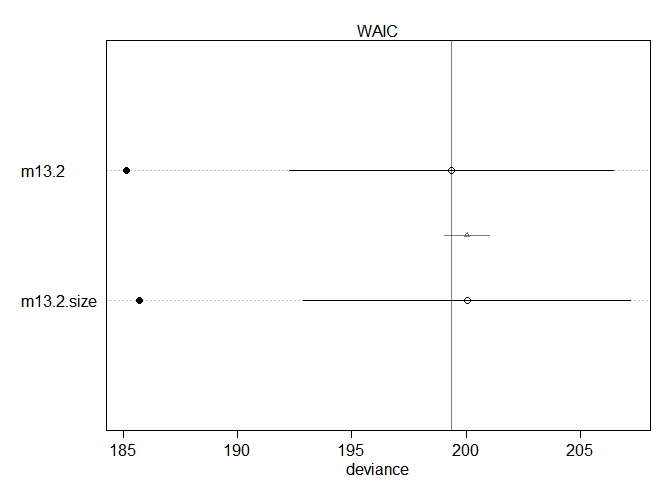

## 13.7. Practice

###Easy.

### 12E1. Which of the following priors will produce more shrinkage in the estimates? (a) αtank ∼ Normal(0, 1); (b) αtank ∼ Normal(0, 2).

> I think (a) will produce more shrinkage in the estimates, as it is more 'regularising'(narrow because of lower sigma), thus I expect it forces estimates to be shifted to the mean more than (b). It results in stronger shrinkage.

### 12E2. Make the following model into a multilevel model.
y i ∼ Binomial(1, p i)
logit(p i) = αgroup[i] + βxi
αgroup ∼ Normal(0, 10)
β ∼ Normal(0, 1)

> multilevel model

y_i ~ Binomial(1,p_i)
logit(p_i) = a[i] + beta*x_i
αgroup ∼ Normal(α_bar, sigma)
α_bar ~ Normal(0, 10)
sigma ~ Exponential(1)
β ∼ Normal(0, 1)

### 12E3. Make the following model into a multilevel model.
y i ∼ Normal(µi, σ)
µi = αgroup[i] + βx i
αgroup ∼ Normal(0, 10)
β ∼ Normal(0, 1)
σ ∼ HalfCauchy(0, 2)

> multilevel model

y i ∼ Normal(µi, σ)
µi = αgroup[i] + βx i
αgroup ∼ Normal(α_bar, sigma)
α_bar ~ Normal(0, 10)
sigma ~ Exponential(1)
β ∼ Normal(0, 1)
σ ∼ HalfCauchy(0, 2)

### Medium.

### 12M1. Revisit the Reed frog survival data, data(reedfrogs), and add the predation and size treatment variables to the varying intercepts model. Consider models with either main effect alone, both main effects, as well as a model including both and their interaction. Instead of focusing on inferences about these two predictor variables, focus on the inferred variation across tanks. Explain why it changes as it does across models.


```r
## R code 13.1
library(rethinking)
```

```
## Loading required package: rstan
```

```
## Loading required package: StanHeaders
```

```
## Loading required package: ggplot2
```

```
## rstan (Version 2.19.2, GitRev: 2e1f913d3ca3)
```

```
## For execution on a local, multicore CPU with excess RAM we recommend calling
## options(mc.cores = parallel::detectCores()).
## To avoid recompilation of unchanged Stan programs, we recommend calling
## rstan_options(auto_write = TRUE)
```

```
## For improved execution time, we recommend calling
## Sys.setenv(LOCAL_CPPFLAGS = '-march=native')
## although this causes Stan to throw an error on a few processors.
```

```
## Loading required package: parallel
```

```
## Loading required package: dagitty
```

```
## rethinking (Version 1.93)
```

```
## 
## Attaching package: 'rethinking'
```

```
## The following object is masked from 'package:stats':
## 
##     rstudent
```

```r
data(reedfrogs)
d <- reedfrogs
str(d)
```

```
## 'data.frame':	48 obs. of  5 variables:
##  $ density : int  10 10 10 10 10 10 10 10 10 10 ...
##  $ pred    : Factor w/ 2 levels "no","pred": 1 1 1 1 1 1 1 1 2 2 ...
##  $ size    : Factor w/ 2 levels "big","small": 1 1 1 1 2 2 2 2 1 1 ...
##  $ surv    : int  9 10 7 10 9 9 10 9 4 9 ...
##  $ propsurv: num  0.9 1 0.7 1 0.9 0.9 1 0.9 0.4 0.9 ...
```

```r
head(d)
```

```
##   density pred  size surv propsurv
## 1      10   no   big    9      0.9
## 2      10   no   big   10      1.0
## 3      10   no   big    7      0.7
## 4      10   no   big   10      1.0
## 5      10   no small    9      0.9
## 6      10   no small    9      0.9
```


```r
# make the tank cluster variable
d$tank <- 1:nrow(d)
d$has_pred<- ifelse(test = d$pred == "pred", yes = 1, no = 0)
d$is_big<- ifelse(test = d$size == "big", yes = 1, no = 0)
str(d)
```

```
## 'data.frame':	48 obs. of  8 variables:
##  $ density : int  10 10 10 10 10 10 10 10 10 10 ...
##  $ pred    : Factor w/ 2 levels "no","pred": 1 1 1 1 1 1 1 1 2 2 ...
##  $ size    : Factor w/ 2 levels "big","small": 1 1 1 1 2 2 2 2 1 1 ...
##  $ surv    : int  9 10 7 10 9 9 10 9 4 9 ...
##  $ propsurv: num  0.9 1 0.7 1 0.9 0.9 1 0.9 0.4 0.9 ...
##  $ tank    : int  1 2 3 4 5 6 7 8 9 10 ...
##  $ has_pred: num  0 0 0 0 0 0 0 0 1 1 ...
##  $ is_big  : num  1 1 1 1 0 0 0 0 1 1 ...
```

```r
dat <- list(
    S = d$surv,
    N = d$density,
    P = d$has_pred,
    B = d$is_big,
    tank = d$tank )

str(dat)
```

```
## List of 5
##  $ S   : int [1:48] 9 10 7 10 9 9 10 9 4 9 ...
##  $ N   : int [1:48] 10 10 10 10 10 10 10 10 10 10 ...
##  $ P   : num [1:48] 0 0 0 0 0 0 0 0 1 1 ...
##  $ B   : num [1:48] 1 1 1 1 0 0 0 0 1 1 ...
##  $ tank: int [1:48] 1 2 3 4 5 6 7 8 9 10 ...
```

```r
## R code 13.3
m13.2 <- ulam(
    alist(
        S ~ dbinom( N , p ) ,
        logit(p) <- a[tank] ,
        a[tank] ~ dnorm( a_bar , sigma ) ,
        a_bar ~ dnorm( 0 , 1.5 ) ,
        sigma ~ dexp( 1 )
    ), data=dat , chains=4 , log_lik=TRUE )
```

```
## 
## SAMPLING FOR MODEL 'fa49720ff3dc06d3a2e6fbf0bac308df' NOW (CHAIN 1).
## Chain 1: 
## Chain 1: Gradient evaluation took 0 seconds
## Chain 1: 1000 transitions using 10 leapfrog steps per transition would take 0 seconds.
## Chain 1: Adjust your expectations accordingly!
## Chain 1: 
## Chain 1: 
## Chain 1: Iteration:   1 / 1000 [  0%]  (Warmup)
## Chain 1: Iteration: 100 / 1000 [ 10%]  (Warmup)
## Chain 1: Iteration: 200 / 1000 [ 20%]  (Warmup)
## Chain 1: Iteration: 300 / 1000 [ 30%]  (Warmup)
## Chain 1: Iteration: 400 / 1000 [ 40%]  (Warmup)
## Chain 1: Iteration: 500 / 1000 [ 50%]  (Warmup)
## Chain 1: Iteration: 501 / 1000 [ 50%]  (Sampling)
## Chain 1: Iteration: 600 / 1000 [ 60%]  (Sampling)
## Chain 1: Iteration: 700 / 1000 [ 70%]  (Sampling)
## Chain 1: Iteration: 800 / 1000 [ 80%]  (Sampling)
## Chain 1: Iteration: 900 / 1000 [ 90%]  (Sampling)
## Chain 1: Iteration: 1000 / 1000 [100%]  (Sampling)
## Chain 1: 
## Chain 1:  Elapsed Time: 0.344 seconds (Warm-up)
## Chain 1:                0.152 seconds (Sampling)
## Chain 1:                0.496 seconds (Total)
## Chain 1: 
## 
## SAMPLING FOR MODEL 'fa49720ff3dc06d3a2e6fbf0bac308df' NOW (CHAIN 2).
## Chain 2: 
## Chain 2: Gradient evaluation took 0 seconds
## Chain 2: 1000 transitions using 10 leapfrog steps per transition would take 0 seconds.
## Chain 2: Adjust your expectations accordingly!
## Chain 2: 
## Chain 2: 
## Chain 2: Iteration:   1 / 1000 [  0%]  (Warmup)
## Chain 2: Iteration: 100 / 1000 [ 10%]  (Warmup)
## Chain 2: Iteration: 200 / 1000 [ 20%]  (Warmup)
## Chain 2: Iteration: 300 / 1000 [ 30%]  (Warmup)
## Chain 2: Iteration: 400 / 1000 [ 40%]  (Warmup)
## Chain 2: Iteration: 500 / 1000 [ 50%]  (Warmup)
## Chain 2: Iteration: 501 / 1000 [ 50%]  (Sampling)
## Chain 2: Iteration: 600 / 1000 [ 60%]  (Sampling)
## Chain 2: Iteration: 700 / 1000 [ 70%]  (Sampling)
## Chain 2: Iteration: 800 / 1000 [ 80%]  (Sampling)
## Chain 2: Iteration: 900 / 1000 [ 90%]  (Sampling)
## Chain 2: Iteration: 1000 / 1000 [100%]  (Sampling)
## Chain 2: 
## Chain 2:  Elapsed Time: 0.214 seconds (Warm-up)
## Chain 2:                0.183 seconds (Sampling)
## Chain 2:                0.397 seconds (Total)
## Chain 2: 
## 
## SAMPLING FOR MODEL 'fa49720ff3dc06d3a2e6fbf0bac308df' NOW (CHAIN 3).
## Chain 3: 
## Chain 3: Gradient evaluation took 0 seconds
## Chain 3: 1000 transitions using 10 leapfrog steps per transition would take 0 seconds.
## Chain 3: Adjust your expectations accordingly!
## Chain 3: 
## Chain 3: 
## Chain 3: Iteration:   1 / 1000 [  0%]  (Warmup)
## Chain 3: Iteration: 100 / 1000 [ 10%]  (Warmup)
## Chain 3: Iteration: 200 / 1000 [ 20%]  (Warmup)
## Chain 3: Iteration: 300 / 1000 [ 30%]  (Warmup)
## Chain 3: Iteration: 400 / 1000 [ 40%]  (Warmup)
## Chain 3: Iteration: 500 / 1000 [ 50%]  (Warmup)
## Chain 3: Iteration: 501 / 1000 [ 50%]  (Sampling)
## Chain 3: Iteration: 600 / 1000 [ 60%]  (Sampling)
## Chain 3: Iteration: 700 / 1000 [ 70%]  (Sampling)
## Chain 3: Iteration: 800 / 1000 [ 80%]  (Sampling)
## Chain 3: Iteration: 900 / 1000 [ 90%]  (Sampling)
## Chain 3: Iteration: 1000 / 1000 [100%]  (Sampling)
## Chain 3: 
## Chain 3:  Elapsed Time: 0.399 seconds (Warm-up)
## Chain 3:                0.197 seconds (Sampling)
## Chain 3:                0.596 seconds (Total)
## Chain 3: 
## 
## SAMPLING FOR MODEL 'fa49720ff3dc06d3a2e6fbf0bac308df' NOW (CHAIN 4).
## Chain 4: 
## Chain 4: Gradient evaluation took 0 seconds
## Chain 4: 1000 transitions using 10 leapfrog steps per transition would take 0 seconds.
## Chain 4: Adjust your expectations accordingly!
## Chain 4: 
## Chain 4: 
## Chain 4: Iteration:   1 / 1000 [  0%]  (Warmup)
## Chain 4: Iteration: 100 / 1000 [ 10%]  (Warmup)
## Chain 4: Iteration: 200 / 1000 [ 20%]  (Warmup)
## Chain 4: Iteration: 300 / 1000 [ 30%]  (Warmup)
## Chain 4: Iteration: 400 / 1000 [ 40%]  (Warmup)
## Chain 4: Iteration: 500 / 1000 [ 50%]  (Warmup)
## Chain 4: Iteration: 501 / 1000 [ 50%]  (Sampling)
## Chain 4: Iteration: 600 / 1000 [ 60%]  (Sampling)
## Chain 4: Iteration: 700 / 1000 [ 70%]  (Sampling)
## Chain 4: Iteration: 800 / 1000 [ 80%]  (Sampling)
## Chain 4: Iteration: 900 / 1000 [ 90%]  (Sampling)
## Chain 4: Iteration: 1000 / 1000 [100%]  (Sampling)
## Chain 4: 
## Chain 4:  Elapsed Time: 0.263 seconds (Warm-up)
## Chain 4:                0.174 seconds (Sampling)
## Chain 4:                0.437 seconds (Total)
## Chain 4:
```

```r
precis(m13.2)
```

```
## 48 vector or matrix parameters hidden. Use depth=2 to show them.
```

```
##           mean        sd      5.5%    94.5%    n_eff      Rhat
## a_bar 1.340386 0.2482350 0.9580857 1.741476 2505.531 0.9991135
## sigma 1.614161 0.2115252 1.2985127 1.979619 1818.844 0.9991444
```


```r
## R code 13.3+size
m13.2.size <- ulam(
    alist(
        S ~ dbinom( N , p ) ,
        logit(p) <- a[tank] + b_size*B,
        a[tank] ~ dnorm( a_bar , sigma ) ,
        a_bar ~ dnorm( 0 , 1.5 ) ,
        sigma ~ dexp( 1 ),
        b_size ~ dnorm(0, 1)
    ), data=dat , chains=4 , log_lik=TRUE )
```

```
## 
## SAMPLING FOR MODEL 'd5064108d8830b60114210d1276f0245' NOW (CHAIN 1).
## Chain 1: 
## Chain 1: Gradient evaluation took 0 seconds
## Chain 1: 1000 transitions using 10 leapfrog steps per transition would take 0 seconds.
## Chain 1: Adjust your expectations accordingly!
## Chain 1: 
## Chain 1: 
## Chain 1: Iteration:   1 / 1000 [  0%]  (Warmup)
## Chain 1: Iteration: 100 / 1000 [ 10%]  (Warmup)
## Chain 1: Iteration: 200 / 1000 [ 20%]  (Warmup)
## Chain 1: Iteration: 300 / 1000 [ 30%]  (Warmup)
## Chain 1: Iteration: 400 / 1000 [ 40%]  (Warmup)
## Chain 1: Iteration: 500 / 1000 [ 50%]  (Warmup)
## Chain 1: Iteration: 501 / 1000 [ 50%]  (Sampling)
## Chain 1: Iteration: 600 / 1000 [ 60%]  (Sampling)
## Chain 1: Iteration: 700 / 1000 [ 70%]  (Sampling)
## Chain 1: Iteration: 800 / 1000 [ 80%]  (Sampling)
## Chain 1: Iteration: 900 / 1000 [ 90%]  (Sampling)
## Chain 1: Iteration: 1000 / 1000 [100%]  (Sampling)
## Chain 1: 
## Chain 1:  Elapsed Time: 0.263 seconds (Warm-up)
## Chain 1:                0.181 seconds (Sampling)
## Chain 1:                0.444 seconds (Total)
## Chain 1: 
## 
## SAMPLING FOR MODEL 'd5064108d8830b60114210d1276f0245' NOW (CHAIN 2).
## Chain 2: 
## Chain 2: Gradient evaluation took 0 seconds
## Chain 2: 1000 transitions using 10 leapfrog steps per transition would take 0 seconds.
## Chain 2: Adjust your expectations accordingly!
## Chain 2: 
## Chain 2: 
## Chain 2: Iteration:   1 / 1000 [  0%]  (Warmup)
## Chain 2: Iteration: 100 / 1000 [ 10%]  (Warmup)
## Chain 2: Iteration: 200 / 1000 [ 20%]  (Warmup)
## Chain 2: Iteration: 300 / 1000 [ 30%]  (Warmup)
## Chain 2: Iteration: 400 / 1000 [ 40%]  (Warmup)
## Chain 2: Iteration: 500 / 1000 [ 50%]  (Warmup)
## Chain 2: Iteration: 501 / 1000 [ 50%]  (Sampling)
## Chain 2: Iteration: 600 / 1000 [ 60%]  (Sampling)
## Chain 2: Iteration: 700 / 1000 [ 70%]  (Sampling)
## Chain 2: Iteration: 800 / 1000 [ 80%]  (Sampling)
## Chain 2: Iteration: 900 / 1000 [ 90%]  (Sampling)
## Chain 2: Iteration: 1000 / 1000 [100%]  (Sampling)
## Chain 2: 
## Chain 2:  Elapsed Time: 0.346 seconds (Warm-up)
## Chain 2:                0.259 seconds (Sampling)
## Chain 2:                0.605 seconds (Total)
## Chain 2: 
## 
## SAMPLING FOR MODEL 'd5064108d8830b60114210d1276f0245' NOW (CHAIN 3).
## Chain 3: 
## Chain 3: Gradient evaluation took 0 seconds
## Chain 3: 1000 transitions using 10 leapfrog steps per transition would take 0 seconds.
## Chain 3: Adjust your expectations accordingly!
## Chain 3: 
## Chain 3: 
## Chain 3: Iteration:   1 / 1000 [  0%]  (Warmup)
## Chain 3: Iteration: 100 / 1000 [ 10%]  (Warmup)
## Chain 3: Iteration: 200 / 1000 [ 20%]  (Warmup)
## Chain 3: Iteration: 300 / 1000 [ 30%]  (Warmup)
## Chain 3: Iteration: 400 / 1000 [ 40%]  (Warmup)
## Chain 3: Iteration: 500 / 1000 [ 50%]  (Warmup)
## Chain 3: Iteration: 501 / 1000 [ 50%]  (Sampling)
## Chain 3: Iteration: 600 / 1000 [ 60%]  (Sampling)
## Chain 3: Iteration: 700 / 1000 [ 70%]  (Sampling)
## Chain 3: Iteration: 800 / 1000 [ 80%]  (Sampling)
## Chain 3: Iteration: 900 / 1000 [ 90%]  (Sampling)
## Chain 3: Iteration: 1000 / 1000 [100%]  (Sampling)
## Chain 3: 
## Chain 3:  Elapsed Time: 0.275 seconds (Warm-up)
## Chain 3:                0.25 seconds (Sampling)
## Chain 3:                0.525 seconds (Total)
## Chain 3: 
## 
## SAMPLING FOR MODEL 'd5064108d8830b60114210d1276f0245' NOW (CHAIN 4).
## Chain 4: 
## Chain 4: Gradient evaluation took 0 seconds
## Chain 4: 1000 transitions using 10 leapfrog steps per transition would take 0 seconds.
## Chain 4: Adjust your expectations accordingly!
## Chain 4: 
## Chain 4: 
## Chain 4: Iteration:   1 / 1000 [  0%]  (Warmup)
## Chain 4: Iteration: 100 / 1000 [ 10%]  (Warmup)
## Chain 4: Iteration: 200 / 1000 [ 20%]  (Warmup)
## Chain 4: Iteration: 300 / 1000 [ 30%]  (Warmup)
## Chain 4: Iteration: 400 / 1000 [ 40%]  (Warmup)
## Chain 4: Iteration: 500 / 1000 [ 50%]  (Warmup)
## Chain 4: Iteration: 501 / 1000 [ 50%]  (Sampling)
## Chain 4: Iteration: 600 / 1000 [ 60%]  (Sampling)
## Chain 4: Iteration: 700 / 1000 [ 70%]  (Sampling)
## Chain 4: Iteration: 800 / 1000 [ 80%]  (Sampling)
## Chain 4: Iteration: 900 / 1000 [ 90%]  (Sampling)
## Chain 4: Iteration: 1000 / 1000 [100%]  (Sampling)
## Chain 4: 
## Chain 4:  Elapsed Time: 0.267 seconds (Warm-up)
## Chain 4:                0.286 seconds (Sampling)
## Chain 4:                0.553 seconds (Total)
## Chain 4:
```

```
## Warning: Bulk Effective Samples Size (ESS) is too low, indicating posterior means and medians may be unreliable.
## Running the chains for more iterations may help. See
## http://mc-stan.org/misc/warnings.html#bulk-ess
```

```r
precis(m13.2.size)
```

```
## 48 vector or matrix parameters hidden. Use depth=2 to show them.
```

```
##              mean        sd       5.5%     94.5%    n_eff     Rhat
## a_bar   1.4774845 0.3454162  0.9628157 2.0365588 361.1304 1.015960
## sigma   1.6202007 0.2144352  1.3018362 1.9993197 882.9903 1.003684
## b_size -0.2777832 0.4757670 -1.0342929 0.5057963 226.4872 1.031951
```

```r
compare(m13.2, m13.2.size)
```

```
##                WAIC       SE     dWAIC       dSE    pWAIC    weight
## m13.2      199.3477 7.099934 0.0000000        NA 20.68974 0.5859684
## m13.2.size 200.0423 7.168906 0.6946472 0.9897981 20.83201 0.4140316
```

```r
plot(compare(m13.2, m13.2.size))
```

<!-- -->


```r
## R code 13.3+predation
m13.2.predation <- ulam(
    alist(
        S ~ dbinom( N , p ) ,
        logit(p) <- a[tank] + b_predation*P,
        a[tank] ~ dnorm( a_bar , sigma ) ,
        a_bar ~ dnorm( 0 , 1.5 ) ,
        sigma ~ dexp( 1 ),
        b_predation ~ dnorm(0, 1)
    ), data=dat , chains=4 , log_lik=TRUE )
```

```
## 
## SAMPLING FOR MODEL 'ad078f933bf77d70beaafb858eb12626' NOW (CHAIN 1).
## Chain 1: 
## Chain 1: Gradient evaluation took 0 seconds
## Chain 1: 1000 transitions using 10 leapfrog steps per transition would take 0 seconds.
## Chain 1: Adjust your expectations accordingly!
## Chain 1: 
## Chain 1: 
## Chain 1: Iteration:   1 / 1000 [  0%]  (Warmup)
## Chain 1: Iteration: 100 / 1000 [ 10%]  (Warmup)
## Chain 1: Iteration: 200 / 1000 [ 20%]  (Warmup)
## Chain 1: Iteration: 300 / 1000 [ 30%]  (Warmup)
## Chain 1: Iteration: 400 / 1000 [ 40%]  (Warmup)
## Chain 1: Iteration: 500 / 1000 [ 50%]  (Warmup)
## Chain 1: Iteration: 501 / 1000 [ 50%]  (Sampling)
## Chain 1: Iteration: 600 / 1000 [ 60%]  (Sampling)
## Chain 1: Iteration: 700 / 1000 [ 70%]  (Sampling)
## Chain 1: Iteration: 800 / 1000 [ 80%]  (Sampling)
## Chain 1: Iteration: 900 / 1000 [ 90%]  (Sampling)
## Chain 1: Iteration: 1000 / 1000 [100%]  (Sampling)
## Chain 1: 
## Chain 1:  Elapsed Time: 0.276 seconds (Warm-up)
## Chain 1:                0.178 seconds (Sampling)
## Chain 1:                0.454 seconds (Total)
## Chain 1: 
## 
## SAMPLING FOR MODEL 'ad078f933bf77d70beaafb858eb12626' NOW (CHAIN 2).
## Chain 2: 
## Chain 2: Gradient evaluation took 0 seconds
## Chain 2: 1000 transitions using 10 leapfrog steps per transition would take 0 seconds.
## Chain 2: Adjust your expectations accordingly!
## Chain 2: 
## Chain 2: 
## Chain 2: Iteration:   1 / 1000 [  0%]  (Warmup)
## Chain 2: Iteration: 100 / 1000 [ 10%]  (Warmup)
## Chain 2: Iteration: 200 / 1000 [ 20%]  (Warmup)
## Chain 2: Iteration: 300 / 1000 [ 30%]  (Warmup)
## Chain 2: Iteration: 400 / 1000 [ 40%]  (Warmup)
## Chain 2: Iteration: 500 / 1000 [ 50%]  (Warmup)
## Chain 2: Iteration: 501 / 1000 [ 50%]  (Sampling)
## Chain 2: Iteration: 600 / 1000 [ 60%]  (Sampling)
## Chain 2: Iteration: 700 / 1000 [ 70%]  (Sampling)
## Chain 2: Iteration: 800 / 1000 [ 80%]  (Sampling)
## Chain 2: Iteration: 900 / 1000 [ 90%]  (Sampling)
## Chain 2: Iteration: 1000 / 1000 [100%]  (Sampling)
## Chain 2: 
## Chain 2:  Elapsed Time: 0.227 seconds (Warm-up)
## Chain 2:                0.163 seconds (Sampling)
## Chain 2:                0.39 seconds (Total)
## Chain 2: 
## 
## SAMPLING FOR MODEL 'ad078f933bf77d70beaafb858eb12626' NOW (CHAIN 3).
## Chain 3: 
## Chain 3: Gradient evaluation took 0 seconds
## Chain 3: 1000 transitions using 10 leapfrog steps per transition would take 0 seconds.
## Chain 3: Adjust your expectations accordingly!
## Chain 3: 
## Chain 3: 
## Chain 3: Iteration:   1 / 1000 [  0%]  (Warmup)
## Chain 3: Iteration: 100 / 1000 [ 10%]  (Warmup)
## Chain 3: Iteration: 200 / 1000 [ 20%]  (Warmup)
## Chain 3: Iteration: 300 / 1000 [ 30%]  (Warmup)
## Chain 3: Iteration: 400 / 1000 [ 40%]  (Warmup)
## Chain 3: Iteration: 500 / 1000 [ 50%]  (Warmup)
## Chain 3: Iteration: 501 / 1000 [ 50%]  (Sampling)
## Chain 3: Iteration: 600 / 1000 [ 60%]  (Sampling)
## Chain 3: Iteration: 700 / 1000 [ 70%]  (Sampling)
## Chain 3: Iteration: 800 / 1000 [ 80%]  (Sampling)
## Chain 3: Iteration: 900 / 1000 [ 90%]  (Sampling)
## Chain 3: Iteration: 1000 / 1000 [100%]  (Sampling)
## Chain 3: 
## Chain 3:  Elapsed Time: 0.316 seconds (Warm-up)
## Chain 3:                0.246 seconds (Sampling)
## Chain 3:                0.562 seconds (Total)
## Chain 3: 
## 
## SAMPLING FOR MODEL 'ad078f933bf77d70beaafb858eb12626' NOW (CHAIN 4).
## Chain 4: 
## Chain 4: Gradient evaluation took 0 seconds
## Chain 4: 1000 transitions using 10 leapfrog steps per transition would take 0 seconds.
## Chain 4: Adjust your expectations accordingly!
## Chain 4: 
## Chain 4: 
## Chain 4: Iteration:   1 / 1000 [  0%]  (Warmup)
## Chain 4: Iteration: 100 / 1000 [ 10%]  (Warmup)
## Chain 4: Iteration: 200 / 1000 [ 20%]  (Warmup)
## Chain 4: Iteration: 300 / 1000 [ 30%]  (Warmup)
## Chain 4: Iteration: 400 / 1000 [ 40%]  (Warmup)
## Chain 4: Iteration: 500 / 1000 [ 50%]  (Warmup)
## Chain 4: Iteration: 501 / 1000 [ 50%]  (Sampling)
## Chain 4: Iteration: 600 / 1000 [ 60%]  (Sampling)
## Chain 4: Iteration: 700 / 1000 [ 70%]  (Sampling)
## Chain 4: Iteration: 800 / 1000 [ 80%]  (Sampling)
## Chain 4: Iteration: 900 / 1000 [ 90%]  (Sampling)
## Chain 4: Iteration: 1000 / 1000 [100%]  (Sampling)
## Chain 4: 
## Chain 4:  Elapsed Time: 0.291 seconds (Warm-up)
## Chain 4:                0.179 seconds (Sampling)
## Chain 4:                0.47 seconds (Total)
## Chain 4:
```

```
## Warning: Bulk Effective Samples Size (ESS) is too low, indicating posterior means and medians may be unreliable.
## Running the chains for more iterations may help. See
## http://mc-stan.org/misc/warnings.html#bulk-ess
```

```
## Warning: Tail Effective Samples Size (ESS) is too low, indicating posterior variances and tail quantiles may be unreliable.
## Running the chains for more iterations may help. See
## http://mc-stan.org/misc/warnings.html#tail-ess
```

```r
precis(m13.2.predation)
```

```
## 48 vector or matrix parameters hidden. Use depth=2 to show them.
```

```
##                   mean        sd      5.5%     94.5%    n_eff     Rhat
## a_bar        2.4935527 0.2120534  2.159215  2.833980 292.4455 1.014415
## sigma        0.8197099 0.1478523  0.605374  1.070272 612.8936 1.003822
## b_predation -2.3851238 0.2749470 -2.812781 -1.939822 223.2310 1.019975
```

```r
compare(m13.2, m13.2.predation)
```

```
##                     WAIC       SE      dWAIC      dSE    pWAIC    weight
## m13.2.predation 199.3316 9.042201 0.00000000       NA 19.29317 0.5020045
## m13.2           199.3477 7.099934 0.01603621 5.869854 20.68974 0.4979955
```

```r
plot(compare(m13.2, m13.2.predation))
```

<!-- -->


```r
## R code 13.3+both
m13.2.both <- ulam(
    alist(
        S ~ dbinom( N , p ) ,
        logit(p) <- a[tank] + b_predation*P + b_size*B,
        a[tank] ~ dnorm( a_bar , sigma ) ,
        a_bar ~ dnorm( 0 , 1.5 ) ,
        sigma ~ dexp( 1 ),
        b_predation ~ dnorm(0, 1),
        b_size ~ dnorm(0, 1)
    ), data=dat , chains=4 , log_lik=TRUE )
```

```
## 
## SAMPLING FOR MODEL '9f02fb80943b8af4740183b33f0ae5b0' NOW (CHAIN 1).
## Chain 1: 
## Chain 1: Gradient evaluation took 0 seconds
## Chain 1: 1000 transitions using 10 leapfrog steps per transition would take 0 seconds.
## Chain 1: Adjust your expectations accordingly!
## Chain 1: 
## Chain 1: 
## Chain 1: Iteration:   1 / 1000 [  0%]  (Warmup)
## Chain 1: Iteration: 100 / 1000 [ 10%]  (Warmup)
## Chain 1: Iteration: 200 / 1000 [ 20%]  (Warmup)
## Chain 1: Iteration: 300 / 1000 [ 30%]  (Warmup)
## Chain 1: Iteration: 400 / 1000 [ 40%]  (Warmup)
## Chain 1: Iteration: 500 / 1000 [ 50%]  (Warmup)
## Chain 1: Iteration: 501 / 1000 [ 50%]  (Sampling)
## Chain 1: Iteration: 600 / 1000 [ 60%]  (Sampling)
## Chain 1: Iteration: 700 / 1000 [ 70%]  (Sampling)
## Chain 1: Iteration: 800 / 1000 [ 80%]  (Sampling)
## Chain 1: Iteration: 900 / 1000 [ 90%]  (Sampling)
## Chain 1: Iteration: 1000 / 1000 [100%]  (Sampling)
## Chain 1: 
## Chain 1:  Elapsed Time: 0.366 seconds (Warm-up)
## Chain 1:                0.281 seconds (Sampling)
## Chain 1:                0.647 seconds (Total)
## Chain 1: 
## 
## SAMPLING FOR MODEL '9f02fb80943b8af4740183b33f0ae5b0' NOW (CHAIN 2).
## Chain 2: 
## Chain 2: Gradient evaluation took 0 seconds
## Chain 2: 1000 transitions using 10 leapfrog steps per transition would take 0 seconds.
## Chain 2: Adjust your expectations accordingly!
## Chain 2: 
## Chain 2: 
## Chain 2: Iteration:   1 / 1000 [  0%]  (Warmup)
## Chain 2: Iteration: 100 / 1000 [ 10%]  (Warmup)
## Chain 2: Iteration: 200 / 1000 [ 20%]  (Warmup)
## Chain 2: Iteration: 300 / 1000 [ 30%]  (Warmup)
## Chain 2: Iteration: 400 / 1000 [ 40%]  (Warmup)
## Chain 2: Iteration: 500 / 1000 [ 50%]  (Warmup)
## Chain 2: Iteration: 501 / 1000 [ 50%]  (Sampling)
## Chain 2: Iteration: 600 / 1000 [ 60%]  (Sampling)
## Chain 2: Iteration: 700 / 1000 [ 70%]  (Sampling)
## Chain 2: Iteration: 800 / 1000 [ 80%]  (Sampling)
## Chain 2: Iteration: 900 / 1000 [ 90%]  (Sampling)
## Chain 2: Iteration: 1000 / 1000 [100%]  (Sampling)
## Chain 2: 
## Chain 2:  Elapsed Time: 0.312 seconds (Warm-up)
## Chain 2:                0.297 seconds (Sampling)
## Chain 2:                0.609 seconds (Total)
## Chain 2: 
## 
## SAMPLING FOR MODEL '9f02fb80943b8af4740183b33f0ae5b0' NOW (CHAIN 3).
## Chain 3: 
## Chain 3: Gradient evaluation took 0 seconds
## Chain 3: 1000 transitions using 10 leapfrog steps per transition would take 0 seconds.
## Chain 3: Adjust your expectations accordingly!
## Chain 3: 
## Chain 3: 
## Chain 3: Iteration:   1 / 1000 [  0%]  (Warmup)
## Chain 3: Iteration: 100 / 1000 [ 10%]  (Warmup)
## Chain 3: Iteration: 200 / 1000 [ 20%]  (Warmup)
## Chain 3: Iteration: 300 / 1000 [ 30%]  (Warmup)
## Chain 3: Iteration: 400 / 1000 [ 40%]  (Warmup)
## Chain 3: Iteration: 500 / 1000 [ 50%]  (Warmup)
## Chain 3: Iteration: 501 / 1000 [ 50%]  (Sampling)
## Chain 3: Iteration: 600 / 1000 [ 60%]  (Sampling)
## Chain 3: Iteration: 700 / 1000 [ 70%]  (Sampling)
## Chain 3: Iteration: 800 / 1000 [ 80%]  (Sampling)
## Chain 3: Iteration: 900 / 1000 [ 90%]  (Sampling)
## Chain 3: Iteration: 1000 / 1000 [100%]  (Sampling)
## Chain 3: 
## Chain 3:  Elapsed Time: 0.338 seconds (Warm-up)
## Chain 3:                0.194 seconds (Sampling)
## Chain 3:                0.532 seconds (Total)
## Chain 3: 
## 
## SAMPLING FOR MODEL '9f02fb80943b8af4740183b33f0ae5b0' NOW (CHAIN 4).
## Chain 4: 
## Chain 4: Gradient evaluation took 0 seconds
## Chain 4: 1000 transitions using 10 leapfrog steps per transition would take 0 seconds.
## Chain 4: Adjust your expectations accordingly!
## Chain 4: 
## Chain 4: 
## Chain 4: Iteration:   1 / 1000 [  0%]  (Warmup)
## Chain 4: Iteration: 100 / 1000 [ 10%]  (Warmup)
## Chain 4: Iteration: 200 / 1000 [ 20%]  (Warmup)
## Chain 4: Iteration: 300 / 1000 [ 30%]  (Warmup)
## Chain 4: Iteration: 400 / 1000 [ 40%]  (Warmup)
## Chain 4: Iteration: 500 / 1000 [ 50%]  (Warmup)
## Chain 4: Iteration: 501 / 1000 [ 50%]  (Sampling)
## Chain 4: Iteration: 600 / 1000 [ 60%]  (Sampling)
## Chain 4: Iteration: 700 / 1000 [ 70%]  (Sampling)
## Chain 4: Iteration: 800 / 1000 [ 80%]  (Sampling)
## Chain 4: Iteration: 900 / 1000 [ 90%]  (Sampling)
## Chain 4: Iteration: 1000 / 1000 [100%]  (Sampling)
## Chain 4: 
## Chain 4:  Elapsed Time: 0.351 seconds (Warm-up)
## Chain 4:                0.265 seconds (Sampling)
## Chain 4:                0.616 seconds (Total)
## Chain 4:
```

```
## Warning: Bulk Effective Samples Size (ESS) is too low, indicating posterior means and medians may be unreliable.
## Running the chains for more iterations may help. See
## http://mc-stan.org/misc/warnings.html#bulk-ess
```

```r
precis(m13.2.both)
```

```
## 48 vector or matrix parameters hidden. Use depth=2 to show them.
```

```
##                   mean        sd       5.5%       94.5%    n_eff     Rhat
## a_bar        2.6836190 0.2679382  2.2444933  3.10894369 271.3700 1.014155
## sigma        0.7753935 0.1446382  0.5589077  1.01512573 548.6549 1.002446
## b_predation -2.3800281 0.2904186 -2.8368605 -1.89098903 303.2877 1.015077
## b_size      -0.4012374 0.2770752 -0.8531307  0.04636141 482.9306 1.005801
```

```r
compare(m13.2, m13.2.both)
```

```
##                WAIC       SE     dWAIC      dSE    pWAIC    weight
## m13.2      199.3477 7.099934 0.0000000       NA 20.68974 0.6164781
## m13.2.both 200.2969 8.649901 0.9492522 5.688387 19.25045 0.3835219
```

```r
plot(compare(m13.2, m13.2.both))
```

<!-- -->


```r
## R code 13.3+both+interaction
m13.2.interaction <- ulam(
    alist(
        S ~ dbinom( N , p ) ,
        logit(p) <- a[tank] + b_predation*P + b_size*B + b_pred_size*P*B,
        a[tank] ~ dnorm( a_bar , sigma ) ,
        a_bar ~ dnorm( 0 , 1.5 ) ,
        sigma ~ dexp( 1 ),
        b_predation ~ dnorm(0, 1),
        b_size ~ dnorm(0, 1),
        b_pred_size ~ dnorm(0, 1)
    ), data=dat , chains=4 , log_lik=TRUE )
```

```
## 
## SAMPLING FOR MODEL '6e4c5890fcf933a31644331a2e38618e' NOW (CHAIN 1).
## Chain 1: 
## Chain 1: Gradient evaluation took 0 seconds
## Chain 1: 1000 transitions using 10 leapfrog steps per transition would take 0 seconds.
## Chain 1: Adjust your expectations accordingly!
## Chain 1: 
## Chain 1: 
## Chain 1: Iteration:   1 / 1000 [  0%]  (Warmup)
## Chain 1: Iteration: 100 / 1000 [ 10%]  (Warmup)
## Chain 1: Iteration: 200 / 1000 [ 20%]  (Warmup)
## Chain 1: Iteration: 300 / 1000 [ 30%]  (Warmup)
## Chain 1: Iteration: 400 / 1000 [ 40%]  (Warmup)
## Chain 1: Iteration: 500 / 1000 [ 50%]  (Warmup)
## Chain 1: Iteration: 501 / 1000 [ 50%]  (Sampling)
## Chain 1: Iteration: 600 / 1000 [ 60%]  (Sampling)
## Chain 1: Iteration: 700 / 1000 [ 70%]  (Sampling)
## Chain 1: Iteration: 800 / 1000 [ 80%]  (Sampling)
## Chain 1: Iteration: 900 / 1000 [ 90%]  (Sampling)
## Chain 1: Iteration: 1000 / 1000 [100%]  (Sampling)
## Chain 1: 
## Chain 1:  Elapsed Time: 0.449 seconds (Warm-up)
## Chain 1:                0.386 seconds (Sampling)
## Chain 1:                0.835 seconds (Total)
## Chain 1: 
## 
## SAMPLING FOR MODEL '6e4c5890fcf933a31644331a2e38618e' NOW (CHAIN 2).
## Chain 2: 
## Chain 2: Gradient evaluation took 0 seconds
## Chain 2: 1000 transitions using 10 leapfrog steps per transition would take 0 seconds.
## Chain 2: Adjust your expectations accordingly!
## Chain 2: 
## Chain 2: 
## Chain 2: Iteration:   1 / 1000 [  0%]  (Warmup)
## Chain 2: Iteration: 100 / 1000 [ 10%]  (Warmup)
## Chain 2: Iteration: 200 / 1000 [ 20%]  (Warmup)
## Chain 2: Iteration: 300 / 1000 [ 30%]  (Warmup)
## Chain 2: Iteration: 400 / 1000 [ 40%]  (Warmup)
## Chain 2: Iteration: 500 / 1000 [ 50%]  (Warmup)
## Chain 2: Iteration: 501 / 1000 [ 50%]  (Sampling)
## Chain 2: Iteration: 600 / 1000 [ 60%]  (Sampling)
## Chain 2: Iteration: 700 / 1000 [ 70%]  (Sampling)
## Chain 2: Iteration: 800 / 1000 [ 80%]  (Sampling)
## Chain 2: Iteration: 900 / 1000 [ 90%]  (Sampling)
## Chain 2: Iteration: 1000 / 1000 [100%]  (Sampling)
## Chain 2: 
## Chain 2:  Elapsed Time: 0.381 seconds (Warm-up)
## Chain 2:                0.377 seconds (Sampling)
## Chain 2:                0.758 seconds (Total)
## Chain 2: 
## 
## SAMPLING FOR MODEL '6e4c5890fcf933a31644331a2e38618e' NOW (CHAIN 3).
## Chain 3: 
## Chain 3: Gradient evaluation took 0 seconds
## Chain 3: 1000 transitions using 10 leapfrog steps per transition would take 0 seconds.
## Chain 3: Adjust your expectations accordingly!
## Chain 3: 
## Chain 3: 
## Chain 3: Iteration:   1 / 1000 [  0%]  (Warmup)
## Chain 3: Iteration: 100 / 1000 [ 10%]  (Warmup)
## Chain 3: Iteration: 200 / 1000 [ 20%]  (Warmup)
## Chain 3: Iteration: 300 / 1000 [ 30%]  (Warmup)
## Chain 3: Iteration: 400 / 1000 [ 40%]  (Warmup)
## Chain 3: Iteration: 500 / 1000 [ 50%]  (Warmup)
## Chain 3: Iteration: 501 / 1000 [ 50%]  (Sampling)
## Chain 3: Iteration: 600 / 1000 [ 60%]  (Sampling)
## Chain 3: Iteration: 700 / 1000 [ 70%]  (Sampling)
## Chain 3: Iteration: 800 / 1000 [ 80%]  (Sampling)
## Chain 3: Iteration: 900 / 1000 [ 90%]  (Sampling)
## Chain 3: Iteration: 1000 / 1000 [100%]  (Sampling)
## Chain 3: 
## Chain 3:  Elapsed Time: 0.514 seconds (Warm-up)
## Chain 3:                0.367 seconds (Sampling)
## Chain 3:                0.881 seconds (Total)
## Chain 3: 
## 
## SAMPLING FOR MODEL '6e4c5890fcf933a31644331a2e38618e' NOW (CHAIN 4).
## Chain 4: 
## Chain 4: Gradient evaluation took 0 seconds
## Chain 4: 1000 transitions using 10 leapfrog steps per transition would take 0 seconds.
## Chain 4: Adjust your expectations accordingly!
## Chain 4: 
## Chain 4: 
## Chain 4: Iteration:   1 / 1000 [  0%]  (Warmup)
## Chain 4: Iteration: 100 / 1000 [ 10%]  (Warmup)
## Chain 4: Iteration: 200 / 1000 [ 20%]  (Warmup)
## Chain 4: Iteration: 300 / 1000 [ 30%]  (Warmup)
## Chain 4: Iteration: 400 / 1000 [ 40%]  (Warmup)
## Chain 4: Iteration: 500 / 1000 [ 50%]  (Warmup)
## Chain 4: Iteration: 501 / 1000 [ 50%]  (Sampling)
## Chain 4: Iteration: 600 / 1000 [ 60%]  (Sampling)
## Chain 4: Iteration: 700 / 1000 [ 70%]  (Sampling)
## Chain 4: Iteration: 800 / 1000 [ 80%]  (Sampling)
## Chain 4: Iteration: 900 / 1000 [ 90%]  (Sampling)
## Chain 4: Iteration: 1000 / 1000 [100%]  (Sampling)
## Chain 4: 
## Chain 4:  Elapsed Time: 0.453 seconds (Warm-up)
## Chain 4:                0.374 seconds (Sampling)
## Chain 4:                0.827 seconds (Total)
## Chain 4:
```

```
## Warning: Bulk Effective Samples Size (ESS) is too low, indicating posterior means and medians may be unreliable.
## Running the chains for more iterations may help. See
## http://mc-stan.org/misc/warnings.html#bulk-ess
```

```r
precis(m13.2.interaction)
```

```
## 48 vector or matrix parameters hidden. Use depth=2 to show them.
```

```
##                   mean        sd       5.5%      94.5%    n_eff     Rhat
## a_bar        2.4447954 0.2614739  2.0269343  2.8385664 238.8214 1.016382
## sigma        0.7389370 0.1413027  0.5333040  0.9838301 669.6364 1.008449
## b_predation -1.9142545 0.3248715 -2.4347879 -1.3931221 316.4309 1.013023
## b_size       0.1904199 0.3707883 -0.4078944  0.7767085 426.5290 1.009882
## b_pred_size -1.1039110 0.4619847 -1.8344550 -0.3896339 715.3884 1.003595
```

```r
compare(m13.2, m13.2.interaction)
```

```
##                       WAIC       SE     dWAIC      dSE    pWAIC    weight
## m13.2             199.3477 7.099934 0.0000000       NA 20.68974 0.5308778
## m13.2.interaction 199.5950 9.462931 0.2473372 6.654727 19.05509 0.4691222
```

```r
plot(compare(m13.2, m13.2.interaction))
```

<!-- -->

### 12M2. Compare the models you fit just above, using WAIC. Can you reconcile the differences in WAIC with the posterior distributions of the models?


```r
compare(m13.2, m13.2.size, m13.2.predation, m13.2.both, m13.2.interaction)
```

```
##                       WAIC       SE      dWAIC      dSE    pWAIC    weight
## m13.2.predation   199.3316 9.042201 0.00000000       NA 19.29317 0.2388509
## m13.2             199.3477 7.099934 0.01603621 5.869854 20.68974 0.2369434
## m13.2.interaction 199.5950 9.462931 0.26337346 3.400728 19.05509 0.2093804
## m13.2.size        200.0423 7.168906 0.71068338 5.739143 20.83201 0.1674187
## m13.2.both        200.2969 8.649901 0.96528842 1.859886 19.25045 0.1474067
```

```r
plot(compare(m13.2, m13.2.size, m13.2.predation, m13.2.both, m13.2.interaction))
```

<!-- -->

```r
postcheck(m13.2, window=60)
```

<!-- -->

```r
postcheck(m13.2.size, window=60)
```

<!-- -->

```r
postcheck(m13.2.predation, window=60)
```

<!-- -->

```r
postcheck(m13.2.both, window=60)
```

<!-- -->

```r
postcheck(m13.2.interaction, window=60)
```

<!-- -->

> According to visual exploration width of credible intervals is smaller for the model with the predator variable, and prediction is better. As we add more predictor variables, the variation among tanks decreases. This is because predictor variables explain part of the variance, leaving less to be captured by `sigma` itself.

### 12H1. In 1980, a typical Bengali woman could have 5 or more children in her lifetime. By the year 200, a typical Bengali woman had only 2 or 3. You’re going to look at a historical set of data, when contraception was widely available but many families chose not to use it. These data reside in data(bangladesh) and come from the 1988 Bangladesh Fertility Survey. Each row is one of 1934 women. There are six variables, but you can focus on three of them for this practice problem:

(1) district: ID number of administrative district each woman resided in
(2) use.contraception: An indicator (0/1) of whether the woman was using contraception
(3) urban: An indicator (0/1) of whether the woman lived in a city, as opposed to living in a
rural area


```r
data(bangladesh)
d <- bangladesh
str(d)
```

```
## 'data.frame':	1934 obs. of  6 variables:
##  $ woman            : int  1 2 3 4 5 6 7 8 9 10 ...
##  $ district         : int  1 1 1 1 1 1 1 1 1 1 ...
##  $ use.contraception: int  0 0 0 0 0 0 0 0 0 0 ...
##  $ living.children  : int  4 1 3 4 1 1 4 4 2 4 ...
##  $ age.centered     : num  18.44 -5.56 1.44 8.44 -13.56 ...
##  $ urban            : int  1 1 1 1 1 1 1 1 1 1 ...
```


The first thing to do is ensure that the cluster variable, district, is a contiguous set of integers. Recall that these values will be index values inside the model. If there are gaps, you’ll have parameters for which there is no data to inform them. Worse, the model probably won’t run. Look at the unique values of the district variable:

```r
## R code 13.40
sort(unique(d$district))
```

```
##  [1]  1  2  3  4  5  6  7  8  9 10 11 12 13 14 15 16 17 18 19 20 21 22 23 24 25
## [26] 26 27 28 29 30 31 32 33 34 35 36 37 38 39 40 41 42 43 44 45 46 47 48 49 50
## [51] 51 52 53 55 56 57 58 59 60 61
```

District 54 is absent. So district isn’t yet a good index variable, because it’s not contiguous. This is
easy to fix. Just make a new variable that is contiguous. This is enough to do it:

```r
## R code 13.41
d$district_id <- as.integer(as.factor(d$district))
sort(unique(d$district_id))
```

```
##  [1]  1  2  3  4  5  6  7  8  9 10 11 12 13 14 15 16 17 18 19 20 21 22 23 24 25
## [26] 26 27 28 29 30 31 32 33 34 35 36 37 38 39 40 41 42 43 44 45 46 47 48 49 50
## [51] 51 52 53 54 55 56 57 58 59 60
```

Now there are 60 values, contiguous integers 1 to 60.
Now, focus on predicting use.contraception, clustered by district_id. Do not include
urban just yet. Fit both (1) a traditional fixed-effects model that uses dummy variables for district and
(2) a multilevel model with varying intercepts for district. Plot the predicted proportions of women
in each district using contraception, for both the fixed-effects model and the varying-effects model.

That is, make a plot in which district ID is on the horizontal axis and expected proportion using contraception is on the vertical. Make one plot for each model, or layer them on the same plot, as you
prefer. How do the models disagree? Can you explain the pattern of disagreement? In particular, can
you explain the most extreme cases of disagreement, both why they happen where they do and why
the models reach different inferences?


```r
dat <- list(
    ID = d$district_id,
    U = d$use.contraception )

str(dat)
```

```
## List of 2
##  $ ID: int [1:1934] 1 1 1 1 1 1 1 1 1 1 ...
##  $ U : int [1:1934] 0 0 0 0 0 0 0 0 0 0 ...
```


```r
# fixed effects model
m12H1.fixed <- ulam(
    alist(
        U ~ dbinom( 1 , p ) ,# each row one woman
        logit(p) <- a[ID] ,
        a[ID] ~ dnorm( 0 , 1.5 )
    ), data=dat , chains=4 , log_lik=TRUE, cores = 4 )

precis(m12H1.fixed)
```

```
## 60 vector or matrix parameters hidden. Use depth=2 to show them.
```

```
## [1] mean  sd    5.5%  94.5% n_eff Rhat 
## <0 rows> (or 0-length row.names)
```

```r
# multilevel model
m12H1.multilevel <- ulam(
    alist(
        U ~ dbinom( 1 , p ) ,
        logit(p) <- a[ID] ,
        a[ID] ~ dnorm( a_bar , sigma ) ,
        a_bar ~ dnorm( 0 , 1.5 ) ,
        sigma ~ dexp( 1 )
    ), data=dat , chains=4 , log_lik=TRUE, cores = 4 )

precis(m12H1.multilevel)
```

```
## 60 vector or matrix parameters hidden. Use depth=2 to show them.
```

```
##             mean         sd       5.5%      94.5%     n_eff     Rhat
## a_bar -0.5387183 0.08793553 -0.6813253 -0.4024717 1643.7701 1.002870
## sigma  0.5180432 0.08279223  0.3951154  0.6598449  735.8854 1.005368
```

```r
compare(m12H1.fixed, m12H1.multilevel)
```

```
##                      WAIC       SE    dWAIC      dSE    pWAIC      weight
## m12H1.multilevel 2513.812 25.02676 0.000000       NA 35.34001 0.993141665
## m12H1.fixed      2523.763 28.89047 9.950817 7.706101 53.80609 0.006858335
```

```r
plot(compare(m12H1.fixed, m12H1.multilevel))
```

<!-- -->

```r
postcheck(m12H1.fixed, window=300)
```

<!-- --><!-- --><!-- --><!-- --><!-- --><!-- --><!-- -->

```r
postcheck(m12H1.multilevel, window=300)
```

<!-- --><!-- --><!-- --><!-- --><!-- --><!-- --><!-- -->

