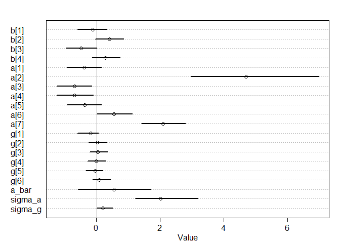
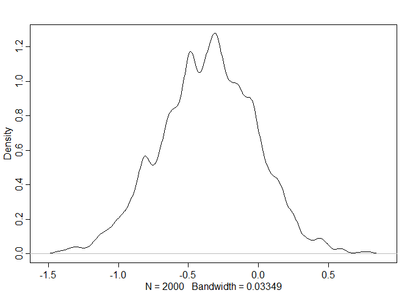
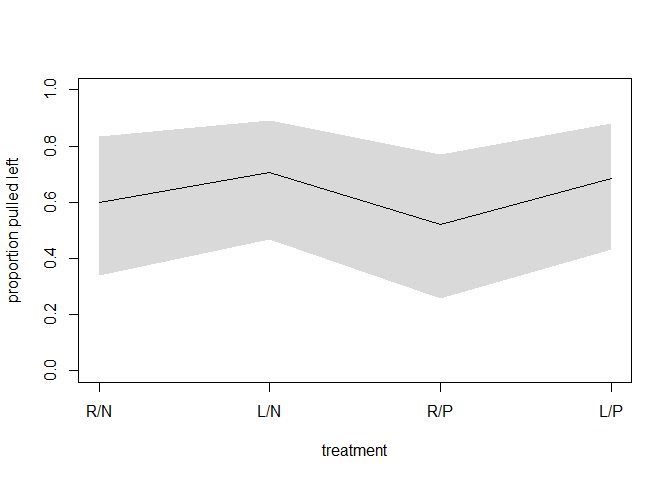
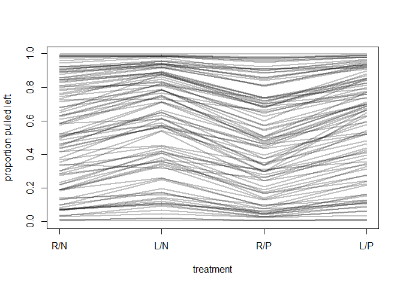

## 13.3. More than one type of cluster
### 13.3.1. Multilevel chimpanzees.


```r
## R code 13.21
library(rethinking)
```

```
## Loading required package: rstan
```

```
## Loading required package: StanHeaders
```

```
## Loading required package: ggplot2
```

```
## rstan (Version 2.19.2, GitRev: 2e1f913d3ca3)
```

```
## For execution on a local, multicore CPU with excess RAM we recommend calling
## options(mc.cores = parallel::detectCores()).
## To avoid recompilation of unchanged Stan programs, we recommend calling
## rstan_options(auto_write = TRUE)
```

```
## For improved execution time, we recommend calling
## Sys.setenv(LOCAL_CPPFLAGS = '-march=native')
## although this causes Stan to throw an error on a few processors.
```

```
## Loading required package: parallel
```

```
## Loading required package: dagitty
```

```
## rethinking (Version 1.93)
```

```
## 
## Attaching package: 'rethinking'
```

```
## The following object is masked from 'package:stats':
## 
##     rstudent
```

```r
data(chimpanzees)
d <- chimpanzees
d$treatment <- 1 + d$prosoc_left + 2*d$condition

dat_list <- list(
    pulled_left = d$pulled_left,
    actor = d$actor,
    block_id = d$block,
    treatment = as.integer(d$treatment) )

set.seed(13)
m13.4 <- ulam(
    alist(
        pulled_left ~ dbinom( 1 , p ) ,
        logit(p) <- a[actor] + g[block_id] + b[treatment] ,
        b[treatment] ~ dnorm( 0 , 0.5 ),
        # adaptive priors
        a[actor] ~ dnorm( a_bar , sigma_a ),
        g[block_id] ~ dnorm( 0 , sigma_g ),
        # hyper-priors
        a_bar ~ dnorm( 0 , 1.5 ),
        sigma_a ~ dexp(1),
        sigma_g ~ dexp(1)
    ) , data=dat_list , chains=4 , cores=4 , log_lik=TRUE )
```

```
## Warning: There were 24 divergent transitions after warmup. Increasing adapt_delta above 0.95 may help. See
## http://mc-stan.org/misc/warnings.html#divergent-transitions-after-warmup
```

```
## Warning: Examine the pairs() plot to diagnose sampling problems
```

```
## Warning: Bulk Effective Samples Size (ESS) is too low, indicating posterior means and medians may be unreliable.
## Running the chains for more iterations may help. See
## http://mc-stan.org/misc/warnings.html#bulk-ess
```

```
## Warning: Tail Effective Samples Size (ESS) is too low, indicating posterior variances and tail quantiles may be unreliable.
## Running the chains for more iterations may help. See
## http://mc-stan.org/misc/warnings.html#tail-ess
```

```r
## R code 13.22
precis( m13.4 , depth=2 )
```

```
##                 mean        sd        5.5%       94.5%     n_eff      Rhat
## b[1]    -0.112761067 0.2823087 -0.57464354  0.32092827  472.4293 1.0078608
## b[2]     0.410645387 0.2774033 -0.02887855  0.86513909  542.0725 1.0074341
## b[3]    -0.469874238 0.2928014 -0.93889557  0.01841116  482.1282 1.0037434
## b[4]     0.294424713 0.2751794 -0.13518119  0.75653305  534.5180 1.0041813
## a[1]    -0.377327514 0.3411655 -0.92124476  0.16886741  531.0093 1.0035647
## a[2]     4.705128810 1.2666378  2.96904381  6.98163386  421.9008 1.0054777
## a[3]    -0.675959009 0.3431944 -1.23285455 -0.13157250  511.1059 1.0056197
## a[4]    -0.669540846 0.3478204 -1.23262676 -0.09631699  540.6085 1.0044601
## a[5]    -0.359605435 0.3403171 -0.90744247  0.16634459  459.4849 1.0091287
## a[6]     0.561135179 0.3379476  0.02153840  1.12636258  634.8554 1.0041206
## a[7]     2.106137753 0.4379219  1.41328872  2.80061427  748.2065 1.0023496
## g[1]    -0.167384062 0.2140507 -0.58076510  0.07659745  426.8409 1.0063861
## g[2]     0.033649426 0.1758615 -0.23537556  0.33234718 1188.3371 1.0008259
## g[3]     0.049396809 0.1743267 -0.20233017  0.35679671  966.2159 1.0007366
## g[4]     0.009402496 0.1736596 -0.25957504  0.29681790 1334.3659 0.9989770
## g[5]    -0.031121765 0.1742340 -0.32748407  0.21751107  971.8778 1.0009452
## g[6]     0.107360425 0.1866136 -0.12045448  0.44853900  836.1990 1.0076862
## a_bar    0.559149327 0.7186636 -0.57150509  1.72598809 1264.8910 0.9997591
## sigma_a  2.025209407 0.6269141  1.22228514  3.18733920  922.4164 0.9995841
## sigma_g  0.209890778 0.1688883  0.02246143  0.50993036  218.7816 1.0186134
```

```r
plot( precis(m13.4,depth=2) ) # also plot
```

<!-- -->

```r
## R code 13.23
set.seed(14)
m13.5 <- ulam(
    alist(
        pulled_left ~ dbinom( 1 , p ) ,
        logit(p) <- a[actor] + b[treatment] ,
        b[treatment] ~ dnorm( 0 , 0.5 ),
        a[actor] ~ dnorm( a_bar , sigma_a ),
        a_bar ~ dnorm( 0 , 1.5 ),
        sigma_a ~ dexp(1)
    ) , data=dat_list , chains=4 , cores=4 , log_lik=TRUE )

## R code 13.24
compare( m13.4 , m13.5 )
```

```
##           WAIC       SE     dWAIC      dSE    pWAIC    weight
## m13.5 531.2631 19.25395 0.0000000       NA  8.56021 0.5903696
## m13.4 531.9941 19.35657 0.7309866 1.647153 10.52643 0.4096304
```

### 13.3.2. Even more clusters.


```r
## R code 13.25
set.seed(15)
m13.6 <- ulam(
    alist(
        pulled_left ~ dbinom( 1 , p ) ,
        logit(p) <- a[actor] + g[block_id] + b[treatment] ,
        b[treatment] ~ dnorm( 0 , sigma_b ),
        a[actor] ~ dnorm( a_bar , sigma_a ),
        g[block_id] ~ dnorm( 0 , sigma_g ),
        a_bar ~ dnorm( 0 , 1.5 ),
        sigma_a ~ dexp(1),
        sigma_g ~ dexp(1),
        sigma_b ~ dexp(1)
    ) , data=dat_list , chains=4 , cores=4 , log_lik=TRUE )
```

```
## Warning: There were 9 divergent transitions after warmup. Increasing adapt_delta above 0.95 may help. See
## http://mc-stan.org/misc/warnings.html#divergent-transitions-after-warmup
```

```
## Warning: Examine the pairs() plot to diagnose sampling problems
```

```
## Warning: Bulk Effective Samples Size (ESS) is too low, indicating posterior means and medians may be unreliable.
## Running the chains for more iterations may help. See
## http://mc-stan.org/misc/warnings.html#bulk-ess
```

```
## Warning: Tail Effective Samples Size (ESS) is too low, indicating posterior variances and tail quantiles may be unreliable.
## Running the chains for more iterations may help. See
## http://mc-stan.org/misc/warnings.html#tail-ess
```

```r
coeftab(m13.4,m13.6)
```

```
##         m13.4   m13.6  
## b[1]      -0.11   -0.12
## b[2]       0.41    0.38
## b[3]      -0.47   -0.44
## b[4]       0.29    0.27
## a[1]      -0.38   -0.36
## a[2]       4.71    4.67
## a[3]      -0.68   -0.66
## a[4]      -0.67   -0.67
## a[5]      -0.36   -0.35
## a[6]       0.56    0.59
## a[7]       2.11    2.09
## g[1]      -0.17   -0.18
## g[2]       0.03    0.04
## g[3]       0.05    0.05
## g[4]       0.01    0.00
## g[5]      -0.03   -0.03
## g[6]       0.11    0.11
## a_bar      0.56    0.63
## sigma_a    2.03    2.00
## sigma_g    0.21    0.21
## sigma_b      NA    0.56
## nobs        504     504
```

## 13.4. Divergent transitions and non-centered priors
### 13.4.1. Th e Devil’s Funnel.

```r
## R code 13.26
m13x <- ulam(
    alist(
        v ~ normal(0,3),
        x ~ normal(0,exp(v))
    ), data=list(N=1) , chains=4 )
```

```
## 
## SAMPLING FOR MODEL 'fff578696261a99633d3513a7b3dd058' NOW (CHAIN 1).
## Chain 1: 
## Chain 1: Gradient evaluation took 0 seconds
## Chain 1: 1000 transitions using 10 leapfrog steps per transition would take 0 seconds.
## Chain 1: Adjust your expectations accordingly!
## Chain 1: 
## Chain 1: 
## Chain 1: Iteration:   1 / 1000 [  0%]  (Warmup)
## Chain 1: Iteration: 100 / 1000 [ 10%]  (Warmup)
## Chain 1: Iteration: 200 / 1000 [ 20%]  (Warmup)
## Chain 1: Iteration: 300 / 1000 [ 30%]  (Warmup)
## Chain 1: Iteration: 400 / 1000 [ 40%]  (Warmup)
## Chain 1: Iteration: 500 / 1000 [ 50%]  (Warmup)
## Chain 1: Iteration: 501 / 1000 [ 50%]  (Sampling)
## Chain 1: Iteration: 600 / 1000 [ 60%]  (Sampling)
## Chain 1: Iteration: 700 / 1000 [ 70%]  (Sampling)
## Chain 1: Iteration: 800 / 1000 [ 80%]  (Sampling)
## Chain 1: Iteration: 900 / 1000 [ 90%]  (Sampling)
## Chain 1: Iteration: 1000 / 1000 [100%]  (Sampling)
## Chain 1: 
## Chain 1:  Elapsed Time: 0.051 seconds (Warm-up)
## Chain 1:                0.053 seconds (Sampling)
## Chain 1:                0.104 seconds (Total)
## Chain 1: 
## 
## SAMPLING FOR MODEL 'fff578696261a99633d3513a7b3dd058' NOW (CHAIN 2).
## Chain 2: 
## Chain 2: Gradient evaluation took 0 seconds
## Chain 2: 1000 transitions using 10 leapfrog steps per transition would take 0 seconds.
## Chain 2: Adjust your expectations accordingly!
## Chain 2: 
## Chain 2: 
## Chain 2: Iteration:   1 / 1000 [  0%]  (Warmup)
## Chain 2: Iteration: 100 / 1000 [ 10%]  (Warmup)
## Chain 2: Iteration: 200 / 1000 [ 20%]  (Warmup)
## Chain 2: Iteration: 300 / 1000 [ 30%]  (Warmup)
## Chain 2: Iteration: 400 / 1000 [ 40%]  (Warmup)
## Chain 2: Iteration: 500 / 1000 [ 50%]  (Warmup)
## Chain 2: Iteration: 501 / 1000 [ 50%]  (Sampling)
## Chain 2: Iteration: 600 / 1000 [ 60%]  (Sampling)
## Chain 2: Iteration: 700 / 1000 [ 70%]  (Sampling)
## Chain 2: Iteration: 800 / 1000 [ 80%]  (Sampling)
## Chain 2: Iteration: 900 / 1000 [ 90%]  (Sampling)
## Chain 2: Iteration: 1000 / 1000 [100%]  (Sampling)
## Chain 2: 
## Chain 2:  Elapsed Time: 0.045 seconds (Warm-up)
## Chain 2:                0.036 seconds (Sampling)
## Chain 2:                0.081 seconds (Total)
## Chain 2: 
## 
## SAMPLING FOR MODEL 'fff578696261a99633d3513a7b3dd058' NOW (CHAIN 3).
## Chain 3: 
## Chain 3: Gradient evaluation took 0 seconds
## Chain 3: 1000 transitions using 10 leapfrog steps per transition would take 0 seconds.
## Chain 3: Adjust your expectations accordingly!
## Chain 3: 
## Chain 3: 
## Chain 3: Iteration:   1 / 1000 [  0%]  (Warmup)
## Chain 3: Iteration: 100 / 1000 [ 10%]  (Warmup)
## Chain 3: Iteration: 200 / 1000 [ 20%]  (Warmup)
## Chain 3: Iteration: 300 / 1000 [ 30%]  (Warmup)
## Chain 3: Iteration: 400 / 1000 [ 40%]  (Warmup)
## Chain 3: Iteration: 500 / 1000 [ 50%]  (Warmup)
## Chain 3: Iteration: 501 / 1000 [ 50%]  (Sampling)
## Chain 3: Iteration: 600 / 1000 [ 60%]  (Sampling)
## Chain 3: Iteration: 700 / 1000 [ 70%]  (Sampling)
## Chain 3: Iteration: 800 / 1000 [ 80%]  (Sampling)
## Chain 3: Iteration: 900 / 1000 [ 90%]  (Sampling)
## Chain 3: Iteration: 1000 / 1000 [100%]  (Sampling)
## Chain 3: 
## Chain 3:  Elapsed Time: 0.095 seconds (Warm-up)
## Chain 3:                0.132 seconds (Sampling)
## Chain 3:                0.227 seconds (Total)
## Chain 3: 
## 
## SAMPLING FOR MODEL 'fff578696261a99633d3513a7b3dd058' NOW (CHAIN 4).
## Chain 4: 
## Chain 4: Gradient evaluation took 0 seconds
## Chain 4: 1000 transitions using 10 leapfrog steps per transition would take 0 seconds.
## Chain 4: Adjust your expectations accordingly!
## Chain 4: 
## Chain 4: 
## Chain 4: Iteration:   1 / 1000 [  0%]  (Warmup)
## Chain 4: Iteration: 100 / 1000 [ 10%]  (Warmup)
## Chain 4: Iteration: 200 / 1000 [ 20%]  (Warmup)
## Chain 4: Iteration: 300 / 1000 [ 30%]  (Warmup)
## Chain 4: Iteration: 400 / 1000 [ 40%]  (Warmup)
## Chain 4: Iteration: 500 / 1000 [ 50%]  (Warmup)
## Chain 4: Iteration: 501 / 1000 [ 50%]  (Sampling)
## Chain 4: Iteration: 600 / 1000 [ 60%]  (Sampling)
## Chain 4: Iteration: 700 / 1000 [ 70%]  (Sampling)
## Chain 4: Iteration: 800 / 1000 [ 80%]  (Sampling)
## Chain 4: Iteration: 900 / 1000 [ 90%]  (Sampling)
## Chain 4: Iteration: 1000 / 1000 [100%]  (Sampling)
## Chain 4: 
## Chain 4:  Elapsed Time: 0.058 seconds (Warm-up)
## Chain 4:                0.039 seconds (Sampling)
## Chain 4:                0.097 seconds (Total)
## Chain 4:
```

```
## Warning: There were 50 divergent transitions after warmup. Increasing adapt_delta above 0.95 may help. See
## http://mc-stan.org/misc/warnings.html#divergent-transitions-after-warmup
```

```
## Warning: Examine the pairs() plot to diagnose sampling problems
```

```
## Warning: The largest R-hat is 1.19, indicating chains have not mixed.
## Running the chains for more iterations may help. See
## http://mc-stan.org/misc/warnings.html#r-hat
```

```
## Warning: Bulk Effective Samples Size (ESS) is too low, indicating posterior means and medians may be unreliable.
## Running the chains for more iterations may help. See
## http://mc-stan.org/misc/warnings.html#bulk-ess
```

```
## Warning: Tail Effective Samples Size (ESS) is too low, indicating posterior variances and tail quantiles may be unreliable.
## Running the chains for more iterations may help. See
## http://mc-stan.org/misc/warnings.html#tail-ess
```

```r
precis(m13x)
```

```
##       mean         sd       5.5%     94.5%    n_eff     Rhat
## v 1.788473   1.790886  -1.101687  4.724127 22.74029 1.189305
## x 7.876515 133.234694 -48.204000 26.888076 82.68750 1.056487
```

```r
## R code 13.27
m13y <- ulam(
    alist(
        v ~ normal(0,3),
        z ~ normal(0,1),
        gq> real[1]:x <<- z*exp(v)
    ), data=list(N=1) , chains=4 )
```

```
## 
## SAMPLING FOR MODEL '4a42b40d41299fdf0f9cfa79945a92b4' NOW (CHAIN 1).
## Chain 1: 
## Chain 1: Gradient evaluation took 0 seconds
## Chain 1: 1000 transitions using 10 leapfrog steps per transition would take 0 seconds.
## Chain 1: Adjust your expectations accordingly!
## Chain 1: 
## Chain 1: 
## Chain 1: Iteration:   1 / 1000 [  0%]  (Warmup)
## Chain 1: Iteration: 100 / 1000 [ 10%]  (Warmup)
## Chain 1: Iteration: 200 / 1000 [ 20%]  (Warmup)
## Chain 1: Iteration: 300 / 1000 [ 30%]  (Warmup)
## Chain 1: Iteration: 400 / 1000 [ 40%]  (Warmup)
## Chain 1: Iteration: 500 / 1000 [ 50%]  (Warmup)
## Chain 1: Iteration: 501 / 1000 [ 50%]  (Sampling)
## Chain 1: Iteration: 600 / 1000 [ 60%]  (Sampling)
## Chain 1: Iteration: 700 / 1000 [ 70%]  (Sampling)
## Chain 1: Iteration: 800 / 1000 [ 80%]  (Sampling)
## Chain 1: Iteration: 900 / 1000 [ 90%]  (Sampling)
## Chain 1: Iteration: 1000 / 1000 [100%]  (Sampling)
## Chain 1: 
## Chain 1:  Elapsed Time: 0.02 seconds (Warm-up)
## Chain 1:                0.015 seconds (Sampling)
## Chain 1:                0.035 seconds (Total)
## Chain 1: 
## 
## SAMPLING FOR MODEL '4a42b40d41299fdf0f9cfa79945a92b4' NOW (CHAIN 2).
## Chain 2: 
## Chain 2: Gradient evaluation took 0 seconds
## Chain 2: 1000 transitions using 10 leapfrog steps per transition would take 0 seconds.
## Chain 2: Adjust your expectations accordingly!
## Chain 2: 
## Chain 2: 
## Chain 2: Iteration:   1 / 1000 [  0%]  (Warmup)
## Chain 2: Iteration: 100 / 1000 [ 10%]  (Warmup)
## Chain 2: Iteration: 200 / 1000 [ 20%]  (Warmup)
## Chain 2: Iteration: 300 / 1000 [ 30%]  (Warmup)
## Chain 2: Iteration: 400 / 1000 [ 40%]  (Warmup)
## Chain 2: Iteration: 500 / 1000 [ 50%]  (Warmup)
## Chain 2: Iteration: 501 / 1000 [ 50%]  (Sampling)
## Chain 2: Iteration: 600 / 1000 [ 60%]  (Sampling)
## Chain 2: Iteration: 700 / 1000 [ 70%]  (Sampling)
## Chain 2: Iteration: 800 / 1000 [ 80%]  (Sampling)
## Chain 2: Iteration: 900 / 1000 [ 90%]  (Sampling)
## Chain 2: Iteration: 1000 / 1000 [100%]  (Sampling)
## Chain 2: 
## Chain 2:  Elapsed Time: 0.019 seconds (Warm-up)
## Chain 2:                0.012 seconds (Sampling)
## Chain 2:                0.031 seconds (Total)
## Chain 2: 
## 
## SAMPLING FOR MODEL '4a42b40d41299fdf0f9cfa79945a92b4' NOW (CHAIN 3).
## Chain 3: 
## Chain 3: Gradient evaluation took 0 seconds
## Chain 3: 1000 transitions using 10 leapfrog steps per transition would take 0 seconds.
## Chain 3: Adjust your expectations accordingly!
## Chain 3: 
## Chain 3: 
## Chain 3: Iteration:   1 / 1000 [  0%]  (Warmup)
## Chain 3: Iteration: 100 / 1000 [ 10%]  (Warmup)
## Chain 3: Iteration: 200 / 1000 [ 20%]  (Warmup)
## Chain 3: Iteration: 300 / 1000 [ 30%]  (Warmup)
## Chain 3: Iteration: 400 / 1000 [ 40%]  (Warmup)
## Chain 3: Iteration: 500 / 1000 [ 50%]  (Warmup)
## Chain 3: Iteration: 501 / 1000 [ 50%]  (Sampling)
## Chain 3: Iteration: 600 / 1000 [ 60%]  (Sampling)
## Chain 3: Iteration: 700 / 1000 [ 70%]  (Sampling)
## Chain 3: Iteration: 800 / 1000 [ 80%]  (Sampling)
## Chain 3: Iteration: 900 / 1000 [ 90%]  (Sampling)
## Chain 3: Iteration: 1000 / 1000 [100%]  (Sampling)
## Chain 3: 
## Chain 3:  Elapsed Time: 0.014 seconds (Warm-up)
## Chain 3:                0.011 seconds (Sampling)
## Chain 3:                0.025 seconds (Total)
## Chain 3: 
## 
## SAMPLING FOR MODEL '4a42b40d41299fdf0f9cfa79945a92b4' NOW (CHAIN 4).
## Chain 4: 
## Chain 4: Gradient evaluation took 0 seconds
## Chain 4: 1000 transitions using 10 leapfrog steps per transition would take 0 seconds.
## Chain 4: Adjust your expectations accordingly!
## Chain 4: 
## Chain 4: 
## Chain 4: Iteration:   1 / 1000 [  0%]  (Warmup)
## Chain 4: Iteration: 100 / 1000 [ 10%]  (Warmup)
## Chain 4: Iteration: 200 / 1000 [ 20%]  (Warmup)
## Chain 4: Iteration: 300 / 1000 [ 30%]  (Warmup)
## Chain 4: Iteration: 400 / 1000 [ 40%]  (Warmup)
## Chain 4: Iteration: 500 / 1000 [ 50%]  (Warmup)
## Chain 4: Iteration: 501 / 1000 [ 50%]  (Sampling)
## Chain 4: Iteration: 600 / 1000 [ 60%]  (Sampling)
## Chain 4: Iteration: 700 / 1000 [ 70%]  (Sampling)
## Chain 4: Iteration: 800 / 1000 [ 80%]  (Sampling)
## Chain 4: Iteration: 900 / 1000 [ 90%]  (Sampling)
## Chain 4: Iteration: 1000 / 1000 [100%]  (Sampling)
## Chain 4: 
## Chain 4:  Elapsed Time: 0.014 seconds (Warm-up)
## Chain 4:                0.011 seconds (Sampling)
## Chain 4:                0.025 seconds (Total)
## Chain 4:
```

```r
precis(m13y)
```

```
##           mean         sd       5.5%     94.5%    n_eff      Rhat
## v -0.004837237   2.986358  -4.721583  4.782778 1451.434 1.0002226
## z -0.026031294   1.020832  -1.641904  1.636944 1300.617 1.0002317
## x  0.079432313 280.013449 -23.859800 22.795624 1606.695 0.9994503
```

### 13.4.2. Non-centered chimpanzees.


```r
## R code 13.28
set.seed(13)
m13.4b <- ulam( m13.4 , chains=4 , cores=4 , control=list(adapt_delta=0.99) )
```

```
## Warning: There were 1 divergent transitions after warmup. Increasing adapt_delta above 0.99 may help. See
## http://mc-stan.org/misc/warnings.html#divergent-transitions-after-warmup
```

```
## Warning: Examine the pairs() plot to diagnose sampling problems
```

```
## Warning: Bulk Effective Samples Size (ESS) is too low, indicating posterior means and medians may be unreliable.
## Running the chains for more iterations may help. See
## http://mc-stan.org/misc/warnings.html#bulk-ess
```

```
## Warning: Tail Effective Samples Size (ESS) is too low, indicating posterior variances and tail quantiles may be unreliable.
## Running the chains for more iterations may help. See
## http://mc-stan.org/misc/warnings.html#tail-ess
```

```r
divergent(m13.4b)
```

```
## [1] 1
```

```r
## R code 13.29
set.seed(13)
m13.4nc <- ulam(
    alist(
        pulled_left ~ dbinom( 1 , p ) ,
        logit(p) <- a_bar + z[actor]*sigma_a + # actor intercepts
                    x[block_id]*sigma_g +      # block intercepts
                    b[treatment] ,
        b[treatment] ~ dnorm( 0 , 0.5 ),
        z[actor] ~ dnorm( 0 , 1 ),
        x[block_id] ~ dnorm( 0 , 1 ),
        a_bar ~ dnorm( 0 , 1.5 ),
        sigma_a ~ dexp(1),
        sigma_g ~ dexp(1)
    ) , data=dat_list , chains=4 , cores=4 )

## R code 13.30
neff_c <- precis( m13.4 , depth=2 )[['n_eff']]
neff_nc <- precis( m13.4nc , depth=2 )[['n_eff']]
par_names <- rownames( precis( m13.4 , depth=2 ) )
neff_table <- cbind( neff_c , neff_nc )
rownames(neff_table) <- par_names
round(t(neff_table))
```

```
##         b[1] b[2] b[3] b[4] a[1] a[2] a[3] a[4] a[5] a[6] a[7] g[1] g[2] g[3]
## neff_c   472  542  482  535  531  422  511  541  459  635  748  427 1188  966
## neff_nc 1221 1188 1233 1228  524  871  528  524  525  553  548 1314 1754 2023
##         g[4] g[5] g[6] a_bar sigma_a sigma_g
## neff_c  1334  972  836  1265     922     219
## neff_nc 1874 2086 1498   564     601     888
```

## 13.5. Multilevel posterior predictions
### 13.5.1. Posterior prediction for same clusters.


```r
## R code 13.31
chimp <- 2
d_pred <- list(
    actor = rep(chimp,4),
    treatment = 1:4,
    block_id = rep(1,4)
)
p <- link( m13.4 , data=d_pred )
p_mu <- apply( p , 2 , mean )
p_ci <- apply( p , 2 , PI )

## R code 13.32
post <- extract.samples(m13.4)
str(post)
```

```
## List of 6
##  $ b      : num [1:2000, 1:4] 0.0776 0.018 0.3024 -0.8338 -0.0441 ...
##  $ a      : num [1:2000, 1:7] -0.11 -0.587 -0.829 -0.191 -0.311 ...
##  $ g      : num [1:2000, 1:6] -0.48662 -0.00664 -0.0374 -0.02611 -0.17384 ...
##  $ a_bar  : num [1:2000(1d)] 0.68 0.538 1.791 0.319 0.441 ...
##  $ sigma_a: num [1:2000(1d)] 0.881 2.357 1.766 2.433 1.776 ...
##  $ sigma_g: num [1:2000(1d)] 0.3771 0.0148 0.0514 0.0601 0.1755 ...
##  - attr(*, "source")= chr "ulam posterior: 2000 samples from m13.4"
```

```r
## R code 13.33
dens( post$a[,5] )
```

<!-- -->

```r
## R code 13.34
p_link <- function( treatment , actor=1 , block_id=1 ) {
    logodds <- with( post ,
        a[,actor] + g[,block_id] + b[,treatment] )
    return( inv_logit(logodds) )
}

## R code 13.35
p_raw <- sapply( 1:4 , function(i) p_link( i , actor=2 , block_id=1 ) )
p_mu <- apply( p_raw , 2 , mean )
p_ci <- apply( p_raw , 2 , PI )
```

### 13.5.2. Posterior prediction for new clusters.


```r
## R code 13.36
p_link_abar <- function( treatment ) {
    logodds <- with( post , a_bar + b[,treatment] )
    return( inv_logit(logodds) )
}

## R code 13.37
p_raw <- sapply( 1:4 , function(i) p_link_abar( i ) )
p_mu <- apply( p_raw , 2 , mean )
p_ci <- apply( p_raw , 2 , PI )

plot( NULL , xlab="treatment" , ylab="proportion pulled left" ,
    ylim=c(0,1) , xaxt="n" , xlim=c(1,4) )
axis( 1 , at=1:4 , labels=c("R/N","L/N","R/P","L/P") )
lines( 1:4 , p_mu )
shade( p_ci , 1:4 )
```

<!-- -->

```r
## R code 13.38
a_sim <- with( post , rnorm( length(post$a_bar) , a_bar , sigma_a ) )
p_link_asim <- function( treatment ) {
    logodds <- with( post , a_sim + b[,treatment] )
    return( inv_logit(logodds) )
}
p_raw_asim <- sapply( 1:4 , function(i) p_link_asim( i ) )

## R code 13.39
plot( NULL , xlab="treatment" , ylab="proportion pulled left" ,
    ylim=c(0,1) , xaxt="n" , xlim=c(1,4) )
axis( 1 , at=1:4 , labels=c("R/N","L/N","R/P","L/P") )
for ( i in 1:100 ) lines( 1:4 , p_raw_asim[i,] , col=col.alpha("black",0.25) , lwd=2 )
```

<!-- -->

## 13.6. Summary
