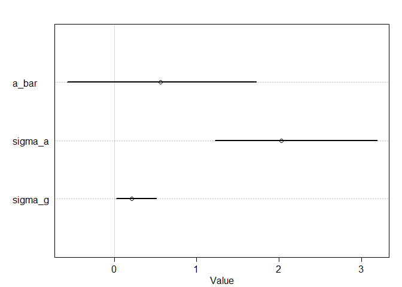
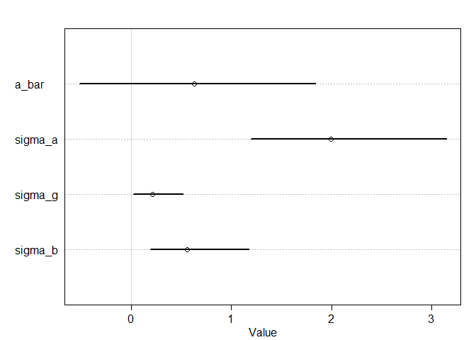
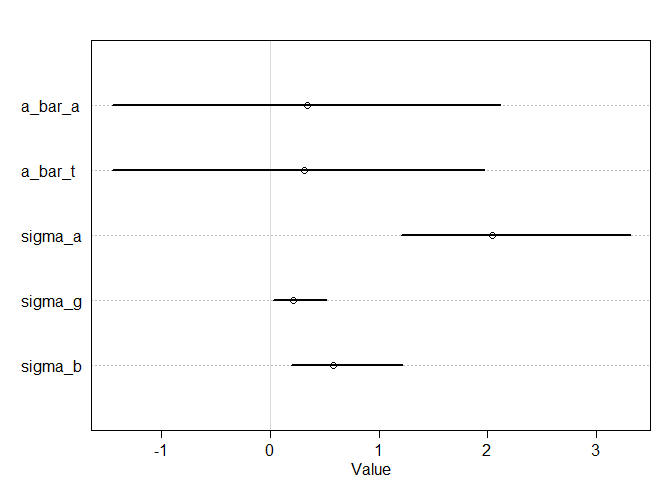
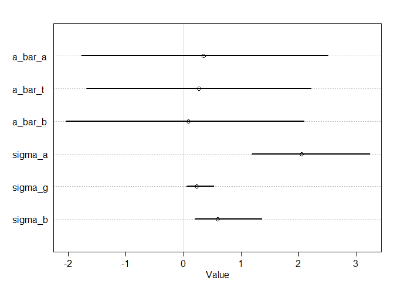
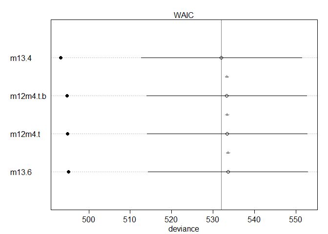
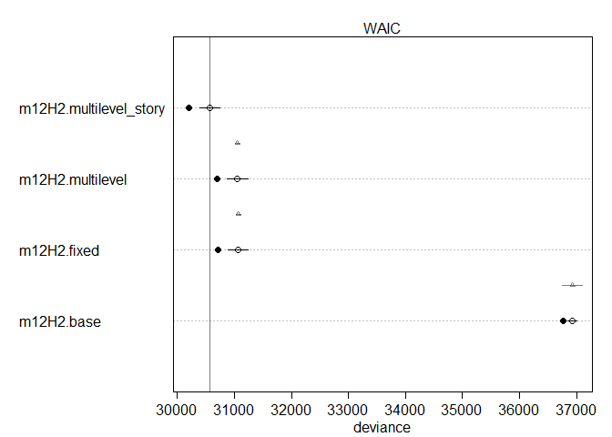

#### 12M4. Fit the following cross-classified multilevel model to the chimpanzees data:

L i ∼ Binomial(1, p i)
logit(p i) = α
actor[i] + α
block[i] + (βP + βPC C i)P i
αactor ∼ Normal(α, σactor)
αblock ∼ Normal(γ, σblock)
α, γ, βP, βPC ∼ Normal(0, 10)
σactor, σblock ∼ HalfCauchy(0, 1)

#### Each of the parameters in those comma-separated lists gets the same independent prior. Compare the posterior distribution to that produced by the similar cross-classified model from the chapter. Also compare the number of effective samples. Can you explain the differences?


```r
library(rethinking)
```

```
## Loading required package: rstan
```

```
## Loading required package: StanHeaders
```

```
## Loading required package: ggplot2
```

```
## rstan (Version 2.19.2, GitRev: 2e1f913d3ca3)
```

```
## For execution on a local, multicore CPU with excess RAM we recommend calling
## options(mc.cores = parallel::detectCores()).
## To avoid recompilation of unchanged Stan programs, we recommend calling
## rstan_options(auto_write = TRUE)
```

```
## For improved execution time, we recommend calling
## Sys.setenv(LOCAL_CPPFLAGS = '-march=native')
## although this causes Stan to throw an error on a few processors.
```

```
## Loading required package: parallel
```

```
## Loading required package: dagitty
```

```
## rethinking (Version 1.93)
```

```
## 
## Attaching package: 'rethinking'
```

```
## The following object is masked from 'package:stats':
## 
##     rstudent
```

```r
data(chimpanzees)
d <- chimpanzees
d$treatment <- 1 + d$prosoc_left + 2*d$condition
str(d)
```

```
## 'data.frame':	504 obs. of  9 variables:
##  $ actor       : int  1 1 1 1 1 1 1 1 1 1 ...
##  $ recipient   : int  NA NA NA NA NA NA NA NA NA NA ...
##  $ condition   : int  0 0 0 0 0 0 0 0 0 0 ...
##  $ block       : int  1 1 1 1 1 1 2 2 2 2 ...
##  $ trial       : int  2 4 6 8 10 12 14 16 18 20 ...
##  $ prosoc_left : int  0 0 1 0 1 1 1 1 0 0 ...
##  $ chose_prosoc: int  1 0 0 1 1 1 0 0 1 1 ...
##  $ pulled_left : int  0 1 0 0 1 1 0 0 0 0 ...
##  $ treatment   : num  1 1 2 1 2 2 2 2 1 1 ...
```

```r
head(d)
```

```
##   actor recipient condition block trial prosoc_left chose_prosoc pulled_left
## 1     1        NA         0     1     2           0            1           0
## 2     1        NA         0     1     4           0            0           1
## 3     1        NA         0     1     6           1            0           0
## 4     1        NA         0     1     8           0            1           0
## 5     1        NA         0     1    10           1            1           1
## 6     1        NA         0     1    12           1            1           1
##   treatment
## 1         1
## 2         1
## 3         2
## 4         1
## 5         2
## 6         2
```


```r
## R code 13.21
dat_list <- list(
    pulled_left = d$pulled_left,
    actor = d$actor,
    block_id = d$block,
    treatment = as.integer(d$treatment) )

set.seed(13)
m13.4 <- ulam(
    alist(
        pulled_left ~ dbinom( 1 , p ) ,
        logit(p) <- a[actor] + g[block_id] + b[treatment] ,
        b[treatment] ~ dnorm( 0 , 0.5 ),
        # adaptive priors
        a[actor] ~ dnorm( a_bar , sigma_a ),
        g[block_id] ~ dnorm( 0 , sigma_g ),
        # hyper-priors
        a_bar ~ dnorm( 0 , 1.5 ),
        sigma_a ~ dexp(1),
        sigma_g ~ dexp(1)
    ) , data=dat_list , chains=4 , cores=4 , log_lik=TRUE )
```

```
## Warning: There were 24 divergent transitions after warmup. Increasing adapt_delta above 0.95 may help. See
## http://mc-stan.org/misc/warnings.html#divergent-transitions-after-warmup
```

```
## Warning: Examine the pairs() plot to diagnose sampling problems
```

```
## Warning: Bulk Effective Samples Size (ESS) is too low, indicating posterior means and medians may be unreliable.
## Running the chains for more iterations may help. See
## http://mc-stan.org/misc/warnings.html#bulk-ess
```

```
## Warning: Tail Effective Samples Size (ESS) is too low, indicating posterior variances and tail quantiles may be unreliable.
## Running the chains for more iterations may help. See
## http://mc-stan.org/misc/warnings.html#tail-ess
```

```r
precis(m13.4)
```

```
## 17 vector or matrix parameters hidden. Use depth=2 to show them.
```

```
##              mean        sd        5.5%     94.5%     n_eff      Rhat
## a_bar   0.5591493 0.7186636 -0.57150509 1.7259881 1264.8910 0.9997591
## sigma_a 2.0252094 0.6269141  1.22228514 3.1873392  922.4164 0.9995841
## sigma_g 0.2098908 0.1688883  0.02246143 0.5099304  218.7816 1.0186134
```

```r
plot(m13.4)
```

```
## 17 vector or matrix parameters hidden. Use depth=2 to show them.
```

<!-- -->


```r
## R code 13.25
set.seed(15)
m13.6 <- ulam(
    alist(
        pulled_left ~ dbinom( 1 , p ) ,
        logit(p) <- a[actor] + g[block_id] + b[treatment] ,
        b[treatment] ~ dnorm( 0 , sigma_b ),
        a[actor] ~ dnorm( a_bar , sigma_a ),
        g[block_id] ~ dnorm( 0 , sigma_g ),
        a_bar ~ dnorm( 0 , 1.5 ),
        sigma_a ~ dexp(1),
        sigma_g ~ dexp(1),
        sigma_b ~ dexp(1)
    ) , data=dat_list , chains=4 , cores=4 , log_lik=TRUE )
```

```
## Warning: There were 9 divergent transitions after warmup. Increasing adapt_delta above 0.95 may help. See
## http://mc-stan.org/misc/warnings.html#divergent-transitions-after-warmup
```

```
## Warning: Examine the pairs() plot to diagnose sampling problems
```

```
## Warning: Bulk Effective Samples Size (ESS) is too low, indicating posterior means and medians may be unreliable.
## Running the chains for more iterations may help. See
## http://mc-stan.org/misc/warnings.html#bulk-ess
```

```
## Warning: Tail Effective Samples Size (ESS) is too low, indicating posterior variances and tail quantiles may be unreliable.
## Running the chains for more iterations may help. See
## http://mc-stan.org/misc/warnings.html#tail-ess
```

```r
precis(m13.6)
```

```
## 17 vector or matrix parameters hidden. Use depth=2 to show them.
```

```
##              mean        sd        5.5%     94.5%    n_eff     Rhat
## a_bar   0.6307859 0.7401280 -0.51683176 1.8373848 839.4933 1.003949
## sigma_a 1.9985478 0.6396338  1.19392764 3.1469007 768.4710 1.006860
## sigma_g 0.2116424 0.1706083  0.02356149 0.5151707 138.0675 1.019168
## sigma_b 0.5611936 0.3270982  0.19143944 1.1725532 743.9150 1.002496
```

```r
plot(m13.6)
```

```
## 17 vector or matrix parameters hidden. Use depth=2 to show them.
```

<!-- -->


```r
set.seed(15)
m12m4.t <- ulam(
    alist(
        pulled_left ~ dbinom( 1 , p ) ,
        logit(p) <- a[actor] + g[block_id] + b[treatment] ,
        b[treatment] ~ dnorm( a_bar_t , sigma_b ),
        a[actor] ~ dnorm( a_bar_a , sigma_a ),
        g[block_id] ~ dnorm( 0 , sigma_g ),
        a_bar_a ~ dnorm( 0 , 1.5 ),
        a_bar_t ~ dnorm( 0 , 1.5 ),
        sigma_a ~ dexp(1),
        sigma_g ~ dexp(1),
        sigma_b ~ dexp(1)
    ) , data=dat_list , chains=4 , cores=4 , log_lik=TRUE )
```

```
## Warning: There were 1 divergent transitions after warmup. Increasing adapt_delta above 0.95 may help. See
## http://mc-stan.org/misc/warnings.html#divergent-transitions-after-warmup
```

```
## Warning: There were 337 transitions after warmup that exceeded the maximum treedepth. Increase max_treedepth above 10. See
## http://mc-stan.org/misc/warnings.html#maximum-treedepth-exceeded
```

```
## Warning: Examine the pairs() plot to diagnose sampling problems
```

```
## Warning: The largest R-hat is 1.06, indicating chains have not mixed.
## Running the chains for more iterations may help. See
## http://mc-stan.org/misc/warnings.html#r-hat
```

```
## Warning: Bulk Effective Samples Size (ESS) is too low, indicating posterior means and medians may be unreliable.
## Running the chains for more iterations may help. See
## http://mc-stan.org/misc/warnings.html#bulk-ess
```

```
## Warning: Tail Effective Samples Size (ESS) is too low, indicating posterior variances and tail quantiles may be unreliable.
## Running the chains for more iterations may help. See
## http://mc-stan.org/misc/warnings.html#tail-ess
```

```r
precis(m12m4.t)
```

```
## 17 vector or matrix parameters hidden. Use depth=2 to show them.
```

```
##              mean        sd        5.5%     94.5%     n_eff      Rhat
## a_bar_a 0.3374487 1.1216018 -1.45371637 2.1206635  363.1529 1.0024140
## a_bar_t 0.3111895 1.0781367 -1.45118237 1.9699901  220.2543 1.0052069
## sigma_a 2.0459567 0.6773811  1.20297150 3.3116732  788.8575 0.9991416
## sigma_g 0.2129702 0.1660225  0.02456518 0.5184002  209.4530 1.0334386
## sigma_b 0.5799345 0.3632798  0.19802930 1.2193477 1158.1693 1.0004050
```

```r
plot(m12m4.t)
```

```
## 17 vector or matrix parameters hidden. Use depth=2 to show them.
```

<!-- -->


```r
set.seed(15)
m12m4.t.b <- ulam(
    alist(
        pulled_left ~ dbinom( 1 , p ) ,
        logit(p) <- a[actor] + g[block_id] + b[treatment] ,
        b[treatment] ~ dnorm( a_bar_t , sigma_b ),
        a[actor] ~ dnorm( a_bar_a , sigma_a ),
        g[block_id] ~ dnorm( a_bar_b , sigma_g ),
        a_bar_a ~ dnorm( 0 , 1.5 ),
        a_bar_t ~ dnorm( 0 , 1.5 ),
        a_bar_b ~ dnorm( 0 , 1.5 ),
        sigma_a ~ dexp(1),
        sigma_g ~ dexp(1),
        sigma_b ~ dexp(1)
    ) , data=dat_list , chains=4 , cores=4 , log_lik=TRUE )
```

```
## Warning: There were 57 divergent transitions after warmup. Increasing adapt_delta above 0.95 may help. See
## http://mc-stan.org/misc/warnings.html#divergent-transitions-after-warmup
```

```
## Warning: Examine the pairs() plot to diagnose sampling problems
```

```
## Warning: Bulk Effective Samples Size (ESS) is too low, indicating posterior means and medians may be unreliable.
## Running the chains for more iterations may help. See
## http://mc-stan.org/misc/warnings.html#bulk-ess
```

```
## Warning: Tail Effective Samples Size (ESS) is too low, indicating posterior variances and tail quantiles may be unreliable.
## Running the chains for more iterations may help. See
## http://mc-stan.org/misc/warnings.html#tail-ess
```

```r
precis(m12m4.t.b)
```

```
## 17 vector or matrix parameters hidden. Use depth=2 to show them.
```

```
##               mean        sd        5.5%     94.5%    n_eff     Rhat
## a_bar_a 0.35616401 1.3580484 -1.78033963 2.5084306 345.3006 1.005238
## a_bar_t 0.26511258 1.2204215 -1.68599130 2.2148836 299.3699 1.001485
## a_bar_b 0.08932501 1.3065581 -2.04320144 2.0976362 229.7086 1.006250
## sigma_a 2.04900719 0.6800875  1.19016603 3.2302626 677.0715 1.006119
## sigma_g 0.22710394 0.1646381  0.05376366 0.5210314 374.4571 1.008533
## sigma_b 0.59936453 0.3848055  0.19771522 1.3617681 702.9539 1.003555
```

```r
plot(m12m4.t.b)
```

```
## 17 vector or matrix parameters hidden. Use depth=2 to show them.
```

<!-- -->


```r
compare(m13.4, m13.6, m12m4.t, m12m4.t.b)
```

```
##               WAIC       SE    dWAIC       dSE    pWAIC    weight
## m13.4     531.9941 19.35657 0.000000        NA 10.52643 0.4058237
## m12m4.t.b 533.3199 19.30775 1.325852 0.4441508 11.22342 0.2091377
## m12m4.t   533.3815 19.26806 1.387397 0.4683970 11.07130 0.2028000
## m13.6     533.5953 19.23744 1.601205 0.4918044 11.16650 0.1822386
```

```r
plot(compare(m13.4, m13.6, m12m4.t, m12m4.t.b))
```

<!-- -->


#### 12H3. The Trolley data are also clustered by story, which indicates a unique narrative for each vignette. Define and fit a cross-classified varying intercepts model with both id and story. Use the same ordinary terms as in the previous problem. Compare this model to the previous models. What do you infer about the impact of diff erent stories on responses?


```r
data("Trolley")
d <- Trolley
str(d)
```

```
## 'data.frame':	9930 obs. of  12 variables:
##  $ case     : Factor w/ 30 levels "cfaqu","cfbur",..: 1 2 3 4 5 6 7 8 9 10 ...
##  $ response : int  4 3 4 3 3 3 5 4 4 4 ...
##  $ order    : int  2 31 16 32 4 9 29 12 23 22 ...
##  $ id       : Factor w/ 331 levels "96;434","96;445",..: 1 1 1 1 1 1 1 1 1 1 ...
##  $ age      : int  14 14 14 14 14 14 14 14 14 14 ...
##  $ male     : int  0 0 0 0 0 0 0 0 0 0 ...
##  $ edu      : Factor w/ 8 levels "Bachelor's Degree",..: 6 6 6 6 6 6 6 6 6 6 ...
##  $ action   : int  0 0 0 0 0 0 1 1 1 1 ...
##  $ intention: int  0 0 0 1 1 1 0 0 0 0 ...
##  $ contact  : int  1 1 1 1 1 1 0 0 0 0 ...
##  $ story    : Factor w/ 12 levels "aqu","boa","box",..: 1 4 8 3 4 11 1 2 3 4 ...
##  $ action2  : int  1 1 1 1 1 1 1 1 1 1 ...
```

```r
summary(d)
```

```
##       case         response         order            id            age       
##  cfaqu  : 331   Min.   :1.000   Min.   : 1.0   96;434 :  30   Min.   :10.00  
##  cfbur  : 331   1st Qu.:3.000   1st Qu.: 9.0   96;445 :  30   1st Qu.:26.00  
##  cfrub  : 331   Median :4.000   Median :16.5   96;451 :  30   Median :36.00  
##  cibox  : 331   Mean   :4.199   Mean   :16.5   96;456 :  30   Mean   :37.49  
##  cibur  : 331   3rd Qu.:6.000   3rd Qu.:24.0   96;458 :  30   3rd Qu.:48.00  
##  cispe  : 331   Max.   :7.000   Max.   :32.0   96;466 :  30   Max.   :72.00  
##  (Other):7944                                  (Other):9750                  
##       male                         edu           action         intention     
##  Min.   :0.000   Bachelor's Degree   :3540   Min.   :0.0000   Min.   :0.0000  
##  1st Qu.:0.000   Some College        :2460   1st Qu.:0.0000   1st Qu.:0.0000  
##  Median :1.000   Master's Degree     :1410   Median :0.0000   Median :0.0000  
##  Mean   :0.574   Graduate Degree     :1050   Mean   :0.4333   Mean   :0.4667  
##  3rd Qu.:1.000   High School Graduate: 870   3rd Qu.:1.0000   3rd Qu.:1.0000  
##  Max.   :1.000   Some High School    : 420   Max.   :1.0000   Max.   :1.0000  
##                  (Other)             : 180                                    
##     contact        story         action2      
##  Min.   :0.0   box    :1324   Min.   :0.0000  
##  1st Qu.:0.0   bur    :1324   1st Qu.:0.0000  
##  Median :0.0   spe    : 993   Median :1.0000  
##  Mean   :0.2   swi    : 993   Mean   :0.6333  
##  3rd Qu.:0.0   aqu    : 662   3rd Qu.:1.0000  
##  Max.   :1.0   boa    : 662   Max.   :1.0000  
##                (Other):3972
```

```r
head(d)
```

```
##    case response order     id age male           edu action intention contact
## 1 cfaqu        4     2 96;434  14    0 Middle School      0         0       1
## 2 cfbur        3    31 96;434  14    0 Middle School      0         0       1
## 3 cfrub        4    16 96;434  14    0 Middle School      0         0       1
## 4 cibox        3    32 96;434  14    0 Middle School      0         1       1
## 5 cibur        3     4 96;434  14    0 Middle School      0         1       1
## 6 cispe        3     9 96;434  14    0 Middle School      0         1       1
##   story action2
## 1   aqu       1
## 2   bur       1
## 3   rub       1
## 4   box       1
## 5   bur       1
## 6   spe       1
```

```r
d$person_id <- as.integer(d$id)
str(d)
```

```
## 'data.frame':	9930 obs. of  13 variables:
##  $ case     : Factor w/ 30 levels "cfaqu","cfbur",..: 1 2 3 4 5 6 7 8 9 10 ...
##  $ response : int  4 3 4 3 3 3 5 4 4 4 ...
##  $ order    : int  2 31 16 32 4 9 29 12 23 22 ...
##  $ id       : Factor w/ 331 levels "96;434","96;445",..: 1 1 1 1 1 1 1 1 1 1 ...
##  $ age      : int  14 14 14 14 14 14 14 14 14 14 ...
##  $ male     : int  0 0 0 0 0 0 0 0 0 0 ...
##  $ edu      : Factor w/ 8 levels "Bachelor's Degree",..: 6 6 6 6 6 6 6 6 6 6 ...
##  $ action   : int  0 0 0 0 0 0 1 1 1 1 ...
##  $ intention: int  0 0 0 1 1 1 0 0 0 0 ...
##  $ contact  : int  1 1 1 1 1 1 0 0 0 0 ...
##  $ story    : Factor w/ 12 levels "aqu","boa","box",..: 1 4 8 3 4 11 1 2 3 4 ...
##  $ action2  : int  1 1 1 1 1 1 1 1 1 1 ...
##  $ person_id: int  1 1 1 1 1 1 1 1 1 1 ...
```

```r
summary(d)
```

```
##       case         response         order            id            age       
##  cfaqu  : 331   Min.   :1.000   Min.   : 1.0   96;434 :  30   Min.   :10.00  
##  cfbur  : 331   1st Qu.:3.000   1st Qu.: 9.0   96;445 :  30   1st Qu.:26.00  
##  cfrub  : 331   Median :4.000   Median :16.5   96;451 :  30   Median :36.00  
##  cibox  : 331   Mean   :4.199   Mean   :16.5   96;456 :  30   Mean   :37.49  
##  cibur  : 331   3rd Qu.:6.000   3rd Qu.:24.0   96;458 :  30   3rd Qu.:48.00  
##  cispe  : 331   Max.   :7.000   Max.   :32.0   96;466 :  30   Max.   :72.00  
##  (Other):7944                                  (Other):9750                  
##       male                         edu           action         intention     
##  Min.   :0.000   Bachelor's Degree   :3540   Min.   :0.0000   Min.   :0.0000  
##  1st Qu.:0.000   Some College        :2460   1st Qu.:0.0000   1st Qu.:0.0000  
##  Median :1.000   Master's Degree     :1410   Median :0.0000   Median :0.0000  
##  Mean   :0.574   Graduate Degree     :1050   Mean   :0.4333   Mean   :0.4667  
##  3rd Qu.:1.000   High School Graduate: 870   3rd Qu.:1.0000   3rd Qu.:1.0000  
##  Max.   :1.000   Some High School    : 420   Max.   :1.0000   Max.   :1.0000  
##                  (Other)             : 180                                    
##     contact        story         action2         person_id  
##  Min.   :0.0   box    :1324   Min.   :0.0000   Min.   :  1  
##  1st Qu.:0.0   bur    :1324   1st Qu.:0.0000   1st Qu.: 83  
##  Median :0.0   spe    : 993   Median :1.0000   Median :166  
##  Mean   :0.2   swi    : 993   Mean   :0.6333   Mean   :166  
##  3rd Qu.:0.0   aqu    : 662   3rd Qu.:1.0000   3rd Qu.:249  
##  Max.   :1.0   boa    : 662   Max.   :1.0000   Max.   :331  
##                (Other):3972
```

```r
head(d)
```

```
##    case response order     id age male           edu action intention contact
## 1 cfaqu        4     2 96;434  14    0 Middle School      0         0       1
## 2 cfbur        3    31 96;434  14    0 Middle School      0         0       1
## 3 cfrub        4    16 96;434  14    0 Middle School      0         0       1
## 4 cibox        3    32 96;434  14    0 Middle School      0         1       1
## 5 cibur        3     4 96;434  14    0 Middle School      0         1       1
## 6 cispe        3     9 96;434  14    0 Middle School      0         1       1
##   story action2 person_id
## 1   aqu       1         1
## 2   bur       1         1
## 3   rub       1         1
## 4   box       1         1
## 5   bur       1         1
## 6   spe       1         1
```


```r
dat <- list(
    R = d$response,
    A = d$action,
    I = d$intention,
    C = d$contact,
    id = d$person_id)
str(dat)
```

```
## List of 5
##  $ R : int [1:9930] 4 3 4 3 3 3 5 4 4 4 ...
##  $ A : int [1:9930] 0 0 0 0 0 0 1 1 1 1 ...
##  $ I : int [1:9930] 0 0 0 1 1 1 0 0 0 0 ...
##  $ C : int [1:9930] 1 1 1 1 1 1 0 0 0 0 ...
##  $ id: int [1:9930] 1 1 1 1 1 1 1 1 1 1 ...
```


```r
## basic model from R code 12.24
m12H2.base <- ulam(
    alist(
        R ~ dordlogit( phi , cutpoints ),
        phi <- bA*A + bC*C + BI*I ,
        BI <- bI + bIA*A + bIC*C ,
        c(bA,bI,bC,bIA,bIC) ~ dnorm( 0 , 0.5 ),
        cutpoints ~ dnorm( 0 , 1.5 )
    ) , data=dat , chains=4 , cores=4 , log_lik=TRUE)
precis( m12H2.base )
```

```
## 6 vector or matrix parameters hidden. Use depth=2 to show them.
```

```
##           mean         sd       5.5%      94.5%     n_eff     Rhat
## bIC -1.2352084 0.09530283 -1.3861077 -1.0820625 1012.2636 1.004404
## bIA -0.4342306 0.07851881 -0.5609974 -0.3127828  873.3452 1.001242
## bC  -0.3434272 0.06713327 -0.4497147 -0.2380040  895.4038 1.005582
## bI  -0.2908824 0.05591493 -0.3793856 -0.2017636  833.5901 1.000570
## bA  -0.4717025 0.05312933 -0.5561480 -0.3860033  847.4339 1.001533
```


```r
## fixed effect model
#try to find out the problem, 1. pair plot
#2. add more sampling
#3. different prior
#4. prior prediction
m12H2.fixed <- ulam(
    alist(
        R ~ dordlogit( phi , cutpoints ),
        phi <- a_person[id] + bA*A + bC*C + BI*I ,
        BI <- bI + bIA*A + bIC*C ,
        c(bA,bI,bC,bIA,bIC) ~ dnorm( 0 , 0.5 ),
        cutpoints ~ dnorm( 0 , 1.5 ),
        a_person[id] ~ dnorm(0, 1.5)
    ) , data=dat , chains=4 , cores=4 , log_lik=TRUE)
```

```
## Warning: Bulk Effective Samples Size (ESS) is too low, indicating posterior means and medians may be unreliable.
## Running the chains for more iterations may help. See
## http://mc-stan.org/misc/warnings.html#bulk-ess
```

```r
precis( m12H2.fixed )
```

```
## 337 vector or matrix parameters hidden. Use depth=2 to show them.
```

```
##           mean         sd       5.5%      94.5%    n_eff      Rhat
## bIC -1.6375505 0.09698824 -1.7917143 -1.4855323 1467.400 0.9999768
## bIA -0.5488242 0.07828924 -0.6705974 -0.4269499 1353.088 1.0024532
## bC  -0.4515455 0.06783962 -0.5611161 -0.3471115 1497.515 1.0000714
## bI  -0.3832527 0.05767254 -0.4740891 -0.2905377 1179.388 1.0020408
## bA  -0.6428043 0.05405297 -0.7295241 -0.5551090 1314.004 1.0023578
```


```r
# multilevel model
m12H2.multilevel <- ulam(
    alist(
        R ~ dordlogit( phi , cutpoints ),
        phi <- a_person[id] + bA*A + bC*C + BI*I ,
        BI <- bI + bIA*A + bIC*C ,
        c(bA,bI,bC,bIA,bIC) ~ dnorm( 0 , 0.5 ),
        cutpoints ~ dnorm( 0 , 1.5 ),
        a_person[id] ~ dnorm(0, sigma),
        sigma ~ dexp( 1 )
    ) , data=dat , chains=4 , cores=4 , log_lik=TRUE)
```

```
## Warning: The largest R-hat is 1.08, indicating chains have not mixed.
## Running the chains for more iterations may help. See
## http://mc-stan.org/misc/warnings.html#r-hat
```

```
## Warning: Bulk Effective Samples Size (ESS) is too low, indicating posterior means and medians may be unreliable.
## Running the chains for more iterations may help. See
## http://mc-stan.org/misc/warnings.html#bulk-ess
```

```
## Warning: Tail Effective Samples Size (ESS) is too low, indicating posterior variances and tail quantiles may be unreliable.
## Running the chains for more iterations may help. See
## http://mc-stan.org/misc/warnings.html#tail-ess
```

```r
precis( m12H2.multilevel )
```

```
## 337 vector or matrix parameters hidden. Use depth=2 to show them.
```

```
##             mean         sd       5.5%      94.5%    n_eff      Rhat
## bIC   -1.6692114 0.10098995 -1.8342488 -1.5131462 1386.147 0.9994391
## bIA   -0.5581124 0.08099650 -0.6893920 -0.4305222 1436.040 1.0007410
## bC    -0.4538225 0.06981802 -0.5607870 -0.3408593 1532.065 1.0006209
## bI    -0.3860526 0.05964256 -0.4802059 -0.2906796 1269.445 0.9997349
## bA    -0.6484994 0.05624286 -0.7396678 -0.5561144 1429.356 1.0011153
## sigma  1.9164170 0.08047468  1.7936863  2.0434253 2613.294 0.9993224
```


```r
# multilevel model+story
d$story_id <- as.integer(d$story)

dat <- list(
    R = d$response,
    A = d$action,
    I = d$intention,
    C = d$contact,
    id = d$person_id,
    story_id = d$story_id)
str(dat)
```

```
## List of 6
##  $ R       : int [1:9930] 4 3 4 3 3 3 5 4 4 4 ...
##  $ A       : int [1:9930] 0 0 0 0 0 0 1 1 1 1 ...
##  $ I       : int [1:9930] 0 0 0 1 1 1 0 0 0 0 ...
##  $ C       : int [1:9930] 1 1 1 1 1 1 0 0 0 0 ...
##  $ id      : int [1:9930] 1 1 1 1 1 1 1 1 1 1 ...
##  $ story_id: int [1:9930] 1 4 8 3 4 11 1 2 3 4 ...
```

```r
m12H2.multilevel_story <- ulam(
    alist(
        R ~ dordlogit( phi , cutpoints ),
        phi <- a_story[story_id] + a_person[id] + bA*A + bC*C + BI*I ,
        BI <- bI + bIA*A + bIC*C ,
        c(bA,bI,bC,bIA,bIC) ~ dnorm( 0 , 0.5 ),
        cutpoints ~ dnorm( 0 , 1.5 ),
        a_person[id] ~ dnorm(0, sigma_p),
        a_story[story_id] ~ dnorm(0, sigma_s),
        sigma_p ~ dexp( 1 ),
        sigma_s ~ dexp( 1 )
    ) , data=dat , chains=4 , cores=4 , log_lik=TRUE)
```

```
## Warning: Bulk Effective Samples Size (ESS) is too low, indicating posterior means and medians may be unreliable.
## Running the chains for more iterations may help. See
## http://mc-stan.org/misc/warnings.html#bulk-ess
```

```
## Warning: Tail Effective Samples Size (ESS) is too low, indicating posterior variances and tail quantiles may be unreliable.
## Running the chains for more iterations may help. See
## http://mc-stan.org/misc/warnings.html#tail-ess
```

```r
precis( m12H2.multilevel_story )
```

```
## 349 vector or matrix parameters hidden. Use depth=2 to show them.
```

```
##               mean         sd       5.5%      94.5%    n_eff      Rhat
## bIC     -1.2837883 0.10850120 -1.4541713 -1.1083883 2117.873 0.9987493
## bIA     -0.5254047 0.08699191 -0.6637983 -0.3860364 2050.150 0.9990058
## bC      -1.0812095 0.09523633 -1.2360722 -0.9312354 1765.260 0.9996197
## bI      -0.4598632 0.06911564 -0.5742330 -0.3491760 2028.969 0.9992645
## bA      -0.8918588 0.06907132 -1.0045290 -0.7859980 1598.689 0.9993746
## sigma_p  1.9680227 0.08290465  1.8365098  2.1007419 2725.388 1.0003013
## sigma_s  0.5359173 0.13219828  0.3713248  0.7569657 1668.373 0.9990565
```


```r
compare(m12H2.base, m12H2.fixed, m12H2.multilevel, m12H2.multilevel_story)
```

```
##                            WAIC        SE     dWAIC       dSE     pWAIC
## m12H2.multilevel_story 30569.05 180.35197    0.0000        NA 367.68992
## m12H2.multilevel       31056.66 179.45797  487.6097  42.66920 356.21199
## m12H2.fixed            31070.04 173.63705  500.9884  42.67054 342.32028
## m12H2.base             36929.07  80.65646 6360.0178 175.30888  10.88163
##                               weight
## m12H2.multilevel_story  1.000000e+00
## m12H2.multilevel       1.308862e-106
## m12H2.fixed            1.628383e-109
## m12H2.base              0.000000e+00
```

```r
plot(compare(m12H2.base, m12H2.fixed, m12H2.multilevel, m12H2.multilevel_story))
```

<!-- -->

