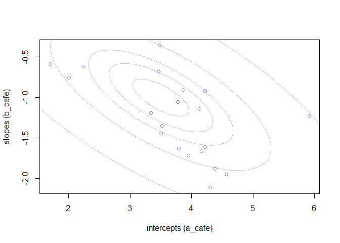
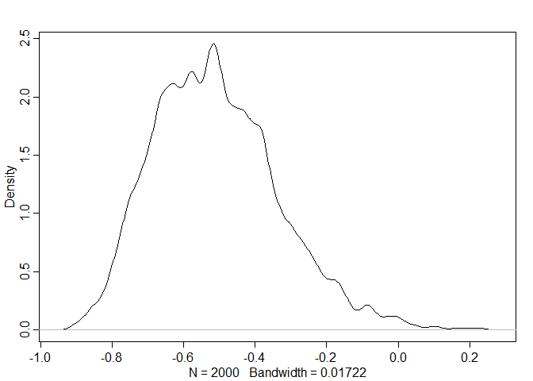
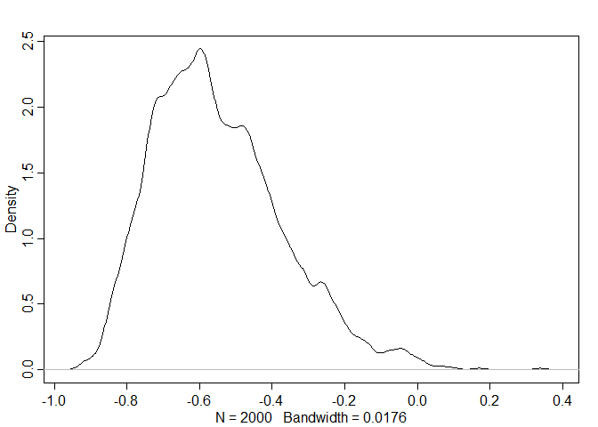
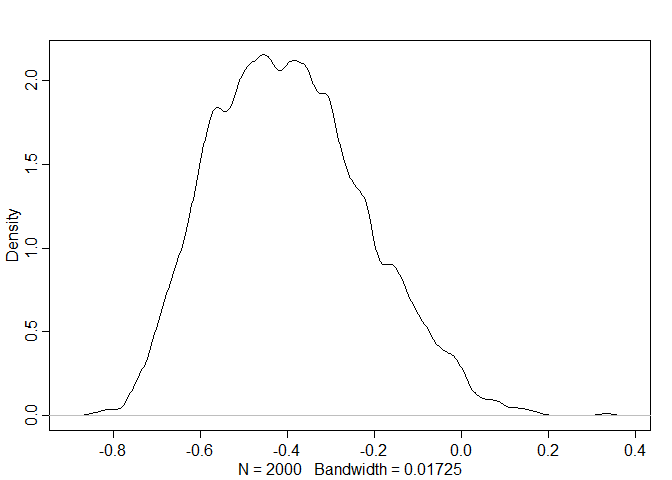
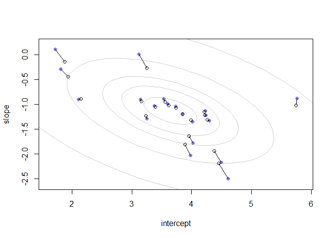
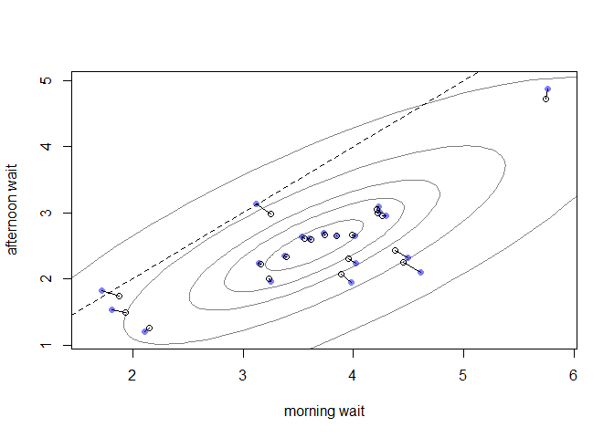
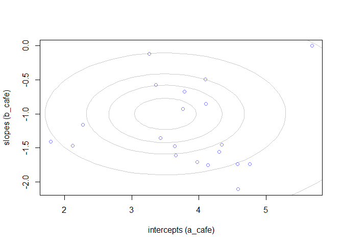
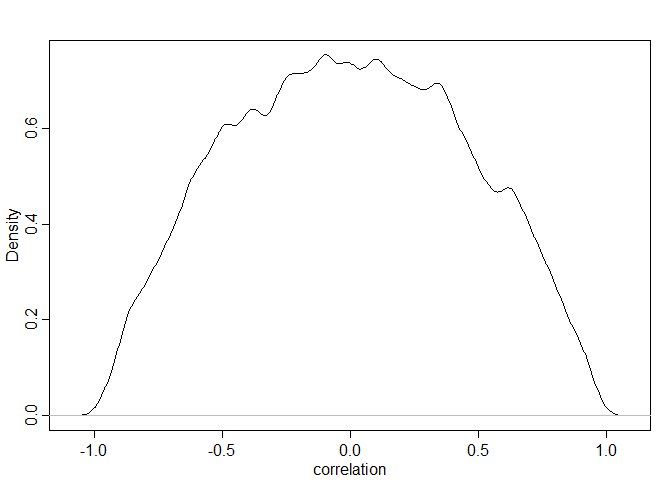

# 14 Adventures in Covariance

## 14.1. Varying slopes by construction

### 14.1.1. Simulate the population.


```r
library(rethinking)
```

```
## Loading required package: rstan
```

```
## Loading required package: StanHeaders
```

```
## Loading required package: ggplot2
```

```
## rstan (Version 2.19.2, GitRev: 2e1f913d3ca3)
```

```
## For execution on a local, multicore CPU with excess RAM we recommend calling
## options(mc.cores = parallel::detectCores()).
## To avoid recompilation of unchanged Stan programs, we recommend calling
## rstan_options(auto_write = TRUE)
```

```
## For improved execution time, we recommend calling
## Sys.setenv(LOCAL_CPPFLAGS = '-march=native')
## although this causes Stan to throw an error on a few processors.
```

```
## Loading required package: parallel
```

```
## Loading required package: dagitty
```

```
## rethinking (Version 1.93)
```

```
## 
## Attaching package: 'rethinking'
```

```
## The following object is masked from 'package:stats':
## 
##     rstudent
```

```r
## R code 14.1
a <- 3.5            # average morning wait time
b <- (-1)           # average difference afternoon wait time
sigma_a <- 1        # std dev in intercepts
sigma_b <- 0.5      # std dev in slopes
rho <- (-0.7)       # correlation between intercepts and slopes

## R code 14.2
Mu <- c( a , b )

## R code 14.3
cov_ab <- sigma_a*sigma_b*rho
Sigma <- matrix( c(sigma_a^2,cov_ab,cov_ab,sigma_b^2) , ncol=2 )

## R code 14.4
matrix( c(1,2,3,4) , nrow=2 , ncol=2 )
```

```
##      [,1] [,2]
## [1,]    1    3
## [2,]    2    4
```

```r
## R code 14.5
sigmas <- c(sigma_a,sigma_b) # standard deviations
Rho <- matrix( c(1,rho,rho,1) , nrow=2 ) # correlation matrix

# now matrix multiply to get covariance matrix
Sigma <- diag(sigmas) %*% Rho %*% diag(sigmas)

## R code 14.6
N_cafes <- 20

## R code 14.7
library(MASS)
set.seed(5) # used to replicate example
vary_effects <- mvrnorm( N_cafes , Mu , Sigma )

## R code 14.8
a_cafe <- vary_effects[,1]
b_cafe <- vary_effects[,2]

## R code 14.9
plot( a_cafe , b_cafe , col=rangi2,
    xlab="intercepts (a_cafe)" , ylab="slopes (b_cafe)" )

# overlay population distribution
library(ellipse)
```

```
## Warning: package 'ellipse' was built under R version 3.6.3
```

```
## 
## Attaching package: 'ellipse'
```

```
## The following object is masked from 'package:rethinking':
## 
##     pairs
```

```
## The following object is masked from 'package:graphics':
## 
##     pairs
```

```r
for ( l in c(0.1,0.3,0.5,0.8,0.99) )
    lines(ellipse(Sigma,centre=Mu,level=l),col=col.alpha("black",0.2))
```

<!-- -->

### 14.1.2. Simulate observations.


```r
## R code 14.10
set.seed(22)
N_visits <- 10
afternoon <- rep(0:1,N_visits*N_cafes/2)
cafe_id <- rep( 1:N_cafes , each=N_visits )
mu <- a_cafe[cafe_id] + b_cafe[cafe_id]*afternoon
sigma <- 0.5  # std dev within cafes
wait <- rnorm( N_visits*N_cafes , mu , sigma )
d <- data.frame( cafe=cafe_id , afternoon=afternoon , wait=wait )
```

### 14.1.3. The varying slopes model.


```r
## R code 14.11
R <- rlkjcorr( 1e4 , K=2 , eta=2 )
dens( R[,1,2] , xlab="correlation" )
```

<!-- -->


```r
### Rho ~ lkj_corr(2)
## R code 14.12
m14.1 <- ulam(
    alist(
        wait ~ normal( mu , sigma ),
        mu <- a_cafe[cafe] + b_cafe[cafe]*afternoon,
        c(a_cafe,b_cafe)[cafe] ~ multi_normal( c(a,b) , Rho , sigma_cafe ),
        a ~ normal(5,2),
        b ~ normal(-1,0.5),
        sigma_cafe ~ exponential(1),
        sigma ~ exponential(1),
        Rho ~ lkj_corr(2)
    ) , data=d , chains=4 , cores=4, log_lik = TRUE )

## R code 14.13
post <- extract.samples(m14.1)
dens( post$Rho[,1,2] )
```

<!-- -->

```r
precis(m14.1)
```

```
## 46 vector or matrix parameters hidden. Use depth=2 to show them.
```

```
##             mean         sd      5.5%      94.5%    n_eff      Rhat
## a      3.6468261 0.21821411  3.297086  3.9969304 2564.340 0.9987379
## b     -1.1319608 0.14579208 -1.367303 -0.8979367 2314.553 0.9992617
## sigma  0.4739048 0.02684926  0.433027  0.5189561 1702.855 1.0022265
```


```r
### Rho ~ lkj_corr(1)
## R code 14.12
m14.1_c1 <- ulam(
    alist(
        wait ~ normal( mu , sigma ),
        mu <- a_cafe[cafe] + b_cafe[cafe]*afternoon,
        c(a_cafe,b_cafe)[cafe] ~ multi_normal( c(a,b) , Rho , sigma_cafe ),
        a ~ normal(5,2),
        b ~ normal(-1,0.5),
        sigma_cafe ~ exponential(1),
        sigma ~ exponential(1),
        Rho ~ lkj_corr(1)
    ) , data=d , chains=4 , cores=4, log_lik = TRUE )

## R code 14.13
post <- extract.samples(m14.1_c1)
dens( post$Rho[,1,2] )
```

<!-- -->

```r
precis(m14.1_c1)
```

```
## 46 vector or matrix parameters hidden. Use depth=2 to show them.
```

```
##             mean         sd       5.5%      94.5%    n_eff      Rhat
## a      3.6553533 0.22125231  3.3140332  4.0099782 2417.997 0.9992763
## b     -1.1399351 0.14128148 -1.3586341 -0.9118614 2883.671 0.9988086
## sigma  0.4740647 0.02678603  0.4330486  0.5171705 2562.127 1.0011158
```


```r
### Rho ~ lkj_corr(5)
## R code 14.12
m14.1_c5 <- ulam(
    alist(
        wait ~ normal( mu , sigma ),
        mu <- a_cafe[cafe] + b_cafe[cafe]*afternoon,
        c(a_cafe,b_cafe)[cafe] ~ multi_normal( c(a,b) , Rho , sigma_cafe ),
        a ~ normal(5,2),
        b ~ normal(-1,0.5),
        sigma_cafe ~ exponential(1),
        sigma ~ exponential(1),
        Rho ~ lkj_corr(5)
    ) , data=d , chains=4 , cores=4, log_lik = TRUE )

## R code 14.13
post <- extract.samples(m14.1_c5)
dens( post$Rho[,1,2] )
```

<!-- -->

```r
precis(m14.1_c5)
```

```
## 46 vector or matrix parameters hidden. Use depth=2 to show them.
```

```
##            mean         sd       5.5%      94.5%    n_eff      Rhat
## a      3.648945 0.21893177  3.3165434  3.9908264 2398.846 0.9982984
## b     -1.133753 0.14544576 -1.3706509 -0.9004367 2282.692 0.9986514
## sigma  0.473849 0.02658737  0.4339964  0.5177448 1967.775 1.0010761
```


```r
compare(m14.1, m14.1_c1, m14.1_c5)
```

```
##              WAIC       SE     dWAIC       dSE    pWAIC    weight
## m14.1    304.4816 17.66702 0.0000000        NA 32.65088 0.4385114
## m14.1_c1 305.1842 17.65367 0.7026295 0.6356839 32.71520 0.3086078
## m14.1_c5 305.5825 17.80683 1.1009348 0.7992392 33.02008 0.2528808
```


```r
## R code 14.14
# compute unpooled estimates directly from data
a1 <- sapply( 1:N_cafes ,
        function(i) mean(wait[cafe_id==i & afternoon==0]) )
b1 <- sapply( 1:N_cafes ,
        function(i) mean(wait[cafe_id==i & afternoon==1]) ) - a1

# extract posterior means of partially pooled estimates
post <- extract.samples(m14.1)
a2 <- apply( post$a_cafe , 2 , mean )
b2 <- apply( post$b_cafe , 2 , mean )

# plot both and connect with lines
plot( a1 , b1 , xlab="intercept" , ylab="slope" ,
    pch=16 , col=rangi2 , ylim=c( min(b1)-0.1 , max(b1)+0.1 ) ,
    xlim=c( min(a1)-0.1 , max(a1)+0.1 ) )
points( a2 , b2 , pch=1 )
for ( i in 1:N_cafes ) lines( c(a1[i],a2[i]) , c(b1[i],b2[i]) )

## R code 14.15
# compute posterior mean bivariate Gaussian
Mu_est <- c( mean(post$a) , mean(post$b) )
rho_est <- mean( post$Rho[,1,2] )
sa_est <- mean( post$sigma_cafe[,1] )
sb_est <- mean( post$sigma_cafe[,2] )
cov_ab <- sa_est*sb_est*rho_est
Sigma_est <- matrix( c(sa_est^2,cov_ab,cov_ab,sb_est^2) , ncol=2 )

# draw contours
library(ellipse)
for ( l in c(0.1,0.3,0.5,0.8,0.99) )
    lines(ellipse(Sigma_est,centre=Mu_est,level=l),
        col=col.alpha("black",0.2))
```

<!-- -->


```r
## R code 14.16
# convert varying effects to waiting times
wait_morning_1 <- (a1)
wait_afternoon_1 <- (a1 + b1)
wait_morning_2 <- (a2)
wait_afternoon_2 <- (a2 + b2)

# plot both and connect with lines
plot( wait_morning_1 , wait_afternoon_1 , xlab="morning wait" ,
    ylab="afternoon wait" , pch=16 , col=rangi2 ,
    ylim=c( min(wait_afternoon_1)-0.1 , max(wait_afternoon_1)+0.1 ) ,
    xlim=c( min(wait_morning_1)-0.1 , max(wait_morning_1)+0.1 ) )
points( wait_morning_2 , wait_afternoon_2 , pch=1 )
for ( i in 1:N_cafes )
    lines( c(wait_morning_1[i],wait_morning_2[i]) ,
    c(wait_afternoon_1[i],wait_afternoon_2[i]) )
abline( a=0 , b=1 , lty=2 )

## R code 14.17
# now shrinkage distribution by simulation
v <- mvrnorm( 1e4 , Mu_est , Sigma_est )
v[,2] <- v[,1] + v[,2] # calculate afternoon wait
Sigma_est2 <- cov(v)
Mu_est2 <- Mu_est
Mu_est2[2] <- Mu_est[1]+Mu_est[2]

# draw contours
library(ellipse)
for ( l in c(0.1,0.3,0.5,0.8,0.99) )
    lines(ellipse(Sigma_est2,centre=Mu_est2,level=l),
        col=col.alpha("black",0.5))
```

<!-- -->

## 14.7. Practice

### Easy.
#### 14E1. Add to the following model varying slopes on the predictor x.
y i ∼ Normal(µi, σ)
µi = α group[i] + βxi
αgroup ∼ Normal(α, σ α )
α ∼ Normal(0, 10)
β ∼ Normal(0, 1)
σ ∼ HalfCauchy(0, 2)
σ α ∼ HalfCauchy(0, 2)

#### model with varying slopes
y i ∼ Normal(µi, σ)
µi = α group[i] + β group[i]*xi
c(α,β) group[i] ~ MVNormal( c(α,β) , S )
S = diagonal_sigma_matrix * R * diagonal_sigma_matrix
α ∼ Normal(0, 10)
β ∼ Normal(0, 1)
σ ∼ HalfCauchy(0, 2)
σ α ∼ HalfCauchy(0, 2)
σ β ∼ HalfCauchy(0, 2)
R ~ LKJcorr(2) *note:(LKJcorr produces priors matrix of the size N_groups x N_groups)

#### 14E2. Think up a context in which varying intercepts will be positively correlated with varying slopes. Provide a mechanistic explanation for the correlation.

> Lignin_amount_in_cortex ~ a[cultivar] + b[cultivar]*developmental_stage

> Different tomato cultivars accumulate different amount of lignin in their cortex region in response to Cuscuta. Resistant cultivars accumulate more lignin than susceptible cultivars. And, their developmental stages also influence the amount of lignin accumulation. Usually older plants accumulate more lignin in stem.

#### 14E3. When is it possible for a varying slopes model to have fewer effective parameters (as estimated by WAIC or DIC) than the corresponding model with fixed (unpooled) slopes? Explain.

> It might happen when intercepts & slopes are highly correlated across groups. Because we treats correlation between intercepts & slopes independently for each group in the unpooled model; on the other hand, the pooled model relies on common distribution that can reduce the number of parameters.

### Medium.
#### 14M1. Repeat the café robot simulation from the beginning of the chapter. This time, set rho to zero, so that there is no correlation between intercepts and slopes. How does the posterior distribution of the correlation reflect this change in the underlying simulation?


```r
library(rethinking)

## R code 14.1
a <- 3.5            # average morning wait time
b <- (-1)           # average difference afternoon wait time
sigma_a <- 1        # std dev in intercepts
sigma_b <- 0.5      # std dev in slopes
rho <- 0       # correlation between intercepts and slopes

## R code 14.2
Mu <- c( a , b )

## R code 14.3
cov_ab <- sigma_a*sigma_b*rho
Sigma <- matrix( c(sigma_a^2,cov_ab,cov_ab,sigma_b^2) , ncol=2 )

## R code 14.4
matrix( c(1,2,3,4) , nrow=2 , ncol=2 )
```

```
##      [,1] [,2]
## [1,]    1    3
## [2,]    2    4
```

```r
## R code 14.5
sigmas <- c(sigma_a,sigma_b) # standard deviations
Rho <- matrix( c(1,rho,rho,1) , nrow=2 ) # correlation matrix

# now matrix multiply to get covariance matrix
Sigma <- diag(sigmas) %*% Rho %*% diag(sigmas)

## R code 14.6
N_cafes <- 20

## R code 14.7
library(MASS)
set.seed(5) # used to replicate example
vary_effects <- mvrnorm( N_cafes , Mu , Sigma )

## R code 14.8
a_cafe <- vary_effects[,1]
b_cafe <- vary_effects[,2]

## R code 14.9
plot( a_cafe , b_cafe , col=rangi2,
    xlab="intercepts (a_cafe)" , ylab="slopes (b_cafe)" )

# overlay population distribution
library(ellipse)
for ( l in c(0.1,0.3,0.5,0.8,0.99) )
    lines(ellipse(Sigma,centre=Mu,level=l),col=col.alpha("black",0.2))
```

<!-- -->

> Simulate observations.


```r
## R code 14.10
set.seed(22)
N_visits <- 10
afternoon <- rep(0:1,N_visits*N_cafes/2)
cafe_id <- rep( 1:N_cafes , each=N_visits )
mu <- a_cafe[cafe_id] + b_cafe[cafe_id]*afternoon
sigma <- 0.5  # std dev within cafes
wait <- rnorm( N_visits*N_cafes , mu , sigma )
d <- data.frame( cafe=cafe_id , afternoon=afternoon , wait=wait )
```


```r
## R code 14.11
R <- rlkjcorr( 1e4 , K=2 , eta=2 )
dens( R[,1,2] , xlab="correlation" )
```

<!-- -->


```r
### Rho ~ lkj_corr(2)
## R code 14.12
m14M1 <- ulam(
    alist(
        wait ~ normal( mu , sigma ),
        mu <- a_cafe[cafe] + b_cafe[cafe]*afternoon,
        c(a_cafe,b_cafe)[cafe] ~ multi_normal( c(a,b) , Rho , sigma_cafe ),
        a ~ normal(5,2),
        b ~ normal(-1,0.5),
        sigma_cafe ~ exponential(1),
        sigma ~ exponential(1),
        Rho ~ lkj_corr(2)
    ) , data=d , chains=4 , cores=4, log_lik = TRUE )
```

```
## recompiling to avoid crashing R session
```

```r
## R code 14.13
post <- extract.samples(m14.1)
dens( post$Rho[,1,2] )
```

<!-- -->

```r
precis(m14.1)
```

```
## 46 vector or matrix parameters hidden. Use depth=2 to show them.
```

```
##             mean         sd      5.5%      94.5%    n_eff      Rhat
## a      3.6468261 0.21821411  3.297086  3.9969304 2564.340 0.9987379
## b     -1.1319608 0.14579208 -1.367303 -0.8979367 2314.553 0.9992617
## sigma  0.4739048 0.02684926  0.433027  0.5189561 1702.855 1.0022265
```

```r
precis(m14M1)
```

```
## 46 vector or matrix parameters hidden. Use depth=2 to show them.
```

```
##             mean         sd       5.5%      94.5%    n_eff      Rhat
## a      3.7073856 0.22512288  3.3305259  4.0732699 2246.713 0.9996966
## b     -1.1050016 0.15444627 -1.3423515 -0.8650223 2228.737 0.9983529
## sigma  0.4726195 0.02624027  0.4327794  0.5157430 1911.457 0.9987458
```

> there is no correlation between intercepts and slopes.

#### 14M2. Fit this multilevel model to the simulated café data:
W i ∼ Normal(µi, σ)
µi = α café[i] + β café[i] A i
αcafé ∼ Normal(α, σ α )
βcafé ∼ Normal(β, σ β )
α ∼ Normal(0, 10)
β ∼ Normal(0, 10)
σ ∼ HalfCauchy(0, 1)
σ α ∼ HalfCauchy(0, 1)
σ β ∼ HalfCauchy(0, 1)

#### Use WAIC to compare this model to the model from the chapter, the one that uses a multi-variate Gaussian prior. Explain the result.


```r
## R code 14.12
m14M2.1 <- ulam(
    alist(
        wait ~ normal( mu , sigma ),
        mu <- a_cafe[cafe] + b_cafe[cafe]*afternoon,
        a_cafe[cafe] ~ normal(a, a_sigma),
        b_cafe[cafe] ~ normal(b, b_sigma),
        a ~ normal(5,2),
        b ~ normal(-1,0.5),
        sigma ~ exponential(1),
        a_sigma ~ exponential(1),
        b_sigma ~ exponential(1)
    ) , data=d , chains=4 , cores=4, log_lik = TRUE)

precis(m14M2.1)
```

```
## 40 vector or matrix parameters hidden. Use depth=2 to show them.
```

```
##               mean         sd       5.5%      94.5%    n_eff      Rhat
## a        3.7198147 0.22698133  3.3581999  4.0827189 2513.451 0.9986344
## b       -1.1037335 0.14361469 -1.3318676 -0.8721835 2458.293 0.9999257
## sigma    0.4730062 0.02657617  0.4332071  0.5179588 1886.547 0.9989486
## a_sigma  0.9648344 0.17413889  0.7247180  1.2704698 2236.877 0.9991617
## b_sigma  0.6203021 0.13202147  0.4410577  0.8535043 1863.086 1.0005627
```


```r
## R code 14.12
m14M2.2 <- ulam(
    alist(
        wait ~ normal( mu , sigma ),
        mu <- a_cafe[cafe] + b_cafe[cafe]*afternoon,
        a_cafe[cafe] ~ normal(a, a_sigma),
        b_cafe[cafe] ~ normal(b, b_sigma),
        a ~ normal(0,10),
        b ~ normal(0,10),
        sigma ~ dcauchy(0,1),
        a_sigma ~ dcauchy(0,1),
        b_sigma ~ dcauchy(0,1)
    ) , data=d , chains=4 , cores=4, log_lik = TRUE)

precis(m14M2.2)
```

```
## 40 vector or matrix parameters hidden. Use depth=2 to show them.
```

```
##               mean         sd       5.5%      94.5%    n_eff      Rhat
## a        3.6939161 0.22966499  3.3282750  4.0630345 2346.922 0.9994352
## b       -1.1039129 0.15688277 -1.3549144 -0.8640025 2274.832 0.9989832
## sigma    0.4738339 0.02755822  0.4320311  0.5198623 1682.950 1.0017309
## a_sigma  0.9659869 0.16899186  0.7300187  1.2693349 2332.391 0.9988711
## b_sigma  0.6272784 0.13309830  0.4408241  0.8604863 2066.724 0.9990433
```


```r
compare(m14.1, m14M2.1, m14M2.2)
```

```
##             WAIC       SE    dWAIC      dSE    pWAIC    weight
## m14.1   304.4816 17.66702 0.000000       NA 32.65088 0.5872245
## m14M2.1 306.4812 17.88011 1.999628 1.772266 33.67501 0.2160680
## m14M2.2 306.6690 17.81148 2.187378 1.759974 33.79364 0.1967076
```


#### 14M3. Re-estimate the varying slopes model for the UCBadmit data, now using a non-centered parameterization. Compare the efficiency of the forms of the model, using n_eff. Which is better? Which chain sampled faster?

