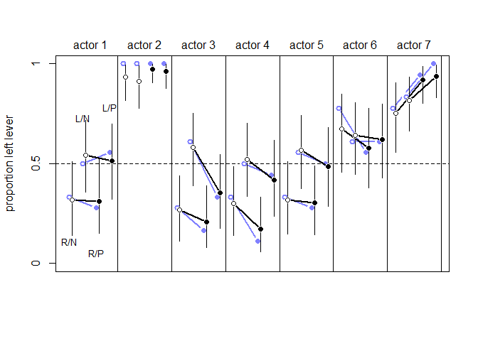
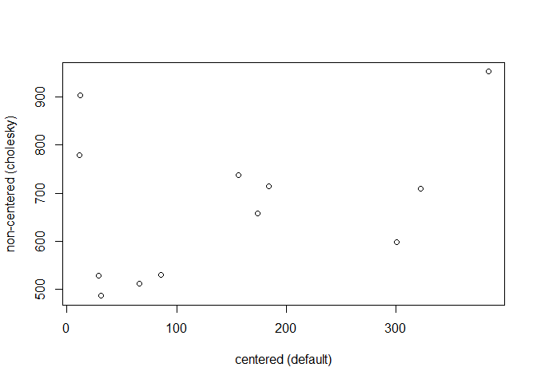

```r
library(rethinking)
```

```
## Loading required package: rstan
```

```
## Loading required package: StanHeaders
```

```
## Loading required package: ggplot2
```

```
## rstan (Version 2.19.2, GitRev: 2e1f913d3ca3)
```

```
## For execution on a local, multicore CPU with excess RAM we recommend calling
## options(mc.cores = parallel::detectCores()).
## To avoid recompilation of unchanged Stan programs, we recommend calling
## rstan_options(auto_write = TRUE)
```

```
## For improved execution time, we recommend calling
## Sys.setenv(LOCAL_CPPFLAGS = '-march=native')
## although this causes Stan to throw an error on a few processors.
```

```
## Loading required package: parallel
```

```
## Loading required package: dagitty
```

```
## rethinking (Version 1.93)
```

```
## 
## Attaching package: 'rethinking'
```

```
## The following object is masked from 'package:stats':
## 
##     rstudent
```

```r
library(MASS)
```


```r
## R code 14.18
data(chimpanzees)
d <- chimpanzees
d$block_id <- d$block
d$treatment <- 1L + d$prosoc_left + 2L*d$condition

dat <- list(
    L = d$pulled_left,
    tid = d$treatment,
    actor = d$actor,
    block_id = as.integer(d$block_id) )

m14.2 <- ulam(
    alist(
        L ~ binomial(1,p),
        logit(p) <- g[tid] + alpha[actor,tid] + beta[block_id,tid],

        # adaptive priors
        vector[4]:alpha[actor] ~ multi_normal(0,Rho_actor,sigma_actor),
        vector[4]:beta[block_id] ~ multi_normal(0,Rho_block,sigma_block),

        # fixed priors
        g[tid] ~ dnorm(0,1),
        sigma_actor ~ dexp(1),
        Rho_actor ~ dlkjcorr(4),
        sigma_block ~ dexp(1),
        Rho_block ~ dlkjcorr(4)
    ) , data=dat , chains=4 , cores=4 )
```

```
## Warning: There were 11 divergent transitions after warmup. Increasing adapt_delta above 0.95 may help. See
## http://mc-stan.org/misc/warnings.html#divergent-transitions-after-warmup
```

```
## Warning: Examine the pairs() plot to diagnose sampling problems
```

```
## Warning: Bulk Effective Samples Size (ESS) is too low, indicating posterior means and medians may be unreliable.
## Running the chains for more iterations may help. See
## http://mc-stan.org/misc/warnings.html#bulk-ess
```

```
## Warning: Tail Effective Samples Size (ESS) is too low, indicating posterior variances and tail quantiles may be unreliable.
## Running the chains for more iterations may help. See
## http://mc-stan.org/misc/warnings.html#tail-ess
```


```r
## R code 14.19
m14.3 <- ulam(
    alist(
        L ~ binomial(1,p),
        logit(p) <- g[tid] + alpha[actor,tid] + beta[block_id,tid],

        # adaptive priors - non-centered
        transpars> matrix[actor,4]:alpha <-
                compose_noncentered( sigma_actor , L_Rho_actor , z_actor ),
        transpars> matrix[block_id,4]:beta <-
                compose_noncentered( sigma_block , L_Rho_block , z_block ),
        matrix[4,actor]:z_actor ~ normal( 0 , 1 ),
        matrix[4,block_id]:z_block ~ normal( 0 , 1 ),

        # fixed priors
        g[tid] ~ normal(0,1),
        vector[4]:sigma_actor ~ dexp(1),
        cholesky_factor_corr[4]:L_Rho_actor ~ lkj_corr_cholesky( 2 ),
        vector[4]:sigma_block ~ dexp(1),
        cholesky_factor_corr[4]:L_Rho_block ~ lkj_corr_cholesky( 2 ),

        # compute ordinary correlation matrixes from Cholesky factors
        gq> matrix[4,4]:Rho_actor <<- multiply_lower_tri_self_transpose(L_Rho_actor),
        gq> matrix[4,4]:Rho_block <<- multiply_lower_tri_self_transpose(L_Rho_block)
    ) , data=dat , chains=4 , cores=4 , log_lik=TRUE )
```


```r
## R code 14.20
# extract n_eff values for each model
neff_nc <- precis(m14.3,3,pars=c("alpha","beta"))$n_eff
neff_c <- precis(m14.2,3,pars=c("alpha","beta"))$n_eff
plot( neff_c , neff_nc , xlab="centered (default)" ,
    ylab="non-centered (cholesky)" , lwd=1.5 )
abline(a=0,b=1,lty=2)
```

<!-- -->


```r
## R code 14.21
precis( m14.2 , depth=2 , pars=c("sigma_actor","sigma_block") )
```

```
##                     mean        sd       5.5%     94.5%     n_eff      Rhat
## sigma_actor[1] 1.4053797 0.5068365 0.78430489 2.3302176 1149.1149 1.0004564
## sigma_actor[2] 0.8925055 0.4033378 0.37800186 1.5959132  832.5455 1.0047874
## sigma_actor[3] 1.8484144 0.5853053 1.08600742 2.9190079 1201.7584 0.9995019
## sigma_actor[4] 1.5768524 0.6126308 0.82176637 2.6617098  915.1332 0.9993323
## sigma_block[1] 0.3979475 0.3372914 0.04073493 1.0374333  282.4454 1.0014845
## sigma_block[2] 0.4329825 0.3531417 0.04343702 1.0205240  288.5243 1.0175282
## sigma_block[3] 0.3039063 0.2648520 0.02321109 0.7986538  245.2216 1.0124949
## sigma_block[4] 0.4970924 0.3784547 0.04788815 1.2002353  263.5025 1.0244486
```

```r
precis( m14.3 , depth=2 , pars=c("sigma_actor","sigma_block") )
```

```
##                     mean        sd       5.5%     94.5%     n_eff      Rhat
## sigma_actor[1] 1.3683958 0.4880611 0.77004855 2.1955326 1083.7600 1.0016529
## sigma_actor[2] 0.9323169 0.4299369 0.40348178 1.7130118 1107.7709 1.0012052
## sigma_actor[3] 1.8525152 0.5791935 1.11830150 2.9067994 1720.5009 0.9987820
## sigma_actor[4] 1.5643982 0.5946499 0.82090376 2.6740858 1371.2927 1.0001891
## sigma_block[1] 0.4033388 0.3173200 0.03163326 1.0050474 1030.2480 0.9996929
## sigma_block[2] 0.4614706 0.3568616 0.04078897 1.1239156  978.0516 1.0020015
## sigma_block[3] 0.2988761 0.2787835 0.02338776 0.8144884 2042.5417 1.0009401
## sigma_block[4] 0.4775734 0.3659464 0.04344742 1.1362540 1133.5870 1.0044034
```

```r
WAIC(m14.3)
```

```
##       WAIC      lppd  penalty  std_err
## 1 545.0296 -245.5355 26.97927 19.62857
```


```r
## R code 14.22
# compute mean for each actor in each treatment
pl <- by( d$pulled_left , list( d$actor , d$treatment ) , mean )

# generate posterior predictions using link
datp <- list(
    actor=rep(1:7,each=4) ,
    tid=rep(1:4,times=7) ,
    block_id=rep(5,times=4*7) )
p_post <- link( m14.3 , data=datp )
p_mu <- apply( p_post , 2 , mean )
p_ci <- apply( p_post , 2 , PI )

# set up plot
plot( NULL , xlim=c(1,28) , ylim=c(0,1) , xlab="" ,
    ylab="proportion left lever" , xaxt="n" , yaxt="n" )
axis( 2 , at=c(0,0.5,1) , labels=c(0,0.5,1) )
abline( h=0.5 , lty=2 )
for ( j in 1:7 ) abline( v=(j-1)*4+4.5 , lwd=0.5 )
for ( j in 1:7 ) text( (j-1)*4+2.5 , 1.1 , concat("actor ",j) , xpd=TRUE )

xo <- 0.1 # offset distance to stagger raw data and predictions
# raw data
for ( j in (1:7)[-2] ) {
    lines( (j-1)*4+c(1,3)-xo , pl[j,c(1,3)] , lwd=2 , col=rangi2 )
    lines( (j-1)*4+c(2,4)-xo , pl[j,c(2,4)] , lwd=2 , col=rangi2 )
}
points( 1:28-xo , t(pl) , pch=16 , col="white" , cex=1.7 )
points( 1:28-xo , t(pl) , pch=c(1,1,16,16) , col=rangi2 , lwd=2 )

yoff <- 0.175
text( 1-xo , pl[1,1]-yoff , "R/N" , pos=1 , cex=0.8 )
text( 2-xo , pl[1,2]+yoff , "L/N" , pos=3 , cex=0.8 )
text( 3-xo , pl[1,3]-yoff , "R/P" , pos=1 , cex=0.8 )
text( 4-xo , pl[1,4]+yoff , "L/P" , pos=3 , cex=0.8 )

# posterior predictions
for ( j in (1:7)[-2] ) {
    lines( (j-1)*4+c(1,3)+xo , p_mu[(j-1)*4+c(1,3)] , lwd=2 )
    lines( (j-1)*4+c(2,4)+xo , p_mu[(j-1)*4+c(2,4)] , lwd=2 )
}
for ( i in 1:28 ) lines( c(i,i)+xo , p_ci[,i] , lwd=1 )
points( 1:28+xo , p_mu , pch=16 , col="white" , cex=1.3 )
points( 1:28+xo , p_mu , pch=c(1,1,16,16) )
```

<!-- -->

## 14.3. Instrumental variables and front doors
### 14.3.1. Instrumental variables.


```r
## R code 14.23
set.seed(73)
N <- 500
U_sim <- rnorm( N )
Q_sim <- sample( 1:4 , size=N , replace=TRUE )
E_sim <- rnorm( N , U_sim + Q_sim )
W_sim <- rnorm( N , U_sim + 0*E_sim )
dat_sim <- list(
    W=standardize(W_sim) ,
    E=standardize(E_sim) ,
    Q=standardize(Q_sim) )
```


```r
## R code 14.24
m14.4 <- ulam(
    alist(
        W ~ dnorm( mu , sigma ),
        mu <- aW + bEW*E,
        aW ~ dnorm( 0 , 0.2 ),
        bEW ~ dnorm( 0 , 0.5 ),
        sigma ~ dexp( 1 )
    ) , data=dat_sim , chains=4 , cores=4 )
precis( m14.4 )
```

```
##               mean         sd       5.5%      94.5%    n_eff      Rhat
## aW    -0.000242611 0.04064180 -0.0661639 0.06426641 1951.946 1.0026192
## bEW    0.398419108 0.04085636  0.3348046 0.46060691 1944.176 0.9992465
## sigma  0.918903898 0.03026494  0.8719642 0.96936890 1382.326 0.9995344
```


```r
## R code 14.25
m14.5 <- ulam(
    alist(
        c(W,E) ~ multi_normal( c(muW,muE) , Rho , Sigma ),
        muW <- aW + bEW*E,
        muE <- aE + bQE*Q,
        c(aW,aE) ~ normal( 0 , 0.2 ),
        c(bEW,bQE) ~ normal( 0 , 0.5 ),
        Rho ~ lkj_corr( 2 ),
        Sigma ~ exponential( 1 )
    ), data=dat_sim , chains=4 , cores=4 )
precis( m14.5 , depth=3 )
```

```
##                   mean           sd        5.5%      94.5%     n_eff      Rhat
## aE       -0.0009462924 3.649156e-02 -0.05861398 0.05569336 1378.3726 1.0005029
## aW       -0.0001773620 4.443351e-02 -0.07158054 0.07050074 1563.2355 0.9989986
## bQE       0.5871297537 3.500801e-02  0.53035407 0.64314854 1111.2260 1.0006733
## bEW      -0.0512556884 7.579855e-02 -0.17192313 0.06818140  716.1019 1.0041687
## Rho[1,1]  1.0000000000 0.000000e+00  1.00000000 1.00000000       NaN       NaN
## Rho[1,2]  0.5434407821 5.193702e-02  0.45610859 0.62520270  730.5277 1.0035508
## Rho[2,1]  0.5434407821 5.193702e-02  0.45610859 0.62520270  730.5277 1.0035508
## Rho[2,2]  1.0000000000 7.243836e-17  1.00000000 1.00000000 1843.4778 0.9979980
## Sigma[1]  1.0244726392 4.702611e-02  0.95610416 1.10487092  729.9842 1.0030199
## Sigma[2]  0.8084673357 2.591288e-02  0.76870509 0.85030113 1586.1319 0.9989154
```


```r
## R code 14.26
m14.4x <- ulam( m14.4 , data=dat_sim , chains=4 , cores=4 )
m14.5x <- ulam( m14.5 , data=dat_sim , chains=4 , cores=4 )

## R code 14.27
set.seed(73)
N <- 500
U_sim <- rnorm( N )
Q_sim <- sample( 1:4 , size=N , replace=TRUE )
E_sim <- rnorm( N , U_sim + Q_sim )
W_sim <- rnorm( N , -U_sim + 0.2*E_sim )
dat_sim <- list(
    W=standardize(W_sim) ,
    E=standardize(E_sim) ,
    Q=standardize(Q_sim) )
```


```r
## R code 14.24
m14.4_2 <- ulam(
    alist(
        W ~ dnorm( mu , sigma ),
        mu <- aW + bEW*E,
        aW ~ dnorm( 0 , 0.2 ),
        bEW ~ dnorm( 0 , 0.5 ),
        sigma ~ dexp( 1 )
    ) , data=dat_sim , chains=4 , cores=4 )
```

```
## recompiling to avoid crashing R session
```

```r
precis( m14.4_2 )
```

```
##                mean         sd        5.5%       94.5%    n_eff     Rhat
## aW     8.972189e-05 0.04347848 -0.07012275  0.06980247 1819.994 1.001898
## bEW   -1.140880e-01 0.04335801 -0.18218471 -0.04707266 1793.423 1.001890
## sigma  9.962962e-01 0.03283347  0.94538285  1.04936165 1828.929 1.000204
```


```r
## R code 14.25
m14.5_2 <- ulam(
    alist(
        c(W,E) ~ multi_normal( c(muW,muE) , Rho , Sigma ),
        muW <- aW + bEW*E,
        muE <- aE + bQE*Q,
        c(aW,aE) ~ normal( 0 , 0.2 ),
        c(bEW,bQE) ~ normal( 0 , 0.5 ),
        Rho ~ lkj_corr( 2 ),
        Sigma ~ exponential( 1 )
    ), data=dat_sim , chains=4 , cores=4 )
```

```
## recompiling to avoid crashing R session
```

```r
precis( m14.5_2 , depth=3 )
```

```
##                   mean           sd        5.5%       94.5%    n_eff      Rhat
## aE        0.0008725869 3.395860e-02 -0.05436436  0.05524612 1653.225 0.9999025
## aW       -0.0008395781 4.654696e-02 -0.07509974  0.07289912 1695.251 0.9999092
## bQE       0.5891700544 3.611664e-02  0.53007611  0.64609509 1631.651 1.0009537
## bEW       0.2870970675 8.289196e-02  0.15915598  0.42220343 1023.494 1.0028381
## Rho[1,1]  1.0000000000 0.000000e+00  1.00000000  1.00000000      NaN       NaN
## Rho[1,2] -0.4633926156 5.959401e-02 -0.55671748 -0.36375344 1025.656 1.0022117
## Rho[2,1] -0.4633926156 5.959401e-02 -0.55671748 -0.36375344 1025.656 1.0022117
## Rho[2,2]  1.0000000000 8.533531e-17  1.00000000  1.00000000 1683.612 0.9979980
## Sigma[1]  1.0762408256 4.666720e-02  1.00663944  1.15370109 1073.198 0.9994651
## Sigma[2]  0.8099578676 2.662630e-02  0.76900216  0.85455436 1517.785 0.9994101
```


```r
## R code 14.28
library(dagitty)
dagIV <- dagitty( "dag{
    E -> W
    E <- U -> W
    Q -> E
}")
instrumentalVariables( dagIV , exposure="E" , outcome="W" )
```

```
##  Q
```

### 14.3.2. Front-door criterion.

## 14.7. Practice

#### 14M3. Re-estimate the varying slopes model for the UCBadmit data, now using a non-centered parameterization. Compare the efficiency of the forms of the model, using n_eff. Which is better? Which chain sampled faster?


```r
## modify from R code 12.2
library(rethinking)
data(UCBadmit)
d <- UCBadmit
d$gid <- ifelse( d$applicant.gender=="male" , 1L , 2L )
d$dept_id <- coerce_index( d$dept )

dat <- list( A=d$admit , App=d$applications, gid=d$gid , did=d$dept_id )
head(dat)
```

```
## $A
##  [1] 512  89 353  17 120 202 138 131  53  94  22  24
## 
## $App
##  [1] 825 108 560  25 325 593 417 375 191 393 373 341
## 
## $gid
##  [1] 1 2 1 2 1 2 1 2 1 2 1 2
## 
## $did
##  [1] 1 1 2 2 3 3 4 4 5 5 6 6
```

```r
m14M3 <- ulam(
    alist(
        A ~ dbinom( App, p ),
        logit(p) <- g[did]+alpha[gid, did],
        
        # adaptive priors
        vector[6]:alpha[gid] ~ multi_normal(0,Rho_gid,sigma_gid),
        
        # fixed priors
        g[did] ~ dnorm( 0 , 1 ),
        sigma_gid ~ dexp(1),
        Rho_gid ~ dlkjcorr(4)
    ), data=dat , chains=4 , cores=4 , log_lik = TRUE)
```

```
## Warning: There were 488 divergent transitions after warmup. Increasing adapt_delta above 0.95 may help. See
## http://mc-stan.org/misc/warnings.html#divergent-transitions-after-warmup
```

```
## Warning: Examine the pairs() plot to diagnose sampling problems
```

```
## Warning: The largest R-hat is 1.54, indicating chains have not mixed.
## Running the chains for more iterations may help. See
## http://mc-stan.org/misc/warnings.html#r-hat
```

```
## Warning: Bulk Effective Samples Size (ESS) is too low, indicating posterior means and medians may be unreliable.
## Running the chains for more iterations may help. See
## http://mc-stan.org/misc/warnings.html#bulk-ess
```

```
## Warning: Tail Effective Samples Size (ESS) is too low, indicating posterior variances and tail quantiles may be unreliable.
## Running the chains for more iterations may help. See
## http://mc-stan.org/misc/warnings.html#tail-ess
```

```r
precis(m14M3, depth=2)
```

```
## 48 matrix parameters hidden. Use depth=3 to show them.
```

```
##                    mean        sd         5.5%      94.5%     n_eff     Rhat
## g[1]          0.6552661 0.5199849 -0.296356801  1.4073260 430.97949 1.019241
## g[2]          0.4879005 0.2918036 -0.006713878  0.9569454 301.08843 1.008740
## g[3]         -0.5525122 0.2552282 -0.857140082 -0.1678376 174.99597 1.029378
## g[4]         -0.6911212 0.2689471 -0.977601366 -0.3267803  51.34721 1.077373
## g[5]         -0.9607672 0.4062635 -1.307015591 -0.1731326 145.76290 1.044954
## g[6]         -2.1529798 0.8747016 -2.845735306 -0.3374131  16.85146 1.125805
## sigma_gid[1]  0.9394780 0.5963512  0.388747097  2.0246435  19.04031 1.079340
## sigma_gid[2]  0.3669011 0.4619837  0.041957325  1.2606337  17.44651 1.096040
## sigma_gid[3]  0.2969962 0.3787698  0.026651252  0.9468593  44.76478 1.061025
## sigma_gid[4]  0.3537891 0.3810342  0.027289265  0.9698447 492.38228 1.009895
## sigma_gid[5]  0.6011549 0.5185883  0.036446961  1.4083749  15.37057 1.111850
## sigma_gid[6]  0.7199007 0.9236529  0.007317527  2.5919000  13.04187 1.137281
```

```r
m14M3_noncentered <- ulam(
    alist(
        A ~ dbinom( App, p ),
        logit(p) <- g[did]+alpha[gid, did],
        
        # adaptive priors - non-centered
        transpars> matrix[gid,6]:alpha <- 
          compose_noncentered( sigma_gid , L_Rho_gid , z_gid ),
        matrix[6,gid]:z_gid ~ normal( 0 , 1 ),
        
        # fixed priors
        g[did] ~ dnorm( 0 , 1 ),
        vector[6]:sigma_gid ~ dexp(1),
        cholesky_factor_corr[6]:L_Rho_gid ~ lkj_corr_cholesky( 2 ),
        
        # compute ordinary correlation matrixes from Cholesky factors
        gq> matrix[6,6]:Rho_gid <<- multiply_lower_tri_self_transpose(L_Rho_gid)
    ), data=dat , chains=4 , cores=4 , log_lik = TRUE)
```

```
## Warning: There were 1 divergent transitions after warmup. Increasing adapt_delta above 0.95 may help. See
## http://mc-stan.org/misc/warnings.html#divergent-transitions-after-warmup
```

```
## Warning: Examine the pairs() plot to diagnose sampling problems
```

```r
precis(m14M3_noncentered, depth=2)
```

```
## 96 matrix parameters hidden. Use depth=3 to show them.
```

```
##                    mean        sd        5.5%       94.5%     n_eff      Rhat
## g[1]          0.6022055 0.6289499 -0.50643800  1.48637445  934.0905 0.9988729
## g[2]          0.4933717 0.3937761 -0.21036964  1.05090263  594.8512 1.0072242
## g[3]         -0.5423420 0.2937029 -0.88435598 -0.03887975  691.3053 1.0011672
## g[4]         -0.6069872 0.3312566 -0.98081644 -0.08629110  529.4043 1.0042382
## g[5]         -0.9369694 0.3876990 -1.36550529 -0.17261173  751.4194 1.0038141
## g[6]         -1.9432294 0.8881846 -2.87102665 -0.17639381  494.7492 1.0083966
## sigma_gid[1]  1.0702718 0.6688493  0.37485743  2.28887023  941.9410 1.0030323
## sigma_gid[2]  0.4687946 0.4940161  0.02765702  1.37791418  949.5341 1.0025923
## sigma_gid[3]  0.3463148 0.4286159  0.01494634  1.09867349  741.8921 1.0024508
## sigma_gid[4]  0.3472887 0.4355598  0.01746949  1.07787735  856.0776 1.0069717
## sigma_gid[5]  0.4568876 0.4967954  0.02244684  1.40072701 1096.4000 1.0071735
## sigma_gid[6]  0.9180469 0.9360000  0.04435777  2.71337673  656.2770 1.0059632
```


```r
compare(m14M3,m14M3_noncentered)
```

```
##                       WAIC       SE     dWAIC     dSE    pWAIC    weight
## m14M3             87.72090 4.438869 0.0000000      NA 5.562483 0.5203779
## m14M3_noncentered 87.88401 4.031557 0.1631137 2.91676 5.519110 0.4796221
```

```r
plot(compare(m14M3,m14M3_noncentered))
```

<!-- -->

```r
#plot(coeftab(m14M3,m14M3_noncentered))
```

> Models look very similar between these two. The non-centered model samples much more efficiently, evidenced by the `n_eff` counts.


```r
## R code 14.20
# extract n_eff values for each model
neff_nc <- precis(m14M3_noncentered,3,pars=c("alpha"))$n_eff
neff_c <- precis(m14M3,3,pars=c("alpha"))$n_eff
plot( neff_c , neff_nc , xlab="centered (default)" ,
    ylab="non-centered (cholesky)" , lwd=1.5 )
abline(a=0,b=1,lty=2)
```

<!-- -->


#### 1. Revisit the Bangladesh fertility data, data(bangladesh). Fit a model with both varying intercepts by district_id and varying slopes of urban (as a 0/1 indicator variable) by district_id. You are still predicting use.contraception. Inspect the correlation between the intercepts and slopes. Can you interpret this correlation, in terms of what it tells you about the pattern of contraceptive use in the sample? It might help to plot the varying effect estimates for both the intercepts and slopes, by district. Then you can visualize the correlation and maybe more easily think through what it means to have a particular correlation. Plotting predicted proportion of women using contraception, in each district, with urban women on one axis and rural on the other, might also help.

> (1) district: ID number of administrative district each woman resided in

> (2) use.contraception: An indicator (0/1) of whether the woman was using contraception

> (3) urban: An indicator (0/1) of whether the woman lived in a city, as opposed to living in a
rural area


```r
data(bangladesh)
d <- bangladesh
head(d)
```

```
##   woman district use.contraception living.children age.centered urban
## 1     1        1                 0               4      18.4400     1
## 2     2        1                 0               1      -5.5599     1
## 3     3        1                 0               3       1.4400     1
## 4     4        1                 0               4       8.4400     1
## 5     5        1                 0               1     -13.5590     1
## 6     6        1                 0               1     -11.5600     1
```

```r
summary(d)
```

```
##      woman           district     use.contraception living.children
##  Min.   :   1.0   Min.   : 1.00   Min.   :0.0000    Min.   :1.000  
##  1st Qu.: 484.2   1st Qu.:14.00   1st Qu.:0.0000    1st Qu.:1.000  
##  Median : 967.5   Median :29.00   Median :0.0000    Median :3.000  
##  Mean   : 967.5   Mean   :29.35   Mean   :0.3925    Mean   :2.652  
##  3rd Qu.:1450.8   3rd Qu.:45.00   3rd Qu.:1.0000    3rd Qu.:4.000  
##  Max.   :1934.0   Max.   :61.00   Max.   :1.0000    Max.   :4.000  
##   age.centered            urban       
##  Min.   :-13.560000   Min.   :0.0000  
##  1st Qu.: -7.559900   1st Qu.:0.0000  
##  Median : -1.559900   Median :0.0000  
##  Mean   :  0.002198   Mean   :0.2906  
##  3rd Qu.:  6.440000   3rd Qu.:1.0000  
##  Max.   : 19.440000   Max.   :1.0000
```

```r
d$did <- as.integer( as.factor(d$district) )

dat_list <- list(
C = d$use.contraception,
D = d$did,
U = d$urban)
summary(dat_list)
```

```
##   Length Class  Mode   
## C 1934   -none- numeric
## D 1934   -none- numeric
## U 1934   -none- numeric
```

```r
str(dat_list)
```

```
## List of 3
##  $ C: int [1:1934] 0 0 0 0 0 0 0 0 0 0 ...
##  $ D: int [1:1934] 1 1 1 1 1 1 1 1 1 1 ...
##  $ U: int [1:1934] 1 1 1 1 1 1 1 1 1 1 ...
```

```r
m14_1 <- ulam(
  alist(
    C ~ dbinom( 1 , p ),
    logit(p) <- a[D] + b[D]*U,
    c(a,b)[D] ~ multi_normal( c(a_bar,b_bar) , Rho , Sigma ),
    a_bar ~ normal(0,1),
    b_bar ~ normal(0,1),
    Rho ~ lkj_corr(2),
    Sigma ~ exponential(1)
    ) , data=dat_list , chains=4 , cores=4 , log_lik = TRUE)
```

```
## Warning: Bulk Effective Samples Size (ESS) is too low, indicating posterior means and medians may be unreliable.
## Running the chains for more iterations may help. See
## http://mc-stan.org/misc/warnings.html#bulk-ess
```

```
## Warning: Tail Effective Samples Size (ESS) is too low, indicating posterior variances and tail quantiles may be unreliable.
## Running the chains for more iterations may help. See
## http://mc-stan.org/misc/warnings.html#tail-ess
```

```r
precis(m14_1, depth=3 , pars=c("Rho","Sigma"))
```

```
##                mean           sd       5.5%      94.5%     n_eff      Rhat
## Rho[1,1]  1.0000000 0.000000e+00  1.0000000  1.0000000       NaN       NaN
## Rho[1,2] -0.6554806 1.551907e-01 -0.8648101 -0.3750117  499.1297 1.0058996
## Rho[2,1] -0.6554806 1.551907e-01 -0.8648101 -0.3750117  499.1297 1.0058996
## Rho[2,2]  1.0000000 5.716652e-17  1.0000000  1.0000000 1859.7799 0.9979980
## Sigma[1]  0.5812115 9.626065e-02  0.4398744  0.7447574  592.7369 0.9999326
## Sigma[2]  0.7900806 1.994913e-01  0.4860201  1.1241375  242.7275 1.0129656
```


```r
## modify from R code 14.14

# extract posterior means of partially pooled estimates
post <- extract.samples(m14_1)
summary(post)
```

```
##       Length Class  Mode   
## b     120000 -none- numeric
## a     120000 -none- numeric
## a_bar   2000 -none- numeric
## b_bar   2000 -none- numeric
## Rho     8000 -none- numeric
## Sigma   4000 -none- numeric
```

```r
a2 <- apply( post$a , 2 , mean )
b2 <- apply( post$b , 2 , mean )

# plot both and connect with lines
plot( a2 , b2 , xlab="intercept" , ylab="slope" ,
    pch=16 , col=rangi2 )

## R code 14.15
# compute posterior mean bivariate Gaussian
Mu <- c( mean(post$a_bar) , mean(post$b_bar) )
rho <- apply( post$Rho , 2:3 , mean )
s <- apply( post$Sigma , 2 , mean )
S <- diag(s) %*% rho %*% diag(s)

# draw contours
library(ellipse)
```

```
## Warning: package 'ellipse' was built under R version 3.6.3
```

```
## 
## Attaching package: 'ellipse'
```

```
## The following object is masked from 'package:rethinking':
## 
##     pairs
```

```
## The following object is masked from 'package:graphics':
## 
##     pairs
```

```r
for ( l in c(0.1,0.3,0.5,0.8,0.99) )
    lines(ellipse(S,centre=Mu,level=l),
        col=col.alpha("black",0.5))
```

<!-- -->

> negative correlation


```r
u0 <- inv_logit( a2 )
u1 <- inv_logit( a2 + b2 )
## change from R code 14.9
plot( u0 , u1 , xlim=c(0,1) , pch=16 , col=rangi2 , ylim=c(0,1) , xlab="urban: 0" , ylab="urban: 1" )
```

<!-- -->

> Urban areas centered at 0.5, rural areas are mostly below 0.5

#### 2. Now consider the predictor variables age.centered and living.children, also contained in data(bangladesh). Suppose that age influences contraceptive use (changing attitudes) and number of children (older people have had more time to have kids). Number of children may also directly influence contraceptive use. Draw a DAG that reflects these hypothetical relationships. Then build models needed to evaluate the DAG. You will need at least two models. Retain district and urban, as in Problem 1. What do you conclude about the causal influence of age and children?


```r
library(rethinking)
library(dagitty)
library(ggdag)
```

```
## 
## Attaching package: 'ggdag'
```

```
## The following object is masked from 'package:ggplot2':
## 
##     expand_scale
```

```
## The following object is masked from 'package:stats':
## 
##     filter
```

```r
# age = A, number of children = N, contraceptive use = C
dag <- dagitty("dag{A -> N -> C <- A}")

ggdag(dag, layout = "circle")
```

<!-- -->


```r
dat_list$children <- scale( d$living.children )
dat_list$age <- scale( d$age.centered )
str(dat_list)
```

```
## List of 5
##  $ C       : int [1:1934] 0 0 0 0 0 0 0 0 0 0 ...
##  $ D       : int [1:1934] 1 1 1 1 1 1 1 1 1 1 ...
##  $ U       : int [1:1934] 1 1 1 1 1 1 1 1 1 1 ...
##  $ children: num [1:1934, 1] 1.08 -1.33 0.28 1.08 -1.33 ...
##   ..- attr(*, "scaled:center")= num 2.65
##   ..- attr(*, "scaled:scale")= num 1.24
##  $ age     : num [1:1934, 1] 2.046 -0.617 0.16 0.936 -1.505 ...
##   ..- attr(*, "scaled:center")= num 0.0022
##   ..- attr(*, "scaled:scale")= num 9.01
```


```r
m14_2_A <- ulam(
  alist(
    C ~ dbinom( 1 , p ),
    logit(p) <- a[D] + b[D]*U + bA*age,
    c(a,b)[D] ~ multi_normal( c(a_bar,b_bar) , Rho , Sigma ),
    a_bar ~ normal(0,1),
    b_bar ~ normal(0,1),
    bA ~ normal(0,1),
    Rho ~ lkj_corr(2),
    Sigma ~ exponential(1)
    ) , data=dat_list , chains=4 , cores=4 , log_lik = TRUE)
```

```
## Warning: Bulk Effective Samples Size (ESS) is too low, indicating posterior means and medians may be unreliable.
## Running the chains for more iterations may help. See
## http://mc-stan.org/misc/warnings.html#bulk-ess
```

```
## Warning: Tail Effective Samples Size (ESS) is too low, indicating posterior variances and tail quantiles may be unreliable.
## Running the chains for more iterations may help. See
## http://mc-stan.org/misc/warnings.html#tail-ess
```

```r
precis(m14_2_A)
```

```
## 126 vector or matrix parameters hidden. Use depth=2 to show them.
```

```
##              mean         sd         5.5%      94.5%     n_eff      Rhat
## a_bar -0.70706097 0.10115705 -0.869891748 -0.5453902 1600.0940 0.9991011
## b_bar  0.69346026 0.16944793  0.423520461  0.9643340  941.4413 1.0028867
## bA     0.08577172 0.04906308  0.006448286  0.1636043 3479.7745 0.9998846
```


```r
m14_2_N <- ulam(
  alist(
    C ~ dbinom( 1 , p ),
    logit(p) <- a[D] + b[D]*U + bN*children,
    c(a,b)[D] ~ multi_normal( c(a_bar,b_bar) , Rho , Sigma ),
    a_bar ~ normal(0,1),
    b_bar ~ normal(0,1),
    bN ~ normal(0,1),
    Rho ~ lkj_corr(2),
    Sigma ~ exponential(1)
    ) , data=dat_list , chains=4 , cores=4 , log_lik = TRUE)
```

```
## Warning: Bulk Effective Samples Size (ESS) is too low, indicating posterior means and medians may be unreliable.
## Running the chains for more iterations may help. See
## http://mc-stan.org/misc/warnings.html#bulk-ess
```

```
## Warning: Tail Effective Samples Size (ESS) is too low, indicating posterior variances and tail quantiles may be unreliable.
## Running the chains for more iterations may help. See
## http://mc-stan.org/misc/warnings.html#tail-ess
```

```r
precis(m14_2_N)
```

```
## 126 vector or matrix parameters hidden. Use depth=2 to show them.
```

```
##             mean        sd       5.5%      94.5%    n_eff      Rhat
## a_bar -0.7329938 0.1046680 -0.9052016 -0.5717538 1485.275 0.9992384
## b_bar  0.7307053 0.1712786  0.4585480  1.0013288 1059.176 0.9988646
## bN     0.3318769 0.0528917  0.2465572  0.4173497 3125.838 0.9990371
```


```r
m14_2_AN <- ulam(
  alist(
    C ~ dbinom( 1 , p ),
    logit(p) <- a[D] + b[D]*U + bA*age + bN*children,
    c(a,b)[D] ~ multi_normal( c(a_bar,b_bar) , Rho , Sigma ),
    a_bar ~ normal(0,1),
    b_bar ~ normal(0,1),
    bA ~ normal(0,1),
    bN ~ normal(0,1),
    Rho ~ lkj_corr(2),
    Sigma ~ exponential(1)
    ) , data=dat_list , chains=4 , cores=4 , log_lik = TRUE)
```

```
## Warning: Bulk Effective Samples Size (ESS) is too low, indicating posterior means and medians may be unreliable.
## Running the chains for more iterations may help. See
## http://mc-stan.org/misc/warnings.html#bulk-ess
```

```
## Warning: Tail Effective Samples Size (ESS) is too low, indicating posterior variances and tail quantiles may be unreliable.
## Running the chains for more iterations may help. See
## http://mc-stan.org/misc/warnings.html#tail-ess
```

```r
precis(m14_2_AN)
```

```
## 126 vector or matrix parameters hidden. Use depth=2 to show them.
```

```
##             mean         sd       5.5%      94.5%     n_eff      Rhat
## a_bar -0.7384125 0.10773434 -0.9109091 -0.5718907  992.2761 1.0010241
## b_bar  0.7549581 0.16636825  0.4929528  1.0287640  683.9958 1.0065616
## bA    -0.2765666 0.07102950 -0.3910823 -0.1613399 1873.4339 1.0008842
## bN     0.5276055 0.07322961  0.4109051  0.6487713 1946.8364 0.9988404
```


```r
compare(m14_2_A,m14_2_N,m14_2_AN)
```

```
##              WAIC       SE    dWAIC       dSE    pWAIC       weight
## m14_2_AN 2412.492 30.69770  0.00000        NA 54.93706 9.993846e-01
## m14_2_N  2427.277 29.96797 14.78520  7.589644 54.25824 6.154123e-04
## m14_2_A  2467.395 28.12411 54.90305 14.596464 53.13880 1.195876e-12
```

```r
plot(compare(m14_2_A,m14_2_N,m14_2_AN))
```

<!-- -->

