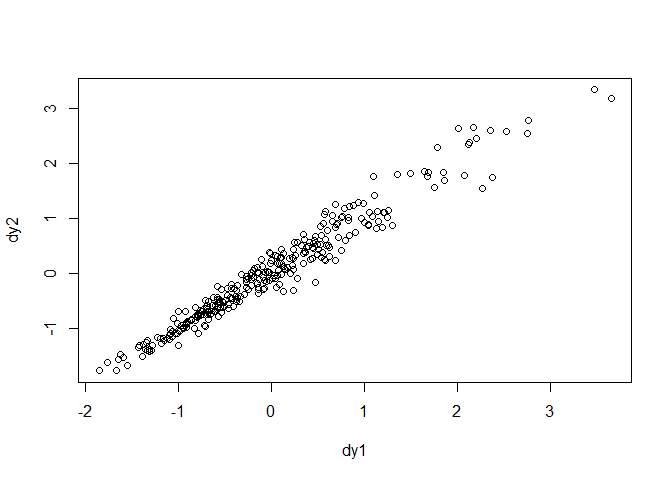

```r
## R code 14.29
library(rethinking)
```

```
## Loading required package: rstan
```

```
## Loading required package: StanHeaders
```

```
## Loading required package: ggplot2
```

```
## rstan (Version 2.19.2, GitRev: 2e1f913d3ca3)
```

```
## For execution on a local, multicore CPU with excess RAM we recommend calling
## options(mc.cores = parallel::detectCores()).
## To avoid recompilation of unchanged Stan programs, we recommend calling
## rstan_options(auto_write = TRUE)
```

```
## For improved execution time, we recommend calling
## Sys.setenv(LOCAL_CPPFLAGS = '-march=native')
## although this causes Stan to throw an error on a few processors.
```

```
## Loading required package: parallel
```

```
## Loading required package: dagitty
```

```
## rethinking (Version 1.93)
```

```
## 
## Attaching package: 'rethinking'
```

```
## The following object is masked from 'package:stats':
## 
##     rstudent
```

```r
data(KosterLeckie)
```


```r
head(kl_dyads)
```

```
##   hidA hidB did giftsAB giftsBA offset drel1 drel2 drel3 drel4 dlndist  dass
## 1    1    2   1       0       4  0.000     0     0     1     0  -2.790 0.000
## 2    1    3   2       6      31 -0.003     0     1     0     0  -2.817 0.044
## 3    1    4   3       2       5 -0.019     0     1     0     0  -1.886 0.025
## 4    1    5   4       4       2  0.000     0     1     0     0  -1.892 0.011
## 5    1    6   5       8       2 -0.003     1     0     0     0  -3.499 0.022
## 6    1    7   6       2       1  0.000     0     0     0     0  -1.853 0.071
##   d0125
## 1     0
## 2     0
## 3     0
## 4     0
## 5     0
## 6     0
```


```r
## R code 14.30
kl_data <- list(
    N = nrow(kl_dyads),
    N_households = max(kl_dyads$hidB),
    did = kl_dyads$did,
    hidA = kl_dyads$hidA,
    hidB = kl_dyads$hidB,
    giftsAB = kl_dyads$giftsAB,
    giftsBA = kl_dyads$giftsBA
)

m14.4 <- ulam(
    alist(
        giftsAB ~ poisson( lambdaAB ),
        giftsBA ~ poisson( lambdaBA ),
        log(lambdaAB) <- a + gr[hidA,1] + gr[hidB,2] + d[did,1] ,
        log(lambdaBA) <- a + gr[hidB,1] + gr[hidA,2] + d[did,2] ,
        a ~ normal(0,1),

       ## gr matrix of varying effects
        vector[2]:gr[N_households] ~ multi_normal(0,Rho_gr,sigma_gr),
        Rho_gr ~ lkj_corr(4),
        sigma_gr ~ exponential(1),

       ## dyad effects
        transpars> matrix[N,2]:d <-
                compose_noncentered( rep_vector(sigma_d,2) , L_Rho_d , z ),
        matrix[2,N]:z ~ normal( 0 , 1 ),
        cholesky_factor_corr[2]:L_Rho_d ~ lkj_corr_cholesky( 8 ),
        sigma_d ~ exponential(1),

       ## compute correlation matrix for dyads
        gq> matrix[2,2]:Rho_d <<- Chol_to_Corr( L_Rho_d )
    ), data=kl_data , chains=4 , cores=4 , iter=2000 )

## R code 14.31
precis( m14.4 , depth=3 , pars=c("Rho_gr","sigma_gr") )
```

```
##                   mean           sd       5.5%       94.5%    n_eff      Rhat
## Rho_gr[1,1]  1.0000000 0.000000e+00  1.0000000  1.00000000      NaN       NaN
## Rho_gr[1,2] -0.4002598 1.969950e-01 -0.6991095 -0.06584151 1696.571 0.9993295
## Rho_gr[2,1] -0.4002598 1.969950e-01 -0.6991095 -0.06584151 1696.571 0.9993295
## Rho_gr[2,2]  1.0000000 8.454441e-17  1.0000000  1.00000000 3593.231 0.9989995
## sigma_gr[1]  0.8308842 1.373313e-01  0.6364332  1.07252756 2453.266 1.0007555
## sigma_gr[2]  0.4232022 9.360008e-02  0.2877835  0.57944906 1205.682 1.0040833
```


```r
## R code 14.32
post <- extract.samples( m14.4 )
g <- sapply( 1:25 , function(i) post$a + post$gr[,i,1] )
r <- sapply( 1:25 , function(i) post$a + post$gr[,i,2] )
Eg_mu <- apply( exp(g) , 2 , mean )
Er_mu <- apply( exp(r) , 2 , mean )
```


```r
## R code 14.33
plot( NULL , xlim=c(0,8.6) , ylim=c(0,8.6) , xlab="generalized giving" ,
    ylab="generalized receiving" , lwd=1.5 )
abline(a=0,b=1,lty=2)

# ellipses
library(ellipse)
```

```
## Warning: package 'ellipse' was built under R version 3.6.3
```

```
## 
## Attaching package: 'ellipse'
```

```
## The following object is masked from 'package:rethinking':
## 
##     pairs
```

```
## The following object is masked from 'package:graphics':
## 
##     pairs
```

```r
for ( i in 1:25 ) {
    Sigma <- cov( cbind( g[,i] , r[,i] ) )
    Mu <- c( mean(g[,i]) , mean(r[,i]) )
    for ( l in c(0.5) ) {
        el <- ellipse( Sigma , centre=Mu , level=l )
        lines( exp(el) , col=col.alpha("black",0.5) )
    }
}
# household means
points( Eg_mu , Er_mu , pch=21 , bg="white" , lwd=1.5 )
```

<!-- -->


```r
## R code 14.34
precis( m14.4 , depth=3 , pars=c("Rho_d","sigma_d") )
```

```
##                mean         sd      5.5%     94.5%    n_eff     Rhat
## Rho_d[1,1] 1.000000 0.00000000 1.0000000 1.0000000      NaN      NaN
## Rho_d[1,2] 0.881948 0.03348782 0.8236039 0.9291467 1290.386 1.000539
## Rho_d[2,1] 0.881948 0.03348782 0.8236039 0.9291467 1290.386 1.000539
## Rho_d[2,2] 1.000000 0.00000000 1.0000000 1.0000000      NaN      NaN
## sigma_d    1.104864 0.05824365 1.0148455 1.2011009 1298.299 1.001657
```


```r
## R code 14.35
dy1 <- apply( post$d[,,1] , 2 , mean )
dy2 <- apply( post$d[,,2] , 2 , mean )
plot( dy1 , dy2 )
```

<!-- -->

#### 2. Now consider the predictor variables age.centered and living.children, also contained in data(bangladesh). Suppose that age influences contraceptive use (changing attitudes) and number of children (older people have had more time to have kids). Number of children may also directly influence contraceptive use. Draw a DAG that reflects these hypothetical relationships. Then build models needed to evaluate the DAG. You will need at least two models. Retain district and urban, as in Problem 1. What do you conclude about the causal influence of age and children?


```r
data(bangladesh)
d <- bangladesh
head(d)
```

```
##   woman district use.contraception living.children age.centered urban
## 1     1        1                 0               4      18.4400     1
## 2     2        1                 0               1      -5.5599     1
## 3     3        1                 0               3       1.4400     1
## 4     4        1                 0               4       8.4400     1
## 5     5        1                 0               1     -13.5590     1
## 6     6        1                 0               1     -11.5600     1
```

```r
summary(d)
```

```
##      woman           district     use.contraception living.children
##  Min.   :   1.0   Min.   : 1.00   Min.   :0.0000    Min.   :1.000  
##  1st Qu.: 484.2   1st Qu.:14.00   1st Qu.:0.0000    1st Qu.:1.000  
##  Median : 967.5   Median :29.00   Median :0.0000    Median :3.000  
##  Mean   : 967.5   Mean   :29.35   Mean   :0.3925    Mean   :2.652  
##  3rd Qu.:1450.8   3rd Qu.:45.00   3rd Qu.:1.0000    3rd Qu.:4.000  
##  Max.   :1934.0   Max.   :61.00   Max.   :1.0000    Max.   :4.000  
##   age.centered            urban       
##  Min.   :-13.560000   Min.   :0.0000  
##  1st Qu.: -7.559900   1st Qu.:0.0000  
##  Median : -1.559900   Median :0.0000  
##  Mean   :  0.002198   Mean   :0.2906  
##  3rd Qu.:  6.440000   3rd Qu.:1.0000  
##  Max.   : 19.440000   Max.   :1.0000
```


```r
d$did <- as.integer( as.factor(d$district) )

dat_list <- list(
  C = d$use.contraception,
  D = d$did,
  U = d$urban)
summary(dat_list)
```

```
##   Length Class  Mode   
## C 1934   -none- numeric
## D 1934   -none- numeric
## U 1934   -none- numeric
```

```r
str(dat_list)
```

```
## List of 3
##  $ C: int [1:1934] 0 0 0 0 0 0 0 0 0 0 ...
##  $ D: int [1:1934] 1 1 1 1 1 1 1 1 1 1 ...
##  $ U: int [1:1934] 1 1 1 1 1 1 1 1 1 1 ...
```


```r
library(rethinking)
library(dagitty)
library(ggdag)
```

```
## 
## Attaching package: 'ggdag'
```

```
## The following object is masked from 'package:ggplot2':
## 
##     expand_scale
```

```
## The following object is masked from 'package:stats':
## 
##     filter
```

```r
# age = A, number of children = N, contraceptive use = C
dag <- dagitty("dag{A -> N -> C <- A}")

ggdag(dag, layout = "circle")
```

<!-- -->


```r
dat_list$children <- scale( d$living.children )
dat_list$age <- scale( d$age.centered )
str(dat_list)
```

```
## List of 5
##  $ C       : int [1:1934] 0 0 0 0 0 0 0 0 0 0 ...
##  $ D       : int [1:1934] 1 1 1 1 1 1 1 1 1 1 ...
##  $ U       : int [1:1934] 1 1 1 1 1 1 1 1 1 1 ...
##  $ children: num [1:1934, 1] 1.08 -1.33 0.28 1.08 -1.33 ...
##   ..- attr(*, "scaled:center")= num 2.65
##   ..- attr(*, "scaled:scale")= num 1.24
##  $ age     : num [1:1934, 1] 2.046 -0.617 0.16 0.936 -1.505 ...
##   ..- attr(*, "scaled:center")= num 0.0022
##   ..- attr(*, "scaled:scale")= num 9.01
```


```r
m14_2_A <- ulam(
  alist(
    C ~ dbinom( 1 , p ),
    logit(p) <- a[D] + b[D]*U + bA*age,
    c(a,b)[D] ~ multi_normal( c(a_bar,b_bar) , Rho , Sigma ),
    a_bar ~ normal(0,1),
    b_bar ~ normal(0,1),
    bA ~ normal(0,1),
    Rho ~ lkj_corr(2),
    Sigma ~ exponential(1)
    ) , data=dat_list , chains=4 , cores=4 , log_lik = TRUE)
```

```
## Warning: Bulk Effective Samples Size (ESS) is too low, indicating posterior means and medians may be unreliable.
## Running the chains for more iterations may help. See
## http://mc-stan.org/misc/warnings.html#bulk-ess
```

```
## Warning: Tail Effective Samples Size (ESS) is too low, indicating posterior variances and tail quantiles may be unreliable.
## Running the chains for more iterations may help. See
## http://mc-stan.org/misc/warnings.html#tail-ess
```

```r
precis(m14_2_A)
```

```
## 126 vector or matrix parameters hidden. Use depth=2 to show them.
```

```
##              mean         sd         5.5%      94.5%    n_eff     Rhat
## a_bar -0.70604049 0.09957200 -0.866667480 -0.5525288 1686.828 1.002819
## b_bar  0.69709078 0.17596979  0.424563463  0.9752154 1203.789 1.005060
## bA     0.08445581 0.04895453  0.008106961  0.1629149 2757.468 1.000177
```


```r
m14_2_N <- ulam(
  alist(
    C ~ dbinom( 1 , p ),
    logit(p) <- a[D] + b[D]*U + bN*children,
    c(a,b)[D] ~ multi_normal( c(a_bar,b_bar) , Rho , Sigma ),
    a_bar ~ normal(0,1),
    b_bar ~ normal(0,1),
    bN ~ normal(0,1),
    Rho ~ lkj_corr(2),
    Sigma ~ exponential(1)
    ) , data=dat_list , chains=4 , cores=4 , log_lik = TRUE)
```

```
## Warning: Bulk Effective Samples Size (ESS) is too low, indicating posterior means and medians may be unreliable.
## Running the chains for more iterations may help. See
## http://mc-stan.org/misc/warnings.html#bulk-ess
```

```
## Warning: Tail Effective Samples Size (ESS) is too low, indicating posterior variances and tail quantiles may be unreliable.
## Running the chains for more iterations may help. See
## http://mc-stan.org/misc/warnings.html#tail-ess
```

```r
precis(m14_2_N)
```

```
## 126 vector or matrix parameters hidden. Use depth=2 to show them.
```

```
##             mean         sd       5.5%      94.5%     n_eff      Rhat
## a_bar -0.7326603 0.10685461 -0.9069675 -0.5637564 1413.2298 0.9988202
## b_bar  0.7340971 0.17702883  0.4511496  1.0174548  983.6038 0.9987043
## bN     0.3326365 0.05298221  0.2514353  0.4162356 3335.3201 0.9989919
```


```r
m14_2_AN <- ulam(
  alist(
    C ~ dbinom( 1 , p ),
    logit(p) <- a[D] + b[D]*U + bA*age + bN*children,
    c(a,b)[D] ~ multi_normal( c(a_bar,b_bar) , Rho , Sigma ),
    a_bar ~ normal(0,1),
    b_bar ~ normal(0,1),
    bA ~ normal(0,1),
    bN ~ normal(0,1),
    Rho ~ lkj_corr(2),
    Sigma ~ exponential(1)
    ) , data=dat_list , chains=4 , cores=4 , log_lik = TRUE)
```

```
## Warning: Bulk Effective Samples Size (ESS) is too low, indicating posterior means and medians may be unreliable.
## Running the chains for more iterations may help. See
## http://mc-stan.org/misc/warnings.html#bulk-ess
```

```
## Warning: Tail Effective Samples Size (ESS) is too low, indicating posterior variances and tail quantiles may be unreliable.
## Running the chains for more iterations may help. See
## http://mc-stan.org/misc/warnings.html#tail-ess
```

```r
precis(m14_2_AN)
```

```
## 126 vector or matrix parameters hidden. Use depth=2 to show them.
```

```
##             mean         sd       5.5%      94.5%    n_eff      Rhat
## a_bar -0.7395710 0.10597975 -0.9132107 -0.5721919 1326.856 0.9998593
## b_bar  0.7530444 0.17329094  0.4899222  1.0354617 1152.621 1.0001329
## bA    -0.2742906 0.06991767 -0.3879561 -0.1624770 2855.480 0.9993927
## bN     0.5266546 0.07212107  0.4108661  0.6398216 2443.280 1.0012269
```


```r
compare(m14_2_A,m14_2_N,m14_2_AN)
```

```
##              WAIC       SE    dWAIC       dSE    pWAIC       weight
## m14_2_AN 2412.557 30.78297  0.00000        NA 55.76295 9.988480e-01
## m14_2_N  2426.087 30.21590 13.53029  7.534113 55.35657 1.151952e-03
## m14_2_A  2467.246 28.08310 54.68968 14.546263 52.87749 1.329799e-12
```

```r
plot(compare(m14_2_A,m14_2_N,m14_2_AN))
```

<!-- -->


#### 3. Modify any models from Problem 2 that contained that children variable and model the variable now as a monotonic ordered category, like education from the week we did ordered categories. Education in that example had 8 categories. Children here will have fewer (no one in the sample had 8 children). So modify the code appropriately. What do you conclude about the causal influence of each additional child on use of contraception?


```r
summary(d$living.children)
```

```
##    Min. 1st Qu.  Median    Mean 3rd Qu.    Max. 
##   1.000   1.000   3.000   2.652   4.000   4.000
```

> With 4 child levels, we’ll need 3 parameters.


```r
dat <- list(
  C = d$use.contraception,
  D = d$did,
  U = d$urban,
  age = scale( d$age.centered ),
  child_index = d$living.children, # of children as an index
  alpha = rep( 2 , 3 ) ) # delta prior
str(dat)
```

```
## List of 6
##  $ C          : int [1:1934] 0 0 0 0 0 0 0 0 0 0 ...
##  $ D          : int [1:1934] 1 1 1 1 1 1 1 1 1 1 ...
##  $ U          : int [1:1934] 1 1 1 1 1 1 1 1 1 1 ...
##  $ age        : num [1:1934, 1] 2.046 -0.617 0.16 0.936 -1.505 ...
##   ..- attr(*, "scaled:center")= num 0.0022
##   ..- attr(*, "scaled:scale")= num 9.01
##  $ child_index: int [1:1934] 4 1 3 4 1 1 4 4 2 4 ...
##  $ alpha      : num [1:3] 2 2 2
```


```r
# follow from Rcode 12.34
m14_3 <- ulam(
  alist(
    C ~ dbinom( 1 , p ),
    logit(p) <- a[D] + b[D]*U + bA*age + bN*sum( delta_j[1:child_index] ),
    c(a,b)[D] ~ multi_normal( c(a_bar,b_bar) , Rho , Sigma ),
    a_bar ~ normal(0,1),
    b_bar ~ normal(0,1),
    bA ~ normal(0,1),
    bN ~ normal(0,1),
    vector[4]: delta_j <<- append_row( 0 , delta ),
    simplex[3]: delta ~ dirichlet( alpha ),
    Rho ~ lkj_corr(2),
    Sigma ~ exponential(1)
    ) , data=dat , chains=4 , cores=4 , log_lik = TRUE)
```

```
## Warning: Bulk Effective Samples Size (ESS) is too low, indicating posterior means and medians may be unreliable.
## Running the chains for more iterations may help. See
## http://mc-stan.org/misc/warnings.html#bulk-ess
```

```
## Warning: Tail Effective Samples Size (ESS) is too low, indicating posterior variances and tail quantiles may be unreliable.
## Running the chains for more iterations may help. See
## http://mc-stan.org/misc/warnings.html#tail-ess
```


```r
precis(m14_3)
```

```
## 129 vector or matrix parameters hidden. Use depth=2 to show them.
```

```
##             mean         sd       5.5%      94.5%     n_eff     Rhat
## a_bar -1.6458355 0.15079325 -1.8866366 -1.4107037  468.3052 1.008614
## b_bar  0.7462199 0.16781150  0.4746099  1.0134202  975.4825 1.001317
## bA    -0.2543622 0.06446276 -0.3549211 -0.1528868 1047.8356 1.002771
## bN     1.3726564 0.16014235  1.1184853  1.6291795  430.4834 1.007586
```


```r
precis(m14_3, 3 , pars=c("Rho","Sigma","delta"))
```

```
##                 mean           sd        5.5%      94.5%     n_eff      Rhat
## Rho[1,1]  1.00000000 0.000000e+00  1.00000000  1.0000000       NaN       NaN
## Rho[1,2] -0.63812081 1.728651e-01 -0.86260445 -0.3212327  449.5153 1.0021716
## Rho[2,1] -0.63812081 1.728651e-01 -0.86260445 -0.3212327  449.5153 1.0021716
## Rho[2,2]  1.00000000 6.107754e-17  1.00000000  1.0000000 2135.9110 0.9979980
## Sigma[1]  0.60162599 1.011499e-01  0.45301523  0.7730595  506.8555 1.0009790
## Sigma[2]  0.76315164 2.047476e-01  0.44844392  1.0941600  238.7830 1.0048597
## delta[1]  0.73412901 8.251165e-02  0.60017478  0.8602231 2767.2519 1.0004243
## delta[2]  0.16757657 7.935092e-02  0.05215258  0.3020803 2658.3086 1.0009080
## delta[3]  0.09829441 5.467752e-02  0.02345626  0.1959497 3686.0944 0.9985346
```

