## 14.5. Continuous categories and the Gaussian process
### 14.5.1. Example: Spatial autocorrelation in Oceanic tools.


```r
## R code 14.36
# load the distance matrix
library(rethinking)
```

```
## Loading required package: rstan
```

```
## Loading required package: StanHeaders
```

```
## Loading required package: ggplot2
```

```
## rstan (Version 2.19.3, GitRev: 2e1f913d3ca3)
```

```
## For execution on a local, multicore CPU with excess RAM we recommend calling
## options(mc.cores = parallel::detectCores()).
## To avoid recompilation of unchanged Stan programs, we recommend calling
## rstan_options(auto_write = TRUE)
```

```
## For improved execution time, we recommend calling
## Sys.setenv(LOCAL_CPPFLAGS = '-march=corei7 -mtune=corei7')
## although this causes Stan to throw an error on a few processors.
```

```
## Loading required package: parallel
```

```
## Loading required package: dagitty
```

```
## rethinking (Version 2.01)
```

```
## 
## Attaching package: 'rethinking'
```

```
## The following object is masked from 'package:stats':
## 
##     rstudent
```

```r
data(islandsDistMatrix)

# display (measured in thousands of km)
Dmat <- islandsDistMatrix
colnames(Dmat) <- c("Ml","Ti","SC","Ya","Fi","Tr","Ch","Mn","To","Ha")
round(Dmat,1)
```

```
##             Ml  Ti  SC  Ya  Fi  Tr  Ch  Mn  To  Ha
## Malekula   0.0 0.5 0.6 4.4 1.2 2.0 3.2 2.8 1.9 5.7
## Tikopia    0.5 0.0 0.3 4.2 1.2 2.0 2.9 2.7 2.0 5.3
## Santa Cruz 0.6 0.3 0.0 3.9 1.6 1.7 2.6 2.4 2.3 5.4
## Yap        4.4 4.2 3.9 0.0 5.4 2.5 1.6 1.6 6.1 7.2
## Lau Fiji   1.2 1.2 1.6 5.4 0.0 3.2 4.0 3.9 0.8 4.9
## Trobriand  2.0 2.0 1.7 2.5 3.2 0.0 1.8 0.8 3.9 6.7
## Chuuk      3.2 2.9 2.6 1.6 4.0 1.8 0.0 1.2 4.8 5.8
## Manus      2.8 2.7 2.4 1.6 3.9 0.8 1.2 0.0 4.6 6.7
## Tonga      1.9 2.0 2.3 6.1 0.8 3.9 4.8 4.6 0.0 5.0
## Hawaii     5.7 5.3 5.4 7.2 4.9 6.7 5.8 6.7 5.0 0.0
```


```r
## R code 14.37
# linear
curve( exp(-1*x) , from=0 , to=4 , lty=2 ,
    xlab="distance" , ylab="correlation" )

# squared
curve( exp(-1*x^2) , add=TRUE )
```

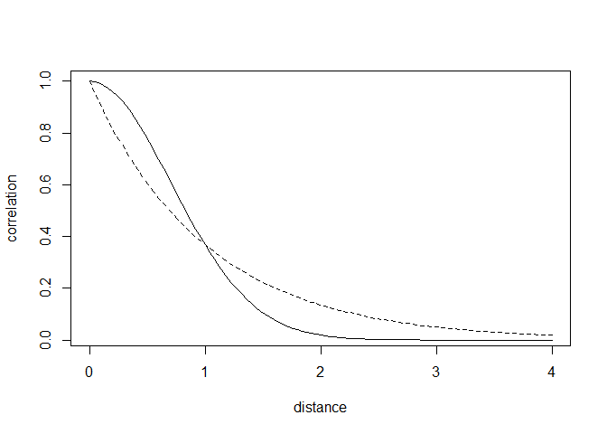<!-- -->


```r
## R code 14.38
data(Kline2) # load the ordinary data, now with coordinates
d <- Kline2
d$society <- 1:10 # index observations

dat_list <- list(
    T = d$total_tools,
    P = d$population,
    society = d$society,
    Dmat=islandsDistMatrix )

m14.7 <- ulam(
    alist(
        T ~ dpois(lambda),
        lambda <- (a*P^b/g)*exp(k[society]),
        vector[10]:k ~ multi_normal( 0 , SIGMA ),
        matrix[10,10]:SIGMA <- cov_GPL2( Dmat , etasq , rhosq , 0.01 ),
        c(a,b,g) ~ dexp( 1 ),
        etasq ~ dexp( 2 ),
        rhosq ~ dexp( 0.5 )
    ), data=dat_list , chains=4 , cores=4 , iter=2000 , log_lik = TRUE)
```

```
## Warning: Tail Effective Samples Size (ESS) is too low, indicating posterior variances and tail quantiles may be unreliable.
## Running the chains for more iterations may help. See
## http://mc-stan.org/misc/warnings.html#tail-ess
```


```r
## R code 14.39
precis( m14.7 , depth=3 )
```

```
##              mean         sd        5.5%       94.5%     n_eff    Rhat4
## k[1]  -0.17357646 0.31547647 -0.64949816 0.288327286  455.4368 1.007507
## k[2]  -0.02500017 0.30470012 -0.46855343 0.424355975  420.1994 1.006545
## k[3]  -0.07534099 0.29430803 -0.52132573 0.357160260  416.3273 1.007534
## k[4]   0.34569118 0.27061796 -0.02480276 0.761211394  440.4311 1.006926
## k[5]   0.07008476 0.26528278 -0.30901443 0.464021569  415.1372 1.008618
## k[6]  -0.38985603 0.28133807 -0.81883434 0.006899523  424.3480 1.007263
## k[7]   0.13399316 0.26243808 -0.24424055 0.523973456  442.9752 1.008810
## k[8]  -0.21772626 0.26805292 -0.61197717 0.164785687  433.1551 1.009308
## k[9]   0.25628198 0.25746846 -0.10134685 0.642341890  444.2336 1.008674
## k[10] -0.17543416 0.34681803 -0.72966055 0.323554840  709.3997 1.008441
## g      0.61448502 0.62258581  0.07866499 1.741309474 1484.1756 1.001362
## b      0.27834487 0.08420913  0.14761502 0.416705577  925.0242 1.004480
## a      1.40967185 1.06196149  0.25495394 3.430111171 1901.3695 1.000260
## etasq  0.18943116 0.19704704  0.02918352 0.528460687  716.5541 1.004227
## rhosq  1.36945914 1.62764398  0.08970138 4.464552613 1792.3446 1.000386
```


```r
## R code 14.40
post <- extract.samples(m14.7)

# plot the posterior median covariance function
plot( NULL , xlab="distance (thousand km)" , ylab="covariance" ,
    xlim=c(0,10) , ylim=c(0,2) )

# compute posterior mean covariance
x_seq <- seq( from=0 , to=10 , length.out=100 )
pmcov <- sapply( x_seq , function(x) post$etasq*exp(-post$rhosq*x^2) )
pmcov_mu <- apply( pmcov , 2 , mean )
lines( x_seq , pmcov_mu , lwd=2 )

# plot 60 functions sampled from posterior
for ( i in 1:50 )
    curve( post$etasq[i]*exp(-post$rhosq[i]*x^2) , add=TRUE ,
        col=col.alpha("black",0.3) )
```

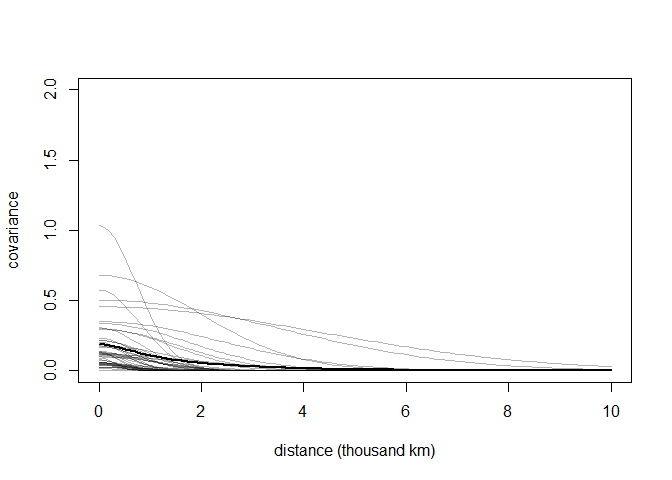<!-- -->


```r
## R code 14.41
# compute posterior median covariance among societies
K <- matrix(0,nrow=10,ncol=10)
for ( i in 1:10 )
    for ( j in 1:10 )
        K[i,j] <- median(post$etasq) *
                  exp( -median(post$rhosq) * islandsDistMatrix[i,j]^2 )
diag(K) <- median(post$etasq) + 0.01
```


```r
## R code 14.42
# convert to correlation matrix
Rho <- round( cov2cor(K) , 2 )
# add row/col names for convenience
colnames(Rho) <- c("Ml","Ti","SC","Ya","Fi","Tr","Ch","Mn","To","Ha")
rownames(Rho) <- colnames(Rho)
Rho
```

```
##      Ml   Ti   SC   Ya   Fi   Tr   Ch   Mn   To Ha
## Ml 1.00 0.78 0.68 0.00 0.28 0.04 0.00 0.00 0.06  0
## Ti 0.78 1.00 0.86 0.00 0.28 0.04 0.00 0.00 0.05  0
## SC 0.68 0.86 1.00 0.00 0.14 0.10 0.00 0.01 0.02  0
## Ya 0.00 0.00 0.00 1.00 0.00 0.01 0.14 0.12 0.00  0
## Fi 0.28 0.28 0.14 0.00 1.00 0.00 0.00 0.00 0.59  0
## Tr 0.04 0.04 0.10 0.01 0.00 1.00 0.07 0.53 0.00  0
## Ch 0.00 0.00 0.00 0.14 0.00 0.07 1.00 0.29 0.00  0
## Mn 0.00 0.00 0.01 0.12 0.00 0.53 0.29 1.00 0.00  0
## To 0.06 0.05 0.02 0.00 0.59 0.00 0.00 0.00 1.00  0
## Ha 0.00 0.00 0.00 0.00 0.00 0.00 0.00 0.00 0.00  1
```


```r
## R code 14.43
# scale point size to logpop
psize <- d$logpop / max(d$logpop)
psize <- exp(psize*1.5)-2

# plot raw data and labels
plot( d$lon2 , d$lat , xlab="longitude" , ylab="latitude" ,
    col=rangi2 , cex=psize , pch=16 , xlim=c(-50,30) )
labels <- as.character(d$culture)
text( d$lon2 , d$lat , labels=labels , cex=0.7 , pos=c(2,4,3,3,4,1,3,2,4,2) )

# overlay lines shaded by Rho
for( i in 1:10 )
    for ( j in 1:10 )
        if ( i < j )
            lines( c( d$lon2[i],d$lon2[j] ) , c( d$lat[i],d$lat[j] ) ,
                lwd=2 , col=col.alpha("black",Rho[i,j]^2) )
```

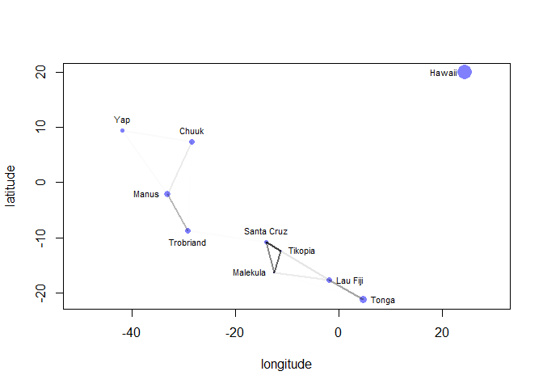<!-- -->


```r
## R code 14.44
# compute posterior median relationship, ignoring distance
logpop.seq <- seq( from=6 , to=14 , length.out=30 )
lambda <- sapply( logpop.seq , function(lp) post$a*exp(lp)^post$b/post$g )
lambda.median <- apply( lambda , 2 , median )
lambda.PI80 <- apply( lambda , 2 , PI , prob=0.8 )

# plot raw data and labels
plot( d$logpop , d$total_tools , col=rangi2 , cex=psize , pch=16 ,
    xlab="log population" , ylab="total tools" )
text( d$logpop , d$total_tools , labels=labels , cex=0.7 ,
    pos=c(4,3,4,2,2,1,4,4,4,2) )

# display posterior predictions
lines( logpop.seq , lambda.median , lty=2 )
lines( logpop.seq , lambda.PI80[1,] , lty=2 )
lines( logpop.seq , lambda.PI80[2,] , lty=2 )

# overlay correlations
for( i in 1:10 )
    for ( j in 1:10 )
        if ( i < j )
            lines( c( d$logpop[i],d$logpop[j] ) ,
                   c( d$total_tools[i],d$total_tools[j] ) ,
                   lwd=2 , col=col.alpha("black",Rho[i,j]^2) )
```

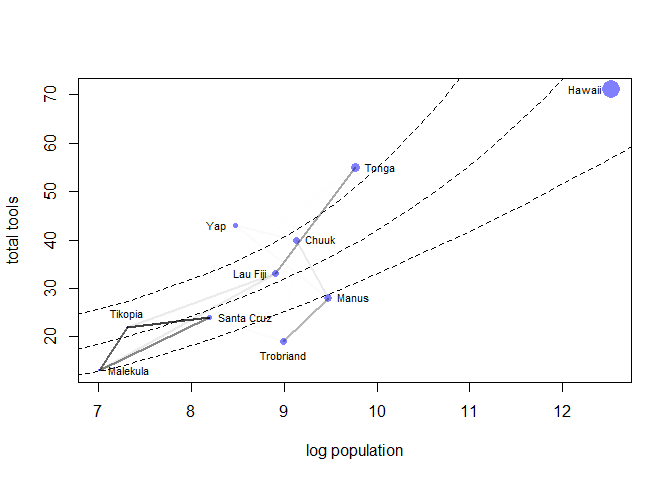<!-- -->
### Overthinking: Non-centered islands.


```r
## R code 14.45
m14.7nc <- ulam(
    alist(
        T ~ dpois(lambda),
        lambda <- (a*P^b/g)*exp(k[society]),

        # non-centered Gaussian Process prior
        transpars> vector[10]: k <<- L_SIGMA * z,
        vector[10]: z ~ normal( 0 , 1 ),
        transpars> matrix[10,10]: L_SIGMA <<- cholesky_decompose( SIGMA ),
        transpars> matrix[10,10]: SIGMA <- cov_GPL2( Dmat , etasq , rhosq , 0.01 ),

        c(a,b,g) ~ dexp( 1 ),
        etasq ~ dexp( 2 ),
        rhosq ~ dexp( 0.5 )
    ), data=dat_list , chains=4 , cores=4 , iter=2000 , log_lik = TRUE)
```

```
## Warning: The largest R-hat is NA, indicating chains have not mixed.
## Running the chains for more iterations may help. See
## http://mc-stan.org/misc/warnings.html#r-hat
```

```
## Warning: Bulk Effective Samples Size (ESS) is too low, indicating posterior means and medians may be unreliable.
## Running the chains for more iterations may help. See
## http://mc-stan.org/misc/warnings.html#bulk-ess
```

```
## Warning: Tail Effective Samples Size (ESS) is too low, indicating posterior variances and tail quantiles may be unreliable.
## Running the chains for more iterations may help. See
## http://mc-stan.org/misc/warnings.html#tail-ess
```

```r
## R code 14.39
precis( m14.7 , depth=3 )
```

```
##              mean         sd        5.5%       94.5%     n_eff    Rhat4
## k[1]  -0.17357646 0.31547647 -0.64949816 0.288327286  455.4368 1.007507
## k[2]  -0.02500017 0.30470012 -0.46855343 0.424355975  420.1994 1.006545
## k[3]  -0.07534099 0.29430803 -0.52132573 0.357160260  416.3273 1.007534
## k[4]   0.34569118 0.27061796 -0.02480276 0.761211394  440.4311 1.006926
## k[5]   0.07008476 0.26528278 -0.30901443 0.464021569  415.1372 1.008618
## k[6]  -0.38985603 0.28133807 -0.81883434 0.006899523  424.3480 1.007263
## k[7]   0.13399316 0.26243808 -0.24424055 0.523973456  442.9752 1.008810
## k[8]  -0.21772626 0.26805292 -0.61197717 0.164785687  433.1551 1.009308
## k[9]   0.25628198 0.25746846 -0.10134685 0.642341890  444.2336 1.008674
## k[10] -0.17543416 0.34681803 -0.72966055 0.323554840  709.3997 1.008441
## g      0.61448502 0.62258581  0.07866499 1.741309474 1484.1756 1.001362
## b      0.27834487 0.08420913  0.14761502 0.416705577  925.0242 1.004480
## a      1.40967185 1.06196149  0.25495394 3.430111171 1901.3695 1.000260
## etasq  0.18943116 0.19704704  0.02918352 0.528460687  716.5541 1.004227
## rhosq  1.36945914 1.62764398  0.08970138 4.464552613 1792.3446 1.000386
```

```r
precis( m14.7nc , depth=3 )
```

```
##                         mean          sd           5.5%         94.5%     n_eff
## z[1]           -0.4232273333 0.767179958  -1.687823e+00  7.534391e-01 1797.3812
## z[2]            0.3927967430 0.763926673  -8.265102e-01  1.610259e+00 3311.6606
## z[3]           -0.2241538845 0.774632570  -1.472593e+00  9.872811e-01 3295.6826
## z[4]            0.9824171963 0.630372262  -3.735678e-03  1.998304e+00 2159.0360
## z[5]            0.3454493573 0.668574053  -6.721086e-01  1.415704e+00 2175.7143
## z[6]           -1.0769371690 0.669841789  -2.179938e+00 -4.004470e-02 2492.1495
## z[7]            0.3574665396 0.576104068  -5.382323e-01  1.280508e+00 2352.1392
## z[8]           -0.4154227276 0.686223633  -1.515515e+00  6.397155e-01 3121.4230
## z[9]            0.7751734270 0.651671363  -2.459803e-01  1.834665e+00 2479.9386
## z[10]          -0.4668000678 0.788913707  -1.715820e+00  7.975279e-01 2124.0608
## g               0.6185556826 0.576051121   7.653343e-02  1.669344e+00 2323.5290
## b               0.2811912125 0.080667571   1.529510e-01  4.151346e-01 1602.5636
## a               1.3868568423 1.001394032   2.422491e-01  3.262016e+00 3298.7126
## etasq           0.1887132585 0.190880072   2.982865e-02  5.321366e-01 1202.0306
## rhosq           1.4009892060 1.719586686   8.590953e-02  4.477988e+00 1957.7136
## SIGMA[1,1]      0.1987132585 0.190880072   3.982865e-02  5.421366e-01 1202.0306
## SIGMA[1,2]      0.1562787774 0.183246212   1.545755e-02  4.873239e-01 1119.0343
## SIGMA[1,3]      0.1402934669 0.179918829   8.394495e-03  4.695775e-01 1088.8003
## SIGMA[1,4]      0.0125857475 0.058468089   7.685694e-39  5.542424e-02 1659.2235
## SIGMA[1,5]      0.0908918860 0.160026084   8.377316e-05  3.727736e-01 1029.5377
## SIGMA[1,6]      0.0528016982 0.127376086   5.856776e-10  2.592029e-01 1086.4222
## SIGMA[1,7]      0.0256469916 0.087947734   1.241310e-21  1.358485e-01 1309.8461
## SIGMA[1,8]      0.0325298756 0.099947428   4.308742e-17  1.706217e-01 1221.4862
## SIGMA[1,9]      0.0593005465 0.134382488   1.207855e-08  2.884341e-01 1064.0204
## SIGMA[1,10]     0.0058523972 0.036784736   1.716883e-64  1.782511e-02 2188.7908
## SIGMA[2,1]      0.1562787774 0.183246212   1.545755e-02  4.873239e-01 1119.0343
## SIGMA[2,2]      0.1987132585 0.190880072   3.982865e-02  5.421366e-01 1202.0306
## SIGMA[2,3]      0.1721207626 0.186379504   2.354889e-02  5.066457e-01 1155.2684
## SIGMA[2,4]      0.0140829669 0.062487243   8.831160e-36  6.465896e-02 1589.7571
## SIGMA[2,5]      0.0907642287 0.159946231   8.141949e-05  3.724638e-01 1029.5164
## SIGMA[2,6]      0.0538156073 0.128516757   9.798726e-10  2.634996e-01 1082.3102
## SIGMA[2,7]      0.0308890474 0.097244953   5.435574e-18  1.629470e-01 1239.2049
## SIGMA[2,8]      0.0351597309 0.104097800   9.061545e-16  1.857646e-01 1196.5863
## SIGMA[2,9]      0.0553226741 0.130178833   2.039208e-09  2.712380e-01 1076.5452
## SIGMA[2,10]     0.0073513184 0.042279693   4.693878e-56  2.554073e-02 2026.8073
## SIGMA[3,1]      0.1402934669 0.179918829   8.394495e-03  4.695775e-01 1088.8003
## SIGMA[3,2]      0.1721207626 0.186379504   2.354889e-02  5.066457e-01 1155.2684
## SIGMA[3,3]      0.1987132585 0.190880072   3.982865e-02  5.421366e-01 1202.0306
## SIGMA[3,4]      0.0169794555 0.069695270   5.562110e-31  8.309717e-02 1481.2349
## SIGMA[3,5]      0.0730456137 0.147087257   1.479148e-06  3.244806e-01 1037.5643
## SIGMA[3,6]      0.0656383812 0.140570962   1.400029e-07  3.080511e-01 1049.0911
## SIGMA[3,7]      0.0370253176 0.106916732   6.737625e-15  1.984212e-01 1181.0497
## SIGMA[3,8]      0.0429154651 0.115209178   1.120142e-12  2.249603e-01 1138.2838
## SIGMA[3,9]      0.0450920218 0.118062512   5.398516e-12  2.340219e-01 1124.7824
## SIGMA[3,10]     0.0068660715 0.040555648   1.640087e-58  2.317963e-02 2076.4063
## SIGMA[4,1]      0.0125857475 0.058468089   7.685694e-39  5.542424e-02 1659.2235
## SIGMA[4,2]      0.0140829669 0.062487243   8.831160e-36  6.465896e-02 1589.7571
## SIGMA[4,3]      0.0169794555 0.069695270   5.562110e-31  8.309717e-02 1481.2349
## SIGMA[4,4]      0.1987132585 0.190880072   3.982865e-02  5.421366e-01 1202.0306
## SIGMA[4,5]      0.0069058830 0.040698945   2.661726e-58  2.337007e-02 2072.1928
## SIGMA[4,6]      0.0401058596 0.111362839   1.066106e-13  2.103672e-01 1157.8405
## SIGMA[4,7]      0.0727972251 0.146880424   1.375179e-06  3.234911e-01 1037.8600
## SIGMA[4,8]      0.0698424859 0.144359064   5.511085e-07  3.168625e-01 1041.8423
## SIGMA[4,9]      0.0045019643 0.031325956   4.909701e-75  1.208607e-02 2370.6155
## SIGMA[4,10]     0.0025029682 0.021863417  4.542639e-102  3.276330e-03 2648.8467
## SIGMA[5,1]      0.0908918860 0.160026084   8.377316e-05  3.727736e-01 1029.5377
## SIGMA[5,2]      0.0907642287 0.159946231   8.141949e-05  3.724638e-01 1029.5164
## SIGMA[5,3]      0.0730456137 0.147087257   1.479148e-06  3.244806e-01 1037.5643
## SIGMA[5,4]      0.0069058830 0.040698945   2.661726e-58  2.337007e-02 2072.1928
## SIGMA[5,5]      0.1987132585 0.190880072   3.982865e-02  5.421366e-01 1202.0306
## SIGMA[5,6]      0.0250103096 0.086741513   3.921182e-22  1.317394e-01 1318.4639
## SIGMA[5,7]      0.0153593178 0.065748971   1.603605e-33  7.129916e-02 1538.2842
## SIGMA[5,8]      0.0165088722 0.068570054   1.069874e-31  7.953386e-02 1496.9532
## SIGMA[5,9]      0.1275258756 0.176534899   4.386713e-03  4.430697e-01 1067.9786
## SIGMA[5,10]     0.0092707659 0.048673677   3.770687e-48  3.512757e-02 1862.1897
## SIGMA[6,1]      0.0528016982 0.127376086   5.856776e-10  2.592029e-01 1086.4222
## SIGMA[6,2]      0.0538156073 0.128516757   9.798726e-10  2.634996e-01 1082.3102
## SIGMA[6,3]      0.0656383812 0.140570962   1.400029e-07  3.080511e-01 1049.0911
## SIGMA[6,4]      0.0401058596 0.111362839   1.066106e-13  2.103672e-01 1157.8405
## SIGMA[6,5]      0.0250103096 0.086741513   3.921182e-22  1.317394e-01 1318.4639
## SIGMA[6,6]      0.1987132585 0.190880072   3.982865e-02  5.421366e-01 1202.0306
## SIGMA[6,7]      0.0616754046 0.136771807   3.269434e-08  2.988692e-01 1057.8154
## SIGMA[6,8]      0.1196944828 0.173961720   2.596249e-03  4.308246e-01 1056.3076
## SIGMA[6,9]      0.0166376454 0.068879622   1.691247e-31  8.048834e-02 1492.5865
## SIGMA[6,10]     0.0033580262 0.026174555   6.410106e-88  6.524636e-03 2517.7573
## SIGMA[7,1]      0.0256469916 0.087947734   1.241310e-21  1.358485e-01 1309.8461
## SIGMA[7,2]      0.0308890474 0.097244953   5.435574e-18  1.629470e-01 1239.2049
## SIGMA[7,3]      0.0370253176 0.106916732   6.737625e-15  1.984212e-01 1181.0497
## SIGMA[7,4]      0.0727972251 0.146880424   1.375179e-06  3.234911e-01 1037.8600
## SIGMA[7,5]      0.0153593178 0.065748971   1.603605e-33  7.129916e-02 1538.2842
## SIGMA[7,6]      0.0616754046 0.136771807   3.269434e-08  2.988692e-01 1057.8154
## SIGMA[7,7]      0.1987132585 0.190880072   3.982865e-02  5.421366e-01 1202.0306
## SIGMA[7,8]      0.0922448512 0.160861758   1.057762e-04  3.777391e-01 1029.8211
## SIGMA[7,9]      0.0097997669 0.050332193   2.328560e-46  3.844541e-02 1823.9933
## SIGMA[7,10]     0.0054970482 0.035401575   6.303235e-67  1.613097e-02 2232.4442
## SIGMA[8,1]      0.0325298756 0.099947428   4.308742e-17  1.706217e-01 1221.4862
## SIGMA[8,2]      0.0351597309 0.104097800   9.061545e-16  1.857646e-01 1196.5863
## SIGMA[8,3]      0.0429154651 0.115209178   1.120142e-12  2.249603e-01 1138.2838
## SIGMA[8,4]      0.0698424859 0.144359064   5.511085e-07  3.168625e-01 1041.8423
## SIGMA[8,5]      0.0165088722 0.068570054   1.069874e-31  7.953386e-02 1496.9532
## SIGMA[8,6]      0.1196944828 0.173961720   2.596249e-03  4.308246e-01 1056.3076
## SIGMA[8,7]      0.0922448512 0.160861758   1.057762e-04  3.777391e-01 1029.8211
## SIGMA[8,8]      0.1987132585 0.190880072   3.982865e-02  5.421366e-01 1202.0306
## SIGMA[8,9]      0.0108067145 0.053382419   2.689250e-43  4.407373e-02 1758.0438
## SIGMA[8,10]     0.0032300408 0.025558724   1.019814e-89  5.981699e-03 2535.2833
## SIGMA[9,1]      0.0593005465 0.134382488   1.207855e-08  2.884341e-01 1064.0204
## SIGMA[9,2]      0.0553226741 0.130178833   2.039208e-09  2.712380e-01 1076.5452
## SIGMA[9,3]      0.0450920218 0.118062512   5.398516e-12  2.340219e-01 1124.7824
## SIGMA[9,4]      0.0045019643 0.031325956   4.909701e-75  1.208607e-02 2370.6155
## SIGMA[9,5]      0.1275258756 0.176534899   4.386713e-03  4.430697e-01 1067.9786
## SIGMA[9,6]      0.0166376454 0.068879622   1.691247e-31  8.048834e-02 1492.5865
## SIGMA[9,7]      0.0097997669 0.050332193   2.328560e-46  3.844541e-02 1823.9933
## SIGMA[9,8]      0.0108067145 0.053382419   2.689250e-43  4.407373e-02 1758.0438
## SIGMA[9,9]      0.1987132585 0.190880072   3.982865e-02  5.421366e-01 1202.0306
## SIGMA[9,10]     0.0084799702 0.046115186   4.154944e-51  3.076719e-02 1924.6044
## SIGMA[10,1]     0.0058523972 0.036784736   1.716883e-64  1.782511e-02 2188.7908
## SIGMA[10,2]     0.0073513184 0.042279693   4.693878e-56  2.554073e-02 2026.8073
## SIGMA[10,3]     0.0068660715 0.040555648   1.640087e-58  2.317963e-02 2076.4063
## SIGMA[10,4]     0.0025029682 0.021863417  4.542639e-102  3.276330e-03 2648.8467
## SIGMA[10,5]     0.0092707659 0.048673677   3.770687e-48  3.512757e-02 1862.1897
## SIGMA[10,6]     0.0033580262 0.026174555   6.410106e-88  6.524636e-03 2517.7573
## SIGMA[10,7]     0.0054970482 0.035401575   6.303235e-67  1.613097e-02 2232.4442
## SIGMA[10,8]     0.0032300408 0.025558724   1.019814e-89  5.981699e-03 2535.2833
## SIGMA[10,9]     0.0084799702 0.046115186   4.154944e-51  3.076719e-02 1924.6044
## SIGMA[10,10]    0.1987132585 0.190880072   3.982865e-02  5.421366e-01 1202.0306
## L_SIGMA[1,1]    0.4101340583 0.174673812   1.995712e-01  7.362992e-01 1061.6915
## L_SIGMA[1,2]    0.0000000000 0.000000000   0.000000e+00  0.000000e+00       NaN
## L_SIGMA[1,3]    0.0000000000 0.000000000   0.000000e+00  0.000000e+00       NaN
## L_SIGMA[1,4]    0.0000000000 0.000000000   0.000000e+00  0.000000e+00       NaN
## L_SIGMA[1,5]    0.0000000000 0.000000000   0.000000e+00  0.000000e+00       NaN
## L_SIGMA[1,6]    0.0000000000 0.000000000   0.000000e+00  0.000000e+00       NaN
## L_SIGMA[1,7]    0.0000000000 0.000000000   0.000000e+00  0.000000e+00       NaN
## L_SIGMA[1,8]    0.0000000000 0.000000000   0.000000e+00  0.000000e+00       NaN
## L_SIGMA[1,9]    0.0000000000 0.000000000   0.000000e+00  0.000000e+00       NaN
## L_SIGMA[1,10]   0.0000000000 0.000000000   0.000000e+00  0.000000e+00       NaN
## L_SIGMA[2,1]    0.3055062234 0.192646451   7.275607e-02  6.719318e-01  929.9588
## L_SIGMA[2,2]    0.2451778590 0.090364196   1.511385e-01  4.143144e-01 1636.7877
## L_SIGMA[2,3]    0.0000000000 0.000000000   0.000000e+00  0.000000e+00       NaN
## L_SIGMA[2,4]    0.0000000000 0.000000000   0.000000e+00  0.000000e+00       NaN
## L_SIGMA[2,5]    0.0000000000 0.000000000   0.000000e+00  0.000000e+00       NaN
## L_SIGMA[2,6]    0.0000000000 0.000000000   0.000000e+00  0.000000e+00       NaN
## L_SIGMA[2,7]    0.0000000000 0.000000000   0.000000e+00  0.000000e+00       NaN
## L_SIGMA[2,8]    0.0000000000 0.000000000   0.000000e+00  0.000000e+00       NaN
## L_SIGMA[2,9]    0.0000000000 0.000000000   0.000000e+00  0.000000e+00       NaN
## L_SIGMA[2,10]   0.0000000000 0.000000000   0.000000e+00  0.000000e+00       NaN
## L_SIGMA[3,1]    0.2688691544 0.197782913   3.785043e-02  6.442954e-01  914.2659
## L_SIGMA[3,2]    0.1850872904 0.084487526   8.178907e-02  3.430454e-01 1525.4664
## L_SIGMA[3,3]    0.2030546143 0.068488457   1.353233e-01  3.310128e-01 1701.8434
## L_SIGMA[3,4]    0.0000000000 0.000000000   0.000000e+00  0.000000e+00       NaN
## L_SIGMA[3,5]    0.0000000000 0.000000000   0.000000e+00  0.000000e+00       NaN
## L_SIGMA[3,6]    0.0000000000 0.000000000   0.000000e+00  0.000000e+00       NaN
## L_SIGMA[3,7]    0.0000000000 0.000000000   0.000000e+00  0.000000e+00       NaN
## L_SIGMA[3,8]    0.0000000000 0.000000000   0.000000e+00  0.000000e+00       NaN
## L_SIGMA[3,9]    0.0000000000 0.000000000   0.000000e+00  0.000000e+00       NaN
## L_SIGMA[3,10]   0.0000000000 0.000000000   0.000000e+00  0.000000e+00       NaN
## L_SIGMA[4,1]    0.0175216130 0.063431575   2.612583e-38  1.026864e-01 1385.7277
## L_SIGMA[4,2]    0.0102101253 0.029753083   4.009079e-35  6.367598e-02 1165.1488
## L_SIGMA[4,3]    0.0211266944 0.058537180   3.848022e-30  1.281555e-01 1118.2558
## L_SIGMA[4,4]    0.4036408720 0.163104373   1.989014e-01  7.099950e-01 1142.4085
## L_SIGMA[4,5]    0.0000000000 0.000000000   0.000000e+00  0.000000e+00       NaN
## L_SIGMA[4,6]    0.0000000000 0.000000000   0.000000e+00  0.000000e+00       NaN
## L_SIGMA[4,7]    0.0000000000 0.000000000   0.000000e+00  0.000000e+00       NaN
## L_SIGMA[4,8]    0.0000000000 0.000000000   0.000000e+00  0.000000e+00       NaN
## L_SIGMA[4,9]    0.0000000000 0.000000000   0.000000e+00  0.000000e+00       NaN
## L_SIGMA[4,10]   0.0000000000 0.000000000   0.000000e+00  0.000000e+00       NaN
## L_SIGMA[5,1]    0.1607930229 0.189970104   2.618960e-04  5.454539e-01  880.8984
## L_SIGMA[5,2]    0.0372242871 0.029775205   1.832944e-04  8.568433e-02 1020.8656
## L_SIGMA[5,3]   -0.0633717702 0.071596393  -2.028102e-01 -6.424949e-05 1424.2608
## L_SIGMA[5,4]   -0.0043316082 0.016234954  -3.126254e-02  1.189879e-03 1417.5953
## L_SIGMA[5,5]    0.3332999614 0.118316850   1.816997e-01  5.447391e-01 1497.7931
## L_SIGMA[5,6]    0.0000000000 0.000000000   0.000000e+00  0.000000e+00       NaN
## L_SIGMA[5,7]    0.0000000000 0.000000000   0.000000e+00  0.000000e+00       NaN
## L_SIGMA[5,8]    0.0000000000 0.000000000   0.000000e+00  0.000000e+00       NaN
## L_SIGMA[5,9]    0.0000000000 0.000000000   0.000000e+00  0.000000e+00       NaN
## L_SIGMA[5,10]   0.0000000000 0.000000000   0.000000e+00  0.000000e+00       NaN
## L_SIGMA[6,1]    0.0857755789 0.150558466   1.986554e-09  3.974758e-01  926.3077
## L_SIGMA[6,2]    0.0211798124 0.027772017   2.886999e-09  7.763056e-02  897.0803
## L_SIGMA[6,3]    0.0757335266 0.096991485   6.098962e-07  2.684166e-01 1057.1979
## L_SIGMA[6,4]    0.0437307262 0.074378087   3.411719e-13  2.124252e-01  918.7608
## L_SIGMA[6,5]   -0.0209897808 0.048160258  -1.281437e-01  1.213073e-02 1120.7082
## L_SIGMA[6,6]    0.3529381330 0.132551711   1.831612e-01  5.865107e-01 1522.5647
## L_SIGMA[6,7]    0.0000000000 0.000000000   0.000000e+00  0.000000e+00       NaN
## L_SIGMA[6,8]    0.0000000000 0.000000000   0.000000e+00  0.000000e+00       NaN
## L_SIGMA[6,9]    0.0000000000 0.000000000   0.000000e+00  0.000000e+00       NaN
## L_SIGMA[6,10]   0.0000000000 0.000000000   0.000000e+00  0.000000e+00       NaN
## L_SIGMA[7,1]    0.0381612341 0.099687150   4.398874e-21  2.177145e-01 1127.5938
## L_SIGMA[7,2]    0.0315553051 0.063614799   1.744181e-17  1.680522e-01  979.5608
## L_SIGMA[7,3]    0.0451021740 0.082875815   2.329503e-14  2.206112e-01  960.1793
## L_SIGMA[7,4]    0.1085425648 0.136169590   4.674421e-06  3.870434e-01  921.8384
## L_SIGMA[7,5]   -0.0050857827 0.017582217  -4.736984e-02  7.550361e-03 1452.9003
## L_SIGMA[7,6]    0.0398987308 0.047517580   3.518376e-08  1.319320e-01 1765.9087
## L_SIGMA[7,7]    0.3486607099 0.131591484   1.833603e-01  5.817218e-01 1523.8355
## L_SIGMA[7,8]    0.0000000000 0.000000000   0.000000e+00  0.000000e+00       NaN
## L_SIGMA[7,9]    0.0000000000 0.000000000   0.000000e+00  0.000000e+00       NaN
## L_SIGMA[7,10]   0.0000000000 0.000000000   0.000000e+00  0.000000e+00       NaN
## L_SIGMA[8,1]    0.0496931231 0.115010252   1.389668e-16  2.729369e-01 1047.1880
## L_SIGMA[8,2]    0.0210143749 0.037577873   3.032581e-15  1.029321e-01  941.7863
## L_SIGMA[8,3]    0.0522974255 0.088754665   4.003549e-12  2.349291e-01  975.0954
## L_SIGMA[8,4]    0.1022930652 0.131743397   1.991697e-06  3.739003e-01  914.7545
## L_SIGMA[8,5]   -0.0119465102 0.033493249  -8.832623e-02  8.391560e-03 1226.4887
## L_SIGMA[8,6]    0.1691993352 0.126389496   9.499355e-03  3.966048e-01 1572.1709
## L_SIGMA[8,7]    0.0604826519 0.049264701   3.265647e-04  1.472527e-01 1897.5191
## L_SIGMA[8,8]    0.2760254335 0.120856322   1.360947e-01  5.004610e-01 1475.0982
## L_SIGMA[8,9]    0.0000000000 0.000000000   0.000000e+00  0.000000e+00       NaN
## L_SIGMA[8,10]   0.0000000000 0.000000000   0.000000e+00  0.000000e+00       NaN
## L_SIGMA[9,1]    0.0979436356 0.159559715   4.326862e-08  4.315261e-01  909.6851
## L_SIGMA[9,2]    0.0021064203 0.010777311  -9.926901e-03  2.354335e-02 1913.5549
## L_SIGMA[9,3]   -0.0462298332 0.070701694  -1.898922e-01 -1.407188e-09 1077.0782
## L_SIGMA[9,4]   -0.0033600583 0.017813356  -2.270330e-02  3.184687e-03 1860.0664
## L_SIGMA[9,5]    0.2027887938 0.142324056   1.787566e-02  4.575201e-01 1196.2876
## L_SIGMA[9,6]    0.0045533068 0.013806335  -7.199126e-03  3.247471e-02 2232.5828
## L_SIGMA[9,7]    0.0006774764 0.006630701  -2.074776e-03  1.027277e-02 2798.1788
## L_SIGMA[9,8]   -0.0016201855 0.005839852  -1.323638e-02  4.580220e-03 2890.1811
## L_SIGMA[9,9]    0.2870182430 0.109728478   1.643441e-01  4.909479e-01 1528.3612
## L_SIGMA[9,10]   0.0000000000 0.000000000   0.000000e+00  0.000000e+00       NaN
## L_SIGMA[10,1]   0.0077143255 0.038503871   4.869649e-64  3.235514e-02 1857.9583
## L_SIGMA[10,2]   0.0089473900 0.035559233   1.412505e-55  4.981493e-02 1389.1472
## L_SIGMA[10,3]  -0.0001923648 0.004949041  -1.559026e-03  5.077092e-04 2444.2780
## L_SIGMA[10,4]  -0.0015264724 0.008139015  -5.728024e-03  3.115788e-09 1825.6310
## L_SIGMA[10,5]   0.0104242234 0.038075131   1.069475e-47  6.303592e-02 1315.1361
## L_SIGMA[10,6]  -0.0005584658 0.009586425  -1.368096e-07  2.221716e-03 2692.6423
## L_SIGMA[10,7]   0.0047813810 0.021372781  -6.432250e-09  2.332118e-02 1609.1860
## L_SIGMA[10,8]  -0.0014381668 0.005262551  -8.952446e-03  9.417227e-12 1638.1646
## L_SIGMA[10,9]  -0.0010267918 0.006928965  -6.999792e-03 -2.435347e-88 2025.5507
## L_SIGMA[10,10]  0.4066146962 0.167920430   1.990063e-01  7.205657e-01 1099.3087
## k[1]           -0.1528700041 0.313463835  -6.442875e-01  3.229698e-01 1751.7305
## k[2]           -0.0095449128 0.300661744  -4.683718e-01  4.622121e-01 1764.5163
## k[3]           -0.0598048014 0.287963478  -5.056422e-01  3.741373e-01 1940.8296
## k[4]            0.3607536415 0.268587282  -3.030099e-02  8.037524e-01 2036.3314
## k[5]            0.0825174983 0.266513588  -3.073694e-01  5.097759e-01 1980.3426
## k[6]           -0.3751513591 0.274941391  -8.151612e-01  2.578532e-02 2193.8946
## k[7]            0.1498923789 0.256618197  -2.304990e-01  5.467914e-01 2283.1916
## k[8]           -0.2070610000 0.265607040  -6.224010e-01  1.985301e-01 2438.4136
## k[9]            0.2673470543 0.252759351  -1.059626e-01  6.598609e-01 2195.8701
## k[10]          -0.1701668295 0.336177577  -7.101016e-01  3.492921e-01 1946.5392
##                    Rhat4
## z[1]           1.0026489
## z[2]           0.9998233
## z[3]           1.0010683
## z[4]           0.9997606
## z[5]           1.0008873
## z[6]           1.0009628
## z[7]           1.0001796
## z[8]           1.0000125
## z[9]           0.9999092
## z[10]          1.0005617
## g              1.0004653
## b              1.0025612
## a              1.0000914
## etasq          1.0010669
## rhosq          1.0038039
## SIGMA[1,1]     1.0010669
## SIGMA[1,2]     1.0012781
## SIGMA[1,3]     1.0013260
## SIGMA[1,4]     0.9997266
## SIGMA[1,5]     1.0010719
## SIGMA[1,6]     1.0003644
## SIGMA[1,7]     0.9998111
## SIGMA[1,8]     0.9999293
## SIGMA[1,9]     1.0005068
## SIGMA[1,10]    0.9998994
## SIGMA[2,1]     1.0012781
## SIGMA[2,2]     1.0010669
## SIGMA[2,3]     1.0011898
## SIGMA[2,4]     0.9997199
## SIGMA[2,5]     1.0010703
## SIGMA[2,6]     1.0003869
## SIGMA[2,7]     0.9998986
## SIGMA[2,8]     0.9999810
## SIGMA[2,9]     1.0004201
## SIGMA[2,10]    0.9998283
## SIGMA[3,1]     1.0013260
## SIGMA[3,2]     1.0011898
## SIGMA[3,3]     1.0010669
## SIGMA[3,4]     0.9997229
## SIGMA[3,5]     1.0007858
## SIGMA[3,6]     1.0006403
## SIGMA[3,7]     1.0000191
## SIGMA[3,8]     1.0001451
## SIGMA[3,9]     1.0001930
## SIGMA[3,10]    0.9998481
## SIGMA[4,1]     0.9997266
## SIGMA[4,2]     0.9997199
## SIGMA[4,3]     0.9997229
## SIGMA[4,4]     1.0010669
## SIGMA[4,5]     0.9998464
## SIGMA[4,6]     1.0000841
## SIGMA[4,7]     1.0007811
## SIGMA[4,8]     1.0007244
## SIGMA[4,9]     0.9999972
## SIGMA[4,10]    1.0002555
## SIGMA[5,1]     1.0010719
## SIGMA[5,2]     1.0010703
## SIGMA[5,3]     1.0007858
## SIGMA[5,4]     0.9998464
## SIGMA[5,5]     1.0010669
## SIGMA[5,6]     0.9998018
## SIGMA[5,7]     0.9997189
## SIGMA[5,8]     0.9997212
## SIGMA[5,9]     1.0013267
## SIGMA[5,10]    0.9997718
## SIGMA[6,1]     1.0003644
## SIGMA[6,2]     1.0003869
## SIGMA[6,3]     1.0006403
## SIGMA[6,4]     1.0000841
## SIGMA[6,5]     0.9998018
## SIGMA[6,6]     1.0010669
## SIGMA[6,7]     1.0005576
## SIGMA[6,8]     1.0013072
## SIGMA[6,9]     0.9997216
## SIGMA[6,10]    1.0001217
## SIGMA[7,1]     0.9998111
## SIGMA[7,2]     0.9998986
## SIGMA[7,3]     1.0000191
## SIGMA[7,4]     1.0007811
## SIGMA[7,5]     0.9997189
## SIGMA[7,6]     1.0005576
## SIGMA[7,7]     1.0010669
## SIGMA[7,8]     1.0010893
## SIGMA[7,9]     0.9997610
## SIGMA[7,10]    0.9999213
## SIGMA[8,1]     0.9999293
## SIGMA[8,2]     0.9999810
## SIGMA[8,3]     1.0001451
## SIGMA[8,4]     1.0007244
## SIGMA[8,5]     0.9997212
## SIGMA[8,6]     1.0013072
## SIGMA[8,7]     1.0010893
## SIGMA[8,8]     1.0010669
## SIGMA[8,9]     0.9997446
## SIGMA[8,10]    1.0001390
## SIGMA[9,1]     1.0005068
## SIGMA[9,2]     1.0004201
## SIGMA[9,3]     1.0001930
## SIGMA[9,4]     0.9999972
## SIGMA[9,5]     1.0013267
## SIGMA[9,6]     0.9997216
## SIGMA[9,7]     0.9997610
## SIGMA[9,8]     0.9997446
## SIGMA[9,9]     1.0010669
## SIGMA[9,10]    0.9997915
## SIGMA[10,1]    0.9998994
## SIGMA[10,2]    0.9998283
## SIGMA[10,3]    0.9998481
## SIGMA[10,4]    1.0002555
## SIGMA[10,5]    0.9997718
## SIGMA[10,6]    1.0001217
## SIGMA[10,7]    0.9999213
## SIGMA[10,8]    1.0001390
## SIGMA[10,9]    0.9997915
## SIGMA[10,10]   1.0010669
## L_SIGMA[1,1]   1.0013770
## L_SIGMA[1,2]         NaN
## L_SIGMA[1,3]         NaN
## L_SIGMA[1,4]         NaN
## L_SIGMA[1,5]         NaN
## L_SIGMA[1,6]         NaN
## L_SIGMA[1,7]         NaN
## L_SIGMA[1,8]         NaN
## L_SIGMA[1,9]         NaN
## L_SIGMA[1,10]        NaN
## L_SIGMA[2,1]   1.0023884
## L_SIGMA[2,2]   1.0013525
## L_SIGMA[2,3]         NaN
## L_SIGMA[2,4]         NaN
## L_SIGMA[2,5]         NaN
## L_SIGMA[2,6]         NaN
## L_SIGMA[2,7]         NaN
## L_SIGMA[2,8]         NaN
## L_SIGMA[2,9]         NaN
## L_SIGMA[2,10]        NaN
## L_SIGMA[3,1]   1.0026282
## L_SIGMA[3,2]   1.0007021
## L_SIGMA[3,3]   1.0016629
## L_SIGMA[3,4]         NaN
## L_SIGMA[3,5]         NaN
## L_SIGMA[3,6]         NaN
## L_SIGMA[3,7]         NaN
## L_SIGMA[3,8]         NaN
## L_SIGMA[3,9]         NaN
## L_SIGMA[3,10]        NaN
## L_SIGMA[4,1]   0.9996642
## L_SIGMA[4,2]   1.0000720
## L_SIGMA[4,3]   1.0001935
## L_SIGMA[4,4]   1.0015896
## L_SIGMA[4,5]         NaN
## L_SIGMA[4,6]         NaN
## L_SIGMA[4,7]         NaN
## L_SIGMA[4,8]         NaN
## L_SIGMA[4,9]         NaN
## L_SIGMA[4,10]        NaN
## L_SIGMA[5,1]   1.0023320
## L_SIGMA[5,2]   1.0038790
## L_SIGMA[5,3]   1.0024420
## L_SIGMA[5,4]   0.9996953
## L_SIGMA[5,5]   1.0008027
## L_SIGMA[5,6]         NaN
## L_SIGMA[5,7]         NaN
## L_SIGMA[5,8]         NaN
## L_SIGMA[5,9]         NaN
## L_SIGMA[5,10]        NaN
## L_SIGMA[6,1]   1.0010853
## L_SIGMA[6,2]   1.0025269
## L_SIGMA[6,3]   1.0028884
## L_SIGMA[6,4]   1.0015286
## L_SIGMA[6,5]   1.0007969
## L_SIGMA[6,6]   1.0010514
## L_SIGMA[6,7]         NaN
## L_SIGMA[6,8]         NaN
## L_SIGMA[6,9]         NaN
## L_SIGMA[6,10]        NaN
## L_SIGMA[7,1]   1.0000158
## L_SIGMA[7,2]   1.0010521
## L_SIGMA[7,3]   1.0014166
## L_SIGMA[7,4]   1.0027471
## L_SIGMA[7,5]   1.0002360
## L_SIGMA[7,6]   1.0030992
## L_SIGMA[7,7]   1.0009302
## L_SIGMA[7,8]         NaN
## L_SIGMA[7,9]         NaN
## L_SIGMA[7,10]        NaN
## L_SIGMA[8,1]   1.0002686
## L_SIGMA[8,2]   1.0014187
## L_SIGMA[8,3]   1.0018319
## L_SIGMA[8,4]   1.0026476
## L_SIGMA[8,5]   1.0002669
## L_SIGMA[8,6]   1.0031965
## L_SIGMA[8,7]   1.0025067
## L_SIGMA[8,8]   1.0010369
## L_SIGMA[8,9]         NaN
## L_SIGMA[8,10]        NaN
## L_SIGMA[9,1]   1.0013414
## L_SIGMA[9,2]   1.0002692
## L_SIGMA[9,3]   1.0024296
## L_SIGMA[9,4]   0.9995999
## L_SIGMA[9,5]   1.0033476
## L_SIGMA[9,6]   1.0011432
## L_SIGMA[9,7]   1.0002104
## L_SIGMA[9,8]   1.0007730
## L_SIGMA[9,9]   1.0009319
## L_SIGMA[9,10]        NaN
## L_SIGMA[10,1]  0.9996628
## L_SIGMA[10,2]  0.9998014
## L_SIGMA[10,3]  0.9997148
## L_SIGMA[10,4]  0.9997462
## L_SIGMA[10,5]  0.9997831
## L_SIGMA[10,6]  0.9998150
## L_SIGMA[10,7]  0.9996906
## L_SIGMA[10,8]  0.9998095
## L_SIGMA[10,9]  1.0002603
## L_SIGMA[10,10] 1.0015381
## k[1]           1.0020141
## k[2]           1.0006567
## k[3]           0.9999284
## k[4]           0.9996932
## k[5]           0.9999532
## k[6]           0.9996450
## k[7]           0.9996936
## k[8]           0.9995369
## k[9]           0.9993815
## k[10]          1.0002233
```


```r
compare(m14.7,m14.7nc)
```

```
##             WAIC       SE       dWAIC       dSE    pWAIC    weight
## m14.7   67.57513 2.340373 0.000000000        NA 4.073945 0.5009928
## m14.7nc 67.58308 2.309671 0.007942452 0.2905651 4.087376 0.4990072
```

```r
plot(compare(m14.7,m14.7nc))
```

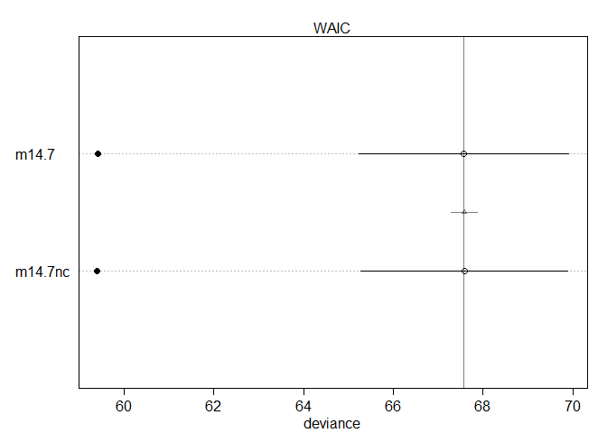<!-- -->


## 14.6. Summary
## 14.7. Practice

### 14M4. Use WAIC to compare the Gaussian process model of Oceanic tools to the models fit to the same data in Chapter 11. Pay special attention to the effective numbers of parameters, as estimated by WAIC.

> Gaussian process model: m14.7, m14.7nc

> Chapter 11 model: m11.9, m11.10, m11.11

### 11.2.1. Example: Oceanic tool complexity.


```r
## R code 11.36
library(rethinking)
data(Kline)
d <- Kline
d
```

```
##       culture population contact total_tools mean_TU
## 1    Malekula       1100     low          13     3.2
## 2     Tikopia       1500     low          22     4.7
## 3  Santa Cruz       3600     low          24     4.0
## 4         Yap       4791    high          43     5.0
## 5    Lau Fiji       7400    high          33     5.0
## 6   Trobriand       8000    high          19     4.0
## 7       Chuuk       9200    high          40     3.8
## 8       Manus      13000     low          28     6.6
## 9       Tonga      17500    high          55     5.4
## 10     Hawaii     275000     low          71     6.6
```


```r
## R code 11.37
d$P <- scale( log(d$population) )
d$contact_id <- ifelse( d$contact=="high" , 2 , 1 )
```

### Chapter 11 models


```r
## R code 11.45
dat <- list(
    T = d$total_tools ,
    P = d$P ,
    cid = d$contact_id )

# intercept only
m11.9 <- ulam(
    alist(
        T ~ dpois( lambda ),
        log(lambda) <- a,
        a ~ dnorm(3,0.5)
    ), data=dat , chains=4 , log_lik=TRUE )
```

```
## 
## SAMPLING FOR MODEL '1016dad00d71412e9dffb1c8f58132a3' NOW (CHAIN 1).
## Chain 1: 
## Chain 1: Gradient evaluation took 0 seconds
## Chain 1: 1000 transitions using 10 leapfrog steps per transition would take 0 seconds.
## Chain 1: Adjust your expectations accordingly!
## Chain 1: 
## Chain 1: 
## Chain 1: Iteration:   1 / 1000 [  0%]  (Warmup)
## Chain 1: Iteration: 100 / 1000 [ 10%]  (Warmup)
## Chain 1: Iteration: 200 / 1000 [ 20%]  (Warmup)
## Chain 1: Iteration: 300 / 1000 [ 30%]  (Warmup)
## Chain 1: Iteration: 400 / 1000 [ 40%]  (Warmup)
## Chain 1: Iteration: 500 / 1000 [ 50%]  (Warmup)
## Chain 1: Iteration: 501 / 1000 [ 50%]  (Sampling)
## Chain 1: Iteration: 600 / 1000 [ 60%]  (Sampling)
## Chain 1: Iteration: 700 / 1000 [ 70%]  (Sampling)
## Chain 1: Iteration: 800 / 1000 [ 80%]  (Sampling)
## Chain 1: Iteration: 900 / 1000 [ 90%]  (Sampling)
## Chain 1: Iteration: 1000 / 1000 [100%]  (Sampling)
## Chain 1: 
## Chain 1:  Elapsed Time: 0.02 seconds (Warm-up)
## Chain 1:                0.016 seconds (Sampling)
## Chain 1:                0.036 seconds (Total)
## Chain 1: 
## 
## SAMPLING FOR MODEL '1016dad00d71412e9dffb1c8f58132a3' NOW (CHAIN 2).
## Chain 2: 
## Chain 2: Gradient evaluation took 0 seconds
## Chain 2: 1000 transitions using 10 leapfrog steps per transition would take 0 seconds.
## Chain 2: Adjust your expectations accordingly!
## Chain 2: 
## Chain 2: 
## Chain 2: Iteration:   1 / 1000 [  0%]  (Warmup)
## Chain 2: Iteration: 100 / 1000 [ 10%]  (Warmup)
## Chain 2: Iteration: 200 / 1000 [ 20%]  (Warmup)
## Chain 2: Iteration: 300 / 1000 [ 30%]  (Warmup)
## Chain 2: Iteration: 400 / 1000 [ 40%]  (Warmup)
## Chain 2: Iteration: 500 / 1000 [ 50%]  (Warmup)
## Chain 2: Iteration: 501 / 1000 [ 50%]  (Sampling)
## Chain 2: Iteration: 600 / 1000 [ 60%]  (Sampling)
## Chain 2: Iteration: 700 / 1000 [ 70%]  (Sampling)
## Chain 2: Iteration: 800 / 1000 [ 80%]  (Sampling)
## Chain 2: Iteration: 900 / 1000 [ 90%]  (Sampling)
## Chain 2: Iteration: 1000 / 1000 [100%]  (Sampling)
## Chain 2: 
## Chain 2:  Elapsed Time: 0.016 seconds (Warm-up)
## Chain 2:                0.016 seconds (Sampling)
## Chain 2:                0.032 seconds (Total)
## Chain 2: 
## 
## SAMPLING FOR MODEL '1016dad00d71412e9dffb1c8f58132a3' NOW (CHAIN 3).
## Chain 3: 
## Chain 3: Gradient evaluation took 0 seconds
## Chain 3: 1000 transitions using 10 leapfrog steps per transition would take 0 seconds.
## Chain 3: Adjust your expectations accordingly!
## Chain 3: 
## Chain 3: 
## Chain 3: Iteration:   1 / 1000 [  0%]  (Warmup)
## Chain 3: Iteration: 100 / 1000 [ 10%]  (Warmup)
## Chain 3: Iteration: 200 / 1000 [ 20%]  (Warmup)
## Chain 3: Iteration: 300 / 1000 [ 30%]  (Warmup)
## Chain 3: Iteration: 400 / 1000 [ 40%]  (Warmup)
## Chain 3: Iteration: 500 / 1000 [ 50%]  (Warmup)
## Chain 3: Iteration: 501 / 1000 [ 50%]  (Sampling)
## Chain 3: Iteration: 600 / 1000 [ 60%]  (Sampling)
## Chain 3: Iteration: 700 / 1000 [ 70%]  (Sampling)
## Chain 3: Iteration: 800 / 1000 [ 80%]  (Sampling)
## Chain 3: Iteration: 900 / 1000 [ 90%]  (Sampling)
## Chain 3: Iteration: 1000 / 1000 [100%]  (Sampling)
## Chain 3: 
## Chain 3:  Elapsed Time: 0.017 seconds (Warm-up)
## Chain 3:                0.019 seconds (Sampling)
## Chain 3:                0.036 seconds (Total)
## Chain 3: 
## 
## SAMPLING FOR MODEL '1016dad00d71412e9dffb1c8f58132a3' NOW (CHAIN 4).
## Chain 4: 
## Chain 4: Gradient evaluation took 0 seconds
## Chain 4: 1000 transitions using 10 leapfrog steps per transition would take 0 seconds.
## Chain 4: Adjust your expectations accordingly!
## Chain 4: 
## Chain 4: 
## Chain 4: Iteration:   1 / 1000 [  0%]  (Warmup)
## Chain 4: Iteration: 100 / 1000 [ 10%]  (Warmup)
## Chain 4: Iteration: 200 / 1000 [ 20%]  (Warmup)
## Chain 4: Iteration: 300 / 1000 [ 30%]  (Warmup)
## Chain 4: Iteration: 400 / 1000 [ 40%]  (Warmup)
## Chain 4: Iteration: 500 / 1000 [ 50%]  (Warmup)
## Chain 4: Iteration: 501 / 1000 [ 50%]  (Sampling)
## Chain 4: Iteration: 600 / 1000 [ 60%]  (Sampling)
## Chain 4: Iteration: 700 / 1000 [ 70%]  (Sampling)
## Chain 4: Iteration: 800 / 1000 [ 80%]  (Sampling)
## Chain 4: Iteration: 900 / 1000 [ 90%]  (Sampling)
## Chain 4: Iteration: 1000 / 1000 [100%]  (Sampling)
## Chain 4: 
## Chain 4:  Elapsed Time: 0.018 seconds (Warm-up)
## Chain 4:                0.018 seconds (Sampling)
## Chain 4:                0.036 seconds (Total)
## Chain 4:
```

```r
# interaction model
m11.10 <- ulam(
    alist(
        T ~ dpois( lambda ),
        log(lambda) <- a[cid] + b[cid]*P,
        a[cid] ~ dnorm( 3 , 0.5 ),
        b[cid] ~ dnorm( 0 , 0.2 )
    ), data=dat , chains=4 , log_lik=TRUE )
```

```
## 
## SAMPLING FOR MODEL '764b6f1d9a7aa55a03b1520aed83f315' NOW (CHAIN 1).
## Chain 1: 
## Chain 1: Gradient evaluation took 0 seconds
## Chain 1: 1000 transitions using 10 leapfrog steps per transition would take 0 seconds.
## Chain 1: Adjust your expectations accordingly!
## Chain 1: 
## Chain 1: 
## Chain 1: Iteration:   1 / 1000 [  0%]  (Warmup)
## Chain 1: Iteration: 100 / 1000 [ 10%]  (Warmup)
## Chain 1: Iteration: 200 / 1000 [ 20%]  (Warmup)
## Chain 1: Iteration: 300 / 1000 [ 30%]  (Warmup)
## Chain 1: Iteration: 400 / 1000 [ 40%]  (Warmup)
## Chain 1: Iteration: 500 / 1000 [ 50%]  (Warmup)
## Chain 1: Iteration: 501 / 1000 [ 50%]  (Sampling)
## Chain 1: Iteration: 600 / 1000 [ 60%]  (Sampling)
## Chain 1: Iteration: 700 / 1000 [ 70%]  (Sampling)
## Chain 1: Iteration: 800 / 1000 [ 80%]  (Sampling)
## Chain 1: Iteration: 900 / 1000 [ 90%]  (Sampling)
## Chain 1: Iteration: 1000 / 1000 [100%]  (Sampling)
## Chain 1: 
## Chain 1:  Elapsed Time: 0.057 seconds (Warm-up)
## Chain 1:                0.046 seconds (Sampling)
## Chain 1:                0.103 seconds (Total)
## Chain 1: 
## 
## SAMPLING FOR MODEL '764b6f1d9a7aa55a03b1520aed83f315' NOW (CHAIN 2).
## Chain 2: 
## Chain 2: Gradient evaluation took 0 seconds
## Chain 2: 1000 transitions using 10 leapfrog steps per transition would take 0 seconds.
## Chain 2: Adjust your expectations accordingly!
## Chain 2: 
## Chain 2: 
## Chain 2: Iteration:   1 / 1000 [  0%]  (Warmup)
## Chain 2: Iteration: 100 / 1000 [ 10%]  (Warmup)
## Chain 2: Iteration: 200 / 1000 [ 20%]  (Warmup)
## Chain 2: Iteration: 300 / 1000 [ 30%]  (Warmup)
## Chain 2: Iteration: 400 / 1000 [ 40%]  (Warmup)
## Chain 2: Iteration: 500 / 1000 [ 50%]  (Warmup)
## Chain 2: Iteration: 501 / 1000 [ 50%]  (Sampling)
## Chain 2: Iteration: 600 / 1000 [ 60%]  (Sampling)
## Chain 2: Iteration: 700 / 1000 [ 70%]  (Sampling)
## Chain 2: Iteration: 800 / 1000 [ 80%]  (Sampling)
## Chain 2: Iteration: 900 / 1000 [ 90%]  (Sampling)
## Chain 2: Iteration: 1000 / 1000 [100%]  (Sampling)
## Chain 2: 
## Chain 2:  Elapsed Time: 0.099 seconds (Warm-up)
## Chain 2:                0.061 seconds (Sampling)
## Chain 2:                0.16 seconds (Total)
## Chain 2: 
## 
## SAMPLING FOR MODEL '764b6f1d9a7aa55a03b1520aed83f315' NOW (CHAIN 3).
## Chain 3: 
## Chain 3: Gradient evaluation took 0 seconds
## Chain 3: 1000 transitions using 10 leapfrog steps per transition would take 0 seconds.
## Chain 3: Adjust your expectations accordingly!
## Chain 3: 
## Chain 3: 
## Chain 3: Iteration:   1 / 1000 [  0%]  (Warmup)
## Chain 3: Iteration: 100 / 1000 [ 10%]  (Warmup)
## Chain 3: Iteration: 200 / 1000 [ 20%]  (Warmup)
## Chain 3: Iteration: 300 / 1000 [ 30%]  (Warmup)
## Chain 3: Iteration: 400 / 1000 [ 40%]  (Warmup)
## Chain 3: Iteration: 500 / 1000 [ 50%]  (Warmup)
## Chain 3: Iteration: 501 / 1000 [ 50%]  (Sampling)
## Chain 3: Iteration: 600 / 1000 [ 60%]  (Sampling)
## Chain 3: Iteration: 700 / 1000 [ 70%]  (Sampling)
## Chain 3: Iteration: 800 / 1000 [ 80%]  (Sampling)
## Chain 3: Iteration: 900 / 1000 [ 90%]  (Sampling)
## Chain 3: Iteration: 1000 / 1000 [100%]  (Sampling)
## Chain 3: 
## Chain 3:  Elapsed Time: 0.07 seconds (Warm-up)
## Chain 3:                0.042 seconds (Sampling)
## Chain 3:                0.112 seconds (Total)
## Chain 3: 
## 
## SAMPLING FOR MODEL '764b6f1d9a7aa55a03b1520aed83f315' NOW (CHAIN 4).
## Chain 4: 
## Chain 4: Gradient evaluation took 0 seconds
## Chain 4: 1000 transitions using 10 leapfrog steps per transition would take 0 seconds.
## Chain 4: Adjust your expectations accordingly!
## Chain 4: 
## Chain 4: 
## Chain 4: Iteration:   1 / 1000 [  0%]  (Warmup)
## Chain 4: Iteration: 100 / 1000 [ 10%]  (Warmup)
## Chain 4: Iteration: 200 / 1000 [ 20%]  (Warmup)
## Chain 4: Iteration: 300 / 1000 [ 30%]  (Warmup)
## Chain 4: Iteration: 400 / 1000 [ 40%]  (Warmup)
## Chain 4: Iteration: 500 / 1000 [ 50%]  (Warmup)
## Chain 4: Iteration: 501 / 1000 [ 50%]  (Sampling)
## Chain 4: Iteration: 600 / 1000 [ 60%]  (Sampling)
## Chain 4: Iteration: 700 / 1000 [ 70%]  (Sampling)
## Chain 4: Iteration: 800 / 1000 [ 80%]  (Sampling)
## Chain 4: Iteration: 900 / 1000 [ 90%]  (Sampling)
## Chain 4: Iteration: 1000 / 1000 [100%]  (Sampling)
## Chain 4: 
## Chain 4:  Elapsed Time: 0.052 seconds (Warm-up)
## Chain 4:                0.041 seconds (Sampling)
## Chain 4:                0.093 seconds (Total)
## Chain 4:
```


```r
## R code 11.46
compare( m11.9 , m11.10 , func=PSIS )
```

```
## Some Pareto k values are high (>0.5). Set pointwise=TRUE to inspect individual points.
## Some Pareto k values are high (>0.5). Set pointwise=TRUE to inspect individual points.
```

```
##             PSIS       SE    dPSIS      dSE    pPSIS       weight
## m11.10  85.10712 13.11247  0.00000       NA 6.872045 1.000000e+00
## m11.9  140.62758 33.30548 55.52046 32.78087 7.763007 8.787897e-13
```

```r
plot(compare(  m11.9 , m11.10 , func=PSIS ))
```

```
## Some Pareto k values are high (>0.5). Set pointwise=TRUE to inspect individual points.
## Some Pareto k values are high (>0.5). Set pointwise=TRUE to inspect individual points.
```

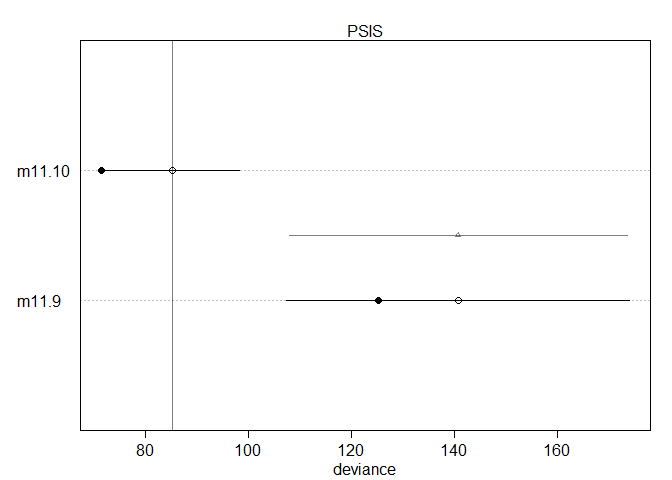<!-- -->


```r
## R code 11.46
compare( m11.9 , m11.10 )
```

```
##             WAIC       SE    dWAIC      dSE    pWAIC       weight
## m11.10  83.59686 12.23237  0.00000       NA 6.116917 1.000000e+00
## m11.9  140.43193 31.56546 56.83507 33.40582 7.665181 4.554308e-13
```

```r
plot(compare(  m11.9 , m11.10 ))
```

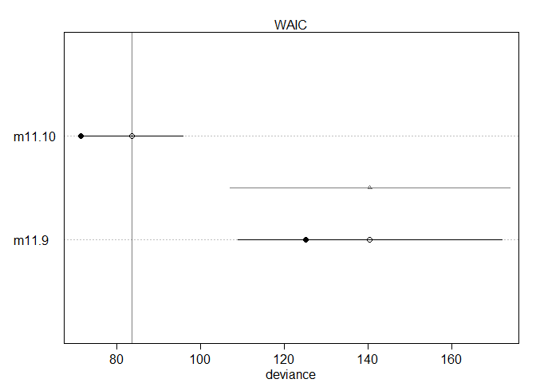<!-- -->


```r
## R code 11.47
k <- PSIS( m11.10 , pointwise=TRUE )$k
```

```
## Some Pareto k values are high (>0.5). Set pointwise=TRUE to inspect individual points.
```

```r
plot( dat$P , dat$T , xlab="log population (std)" , ylab="total tools" ,
    col=rangi2 , pch=ifelse( dat$cid==1 , 1 , 16 ) , lwd=2 ,
    ylim=c(0,75) , cex=1+normalize(k) )

# set up the horizontal axis values to compute predictions at
ns <- 100
P_seq <- seq( from=-1.4 , to=3 , length.out=ns )

# predictions for cid=1 (low contact)
lambda <- link( m11.10 , data=data.frame( P=P_seq , cid=1 ) )
lmu <- apply( lambda , 2 , mean )
lci <- apply( lambda , 2 , PI )
lines( P_seq , lmu , lty=2 , lwd=1.5 )
shade( lci , P_seq , xpd=TRUE )
```

```
## Warning in if (class(object) == "formula") {: 條件的長度 > 1，因此只能用其第一元
## 素
```

```
## Warning in if (class(object) == "density") {: 條件的長度 > 1，因此只能用其第一元
## 素
```

```
## Warning in if (class(object) == "matrix" & length(dim(object)) == 2) {: 條件的長
## 度 > 1，因此只能用其第一元素
```

```
## Warning in if (class(object) == "matrix") {: 條件的長度 > 1，因此只能用其第一元
## 素
```

```r
# predictions for cid=2 (high contact)
lambda <- link( m11.10 , data=data.frame( P=P_seq , cid=2 ) )
lmu <- apply( lambda , 2 , mean )
lci <- apply( lambda , 2 , PI )
lines( P_seq , lmu , lty=1 , lwd=1.5 )
shade( lci , P_seq , xpd=TRUE )
```

```
## Warning in if (class(object) == "formula") {: 條件的長度 > 1，因此只能用其第一元
## 素
```

```
## Warning in if (class(object) == "density") {: 條件的長度 > 1，因此只能用其第一元
## 素
```

```
## Warning in if (class(object) == "matrix" & length(dim(object)) == 2) {: 條件的長
## 度 > 1，因此只能用其第一元素
```

```
## Warning in if (class(object) == "matrix") {: 條件的長度 > 1，因此只能用其第一元
## 素
```

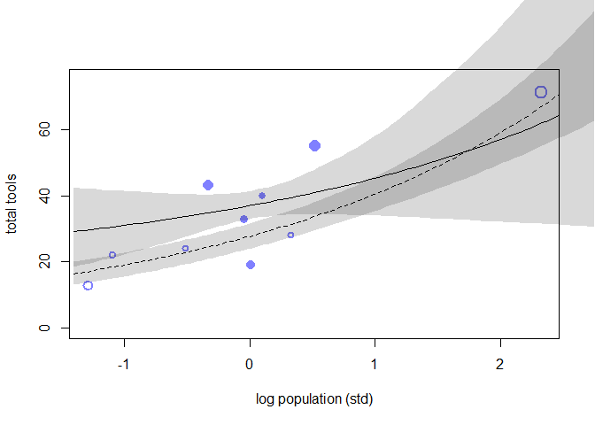<!-- -->

```r
## R code 11.48
plot( d$population , d$total_tools , xlab="population" , ylab="total tools" ,
    col=rangi2 , pch=ifelse( dat$cid==1 , 1 , 16 ) , lwd=2 ,
    ylim=c(0,75) , cex=1+normalize(k) )

ns <- 100
P_seq <- seq( from=-5 , to=3 , length.out=ns )
# 1.53 is sd of log(population)
# 9 is mean of log(population)
pop_seq <- exp( P_seq*1.53 + 9 )

lambda <- link( m11.10 , data=data.frame( P=P_seq , cid=1 ) )
lmu <- apply( lambda , 2 , mean )
lci <- apply( lambda , 2 , PI )
lines( pop_seq , lmu , lty=2 , lwd=1.5 )
shade( lci , pop_seq , xpd=TRUE )
```

```
## Warning in if (class(object) == "formula") {: 條件的長度 > 1，因此只能用其第一元
## 素
```

```
## Warning in if (class(object) == "density") {: 條件的長度 > 1，因此只能用其第一元
## 素
```

```
## Warning in if (class(object) == "matrix" & length(dim(object)) == 2) {: 條件的長
## 度 > 1，因此只能用其第一元素
```

```
## Warning in if (class(object) == "matrix") {: 條件的長度 > 1，因此只能用其第一元
## 素
```

```r
lambda <- link( m11.10 , data=data.frame( P=P_seq , cid=2 ) )
lmu <- apply( lambda , 2 , mean )
lci <- apply( lambda , 2 , PI )
lines( pop_seq , lmu , lty=1 , lwd=1.5 )
shade( lci , pop_seq , xpd=TRUE )
```

```
## Warning in if (class(object) == "formula") {: 條件的長度 > 1，因此只能用其第一元
## 素
```

```
## Warning in if (class(object) == "density") {: 條件的長度 > 1，因此只能用其第一元
## 素
```

```
## Warning in if (class(object) == "matrix" & length(dim(object)) == 2) {: 條件的長
## 度 > 1，因此只能用其第一元素
```

```
## Warning in if (class(object) == "matrix") {: 條件的長度 > 1，因此只能用其第一元
## 素
```

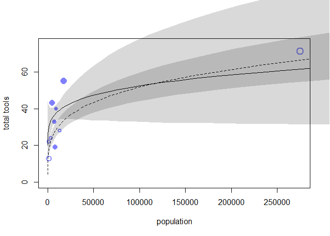<!-- -->

### Overthinking: Modeling tool innovation.

Taking the verbal model in the main text above, we can write that the change in the expected number of tools in one time step is:
ΔT = αPβ − γT
where P is the population size, T is the number of tools, and α, β, and γ are parameters to be estimated.
To find an equilibrium number of tools T, just set ΔT = 0 and solve for T. This yields:
ˆT = αPβ / γ


```r
## R code 11.49
dat2 <- list( T=d$total_tools, P=d$population, cid=d$contact_id )
m11.11 <- ulam(
    alist(
        T ~ dpois( lambda ),
        lambda <- exp(a[cid])*P^b[cid]/g,
        a[cid] ~ dnorm(1,1),
        b[cid] ~ dexp(1),
        g ~ dexp(1)
    ), data=dat2 , chains=4 , log_lik=TRUE )
```

```
## 
## SAMPLING FOR MODEL '1d9bfc94a8db83d885271311e6e47d39' NOW (CHAIN 1).
## Chain 1: 
## Chain 1: Gradient evaluation took 0 seconds
## Chain 1: 1000 transitions using 10 leapfrog steps per transition would take 0 seconds.
## Chain 1: Adjust your expectations accordingly!
## Chain 1: 
## Chain 1: 
## Chain 1: Iteration:   1 / 1000 [  0%]  (Warmup)
## Chain 1: Iteration: 100 / 1000 [ 10%]  (Warmup)
## Chain 1: Iteration: 200 / 1000 [ 20%]  (Warmup)
## Chain 1: Iteration: 300 / 1000 [ 30%]  (Warmup)
## Chain 1: Iteration: 400 / 1000 [ 40%]  (Warmup)
## Chain 1: Iteration: 500 / 1000 [ 50%]  (Warmup)
## Chain 1: Iteration: 501 / 1000 [ 50%]  (Sampling)
## Chain 1: Iteration: 600 / 1000 [ 60%]  (Sampling)
## Chain 1: Iteration: 700 / 1000 [ 70%]  (Sampling)
## Chain 1: Iteration: 800 / 1000 [ 80%]  (Sampling)
## Chain 1: Iteration: 900 / 1000 [ 90%]  (Sampling)
## Chain 1: Iteration: 1000 / 1000 [100%]  (Sampling)
## Chain 1: 
## Chain 1:  Elapsed Time: 0.725 seconds (Warm-up)
## Chain 1:                0.702 seconds (Sampling)
## Chain 1:                1.427 seconds (Total)
## Chain 1: 
## 
## SAMPLING FOR MODEL '1d9bfc94a8db83d885271311e6e47d39' NOW (CHAIN 2).
## Chain 2: 
## Chain 2: Gradient evaluation took 0 seconds
## Chain 2: 1000 transitions using 10 leapfrog steps per transition would take 0 seconds.
## Chain 2: Adjust your expectations accordingly!
## Chain 2: 
## Chain 2: 
## Chain 2: Iteration:   1 / 1000 [  0%]  (Warmup)
## Chain 2: Iteration: 100 / 1000 [ 10%]  (Warmup)
## Chain 2: Iteration: 200 / 1000 [ 20%]  (Warmup)
## Chain 2: Iteration: 300 / 1000 [ 30%]  (Warmup)
## Chain 2: Iteration: 400 / 1000 [ 40%]  (Warmup)
## Chain 2: Iteration: 500 / 1000 [ 50%]  (Warmup)
## Chain 2: Iteration: 501 / 1000 [ 50%]  (Sampling)
## Chain 2: Iteration: 600 / 1000 [ 60%]  (Sampling)
## Chain 2: Iteration: 700 / 1000 [ 70%]  (Sampling)
## Chain 2: Iteration: 800 / 1000 [ 80%]  (Sampling)
## Chain 2: Iteration: 900 / 1000 [ 90%]  (Sampling)
## Chain 2: Iteration: 1000 / 1000 [100%]  (Sampling)
## Chain 2: 
## Chain 2:  Elapsed Time: 2.797 seconds (Warm-up)
## Chain 2:                4.466 seconds (Sampling)
## Chain 2:                7.263 seconds (Total)
## Chain 2: 
## 
## SAMPLING FOR MODEL '1d9bfc94a8db83d885271311e6e47d39' NOW (CHAIN 3).
## Chain 3: 
## Chain 3: Gradient evaluation took 0 seconds
## Chain 3: 1000 transitions using 10 leapfrog steps per transition would take 0 seconds.
## Chain 3: Adjust your expectations accordingly!
## Chain 3: 
## Chain 3: 
## Chain 3: Iteration:   1 / 1000 [  0%]  (Warmup)
## Chain 3: Iteration: 100 / 1000 [ 10%]  (Warmup)
## Chain 3: Iteration: 200 / 1000 [ 20%]  (Warmup)
## Chain 3: Iteration: 300 / 1000 [ 30%]  (Warmup)
## Chain 3: Iteration: 400 / 1000 [ 40%]  (Warmup)
## Chain 3: Iteration: 500 / 1000 [ 50%]  (Warmup)
## Chain 3: Iteration: 501 / 1000 [ 50%]  (Sampling)
## Chain 3: Iteration: 600 / 1000 [ 60%]  (Sampling)
## Chain 3: Iteration: 700 / 1000 [ 70%]  (Sampling)
## Chain 3: Iteration: 800 / 1000 [ 80%]  (Sampling)
## Chain 3: Iteration: 900 / 1000 [ 90%]  (Sampling)
## Chain 3: Iteration: 1000 / 1000 [100%]  (Sampling)
## Chain 3: 
## Chain 3:  Elapsed Time: 0.623 seconds (Warm-up)
## Chain 3:                0.719 seconds (Sampling)
## Chain 3:                1.342 seconds (Total)
## Chain 3: 
## 
## SAMPLING FOR MODEL '1d9bfc94a8db83d885271311e6e47d39' NOW (CHAIN 4).
## Chain 4: 
## Chain 4: Gradient evaluation took 0 seconds
## Chain 4: 1000 transitions using 10 leapfrog steps per transition would take 0 seconds.
## Chain 4: Adjust your expectations accordingly!
## Chain 4: 
## Chain 4: 
## Chain 4: Iteration:   1 / 1000 [  0%]  (Warmup)
## Chain 4: Iteration: 100 / 1000 [ 10%]  (Warmup)
## Chain 4: Iteration: 200 / 1000 [ 20%]  (Warmup)
## Chain 4: Iteration: 300 / 1000 [ 30%]  (Warmup)
## Chain 4: Iteration: 400 / 1000 [ 40%]  (Warmup)
## Chain 4: Iteration: 500 / 1000 [ 50%]  (Warmup)
## Chain 4: Iteration: 501 / 1000 [ 50%]  (Sampling)
## Chain 4: Iteration: 600 / 1000 [ 60%]  (Sampling)
## Chain 4: Iteration: 700 / 1000 [ 70%]  (Sampling)
## Chain 4: Iteration: 800 / 1000 [ 80%]  (Sampling)
## Chain 4: Iteration: 900 / 1000 [ 90%]  (Sampling)
## Chain 4: Iteration: 1000 / 1000 [100%]  (Sampling)
## Chain 4: 
## Chain 4:  Elapsed Time: 1.428 seconds (Warm-up)
## Chain 4:                0.66 seconds (Sampling)
## Chain 4:                2.088 seconds (Total)
## Chain 4:
```

```
## Warning: There were 160 transitions after warmup that exceeded the maximum treedepth. Increase max_treedepth above 10. See
## http://mc-stan.org/misc/warnings.html#maximum-treedepth-exceeded
```

```
## Warning: Examine the pairs() plot to diagnose sampling problems
```


```r
## R code 11.46
compare( m11.9 , m11.10 , m11.11 , func=PSIS )
```

```
## Some Pareto k values are high (>0.5). Set pointwise=TRUE to inspect individual points.
## Some Pareto k values are high (>0.5). Set pointwise=TRUE to inspect individual points.
## Some Pareto k values are high (>0.5). Set pointwise=TRUE to inspect individual points.
```

```
##             PSIS       SE     dPSIS       dSE    pPSIS      weight
## m11.11  82.35611 12.18539  0.000000        NA 6.048134 7.98268e-01
## m11.10  85.10712 13.11247  2.751008  5.214171 6.872045 2.01732e-01
## m11.9  140.62758 33.30548 58.271470 34.290895 7.763007 1.77280e-13
```

```r
plot(compare(  m11.9 , m11.10 , m11.11 , func=PSIS ))
```

```
## Some Pareto k values are high (>0.5). Set pointwise=TRUE to inspect individual points.
## Some Pareto k values are high (>0.5). Set pointwise=TRUE to inspect individual points.
## Some Pareto k values are high (>0.5). Set pointwise=TRUE to inspect individual points.
```

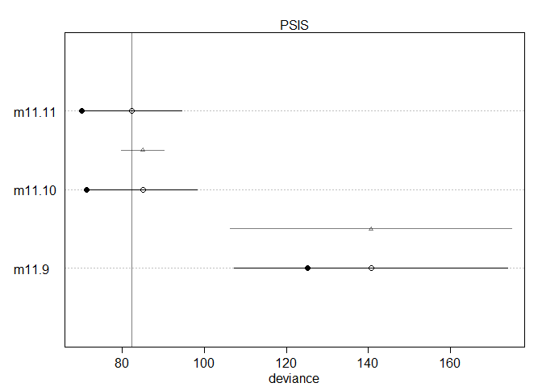<!-- -->


```r
## R code 11.46
compare( m11.9 , m11.10 , m11.11 )
```

```
##             WAIC       SE     dWAIC       dSE    pWAIC       weight
## m11.11  80.94960 11.41859  0.000000        NA 5.344882 7.897849e-01
## m11.10  83.59686 12.23237  2.647259  5.326616 6.116917 2.102151e-01
## m11.9  140.43193 31.56546 59.482324 34.645481 7.665181 9.573842e-14
```

```r
plot(compare(  m11.9 , m11.10 , m11.11 ))
```

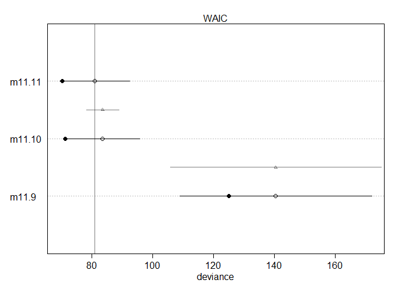<!-- -->

### overall compare

> Gaussian process model: m14.7, m14.7nc

> Chapter 11 model: m11.9, m11.10, m11.11


```r
compare(m14.7, m14.7nc , m11.9 , m11.10 , m11.11)
```

```
##              WAIC        SE        dWAIC        dSE    pWAIC       weight
## m14.7    67.57513  2.340373  0.000000000         NA 4.073945 5.005969e-01
## m14.7nc  67.58308  2.309671  0.007942452  0.2905651 4.087376 4.986129e-01
## m11.11   80.94960 11.418588 13.374470998 11.4941541 5.344882 6.241065e-04
## m11.10   83.59686 12.232370 16.021729993 12.1262505 6.116917 1.661169e-04
## m11.9   140.43193 31.565457 72.856795273 32.6260948 7.665181 7.565473e-17
```

```r
plot(compare(m14.7, m14.7nc , m11.9 , m11.10 , m11.11))
```

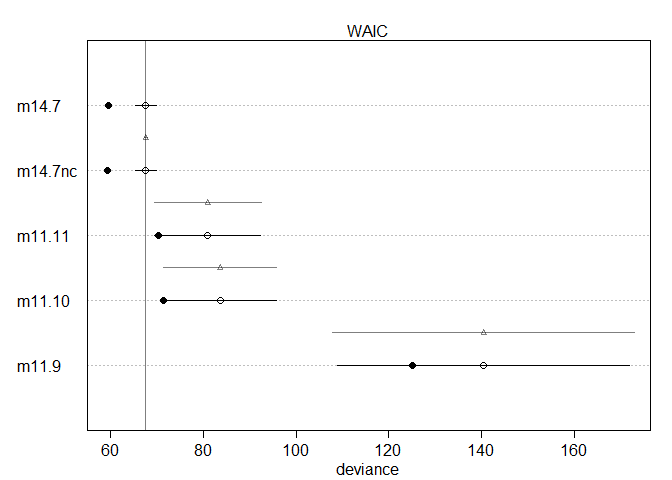<!-- -->

