### 14.5.2. Example: Phylogenetic distance.


```r
## R code 14.46
library(rethinking)
```

```
## Loading required package: rstan
```

```
## Loading required package: StanHeaders
```

```
## Loading required package: ggplot2
```

```
## rstan (Version 2.19.3, GitRev: 2e1f913d3ca3)
```

```
## For execution on a local, multicore CPU with excess RAM we recommend calling
## options(mc.cores = parallel::detectCores()).
## To avoid recompilation of unchanged Stan programs, we recommend calling
## rstan_options(auto_write = TRUE)
```

```
## For improved execution time, we recommend calling
## Sys.setenv(LOCAL_CPPFLAGS = '-march=corei7 -mtune=corei7')
## although this causes Stan to throw an error on a few processors.
```

```
## Loading required package: parallel
```

```
## Loading required package: dagitty
```

```
## rethinking (Version 2.01)
```

```
## 
## Attaching package: 'rethinking'
```

```
## The following object is masked from 'package:stats':
## 
##     rstudent
```

```r
data(Primates301)
data(Primates301_nex)

# plot it using ape package - install.packages('ape') if needed
library(ape)
```

```
## 
## Attaching package: 'ape'
```

```
## The following object is masked from 'package:dagitty':
## 
##     edges
```

```r
plot( ladderize(Primates301_nex) , type="fan" , font=1 , no.margin=TRUE ,
    label.offset=1 , cex=0.5 )
```

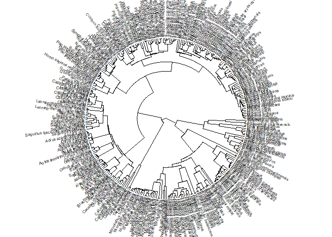<!-- -->


```r
## R code 14.47
d <- Primates301
d$name <- as.character(d$name)
dstan <- d[ complete.cases( d$group_size , d$body , d$brain ) , ]
spp_obs <- dstan$name
```


```r
## R code 14.48
dat_list <- list(
    N_spp = nrow(dstan),
    M = standardize(log(dstan$body)),
    B = standardize(log(dstan$brain)),
    G = standardize(log(dstan$group_size)),
    Imat = diag( nrow(dstan) )
)

m14.8 <- ulam(
    alist(
        B ~ multi_normal( mu , SIGMA ),
        mu <- a + bM*M + bG*G,
        matrix[N_spp,N_spp]: SIGMA <- Imat * sigma_sq,
        a ~ normal( 0 , 1 ),
        c(bM,bG) ~ normal( 0 , 0.5 ),
        sigma_sq ~ exponential( 1 )
    ), data=dat_list , chains=4 , cores=4 )
precis( m14.8 )
```

```
##                   mean          sd        5.5%      94.5%    n_eff     Rhat4
## a        -0.0003684122 0.017560057 -0.02796194 0.02819386 2162.901 0.9992146
## bG        0.1229328009 0.022800388  0.08579919 0.16071628 1275.269 1.0000383
## bM        0.8926281755 0.022853716  0.85550229 0.92862981 1260.562 1.0001329
## sigma_sq  0.0474504646 0.005833277  0.03905991 0.05723830 1579.124 0.9992123
```

```r
plot(precis( m14.8 ))
```

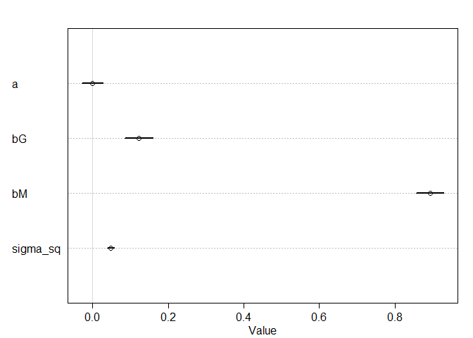<!-- -->


```r
## R code 14.49
library(ape)
tree_trimmed <- keep.tip( Primates301_nex, spp_obs )
Rbm <- corBrownian( phy=tree_trimmed )
V <- vcv(Rbm)
```

```
## Warning in Initialize.corPhyl(phy, dummy.df): No covariate specified, species
## will be taken as ordered in the data frame. To avoid this message, specify a
## covariate containing the species names with the 'form' argument.
```

```r
Dmat <- cophenetic( tree_trimmed )
plot( Dmat , V , xlab="phylogenetic distance" , ylab="covariance" )
```

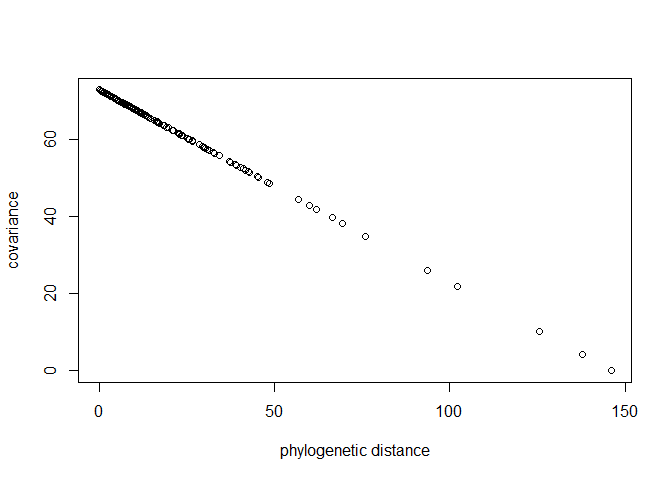<!-- -->

```r
image(V)
```

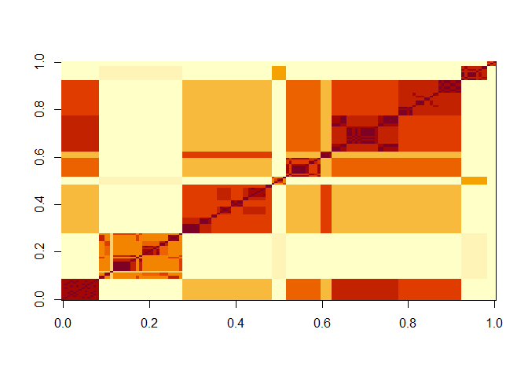<!-- -->

```r
image(Dmat)
```

<!-- -->


```r
## R code 14.50
# put species in right order
dat_list$V <- V[ spp_obs , spp_obs ]
# convert to correlation matrix
dat_list$R <- dat_list$V / max(V)

# Brownian motion model
m14.9 <- ulam(
    alist(
        B ~ multi_normal( mu , SIGMA ),
        mu <- a + bM*M + bG*G,
        matrix[N_spp,N_spp]: SIGMA <- R * sigma_sq,
        a ~ normal( 0 , 1 ),
        c(bM,bG) ~ normal( 0 , 0.5 ),
        sigma_sq ~ exponential( 1 )
    ), data=dat_list , chains=4 , cores=4 )
precis( m14.9 )
```

```
##                 mean         sd        5.5%      94.5%    n_eff     Rhat4
## a        -0.19074006 0.16199529 -0.45113279 0.06061522 2359.728 0.9989109
## bG       -0.01251199 0.01977136 -0.04407352 0.01853338 2519.694 0.9986103
## bM        0.69987422 0.03726349  0.64023395 0.76091447 2676.476 0.9992115
## sigma_sq  0.16149988 0.01971757  0.13211704 0.19573641 2277.577 0.9996105
```

```r
plot(precis( m14.9 ))
```

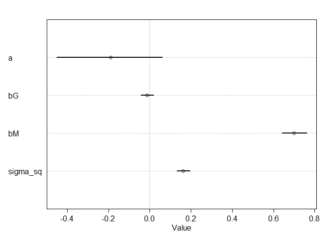<!-- -->


```r
## R code 14.51
# add scaled and reordered distance matrix
dat_list$Dmat <- Dmat[ spp_obs , spp_obs ] / max(Dmat)

m14.10 <- ulam(
    alist(
        B ~ multi_normal( mu , SIGMA ),
        mu <- a + bM*M + bG*G,
        matrix[N_spp,N_spp]: SIGMA <- cov_GPL1( Dmat , etasq , rhosq , 0.01 ),
        a ~ normal(0,1),
        c(bM,bG) ~ normal(0,0.5),
        etasq ~ half_normal(1,0.25),
        rhosq ~ half_normal(3,0.25)
    ), data=dat_list , chains=4 , cores=4 )
precis( m14.10 )
```

```
##              mean          sd        5.5%      94.5%    n_eff     Rhat4
## a     -0.06381581 0.076401590 -0.18087941 0.06241501 1871.476 1.0018397
## bG     0.04874793 0.024031022  0.01052777 0.08707821 1989.329 1.0028719
## bM     0.83527863 0.029221927  0.78885058 0.88175403 1759.368 1.0003597
## etasq  0.03551834 0.007017505  0.02598074 0.04769481 1433.294 1.0011172
## rhosq  2.78524033 0.253536766  2.38831049 3.18364605 2105.653 0.9995808
```

```r
plot(precis( m14.10 ))
```

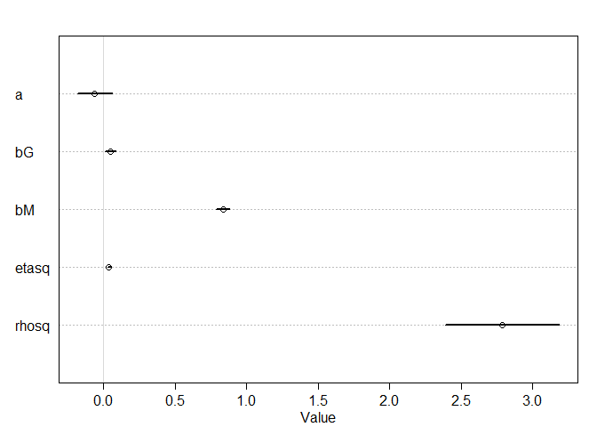<!-- -->


```r
## R code 14.52
post <- extract.samples(m14.10)
plot( NULL , xlim=c(0,max(dat_list$Dmat)) , ylim=c(0,1.5) ,
    xlab="phylogenetic distance" , ylab="covariance" )

# posterior
for ( i in 1:30 )
    curve( post$etasq[i]*exp(-post$rhosq[i]*x) , add=TRUE , col=rangi2 )

# prior mean and 89% interval
eta <- abs(rnorm(1e3,1,0.25))
rho <- abs(rnorm(1e3,3,0.25))
d_seq <- seq(from=0,to=1,length.out=50)
K <- sapply( d_seq , function(x) eta*exp(-rho*x) )
lines( d_seq , colMeans(K) , lwd=2 )
shade( apply(K,2,PI) , d_seq )
```

```
## Warning in if (class(object) == "formula") {: 條件的長度 > 1，因此只能用其第一元
## 素
```

```
## Warning in if (class(object) == "density") {: 條件的長度 > 1，因此只能用其第一元
## 素
```

```
## Warning in if (class(object) == "matrix" & length(dim(object)) == 2) {: 條件的長
## 度 > 1，因此只能用其第一元素
```

```
## Warning in if (class(object) == "matrix") {: 條件的長度 > 1，因此只能用其第一元
## 素
```

```r
text( 0.5 , 0.5 , "prior" )
text( 0.2 , 0.1 , "posterior" , col=rangi2 )
```

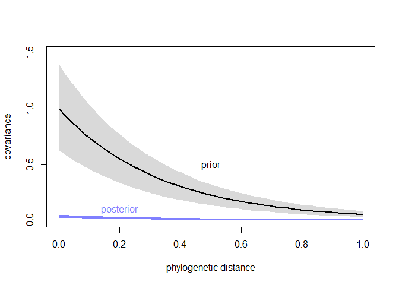<!-- -->

## 14.7. Practice

### 14M5. Modify the phylogenetic distance example to use group size as the outcome and brain size as a predictor. Assuming brain size influences group size, what is your estimate of the effect? How does phylogeny influence the estimate?


```r
## R code 14.48
dat_list <- list(
    N_spp = nrow(dstan),
    M = standardize(log(dstan$body)),
    B = standardize(log(dstan$brain)),
    G = standardize(log(dstan$group_size)),
    Imat = diag( nrow(dstan) )
)

m14.8_G <- ulam(
    alist(
        G ~ multi_normal( mu , SIGMA ),
        mu <- a + bM*M + bB*B,
        matrix[N_spp,N_spp]: SIGMA <- Imat * sigma_sq,
        a ~ normal( 0 , 1 ),
        c(bM,bB) ~ normal( 0 , 0.5 ),
        sigma_sq ~ exponential( 1 )
    ), data=dat_list , chains=4 , cores=4 )
precis( m14.8_G )
```

```
##                  mean         sd       5.5%       94.5%     n_eff    Rhat4
## a        -0.002959273 0.05803383 -0.1005717 0.091562029 1275.7998 1.000684
## bB        1.003509519 0.21670304  0.6580502 1.351644492  894.6401 1.001186
## bM       -0.337506932 0.21508056 -0.6806882 0.001035547  907.1143 1.001175
## sigma_sq  0.519697358 0.06222418  0.4297409 0.625369417 1296.3917 1.000011
```

```r
plot(precis( m14.8_G ))
```

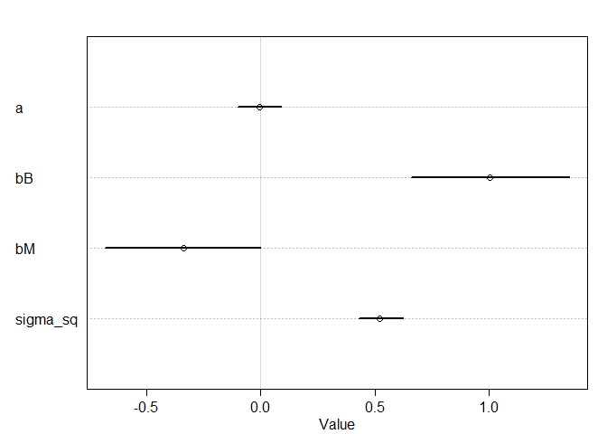<!-- -->
> Using an identity matrix (no phylogeny), brain size influences group size strongly positively and body mass influences group size slightly negativly. 


```r
## R code 14.50
# put species in right order
dat_list$V <- V[ spp_obs , spp_obs ]
# convert to correlation matrix
dat_list$R <- dat_list$V / max(V)

# Brownian motion model
m14.9_G <- ulam(
    alist(
        G ~ multi_normal( mu , SIGMA ),
        mu <- a + bM*M + bB*B,
        matrix[N_spp,N_spp]: SIGMA <- R * sigma_sq,
        a ~ normal( 0 , 1 ),
        c(bM,bB) ~ normal( 0 , 0.5 ),
        sigma_sq ~ exponential( 1 )
    ), data=dat_list , chains=4 , cores=4 )
precis( m14.9_G )
```

```
##                 mean        sd        5.5%     94.5%    n_eff     Rhat4
## a        -0.47891353 0.5661733 -1.37871458 0.4146067 1721.618 0.9990326
## bB       -0.07213373 0.2604217 -0.49949196 0.3476626 1005.297 1.0030571
## bM        0.34472936 0.2228063 -0.01722899 0.7021525 1054.528 1.0020198
## sigma_sq  2.71001264 0.3145549  2.23522340 3.2439955 1443.262 0.9988984
```

```r
plot(precis( m14.9_G ))
```

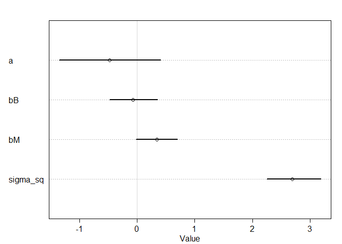<!-- -->

> Using the Brownian motion model, body mass influences group size slightly positively.


```r
## R code 14.51
# add scaled and reordered distance matrix
dat_list$Dmat <- Dmat[ spp_obs , spp_obs ] / max(Dmat)

m14.10_G <- ulam(
    alist(
        G ~ multi_normal( mu , SIGMA ),
        mu <- a + bM*M + bB*B,
        matrix[N_spp,N_spp]: SIGMA <- cov_GPL1( Dmat , etasq , rhosq , 0.01 ),
        a ~ normal(0,1),
        c(bM,bB) ~ normal(0,0.5),
        etasq ~ half_normal(1,0.25),
        rhosq ~ half_normal(3,0.25)
    ), data=dat_list , chains=4 , cores=4 )
precis( m14.10_G )
```

```
##             mean        sd       5.5%      94.5%    n_eff    Rhat4
## a     -0.5144294 0.3506761 -1.0655383 0.02951652 1666.489 1.000650
## bB     0.1832881 0.2600531 -0.2293816 0.60378246 1416.013 1.000983
## bM     0.1852886 0.2279856 -0.1897982 0.54015812 1322.623 1.000537
## etasq  0.9265531 0.1193749  0.7493474 1.12170421 1650.464 1.000921
## rhosq  3.0166918 0.2415645  2.6284926 3.40221270 1716.895 1.000302
```

```r
plot(precis( m14.10_G ))
```

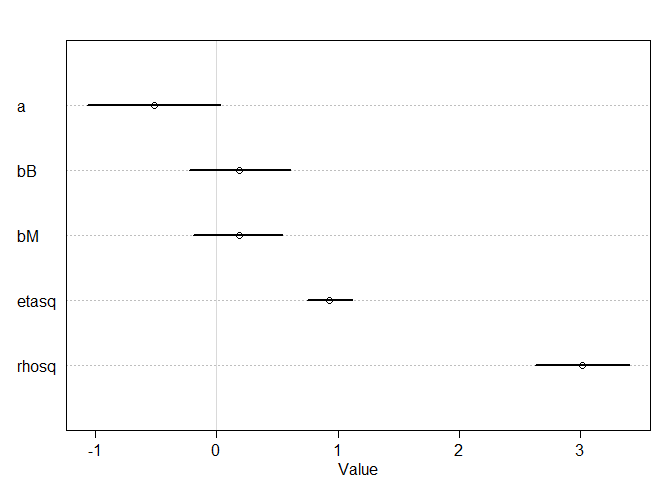<!-- -->

> Using the Ornstein–Uhlenbeck process (or OU process), both brain size and body mass seems to have much smaller positive effects (almost no effect) on group size.


### 14H2. Varying effects models are useful for modeling time series, as well as spatial clustering. In a time series, the observations cluster by entities that have continuity through time, such as individuals. Since observations within individuals are likely highly correlated, the multilevel structure can help quite a lot. You’ll use the data in data(Oxboys), which is 234 height measurements on 26 boys from an Oxford Boys Club (I think these were like youth athletic leagues?), at 9 different ages (centered and standardized) per boy. You’ll be interested in predicting height, using age, clustered by Subject (individual boy).
### Fit a model with varying intercepts and slopes (on age), clustered by Subject. Present and interpret the parameter estimates. Which varying effect contributes more variation to the heights, the intercept or the slope?


```r
library(tidyverse)
```

```
## Warning: package 'tidyverse' was built under R version 4.0.2
```

```
## -- Attaching packages --------------------------------------- tidyverse 1.3.0 --
```

```
## √ tibble  3.0.1     √ dplyr   1.0.0
## √ tidyr   1.1.0     √ stringr 1.4.0
## √ readr   1.3.1     √ forcats 0.5.0
## √ purrr   0.3.4
```

```
## Warning: package 'readr' was built under R version 4.0.2
```

```
## -- Conflicts ------------------------------------------ tidyverse_conflicts() --
## x tidyr::extract() masks rstan::extract()
## x dplyr::filter()  masks stats::filter()
## x dplyr::lag()     masks stats::lag()
## x purrr::map()     masks rethinking::map()
```

```r
library(dplyr)

data(Oxboys)
d <- Oxboys

d %>% ggplot(aes(age, height, group=Subject, color=as.factor(Subject))) + 
    geom_line() + 
    geom_point(size=2) + 
    ggtitle("Boys height as function of age", subtitle = "Each line: group=Subject")
```

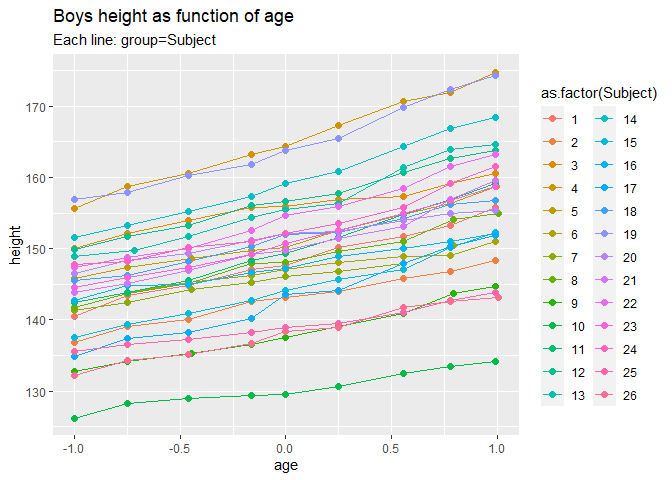<!-- -->

```r
d$height_centered <- (d$height - mean(d$height)) / sd(d$height)
str(d)
```

```
## 'data.frame':	234 obs. of  5 variables:
##  $ Subject        : int  1 1 1 1 1 1 1 1 1 2 ...
##  $ age            : num  -1 -0.7479 -0.463 -0.1643 -0.0027 ...
##  $ height         : num  140 143 145 147 148 ...
##  $ Occasion       : int  1 2 3 4 5 6 7 8 9 1 ...
##  $ height_centered: num  -0.991 -0.672 -0.518 -0.266 -0.2 ...
```

```r
summary(d)
```

```
##     Subject          age               height         Occasion
##  Min.   : 1.0   Min.   :-1.00000   Min.   :126.2   Min.   :1  
##  1st Qu.: 7.0   1st Qu.:-0.46300   1st Qu.:143.8   1st Qu.:3  
##  Median :13.5   Median :-0.00270   Median :149.5   Median :5  
##  Mean   :13.5   Mean   : 0.02263   Mean   :149.5   Mean   :5  
##  3rd Qu.:20.0   3rd Qu.: 0.55620   3rd Qu.:155.5   3rd Qu.:7  
##  Max.   :26.0   Max.   : 1.00550   Max.   :174.8   Max.   :9  
##  height_centered    
##  Min.   :-2.561668  
##  1st Qu.:-0.625538  
##  Median :-0.002131  
##  Mean   : 0.000000  
##  3rd Qu.: 0.654231  
##  Max.   : 2.777108
```

```r
dat_list_OB <- list(
    height_centered = d$height_centered,
    Subject = d$Subject,
    age = d$age)
str(dat_list_OB)
```

```
## List of 3
##  $ height_centered: num [1:234] -0.991 -0.672 -0.518 -0.266 -0.2 ...
##  $ Subject        : int [1:234] 1 1 1 1 1 1 1 1 1 2 ...
##  $ age            : num [1:234] -1 -0.7479 -0.463 -0.1643 -0.0027 ...
```

```r
summary(dat_list_OB)
```

```
##                 Length Class  Mode   
## height_centered 234    -none- numeric
## Subject         234    -none- numeric
## age             234    -none- numeric
```


```r
m14H2_centered <- ulam(
  alist(
    height_centered ~ dnorm(mu, sigma), 
    mu <- a + a_S[Subject] + (b + b_S[Subject])*age,
    c(a_S, b_S)[Subject] ~ multi_normal(0, Rho, sigma_S),
    a ~ dnorm(150, 10),
    b ~ dnorm(0, 1),
    sigma ~ exponential( 1 ),
    sigma_S ~ exponential( 1 ),
    Rho ~ lkj_corr( 2 )
    ), data=dat_list_OB, chains=4, cores=4, log_lik = TRUE )
```

```
## Warning: There were 1 transitions after warmup that exceeded the maximum treedepth. Increase max_treedepth above 10. See
## http://mc-stan.org/misc/warnings.html#maximum-treedepth-exceeded
```

```
## Warning: Examine the pairs() plot to diagnose sampling problems
```

```
## Warning: The largest R-hat is NA, indicating chains have not mixed.
## Running the chains for more iterations may help. See
## http://mc-stan.org/misc/warnings.html#r-hat
```

```
## Warning: Bulk Effective Samples Size (ESS) is too low, indicating posterior means and medians may be unreliable.
## Running the chains for more iterations may help. See
## http://mc-stan.org/misc/warnings.html#bulk-ess
```

```
## Warning: Tail Effective Samples Size (ESS) is too low, indicating posterior variances and tail quantiles may be unreliable.
## Running the chains for more iterations may help. See
## http://mc-stan.org/misc/warnings.html#tail-ess
```

```r
precis(m14H2_centered, depth=2)
```

```
## 4 matrix parameters hidden. Use depth=3 to show them.
```

```
##                   mean          sd        5.5%       94.5%    n_eff     Rhat4
## b_S[1]      0.05688423 0.052812328 -0.03182415  0.13862565 202.0814 1.0113428
## b_S[2]     -0.12748642 0.052549193 -0.21371428 -0.04320521 192.2342 1.0111371
## b_S[3]     -0.18438309 0.051860773 -0.26498120 -0.10047779 220.1195 1.0091379
## b_S[4]      0.29640180 0.051317619  0.21141884  0.37686042 211.0921 1.0088515
## b_S[5]     -0.03623653 0.051714123 -0.11966010  0.04768644 203.8420 1.0095598
## b_S[6]     -0.27649357 0.051721296 -0.35976374 -0.19472786 227.9272 1.0067722
## b_S[7]     -0.16923019 0.051765794 -0.25540748 -0.08551883 210.1112 1.0099059
## b_S[8]     -0.01638269 0.051742891 -0.09898453  0.06653366 204.1389 1.0090937
## b_S[9]     -0.07125045 0.052028383 -0.15370363  0.01150212 204.1871 1.0088412
## b_S[10]    -0.31354008 0.052269126 -0.39786121 -0.23276700 220.5140 1.0086271
## b_S[11]     0.19678762 0.050201247  0.11738905  0.27814782 216.0399 1.0087926
## b_S[12]     0.04799880 0.051370021 -0.03330341  0.13111768 205.2913 1.0057475
## b_S[13]     0.19984327 0.050835850  0.12010253  0.28296969 208.7970 1.0077967
## b_S[14]     0.22098338 0.052047941  0.13469340  0.30425466 230.1481 1.0090424
## b_S[15]     0.04909893 0.051526001 -0.03322588  0.13551986 212.1792 1.0117811
## b_S[16]    -0.21526359 0.051103806 -0.30006464 -0.13637365 215.5221 1.0091274
## b_S[17]     0.20201758 0.051404148  0.11868778  0.28361473 211.4567 1.0101265
## b_S[18]    -0.06554735 0.051090550 -0.14814636  0.01340866 221.0514 1.0090937
## b_S[19]     0.26567463 0.050941234  0.18638473  0.34819740 212.4421 1.0101838
## b_S[20]    -0.22992417 0.053020028 -0.31536986 -0.14650356 221.6783 1.0088268
## b_S[21]     0.09305964 0.050659655  0.01278918  0.17390689 200.8741 1.0099729
## b_S[22]     0.15735223 0.051034531  0.07580568  0.23930162 210.2869 1.0077858
## b_S[23]     0.06062483 0.051787549 -0.02123669  0.14494561 200.5664 1.0121408
## b_S[24]     0.01860805 0.052647781 -0.06573824  0.10449516 203.4176 1.0093499
## b_S[25]    -0.27669298 0.052217467 -0.36204197 -0.19339865 214.4709 1.0085223
## b_S[26]    -0.11494311 0.052448113 -0.19880194 -0.03293957 205.6197 1.0083578
## a_S[1]     -0.19463447 0.154668929 -0.44752102  0.05092104 104.1975 1.0040483
## a_S[2]     -0.77259603 0.154141309 -1.02431988 -0.52369369 102.6700 1.0041923
## a_S[3]      0.63009509 0.152954121  0.38065609  0.87007376 103.4790 1.0042803
## a_S[4]      1.66603074 0.153768463  1.41491403  1.90622738 101.5971 1.0051436
## a_S[5]      0.16810260 0.154086084 -0.08541710  0.41421649 101.9509 1.0043557
## a_S[6]     -0.34141022 0.154519836 -0.59524467 -0.09745654 101.8631 1.0041138
## a_S[7]     -0.41340783 0.154664010 -0.66830829 -0.16930960 101.7544 1.0031144
## a_S[8]     -0.17708931 0.153854912 -0.42672290  0.06652326 103.3297 1.0036224
## a_S[9]     -1.29018700 0.153558672 -1.54446599 -1.04693514 104.3601 1.0033766
## a_S[10]    -2.15571884 0.153729076 -2.41454822 -1.91015449 102.7311 1.0045550
## a_S[11]     0.01700565 0.153645975 -0.23570296  0.26335391 102.2870 1.0039341
## a_S[12]     0.75975565 0.154069102  0.50590758  1.00148153 101.6730 1.0045079
## a_S[13]     0.67795027 0.153331258  0.42225586  0.91764069 100.8263 1.0050928
## a_S[14]     1.05114339 0.152646035  0.80180555  1.29084886 101.9720 1.0044339
## a_S[15]    -0.61545087 0.154567666 -0.87415936 -0.37139523 103.2522 1.0041294
## a_S[16]    -0.25915900 0.154031315 -0.51364408 -0.01977337 102.1822 1.0034089
## a_S[17]    -0.75784737 0.154131199 -1.01399935 -0.50969339 102.5113 1.0046578
## a_S[18]     0.14084613 0.153658772 -0.10776244  0.38135927 102.4278 1.0050257
## a_S[19]     1.61232963 0.153750705  1.35951292  1.85516257 103.2229 1.0039261
## a_S[20]     0.17192901 0.154478018 -0.07801542  0.41553491 102.1683 1.0045775
## a_S[21]     0.07000080 0.154274502 -0.18289079  0.31066475 102.1793 1.0041607
## a_S[22]     0.51382143 0.154361965  0.26279161  0.75847252 103.1028 1.0038647
## a_S[23]     0.12868394 0.155228736 -0.12637746  0.37284604 103.2118 1.0039646
## a_S[24]     0.35609130 0.154580488  0.10511242  0.60015045 103.9511 1.0034324
## a_S[25]    -1.17342275 0.153506042 -1.42793997 -0.92914863 101.7457 1.0051190
## a_S[26]    -1.30629947 0.154503170 -1.55865012 -1.05618959 101.2009 1.0042160
## a           0.04122670 0.152042482 -0.19900091  0.29154963 100.3817 1.0042581
## b           0.72555504 0.038243457  0.66165621  0.78750635 115.5922 1.0176819
## sigma       0.07293338 0.003732356  0.06719262  0.07921659 924.9335 1.0026120
## sigma_S[1]  0.90746945 0.131762550  0.72576999  1.14412365 908.4247 1.0022754
## sigma_S[2]  0.19168434 0.030129133  0.14961794  0.24770886 893.1702 0.9997446
```

```r
precis(m14H2_centered, depth=3, pars = c("a", "b", "sigma_S", "sigma", "Rho"))
```

```
##                  mean           sd        5.5%      94.5%    n_eff     Rhat4
## a          0.04122670 1.520425e-01 -0.19900091 0.29154963 100.3817 1.0042581
## b          0.72555504 3.824346e-02  0.66165621 0.78750635 115.5922 1.0176819
## sigma_S[1] 0.90746945 1.317626e-01  0.72576999 1.14412365 908.4247 1.0022754
## sigma_S[2] 0.19168434 3.012913e-02  0.14961794 0.24770886 893.1702 0.9997446
## sigma      0.07293338 3.732356e-03  0.06719262 0.07921659 924.9335 1.0026120
## Rho[1,1]   1.00000000 0.000000e+00  1.00000000 1.00000000      NaN       NaN
## Rho[1,2]   0.56273755 1.333688e-01  0.33822581 0.75291621 832.9818 1.0012880
## Rho[2,1]   0.56273755 1.333688e-01  0.33822581 0.75291621 832.9818 1.0012880
## Rho[2,2]   1.00000000 6.845586e-17  1.00000000 1.00000000 337.4529 0.9979980
```

```r
plot(precis(m14H2_centered, depth=3, pars = c("a", "b", "sigma_S", "sigma", "Rho")))
```

<!-- -->

> Number of effective samples for a_S and b_S are very small


```r
m14H2_centered_2 <- ulam(
  alist(
    height_centered ~ dnorm(mu, sigma), 
    mu <- a_S[Subject] + (b_S[Subject])*age,
    c(a_S, b_S)[Subject] ~ multi_normal(c(a, b), Rho, sigma_S),
    a ~ dnorm(150, 10),
    b ~ dnorm(0, 1),
    sigma ~ exponential( 1 ),
    sigma_S ~ exponential( 1 ),
    Rho ~ lkj_corr( 2 )
    ), data=dat_list_OB, chains=4, cores=4, log_lik = TRUE )
```

```
## Warning: The largest R-hat is NA, indicating chains have not mixed.
## Running the chains for more iterations may help. See
## http://mc-stan.org/misc/warnings.html#r-hat
```

```
## Warning: Bulk Effective Samples Size (ESS) is too low, indicating posterior means and medians may be unreliable.
## Running the chains for more iterations may help. See
## http://mc-stan.org/misc/warnings.html#bulk-ess
```

```
## Warning: Tail Effective Samples Size (ESS) is too low, indicating posterior variances and tail quantiles may be unreliable.
## Running the chains for more iterations may help. See
## http://mc-stan.org/misc/warnings.html#tail-ess
```

```r
precis(m14H2_centered_2, depth=2)
```

```
## 4 matrix parameters hidden. Use depth=3 to show them.
```

```
##                   mean          sd        5.5%       94.5%    n_eff     Rhat4
## b_S[1]      0.78269972 0.038227637  0.72066694  0.84423942 3722.827 0.9983887
## b_S[2]      0.59926580 0.037932805  0.53671635  0.65889049 3741.663 0.9984798
## b_S[3]      0.54111009 0.037646566  0.48116234  0.60047535 3241.667 0.9994473
## b_S[4]      1.02194924 0.036060493  0.96429611  1.07864894 3320.346 0.9983974
## b_S[5]      0.69007387 0.036212532  0.63375721  0.74882395 4312.544 0.9990875
## b_S[6]      0.44914466 0.036760058  0.39030235  0.50745536 5451.323 0.9988185
## b_S[7]      0.55606690 0.037015289  0.49686927  0.61636859 3494.470 0.9988913
## b_S[8]      0.70929744 0.035600581  0.65376482  0.76572659 3686.525 0.9990625
## b_S[9]      0.65452136 0.036975897  0.59558752  0.71237201 2985.469 1.0001226
## b_S[10]     0.41363045 0.038926723  0.35315092  0.47739261 3271.429 0.9999057
## b_S[11]     0.92234426 0.038680939  0.86062103  0.98336072 3819.327 0.9992417
## b_S[12]     0.77306646 0.037176940  0.71343533  0.83166059 4225.438 0.9984346
## b_S[13]     0.92572562 0.036089009  0.86941244  0.98441889 3178.951 0.9992045
## b_S[14]     0.94603561 0.038249016  0.88356712  1.00778454 4067.208 0.9994493
## b_S[15]     0.77470028 0.036580691  0.71706683  0.83279697 3245.859 0.9995300
## b_S[16]     0.51186817 0.035801381  0.45431917  0.56773265 3733.337 0.9985721
## b_S[17]     0.92737056 0.039415835  0.86407316  0.99110485 3657.486 0.9994537
## b_S[18]     0.65971560 0.035993926  0.60136806  0.71699504 3638.874 0.9986963
## b_S[19]     0.99039392 0.038830323  0.92781882  1.05084984 2827.726 0.9997605
## b_S[20]     0.49590102 0.038090465  0.43443076  0.55670180 3457.536 0.9989445
## b_S[21]     0.81905077 0.037710413  0.76008280  0.88025612 3101.045 0.9990594
## b_S[22]     0.88223308 0.035315570  0.82543859  0.93859780 4086.161 0.9983746
## b_S[23]     0.78640874 0.037736735  0.72673833  0.84796116 3794.292 0.9989148
## b_S[24]     0.74483612 0.037245165  0.68499367  0.80447595 3312.967 0.9990130
## b_S[25]     0.44938276 0.037608143  0.38995183  0.50825317 3323.101 0.9992400
## b_S[26]     0.61016654 0.036587683  0.55113206  0.66817481 3753.849 0.9988301
## a_S[1]     -0.15257519 0.023470677 -0.19019564 -0.11569834 2641.517 0.9992994
## a_S[2]     -0.73221578 0.025123728 -0.77141246 -0.69352714 3720.619 0.9998360
## a_S[3]      0.67145464 0.024972206  0.63049223  0.71239674 4592.587 0.9988364
## a_S[4]      1.70811020 0.024301340  1.66874438  1.74733699 3822.106 0.9989777
## a_S[5]      0.20950725 0.024700748  0.16901410  0.24827197 3764.407 0.9988976
## a_S[6]     -0.30009139 0.023793622 -0.33747943 -0.26089754 3797.335 1.0002078
## a_S[7]     -0.37203833 0.024250703 -0.41223446 -0.33332037 4386.588 0.9985823
## a_S[8]     -0.13430636 0.024654440 -0.17450740 -0.09367765 3498.778 0.9984703
## a_S[9]     -1.24801845 0.025003324 -1.28704419 -1.20779984 3783.896 0.9985234
## a_S[10]    -2.11423943 0.024721571 -2.15331410 -2.07471397 3472.124 0.9989640
## a_S[11]     0.05841910 0.023289365  0.02087141  0.09552724 3516.982 0.9985866
## a_S[12]     0.80033126 0.025852780  0.75896171  0.84213026 3228.163 0.9990383
## a_S[13]     0.72023133 0.024163796  0.68190966  0.75894197 4646.292 0.9982851
## a_S[14]     1.09299841 0.024135995  1.05255042  1.13221201 3663.233 0.9984686
## a_S[15]    -0.57539163 0.024185215 -0.61419004 -0.53696092 6334.658 0.9981438
## a_S[16]    -0.21795413 0.025299715 -0.25773841 -0.17751163 4670.479 0.9987199
## a_S[17]    -0.71723884 0.024368507 -0.75605775 -0.67852262 3541.571 1.0003110
## a_S[18]     0.18176685 0.024256445  0.14371407  0.22112357 3344.130 0.9986455
## a_S[19]     1.65238950 0.023737156  1.61448837  1.69181983 3286.377 0.9984733
## a_S[20]     0.21322529 0.024024413  0.17569537  0.25144207 3705.776 0.9992699
## a_S[21]     0.11034305 0.024079636  0.07224752  0.14929985 3387.723 0.9988625
## a_S[22]     0.55392524 0.023970876  0.51415078  0.59252917 3349.471 0.9991507
## a_S[23]     0.16977905 0.023911982  0.13211805  0.20819059 3775.345 0.9998853
## a_S[24]     0.39689066 0.024460643  0.35882439  0.43523056 3901.831 1.0001451
## a_S[25]    -1.13177858 0.025821143 -1.17329597 -1.09155807 4341.292 0.9990788
## a_S[26]    -1.26521847 0.023965542 -1.30461886 -1.22714055 3916.780 0.9988204
## a           0.02915841 0.177933914 -0.25239566  0.31917115 2241.884 1.0004098
## b           0.72054027 0.038601515  0.65901354  0.78190316 2122.613 0.9988485
## sigma       0.07318836 0.003784981  0.06754673  0.07972423 2263.147 1.0001074
## sigma_S[1]  0.90839557 0.130847381  0.72412131  1.13310426 2553.003 0.9994325
## sigma_S[2]  0.19084442 0.028630147  0.14900372  0.24029492 2436.871 0.9991995
```

```r
precis(m14H2_centered_2, depth=3, pars = c("a", "b", "sigma_S", "sigma", "Rho"))
```

```
##                  mean           sd        5.5%      94.5%     n_eff     Rhat4
## a          0.02915841 1.779339e-01 -0.25239566 0.31917115 2241.8836 1.0004098
## b          0.72054027 3.860152e-02  0.65901354 0.78190316 2122.6129 0.9988485
## sigma_S[1] 0.90839557 1.308474e-01  0.72412131 1.13310426 2553.0033 0.9994325
## sigma_S[2] 0.19084442 2.863015e-02  0.14900372 0.24029492 2436.8714 0.9991995
## sigma      0.07318836 3.784981e-03  0.06754673 0.07972423 2263.1473 1.0001074
## Rho[1,1]   1.00000000 0.000000e+00  1.00000000 1.00000000       NaN       NaN
## Rho[1,2]   0.55820563 1.394138e-01  0.31281800 0.75140900 2734.9306 1.0002154
## Rho[2,1]   0.55820563 1.394138e-01  0.31281800 0.75140900 2734.9306 1.0002154
## Rho[2,2]   1.00000000 7.123669e-17  1.00000000 1.00000000  346.1868 0.9979980
```

```r
plot(precis(m14H2_centered_2, depth=3, pars = c("a", "b", "sigma_S", "sigma", "Rho")))
```

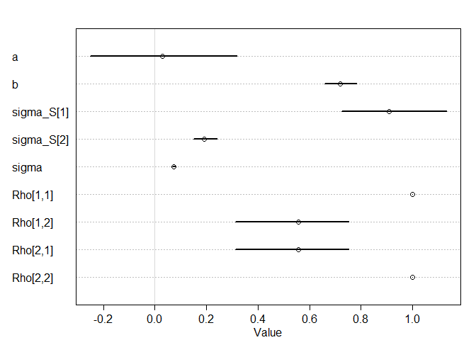<!-- -->

> Deviance of the a is a little bit bigger than deviance of the slope b. So, I think the intercept contributes more variation to the heights.

### 14H3. Now consider the correlation between the varying intercepts and slopes. Can you explain its value? How would this estimated correlation influence your predictions about a new sample of boys?

> This model suggests that intercept and slope are correlated.

> The boys who are higher on average (bigger intercepts) also have faster speed of growth (slope for age is bigger).
