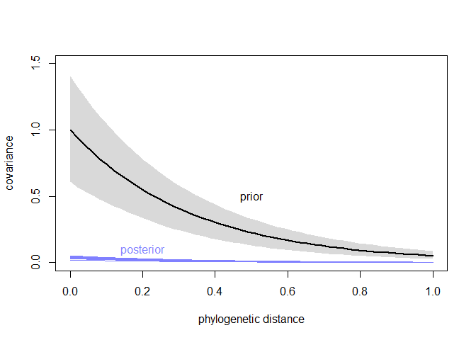
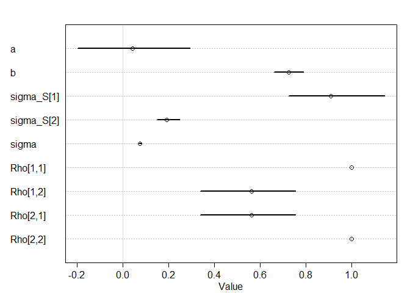

### 14.5.2. Example: Phylogenetic distance.


```r
## R code 14.46
library(rethinking)
```

```
## Loading required package: rstan
```

```
## Loading required package: StanHeaders
```

```
## Loading required package: ggplot2
```

```
## rstan (Version 2.19.3, GitRev: 2e1f913d3ca3)
```

```
## For execution on a local, multicore CPU with excess RAM we recommend calling
## options(mc.cores = parallel::detectCores()).
## To avoid recompilation of unchanged Stan programs, we recommend calling
## rstan_options(auto_write = TRUE)
```

```
## For improved execution time, we recommend calling
## Sys.setenv(LOCAL_CPPFLAGS = '-march=corei7 -mtune=corei7')
## although this causes Stan to throw an error on a few processors.
```

```
## Loading required package: parallel
```

```
## Loading required package: dagitty
```

```
## rethinking (Version 2.01)
```

```
## 
## Attaching package: 'rethinking'
```

```
## The following object is masked from 'package:stats':
## 
##     rstudent
```

```r
data(Primates301)
data(Primates301_nex)

# plot it using ape package - install.packages('ape') if needed
library(ape)
```

```
## 
## Attaching package: 'ape'
```

```
## The following object is masked from 'package:dagitty':
## 
##     edges
```

```r
plot( ladderize(Primates301_nex) , type="fan" , font=1 , no.margin=TRUE ,
    label.offset=1 , cex=0.5 )
```

<!-- -->


```r
## R code 14.47
d <- Primates301
d$name <- as.character(d$name)
dstan <- d[ complete.cases( d$group_size , d$body , d$brain ) , ]
spp_obs <- dstan$name
```


```r
## R code 14.48
dat_list <- list(
    N_spp = nrow(dstan),
    M = standardize(log(dstan$body)),
    B = standardize(log(dstan$brain)),
    G = standardize(log(dstan$group_size)),
    Imat = diag( nrow(dstan) )
)

m14.8 <- ulam(
    alist(
        B ~ multi_normal( mu , SIGMA ),
        mu <- a + bM*M + bG*G,
        matrix[N_spp,N_spp]: SIGMA <- Imat * sigma_sq,
        a ~ normal( 0 , 1 ),
        c(bM,bG) ~ normal( 0 , 0.5 ),
        sigma_sq ~ exponential( 1 )
    ), data=dat_list , chains=4 , cores=4 )
precis( m14.8 )
```

```
##                  mean         sd        5.5%      94.5%     n_eff     Rhat4
## a        0.0001560298 0.01751067 -0.02821581 0.02835883 1509.6948 0.9997581
## bG       0.1232106660 0.02299685  0.08748117 0.15878276 1017.5281 1.0039499
## bM       0.8934440659 0.02310940  0.85573738 0.92992478  903.4316 1.0042090
## sigma_sq 0.0471845561 0.00544409  0.03886130 0.05645097 1555.9414 1.0006599
```

```r
plot(precis( m14.8 ))
```

<!-- -->


```r
## R code 14.49
library(ape)
tree_trimmed <- keep.tip( Primates301_nex, spp_obs )
Rbm <- corBrownian( phy=tree_trimmed )
V <- vcv(Rbm)
```

```
## Warning in Initialize.corPhyl(phy, dummy.df): No covariate specified, species
## will be taken as ordered in the data frame. To avoid this message, specify a
## covariate containing the species names with the 'form' argument.
```

```r
Dmat <- cophenetic( tree_trimmed )
plot( Dmat , V , xlab="phylogenetic distance" , ylab="covariance" )
```

<!-- -->

```r
image(V)
```

<!-- -->

```r
image(Dmat)
```

<!-- -->


```r
## R code 14.50
# put species in right order
dat_list$V <- V[ spp_obs , spp_obs ]
# convert to correlation matrix
dat_list$R <- dat_list$V / max(V)

# Brownian motion model
m14.9 <- ulam(
    alist(
        B ~ multi_normal( mu , SIGMA ),
        mu <- a + bM*M + bG*G,
        matrix[N_spp,N_spp]: SIGMA <- R * sigma_sq,
        a ~ normal( 0 , 1 ),
        c(bM,bG) ~ normal( 0 , 0.5 ),
        sigma_sq ~ exponential( 1 )
    ), data=dat_list , chains=4 , cores=4 )
precis( m14.9 )
```

```
##                 mean         sd        5.5%      94.5%    n_eff     Rhat4
## a        -0.19268298 0.16642899 -0.44836726 0.07157532 2511.513 0.9991577
## bG       -0.01170471 0.02009087 -0.04330017 0.01952190 2293.305 0.9998045
## bM        0.69948983 0.03793200  0.63780402 0.75993985 2334.569 0.9989755
## sigma_sq  0.16163090 0.01862415  0.13531212 0.19360868 1963.401 1.0006691
```

```r
plot(precis( m14.9 ))
```

<!-- -->


```r
## R code 14.51
# add scaled and reordered distance matrix
dat_list$Dmat <- Dmat[ spp_obs , spp_obs ] / max(Dmat)

m14.10 <- ulam(
    alist(
        B ~ multi_normal( mu , SIGMA ),
        mu <- a + bM*M + bG*G,
        matrix[N_spp,N_spp]: SIGMA <- cov_GPL1( Dmat , etasq , rhosq , 0.01 ),
        a ~ normal(0,1),
        c(bM,bG) ~ normal(0,0.5),
        etasq ~ half_normal(1,0.25),
        rhosq ~ half_normal(3,0.25)
    ), data=dat_list , chains=4 , cores=4 )
precis( m14.10 )
```

```
##              mean         sd        5.5%      94.5%    n_eff     Rhat4
## a     -0.06512981 0.07263618 -0.18142420 0.04963724 2255.645 1.0003126
## bG     0.04995959 0.02371490  0.01217027 0.08781930 1926.227 1.0013915
## bM     0.83456245 0.02867809  0.78692096 0.87929330 2014.350 0.9990599
## etasq  0.03481426 0.00663486  0.02536869 0.04615432 1867.300 0.9992934
## rhosq  2.80810860 0.24179314  2.41602769 3.19302690 1858.631 1.0008370
```

```r
plot(precis( m14.10 ))
```

<!-- -->


```r
## R code 14.52
post <- extract.samples(m14.10)
plot( NULL , xlim=c(0,max(dat_list$Dmat)) , ylim=c(0,1.5) ,
    xlab="phylogenetic distance" , ylab="covariance" )

# posterior
for ( i in 1:30 )
    curve( post$etasq[i]*exp(-post$rhosq[i]*x) , add=TRUE , col=rangi2 )

# prior mean and 89% interval
eta <- abs(rnorm(1e3,1,0.25))
rho <- abs(rnorm(1e3,3,0.25))
d_seq <- seq(from=0,to=1,length.out=50)
K <- sapply( d_seq , function(x) eta*exp(-rho*x) )
lines( d_seq , colMeans(K) , lwd=2 )
shade( apply(K,2,PI) , d_seq )
```

```
## Warning in if (class(object) == "formula") {: 條件的長度 > 1，因此只能用其第一元
## 素
```

```
## Warning in if (class(object) == "density") {: 條件的長度 > 1，因此只能用其第一元
## 素
```

```
## Warning in if (class(object) == "matrix" & length(dim(object)) == 2) {: 條件的長
## 度 > 1，因此只能用其第一元素
```

```
## Warning in if (class(object) == "matrix") {: 條件的長度 > 1，因此只能用其第一元
## 素
```

```r
text( 0.5 , 0.5 , "prior" )
text( 0.2 , 0.1 , "posterior" , col=rangi2 )
```

<!-- -->

## 14.7. Practice

### 14M5. Modify the phylogenetic distance example to use group size as the outcome and brain size as a predictor. Assuming brain size influences group size, what is your estimate of the effect? How does phylogeny influence the estimate?


```r
## R code 14.48
dat_list <- list(
    N_spp = nrow(dstan),
    M = standardize(log(dstan$body)),
    B = standardize(log(dstan$brain)),
    G = standardize(log(dstan$group_size)),
    Imat = diag( nrow(dstan) )
)

m14.8_G <- ulam(
    alist(
        G ~ multi_normal( mu , SIGMA ),
        mu <- a + bM*M + bB*B,
        matrix[N_spp,N_spp]: SIGMA <- Imat * sigma_sq,
        a ~ normal( 0 , 1 ),
        c(bM,bB) ~ normal( 0 , 0.5 ),
        sigma_sq ~ exponential( 1 )
    ), data=dat_list , chains=4 , cores=4 )
precis( m14.8_G )
```

```
##                   mean         sd        5.5%       94.5%    n_eff    Rhat4
## a         0.0002285584 0.05776097 -0.09306168  0.09273884 1431.927 1.000757
## bB        1.0017794847 0.20283290  0.67639585  1.32553573 1105.091 1.000199
## bM       -0.3353912015 0.20218921 -0.66070828 -0.01052910 1119.861 1.000419
## sigma_sq  0.5216891186 0.06551508  0.42862172  0.63260337 1066.141 1.001404
```

```r
plot(precis( m14.8_G ))
```

<!-- -->


```r
## R code 14.50
# put species in right order
dat_list$V <- V[ spp_obs , spp_obs ]
# convert to correlation matrix
dat_list$R <- dat_list$V / max(V)

# Brownian motion model
m14.9_G <- ulam(
    alist(
        G ~ multi_normal( mu , SIGMA ),
        mu <- a + bM*M + bB*B,
        matrix[N_spp,N_spp]: SIGMA <- R * sigma_sq,
        a ~ normal( 0 , 1 ),
        c(bM,bB) ~ normal( 0 , 0.5 ),
        sigma_sq ~ exponential( 1 )
    ), data=dat_list , chains=4 , cores=4 )
precis( m14.9_G )
```

```
##                 mean        sd        5.5%     94.5%     n_eff     Rhat4
## a        -0.47781330 0.5581421 -1.35129473 0.4023587 1561.6196 1.0018448
## bB       -0.07187838 0.2653170 -0.47905408 0.3519349  954.4003 1.0003362
## bM        0.34325009 0.2262383 -0.01928429 0.6975362  866.3064 1.0033720
## sigma_sq  2.68829920 0.2946963  2.25278258 3.1842622 1654.4290 0.9995158
```

```r
plot(precis( m14.9_G ))
```

<!-- -->


```r
## R code 14.51
# add scaled and reordered distance matrix
dat_list$Dmat <- Dmat[ spp_obs , spp_obs ] / max(Dmat)

m14.10_G <- ulam(
    alist(
        G ~ multi_normal( mu , SIGMA ),
        mu <- a + bM*M + bB*B,
        matrix[N_spp,N_spp]: SIGMA <- cov_GPL1( Dmat , etasq , rhosq , 0.01 ),
        a ~ normal(0,1),
        c(bM,bB) ~ normal(0,0.5),
        etasq ~ half_normal(1,0.25),
        rhosq ~ half_normal(3,0.25)
    ), data=dat_list , chains=4 , cores=4 )
precis( m14.10_G )
```

```
##             mean        sd       5.5%     94.5%    n_eff     Rhat4
## a     -0.5094801 0.3385265 -1.0537425 0.0204335 1747.690 1.0003621
## bB     0.1880101 0.2586277 -0.2200946 0.6041820 1259.510 1.0044710
## bM     0.1816845 0.2312231 -0.1968022 0.5549918 1226.471 1.0050910
## etasq  0.9331828 0.1247821  0.7483722 1.1451626 1383.682 1.0009100
## rhosq  3.0181944 0.2363532  2.6430246 3.3886286 1509.277 0.9994712
```

```r
plot(precis( m14.10_G ))
```

<!-- -->

### 14H2. Varying effects models are useful for modeling time series, as well as spatial clustering. In a time series, the observations cluster by entities that have continuity through time, such as individuals. Since observations within individuals are likely highly correlated, the multilevel structure can help quite a lot. You’ll use the data in data(Oxboys), which is 234 height measurements on 26 boys from an Oxford Boys Club (I think these were like youth athletic leagues?), at 9 different ages (centered and standardized) per boy. You’ll be interested in predicting height, using age, clustered by Subject (individual boy).
### Fit a model with varying intercepts and slopes (on age), clustered by Subject. Present and interpret the parameter estimates. Which varying effect contributes more variation to the heights, the intercept or the slope?


```r
library(tidyverse)
```

```
## Warning: package 'tidyverse' was built under R version 4.0.2
```

```
## -- Attaching packages -------------------------------------------------------------------- tidyverse 1.3.0 --
```

```
## √ tibble  3.0.1     √ dplyr   1.0.0
## √ tidyr   1.1.0     √ stringr 1.4.0
## √ readr   1.3.1     √ forcats 0.5.0
## √ purrr   0.3.4
```

```
## Warning: package 'readr' was built under R version 4.0.2
```

```
## -- Conflicts ----------------------------------------------------------------------- tidyverse_conflicts() --
## x tidyr::extract() masks rstan::extract()
## x dplyr::filter()  masks stats::filter()
## x dplyr::lag()     masks stats::lag()
## x purrr::map()     masks rethinking::map()
```

```r
library(dplyr)

data(Oxboys)
d <- Oxboys

d %>% ggplot(aes(age, height, group=Subject, color=as.factor(Subject))) + 
    geom_line() + 
    geom_point(size=2) + 
    ggtitle("Boys height as function of age", subtitle = "Each line: group=Subject")
```

<!-- -->

```r
d$height_centered <- (d$height - mean(d$height)) / sd(d$height)
str(d)
```

```
## 'data.frame':	234 obs. of  5 variables:
##  $ Subject        : int  1 1 1 1 1 1 1 1 1 2 ...
##  $ age            : num  -1 -0.7479 -0.463 -0.1643 -0.0027 ...
##  $ height         : num  140 143 145 147 148 ...
##  $ Occasion       : int  1 2 3 4 5 6 7 8 9 1 ...
##  $ height_centered: num  -0.991 -0.672 -0.518 -0.266 -0.2 ...
```

```r
summary(d)
```

```
##     Subject          age               height         Occasion
##  Min.   : 1.0   Min.   :-1.00000   Min.   :126.2   Min.   :1  
##  1st Qu.: 7.0   1st Qu.:-0.46300   1st Qu.:143.8   1st Qu.:3  
##  Median :13.5   Median :-0.00270   Median :149.5   Median :5  
##  Mean   :13.5   Mean   : 0.02263   Mean   :149.5   Mean   :5  
##  3rd Qu.:20.0   3rd Qu.: 0.55620   3rd Qu.:155.5   3rd Qu.:7  
##  Max.   :26.0   Max.   : 1.00550   Max.   :174.8   Max.   :9  
##  height_centered    
##  Min.   :-2.561668  
##  1st Qu.:-0.625538  
##  Median :-0.002131  
##  Mean   : 0.000000  
##  3rd Qu.: 0.654231  
##  Max.   : 2.777108
```

```r
dat_list_OB <- list(
    height_centered = d$height_centered,
    Subject = d$Subject,
    age = d$age)
str(dat_list_OB)
```

```
## List of 3
##  $ height_centered: num [1:234] -0.991 -0.672 -0.518 -0.266 -0.2 ...
##  $ Subject        : int [1:234] 1 1 1 1 1 1 1 1 1 2 ...
##  $ age            : num [1:234] -1 -0.7479 -0.463 -0.1643 -0.0027 ...
```

```r
summary(dat_list_OB)
```

```
##                 Length Class  Mode   
## height_centered 234    -none- numeric
## Subject         234    -none- numeric
## age             234    -none- numeric
```


```r
m14H2_centered <- ulam(
  alist(
    height_centered ~ dnorm(mu, sigma), 
    mu <- a + a_S[Subject] + (b + b_S[Subject])*age,
    c(a_S, b_S)[Subject] ~ multi_normal(0, Rho, sigma_S),
    a ~ dnorm(150, 10),
    b ~ dnorm(0, 1),
    sigma ~ exponential( 1 ),
    sigma_S ~ exponential( 1 ),
    Rho ~ lkj_corr( 2 )
    ), data=dat_list_OB, chains=4, cores=4, log_lik = TRUE )
```

```
## Warning: The largest R-hat is NA, indicating chains have not mixed.
## Running the chains for more iterations may help. See
## http://mc-stan.org/misc/warnings.html#r-hat
```

```
## Warning: Bulk Effective Samples Size (ESS) is too low, indicating posterior means and medians may be unreliable.
## Running the chains for more iterations may help. See
## http://mc-stan.org/misc/warnings.html#bulk-ess
```

```
## Warning: Tail Effective Samples Size (ESS) is too low, indicating posterior variances and tail quantiles may be unreliable.
## Running the chains for more iterations may help. See
## http://mc-stan.org/misc/warnings.html#tail-ess
```

```r
precis(m14H2_centered, depth=2)
```

```
## 4 matrix parameters hidden. Use depth=3 to show them.
```

```
##                    mean         sd        5.5%       94.5%      n_eff    Rhat4
## b_S[1]      0.067512756 0.05172956 -0.01208180  0.14670348  116.87311 1.040918
## b_S[2]     -0.116227089 0.05184810 -0.19909507 -0.03206994  126.96307 1.035331
## b_S[3]     -0.174914056 0.05236844 -0.25639392 -0.08901570  143.16306 1.031505
## b_S[4]      0.305730412 0.05214088  0.22386851  0.39134579  115.88131 1.043528
## b_S[5]     -0.026304522 0.05205656 -0.10900919  0.05568491  133.91091 1.038209
## b_S[6]     -0.266964492 0.05318525 -0.34747984 -0.18088932  121.35458 1.038450
## b_S[7]     -0.160847855 0.05105313 -0.24086096 -0.07843088  121.44483 1.038617
## b_S[8]     -0.006941287 0.05077968 -0.08965024  0.07120156  123.18819 1.037387
## b_S[9]     -0.060624995 0.05196589 -0.14531168  0.02363793  117.74365 1.041081
## b_S[10]    -0.305251661 0.05329425 -0.38979111 -0.22051674  128.98053 1.040827
## b_S[11]     0.205741577 0.05213258  0.12513469  0.29191295  127.34451 1.030476
## b_S[12]     0.056653674 0.05297021 -0.02597205  0.14171901  135.77170 1.035100
## b_S[13]     0.208737491 0.05377119  0.12199344  0.29374209  145.59699 1.034439
## b_S[14]     0.229717431 0.05286879  0.14602849  0.31475071  124.27092 1.037613
## b_S[15]     0.057657941 0.05389724 -0.02476660  0.14150993  132.55609 1.034321
## b_S[16]    -0.205557622 0.05223877 -0.29027313 -0.12402075  143.15024 1.029248
## b_S[17]     0.212019586 0.05273955  0.13159378  0.29606933  116.13021 1.037371
## b_S[18]    -0.056727547 0.05220808 -0.14281037  0.02558703  151.46176 1.028733
## b_S[19]     0.274749699 0.05322257  0.19070260  0.36252846  134.59676 1.033557
## b_S[20]    -0.220899908 0.05179193 -0.30290199 -0.13846552  131.23676 1.036164
## b_S[21]     0.102283929 0.05209976  0.02152611  0.18350094  116.02971 1.032787
## b_S[22]     0.165139110 0.05237818  0.08360906  0.24916368  125.65367 1.034583
## b_S[23]     0.068766062 0.05331880 -0.01535687  0.15387980  123.73366 1.037216
## b_S[24]     0.028025294 0.05221990 -0.05308326  0.10847330  122.12438 1.039286
## b_S[25]    -0.267370361 0.05173268 -0.34963909 -0.18563198  144.66425 1.032787
## b_S[26]    -0.103736213 0.05199108 -0.18721020 -0.02097315  128.14504 1.037935
## a_S[1]     -0.182637651 0.18471158 -0.52206215  0.10508703   40.06113 1.119668
## a_S[2]     -0.760728003 0.18333979 -1.09451414 -0.47560000   39.54135 1.118687
## a_S[3]      0.642550339 0.18459366  0.30149461  0.93017303   38.97361 1.124313
## a_S[4]      1.678028837 0.18414739  1.34635395  1.96910841   39.80852 1.119377
## a_S[5]      0.180207293 0.18357706 -0.15813079  0.46362425   39.67158 1.119290
## a_S[6]     -0.329604927 0.18530169 -0.67221876 -0.03672416   39.58298 1.118012
## a_S[7]     -0.402409192 0.18377133 -0.73609832 -0.11573687   39.48542 1.119501
## a_S[8]     -0.163109767 0.18540659 -0.50243413  0.12298622   40.12978 1.117497
## a_S[9]     -1.278241483 0.18504757 -1.61541455 -0.99097724   39.98584 1.119030
## a_S[10]    -2.144209951 0.18516479 -2.47685419 -1.85814128   39.21819 1.120194
## a_S[11]     0.030437485 0.18451974 -0.30523637  0.32572312   39.86623 1.120589
## a_S[12]     0.771182593 0.18427382  0.43730425  1.06023925   38.91317 1.121834
## a_S[13]     0.690515051 0.18396387  0.35893666  0.97824947   39.38019 1.119944
## a_S[14]     1.063874386 0.18436930  0.72397086  1.34811664   39.68209 1.118714
## a_S[15]    -0.604078348 0.18373940 -0.93770851 -0.31240530   39.77520 1.120442
## a_S[16]    -0.246956574 0.18504639 -0.58348345  0.03847548   40.18134 1.115621
## a_S[17]    -0.747140487 0.18392600 -1.07928773 -0.46405129   39.86940 1.119946
## a_S[18]     0.152380975 0.18393742 -0.17513652  0.43899590   40.25552 1.118586
## a_S[19]     1.623564066 0.18395304  1.28673402  1.91078248   40.30818 1.117201
## a_S[20]     0.183803739 0.18493386 -0.15058191  0.47296551   39.72455 1.118646
## a_S[21]     0.081314913 0.18459160 -0.25364387  0.36774542   39.45272 1.119943
## a_S[22]     0.526615206 0.18506896  0.18728017  0.80916267   40.55708 1.116211
## a_S[23]     0.141156640 0.18379862 -0.19758961  0.42131726   39.55285 1.119913
## a_S[24]     0.368755526 0.18402038  0.03692877  0.66300078   39.30211 1.117986
## a_S[25]    -1.160380831 0.18452612 -1.50034459 -0.87263625   40.03313 1.117907
## a_S[26]    -1.294081195 0.18499903 -1.63088041 -1.00761755   39.00455 1.120907
## a           0.029088206 0.18284436 -0.25613815  0.36541922   38.96953 1.122298
## b           0.716184534 0.03879430  0.65860246  0.77646492   68.48186 1.069901
## sigma       0.073065009 0.00382101  0.06691200  0.07924349 1437.42114 1.000333
## sigma_S[1]  0.901982469 0.12395496  0.72761124  1.11118381  977.61652 1.004877
## sigma_S[2]  0.190937416 0.02849878  0.15270292  0.24291295  943.23163 1.001966
```

```r
precis(m14H2_centered, depth=3, pars = c("a", "b", "sigma_S", "sigma", "Rho"))
```

```
##                  mean           sd       5.5%      94.5%      n_eff     Rhat4
## a          0.02908821 1.828444e-01 -0.2561381 0.36541922   38.96953 1.1222984
## b          0.71618453 3.879430e-02  0.6586025 0.77646492   68.48186 1.0699011
## sigma_S[1] 0.90198247 1.239550e-01  0.7276112 1.11118381  977.61652 1.0048773
## sigma_S[2] 0.19093742 2.849878e-02  0.1527029 0.24291295  943.23163 1.0019662
## sigma      0.07306501 3.821010e-03  0.0669120 0.07924349 1437.42114 1.0003325
## Rho[1,1]   1.00000000 0.000000e+00  1.0000000 1.00000000        NaN       NaN
## Rho[1,2]   0.55737330 1.334249e-01  0.3231531 0.74932994 1236.99825 0.9998135
## Rho[2,1]   0.55737330 1.334249e-01  0.3231531 0.74932994 1236.99825 0.9998135
## Rho[2,2]   1.00000000 7.049712e-17  1.0000000 1.00000000  344.45182 0.9979980
```

```r
plot(precis(m14H2_centered, depth=3, pars = c("a", "b", "sigma_S", "sigma", "Rho")))
```

<!-- -->

> Number of effective samples for a_S and b_S are very small


```r
m14H2_centered_2 <- ulam(
  alist(
    height_centered ~ dnorm(mu, sigma), 
    mu <- a_S[Subject] + (b_S[Subject])*age,
    c(a_S, b_S)[Subject] ~ multi_normal(c(a, b), Rho, sigma_S),
    a ~ dnorm(150, 10),
    b ~ dnorm(0, 1),
    sigma ~ exponential( 1 ),
    sigma_S ~ exponential( 1 ),
    Rho ~ lkj_corr( 2 )
    ), data=dat_list_OB, chains=4, cores=4, log_lik = TRUE )
```

```
## Warning: The largest R-hat is NA, indicating chains have not mixed.
## Running the chains for more iterations may help. See
## http://mc-stan.org/misc/warnings.html#r-hat
```

```
## Warning: Bulk Effective Samples Size (ESS) is too low, indicating posterior means and medians may be unreliable.
## Running the chains for more iterations may help. See
## http://mc-stan.org/misc/warnings.html#bulk-ess
```

```
## Warning: Tail Effective Samples Size (ESS) is too low, indicating posterior variances and tail quantiles may be unreliable.
## Running the chains for more iterations may help. See
## http://mc-stan.org/misc/warnings.html#tail-ess
```

```r
precis(m14H2_centered_2, depth=2)
```

```
## 4 matrix parameters hidden. Use depth=3 to show them.
```

```
##                   mean          sd        5.5%       94.5%    n_eff     Rhat4
## b_S[1]      0.78319812 0.036470243  0.72433276  0.84069574 3277.089 0.9982724
## b_S[2]      0.59872991 0.035547859  0.54374116  0.65521495 3722.342 0.9993886
## b_S[3]      0.54102960 0.037128597  0.48175895  0.60127086 3405.283 0.9993126
## b_S[4]      1.02151465 0.035729331  0.96551909  1.07854936 3949.392 0.9988890
## b_S[5]      0.68968248 0.036008570  0.63360616  0.74768911 2947.598 0.9987987
## b_S[6]      0.45083071 0.037964450  0.39157407  0.51296926 3799.298 0.9989532
## b_S[7]      0.55577122 0.036983470  0.49689715  0.61294662 3210.663 1.0003988
## b_S[8]      0.70916497 0.036354864  0.65264338  0.76814190 4431.974 0.9998770
## b_S[9]      0.65418991 0.036605682  0.59572736  0.71150656 4111.380 0.9990534
## b_S[10]     0.41269804 0.036393939  0.35559108  0.47016507 2939.692 1.0008822
## b_S[11]     0.92197415 0.035502033  0.86506760  0.97797242 3950.063 0.9989440
## b_S[12]     0.77407309 0.035439456  0.71796294  0.83083152 3254.221 0.9990111
## b_S[13]     0.92450886 0.037440944  0.86538333  0.98320558 2776.244 0.9995501
## b_S[14]     0.94696264 0.036603305  0.89010331  1.00457462 3445.647 0.9990246
## b_S[15]     0.77484190 0.037583453  0.71465152  0.83566198 2905.646 0.9994398
## b_S[16]     0.50968711 0.038391283  0.44842632  0.56862103 2857.707 0.9993138
## b_S[17]     0.92777787 0.037463249  0.86979474  0.98957483 3390.130 0.9992791
## b_S[18]     0.65836263 0.037484385  0.59868124  0.72117725 3234.929 0.9990727
## b_S[19]     0.99071507 0.036727221  0.93007431  1.04818478 3928.675 0.9985579
## b_S[20]     0.49712086 0.036528920  0.43988393  0.55600583 2491.896 1.0007120
## b_S[21]     0.81847216 0.037762009  0.75770941  0.87760686 3012.419 0.9996226
## b_S[22]     0.88189053 0.035822766  0.82519757  0.93885174 3731.012 0.9981572
## b_S[23]     0.78499575 0.035352802  0.72628242  0.84315219 3710.016 0.9988447
## b_S[24]     0.74361638 0.038038580  0.68411628  0.80437175 4186.626 0.9987643
## b_S[25]     0.45077324 0.037772184  0.39034723  0.51000508 3321.447 0.9994224
## b_S[26]     0.61059113 0.037036693  0.54883830  0.66973048 3515.000 0.9987740
## a_S[1]     -0.15242222 0.023790864 -0.19003800 -0.11358563 4175.445 0.9985929
## a_S[2]     -0.73100517 0.023717752 -0.77039326 -0.69335621 3457.960 0.9991739
## a_S[3]      0.67187684 0.023845612  0.63410917  0.71025044 3746.932 0.9983135
## a_S[4]      1.70785595 0.024334619  1.66924254  1.74587828 3223.979 1.0000708
## a_S[5]      0.20960265 0.023558994  0.17243009  0.24664205 3428.143 0.9988938
## a_S[6]     -0.30068636 0.023648813 -0.33898790 -0.26340432 3569.513 0.9989094
## a_S[7]     -0.37420198 0.023185969 -0.41190741 -0.33807703 3346.179 0.9990632
## a_S[8]     -0.13436924 0.023742775 -0.17294572 -0.09759516 3800.486 0.9988042
## a_S[9]     -1.24843745 0.025909476 -1.28877902 -1.20754882 3628.938 0.9993826
## a_S[10]    -2.11408479 0.024221431 -2.15168973 -2.07608664 4610.381 0.9982799
## a_S[11]     0.05842826 0.024324049  0.01777611  0.09703343 3889.118 0.9992659
## a_S[12]     0.80026548 0.024527450  0.76085437  0.83915346 3593.951 0.9991151
## a_S[13]     0.71975720 0.023552010  0.68340551  0.75766882 3086.932 1.0002503
## a_S[14]     1.09299801 0.024977297  1.05362591  1.13374552 3459.662 0.9986907
## a_S[15]    -0.57467926 0.024158497 -0.61413517 -0.53653447 3080.756 0.9999734
## a_S[16]    -0.21772636 0.023720956 -0.25505271 -0.17893459 3719.492 0.9987597
## a_S[17]    -0.71639343 0.023733414 -0.75546294 -0.67903865 4779.668 0.9984350
## a_S[18]     0.18133760 0.025569327  0.13937602  0.22221128 3320.490 0.9991985
## a_S[19]     1.65300625 0.023666636  1.61520071  1.69034360 2561.457 0.9990606
## a_S[20]     0.21257205 0.023630501  0.17483581  0.25087371 4087.193 0.9992395
## a_S[21]     0.11057915 0.024259596  0.07221547  0.15021333 3841.181 0.9982807
## a_S[22]     0.55446791 0.023733128  0.51707808  0.59202103 3819.387 0.9990984
## a_S[23]     0.16985943 0.024837837  0.12938835  0.21011471 3780.207 0.9985311
## a_S[24]     0.39815398 0.023781305  0.36106894  0.43653290 3611.967 0.9983898
## a_S[25]    -1.13186979 0.023947424 -1.16957099 -1.09473500 3568.499 0.9990906
## a_S[26]    -1.26503048 0.024242976 -1.30334663 -1.22662027 3223.796 0.9986958
## a           0.02482339 0.182158891 -0.26805337  0.31378176 2192.432 0.9996520
## b           0.72114216 0.038950415  0.66083289  0.78291046 2100.375 0.9993496
## sigma       0.07293216 0.003790819  0.06700281  0.07914357 2048.756 1.0008068
## sigma_S[1]  0.90818633 0.126216814  0.73504787  1.12706525 1954.831 1.0006975
## sigma_S[2]  0.19118029 0.030852898  0.14820303  0.24477264 2129.591 0.9983189
```

```r
precis(m14H2_centered_2, depth=3, pars = c("a", "b", "sigma_S", "sigma", "Rho"))
```

```
##                  mean           sd        5.5%      94.5%     n_eff     Rhat4
## a          0.02482339 1.821589e-01 -0.26805337 0.31378176 2192.4317 0.9996520
## b          0.72114216 3.895041e-02  0.66083289 0.78291046 2100.3749 0.9993496
## sigma_S[1] 0.90818633 1.262168e-01  0.73504787 1.12706525 1954.8310 1.0006975
## sigma_S[2] 0.19118029 3.085290e-02  0.14820303 0.24477264 2129.5914 0.9983189
## sigma      0.07293216 3.790819e-03  0.06700281 0.07914357 2048.7564 1.0008068
## Rho[1,1]   1.00000000 0.000000e+00  1.00000000 1.00000000       NaN       NaN
## Rho[1,2]   0.56329172 1.334825e-01  0.33684135 0.75071643 1880.7232 1.0003229
## Rho[2,1]   0.56329172 1.334825e-01  0.33684135 0.75071643 1880.7232 1.0003229
## Rho[2,2]   1.00000000 6.974970e-17  1.00000000 1.00000000  545.8359 0.9979980
```

```r
plot(precis(m14H2_centered_2, depth=3, pars = c("a", "b", "sigma_S", "sigma", "Rho")))
```

<!-- -->

> Deviance of the a is a little bit bigger than deviance of the slope b. So, I think the intercept contributes more variation to the heights.

### 14H3. Now consider the correlation between the varying intercepts and slopes. Can you explain its value? How would this estimated correlation influence your predictions about a new sample of boys?

> This model suggests that intercept and slope are correlated.

> The boys who are higher on average (bigger intercepts) also have faster speed of growth (slope for age is bigger).
