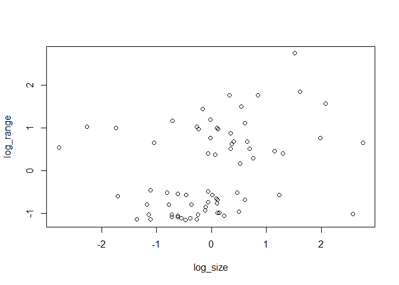
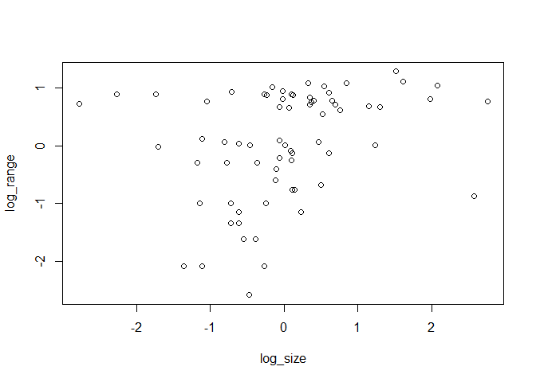

## You want to rest the hypothesis that the range size of carnivores is influenced by their body size (larger carnivores roam further).  You want to be sure that if you do see a relationship that is is not just due to shared evolutionary history.  That is you want to do a phylogenetic regression.

# 1) Load the data as follows


```r
library(rethinking)
```

```
## Loading required package: rstan
```

```
## Loading required package: StanHeaders
```

```
## Loading required package: ggplot2
```

```
## rstan (Version 2.19.3, GitRev: 2e1f913d3ca3)
```

```
## For execution on a local, multicore CPU with excess RAM we recommend calling
## options(mc.cores = parallel::detectCores()).
## To avoid recompilation of unchanged Stan programs, we recommend calling
## rstan_options(auto_write = TRUE)
```

```
## For improved execution time, we recommend calling
## Sys.setenv(LOCAL_CPPFLAGS = '-march=corei7 -mtune=corei7')
## although this causes Stan to throw an error on a few processors.
```

```
## Loading required package: parallel
```

```
## Loading required package: dagitty
```

```
## rethinking (Version 2.01)
```

```
## 
## Attaching package: 'rethinking'
```

```
## The following object is masked from 'package:stats':
## 
##     rstudent
```

```r
library(ape)
```

```
## 
## Attaching package: 'ape'
```

```
## The following object is masked from 'package:dagitty':
## 
##     edges
```

```r
library(ade4)
```

```
## Warning: package 'ade4' was built under R version 4.0.2
```

```r
library(stringr)
```


```r
data("carni70")
```


```r
tre <- read.tree(text=carni70$tre)
d <- carni70$tab
str(d)
```

```
## 'data.frame':	70 obs. of  2 variables:
##  $ size : num  37.01 2.59 3.2 7.9 3.99 ...
##  $ range: num  36 24 21.75 24.5 1.75 ...
```

```r
summary(d)
```

```
##       size             range       
##  Min.   :  0.040   Min.   : 0.120  
##  1st Qu.:  1.282   1st Qu.: 2.062  
##  Median :  3.200   Median : 6.125  
##  Mean   : 14.288   Mean   :10.721  
##  3rd Qu.:  7.293   3rd Qu.:17.750  
##  Max.   :266.500   Max.   :36.000
```


```r
plot( ladderize(tre) , type="fan" , font=1 , no.margin=TRUE ,
    label.offset=1 , cex=0.5 )
```

<!-- -->

# 2) Note that the species name given in "rownames(d)" and in "tre$tip.label" do not match.  Fix that (e.g. using str_replace() )


```r
head(rownames(d))
```

```
## [1] "Puma_concolor"           "Herpailurus_yaguaroundi"
## [3] "Leopardus_wiedii"        "Leopardus_pardalis"     
## [5] "Oreailurus_jacobita"     "Oncifelis_colocolo"
```

```r
head(tre$tip.label)
```

```
## [1] "Puma.concolor"           "Herpailurus.yaguaroundi"
## [3] "Leopardus.wiedii"        "Leopardus.pardalis"     
## [5] "Oreailurus.jacobita"     "Oncifelis.colocolo"
```

```r
rownames(d) = str_replace(rownames(d), "_", ".")

head(rownames(d))
```

```
## [1] "Puma.concolor"           "Herpailurus.yaguaroundi"
## [3] "Leopardus.wiedii"        "Leopardus.pardalis"     
## [5] "Oreailurus.jacobita"     "Oncifelis.colocolo"
```

```r
head(tre$tip.label)
```

```
## [1] "Puma.concolor"           "Herpailurus.yaguaroundi"
## [3] "Leopardus.wiedii"        "Leopardus.pardalis"     
## [5] "Oreailurus.jacobita"     "Oncifelis.colocolo"
```

# 3) Should either range or size be transformed?


```r
str(d)
```

```
## 'data.frame':	70 obs. of  2 variables:
##  $ size : num  37.01 2.59 3.2 7.9 3.99 ...
##  $ range: num  36 24 21.75 24.5 1.75 ...
```

```r
summary(d)
```

```
##       size             range       
##  Min.   :  0.040   Min.   : 0.120  
##  1st Qu.:  1.282   1st Qu.: 2.062  
##  Median :  3.200   Median : 6.125  
##  Mean   : 14.288   Mean   :10.721  
##  3rd Qu.:  7.293   3rd Qu.:17.750  
##  Max.   :266.500   Max.   :36.000
```

```r
head(d)
```

```
##                          size range
## Puma.concolor           37.01 36.00
## Herpailurus.yaguaroundi  2.59 24.00
## Leopardus.wiedii         3.20 21.75
## Leopardus.pardalis       7.90 24.50
## Oreailurus.jacobita      3.99  1.75
## Oncifelis.colocolo       2.99  6.25
```

```r
dens(d$size)
```

<!-- -->

```r
dens(standardize(log(d$size)))
```

<!-- -->

```r
dens(d$range)
```

<!-- -->

```r
dens(standardize(d$range))
```

<!-- -->

```r
dens(standardize(log(d$range)))
```

<!-- -->

# 4) Does size predict range?  Evaluate this question without and with accounting for phylogenetic relationships.


```r
plot( d$size , d$range , xlab="size" , ylab="range" )
```

<!-- -->

```r
plot( standardize(log(d$size)) , standardize(d$range) , xlab="log_size" , ylab="log_range" )
```

<!-- -->

```r
plot( standardize(log(d$size)) , standardize(log(d$range)) , xlab="log_size" , ylab="log_range" )
```

<!-- -->

```r
## R code 14.47
d$name <- as.character(rownames(d))
spp_obs <- d$name
```


```r
## modified from R code 14.48
dat_list <- list(
    N_spp = nrow(d),
    S = standardize(log(d$size)),
    R = standardize(log(d$range)),
    Imat = diag( nrow(d) )
)

str(dat_list)
```

```
## List of 4
##  $ N_spp: int 70
##  $ S    : num [1:70] 1.5146 -0.1559 -0.0231 0.5446 0.1155 ...
##   ..- attr(*, "scaled:center")= num 1.2
##   ..- attr(*, "scaled:scale")= num 1.59
##  $ R    : num [1:70] 1.284 1.009 0.942 1.023 -0.768 ...
##   ..- attr(*, "scaled:center")= num 1.69
##   ..- attr(*, "scaled:scale")= num 1.47
##  $ Imat : num [1:70, 1:70] 1 0 0 0 0 0 0 0 0 0 ...
```
> Evaluate this question without accounting for phylogenetic relationships

> Using an identity matrix (no phylogeny)


```r
m14_7_without <- ulam(
    alist(
        R ~ multi_normal( mu , SIGMA ),
        mu <- a + bS*S ,
        matrix[N_spp,N_spp]: SIGMA <- Imat * sigma_sq,
        a ~ normal( 0 , 1 ),
        bS ~ normal( 0 , 0.5 ),
        sigma_sq ~ exponential( 1 )
    ), data=dat_list , chains=4 , cores=4 )
precis( m14_7_without )
```

```
##                  mean        sd        5.5%     94.5%    n_eff     Rhat4
## a        -0.001795685 0.1122603 -0.18372569 0.1796306 2112.005 0.9985313
## bS        0.282480013 0.1171911  0.09041899 0.4685650 1767.851 0.9986844
## sigma_sq  0.953606914 0.1659607  0.72324706 1.2421193 1821.006 0.9987319
```

```r
plot(precis( m14_7_without ))
```

<!-- -->

> Evaluate this question with accounting for phylogenetic relationships

> Using the Brownian motion model


```r
## modified from R code 14.49

Rbm <- corBrownian( phy=tre , form = ~tre$tip.label)
V <- vcv(Rbm)
#error: No covariate specified, species will be taken as ordered in the data frame. To avoid this message, specify a covariate containing the species names with the 'form' argument.
Dmat <- cophenetic( tre )
plot( Dmat , V , xlab="phylogenetic distance" , ylab="covariance" )
```

<!-- -->

```r
image(V)
```

<!-- -->

```r
image(Dmat)
```

<!-- -->


```r
## modified from R code 14.50
# put species in right order
dat_list$V <- V[ spp_obs , spp_obs ] #subscript out of bounds?

# convert to correlation matrix
dat_list$CoR <- dat_list$V / max(V)

# Brownian motion model
m14_7_with <- ulam(
    alist(
        R ~ multi_normal( mu , SIGMA ),
        mu <- a + bS*S ,
        matrix[N_spp,N_spp]: SIGMA <- CoR * sigma_sq,
        a ~ normal( 0 , 1 ),
        bS ~ normal( 0 , 0.5 ),
        sigma_sq ~ exponential( 1 )
    ), data=dat_list , chains=4 , cores=4 )
precis( m14_7_with )
```

```
##                 mean        sd        5.5%      94.5%    n_eff     Rhat4
## a        -0.01122867 0.8239167 -1.32892944  1.3225960 1971.417 1.0014209
## bS        0.34914673 0.1678426  0.08328242  0.6187195 2025.805 0.9997972
## sigma_sq  9.23339106 1.2882193  7.35297521 11.4520138 1944.927 0.9989951
```

```r
plot(precis( m14_7_with ))
```

<!-- -->

> Using the Ornstein–Uhlenbeck process (or OU process)

> use the OU process kernel, which is known more generally as the L1 norm, which ulam() provides as cov_GPL1().


```r
## R code 14.51
# add scaled and reordered distance matrix
dat_list$Dmat <- Dmat[ spp_obs , spp_obs ] / max(Dmat)

m14_7_with_OU <- ulam(
    alist(
        R ~ multi_normal( mu , SIGMA ),
        mu <- a + bS*S ,
        matrix[N_spp,N_spp]: SIGMA <- cov_GPL1( Dmat , etasq , rhosq , 0.01 ),
        a ~ normal(0,1),
        bS ~ normal(0,0.5),
        etasq ~ half_normal(1,0.25),
        rhosq ~ half_normal(3,0.25)
    ), data=dat_list , chains=4 , cores=4 )
precis( m14_7_with_OU )
```

```
##             mean        sd       5.5%     94.5%    n_eff     Rhat4
## a     -0.0437861 0.4556551 -0.7569340 0.6821146 2444.284 1.0005840
## bS     0.3581373 0.1373064  0.1369289 0.5816558 2279.534 0.9996079
## etasq  1.8634178 0.1612170  1.6107489 2.1191109 2221.916 0.9996714
## rhosq  3.5005236 0.2150736  3.1656790 3.8375412 1984.282 1.0005403
```

```r
plot(precis( m14_7_with_OU ))
```

<!-- -->

# 5) Discuss your findings.

> Using an identity matrix (no phylogeny), size influences rang positively 

> Using the Brownian motion model, size influences rang even more positively.

> Using the Ornstein–Uhlenbeck process (or OU process), size influences rang even more positively.


```r
precis( m14_7_without )
```

```
##                  mean        sd        5.5%     94.5%    n_eff     Rhat4
## a        -0.001795685 0.1122603 -0.18372569 0.1796306 2112.005 0.9985313
## bS        0.282480013 0.1171911  0.09041899 0.4685650 1767.851 0.9986844
## sigma_sq  0.953606914 0.1659607  0.72324706 1.2421193 1821.006 0.9987319
```

```r
plot(precis( m14_7_without ))
```

<!-- -->

```r
precis( m14_7_with )
```

```
##                 mean        sd        5.5%      94.5%    n_eff     Rhat4
## a        -0.01122867 0.8239167 -1.32892944  1.3225960 1971.417 1.0014209
## bS        0.34914673 0.1678426  0.08328242  0.6187195 2025.805 0.9997972
## sigma_sq  9.23339106 1.2882193  7.35297521 11.4520138 1944.927 0.9989951
```

```r
plot(precis( m14_7_with ))
```

<!-- -->

```r
precis( m14_7_with_OU )
```

```
##             mean        sd       5.5%     94.5%    n_eff     Rhat4
## a     -0.0437861 0.4556551 -0.7569340 0.6821146 2444.284 1.0005840
## bS     0.3581373 0.1373064  0.1369289 0.5816558 2279.534 0.9996079
## etasq  1.8634178 0.1612170  1.6107489 2.1191109 2221.916 0.9996714
## rhosq  3.5005236 0.2150736  3.1656790 3.8375412 1984.282 1.0005403
```

```r
plot(precis( m14_7_with_OU ))
```

<!-- -->


