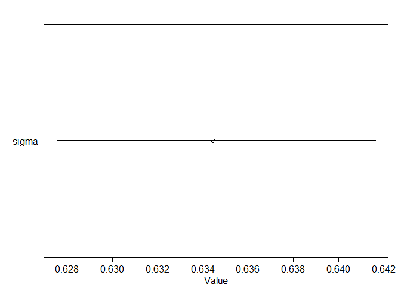
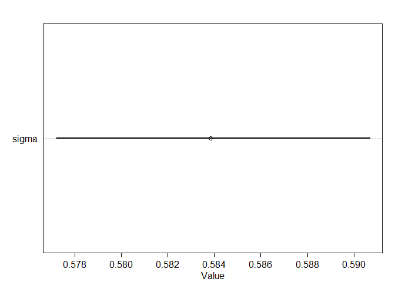
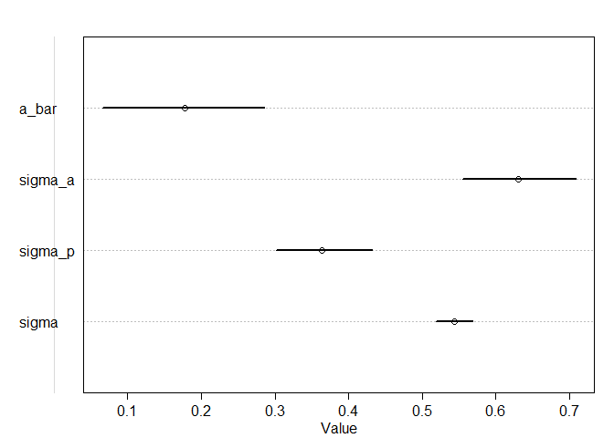
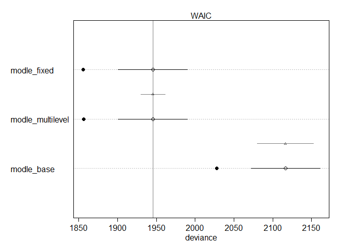
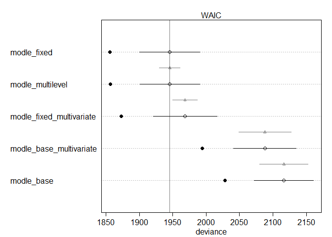
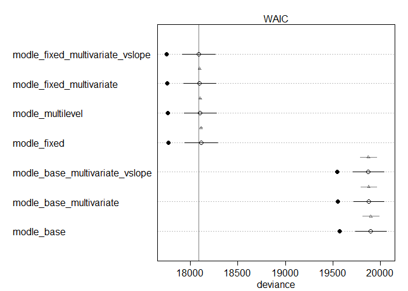
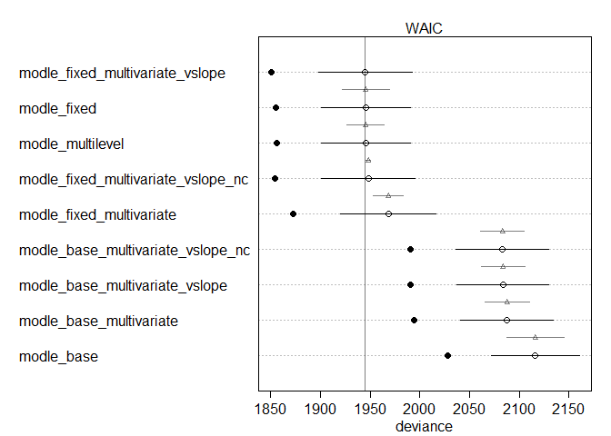

```r
library(rethinking)
```

```
## Loading required package: rstan
```

```
## Loading required package: StanHeaders
```

```
## Loading required package: ggplot2
```

```
## rstan (Version 2.19.2, GitRev: 2e1f913d3ca3)
```

```
## For execution on a local, multicore CPU with excess RAM we recommend calling
## options(mc.cores = parallel::detectCores()).
## To avoid recompilation of unchanged Stan programs, we recommend calling
## rstan_options(auto_write = TRUE)
```

```
## For improved execution time, we recommend calling
## Sys.setenv(LOCAL_CPPFLAGS = '-march=native')
## although this causes Stan to throw an error on a few processors.
```

```
## Loading required package: parallel
```

```
## Loading required package: dagitty
```

```
## rethinking (Version 1.93)
```

```
## 
## Attaching package: 'rethinking'
```

```
## The following object is masked from 'package:stats':
## 
##     rstudent
```

```r
hyp <- read.csv("hyp.lengths.both.experiments.labels.csv")
head(hyp)
```

```
##   line length plate light exp nativename stockparent latitude longitude site
## 1 6901  2.014   1AH     H   A      Bil-7     CS22579   63.324    18.484  Bil
## 2 6901  1.477   1AH     H   A      Bil-7     CS22579   63.324    18.484  Bil
## 3 6901  1.986   1AH     H   A      Bil-7     CS22579   63.324    18.484  Bil
## 4 6901  2.744   1AH     H   A      Bil-7     CS22579   63.324    18.484  Bil
## 5 6901  1.942   1AH     H   A      Bil-7     CS22579   63.324    18.484  Bil
## 6 6901  1.935   1AH     H   A      Bil-7     CS22579   63.324    18.484  Bil
##    region country
## 1 NSweden     SWE
## 2 NSweden     SWE
## 3 NSweden     SWE
## 4 NSweden     SWE
## 5 NSweden     SWE
## 6 NSweden     SWE
```

```r
summary(hyp)
```

```
##       line            length          plate       light    exp      
##  Min.   :  5837   Min.   :0.458   38BH   :  191   H:9133   A: 7692  
##  1st Qu.:  6930   1st Qu.:3.154   17BL   :  186   L:8898   B:10339  
##  Median :  6984   Median :4.091   35BL   :  179                     
##  Mean   :  8094   Mean   :4.123   8AH    :  179                     
##  3rd Qu.:  8290   3rd Qu.:4.978   33BL   :  177                     
##  Max.   :100000   Max.   :9.914   33BH   :  176                     
##                                   (Other):16943                     
##    nativename     stockparent       latitude       longitude       
##  Ang-0  :  177   CS949  :  177   Min.   :15.11   Min.   :-123.000  
##  Ull2-3 :  175   CS22587:  175   1st Qu.:47.25   1st Qu.:   2.250  
##  Kin-0  :  170   CS22654:  170   Median :50.00   Median :  10.872  
##  Mrk-0  :  167   CS22635:  167   Mean   :49.82   Mean   :   5.614  
##  Mt-0   :  167   CS22642:  167   3rd Qu.:55.58   3rd Qu.:  16.233  
##  Est-1  :  166   (Other):13039   Max.   :63.32   Max.   : 136.310  
##  (Other):17009   NA's   : 4136   NA's   :1455    NA's   :1455      
##       site                  region        country    
##  B疇    :  357   WesternEurope :4067   SWE    :3173  
##  Pu2    :  327   SSweden       :2175   GER    :2305  
##  HR     :  322   NorthernEurope:1715   CZE    :2017  
##  G\xc3 :  309   SouthernEurope:1331   UK     :1411  
##  CIBC   :  306   Moravia       :1167   USA    :1151  
##  (Other):14955   (Other)       :4680   (Other):6519  
##  NA's   : 1455   NA's          :2896   NA's   :1455
```

```r
str(hyp)
```

```
## 'data.frame':	18031 obs. of  12 variables:
##  $ line       : int  6901 6901 6901 6901 6901 6901 6901 8357 8357 8357 ...
##  $ length     : num  2.01 1.48 1.99 2.74 1.94 ...
##  $ plate      : Factor w/ 152 levels "10AH","10AL",..: 41 41 41 41 41 41 41 41 41 41 ...
##  $ light      : Factor w/ 2 levels "H","L": 1 1 1 1 1 1 1 1 1 1 ...
##  $ exp        : Factor w/ 2 levels "A","B": 1 1 1 1 1 1 1 1 1 1 ...
##  $ nativename : Factor w/ 180 levels "\xc3-1","\xc3繹2-1",..: 24 24 24 24 24 24 24 124 124 124 ...
##  $ stockparent: Factor w/ 135 levels "CS1007","CS1065",..: 48 48 48 48 48 48 48 23 23 23 ...
##  $ latitude   : num  63.3 63.3 63.3 63.3 63.3 ...
##  $ longitude  : num  18.5 18.5 18.5 18.5 18.5 ...
##  $ site       : Factor w/ 136 levels "\xc3繹2","Ag",..: 8 8 8 8 8 8 8 93 93 93 ...
##  $ region     : Factor w/ 18 levels "(null)","CentralAsia",..: 12 12 12 12 12 12 12 16 16 16 ...
##  $ country    : Factor w/ 26 levels "AUT","BEL","CAN",..: 22 22 22 22 22 22 22 6 6 6 ...
```

### 1. without pooling_base


```r
library(dplyr)
```

```
## 
## Attaching package: 'dplyr'
```

```
## The following objects are masked from 'package:stats':
## 
##     filter, lag
```

```
## The following objects are masked from 'package:base':
## 
##     intersect, setdiff, setequal, union
```

```r
hyp_s <- sample_n(hyp, 10000)
summary(hyp_s)
```

```
##       line            length          plate      light    exp     
##  Min.   :  5837   Min.   :0.458   35BH   : 115   H:5018   A:4282  
##  1st Qu.:  6931   1st Qu.:3.183   17BL   : 110   L:4982   B:5718  
##  Median :  6984   Median :4.097   8AH    : 106                    
##  Mean   :  8088   Mean   :4.128   38BH   : 105                    
##  3rd Qu.:  8290   3rd Qu.:4.981   27BL   : 104                    
##  Max.   :100000   Max.   :9.914   35BL   : 104                    
##                                   (Other):9356                    
##    nativename    stockparent      latitude       longitude       
##  Ang-0  : 105   CS949  : 105   Min.   :15.11   Min.   :-123.000  
##  Mrk-0  : 103   CS22587: 103   1st Qu.:47.25   1st Qu.:   2.250  
##  Ull2-3 : 103   CS22635: 103   Median :50.00   Median :  10.500  
##  Bg-2   :  94   CS1567 :  94   Mean   :49.76   Mean   :   5.456  
##  Tu-0   :  94   CS22342:  94   3rd Qu.:54.10   3rd Qu.:  16.200  
##  Est-1  :  93   (Other):7244   Max.   :63.32   Max.   : 136.310  
##  (Other):9408   NA's   :2257   NA's   :807     NA's   :807       
##       site                 region        country    
##  B疇    : 204   WesternEurope :2313   SWE    :1692  
##  Pu2    : 189   SSweden       :1183   GER    :1281  
##  HR     : 175   NorthernEurope: 966   CZE    :1111  
##  SQ     : 171   SouthernEurope: 735   UK     : 791  
##  CIBC   : 167   Moravia       : 645   USA    : 628  
##  (Other):8287   (Other)       :2548   (Other):3690  
##  NA's   : 807   NA's          :1610   NA's   : 807
```

```r
str(hyp_s)
```

```
## 'data.frame':	10000 obs. of  12 variables:
##  $ line       : int  8214 8244 8314 6909 8357 6916 6960 7327 8369 8313 ...
##  $ length     : num  2.9 7.13 3.74 3.4 2.7 ...
##  $ plate      : Factor w/ 152 levels "10AH","10AL",..: 81 31 69 76 41 32 126 28 96 107 ...
##  $ light      : Factor w/ 2 levels "H","L": 1 1 1 2 1 2 2 2 2 1 ...
##  $ exp        : Factor w/ 2 levels "A","B": 1 2 1 2 1 2 1 2 2 2 ...
##  $ nativename : Factor w/ 180 levels "\xc3-1","\xc3繹2-1",..: 68 7 80 42 124 56 134 5 135 79 ...
##  $ stockparent: Factor w/ 135 levels "CS1007","CS1065",..: 97 NA 13 92 23 95 79 NA NA 12 ...
##  $ latitude   : num  49 NA 47 38.3 41.5 58.3 48.5 NA 55.7 49 ...
##  $ longitude  : num  2 NA 14 -92.3 2.25 25.3 -1.41 NA 13.4 15 ...
##  $ site       : Factor w/ 136 levels "\xc3繹2","Ag",..: 44 NA 55 22 93 35 99 NA 100 54 ...
##  $ region     : Factor w/ 18 levels "(null)","CentralAsia",..: 18 NA 18 8 16 NA 18 NA 17 6 ...
##  $ country    : Factor w/ 26 levels "AUT","BEL","CAN",..: 8 NA 1 26 6 20 8 NA 22 5 ...
```

```r
dat_list1 <- list(
  length = scale(hyp_s$length),
  line = as.integer(as.factor(hyp_s$line)),
  light = as.integer(hyp_s$light=="H")
)


modle_base <- ulam(
  alist(
    length ~ dnorm(mu, sigma),
    mu <- a[line] + bI[line]*light,
    a[line] ~ dnorm(0, 1),
    bI[line] ~ dnorm(0, 1),
    sigma ~ dexp(1)
  ), data=dat_list1 , chains=4 , cores=4 , log_lik=TRUE)
```

```
## Warning: There were 72 transitions after warmup that exceeded the maximum treedepth. Increase max_treedepth above 10. See
## http://mc-stan.org/misc/warnings.html#maximum-treedepth-exceeded
```

```
## Warning: Examine the pairs() plot to diagnose sampling problems
```

```r
precis( modle_base, depth=2 , pars=c("bI","sigma"))
```

```
##                 mean          sd        5.5%        94.5%    n_eff      Rhat
## bI[1]   -0.663596181 0.152349207 -0.91364496 -0.422933185 4175.189 0.9990678
## bI[2]   -0.832987646 0.147471705 -1.07248954 -0.592888365 5096.348 0.9988271
## bI[3]   -1.796917861 0.304095531 -2.27661837 -1.306795784 3473.146 0.9984625
## bI[4]   -0.946473253 0.179206283 -1.23106193 -0.664141230 4537.710 0.9989607
## bI[5]   -0.465249467 0.156939461 -0.72121874 -0.223110131 3227.989 0.9993825
## bI[6]    0.014523737 0.147811845 -0.22606743  0.252745503 3364.329 0.9992463
## bI[7]   -1.081498844 0.194449458 -1.38799175 -0.772887791 4200.984 0.9987006
## bI[8]   -1.069298259 0.277884652 -1.50647800 -0.623165939 3337.768 0.9990348
## bI[9]   -1.174032678 0.602100869 -2.14125167 -0.186451756 2734.347 0.9995912
## bI[10]  -0.438357014 0.412568079 -1.10154654  0.222902597 3775.644 0.9993188
## bI[11]  -0.869473671 0.172062865 -1.13729017 -0.592526208 3817.265 0.9989731
## bI[12]  -0.423623959 0.202202301 -0.74914743 -0.102514625 3691.777 0.9988165
## bI[13]  -0.786648642 0.129999957 -0.99051327 -0.574642011 3170.919 0.9984905
## bI[14]  -0.889928772 0.178037861 -1.17237832 -0.611584034 2975.404 0.9998139
## bI[15]  -0.337413227 0.186447419 -0.63684940 -0.040100330 3061.662 0.9994841
## bI[16]  -1.081020422 0.159817310 -1.33299916 -0.825737352 3359.138 0.9986760
## bI[17]  -0.879523124 0.185003677 -1.18305395 -0.590658985 3077.341 0.9984509
## bI[18]  -1.191212905 0.265852003 -1.62135922 -0.767658277 4477.862 0.9984670
## bI[19]  -0.735907664 0.194512963 -1.05181161 -0.427551000 3522.588 0.9994247
## bI[20]  -0.915903913 0.135710229 -1.13611238 -0.700232570 3835.017 0.9986758
## bI[21]  -1.209969200 0.140178081 -1.43291821 -0.992343044 3848.688 1.0006350
## bI[22]  -1.593557990 0.133717670 -1.80559752 -1.377982657 3792.623 0.9994925
## bI[23]  -1.430743131 0.141797408 -1.65086850 -1.193481908 3392.585 0.9996524
## bI[24]  -0.799128147 0.166441053 -1.06163126 -0.536129630 4217.106 0.9986091
## bI[25]  -0.926756203 0.152189410 -1.16444550 -0.688006301 3469.821 0.9983945
## bI[26]  -1.142584224 0.296005758 -1.61887925 -0.673369704 4016.539 0.9998138
## bI[27]  -1.072131930 0.163019458 -1.32900938 -0.810844971 3359.243 0.9989349
## bI[28]  -1.556523196 0.133879217 -1.76974300 -1.343657305 3139.069 0.9985359
## bI[29]  -0.982130804 0.206186398 -1.30447829 -0.662861401 3554.685 0.9991986
## bI[30]  -0.053237215 0.129673951 -0.26330208  0.154433228 3452.319 0.9997801
## bI[31]  -1.335031033 0.162449285 -1.59354063 -1.076863028 2799.728 0.9985801
## bI[32]  -0.560802018 0.627713520 -1.58657413  0.431521525 2797.260 0.9992243
## bI[33]  -1.304774705 0.151450359 -1.54112095 -1.061284882 2661.266 0.9994561
## bI[34]  -0.343209756 0.138062287 -0.56239464 -0.123663964 3592.003 0.9997200
## bI[35]  -0.606700006 0.153290633 -0.85065439 -0.365081678 3704.301 0.9987024
## bI[36]  -0.758283954 0.133743424 -0.96754142 -0.549454864 2996.981 0.9984207
## bI[37]  -0.762596906 0.136472327 -0.98417384 -0.541236390 4657.766 0.9985203
## bI[38]  -0.884711724 0.137351435 -1.10169259 -0.661622412 2641.707 1.0018595
## bI[39]  -0.911757404 0.140442672 -1.13444719 -0.683846814 3879.154 0.9986791
## bI[40]   0.068955202 0.594121326 -0.90194226  1.003600762 2770.756 0.9994384
## bI[41]   0.530662837 0.172906743  0.25045581  0.803718570 3587.437 0.9991722
## bI[42]  -1.675352528 0.148338911 -1.91249983 -1.442919087 2321.230 0.9993111
## bI[43]  -0.402976467 0.165319926 -0.67314059 -0.144567822 3522.000 0.9988923
## bI[44]  -1.245348530 0.267040714 -1.66854491 -0.809463760 3141.683 1.0003660
## bI[45]  -0.396859445 0.256035508 -0.80601716  0.003456173 3548.709 0.9989396
## bI[46]  -0.406009166 0.173233393 -0.69261851 -0.138624349 3355.720 0.9992194
## bI[47]  -0.563903433 0.140847829 -0.78510734 -0.340658779 3109.855 1.0002724
## bI[48]  -0.901138248 0.124208268 -1.09651139 -0.700004182 2952.061 0.9996131
## bI[49]  -0.575620384 0.156163952 -0.82555375 -0.325648980 2825.511 0.9994353
## bI[50]  -0.214855458 0.145301402 -0.45373579  0.018384866 3618.285 0.9986720
## bI[51]  -0.394737556 0.142359984 -0.61833991 -0.168638396 2926.450 0.9995522
## bI[52]  -0.691037960 0.157185479 -0.93748028 -0.438994840 3513.444 0.9991812
## bI[53]  -0.059044780 0.182027163 -0.34014085  0.226113963 3652.521 0.9984187
## bI[54]  -0.950239910 0.157852000 -1.20724914 -0.699580762 3726.174 0.9985114
## bI[55]  -0.110937966 0.231286544 -0.48236642  0.265711924 3628.104 0.9996854
## bI[56]  -1.048698950 0.146780071 -1.28491451 -0.808313224 3227.344 0.9990423
## bI[57]  -0.791924909 0.178375410 -1.06690986 -0.497760537 3721.325 0.9985507
## bI[58]  -0.768122808 0.156644741 -1.01995620 -0.522241629 3590.624 0.9993531
## bI[59]  -1.198459990 0.153231334 -1.44055622 -0.955463391 3983.087 0.9982131
## bI[60]  -0.225830465 0.134380046 -0.44007541 -0.016488287 3507.950 0.9989686
## bI[61]  -1.584442025 0.158797069 -1.83314224 -1.338908560 3710.284 0.9999477
## bI[62]  -0.728302883 0.134596363 -0.94147326 -0.507469721 3190.340 0.9984569
## bI[63]  -0.491831692 0.171421075 -0.75856653 -0.222425224 3154.383 0.9998682
## bI[64]  -1.055729546 0.162481834 -1.31388888 -0.793719908 3372.907 0.9992898
## bI[65]  -0.881619813 0.146609247 -1.11419825 -0.650615574 3101.262 0.9984483
## bI[66]  -1.071144956 0.166662321 -1.33128520 -0.808914457 3458.519 0.9984185
## bI[67]  -0.009630261 0.440867423 -0.72506632  0.712139675 4051.094 0.9991007
## bI[68]  -0.282961189 0.133356783 -0.49260204 -0.065136199 2727.267 0.9987965
## bI[69]  -0.856080993 0.136828100 -1.06728106 -0.633975832 3807.151 0.9984181
## bI[70]  -1.494442573 0.224103988 -1.83616990 -1.133816988 3720.573 0.9998255
## bI[71]  -1.011690881 0.208821807 -1.33753379 -0.679318344 3419.544 0.9995578
## bI[72]  -0.121668813 0.134989254 -0.33128513  0.096023764 3263.515 0.9995418
## bI[73]  -0.582662748 0.144964271 -0.80934587 -0.355219831 3637.875 0.9985940
## bI[74]  -0.566223546 0.127262553 -0.77172257 -0.357474290 3999.916 0.9987311
## bI[75]  -0.551854886 0.152686035 -0.79653468 -0.314638382 3911.453 0.9995118
## bI[76]  -0.533991842 0.197838204 -0.84535058 -0.222035668 2957.738 0.9992837
## bI[77]  -0.074196715 0.133996507 -0.28554188  0.137888077 3025.498 0.9995277
## bI[78]  -0.265362350 0.153138043 -0.50662013 -0.021434040 3469.297 0.9987234
## bI[79]  -0.288164442 0.204494284 -0.62513962  0.038159117 3178.209 0.9998636
## bI[80]  -1.151890091 0.663414082 -2.23793237 -0.132448192 3728.034 0.9999269
## bI[81]  -0.359757843 0.134306941 -0.58191538 -0.142932600 3636.888 0.9983622
## bI[82]  -0.792791517 0.152059803 -1.02740498 -0.549240959 3313.783 0.9996335
## bI[83]  -0.186248537 0.634398554 -1.22253768  0.847775738 3162.522 0.9989866
## bI[84]  -0.538737742 0.150815359 -0.77788506 -0.301215351 3279.807 0.9986014
## bI[85]  -0.755792420 0.246185948 -1.13991962 -0.373615799 3260.876 1.0004838
## bI[86]  -1.138798635 0.210994278 -1.47221330 -0.804686176 3336.269 0.9988120
## bI[87]  -0.101453116 0.144859797 -0.32858769  0.128472794 3740.482 0.9997707
## bI[88]  -1.396432937 0.492622056 -2.18737113 -0.601166612 2760.011 0.9995891
## bI[89]  -0.314300612 0.162564171 -0.58280648 -0.057187570 2580.516 0.9987612
## bI[90]  -0.229418488 0.201535017 -0.55205210  0.100802309 3431.539 0.9994846
## bI[91]  -0.612634699 0.146977706 -0.85176982 -0.380475321 3681.935 0.9992835
## bI[92]   0.408825703 0.262727691 -0.01435918  0.831749460 4238.053 0.9986543
## bI[93]  -0.217243503 0.198383262 -0.53095612  0.106686401 3208.153 0.9986900
## bI[94]  -0.001879991 0.200496172 -0.32072907  0.320265189 2941.742 0.9989500
## bI[95]  -0.978062301 0.556678650 -1.88798774 -0.111339832 3418.023 0.9986811
## bI[96]  -1.065418361 0.288198604 -1.51728760 -0.616814748 2816.752 0.9991840
## bI[97]  -1.522205709 0.137761572 -1.74153990 -1.302625865 3006.113 0.9995212
## bI[98]  -1.364414510 0.189754000 -1.66454018 -1.057877576 3621.632 0.9995473
## bI[99]  -0.584866673 0.139600263 -0.80808132 -0.356398269 3627.903 0.9987011
## bI[100] -1.032229031 0.167941174 -1.30353057 -0.765986384 3413.129 0.9988937
## bI[101] -1.204068428 0.199972423 -1.52279663 -0.884752164 3380.249 0.9985016
## bI[102] -0.235982146 0.756009414 -1.42714989  0.938561078 4415.691 0.9988991
## bI[103] -0.984019723 0.187406527 -1.27251711 -0.676181681 2613.341 0.9999965
## bI[104]  0.181300437 0.182424530 -0.10194554  0.475497028 4138.311 0.9997839
## bI[105] -1.003742388 0.152462925 -1.25374218 -0.762475733 4204.938 0.9983663
## bI[106] -1.081989668 0.364804547 -1.66118428 -0.504808538 3600.970 1.0008854
## bI[107] -0.444070621 0.224308309 -0.81137304 -0.090816261 3821.934 0.9985582
## bI[108] -1.718606917 0.368216870 -2.30271355 -1.131438163 3760.189 0.9989407
## bI[109] -0.282680820 0.193182001 -0.59371506  0.012905620 3938.236 0.9989926
## bI[110] -0.837882570 0.261913078 -1.26231523 -0.426718148 3490.522 1.0018655
## bI[111] -0.430672425 0.154713499 -0.68399068 -0.188065749 3127.913 1.0008246
## bI[112] -0.729173055 0.158903112 -0.98632512 -0.481959856 3081.344 0.9991725
## bI[113] -0.103920683 0.182611023 -0.39646204  0.189790550 3124.369 0.9985256
## bI[114] -1.299942833 0.165065050 -1.56193650 -1.037366929 3735.272 0.9997695
## bI[115] -1.966000201 0.245601831 -2.35095394 -1.577494321 2893.691 1.0011200
## bI[116] -0.664769487 0.131655895 -0.87253274 -0.456727520 4120.202 0.9988248
## bI[117] -1.011455978 0.137199062 -1.22690577 -0.793521957 4332.417 0.9981805
## bI[118] -1.193245852 0.476663003 -1.95590235 -0.423269314 3367.953 1.0006940
## bI[119] -0.652786087 0.717554205 -1.75931528  0.489816512 3463.998 0.9985187
## bI[120] -0.463438029 0.137980822 -0.68227439 -0.253226529 3011.557 0.9992681
## bI[121] -0.769642853 0.147125564 -1.00510751 -0.533453050 3489.419 0.9986065
## bI[122] -0.372271507 0.122418316 -0.56859251 -0.179091455 4323.308 0.9986547
## bI[123] -1.173279932 0.134363094 -1.39620387 -0.962362715 3582.352 0.9992643
## bI[124] -0.786499632 0.347329155 -1.33886383 -0.237629966 2859.999 0.9984747
## bI[125] -1.152266209 0.157841148 -1.40344373 -0.898291028 3752.819 0.9998173
## bI[126] -1.280445472 0.164008773 -1.54624659 -1.013819261 3750.639 0.9982673
## bI[127] -0.350764430 0.147432335 -0.58427317 -0.120449482 3594.993 1.0002894
## bI[128] -1.144218512 0.172955650 -1.41867359 -0.870100827 3795.338 0.9995211
## bI[129] -1.070725704 0.204190747 -1.40023385 -0.744842212 4613.574 0.9988973
## bI[130] -0.676555793 0.132669073 -0.88507775 -0.459436950 3628.090 0.9992462
## bI[131] -0.943492275 0.151615857 -1.18684543 -0.701388307 3326.844 0.9985286
## bI[132] -0.008672468 1.050114072 -1.70933268  1.666668340 2825.834 0.9993793
## bI[133] -0.709729426 0.339904723 -1.25494952 -0.169760747 4176.389 1.0004846
## bI[134] -0.600064774 0.735011029 -1.82380409  0.535352615 4073.514 0.9995162
## bI[135] -1.198877565 0.151895328 -1.43905797 -0.959407429 3271.874 0.9994953
## bI[136] -1.058673521 0.145616252 -1.28556212 -0.821773496 3658.310 0.9993095
## bI[137] -1.043960131 0.152091072 -1.28903246 -0.802596074 2609.307 0.9992294
## bI[138] -0.784396733 0.138580925 -0.99941257 -0.572977693 3877.171 1.0001698
## bI[139] -0.455569016 0.281197187 -0.90948984 -0.003662317 3099.739 0.9985815
## bI[140] -0.158705904 0.149443913 -0.39875021  0.081484755 4299.260 0.9987784
## bI[141] -0.337142484 0.171317307 -0.61298192 -0.064460630 3605.723 0.9982621
## bI[142]  0.222443186 0.154405417 -0.01822365  0.474918100 3921.921 1.0009371
## bI[143] -0.593064976 0.145392173 -0.82744551 -0.365058273 3537.832 0.9989140
## bI[144] -0.709668713 0.185858488 -1.00715645 -0.401810665 4727.066 0.9983818
## bI[145] -0.428954817 0.144962704 -0.66102104 -0.191385976 2823.670 1.0007200
## bI[146] -1.157557755 0.161204996 -1.41355278 -0.899102296 3774.112 0.9997640
## bI[147] -1.307061122 0.145565161 -1.53716805 -1.067818873 3732.269 0.9992492
## bI[148] -1.105843656 0.176190254 -1.38642280 -0.826222924 3324.210 0.9984125
## bI[149] -0.331297410 0.666449726 -1.41039075  0.710893663 3941.385 0.9989541
## bI[150] -1.476673975 0.170224861 -1.74835738 -1.213195787 3140.426 0.9986831
## bI[151] -1.085176638 0.176390258 -1.35686269 -0.806787235 3425.923 0.9996927
## bI[152] -0.675915941 0.170819406 -0.94499460 -0.400879717 3574.485 0.9989333
## bI[153] -1.248122033 0.160497165 -1.50536658 -0.980427296 2849.497 0.9986970
## bI[154]  0.026807016 0.243567794 -0.35562388  0.413939464 4433.578 0.9986268
## bI[155] -0.629393684 0.165595255 -0.88967863 -0.366704778 3098.835 0.9987778
## bI[156] -0.171188468 0.189928270 -0.47035989  0.136981240 3710.475 0.9985804
## bI[157] -0.639142860 0.165056719 -0.90666268 -0.375429803 3841.578 0.9988158
## bI[158] -0.990033646 0.147834337 -1.22636393 -0.748208214 3322.185 0.9990442
## bI[159] -0.361574298 0.143941806 -0.58953932 -0.127789551 4168.029 0.9989467
## bI[160] -0.435647683 0.152378607 -0.67494012 -0.197740068 4678.197 0.9986362
## bI[161] -0.250050671 0.185966290 -0.56098304  0.037920095 4338.792 0.9994525
## bI[162] -0.820090356 0.190240800 -1.12407607 -0.526762978 3784.147 0.9987044
## bI[163] -0.645408576 0.139727120 -0.86830985 -0.415233593 3919.020 0.9990048
## bI[164] -0.594872356 0.165247364 -0.86128602 -0.333545457 3438.495 1.0014928
## bI[165] -0.433788769 0.183400982 -0.72609994 -0.139529475 3681.890 0.9990925
## bI[166] -0.825752779 0.160674992 -1.08405337 -0.573729689 4018.217 0.9987145
## bI[167] -0.907062451 0.170126372 -1.18525111 -0.634309983 4452.567 0.9985153
## bI[168] -1.199035782 0.144036707 -1.42478071 -0.960984403 3278.856 1.0006796
## bI[169] -0.846205062 0.141546750 -1.07454860 -0.616368303 2749.224 1.0000289
## bI[170]  0.090947444 0.134655540 -0.12615653  0.312460200 4068.194 0.9984503
## bI[171] -1.027452030 0.136155643 -1.25142495 -0.811665287 3528.312 0.9984565
## bI[172] -0.871117869 0.577426770 -1.75755280  0.051146506 3204.610 0.9995695
## bI[173] -0.739094165 0.160205006 -0.98741446 -0.479119485 4440.025 0.9988230
## bI[174] -1.228957809 0.157854694 -1.47685251 -0.978783776 4383.092 0.9990238
## bI[175] -1.270180392 0.139333633 -1.49600877 -1.046452518 2673.679 0.9991636
## bI[176] -1.874949956 0.142240007 -2.10142963 -1.646403840 3558.495 0.9986129
## bI[177] -1.128748534 0.163150377 -1.39104771 -0.869685785 3885.954 0.9983562
## sigma    0.643871685 0.004671835  0.63658034  0.651383906 1752.689 0.9984428
```

```r
plot( precis(modle_base) )
```

```
## 354 vector or matrix parameters hidden. Use depth=2 to show them.
```

<!-- -->


```r
library(tidyverse)
```

```
## -- Attaching packages ---------------------------------------------------------------- tidyverse 1.3.0 --
```

```
## √ tibble  2.1.3     √ purrr   0.3.3
## √ tidyr   1.0.0     √ stringr 1.4.0
## √ readr   1.3.1     √ forcats 0.4.0
```

```
## -- Conflicts ------------------------------------------------------------------- tidyverse_conflicts() --
## x tidyr::extract() masks rstan::extract()
## x dplyr::filter()  masks stats::filter()
## x dplyr::lag()     masks stats::lag()
## x purrr::map()     masks rethinking::map()
```

```r
hyp_s_new <- hyp_s %>% unite("plate_exp", c("plate", "exp"), remove = FALSE)
#head(hyp_s_new)
str(hyp_s_new)
```

```
## 'data.frame':	10000 obs. of  13 variables:
##  $ line       : int  8214 8244 8314 6909 8357 6916 6960 7327 8369 8313 ...
##  $ length     : num  2.9 7.13 3.74 3.4 2.7 ...
##  $ plate_exp  : chr  "29AH_A" "17BH_B" "26AH_A" "27BL_B" ...
##  $ plate      : Factor w/ 152 levels "10AH","10AL",..: 81 31 69 76 41 32 126 28 96 107 ...
##  $ light      : Factor w/ 2 levels "H","L": 1 1 1 2 1 2 2 2 2 1 ...
##  $ exp        : Factor w/ 2 levels "A","B": 1 2 1 2 1 2 1 2 2 2 ...
##  $ nativename : Factor w/ 180 levels "\xc3-1","\xc3繹2-1",..: 68 7 80 42 124 56 134 5 135 79 ...
##  $ stockparent: Factor w/ 135 levels "CS1007","CS1065",..: 97 NA 13 92 23 95 79 NA NA 12 ...
##  $ latitude   : num  49 NA 47 38.3 41.5 58.3 48.5 NA 55.7 49 ...
##  $ longitude  : num  2 NA 14 -92.3 2.25 25.3 -1.41 NA 13.4 15 ...
##  $ site       : Factor w/ 136 levels "\xc3繹2","Ag",..: 44 NA 55 22 93 35 99 NA 100 54 ...
##  $ region     : Factor w/ 18 levels "(null)","CentralAsia",..: 18 NA 18 8 16 NA 18 NA 17 6 ...
##  $ country    : Factor w/ 26 levels "AUT","BEL","CAN",..: 8 NA 1 26 6 20 8 NA 22 5 ...
```

```r
dat_list <- list(
  length = scale(hyp_s_new$length),
  line = as.integer(as.factor(hyp_s_new$line)),
  light = as.integer(hyp_s_new$light=="H"),
  plate_exp = as.integer(as.factor(hyp_s_new$plate_exp))
)

#head(dat_list)
summary(dat_list)
```

```
##           Length Class  Mode   
## length    10000  -none- numeric
## line      10000  -none- numeric
## light     10000  -none- numeric
## plate_exp 10000  -none- numeric
```

```r
str(dat_list)
```

```
## List of 4
##  $ length   : num [1:10000, 1] -0.917 2.239 -0.287 -0.539 -1.067 ...
##   ..- attr(*, "scaled:center")= num 4.13
##   ..- attr(*, "scaled:scale")= num 1.34
##  $ line     : int [1:10000] 104 116 147 24 160 30 62 89 162 146 ...
##  $ light    : int [1:10000] 1 1 1 0 1 0 0 0 0 1 ...
##  $ plate_exp: int [1:10000] 81 31 69 76 41 32 126 28 96 107 ...
```

### 1.without pooling_fixed


```r
modle_fixed <- ulam(
  alist(
    length ~ dnorm(mu, sigma),
    mu <- a[line] + bI[line]*light + bP[plate_exp],
    a[line] ~ dnorm(0, 1),
    bI[line] ~ dnorm(0, 1),
    bP[plate_exp] ~ dnorm(0, 1),
    sigma ~ dexp(1)
  ), data=dat_list , chains=4 , cores=4 , log_lik=TRUE)
```

```
## Warning: Bulk Effective Samples Size (ESS) is too low, indicating posterior means and medians may be unreliable.
## Running the chains for more iterations may help. See
## http://mc-stan.org/misc/warnings.html#bulk-ess
```

```
## Warning: Tail Effective Samples Size (ESS) is too low, indicating posterior variances and tail quantiles may be unreliable.
## Running the chains for more iterations may help. See
## http://mc-stan.org/misc/warnings.html#tail-ess
```

```r
precis( modle_fixed, depth=2 , pars=c("bI","sigma"))
```

```
##                 mean          sd         5.5%        94.5%     n_eff      Rhat
## bI[1]   -0.108874713 0.170650737 -0.375647924  0.166629855  685.3484 1.0020461
## bI[2]   -0.488557366 0.173194938 -0.775388537 -0.216911042  569.0959 1.0036917
## bI[3]   -0.946754512 0.296415769 -1.434028690 -0.477076899 1985.7236 0.9991944
## bI[4]   -0.505688852 0.196029885 -0.819805285 -0.192594611  871.2414 1.0020448
## bI[5]    0.099971317 0.174677308 -0.175057709  0.377057789  616.5926 1.0032480
## bI[6]    0.382241373 0.168759527  0.113875504  0.655858922  680.1249 1.0022567
## bI[7]   -0.093827883 0.198259744 -0.421498163  0.225393979  865.3151 1.0009215
## bI[8]   -0.364638191 0.284311050 -0.812403581  0.103151156 1257.9166 1.0022508
## bI[9]   -0.607721465 0.567969936 -1.525097148  0.269905376 4184.1281 0.9985565
## bI[10]  -0.335198258 0.388373828 -0.964824514  0.269503636 2980.2119 0.9995623
## bI[11]  -0.502394093 0.180374967 -0.784699006 -0.215385771  639.3747 1.0008872
## bI[12]   0.143825485 0.202892354 -0.179887848  0.470403021  775.2254 0.9988861
## bI[13]  -0.182133706 0.158669869 -0.441899339  0.069803321  570.0010 1.0019474
## bI[14]  -0.206013674 0.189097771 -0.516178286  0.089628629  792.3402 1.0021147
## bI[15]   0.078778708 0.192969522 -0.225305479  0.389891244  788.8219 1.0010027
## bI[16]  -0.407914462 0.179721215 -0.685572645 -0.109371803  580.1241 1.0013132
## bI[17]   0.051092146 0.194382091 -0.260419989  0.353688265  848.5911 1.0016720
## bI[18]  -0.163380534 0.249315887 -0.557889953  0.229715593 1635.6783 0.9997027
## bI[19]  -0.051186411 0.219146679 -0.394133631  0.301011154 1149.8561 0.9998640
## bI[20]  -0.294354305 0.151194840 -0.532289360 -0.055335564  540.2178 1.0033753
## bI[21]  -0.196550504 0.158225447 -0.456616286  0.050305605  553.4290 1.0026657
## bI[22]  -1.008567955 0.155731680 -1.248076986 -0.767075785  591.1787 1.0035768
## bI[23]  -0.834175117 0.152730830 -1.076683663 -0.590655243  614.4472 1.0036585
## bI[24]   0.231045072 0.174050919 -0.038504282  0.507532874  668.0610 1.0010460
## bI[25]  -0.055396841 0.171362867 -0.328958412  0.216768331  676.6930 1.0014399
## bI[26]  -0.318174779 0.317953478 -0.848382602  0.163775563 2111.7429 0.9990639
## bI[27]  -0.352223791 0.181706056 -0.647606314 -0.074424531  838.8620 1.0001494
## bI[28]  -0.909922155 0.155269696 -1.152980863 -0.661277353  558.0286 1.0041539
## bI[29]  -0.288977172 0.207051105 -0.625067555  0.041670380  991.8649 0.9998595
## bI[30]   0.372750083 0.154138011  0.116178652  0.622821262  587.3222 1.0033543
## bI[31]  -1.019807045 0.172665435 -1.294254348 -0.745863440  601.1671 1.0051270
## bI[32]  -0.289901330 0.564972968 -1.184635777  0.608181999 3042.3474 0.9997825
## bI[33]  -0.581839685 0.177741540 -0.869584831 -0.302601636  809.9701 1.0009960
## bI[34]   0.413842140 0.153363820  0.164242821  0.663951804  553.4470 0.9989563
## bI[35]   0.433756163 0.162151051  0.175834704  0.694595743  609.1391 1.0030282
## bI[36]  -0.136351057 0.151687192 -0.380378028  0.119883097  526.1180 1.0035197
## bI[37]   0.078541119 0.156376503 -0.165284402  0.340270217  541.1330 1.0039323
## bI[38]  -0.401098506 0.153697114 -0.643282404 -0.164515243  495.3332 1.0055557
## bI[39]  -0.350220292 0.154530335 -0.593359924 -0.114450338  558.2422 1.0024520
## bI[40]   0.775109084 0.560377795 -0.110203984  1.680636633 3619.2668 0.9993114
## bI[41]   1.242342071 0.183167744  0.954797762  1.524821494  863.5696 1.0014423
## bI[42]  -1.017164726 0.164968971 -1.276669180 -0.753962753  594.5508 1.0015284
## bI[43]   0.071926945 0.185024289 -0.212231852  0.375585991  794.7568 1.0004488
## bI[44]  -0.837643147 0.255574378 -1.247081995 -0.420751869 1488.3671 0.9989858
## bI[45]   0.196685708 0.254218234 -0.208472871  0.607234973 1248.9017 1.0011129
## bI[46]   0.034010799 0.183340039 -0.243053566  0.329577213  750.7503 1.0045243
## bI[47]   0.042467337 0.162877049 -0.220468429  0.308200720  457.6723 1.0040826
## bI[48]  -0.171115011 0.145982012 -0.406291806  0.052734195  499.2412 1.0033262
## bI[49]   0.381102775 0.178059721  0.092924276  0.666538915  779.3783 1.0019370
## bI[50]   0.329406148 0.160655406  0.071611100  0.579882541  527.0865 1.0049657
## bI[51]   0.279126467 0.167359400  0.011184927  0.542252840  671.9685 1.0023883
## bI[52]  -0.195037461 0.170358667 -0.464866940  0.080527689  640.9267 1.0020269
## bI[53]   0.308902764 0.186808373  0.015837707  0.619350048  835.2833 1.0006615
## bI[54]  -0.025492468 0.171005869 -0.303307568  0.257173027  753.0539 1.0008496
## bI[55]  -0.084234836 0.223238754 -0.445445253  0.266029976 1065.5323 1.0017604
## bI[56]  -0.415217838 0.162667475 -0.673611657 -0.159364945  665.7763 1.0010729
## bI[57]  -0.328938087 0.189333684 -0.641556114 -0.030194617  794.2537 1.0008638
## bI[58]  -0.044992855 0.159494305 -0.300505655  0.214806923  560.9816 1.0015160
## bI[59]  -0.370327173 0.164621235 -0.630429806 -0.107363313  637.3677 1.0018266
## bI[60]   0.358881652 0.153469105  0.109611729  0.605905939  503.2323 1.0041951
## bI[61]  -0.624221402 0.168840832 -0.891583946 -0.350013595  724.5495 0.9996266
## bI[62]   0.203811369 0.155102657 -0.050194111  0.452106823  566.2851 1.0035702
## bI[63]   0.056665122 0.189575484 -0.234577196  0.359637889  815.8597 1.0033370
## bI[64]  -0.520488821 0.174500579 -0.796128657 -0.242708689  601.4534 1.0011599
## bI[65]  -0.315125328 0.164691299 -0.577792402 -0.053644843  593.4307 1.0005626
## bI[66]  -0.351099787 0.176126714 -0.635065470 -0.066212512  734.8016 1.0008549
## bI[67]   0.012299673 0.408251746 -0.646608396  0.657758903 2402.9443 0.9995372
## bI[68]   0.443163737 0.159730032  0.185375844  0.690273929  546.6135 1.0044799
## bI[69]  -0.199760110 0.167931174 -0.465053817  0.062688411  591.3300 1.0014901
## bI[70]  -0.975197773 0.224086852 -1.336738751 -0.623587673 1063.9117 1.0010446
## bI[71]  -0.637816657 0.215828487 -0.996952804 -0.304606397  973.6573 1.0022012
## bI[72]   0.612458622 0.152025262  0.372322696  0.848526666  486.8338 1.0047832
## bI[73]   0.204036440 0.163013657 -0.060226057  0.464839959  607.6792 1.0026200
## bI[74]   0.400166927 0.155444867  0.154160855  0.653795607  541.8238 1.0029657
## bI[75]   0.295267665 0.168321301  0.026205221  0.561260077  643.6759 1.0033524
## bI[76]   0.251142124 0.202066163 -0.072012942  0.574219865 1078.6876 1.0004248
## bI[77]   0.508645832 0.156972666  0.253221056  0.758501640  488.9552 1.0042163
## bI[78]   0.410648278 0.167682070  0.135682518  0.685561277  607.0323 1.0035856
## bI[79]   0.225880461 0.215981572 -0.108717547  0.582611785  903.9409 1.0023657
## bI[80]  -0.802600633 0.618281880 -1.773205710  0.192204853 3477.0967 0.9989404
## bI[81]   0.043323799 0.155986772 -0.212987724  0.298242901  527.3925 1.0015076
## bI[82]  -0.050901405 0.167649322 -0.325116319  0.222702293  660.7204 1.0004459
## bI[83]   0.256072402 0.594869924 -0.711815166  1.248746045 4066.4317 0.9991678
## bI[84]   0.224864521 0.162138491 -0.032767079  0.487168303  580.1052 1.0017869
## bI[85]  -0.246388089 0.249179563 -0.647177132  0.161014531 1383.4934 0.9992698
## bI[86]  -0.833046067 0.229092910 -1.204641334 -0.475383037 1025.0789 1.0010425
## bI[87]   0.198658951 0.170257750 -0.082562342  0.473604605  701.2941 1.0021217
## bI[88]  -1.210685823 0.458710539 -1.941783000 -0.462516009 3308.7117 0.9992261
## bI[89]   0.257152598 0.176915608 -0.017410778  0.530261584  749.9266 1.0016454
## bI[90]   0.594872340 0.207412668  0.254481489  0.933978819  859.0521 0.9990950
## bI[91]  -0.108883394 0.164646033 -0.378190297  0.149338101  616.5320 1.0031909
## bI[92]   0.637315976 0.276819283  0.193194977  1.082589237 1775.9164 1.0009948
## bI[93]   0.450116671 0.214142221  0.113675096  0.790101053 1073.5544 1.0024475
## bI[94]   0.583983381 0.210046061  0.258780815  0.926199542  872.7899 1.0021065
## bI[95]  -0.477441543 0.525610929 -1.321289126  0.349321214 3497.4193 0.9982812
## bI[96]  -0.455331672 0.280850350 -0.902889704 -0.018214017 2000.7787 0.9997859
## bI[97]  -0.632499386 0.162871042 -0.888500832 -0.366038369  730.6640 1.0024337
## bI[98]  -0.953387076 0.195665929 -1.252068713 -0.641780712  821.2742 1.0006731
## bI[99]   0.113505858 0.152637230 -0.131823444  0.349413380  598.1910 1.0014736
## bI[100] -0.478725842 0.185935488 -0.775223092 -0.175792389  748.8412 0.9999904
## bI[101] -0.432939024 0.210428057 -0.777119007 -0.103964747  967.4969 1.0026814
## bI[102] -0.118983559 0.740667381 -1.296970398  1.080243940 4640.9429 0.9982694
## bI[103] -0.309224536 0.197831194 -0.631694854  0.002658979 1016.1399 1.0016515
## bI[104]  0.604434112 0.185465683  0.314014520  0.901843465  781.6073 1.0017231
## bI[105] -0.501988963 0.172222634 -0.773935732 -0.232066285  606.6896 1.0013576
## bI[106] -0.399567141 0.359795250 -0.987271935  0.153013369 1996.8748 0.9994564
## bI[107]  0.384791247 0.223473775  0.022561196  0.742071726 1116.0700 1.0018348
## bI[108] -1.338748114 0.332624437 -1.869731271 -0.806177873 2562.2718 0.9993980
## bI[109]  0.423733483 0.198710337  0.108621582  0.743589487  979.7535 0.9997319
## bI[110]  0.002235369 0.277798320 -0.426388039  0.447775877 2062.0206 0.9992636
## bI[111]  0.335491350 0.186058644  0.039769598  0.636905846  814.7092 0.9999783
## bI[112]  0.009721582 0.164088233 -0.239642527  0.272985315  742.4292 0.9987535
## bI[113]  0.595486209 0.192501096  0.286993901  0.913691601  893.3306 0.9988071
## bI[114] -0.840013793 0.179776469 -1.122415662 -0.557565738  642.4740 1.0016546
## bI[115] -1.178560424 0.241876979 -1.564915316 -0.797571552 1293.4554 1.0007881
## bI[116]  0.213646440 0.153007991 -0.026918001  0.452769413  634.6785 0.9994295
## bI[117] -0.349119692 0.164567154 -0.619402411 -0.090671883  548.5265 1.0017440
## bI[118] -0.794240418 0.451824430 -1.551496128 -0.060354854 3531.1752 0.9993225
## bI[119] -0.449586039 0.742616696 -1.619665350  0.727709487 4173.7317 0.9988563
## bI[120]  0.271004287 0.163794086  0.007778488  0.535391707  610.9515 1.0008157
## bI[121] -0.105884758 0.170301362 -0.379494988  0.158826600  665.1642 0.9997882
## bI[122]  0.229885596 0.142867049  0.002024648  0.460806997  392.0022 1.0111842
## bI[123] -0.354418148 0.156471412 -0.606718589 -0.108278786  590.5333 1.0020465
## bI[124] -0.334606423 0.338743154 -0.858880773  0.204959996 1962.0388 1.0031959
## bI[125] -0.810020463 0.180369741 -1.101276372 -0.529243512  707.3151 1.0012538
## bI[126] -0.643990829 0.184531423 -0.943223614 -0.344378445  735.2703 1.0032026
## bI[127]  0.334498578 0.163228755  0.074461975  0.589766707  651.4973 1.0009796
## bI[128] -0.509429129 0.181676834 -0.792972733 -0.218840685  838.6130 1.0012428
## bI[129] -0.527566087 0.204246204 -0.846115716 -0.197528400  841.3681 1.0040051
## bI[130]  0.047679632 0.151056363 -0.193957337  0.296861369  557.4183 1.0036773
## bI[131] -0.407109182 0.164769569 -0.665969461 -0.141310442  723.0879 0.9999783
## bI[132] -0.013912347 1.007993448 -1.615197309  1.609106693 3984.8611 1.0001138
## bI[133] -0.101080776 0.329372905 -0.621551469  0.410538026 2462.2658 0.9999741
## bI[134] -0.756381977 0.761927138 -2.001310119  0.438848874 2948.2407 0.9998161
## bI[135] -0.326509682 0.171332810 -0.604717206 -0.048124359  703.1294 1.0013016
## bI[136] -0.456078012 0.167188183 -0.723393358 -0.190196902  622.8194 1.0046695
## bI[137] -0.396810380 0.172414175 -0.675891971 -0.112752866  698.0650 1.0006731
## bI[138] -0.212127789 0.158769581 -0.471807527  0.037204951  590.3117 1.0018433
## bI[139] -0.382218922 0.273890293 -0.809360928  0.059369132 1375.4140 1.0006354
## bI[140]  0.419826268 0.159376941  0.168878165  0.678266959  649.4845 1.0000450
## bI[141]  0.284289538 0.186834429 -0.017283875  0.583499161  656.6312 1.0023566
## bI[142]  0.649475192 0.175255061  0.363063160  0.932288828  684.0365 1.0026195
## bI[143]  0.151197486 0.160472669 -0.107099759  0.397940179  621.5900 1.0032111
## bI[144]  0.133103248 0.195564699 -0.179951739  0.449243266  625.2180 1.0036506
## bI[145]  0.047971794 0.162756910 -0.209389765  0.305438199  500.1391 1.0026577
## bI[146] -0.474380814 0.177506676 -0.765957646 -0.195883804  554.5798 1.0049434
## bI[147] -0.525805064 0.170301556 -0.792690127 -0.250632366  581.7087 1.0057220
## bI[148] -0.575209332 0.184633031 -0.867594809 -0.286759150  928.2978 1.0002544
## bI[149]  0.131861162 0.616762060 -0.838333971  1.116488342 3854.4970 1.0002888
## bI[150] -1.048132723 0.185549508 -1.333056721 -0.748151126  648.2891 1.0020589
## bI[151] -0.400376842 0.192265239 -0.698905141 -0.089073656  805.6119 1.0037672
## bI[152] -0.293932989 0.178661638 -0.583606939 -0.010421825  713.7396 0.9999653
## bI[153] -0.455684484 0.162561447 -0.709473739 -0.199447535  621.3206 1.0027984
## bI[154]  0.384147885 0.254286880 -0.008904699  0.805532926 1045.0375 1.0028807
## bI[155]  0.026427941 0.183911497 -0.263942508  0.324206747  683.4379 1.0021772
## bI[156] -0.078551111 0.207166836 -0.398033932  0.261868953  937.6823 1.0015944
## bI[157]  0.139690863 0.186455949 -0.165938511  0.439182022  747.0392 1.0023803
## bI[158] -0.527970962 0.170124744 -0.790501374 -0.254933853  559.9812 1.0019890
## bI[159]  0.346443514 0.157481026  0.093459895  0.599503084  497.0701 1.0046832
## bI[160]  0.485379853 0.172302130  0.210741860  0.757831116  650.3772 1.0027228
## bI[161]  0.207457614 0.199416151 -0.114427239  0.523355888  799.1381 1.0026616
## bI[162] -0.311154371 0.196917302 -0.623499853  0.005159482  918.7358 0.9996899
## bI[163] -0.007885845 0.160203206 -0.258122882  0.244885361  515.0072 1.0020059
## bI[164]  0.064628980 0.188680293 -0.241968348  0.363088023  678.6265 1.0067032
## bI[165]  0.005780578 0.182521828 -0.271041758  0.303145056  633.7768 1.0024946
## bI[166] -0.108005846 0.174053926 -0.383886835  0.167957770  705.5548 1.0024040
## bI[167] -0.269672915 0.174255977 -0.543383589  0.004058161  740.8420 1.0015200
## bI[168] -0.546254872 0.167440136 -0.814232480 -0.285273007  678.7859 1.0025769
## bI[169] -0.291555801 0.162989562 -0.553223737 -0.024336173  622.1895 1.0011568
## bI[170]  0.655589455 0.155197647  0.409144999  0.912028110  513.7846 1.0036225
## bI[171] -0.587725614 0.157517495 -0.832964747 -0.337234943  537.6035 1.0065841
## bI[172] -0.695510017 0.585647686 -1.630044738  0.244965886 3701.2405 0.9995191
## bI[173] -0.119069406 0.169722098 -0.395684341  0.154308221  488.9529 1.0034944
## bI[174] -0.695547100 0.173849416 -0.967691638 -0.420677458  581.9854 1.0066038
## bI[175] -0.419644747 0.157590094 -0.668616658 -0.164992753  439.1127 1.0041850
## bI[176] -1.058840671 0.161631844 -1.321455353 -0.793185919  584.8772 1.0012750
## bI[177] -0.491180524 0.174159886 -0.765337838 -0.211869609  696.1439 1.0015772
## sigma    0.583845272 0.004217494  0.577178092  0.590691941 2815.1638 0.9997198
```

```r
plot( precis(modle_fixed) )
```

```
## 506 vector or matrix parameters hidden. Use depth=2 to show them.
```

<!-- -->

### 2.partial pooling across plate_exp


```r
modle_multilevel <- ulam(
  alist(
    length ~ dnorm(mu, sigma),
    mu <- a[line] + bI[line]*light + bP[plate_exp],
    a[line] ~ dnorm(a_bar, sigma_a),
    bI[line] ~ dnorm(0, 1),
    bP[plate_exp] ~ dnorm(0, sigma_p),
    a_bar ~ dnorm( 0 , 1 ),
    sigma_a ~ dexp(1),
    sigma_p ~ dexp(1),
    sigma ~ dexp(1)
  ), data=dat_list , chains=4 , cores=4 , log_lik=TRUE)
```

```
## Warning: Bulk Effective Samples Size (ESS) is too low, indicating posterior means and medians may be unreliable.
## Running the chains for more iterations may help. See
## http://mc-stan.org/misc/warnings.html#bulk-ess
```

```r
precis( modle_multilevel, depth=2 , pars=c("bI","sigma"))
```

```
##                  mean          sd         5.5%        94.5%     n_eff      Rhat
## bI[1]   -0.4862408937 0.161898864 -0.745931977 -0.232527062 1091.6434 0.9998230
## bI[2]   -0.8484892255 0.163625330 -1.110977427 -0.593284896 1344.2141 1.0019869
## bI[3]   -1.2752257691 0.299662902 -1.746877782 -0.804473199 2347.3316 0.9992900
## bI[4]   -0.8023078863 0.185498318 -1.103423694 -0.506581647 1313.3952 1.0011316
## bI[5]   -0.2601964231 0.162379198 -0.515027315 -0.006111646 1511.8476 0.9996851
## bI[6]   -0.0018368150 0.157978117 -0.258186053  0.250488724 1317.0041 0.9997034
## bI[7]   -0.5227638463 0.194443732 -0.844614119 -0.216159729 1527.6019 0.9988358
## bI[8]   -0.7716640627 0.271120432 -1.202502395 -0.326420818 1742.6775 1.0022346
## bI[9]   -0.8791048738 0.568580552 -1.741788622  0.056531006 2650.7854 0.9991262
## bI[10]  -0.6589412380 0.395856669 -1.280173195 -0.032140423 3292.6351 0.9995043
## bI[11]  -0.9060596706 0.167325170 -1.166132753 -0.631743550 1334.4400 0.9986719
## bI[12]  -0.2766515482 0.206295615 -0.601163093  0.054987178 2029.0223 0.9987888
## bI[13]  -0.5724804705 0.145895294 -0.806607452 -0.341086092  986.0855 0.9994187
## bI[14]  -0.5924957740 0.190851955 -0.900168768 -0.294940719 1425.9904 0.9993388
## bI[15]  -0.2930879712 0.182618937 -0.567822253  0.004425294 1459.4746 0.9992360
## bI[16]  -0.8077804609 0.163491136 -1.067971805 -0.549700996 1111.6323 1.0000155
## bI[17]  -0.3460712544 0.200728280 -0.672933186 -0.028226938 1541.0950 1.0012545
## bI[18]  -0.5983903648 0.239309405 -0.961139566 -0.198389647 1917.0932 1.0001649
## bI[19]  -0.4663529039 0.206244384 -0.781715229 -0.133408569 1336.8873 1.0019243
## bI[20]  -0.6710901311 0.143317887 -0.901295682 -0.441195427  899.8148 0.9998707
## bI[21]  -0.6196670541 0.150318103 -0.856454325 -0.371762113  797.7548 1.0003228
## bI[22]  -1.3805927980 0.151023637 -1.629009410 -1.143639797 1050.9555 0.9998678
## bI[23]  -1.2100294973 0.149492283 -1.445194774 -0.963632978  901.9781 1.0010948
## bI[24]  -0.1913153036 0.171098989 -0.461166782  0.081850468 1182.3727 1.0005534
## bI[25]  -0.4478093515 0.164496024 -0.713045173 -0.182934885 1046.6459 0.9997036
## bI[26]  -0.7055000541 0.293370719 -1.159839412 -0.230572944 2585.4116 1.0003300
## bI[27]  -0.7707855184 0.176443135 -1.053343556 -0.493096823 1462.0123 0.9987410
## bI[28]  -1.2932038589 0.140817810 -1.512652595 -1.061941790  980.9166 0.9998223
## bI[29]  -0.6619330036 0.203214897 -0.992828543 -0.328326422 1528.7632 1.0020314
## bI[30]  -0.0166313757 0.144823507 -0.240861722  0.218970841  966.7974 1.0029443
## bI[31]  -1.3556352643 0.165551282 -1.616620811 -1.094265251 1377.4756 0.9987175
## bI[32]  -0.6348254893 0.553179925 -1.532731903  0.257390185 3481.5274 0.9990635
## bI[33]  -1.0008121818 0.162702718 -1.262597357 -0.743159522 1076.2164 0.9998599
## bI[34]   0.0483582406 0.152296724 -0.192915228  0.291983853 1208.8103 1.0015773
## bI[35]   0.0266123579 0.157411372 -0.230692359  0.274525370 1308.8728 1.0000801
## bI[36]  -0.5289389248 0.145846125 -0.759181367 -0.303433887  830.2826 0.9989772
## bI[37]  -0.3193695608 0.146346507 -0.552454434 -0.084411930  829.3294 0.9992020
## bI[38]  -0.7718057390 0.150832019 -1.004010394 -0.532605384  971.5735 0.9995755
## bI[39]  -0.7423515942 0.148673007 -0.976313093 -0.505840857 1119.3026 0.9983179
## bI[40]   0.3454867216 0.491375260 -0.435032480  1.155929229 3481.7217 0.9986957
## bI[41]   0.8356576684 0.174122483  0.547673241  1.123092660  960.5414 1.0014536
## bI[42]  -1.4136943968 0.152751235 -1.647203247 -1.162922648  904.1876 1.0001261
## bI[43]  -0.3194803713 0.175458990 -0.587779059 -0.030442909 1462.6107 1.0024379
## bI[44]  -1.2161416417 0.247593404 -1.600296108 -0.826726295 2545.6928 0.9987587
## bI[45]  -0.2346116496 0.250658449 -0.638874897  0.155635808 1920.1806 0.9989818
## bI[46]  -0.3570554144 0.176388330 -0.642209990 -0.078464661 1707.0532 0.9997842
## bI[47]  -0.3074259803 0.154940807 -0.552023460 -0.065959480 1022.1738 1.0011009
## bI[48]  -0.5530353712 0.139603183 -0.777042696 -0.330026214  852.2096 1.0004252
## bI[49]  -0.0426718845 0.162880142 -0.300401753  0.217008583 1288.5950 1.0012765
## bI[50]  -0.0659219090 0.145221915 -0.292375434  0.167349589 1026.9827 0.9983937
## bI[51]  -0.1316635602 0.158285746 -0.381430888  0.121923008 1408.2985 0.9994406
## bI[52]  -0.5834702681 0.164240849 -0.851093281 -0.332015385 1319.4168 0.9998880
## bI[53]  -0.0376080548 0.184974732 -0.328646900  0.261812732 1454.6258 1.0008299
## bI[54]  -0.4424275791 0.163273153 -0.699071334 -0.183829193 1366.8446 1.0000108
## bI[55]  -0.4220522514 0.214966689 -0.764260547 -0.075406917 1580.4585 0.9994507
## bI[56]  -0.8118433067 0.156023127 -1.063557934 -0.567346138 1673.4902 1.0002924
## bI[57]  -0.7038828822 0.186755405 -1.002121018 -0.393911865 1783.6320 0.9991830
## bI[58]  -0.4490047665 0.154626935 -0.689655456 -0.199774766 1033.3125 0.9988962
## bI[59]  -0.7736705804 0.161609478 -1.029073342 -0.513929639 1136.7174 1.0001172
## bI[60]  -0.0007170948 0.145803113 -0.229578701  0.223610587 1402.6907 0.9987977
## bI[61]  -1.0291695185 0.163023214 -1.288124443 -0.772091746 1268.4365 0.9998288
## bI[62]  -0.1991025750 0.148686718 -0.433623569  0.038145656 1124.2409 0.9993540
## bI[63]  -0.2586782039 0.179988749 -0.550097153  0.021662514 1693.5209 0.9990358
## bI[64]  -0.8920357201 0.167611712 -1.162528614 -0.631840530 1222.9443 0.9993310
## bI[65]  -0.7062580287 0.157617017 -0.958019907 -0.454282482 1228.0699 1.0002246
## bI[66]  -0.7596142853 0.170872669 -1.035124909 -0.482799464  952.9717 1.0012890
## bI[67]  -0.5203293299 0.373077555 -1.131208477  0.073883851 2755.0020 0.9987932
## bI[68]   0.0470962770 0.150261288 -0.183965989  0.290558363 1017.2556 1.0020995
## bI[69]  -0.5791711142 0.160160832 -0.832985355 -0.322259680 1138.2566 0.9996032
## bI[70]  -1.3340783863 0.213417883 -1.663316684 -0.995603244 1327.3347 0.9996562
## bI[71]  -1.0048245727 0.210288823 -1.335913408 -0.661805985 2010.8625 0.9985824
## bI[72]   0.2288828321 0.149350301 -0.007246152  0.460939507 1124.6321 0.9992095
## bI[73]  -0.1699351016 0.156882145 -0.421139744  0.080757595 1170.2688 0.9997813
## bI[74]  -0.0171784213 0.146668373 -0.260427371  0.209381067  861.2112 1.0002722
## bI[75]  -0.1091389245 0.165234431 -0.378843783  0.148537456  920.1261 1.0012767
## bI[76]  -0.1602125510 0.194554031 -0.481566674  0.151744629 1731.1225 0.9986071
## bI[77]   0.1400482755 0.147969947 -0.096586361  0.377487825 1022.3007 0.9998834
## bI[78]   0.0192002838 0.159266948 -0.232513174  0.275117351  886.5567 1.0026915
## bI[79]  -0.1321409824 0.204247708 -0.456139430  0.190964606 1500.7324 1.0000683
## bI[80]  -1.1728770493 0.583754345 -2.139995563 -0.257681452 3692.6363 0.9990071
## bI[81]  -0.3393522956 0.151054265 -0.585416767 -0.103112714  931.2794 1.0001720
## bI[82]  -0.4378410986 0.165188448 -0.698562159 -0.171190984 1318.6412 1.0011377
## bI[83]  -0.1528424428 0.576057237 -1.072289451  0.775351897 3863.1229 0.9982978
## bI[84]  -0.1725935771 0.152860533 -0.410743587  0.065912291 1393.7024 1.0003390
## bI[85]  -0.6502591399 0.242694482 -1.045064362 -0.255537926 1643.0203 1.0005396
## bI[86]  -1.2102180747 0.209716571 -1.543922486 -0.883721091 1581.7875 0.9991624
## bI[87]  -0.1784742637 0.156645631 -0.423625972  0.071771208 1493.4187 0.9990927
## bI[88]  -1.5500700193 0.449989656 -2.254306559 -0.820893159 3261.8231 0.9985554
## bI[89]  -0.1127117717 0.167718821 -0.378042941  0.157701986 1133.7759 0.9994738
## bI[90]   0.2363688344 0.201949592 -0.090291639  0.561924317 1674.9277 1.0008586
## bI[91]  -0.4821538363 0.162506897 -0.740721460 -0.217750525 1288.2679 0.9998539
## bI[92]   0.2771840907 0.260149557 -0.143108050  0.696403794 2246.1713 0.9994433
## bI[93]   0.0711439248 0.204309811 -0.260189329  0.399190786 1188.0414 1.0004907
## bI[94]   0.2581886365 0.207061662 -0.071776259  0.589776150 1370.0889 0.9998827
## bI[95]  -0.9200457970 0.472935427 -1.692625538 -0.147250154 2530.1483 0.9988310
## bI[96]  -0.8690217037 0.261981933 -1.286091338 -0.447294709 1917.8695 0.9995531
## bI[97]  -1.0473759009 0.152109331 -1.286277816 -0.806398412 1075.6373 0.9998813
## bI[98]  -1.3131116746 0.185751274 -1.606105511 -1.021800948 1709.2843 0.9996026
## bI[99]  -0.2754558686 0.148967691 -0.519715379 -0.040150137 1029.6354 1.0005257
## bI[100] -0.8572403674 0.176649303 -1.138311975 -0.570689885 1939.8626 0.9990685
## bI[101] -0.8263750096 0.188792728 -1.117628250 -0.519683909 1654.3516 1.0013746
## bI[102] -0.4561368388 0.539142318 -1.306114033  0.374956246 3125.3199 0.9984351
## bI[103] -0.6918067168 0.197562969 -0.992868303 -0.377013255 1149.6186 1.0023907
## bI[104]  0.2451314221 0.172595800 -0.021382001  0.528382529 1392.6502 0.9990188
## bI[105] -0.8643428048 0.166789224 -1.132952571 -0.607154984 1544.7605 1.0016166
## bI[106] -0.7955576121 0.358404648 -1.383647170 -0.226937945 3286.0156 0.9986876
## bI[107] -0.0685039331 0.221598188 -0.415289920  0.286224939 2208.7963 1.0003714
## bI[108] -1.6299538736 0.327481681 -2.155715119 -1.103258649 2079.8133 0.9989454
## bI[109]  0.0317093726 0.183445873 -0.261514808  0.326365205 1199.7761 0.9999218
## bI[110] -0.4878676690 0.260542909 -0.906614223 -0.075121505 1694.2537 0.9998738
## bI[111] -0.0686723967 0.176843899 -0.343395062  0.224559897 1229.6049 1.0004667
## bI[112] -0.4081461363 0.159075181 -0.663985281 -0.154844093  977.5601 1.0003350
## bI[113]  0.2133046781 0.185855859 -0.083731626  0.509999209 1027.0200 1.0002495
## bI[114] -1.2243469293 0.169187414 -1.491448943 -0.962427649 1490.1791 0.9995420
## bI[115] -1.5567378642 0.233029497 -1.929053705 -1.182690485 1982.3186 1.0000515
## bI[116] -0.1903954391 0.141132158 -0.412358358  0.040327360  828.2505 1.0028353
## bI[117] -0.7465906975 0.150833605 -0.982943932 -0.499161367 1489.4564 0.9985243
## bI[118] -1.2799154283 0.428826062 -1.926039031 -0.584941804 2591.6410 0.9988448
## bI[119] -0.9294573379 0.576676279 -1.852449624  0.004670885 2514.0663 1.0005173
## bI[120] -0.1275605565 0.153015147 -0.370304860  0.117404793 1239.1347 1.0011264
## bI[121] -0.4713500333 0.161428002 -0.729455338 -0.208632501 1149.5159 0.9995697
## bI[122] -0.1463813810 0.132138212 -0.355139899  0.065763574  949.7472 0.9997296
## bI[123] -0.7568044721 0.149038490 -0.991973108 -0.518283014 1198.7490 0.9997481
## bI[124] -0.7041827346 0.320846227 -1.214413919 -0.178637600 2335.7845 0.9986831
## bI[125] -1.1762877243 0.173397704 -1.453194556 -0.897567638  979.1533 1.0027975
## bI[126] -1.0479697202 0.170012067 -1.314951855 -0.770991716 1184.7208 0.9997277
## bI[127] -0.0489240405 0.163193097 -0.312228390  0.216974100 1346.1993 1.0010031
## bI[128] -0.8866381500 0.176404678 -1.163266719 -0.613113596 1069.5833 0.9999269
## bI[129] -0.9178688683 0.202571722 -1.242388704 -0.592540699 1779.2326 0.9987987
## bI[130] -0.3600712388 0.142662524 -0.591999873 -0.131628446  727.4313 1.0020599
## bI[131] -0.7857859298 0.158324548 -1.041619752 -0.531179349 1275.9729 0.9989353
## bI[132]  0.0115373820 1.011655259 -1.670727914  1.651112264 3659.7545 0.9984069
## bI[133] -0.4975761747 0.324391757 -1.023390034  0.017594626 2543.5848 0.9996025
## bI[134] -1.3644914228 0.569600171 -2.254955397 -0.471937399 3795.6833 0.9985919
## bI[135] -0.7254062977 0.153509530 -0.959223937 -0.473400005 1071.4651 1.0016787
## bI[136] -0.8653342446 0.158327058 -1.121180585 -0.608966299 1092.8840 1.0001947
## bI[137] -0.7761684212 0.159477133 -1.038190497 -0.527527696  891.5267 1.0008969
## bI[138] -0.5889168007 0.149635476 -0.829289635 -0.353893250 1082.0397 1.0000979
## bI[139] -0.7230517164 0.262472860 -1.150560416 -0.300827646 1980.7708 1.0013867
## bI[140]  0.0362950600 0.150810432 -0.201424256  0.267853516 1062.5191 0.9990045
## bI[141] -0.1287686843 0.168681700 -0.397867087  0.144451658 1374.0006 0.9991023
## bI[142]  0.2718247581 0.155437823  0.021283136  0.519733323 1224.1232 0.9994634
## bI[143] -0.2364242355 0.153191969 -0.479193979  0.011278878 1138.2079 0.9986635
## bI[144] -0.2403699360 0.182132628 -0.534567096  0.050425820 1491.3852 0.9986923
## bI[145] -0.3381767469 0.149009650 -0.569589581 -0.097531719  966.9715 0.9999003
## bI[146] -0.8547158790 0.167742084 -1.126691957 -0.584174655 1466.8941 1.0001971
## bI[147] -0.9145729797 0.159109791 -1.170797736 -0.651628664  980.0707 1.0007100
## bI[148] -0.9695461301 0.172597048 -1.251684335 -0.697577594 1175.1102 1.0011641
## bI[149] -0.0697256030 0.602902979 -0.992296270  0.914934190 3424.2600 0.9998946
## bI[150] -1.3992261211 0.173776713 -1.683147072 -1.117324664 1133.8218 1.0023342
## bI[151] -0.8004384863 0.185324342 -1.092865464 -0.509541453 1543.1315 0.9990356
## bI[152] -0.6646855708 0.165989654 -0.940182717 -0.401826177 1438.2839 0.9990844
## bI[153] -0.8459174121 0.163827989 -1.105638647 -0.586381934 1140.3880 1.0012826
## bI[154]  0.0211595252 0.241556598 -0.355453680  0.401181359 1843.1041 1.0000691
## bI[155] -0.3746787753 0.170996076 -0.643506366 -0.103306227 1541.4860 0.9985077
## bI[156] -0.4373173929 0.196353551 -0.754181205 -0.134486796 1827.0361 0.9989177
## bI[157] -0.2760177755 0.172484268 -0.550357665  0.009761176 1082.6287 0.9990808
## bI[158] -0.9085566851 0.156449797 -1.159173284 -0.659866827 1166.8643 0.9995028
## bI[159] -0.0490939583 0.142419059 -0.275525007  0.187262250 1169.3890 1.0005611
## bI[160]  0.0745820701 0.162157350 -0.177243613  0.331806679 1029.5216 0.9998774
## bI[161] -0.1722448944 0.181114366 -0.462718801  0.119440406 1673.3727 0.9991549
## bI[162] -0.7284152054 0.184318383 -1.013208356 -0.430273010 1316.5666 0.9988074
## bI[163] -0.4118238990 0.150526545 -0.651624030 -0.165442243  893.0639 1.0003499
## bI[164] -0.3468222967 0.173756258 -0.622090907 -0.076966867 1083.3294 0.9989371
## bI[165] -0.3233293394 0.180559261 -0.602970553 -0.034935855 1135.6456 1.0009395
## bI[166] -0.5162119071 0.166587316 -0.784156402 -0.251599055 1242.0701 0.9997608
## bI[167] -0.6535728071 0.175770979 -0.921700680 -0.370529925 1193.0188 0.9991047
## bI[168] -0.9353976015 0.154597064 -1.179772283 -0.687413213 1287.3753 0.9987715
## bI[169] -0.6533141315 0.150973768 -0.886561802 -0.411255325 1083.4835 0.9988609
## bI[170]  0.2923679573 0.142727692  0.068930287  0.519519494  803.2218 1.0020707
## bI[171] -0.9747922748 0.143360708 -1.202085934 -0.755476974 1111.2254 0.9983711
## bI[172] -1.1020454881 0.537298670 -1.947532200 -0.270423030 2507.2487 0.9992449
## bI[173] -0.5145335682 0.163446525 -0.783018335 -0.257398498 1290.9592 0.9983855
## bI[174] -1.0216364019 0.161429025 -1.279415064 -0.768455649 1519.0056 0.9992893
## bI[175] -0.8245785335 0.143970460 -1.052245629 -0.595584321 1197.5913 0.9986146
## bI[176] -1.4570376447 0.162407267 -1.720726862 -1.203715154  993.8066 1.0003341
## bI[177] -0.8788490071 0.159030393 -1.124143394 -0.625232668 1466.3970 1.0001537
## sigma    0.5839098359 0.004369432  0.576870677  0.590839780 2883.8723 0.9992717
```

```r
plot(precis( modle_multilevel ))
```

```
## 506 vector or matrix parameters hidden. Use depth=2 to show them.
```

<!-- -->


```r
compare(modle_base, modle_fixed, modle_multilevel)
```

```
##                      WAIC       SE       dWAIC       dSE    pWAIC     weight
## modle_multilevel 18102.10 171.2319    0.000000        NA 457.8803 0.98989652
## modle_fixed      18111.27 171.2651    9.169441  7.656729 471.3790 0.01010348
## modle_base       19902.86 163.1663 1800.760682 86.219275 317.2476 0.00000000
```

```r
plot(compare(modle_base, modle_fixed, modle_multilevel))
```

<!-- -->

### 3.As 2, but use a multivariate normal model for the line slope and intercept effects


```r
modle_base_multivariate <- ulam(
    alist(
        length ~ normal(mu, sigma),
        mu <- a[line] + bI[line]*light,
        c(a,bI)[line] ~ multi_normal( c(a_bar,b_bar) , Rho , sigma_line ),
        a_bar ~ normal(0,1),
        b_bar ~ normal(0,1),
        sigma_line ~ exponential(1),
        sigma ~ exponential(1),
        Rho ~ lkj_corr(2)
    ) , data=dat_list1 , chains=4 , cores=4, log_lik = TRUE )
```

```
## Warning: There were 16 transitions after warmup that exceeded the maximum treedepth. Increase max_treedepth above 10. See
## http://mc-stan.org/misc/warnings.html#maximum-treedepth-exceeded
```

```
## Warning: Examine the pairs() plot to diagnose sampling problems
```

```r
precis(modle_base_multivariate, depth=3 , pars=c("Rho","sigma_line"))
```

```
##                    mean           sd         5.5%     94.5%    n_eff      Rhat
## Rho[1,1]      1.0000000 0.000000e+00  1.000000000 1.0000000      NaN       NaN
## Rho[1,2]      0.1369111 8.466255e-02 -0.001816501 0.2719124 2186.158 1.0006348
## Rho[2,1]      0.1369111 8.466255e-02 -0.001816501 0.2719124 2186.158 1.0006348
## Rho[2,2]      1.0000000 9.445786e-17  1.000000000 1.0000000 1971.368 0.9979980
## sigma_line[1] 0.5659956 3.242647e-02  0.515619463 0.6196601 2420.340 0.9991807
## sigma_line[2] 0.4377584 2.905773e-02  0.394872922 0.4862217 2120.041 0.9997595
```


```r
compare(modle_base, modle_fixed, modle_multilevel,modle_base_multivariate)
```

```
##                             WAIC       SE       dWAIC       dSE    pWAIC
## modle_multilevel        18102.10 171.2319    0.000000        NA 457.8803
## modle_fixed             18111.27 171.2651    9.169441  7.656729 471.3790
## modle_base_multivariate 19880.91 162.8825 1778.812395 86.149684 292.8269
## modle_base              19902.86 163.1663 1800.760682 86.219275 317.2476
##                             weight
## modle_multilevel        0.98989652
## modle_fixed             0.01010348
## modle_base_multivariate 0.00000000
## modle_base              0.00000000
```

```r
plot(compare(modle_base, modle_fixed, modle_multilevel,modle_base_multivariate))
```

<!-- -->


```r
modle_fixed_multivariate <- ulam(
    alist(
        length ~ normal(mu, sigma),
        mu <- a[line] + bI[line]*light + bP[plate_exp],
        c(a,bI)[line] ~ multi_normal( c(a_bar,b_bar) , Rho , sigma_line ),
        a_bar ~ normal(0,1),
        b_bar ~ normal(0,1),
        bP[plate_exp] ~ dnorm(0, 1),
        sigma_line ~ exponential(1),
        sigma ~ exponential(1),
        Rho ~ lkj_corr(2)
    ) , data=dat_list , chains=4 , cores=4, log_lik = TRUE )
```

```
## Warning: The largest R-hat is 1.23, indicating chains have not mixed.
## Running the chains for more iterations may help. See
## http://mc-stan.org/misc/warnings.html#r-hat
```

```
## Warning: Bulk Effective Samples Size (ESS) is too low, indicating posterior means and medians may be unreliable.
## Running the chains for more iterations may help. See
## http://mc-stan.org/misc/warnings.html#bulk-ess
```

```
## Warning: Tail Effective Samples Size (ESS) is too low, indicating posterior variances and tail quantiles may be unreliable.
## Running the chains for more iterations may help. See
## http://mc-stan.org/misc/warnings.html#tail-ess
```

```r
precis(modle_fixed_multivariate, depth=3 , pars=c("Rho","sigma_line"))
```

```
##                    mean           sd         5.5%     94.5%    n_eff      Rhat
## Rho[1,1]      1.0000000 0.000000e+00  1.000000000 1.0000000      NaN       NaN
## Rho[1,2]      0.1368765 8.573377e-02 -0.003399307 0.2715316 2564.864 0.9990223
## Rho[2,1]      0.1368765 8.573377e-02 -0.003399307 0.2715316 2564.864 0.9990223
## Rho[2,2]      1.0000000 9.552888e-17  1.000000000 1.0000000 2096.401 0.9979980
## sigma_line[1] 0.5723732 3.272239e-02  0.521093801 0.6287357 3276.884 0.9997407
## sigma_line[2] 0.4277571 2.916673e-02  0.382230235 0.4741860 2253.475 0.9993166
```


```r
compare(modle_base, modle_fixed, modle_multilevel,modle_base_multivariate,modle_fixed_multivariate)
```

```
##                              WAIC       SE       dWAIC      dSE    pWAIC
## modle_fixed_multivariate 18095.11 171.2333    0.000000       NA 445.1067
## modle_multilevel         18102.10 171.2319    6.989281 11.24146 457.8803
## modle_fixed              18111.27 171.2651   16.158722 10.76065 471.3790
## modle_base_multivariate  19880.91 162.8825 1785.801675 90.17972 292.8269
## modle_base               19902.86 163.1663 1807.749963 91.07814 317.2476
##                                weight
## modle_fixed_multivariate 0.9702430963
## modle_multilevel         0.0294562555
## modle_fixed              0.0003006482
## modle_base_multivariate  0.0000000000
## modle_base               0.0000000000
```

```r
plot(compare(modle_base, modle_fixed, modle_multilevel,modle_base_multivariate,modle_fixed_multivariate))
```

<!-- -->

### multivariate normal model with varying slopes model


```r
dat_list2 <- list(
  length = scale(hyp_s$length),
  line = as.integer(as.factor(hyp_s$line)),
  light = ifelse(hyp_s$light=="H", 1L , 2L )
)
str(dat_list2)
```

```
## List of 3
##  $ length: num [1:10000, 1] -0.917 2.239 -0.287 -0.539 -1.067 ...
##   ..- attr(*, "scaled:center")= num 4.13
##   ..- attr(*, "scaled:scale")= num 1.34
##  $ line  : int [1:10000] 104 116 147 24 160 30 62 89 162 146 ...
##  $ light : int [1:10000] 1 1 1 2 1 2 2 2 2 1 ...
```

```r
modle_base_multivariate_vslope <- ulam(
    alist(
        length ~ normal(mu, sigma),
        mu <- g[light] + alpha[line,light],

        # adaptive priors
        vector[2]:alpha[line] ~ multi_normal(0,Rho_line,sigma_line),

        # fixed priors
        g[light] ~ dnorm(0,1),
        sigma_line ~ dexp(1),
        Rho_line ~ dlkjcorr(4),
        sigma ~ dexp(1)
    ), data=dat_list2 , chains=4 , cores=4 , log_lik = TRUE)
```

```
## Warning: The largest R-hat is 1.07, indicating chains have not mixed.
## Running the chains for more iterations may help. See
## http://mc-stan.org/misc/warnings.html#r-hat
```

```
## Warning: Bulk Effective Samples Size (ESS) is too low, indicating posterior means and medians may be unreliable.
## Running the chains for more iterations may help. See
## http://mc-stan.org/misc/warnings.html#bulk-ess
```

```
## Warning: Tail Effective Samples Size (ESS) is too low, indicating posterior variances and tail quantiles may be unreliable.
## Running the chains for more iterations may help. See
## http://mc-stan.org/misc/warnings.html#tail-ess
```

```r
precis(modle_base_multivariate_vslope, depth=3 , pars=c("Rho_line","sigma_line"))
```

```
##                    mean         sd      5.5%     94.5%    n_eff      Rhat
## Rho_line[1,1] 1.0000000 0.00000000 1.0000000 1.0000000      NaN       NaN
## Rho_line[1,2] 0.8053530 0.03058578 0.7545089 0.8502928 1471.432 0.9985676
## Rho_line[2,1] 0.8053530 0.03058578 0.7545089 0.8502928 1471.432 0.9985676
## Rho_line[2,2] 1.0000000 0.00000000 1.0000000 1.0000000      NaN       NaN
## sigma_line[1] 0.7503517 0.04100373 0.6857873 0.8177593 1626.832 0.9992849
## sigma_line[2] 0.5568759 0.03177478 0.5078142 0.6099323 1419.896 1.0005847
```


```r
dat_list3 <- list(
  length = scale(hyp_s_new$length),
  line = as.integer(as.factor(hyp_s_new$line)),
  light = ifelse(hyp_s$light=="H", 1L , 2L ),
  plate_exp = as.integer(as.factor(hyp_s_new$plate_exp))
)
summary(dat_list3)
```

```
##           Length Class  Mode   
## length    10000  -none- numeric
## line      10000  -none- numeric
## light     10000  -none- numeric
## plate_exp 10000  -none- numeric
```

```r
modle_fixed_multivariate_vslope <- ulam(
    alist(
        length ~ normal(mu, sigma),
        mu <- g[light] + alpha[line,light] + beta[plate_exp,light],

        # adaptive priors
        vector[2]:alpha[line] ~ multi_normal(0,Rho_line,sigma_line),
        vector[2]:beta[plate_exp] ~ multi_normal(0,Rho_plate_exp,sigma_plate_exp),

        # fixed priors
        g[light] ~ dnorm(0,1),
        sigma_line ~ dexp(1),
        Rho_line ~ dlkjcorr(4),
        sigma_plate_exp ~ dexp(1),
        Rho_plate_exp ~ dlkjcorr(4),
        sigma ~ dexp(1)
    ) , data=dat_list3 , chains=4 , cores=4 , log_lik = TRUE)
```

```
## Warning: Bulk Effective Samples Size (ESS) is too low, indicating posterior means and medians may be unreliable.
## Running the chains for more iterations may help. See
## http://mc-stan.org/misc/warnings.html#bulk-ess
```

```
## Warning: Tail Effective Samples Size (ESS) is too low, indicating posterior variances and tail quantiles may be unreliable.
## Running the chains for more iterations may help. See
## http://mc-stan.org/misc/warnings.html#tail-ess
```

```r
precis(modle_fixed_multivariate_vslope, depth=3 , pars=c("Rho_line","sigma_line"))
```

```
##                    mean         sd      5.5%     94.5%    n_eff      Rhat
## Rho_line[1,1] 1.0000000 0.00000000 1.0000000 1.0000000      NaN       NaN
## Rho_line[1,2] 0.8164237 0.02952452 0.7655729 0.8609879 1424.411 1.0003648
## Rho_line[2,1] 0.8164237 0.02952452 0.7655729 0.8609879 1424.411 1.0003648
## Rho_line[2,2] 1.0000000 0.00000000 1.0000000 1.0000000      NaN       NaN
## sigma_line[1] 0.7469018 0.04070072 0.6861344 0.8120560 1865.592 0.9982845
## sigma_line[2] 0.5597068 0.03158791 0.5123690 0.6114500 1564.196 0.9982995
```


```r
compare(modle_base, modle_fixed, modle_multilevel,modle_base_multivariate,modle_fixed_multivariate,modle_base_multivariate_vslope,modle_fixed_multivariate_vslope)
```

```
##                                     WAIC       SE       dWAIC       dSE
## modle_fixed_multivariate_vslope 18087.61 171.1441    0.000000        NA
## modle_fixed_multivariate        18095.11 171.2333    7.494343  7.229189
## modle_multilevel                18102.10 171.2319   14.483624 10.072197
## modle_fixed                     18111.27 171.2651   23.653065 12.848431
## modle_base_multivariate_vslope  19876.14 162.9405 1788.531271 84.969207
## modle_base_multivariate         19880.91 162.8825 1793.296018 84.953869
## modle_base                      19902.86 163.1663 1815.244306 85.880023
##                                    pWAIC       weight
## modle_fixed_multivariate_vslope 433.6018 9.762692e-01
## modle_fixed_multivariate        445.1067 2.302468e-02
## modle_multilevel                457.8803 6.990217e-04
## modle_fixed                     471.3790 7.134635e-06
## modle_base_multivariate_vslope  291.9617 0.000000e+00
## modle_base_multivariate         292.8269 0.000000e+00
## modle_base                      317.2476 0.000000e+00
```

```r
plot(compare(modle_base, modle_fixed, modle_multilevel,modle_base_multivariate,modle_fixed_multivariate,modle_base_multivariate_vslope,modle_fixed_multivariate_vslope))
```

<!-- -->

### non-centered multivariate normal model with varying slopes model

```r
## R code 14.19
modle_base_multivariate_vslope_nc <- ulam(
    alist(
        length ~ normal(mu, sigma),
        mu <- g[light] + alpha[line,light],

        # adaptive priors - non-centered
        transpars> matrix[line,2]:alpha <-
                compose_noncentered( sigma_line , L_Rho_line , z_line ),
        
        matrix[2,line]:z_line ~ normal( 0 , 1 ),
        
        # fixed priors
        g[light] ~ normal(0,1),
        vector[2]:sigma_line ~ dexp(1),
        cholesky_factor_corr[2]:L_Rho_line ~ lkj_corr_cholesky( 2 ),
        sigma ~ dexp(1),

        # compute ordinary correlation matrixes from Cholesky factors
        gq> matrix[2,2]:Rho_line <<- multiply_lower_tri_self_transpose(L_Rho_line)
    ) , data=dat_list2 , chains=4 , cores=4 , log_lik=TRUE )
```

```
## Warning: Bulk Effective Samples Size (ESS) is too low, indicating posterior means and medians may be unreliable.
## Running the chains for more iterations may help. See
## http://mc-stan.org/misc/warnings.html#bulk-ess
```

```
## Warning: Tail Effective Samples Size (ESS) is too low, indicating posterior variances and tail quantiles may be unreliable.
## Running the chains for more iterations may help. See
## http://mc-stan.org/misc/warnings.html#tail-ess
```

```r
precis(modle_base_multivariate_vslope_nc, depth=3 , pars=c("Rho_line","sigma_line"))
```

```
##                    mean         sd      5.5%     94.5%    n_eff     Rhat
## Rho_line[1,1] 1.0000000 0.00000000 1.0000000 1.0000000      NaN      NaN
## Rho_line[1,2] 0.8148552 0.02933179 0.7662970 0.8589160 281.1747 1.012942
## Rho_line[2,1] 0.8148552 0.02933179 0.7662970 0.8589160 281.1747 1.012942
## Rho_line[2,2] 1.0000000 0.00000000 1.0000000 1.0000000      NaN      NaN
## sigma_line[1] 0.7619620 0.04121569 0.6983896 0.8281483 181.2756 1.029529
## sigma_line[2] 0.5630943 0.03301102 0.5144358 0.6196620 217.0931 1.024567
```


```r
## R code 14.19
modle_fixed_multivariate_vslope_nc <- ulam(
    alist(
        length ~ normal(mu, sigma),
        mu <- g[light] + alpha[line,light] + beta[plate_exp,light],

        # adaptive priors - non-centered
        transpars> matrix[line,2]:alpha <-
                compose_noncentered( sigma_line , L_Rho_line , z_line ),
        transpars> matrix[plate_exp,2]:beta <-
                compose_noncentered( sigma_plate_exp , L_Rho_plate_exp , z_plate_exp ),
        matrix[2,line]:z_line ~ normal( 0 , 1 ),
        matrix[2,plate_exp]:z_plate_exp ~ normal( 0 , 1 ),

        # fixed priors
        g[light] ~ normal(0,1),
        vector[2]:sigma_line ~ dexp(1),
        cholesky_factor_corr[2]:L_Rho_line ~ lkj_corr_cholesky( 2 ),
        vector[2]:sigma_plate_exp ~ dexp(1),
        cholesky_factor_corr[2]:L_Rho_plate_exp ~ lkj_corr_cholesky( 2 ),
        sigma ~ dexp(1),

        # compute ordinary correlation matrixes from Cholesky factors
        gq> matrix[2,2]:Rho_line <<- multiply_lower_tri_self_transpose(L_Rho_line),
        gq> matrix[2,2]:Rho_plate_exp <<- multiply_lower_tri_self_transpose(L_Rho_plate_exp)
    ) , data=dat_list3 , chains=4 , cores=4 , log_lik=TRUE )
```

```
## Warning: The largest R-hat is 1.1, indicating chains have not mixed.
## Running the chains for more iterations may help. See
## http://mc-stan.org/misc/warnings.html#r-hat
```

```
## Warning: Bulk Effective Samples Size (ESS) is too low, indicating posterior means and medians may be unreliable.
## Running the chains for more iterations may help. See
## http://mc-stan.org/misc/warnings.html#bulk-ess
```

```
## Warning: Tail Effective Samples Size (ESS) is too low, indicating posterior variances and tail quantiles may be unreliable.
## Running the chains for more iterations may help. See
## http://mc-stan.org/misc/warnings.html#tail-ess
```

```r
precis(modle_fixed_multivariate_vslope_nc, depth=3 , pars=c("Rho_line","sigma_line"))
```

```
##                    mean         sd      5.5%     94.5%    n_eff     Rhat
## Rho_line[1,1] 1.0000000 0.00000000 1.0000000 1.0000000      NaN      NaN
## Rho_line[1,2] 0.8248093 0.02844681 0.7779689 0.8676204 359.1603 1.007566
## Rho_line[2,1] 0.8248093 0.02844681 0.7779689 0.8676204 359.1603 1.007566
## Rho_line[2,2] 1.0000000 0.00000000 1.0000000 1.0000000      NaN      NaN
## sigma_line[1] 0.7524619 0.04262834 0.6876795 0.8250549 165.2446 1.019436
## sigma_line[2] 0.5658247 0.03223145 0.5177798 0.6196241 335.5289 1.005100
```


```r
compare(modle_base, modle_fixed, modle_multilevel,modle_base_multivariate,modle_fixed_multivariate,modle_base_multivariate_vslope,modle_fixed_multivariate_vslope,modle_base_multivariate_vslope_nc,modle_fixed_multivariate_vslope_nc)
```

```
##                                        WAIC       SE        dWAIC       dSE
## modle_fixed_multivariate_vslope    18087.61 171.1441    0.0000000        NA
## modle_fixed_multivariate_vslope_nc 18088.02 171.2398    0.4051978  1.394522
## modle_fixed_multivariate           18095.11 171.2333    7.4943429  7.229189
## modle_multilevel                   18102.10 171.2319   14.4836236 10.072197
## modle_fixed                        18111.27 171.2651   23.6530649 12.848431
## modle_base_multivariate_vslope     19876.14 162.9405 1788.5312706 84.969207
## modle_base_multivariate_vslope_nc  19877.86 162.8341 1790.2446756 84.947657
## modle_base_multivariate            19880.91 162.8825 1793.2960181 84.953869
## modle_base                         19902.86 163.1663 1815.2443055 85.880023
##                                       pWAIC       weight
## modle_fixed_multivariate_vslope    433.6018 5.432086e-01
## modle_fixed_multivariate_vslope_nc 433.0830 4.435873e-01
## modle_fixed_multivariate           445.1067 1.281123e-02
## modle_multilevel                   457.8803 3.889446e-04
## modle_fixed                        471.3790 3.969802e-06
## modle_base_multivariate_vslope     291.9617 0.000000e+00
## modle_base_multivariate_vslope_nc  291.8294 0.000000e+00
## modle_base_multivariate            292.8269 0.000000e+00
## modle_base                         317.2476 0.000000e+00
```

```r
plot(compare(modle_base, modle_fixed, modle_multilevel,modle_base_multivariate,modle_fixed_multivariate,modle_base_multivariate_vslope,modle_fixed_multivariate_vslope,modle_base_multivariate_vslope_nc,modle_fixed_multivariate_vslope_nc))
```

<!-- -->

