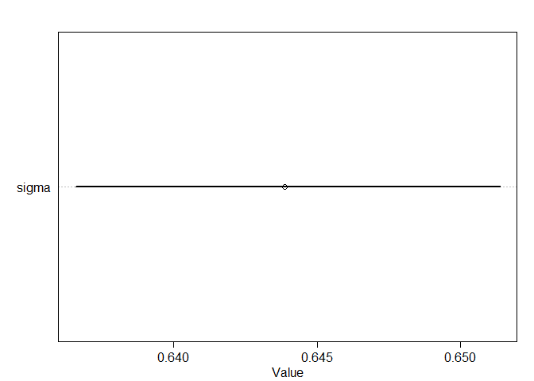
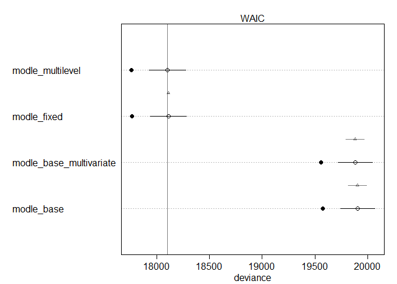

```r
library(rethinking)
```

```
## Loading required package: rstan
```

```
## Loading required package: StanHeaders
```

```
## Loading required package: ggplot2
```

```
## rstan (Version 2.19.2, GitRev: 2e1f913d3ca3)
```

```
## For execution on a local, multicore CPU with excess RAM we recommend calling
## options(mc.cores = parallel::detectCores()).
## To avoid recompilation of unchanged Stan programs, we recommend calling
## rstan_options(auto_write = TRUE)
```

```
## For improved execution time, we recommend calling
## Sys.setenv(LOCAL_CPPFLAGS = '-march=native')
## although this causes Stan to throw an error on a few processors.
```

```
## Loading required package: parallel
```

```
## Loading required package: dagitty
```

```
## rethinking (Version 1.93)
```

```
## 
## Attaching package: 'rethinking'
```

```
## The following object is masked from 'package:stats':
## 
##     rstudent
```

```r
hyp <- read.csv("hyp.lengths.both.experiments.labels.csv")
head(hyp)
```

```
##   line length plate light exp nativename stockparent latitude longitude site
## 1 6901  2.014   1AH     H   A      Bil-7     CS22579   63.324    18.484  Bil
## 2 6901  1.477   1AH     H   A      Bil-7     CS22579   63.324    18.484  Bil
## 3 6901  1.986   1AH     H   A      Bil-7     CS22579   63.324    18.484  Bil
## 4 6901  2.744   1AH     H   A      Bil-7     CS22579   63.324    18.484  Bil
## 5 6901  1.942   1AH     H   A      Bil-7     CS22579   63.324    18.484  Bil
## 6 6901  1.935   1AH     H   A      Bil-7     CS22579   63.324    18.484  Bil
##    region country
## 1 NSweden     SWE
## 2 NSweden     SWE
## 3 NSweden     SWE
## 4 NSweden     SWE
## 5 NSweden     SWE
## 6 NSweden     SWE
```

```r
summary(hyp)
```

```
##       line            length          plate       light    exp      
##  Min.   :  5837   Min.   :0.458   38BH   :  191   H:9133   A: 7692  
##  1st Qu.:  6930   1st Qu.:3.154   17BL   :  186   L:8898   B:10339  
##  Median :  6984   Median :4.091   35BL   :  179                     
##  Mean   :  8094   Mean   :4.123   8AH    :  179                     
##  3rd Qu.:  8290   3rd Qu.:4.978   33BL   :  177                     
##  Max.   :100000   Max.   :9.914   33BH   :  176                     
##                                   (Other):16943                     
##    nativename     stockparent       latitude       longitude       
##  Ang-0  :  177   CS949  :  177   Min.   :15.11   Min.   :-123.000  
##  Ull2-3 :  175   CS22587:  175   1st Qu.:47.25   1st Qu.:   2.250  
##  Kin-0  :  170   CS22654:  170   Median :50.00   Median :  10.872  
##  Mrk-0  :  167   CS22635:  167   Mean   :49.82   Mean   :   5.614  
##  Mt-0   :  167   CS22642:  167   3rd Qu.:55.58   3rd Qu.:  16.233  
##  Est-1  :  166   (Other):13039   Max.   :63.32   Max.   : 136.310  
##  (Other):17009   NA's   : 4136   NA's   :1455    NA's   :1455      
##       site                  region        country    
##  B疇    :  357   WesternEurope :4067   SWE    :3173  
##  Pu2    :  327   SSweden       :2175   GER    :2305  
##  HR     :  322   NorthernEurope:1715   CZE    :2017  
##  G\xc3 :  309   SouthernEurope:1331   UK     :1411  
##  CIBC   :  306   Moravia       :1167   USA    :1151  
##  (Other):14955   (Other)       :4680   (Other):6519  
##  NA's   : 1455   NA's          :2896   NA's   :1455
```

```r
str(hyp)
```

```
## 'data.frame':	18031 obs. of  12 variables:
##  $ line       : int  6901 6901 6901 6901 6901 6901 6901 8357 8357 8357 ...
##  $ length     : num  2.01 1.48 1.99 2.74 1.94 ...
##  $ plate      : Factor w/ 152 levels "10AH","10AL",..: 41 41 41 41 41 41 41 41 41 41 ...
##  $ light      : Factor w/ 2 levels "H","L": 1 1 1 1 1 1 1 1 1 1 ...
##  $ exp        : Factor w/ 2 levels "A","B": 1 1 1 1 1 1 1 1 1 1 ...
##  $ nativename : Factor w/ 180 levels "\xc3-1","\xc3繹2-1",..: 24 24 24 24 24 24 24 124 124 124 ...
##  $ stockparent: Factor w/ 135 levels "CS1007","CS1065",..: 48 48 48 48 48 48 48 23 23 23 ...
##  $ latitude   : num  63.3 63.3 63.3 63.3 63.3 ...
##  $ longitude  : num  18.5 18.5 18.5 18.5 18.5 ...
##  $ site       : Factor w/ 136 levels "\xc3繹2","Ag",..: 8 8 8 8 8 8 8 93 93 93 ...
##  $ region     : Factor w/ 18 levels "(null)","CentralAsia",..: 12 12 12 12 12 12 12 16 16 16 ...
##  $ country    : Factor w/ 26 levels "AUT","BEL","CAN",..: 22 22 22 22 22 22 22 6 6 6 ...
```

### 1. without pooling_base


```r
library(dplyr)
```

```
## 
## Attaching package: 'dplyr'
```

```
## The following objects are masked from 'package:stats':
## 
##     filter, lag
```

```
## The following objects are masked from 'package:base':
## 
##     intersect, setdiff, setequal, union
```

```r
hyp_s <- sample_n(hyp, 10000)
summary(hyp_s)
```

```
##       line            length          plate      light    exp     
##  Min.   :  5837   Min.   :0.458   38BL   : 110   H:5095   A:4229  
##  1st Qu.:  6931   1st Qu.:3.140   17BH   : 107   L:4905   B:5771  
##  Median :  6985   Median :4.093   17BL   : 106                    
##  Mean   :  8055   Mean   :4.121   31BH   : 105                    
##  3rd Qu.:  8290   3rd Qu.:4.991   35BH   : 105                    
##  Max.   :100000   Max.   :9.914   38BH   : 104                    
##                                   (Other):9363                    
##     nativename    stockparent      latitude       longitude       
##  Ang-0   : 103   CS949  : 103   Min.   :15.11   Min.   :-123.000  
##  Ra-0    :  98   CS22632:  98   1st Qu.:47.00   1st Qu.:   2.250  
##  Oy-0    :  95   CS22658:  95   Median :50.00   Median :  10.500  
##  Vinsl繹v:  94   CS22609:  93   Mean   :49.72   Mean   :   5.591  
##  Got-22  :  93   CS22654:  93   3rd Qu.:54.10   3rd Qu.:  16.200  
##  Kin-0   :  93   (Other):7205   Max.   :63.32   Max.   : 136.310  
##  (Other) :9424   NA's   :2313   NA's   :802     NA's   :802       
##       site                 region        country    
##  B疇    : 209   WesternEurope :2293   SWE    :1750  
##  Pu2    : 189   SSweden       :1242   GER    :1275  
##  G\xc3 : 176   NorthernEurope: 931   CZE    :1112  
##  HR     : 164   SouthernEurope: 726   UK     : 756  
##  CIBC   : 162   Moravia       : 626   USA    : 645  
##  (Other):8298   (Other)       :2583   (Other):3660  
##  NA's   : 802   NA's          :1599   NA's   : 802
```

```r
str(hyp_s)
```

```
## 'data.frame':	10000 obs. of  12 variables:
##  $ line       : int  8214 6910 6908 6897 6921 8310 6915 8334 7520 8378 ...
##  $ length     : num  4.96 5.28 4.1 4.24 3.15 ...
##  $ plate      : Factor w/ 152 levels "10AH","10AL",..: 43 8 28 91 73 66 4 83 118 24 ...
##  $ light      : Factor w/ 2 levels "H","L": 1 2 2 1 1 2 2 1 2 2 ...
##  $ exp        : Factor w/ 2 levels "A","B": 2 2 2 2 1 1 2 2 1 2 ...
##  $ nativename : Factor w/ 180 levels "\xc3-1","\xc3繹2-1",..: 68 43 40 17 65 75 54 103 101 143 ...
##  $ stockparent: Factor w/ 135 levels "CS1007","CS1065",..: 97 104 70 96 76 9 84 17 62 26 ...
##  $ latitude   : num  49 37.3 51.4 45 51.5 ...
##  $ longitude  : num  2 15 -0.638 1.3 9.935 ...
##  $ site       : Factor w/ 136 levels "\xc3繹2","Ag",..: 44 23 20 2 10 45 33 74 73 106 ...
##  $ region     : Factor w/ 18 levels "(null)","CentralAsia",..: 18 16 11 18 18 18 18 17 9 6 ...
##  $ country    : Factor w/ 26 levels "AUT","BEL","CAN",..: 8 12 24 8 9 9 9 22 5 5 ...
```

```r
dat_list1 <- list(
  length = scale(hyp_s$length),
  line = as.integer(as.factor(hyp_s$line)),
  light = as.integer(hyp_s$light=="H")
)


modle_base <- ulam(
  alist(
    length ~ dnorm(mu, sigma),
    mu <- a[line] + bI[line]*light,
    a[line] ~ dnorm(0, 1),
    bI[line] ~ dnorm(0, 1),
    sigma ~ dexp(1)
  ), data=dat_list1 , chains=4 , cores=4 , log_lik=TRUE)
```

```
## Warning: There were 40 transitions after warmup that exceeded the maximum treedepth. Increase max_treedepth above 10. See
## http://mc-stan.org/misc/warnings.html#maximum-treedepth-exceeded
```

```
## Warning: Examine the pairs() plot to diagnose sampling problems
```

```r
precis( modle_base, depth=2 , pars=c("bI","sigma"))
```

```
##                 mean          sd        5.5%       94.5%    n_eff      Rhat
## bI[1]   -0.549393814 0.171731938 -0.83242763 -0.27763734 3334.447 0.9988393
## bI[2]   -0.723222049 0.142795317 -0.95329965 -0.50170779 4282.895 0.9985220
## bI[3]   -1.670205627 0.310885060 -2.17942141 -1.17399985 3952.754 0.9990510
## bI[4]   -0.956044397 0.187078112 -1.24588389 -0.65690914 3492.417 0.9991729
## bI[5]   -0.471697411 0.154641346 -0.71793450 -0.22932792 3557.248 0.9984904
## bI[6]   -0.116568013 0.143718537 -0.35470988  0.10861323 3711.774 0.9991008
## bI[7]   -0.997838303 0.176621616 -1.27683153 -0.70921766 3834.930 0.9995123
## bI[8]   -0.988277542 0.270534095 -1.42183108 -0.57649506 4159.495 0.9986807
## bI[9]   -0.677202786 0.692709079 -1.80104030  0.45916273 3759.509 0.9985841
## bI[10]  -0.550352429 0.455325976 -1.26307022  0.16413657 3019.181 0.9993186
## bI[11]  -0.674164843 0.169510919 -0.94615321 -0.40064218 3421.472 0.9984007
## bI[12]  -0.600954107 0.187772272 -0.90156116 -0.29554245 3508.972 0.9985702
## bI[13]  -0.874066759 0.142416061 -1.10268322 -0.65139194 3389.204 0.9993812
## bI[14]  -0.561621959 0.169841437 -0.83257025 -0.28278703 3492.441 1.0005513
## bI[15]  -0.507058775 0.196442697 -0.82203696 -0.19538497 2981.454 0.9991638
## bI[16]  -0.849166998 0.164110295 -1.11099497 -0.59812618 4721.270 0.9988893
## bI[17]  -0.856283200 0.182466342 -1.15049423 -0.56627355 4045.287 0.9989672
## bI[18]  -0.988222616 0.280209221 -1.43084265 -0.54184898 3607.114 1.0008860
## bI[19]  -0.746024308 0.171825335 -1.01636458 -0.46157666 3097.384 0.9989569
## bI[20]  -0.877417130 0.135011418 -1.09516834 -0.65782215 3975.654 0.9988954
## bI[21]  -1.177393574 0.150683088 -1.42025098 -0.94056270 4389.352 0.9990280
## bI[22]  -1.604752956 0.137009544 -1.82721332 -1.38819113 3757.827 0.9994381
## bI[23]  -1.447901986 0.133225030 -1.66352905 -1.23701390 3865.101 0.9988315
## bI[24]  -0.658212979 0.151702061 -0.90544406 -0.41471313 4791.725 0.9983487
## bI[25]  -0.685397393 0.141231960 -0.90984754 -0.45923988 2624.608 0.9996032
## bI[26]  -1.223103039 0.294856176 -1.70347958 -0.74501568 3332.954 0.9997336
## bI[27]  -1.037227890 0.170996821 -1.31388635 -0.75573880 3478.301 0.9989219
## bI[28]  -1.501618703 0.140662805 -1.72476869 -1.27831799 3774.488 0.9987966
## bI[29]  -1.241273149 0.190359975 -1.54289088 -0.93486612 4320.855 0.9984562
## bI[30]   0.007333756 0.137367893 -0.21639275  0.22654404 2948.347 0.9987797
## bI[31]  -1.276766673 0.174223357 -1.54982736 -0.99150140 3698.669 0.9987992
## bI[32]  -0.579197519 0.600291489 -1.51273114  0.38336710 3389.465 0.9990866
## bI[33]  -1.387252739 0.143155855 -1.61447848 -1.14891653 3027.520 0.9991168
## bI[34]  -0.672673127 0.134796977 -0.88271930 -0.45517483 3877.654 0.9990796
## bI[35]  -0.592054575 0.137328963 -0.81160929 -0.37474823 3555.567 0.9999865
## bI[36]  -0.790475208 0.136801851 -1.01898648 -0.57307020 3451.746 1.0007917
## bI[37]  -0.717487381 0.133790162 -0.93599690 -0.50039958 3208.333 0.9998381
## bI[38]  -0.805739514 0.132541530 -1.01318942 -0.59308727 3724.999 0.9991387
## bI[39]  -0.863206205 0.129407944 -1.06615818 -0.65569403 4442.195 0.9987820
## bI[40]   0.135912296 0.619511716 -0.83707016  1.11071002 2853.743 0.9997498
## bI[41]   0.376483053 0.150021622  0.13806566  0.62780264 3292.441 0.9998827
## bI[42]  -1.740455691 0.140819886 -1.96934072 -1.52436879 2881.941 1.0001954
## bI[43]  -0.497404123 0.172668765 -0.77304927 -0.21769099 3502.026 0.9988015
## bI[44]  -1.218664231 0.245048327 -1.60463449 -0.82662719 3578.322 0.9988784
## bI[45]  -0.359604515 0.248372211 -0.76042265  0.02382036 3483.026 0.9993216
## bI[46]  -0.348367430 0.180228097 -0.63119658 -0.05955224 3454.213 0.9983662
## bI[47]  -0.402348650 0.158632137 -0.65677672 -0.14357331 3336.045 0.9993111
## bI[48]  -0.664443834 0.128017453 -0.86861653 -0.46016743 3520.044 0.9987721
## bI[49]  -0.884478774 0.166657079 -1.14458668 -0.61994803 3201.178 0.9992624
## bI[50]  -0.311938851 0.129444952 -0.52328827 -0.10866201 4217.871 0.9992692
## bI[51]  -0.593473813 0.140960801 -0.81762568 -0.36147469 3021.793 0.9990173
## bI[52]  -0.450463262 0.160575442 -0.70418164 -0.19450888 3655.192 0.9994552
## bI[53]  -0.174032490 0.178493613 -0.45873338  0.11734290 3413.090 0.9988454
## bI[54]  -0.874910694 0.157854696 -1.12554450 -0.62620357 3121.631 0.9995473
## bI[55]   0.063527230 0.239837488 -0.31082236  0.45832719 3977.224 0.9990349
## bI[56]  -1.218481951 0.134566828 -1.43145201 -1.00705295 3019.337 0.9989894
## bI[57]  -0.762947354 0.180534387 -1.05286809 -0.46837684 3542.457 0.9985753
## bI[58]  -0.827321580 0.154251053 -1.07409862 -0.58964288 3875.602 0.9994517
## bI[59]  -0.831163517 0.138099392 -1.04974540 -0.61290213 3676.866 0.9992239
## bI[60]  -0.457250702 0.128354790 -0.66234168 -0.24944904 3659.975 0.9990317
## bI[61]  -1.495994197 0.155210186 -1.74845084 -1.25182405 2605.433 0.9991276
## bI[62]  -0.725237961 0.139701417 -0.95548192 -0.49729694 3714.873 0.9988462
## bI[63]  -0.496340309 0.167176921 -0.76347271 -0.23547849 3403.377 0.9987863
## bI[64]  -0.914374335 0.138900758 -1.13565761 -0.69229717 3467.876 0.9996560
## bI[65]  -0.798743161 0.144789417 -1.02787968 -0.57104134 3514.933 1.0005416
## bI[66]  -0.907301994 0.167354641 -1.17958953 -0.64800998 3287.828 0.9990608
## bI[67]  -0.493764878 0.324235667 -1.01127821  0.03573711 3943.694 0.9997941
## bI[68]  -0.384672842 0.146372926 -0.61801112 -0.15904737 3875.369 1.0000960
## bI[69]  -0.926145084 0.142292230 -1.15583009 -0.69637396 4136.164 0.9987559
## bI[70]  -1.685893235 0.217154319 -2.02746734 -1.34012100 3898.454 0.9993324
## bI[71]  -0.949429301 0.201149193 -1.27416800 -0.62542171 3457.618 0.9984752
## bI[72]  -0.107748037 0.131809062 -0.31471323  0.11268796 3243.688 0.9985047
## bI[73]  -0.686233284 0.151188263 -0.92860974 -0.44387631 3523.145 0.9990505
## bI[74]  -0.462017968 0.137600477 -0.68227209 -0.23391925 4037.279 0.9991104
## bI[75]  -0.369241144 0.156854854 -0.62162662 -0.12642222 3311.157 0.9992282
## bI[76]  -0.833579727 0.176459701 -1.11940165 -0.55408053 3875.334 0.9993887
## bI[77]  -0.171942957 0.136486227 -0.40137232  0.04376824 3159.643 0.9998237
## bI[78]  -0.158144134 0.155793794 -0.40336074  0.08591157 2688.406 0.9990773
## bI[79]  -0.170680689 0.188870604 -0.47621350  0.12769529 3707.182 0.9989307
## bI[80]  -1.128665714 0.635527911 -2.14463728 -0.14465811 2224.056 0.9994152
## bI[81]  -0.377251617 0.137475289 -0.59698484 -0.15092106 3538.928 0.9987896
## bI[82]  -0.868146027 0.137662619 -1.09258144 -0.64809812 3337.508 0.9986834
## bI[83]  -0.169650070 0.537125941 -1.01195127  0.71090925 3314.109 0.9990408
## bI[84]  -0.466317248 0.159482792 -0.72443611 -0.20527726 4035.453 0.9993387
## bI[85]  -0.724872475 0.258268330 -1.14422168 -0.29565645 2830.096 1.0000063
## bI[86]  -1.232389899 0.199111173 -1.55699077 -0.92433788 3433.967 0.9992350
## bI[87]  -0.141434752 0.146115004 -0.38792527  0.08997244 5454.448 0.9989611
## bI[88]  -1.085874333 0.404408354 -1.73903882 -0.45590768 2389.184 0.9990151
## bI[89]  -0.302653594 0.174059317 -0.58953685 -0.02767866 3610.573 0.9985487
## bI[90]  -0.174675115 0.199536607 -0.50253886  0.13872226 3743.208 0.9986185
## bI[91]  -0.711415013 0.159407996 -0.96363877 -0.46216757 5284.167 0.9996772
## bI[92]   0.781242940 0.342558140  0.24585599  1.31290750 4773.359 0.9985584
## bI[93]  -0.428570566 0.186293708 -0.72291635 -0.13022942 3395.015 0.9986702
## bI[94]  -0.050962135 0.197108352 -0.36043553  0.25473474 3225.014 0.9986662
## bI[95]  -1.096886783 0.519214191 -1.90505684 -0.25343128 3355.935 0.9998438
## bI[96]  -0.755450549 0.271411679 -1.20564575 -0.32805314 3653.775 0.9996787
## bI[97]  -1.406539873 0.144554751 -1.64071204 -1.17296489 3643.598 0.9993077
## bI[98]  -1.546016998 0.152087363 -1.79300932 -1.30878506 2813.984 1.0001991
## bI[99]  -0.689123880 0.159305358 -0.94551345 -0.43315991 3133.498 0.9991355
## bI[100] -1.180803167 0.162732946 -1.44406830 -0.91558086 3593.878 0.9989604
## bI[101] -0.616965226 0.778093086 -1.81067360  0.63926006 4181.551 0.9990163
## bI[102] -1.159789069 0.191291677 -1.46644159 -0.85862246 3687.524 0.9993429
## bI[103] -0.566575913 0.567447981 -1.42969397  0.32641569 3620.366 0.9989738
## bI[104] -0.734199440 0.194060313 -1.04174834 -0.43590162 3480.609 0.9993308
## bI[105]  0.211436755 0.167384432 -0.05755273  0.47458580 3501.295 0.9983807
## bI[106] -0.925497130 0.168958980 -1.19079540 -0.64819958 3289.396 0.9994991
## bI[107] -1.119442563 0.435894946 -1.81770719 -0.42881148 3515.094 0.9991758
## bI[108] -0.255673067 0.234287609 -0.63188444  0.13270147 3344.103 0.9995544
## bI[109] -1.862743412 0.396805633 -2.50332799 -1.22884468 3211.919 0.9992750
## bI[110] -0.310023873 0.178456925 -0.58709429 -0.02364011 2877.867 0.9985038
## bI[111] -0.574083986 0.244126510 -0.96056268 -0.18534429 3245.228 0.9991207
## bI[112] -0.569984791 0.157538732 -0.81916159 -0.31163933 3610.353 0.9982345
## bI[113] -0.911240400 0.143253817 -1.13017708 -0.68079420 4129.710 0.9981873
## bI[114] -0.315583847 0.180684971 -0.60025887 -0.02790326 3400.586 0.9991548
## bI[115] -1.295071259 0.151472076 -1.53993081 -1.05273792 4042.414 0.9989914
## bI[116] -1.877348419 0.209135273 -2.20588560 -1.54375044 3220.032 0.9983385
## bI[117] -0.517739451 0.131488487 -0.72292920 -0.30551288 3736.653 0.9989265
## bI[118] -1.042652152 0.141874138 -1.27118557 -0.82194471 3843.301 0.9987601
## bI[119] -1.150525248 0.403381837 -1.80187546 -0.52034894 3584.160 0.9990510
## bI[120] -0.600757843 0.744664361 -1.74850760  0.59425654 3623.492 0.9995195
## bI[121] -0.401662122 0.143616443 -0.62641640 -0.17708481 4129.340 0.9994715
## bI[122] -0.623179820 0.150869689 -0.86620708 -0.37692097 5255.240 0.9984988
## bI[123] -0.289166444 0.127493975 -0.48984423 -0.08716878 3320.586 0.9991328
## bI[124] -1.082702510 0.150432145 -1.33090538 -0.84551261 3549.347 0.9986911
## bI[125] -0.747169511 0.265219291 -1.17994936 -0.33078300 3647.601 0.9990356
## bI[126] -1.104677259 0.149298493 -1.33447276 -0.86395132 2766.752 1.0007431
## bI[127] -1.275468558 0.149009445 -1.50736723 -1.03496816 4248.418 1.0004889
## bI[128] -0.339678934 0.143946547 -0.56983766 -0.10652014 3256.536 0.9987241
## bI[129] -1.035464980 0.155782322 -1.27931347 -0.78815311 3718.074 0.9989243
## bI[130] -1.166153309 0.195797570 -1.48228023 -0.85517108 4243.747 0.9988539
## bI[131] -0.548722239 0.140247640 -0.76462718 -0.31948449 3331.579 1.0006673
## bI[132] -0.983456536 0.142262952 -1.20569423 -0.75465643 3454.409 0.9987142
## bI[133] -0.726235303 0.356265623 -1.28070644 -0.16029117 3222.585 0.9989186
## bI[134] -0.555072669 0.447712494 -1.26406740  0.14719610 3336.873 0.9999664
## bI[135] -1.328719697 0.143310374 -1.56381328 -1.10035502 4014.353 0.9988094
## bI[136] -0.916738293 0.167318591 -1.18016785 -0.64646801 3370.660 0.9997090
## bI[137] -0.859645755 0.156632800 -1.11104688 -0.61100897 3174.786 0.9991209
## bI[138] -0.911171566 0.137463045 -1.12688129 -0.68971557 3255.956 0.9984258
## bI[139] -0.480578361 0.276639475 -0.93521846 -0.03944880 3392.137 0.9982958
## bI[140] -0.036919814 0.137344124 -0.25516074  0.18152180 3336.247 0.9986227
## bI[141] -0.409927596 0.161392423 -0.65882887 -0.14672983 2875.487 0.9984933
## bI[142]  0.087847781 0.151340900 -0.14942258  0.33340827 4360.078 0.9986418
## bI[143] -0.671180024 0.160749311 -0.92695709 -0.41908374 3885.025 0.9985824
## bI[144] -0.426244093 0.202451026 -0.74937080 -0.10863762 4183.693 0.9985402
## bI[145] -0.510695504 0.154289591 -0.75777349 -0.26381498 3045.402 0.9996755
## bI[146] -1.111432512 0.148498184 -1.35122576 -0.87444912 2716.932 0.9986475
## bI[147] -1.237853770 0.136166281 -1.46109132 -1.02347640 2897.312 0.9990032
## bI[148] -1.073299462 0.180269741 -1.35997951 -0.78865221 3591.708 0.9984029
## bI[149] -0.152950373 0.745055029 -1.33389167  1.07897796 4734.496 0.9989369
## bI[150] -1.641709573 0.174941064 -1.92189466 -1.37185142 3475.774 0.9991623
## bI[151] -1.323535344 0.176568552 -1.61886556 -1.04823696 4072.392 0.9988823
## bI[152] -1.020747105 0.175158806 -1.29878541 -0.73197560 3647.444 0.9989471
## bI[153] -1.184467626 0.158252380 -1.43665462 -0.92187372 4455.776 0.9999937
## bI[154]  0.103470970 0.219323800 -0.25086989  0.45863348 3582.800 0.9993373
## bI[155] -0.407871821 0.147105827 -0.64646035 -0.17410438 2788.272 1.0014871
## bI[156] -0.010345111 0.988489542 -1.57834389  1.54466769 2720.365 1.0008380
## bI[157] -0.179970163 0.181952401 -0.47181916  0.11213776 3484.845 0.9988067
## bI[158] -0.816969104 0.180778653 -1.10382862 -0.53297106 3941.939 0.9989108
## bI[159] -1.006872184 0.141620137 -1.23657875 -0.78280892 4598.098 0.9983074
## bI[160] -0.273320984 0.147988549 -0.49574288 -0.03707456 3445.104 0.9992276
## bI[161] -0.489073129 0.131022228 -0.69576100 -0.28300784 3048.036 0.9992231
## bI[162] -0.451878574 0.168537300 -0.71574120 -0.18637184 3104.971 0.9995532
## bI[163] -0.772259405 0.172440885 -1.04535514 -0.49656568 3961.339 0.9990130
## bI[164] -0.811621609 0.138499084 -1.03488035 -0.59416688 3873.802 0.9995910
## bI[165] -0.676215733 0.164353618 -0.93574028 -0.41370657 4059.216 0.9996726
## bI[166] -0.814082284 0.165375945 -1.08488107 -0.55137313 3443.423 0.9993601
## bI[167] -0.759572185 0.158154601 -1.01315145 -0.51855786 3639.221 1.0003379
## bI[168] -0.740579633 0.162426621 -0.99827583 -0.48319345 4082.889 0.9984212
## bI[169] -1.074664120 0.137203571 -1.29652737 -0.85519382 3234.939 0.9988900
## bI[170] -0.777162321 0.143039651 -1.01116151 -0.54806962 4328.176 0.9991019
## bI[171]  0.190723619 0.134448732 -0.02636351  0.40593662 3103.082 0.9991999
## bI[172] -1.124399672 0.142879693 -1.35193412 -0.89685121 3655.493 0.9984057
## bI[173] -0.679309762 0.627043176 -1.68750545  0.29703788 2699.493 0.9984735
## bI[174] -1.031926901 0.145366797 -1.25864086 -0.79796935 3332.825 0.9984290
## bI[175] -0.894216788 0.142592058 -1.12815639 -0.66640145 3119.247 0.9990851
## bI[176] -1.242439742 0.132073113 -1.45371436 -1.03487171 3815.013 0.9995976
## bI[177] -1.887763796 0.130078182 -2.09067064 -1.67338075 2931.109 0.9986553
## bI[178] -1.182302281 0.162282764 -1.43551723 -0.92640144 3755.410 0.9993081
## sigma    0.632196068 0.004536726  0.62492625  0.63944242 2134.102 1.0010230
```

```r
plot( precis(modle_base) )
```

```
## 356 vector or matrix parameters hidden. Use depth=2 to show them.
```

<!-- -->


```r
library(tidyverse)
```

```
## -- Attaching packages ---------------------------------------------------------------- tidyverse 1.3.0 --
```

```
## √ tibble  2.1.3     √ purrr   0.3.3
## √ tidyr   1.0.0     √ stringr 1.4.0
## √ readr   1.3.1     √ forcats 0.4.0
```

```
## -- Conflicts ------------------------------------------------------------------- tidyverse_conflicts() --
## x tidyr::extract() masks rstan::extract()
## x dplyr::filter()  masks stats::filter()
## x dplyr::lag()     masks stats::lag()
## x purrr::map()     masks rethinking::map()
```

```r
hyp_s_new <- hyp_s %>% unite("plate_exp", c("plate", "exp"), remove = FALSE)
#head(hyp_s_new)
str(hyp_s_new)
```

```
## 'data.frame':	10000 obs. of  13 variables:
##  $ line       : int  8214 6910 6908 6897 6921 8310 6915 8334 7520 8378 ...
##  $ length     : num  4.96 5.28 4.1 4.24 3.15 ...
##  $ plate_exp  : chr  "1BH_B" "11BL_B" "16BL_B" "30BH_B" ...
##  $ plate      : Factor w/ 152 levels "10AH","10AL",..: 43 8 28 91 73 66 4 83 118 24 ...
##  $ light      : Factor w/ 2 levels "H","L": 1 2 2 1 1 2 2 1 2 2 ...
##  $ exp        : Factor w/ 2 levels "A","B": 2 2 2 2 1 1 2 2 1 2 ...
##  $ nativename : Factor w/ 180 levels "\xc3-1","\xc3繹2-1",..: 68 43 40 17 65 75 54 103 101 143 ...
##  $ stockparent: Factor w/ 135 levels "CS1007","CS1065",..: 97 104 70 96 76 9 84 17 62 26 ...
##  $ latitude   : num  49 37.3 51.4 45 51.5 ...
##  $ longitude  : num  2 15 -0.638 1.3 9.935 ...
##  $ site       : Factor w/ 136 levels "\xc3繹2","Ag",..: 44 23 20 2 10 45 33 74 73 106 ...
##  $ region     : Factor w/ 18 levels "(null)","CentralAsia",..: 18 16 11 18 18 18 18 17 9 6 ...
##  $ country    : Factor w/ 26 levels "AUT","BEL","CAN",..: 8 12 24 8 9 9 9 22 5 5 ...
```

```r
dat_list <- list(
  length = scale(hyp_s_new$length),
  line = as.integer(as.factor(hyp_s_new$line)),
  light = as.integer(hyp_s_new$light=="H"),
  plate_exp = as.integer(as.factor(hyp_s_new$plate_exp))
)

#head(dat_list)
summary(dat_list)
```

```
##           Length Class  Mode   
## length    10000  -none- numeric
## line      10000  -none- numeric
## light     10000  -none- numeric
## plate_exp 10000  -none- numeric
```

```r
str(dat_list)
```

```
## List of 4
##  $ length   : num [1:10000, 1] 0.6185 0.851 -0.0157 0.0858 -0.7147 ...
##   ..- attr(*, "scaled:center")= num 4.12
##   ..- attr(*, "scaled:scale")= num 1.36
##  $ line     : int [1:10000] 105 25 23 14 35 143 29 153 97 166 ...
##  $ light    : int [1:10000] 1 0 0 1 1 0 0 1 0 0 ...
##  $ plate_exp: int [1:10000] 43 8 28 91 73 66 4 83 118 24 ...
```

### 1.without pooling_fixed


```r
modle_fixed <- ulam(
  alist(
    length ~ dnorm(mu, sigma),
    mu <- a[line] + bI[line]*light + bP[plate_exp],
    a[line] ~ dnorm(0, 1),
    bI[line] ~ dnorm(0, 1),
    bP[plate_exp] ~ dnorm(0, 1),
    sigma ~ dexp(1)
  ), data=dat_list , chains=4 , cores=4 , log_lik=TRUE)
```

```
## Warning: Bulk Effective Samples Size (ESS) is too low, indicating posterior means and medians may be unreliable.
## Running the chains for more iterations may help. See
## http://mc-stan.org/misc/warnings.html#bulk-ess
```

```
## Warning: Tail Effective Samples Size (ESS) is too low, indicating posterior variances and tail quantiles may be unreliable.
## Running the chains for more iterations may help. See
## http://mc-stan.org/misc/warnings.html#tail-ess
```

```r
precis( modle_fixed, depth=2 , pars=c("bI","sigma"))
```

```
##                 mean          sd          5.5%        94.5%     n_eff      Rhat
## bI[1]    0.180297696 0.172832935 -0.1044327729  0.447213260  898.0212 0.9996618
## bI[2]   -0.171415779 0.156230648 -0.4235093015  0.075572427  895.8374 0.9996917
## bI[3]   -0.832345511 0.293686990 -1.2853795170 -0.366044147 2306.8376 0.9984300
## bI[4]   -0.494490130 0.215184290 -0.8534148060 -0.162730984 1025.7344 0.9994489
## bI[5]    0.143574226 0.166650425 -0.1190352604  0.412227826  779.5455 0.9994479
## bI[6]    0.367730935 0.160482570  0.1118098018  0.623072305  802.7173 1.0015112
## bI[7]   -0.164691648 0.192295087 -0.4680084050  0.142563525 1005.1372 1.0001665
## bI[8]   -0.444926747 0.276067185 -0.8828004619 -0.004681115 2064.0187 0.9987909
## bI[9]   -0.385447062 0.724350786 -1.5295249029  0.802236147 3520.2098 1.0001673
## bI[10]  -0.346584145 0.404815731 -1.0022424448  0.310143189 3482.2902 0.9990855
## bI[11]  -0.462822515 0.174448767 -0.7421175617 -0.191931643 1064.5813 1.0024944
## bI[12]  -0.158632268 0.196130227 -0.4648573529  0.160985227 1232.6221 1.0003923
## bI[13]  -0.258857208 0.149409177 -0.4930605362 -0.023227937  651.8351 1.0009963
## bI[14]   0.137889135 0.183817902 -0.1500683059  0.438428859  732.8214 0.9990113
## bI[15]  -0.025678186 0.195584734 -0.3391692947  0.295105439 1012.8847 0.9995734
## bI[16]  -0.241036908 0.170408265 -0.5154146353  0.033461317  716.6461 1.0006244
## bI[17]  -0.157314632 0.195896487 -0.4650826710  0.155581144  823.6829 1.0003240
## bI[18]  -0.195075471 0.283955279 -0.6247079771  0.285210004 2232.2836 0.9990574
## bI[19]  -0.150083007 0.178974064 -0.4363069880  0.136930182  998.4697 1.0018760
## bI[20]  -0.262740303 0.149929172 -0.5021902752 -0.024806602  698.7215 1.0008484
## bI[21]  -0.204864242 0.152895166 -0.4468965682  0.039540734  681.1273 1.0007366
## bI[22]  -0.953776483 0.155605761 -1.2005897059 -0.709261207  705.0392 1.0015220
## bI[23]  -0.892170372 0.155872249 -1.1441166103 -0.645907510  696.2466 0.9985328
## bI[24]   0.427493493 0.160718461  0.1716480936  0.678820279  604.0888 0.9999370
## bI[25]   0.145232966 0.163521061 -0.1174480167  0.399874257  724.3673 1.0004691
## bI[26]  -0.407331283 0.308994951 -0.9177115528  0.076172141 2333.0875 0.9987224
## bI[27]  -0.326228078 0.182982981 -0.6084182684 -0.032075485 1088.8610 1.0010364
## bI[28]  -0.905896412 0.153528799 -1.1450844501 -0.667738332  758.5921 1.0003679
## bI[29]  -0.455430155 0.200183205 -0.7681311313 -0.135658942  943.3933 1.0019563
## bI[30]   0.352123414 0.150538180  0.1121985344  0.588724186  591.0664 1.0005082
## bI[31]  -0.775359608 0.182468179 -1.0775271915 -0.486171528 1072.3263 0.9998111
## bI[32]  -0.188020702 0.589913931 -1.1109168196  0.716357409 3598.3448 0.9985936
## bI[33]  -0.820695008 0.161477001 -1.0740242686 -0.552666474  892.3255 1.0005211
## bI[34]   0.293435774 0.149537516  0.0567429967  0.530846865  555.4373 1.0003219
## bI[35]   0.331028780 0.161494221  0.0756371883  0.594531489  654.6255 1.0042570
## bI[36]  -0.289915515 0.151420326 -0.5358587929 -0.050686798  578.2111 1.0012348
## bI[37]   0.060172912 0.153821212 -0.1829911899  0.303118224  691.3119 0.9996677
## bI[38]  -0.189559631 0.151561390 -0.4272731326  0.052700712  563.2274 1.0037109
## bI[39]  -0.338473142 0.155518097 -0.5958227130 -0.095755282  675.2529 0.9999147
## bI[40]   0.810120387 0.590572435 -0.1149986219  1.755768635 3678.1190 0.9988845
## bI[41]   1.042015810 0.166822604  0.7732075822  1.300333876  807.3287 1.0001095
## bI[42]  -1.063438584 0.158338933 -1.3087172768 -0.808861394  804.1533 0.9997963
## bI[43]   0.011866064 0.190990345 -0.2879177842  0.316727399  910.2847 1.0009040
## bI[44]  -0.719138286 0.248004432 -1.1117720811 -0.320667588 1407.5207 0.9995588
## bI[45]   0.020827179 0.249815086 -0.3883085580  0.423656902 1249.6839 0.9993764
## bI[46]   0.134542885 0.183134293 -0.1495159241  0.436357049 1103.9237 0.9984017
## bI[47]   0.139011439 0.179315742 -0.1477044030  0.421860518  978.9674 0.9993393
## bI[48]   0.003536285 0.152022033 -0.2450939923  0.243612943  708.0880 1.0026934
## bI[49]  -0.002730076 0.172551402 -0.2718439895  0.274907902  977.5145 0.9991064
## bI[50]   0.210614831 0.148904427 -0.0304481393  0.456051063  826.1052 1.0008463
## bI[51]   0.189123370 0.159576510 -0.0634135360  0.443156388  731.7501 0.9996692
## bI[52]   0.010685316 0.168528680 -0.2498001943  0.276255626  811.0589 1.0001035
## bI[53]   0.158847578 0.183885857 -0.1349160094  0.457242277  746.1683 1.0023899
## bI[54]  -0.196798141 0.169704317 -0.4689274033  0.075874137  884.6318 1.0026273
## bI[55]   0.216412687 0.229612123 -0.1387773929  0.596486006 1328.1859 0.9986266
## bI[56]  -0.467077162 0.145765549 -0.6957190713 -0.237615904  647.2986 0.9992951
## bI[57]  -0.309463543 0.192227345 -0.6216510143 -0.002632265 1173.6584 0.9993425
## bI[58]   0.022620219 0.169465630 -0.2489493573  0.287568216  870.6467 0.9988603
## bI[59]  -0.198091283 0.157077903 -0.4530795342  0.048671830  548.7817 1.0008176
## bI[60]   0.127480198 0.145330213 -0.1005822674  0.363838722  481.0751 1.0041082
## bI[61]  -0.558566551 0.172776934 -0.8410451405 -0.292349466  983.2532 0.9992918
## bI[62]   0.247969676 0.149529435  0.0080695578  0.488178720  638.7741 1.0002636
## bI[63]   0.044291180 0.178374443 -0.2481135882  0.323372815  829.5280 1.0020507
## bI[64]  -0.373066591 0.159113889 -0.6252885619 -0.112891304  771.3580 0.9990512
## bI[65]  -0.268677453 0.161595452 -0.5256314941 -0.016528656  822.1898 1.0001230
## bI[66]  -0.299135329 0.171579033 -0.5703346827 -0.017670315  905.0556 0.9990822
## bI[67]  -0.310580956 0.300535739 -0.7918523822  0.150928759 2062.4101 0.9997046
## bI[68]   0.112025634 0.159059526 -0.1450598501  0.364960989  730.7021 1.0011802
## bI[69]  -0.234980301 0.168247838 -0.4984779961  0.033324145  948.6447 1.0011057
## bI[70]  -0.998559404 0.211930257 -1.3265425147 -0.656618141 1273.1451 0.9987212
## bI[71]  -0.511370832 0.206968039 -0.8396226185 -0.184837429 1442.1237 1.0002584
## bI[72]   0.544140052 0.151139089  0.3074499658  0.783235520  549.6836 1.0018207
## bI[73]   0.046098576 0.162107736 -0.2043071025  0.310983181  811.7232 0.9995923
## bI[74]   0.423369606 0.156260359  0.1867152681  0.676842325  695.6870 1.0009471
## bI[75]   0.398630496 0.177190448  0.1182847372  0.683097051  834.2636 0.9996676
## bI[76]  -0.139312801 0.183048130 -0.4242709167  0.152450595  947.6899 1.0010826
## bI[77]   0.355246656 0.160979639  0.0961005435  0.609744494  759.5788 1.0016644
## bI[78]   0.526493719 0.170060484  0.2566386647  0.799924495  796.3451 1.0012362
## bI[79]   0.443790124 0.195754072  0.1235020101  0.745429210 1097.0188 1.0013936
## bI[80]  -0.850885790 0.600725174 -1.8203865687  0.083380777 3805.4392 0.9990662
## bI[81]   0.032771156 0.150968222 -0.2154990990  0.268576244  807.0913 1.0000533
## bI[82]  -0.068472449 0.154823334 -0.3121408353  0.182034622  646.2042 0.9994701
## bI[83]   0.206780703 0.526698034 -0.6280350484  1.086454183 3937.8741 0.9984909
## bI[84]   0.133383815 0.174559065 -0.1380003369  0.407444470  959.5021 1.0014073
## bI[85]  -0.099557497 0.276004794 -0.5333793188  0.332899154 2299.7395 0.9988477
## bI[86]  -0.886367128 0.205219113 -1.2142392833 -0.555073719 1451.1472 1.0001365
## bI[87]   0.245511530 0.156218340 -0.0084913495  0.498224102  789.3962 0.9998689
## bI[88]  -0.841552420 0.385661341 -1.4593101253 -0.227594462 2928.7723 0.9995587
## bI[89]   0.284409747 0.188118880 -0.0107252386  0.585058738  957.4229 0.9997237
## bI[90]   0.543055504 0.207218709  0.2105083713  0.870943760 1169.8125 0.9994045
## bI[91]  -0.326718985 0.177267105 -0.6128161274 -0.052285880 1054.9165 0.9998922
## bI[92]   1.221199848 0.325958221  0.6876038960  1.747209205 2748.0473 0.9994745
## bI[93]   0.169422329 0.193254572 -0.1364004418  0.482224389 1151.9949 0.9988724
## bI[94]   0.569643181 0.194083713  0.2585701636  0.869478419 1144.9161 1.0000070
## bI[95]  -0.617573813 0.511109492 -1.4317959248  0.192216154 2911.4396 0.9993418
## bI[96]  -0.220729227 0.266134903 -0.6411406154  0.207136289 1582.6545 1.0006005
## bI[97]  -0.579692308 0.164209384 -0.8454329161 -0.321616230  819.3191 1.0007673
## bI[98]  -1.056757771 0.171494142 -1.3301101110 -0.782073267  788.8116 1.0002941
## bI[99]  -0.192972864 0.176960848 -0.4798778882  0.077285303  837.9146 1.0003084
## bI[100] -0.559466333 0.177616984 -0.8324680647 -0.264291976  712.5359 1.0007101
## bI[101] -0.364045007 0.758592740 -1.5874822165  0.840262029 3607.2672 0.9996792
## bI[102] -0.537638639 0.192024635 -0.8405037917 -0.226176407 1115.2460 0.9995934
## bI[103]  0.091803923 0.502175140 -0.7275299075  0.886408319 3404.3461 0.9990569
## bI[104] -0.255481637 0.202694566 -0.5778001756  0.080812429 1135.6182 1.0003144
## bI[105]  0.656533056 0.179822126  0.3668341659  0.943488065  941.6763 0.9993066
## bI[106] -0.421144259 0.179691319 -0.7114719997 -0.126061226  685.5672 1.0021437
## bI[107] -0.383590776 0.396656319 -1.0091137655  0.251122737 2512.3503 0.9985493
## bI[108]  0.421424218 0.236209041  0.0501564294  0.805846374 1479.0308 0.9994164
## bI[109] -1.522458332 0.376484756 -2.1307883342 -0.902234796 2777.8029 0.9994761
## bI[110]  0.322678837 0.186617947  0.0319988088  0.610938759 1098.0036 0.9989677
## bI[111]  0.017386020 0.248830267 -0.3958481255  0.417663213 1583.8336 0.9988851
## bI[112]  0.025226652 0.182508307 -0.2706107299  0.320715488  930.5475 1.0010308
## bI[113] -0.186341863 0.151600757 -0.4255106403  0.057791489  613.1348 1.0012823
## bI[114]  0.483962571 0.194864008  0.1633416011  0.788893403 1209.2015 1.0006049
## bI[115] -0.830520533 0.167413995 -1.0971818890 -0.564343558  779.5132 1.0008153
## bI[116] -1.344730506 0.210153409 -1.6688400916 -1.007085651 1323.8888 0.9996028
## bI[117]  0.231843078 0.147155042  0.0002826082  0.470660902  563.5846 1.0011443
## bI[118] -0.289771515 0.153554816 -0.5273802702 -0.043835422  788.8461 1.0005453
## bI[119] -0.742561450 0.389691566 -1.3591344305 -0.126459902 2783.8627 0.9998710
## bI[120] -0.441873766 0.740062901 -1.6307577161  0.723004344 3491.5654 0.9987111
## bI[121]  0.347714474 0.155600689  0.0966902320  0.591586773  824.0181 1.0001049
## bI[122]  0.061158918 0.162368882 -0.2024986530  0.313841875  996.8184 1.0003373
## bI[123]  0.309877379 0.142023307  0.0887849393  0.534075118  584.1823 1.0007663
## bI[124] -0.299565942 0.164082873 -0.5572079230 -0.037521253  708.2194 1.0008327
## bI[125] -0.276763190 0.260117060 -0.6967484736  0.142129360 2086.6587 0.9986564
## bI[126] -0.691466221 0.162088080 -0.9543929016 -0.425687953  884.6510 0.9991523
## bI[127] -0.648816730 0.164560933 -0.9159777554 -0.390329868  947.8879 0.9991252
## bI[128]  0.257952697 0.168130018 -0.0131076860  0.521902608  837.6685 1.0005328
## bI[129] -0.313459803 0.174337156 -0.6001473130 -0.040743349  997.2641 0.9996384
## bI[130] -0.672151055 0.195038979 -0.9745134150 -0.360054035 1182.5195 0.9993150
## bI[131]  0.130041702 0.157231096 -0.1241410895  0.381461329  769.9947 1.0001586
## bI[132] -0.472365774 0.158785960 -0.7191622326 -0.218418189  548.2493 1.0030400
## bI[133]  0.034885525 0.353146561 -0.5183336177  0.619934047 2846.3225 0.9998107
## bI[134] -0.705887872 0.413142012 -1.3545781572 -0.036128758 2676.0443 0.9981963
## bI[135] -0.377738166 0.160073588 -0.6331199906 -0.131270433 1021.8502 1.0002178
## bI[136] -0.424129432 0.175179769 -0.7005724940 -0.145091094 1137.9149 1.0007163
## bI[137] -0.153378143 0.168741300 -0.4184551256  0.122758123  808.9918 0.9993176
## bI[138] -0.148057748 0.148230046 -0.3768563899  0.088777188  699.4365 0.9993514
## bI[139] -0.310173708 0.281676123 -0.7700980519  0.145779559 2043.0503 1.0001757
## bI[140]  0.649730581 0.151986299  0.4069654202  0.896261569  864.6140 0.9992009
## bI[141]  0.231756948 0.177943137 -0.0486693715  0.511027196 1014.3860 0.9993719
## bI[142]  0.653957593 0.160965997  0.3969904979  0.908295257  752.7707 1.0010816
## bI[143]  0.110217196 0.167418073 -0.1562879034  0.372776568  763.3999 0.9994763
## bI[144]  0.184291042 0.204377084 -0.1428141806  0.512551613 1275.4280 0.9994579
## bI[145]  0.087255912 0.165059760 -0.1727375594  0.357428173  962.3243 1.0004722
## bI[146] -0.383365471 0.165322441 -0.6523435058 -0.127971469  937.8746 1.0003005
## bI[147] -0.511449476 0.163530509 -0.7631636218 -0.247519289  623.7544 0.9996600
## bI[148] -0.632993086 0.186494452 -0.9295408751 -0.338167796  813.7042 0.9996269
## bI[149]  0.027285319 0.766177534 -1.2217958707  1.243595043 4988.9685 0.9987574
## bI[150] -1.188588290 0.182015816 -1.4800070457 -0.901490645 1128.6652 0.9996167
## bI[151] -0.701669803 0.184259072 -0.9930181953 -0.409049395  957.7241 1.0005088
## bI[152] -0.503113428 0.168787138 -0.7797512306 -0.228548093 1040.3726 1.0001887
## bI[153] -0.645883452 0.166367438 -0.9024666970 -0.373019415  808.7265 0.9989841
## bI[154]  0.546155057 0.235910793  0.1650987917  0.921069849 1604.3289 0.9996563
## bI[155]  0.126432484 0.166030321 -0.1439438351  0.390883391 1035.3141 0.9995909
## bI[156]  0.005264416 1.004163774 -1.6454404994  1.593121181 3591.0413 0.9997548
## bI[157]  0.054236788 0.191199313 -0.2507235092  0.364264343  956.1341 0.9987435
## bI[158] -0.042911124 0.188124312 -0.3386247108  0.258851991 1196.4618 0.9995563
## bI[159] -0.586761921 0.163581318 -0.8532328717 -0.314517228  877.1976 0.9999560
## bI[160]  0.439580263 0.153626216  0.2082870013  0.693570196  504.6536 1.0014029
## bI[161]  0.335217200 0.156915613  0.0858013953  0.583526953  761.3326 1.0012449
## bI[162]  0.029829724 0.179298415 -0.2693474721  0.310443300 1006.4846 1.0012173
## bI[163] -0.222783156 0.181535172 -0.5190506406  0.064882831 1081.8770 1.0006699
## bI[164] -0.117501792 0.156835978 -0.3670728290  0.139919073  678.6880 0.9994461
## bI[165]  0.030712456 0.179299160 -0.2579016305  0.315558089  880.7664 1.0003624
## bI[166] -0.232001359 0.170732542 -0.5083946497  0.047354241  970.6420 1.0004211
## bI[167] -0.081647720 0.165525141 -0.3506083479  0.186294893  673.7495 1.0008046
## bI[168] -0.197462123 0.172487161 -0.4767113738  0.066257534 1022.0948 0.9994372
## bI[169] -0.503808703 0.160646741 -0.7600072965 -0.251961258  925.5570 0.9993924
## bI[170] -0.080418226 0.162351079 -0.3251571599  0.188607031  778.7372 1.0008193
## bI[171]  0.752706539 0.155095458  0.5018043823  1.002757788  702.2335 0.9996719
## bI[172] -0.627155137 0.155049806 -0.8774584680 -0.372483161  710.9086 0.9997317
## bI[173] -0.527827479 0.594459382 -1.5058849147  0.398583724 2796.7943 0.9992115
## bI[174] -0.573190530 0.158270239 -0.8362837886 -0.316577460  886.5050 0.9995471
## bI[175] -0.461011286 0.162550801 -0.7222612112 -0.205670306  808.8382 1.0000005
## bI[176] -0.401373294 0.153003771 -0.6383511368 -0.152841630  599.6949 1.0028595
## bI[177] -1.127692747 0.150159757 -1.3596730762 -0.889099711  603.0453 1.0012356
## bI[178] -0.692160872 0.180410162 -0.9818893696 -0.410557954  844.3085 0.9994770
## sigma    0.577562893 0.004170459  0.5709908488  0.584388367 2429.0095 1.0003419
```

```r
plot( precis(modle_fixed) )
```

```
## 508 vector or matrix parameters hidden. Use depth=2 to show them.
```

<!-- -->

### 2.partial pooling across plate_exp


```r
modle_multilevel <- ulam(
  alist(
    length ~ dnorm(mu, sigma),
    mu <- a[line] + bI[line]*light + bP[plate_exp],
    a[line] ~ dnorm(a_bar, sigma_a),
    bI[line] ~ dnorm(0, 1),
    bP[plate_exp] ~ dnorm(0, sigma_p),
    a_bar ~ dnorm( 0 , 1 ),
    sigma_a ~ dexp(1),
    sigma_p ~ dexp(1),
    sigma ~ dexp(1)
  ), data=dat_list , chains=4 , cores=4 , log_lik=TRUE)
```

```
## Warning: Bulk Effective Samples Size (ESS) is too low, indicating posterior means and medians may be unreliable.
## Running the chains for more iterations may help. See
## http://mc-stan.org/misc/warnings.html#bulk-ess
```

```r
precis( modle_multilevel, depth=2 , pars=c("bI","sigma"))
```

```
##                 mean          sd        5.5%        94.5%     n_eff      Rhat
## bI[1]   -0.213931580 0.173667964 -0.49102750  0.057215656 1430.8632 0.9991349
## bI[2]   -0.576842722 0.158612595 -0.82714712 -0.331811723 1292.1684 1.0004995
## bI[3]   -1.193390215 0.295650611 -1.68171719 -0.717525299 2120.9366 1.0010526
## bI[4]   -0.789750936 0.199683037 -1.11663223 -0.476554545 1577.7434 0.9998357
## bI[5]   -0.231004429 0.163320491 -0.49351858  0.030877055 1265.2942 1.0014715
## bI[6]   -0.041692786 0.153269750 -0.28317748  0.203805930 1271.0078 0.9994665
## bI[7]   -0.590814970 0.181646530 -0.88254968 -0.306301704 1291.8718 0.9993918
## bI[8]   -0.855203234 0.266071143 -1.27932383 -0.426470462 1904.2391 0.9997035
## bI[9]   -0.812756695 0.536798891 -1.68916879  0.075190898 3732.8252 0.9992232
## bI[10]  -0.700355805 0.431805132 -1.38242028  0.001476754 3184.7663 0.9981990
## bI[11]  -0.874455463 0.163802215 -1.14480951 -0.613001219 1498.3026 0.9999101
## bI[12]  -0.558793938 0.184624144 -0.85944705 -0.270672267 1496.8674 1.0013324
## bI[13]  -0.662718647 0.149200031 -0.90162390 -0.420935651  916.2627 1.0017961
## bI[14]  -0.265956320 0.178130388 -0.54690435  0.023112109 1692.3256 1.0012513
## bI[15]  -0.413900383 0.189646933 -0.71907807 -0.123003768 1567.2946 0.9992699
## bI[16]  -0.654662329 0.161878448 -0.91982214 -0.401924114 1540.0520 0.9999683
## bI[17]  -0.547637984 0.192061537 -0.84824239 -0.243157883 1460.8094 1.0003649
## bI[18]  -0.619027238 0.276758864 -1.06404615 -0.172191998 2134.4074 0.9990200
## bI[19]  -0.560206053 0.186062175 -0.86465311 -0.264189761 1466.6947 0.9982306
## bI[20]  -0.652239970 0.137755346 -0.87249585 -0.441432961  876.7953 1.0005196
## bI[21]  -0.630155153 0.150174845 -0.86537958 -0.388524451  929.0841 0.9995574
## bI[22]  -1.340939792 0.148417811 -1.57622615 -1.104672562 1009.1388 1.0016712
## bI[23]  -1.274619265 0.144222274 -1.50166606 -1.045305875  973.5553 1.0000909
## bI[24]  -0.013012357 0.155493879 -0.25454721  0.240846899 1377.1042 1.0001221
## bI[25]  -0.255188525 0.147523869 -0.49127070 -0.023466682 1300.0686 1.0006856
## bI[26]  -0.826186876 0.295412863 -1.29610491 -0.346214154 3000.5067 0.9985149
## bI[27]  -0.753658541 0.165421291 -1.02163140 -0.489284514 1437.1114 0.9994412
## bI[28]  -1.295276252 0.150939632 -1.53677771 -1.052351407 1238.2902 0.9989813
## bI[29]  -0.845280356 0.191906756 -1.14899212 -0.534838277 1539.7263 1.0012253
## bI[30]  -0.041468433 0.146515701 -0.28132840  0.193655636 1409.2958 1.0003673
## bI[31]  -1.136837661 0.172238773 -1.41287351 -0.870028387 1357.4103 0.9986832
## bI[32]  -0.647444027 0.576870980 -1.56101395  0.282946330 3647.5250 0.9982906
## bI[33]  -1.229422248 0.157812195 -1.47728646 -0.978792636 1286.3539 0.9989253
## bI[34]  -0.098100706 0.142499570 -0.32636502  0.143319494  904.4850 1.0008417
## bI[35]  -0.076393009 0.145779186 -0.30823780  0.152588752 1302.9025 0.9998613
## bI[36]  -0.672969346 0.148888093 -0.91370920 -0.434105981  937.9559 1.0000450
## bI[37]  -0.343742073 0.146811381 -0.58126694 -0.102819143 1230.8233 0.9999874
## bI[38]  -0.583336064 0.145660629 -0.81162142 -0.353452361 1096.4732 1.0010337
## bI[39]  -0.738391644 0.141437713 -0.96338117 -0.513372818 1118.9255 0.9996266
## bI[40]   0.418907129 0.574694586 -0.51328077  1.341711150 3081.4316 0.9993682
## bI[41]   0.628552202 0.155659631  0.37892143  0.870805661 1214.2173 0.9993511
## bI[42]  -1.471157096 0.145107518 -1.70629767 -1.242376932 1232.7734 0.9988408
## bI[43]  -0.388486764 0.179499066 -0.67962013 -0.112509528 1553.2338 0.9991388
## bI[44]  -1.129935236 0.233093332 -1.49542337 -0.748471761 2655.4396 0.9989994
## bI[45]  -0.404759498 0.241219576 -0.78939908 -0.010765402 2220.0025 0.9989054
## bI[46]  -0.264780462 0.185081021 -0.56563525  0.024654527 1746.9445 0.9992720
## bI[47]  -0.216442431 0.166326086 -0.48678386  0.041229895 1215.5917 1.0000127
## bI[48]  -0.390396346 0.143475869 -0.61514863 -0.156006858  876.9010 0.9996342
## bI[49]  -0.432879566 0.160707159 -0.68932599 -0.178581295  857.2024 0.9989765
## bI[50]  -0.183207632 0.141844673 -0.40604455  0.041666422  964.6763 1.0006831
## bI[51]  -0.225995119 0.150606039 -0.45801821  0.022548961 1026.7330 1.0005361
## bI[52]  -0.393721900 0.174168450 -0.67431588 -0.123808395 1491.3864 0.9987148
## bI[53]  -0.207518520 0.178803434 -0.49448899  0.072942206 1604.4256 0.9991103
## bI[54]  -0.600093634 0.164708050 -0.86540213 -0.336084776 1373.4627 0.9994933
## bI[55]  -0.151375784 0.228080147 -0.51836162  0.214128447 2283.3298 1.0000399
## bI[56]  -0.873261236 0.150714802 -1.11656607 -0.630625257 1594.5151 0.9994247
## bI[57]  -0.696989196 0.186900055 -0.99361568 -0.399136649 2151.4755 0.9990181
## bI[58]  -0.404244988 0.165587508 -0.66060270 -0.132314259 1293.6801 0.9988045
## bI[59]  -0.607125898 0.152198515 -0.84858510 -0.360345944  995.0825 1.0001854
## bI[60]  -0.245056934 0.139409971 -0.46898496 -0.025628182  705.3529 1.0049825
## bI[61]  -0.977610948 0.169556799 -1.24719528 -0.702865639 1362.6429 0.9985409
## bI[62]  -0.169317069 0.145520657 -0.39918131  0.059223258 1034.2161 1.0025125
## bI[63]  -0.299397837 0.169091906 -0.57045169 -0.032371517 1251.9619 1.0020550
## bI[64]  -0.763418756 0.153406387 -1.00454267 -0.511946396 1164.6510 0.9986278
## bI[65]  -0.662194218 0.161966778 -0.92227004 -0.411945090 1765.8719 1.0000881
## bI[66]  -0.720044174 0.171413439 -0.99544660 -0.455691051  979.1176 1.0006318
## bI[67]  -0.718200561 0.298494257 -1.17983500 -0.226944081 2496.8683 1.0007259
## bI[68]  -0.274092784 0.155619138 -0.52183190 -0.022238121 1249.1047 0.9995895
## bI[69]  -0.630805389 0.159779799 -0.88608893 -0.375268163 1163.7854 0.9995719
## bI[70]  -1.377823510 0.218970011 -1.72809056 -1.033073784 1922.6840 0.9983890
## bI[71]  -0.896012084 0.202369007 -1.22887625 -0.579735310 1856.5894 0.9995740
## bI[72]   0.154224148 0.141162759 -0.06425559  0.382881113 1034.3477 1.0026573
## bI[73]  -0.333672955 0.156561358 -0.57994950 -0.082161703 1306.2702 0.9995307
## bI[74]   0.001482932 0.148186615 -0.23061233  0.240525388  993.1017 1.0024791
## bI[75]  -0.013987744 0.165515190 -0.27333389  0.254651895 1480.3753 0.9990969
## bI[76]  -0.547984196 0.180257512 -0.83342598 -0.264757090 1624.1931 1.0001535
## bI[77]  -0.014214354 0.152914255 -0.26583878  0.223507101 1174.5247 0.9998661
## bI[78]   0.123053483 0.163586268 -0.14739803  0.387260260 1137.0572 1.0016580
## bI[79]   0.065643354 0.186078657 -0.23270505  0.364324450 1470.9961 0.9991915
## bI[80]  -1.217801042 0.555201234 -2.11680912 -0.317017242 3430.4750 0.9993313
## bI[81]  -0.361240858 0.142372080 -0.58830750 -0.127417581 1141.8021 1.0010372
## bI[82]  -0.471306620 0.150019436 -0.70773955 -0.223181960  982.3644 0.9989595
## bI[83]  -0.256352705 0.479940777 -1.00293697  0.516688194 3787.7400 0.9989713
## bI[84]  -0.257166538 0.168383392 -0.52079105  0.019865376 1141.3463 1.0004812
## bI[85]  -0.516173411 0.266241885 -0.94734905 -0.093091879 2313.1566 0.9987106
## bI[86]  -1.280706672 0.191333379 -1.57879899 -0.978976697 1792.4852 1.0004920
## bI[87]  -0.153803739 0.152457089 -0.39892993  0.084964833 1351.8623 1.0006718
## bI[88]  -1.218862872 0.384126703 -1.84939836 -0.608281612 3092.1907 0.9991839
## bI[89]  -0.083009934 0.174660667 -0.35557509  0.201886617 1335.1384 1.0003928
## bI[90]   0.172824605 0.195836900 -0.12805740  0.489645806 1539.5383 0.9995883
## bI[91]  -0.696818259 0.170037620 -0.97496970 -0.431290220 1080.4184 0.9988322
## bI[92]   0.774646160 0.303789113  0.28638043  1.281043568 2851.4941 0.9991783
## bI[93]  -0.224660432 0.187563859 -0.52229536  0.073108904 1599.2525 0.9996268
## bI[94]   0.225014781 0.190401540 -0.07359937  0.522631749 1977.7269 0.9988941
## bI[95]  -1.070946702 0.452774126 -1.77998374 -0.337650699 3014.2535 0.9994642
## bI[96]  -0.640364163 0.251512774 -1.03510702 -0.235934259 2211.9770 1.0001662
## bI[97]  -1.009322390 0.160622660 -1.26623570 -0.754685301 1122.0910 0.9993357
## bI[98]  -1.442737455 0.158515999 -1.68597274 -1.191358928 1037.4028 1.0007757
## bI[99]  -0.579806574 0.171056752 -0.85045069 -0.311964794 1370.2382 0.9990162
## bI[100] -0.957813168 0.175324202 -1.23964464 -0.678735601 1745.9759 0.9994564
## bI[101] -0.720324154 0.631554570 -1.71296487  0.305978633 2697.0441 0.9991878
## bI[102] -0.926681950 0.193859270 -1.22604655 -0.617931112 1361.1884 1.0003752
## bI[103] -0.339375996 0.481247638 -1.10056582  0.412548739 3373.4980 0.9994634
## bI[104] -0.629059375 0.186718421 -0.93146053 -0.330271803 2159.4208 1.0002333
## bI[105]  0.286081330 0.172201745  0.01746988  0.561359238 1247.0231 0.9995844
## bI[106] -0.796040068 0.171155881 -1.06660569 -0.520310697 1282.7110 1.0010681
## bI[107] -0.830376969 0.393162736 -1.43995430 -0.200267934 3107.9763 1.0004849
## bI[108] -0.037772322 0.228310743 -0.39435432  0.329735964 2152.4979 0.9991049
## bI[109] -1.825484081 0.371068365 -2.39840092 -1.224227588 2738.1767 0.9998552
## bI[110] -0.073604898 0.175059742 -0.35766096  0.207161172 1645.0235 0.9990613
## bI[111] -0.440344743 0.242222846 -0.81761708 -0.057603972 2578.3763 0.9990913
## bI[112] -0.373645669 0.182805718 -0.67085286 -0.078152338 1208.1002 1.0004522
## bI[113] -0.603215237 0.150680924 -0.84506933 -0.363152023 1052.8445 1.0019725
## bI[114]  0.084389892 0.184826098 -0.20389183  0.387661767 1529.7504 1.0006868
## bI[115] -1.224053602 0.152363946 -1.46419797 -0.978831937 1190.9577 0.9999268
## bI[116] -1.716474861 0.201878894 -2.03571383 -1.397139506 1832.3482 1.0002313
## bI[117] -0.174332708 0.142984987 -0.40691703  0.047783746 1170.9042 0.9991499
## bI[118] -0.706076796 0.146163237 -0.93741983 -0.467225301 1239.4844 0.9991386
## bI[119] -1.190360413 0.365509795 -1.77054540 -0.591876546 2833.7915 0.9993715
## bI[120] -0.906042486 0.560194269 -1.74146510 -0.012976689 3547.5097 0.9983927
## bI[121] -0.061162040 0.152768181 -0.29547845  0.181915314 1245.9597 0.9993855
## bI[122] -0.323759824 0.157217352 -0.57404416 -0.077268724 1471.3941 0.9995209
## bI[123] -0.080019470 0.133470655 -0.29763353  0.127428275  926.1535 1.0013971
## bI[124] -0.710343976 0.152234594 -0.95504993 -0.464760625 1440.9431 1.0028431
## bI[125] -0.663757646 0.259174035 -1.07482540 -0.256362272 3079.5014 0.9990149
## bI[126] -1.065289384 0.160952333 -1.32029186 -0.813082094 1175.1256 1.0018323
## bI[127] -1.062809281 0.162399582 -1.31548733 -0.797119627 1080.5144 0.9998648
## bI[128] -0.131800153 0.161478863 -0.39249126  0.130955899 1316.2686 0.9989053
## bI[129] -0.712869387 0.171640183 -0.98864238 -0.445114983 1282.5885 0.9992742
## bI[130] -1.062147955 0.190742982 -1.36471142 -0.754742220 1496.6712 0.9996098
## bI[131] -0.280240114 0.141793781 -0.50401035 -0.050119297 1202.7363 0.9989333
## bI[132] -0.856571260 0.149920418 -1.10031181 -0.616523365 1187.8415 1.0005217
## bI[133] -0.384279472 0.326564680 -0.91548636  0.133201875 2393.2197 0.9996746
## bI[134] -1.181193221 0.370334559 -1.76192073 -0.595900475 3054.2603 1.0005102
## bI[135] -0.804967872 0.150784166 -1.05066748 -0.567357143 1138.6760 1.0003992
## bI[136] -0.831761147 0.168570706 -1.10385128 -0.559708896 1653.8002 0.9991302
## bI[137] -0.538773936 0.165986897 -0.80542878 -0.265958860 1259.3355 0.9994530
## bI[138] -0.556588861 0.143600712 -0.78079971 -0.330108768 1297.3348 0.9992501
## bI[139] -0.647478077 0.267525016 -1.06683667 -0.215560018 2469.4357 0.9988424
## bI[140]  0.244722727 0.140022961  0.02373574  0.464172463 1163.1311 1.0006005
## bI[141] -0.181196109 0.168875066 -0.45057572  0.094092723 1455.4503 0.9997728
## bI[142]  0.269872830 0.156848546  0.01357703  0.518742065 1410.0256 0.9996095
## bI[143] -0.286180568 0.166068060 -0.55149644 -0.015970563 1206.5681 0.9985930
## bI[144] -0.190831546 0.200697031 -0.49847192  0.128194876 1581.0963 0.9996220
## bI[145] -0.317421311 0.161306957 -0.57246071 -0.050865511 1365.7399 0.9989692
## bI[146] -0.784139563 0.155324297 -1.02575643 -0.537842755 1159.4959 1.0010414
## bI[147] -0.911325817 0.157509740 -1.15482782 -0.658695024 1128.1965 0.9991379
## bI[148] -1.030698634 0.177595818 -1.31677519 -0.748813131 1631.8343 0.9994752
## bI[149] -0.237536342 0.531685327 -1.08383679  0.627318915 3211.0042 0.9994849
## bI[150] -1.555779866 0.180370967 -1.85908312 -1.268095318 1505.6451 0.9996815
## bI[151] -1.100898646 0.171624080 -1.36903695 -0.832269530 1410.6531 1.0015060
## bI[152] -0.893572054 0.177674125 -1.18368715 -0.619660747 1449.0061 0.9990250
## bI[153] -1.023009719 0.157914915 -1.28588932 -0.767324024 1180.5040 1.0003152
## bI[154]  0.164744703 0.235586732 -0.20830082  0.526332062 1990.7634 0.9994701
## bI[155] -0.276044718 0.164185765 -0.53996404 -0.003326770 1379.1041 0.9995231
## bI[156]  0.023030157 1.036355559 -1.58667079  1.622755090 3168.5894 0.9986829
## bI[157] -0.337726789 0.190903277 -0.63266604 -0.029705749 1895.3354 1.0003627
## bI[158] -0.457224633 0.188345407 -0.75803521 -0.141299252 1496.8175 1.0011121
## bI[159] -0.979677872 0.155486627 -1.22914876 -0.735563220 1448.9674 0.9996987
## bI[160]  0.034798601 0.146955087 -0.20226342  0.265842307 1067.4550 1.0024209
## bI[161] -0.075858917 0.146794321 -0.30863962  0.164640998  850.5589 1.0013245
## bI[162] -0.359164259 0.174454879 -0.64303834 -0.081671409 1255.6283 0.9992502
## bI[163] -0.647411018 0.185168032 -0.93658977 -0.340348473 1613.5247 0.9999158
## bI[164] -0.531239822 0.146240840 -0.76027303 -0.295976657  834.9660 1.0012996
## bI[165] -0.392514262 0.173494003 -0.66098475 -0.112127551 1213.5480 1.0008239
## bI[166] -0.597015585 0.160570465 -0.85443887 -0.336399359 1149.4054 0.9985303
## bI[167] -0.504562663 0.157373602 -0.75563551 -0.248345170 1605.0501 0.9999329
## bI[168] -0.592502826 0.166268716 -0.85714950 -0.322746193 1520.0092 1.0010535
## bI[169] -0.885828165 0.154195991 -1.13461892 -0.638167115 1164.1665 0.9992592
## bI[170] -0.465469410 0.153440448 -0.70353294 -0.225614259 1185.2570 1.0004872
## bI[171]  0.378576415 0.147354184  0.14498516  0.617546163 1197.4206 1.0004027
## bI[172] -1.022340129 0.139796364 -1.24320725 -0.797297795 1114.3083 1.0006410
## bI[173] -0.876048996 0.599540779 -1.84550078  0.085778405 3451.0090 0.9986297
## bI[174] -0.962182527 0.147969362 -1.19708031 -0.721876981  976.6148 0.9997827
## bI[175] -0.801994474 0.160638995 -1.05813265 -0.541281846 1166.0842 1.0006195
## bI[176] -0.815587755 0.143281239 -1.03904266 -0.593361233 1138.3145 1.0019587
## bI[177] -1.537772489 0.143174125 -1.77169670 -1.307300530 1314.3613 1.0000499
## bI[178] -1.077259385 0.168885752 -1.34294151 -0.804233026 1494.4450 1.0003018
## sigma    0.577628461 0.004061102  0.57106852  0.584164681 2329.3169 0.9991745
```

```r
plot(precis( modle_multilevel ))
```

```
## 508 vector or matrix parameters hidden. Use depth=2 to show them.
```

<!-- -->


```r
compare(modle_base, modle_fixed, modle_multilevel)
```

```
##                      WAIC       SE      dWAIC      dSE    pWAIC       weight
## modle_multilevel 17878.05 178.3585    0.00000       NA 454.3013 0.9996042207
## modle_fixed      17893.72 178.6252   15.66852  7.70419 470.4667 0.0003957793
## modle_base       19537.65 168.1961 1659.60550 84.26812 316.8994 0.0000000000
```

```r
plot(compare(modle_base, modle_fixed, modle_multilevel))
```

<!-- -->

### 3.As 2, but use a multivariate normal model for the line slope and intercept effects


```r
modle_base_multivariate <- ulam(
    alist(
        length ~ normal(mu, sigma),
        mu <- a[line] + bI[line]*light,
        c(a,bI)[line] ~ multi_normal( c(a_bar,b_bar) , Rho , sigma_line ),
        a_bar ~ normal(0,1),
        b_bar ~ normal(0,1),
        sigma_line ~ exponential(1),
        sigma ~ exponential(1),
        Rho ~ lkj_corr(2)
    ) , data=dat_list1 , chains=4 , cores=4, log_lik = TRUE )
```

```
## Warning: There were 125 transitions after warmup that exceeded the maximum treedepth. Increase max_treedepth above 10. See
## http://mc-stan.org/misc/warnings.html#maximum-treedepth-exceeded
```

```
## Warning: Examine the pairs() plot to diagnose sampling problems
```

```r
precis(modle_base_multivariate, depth=3 , pars=c("Rho","sigma_line"))
```

```
##                    mean           sd        5.5%     94.5%    n_eff      Rhat
## Rho[1,1]      1.0000000 0.000000e+00  1.00000000 1.0000000      NaN       NaN
## Rho[1,2]      0.1111703 8.693017e-02 -0.03390963 0.2478477 1908.311 0.9992389
## Rho[2,1]      0.1111703 8.693017e-02 -0.03390963 0.2478477 1908.311 0.9992389
## Rho[2,2]      1.0000000 9.979071e-17  1.00000000 1.0000000 1810.287 0.9979980
## sigma_line[1] 0.5706836 3.297931e-02  0.52122424 0.6237825 1959.359 1.0008840
## sigma_line[2] 0.4291840 2.820017e-02  0.38595728 0.4769895 1788.844 0.9993623
```


```r
compare(modle_base, modle_fixed, modle_multilevel,modle_base_multivariate)
```

```
##                             WAIC       SE      dWAIC      dSE    pWAIC
## modle_multilevel        17878.05 178.3585    0.00000       NA 454.3013
## modle_fixed             17893.72 178.6252   15.66852  7.70419 470.4667
## modle_base_multivariate 19516.14 167.5883 1638.09082 84.26970 292.5217
## modle_base              19537.65 168.1961 1659.60550 84.26812 316.8994
##                               weight
## modle_multilevel        0.9996042207
## modle_fixed             0.0003957793
## modle_base_multivariate 0.0000000000
## modle_base              0.0000000000
```

```r
plot(compare(modle_base, modle_fixed, modle_multilevel,modle_base_multivariate))
```

<!-- -->
