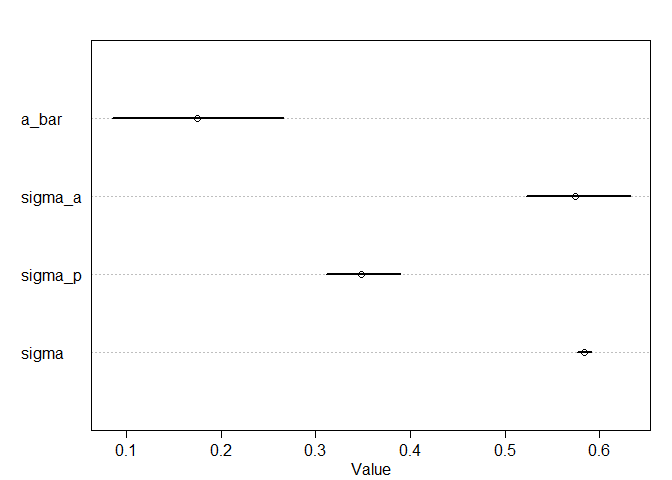
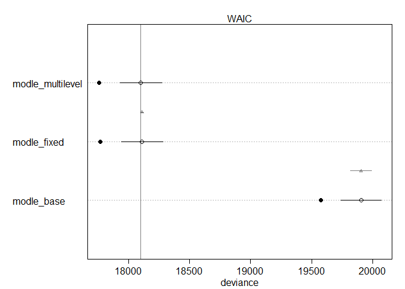
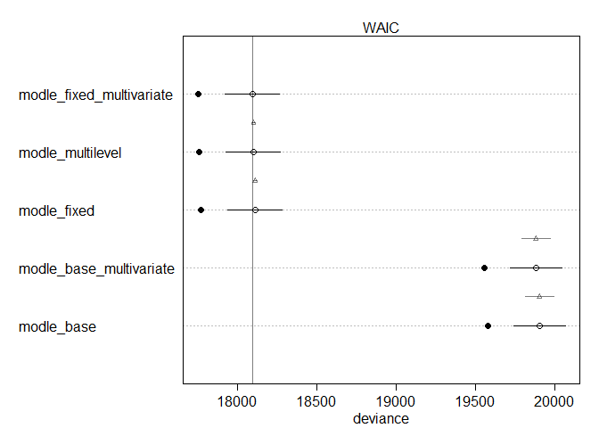
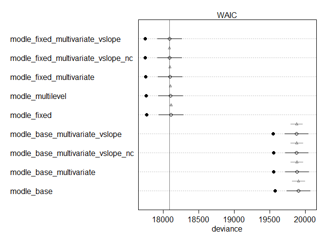

```r
library(rethinking)
```

```
## Loading required package: rstan
```

```
## Loading required package: StanHeaders
```

```
## Loading required package: ggplot2
```

```
## rstan (Version 2.19.2, GitRev: 2e1f913d3ca3)
```

```
## For execution on a local, multicore CPU with excess RAM we recommend calling
## options(mc.cores = parallel::detectCores()).
## To avoid recompilation of unchanged Stan programs, we recommend calling
## rstan_options(auto_write = TRUE)
```

```
## For improved execution time, we recommend calling
## Sys.setenv(LOCAL_CPPFLAGS = '-march=native')
## although this causes Stan to throw an error on a few processors.
```

```
## Loading required package: parallel
```

```
## Loading required package: dagitty
```

```
## rethinking (Version 1.93)
```

```
## 
## Attaching package: 'rethinking'
```

```
## The following object is masked from 'package:stats':
## 
##     rstudent
```

```r
hyp <- read.csv("hyp.lengths.both.experiments.labels.csv")
head(hyp)
```

```
##   line length plate light exp nativename stockparent latitude longitude site
## 1 6901  2.014   1AH     H   A      Bil-7     CS22579   63.324    18.484  Bil
## 2 6901  1.477   1AH     H   A      Bil-7     CS22579   63.324    18.484  Bil
## 3 6901  1.986   1AH     H   A      Bil-7     CS22579   63.324    18.484  Bil
## 4 6901  2.744   1AH     H   A      Bil-7     CS22579   63.324    18.484  Bil
## 5 6901  1.942   1AH     H   A      Bil-7     CS22579   63.324    18.484  Bil
## 6 6901  1.935   1AH     H   A      Bil-7     CS22579   63.324    18.484  Bil
##    region country
## 1 NSweden     SWE
## 2 NSweden     SWE
## 3 NSweden     SWE
## 4 NSweden     SWE
## 5 NSweden     SWE
## 6 NSweden     SWE
```

```r
summary(hyp)
```

```
##       line            length          plate       light    exp      
##  Min.   :  5837   Min.   :0.458   38BH   :  191   H:9133   A: 7692  
##  1st Qu.:  6930   1st Qu.:3.154   17BL   :  186   L:8898   B:10339  
##  Median :  6984   Median :4.091   35BL   :  179                     
##  Mean   :  8094   Mean   :4.123   8AH    :  179                     
##  3rd Qu.:  8290   3rd Qu.:4.978   33BL   :  177                     
##  Max.   :100000   Max.   :9.914   33BH   :  176                     
##                                   (Other):16943                     
##    nativename     stockparent       latitude       longitude       
##  Ang-0  :  177   CS949  :  177   Min.   :15.11   Min.   :-123.000  
##  Ull2-3 :  175   CS22587:  175   1st Qu.:47.25   1st Qu.:   2.250  
##  Kin-0  :  170   CS22654:  170   Median :50.00   Median :  10.872  
##  Mrk-0  :  167   CS22635:  167   Mean   :49.82   Mean   :   5.614  
##  Mt-0   :  167   CS22642:  167   3rd Qu.:55.58   3rd Qu.:  16.233  
##  Est-1  :  166   (Other):13039   Max.   :63.32   Max.   : 136.310  
##  (Other):17009   NA's   : 4136   NA's   :1455    NA's   :1455      
##       site                  region        country    
##  B疇    :  357   WesternEurope :4067   SWE    :3173  
##  Pu2    :  327   SSweden       :2175   GER    :2305  
##  HR     :  322   NorthernEurope:1715   CZE    :2017  
##  G\xc3 :  309   SouthernEurope:1331   UK     :1411  
##  CIBC   :  306   Moravia       :1167   USA    :1151  
##  (Other):14955   (Other)       :4680   (Other):6519  
##  NA's   : 1455   NA's          :2896   NA's   :1455
```

```r
str(hyp)
```

```
## 'data.frame':	18031 obs. of  12 variables:
##  $ line       : int  6901 6901 6901 6901 6901 6901 6901 8357 8357 8357 ...
##  $ length     : num  2.01 1.48 1.99 2.74 1.94 ...
##  $ plate      : Factor w/ 152 levels "10AH","10AL",..: 41 41 41 41 41 41 41 41 41 41 ...
##  $ light      : Factor w/ 2 levels "H","L": 1 1 1 1 1 1 1 1 1 1 ...
##  $ exp        : Factor w/ 2 levels "A","B": 1 1 1 1 1 1 1 1 1 1 ...
##  $ nativename : Factor w/ 180 levels "\xc3-1","\xc3繹2-1",..: 24 24 24 24 24 24 24 124 124 124 ...
##  $ stockparent: Factor w/ 135 levels "CS1007","CS1065",..: 48 48 48 48 48 48 48 23 23 23 ...
##  $ latitude   : num  63.3 63.3 63.3 63.3 63.3 ...
##  $ longitude  : num  18.5 18.5 18.5 18.5 18.5 ...
##  $ site       : Factor w/ 136 levels "\xc3繹2","Ag",..: 8 8 8 8 8 8 8 93 93 93 ...
##  $ region     : Factor w/ 18 levels "(null)","CentralAsia",..: 12 12 12 12 12 12 12 16 16 16 ...
##  $ country    : Factor w/ 26 levels "AUT","BEL","CAN",..: 22 22 22 22 22 22 22 6 6 6 ...
```

### 1. without pooling_base


```r
library(dplyr)
```

```
## 
## Attaching package: 'dplyr'
```

```
## The following objects are masked from 'package:stats':
## 
##     filter, lag
```

```
## The following objects are masked from 'package:base':
## 
##     intersect, setdiff, setequal, union
```

```r
hyp_s <- sample_n(hyp, 1000)
summary(hyp_s)
```

```
##       line            length          plate     light   exp       nativename 
##  Min.   :  5837   Min.   :1.150   17BH   : 18   H:505   A:425   Lom1-1 : 14  
##  1st Qu.:  6930   1st Qu.:3.146   10AL   : 16   L:495   B:575   Oy-0   : 13  
##  Median :  6982   Median :4.066   35BH   : 15                   Rsch-4 : 13  
##  Mean   :  7859   Mean   :4.135   4BH    : 15                   Se-0   : 13  
##  3rd Qu.:  8283   3rd Qu.:4.906   31BH   : 14                   Ts-1   : 13  
##  Max.   :100000   Max.   :8.739   38BL   : 14                   Ws-2   : 12  
##                                   (Other):908                   (Other):922  
##   stockparent     latitude       longitude             site    
##  CS1494 : 13   Min.   :32.34   Min.   :-123.000   B疇    : 24  
##  CS22646: 13   1st Qu.:47.65   1st Qu.:   2.931   Bor    : 16  
##  CS22647: 13   Median :50.30   Median :  12.900   Lp2    : 16  
##  CS22658: 13   Mean   :50.14   Mean   :   6.089   REN    : 16  
##  CS22659: 12   3rd Qu.:55.75   3rd Qu.:  16.254   G\xc3 : 14  
##  (Other):692   Max.   :63.32   Max.   : 136.310   (Other):831  
##  NA's   :244   NA's   :83      NA's   :83         NA's   : 83  
##             region       country   
##  WesternEurope :221   SWE    :190  
##  SSweden       :132   CZE    :123  
##  NorthernEurope: 80   GER    :120  
##  Moravia       : 75   USA    : 63  
##  SouthernEurope: 69   UK     : 58  
##  (Other)       :263   (Other):363  
##  NA's          :160   NA's   : 83
```

```r
str(hyp_s)
```

```
## 'data.frame':	1000 obs. of  12 variables:
##  $ line       : int  6900 7514 8244 6972 6976 6958 8256 6977 8334 6008 ...
##  $ length     : num  4.96 3.23 4.57 5.79 4.83 ...
##  $ plate      : Factor w/ 152 levels "10AH","10AL",..: 84 55 31 120 116 87 40 56 83 51 ...
##  $ light      : Factor w/ 2 levels "H","L": 2 1 1 2 2 1 2 2 1 1 ...
##  $ exp        : Factor w/ 2 levels "A","B": 2 2 2 2 2 2 2 2 2 2 ...
##  $ nativename : Factor w/ 180 levels "\xc3-1","\xc3繹2-1",..: 23 139 7 162 167 131 33 168 103 49 ...
##  $ stockparent: Factor w/ 135 levels "CS1007","CS1065",..: 47 33 NA 106 81 98 NA 94 17 NA ...
##  $ latitude   : num  63.3 41.6 NA 34.4 48.3 ...
##  $ longitude  : num  18.5 -86.4 NA 136.3 14.4 ...
##  $ site       : Factor w/ 136 levels "\xc3繹2","Ag",..: 8 102 NA 121 125 97 17 126 74 29 ...
##  $ region     : Factor w/ 18 levels "(null)","CentralAsia",..: 12 8 NA 5 18 18 17 13 17 9 ...
##  $ country    : Factor w/ 26 levels "AUT","BEL","CAN",..: 22 26 NA 13 1 8 22 3 22 5 ...
```

```r
dat_list1 <- list(
  length = scale(hyp_s$length),
  line = as.integer(as.factor(hyp_s$line)),
  light = as.integer(hyp_s$light=="H")
)


modle_base <- ulam(
  alist(
    length ~ dnorm(mu, sigma),
    mu <- a[line] + bI[line]*light,
    a[line] ~ dnorm(0, 1),
    bI[line] ~ dnorm(0, 1),
    sigma ~ dexp(1)
  ), data=dat_list1 , chains=4 , cores=4 , log_lik=TRUE)

precis( modle_base, depth=2 , pars=c("bI","sigma"))
```

```
##                  mean         sd        5.5%        94.5%    n_eff      Rhat
## bI[1]   -0.6169033303 0.40311504 -1.27691724  0.035124782 3401.622 0.9999397
## bI[2]   -1.0050097727 0.38910528 -1.64958077 -0.373941926 3468.131 1.0000363
## bI[3]   -0.5941282308 0.59820679 -1.55650277  0.361779147 4321.095 0.9984393
## bI[4]    0.1575773585 0.51006839 -0.64720892  0.944903776 2900.912 0.9995360
## bI[5]   -0.2370724654 0.31344261 -0.74135718  0.271003241 3076.604 0.9983228
## bI[6]   -0.8525812028 0.40671212 -1.51870679 -0.207647443 2910.998 0.9990290
## bI[7]   -0.4788829347 0.76594832 -1.69111303  0.726527490 3014.051 0.9999480
## bI[8]    0.0096673696 1.00084659 -1.62953451  1.608233693 3086.714 0.9996953
## bI[9]   -0.2952256789 0.62183370 -1.31395458  0.724793102 3022.763 0.9993776
## bI[10]  -0.3681570863 0.46069288 -1.09655305  0.379735203 3080.166 0.9985827
## bI[11]  -0.2740797499 0.48405125 -1.07344461  0.489399106 2831.900 1.0005435
## bI[12]  -0.8191769512 0.37648864 -1.41351666 -0.213528843 2623.164 0.9995557
## bI[13]  -0.0104527248 0.92196665 -1.48356177  1.477417085 3731.494 0.9988348
## bI[14]  -0.1519142377 0.48459938 -0.90390089  0.640929967 3592.375 0.9984958
## bI[15]  -0.5106416711 0.36250907 -1.09460816  0.066503198 4230.003 0.9992029
## bI[16]   0.0063493466 0.99026947 -1.55319563  1.620026735 3851.477 0.9991072
## bI[17]   0.0074035713 1.00188713 -1.63868920  1.622400246 2921.246 0.9992083
## bI[18]  -0.6218484419 0.39094610 -1.26041619  0.002752575 2923.653 0.9986145
## bI[19]  -0.3368606050 0.37441415 -0.94449828  0.270313953 3218.328 0.9992897
## bI[20]  -1.0689346597 0.52023971 -1.88277589 -0.228242195 3250.739 0.9993326
## bI[21]  -1.1235336311 0.42457882 -1.79244996 -0.452227725 3134.994 0.9992064
## bI[22]  -1.0309470996 0.51792070 -1.82859917 -0.192240605 3093.140 0.9998321
## bI[23]  -0.3121908062 0.41867638 -1.00018339  0.350408992 4318.207 0.9986068
## bI[24]  -1.0847865797 0.44566323 -1.79528482 -0.377003950 2919.489 1.0008895
## bI[25]  -1.0411516577 0.38031985 -1.65106450 -0.437152554 3623.624 0.9997645
## bI[26]  -0.5053730485 0.44579707 -1.21264369  0.218397680 3271.764 0.9994219
## bI[27]  -0.1980121855 0.41148019 -0.85809089  0.460884904 4218.681 0.9987747
## bI[28]   0.2810440562 0.38376019 -0.33926414  0.877692040 3557.888 0.9984121
## bI[29]  -1.6363956229 0.36771806 -2.24185762 -1.045253258 2704.011 0.9985266
## bI[30]  -0.9358515452 0.51477129 -1.73144388 -0.113144283 3319.968 1.0003292
## bI[31]  -1.2948083295 0.35968832 -1.88607503 -0.712505124 2423.779 0.9986746
## bI[32]  -1.0572230324 0.45943472 -1.78762750 -0.278908483 3698.592 0.9986099
## bI[33]  -0.5728916827 0.42684359 -1.23955875  0.120306633 2974.416 0.9994364
## bI[34]   0.5901174504 0.63973461 -0.45132955  1.604911528 3147.490 0.9988568
## bI[35]  -0.5100772782 0.36010461 -1.07379772  0.074871957 2751.498 1.0000913
## bI[36]  -0.7883854997 0.36408585 -1.35455125 -0.193334214 3479.261 0.9987387
## bI[37]   0.0006978586 1.02887477 -1.63394285  1.702132531 3013.765 0.9992234
## bI[38]   0.3087716861 0.55504993 -0.60819631  1.193359066 3522.996 0.9987183
## bI[39]  -1.4227867626 0.47636572 -2.20660594 -0.668446556 3540.143 0.9988556
## bI[40]  -0.3559345462 0.39626014 -0.99185883  0.260736138 2480.386 0.9991883
## bI[41]   0.0132704654 0.96611532 -1.51685008  1.539784427 3264.478 0.9992726
## bI[42]   0.1859406246 0.55439624 -0.71095192  1.072042469 3049.947 0.9987947
## bI[43]   0.6910376674 0.50177010 -0.12333849  1.493510738 3476.810 0.9987989
## bI[44]  -0.6816083428 0.59112248 -1.64506526  0.274962443 3622.794 0.9993853
## bI[45]  -0.0254078338 0.39925696 -0.66762096  0.596058978 3526.734 0.9984912
## bI[46]   0.0150196171 0.40081487 -0.63439945  0.666493191 3350.022 0.9989918
## bI[47]   0.0332214984 0.37694413 -0.58080647  0.635832188 3520.378 0.9988163
## bI[48]  -0.2700461331 0.51663831 -1.08686517  0.543407027 3381.510 0.9989383
## bI[49]   1.7216710802 0.58064355  0.79990789  2.644020725 2748.229 0.9989669
## bI[50]  -0.5139940808 0.44872743 -1.23168526  0.220552895 2938.002 0.9990318
## bI[51]   0.0081348429 1.02966596 -1.66514763  1.722706326 4713.595 0.9988167
## bI[52]  -0.8571446277 0.31436552 -1.37045076 -0.352038591 2884.426 0.9985863
## bI[53]  -0.9833794318 0.53599342 -1.82348843 -0.097776722 2670.934 0.9992800
## bI[54]  -0.3169191598 0.44907733 -1.03407518  0.409898040 3692.038 0.9982543
## bI[55]   0.1365198732 0.54891089 -0.78390984  1.012992314 3254.889 0.9997004
## bI[56]  -0.0406409522 0.33786681 -0.59564643  0.510155937 3436.938 0.9988002
## bI[57]  -1.1746244178 0.34831418 -1.71800503 -0.614862441 4167.893 0.9989669
## bI[58]  -0.2080125969 0.51771807 -1.00999113  0.632523837 2566.668 1.0008915
## bI[59]  -0.3808002377 0.31124666 -0.86708044  0.110470009 2606.559 0.9992933
## bI[60]  -0.8095516018 0.39868813 -1.43958165 -0.164890252 3054.973 0.9989645
## bI[61]  -0.5379377907 0.52360155 -1.40074976  0.307805634 3887.381 0.9998057
## bI[62]  -0.9865574422 0.39856664 -1.64209981 -0.351689771 2815.933 1.0007799
## bI[63]  -0.0098550926 1.04407501 -1.70591024  1.625566077 3323.050 0.9989346
## bI[64]  -0.5430297088 0.52552684 -1.39419384  0.289741972 3408.671 0.9988218
## bI[65]  -0.1943562772 0.43542919 -0.85818808  0.516363405 3563.645 0.9987655
## bI[66]   0.1380169570 0.76567057 -1.05515406  1.356606739 2505.061 1.0003046
## bI[67]  -0.3734906416 0.46005862 -1.08513454  0.374145717 3420.523 0.9985685
## bI[68]  -0.3767243675 0.31840339 -0.89486785  0.117016953 3338.370 0.9996874
## bI[69]  -0.0171488412 0.43078301 -0.70486415  0.672172933 3634.889 0.9986099
## bI[70]  -1.0043722893 0.34194539 -1.53296027 -0.437935941 3193.748 0.9991194
## bI[71]  -0.1320236658 0.37486117 -0.71228311  0.454864177 3459.064 0.9988541
## bI[72]  -0.4160018335 0.48459344 -1.18853130  0.385307054 3563.440 0.9984954
## bI[73]  -0.4327103995 0.40049727 -1.07055061  0.191441088 3167.576 0.9987412
## bI[74]  -0.1004354962 0.36998830 -0.68810349  0.484885205 2494.272 0.9988911
## bI[75]  -0.5684572734 0.57365123 -1.47919462  0.360600312 2919.737 0.9990222
## bI[76]   0.1931713517 0.34708971 -0.35983208  0.758964418 3366.859 0.9999917
## bI[77]  -0.6543210070 0.44677598 -1.36469380  0.068981770 3330.074 0.9990417
## bI[78]  -0.4542449393 0.46656151 -1.21061481  0.281546809 2846.487 0.9999327
## bI[79]   0.0170843814 0.97992088 -1.51450952  1.587492155 3768.665 0.9991164
## bI[80]  -0.7774402536 0.59471424 -1.75862063  0.177960706 3518.922 0.9988298
## bI[81]  -0.5063708374 0.43326160 -1.17900437  0.183937640 3251.361 0.9986858
## bI[82]  -0.0129177868 0.43963639 -0.71087412  0.696507275 3430.592 0.9989846
## bI[83]  -0.0171274364 0.95479375 -1.56233831  1.523230898 4426.737 0.9984441
## bI[84]  -0.0484819325 0.48423855 -0.85627001  0.730835797 3227.520 0.9986331
## bI[85]  -0.0565456926 0.74317337 -1.24923923  1.120222006 2752.096 0.9985545
## bI[86]   0.8384278217 0.56420438 -0.02597641  1.757332832 3117.017 0.9991479
## bI[87]   0.3790596625 0.72751196 -0.80500480  1.588388265 3510.298 0.9988165
## bI[88]  -0.6106535345 0.74283603 -1.82103064  0.568215450 2901.613 0.9995106
## bI[89]  -0.4459754314 0.57856031 -1.35387395  0.472230564 3084.050 0.9991403
## bI[90]  -1.3205674664 0.45729132 -2.05746564 -0.618689826 2647.930 0.9981393
## bI[91]  -1.3787908319 0.39055323 -2.02158371 -0.729831624 3897.377 0.9986330
## bI[92]   0.0277745426 0.40631847 -0.64128272  0.669365135 3457.404 0.9985507
## bI[93]  -1.0956453154 0.56485701 -1.98870001 -0.210414295 3071.207 0.9984662
## bI[94]  -1.0002335898 0.56411586 -1.88063129 -0.104873723 3216.776 0.9993148
## bI[95]  -0.6157884922 0.75559880 -1.79713374  0.576487369 2931.128 0.9990652
## bI[96]   0.0486929702 0.55070320 -0.81485780  0.933876288 3378.734 1.0002214
## bI[97]   0.4250065341 0.48180142 -0.34764033  1.200359750 3333.015 1.0001365
## bI[98]  -0.3403131578 0.48498698 -1.10913056  0.412630370 3042.205 0.9986129
## bI[99]  -0.7258306802 0.61521236 -1.70852234  0.286893940 3041.262 0.9994264
## bI[100] -0.2027591148 0.56741793 -1.07773411  0.696257853 3237.947 0.9983775
## bI[101] -0.2937597066 0.78395299 -1.55409440  0.977451047 3525.759 1.0010622
## bI[102]  0.3139751779 0.59984442 -0.63477580  1.266328990 3444.203 0.9991913
## bI[103] -0.5949208558 0.49722523 -1.38539743  0.228054326 3734.722 0.9984175
## bI[104] -0.8201096289 0.56512933 -1.69577119  0.065459722 2942.117 0.9990173
## bI[105] -0.5927080419 0.44103560 -1.28188195  0.088618138 2988.352 0.9995802
## bI[106] -0.3311159933 0.44464135 -1.07867324  0.373630131 3237.875 0.9990330
## bI[107] -0.6241723342 0.71133391 -1.77117138  0.473049668 3766.341 0.9991087
## bI[108] -2.0216230582 0.56830134 -2.92140600 -1.110281338 3173.059 0.9988410
## bI[109] -0.6504267696 0.36740460 -1.24451975 -0.058456593 4069.290 0.9988677
## bI[110] -1.1758180985 0.53577948 -2.04700644 -0.327526383 3531.728 0.9988402
## bI[111] -0.3781236663 0.75416132 -1.59752186  0.830880633 3318.780 0.9992790
## bI[112] -0.0081956584 0.46884346 -0.73354569  0.761503066 3552.835 0.9985787
## bI[113] -0.5581242502 0.41886852 -1.24589707  0.119148512 3032.230 0.9984894
## bI[114] -1.0190774935 0.36952459 -1.59925069 -0.420868897 2622.907 0.9985600
## bI[115] -0.6740824218 0.37280360 -1.25126395 -0.071551640 3420.017 0.9986614
## bI[116] -0.8867581534 0.52186509 -1.71930521 -0.069903866 3145.402 0.9990364
## bI[117] -0.9697397300 0.38596421 -1.58338438 -0.353983471 2811.145 0.9987737
## bI[118] -0.8843508624 0.54895057 -1.74408574 -0.010684712 3307.246 0.9991122
## bI[119] -0.6103980043 0.46929311 -1.35235459  0.154031836 3438.037 0.9995211
## bI[120] -0.5084665087 0.37988693 -1.10684312  0.086927933 3525.350 0.9986680
## bI[121] -0.5215389366 0.50087461 -1.31841462  0.299159941 2913.914 0.9998088
## bI[122] -0.3426770682 0.37530876 -0.93481883  0.239769969 3195.479 0.9988980
## bI[123] -0.7605122709 0.35748434 -1.33457977 -0.184563653 2896.481 1.0012110
## bI[124]  0.0109026572 0.97103861 -1.56288034  1.532805002 3103.874 0.9989842
## bI[125] -1.1061252107 0.34250327 -1.65406168 -0.561627275 3715.406 0.9992788
## bI[126] -1.0973524582 0.50169829 -1.91398174 -0.310780457 2982.858 0.9992369
## bI[127] -0.5001825472 0.48370486 -1.25595776  0.266992029 2896.039 0.9995360
## bI[128] -0.3087809915 0.38594671 -0.91431287  0.311830146 2815.873 0.9990007
## bI[129] -0.0974527082 0.55845952 -0.98835547  0.788288616 4018.156 1.0000233
## bI[130] -0.0306890039 0.41423551 -0.68494298  0.628537004 3139.037 0.9985030
## bI[131]  0.1844389926 0.38607491 -0.43111373  0.808112120 2851.745 1.0003203
## bI[132]  0.0256731477 0.60236386 -0.95312854  0.993180374 3443.314 0.9990638
## bI[133] -0.5991687473 0.47580629 -1.36653188  0.152342673 2867.115 0.9987157
## bI[134]  0.1278176567 0.44604494 -0.57365895  0.829505861 3699.348 0.9985883
## bI[135] -0.3901520646 0.56108209 -1.28347450  0.484779359 2818.915 0.9985983
## bI[136] -0.6162760121 0.45904621 -1.32401601  0.113172554 3125.884 0.9992665
## bI[137] -0.1734541800 0.59718712 -1.13803735  0.764535133 3413.341 0.9995674
## bI[138] -1.0416451632 0.63922064 -2.08064799 -0.027729257 3145.557 0.9999098
## bI[139] -0.9436746868 0.44225332 -1.65757060 -0.240253515 4067.327 0.9985763
## bI[140]  0.0788666102 0.45753695 -0.65183964  0.824201336 3977.533 0.9994201
## bI[141] -1.3066824042 0.47465689 -2.07058594 -0.532149101 2729.752 0.9985221
## bI[142] -0.2706049719 0.56564595 -1.16294124  0.618485340 2750.122 1.0010050
## bI[143] -0.1251184741 0.42896825 -0.80774935  0.571642984 2733.381 1.0006975
## bI[144] -0.3649896076 0.41784834 -1.02857704  0.297790999 3404.174 0.9993218
## bI[145] -0.7891636319 0.50022271 -1.59443812 -0.008204998 2680.392 0.9988343
## bI[146] -0.2085182759 0.61038150 -1.20564981  0.759015219 3503.613 0.9987537
## bI[147] -0.1181881941 0.56614776 -1.01495975  0.768959361 3101.221 0.9997324
## bI[148] -0.5802850429 0.41958611 -1.23562282  0.104842972 3325.018 0.9990363
## bI[149] -0.4513619470 0.42950368 -1.13637454  0.224297467 3121.636 0.9988302
## bI[150] -0.8080269676 0.34363284 -1.38072683 -0.264885034 3824.843 0.9989806
## bI[151] -0.5945894206 0.38343035 -1.20712332  0.022178850 3052.928 0.9987396
## bI[152] -0.3480210406 0.51773914 -1.16608210  0.501073995 3781.610 0.9985263
## bI[153] -0.6042909221 0.41432268 -1.23007085  0.066791444 3523.424 0.9995263
## bI[154] -0.3264745597 0.44187554 -1.03036907  0.370956562 3128.442 0.9996202
## bI[155] -0.8070485989 0.44678218 -1.50851046 -0.089185771 3448.302 0.9994035
## bI[156] -0.6445043591 0.36973901 -1.23166254 -0.045643536 2620.820 0.9991078
## bI[157]  0.0118125477 1.02363679 -1.59107715  1.681658291 3135.047 1.0005278
## bI[158] -1.0302027533 0.45600946 -1.75095344 -0.307046597 3431.186 0.9988014
## bI[159] -0.0055355530 1.00638532 -1.64778590  1.659566469 3617.823 0.9990230
## bI[160]  0.4141170354 0.42749444 -0.26233595  1.110290721 3029.330 0.9987026
## bI[161] -1.4873785912 0.36288154 -2.06743581 -0.903983832 2739.519 0.9986481
## bI[162] -2.0468752678 0.42476517 -2.71201213 -1.374190919 2907.165 0.9986551
## bI[163] -1.2253520186 0.53917674 -2.09729862 -0.358327447 3411.527 0.9990256
## sigma    0.6153118852 0.01594067  0.59051125  0.641194622 1583.040 1.0000434
```

```r
plot( precis(modle_base) )
```

```
## 326 vector or matrix parameters hidden. Use depth=2 to show them.
```

<!-- -->


```r
library(tidyverse)
```

```
## -- Attaching packages ---------------------------------------------------------------- tidyverse 1.3.0 --
```

```
## √ tibble  2.1.3     √ purrr   0.3.3
## √ tidyr   1.0.0     √ stringr 1.4.0
## √ readr   1.3.1     √ forcats 0.4.0
```

```
## -- Conflicts ------------------------------------------------------------------- tidyverse_conflicts() --
## x tidyr::extract() masks rstan::extract()
## x dplyr::filter()  masks stats::filter()
## x dplyr::lag()     masks stats::lag()
## x purrr::map()     masks rethinking::map()
```

```r
hyp_s_new <- hyp_s %>% unite("plate_exp", c("plate", "exp"), remove = FALSE)
#head(hyp_s_new)
str(hyp_s_new)
```

```
## 'data.frame':	1000 obs. of  13 variables:
##  $ line       : int  6900 7514 8244 6972 6976 6958 8256 6977 8334 6008 ...
##  $ length     : num  4.96 3.23 4.57 5.79 4.83 ...
##  $ plate_exp  : chr  "29BL_B" "22BH_B" "17BH_B" "37BL_B" ...
##  $ plate      : Factor w/ 152 levels "10AH","10AL",..: 84 55 31 120 116 87 40 56 83 51 ...
##  $ light      : Factor w/ 2 levels "H","L": 2 1 1 2 2 1 2 2 1 1 ...
##  $ exp        : Factor w/ 2 levels "A","B": 2 2 2 2 2 2 2 2 2 2 ...
##  $ nativename : Factor w/ 180 levels "\xc3-1","\xc3繹2-1",..: 23 139 7 162 167 131 33 168 103 49 ...
##  $ stockparent: Factor w/ 135 levels "CS1007","CS1065",..: 47 33 NA 106 81 98 NA 94 17 NA ...
##  $ latitude   : num  63.3 41.6 NA 34.4 48.3 ...
##  $ longitude  : num  18.5 -86.4 NA 136.3 14.4 ...
##  $ site       : Factor w/ 136 levels "\xc3繹2","Ag",..: 8 102 NA 121 125 97 17 126 74 29 ...
##  $ region     : Factor w/ 18 levels "(null)","CentralAsia",..: 12 8 NA 5 18 18 17 13 17 9 ...
##  $ country    : Factor w/ 26 levels "AUT","BEL","CAN",..: 22 26 NA 13 1 8 22 3 22 5 ...
```

```r
dat_list <- list(
  length = scale(hyp_s_new$length),
  line = as.integer(as.factor(hyp_s_new$line)),
  light = as.integer(hyp_s_new$light=="H"),
  plate_exp = as.integer(as.factor(hyp_s_new$plate_exp))
)

#head(dat_list)
summary(dat_list)
```

```
##           Length Class  Mode   
## length    1000   -none- numeric
## line      1000   -none- numeric
## light     1000   -none- numeric
## plate_exp 1000   -none- numeric
```

```r
str(dat_list)
```

```
## List of 4
##  $ length   : num [1:1000, 1] 0.598 -0.653 0.316 1.192 0.504 ...
##   ..- attr(*, "scaled:center")= num 4.14
##   ..- attr(*, "scaled:scale")= num 1.38
##  $ line     : int [1:1000] 16 84 109 69 72 56 115 73 141 2 ...
##  $ light    : int [1:1000] 0 1 1 0 0 1 0 0 1 1 ...
##  $ plate_exp: int [1:1000] 84 55 31 119 115 87 40 56 83 51 ...
```

### 1.without pooling_fixed


```r
modle_fixed <- ulam(
  alist(
    length ~ dnorm(mu, sigma),
    mu <- a[line] + bI[line]*light + bP[plate_exp],
    a[line] ~ dnorm(0, 1),
    bI[line] ~ dnorm(0, 1),
    bP[plate_exp] ~ dnorm(0, 1),
    sigma ~ dexp(1)
  ), data=dat_list , chains=4 , cores=4 , log_lik=TRUE)

precis( modle_fixed, depth=2 , pars=c("bI","sigma"))
```

```
##                  mean         sd         5.5%        94.5%    n_eff      Rhat
## bI[1]    3.727932e-01 0.43837562 -0.324939636  1.103595339 2478.562 0.9994103
## bI[2]   -1.269672e+00 0.48823510 -2.017160128 -0.482252771 2417.341 1.0007514
## bI[3]   -6.398409e-01 0.59252219 -1.573995073  0.303838641 3727.376 0.9982901
## bI[4]    3.057056e-01 0.52444228 -0.540007190  1.137532372 2259.757 0.9999699
## bI[5]    2.273687e-01 0.34036306 -0.316426659  0.768129722 2108.633 0.9996234
## bI[6]   -2.868561e-01 0.41203922 -0.932521036  0.367891233 2103.879 1.0001569
## bI[7]   -2.137601e-01 0.70600737 -1.354631586  0.933527125 3339.465 0.9995613
## bI[8]    4.725697e-05 1.00789311 -1.587938844  1.661078178 4084.351 1.0005256
## bI[9]   -9.600342e-02 0.62377069 -1.109787687  0.899114295 3154.367 0.9984583
## bI[10]  -2.964133e-01 0.45036503 -0.978763114  0.443976586 2205.890 0.9994478
## bI[11]   5.922408e-01 0.54153969 -0.288723958  1.455924668 2831.887 0.9995740
## bI[12]  -1.175144e-01 0.39123849 -0.739032556  0.523586082 2069.910 1.0002201
## bI[13]   3.208618e-03 0.98568106 -1.598084874  1.568249432 4846.333 0.9987329
## bI[14]   3.665045e-01 0.47325573 -0.385751410  1.136238245 2575.259 0.9992041
## bI[15]   1.401587e-02 0.39160412 -0.621576179  0.650363367 2143.622 0.9996287
## bI[16]  -3.649646e-03 1.00727510 -1.621566986  1.600935609 4104.383 0.9996396
## bI[17]   1.254681e-02 0.98567255 -1.579632914  1.590894125 4689.504 0.9996354
## bI[18]  -3.332413e-01 0.46731972 -1.092868770  0.401282647 2105.350 1.0006227
## bI[19]   1.057534e-01 0.38515893 -0.513873155  0.732100727 2221.890 0.9995539
## bI[20]  -2.866386e-01 0.51514346 -1.083015954  0.562023786 3930.204 0.9986453
## bI[21]  -3.518695e-01 0.41252120 -1.008129038  0.294309123 2178.825 1.0005629
## bI[22]  -5.049048e-01 0.50284106 -1.291039553  0.272357828 2481.842 1.0008840
## bI[23]   5.824977e-01 0.41647574 -0.099324239  1.229705314 2419.799 1.0022630
## bI[24]  -6.594924e-01 0.45791682 -1.386375649  0.066828322 2832.925 0.9998887
## bI[25]  -6.553394e-01 0.43525266 -1.355620037  0.008927722 2351.406 0.9999540
## bI[26]  -6.188038e-01 0.44188538 -1.311027327  0.107940816 2561.045 0.9998522
## bI[27]   1.387572e-01 0.45222509 -0.587399645  0.865686269 3005.020 0.9997104
## bI[28]   6.440888e-01 0.40895914 -0.008388308  1.288400875 2203.870 1.0004770
## bI[29]  -1.565131e+00 0.41361630 -2.216061035 -0.882619379 2639.076 0.9992051
## bI[30]  -9.005190e-01 0.55753548 -1.815266376  0.009759131 2445.156 0.9996411
## bI[31]  -2.514313e-01 0.38803479 -0.867667424  0.367778914 2143.930 0.9986193
## bI[32]  -7.163280e-02 0.50489053 -0.849942915  0.732529443 2520.037 0.9994573
## bI[33]   1.105223e-01 0.45271923 -0.610776482  0.825248376 2792.363 0.9987020
## bI[34]   3.828517e-01 0.61447761 -0.594430241  1.381692589 2705.754 0.9988804
## bI[35]  -6.963524e-02 0.37952503 -0.673832732  0.535968388 2118.015 0.9993474
## bI[36]  -1.034229e+00 0.36854797 -1.625506062 -0.459861055 2330.692 0.9987865
## bI[37]   8.971721e-03 0.97086568 -1.593232505  1.591477708 5134.455 0.9990762
## bI[38]   8.999616e-01 0.54354705  0.029571374  1.770832774 3087.491 0.9998597
## bI[39]  -7.100345e-01 0.51425816 -1.535047471  0.130559037 2919.495 0.9989133
## bI[40]   2.241668e-02 0.41429870 -0.647637582  0.655772801 2347.794 0.9998367
## bI[41]   1.305695e-02 1.00238021 -1.587197387  1.632485854 5546.902 0.9989211
## bI[42]  -3.683958e-01 0.56024221 -1.265619443  0.521002235 3740.259 0.9996921
## bI[43]   1.285711e+00 0.54558984  0.440945186  2.178798177 2453.221 1.0002670
## bI[44]  -6.160704e-01 0.62001404 -1.621502790  0.364762241 2843.126 0.9993252
## bI[45]   7.944639e-01 0.43207071  0.102312563  1.520128675 2602.864 0.9991938
## bI[46]   5.958779e-01 0.39309894 -0.048161245  1.204657821 2707.248 0.9998201
## bI[47]   2.589908e-02 0.40613853 -0.611536068  0.676523933 2900.409 0.9993490
## bI[48]   5.317720e-02 0.52697587 -0.786448547  0.888471116 2826.507 0.9996149
## bI[49]   2.281748e+00 0.59304751  1.324927987  3.246078443 2480.388 0.9989690
## bI[50]  -4.082615e-01 0.46406150 -1.146744655  0.333595336 2647.046 0.9988465
## bI[51]  -3.574956e-03 1.02311384 -1.621618212  1.618990179 4875.141 0.9985365
## bI[52]   5.283782e-02 0.39778184 -0.581675436  0.675484980 1873.373 1.0028226
## bI[53]  -4.131951e-01 0.53780584 -1.275959794  0.425538241 2633.269 0.9989736
## bI[54]  -3.476033e-01 0.49265756 -1.141999547  0.450831585 2392.779 1.0000355
## bI[55]   3.825464e-01 0.54689718 -0.487592921  1.263533938 3757.625 0.9992725
## bI[56]   6.979739e-01 0.38233809  0.086083225  1.307933354 2178.842 0.9997148
## bI[57]  -9.428730e-01 0.36128409 -1.532103062 -0.385222764 2364.035 0.9992578
## bI[58]   2.164245e-01 0.52738026 -0.623448095  1.063266520 2490.570 0.9992805
## bI[59]  -2.890469e-01 0.40602071 -0.935531385  0.355965471 2045.198 1.0011637
## bI[60]  -3.303337e-01 0.40213874 -0.964445890  0.313786810 2673.641 0.9991017
## bI[61]  -6.991506e-01 0.52253305 -1.522013714  0.170153401 2957.206 0.9984750
## bI[62]  -5.094976e-01 0.41140976 -1.161920528  0.149289692 2535.988 0.9996130
## bI[63]   1.793556e-02 1.03713825 -1.646826173  1.748789758 4756.190 0.9985509
## bI[64]  -1.543028e-01 0.53430122 -1.032816373  0.680394471 3232.014 0.9986857
## bI[65]  -2.592104e-01 0.48274595 -1.022872886  0.511352880 2437.780 0.9992309
## bI[66]   2.553436e-01 0.79978609 -0.980850053  1.545578367 3032.165 1.0008932
## bI[67]  -3.986874e-01 0.46072420 -1.116587337  0.350975072 2823.476 0.9987758
## bI[68]   3.396092e-01 0.35339402 -0.228380393  0.914190327 2259.949 0.9995309
## bI[69]   4.416495e-01 0.46746139 -0.302417509  1.176638970 2273.274 0.9988687
## bI[70]  -5.593844e-01 0.39144879 -1.190970277  0.063780952 2190.039 1.0004333
## bI[71]   3.372343e-01 0.40232975 -0.297708714  0.974446794 2389.665 0.9993374
## bI[72]  -1.706170e-01 0.50368320 -0.953703308  0.636272662 2749.592 0.9994810
## bI[73]  -2.525397e-01 0.40614265 -0.923563382  0.384285758 2566.026 0.9991652
## bI[74]   3.766709e-01 0.39873965 -0.264587958  0.997744020 2099.470 0.9993373
## bI[75]  -3.366406e-03 0.57807101 -0.923831505  0.900029142 4138.510 0.9982977
## bI[76]   2.755662e-01 0.36406965 -0.319124874  0.855580056 1944.731 0.9999625
## bI[77]  -9.035648e-02 0.44928919 -0.790528136  0.619771479 2474.031 0.9991017
## bI[78]   5.099323e-01 0.44860357 -0.209733407  1.202674675 2284.443 1.0003093
## bI[79]   6.076386e-03 1.00107094 -1.551342119  1.598646608 5502.008 0.9989935
## bI[80]  -5.864300e-01 0.58791896 -1.523158293  0.350535260 3367.066 0.9984789
## bI[81]  -2.991580e-01 0.47544363 -1.064661612  0.444273902 2407.653 1.0006808
## bI[82]   4.378020e-01 0.42893251 -0.265812590  1.126330486 2524.490 0.9989595
## bI[83]   9.837372e-03 1.00380317 -1.595802095  1.645268490 5586.113 0.9985730
## bI[84]   2.749243e-02 0.53953635 -0.828180614  0.882444919 2903.466 0.9992605
## bI[85]  -9.785190e-02 0.77669192 -1.364355393  1.126321633 3739.939 0.9986187
## bI[86]   7.417769e-01 0.54704221 -0.140781818  1.595876872 3110.172 0.9999879
## bI[87]   6.439716e-01 0.75019007 -0.555069767  1.849934061 2599.212 0.9993349
## bI[88]  -3.529682e-01 0.81135577 -1.670748658  0.961705449 3331.277 0.9993191
## bI[89]   1.897431e-02 0.56962040 -0.880268191  0.903987432 2867.408 0.9991808
## bI[90]  -1.359976e+00 0.49414815 -2.128416133 -0.573625101 1863.396 0.9993602
## bI[91]  -8.142051e-01 0.43725520 -1.498813345 -0.126963388 2608.463 0.9987673
## bI[92]   6.681495e-01 0.45888610 -0.057646447  1.412779094 2724.939 0.9998603
## bI[93]  -1.080704e+00 0.54943971 -1.932220186 -0.189629176 2477.401 0.9990104
## bI[94]  -8.649872e-01 0.56460453 -1.783905644  0.043899801 2876.177 0.9993911
## bI[95]  -3.677293e-01 0.80359796 -1.648652272  0.955014299 3454.757 0.9992634
## bI[96]   7.357804e-01 0.59514971 -0.231908365  1.670320642 3578.524 0.9995589
## bI[97]   5.955799e-01 0.47534078 -0.164744530  1.333068881 2708.250 1.0003472
## bI[98]   1.496255e-01 0.51107353 -0.654232279  0.967756248 2503.819 1.0001849
## bI[99]  -3.884004e-01 0.66604547 -1.473599800  0.671237256 3503.466 0.9997523
## bI[100] -2.873957e-01 0.56738675 -1.218026208  0.610786358 2960.737 1.0009867
## bI[101] -2.242189e-01 0.76494094 -1.440530968  0.997645831 3460.133 0.9987852
## bI[102]  5.710726e-01 0.58401709 -0.357742575  1.468261329 2586.394 1.0004555
## bI[103] -4.227502e-01 0.52315060 -1.250584157  0.438720441 2950.088 0.9989186
## bI[104] -3.218304e-01 0.59167676 -1.292815637  0.605460534 3495.485 1.0001667
## bI[105]  1.035592e-01 0.45450893 -0.605375557  0.817548266 2709.300 0.9996386
## bI[106]  3.554019e-02 0.47900741 -0.700312102  0.806794544 2698.266 1.0002884
## bI[107] -7.023578e-01 0.75517649 -1.896834549  0.508451186 3410.257 0.9992263
## bI[108] -1.528481e+00 0.54181210 -2.385478056 -0.618172259 3188.271 0.9984007
## bI[109]  3.541466e-02 0.36587725 -0.550186921  0.611669104 2241.060 1.0052909
## bI[110] -7.403059e-01 0.59779560 -1.723496882  0.200104168 3692.597 0.9986235
## bI[111] -1.562591e-01 0.75738568 -1.407087281  1.041526096 3491.451 1.0000596
## bI[112]  3.043058e-01 0.46471210 -0.437549035  1.049813649 2596.891 0.9982846
## bI[113] -4.033425e-02 0.45347151 -0.748418616  0.684979931 2376.324 0.9990728
## bI[114] -5.439516e-01 0.37414730 -1.151321371  0.037321495 2762.993 0.9992084
## bI[115] -1.670981e-01 0.39392830 -0.773272608  0.464209651 2349.065 0.9996233
## bI[116] -8.000854e-01 0.55488298 -1.666587158  0.094977325 3214.563 0.9984749
## bI[117] -5.399867e-01 0.40109601 -1.188094053  0.093289285 2533.489 0.9995581
## bI[118] -5.224775e-01 0.54161061 -1.372094968  0.348253701 2903.345 0.9993078
## bI[119]  3.655614e-01 0.49660557 -0.421977690  1.147230520 2774.891 0.9994964
## bI[120]  7.702928e-03 0.50214650 -0.810900445  0.825988975 2598.101 0.9984826
## bI[121] -3.520229e-01 0.50705824 -1.158229023  0.455501903 2642.433 1.0006465
## bI[122] -4.987368e-02 0.40624783 -0.702703431  0.601321477 2239.212 0.9986292
## bI[123] -5.066329e-01 0.36850871 -1.063854668  0.094245122 1910.868 1.0003659
## bI[124]  6.356115e-03 1.04394565 -1.631016213  1.682298256 5272.060 0.9986671
## bI[125] -5.005914e-01 0.38672479 -1.127222788  0.095294741 2179.467 0.9998776
## bI[126] -4.787093e-01 0.56917342 -1.399175088  0.456659369 2415.943 1.0005876
## bI[127]  3.113569e-01 0.48126465 -0.444405140  1.105376302 2243.163 1.0000676
## bI[128]  4.289637e-01 0.41702040 -0.240052836  1.083694831 2359.391 0.9992322
## bI[129]  3.041367e-01 0.57937362 -0.617627036  1.209237504 2972.654 1.0002885
## bI[130] -1.475751e-01 0.50776709 -0.958751433  0.659495832 2182.194 0.9982512
## bI[131]  7.685218e-02 0.40899183 -0.569676952  0.715589027 2353.662 0.9985562
## bI[132]  1.845265e-01 0.61990397 -0.838618951  1.147515412 2846.630 0.9990993
## bI[133] -5.826398e-03 0.52813199 -0.829373015  0.830714299 2933.227 0.9994930
## bI[134]  1.162103e-01 0.53567521 -0.741016617  0.971086601 3084.649 0.9988249
## bI[135]  1.979822e-01 0.58522500 -0.714799000  1.147462165 3359.664 0.9983608
## bI[136] -6.270688e-01 0.53360530 -1.479969182  0.223478913 3312.724 0.9986763
## bI[137]  2.963329e-01 0.60405913 -0.680612774  1.245786159 2838.273 0.9996396
## bI[138] -9.266562e-01 0.61690011 -1.920968047  0.071701144 3075.802 1.0013387
## bI[139] -6.743983e-01 0.47932613 -1.444112939  0.078134881 2538.488 1.0002808
## bI[140]  4.570790e-01 0.44817202 -0.249572431  1.166327662 2891.404 0.9998862
## bI[141] -1.042877e+00 0.49996665 -1.832304116 -0.253918909 2488.394 0.9996822
## bI[142] -2.575142e-01 0.55753118 -1.122459405  0.643399230 3291.532 0.9992708
## bI[143] -3.532759e-01 0.47372691 -1.100955760  0.423270996 2464.909 1.0000010
## bI[144]  3.402254e-01 0.42690807 -0.362359229  1.015881739 2289.729 0.9994662
## bI[145] -5.268641e-01 0.50446635 -1.348539300  0.265036116 2698.503 0.9985556
## bI[146]  5.912744e-01 0.57812236 -0.350720961  1.485956369 3240.466 0.9996590
## bI[147]  2.113594e-01 0.56526738 -0.688124418  1.095863693 3355.250 1.0013415
## bI[148] -1.561667e-01 0.44849849 -0.875322274  0.579456222 2224.240 0.9992409
## bI[149] -3.798612e-02 0.42339866 -0.711286766  0.645055043 2983.004 0.9997951
## bI[150] -4.064139e-01 0.37859594 -1.016738770  0.189502493 2589.359 0.9995530
## bI[151]  1.133447e-01 0.40904569 -0.526266769  0.765680292 2138.159 1.0005578
## bI[152] -1.189409e-01 0.55092637 -0.963282743  0.766111125 2940.533 0.9998619
## bI[153] -5.124697e-01 0.41933608 -1.186351498  0.153095735 2360.917 1.0007635
## bI[154]  7.261278e-02 0.47776551 -0.693431995  0.822634689 2982.878 0.9988233
## bI[155] -7.081891e-01 0.43982029 -1.412520380 -0.013883017 2542.637 1.0006439
## bI[156] -3.796616e-01 0.40537865 -1.022052212  0.278857605 2498.769 1.0004190
## bI[157] -1.237806e-02 0.96490866 -1.505568401  1.500695114 4625.148 0.9990504
## bI[158] -5.992068e-01 0.45399795 -1.329060276  0.140904146 2573.503 0.9992195
## bI[159]  9.683893e-03 1.06149323 -1.691893702  1.702500210 6602.060 0.9986596
## bI[160]  4.528246e-01 0.44212312 -0.239507468  1.156620152 2487.132 0.9994694
## bI[161] -1.137796e+00 0.40912879 -1.795539377 -0.500825952 2508.381 1.0004420
## bI[162] -9.238816e-01 0.42580741 -1.607965599 -0.254019378 2540.228 0.9996108
## bI[163] -7.829106e-01 0.77256006 -2.034423232  0.456162731 4301.666 0.9986510
## sigma    5.298182e-01 0.01554414  0.504612135  0.554619480 1549.985 1.0005094
```

```r
plot( precis(modle_fixed) )
```

```
## 477 vector or matrix parameters hidden. Use depth=2 to show them.
```

<!-- -->

### 2.partial pooling across plate_exp


```r
modle_multilevel <- ulam(
  alist(
    length ~ dnorm(mu, sigma),
    mu <- a[line] + bI[line]*light + bP[plate_exp],
    a[line] ~ dnorm(a_bar, sigma_a),
    bI[line] ~ dnorm(0, 1),
    bP[plate_exp] ~ dnorm(0, sigma_p),
    a_bar ~ dnorm( 0 , 1 ),
    sigma_a ~ dexp(1),
    sigma_p ~ dexp(1),
    sigma ~ dexp(1)
  ), data=dat_list , chains=4 , cores=4 , log_lik=TRUE)

precis( modle_multilevel, depth=2 , pars=c("bI","sigma"))
```

```
##                  mean         sd       5.5%        94.5%    n_eff      Rhat
## bI[1]   -0.1351312033 0.42078854 -0.7900144  0.554497955 2647.811 0.9995905
## bI[2]   -1.2012018302 0.41654844 -1.8491767 -0.532542842 2677.668 0.9990433
## bI[3]   -0.5669666843 0.58170415 -1.5017206  0.336472641 2665.774 1.0008080
## bI[4]    0.1838303995 0.47784858 -0.5878363  0.941054059 3260.536 0.9987873
## bI[5]   -0.1121941933 0.30101452 -0.5896893  0.371155050 2294.819 1.0003839
## bI[6]   -0.6539539231 0.38870706 -1.2779142 -0.041978567 3012.326 0.9993680
## bI[7]   -0.5727817527 0.59979991 -1.5382737  0.369572938 3684.315 1.0002377
## bI[8]   -0.0094335339 0.98960997 -1.5849854  1.515361769 3473.021 0.9990468
## bI[9]   -0.3878090844 0.60363476 -1.3359751  0.603262122 3887.420 0.9985776
## bI[10]  -0.6254295403 0.43922988 -1.3561050  0.089509248 3292.206 1.0000168
## bI[11]  -0.1091707865 0.49412970 -0.9088779  0.670972595 3169.410 0.9993308
## bI[12]  -0.5611581718 0.36612354 -1.1292465  0.010154801 2877.974 1.0012082
## bI[13]  -0.0273891721 0.99789394 -1.6085786  1.572147809 4114.291 0.9993525
## bI[14]   0.0542502981 0.46429241 -0.6488875  0.805098014 3077.850 1.0015017
## bI[15]  -0.3581407013 0.35501637 -0.9056086  0.205259934 2820.368 1.0004409
## bI[16]  -0.0156719020 1.00801837 -1.5963115  1.566730822 3290.410 0.9999743
## bI[17]  -0.0010709011 0.98299389 -1.5696763  1.587653577 3560.316 0.9987408
## bI[18]  -0.5954628539 0.42415975 -1.2620927  0.083749999 3124.668 0.9989880
## bI[19]  -0.0850871966 0.36601503 -0.6699642  0.507264911 3090.392 0.9986692
## bI[20]  -0.7961711098 0.48711586 -1.5721125  0.015091352 2690.506 0.9989645
## bI[21]  -0.7938541698 0.40621920 -1.4657240 -0.146836234 2331.340 0.9994318
## bI[22]  -0.9443443104 0.46098803 -1.6721152 -0.179246988 3973.602 0.9984852
## bI[23]   0.1517159864 0.39958040 -0.5062572  0.770959501 2459.916 1.0000322
## bI[24]  -0.8488678056 0.43926503 -1.5543722 -0.143708268 3279.975 0.9988496
## bI[25]  -0.9411227374 0.38511264 -1.5583474 -0.333389770 3078.475 0.9994271
## bI[26]  -0.8321876231 0.42120886 -1.4974817 -0.166736531 3559.229 0.9987566
## bI[27]  -0.1299807308 0.40704979 -0.7809373  0.530018550 3403.932 0.9992031
## bI[28]   0.3036097890 0.37739934 -0.2891196  0.912266418 3286.305 0.9986240
## bI[29]  -1.6251761472 0.39675596 -2.2609878 -0.988581718 2894.196 1.0011612
## bI[30]  -1.0649693386 0.45821007 -1.7963959 -0.323538012 3634.871 0.9994076
## bI[31]  -0.5753988431 0.38447240 -1.2131972  0.023942330 2673.864 1.0005659
## bI[32]  -0.5361856606 0.47278813 -1.2894643  0.227454620 2509.918 0.9990746
## bI[33]  -0.3464572811 0.41523593 -1.0228370  0.318607138 3169.522 0.9990049
## bI[34]   0.3635616301 0.58422644 -0.5773036  1.323600731 3669.845 1.0001849
## bI[35]  -0.3510246813 0.35504486 -0.9159424  0.205296840 2964.345 0.9991205
## bI[36]  -1.1482081015 0.36231119 -1.7221809 -0.577775735 3877.342 0.9987379
## bI[37]  -0.0107443266 0.94959989 -1.4687427  1.531815844 3921.634 0.9987872
## bI[38]   0.6501505041 0.51648273 -0.1614435  1.484635551 3032.973 0.9995559
## bI[39]  -1.2869778750 0.46228243 -2.0317565 -0.552044327 2633.420 0.9990133
## bI[40]  -0.2366848645 0.38214771 -0.8438793  0.366259424 2608.693 0.9993947
## bI[41]  -0.0171697641 1.00536385 -1.6604957  1.575880713 3172.796 0.9989023
## bI[42]  -0.3824321261 0.56033913 -1.2337264  0.537476669 3623.876 0.9982645
## bI[43]   0.9957670325 0.47877098  0.2313784  1.764746972 3390.667 0.9991604
## bI[44]  -0.6306632482 0.58873774 -1.5716018  0.310974353 2830.860 1.0001181
## bI[45]   0.3568234138 0.38274290 -0.2521826  0.985562922 2489.990 0.9989583
## bI[46]   0.2264820782 0.39127458 -0.3848701  0.874915225 2873.745 0.9986698
## bI[47]  -0.1695487881 0.38012327 -0.7751675  0.435269499 3458.202 0.9991810
## bI[48]  -0.4095645256 0.45260261 -1.1226092  0.309614604 3071.687 0.9988159
## bI[49]   2.0876712983 0.54829352  1.2047935  2.951738248 3599.598 0.9986274
## bI[50]  -0.4925932831 0.40847015 -1.1415180  0.157494651 3331.159 0.9986429
## bI[51]   0.0232014576 1.01199192 -1.5619829  1.634246803 3281.100 0.9983564
## bI[52]  -0.4017906356 0.34649321 -0.9639603  0.150083039 2453.958 1.0001481
## bI[53]  -0.8535338615 0.50863567 -1.6629591 -0.015075791 4165.277 0.9984897
## bI[54]  -0.6284095228 0.42212853 -1.3143134  0.056475254 3323.781 0.9990191
## bI[55]   0.0627965430 0.50979967 -0.7335077  0.845868365 3405.501 0.9986174
## bI[56]   0.3897443699 0.35715226 -0.1824702  0.957415238 2173.396 0.9984988
## bI[57]  -1.1332805332 0.34758002 -1.6828433 -0.580386166 3010.760 1.0000677
## bI[58]   0.0005481386 0.48219632 -0.7631027  0.770037227 3302.900 0.9994674
## bI[59]  -0.2975352360 0.35175588 -0.8438430  0.253927695 2046.323 1.0015087
## bI[60]  -0.6197122006 0.39112884 -1.2482664 -0.001612307 3443.689 0.9989019
## bI[61]  -0.8040471870 0.48487366 -1.5744801 -0.036944838 3023.392 0.9999357
## bI[62]  -0.8370255156 0.39940018 -1.4836623 -0.191153482 2602.223 0.9995979
## bI[63]  -0.0176526906 1.03106215 -1.6608890  1.658115861 3783.691 0.9991354
## bI[64]  -0.2857595488 0.50942141 -1.1328578  0.506907513 2959.171 0.9984033
## bI[65]  -0.4464491136 0.42481654 -1.1279564  0.235349062 3312.492 0.9998462
## bI[66]   0.0895281502 0.66094311 -0.9613434  1.124565849 3888.672 0.9988256
## bI[67]  -0.5643316551 0.42921138 -1.2674630  0.104017910 2979.426 0.9990432
## bI[68]  -0.0311591350 0.33980839 -0.5970548  0.510776539 2922.923 0.9997924
## bI[69]   0.2436771226 0.45859953 -0.5155307  0.958256149 3169.504 0.9991560
## bI[70]  -0.8070036288 0.35857140 -1.3790340 -0.234365874 3155.478 0.9989409
## bI[71]  -0.0186369487 0.38186517 -0.6411441  0.582126107 3775.036 0.9985380
## bI[72]  -0.3673609423 0.46506807 -1.0915374  0.382030781 2992.295 0.9991492
## bI[73]  -0.3443549877 0.38665283 -0.9636625  0.288294731 3086.838 0.9983335
## bI[74]   0.0467456895 0.37990727 -0.5712689  0.640003060 2575.168 0.9986571
## bI[75]  -0.3223987283 0.55992278 -1.1991900  0.587501014 2704.033 1.0008190
## bI[76]   0.0664529641 0.33873663 -0.4628061  0.598846935 2856.627 0.9992403
## bI[77]  -0.4459840777 0.43877835 -1.1334020  0.276904067 3034.930 1.0000440
## bI[78]   0.0526273381 0.44947445 -0.6715087  0.759460568 2718.347 0.9995707
## bI[79]   0.0130441059 0.95671886 -1.5143347  1.553355419 3048.874 0.9989062
## bI[80]  -0.8370484686 0.56143460 -1.7243864  0.052302747 3648.612 0.9988892
## bI[81]  -0.5260308452 0.41490023 -1.1930802  0.112918548 2880.637 1.0002160
## bI[82]   0.1969630637 0.40385725 -0.4645629  0.842765645 3072.278 0.9995272
## bI[83]   0.0310705731 1.05739489 -1.6207365  1.699607654 3710.951 1.0005809
## bI[84]  -0.1383519379 0.42585939 -0.8343208  0.540941058 3076.632 1.0007091
## bI[85]  -0.2820790463 0.62360420 -1.2740148  0.732815892 3560.489 0.9986902
## bI[86]   0.6687244016 0.52354590 -0.1787594  1.505347438 3193.158 1.0005053
## bI[87]   0.6078568657 0.56904089 -0.2626012  1.509816934 3387.842 0.9994177
## bI[88]  -0.7515688186 0.62384197 -1.7580914  0.240153955 2661.050 0.9999651
## bI[89]  -0.3827817926 0.52258459 -1.2217470  0.445964344 2800.135 0.9998568
## bI[90]  -1.4572515207 0.42582839 -2.1554483 -0.782532427 3656.269 0.9996713
## bI[91]  -1.0929292632 0.38160605 -1.6868730 -0.477237623 2654.462 0.9981972
## bI[92]   0.1599992497 0.41108026 -0.5182518  0.797110175 2863.849 0.9992998
## bI[93]  -1.1409139655 0.49638062 -1.9096820 -0.334867408 4060.749 0.9995650
## bI[94]  -0.9928470479 0.50774375 -1.8117149 -0.199371172 3265.924 1.0010222
## bI[95]  -0.8337505673 0.66001954 -1.8741998  0.233470656 3466.404 0.9997891
## bI[96]   0.2440261710 0.50499732 -0.5664279  1.046619092 2222.535 0.9993242
## bI[97]   0.4538971491 0.44601252 -0.2424625  1.171753132 3087.380 0.9991602
## bI[98]  -0.0888304484 0.46648793 -0.8522259  0.657976563 2865.678 0.9986632
## bI[99]  -0.8939507155 0.60164037 -1.8389488  0.064672412 3789.362 0.9989483
## bI[100] -0.4790138870 0.52451706 -1.3452129  0.351048636 3237.319 0.9990992
## bI[101] -0.4171454728 0.66177577 -1.4945063  0.638708607 3266.122 0.9991325
## bI[102]  0.3900186719 0.55992100 -0.4961483  1.304481639 2928.877 0.9997967
## bI[103] -0.7834393817 0.49199629 -1.5521480  0.002137239 3073.047 0.9984884
## bI[104] -0.6971058309 0.55248381 -1.5829249  0.194626636 2756.637 0.9998078
## bI[105] -0.4395515956 0.44216687 -1.1604263  0.261772745 3558.546 0.9987627
## bI[106] -0.1192782981 0.41052468 -0.7772027  0.542899653 2895.368 0.9986315
## bI[107] -1.0528116153 0.59928159 -2.0015620 -0.087942996 3779.934 0.9991724
## bI[108] -1.7425291418 0.52738581 -2.5946653 -0.910931979 2843.864 0.9996100
## bI[109] -0.2264725195 0.36288003 -0.8096113  0.338165535 3240.611 1.0011838
## bI[110] -0.9966401372 0.53117006 -1.8759634 -0.161414792 3367.475 1.0010466
## bI[111] -0.4703930006 0.63091445 -1.4890101  0.543992146 3372.343 1.0000682
## bI[112]  0.0600995613 0.43083006 -0.6408015  0.761294707 3610.516 0.9989069
## bI[113] -0.3567265446 0.39641825 -0.9722964  0.271123860 3336.466 0.9993378
## bI[114] -0.8008311686 0.34202081 -1.3534365 -0.253073399 2372.665 0.9984538
## bI[115] -0.5103038086 0.37461089 -1.0925810  0.081443604 3248.357 0.9990834
## bI[116] -1.1116075714 0.48931474 -1.9068807 -0.321859207 3286.383 0.9987709
## bI[117] -0.8873199586 0.37003701 -1.4588546 -0.269077197 3363.246 0.9985237
## bI[118] -0.8549557919 0.49677677 -1.6639013 -0.056110422 2949.682 0.9992625
## bI[119] -0.1564166352 0.48545918 -0.9069041  0.630470912 2551.474 0.9993740
## bI[120] -0.3488549455 0.42644420 -1.0393817  0.324830336 3005.182 0.9992453
## bI[121] -0.5849748776 0.49056924 -1.3394903  0.216439305 3900.114 1.0000872
## bI[122] -0.2851803695 0.37844151 -0.8853986  0.329601618 3107.577 1.0004111
## bI[123] -0.6605183716 0.34591577 -1.2106562 -0.105167476 3362.295 0.9988460
## bI[124] -0.0061125791 1.06297439 -1.7262847  1.680374431 3135.585 0.9993762
## bI[125] -0.8798393181 0.35291849 -1.4386319 -0.303452306 3263.831 0.9993646
## bI[126] -1.0839526835 0.49004376 -1.8665655 -0.314263673 2821.602 0.9990606
## bI[127] -0.0796604870 0.45767175 -0.7921475  0.640503456 3079.538 0.9996969
## bI[128] -0.0945774268 0.37642940 -0.6774999  0.502125036 2771.724 0.9994127
## bI[129]  0.1105856534 0.55013222 -0.7472940  0.989314425 3248.416 0.9986731
## bI[130] -0.3289079759 0.42337624 -1.0244644  0.357534520 3267.005 0.9988444
## bI[131]  0.0706024154 0.39449153 -0.5589192  0.705517158 3771.922 0.9988828
## bI[132]  0.0735442123 0.57411287 -0.8550133  0.971938715 2920.137 0.9985697
## bI[133] -0.3870388712 0.46169701 -1.1230232  0.371282916 2408.789 0.9987451
## bI[134] -0.0632041234 0.47311728 -0.8270540  0.686487167 3498.191 0.9998259
## bI[135] -0.0951159589 0.53547282 -0.9058619  0.761456309 3325.353 0.9981715
## bI[136] -0.6551676180 0.47572452 -1.4135710  0.109567795 3516.071 0.9990106
## bI[137] -0.0509202716 0.58012503 -0.9875506  0.834917087 2831.310 0.9999895
## bI[138] -0.9699509990 0.58494860 -1.9201273 -0.055566421 2770.909 0.9988080
## bI[139] -0.9224983184 0.41519871 -1.5959010 -0.269742925 3033.702 0.9999094
## bI[140]  0.1770448033 0.43190358 -0.4973371  0.852766245 3303.891 0.9997829
## bI[141] -1.1759884763 0.47035956 -1.9405582 -0.435543179 3027.368 1.0022271
## bI[142] -0.3546006780 0.53516142 -1.2154003  0.486027797 2641.072 1.0001516
## bI[143] -0.4518150206 0.41971613 -1.1280694  0.218882546 3475.552 0.9987407
## bI[144] -0.1646216366 0.40273115 -0.7873122  0.516950611 2193.123 1.0011599
## bI[145] -0.7550393758 0.45802852 -1.4795485 -0.039956475 3354.653 0.9987343
## bI[146]  0.1716501282 0.57947765 -0.8007039  1.088069219 4211.039 0.9987280
## bI[147]  0.1141293550 0.52395160 -0.7224881  0.969286384 3462.287 1.0006201
## bI[148] -0.5071090475 0.41978101 -1.1618921  0.177614485 2167.134 0.9988369
## bI[149] -0.5321154656 0.41318206 -1.1892113  0.139051683 2173.870 0.9988359
## bI[150] -0.7612641042 0.34317207 -1.3120157 -0.206461867 3304.673 0.9996656
## bI[151] -0.3434655756 0.37804846 -0.9237936  0.258557687 2917.323 0.9997439
## bI[152] -0.2001838311 0.49806323 -0.9852100  0.600380861 3400.818 0.9984218
## bI[153] -0.7129770241 0.39862210 -1.3396297 -0.091319256 3556.255 0.9988301
## bI[154] -0.1793342907 0.41946265 -0.8381228  0.490847917 2847.522 0.9994907
## bI[155] -0.8388536700 0.42122329 -1.5050891 -0.160718973 3433.897 0.9997091
## bI[156] -0.4375872188 0.36981579 -1.0203874  0.160484809 3766.317 0.9989645
## bI[157] -0.0340648350 0.99974207 -1.6311202  1.571564772 4109.421 0.9989304
## bI[158] -0.9591364578 0.42541300 -1.6383789 -0.280570171 4267.448 0.9994092
## bI[159] -0.0105198778 0.98111668 -1.5705504  1.562737079 3980.250 0.9982345
## bI[160]  0.3926506433 0.42235204 -0.2823257  1.072666723 3372.611 0.9986193
## bI[161] -1.4534159846 0.38699789 -2.0975751 -0.838468985 3256.121 0.9994943
## bI[162] -1.5063784518 0.41045017 -2.1532988 -0.852909358 3080.964 0.9994061
## bI[163] -1.1987090347 0.57052964 -2.1070640 -0.297414237 3104.444 0.9990861
## sigma    0.5439256735 0.01583736  0.5183703  0.568517682 1291.941 1.0007188
```

```r
plot(precis( modle_multilevel ))
```

```
## 477 vector or matrix parameters hidden. Use depth=2 to show them.
```

<!-- -->


```r
compare(modle_base, modle_fixed, modle_multilevel)
```

```
##                      WAIC       SE       dWAIC      dSE    pWAIC       weight
## modle_fixed      1945.424 44.88565   0.0000000       NA 300.0872 5.201530e-01
## modle_multilevel 1945.586 44.62397   0.1613112 15.56257 263.8311 4.798470e-01
## modle_base       2116.396 44.24482 170.9714635 36.12016 208.9014 3.891791e-38
```

```r
plot(compare(modle_base, modle_fixed, modle_multilevel))
```

<!-- -->

### 3.As 2, but use a multivariate normal model for the line slope and intercept effects


```r
modle_base_multivariate <- ulam(
    alist(
        length ~ normal(mu, sigma),
        mu <- a[line] + bI[line]*light,
        c(a,bI)[line] ~ multi_normal( c(a_bar,b_bar) , Rho , sigma_line ),
        a_bar ~ normal(0,1),
        b_bar ~ normal(0,1),
        sigma_line ~ exponential(1),
        sigma ~ exponential(1),
        Rho ~ lkj_corr(2)
    ) , data=dat_list1 , chains=4 , cores=4, log_lik = TRUE )
```

```
## Warning: Bulk Effective Samples Size (ESS) is too low, indicating posterior means and medians may be unreliable.
## Running the chains for more iterations may help. See
## http://mc-stan.org/misc/warnings.html#bulk-ess
```

```
## Warning: Tail Effective Samples Size (ESS) is too low, indicating posterior variances and tail quantiles may be unreliable.
## Running the chains for more iterations may help. See
## http://mc-stan.org/misc/warnings.html#tail-ess
```

```r
precis(modle_base_multivariate, depth=3 , pars=c("Rho","sigma_line"))
```

```
##                     mean           sd       5.5%      94.5%     n_eff     Rhat
## Rho[1,1]       1.0000000 0.000000e+00  1.0000000 1.00000000       NaN      NaN
## Rho[1,2]      -0.1565162 1.403545e-01 -0.3663568 0.08095084  592.1038 1.008143
## Rho[2,1]      -0.1565162 1.403545e-01 -0.3663568 0.08095084  592.1038 1.008143
## Rho[2,2]       1.0000000 9.530270e-17  1.0000000 1.00000000 2108.8711 0.997998
## sigma_line[1]  0.6470886 4.719430e-02  0.5741011 0.72656281 1121.0318 1.000219
## sigma_line[2]  0.4158714 6.636136e-02  0.3106985 0.52225016  264.3772 1.024900
```


```r
compare(modle_base, modle_fixed, modle_multilevel,modle_base_multivariate)
```

```
##                             WAIC       SE       dWAIC      dSE    pWAIC
## modle_fixed             1945.424 44.88565   0.0000000       NA 300.0872
## modle_multilevel        1945.586 44.62397   0.1613112 15.56257 263.8311
## modle_base_multivariate 2087.909 46.81682 142.4843073 39.21394 170.9542
## modle_base              2116.396 44.24482 170.9714635 36.12016 208.9014
##                               weight
## modle_fixed             5.201530e-01
## modle_multilevel        4.798470e-01
## modle_base_multivariate 5.971135e-32
## modle_base              3.891791e-38
```

```r
plot(compare(modle_base, modle_fixed, modle_multilevel,modle_base_multivariate))
```

<!-- -->


```r
modle_fixed_multivariate <- ulam(
    alist(
        length ~ normal(mu, sigma),
        mu <- a[line] + bI[line]*light + bP[plate_exp],
        c(a,bI)[line] ~ multi_normal( c(a_bar,b_bar) , Rho , sigma_line ),
        a_bar ~ normal(0,1),
        b_bar ~ normal(0,1),
        bP[plate_exp] ~ dnorm(0, 1),
        sigma_line ~ exponential(1),
        sigma ~ exponential(1),
        Rho ~ lkj_corr(2)
    ) , data=dat_list , chains=4 , cores=4, log_lik = TRUE )
```

```
## Warning: The largest R-hat is 1.06, indicating chains have not mixed.
## Running the chains for more iterations may help. See
## http://mc-stan.org/misc/warnings.html#r-hat
```

```
## Warning: Bulk Effective Samples Size (ESS) is too low, indicating posterior means and medians may be unreliable.
## Running the chains for more iterations may help. See
## http://mc-stan.org/misc/warnings.html#bulk-ess
```

```
## Warning: Tail Effective Samples Size (ESS) is too low, indicating posterior variances and tail quantiles may be unreliable.
## Running the chains for more iterations may help. See
## http://mc-stan.org/misc/warnings.html#tail-ess
```

```r
precis(modle_fixed_multivariate, depth=3 , pars=c("Rho","sigma_line"))
```

```
##                      mean           sd       5.5%     94.5%      n_eff     Rhat
## Rho[1,1]       1.00000000 0.000000e+00  1.0000000 1.0000000        NaN      NaN
## Rho[1,2]      -0.09402968 1.603488e-01 -0.3272592 0.1621459  215.14968 1.029481
## Rho[2,1]      -0.09402968 1.603488e-01 -0.3272592 0.1621459  215.14968 1.029481
## Rho[2,2]       1.00000000 9.776191e-17  1.0000000 1.0000000 1729.16611 0.997998
## sigma_line[1]  0.64442551 5.107442e-02  0.5642392 0.7307403 1090.66651 1.001828
## sigma_line[2]  0.43756335 8.257014e-02  0.2965196 0.5629180   72.62155 1.068095
```


```r
compare(modle_base, modle_fixed, modle_multilevel,modle_base_multivariate,modle_fixed_multivariate)
```

```
##                              WAIC       SE       dWAIC      dSE    pWAIC
## modle_fixed              1945.424 44.88565   0.0000000       NA 300.0872
## modle_multilevel         1945.586 44.62397   0.1613112 15.56257 263.8311
## modle_fixed_multivariate 1968.365 47.73728  22.9401076 18.37650 269.7711
## modle_base_multivariate  2087.909 46.81682 142.4843073 39.21394 170.9542
## modle_base               2116.396 44.24482 170.9714635 36.12016 208.9014
##                                weight
## modle_fixed              5.201502e-01
## modle_multilevel         4.798444e-01
## modle_fixed_multivariate 5.429348e-06
## modle_base_multivariate  5.971102e-32
## modle_base               3.891770e-38
```

```r
plot(compare(modle_base, modle_fixed, modle_multilevel,modle_base_multivariate,modle_fixed_multivariate))
```

<!-- -->

### multivariate normal model with varying slopes model


```r
dat_list2 <- list(
  length = scale(hyp_s$length),
  line = as.integer(as.factor(hyp_s$line)),
  light = ifelse(hyp_s$light=="H", 1L , 2L )
)
str(dat_list2)
```

```
## List of 3
##  $ length: num [1:1000, 1] 0.598 -0.653 0.316 1.192 0.504 ...
##   ..- attr(*, "scaled:center")= num 4.14
##   ..- attr(*, "scaled:scale")= num 1.38
##  $ line  : int [1:1000] 16 84 109 69 72 56 115 73 141 2 ...
##  $ light : int [1:1000] 2 1 1 2 2 1 2 2 1 1 ...
```

```r
modle_base_multivariate_vslope <- ulam(
    alist(
        length ~ normal(mu, sigma),
        mu <- g[light] + alpha[line,light],

        # adaptive priors
        vector[2]:alpha[line] ~ multi_normal(0,Rho_line,sigma_line),

        # fixed priors
        g[light] ~ dnorm(0,1),
        sigma_line ~ dexp(1),
        Rho_line ~ dlkjcorr(4),
        sigma ~ dexp(1)
    ), data=dat_list2 , chains=4 , cores=4 , log_lik = TRUE)
```

```
## Warning: Bulk Effective Samples Size (ESS) is too low, indicating posterior means and medians may be unreliable.
## Running the chains for more iterations may help. See
## http://mc-stan.org/misc/warnings.html#bulk-ess
```

```r
precis(modle_base_multivariate_vslope, depth=3 , pars=c("Rho_line","sigma_line"))
```

```
##                    mean           sd      5.5%     94.5%     n_eff     Rhat
## Rho_line[1,1] 1.0000000 0.000000e+00 1.0000000 1.0000000       NaN      NaN
## Rho_line[1,2] 0.7478719 6.577041e-02 0.6360572 0.8449737  443.3569 1.008143
## Rho_line[2,1] 0.7478719 6.577041e-02 0.6360572 0.8449737  443.3569 1.008143
## Rho_line[2,2] 1.0000000 3.494109e-17 1.0000000 1.0000000 1772.8391 0.997998
## sigma_line[1] 0.6991323 5.166827e-02 0.6188852 0.7847632 1307.2245 1.001035
## sigma_line[2] 0.6429353 4.751273e-02 0.5709128 0.7191438 1737.1194 1.001017
```


```r
dat_list3 <- list(
  length = scale(hyp_s_new$length),
  line = as.integer(as.factor(hyp_s_new$line)),
  light = ifelse(hyp_s$light=="H", 1L , 2L ),
  plate_exp = as.integer(as.factor(hyp_s_new$plate_exp))
)
summary(dat_list3)
```

```
##           Length Class  Mode   
## length    1000   -none- numeric
## line      1000   -none- numeric
## light     1000   -none- numeric
## plate_exp 1000   -none- numeric
```

```r
modle_fixed_multivariate_vslope <- ulam(
    alist(
        length ~ normal(mu, sigma),
        mu <- g[light] + alpha[line,light] + beta[plate_exp,light],

        # adaptive priors
        vector[2]:alpha[line] ~ multi_normal(0,Rho_line,sigma_line),
        vector[2]:beta[plate_exp] ~ multi_normal(0,Rho_plate_exp,sigma_plate_exp),

        # fixed priors
        g[light] ~ dnorm(0,1),
        sigma_line ~ dexp(1),
        Rho_line ~ dlkjcorr(4),
        sigma_plate_exp ~ dexp(1),
        Rho_plate_exp ~ dlkjcorr(4),
        sigma ~ dexp(1)
    ) , data=dat_list3 , chains=4 , cores=4 , log_lik = TRUE)
```

```
## Warning: Bulk Effective Samples Size (ESS) is too low, indicating posterior means and medians may be unreliable.
## Running the chains for more iterations may help. See
## http://mc-stan.org/misc/warnings.html#bulk-ess
```

```
## Warning: Tail Effective Samples Size (ESS) is too low, indicating posterior variances and tail quantiles may be unreliable.
## Running the chains for more iterations may help. See
## http://mc-stan.org/misc/warnings.html#tail-ess
```

```r
precis(modle_fixed_multivariate_vslope, depth=3 , pars=c("Rho_line","sigma_line"))
```

```
##                    mean           sd      5.5%     94.5%     n_eff     Rhat
## Rho_line[1,1] 1.0000000 0.000000e+00 1.0000000 1.0000000       NaN      NaN
## Rho_line[1,2] 0.7495752 6.440664e-02 0.6413775 0.8441642  438.7405 1.003527
## Rho_line[2,1] 0.7495752 6.440664e-02 0.6413775 0.8441642  438.7405 1.003527
## Rho_line[2,2] 1.0000000 3.563998e-17 1.0000000 1.0000000 2085.7042 0.997998
## sigma_line[1] 0.7129654 5.440302e-02 0.6283414 0.8003774  784.1052 1.000443
## sigma_line[2] 0.6301363 4.800152e-02 0.5581321 0.7080121 1009.5599 1.000552
```


```r
compare(modle_base, modle_fixed, modle_multilevel,modle_base_multivariate,modle_fixed_multivariate,modle_base_multivariate_vslope,modle_fixed_multivariate_vslope)
```

```
##                                     WAIC       SE       dWAIC      dSE    pWAIC
## modle_fixed_multivariate_vslope 1945.101 47.31844   0.0000000       NA 237.9413
## modle_fixed                     1945.424 44.88565   0.3230541 23.78153 300.0872
## modle_multilevel                1945.586 44.62397   0.4843653 18.70917 263.8311
## modle_fixed_multivariate        1968.365 47.73728  23.2631617 15.36123 269.7711
## modle_base_multivariate_vslope  2083.563 46.46214 138.4613658 21.98113 175.6952
## modle_base_multivariate         2087.909 46.81682 142.8073614 22.20583 170.9542
## modle_base                      2116.396 44.24482 171.2945176 29.16475 208.9014
##                                       weight
## modle_fixed_multivariate_vslope 3.793965e-01
## modle_fixed                     3.228070e-01
## modle_multilevel                2.977931e-01
## modle_fixed_multivariate        3.369472e-06
## modle_base_multivariate_vslope  3.255290e-31
## modle_base_multivariate         3.705687e-32
## modle_base                      2.415246e-38
```

```r
plot(compare(modle_base, modle_fixed, modle_multilevel,modle_base_multivariate,modle_fixed_multivariate,modle_base_multivariate_vslope,modle_fixed_multivariate_vslope))
```

<!-- -->

### non-centered multivariate normal model with varying slopes model

```r
## R code 14.19
modle_base_multivariate_vslope_nc <- ulam(
    alist(
        length ~ normal(mu, sigma),
        mu <- g[light] + alpha[line,light],

        # adaptive priors - non-centered
        transpars> matrix[line,2]:alpha <-
                compose_noncentered( sigma_line , L_Rho_line , z_line ),
        
        matrix[2,line]:z_line ~ normal( 0 , 1 ),
        
        # fixed priors
        g[light] ~ normal(0,1),
        vector[2]:sigma_line ~ dexp(1),
        cholesky_factor_corr[2]:L_Rho_line ~ lkj_corr_cholesky( 2 ),
        sigma ~ dexp(1),

        # compute ordinary correlation matrixes from Cholesky factors
        gq> matrix[2,2]:Rho_line <<- multiply_lower_tri_self_transpose(L_Rho_line)
    ) , data=dat_list2 , chains=4 , cores=4 , log_lik=TRUE )

precis(modle_base_multivariate_vslope_nc, depth=3 , pars=c("Rho_line","sigma_line"))
```

```
##                    mean           sd      5.5%     94.5%     n_eff     Rhat
## Rho_line[1,1] 1.0000000 0.000000e+00 1.0000000 1.0000000       NaN      NaN
## Rho_line[1,2] 0.7717763 6.587528e-02 0.6575656 0.8670067  633.7160 1.008416
## Rho_line[2,1] 0.7717763 6.587528e-02 0.6575656 0.8670067  633.7160 1.008416
## Rho_line[2,2] 1.0000000 2.753952e-17 1.0000000 1.0000000 1975.7287 0.997998
## sigma_line[1] 0.7023546 5.394892e-02 0.6184378 0.7947992  698.0371 1.003093
## sigma_line[2] 0.6468617 4.728381e-02 0.5740012 0.7254183  825.7226 1.003641
```


```r
## R code 14.19
modle_fixed_multivariate_vslope_nc <- ulam(
    alist(
        length ~ normal(mu, sigma),
        mu <- g[light] + alpha[line,light] + beta[plate_exp,light],

        # adaptive priors - non-centered
        transpars> matrix[line,2]:alpha <-
                compose_noncentered( sigma_line , L_Rho_line , z_line ),
        transpars> matrix[plate_exp,2]:beta <-
                compose_noncentered( sigma_plate_exp , L_Rho_plate_exp , z_plate_exp ),
        matrix[2,line]:z_line ~ normal( 0 , 1 ),
        matrix[2,plate_exp]:z_plate_exp ~ normal( 0 , 1 ),

        # fixed priors
        g[light] ~ normal(0,1),
        vector[2]:sigma_line ~ dexp(1),
        cholesky_factor_corr[2]:L_Rho_line ~ lkj_corr_cholesky( 2 ),
        vector[2]:sigma_plate_exp ~ dexp(1),
        cholesky_factor_corr[2]:L_Rho_plate_exp ~ lkj_corr_cholesky( 2 ),
        sigma ~ dexp(1),

        # compute ordinary correlation matrixes from Cholesky factors
        gq> matrix[2,2]:Rho_line <<- multiply_lower_tri_self_transpose(L_Rho_line),
        gq> matrix[2,2]:Rho_plate_exp <<- multiply_lower_tri_self_transpose(L_Rho_plate_exp)
    ) , data=dat_list3 , chains=4 , cores=4 , log_lik=TRUE )
```

```
## Warning: Bulk Effective Samples Size (ESS) is too low, indicating posterior means and medians may be unreliable.
## Running the chains for more iterations may help. See
## http://mc-stan.org/misc/warnings.html#bulk-ess
```

```
## Warning: Tail Effective Samples Size (ESS) is too low, indicating posterior variances and tail quantiles may be unreliable.
## Running the chains for more iterations may help. See
## http://mc-stan.org/misc/warnings.html#tail-ess
```

```r
precis(modle_fixed_multivariate_vslope_nc, depth=3 , pars=c("Rho_line","sigma_line"))
```

```
##                    mean           sd      5.5%     94.5%     n_eff     Rhat
## Rho_line[1,1] 1.0000000 0.000000e+00 1.0000000 1.0000000       NaN      NaN
## Rho_line[1,2] 0.7776602 6.481992e-02 0.6688419 0.8729269  408.1067 1.004361
## Rho_line[2,1] 0.7776602 6.481992e-02 0.6688419 0.8729269  408.1067 1.004361
## Rho_line[2,2] 1.0000000 2.938109e-17 1.0000000 1.0000000 1928.4518 0.997998
## sigma_line[1] 0.7096048 5.444886e-02 0.6249040 0.8000978  586.4340 1.000989
## sigma_line[2] 0.6324674 4.740943e-02 0.5602991 0.7115214  841.6228 1.002514
```


```r
compare(modle_base, modle_fixed, modle_multilevel,modle_base_multivariate,modle_fixed_multivariate,modle_base_multivariate_vslope,modle_fixed_multivariate_vslope,modle_base_multivariate_vslope_nc,modle_fixed_multivariate_vslope_nc)
```

```
##                                        WAIC       SE       dWAIC       dSE
## modle_fixed_multivariate_vslope    1945.101 47.31844   0.0000000        NA
## modle_fixed                        1945.424 44.88565   0.3230541 23.781530
## modle_multilevel                   1945.586 44.62397   0.4843653 18.709168
## modle_fixed_multivariate_vslope_nc 1948.172 47.12952   3.0703324  2.169738
## modle_fixed_multivariate           1968.365 47.73728  23.2631617 15.361233
## modle_base_multivariate_vslope_nc  2083.244 46.47496 138.1427455 22.007176
## modle_base_multivariate_vslope     2083.563 46.46214 138.4613658 21.981129
## modle_base_multivariate            2087.909 46.81682 142.8073614 22.205825
## modle_base                         2116.396 44.24482 171.2945176 29.164752
##                                       pWAIC       weight
## modle_fixed_multivariate_vslope    237.9413 3.507314e-01
## modle_fixed                        300.0872 2.984175e-01
## modle_multilevel                   263.8311 2.752935e-01
## modle_fixed_multivariate_vslope_nc 234.4536 7.555451e-02
## modle_fixed_multivariate           269.7711 3.114894e-06
## modle_base_multivariate_vslope_nc  173.5720 3.529056e-31
## modle_base_multivariate_vslope     175.6952 3.009338e-31
## modle_base_multivariate            170.9542 3.425706e-32
## modle_base                         208.9014 2.232763e-38
```

```r
plot(compare(modle_base, modle_fixed, modle_multilevel,modle_base_multivariate,modle_fixed_multivariate,modle_base_multivariate_vslope,modle_fixed_multivariate_vslope,modle_base_multivariate_vslope_nc,modle_fixed_multivariate_vslope_nc))
```

<!-- -->

