```r
## R code 15.1
# simulate a pancake and return randomly ordered sides
sim_pancake <- function() {
    pancake <- sample(1:3,1)
    sides <- matrix(c(1,1,1,0,0,0),2,3)[,pancake]
    sample(sides)
}

# sim 10,000 pancakes
pancakes <- replicate( 1e4 , sim_pancake() )
up <- pancakes[1,]
down <- pancakes[2,]

# compute proportion 1/1 (BB) out of all 1/1 and 1/0
num_11_10 <- sum( up==1 )
num_11 <- sum( up==1 & down==1 )
num_11/num_11_10
```

```
## [1] 0.6526594
```

## 15.1. Measurement error

```r
## R code 15.2
library(rethinking)
```

```
## Loading required package: rstan
```

```
## Loading required package: StanHeaders
```

```
## Loading required package: ggplot2
```

```
## rstan (Version 2.19.3, GitRev: 2e1f913d3ca3)
```

```
## For execution on a local, multicore CPU with excess RAM we recommend calling
## options(mc.cores = parallel::detectCores()).
## To avoid recompilation of unchanged Stan programs, we recommend calling
## rstan_options(auto_write = TRUE)
```

```
## For improved execution time, we recommend calling
## Sys.setenv(LOCAL_CPPFLAGS = '-march=corei7 -mtune=corei7')
## although this causes Stan to throw an error on a few processors.
```

```
## Loading required package: parallel
```

```
## Loading required package: dagitty
```

```
## rethinking (Version 2.01)
```

```
## 
## Attaching package: 'rethinking'
```

```
## The following object is masked from 'package:stats':
## 
##     rstudent
```

```r
data(WaffleDivorce)
d <- WaffleDivorce

# points
plot( d$Divorce ~ d$MedianAgeMarriage , ylim=c(4,15) ,
    xlab="Median age marriage" , ylab="Divorce rate" )

# standard errors
for ( i in 1:nrow(d) ) {
    ci <- d$Divorce[i] + c(-1,1)*d$Divorce.SE[i]
    x <- d$MedianAgeMarriage[i]
    lines( c(x,x) , ci )
}
```

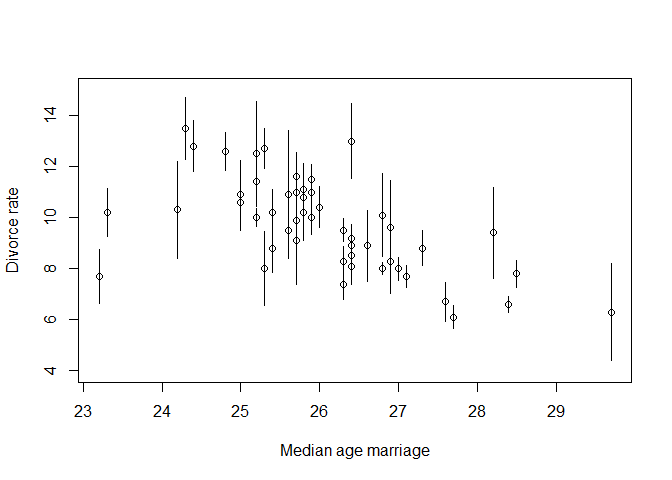<!-- -->

### 15.1.1. Error on the outcome.

```r
## R code 15.3
dlist <- list(
    D_obs = standardize( d$Divorce ),
    D_sd = d$Divorce.SE / sd( d$Divorce ),
    M = standardize( d$Marriage ),
    A = standardize( d$MedianAgeMarriage ),
    N = nrow(d)
)

m15.1 <- ulam(
    alist(
        D_obs ~ dnorm( D_true , D_sd ),
        vector[N]:D_true ~ dnorm( mu , sigma ),
        mu <- a + bA*A + bM*M,
        a ~ dnorm(0,0.2),
        bA ~ dnorm(0,0.5),
        bM ~ dnorm(0,0.5),
        sigma ~ dexp(1)
    ) , data=dlist , chains=4 , cores=4 )

## R code 15.4
precis( m15.1 , depth=2 )
```

```
##                   mean         sd        5.5%       94.5%     n_eff     Rhat4
## D_true[1]   1.17213732 0.36271957  0.60347623  1.75232551 2613.5020 0.9993657
## D_true[2]   0.69319952 0.56676541 -0.19751572  1.61543909 2432.0575 0.9986942
## D_true[3]   0.43455645 0.33359009 -0.08207652  0.98147060 3430.2115 0.9993220
## D_true[4]   1.41141717 0.44978575  0.68597598  2.14374628 2725.3565 0.9996455
## D_true[5]  -0.90086800 0.13162445 -1.11210495 -0.69384517 2548.5080 0.9988845
## D_true[6]   0.66315057 0.40551055  0.05151198  1.34748517 2507.1894 0.9991545
## D_true[7]  -1.37270794 0.34704803 -1.92363772 -0.81436579 2529.2590 1.0007814
## D_true[8]  -0.33761826 0.48792812 -1.10664119  0.42029307 2802.1002 1.0002825
## D_true[9]  -1.89295181 0.60811787 -2.83710393 -0.91657830 2347.2129 1.0000402
## D_true[10] -0.61912245 0.16302335 -0.87741451 -0.35797151 3449.9385 0.9988355
## D_true[11]  0.76817205 0.28135151  0.31550176  1.22264908 2255.0343 1.0032673
## D_true[12] -0.57436205 0.48351745 -1.34305066  0.19726235 2290.6465 0.9994158
## D_true[13]  0.16870924 0.50269950 -0.64239172  0.94741153 1544.3859 1.0019733
## D_true[14] -0.86690464 0.22259240 -1.21956164 -0.51985966 3603.4518 1.0003807
## D_true[15]  0.55489597 0.29878455  0.07536558  1.03470438 3624.3423 0.9987108
## D_true[16]  0.28007955 0.39161865 -0.32046628  0.91696659 4480.3019 0.9985226
## D_true[17]  0.50348715 0.42471305 -0.17248569  1.18195475 2862.6701 0.9986500
## D_true[18]  1.25717000 0.35481561  0.68688316  1.79851635 3228.5731 0.9986029
## D_true[19]  0.42258389 0.37002880 -0.15181227  1.01422972 2114.8700 1.0006302
## D_true[20]  0.40548759 0.51137116 -0.36929908  1.27245827 1711.5261 0.9993812
## D_true[21] -0.56726899 0.32540106 -1.09383564 -0.02975283 3498.3593 0.9986942
## D_true[22] -1.09922429 0.26626548 -1.51920111 -0.67508666 3833.0009 0.9997582
## D_true[23] -0.27472977 0.26228189 -0.69812122  0.13926398 3957.3147 0.9985141
## D_true[24] -1.00740366 0.28617152 -1.45438690 -0.53995543 2713.9093 0.9991932
## D_true[25]  0.42978225 0.40414254 -0.19108222  1.07066823 2148.2614 0.9985192
## D_true[26] -0.02553240 0.31390901 -0.51942973  0.47285344 3101.4473 0.9998296
## D_true[27] -0.01925444 0.52083673 -0.86336243  0.81004128 2425.7193 0.9995910
## D_true[28] -0.15830555 0.40921634 -0.80798362  0.49073637 3495.2387 0.9996620
## D_true[29] -0.26548913 0.50825250 -1.04983889  0.57803944 2008.3634 1.0011921
## D_true[30] -1.79952181 0.23903946 -2.19883932 -1.42775132 3014.8296 0.9989362
## D_true[31]  0.15079986 0.42407555 -0.53105451  0.83563511 2532.8948 1.0007559
## D_true[32] -1.65919790 0.16741225 -1.92271379 -1.39530897 3699.8030 0.9986445
## D_true[33]  0.11640885 0.23657577 -0.26033412  0.50239224 3025.0163 0.9998087
## D_true[34] -0.06107832 0.53564756 -0.89290471  0.79026057 2658.1476 0.9991912
## D_true[35] -0.12404793 0.22689595 -0.48464512  0.24102483 4294.7857 0.9992734
## D_true[36]  1.28469815 0.41057979  0.64511956  1.95146403 2626.1182 0.9996470
## D_true[37]  0.23745682 0.33204875 -0.28827914  0.76129080 3708.4028 0.9985991
## D_true[38] -1.02658169 0.22273262 -1.38636829 -0.67127960 3943.2239 0.9995168
## D_true[39] -0.91129416 0.53899084 -1.73505702 -0.03163037 2485.6435 1.0000973
## D_true[40] -0.67624951 0.31333091 -1.20050733 -0.18995561 3039.3661 0.9990652
## D_true[41]  0.24362770 0.53002280 -0.56242529  1.08146104 2425.1321 0.9995862
## D_true[42]  0.74819267 0.35262687  0.19775282  1.30825292 3623.9025 0.9996271
## D_true[43]  0.19575153 0.19077148 -0.11171975  0.51070630 3577.1829 0.9995146
## D_true[44]  0.78995502 0.43083900  0.10587090  1.47054504 2353.7285 0.9998651
## D_true[45] -0.41254456 0.51641831 -1.21244989  0.42168473 2117.2624 1.0000862
## D_true[46] -0.39105838 0.25940243 -0.80099893  0.01992445 4627.1479 0.9998131
## D_true[47]  0.12365475 0.28874904 -0.33234055  0.58768140 2999.8247 0.9999294
## D_true[48]  0.55378113 0.43228510 -0.13476142  1.25103963 3594.5473 0.9991618
## D_true[49] -0.63124116 0.27350473 -1.06043261 -0.19334477 2960.4472 0.9984328
## D_true[50]  0.83473289 0.58161634 -0.10007829  1.74758464 1959.5271 1.0001545
## a          -0.05622621 0.09472139 -0.20941656  0.09738435 2023.9458 1.0003914
## bA         -0.61615203 0.16504677 -0.88001964 -0.35449915 1419.6095 0.9997827
## bM          0.05212535 0.17053153 -0.22638295  0.31405339 1072.8026 1.0039786
## sigma       0.58449862 0.10058853  0.42952015  0.74932484  639.8066 1.0059022
```

### 15.1.2. Error on both outcome and predictor.

```r
## R code 15.5
dlist <- list(
    D_obs = standardize( d$Divorce ),
    D_sd = d$Divorce.SE / sd( d$Divorce ),
    M_obs = standardize( d$Marriage ),
    M_sd = d$Marriage.SE / sd( d$Marriage ),
    A = standardize( d$MedianAgeMarriage ),
    N = nrow(d)
)

m15.2 <- ulam(
    alist(
        D_obs ~ dnorm( D_est , D_sd ),
        vector[N]:D_est ~ dnorm( mu , sigma ),
        mu <- a + bA*A + bM*M_est[i],
        M_obs ~ dnorm( M_est , M_sd ),
        vector[N]:M_est ~ dnorm( 0 , 1 ),
        a ~ dnorm(0,0.2),
        bA ~ dnorm(0,0.5),
        bM ~ dnorm(0,0.5),
        sigma ~ dexp( 1 )
    ) , data=dlist , chains=4 , cores=4 )

## R code 15.6
post <- extract.samples( m15.2 )
D_est <- apply( post$D_est , 2 , mean )
M_est <- apply( post$M_est , 2 , mean )
plot( dlist$M_obs , dlist$D_obs , pch=16 , col=rangi2 ,
    xlab="marriage rate (std)" , ylab="divorce rate (std)" )
points( M_est , D_est )
for ( i in 1:nrow(d) )
    lines( c( dlist$M_obs[i] , M_est[i] ) , c( dlist$D_obs[i] , D_est[i] ) )
```

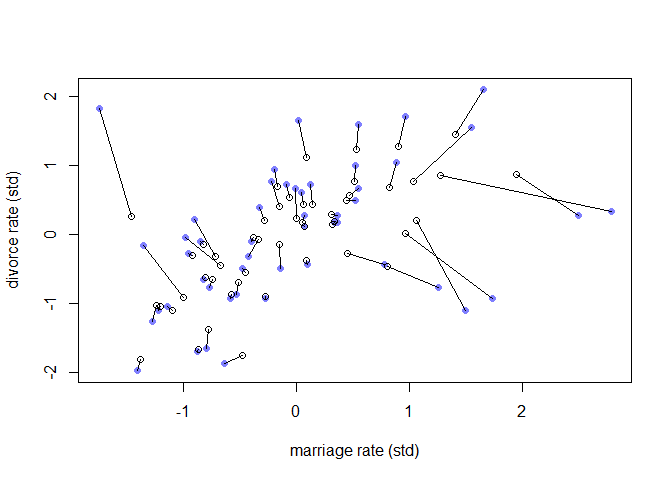<!-- -->

### 15.1.3. Measurement terrors.

```r
## R code 15.7
N <- 500
A <- rnorm(N)
M <- rnorm(N,-A)
D <- rnorm(N,A)
A_obs <- rnorm(N,A)
```

## 15.2. Missing data
### 15.2.1. DAG ate my homework.

```r
## R code 15.8
N <- 100
S <- rnorm( N )
H <- rbinom( N , size=10 , inv_logit(S) )

## R code 15.9
D <- rbern( N ) # dogs completely random
Hm <- H
Hm[D==1] <- NA

## R code 15.10
D <- ifelse( S > 0 , 1 , 0 )
Hm <- H
Hm[D==1] <- NA

## R code 15.11
set.seed(501)
N <- 1000
X <- rnorm(N)
S <- rnorm(N)
H <- rbinom( N , size=10 , inv_logit( 2 + S - 2*X ) )
D <- ifelse( X > 1 , 1 , 0 )
Hm <- H
Hm[D==1] <- NA

## R code 15.12
dat_list <- list(
    H = H,
    S = S )

m15.3 <- ulam(
    alist(
        H ~ binomial( 10 , p ),
        logit(p) <- a + bS*S,
        a ~ normal( 0 , 1 ),
        bS ~ normal( 0 , 0.5 )
    ), data=dat_list , chains=4 )
```

```
## 
## SAMPLING FOR MODEL '23aa98f3ed8699c2ba8ae951caa2fdf8' NOW (CHAIN 1).
## Chain 1: 
## Chain 1: Gradient evaluation took 0.001 seconds
## Chain 1: 1000 transitions using 10 leapfrog steps per transition would take 10 seconds.
## Chain 1: Adjust your expectations accordingly!
## Chain 1: 
## Chain 1: 
## Chain 1: Iteration:   1 / 1000 [  0%]  (Warmup)
## Chain 1: Iteration: 100 / 1000 [ 10%]  (Warmup)
## Chain 1: Iteration: 200 / 1000 [ 20%]  (Warmup)
## Chain 1: Iteration: 300 / 1000 [ 30%]  (Warmup)
## Chain 1: Iteration: 400 / 1000 [ 40%]  (Warmup)
## Chain 1: Iteration: 500 / 1000 [ 50%]  (Warmup)
## Chain 1: Iteration: 501 / 1000 [ 50%]  (Sampling)
## Chain 1: Iteration: 600 / 1000 [ 60%]  (Sampling)
## Chain 1: Iteration: 700 / 1000 [ 70%]  (Sampling)
## Chain 1: Iteration: 800 / 1000 [ 80%]  (Sampling)
## Chain 1: Iteration: 900 / 1000 [ 90%]  (Sampling)
## Chain 1: Iteration: 1000 / 1000 [100%]  (Sampling)
## Chain 1: 
## Chain 1:  Elapsed Time: 1.276 seconds (Warm-up)
## Chain 1:                1.308 seconds (Sampling)
## Chain 1:                2.584 seconds (Total)
## Chain 1: 
## 
## SAMPLING FOR MODEL '23aa98f3ed8699c2ba8ae951caa2fdf8' NOW (CHAIN 2).
## Chain 2: 
## Chain 2: Gradient evaluation took 0.001 seconds
## Chain 2: 1000 transitions using 10 leapfrog steps per transition would take 10 seconds.
## Chain 2: Adjust your expectations accordingly!
## Chain 2: 
## Chain 2: 
## Chain 2: Iteration:   1 / 1000 [  0%]  (Warmup)
## Chain 2: Iteration: 100 / 1000 [ 10%]  (Warmup)
## Chain 2: Iteration: 200 / 1000 [ 20%]  (Warmup)
## Chain 2: Iteration: 300 / 1000 [ 30%]  (Warmup)
## Chain 2: Iteration: 400 / 1000 [ 40%]  (Warmup)
## Chain 2: Iteration: 500 / 1000 [ 50%]  (Warmup)
## Chain 2: Iteration: 501 / 1000 [ 50%]  (Sampling)
## Chain 2: Iteration: 600 / 1000 [ 60%]  (Sampling)
## Chain 2: Iteration: 700 / 1000 [ 70%]  (Sampling)
## Chain 2: Iteration: 800 / 1000 [ 80%]  (Sampling)
## Chain 2: Iteration: 900 / 1000 [ 90%]  (Sampling)
## Chain 2: Iteration: 1000 / 1000 [100%]  (Sampling)
## Chain 2: 
## Chain 2:  Elapsed Time: 1.31 seconds (Warm-up)
## Chain 2:                1.164 seconds (Sampling)
## Chain 2:                2.474 seconds (Total)
## Chain 2: 
## 
## SAMPLING FOR MODEL '23aa98f3ed8699c2ba8ae951caa2fdf8' NOW (CHAIN 3).
## Chain 3: 
## Chain 3: Gradient evaluation took 0 seconds
## Chain 3: 1000 transitions using 10 leapfrog steps per transition would take 0 seconds.
## Chain 3: Adjust your expectations accordingly!
## Chain 3: 
## Chain 3: 
## Chain 3: Iteration:   1 / 1000 [  0%]  (Warmup)
## Chain 3: Iteration: 100 / 1000 [ 10%]  (Warmup)
## Chain 3: Iteration: 200 / 1000 [ 20%]  (Warmup)
## Chain 3: Iteration: 300 / 1000 [ 30%]  (Warmup)
## Chain 3: Iteration: 400 / 1000 [ 40%]  (Warmup)
## Chain 3: Iteration: 500 / 1000 [ 50%]  (Warmup)
## Chain 3: Iteration: 501 / 1000 [ 50%]  (Sampling)
## Chain 3: Iteration: 600 / 1000 [ 60%]  (Sampling)
## Chain 3: Iteration: 700 / 1000 [ 70%]  (Sampling)
## Chain 3: Iteration: 800 / 1000 [ 80%]  (Sampling)
## Chain 3: Iteration: 900 / 1000 [ 90%]  (Sampling)
## Chain 3: Iteration: 1000 / 1000 [100%]  (Sampling)
## Chain 3: 
## Chain 3:  Elapsed Time: 1.279 seconds (Warm-up)
## Chain 3:                1.164 seconds (Sampling)
## Chain 3:                2.443 seconds (Total)
## Chain 3: 
## 
## SAMPLING FOR MODEL '23aa98f3ed8699c2ba8ae951caa2fdf8' NOW (CHAIN 4).
## Chain 4: 
## Chain 4: Gradient evaluation took 0 seconds
## Chain 4: 1000 transitions using 10 leapfrog steps per transition would take 0 seconds.
## Chain 4: Adjust your expectations accordingly!
## Chain 4: 
## Chain 4: 
## Chain 4: Iteration:   1 / 1000 [  0%]  (Warmup)
## Chain 4: Iteration: 100 / 1000 [ 10%]  (Warmup)
## Chain 4: Iteration: 200 / 1000 [ 20%]  (Warmup)
## Chain 4: Iteration: 300 / 1000 [ 30%]  (Warmup)
## Chain 4: Iteration: 400 / 1000 [ 40%]  (Warmup)
## Chain 4: Iteration: 500 / 1000 [ 50%]  (Warmup)
## Chain 4: Iteration: 501 / 1000 [ 50%]  (Sampling)
## Chain 4: Iteration: 600 / 1000 [ 60%]  (Sampling)
## Chain 4: Iteration: 700 / 1000 [ 70%]  (Sampling)
## Chain 4: Iteration: 800 / 1000 [ 80%]  (Sampling)
## Chain 4: Iteration: 900 / 1000 [ 90%]  (Sampling)
## Chain 4: Iteration: 1000 / 1000 [100%]  (Sampling)
## Chain 4: 
## Chain 4:  Elapsed Time: 1.335 seconds (Warm-up)
## Chain 4:                1.248 seconds (Sampling)
## Chain 4:                2.583 seconds (Total)
## Chain 4:
```

```r
precis( m15.3 )
```

```
##         mean         sd      5.5%     94.5%     n_eff    Rhat4
## a  1.1138049 0.02579002 1.0732201 1.1554344  940.5712 1.001608
## bS 0.6895852 0.02603040 0.6484871 0.7301994 1035.3165 1.003775
```


```r
## R code 15.13
dat_list0 <- list(
    H = H[D==0],
    S = S[D==0] )

m15.4 <- ulam(
    alist(
        H ~ binomial( 10 , p ),
        logit(p) <- a + bS*S,
        a ~ normal( 0 , 1 ),
        bS ~ normal( 0 , 0.5 )
    ), data=dat_list0 , chains=4 )
```

```
## 
## SAMPLING FOR MODEL 'b0ffcbbcd522526a2407e59b1b1b4f2c' NOW (CHAIN 1).
## Chain 1: 
## Chain 1: Gradient evaluation took 0 seconds
## Chain 1: 1000 transitions using 10 leapfrog steps per transition would take 0 seconds.
## Chain 1: Adjust your expectations accordingly!
## Chain 1: 
## Chain 1: 
## Chain 1: Iteration:   1 / 1000 [  0%]  (Warmup)
## Chain 1: Iteration: 100 / 1000 [ 10%]  (Warmup)
## Chain 1: Iteration: 200 / 1000 [ 20%]  (Warmup)
## Chain 1: Iteration: 300 / 1000 [ 30%]  (Warmup)
## Chain 1: Iteration: 400 / 1000 [ 40%]  (Warmup)
## Chain 1: Iteration: 500 / 1000 [ 50%]  (Warmup)
## Chain 1: Iteration: 501 / 1000 [ 50%]  (Sampling)
## Chain 1: Iteration: 600 / 1000 [ 60%]  (Sampling)
## Chain 1: Iteration: 700 / 1000 [ 70%]  (Sampling)
## Chain 1: Iteration: 800 / 1000 [ 80%]  (Sampling)
## Chain 1: Iteration: 900 / 1000 [ 90%]  (Sampling)
## Chain 1: Iteration: 1000 / 1000 [100%]  (Sampling)
## Chain 1: 
## Chain 1:  Elapsed Time: 1.022 seconds (Warm-up)
## Chain 1:                1.015 seconds (Sampling)
## Chain 1:                2.037 seconds (Total)
## Chain 1: 
## 
## SAMPLING FOR MODEL 'b0ffcbbcd522526a2407e59b1b1b4f2c' NOW (CHAIN 2).
## Chain 2: 
## Chain 2: Gradient evaluation took 0.001 seconds
## Chain 2: 1000 transitions using 10 leapfrog steps per transition would take 10 seconds.
## Chain 2: Adjust your expectations accordingly!
## Chain 2: 
## Chain 2: 
## Chain 2: Iteration:   1 / 1000 [  0%]  (Warmup)
## Chain 2: Iteration: 100 / 1000 [ 10%]  (Warmup)
## Chain 2: Iteration: 200 / 1000 [ 20%]  (Warmup)
## Chain 2: Iteration: 300 / 1000 [ 30%]  (Warmup)
## Chain 2: Iteration: 400 / 1000 [ 40%]  (Warmup)
## Chain 2: Iteration: 500 / 1000 [ 50%]  (Warmup)
## Chain 2: Iteration: 501 / 1000 [ 50%]  (Sampling)
## Chain 2: Iteration: 600 / 1000 [ 60%]  (Sampling)
## Chain 2: Iteration: 700 / 1000 [ 70%]  (Sampling)
## Chain 2: Iteration: 800 / 1000 [ 80%]  (Sampling)
## Chain 2: Iteration: 900 / 1000 [ 90%]  (Sampling)
## Chain 2: Iteration: 1000 / 1000 [100%]  (Sampling)
## Chain 2: 
## Chain 2:  Elapsed Time: 1.121 seconds (Warm-up)
## Chain 2:                0.9 seconds (Sampling)
## Chain 2:                2.021 seconds (Total)
## Chain 2: 
## 
## SAMPLING FOR MODEL 'b0ffcbbcd522526a2407e59b1b1b4f2c' NOW (CHAIN 3).
## Chain 3: 
## Chain 3: Gradient evaluation took 0 seconds
## Chain 3: 1000 transitions using 10 leapfrog steps per transition would take 0 seconds.
## Chain 3: Adjust your expectations accordingly!
## Chain 3: 
## Chain 3: 
## Chain 3: Iteration:   1 / 1000 [  0%]  (Warmup)
## Chain 3: Iteration: 100 / 1000 [ 10%]  (Warmup)
## Chain 3: Iteration: 200 / 1000 [ 20%]  (Warmup)
## Chain 3: Iteration: 300 / 1000 [ 30%]  (Warmup)
## Chain 3: Iteration: 400 / 1000 [ 40%]  (Warmup)
## Chain 3: Iteration: 500 / 1000 [ 50%]  (Warmup)
## Chain 3: Iteration: 501 / 1000 [ 50%]  (Sampling)
## Chain 3: Iteration: 600 / 1000 [ 60%]  (Sampling)
## Chain 3: Iteration: 700 / 1000 [ 70%]  (Sampling)
## Chain 3: Iteration: 800 / 1000 [ 80%]  (Sampling)
## Chain 3: Iteration: 900 / 1000 [ 90%]  (Sampling)
## Chain 3: Iteration: 1000 / 1000 [100%]  (Sampling)
## Chain 3: 
## Chain 3:  Elapsed Time: 0.962 seconds (Warm-up)
## Chain 3:                0.885 seconds (Sampling)
## Chain 3:                1.847 seconds (Total)
## Chain 3: 
## 
## SAMPLING FOR MODEL 'b0ffcbbcd522526a2407e59b1b1b4f2c' NOW (CHAIN 4).
## Chain 4: 
## Chain 4: Gradient evaluation took 0 seconds
## Chain 4: 1000 transitions using 10 leapfrog steps per transition would take 0 seconds.
## Chain 4: Adjust your expectations accordingly!
## Chain 4: 
## Chain 4: 
## Chain 4: Iteration:   1 / 1000 [  0%]  (Warmup)
## Chain 4: Iteration: 100 / 1000 [ 10%]  (Warmup)
## Chain 4: Iteration: 200 / 1000 [ 20%]  (Warmup)
## Chain 4: Iteration: 300 / 1000 [ 30%]  (Warmup)
## Chain 4: Iteration: 400 / 1000 [ 40%]  (Warmup)
## Chain 4: Iteration: 500 / 1000 [ 50%]  (Warmup)
## Chain 4: Iteration: 501 / 1000 [ 50%]  (Sampling)
## Chain 4: Iteration: 600 / 1000 [ 60%]  (Sampling)
## Chain 4: Iteration: 700 / 1000 [ 70%]  (Sampling)
## Chain 4: Iteration: 800 / 1000 [ 80%]  (Sampling)
## Chain 4: Iteration: 900 / 1000 [ 90%]  (Sampling)
## Chain 4: Iteration: 1000 / 1000 [100%]  (Sampling)
## Chain 4: 
## Chain 4:  Elapsed Time: 0.995 seconds (Warm-up)
## Chain 4:                1.017 seconds (Sampling)
## Chain 4:                2.012 seconds (Total)
## Chain 4:
```

```r
precis( m15.4 )
```

```
##         mean         sd      5.5%     94.5%     n_eff    Rhat4
## a  1.7959583 0.03507498 1.7393783 1.8524947 1034.9354 1.000515
## bS 0.8286333 0.03541430 0.7738497 0.8862532  993.2018 1.001287
```


```r
## R code 15.14
D <- ifelse( abs(X) < 1 , 1 , 0 )

## R code 15.15
N <- 100
S <- rnorm(N)
H <- rbinom( N , size=10 , inv_logit(S) )
D <- ifelse( H < 5 , 1 , 0 )
Hm <- H
Hm[D==1] <- NA
```

### 15.2.2. Imputing primates.

```r
## R code 15.16
library(rethinking)
data(milk)
d <- milk
d$neocortex.prop <- d$neocortex.perc / 100
d$logmass <- log(d$mass)

## R code 15.17
dat_list <- list(
    K = standardize( d$kcal.per.g ),
    B = standardize( d$neocortex.prop ),
    M = standardize( d$logmass )
)

m15.3 <- ulam(
    alist(
        K ~ dnorm( mu , sigma ),
        mu <- a + bB*B + bM*M,
        B ~ dnorm( nu , sigma_B ),
        c(a,nu) ~ dnorm( 0 , 0.5 ),
        c(bB,bM) ~ dnorm( 0, 0.5 ),
        sigma_B ~ dexp( 1 ),
        sigma ~ dexp( 1 )
    ) , data=dat_list , chains=4 , cores=4 )
```

```
## Found 12 NA values in B and attempting imputation.
```

```r
## R code 15.18
precis( m15.3 , depth=2 )
```

```
##                     mean        sd        5.5%      94.5%    n_eff     Rhat4
## nu           -0.04368485 0.2089562 -0.36766534  0.2858699 1736.483 1.0016063
## a             0.03054252 0.1612742 -0.22493887  0.2810272 2200.639 0.9993779
## bM           -0.53716048 0.2056274 -0.85772693 -0.2019582 1085.239 1.0031449
## bB            0.49293141 0.2410612  0.08981309  0.8545625  725.841 1.0062578
## sigma_B       1.01386339 0.1713830  0.78661136  1.3069266 1292.821 1.0020987
## sigma         0.84615472 0.1481048  0.63940410  1.1056416 1047.627 1.0036267
## B_impute[1]  -0.57191935 0.9034350 -1.93551961  0.9593654 2048.685 1.0000945
## B_impute[2]  -0.70703639 0.9760477 -2.20638421  0.8824175 1699.314 1.0049426
## B_impute[3]  -0.71358403 1.0013145 -2.26369832  0.8543068 2290.988 1.0029735
## B_impute[4]  -0.29132332 0.8748787 -1.66288168  1.0581652 2437.105 1.0010534
## B_impute[5]   0.46361239 0.9093612 -0.94440294  1.8446707 2384.664 0.9996933
## B_impute[6]  -0.16926372 0.8931844 -1.56905745  1.3089676 2608.736 0.9996702
## B_impute[7]   0.18554776 0.8723654 -1.23276997  1.5174643 2568.280 0.9991635
## B_impute[8]   0.27195223 0.8840276 -1.13556458  1.6761046 2960.539 0.9988263
## B_impute[9]   0.52730809 0.9266440 -0.92136965  1.9646207 2332.782 1.0003682
## B_impute[10] -0.41434132 0.9099458 -1.85496634  0.9849306 2342.857 0.9998743
## B_impute[11] -0.29847972 0.8972953 -1.73847012  1.1018060 2211.445 0.9999470
## B_impute[12]  0.13988787 0.9272784 -1.34981496  1.5647464 2765.257 0.9995123
```


```r
## R code 15.19
obs_idx <- which( !is.na(d$neocortex.prop) )
dat_list_obs <- list(
    K = dat_list$K[obs_idx],
    B = dat_list$B[obs_idx],
    M = dat_list$M[obs_idx]
)
m15.4 <- ulam(
    alist(
        K ~ dnorm( mu , sigma ),
        mu <- a + bB*B + bM*M,
        B ~ dnorm( nu , sigma_B ),
        c(a,nu) ~ dnorm( 0 , 0.5 ),
        c(bB,bM) ~ dnorm( 0, 0.5 ),
        sigma_B ~ dexp( 1 ),
        sigma ~ dexp( 1 )
    ) , data=dat_list_obs , chains=4 , cores=4 )
precis( m15.4 )
```

```
##                 mean        sd       5.5%      94.5%    n_eff     Rhat4
## nu      -0.002082801 0.2218455 -0.3641984  0.3451365 2024.998 0.9986361
## a        0.100267709 0.1972432 -0.2172196  0.4177692 1362.972 1.0019343
## bM      -0.626927522 0.2574989 -1.0259886 -0.2001869 1274.660 0.9999130
## bB       0.590589753 0.2825382  0.1342167  1.0329160 1319.317 0.9995301
## sigma_B  1.036199499 0.1869313  0.7822177  1.3594704 1309.046 0.9993124
## sigma    0.884059742 0.1897155  0.6366597  1.2190512 1322.718 1.0002338
```

```r
## R code 15.20
plot( coeftab(m15.3,m15.4) , pars=c("bB","bM") )
```

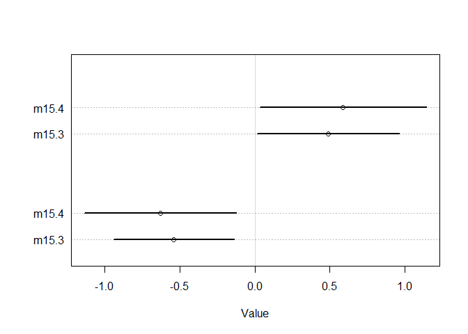<!-- -->

```r
## R code 15.21
post <- extract.samples( m15.3 )
B_impute_mu <- apply( post$B_impute , 2 , mean )
B_impute_ci <- apply( post$B_impute , 2 , PI )

# B vs K
plot( dat_list$B , dat_list$K , pch=16 , col=rangi2 ,
    xlab="neocortex percent (std)" , ylab="kcal milk (std)" )
miss_idx <- which( is.na(dat_list$B) )
Ki <- dat_list$K[miss_idx]
points( B_impute_mu , Ki )
for ( i in 1:12 ) lines( B_impute_ci[,i] , rep(Ki[i],2) )
```

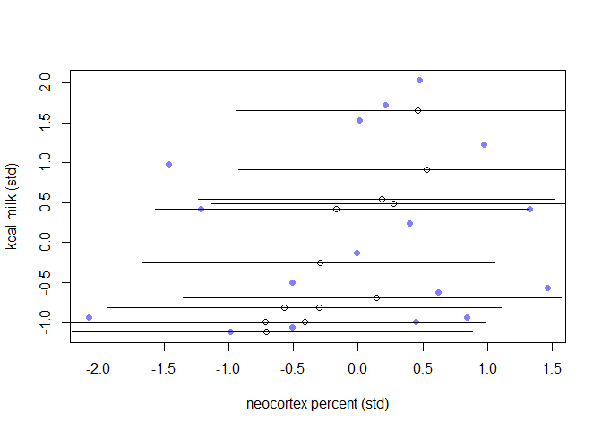<!-- -->

```r
# M vs B
plot( dat_list$M , dat_list$B , pch=16 , col=rangi2 ,
    ylab="neocortex percent (std)" , xlab="log body mass (std)" )
Mi <- dat_list$M[miss_idx]
points( Mi , B_impute_mu )
for ( i in 1:12 ) lines( rep(Mi[i],2) , B_impute_ci[,i] )
```

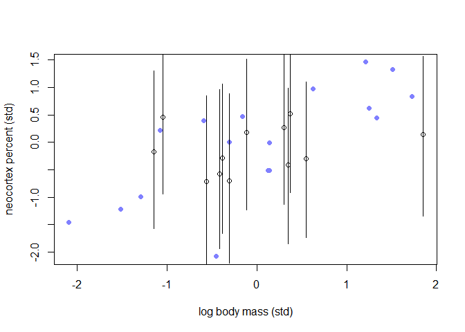<!-- -->

```r
## R code 15.22
m15.5 <- ulam(
    alist(
       # K as function of B and M
        K ~ dnorm( mu , sigma ),
        mu <- a + bB*B_merge + bM*M,

       # M and B correlation
        MB ~ multi_normal( c(muM,muB) , Rho_BM , Sigma_BM ),
        matrix[29,2]:MB <<- append_col( M , B_merge ),

       # define B_merge as mix of observed and imputed values
        vector[29]:B_merge <- merge_missing( B , B_impute ),

       # priors
        c(a,muB,muM) ~ dnorm( 0 , 0.5 ),
        c(bB,bM) ~ dnorm( 0, 0.5 ),
        sigma ~ dexp( 1 ),
        Rho_BM ~ lkj_corr(2),
        Sigma_BM ~ exponential(1)
    ) , data=dat_list , chains=4 , cores=4 )
```

```
## Warning: The largest R-hat is NA, indicating chains have not mixed.
## Running the chains for more iterations may help. See
## http://mc-stan.org/misc/warnings.html#r-hat
```

```
## Warning: Bulk Effective Samples Size (ESS) is too low, indicating posterior means and medians may be unreliable.
## Running the chains for more iterations may help. See
## http://mc-stan.org/misc/warnings.html#bulk-ess
```

```
## Warning: Tail Effective Samples Size (ESS) is too low, indicating posterior variances and tail quantiles may be unreliable.
## Running the chains for more iterations may help. See
## http://mc-stan.org/misc/warnings.html#tail-ess
```

```r
precis( m15.5 , depth=3 , pars=c("bM","bB","Rho_BM" ) )
```

```
##                   mean           sd       5.5%      94.5%     n_eff     Rhat4
## bM          -0.6476228 2.178477e-01 -0.9879225 -0.3009558 1250.8742 0.9993527
## bB           0.5953814 2.495106e-01  0.2019971  0.9862815 1088.0474 0.9992318
## Rho_BM[1,1]  1.0000000 0.000000e+00  1.0000000  1.0000000       NaN       NaN
## Rho_BM[1,2]  0.6075401 1.342893e-01  0.3592014  0.7903052 1655.9751 0.9996355
## Rho_BM[2,1]  0.6075401 1.342893e-01  0.3592014  0.7903052 1655.9751 0.9996355
## Rho_BM[2,2]  1.0000000 7.010242e-17  1.0000000  1.0000000  519.8581 0.9979980
```

```r
## R code 15.23
B_missidx <- which( is.na( dat_list$B ) )
```

## 15.5. Practice

### 15E1.Rewrite the Oceanic tools model (from Chapter 11) below so that it assumes measured error on the log population sizes of each society.

> Ti ∼ Poisson(μi)

> log μi = α + β log Pi

> α ∼ Normal(0, 10)

> β ∼ Normal(0, 1)

> new model

> Ti ∼ Poisson(μi)

> log μi = α + β log P_true_i

> log P_observed_i ~ Normal(log P_true_i, log P_se_i)

> α ∼ Normal(0, 10)

> β ∼ Normal(0, 1)

> P_true_i ~ Normal(0, 1)

### 15E2. Rewrite the same model so that it allows imputation of missing values for log population. There aren’t any missing values in the variable, but you can still write down a model formula that would imply imputation, if any values were missing.

> Ti ∼ Poisson(μi)

> log μi = α + β log Pi

> α ∼ Normal(0, 10)

> β ∼ Normal(0, 1)

> new model. The simplest model will simply impute log Pi from its own normal distribution.

> Ti ∼ Poisson(μi)

> log μi = α + β log Pi

> log Pi ~ Normal(ν, σ_logP)

> α ∼ Normal(0, 10)

> β ∼ Normal(0, 1)

> ν ∼ Normal(0.5, 1)

> σ_logP ∼ Exponential(1)

### 15M2. In earlier chapters, we threw away cases from the primate milk data, so we could use the neocortex variable. Now repeat the WAIC model comparison example from Chapter 6, but use imputation on the neocortex variable so that you can include all of the cases in the original data. The simplest form of imputation is acceptable. How are the model comparison results affected by being able to include all of the cases?

> he kind of did 15M2 in the chapter.  Sub 15M3 for 15M2


### 15M3. Repeat the divorce data measurement error models, but this time double the standard errors. Can you explain how doubling the standard errors impacts inference?


```r
## R code 15.2
library(rethinking)
data(WaffleDivorce)
d <- WaffleDivorce
```


```r
## R code 15.5
dlist <- list(
    D_obs = standardize( d$Divorce ),
    D_sd = d$Divorce.SE / sd( d$Divorce ),
    M_obs = standardize( d$Marriage ),
    M_sd = d$Marriage.SE / sd( d$Marriage ),
    A = standardize( d$MedianAgeMarriage ),
    N = nrow(d)
)

m15.2 <- ulam(
    alist(
        D_obs ~ dnorm( D_est , D_sd ),
        vector[N]:D_est ~ dnorm( mu , sigma ),
        mu <- a + bA*A + bM*M_est[i],
        M_obs ~ dnorm( M_est , M_sd ),
        vector[N]:M_est ~ dnorm( 0 , 1 ),
        a ~ dnorm(0,0.2),
        bA ~ dnorm(0,0.5),
        bM ~ dnorm(0,0.5),
        sigma ~ dexp( 1 )
    ) , data=dlist , chains=4 , cores=4 )
```

```
## recompiling to avoid crashing R session
```

```r
precis( m15.2 )
```

```
## 100 vector or matrix parameters hidden. Use depth=2 to show them.
```

```
##              mean        sd       5.5%      94.5%     n_eff     Rhat4
## a     -0.04060498 0.0983836 -0.1929647  0.1161032 2002.8088 0.9998635
## bA    -0.54426724 0.1612741 -0.7915661 -0.2818097  986.8621 1.0013794
## bM     0.19696425 0.2074347 -0.1347760  0.5276694  692.8134 1.0053220
## sigma  0.56580648 0.1106100  0.3983102  0.7484597  712.5323 1.0020740
```

> doubling the standard errors


```r
## modify from R code 15.5
dlist2 <- list(
    D_obs = standardize( d$Divorce ),
    D_sd = 2*d$Divorce.SE / sd( d$Divorce ),
    M_obs = standardize( d$Marriage ),
    M_sd = 2*d$Marriage.SE / sd( d$Marriage ),
    A = standardize( d$MedianAgeMarriage ),
    N = nrow(d)
)

m15.2_double <- ulam(
    alist(
        D_obs ~ dnorm( D_est , D_sd ),
        vector[N]:D_est ~ dnorm( mu , sigma ),
        mu <- a + bA*A + bM*M_est[i],
        M_obs ~ dnorm( M_est , M_sd ),
        vector[N]:M_est ~ dnorm( 0 , 1 ),
        a ~ dnorm(0,0.2),
        bA ~ dnorm(0,0.5),
        bM ~ dnorm(0,0.5),
        sigma ~ dexp( 1 )
    ) , data=dlist2 , chains=4 , cores=4 )
```

```
## recompiling to avoid crashing R session
```

```
## Warning: There were 67 divergent transitions after warmup. Increasing adapt_delta above 0.95 may help. See
## http://mc-stan.org/misc/warnings.html#divergent-transitions-after-warmup
```

```
## Warning: There were 3 chains where the estimated Bayesian Fraction of Missing Information was low. See
## http://mc-stan.org/misc/warnings.html#bfmi-low
```

```
## Warning: Examine the pairs() plot to diagnose sampling problems
```

```
## Warning: The largest R-hat is 1.42, indicating chains have not mixed.
## Running the chains for more iterations may help. See
## http://mc-stan.org/misc/warnings.html#r-hat
```

```
## Warning: Bulk Effective Samples Size (ESS) is too low, indicating posterior means and medians may be unreliable.
## Running the chains for more iterations may help. See
## http://mc-stan.org/misc/warnings.html#bulk-ess
```

```
## Warning: Tail Effective Samples Size (ESS) is too low, indicating posterior variances and tail quantiles may be unreliable.
## Running the chains for more iterations may help. See
## http://mc-stan.org/misc/warnings.html#tail-ess
```

```r
precis( m15.2_double )
```

```
## 100 vector or matrix parameters hidden. Use depth=2 to show them.
```

```
##              mean         sd        5.5%       94.5%      n_eff    Rhat4
## a     -0.08377867 0.09974541 -0.24647627  0.08321848 429.648299 1.004657
## bA    -0.58990573 0.15214805 -0.82723680 -0.33495239 264.733601 1.013613
## bM     0.36511482 0.20370922  0.06547382  0.69808458 147.252508 1.051624
## sigma  0.14116656 0.09666459  0.04099062  0.31549739   9.062279 1.338498
```

```r
plot(precis( m15.2 ))
```

```
## 100 vector or matrix parameters hidden. Use depth=2 to show them.
```

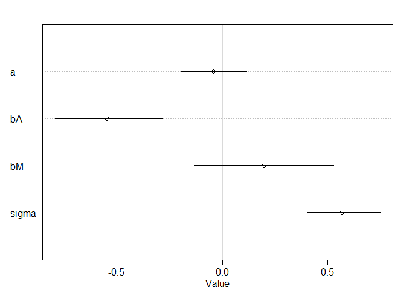<!-- -->

```r
plot(precis( m15.2_double ))
```

```
## 100 vector or matrix parameters hidden. Use depth=2 to show them.
```

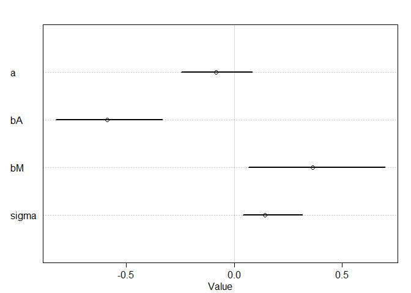<!-- -->

> effective number of samples are small.

> larger deviance of observations makes inference harder

### 15H1. The data in data(elephants) are counts of matings observed for bull elephants of differing ages. There is a strong positive relationship between age and matings. However, age is not always assessed accurately. First, fit a Poisson model predicting MATINGS with AGE as a predictor. Second, assume that the observed AGE values are uncertain and have a standard error of±5 years. Re-estimate the relationship between MATINGS and AGE, incorporating this measurement error. Compare the inferences of the two models.


```r
data(elephants)
d <- elephants
str(d)
```

```
## 'data.frame':	41 obs. of  2 variables:
##  $ AGE    : int  27 28 28 28 28 29 29 29 29 29 ...
##  $ MATINGS: int  0 1 1 1 3 0 0 0 2 2 ...
```

```r
summary(d)
```

```
##       AGE           MATINGS     
##  Min.   :27.00   Min.   :0.000  
##  1st Qu.:29.00   1st Qu.:1.000  
##  Median :34.00   Median :2.000  
##  Mean   :35.85   Mean   :2.683  
##  3rd Qu.:42.00   3rd Qu.:3.000  
##  Max.   :52.00   Max.   :9.000
```

```r
plot(d$MATINGS, d$AGE)
```

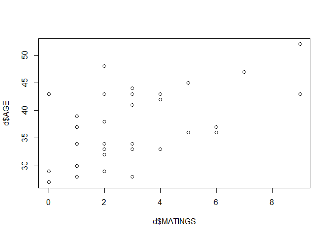<!-- -->

```r
dlist <- list(
    A = standardize( d$AGE ),
    M = d$MATINGS,
    N = nrow(d)
)
str(dlist)
```

```
## List of 3
##  $ A: num [1:41] -1.35 -1.19 -1.19 -1.19 -1.19 ...
##   ..- attr(*, "scaled:center")= num 35.9
##   ..- attr(*, "scaled:scale")= num 6.58
##  $ M: int [1:41] 0 1 1 1 3 0 0 0 2 2 ...
##  $ N: int 41
```

```r
summary(dlist)
```

```
##   Length Class  Mode   
## A 41     -none- numeric
## M 41     -none- numeric
## N  1     -none- numeric
```

```r
plot(dlist$M, dlist$A)
```

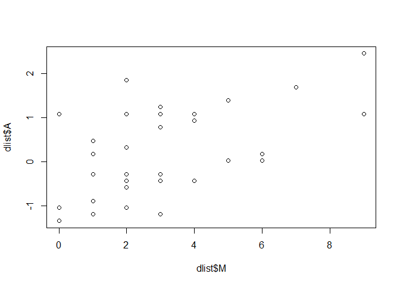<!-- -->
> fit a Poisson model using age to predict matings


```r
m15H1.base <- ulam(
  alist(
    M ~ dpois(lambda),
    log(lambda) <- a + bA*A,
    a ~ dnorm(0,1),
    bA ~ dnorm(0,1)
    ), data = dlist, chains = 4, cores = 4)

precis(m15H1.base)
```

```
##         mean         sd      5.5%     94.5%    n_eff     Rhat4
## a  0.8623536 0.10380846 0.6957450 1.0296437 750.9403 1.0037875
## bA 0.4539435 0.09065786 0.3109031 0.5994287 911.6769 0.9993912
```

```r
plot(m15H1.base)
```

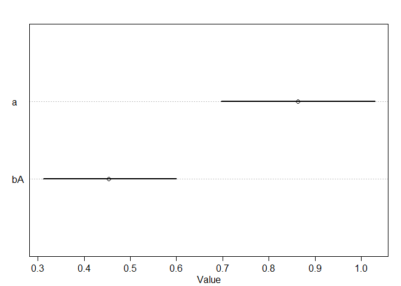<!-- -->

> Second, assume that the observed AGE values are uncertain and have a standard error of±5 years


```r
m15H1.se <- ulam(
  alist(
    M ~ dpois(lambda),
    log(lambda) <- a + bA*A_est[i],
    A ~ dnorm(A_est, 5),
    vector[N]:A_est ~ dnorm(0,1),
    a ~ dnorm(0,1),
    bA ~ dnorm(0,1)
    ), data = dlist, chains = 4, cores = 4)
```

```
## Warning: The largest R-hat is 1.29, indicating chains have not mixed.
## Running the chains for more iterations may help. See
## http://mc-stan.org/misc/warnings.html#r-hat
```

```
## Warning: Bulk Effective Samples Size (ESS) is too low, indicating posterior means and medians may be unreliable.
## Running the chains for more iterations may help. See
## http://mc-stan.org/misc/warnings.html#bulk-ess
```

```
## Warning: Tail Effective Samples Size (ESS) is too low, indicating posterior variances and tail quantiles may be unreliable.
## Running the chains for more iterations may help. See
## http://mc-stan.org/misc/warnings.html#tail-ess
```

```r
precis(m15H1.se)
```

```
## 41 vector or matrix parameters hidden. Use depth=2 to show them.
```

```
##         mean        sd       5.5%     94.5%      n_eff    Rhat4
## a  0.8172438 0.1445623  0.5824883 1.0359291 1488.03404 1.000392
## bA 0.4021913 0.4251880 -0.5908905 0.8000926    4.61595 2.016090
```

```r
plot(m15H1.se)
```

```
## 41 vector or matrix parameters hidden. Use depth=2 to show them.
```

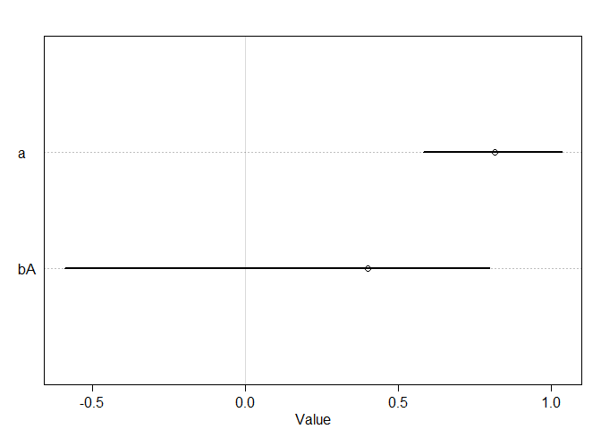<!-- -->


### 15H2. Repeat the model fitting problem above, now increasing the assumed standard error on AGE. How large does the standard error have to get before the posterior mean for the coefficient on AGE reaches zero?

> increasing the assumed standard error on AGE to 10


```r
m15H2.se10 <- ulam(
  alist(
    M ~ dpois(lambda),
    log(lambda) <- a + bA*A_est[i],
    A ~ dnorm(A_est, 10),
    vector[N]:A_est ~ dnorm(0,1),
    a ~ dnorm(0,1),
    bA ~ dnorm(0,1)
    ), data = dlist, chains = 4, cores = 4)
```

```
## Warning: The largest R-hat is 1.51, indicating chains have not mixed.
## Running the chains for more iterations may help. See
## http://mc-stan.org/misc/warnings.html#r-hat
```

```
## Warning: Bulk Effective Samples Size (ESS) is too low, indicating posterior means and medians may be unreliable.
## Running the chains for more iterations may help. See
## http://mc-stan.org/misc/warnings.html#bulk-ess
```

```
## Warning: Tail Effective Samples Size (ESS) is too low, indicating posterior variances and tail quantiles may be unreliable.
## Running the chains for more iterations may help. See
## http://mc-stan.org/misc/warnings.html#tail-ess
```

```r
precis(m15H2.se10)
```

```
## 41 vector or matrix parameters hidden. Use depth=2 to show them.
```

```
##         mean        sd       5.5%     94.5%       n_eff     Rhat4
## a  0.8186754 0.1456028  0.5797071 1.0397571 1317.365413 0.9991667
## bA 0.0737264 0.5765481 -0.7200405 0.7801531    2.953309 2.1798822
```

```r
plot(m15H2.se10)
```

```
## 41 vector or matrix parameters hidden. Use depth=2 to show them.
```

<!-- -->

> increasing the assumed standard error on AGE to 50


```r
m15H2.se50 <- ulam(
  alist(
    M ~ dpois(lambda),
    log(lambda) <- a + bA*A_est[i],
    A ~ dnorm(A_est, 50),
    vector[N]:A_est ~ dnorm(0,1),
    a ~ dnorm(0,1),
    bA ~ dnorm(0,1)
    ), data = dlist, chains = 4, cores = 4)
```

```
## Warning: Bulk Effective Samples Size (ESS) is too low, indicating posterior means and medians may be unreliable.
## Running the chains for more iterations may help. See
## http://mc-stan.org/misc/warnings.html#bulk-ess
```

```
## Warning: Tail Effective Samples Size (ESS) is too low, indicating posterior variances and tail quantiles may be unreliable.
## Running the chains for more iterations may help. See
## http://mc-stan.org/misc/warnings.html#tail-ess
```

```r
precis(m15H2.se50)
```

```
## 41 vector or matrix parameters hidden. Use depth=2 to show them.
```

```
##          mean        sd       5.5%     94.5%      n_eff    Rhat4
## a   0.8233270 0.1510617  0.5714822 1.0534912 1056.04633 1.002142
## bA -0.4686015 0.3518378 -0.8215803 0.4659315   21.67972 1.095363
```

```r
plot(m15H2.se50)
```

```
## 41 vector or matrix parameters hidden. Use depth=2 to show them.
```

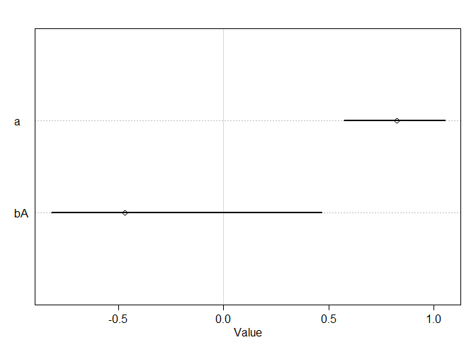<!-- -->

> AGE estimates become very close to zero

> increasing the assumed standard error on AGE to 100


```r
m15H2.se100 <- ulam(
  alist(
    M ~ dpois(lambda),
    log(lambda) <- a + bA*A_est[i],
    A ~ dnorm(A_est, 100),
    vector[N]:A_est ~ dnorm(0,1),
    a ~ dnorm(0,1),
    bA ~ dnorm(0,1)
    ), data = dlist, chains = 4, cores = 4)
```

```
## Warning: The largest R-hat is 1.55, indicating chains have not mixed.
## Running the chains for more iterations may help. See
## http://mc-stan.org/misc/warnings.html#r-hat
```

```
## Warning: Bulk Effective Samples Size (ESS) is too low, indicating posterior means and medians may be unreliable.
## Running the chains for more iterations may help. See
## http://mc-stan.org/misc/warnings.html#bulk-ess
```

```
## Warning: Tail Effective Samples Size (ESS) is too low, indicating posterior variances and tail quantiles may be unreliable.
## Running the chains for more iterations may help. See
## http://mc-stan.org/misc/warnings.html#tail-ess
```

```r
precis(m15H2.se100)
```

```
## 41 vector or matrix parameters hidden. Use depth=2 to show them.
```

```
##          mean        sd       5.5%     94.5%       n_eff    Rhat4
## a  0.80766660 0.1584468  0.5465027 1.0459757 1279.123983 1.002232
## bA 0.01092038 0.5984624 -0.7651453 0.8018481    5.448706 2.145244
```

```r
plot(m15H2.se100)
```

```
## 41 vector or matrix parameters hidden. Use depth=2 to show them.
```

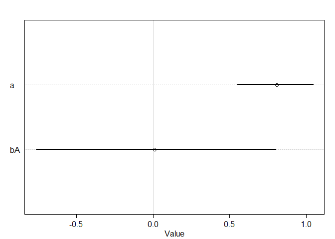<!-- -->

> AGE estimates become negative (close to zero)
