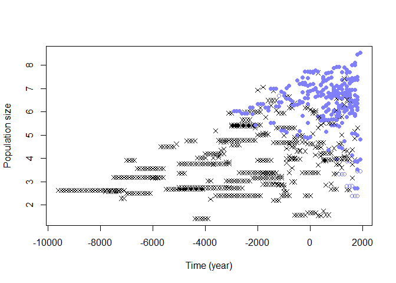
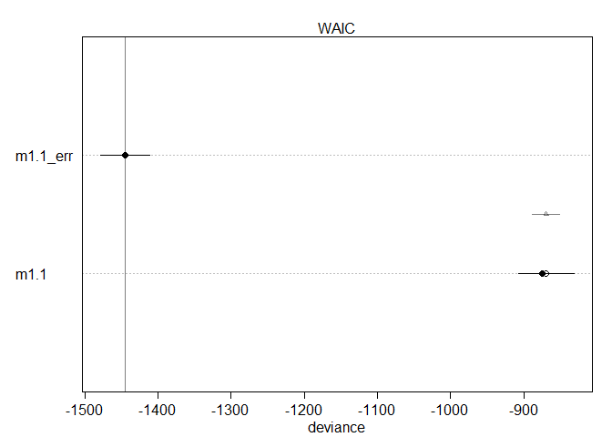
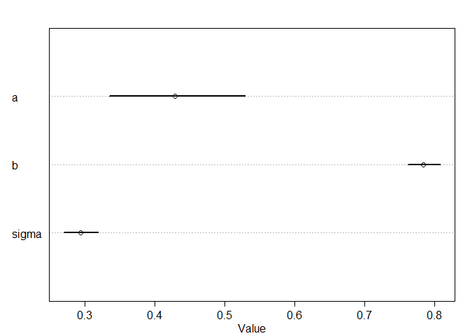
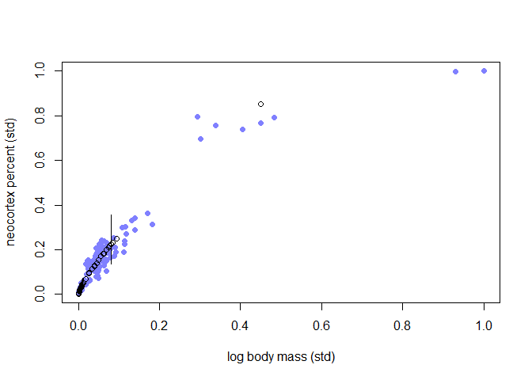

### 15.2.3. Where is your god now?


```r
library(rethinking)
```

```
## Loading required package: rstan
```

```
## Loading required package: StanHeaders
```

```
## Loading required package: ggplot2
```

```
## rstan (Version 2.19.3, GitRev: 2e1f913d3ca3)
```

```
## For execution on a local, multicore CPU with excess RAM we recommend calling
## options(mc.cores = parallel::detectCores()).
## To avoid recompilation of unchanged Stan programs, we recommend calling
## rstan_options(auto_write = TRUE)
```

```
## For improved execution time, we recommend calling
## Sys.setenv(LOCAL_CPPFLAGS = '-march=corei7 -mtune=corei7')
## although this causes Stan to throw an error on a few processors.
```

```
## Loading required package: parallel
```

```
## Loading required package: dagitty
```

```
## rethinking (Version 2.01)
```

```
## 
## Attaching package: 'rethinking'
```

```
## The following object is masked from 'package:stats':
## 
##     rstudent
```

```r
## R code 15.24
data(Moralizing_gods)
str(Moralizing_gods)
```

```
## 'data.frame':	864 obs. of  5 variables:
##  $ polity         : Factor w/ 30 levels "Big Island Hawaii",..: 1 1 1 1 1 1 1 1 1 2 ...
##  $ year           : int  1000 1100 1200 1300 1400 1500 1600 1700 1800 -600 ...
##  $ population     : num  3.73 3.73 3.6 4.03 4.31 ...
##  $ moralizing_gods: int  NA NA NA NA NA NA NA NA 1 NA ...
##  $ writing        : int  0 0 0 0 0 0 0 0 0 0 ...
```


```r
## R code 15.25
table( Moralizing_gods$moralizing_gods , useNA="always" )
```

```
## 
##    0    1 <NA> 
##   17  319  528
```


```r
## R code 15.26
symbol <- ifelse( Moralizing_gods$moralizing_gods==1 , 16 , 1 )
symbol <- ifelse( is.na(Moralizing_gods$moralizing_gods) , 4 , symbol )
color <- ifelse( is.na(Moralizing_gods$moralizing_gods) , "black" , rangi2 )
plot( Moralizing_gods$year , Moralizing_gods$population , pch=symbol ,
    col=color , xlab="Time (year)" , ylab="Population size" , lwd=1.5 )
```

<!-- -->


```r
## R code 15.27
dmg <- Moralizing_gods
table( gods=dmg$moralizing_gods , literacy=dmg$writing , useNA="always" )
```

```
##       literacy
## gods     0   1 <NA>
##   0     16   1    0
##   1      9 310    0
##   <NA> 442  86    0
```


```r
## R code 15.28
dmg <- Moralizing_gods
haw <- which( dmg$polity=="Big Island Hawaii" )
t( dmg[ haw , c("year","population","writing","moralizing_gods") ] )
```

```
##                           1           2          3          4           5
## year            1000.000000 1100.000000 1200.00000 1300.00000 1400.000000
## population         3.729643    3.729643    3.59834    4.02624    4.311767
## writing            0.000000    0.000000    0.00000    0.00000    0.000000
## moralizing_gods          NA          NA         NA         NA          NA
##                           6          7           8           9
## year            1500.000000 1600.00000 1700.000000 1800.000000
## population         4.205113    4.37396    5.157593    4.997439
## writing            0.000000    0.00000    0.000000    0.000000
## moralizing_gods          NA         NA          NA    1.000000
```
## 15.3. Categorical errors and discrete absences
### 15.3.1. Discrete cats.


```r
## R code 15.29
set.seed(9)
N_houses <- 100L
alpha <- 5
beta <- (-3)
k <- 0.5
r <- 0.2
cat <- rbern( N_houses , k )
notes <- rpois( N_houses , alpha + beta*cat )
R_C <- rbern( N_houses , r )
cat_obs <- cat
cat_obs[R_C==1] <- (-9L)
```


```r
## R code 15.30
dat <- list(
    notes = notes,
    cat = cat_obs,
    RC = R_C,
    N = as.integer(N_houses) )

m15.6 <- ulam(
    alist(
        # singing bird model
        ## cat known present/absent:
        notes|RC==0 ~ poisson( lambda ),
        log(lambda) <- a + b*cat,
        ## cat NA:
        notes|RC==1 ~ custom( log_sum_exp(
                log(k) + poisson_lpmf( notes | exp(a + b) ),
                log(1-k) + poisson_lpmf( notes | exp(a) )
            ) ),

        # priors
        a ~ normal(0,1),
        b ~ normal(0,0.5),

        # sneaking cat model
        cat|RC==0 ~ bernoulli(k),
        k ~ beta(2,2)
    ), data=dat , chains=4 , cores=4 )
precis(m15.6)
```

```
##         mean         sd       5.5%      94.5%    n_eff     Rhat4
## a  1.6065684 0.06253717  1.5051730  1.7069034 1334.194 0.9994578
## b -0.7963207 0.11645153 -0.9858555 -0.6178590 1350.469 1.0021709
## k  0.4619135 0.05278555  0.3791726  0.5470623 1679.410 0.9985862
```


```r
## R code 15.31
m15.7 <- ulam(
    alist(
        # singing bird model
        notes|RC==0 ~ poisson( lambda ),
        notes|RC==1 ~ custom( log_sum_exp(
                log(k) + poisson_lpmf( notes | exp(a + b) ),
                log(1-k) + poisson_lpmf( notes | exp(a) )
            ) ),
        log(lambda) <- a + b*cat,
        a ~ normal(0,1),
        b ~ normal(0,0.5),

        # sneaking cat model
        cat|RC==0 ~ bernoulli(k),
        k ~ beta(2,2),

        # imputed values
        gq> vector[N]:PrC1 <- exp(lpC1)/(exp(lpC1)+exp(lpC0)),
        gq> vector[N]:lpC1 <- log(k) + poisson_lpmf( notes[i] | exp(a+b) ),
        gq> vector[N]:lpC0 <- log(1-k) + poisson_lpmf( notes[i] | exp(a) )
    ), data=dat , chains=4 , cores=4 )
precis(m15.7)
```

```
## 300 vector or matrix parameters hidden. Use depth=2 to show them.
```

```
##         mean         sd       5.5%      94.5%    n_eff    Rhat4
## a  1.6066146 0.06399024  1.5058858  1.7058324 1280.550 1.006901
## b -0.7964650 0.12172411 -0.9841080 -0.6007011 1185.570 1.004574
## k  0.4579723 0.05292406  0.3754045  0.5466525 1544.056 1.002985
```


```r
## R code 15.32
set.seed(100)
x <- c( rnorm(10) , NA )
y <- c( rnorm(10,x) , 100 )
d <- list(x=x,y=y)
```

## HOMEWORK, WEEK 10

### 1. 

#### Consider the relationship between brain volume (brain) and body mass (body) in the data(Primates301). These values are presented as single values for each species. However, there is always a range of sizes in a species, and some of these measurements are taken from very small samples. So these values are measured with some unknown error.

#### We don’t have the raw measurements to work with—that would be best. But we can imagine what might happen if we had them. Suppose error is proportional to the measurement. This makes sense, because larger animals have larger variation.

#### As a consequence, the uncertainty is not uniform across the values and this could mean trouble.
#### Let’s make up some standard errors for these measurements, to see what might happen. Load the data and scale the the measurements so the maximum is 1 in both cases:


```r
library(rethinking)
data(Primates301)
d <- Primates301
cc <- complete.cases( d$brain , d$body )
B <- d$brain[cc]
M <- d$body[cc]
B <- B / max(B)
M <- M / max(M)
#Now I’ll make up some standard errors for B and M, assuming error is 10% of the measurement.
Bse <- B*0.1
Mse <- M*0.1
```

#### Let’s model these variables with this relationship:
Bi ~ Log-Normal(ui; sigma)
ui = a + b log Mi

#### This says that brain volume is a log-normal variable, and the mean on the log scale is given by u. What this model implies is that the expected value of B is:
E(Bi|Mi) = exp(a)Mi^b

#### So this is a standard allometric scaling relationship—incredibly common in biology.
Ignoring measurement error, the corresponding ulam model is:


```r
dat_list <- list(
  B = B,
  M = M )
str(dat_list)
```

```
## List of 2
##  $ B: num [1:182] 0.118 0.108 0.107 0.105 0.102 ...
##  $ M: num [1:182] 0.0358 0.0492 0.0414 0.0398 0.0481 ...
```


```r
m1.1 <- ulam(
  alist(
    B ~ dlnorm( mu , sigma ),
    mu <- a + b*log(M),
    a ~ normal(0,1),
    b ~ normal(0,1),
    sigma ~ exponential(1)
    ) , data=dat_list, chains=4 , cores=4, log_lik = TRUE )
precis( m1.1 )
```

```
##            mean         sd      5.5%     94.5%    n_eff    Rhat4
## a     0.4288780 0.06014532 0.3346865 0.5291797 496.0753 1.007823
## b     0.7836318 0.01454982 0.7614158 0.8078191 495.2441 1.007515
## sigma 0.2932192 0.01519776 0.2696241 0.3185082 764.0237 1.002491
```

#### Your job is to add the measurement errors to this model. Use the divorce/marriage example in the chapter as a guide. It might help to initialize the unobserved true values of B and M using the observed values, by adding a list like this to ulam:


```r
start=list( M_true=dat_list$M , B_true=dat_list$B )
str(start)
```

```
## List of 2
##  $ M_true: num [1:182] 0.0358 0.0492 0.0414 0.0398 0.0481 ...
##  $ B_true: num [1:182] 0.118 0.108 0.107 0.105 0.102 ...
```

Compare the inference of the measurement error model to those of m1.1 above.
Has anything changed? Why or why not?


```r
## modified from R code 15.5
dat_list <- list(
  B = B,
  M = M,
  Bse = Bse,
  Mse = Mse,
  B_true = start$B_true,
  M_true = start$M_true,
  N = sum(cc))
str(dat_list)
```

```
## List of 7
##  $ B     : num [1:182] 0.118 0.108 0.107 0.105 0.102 ...
##  $ M     : num [1:182] 0.0358 0.0492 0.0414 0.0398 0.0481 ...
##  $ Bse   : num [1:182] 0.0118 0.0108 0.0107 0.0105 0.0102 ...
##  $ Mse   : num [1:182] 0.00358 0.00492 0.00414 0.00398 0.00481 ...
##  $ B_true: num [1:182] 0.118 0.108 0.107 0.105 0.102 ...
##  $ M_true: num [1:182] 0.0358 0.0492 0.0414 0.0398 0.0481 ...
##  $ N     : int 182
```

```r
## modified from R code 15.5
m1.1_err <- ulam(
  alist(
    B ~ normal( B_true , Bse ),
    vector[N_spp]:B_true ~ dlnorm( mu , sigma ),
    mu <- a + b*log( M_true[i] ),
    M ~ normal( M_true , Mse ),
    vector[N_spp]:M_true ~ normal( 0.5 , 1 ),
    a ~ normal(0,1),
    b ~ normal(0,1),
    sigma ~ exponential(1)
    ), data=dat_list, chains=4 , cores=4, log_lik = TRUE )
```

```
## Warning: The largest R-hat is NA, indicating chains have not mixed.
## Running the chains for more iterations may help. See
## http://mc-stan.org/misc/warnings.html#r-hat
```

```
## Warning: Bulk Effective Samples Size (ESS) is too low, indicating posterior means and medians may be unreliable.
## Running the chains for more iterations may help. See
## http://mc-stan.org/misc/warnings.html#bulk-ess
```

```
## Warning: Tail Effective Samples Size (ESS) is too low, indicating posterior variances and tail quantiles may be unreliable.
## Running the chains for more iterations may help. See
## http://mc-stan.org/misc/warnings.html#tail-ess
```

```r
precis( m1.1_err )
```

```
##            mean         sd      5.5%     94.5%     n_eff    Rhat4
## a     0.4282048 0.05913442 0.3321156 0.5217509  645.9067 1.001739
## b     0.7834898 0.01437140 0.7603005 0.8059651  672.8780 1.001926
## sigma 0.2930147 0.01511371 0.2693721 0.3178973 1027.2134 1.004623
```

```r
compare(m1.1,m1.1_err)
```

```
##               WAIC       SE    dWAIC      dSE    pWAIC        weight
## m1.1_err -1444.349 33.44996   0.0000       NA 0.000000  1.000000e+00
## m1.1      -869.374 37.78335 574.9747 18.90461 2.588326 1.399029e-125
```

```r
plot(compare(m1.1,m1.1_err))
```

<!-- -->

> m1.1_err seem to have much lower pWAIC value, but both model have the same a, b, sigma

### 2. 
#### Now consider missing values—this data set is lousy with them. You can ignore measurement error in this problem. Let’s get a quick idea of the missing values by counting them in each variable:


```r
library(rethinking)
data(Primates301)
d <- Primates301
colSums( is.na(d) )
```

```
##                name               genus             species          subspecies 
##                   0                   0                   0                 267 
##              spp_id            genus_id     social_learning     research_effort 
##                   0                   0                  98                 115 
##               brain                body          group_size           gestation 
##                 117                  63                 114                 161 
##             weaning           longevity        sex_maturity maternal_investment 
##                 185                 181                 194                 197
```

#### We’ll continue to focus on just brain and body, to stave off insanity. Consider only those species with measured body masses:


```r
cc <- complete.cases( d$body )
M <- d$body[cc]
M <- M / max(M)
B <- d$brain[cc]
B <- B / max( B , na.rm=TRUE )
```

#### You should end up with 238 species and 56 missing brain values among them.

#### First, consider whether there is a pattern to the missing values. Does it look like missing values are associated with particular values of body mass? Draw a DAG that represents how missingness works in this case. Which type (MCAR, MAR, MNAR) is this?

#### Second, impute missing values for brain size. It might help to initialize the 56 imputed variables to a valid value:


```r
start=list( B_impute=rep(0.5,56) )
```

#### This just helps the chain get started.
#### Compare the inferences to an analysis that drops all the missing values. Has anything changed? Why or why not? Hint: Consider the density of data in the ranges where there are missing values. You might want to plot the imputed brain sizes together with the observed values.


```r
## modified from R code 15.5
dat_list <- list(
  B = B,
  M = M)
str(dat_list)
```

```
## List of 2
##  $ B: num [1:238] 0.118 NA 0.108 0.107 0.105 ...
##  $ M: num [1:238] 0.035808 0.000601 0.049192 0.041408 0.039808 ...
```


```r
## modified from R code 15.22
m2_merge_mis <- ulam(
  alist(
    B_merge ~ dlnorm( mu , sigma ),
    mu <- a + b*log(M),
    # define B_merge as mix of observed and imputed values
    B_merge <- merge_missing( B , B_impute ),
    a ~ normal(0,1),
    b ~ normal(0,1),
    sigma ~ exponential(1)
    ) , data=dat_list , chains=4 , cores=4 , start=list( B_impute = rep(0.5,56) ) )
```

```
## Warning: There were 4 divergent transitions after warmup. Increasing adapt_delta above 0.95 may help. See
## http://mc-stan.org/misc/warnings.html#divergent-transitions-after-warmup
```

```
## Warning: Examine the pairs() plot to diagnose sampling problems
```

```r
precis( m2_merge_mis )
```

```
## 56 vector or matrix parameters hidden. Use depth=2 to show them.
```

```
##            mean         sd      5.5%     94.5%     n_eff     Rhat4
## a     0.4279745 0.06192057 0.3308629 0.5278291  921.0270 1.0008355
## b     0.7834113 0.01485104 0.7596910 0.8073462  948.7737 1.0006057
## sigma 0.2939317 0.01610285 0.2697125 0.3219997 1270.1007 0.9989743
```


```r
plot(precis( m1.1 ))
```

<!-- -->

```r
plot(precis( m1.1_err ))
```

<!-- -->

```r
plot(precis( m2_merge_mis ))
```

```
## 56 vector or matrix parameters hidden. Use depth=2 to show them.
```

<!-- -->

> no obvious change.

> plot


```r
## R code 15.21
post <- extract.samples( m2_merge_mis )
B_impute_mu <- apply( post$B_impute , 2 , mean )
B_impute_ci <- apply( post$B_impute , 2 , PI )


miss_idx <- which( is.na(dat_list$B) )

# M vs B
plot( dat_list$M , dat_list$B , pch=16 , col=rangi2 ,
    ylab="neocortex percent (std)" , xlab="log body mass (std)" )
Mi <- dat_list$M[miss_idx]
points( Mi , B_impute_mu )
for ( i in 1:12 ) lines( rep(Mi[i],2) , B_impute_ci[,i] )
```

<!-- -->


### optional 15H4 

#### Some lad named Andrew made an eight-sided spinner. He wanted to know if it is fair. So he spun it a bunch of times, recording the counts of each value. Then he accidentally spilled coffee over the 4s and 5s. The surviving data are summarized below.
Value 1 2 3 4 5 6 7 8
Frequency 18 19 22 ? ? 19 20 22

#### Your job is to impute the two missing values in the table above. Andrew doesn’t remember how many times he spun the spinner. So you will have to assign a prior distribution for the total number of spins and then marginalize over the unknown total. Andrew is not sure the spinner is fair (every value is equally likely), but he’s confident that none of the values is twice as likely as any other. Use a Dirichlet distribution to capture this prior belief. Plot the joint posterior distribution of 4s and 5s.

