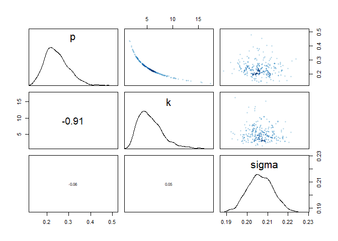
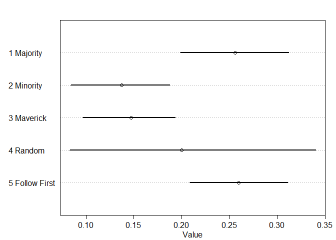
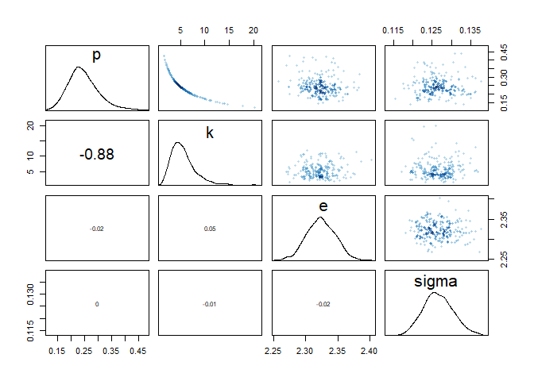
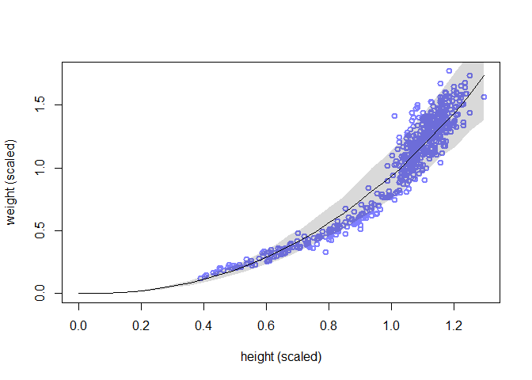
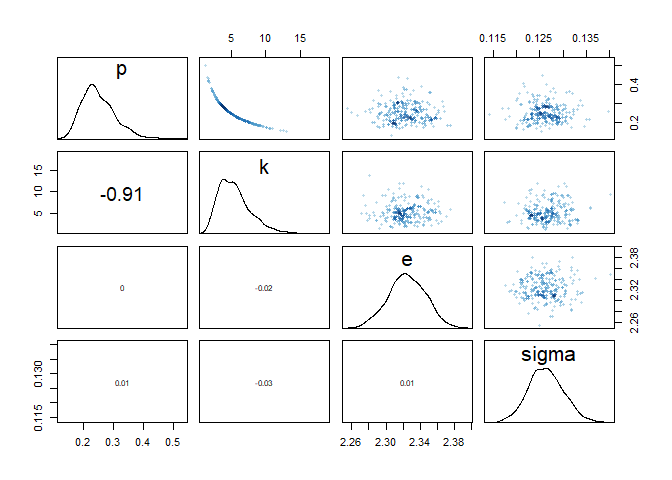
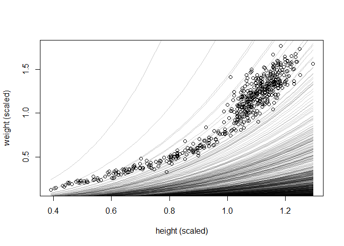
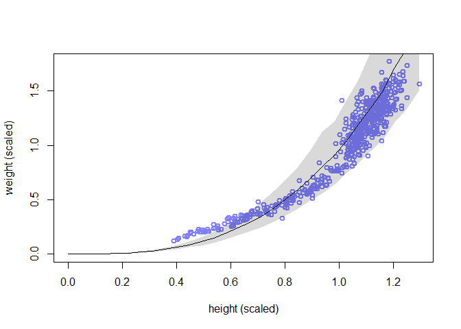
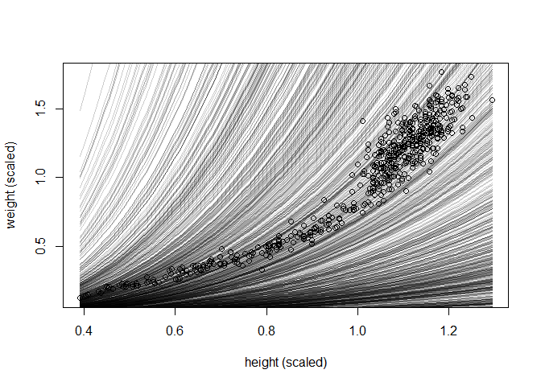

# Generalized Linear Madness

## 16.1. Geometric people
### 16.1.1. The scientific model.
### 16.1.2. The statistical model.


```r
## R code 16.1
library(rethinking)
```

```
## Loading required package: rstan
```

```
## Loading required package: StanHeaders
```

```
## Loading required package: ggplot2
```

```
## rstan (Version 2.21.2, GitRev: 2e1f913d3ca3)
```

```
## For execution on a local, multicore CPU with excess RAM we recommend calling
## options(mc.cores = parallel::detectCores()).
## To avoid recompilation of unchanged Stan programs, we recommend calling
## rstan_options(auto_write = TRUE)
```

```
## Do not specify '-march=native' in 'LOCAL_CPPFLAGS' or a Makevars file
```

```
## Loading required package: parallel
```

```
## rethinking (Version 2.12)
```

```
## 
## Attaching package: 'rethinking'
```

```
## The following object is masked from 'package:stats':
## 
##     rstudent
```

```r
data(Howell1)
d <- Howell1

# scale observed variables
d$w <- d$weight / mean(d$weight)
d$h <- d$height / mean(d$height)

## R code 16.2
m16.1 <- ulam(
    alist(
        w ~ dlnorm( mu , sigma ),
        exp(mu) <- 3.141593 * k * p^2 * h^3,
        p ~ beta( 2 , 18 ),
        k ~ exponential( 0.5 ),
        sigma ~ exponential( 1 )
    ), data=d , chains=4 , cores=4 , log_lik = T)
precis(m16.1)
```

```
##            mean          sd      5.5%      94.5%    n_eff    Rhat4
## p     0.2460643 0.054962556 0.1710503  0.3413854 598.4354 1.003487
## k     5.7381683 2.536608438 2.5969107 10.3461055 588.9546 1.004150
## sigma 0.2064463 0.006176586 0.1967002  0.2166106 615.7093 1.002802
```

```r
pairs(m16.1)
```

<!-- -->


```r
## R code 16.3
h_seq <- seq( from=0 , to=max(d$h) , length.out=30 )
w_sim <- sim( m16.1 , data=list(h=h_seq) )
mu_mean <- apply( w_sim , 2 , mean )
w_CI <- apply( w_sim , 2 , PI )
plot( d$h , d$w , xlim=c(0,max(d$h)) , ylim=c(0,max(d$w)) , col=rangi2 ,
    lwd=2 , xlab="height (scaled)" , ylab="weight (scaled)" )
lines( h_seq , mu_mean )
shade( w_CI , h_seq )
```

<!-- -->

### 16.1.3. GLM in disguise.
## 16.2. Hidden minds and observed behavior


```r
## R code 16.4
library(rethinking)
data(Boxes)
precis(Boxes)
```

```
##                     mean        sd 5.5% 94.5%      histogram
## y              2.1208267 0.7279860    1     3     ▃▁▁▁▇▁▁▁▁▅
## gender         1.5055644 0.5003669    1     2     ▇▁▁▁▁▁▁▁▁▇
## age            8.0302067 2.4979055    5    13     ▇▃▅▃▃▃▂▂▂▁
## majority_first 0.4848967 0.5001696    0     1     ▇▁▁▁▁▁▁▁▁▇
## culture        3.7519873 1.9603189    1     8 ▃▂▁▇▁▂▁▂▁▂▁▁▁▁
```

```r
## R code 16.5
table( Boxes$y ) / length( Boxes$y )
```

```
## 
##         1         2         3 
## 0.2114467 0.4562798 0.3322734
```

### 16.2.1. The scientific model.


```r
## R code 16.6
set.seed(7)
N <- 30 # number of children

# half are random
# sample from 1,2,3 at random for each
y1 <- sample( 1:3 , size=N/2 , replace=TRUE )

# half follow majority
y2 <- rep( 2 , N/2 )

# combine and shuffle y1 and y2
y <- sample( c(y1,y2) )

# count the 2s
sum(y==2)/N
```

```
## [1] 0.7333333
```

### 16.2.2. The statistical model.
### 16.2.3. Coding the statistical model.


```r
## R code 16.7
data(Boxes_model)
cat(Boxes_model)
```

```
## 
## data{
##     int N;
##     int y[N];
##     int majority_first[N];
## }
## parameters{
##     simplex[5] p;
## }
## model{
##     vector[5] phi;
##     
##     // prior
##     p ~ dirichlet( rep_vector(4,5) );
##     
##     // probability of data
##     for ( i in 1:N ) {
##         if ( y[i]==2 ) phi[1]=1; else phi[1]=0; // majority
##         if ( y[i]==3 ) phi[2]=1; else phi[2]=0; // minority
##         if ( y[i]==1 ) phi[3]=1; else phi[3]=0; // maverick
##         phi[4]=1.0/3.0;                         // random
##         if ( majority_first[i]==1 )             // follow first
##             if ( y[i]==2 ) phi[5]=1; else phi[5]=0;
##         else
##             if ( y[i]==3 ) phi[5]=1; else phi[5]=0;
##         
##         // compute log( p_s * Pr(y_i|s )
##         for ( j in 1:5 ) phi[j] = log(p[j]) + log(phi[j]);
##         // compute average log-probability of y_i
##         target += log_sum_exp( phi );
##     }
## }
```

```r
## R code 16.8
# prep data
dat_list <- list(
    N = nrow(Boxes),
    y = Boxes$y,
    majority_first = Boxes$majority_first )

# run the sampler
m16.2 <- stan( model_code=Boxes_model , data=dat_list , chains=3 , cores=3 )

# show marginal posterior for p
p_labels <- c("1 Majority","2 Minority","3 Maverick","4 Random","5 Follow First")
plot( precis(m16.2,2) , labels=p_labels )
```

<!-- -->

### 16.2.4. State space models.

#### 16M1. Modify the cylinder height model, m16.1, so that the exponent 3 on height is instead a free parameter. Do you recover the value of 3 or not? Plot the posterior predictions for the new model. How do they differ from those of m16.1?


```r
## modify from R code 16.2
m16M1 <- ulam(
    alist(
        w ~ dlnorm( mu , sigma ),
        exp(mu) <- 3.141593 * k * p^2 * h^e,
        p ~ beta( 2 , 18 ),
        k ~ exponential( 0.5 ),
        e ~ normal(3,5),
        sigma ~ exponential( 1 )
    ), data=d , chains=4 , cores=4 , log_lik = T)
```

```
## Warning: There were 17 transitions after warmup that exceeded the maximum treedepth. Increase max_treedepth above 10. See
## http://mc-stan.org/misc/warnings.html#maximum-treedepth-exceeded
```

```
## Warning: Examine the pairs() plot to diagnose sampling problems
```

```r
precis(m16M1)
```

```
##            mean          sd      5.5%      94.5%     n_eff    Rhat4
## p     0.2467973 0.056514072 0.1672690  0.3462847  724.4886 1.005050
## k     5.6764254 2.734489589 2.4690001 10.5801039  708.0062 1.004436
## e     2.3238525 0.022545923 2.2886991  2.3594298 1244.8072 1.001971
## sigma 0.1266051 0.003896084 0.1205277  0.1331257 1081.4997 1.010713
```

```r
pairs(m16M1)
```

<!-- -->

> No, it doen't recover the value of 3. It's about 2.33.

> Plot the posterior predictions for the new model.


```r
## modify from R code 16.3
h_seq <- seq( from=0 , to=max(d$h) , length.out=30 )
w_sim <- sim( m16M1 , data=list(h=h_seq) )
mu_mean <- apply( w_sim , 2 , mean )
w_CI <- apply( w_sim , 2 , PI )
plot( d$h , d$w , xlim=c(0,max(d$h)) , ylim=c(0,max(d$w)) , col=rangi2 ,
    lwd=2 , xlab="height (scaled)" , ylab="weight (scaled)" )
lines( h_seq , mu_mean )
shade( w_CI , h_seq )
```

<!-- -->

```r
## modify from R code 16.2
m16M1.2 <- ulam(
    alist(
        w ~ dlnorm( mu , sigma ),
        exp(mu) <- 3.141593 * k * p^2 * h^e,
        p ~ beta( 2 , 18 ),
        k ~ exponential( 0.5 ),
        e ~ exponential( 1 ),
        sigma ~ exponential( 1 )
    ), data=d , chains=4 , cores=4 , log_lik = T)
```

```
## Warning: There were 15 transitions after warmup that exceeded the maximum treedepth. Increase max_treedepth above 10. See
## http://mc-stan.org/misc/warnings.html#maximum-treedepth-exceeded
```

```
## Warning: Examine the pairs() plot to diagnose sampling problems
```

```r
precis(m16M1.2)
```

```
##            mean          sd      5.5%     94.5%     n_eff    Rhat4
## p     0.2494389 0.056262880 0.1748434 0.3498365  643.3176 1.007750
## k     5.4942107 2.419338200 2.4164183 9.7822535  732.1215 1.007060
## e     2.3244973 0.021794491 2.2885637 2.3583231 1303.7115 1.000468
## sigma 0.1263536 0.003895873 0.1204226 0.1326591 1094.5069 1.000979
```

```r
pairs(m16M1.2)
```

<!-- -->

> Plot the posterior predictions for the new model.


```r
## modify from R code 16.3
h_seq <- seq( from=0 , to=max(d$h) , length.out=30 )
w_sim <- sim( m16M1.2 , data=list(h=h_seq) )
mu_mean <- apply( w_sim , 2 , mean )
w_CI <- apply( w_sim , 2 , PI )
plot( d$h , d$w , xlim=c(0,max(d$h)) , ylim=c(0,max(d$w)) , col=rangi2 ,
    lwd=2 , xlab="height (scaled)" , ylab="weight (scaled)" )
lines( h_seq , mu_mean )
shade( w_CI , h_seq )
```

<!-- -->


```r
compare(m16.1, m16M1, m16M1.2)
```

```
##              WAIC       SE       dWAIC        dSE    pWAIC        weight
## m16M1   -845.6912 36.77376   0.0000000         NA 3.407538  5.156325e-01
## m16M1.2 -845.5661 36.85817   0.1251009  0.1518582 3.460279  4.843675e-01
## m16.1   -310.2486 44.44423 535.4425910 54.7903294 3.906596 2.769867e-117
```


#### 16M2. Conduct a prior predictive simulation for the cylinder height model. Begin with the priors in the chapter. Do these produce reasonable prior height distributions? If not, which modifications do you suggest?


```r
## modify from R code 16.10
N <- 1000
p <- rbeta( N , 2 , 18 )
k <- rexp(N, 0.5)
```


```r
## modify from R code 4.39
plot( d$h, d$w , xlim=range(d$h) , ylim=range(d$w) , xlab="height (scaled)" , ylab="weight (scaled)" )
for ( i in 1:N ) curve( exp(log(k[i]) + log(3.141593) + 2*log(p[i]) + 3*log(x)), add=TRUE , col=col.alpha("black",0.2) )
```

<!-- -->

```r
## R code 16.3
h_seq <- seq( from=0 , to=max(d$h) , length.out=30 )
w_sim <- sim( m16.1 , data=list(h=h_seq) )
mu_mean <- apply( w_sim , 2 , mean )
w_CI <- apply( w_sim , 2 , PI )
plot( d$h , d$w , xlim=c(0,max(d$h)) , ylim=c(0,max(d$w)) , col=rangi2 ,
    lwd=2 , xlab="height (scaled)" , ylab="weight (scaled)" )
lines( h_seq , mu_mean )
shade( w_CI , h_seq )
```

<!-- -->

> try different number


```r
## modify from R code 16.10
N <- 1000
p <- rbeta( N , 2 , 5 )
k <- rexp(N, 0.2)
```


```r
## modify from R code 4.39
plot( d$h, d$w , xlim=range(d$h) , ylim=range(d$w) , xlab="height (scaled)" , ylab="weight (scaled)" )
for ( i in 1:N ) curve( exp(log(k[i]) + log(3.141593) + 2*log(p[i]) + 3*log(x)), add=TRUE , col=col.alpha("black",0.2) )
```

<!-- -->

