## 16.3. Ordinary differential nut cracking


```r
## R code 16.9
library(rethinking)
```

```
## Loading required package: rstan
```

```
## Loading required package: StanHeaders
```

```
## Loading required package: ggplot2
```

```
## rstan (Version 2.21.2, GitRev: 2e1f913d3ca3)
```

```
## For execution on a local, multicore CPU with excess RAM we recommend calling
## options(mc.cores = parallel::detectCores()).
## To avoid recompilation of unchanged Stan programs, we recommend calling
## rstan_options(auto_write = TRUE)
```

```
## Do not specify '-march=native' in 'LOCAL_CPPFLAGS' or a Makevars file
```

```
## Loading required package: parallel
```

```
## rethinking (Version 2.12)
```

```
## 
## Attaching package: 'rethinking'
```

```
## The following object is masked from 'package:stats':
## 
##     rstudent
```

```r
data(Panda_nuts)
```
### 16.3.1. Scientific model.
### 16.3.2. Statistical model.

```r
## R code 16.10
N <- 1e4
phi <- rlnorm( N , log(1) , 0.1 )
k <- rlnorm( N , log(2), 0.25 )
theta <- rlnorm( N , log(5) , 0.25 )

# relative grow curve
plot( NULL , xlim=c(0,1.5) , ylim=c(0,1) , xaxt="n" , xlab="age" ,
    ylab="body mass" )
at <- c(0,0.25,0.5,0.75,1,1.25,1.5)
axis( 1 , at=at , labels=round(at*max(Panda_nuts$age)) )
for ( i in 1:20 ) curve( (1-exp(-k[i]*x)) , add=TRUE , col=grau() , lwd=1.5 )
```

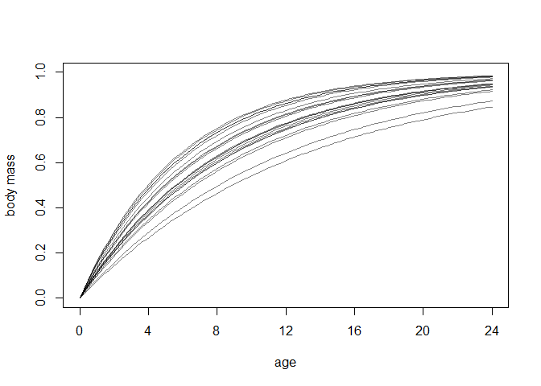<!-- -->

```r
dens(phi)
```

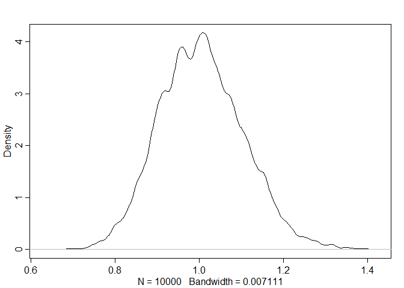<!-- -->

```r
dens(k)
```

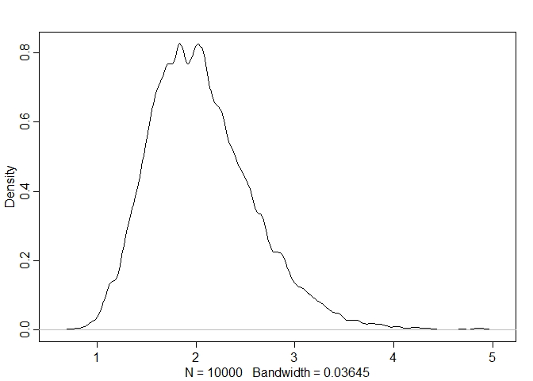<!-- -->

```r
dens(theta)
```

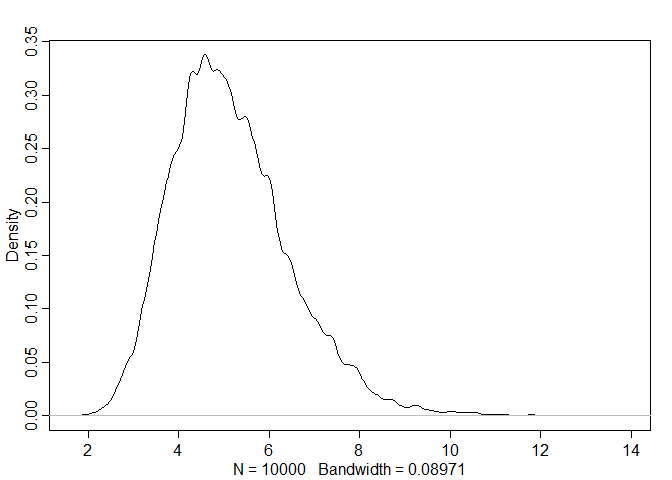<!-- -->

```r
# implied rate of nut opening curve
plot( NULL , xlim=c(0,1.5) , ylim=c(0,1.2) , xaxt="n" , xlab="age" ,
    ylab="nuts per second" )
at <- c(0,0.25,0.5,0.75,1,1.25,1.5)
axis( 1 , at=at , labels=round(at*max(Panda_nuts$age)) )
for ( i in 1:20 ) curve( phi[i]*(1-exp(-k[i]*x))^theta[i] , add=TRUE ,
    col=grau() , lwd=1.5 )
```

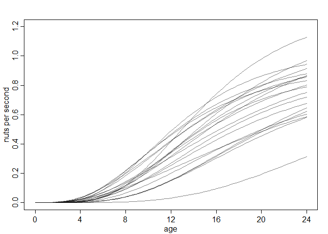<!-- -->


```r
## R code 16.11
dat_list <- list(
    n = as.integer( Panda_nuts$nuts_opened ),
    age = Panda_nuts$age / max(Panda_nuts$age),
    seconds = Panda_nuts$seconds )

m16.4 <- ulam(
    alist(
        n ~ poisson( lambda ),
        lambda <- seconds*phi*(1-exp(-k*age))^theta,
        phi ~ lognormal( log(1) , 0.1 ),
        k ~ lognormal( log(2) , 0.25 ),
        theta ~ lognormal( log(5) , 0.25 )
    ), data=dat_list , chains=4 )
```

```
## 
## SAMPLING FOR MODEL 'fc81d2d8cb9f308e125283324fd5881c' NOW (CHAIN 1).
## Chain 1: 
## Chain 1: Gradient evaluation took 0 seconds
## Chain 1: 1000 transitions using 10 leapfrog steps per transition would take 0 seconds.
## Chain 1: Adjust your expectations accordingly!
## Chain 1: 
## Chain 1: 
## Chain 1: Iteration:   1 / 1000 [  0%]  (Warmup)
## Chain 1: Iteration: 100 / 1000 [ 10%]  (Warmup)
## Chain 1: Iteration: 200 / 1000 [ 20%]  (Warmup)
## Chain 1: Iteration: 300 / 1000 [ 30%]  (Warmup)
## Chain 1: Iteration: 400 / 1000 [ 40%]  (Warmup)
## Chain 1: Iteration: 500 / 1000 [ 50%]  (Warmup)
## Chain 1: Iteration: 501 / 1000 [ 50%]  (Sampling)
## Chain 1: Iteration: 600 / 1000 [ 60%]  (Sampling)
## Chain 1: Iteration: 700 / 1000 [ 70%]  (Sampling)
## Chain 1: Iteration: 800 / 1000 [ 80%]  (Sampling)
## Chain 1: Iteration: 900 / 1000 [ 90%]  (Sampling)
## Chain 1: Iteration: 1000 / 1000 [100%]  (Sampling)
## Chain 1: 
## Chain 1:  Elapsed Time: 0.692 seconds (Warm-up)
## Chain 1:                0.6 seconds (Sampling)
## Chain 1:                1.292 seconds (Total)
## Chain 1: 
## 
## SAMPLING FOR MODEL 'fc81d2d8cb9f308e125283324fd5881c' NOW (CHAIN 2).
## Chain 2: 
## Chain 2: Gradient evaluation took 0.001 seconds
## Chain 2: 1000 transitions using 10 leapfrog steps per transition would take 10 seconds.
## Chain 2: Adjust your expectations accordingly!
## Chain 2: 
## Chain 2: 
## Chain 2: Iteration:   1 / 1000 [  0%]  (Warmup)
## Chain 2: Iteration: 100 / 1000 [ 10%]  (Warmup)
## Chain 2: Iteration: 200 / 1000 [ 20%]  (Warmup)
## Chain 2: Iteration: 300 / 1000 [ 30%]  (Warmup)
## Chain 2: Iteration: 400 / 1000 [ 40%]  (Warmup)
## Chain 2: Iteration: 500 / 1000 [ 50%]  (Warmup)
## Chain 2: Iteration: 501 / 1000 [ 50%]  (Sampling)
## Chain 2: Iteration: 600 / 1000 [ 60%]  (Sampling)
## Chain 2: Iteration: 700 / 1000 [ 70%]  (Sampling)
## Chain 2: Iteration: 800 / 1000 [ 80%]  (Sampling)
## Chain 2: Iteration: 900 / 1000 [ 90%]  (Sampling)
## Chain 2: Iteration: 1000 / 1000 [100%]  (Sampling)
## Chain 2: 
## Chain 2:  Elapsed Time: 0.637 seconds (Warm-up)
## Chain 2:                0.64 seconds (Sampling)
## Chain 2:                1.277 seconds (Total)
## Chain 2: 
## 
## SAMPLING FOR MODEL 'fc81d2d8cb9f308e125283324fd5881c' NOW (CHAIN 3).
## Chain 3: 
## Chain 3: Gradient evaluation took 0 seconds
## Chain 3: 1000 transitions using 10 leapfrog steps per transition would take 0 seconds.
## Chain 3: Adjust your expectations accordingly!
## Chain 3: 
## Chain 3: 
## Chain 3: Iteration:   1 / 1000 [  0%]  (Warmup)
## Chain 3: Iteration: 100 / 1000 [ 10%]  (Warmup)
## Chain 3: Iteration: 200 / 1000 [ 20%]  (Warmup)
## Chain 3: Iteration: 300 / 1000 [ 30%]  (Warmup)
## Chain 3: Iteration: 400 / 1000 [ 40%]  (Warmup)
## Chain 3: Iteration: 500 / 1000 [ 50%]  (Warmup)
## Chain 3: Iteration: 501 / 1000 [ 50%]  (Sampling)
## Chain 3: Iteration: 600 / 1000 [ 60%]  (Sampling)
## Chain 3: Iteration: 700 / 1000 [ 70%]  (Sampling)
## Chain 3: Iteration: 800 / 1000 [ 80%]  (Sampling)
## Chain 3: Iteration: 900 / 1000 [ 90%]  (Sampling)
## Chain 3: Iteration: 1000 / 1000 [100%]  (Sampling)
## Chain 3: 
## Chain 3:  Elapsed Time: 0.804 seconds (Warm-up)
## Chain 3:                1.088 seconds (Sampling)
## Chain 3:                1.892 seconds (Total)
## Chain 3: 
## 
## SAMPLING FOR MODEL 'fc81d2d8cb9f308e125283324fd5881c' NOW (CHAIN 4).
## Chain 4: 
## Chain 4: Gradient evaluation took 0 seconds
## Chain 4: 1000 transitions using 10 leapfrog steps per transition would take 0 seconds.
## Chain 4: Adjust your expectations accordingly!
## Chain 4: 
## Chain 4: 
## Chain 4: Iteration:   1 / 1000 [  0%]  (Warmup)
## Chain 4: Iteration: 100 / 1000 [ 10%]  (Warmup)
## Chain 4: Iteration: 200 / 1000 [ 20%]  (Warmup)
## Chain 4: Iteration: 300 / 1000 [ 30%]  (Warmup)
## Chain 4: Iteration: 400 / 1000 [ 40%]  (Warmup)
## Chain 4: Iteration: 500 / 1000 [ 50%]  (Warmup)
## Chain 4: Iteration: 501 / 1000 [ 50%]  (Sampling)
## Chain 4: Iteration: 600 / 1000 [ 60%]  (Sampling)
## Chain 4: Iteration: 700 / 1000 [ 70%]  (Sampling)
## Chain 4: Iteration: 800 / 1000 [ 80%]  (Sampling)
## Chain 4: Iteration: 900 / 1000 [ 90%]  (Sampling)
## Chain 4: Iteration: 1000 / 1000 [100%]  (Sampling)
## Chain 4: 
## Chain 4:  Elapsed Time: 0.809 seconds (Warm-up)
## Chain 4:                0.811 seconds (Sampling)
## Chain 4:                1.62 seconds (Total)
## Chain 4:
```

```r
precis(m16.4)
```

```
##            mean         sd      5.5%      94.5%    n_eff    Rhat4
## phi   0.8692554 0.04031321 0.8098979  0.9350095 723.8291 1.004534
## k     5.9353794 0.56949697 5.0320625  6.8150768 613.1707 1.003335
## theta 9.7267351 2.02381994 6.9014186 13.2938450 616.8712 1.003492
```


```r
## R code 16.12
post <- extract.samples(m16.4)
plot( NULL , xlim=c(0,1) , ylim=c(0,1.5) , xlab="age" ,
    ylab="nuts per second" , xaxt="n" )
at <- c(0,0.25,0.5,0.75,1,1.25,1.5)
axis( 1 , at=at , labels=round(at*max(Panda_nuts$age)) )

# raw data
pts <- dat_list$n / dat_list$seconds
point_size <- normalize( dat_list$seconds )
points( jitter(dat_list$age) , pts , col=rangi2 , lwd=2 , cex=point_size*3 )

# 30 posterior curves
for ( i in 1:30 ) with( post ,
    curve( phi[i]*(1-exp(-k[i]*x))^theta[i] , add=TRUE , col=grau() ) )
```

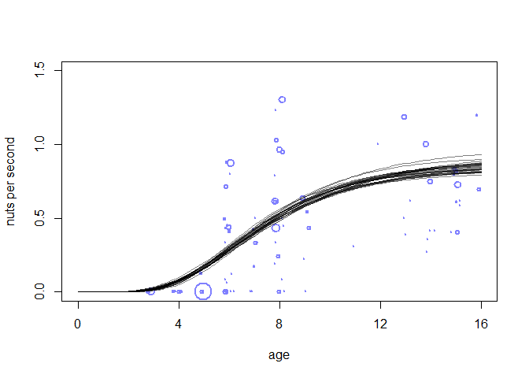<!-- -->

### 16.3.3. Covariates and individual differences.

## 16.4. Population dynamics


```r
## R code 16.13
library(rethinking)
data(Lynx_Hare)
plot( 1:21 , Lynx_Hare[,3] , ylim=c(0,90) , xlab="year" ,
    ylab="thousands of pelts" , xaxt="n" , type="l" , lwd=1.5 )
at <- c(1,11,21)
axis( 1 , at=at , labels=Lynx_Hare$Year[at] )
lines( 1:21 , Lynx_Hare[,2] , lwd=1.5 , col=rangi2 )
points( 1:21 , Lynx_Hare[,3] , bg="black" , col="white" , pch=21 , cex=1.4 )
points( 1:21 , Lynx_Hare[,2] , bg=rangi2 , col="white" , pch=21 , cex=1.4 )
text( 17 , 80 , "Lepus" , pos=2 )
text( 19 , 50 , "Lynx" , pos=2 , col=rangi2 )
```

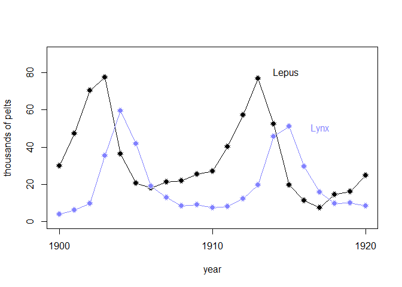<!-- -->

### 16.4.1. The scientific model.

```r
## R code 16.14
sim_lynx_hare <- function( n_steps , init , theta , dt=0.002 ) {
    L <- rep(NA,n_steps)
    H <- rep(NA,n_steps)
    L[1] <- init[1]
    H[1] <- init[2]
    for ( i in 2:n_steps ) {
        H[i] <- H[i-1] + dt*H[i-1]*( theta[1] - theta[2]*L[i-1] )
        L[i] <- L[i-1] + dt*L[i-1]*( theta[3]*H[i-1] - theta[4] )
    }
    return( cbind(L,H) )
}
```


```r
## R code 16.15
theta <- c( 0.5 , 0.05 , 0.025 , 0.5 )
z <- sim_lynx_hare( 1e4 , as.numeric(Lynx_Hare[1,2:3]) , theta )

plot( z[,2] , type="l" , ylim=c(0,max(z[,2])) , lwd=2 , xaxt="n" ,
    ylab="number (thousands)" , xlab="" )
lines( z[,1] , col=rangi2 , lwd=2 )
mtext( "time" , 1 )
```

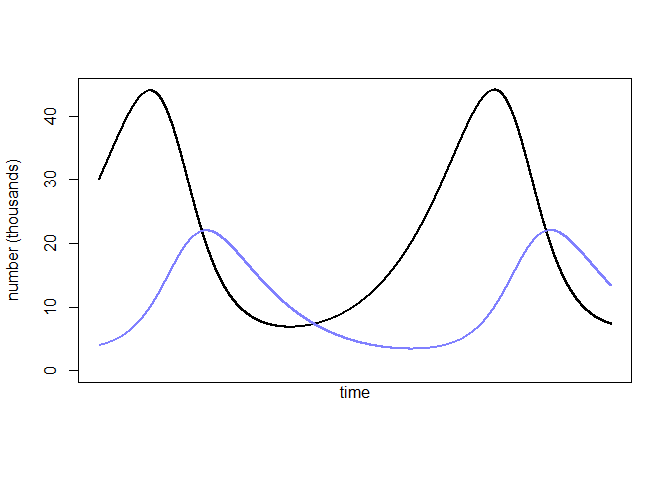<!-- -->
### 16.4.2. The statistical model.


```r
## R code 16.16
N <- 1e4
Ht <- 1e4
p <- rbeta(N,2,18)
h <- rbinom( N , size=Ht , prob=p )
h <- round( h/1000 , 2 )
dens( h , xlab="thousand of pelts" , lwd=2 )
```

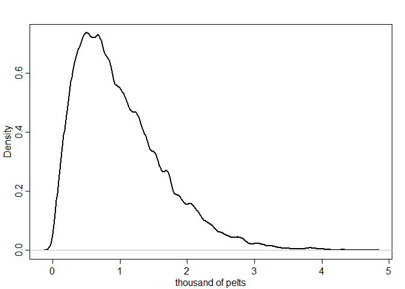<!-- -->


```r
## R code 16.17
data(Lynx_Hare_model)
cat(Lynx_Hare_model)
```

```
## functions {
##   real[] dpop_dt( real t,                 // time
##                 real[] pop_init,          // initial state {lynx, hares}
##                 real[] theta,             // parameters
##                 real[] x_r, int[] x_i) {  // unused
##     real L = pop_init[1];
##     real H = pop_init[2];
##     real bh = theta[1];
##     real mh = theta[2];
##     real ml = theta[3];
##     real bl = theta[4];
##     // differential equations
##     real dH_dt = (bh - mh * L) * H;
##     real dL_dt = (bl * H - ml) * L;
##     return { dL_dt , dH_dt };
##   }
## }
## data {
##   int<lower=0> N;              // number of measurement times
##   real<lower=0> pelts[N,2];    // measured populations
## }
## transformed data{
##   real times_measured[N-1];    // N-1 because first time is initial state
##   for ( i in 2:N ) times_measured[i-1] = i;
## }
## parameters {
##   real<lower=0> theta[4];      // { bh, mh, ml, bl }
##   real<lower=0> pop_init[2];   // initial population state
##   real<lower=0> sigma[2];      // measurement errors
##   real<lower=0,upper=1> p[2];  // trap rate
## }
## transformed parameters {
##   real pop[N, 2];
##   pop[1,1] = pop_init[1];
##   pop[1,2] = pop_init[2];
##   pop[2:N,1:2] = integrate_ode_rk45(
##     dpop_dt, pop_init, 0, times_measured, theta,
##     rep_array(0.0, 0), rep_array(0, 0),
##     1e-5, 1e-3, 5e2);
## }
## model {
##   // priors
##   theta[{1,3}] ~ normal( 1 , 0.5 );    // bh,ml
##   theta[{2,4}] ~ normal( 0.05, 0.05 ); // mh,bl
##   sigma ~ exponential( 1 );
##   pop_init ~ lognormal( log(10) , 1 );
##   p ~ beta(40,200);
##   // observation model
##   // connect latent population state to observed pelts
##   for ( t in 1:N )
##     for ( k in 1:2 )
##       pelts[t,k] ~ lognormal( log(pop[t,k]*p[k]) , sigma[k] );
## }
## generated quantities {
##   real pelts_pred[N,2];
##   for ( t in 1:N )
##     for ( k in 1:2 )
##       pelts_pred[t,k] = lognormal_rng( log(pop[t,k]*p[k]) , sigma[k] );
## }
```


```r
## R code 16.18
dat_list <- list(
    N = nrow(Lynx_Hare),
    pelts = Lynx_Hare[,2:3] )

m16.5 <- stan( model_code=Lynx_Hare_model , data=dat_list , chains=3 , cores=3 ,
    control=list( adapt_delta=0.95 ) )
```


```r
## R code 16.19
post <- extract.samples(m16.5)
pelts <- dat_list$pelts
plot( 1:21 , pelts[,2] , pch=16 , ylim=c(0,120) , xlab="year" ,
    ylab="thousands of pelts" , xaxt="n" )
at <- c(1,11,21)
axis( 1 , at=at , labels=Lynx_Hare$Year[at] )
points( 1:21 , pelts[,1] , col=rangi2 , pch=16 )
# 21 time series from posterior
for ( s in 1:21 ) {
    lines( 1:21 , post$pelts_pred[s,,2] , col=col.alpha("black",0.2) , lwd=2 )
    lines( 1:21 , post$pelts_pred[s,,1] , col=col.alpha(rangi2,0.3) , lwd=2 )
}
# text labels
text( 17 , 90 , "Lepus" , pos=2 )
text( 19 , 50 , "Lynx" , pos=2 , col=rangi2 )
```

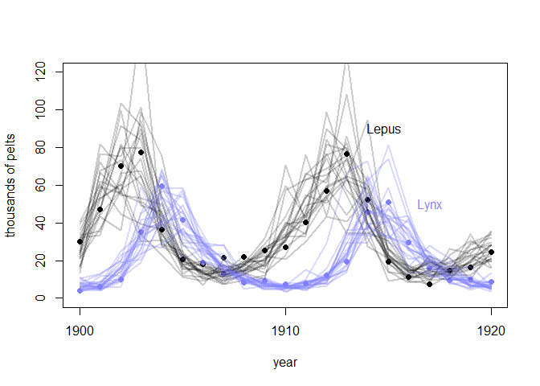<!-- -->


```r
## R code 16.20
plot( NULL , pch=16 , xlim=c(1,21) , ylim=c(0,500) , xlab="year" ,
    ylab="thousands of animals" , xaxt="n" )
at <- c(1,11,21)
axis( 1 , at=at , labels=Lynx_Hare$Year[at] )
for ( s in 1:21 ) {
    lines( 1:21 , post$pop[s,,2] , col=col.alpha("black",0.2) , lwd=2 )
    lines( 1:21 , post$pop[s,,1] , col=col.alpha(rangi2,0.4) , lwd=2 )
}
```

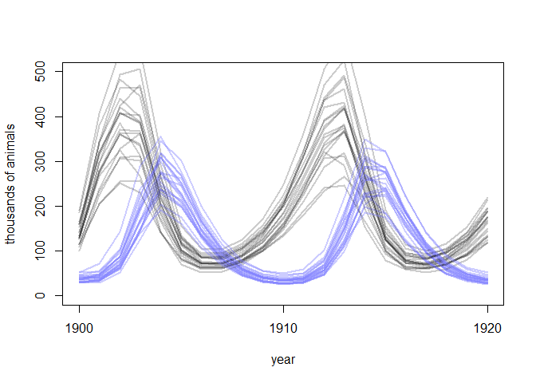<!-- -->

### 16.4.3. Lynx lessons.
## 16.6. Practice

#### 16M3 Use prior predictive simulations to investigate the Lynx-hare model. Begin with the priors in the chapter. Which population dynamics do these produce? Can you suggest any improvements to the priors, on the basis of your simulations?


```r
## R code 16.14
sim_lynx_hare <- function( n_steps , init , theta , dt=0.002 ) {
    L <- rep(NA,n_steps)
    H <- rep(NA,n_steps)
    L[1] <- init[1]
    H[1] <- init[2]
    for ( i in 2:n_steps ) {
        H[i] <- H[i-1] + dt*H[i-1]*( theta[1] - theta[2]*L[i-1] )
        L[i] <- L[i-1] + dt*L[i-1]*( theta[3]*H[i-1] - theta[4] )
    }
    return( cbind(L,H) )
}
```

> try different number


```r
## R code 16.16
N <- 1e4
Ht <- 1e4
p <- rbeta(N,2,18)
h <- rbinom( N , size=Ht , prob=p )
h <- round( h/1000 , 2 )
```


```r
## R code 16.15
theta <- c( 0.5 , 0.05 , 0.025 , 0.5 )
p_16M3list = list()
for (i in 1:10) {
    z <- as.matrix(sim_lynx_hare( 1e4 , c(rlnorm(1, log(10), 1), rlnorm(1, log(10), 1)) , theta ))
    p_16M3list[[i]] = z
}

plot( p_16M3list[[1]][,2] , type="l" , ylim=c(0,max(z[,2])) , lwd=2 , xaxt="n" , ylab="number (thousands)" , xlab="" )
for (i in 1:10) {
    lines( p_16M3list[[i]][,1] , col=rangi2 , lwd=2 )
    lines( p_16M3list[[i]][,2] , lwd=2 )
}
mtext( "time" , 1 )
```

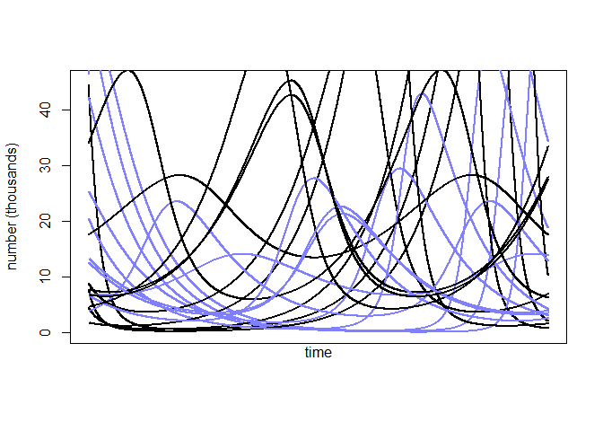<!-- -->


#### 16H1 Modify the Panda nut opening model so that male and female chimpanzees have different maximum adult body mass. The sex variable in data(Panda_nuts) provides the information you need. Be sure to incorporate the fact that you know, prior to seeing the data, that males are on average larger than females at maturity.


```r
data(Panda_nuts)
str(Panda_nuts)
```

```
## 'data.frame':	84 obs. of  7 variables:
##  $ chimpanzee : int  11 11 18 18 18 11 11 17 7 1 ...
##  $ age        : int  3 3 4 4 4 4 4 5 5 5 ...
##  $ sex        : Factor w/ 2 levels "f","m": 2 2 1 1 1 2 2 1 2 2 ...
##  $ hammer     : Factor w/ 4 levels "G","L","Q","wood": 1 1 4 1 2 3 3 4 1 2 ...
##  $ nuts_opened: int  0 0 0 0 0 0 0 0 3 0 ...
##  $ seconds    : num  61 37 20 14 13 24 30.5 135 24 13 ...
##  $ help       : Factor w/ 2 levels "N","y": 1 1 1 2 1 1 1 1 1 1 ...
```

```r
## R code 16.11
dat_list <- list(
    n = as.integer( Panda_nuts$nuts_opened ),
    age = Panda_nuts$age / max(Panda_nuts$age),
    seconds = Panda_nuts$seconds,
    sid = ifelse( Panda_nuts$sex=="m" , 1 , 2))

m16H1 <- ulam(
    alist(
        n ~ poisson( lambda ),
        lambda <- a[sid]+seconds*phi*(1-exp(-k*age))^theta,
        a[sid] ~ dnorm( 0 , 1.5 ),
        phi ~ lognormal( log(1) , 0.1 ),
        k ~ lognormal( log(2) , 0.25 ),
        theta ~ lognormal( log(5) , 0.25 )
    ), data=dat_list , chains=4 )
```

```
## 
## SAMPLING FOR MODEL 'b81c5a4a29f73f135d92ca94963b32bd' NOW (CHAIN 1).
## Chain 1: 
## Chain 1: Gradient evaluation took 0 seconds
## Chain 1: 1000 transitions using 10 leapfrog steps per transition would take 0 seconds.
## Chain 1: Adjust your expectations accordingly!
## Chain 1: 
## Chain 1: 
## Chain 1: Iteration:   1 / 1000 [  0%]  (Warmup)
## Chain 1: Iteration: 100 / 1000 [ 10%]  (Warmup)
## Chain 1: Iteration: 200 / 1000 [ 20%]  (Warmup)
## Chain 1: Iteration: 300 / 1000 [ 30%]  (Warmup)
## Chain 1: Iteration: 400 / 1000 [ 40%]  (Warmup)
## Chain 1: Iteration: 500 / 1000 [ 50%]  (Warmup)
## Chain 1: Iteration: 501 / 1000 [ 50%]  (Sampling)
## Chain 1: Iteration: 600 / 1000 [ 60%]  (Sampling)
## Chain 1: Iteration: 700 / 1000 [ 70%]  (Sampling)
## Chain 1: Iteration: 800 / 1000 [ 80%]  (Sampling)
## Chain 1: Iteration: 900 / 1000 [ 90%]  (Sampling)
## Chain 1: Iteration: 1000 / 1000 [100%]  (Sampling)
## Chain 1: 
## Chain 1:  Elapsed Time: 3.727 seconds (Warm-up)
## Chain 1:                1.837 seconds (Sampling)
## Chain 1:                5.564 seconds (Total)
## Chain 1: 
## 
## SAMPLING FOR MODEL 'b81c5a4a29f73f135d92ca94963b32bd' NOW (CHAIN 2).
## Chain 2: Rejecting initial value:
## Chain 2:   Error evaluating the log probability at the initial value.
## Chain 2: Exception: poisson_lpmf: Rate parameter[1] is -1.09492, but must be >= 0!  (in 'model273021d7713c_b81c5a4a29f73f135d92ca94963b32bd' at line 22)
## 
## Chain 2: 
## Chain 2: Gradient evaluation took 0.001 seconds
## Chain 2: 1000 transitions using 10 leapfrog steps per transition would take 10 seconds.
## Chain 2: Adjust your expectations accordingly!
## Chain 2: 
## Chain 2: 
## Chain 2: Iteration:   1 / 1000 [  0%]  (Warmup)
## Chain 2: Iteration: 100 / 1000 [ 10%]  (Warmup)
## Chain 2: Iteration: 200 / 1000 [ 20%]  (Warmup)
## Chain 2: Iteration: 300 / 1000 [ 30%]  (Warmup)
## Chain 2: Iteration: 400 / 1000 [ 40%]  (Warmup)
## Chain 2: Iteration: 500 / 1000 [ 50%]  (Warmup)
## Chain 2: Iteration: 501 / 1000 [ 50%]  (Sampling)
## Chain 2: Iteration: 600 / 1000 [ 60%]  (Sampling)
## Chain 2: Iteration: 700 / 1000 [ 70%]  (Sampling)
## Chain 2: Iteration: 800 / 1000 [ 80%]  (Sampling)
## Chain 2: Iteration: 900 / 1000 [ 90%]  (Sampling)
## Chain 2: Iteration: 1000 / 1000 [100%]  (Sampling)
## Chain 2: 
## Chain 2:  Elapsed Time: 2.153 seconds (Warm-up)
## Chain 2:                2.219 seconds (Sampling)
## Chain 2:                4.372 seconds (Total)
## Chain 2: 
## 
## SAMPLING FOR MODEL 'b81c5a4a29f73f135d92ca94963b32bd' NOW (CHAIN 3).
## Chain 3: Rejecting initial value:
## Chain 3:   Error evaluating the log probability at the initial value.
## Chain 3: Exception: poisson_lpmf: Rate parameter[13] is -0.132048, but must be >= 0!  (in 'model273021d7713c_b81c5a4a29f73f135d92ca94963b32bd' at line 22)
## 
## Chain 3: Rejecting initial value:
## Chain 3:   Error evaluating the log probability at the initial value.
## Chain 3: Exception: poisson_lpmf: Rate parameter[3] is -0.865618, but must be >= 0!  (in 'model273021d7713c_b81c5a4a29f73f135d92ca94963b32bd' at line 22)
## 
## Chain 3: 
## Chain 3: Gradient evaluation took 0 seconds
## Chain 3: 1000 transitions using 10 leapfrog steps per transition would take 0 seconds.
## Chain 3: Adjust your expectations accordingly!
## Chain 3: 
## Chain 3: 
## Chain 3: Iteration:   1 / 1000 [  0%]  (Warmup)
## Chain 3: Iteration: 100 / 1000 [ 10%]  (Warmup)
## Chain 3: Iteration: 200 / 1000 [ 20%]  (Warmup)
## Chain 3: Iteration: 300 / 1000 [ 30%]  (Warmup)
## Chain 3: Iteration: 400 / 1000 [ 40%]  (Warmup)
## Chain 3: Iteration: 500 / 1000 [ 50%]  (Warmup)
## Chain 3: Iteration: 501 / 1000 [ 50%]  (Sampling)
## Chain 3: Iteration: 600 / 1000 [ 60%]  (Sampling)
## Chain 3: Iteration: 700 / 1000 [ 70%]  (Sampling)
## Chain 3: Iteration: 800 / 1000 [ 80%]  (Sampling)
## Chain 3: Iteration: 900 / 1000 [ 90%]  (Sampling)
## Chain 3: Iteration: 1000 / 1000 [100%]  (Sampling)
## Chain 3: 
## Chain 3:  Elapsed Time: 2.253 seconds (Warm-up)
## Chain 3:                2.497 seconds (Sampling)
## Chain 3:                4.75 seconds (Total)
## Chain 3: 
## 
## SAMPLING FOR MODEL 'b81c5a4a29f73f135d92ca94963b32bd' NOW (CHAIN 4).
## Chain 4: 
## Chain 4: Gradient evaluation took 0 seconds
## Chain 4: 1000 transitions using 10 leapfrog steps per transition would take 0 seconds.
## Chain 4: Adjust your expectations accordingly!
## Chain 4: 
## Chain 4: 
## Chain 4: Iteration:   1 / 1000 [  0%]  (Warmup)
## Chain 4: Iteration: 100 / 1000 [ 10%]  (Warmup)
## Chain 4: Iteration: 200 / 1000 [ 20%]  (Warmup)
## Chain 4: Iteration: 300 / 1000 [ 30%]  (Warmup)
## Chain 4: Iteration: 400 / 1000 [ 40%]  (Warmup)
## Chain 4: Iteration: 500 / 1000 [ 50%]  (Warmup)
## Chain 4: Iteration: 501 / 1000 [ 50%]  (Sampling)
## Chain 4: Iteration: 600 / 1000 [ 60%]  (Sampling)
## Chain 4: Iteration: 700 / 1000 [ 70%]  (Sampling)
## Chain 4: Iteration: 800 / 1000 [ 80%]  (Sampling)
## Chain 4: Iteration: 900 / 1000 [ 90%]  (Sampling)
## Chain 4: Iteration: 1000 / 1000 [100%]  (Sampling)
## Chain 4: 
## Chain 4:  Elapsed Time: 1.715 seconds (Warm-up)
## Chain 4:                3.083 seconds (Sampling)
## Chain 4:                4.798 seconds (Total)
## Chain 4:
```

```
## Warning: There were 1957 divergent transitions after warmup. See
## http://mc-stan.org/misc/warnings.html#divergent-transitions-after-warmup
## to find out why this is a problem and how to eliminate them.
```

```
## Warning: Examine the pairs() plot to diagnose sampling problems
```

```
## Warning: The largest R-hat is 2.15, indicating chains have not mixed.
## Running the chains for more iterations may help. See
## http://mc-stan.org/misc/warnings.html#r-hat
```

```
## Warning: Bulk Effective Samples Size (ESS) is too low, indicating posterior means and medians may be unreliable.
## Running the chains for more iterations may help. See
## http://mc-stan.org/misc/warnings.html#bulk-ess
```

```
## Warning: Tail Effective Samples Size (ESS) is too low, indicating posterior variances and tail quantiles may be unreliable.
## Running the chains for more iterations may help. See
## http://mc-stan.org/misc/warnings.html#tail-ess
```

```r
precis(m16H1,depth=2)
```

```
##             mean         sd       5.5%      94.5%     n_eff    Rhat4
## a[1]  -0.2255838 0.58447809 -1.0619554  0.6474774  2.437766 3.304907
## a[2]  -1.2381861 0.16422437 -1.5430560 -0.9884279  6.620537 1.491373
## phi    0.8801237 0.03602955  0.8218839  0.9322582 11.943267 1.267003
## k      5.3474363 0.49244598  4.4572536  6.1023202  7.862356 2.002175
## theta  7.1432875 1.12686538  5.0684659  9.0915935  9.113908 1.820416
```

#### 16H2 Now return to the Panda nut model and try to incorporate individual differences. There are two parameters, ϕ and k, which plausibly vary by individual. Pick one of these, allow it to vary by individual, and use partial pooling to avoid overfitting. The variable chimpanzee in data(Panda_nuts) tells you which observations belong to which individuals.


```r
data(Panda_nuts)
str(Panda_nuts)
```

```
## 'data.frame':	84 obs. of  7 variables:
##  $ chimpanzee : int  11 11 18 18 18 11 11 17 7 1 ...
##  $ age        : int  3 3 4 4 4 4 4 5 5 5 ...
##  $ sex        : Factor w/ 2 levels "f","m": 2 2 1 1 1 2 2 1 2 2 ...
##  $ hammer     : Factor w/ 4 levels "G","L","Q","wood": 1 1 4 1 2 3 3 4 1 2 ...
##  $ nuts_opened: int  0 0 0 0 0 0 0 0 3 0 ...
##  $ seconds    : num  61 37 20 14 13 24 30.5 135 24 13 ...
##  $ help       : Factor w/ 2 levels "N","y": 1 1 1 2 1 1 1 1 1 1 ...
```


```r
## R code 16.11
dat_list <- list(
    n = as.integer( Panda_nuts$nuts_opened ),
    age = Panda_nuts$age / max(Panda_nuts$age),
    seconds = Panda_nuts$seconds,
    cid = Panda_nuts$chimpanzee)

m16H2 <- ulam(
    alist(
        n ~ poisson( lambda ),
        lambda <- seconds*phi[cid]*(1-exp(-k*age))^theta,
        phi[cid] ~ lognormal( phi_bar , sigma_phi ),
        phi_bar ~ lognormal( log(1) , 0.1 ),
        sigma_phi ~ dexp(1),
        k ~ lognormal( log(2) , 0.25 ),
        theta ~ lognormal( log(5) , 0.25 )
    ), data=dat_list , chains=4 )
```

```
## 
## SAMPLING FOR MODEL 'e34a2279bf92fed161ac21c72768a2e6' NOW (CHAIN 1).
## Chain 1: 
## Chain 1: Gradient evaluation took 0 seconds
## Chain 1: 1000 transitions using 10 leapfrog steps per transition would take 0 seconds.
## Chain 1: Adjust your expectations accordingly!
## Chain 1: 
## Chain 1: 
## Chain 1: Iteration:   1 / 1000 [  0%]  (Warmup)
## Chain 1: Iteration: 100 / 1000 [ 10%]  (Warmup)
## Chain 1: Iteration: 200 / 1000 [ 20%]  (Warmup)
## Chain 1: Iteration: 300 / 1000 [ 30%]  (Warmup)
## Chain 1: Iteration: 400 / 1000 [ 40%]  (Warmup)
## Chain 1: Iteration: 500 / 1000 [ 50%]  (Warmup)
## Chain 1: Iteration: 501 / 1000 [ 50%]  (Sampling)
## Chain 1: Iteration: 600 / 1000 [ 60%]  (Sampling)
## Chain 1: Iteration: 700 / 1000 [ 70%]  (Sampling)
## Chain 1: Iteration: 800 / 1000 [ 80%]  (Sampling)
## Chain 1: Iteration: 900 / 1000 [ 90%]  (Sampling)
## Chain 1: Iteration: 1000 / 1000 [100%]  (Sampling)
## Chain 1: 
## Chain 1:  Elapsed Time: 7.958 seconds (Warm-up)
## Chain 1:                5.894 seconds (Sampling)
## Chain 1:                13.852 seconds (Total)
## Chain 1: 
## 
## SAMPLING FOR MODEL 'e34a2279bf92fed161ac21c72768a2e6' NOW (CHAIN 2).
## Chain 2: 
## Chain 2: Gradient evaluation took 0 seconds
## Chain 2: 1000 transitions using 10 leapfrog steps per transition would take 0 seconds.
## Chain 2: Adjust your expectations accordingly!
## Chain 2: 
## Chain 2: 
## Chain 2: Iteration:   1 / 1000 [  0%]  (Warmup)
## Chain 2: Iteration: 100 / 1000 [ 10%]  (Warmup)
## Chain 2: Iteration: 200 / 1000 [ 20%]  (Warmup)
## Chain 2: Iteration: 300 / 1000 [ 30%]  (Warmup)
## Chain 2: Iteration: 400 / 1000 [ 40%]  (Warmup)
## Chain 2: Iteration: 500 / 1000 [ 50%]  (Warmup)
## Chain 2: Iteration: 501 / 1000 [ 50%]  (Sampling)
## Chain 2: Iteration: 600 / 1000 [ 60%]  (Sampling)
## Chain 2: Iteration: 700 / 1000 [ 70%]  (Sampling)
## Chain 2: Iteration: 800 / 1000 [ 80%]  (Sampling)
## Chain 2: Iteration: 900 / 1000 [ 90%]  (Sampling)
## Chain 2: Iteration: 1000 / 1000 [100%]  (Sampling)
## Chain 2: 
## Chain 2:  Elapsed Time: 6.941 seconds (Warm-up)
## Chain 2:                2.876 seconds (Sampling)
## Chain 2:                9.817 seconds (Total)
## Chain 2: 
## 
## SAMPLING FOR MODEL 'e34a2279bf92fed161ac21c72768a2e6' NOW (CHAIN 3).
## Chain 3: 
## Chain 3: Gradient evaluation took 0 seconds
## Chain 3: 1000 transitions using 10 leapfrog steps per transition would take 0 seconds.
## Chain 3: Adjust your expectations accordingly!
## Chain 3: 
## Chain 3: 
## Chain 3: Iteration:   1 / 1000 [  0%]  (Warmup)
## Chain 3: Iteration: 100 / 1000 [ 10%]  (Warmup)
## Chain 3: Iteration: 200 / 1000 [ 20%]  (Warmup)
## Chain 3: Iteration: 300 / 1000 [ 30%]  (Warmup)
## Chain 3: Iteration: 400 / 1000 [ 40%]  (Warmup)
## Chain 3: Iteration: 500 / 1000 [ 50%]  (Warmup)
## Chain 3: Iteration: 501 / 1000 [ 50%]  (Sampling)
## Chain 3: Iteration: 600 / 1000 [ 60%]  (Sampling)
## Chain 3: Iteration: 700 / 1000 [ 70%]  (Sampling)
## Chain 3: Iteration: 800 / 1000 [ 80%]  (Sampling)
## Chain 3: Iteration: 900 / 1000 [ 90%]  (Sampling)
## Chain 3: Iteration: 1000 / 1000 [100%]  (Sampling)
## Chain 3: 
## Chain 3:  Elapsed Time: 4.513 seconds (Warm-up)
## Chain 3:                3.211 seconds (Sampling)
## Chain 3:                7.724 seconds (Total)
## Chain 3: 
## 
## SAMPLING FOR MODEL 'e34a2279bf92fed161ac21c72768a2e6' NOW (CHAIN 4).
## Chain 4: 
## Chain 4: Gradient evaluation took 0 seconds
## Chain 4: 1000 transitions using 10 leapfrog steps per transition would take 0 seconds.
## Chain 4: Adjust your expectations accordingly!
## Chain 4: 
## Chain 4: 
## Chain 4: Iteration:   1 / 1000 [  0%]  (Warmup)
## Chain 4: Iteration: 100 / 1000 [ 10%]  (Warmup)
## Chain 4: Iteration: 200 / 1000 [ 20%]  (Warmup)
## Chain 4: Iteration: 300 / 1000 [ 30%]  (Warmup)
## Chain 4: Iteration: 400 / 1000 [ 40%]  (Warmup)
## Chain 4: Iteration: 500 / 1000 [ 50%]  (Warmup)
## Chain 4: Iteration: 501 / 1000 [ 50%]  (Sampling)
## Chain 4: Iteration: 600 / 1000 [ 60%]  (Sampling)
## Chain 4: Iteration: 700 / 1000 [ 70%]  (Sampling)
## Chain 4: Iteration: 800 / 1000 [ 80%]  (Sampling)
## Chain 4: Iteration: 900 / 1000 [ 90%]  (Sampling)
## Chain 4: Iteration: 1000 / 1000 [100%]  (Sampling)
## Chain 4: 
## Chain 4:  Elapsed Time: 4.716 seconds (Warm-up)
## Chain 4:                3.412 seconds (Sampling)
## Chain 4:                8.128 seconds (Total)
## Chain 4:
```

```
## Warning: The largest R-hat is 1.05, indicating chains have not mixed.
## Running the chains for more iterations may help. See
## http://mc-stan.org/misc/warnings.html#r-hat
```

```
## Warning: Bulk Effective Samples Size (ESS) is too low, indicating posterior means and medians may be unreliable.
## Running the chains for more iterations may help. See
## http://mc-stan.org/misc/warnings.html#bulk-ess
```

```
## Warning: Tail Effective Samples Size (ESS) is too low, indicating posterior variances and tail quantiles may be unreliable.
## Running the chains for more iterations may help. See
## http://mc-stan.org/misc/warnings.html#tail-ess
```

```r
precis(m16H2,depth=2)
```

```
##                mean         sd        5.5%      94.5%      n_eff    Rhat4
## phi[1]    0.5389120 0.76038136 0.013580591  1.9557222  203.29156 1.015462
## phi[2]    0.8585090 0.73972002 0.166052188  2.1681277  128.93938 1.023845
## phi[3]    0.6414727 0.54099286 0.130796459  1.6974732  110.03039 1.031383
## phi[4]    0.3341676 0.35642681 0.031916476  0.9774996  159.30113 1.023395
## phi[5]    1.4943395 0.90399275 0.512330435  3.1463424  132.54114 1.027731
## phi[6]    1.7007320 0.69854265 0.915669293  3.0697289   78.52750 1.045513
## phi[7]    0.5478794 0.46968181 0.099144534  1.4753660  112.52292 1.034794
## phi[8]    1.0867301 0.79857918 0.281668699  2.6584215  131.92679 1.023097
## phi[9]    4.9182361 3.08022870 1.614090167 10.7636906   72.89156 1.051974
## phi[10]   1.4622586 0.65049841 0.729973919  2.7603423   86.86049 1.040724
## phi[11]   0.2372007 0.32786652 0.003959192  0.9136099  150.83773 1.025367
## phi[12]   3.0589644 1.46440501 1.387260643  5.8140958   78.65535 1.046210
## phi[13]   0.1960590 0.27158708 0.003448211  0.6981185  144.61725 1.024382
## phi[14]   2.8751271 1.63376289 1.027840884  5.8864652  101.24156 1.037851
## phi[15]   3.9279427 2.84212202 0.994995087  9.3872099   85.88838 1.044230
## phi[16]   0.5174723 0.42868769 0.104186413  1.3437059  121.93761 1.032045
## phi[17]   0.1415306 0.21033087 0.001824102  0.5074774  158.31549 1.020930
## phi[18]   0.4245340 0.63469384 0.006084133  1.6173954  173.20349 1.019106
## phi[19]   2.9574926 1.81583449 0.998134563  6.3007001   73.63371 1.051391
## phi[20]   1.4563796 0.62154117 0.748598578  2.6246325   73.21931 1.049208
## phi[21]   1.0378827 0.69036835 0.304450987  2.3421820  147.38015 1.020533
## phi[22]   0.3571710 0.52685436 0.006740063  1.3585178  198.87851 1.017613
## phi_bar   0.9369205 0.08877208 0.802584716  1.0783511 1265.66655 1.001485
## sigma_phi 2.1276785 0.80196350 1.022059988  3.5419414   73.82744 1.044314
## k         1.8480180 0.76098504 0.985910209  3.2759098   75.25350 1.044027
## theta     2.8084252 0.44471130 2.181987056  3.5503436  863.00873 1.001077
```

#### 16H3 The chapter asserts that a typical, geocentric time series model might be one that uses lag variables. Here you’ll fit such a model and compare it to ODE model in the chapter. An autoregressive time series uses earlier values of the state variables to predict new values of the same variables. These earlier values are called lag variables. You can construct the lag variables here with:

```r
## R code 16.21
data(Lynx_Hare)
dat_ar1 <- list(
    L = Lynx_Hare$Lynx[2:21],
    L_lag1 = Lynx_Hare$Lynx[1:20],
    H = Lynx_Hare$Hare[2:21],
    H_lag1 = Lynx_Hare$Hare[1:20] )
```

#### Now you can use L_lag1 and H_lag1 as predictors of the outcomes L and H. Like this:
L t ∼ Log-Normal(log µL,t, σL)
µL,t = αL + βLL L t−1 + βLH H t−1
H t ∼ Log-Normal(log µH,t, σH)
µH,t = αH + βHH H t−1 + βHL L t−1
#### where L t−1 and H t−1 are the lag variables. Use ulam() to fit this model. Be careful of the priors of the α and β parameters. Compare the posterior predictions of the autoregressive model to the ODE model in the chapter. How do the predictions diff er? Can you explain why, using the structures of the models?


```r
m16H3 <- ulam(
    alist(
        Lt ~ lognormal(log(u_Lt), sigma_L),
        u_Lt <- a_L + b_LL * L_lag1 + b_LH * H_lag1,
        Ht ~ lognormal(log(u_Ht), sigma_H),
        u_Ht <- a_H + b_HH * H_lag1 + b_HL * L_lag1,
        c(sigma_L, sigma_H) ~ dexp(1),
        c(a_L, a_H) ~ normal(0, 1),
        c(b_LL, b_LH, b_HH, b_HL) ~ normal(0, 1)
        ), data=dat_ar1 , chains=4, cores = 1)
```

```
## 
## SAMPLING FOR MODEL '429cc001f9ba411699661c806f821043' NOW (CHAIN 1).
## Chain 1: Rejecting initial value:
## Chain 1:   Error evaluating the log probability at the initial value.
## Chain 1: Exception: lognormal_lpdf: Location parameter[5] is nan, but must be finite!  (in 'model27303256fe3_429cc001f9ba411699661c806f821043' at line 33)
## 
## Chain 1: 
## Chain 1: Gradient evaluation took 0 seconds
## Chain 1: 1000 transitions using 10 leapfrog steps per transition would take 0 seconds.
## Chain 1: Adjust your expectations accordingly!
## Chain 1: 
## Chain 1: 
## Chain 1: Iteration:   1 / 1000 [  0%]  (Warmup)
## Chain 1: Iteration: 100 / 1000 [ 10%]  (Warmup)
## Chain 1: Iteration: 200 / 1000 [ 20%]  (Warmup)
## Chain 1: Iteration: 300 / 1000 [ 30%]  (Warmup)
## Chain 1: Iteration: 400 / 1000 [ 40%]  (Warmup)
## Chain 1: Iteration: 500 / 1000 [ 50%]  (Warmup)
## Chain 1: Iteration: 501 / 1000 [ 50%]  (Sampling)
## Chain 1: Iteration: 600 / 1000 [ 60%]  (Sampling)
## Chain 1: Iteration: 700 / 1000 [ 70%]  (Sampling)
## Chain 1: Iteration: 800 / 1000 [ 80%]  (Sampling)
## Chain 1: Iteration: 900 / 1000 [ 90%]  (Sampling)
## Chain 1: Iteration: 1000 / 1000 [100%]  (Sampling)
## Chain 1: 
## Chain 1:  Elapsed Time: 13.565 seconds (Warm-up)
## Chain 1:                6.08 seconds (Sampling)
## Chain 1:                19.645 seconds (Total)
## Chain 1: 
## 
## SAMPLING FOR MODEL '429cc001f9ba411699661c806f821043' NOW (CHAIN 2).
## Chain 2: Rejecting initial value:
## Chain 2:   Error evaluating the log probability at the initial value.
## Chain 2: Exception: lognormal_lpdf: Location parameter[1] is nan, but must be finite!  (in 'model27303256fe3_429cc001f9ba411699661c806f821043' at line 33)
## 
## Chain 2: Rejecting initial value:
## Chain 2:   Error evaluating the log probability at the initial value.
## Chain 2: Exception: lognormal_lpdf: Location parameter[1] is nan, but must be finite!  (in 'model27303256fe3_429cc001f9ba411699661c806f821043' at line 37)
## 
## Chain 2: Rejecting initial value:
## Chain 2:   Error evaluating the log probability at the initial value.
## Chain 2: Exception: lognormal_lpdf: Location parameter[1] is nan, but must be finite!  (in 'model27303256fe3_429cc001f9ba411699661c806f821043' at line 37)
## 
## Chain 2: Rejecting initial value:
## Chain 2:   Error evaluating the log probability at the initial value.
## Chain 2: Exception: lognormal_lpdf: Location parameter[1] is nan, but must be finite!  (in 'model27303256fe3_429cc001f9ba411699661c806f821043' at line 37)
## 
## Chain 2: Rejecting initial value:
## Chain 2:   Error evaluating the log probability at the initial value.
## Chain 2: Exception: lognormal_lpdf: Location parameter[1] is nan, but must be finite!  (in 'model27303256fe3_429cc001f9ba411699661c806f821043' at line 33)
## 
## Chain 2: Rejecting initial value:
## Chain 2:   Error evaluating the log probability at the initial value.
## Chain 2: Exception: lognormal_lpdf: Location parameter[1] is nan, but must be finite!  (in 'model27303256fe3_429cc001f9ba411699661c806f821043' at line 33)
## 
## Chain 2: Rejecting initial value:
## Chain 2:   Error evaluating the log probability at the initial value.
## Chain 2: Exception: lognormal_lpdf: Location parameter[5] is nan, but must be finite!  (in 'model27303256fe3_429cc001f9ba411699661c806f821043' at line 33)
## 
## Chain 2: 
## Chain 2: Gradient evaluation took 0 seconds
## Chain 2: 1000 transitions using 10 leapfrog steps per transition would take 0 seconds.
## Chain 2: Adjust your expectations accordingly!
## Chain 2: 
## Chain 2: 
## Chain 2: Iteration:   1 / 1000 [  0%]  (Warmup)
## Chain 2: Iteration: 100 / 1000 [ 10%]  (Warmup)
## Chain 2: Iteration: 200 / 1000 [ 20%]  (Warmup)
## Chain 2: Iteration: 300 / 1000 [ 30%]  (Warmup)
## Chain 2: Iteration: 400 / 1000 [ 40%]  (Warmup)
## Chain 2: Iteration: 500 / 1000 [ 50%]  (Warmup)
## Chain 2: Iteration: 501 / 1000 [ 50%]  (Sampling)
## Chain 2: Iteration: 600 / 1000 [ 60%]  (Sampling)
## Chain 2: Iteration: 700 / 1000 [ 70%]  (Sampling)
## Chain 2: Iteration: 800 / 1000 [ 80%]  (Sampling)
## Chain 2: Iteration: 900 / 1000 [ 90%]  (Sampling)
## Chain 2: Iteration: 1000 / 1000 [100%]  (Sampling)
## Chain 2: 
## Chain 2:  Elapsed Time: 13.654 seconds (Warm-up)
## Chain 2:                13.16 seconds (Sampling)
## Chain 2:                26.814 seconds (Total)
## Chain 2: 
## 
## SAMPLING FOR MODEL '429cc001f9ba411699661c806f821043' NOW (CHAIN 3).
## Chain 3: Rejecting initial value:
## Chain 3:   Error evaluating the log probability at the initial value.
## Chain 3: Exception: lognormal_lpdf: Location parameter[1] is nan, but must be finite!  (in 'model27303256fe3_429cc001f9ba411699661c806f821043' at line 33)
## 
## Chain 3: Rejecting initial value:
## Chain 3:   Error evaluating the log probability at the initial value.
## Chain 3: Exception: lognormal_lpdf: Location parameter[1] is nan, but must be finite!  (in 'model27303256fe3_429cc001f9ba411699661c806f821043' at line 33)
## 
## Chain 3: Rejecting initial value:
## Chain 3:   Error evaluating the log probability at the initial value.
## Chain 3: Exception: lognormal_lpdf: Location parameter[5] is nan, but must be finite!  (in 'model27303256fe3_429cc001f9ba411699661c806f821043' at line 37)
## 
## Chain 3: Rejecting initial value:
## Chain 3:   Error evaluating the log probability at the initial value.
## Chain 3: Exception: lognormal_lpdf: Location parameter[1] is nan, but must be finite!  (in 'model27303256fe3_429cc001f9ba411699661c806f821043' at line 33)
## 
## Chain 3: Rejecting initial value:
## Chain 3:   Error evaluating the log probability at the initial value.
## Chain 3: Exception: lognormal_lpdf: Location parameter[5] is nan, but must be finite!  (in 'model27303256fe3_429cc001f9ba411699661c806f821043' at line 37)
## 
## Chain 3: Rejecting initial value:
## Chain 3:   Error evaluating the log probability at the initial value.
## Chain 3: Exception: lognormal_lpdf: Location parameter[1] is nan, but must be finite!  (in 'model27303256fe3_429cc001f9ba411699661c806f821043' at line 33)
## 
## Chain 3: Rejecting initial value:
## Chain 3:   Error evaluating the log probability at the initial value.
## Chain 3: Exception: lognormal_lpdf: Location parameter[4] is nan, but must be finite!  (in 'model27303256fe3_429cc001f9ba411699661c806f821043' at line 33)
## 
## Chain 3: 
## Chain 3: Gradient evaluation took 0 seconds
## Chain 3: 1000 transitions using 10 leapfrog steps per transition would take 0 seconds.
## Chain 3: Adjust your expectations accordingly!
## Chain 3: 
## Chain 3: 
## Chain 3: Iteration:   1 / 1000 [  0%]  (Warmup)
## Chain 3: Iteration: 100 / 1000 [ 10%]  (Warmup)
## Chain 3: Iteration: 200 / 1000 [ 20%]  (Warmup)
## Chain 3: Iteration: 300 / 1000 [ 30%]  (Warmup)
## Chain 3: Iteration: 400 / 1000 [ 40%]  (Warmup)
## Chain 3: Iteration: 500 / 1000 [ 50%]  (Warmup)
## Chain 3: Iteration: 501 / 1000 [ 50%]  (Sampling)
## Chain 3: Iteration: 600 / 1000 [ 60%]  (Sampling)
## Chain 3: Iteration: 700 / 1000 [ 70%]  (Sampling)
## Chain 3: Iteration: 800 / 1000 [ 80%]  (Sampling)
## Chain 3: Iteration: 900 / 1000 [ 90%]  (Sampling)
## Chain 3: Iteration: 1000 / 1000 [100%]  (Sampling)
## Chain 3: 
## Chain 3:  Elapsed Time: 5.324 seconds (Warm-up)
## Chain 3:                11.237 seconds (Sampling)
## Chain 3:                16.561 seconds (Total)
## Chain 3: 
## 
## SAMPLING FOR MODEL '429cc001f9ba411699661c806f821043' NOW (CHAIN 4).
## Chain 4: Rejecting initial value:
## Chain 4:   Error evaluating the log probability at the initial value.
## Chain 4: Exception: lognormal_lpdf: Location parameter[1] is nan, but must be finite!  (in 'model27303256fe3_429cc001f9ba411699661c806f821043' at line 33)
## 
## Chain 4: Rejecting initial value:
## Chain 4:   Error evaluating the log probability at the initial value.
## Chain 4: Exception: lognormal_lpdf: Location parameter[1] is nan, but must be finite!  (in 'model27303256fe3_429cc001f9ba411699661c806f821043' at line 33)
## 
## Chain 4: Rejecting initial value:
## Chain 4:   Error evaluating the log probability at the initial value.
## Chain 4: Exception: lognormal_lpdf: Location parameter[4] is nan, but must be finite!  (in 'model27303256fe3_429cc001f9ba411699661c806f821043' at line 37)
## 
## Chain 4: Rejecting initial value:
## Chain 4:   Error evaluating the log probability at the initial value.
## Chain 4: Exception: lognormal_lpdf: Location parameter[1] is nan, but must be finite!  (in 'model27303256fe3_429cc001f9ba411699661c806f821043' at line 37)
## 
## Chain 4: Rejecting initial value:
## Chain 4:   Error evaluating the log probability at the initial value.
## Chain 4: Exception: lognormal_lpdf: Location parameter[1] is nan, but must be finite!  (in 'model27303256fe3_429cc001f9ba411699661c806f821043' at line 33)
## 
## Chain 4: Rejecting initial value:
## Chain 4:   Error evaluating the log probability at the initial value.
## Chain 4: Exception: lognormal_lpdf: Location parameter[5] is nan, but must be finite!  (in 'model27303256fe3_429cc001f9ba411699661c806f821043' at line 33)
## 
## Chain 4: Rejecting initial value:
## Chain 4:   Error evaluating the log probability at the initial value.
## Chain 4: Exception: lognormal_lpdf: Location parameter[1] is nan, but must be finite!  (in 'model27303256fe3_429cc001f9ba411699661c806f821043' at line 33)
## 
## Chain 4: Rejecting initial value:
## Chain 4:   Error evaluating the log probability at the initial value.
## Chain 4: Exception: lognormal_lpdf: Location parameter[1] is nan, but must be finite!  (in 'model27303256fe3_429cc001f9ba411699661c806f821043' at line 33)
## 
## Chain 4: Rejecting initial value:
## Chain 4:   Error evaluating the log probability at the initial value.
## Chain 4: Exception: lognormal_lpdf: Location parameter[5] is nan, but must be finite!  (in 'model27303256fe3_429cc001f9ba411699661c806f821043' at line 33)
## 
## Chain 4: Rejecting initial value:
## Chain 4:   Error evaluating the log probability at the initial value.
## Chain 4: Exception: lognormal_lpdf: Location parameter[1] is nan, but must be finite!  (in 'model27303256fe3_429cc001f9ba411699661c806f821043' at line 33)
## 
## Chain 4: Rejecting initial value:
## Chain 4:   Error evaluating the log probability at the initial value.
## Chain 4: Exception: lognormal_lpdf: Location parameter[1] is nan, but must be finite!  (in 'model27303256fe3_429cc001f9ba411699661c806f821043' at line 33)
## 
## Chain 4: Rejecting initial value:
## Chain 4:   Error evaluating the log probability at the initial value.
## Chain 4: Exception: lognormal_lpdf: Location parameter[16] is nan, but must be finite!  (in 'model27303256fe3_429cc001f9ba411699661c806f821043' at line 37)
## 
## Chain 4: Rejecting initial value:
## Chain 4:   Error evaluating the log probability at the initial value.
## Chain 4: Exception: lognormal_lpdf: Location parameter[1] is nan, but must be finite!  (in 'model27303256fe3_429cc001f9ba411699661c806f821043' at line 33)
## 
## Chain 4: Rejecting initial value:
## Chain 4:   Error evaluating the log probability at the initial value.
## Chain 4: Exception: lognormal_lpdf: Location parameter[1] is nan, but must be finite!  (in 'model27303256fe3_429cc001f9ba411699661c806f821043' at line 33)
## 
## Chain 4: Rejecting initial value:
## Chain 4:   Error evaluating the log probability at the initial value.
## Chain 4: Exception: lognormal_lpdf: Location parameter[1] is nan, but must be finite!  (in 'model27303256fe3_429cc001f9ba411699661c806f821043' at line 33)
## 
## Chain 4: Rejecting initial value:
## Chain 4:   Error evaluating the log probability at the initial value.
## Chain 4: Exception: lognormal_lpdf: Location parameter[1] is nan, but must be finite!  (in 'model27303256fe3_429cc001f9ba411699661c806f821043' at line 37)
## 
## Chain 4: Rejecting initial value:
## Chain 4:   Error evaluating the log probability at the initial value.
## Chain 4: Exception: lognormal_lpdf: Location parameter[1] is nan, but must be finite!  (in 'model27303256fe3_429cc001f9ba411699661c806f821043' at line 33)
## 
## Chain 4: Rejecting initial value:
## Chain 4:   Error evaluating the log probability at the initial value.
## Chain 4: Exception: lognormal_lpdf: Location parameter[1] is nan, but must be finite!  (in 'model27303256fe3_429cc001f9ba411699661c806f821043' at line 37)
## 
## Chain 4: Rejecting initial value:
## Chain 4:   Error evaluating the log probability at the initial value.
## Chain 4: Exception: lognormal_lpdf: Location parameter[4] is nan, but must be finite!  (in 'model27303256fe3_429cc001f9ba411699661c806f821043' at line 37)
## 
## Chain 4: Rejecting initial value:
## Chain 4:   Error evaluating the log probability at the initial value.
## Chain 4: Exception: lognormal_lpdf: Location parameter[1] is nan, but must be finite!  (in 'model27303256fe3_429cc001f9ba411699661c806f821043' at line 33)
## 
## Chain 4: Rejecting initial value:
## Chain 4:   Error evaluating the log probability at the initial value.
## Chain 4: Exception: lognormal_lpdf: Location parameter[1] is nan, but must be finite!  (in 'model27303256fe3_429cc001f9ba411699661c806f821043' at line 33)
## 
## Chain 4: Rejecting initial value:
## Chain 4:   Error evaluating the log probability at the initial value.
## Chain 4: Exception: lognormal_lpdf: Location parameter[1] is nan, but must be finite!  (in 'model27303256fe3_429cc001f9ba411699661c806f821043' at line 33)
## 
## Chain 4: Rejecting initial value:
## Chain 4:   Error evaluating the log probability at the initial value.
## Chain 4: Exception: lognormal_lpdf: Location parameter[1] is nan, but must be finite!  (in 'model27303256fe3_429cc001f9ba411699661c806f821043' at line 33)
## 
## Chain 4: 
## Chain 4: Gradient evaluation took 0 seconds
## Chain 4: 1000 transitions using 10 leapfrog steps per transition would take 0 seconds.
## Chain 4: Adjust your expectations accordingly!
## Chain 4: 
## Chain 4: 
## Chain 4: Iteration:   1 / 1000 [  0%]  (Warmup)
## Chain 4: Iteration: 100 / 1000 [ 10%]  (Warmup)
## Chain 4: Iteration: 200 / 1000 [ 20%]  (Warmup)
## Chain 4: Iteration: 300 / 1000 [ 30%]  (Warmup)
## Chain 4: Iteration: 400 / 1000 [ 40%]  (Warmup)
## Chain 4: Iteration: 500 / 1000 [ 50%]  (Warmup)
## Chain 4: Iteration: 501 / 1000 [ 50%]  (Sampling)
## Chain 4: Iteration: 600 / 1000 [ 60%]  (Sampling)
## Chain 4: Iteration: 700 / 1000 [ 70%]  (Sampling)
## Chain 4: Iteration: 800 / 1000 [ 80%]  (Sampling)
## Chain 4: Iteration: 900 / 1000 [ 90%]  (Sampling)
## Chain 4: Iteration: 1000 / 1000 [100%]  (Sampling)
## Chain 4: 
## Chain 4:  Elapsed Time: 13.351 seconds (Warm-up)
## Chain 4:                10.947 seconds (Sampling)
## Chain 4:                24.298 seconds (Total)
## Chain 4:
```

```
## Warning: There were 365 divergent transitions after warmup. See
## http://mc-stan.org/misc/warnings.html#divergent-transitions-after-warmup
## to find out why this is a problem and how to eliminate them.
```

```
## Warning: There were 1491 transitions after warmup that exceeded the maximum treedepth. Increase max_treedepth above 10. See
## http://mc-stan.org/misc/warnings.html#maximum-treedepth-exceeded
```

```
## Warning: There were 2 chains where the estimated Bayesian Fraction of Missing Information was low. See
## http://mc-stan.org/misc/warnings.html#bfmi-low
```

```
## Warning: Examine the pairs() plot to diagnose sampling problems
```

```
## Warning: The largest R-hat is 3.69, indicating chains have not mixed.
## Running the chains for more iterations may help. See
## http://mc-stan.org/misc/warnings.html#r-hat
```

```
## Warning: Bulk Effective Samples Size (ESS) is too low, indicating posterior means and medians may be unreliable.
## Running the chains for more iterations may help. See
## http://mc-stan.org/misc/warnings.html#bulk-ess
```

```
## Warning: Tail Effective Samples Size (ESS) is too low, indicating posterior variances and tail quantiles may be unreliable.
## Running the chains for more iterations may help. See
## http://mc-stan.org/misc/warnings.html#tail-ess
```

```r
precis(m16H3,depth=2)
```

```
##                  mean           sd           5.5%        94.5%     n_eff
## Lt       1.436353e-01 1.688086e-01   3.013877e-02 4.345819e-01  2.002007
## Ht       1.264938e-02 1.275010e-02  1.096539e-307 2.837916e-02  2.006339
## sigma_H  3.076816e+01 4.706965e+01   3.525543e-03 1.309582e+02  2.374261
## sigma_L  1.118317e-02 1.655949e-02   6.631110e-05 3.989729e-02  2.002277
## a_H     -4.444332e-01 6.319492e-01  -1.427238e+00 1.906451e-01  2.002018
## a_L      1.437682e-01 1.687563e-01   3.013125e-02 4.345943e-01  2.002050
## b_HL     2.078157e-01 4.287253e-01  -1.877848e-01 9.304416e-01  2.002022
## b_HH     2.471226e-01 4.441101e-01  -8.060907e-02 1.013513e+00  2.002046
## b_LH    -1.663970e-06 1.712024e-05  -3.312318e-05 1.974216e-05 23.204834
## b_LL    -1.794574e-06 2.189240e-05  -4.055400e-05 2.430194e-05 38.882432
##              Rhat4
## Lt      771.544239
## Ht       25.217411
## sigma_H   3.993883
## sigma_L 142.231937
## a_H     502.934216
## a_L     278.485668
## b_HL    375.996626
## b_HH    314.549923
## b_LH      1.205857
## b_LL      1.086732
```

model {
  // priors
  theta[{1,3}] ~ normal( 1 , 0.5 );    // bh,ml
  theta[{2,4}] ~ normal( 0.05, 0.05 ); // mh,bl
  sigma ~ exponential( 1 );
  pop_init ~ lognormal( log(10) , 1 );
  p ~ beta(40,200);
  // observation model
  // connect latent population state to observed pelts
  for ( t in 1:N )
    for ( k in 1:2 )
      pelts[t,k] ~ lognormal( log(pop[t,k]*p[k]) , sigma[k] );
}
generated quantities {
  real pelts_pred[N,2];
  for ( t in 1:N )
    for ( k in 1:2 )
      pelts_pred[t,k] = lognormal_rng( log(pop[t,k]*p[k]) , sigma[k] );
}
