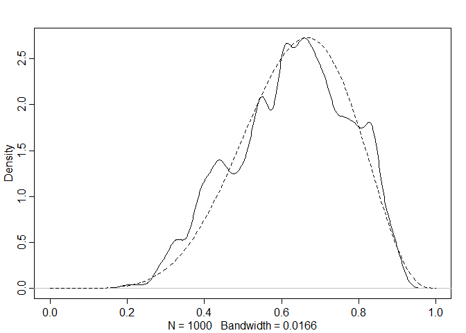

```r
library("rstan") # observe startup messages
```

```
## Warning: package 'rstan' was built under R version 3.5.3
```

```
## Loading required package: ggplot2
```

```
## Loading required package: StanHeaders
```

```
## Warning: package 'StanHeaders' was built under R version 3.5.3
```

```
## rstan (Version 2.18.2, GitRev: 2e1f913d3ca3)
```

```
## For execution on a local, multicore CPU with excess RAM we recommend calling
## options(mc.cores = parallel::detectCores()).
## To avoid recompilation of unchanged Stan programs, we recommend calling
## rstan_options(auto_write = TRUE)
```

```
## For improved execution time, we recommend calling
## Sys.setenv(LOCAL_CPPFLAGS = '-march=native')
## although this causes Stan to throw an error on a few processors.
```

```r
options(mc.cores = parallel::detectCores())
rstan_options(auto_write = TRUE)
Sys.setenv(LOCAL_CPPFLAGS = '-march=native')
```

# Chapter 0

## R code 0.1

```r
print( "All models are wrong, but some are useful." )
```

```
## [1] "All models are wrong, but some are useful."
```

## R code 0.2

```r
x <- 1:2
x
```

```
## [1] 1 2
```

```r
x <- x*10
x
```

```
## [1] 10 20
```

```r
x <- log(x)
x
```

```
## [1] 2.302585 2.995732
```

```r
x <- sum(x)
x
```

```
## [1] 5.298317
```

```r
x <- exp(x)
x
```

```
## [1] 200
```

## R code 0.3

```r
( log( 0.01^200 ) )
```

```
## [1] -Inf
```

```r
( 200 * log(0.01) )
```

```
## [1] -921.034
```

## R code 0.4
#### Load the data:
#### car braking distances in feet paired with speeds in km/h
#### see ?cars for details

```r
data(cars)
```


#### fit a linear regression of distance on speed

```r
m <- lm( dist ~ speed , data=cars )
```

#### estimated coefficients from the model

```r
coef(m)
```

```
## (Intercept)       speed 
##  -17.579095    3.932409
```


#### plot residuals against speed

```r
plot( resid(m) ~ speed , data=cars )
```

<!-- -->


## R code 0.5

```r
#install.packages(c("coda","mvtnorm","devtools"))
library(devtools)
#devtools::install_github("rmcelreath/rethinking",ref="Experimental")
```

# Chapter 2

## R code 2.1


```r
ways <- c( 0 , 3 , 8 , 9 , 0 )
ways/sum(ways)
```

```
## [1] 0.00 0.15 0.40 0.45 0.00
```

## R code 2.2

```r
dbinom( 6 , size=9 , prob=0.5 )
```

```
## [1] 0.1640625
```


## R code 2.3
#### define grid

```r
p_grid <- seq( from=0 , to=1 , length.out=20 )
```


#### define prior

```r
prior <- rep( 1 , 20 )
```


#### compute likelihood at each value in grid

```r
likelihood <- dbinom( 6 , size=9 , prob=p_grid )
```

#### compute product of likelihood and prior

```r
unstd.posterior <- likelihood * prior
```

#### standardize the posterior, so it sums to 1

```r
posterior <- unstd.posterior / sum(unstd.posterior)
```

## R code 2.4

```r
plot( p_grid , posterior , type="b" ,
    xlab="probability of water" , ylab="posterior probability" )
mtext( "20 points" )
```

<!-- -->

## R code 2.5

```r
prior <- ifelse( p_grid < 0.5 , 0 , 1 )
prior <- exp( -5*abs( p_grid - 0.5 ) )
```

## R code 2.6

```r
library(rethinking)
```

```
## Loading required package: parallel
```

```
## rethinking (Version 1.88)
```

```r
library(parallel)
globe.qa <- quap(
    alist(
        W ~ dbinom( W+L ,p) ,  # binomial likelihood
        p ~ dunif(0,1)     # uniform prior
    ) ,
    data=list(W=6,L=3) )
```

# display summary of quadratic approximation

```r
precis( globe.qa )
```

```
##        mean        sd      5.5%     94.5%
## p 0.6666663 0.1571339 0.4155361 0.9177966
```


## R code 2.7


```r
# analytical calculation
W <- 6
L <- 3
curve( dbeta( x , W+1 , L+1 ) , from=0 , to=1 )

# quadratic approximation
curve( dnorm( x , 0.67 , 0.16 ) , lty=2 , add=TRUE )
```

<!-- -->


## R code 2.8

```r
n_samples <- 1000
p <- rep( NA , n_samples )
p[1] <- 0.5
W <- 6
L <- 3
for ( i in 2:n_samples ) {
    p_new <- rnorm( 1 , p[i-1] , 0.1 )
    if ( p_new < 0 ) p_new <- abs( p_new )
    if ( p_new > 1 ) p_new <- 2 - p_new
    q0 <- dbinom( W , W+L , p[i-1] )
    q1 <- dbinom( W , W+L , p_new )
    p[i] <- ifelse( runif(1) < q1/q0 , p_new , p[i-1] )
}
```

## R code 2.9

```r
dens( p , xlim=c(0,1) )
curve( dbeta( x , W+1 , L+1 ) , lty=2 , add=TRUE )
```

<!-- -->

### 2E1 Which of the expressions below correspond to the statement: the probability of rain on Monday?

(2) Pr(rain|Monday) & (4) Pr(rain, Monday)/ Pr(Monday)


### 2E2 Which of the following statements corresponds to the expression: Pr(Mondayjrain)?

(3) Th e probability that it is Monday, given that it is raining.


### 2E3 Which of the expressions below correspond to the statement: the probability that it is Monday, given that it is raining?

(1) Pr(Monday|rain) & (4) Pr(rain|Monday) Pr(Monday)/ Pr(rain)


### 2M1-(1) Recall the globe tossing model from the chapter. Compute and plot the grid approximate posterior distribution for each of the following sets of observations. In each case, assume a uniform prior for p.
(1) W, W, W
(2) W, W, W, L
(3) L, W, W, L, W, W, W


```r
data1 <- c('W','W','W')
# total number of tosses
n = length(data1) 
# observed number of water
w = sum(data1=='W')  

# define grid
p_grid <- seq( from=0 , to=1 , length.out=100)
length_of_grid = length(p_grid)
# prior probability of p
prior <- rep( 1 , length_of_grid ) 

# compute likelihood at each value in grid
likelihood <- dbinom( w , size=n , prob=p_grid )

# compute product of likelihood and prior
unstd.posterior <- likelihood * prior

# standardize the posterior, so it sums to 1
posterior <- unstd.posterior / sum(unstd.posterior)

plot_posterior <- function(x, y) {
  plot(x = x, y = y, type="b", xlab = "Probability of Water", ylab = "Posterior Probability")
  title <- paste( length(x), "Points")
  mtext(title)
}
plot_posterior(x = p_grid, y = posterior)
```

<!-- -->
### 2M1-(2)

```r
data1 <- c('W','W','W','L')
# total number of tosses
n = length(data1) 
# observed number of water
w = sum(data1=='W')  

# define grid
p_grid <- seq( from=0 , to=1 , length.out=100)
length_of_grid = length(p_grid)
# prior probability of p
prior <- rep( 1 , length_of_grid ) 

# compute likelihood at each value in grid
likelihood <- dbinom( w , size=n , prob=p_grid )

# compute product of likelihood and prior
unstd.posterior <- likelihood * prior

# standardize the posterior, so it sums to 1
posterior <- unstd.posterior / sum(unstd.posterior)

plot_posterior(x = p_grid, y = posterior)
```

<!-- -->

### 2M1-(3)

```r
data1 <- c('L', 'W', 'W', 'L', 'W', 'W', 'W')
# total number of tosses
n = length(data1)
# observed number of water
w = sum(data1=='W') 

# define grid
p_grid <- seq( from=0 , to=1 , length.out=100)
length_of_grid = length(p_grid)
# prior probability of p
prior <- rep( 1 , length_of_grid ) 

# compute likelihood at each value in grid
likelihood <- dbinom( w , size=n , prob=p_grid )

# compute product of likelihood and prior
unstd.posterior <- likelihood * prior

# standardize the posterior, so it sums to 1
posterior <- unstd.posterior / sum(unstd.posterior)

plot_posterior(x = p_grid, y = posterior)
```

<!-- -->

### 2M2-(1) Now assume a prior for p that is equal to zero when p < 0:5 and is a positive constant when p < 0:5. Again compute and plot the grid approximate posterior distribution for each of the sets of observations in the problem just above.

```r
data1 <- c('W','W','W')
# total number of tosses
n = length(data1) 
# observed number of water
w = sum(data1=='W')  

# define grid
p_grid <- seq( from=0 , to=1 , length.out=100)
length_of_grid = length(p_grid)

# prior probability of p
prior <- ifelse( p_grid < 0.5 , 0 , 1 ) 

# compute likelihood at each value in grid
likelihood <- dbinom( w , size=n , prob=p_grid )

# compute product of likelihood and prior
unstd.posterior <- likelihood * prior

# standardize the posterior, so it sums to 1
posterior <- unstd.posterior / sum(unstd.posterior)

plot_posterior <- function(x, y) {
  plot(x = x, y = y, type="b", xlab = "Probability of Water", ylab = "Posterior Probability")
  title <- paste( length(x), "Points")
  mtext(title)
}
plot_posterior(x = p_grid, y = posterior)
```

<!-- -->

### 2M2-(2)

```r
data1 <- c('W','W','W','L')
# total number of tosses
n = length(data1) 
# observed number of water
w = sum(data1=='W')  

# define grid
p_grid <- seq( from=0 , to=1 , length.out=100)
length_of_grid = length(p_grid)

# prior probability of p
prior <- ifelse( p_grid < 0.5 , 0 , 1 ) 

# compute likelihood at each value in grid
likelihood <- dbinom( w , size=n , prob=p_grid )

# compute product of likelihood and prior
unstd.posterior <- likelihood * prior

# standardize the posterior, so it sums to 1
posterior <- unstd.posterior / sum(unstd.posterior)

plot_posterior(x = p_grid, y = posterior)
```

<!-- -->

### 2M2-(3)

```r
data1 <- c('L', 'W', 'W', 'L', 'W', 'W', 'W')
# total number of tosses
n = length(data1)
# observed number of water
w = sum(data1=='W') 

# define grid
p_grid <- seq( from=0 , to=1 , length.out=100)
length_of_grid = length(p_grid)

# prior probability of p
prior <- ifelse( p_grid < 0.5 , 0 , 1 )  

# compute likelihood at each value in grid
likelihood <- dbinom( w , size=n , prob=p_grid )

# compute product of likelihood and prior
unstd.posterior <- likelihood * prior

# standardize the posterior, so it sums to 1
posterior <- unstd.posterior / sum(unstd.posterior)

plot_posterior(x = p_grid, y = posterior)
```

<!-- -->

### 2M3. Suppose there are two globes, one for Earth and one for Mars. Th e Earth globe is 70% covered in water. Th e Mars globe is 100% land. Further suppose that one of these globes¡Xyou don¡¦t know which¡Xwas tossed in the air and produced a ¡§land¡¨ observation. Assume that each globe was equally likely to be tossed. Show that the posterior probability that the globe was the Earth, conditional on seeing ¡§land¡¨ (Pr(Earthjland)), is 0.23.


```r
# p(Earth) and p(Mars)
p_Earth = 0.5  
p_Mars = 0.5 

# p(land|Earth) and p(land|Mars)
p_land_E = 0.3  
p_land_M = 1.0 

# p(land)
p_land = p_Earth*p_land_E + p_Mars*p_land_M
p_land
```

```
## [1] 0.65
```

```r
# p(Earth|land) = (p(land|Earth) * p(Earth)) / p(land)
p_Earth_land = (p_land_E * p_Earth)/p_land 
p_Earth_land
```

```
## [1] 0.2307692
```

### 2M4. Suppose you have a deck with only three cards. Each card has two sides, and each side is either black or white. One card has two black sides. Th e second card has one black and one white side. The third card has two white sides. Now suppose all three cards are placed in a bag and shuffl ed. Someone reaches into the bag and pulls out a card and places it fl at on a table. A black side is shown facing up, but you don¡¦t know the color of the side facing down. Show that the probability that the other side is also black is 2/3. Use the counting method (Section 2 of the chapter) to approach this problem. Th is means counting up the ways that each card could produce the observed data (a black side facing up on the table).


```r
# Use the counting method
BB.likelihood <- 2
BW.likelihood <- 1
WW.likelihood <- 0

likelihood <- c(BB.likelihood, BW.likelihood, WW.likelihood)

# prior probability
prior <- rep(1, length = length(likelihood))

# compute product of likelihood and prior
unstd.posterior <- likelihood * prior

# standardize the posterior, so it sums to 1
posterior <- unstd.posterior / sum(unstd.posterior)
posterior
```

```
## [1] 0.6666667 0.3333333 0.0000000
```

```r
posterior[1] == 2/3
```

```
## [1] TRUE
```

$$P(2=B|1=B) = P(2=B,1=B) / P(1=B) = P(BB) / (P(BB) + P(WB) * P(1=B|WB)) = (1/3) / (1/3 + 1/3 * 1/2) = 2/3 = 0.667$$


### 2M5. Now suppose there are four cards: B/B, B/W, W/W, and another B/B. Again suppose a card is drawn from the bag and a black side appears face up. Again calculate the probability that the other side is black.


```r
# Use the counting method
BB.likelihood <- 2
BW.likelihood <- 1
WW.likelihood <- 0

likelihood2 <- c(BB.likelihood, BW.likelihood, WW.likelihood, BB.likelihood)

# prior probability
prior <- rep(1, length = length(likelihood2))

# compute product of likelihood and prior
unstd.posterior <- likelihood2 * prior

# standardize the posterior, so it sums to 1
posterior <- unstd.posterior / sum(unstd.posterior)
posterior
```

```
## [1] 0.4 0.2 0.0 0.4
```

```r
# we may draw card 1 or 4
result = posterior[1]+posterior[4]
result
```

```
## [1] 0.8
```

$$P(2=B|1=B) = P(2=B,1=B) / P(1=B) = P(BB) / (P(BB) + P(WB)*P(1=B|WB)) =  (1/2) / (1/2 + 1/4 * 1/2) = 4/5 = 0.8$$
