```r
## R code 4.42
# load data again, since it's a long way back
library(rethinking)
```

```
## Loading required package: rstan
```

```
## Warning: package 'rstan' was built under R version 3.5.3
```

```
## Loading required package: ggplot2
```

```
## Loading required package: StanHeaders
```

```
## Warning: package 'StanHeaders' was built under R version 3.5.3
```

```
## rstan (Version 2.18.2, GitRev: 2e1f913d3ca3)
```

```
## For execution on a local, multicore CPU with excess RAM we recommend calling
## options(mc.cores = parallel::detectCores()).
## To avoid recompilation of unchanged Stan programs, we recommend calling
## rstan_options(auto_write = TRUE)
```

```
## For improved execution time, we recommend calling
## Sys.setenv(LOCAL_CPPFLAGS = '-march=native')
## although this causes Stan to throw an error on a few processors.
```

```
## Loading required package: parallel
```

```
## rethinking (Version 1.88)
```

```r
data(Howell1)
d <- Howell1
d2 <- d[ d$age >= 18 , ]

# define the average weight, x-bar
xbar <- mean(d2$weight)

# fit model
m4.3 <- quap(
    alist(
        height ~ dnorm( mu , sigma ) ,
        mu <- a + b*( weight - xbar ) ,
        a ~ dnorm( 178 , 20 ) ,
        b ~ dlnorm( 0 , 1 ) ,
        sigma ~ dunif( 0 , 50 )
    ) ,
    data=d2 )

## R code 4.43
m4.3b <- quap(
    alist(
        height ~ dnorm( mu , sigma ) ,
        mu <- a + exp(log_b)*( weight - xbar ),
        a ~ dnorm( 178 , 100 ) ,
        log_b ~ dnorm( 0 , 1 ) ,
        sigma ~ dunif( 0 , 50 )
    ) ,
    data=d2 )

## R code 4.44
precis( m4.3 )
```

```
##              mean        sd        5.5%       94.5%
## a     154.6019248 0.2703320 154.1698821 155.0339676
## b       0.9032845 0.0419274   0.8362764   0.9702926
## sigma   5.0723365 0.1911977   4.7667656   5.3779074
```

```r
## R code 4.45
round( vcov( m4.3 ) , 3 )
```

```
##           a     b sigma
## a     0.073 0.000 0.000
## b     0.000 0.002 0.000
## sigma 0.000 0.000 0.037
```

```r
## R code 4.46
plot( height ~ weight , data=d2 , col=rangi2 )
post <- extract.samples( m4.3 )
a_map <- mean(post$a)
b_map <- mean(post$b)
curve( a_map + b_map*(x - xbar) , add=TRUE )
```

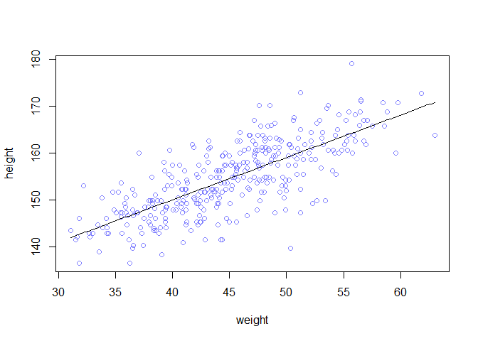<!-- -->

```r
## R code 4.47
post <- extract.samples( m4.3 )
post[1:5,]
```

```
##          a         b    sigma
## 1 154.5277 0.9495995 4.925198
## 2 154.3736 0.9053477 5.131930
## 3 154.8449 0.8753133 4.764319
## 4 154.5547 0.8987835 5.030363
## 5 154.4746 0.9008888 5.114658
```

```r
## R code 4.48
N <- 10
dN <- d2[ 1:N , ]
mN <- quap(
    alist(
        height ~ dnorm( mu , sigma ) ,
        mu <- a + b*( weight - mean(weight) ) ,
        a ~ dnorm( 178 , 20 ) ,
        b ~ dlnorm( 0 , 1 ) ,
        sigma ~ dunif( 0 , 50 )
    ) , data=dN )

## R code 4.49
# extract 20 samples from the posterior
post <- extract.samples( mN , n=20 )

# display raw data and sample size
plot( dN$weight , dN$height ,
    xlim=range(d2$weight) , ylim=range(d2$height) ,
    col=rangi2 , xlab="weight" , ylab="height" )
mtext(concat("N = ",N))

# plot the lines, with transparency
for ( i in 1:20 )
    curve( post$a[i] + post$b[i]*(x-mean(dN$weight)) ,
        col=col.alpha("black",0.3) , add=TRUE )
```

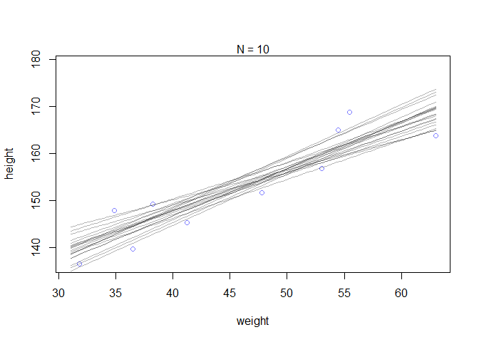<!-- -->

```r
## R code 4.50
post <- extract.samples( m4.3 )
mu_at_50 <- post$a + post$b * ( 50 - xbar )

## R code 4.51
dens( mu_at_50 , col=rangi2 , lwd=2 , xlab="mu|weight=50" )
```

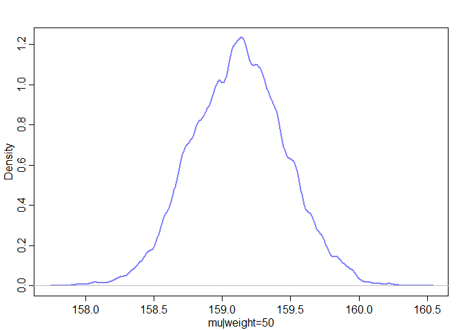<!-- -->

```r
## R code 4.52
HPDI( mu_at_50 , prob=0.89 )
```

```
##    |0.89    0.89| 
## 158.5721 159.6517
```

```r
## R code 4.53
mu <- link( m4.3 )
str(mu)
```

```
##  num [1:1000, 1:352] 157 157 157 157 157 ...
```

```r
## R code 4.54
# define sequence of weights to compute predictions for
# these values will be on the horizontal axis
weight.seq <- seq( from=25 , to=70 , by=1 )

# use link to compute mu
# for each sample from posterior
# and for each weight in weight.seq
mu <- link( m4.3 , data=data.frame(weight=weight.seq) )
str(mu)
```

```
##  num [1:1000, 1:46] 135 137 137 135 137 ...
```

```r
## R code 4.55
# use type="n" to hide raw data
plot( height ~ weight , d2 , type="n" )

# loop over samples and plot each mu value
for ( i in 1:100 )
    points( weight.seq , mu[i,] , pch=16 , col=col.alpha(rangi2,0.1) )
```

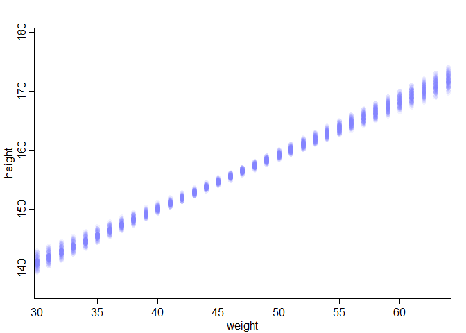<!-- -->

```r
## R code 4.56
# summarize the distribution of mu
mu.mean <- apply( mu , 2 , mean )
mu.HPDI <- apply( mu , 2 , HPDI , prob=0.89 )

## R code 4.57
# plot raw data
# fading out points to make line and interval more visible
plot( height ~ weight , data=d2 , col=col.alpha(rangi2,0.5) )

# plot the MAP line, aka the mean mu for each weight
lines( weight.seq , mu.mean )

# plot a shaded region for 89% HPDI
shade( mu.HPDI , weight.seq )
```

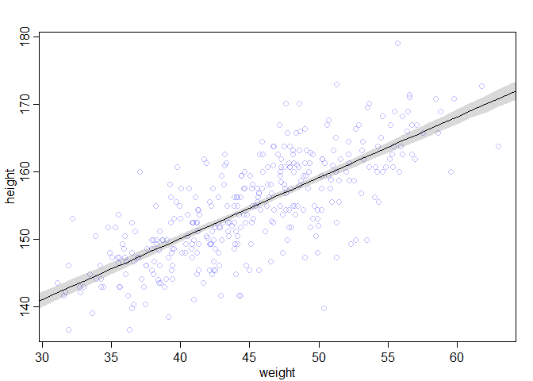<!-- -->

```r
## R code 4.58
post <- extract.samples(m4.3)
mu.link <- function(weight) post$a + post$b*( weight - xbar )
weight.seq <- seq( from=25 , to=70 , by=1 )
mu <- sapply( weight.seq , mu.link )
mu.mean <- apply( mu , 2 , mean )
mu.HPDI <- apply( mu , 2 , HPDI , prob=0.89 )

## R code 4.59
sim.height <- sim( m4.3 , data=list(weight=weight.seq) )
str(sim.height)
```

```
##  num [1:1000, 1:46] 138 139 136 134 136 ...
```

```r
## R code 4.60
height.PI <- apply( sim.height , 2 , PI , prob=0.89 )

## R code 4.61
# plot raw data
plot( height ~ weight , d2 , col=col.alpha(rangi2,0.5) )

# draw MAP line
lines( weight.seq , mu.mean )

# draw HPDI region for line
shade( mu.HPDI , weight.seq )

# draw PI region for simulated heights
shade( height.PI , weight.seq )
```

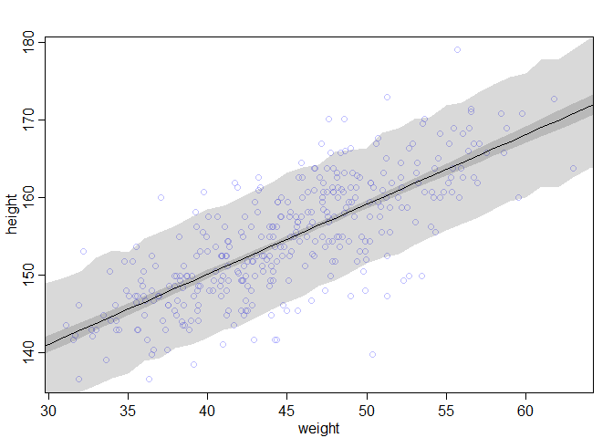<!-- -->

```r
## R code 4.62
sim.height <- sim( m4.3 , data=list(weight=weight.seq) , n=1e4 )
height.PI <- apply( sim.height , 2 , PI , prob=0.89 )

## R code 4.63
post <- extract.samples(m4.3)
weight.seq <- 25:70
sim.height <- sapply( weight.seq , function(weight)
    rnorm(
        n=nrow(post) ,
        mean=post$a + post$b*( weight - xbar ) ,
        sd=post$sigma ) )
height.PI <- apply( sim.height , 2 , PI , prob=0.89 )

## R code 4.64
library(rethinking)
data(Howell1)
d <- Howell1
str(d)
```

```
## 'data.frame':	544 obs. of  4 variables:
##  $ height: num  152 140 137 157 145 ...
##  $ weight: num  47.8 36.5 31.9 53 41.3 ...
##  $ age   : num  63 63 65 41 51 35 32 27 19 54 ...
##  $ male  : int  1 0 0 1 0 1 0 1 0 1 ...
```

```r
## R code 4.65
d$weight_s <- ( d$weight - mean(d$weight) )/sd(d$weight)
d$weight_s2 <- d$weight_s^2
m4.5 <- quap(
    alist(
        height ~ dnorm( mu , sigma ) ,
        mu <- a + b1*weight_s + b2*weight_s2 ,
        a ~ dnorm( 178 , 20 ) ,
        b1 ~ dlnorm( 0 , 1 ) ,
        b2 ~ dnorm( 0 , 1 ) ,
        sigma ~ dunif( 0 , 50 )
    ) ,
    data=d )

## R code 4.66
precis( m4.5 )
```

```
##             mean        sd       5.5%      94.5%
## a     146.056527 0.3689758 145.466833 146.646222
## b1     21.733617 0.2888873  21.271919  22.195315
## b2     -7.803004 0.2741824  -8.241201  -7.364808
## sigma   5.774398 0.1764595   5.492382   6.056414
```

```r
## R code 4.67
weight.seq <- seq( from=-2.2 , to=2 , length.out=30 )
pred_dat <- list( weight_s=weight.seq , weight_s2=weight.seq^2 )
mu <- link( m4.5 , data=pred_dat )
mu.mean <- apply( mu , 2 , mean )
mu.PI <- apply( mu , 2 , PI , prob=0.89 )
sim.height <- sim( m4.5 , data=pred_dat )
height.PI <- apply( sim.height , 2 , PI , prob=0.89 )

## R code 4.68
plot( height ~ weight_s , d , col=col.alpha(rangi2,0.5) )
lines( weight.seq , mu.mean )
shade( mu.PI , weight.seq )
shade( height.PI , weight.seq )
```

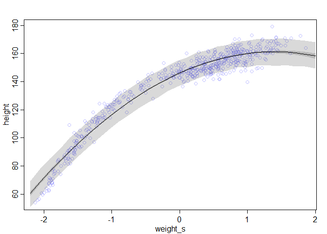<!-- -->

```r
## R code 4.69
d$weight_s3 <- d$weight_s^3
m4.6 <- quap(
    alist(
        height ~ dnorm( mu , sigma ) ,
        mu <- a + b1*weight_s + b2*weight_s2 + b3*weight_s3 ,
        a ~ dnorm( 178 , 20 ) ,
        b1 ~ dlnorm( 0 , 1 ) ,
        b2 ~ dnorm( 0 , 10 ) ,
        b3 ~ dnorm( 0 , 10 ) ,
        sigma ~ dunif( 0 , 50 )
    ) ,
    data=d )

## R code 4.70
plot( height ~ weight_s , d , col=col.alpha(rangi2,0.5) , xaxt="n" )

## R code 4.71
at <- c(-2,-1,0,1,2)
labels <- at*sd(d$weight) + mean(d$weight)
axis( side=1 , at=at , labels=round(labels,1) )
```

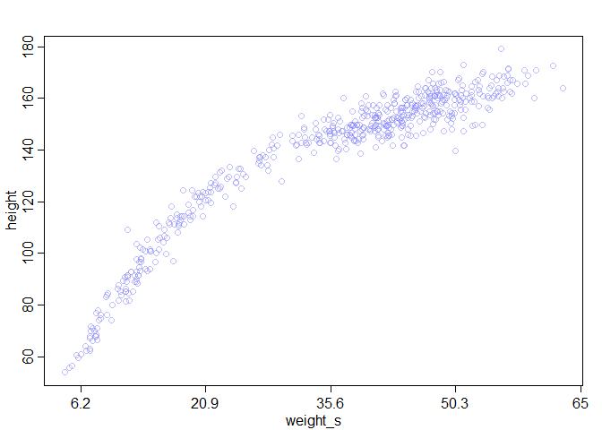<!-- -->

```r
## R code 4.72
library(rethinking)
data(cherry_blossoms)
d <- cherry_blossoms
precis(d)
```

```
##                   mean          sd      5.5%      94.5%       histogram
## year       1408.000000 350.8845964 867.77000 1948.23000   ▇▇▇▇▇▇▇▇▇▇▇▇▁
## doy         104.540508   6.4070362  94.43000  115.00000        ▁▂▅▇▇▃▁▁
## temp          6.141886   0.6636479   5.15000    7.29470        ▁▃▅▇▃▂▁▁
## temp_upper    7.185151   0.9929206   5.89765    8.90235 ▁▂▅▇▇▅▂▂▁▁▁▁▁▁▁
## temp_lower    5.098941   0.8503496   3.78765    6.37000 ▁▁▁▁▁▁▁▃▅▇▃▂▁▁▁
```

```r
## R code 4.73
d2 <- d[ complete.cases(d$temp) , ] # complete cases on temp
num_knots <- 15
knot_list <- quantile( d2$year , probs=seq(0,1,length.out=num_knots) )

## R code 4.74
library(splines)
B <- bs(d2$year,
    knots=knot_list[-c(1,num_knots)] ,
    degree=3 , intercept=TRUE )

## R code 4.75
plot( NULL , xlim=range(d2$year) , ylim=c(0,1) , xlab="year" , ylab="basis value" )
for ( i in 1:ncol(B) ) lines( d2$year , B[,i] )
```

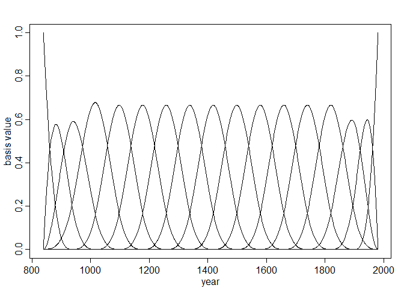<!-- -->

```r
## R code 4.76
m4.7 <- quap(
    alist(
        T ~ dnorm( mu , sigma ) ,
        mu <- a + B %*% w ,
        a ~ dnorm(6,10),
        w ~ dnorm(0,1),
        sigma ~ dexp(1)
    ),
    data=list( T=d2$temp , B=B ) ,
    start=list( w=rep( 0 , ncol(B) ) ) )

## R code 4.77
post <- extract.samples(m4.7)
w <- apply( post$w , 2 , mean )
plot( NULL , xlim=range(d2$year) , ylim=c(-2,2) ,
    xlab="year" , ylab="basis * weight" )
for ( i in 1:ncol(B) ) lines( d2$year , w[i]*B[,i] )
```

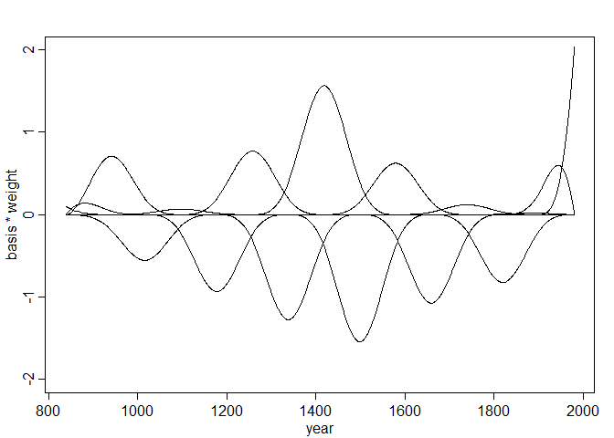<!-- -->

```r
## R code 4.78
mu <- link( m4.7 )
mu_PI <- apply(mu,2,PI,0.97)
plot( d2$year , d2$temp , col=col.alpha(rangi2,0.3) , pch=16 )
shade( mu_PI , d2$year , col=col.alpha("black",0.5) )
```

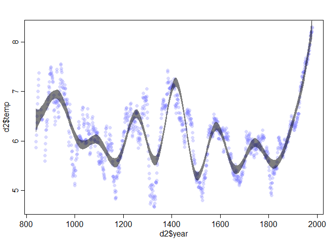<!-- -->

```r
## R code 4.79
plot( height ~ weight , data=Howell1 ,
    col=col.alpha(rangi2,0.4) )
```

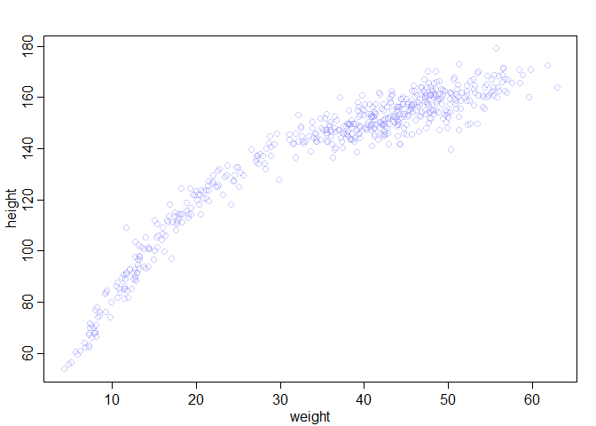<!-- -->

## 4.7. Practice

### 4M4, A sample of students is measured for height each year for 3 years. Aft er the third year, you want to fi t a linear regression predicting height using year as a predictor. Write down the mathematical model defi nition for this regression, using any variable names and priors you choose. Be prepared to defend your choice of priors.

### 4M5, Now suppose I tell you that the average height in the fi rst year was 120 cm and that every student got taller each year. Does this information lead you to change your choice of priors? How?

### 4M6, Now suppose I tell you that the variance among heights for students of the same age is never more than 64cm. How does this lead you to revise your priors? 


### 4H1, The weights listed below were recorded in the !Kung census, but heights were not recorded for these individuals. Provide predicted heights and 89% intervals (either HPDI or PI) for each of these individuals. Th at is, fi ll in the table below, using model-based predictions.

### 4H2 Select out all the rows in the Howell1 data with ages below 18 years of age. If you do it right, you should end up with a new data frame with 192 rows in it.

#### (a) Fit a linear regression to these data, using quap. Present and interpret the estimates. For every 10 units of increase in weight, how much taller does the model predict a child gets?

#### (b) Plot the raw data, with height on the vertical axis and weight on the horizontal axis. Super-impose the MAP regression line and 89% HPDI for the mean. Also superimpose the 89% HPDI for predicted heights.

#### (c) What aspects of the model fi t concern you? Describe the kinds of assumptions you would change, if any, to improve the model. You don’t have to write any new code. Just explain what the model appears to be doing a bad job of, and what you hypothesize would be a better model.

