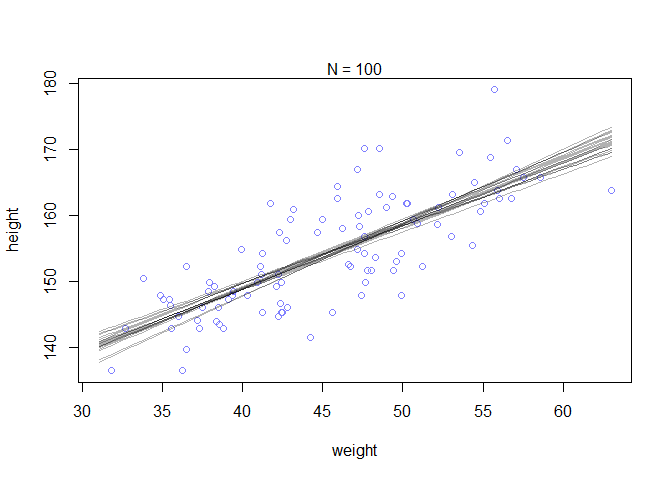
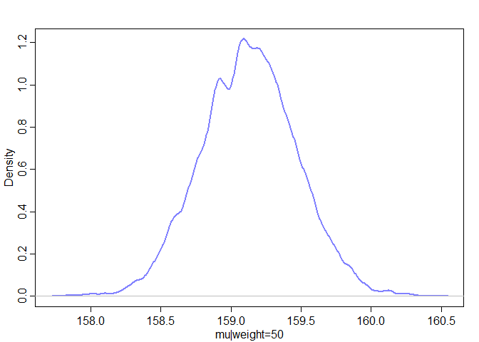

```r
## R code 4.42
# load data again, since it's a long way back
library(rethinking)
```

```
## Loading required package: rstan
```

```
## Warning: package 'rstan' was built under R version 3.5.3
```

```
## Loading required package: ggplot2
```

```
## Loading required package: StanHeaders
```

```
## Warning: package 'StanHeaders' was built under R version 3.5.3
```

```
## rstan (Version 2.18.2, GitRev: 2e1f913d3ca3)
```

```
## For execution on a local, multicore CPU with excess RAM we recommend calling
## options(mc.cores = parallel::detectCores()).
## To avoid recompilation of unchanged Stan programs, we recommend calling
## rstan_options(auto_write = TRUE)
```

```
## For improved execution time, we recommend calling
## Sys.setenv(LOCAL_CPPFLAGS = '-march=native')
## although this causes Stan to throw an error on a few processors.
```

```
## Loading required package: parallel
```

```
## rethinking (Version 1.88)
```

```r
data(Howell1)
d <- Howell1
d2 <- d[ d$age >= 18 , ]

# define the average weight, x-bar
xbar <- mean(d2$weight)

# fit model
m4.3 <- quap(
    alist(
        height ~ dnorm( mu , sigma ) ,
        mu <- a + b*( weight - xbar ) ,
        a ~ dnorm( 178 , 20 ) ,
        b ~ dlnorm( 0 , 1 ) ,
        sigma ~ dunif( 0 , 50 )
    ) ,
    data=d2 )

## R code 4.43
m4.3b <- quap(
    alist(
        height ~ dnorm( mu , sigma ) ,
        mu <- a + exp(log_b)*( weight - xbar ),
        a ~ dnorm( 178 , 100 ) ,
        log_b ~ dnorm( 0 , 1 ) ,
        sigma ~ dunif( 0 , 50 )
    ) ,
    data=d2 )

## R code 4.44
precis( m4.3 )
```

```
##              mean         sd        5.5%       94.5%
## a     154.6013675 0.27030764 154.1693637 155.0333713
## b       0.9032809 0.04192363   0.8362788   0.9702829
## sigma   5.0718805 0.19115474   4.7663783   5.3773827
```


```r
## R code 4.45
round( vcov( m4.3 ) , 3 )
```

```
##           a     b sigma
## a     0.073 0.000 0.000
## b     0.000 0.002 0.000
## sigma 0.000 0.000 0.037
```

```r
pairs(m4.3)
```

<!-- -->


```r
## R code 4.46
plot( height ~ weight , data=d2 , col=rangi2 )
post <- extract.samples( m4.3 )
a_map <- mean(post$a)
b_map <- mean(post$b)
curve( a_map + b_map*(x - xbar) , add=TRUE )
```

<!-- -->


```r
## R code 4.47
post <- extract.samples( m4.3 )
post[1:5,]
```

```
##          a         b    sigma
## 1 154.6377 0.8473635 5.112710
## 2 154.9796 0.8260670 5.042904
## 3 154.6490 0.8942244 5.228768
## 4 154.9611 0.8860326 5.217448
## 5 154.8630 0.9060326 4.938168
```


```r
## R code 4.48
N <- 10
dN <- d2[ 1:N , ]
mN <- quap(
    alist(
        height ~ dnorm( mu , sigma ) ,
        mu <- a + b*( weight - mean(weight) ) ,
        a ~ dnorm( 178 , 20 ) ,
        b ~ dlnorm( 0 , 1 ) ,
        sigma ~ dunif( 0 , 50 )
    ) , data=dN )

## R code 4.49
# extract 20 samples from the posterior
post <- extract.samples( mN , n=20 )

# display raw data and sample size
plot( dN$weight , dN$height ,
    xlim=range(d2$weight) , ylim=range(d2$height) ,
    col=rangi2 , xlab="weight" , ylab="height" )
mtext(concat("N = ",N))

# plot the lines, with transparency
for ( i in 1:20 )
    curve( post$a[i] + post$b[i]*(x-mean(dN$weight)) ,
        col=col.alpha("black",0.3) , add=TRUE )
```

<!-- -->


```r
## R code 4.48
N <- 100
dN <- d2[ 1:N , ]
mN <- quap(
    alist(
        height ~ dnorm( mu , sigma ) ,
        mu <- a + b*( weight - mean(weight) ) ,
        a ~ dnorm( 178 , 20 ) ,
        b ~ dlnorm( 0 , 1 ) ,
        sigma ~ dunif( 0 , 50 )
    ) , data=dN )

## R code 4.49
# extract 20 samples from the posterior
post <- extract.samples( mN , n=20 )

# display raw data and sample size
plot( dN$weight , dN$height ,
    xlim=range(d2$weight) , ylim=range(d2$height) ,
    col=rangi2 , xlab="weight" , ylab="height" )
mtext(concat("N = ",N))

# plot the lines, with transparency
for ( i in 1:20 )
    curve( post$a[i] + post$b[i]*(x-mean(dN$weight)) ,
        col=col.alpha("black",0.3) , add=TRUE )
```

<!-- -->


```r
## R code 4.48
N <- 300
dN <- d2[ 1:N , ]
mN <- quap(
    alist(
        height ~ dnorm( mu , sigma ) ,
        mu <- a + b*( weight - mean(weight) ) ,
        a ~ dnorm( 178 , 20 ) ,
        b ~ dlnorm( 0 , 1 ) ,
        sigma ~ dunif( 0 , 50 )
    ) , data=dN )

## R code 4.49
# extract 20 samples from the posterior
post <- extract.samples( mN , n=20 )

# display raw data and sample size
plot( dN$weight , dN$height ,
    xlim=range(d2$weight) , ylim=range(d2$height) ,
    col=rangi2 , xlab="weight" , ylab="height" )
mtext(concat("N = ",N))

# plot the lines, with transparency
for ( i in 1:20 )
    curve( post$a[i] + post$b[i]*(x-mean(dN$weight)) ,
        col=col.alpha("black",0.3) , add=TRUE )
```

<!-- -->


```r
## R code 4.50
post <- extract.samples( m4.3 )
mu_at_50 <- post$a + post$b * ( 50 - xbar )
```


```r
## R code 4.51
dens( mu_at_50 , col=rangi2 , lwd=2 , xlab="mu|weight=50" )
```

<!-- -->


```r
## R code 4.52
HPDI( mu_at_50 , prob=0.89 )
```

```
##    |0.89    0.89| 
## 158.5727 159.6590
```


```r
## R code 4.53
mu <- link( m4.3 )
str(mu)
```

```
##  num [1:1000, 1:352] 157 157 157 158 157 ...
```


```r
## R code 4.54
# define sequence of weights to compute predictions for
# these values will be on the horizontal axis
weight.seq <- seq( from=25 , to=70 , by=1 )

# use link to compute mu
# for each sample from posterior
# and for each weight in weight.seq
mu <- link( m4.3 , data=data.frame(weight=weight.seq) )
str(mu)
```

```
##  num [1:1000, 1:46] 137 137 136 138 139 ...
```


```r
## R code 4.55
# use type="n" to hide raw data
plot( height ~ weight , d2 , type="n" )

# loop over samples and plot each mu value
for ( i in 1:100 )
    points( weight.seq , mu[i,] , pch=16 , col=col.alpha(rangi2,0.1) )
```

<!-- -->


```r
## R code 4.56
# summarize the distribution of mu
mu.mean <- apply( mu , 2 , mean )
mu.HPDI <- apply( mu , 2 , HPDI , prob=0.89 )
mu.mean
```

```
##  [1] 136.5428 137.4454 138.3480 139.2507 140.1533 141.0560 141.9586
##  [8] 142.8612 143.7639 144.6665 145.5691 146.4718 147.3744 148.2770
## [15] 149.1797 150.0823 150.9849 151.8876 152.7902 153.6928 154.5955
## [22] 155.4981 156.4007 157.3034 158.2060 159.1086 160.0113 160.9139
## [29] 161.8165 162.7192 163.6218 164.5244 165.4271 166.3297 167.2324
## [36] 168.1350 169.0376 169.9403 170.8429 171.7455 172.6482 173.5508
## [43] 174.4534 175.3561 176.2587 177.1613
```

```r
mu.HPDI
```

```
##           [,1]     [,2]     [,3]     [,4]     [,5]     [,6]     [,7]
## |0.89 134.9636 135.9433 137.1112 137.9288 138.8946 139.8027 140.8841
## 0.89| 137.8158 138.6724 139.7146 140.3919 141.2438 142.0221 142.9779
##           [,8]     [,9]    [,10]    [,11]    [,12]    [,13]    [,14]
## |0.89 141.8496 142.8656 143.8418 144.7857 145.7449 146.6717 147.6177
## 0.89| 143.8184 144.7061 145.5478 146.3818 147.2332 148.0593 148.8880
##          [,15]    [,16]    [,17]    [,18]    [,19]    [,20]    [,21]
## |0.89 148.5956 149.5364 150.4371 151.4440 152.3510 153.2563 154.1689
## 0.89| 149.7770 150.6370 151.4643 152.4023 153.2639 154.1234 155.0329
##          [,22]    [,23]    [,24]    [,25]    [,26]    [,27]    [,28]
## |0.89 155.1089 155.9731 156.8627 157.7228 158.5781 159.4190 160.3044
## 0.89| 155.9859 156.8523 157.7960 158.7160 159.6541 160.5962 161.5860
##          [,29]    [,30]    [,31]    [,32]    [,33]    [,34]    [,35]
## |0.89 161.1651 162.0348 162.9186 163.7192 164.4628 165.3798 166.2233
## 0.89| 162.5587 163.5353 164.5372 165.4571 166.2969 167.3407 168.2994
##          [,36]    [,37]    [,38]    [,39]    [,40]    [,41]    [,42]
## |0.89 167.0774 167.9086 168.7530 169.5710 170.4022 171.2533 172.1042
## 0.89| 169.2702 170.2125 171.1739 172.1356 173.0899 174.0672 175.0409
##          [,43]    [,44]    [,45]    [,46]
## |0.89 172.9169 173.8255 174.6591 175.5026
## 0.89| 176.0057 177.0415 178.0086 178.9953
```


```r
## R code 4.57
# plot raw data
# fading out points to make line and interval more visible
plot( height ~ weight , data=d2 , col=col.alpha(rangi2,0.5) )

# plot the MAP line, aka the mean mu for each weight
lines( weight.seq , mu.mean )

# plot a shaded region for 89% HPDI
shade( mu.HPDI , weight.seq )
```

<!-- -->


```r
## R code 4.58
post <- extract.samples(m4.3)
mu.link <- function(weight) post$a + post$b*( weight - xbar )
weight.seq <- seq( from=25 , to=70 , by=1 )
mu <- sapply( weight.seq , mu.link )
mu.mean <- apply( mu , 2 , mean )
mu.HPDI <- apply( mu , 2 , HPDI , prob=0.89 )
mu.mean
```

```
##  [1] 136.5420 137.4453 138.3487 139.2521 140.1555 141.0588 141.9622
##  [8] 142.8656 143.7690 144.6723 145.5757 146.4791 147.3825 148.2858
## [15] 149.1892 150.0926 150.9960 151.8993 152.8027 153.7061 154.6095
## [22] 155.5128 156.4162 157.3196 158.2230 159.1263 160.0297 160.9331
## [29] 161.8365 162.7398 163.6432 164.5466 165.4499 166.3533 167.2567
## [36] 168.1601 169.0634 169.9668 170.8702 171.7736 172.6769 173.5803
## [43] 174.4837 175.3871 176.2904 177.1938
```

```r
mu.HPDI
```

```
##           [,1]     [,2]     [,3]     [,4]     [,5]     [,6]     [,7]
## |0.89 135.1682 136.1401 137.1251 138.0542 139.0900 140.0098 140.9653
## 0.89| 137.9381 138.7910 139.6513 140.4575 141.3681 142.1688 142.9985
##           [,8]     [,9]    [,10]    [,11]    [,12]    [,13]    [,14]
## |0.89 141.9249 142.8930 143.8364 144.8201 145.7670 146.6909 147.6566
## 0.89| 143.8415 144.6889 145.5172 146.3907 147.2252 148.0459 148.9159
##          [,15]    [,16]    [,17]    [,18]    [,19]    [,20]    [,21]
## |0.89 148.6017 149.5313 150.4923 151.4293 152.3569 153.2542 154.1831
## 0.89| 149.7704 150.6107 151.4929 152.3736 153.2562 154.1251 155.0447
##          [,22]    [,23]    [,24]    [,25]    [,26]    [,27]    [,28]
## |0.89 155.0787 155.9776 156.8569 157.7249 158.5882 159.4369 160.2756
## 0.89| 155.9489 156.8795 157.8125 158.7428 159.6854 160.6303 161.5646
##          [,29]    [,30]    [,31]    [,32]    [,33]    [,34]    [,35]
## |0.89 161.1335 162.0078 162.8517 163.6903 164.5399 165.3753 166.2376
## 0.89| 162.5213 163.5036 164.4557 165.4117 166.3796 167.3365 168.3198
##          [,36]    [,37]    [,38]    [,39]    [,40]    [,41]    [,42]
## |0.89 167.0876 167.8502 168.6842 169.5450 170.3667 171.1919 172.0217
## 0.89| 169.2927 170.1791 171.1332 172.1152 173.0656 174.0192 174.9769
##          [,43]    [,44]    [,45]    [,46]
## |0.89 172.8663 173.7883 174.6350 175.4894
## 0.89| 175.9499 177.0018 177.9763 178.9573
```


```r
## R code 4.59
sim.height <- sim( m4.3 , data=list(weight=weight.seq) )
str(sim.height)
```

```
##  num [1:1000, 1:46] 131 132 137 131 141 ...
```

```r
## R code 4.60
height.PI <- apply( sim.height , 2 , PI , prob=0.89 )

## R code 4.61
# plot raw data
plot( height ~ weight , d2 , col=col.alpha(rangi2,0.5) )

# draw MAP line
lines( weight.seq , mu.mean )

# draw HPDI region for line
shade( mu.HPDI , weight.seq )

# draw PI region for simulated heights
shade( height.PI , weight.seq )
```

<!-- -->

```r
## R code 4.59
sim.height <- sim( m4.3 , data=list(weight=weight.seq) )
str(sim.height)
```

```
##  num [1:1000, 1:46] 140 131 136 129 127 ...
```

```r
## R code 4.60
height.PI <- apply( sim.height , 2 , PI , prob=0.67 )

## R code 4.61
# plot raw data
plot( height ~ weight , d2 , col=col.alpha(rangi2,0.5) )

# draw MAP line
lines( weight.seq , mu.mean )

# draw HPDI region for line
shade( mu.HPDI , weight.seq )

# draw PI region for simulated heights
shade( height.PI , weight.seq )
```

<!-- -->


```r
## R code 4.62
sim.height <- sim( m4.3 , data=list(weight=weight.seq) , n=1e4 )
height.PI <- apply( sim.height , 2 , PI , prob=0.89 )
```


```r
## R code 4.61
# plot raw data
plot( height ~ weight , d2 , col=col.alpha(rangi2,0.5) )

# draw MAP line
lines( weight.seq , mu.mean )

# draw HPDI region for line
shade( mu.HPDI , weight.seq )

# draw PI region for simulated heights
shade( height.PI , weight.seq )
```

<!-- -->


```r
## R code 4.63
post <- extract.samples(m4.3)
weight.seq <- 25:70
sim.height <- sapply( weight.seq , function(weight)
    rnorm(
        n=nrow(post) ,
        mean=post$a + post$b*( weight - xbar ) ,
        sd=post$sigma ) )
height.PI <- apply( sim.height , 2 , PI , prob=0.89 )
```


```r
## R code 4.64
library(rethinking)
data(Howell1)
d <- Howell1
str(d)
```

```
## 'data.frame':	544 obs. of  4 variables:
##  $ height: num  152 140 137 157 145 ...
##  $ weight: num  47.8 36.5 31.9 53 41.3 ...
##  $ age   : num  63 63 65 41 51 35 32 27 19 54 ...
##  $ male  : int  1 0 0 1 0 1 0 1 0 1 ...
```

```r
## R code 4.68
plot( height ~ weight , d , col=col.alpha(rangi2,0.5) )
```

<!-- -->


```r
## R code 4.65
d$weight_s <- ( d$weight - mean(d$weight) )/sd(d$weight)
d$weight_s2 <- d$weight_s^2
m4.5 <- quap(
    alist(
        height ~ dnorm( mu , sigma ) ,
        mu <- a + b1*weight_s + b2*weight_s2 ,
        a ~ dnorm( 178 , 20 ) ,
        b1 ~ dlnorm( 0 , 1 ) ,
        b2 ~ dnorm( 0 , 1 ) ,
        sigma ~ dunif( 0 , 50 )
    ) ,
    data=d )

## R code 4.66
precis( m4.5 )
```

```
##             mean        sd       5.5%      94.5%
## a     146.057413 0.3689756 145.467719 146.647107
## b1     21.733067 0.2888891  21.271366  22.194767
## b2     -7.803265 0.2741839  -8.241464  -7.365066
## sigma   5.774475 0.1764652   5.492449   6.056500
```


```r
## R code 4.67
weight.seq <- seq( from=-2.2 , to=2 , length.out=30 )
pred_dat <- list( weight_s=weight.seq , weight_s2=weight.seq^2 )
mu <- link( m4.5 , data=pred_dat )
mu.mean <- apply( mu , 2 , mean )
mu.PI <- apply( mu , 2 , PI , prob=0.89 )
sim.height <- sim( m4.5 , data=pred_dat )
height.PI <- apply( sim.height , 2 , PI , prob=0.89 )

## R code 4.68
plot( height ~ weight_s , d , col=col.alpha(rangi2,0.5) )
lines( weight.seq , mu.mean )
shade( mu.PI , weight.seq )
shade( height.PI , weight.seq )
```

<!-- -->


```r
## R code 4.69
d$weight_s3 <- d$weight_s^3
m4.6 <- quap(
    alist(
        height ~ dnorm( mu , sigma ) ,
        mu <- a + b1*weight_s + b2*weight_s2 + b3*weight_s3 ,
        a ~ dnorm( 178 , 20 ) ,
        b1 ~ dlnorm( 0 , 1 ) ,
        b2 ~ dnorm( 0 , 10 ) ,
        b3 ~ dnorm( 0 , 10 ) ,
        sigma ~ dunif( 0 , 50 )
    ) ,
    data=d )

## R code 4.70
plot( height ~ weight_s , d , col=col.alpha(rangi2,0.5) , xaxt="n" )

## R code 4.71
at <- c(-2,-1,0,1,2)
labels <- at*sd(d$weight) + mean(d$weight)
axis( side=1 , at=at , labels=round(labels,1) )
```

<!-- -->


```r
## R code 4.72
library(rethinking)
data(cherry_blossoms)
d <- cherry_blossoms
precis(d)
```

```
##                   mean          sd      5.5%      94.5%       histogram
## year       1408.000000 350.8845964 867.77000 1948.23000   ▇▇▇▇▇▇▇▇▇▇▇▇▁
## doy         104.540508   6.4070362  94.43000  115.00000        ▁▂▅▇▇▃▁▁
## temp          6.141886   0.6636479   5.15000    7.29470        ▁▃▅▇▃▂▁▁
## temp_upper    7.185151   0.9929206   5.89765    8.90235 ▁▂▅▇▇▅▂▂▁▁▁▁▁▁▁
## temp_lower    5.098941   0.8503496   3.78765    6.37000 ▁▁▁▁▁▁▁▃▅▇▃▂▁▁▁
```


```r
## R code 4.73
d2 <- d[ complete.cases(d$temp) , ] # complete cases on temp
num_knots <- 15
knot_list <- quantile( d2$year , probs=seq(0,1,length.out=num_knots) )
knot_list
```

```
##        0% 7.142857% 14.28571% 21.42857% 28.57143% 35.71429% 42.85714% 
##  839.0000  937.2143 1017.4286 1097.6429 1177.8571 1258.0714 1338.2857 
##       50% 57.14286% 64.28571% 71.42857% 78.57143% 85.71429% 92.85714% 
## 1418.5000 1498.7143 1578.9286 1659.1429 1739.3571 1819.5714 1899.7857 
##      100% 
## 1980.0000
```


```r
## R code 4.74
library(splines)
B <- bs(d2$year,
    knots=knot_list[-c(1,num_knots)] ,
    degree=3 , intercept=TRUE )

## R code 4.75
plot( NULL , xlim=range(d2$year) , ylim=c(0,1) , xlab="year" , ylab="basis value" )
for ( i in 1:ncol(B) ) lines( d2$year , B[,i] )
```

<!-- -->


```r
## R code 4.76
m4.7 <- quap(
    alist(
        T ~ dnorm( mu , sigma ) ,
        mu <- a + B %*% w ,
        a ~ dnorm(6,10),
        w ~ dnorm(0,1),
        sigma ~ dexp(1)
    ),
    data=list( T=d2$temp , B=B ) ,
    start=list( w=rep( 0 , ncol(B) ) ) )

## R code 4.77
post <- extract.samples(m4.7)
w <- apply( post$w , 2 , mean )
plot( NULL , xlim=range(d2$year) , ylim=c(-2,2) ,
    xlab="year" , ylab="basis * weight" )
for ( i in 1:ncol(B) ) lines( d2$year , w[i]*B[,i] )
```

<!-- -->


```r
## R code 4.78
mu <- link( m4.7 )
mu_PI <- apply(mu,2,PI,0.97)
plot( d2$year , d2$temp , col=col.alpha(rangi2,0.3) , pch=16 )
shade( mu_PI , d2$year , col=col.alpha("black",0.5) )
```

<!-- -->

## 4.7. Practice

### 4M4, A sample of students is measured for height each year for 3 years. After the third year, you want to fit a linear regression predicting height using year as a predictor. Write down the mathematical model definition for this regression, using any variable names and priors you choose. Be prepared to defend your choice of priors.

> hi ~ Normal(mu, sigma)

> mu <- a + b*xi

> a ~ Normal(163, 30)

> b ~ Normal(2, 1)

> sigma ~ Uniform(0, 20)

> I assume these are college ages students in UC Davis. For the prior a, I chose a normal distribution centered on 163 cm with an SD of 30 cm (because 163 cm is my height). And the prior b, I chose a normal distribution centered on 2 cm/year with an SD of 1 cm/year (because I don't think I will grow any taller). I chose a uniform distribution from 0 cm to 20 cm.


### 4M5, Now suppose I tell you that the average height in the first year was 120 cm and that every student got taller each year. Does this information lead you to change your choice of priors? How?

> Yes! These data are not from college ages students. I changed the prior a, I chose a normal distribution centered on 120 cm with an SD of 30 cm. Also, I changed the prior b, I chose a normal distribution centered on 5 cm/year with an SD of 3 cm/year.

> hi ~ Normal(mu, sigma)

> mu <- a + b*xi

> a ~ Normal(120, 30)

> b ~ Normal(5, 3)

> sigma ~ Uniform(0, 20)

### 4M6, Now suppose I tell you that the variance among heights for students of the same age is never more than 64cm. How does this lead you to revise your priors? 

> Because the variance is the square of SD, if we know that the variance among heights for students of the same age is never more than 64 cm, then SD should be less than 8 cm.

> hi ~ Normal(mu, sigma)

> mu <- a + b*xi

> a ~ Normal(120, 30)

> b ~ Normal(5, 3)

> sigma ~ Uniform(0, 8)

### 4H1, The weights listed below were recorded in the !Kung census, but heights were not recorded for these individuals. Provide predicted heights and 89% intervals (either HPDI or PI) for each of these individuals. That is, fill in the table below, using model-based predictions.

Individual weight expected height 89% interval
1 46.95
2 43.72
3 64.78
4 32.59
5 54.63


```r
## change from R code 4.42
# load data again, since it's a long way back
library(rethinking)
data(Howell1)
d <- Howell1

# fit model
m4H1 <- quap(
    alist(
        height ~ dnorm( mu , sigma ) ,
        mu <- a + b* weight ,
        a ~ dnorm( 178 , 20 ) ,
        b ~ dlnorm( 0 , 1 ) ,
        sigma ~ dunif( 0 , 50 )
    ) ,
    data=d )

## change from R code 4.54
# define sequence of weights to compute predictions 
i_weight <- c(46.95, 43.72, 64.78, 32.59, 54.63)

# use link to compute expected height
# for each sample from posterior
expected_height <- link( m4H1 , data=data.frame(weight=i_weight) )
str(expected_height)
```

```
##  num [1:1000, 1:5] 158 158 158 158 159 ...
```


```r
## change from R code 4.56
# summarize the distribution of expected_height
height.mean <- apply( expected_height , 2 , mean )
height.HPDI <- apply( expected_height , 2 , HPDI , prob=0.89 )
height.mean
```

```
## [1] 158.2250 152.5498 189.5526 132.9942 171.7188
```

```r
height.HPDI
```

```
##           [,1]     [,2]     [,3]     [,4]     [,5]
## |0.89 157.4585 151.9023 188.2263 132.3688 170.6429
## 0.89| 159.0579 153.3392 191.1138 133.7026 172.7308
```

```r
new_table = data.frame( 
  individual = 1:5,  
  weight = i_weight,  
  expected_height = height.mean,  
  HPDI89_lower = height.HPDI[1, ],  
  HPDI89_upper = height.HPDI[2, ] 
)
new_table
```

```
##   individual weight expected_height HPDI89_lower HPDI89_upper
## 1          1  46.95        158.2250     157.4585     159.0579
## 2          2  43.72        152.5498     151.9023     153.3392
## 3          3  64.78        189.5526     188.2263     191.1138
## 4          4  32.59        132.9942     132.3688     133.7026
## 5          5  54.63        171.7188     170.6429     172.7308
```


```r
## change from R code 4.59
sim.height <- sim( m4H1 , data=list(weight=i_weight) )
str(sim.height)
```

```
##  num [1:1000, 1:5] 166 162 166 146 156 ...
```

```r
## change from R code 4.60
sim_height.mean <- apply( sim.height , 2 , mean )
sim_height.HPDI <- apply( sim.height , 2 , HPDI , prob=0.89 )
sim_height.mean
```

```
## [1] 158.0755 152.6251 189.7985 132.7334 171.8337
```

```r
sim_height.HPDI
```

```
##           [,1]     [,2]     [,3]     [,4]    [,5]
## |0.89 142.5173 136.4070 175.4687 117.8752 157.436
## 0.89| 171.7571 166.3593 204.8594 146.4545 185.965
```

```r
new_table2 = data.frame( 
  individual = 1:5,  
  weight = i_weight,  
  expected_height = sim_height.mean,  
  HPDI89_lower = sim_height.HPDI[1, ],  
  HPDI89_upper = sim_height.HPDI[2, ] 
)
new_table2
```

```
##   individual weight expected_height HPDI89_lower HPDI89_upper
## 1          1  46.95        158.0755     142.5173     171.7571
## 2          2  43.72        152.6251     136.4070     166.3593
## 3          3  64.78        189.7985     175.4687     204.8594
## 4          4  32.59        132.7334     117.8752     146.4545
## 5          5  54.63        171.8337     157.4360     185.9650
```


### 4H2 Select out all the rows in the Howell1 data with ages below 18 years of age. If you do it right, you should end up with a new data frame with 192 rows in it.


```r
## change from R code 4.42
# load data again, since it's a long way back
library(rethinking)
data(Howell1)
d <- Howell1
d4H2 <- d[ d$age < 18 , ]
str(d4H2)
```

```
## 'data.frame':	192 obs. of  4 variables:
##  $ height: num  121.9 105.4 86.4 129.5 109.2 ...
##  $ weight: num  19.6 13.9 10.5 23.6 16 ...
##  $ age   : num  12 8 6.5 13 7 17 16 11 17 8 ...
##  $ male  : int  1 0 0 1 0 1 0 1 0 1 ...
```


#### (a) Fit a linear regression to these data, using quap. Present and interpret the estimates. For every 10 units of increase in weight, how much taller does the model predict a child gets?


```r
# fit model
m4H2 <- quap(
    alist(
        height ~ dnorm( mu , sigma ) ,
        mu <- a + b* weight ,
        a ~ dnorm( 178 , 20 ) ,
        b ~ dlnorm( 0 , 1 ) ,
        sigma ~ dunif( 0 , 50 )
    ) ,
    data=d4H2 )

precis(m4H2)
```

```
##            mean         sd      5.5%    94.5%
## a     58.876178 1.39648460 56.644326 61.10803
## b      2.691033 0.06828142  2.581906  2.80016
## sigma  8.441795 0.43127128  7.752540  9.13105
```

> For every 10 units of increase in weight, the model predict a child gets 26.9 cm taller.

#### (b) Plot the raw data, with height on the vertical axis and weight on the horizontal axis. Super-impose the MAP regression line and 89% HPDI for the mean. Also superimpose the 89% HPDI for predicted heights.


```r
## change from R code 4.54
# define sequence of weights to compute predictions for
# these values will be on the horizontal axis
weight.seq <- seq( from= min(d4H2$weight) , to= max(d4H2$weight) , by=1 )

# use link to compute mu
# for each sample from posterior
# and for each weight in weight.seq
mu <- link( m4H2 , data=data.frame(weight=weight.seq) )
str(mu)
```

```
##  num [1:1000, 1:41] 71.8 73.3 71.4 71.3 71.3 ...
```

```r
## change from R code 4.56
# summarize the distribution of mu
mu.mean <- apply( mu , 2 , mean )
mu.HPDI <- apply( mu , 2 , HPDI , prob=0.89 )
mu.mean
```

```
##  [1]  70.31618  73.00801  75.69984  78.39167  81.08350  83.77533  86.46716
##  [8]  89.15899  91.85082  94.54265  97.23448  99.92631 102.61814 105.30997
## [15] 108.00180 110.69363 113.38546 116.07729 118.76912 121.46095 124.15278
## [22] 126.84461 129.53644 132.22827 134.92010 137.61193 140.30375 142.99558
## [29] 145.68741 148.37924 151.07107 153.76290 156.45473 159.14656 161.83839
## [36] 164.53022 167.22205 169.91388 172.60571 175.29754 177.98937
```

```r
mu.HPDI
```

```
##           [,1]     [,2]     [,3]     [,4]     [,5]     [,6]     [,7]
## |0.89 68.57327 71.40379 73.92571 76.86362 79.67348 82.48915 85.16478
## 0.89| 72.18282 74.83368 77.18927 79.94953 82.57706 85.23981 87.76040
##           [,8]     [,9]    [,10]    [,11]     [,12]    [,13]    [,14]
## |0.89 87.96260 90.56457 93.48810 96.18477  98.88768 101.6565 104.3650
## 0.89| 90.42232 92.89775 95.71589 98.31241 100.92748 103.6326 106.2923
##          [,15]    [,16]    [,17]    [,18]    [,19]    [,20]    [,21]
## |0.89 106.9993 109.7050 112.3693 115.0463 117.7226 120.3381 122.9955
## 0.89| 108.8928 111.5768 114.2878 117.0313 119.7858 122.4992 125.2927
##          [,22]    [,23]    [,24]    [,25]    [,26]    [,27]    [,28]
## |0.89 125.6832 128.3583 130.9498 133.5706 136.1577 138.7906 141.4280
## 0.89| 128.0984 130.8880 133.6203 136.3833 139.1235 141.9125 144.7138
##          [,29]    [,30]    [,31]    [,32]    [,33]    [,34]    [,35]
## |0.89 144.0663 146.5889 149.1501 151.7528 154.4228 156.9171 159.4979
## 0.89| 147.5283 150.2328 152.9814 155.7629 158.6120 161.2893 164.0441
##          [,36]    [,37]    [,38]    [,39]    [,40]    [,41]
## |0.89 162.1256 164.7815 167.3651 169.8207 172.4456 175.0238
## 0.89| 166.8404 169.6742 172.4676 175.1159 177.9336 180.7086
```

```r
## change from R code 4.61
# plot raw data
plot( height ~ weight , d4H2 , col=col.alpha(rangi2,0.5) )

# draw MAP line
lines( weight.seq , mu.mean )

# draw HPDI region for line
shade( mu.HPDI , weight.seq )


## R code 4.59
sim.height <- sim( m4H2 , data=list(weight=weight.seq) )
str(sim.height)
```

```
##  num [1:1000, 1:41] 75 82.5 69.4 80 88.8 ...
```

```r
## R code 4.60
sim.height.HPDI <- apply( sim.height , 2 , HPDI , prob=0.89 )

# draw PI region for simulated heights
shade( sim.height.HPDI , weight.seq )
```

<!-- -->


#### (c) What aspects of the model fit concern you? Describe the kinds of assumptions you would change, if any, to improve the model. You don’t have to write any new code. Just explain what the model appears to be doing a bad job of, and what you hypothesize would be a better model.

> I think a parabolic (second order) polynomial would be a better model.


```r
## R code 4.65
d4H2$weight_s <- ( d4H2$weight - mean(d4H2$weight) )/sd(d4H2$weight)
d4H2$weight_s2 <- d4H2$weight_s^2
m4H2c <- quap(
    alist(
        height ~ dnorm( mu , sigma ) ,
        mu <- a + b1*weight_s + b2*weight_s2 ,
        a ~ dnorm( 178 , 20 ) ,
        b1 ~ dlnorm( 0 , 1 ) ,
        b2 ~ dnorm( 0 , 1 ) ,
        sigma ~ dunif( 0 , 50 )
    ) ,
    data=d4H2 )

precis( m4H2c )
```

```
##             mean        sd       5.5%      94.5%
## a     113.880432 0.3938625 113.250964 114.509901
## b1     28.864775 0.3695844  28.274108  29.455442
## b2     -5.575399 0.2460081  -5.968568  -5.182231
## sigma   4.279611 0.2205015   3.927207   4.632015
```


```r
## change from R code 4.67
weight.seq <- seq( from=-2.2 , to=2 , length.out=30 )
pred_dat <- list( weight_s=weight.seq , weight_s2=weight.seq^2 )
mu <- link( m4H2c , data=pred_dat )

mu.mean <- apply( mu , 2 , mean )
mu.PI <- apply( mu , 2 , PI , prob=0.89 )

sim.height <- sim( m4H2c , data=pred_dat )
height.PI <- apply( sim.height , 2 , PI , prob=0.89 )

## change from R code 4.68
plot( height ~ weight_s , d4H2 , col=col.alpha(rangi2,0.5) )
lines( weight.seq , mu.mean )
shade( mu.PI , weight.seq )
shade( height.PI , weight.seq )
```

<!-- -->

