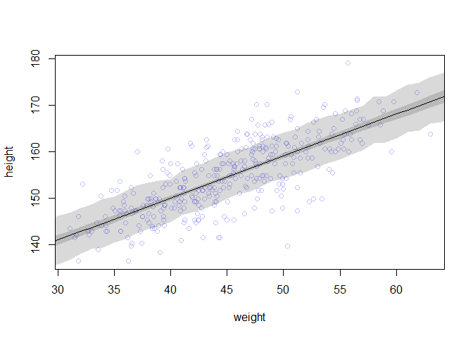

```r
## R code 4.42
# load data again, since it's a long way back
library(rethinking)
```

```
## Loading required package: rstan
```

```
## Warning: package 'rstan' was built under R version 3.5.3
```

```
## Loading required package: ggplot2
```

```
## Loading required package: StanHeaders
```

```
## Warning: package 'StanHeaders' was built under R version 3.5.3
```

```
## rstan (Version 2.18.2, GitRev: 2e1f913d3ca3)
```

```
## For execution on a local, multicore CPU with excess RAM we recommend calling
## options(mc.cores = parallel::detectCores()).
## To avoid recompilation of unchanged Stan programs, we recommend calling
## rstan_options(auto_write = TRUE)
```

```
## For improved execution time, we recommend calling
## Sys.setenv(LOCAL_CPPFLAGS = '-march=native')
## although this causes Stan to throw an error on a few processors.
```

```
## Loading required package: parallel
```

```
## rethinking (Version 1.88)
```

```r
data(Howell1)
d <- Howell1
d2 <- d[ d$age >= 18 , ]

# define the average weight, x-bar
xbar <- mean(d2$weight)

# fit model
m4.3 <- quap(
    alist(
        height ~ dnorm( mu , sigma ) ,
        mu <- a + b*( weight - xbar ) ,
        a ~ dnorm( 178 , 20 ) ,
        b ~ dlnorm( 0 , 1 ) ,
        sigma ~ dunif( 0 , 50 )
    ) ,
    data=d2 )

## R code 4.43
m4.3b <- quap(
    alist(
        height ~ dnorm( mu , sigma ) ,
        mu <- a + exp(log_b)*( weight - xbar ),
        a ~ dnorm( 178 , 100 ) ,
        log_b ~ dnorm( 0 , 1 ) ,
        sigma ~ dunif( 0 , 50 )
    ) ,
    data=d2 )

## R code 4.44
precis( m4.3 )
```

```
##              mean         sd        5.5%       94.5%
## a     154.6013736 0.27030737 154.1693702 155.0333770
## b       0.9032767 0.04192359   0.8362747   0.9702787
## sigma   5.0718753 0.19115426   4.7663739   5.3773768
```


```r
## R code 4.45
round( vcov( m4.3 ) , 3 )
```

```
##           a     b sigma
## a     0.073 0.000 0.000
## b     0.000 0.002 0.000
## sigma 0.000 0.000 0.037
```

```r
pairs(m4.3)
```

<!-- -->


```r
## R code 4.46
plot( height ~ weight , data=d2 , col=rangi2 )
post <- extract.samples( m4.3 )
a_map <- mean(post$a)
b_map <- mean(post$b)
curve( a_map + b_map*(x - xbar) , add=TRUE )
```

<!-- -->


```r
## R code 4.47
post <- extract.samples( m4.3 )
post[1:5,]
```

```
##          a         b    sigma
## 1 154.5529 0.9016711 5.079874
## 2 154.1648 0.9322217 5.159905
## 3 154.6979 0.9995297 5.057361
## 4 154.6762 0.8558146 4.842013
## 5 154.5299 0.9877014 4.939555
```


```r
## R code 4.48
N <- 10
dN <- d2[ 1:N , ]
mN <- quap(
    alist(
        height ~ dnorm( mu , sigma ) ,
        mu <- a + b*( weight - mean(weight) ) ,
        a ~ dnorm( 178 , 20 ) ,
        b ~ dlnorm( 0 , 1 ) ,
        sigma ~ dunif( 0 , 50 )
    ) , data=dN )

## R code 4.49
# extract 20 samples from the posterior
post <- extract.samples( mN , n=20 )

# display raw data and sample size
plot( dN$weight , dN$height ,
    xlim=range(d2$weight) , ylim=range(d2$height) ,
    col=rangi2 , xlab="weight" , ylab="height" )
mtext(concat("N = ",N))

# plot the lines, with transparency
for ( i in 1:20 )
    curve( post$a[i] + post$b[i]*(x-mean(dN$weight)) ,
        col=col.alpha("black",0.3) , add=TRUE )
```

<!-- -->


```r
## R code 4.48
N <- 100
dN <- d2[ 1:N , ]
mN <- quap(
    alist(
        height ~ dnorm( mu , sigma ) ,
        mu <- a + b*( weight - mean(weight) ) ,
        a ~ dnorm( 178 , 20 ) ,
        b ~ dlnorm( 0 , 1 ) ,
        sigma ~ dunif( 0 , 50 )
    ) , data=dN )

## R code 4.49
# extract 20 samples from the posterior
post <- extract.samples( mN , n=20 )

# display raw data and sample size
plot( dN$weight , dN$height ,
    xlim=range(d2$weight) , ylim=range(d2$height) ,
    col=rangi2 , xlab="weight" , ylab="height" )
mtext(concat("N = ",N))

# plot the lines, with transparency
for ( i in 1:20 )
    curve( post$a[i] + post$b[i]*(x-mean(dN$weight)) ,
        col=col.alpha("black",0.3) , add=TRUE )
```

<!-- -->


```r
## R code 4.48
N <- 300
dN <- d2[ 1:N , ]
mN <- quap(
    alist(
        height ~ dnorm( mu , sigma ) ,
        mu <- a + b*( weight - mean(weight) ) ,
        a ~ dnorm( 178 , 20 ) ,
        b ~ dlnorm( 0 , 1 ) ,
        sigma ~ dunif( 0 , 50 )
    ) , data=dN )

## R code 4.49
# extract 20 samples from the posterior
post <- extract.samples( mN , n=20 )

# display raw data and sample size
plot( dN$weight , dN$height ,
    xlim=range(d2$weight) , ylim=range(d2$height) ,
    col=rangi2 , xlab="weight" , ylab="height" )
mtext(concat("N = ",N))

# plot the lines, with transparency
for ( i in 1:20 )
    curve( post$a[i] + post$b[i]*(x-mean(dN$weight)) ,
        col=col.alpha("black",0.3) , add=TRUE )
```

<!-- -->


```r
## R code 4.50
post <- extract.samples( m4.3 )
mu_at_50 <- post$a + post$b * ( 50 - xbar )
```


```r
## R code 4.51
dens( mu_at_50 , col=rangi2 , lwd=2 , xlab="mu|weight=50" )
```

<!-- -->


```r
## R code 4.52
HPDI( mu_at_50 , prob=0.89 )
```

```
##    |0.89    0.89| 
## 158.5738 159.6668
```


```r
## R code 4.53
mu <- link( m4.3 )
str(mu)
```

```
##  num [1:1000, 1:352] 157 157 157 157 157 ...
```


```r
## R code 4.54
# define sequence of weights to compute predictions for
# these values will be on the horizontal axis
weight.seq <- seq( from=25 , to=70 , by=1 )

# use link to compute mu
# for each sample from posterior
# and for each weight in weight.seq
mu <- link( m4.3 , data=data.frame(weight=weight.seq) )
str(mu)
```

```
##  num [1:1000, 1:46] 136 135 136 137 136 ...
```


```r
## R code 4.55
# use type="n" to hide raw data
plot( height ~ weight , d2 , type="n" )

# loop over samples and plot each mu value
for ( i in 1:100 )
    points( weight.seq , mu[i,] , pch=16 , col=col.alpha(rangi2,0.1) )
```

<!-- -->


```r
## R code 4.56
# summarize the distribution of mu
mu.mean <- apply( mu , 2 , mean )
mu.HPDI <- apply( mu , 2 , HPDI , prob=0.89 )
mu.mean
```

```
##  [1] 136.5558 137.4588 138.3617 139.2646 140.1675 141.0705 141.9734
##  [8] 142.8763 143.7792 144.6822 145.5851 146.4880 147.3909 148.2939
## [15] 149.1968 150.0997 151.0026 151.9056 152.8085 153.7114 154.6144
## [22] 155.5173 156.4202 157.3231 158.2261 159.1290 160.0319 160.9348
## [29] 161.8378 162.7407 163.6436 164.5465 165.4495 166.3524 167.2553
## [36] 168.1582 169.0612 169.9641 170.8670 171.7699 172.6729 173.5758
## [43] 174.4787 175.3817 176.2846 177.1875
```

```r
mu.HPDI
```

```
##           [,1]     [,2]     [,3]     [,4]     [,5]     [,6]     [,7]
## |0.89 135.1997 136.1539 137.0902 138.0562 139.0182 139.9621 140.9715
## 0.89| 137.9898 138.8194 139.6336 140.4795 141.3254 142.1595 143.0572
##           [,8]     [,9]    [,10]    [,11]    [,12]    [,13]    [,14]
## |0.89 141.8818 142.8689 143.8305 144.8172 145.7551 146.7107 147.6194
## 0.89| 143.8520 144.7141 145.5694 146.4442 147.2676 148.1166 148.9284
##          [,15]    [,16]    [,17]    [,18]    [,19]    [,20]    [,21]
## |0.89 148.5893 149.5446 150.5021 151.4383 152.3624 153.2803 154.1956
## 0.89| 149.7904 150.6592 151.5258 152.3869 153.2628 154.1544 155.0442
##          [,22]    [,23]    [,24]    [,25]    [,26]    [,27]    [,28]
## |0.89 155.0758 155.9574 156.8380 157.7136 158.5771 159.4569 160.3064
## 0.89| 155.9378 156.8471 157.7894 158.7148 159.6515 160.6075 161.5484
##          [,29]    [,30]    [,31]    [,32]    [,33]    [,34]    [,35]
## |0.89 161.0877 161.9406 162.7989 163.6322 164.5156 165.3653 166.2357
## 0.89| 162.4310 163.3746 164.3372 165.2829 166.2701 167.2255 168.2120
##          [,36]    [,37]    [,38]    [,39]    [,40]    [,41]    [,42]
## |0.89 167.0339 167.9079 168.7115 169.5395 170.3987 171.2373 172.0652
## 0.89| 169.1329 170.1268 171.0502 172.0004 172.9839 173.9336 174.8894
##          [,43]    [,44]    [,45]    [,46]
## |0.89 172.8881 173.7099 174.5428 175.3941
## 0.89| 175.8396 176.7927 177.7467 178.7297
```


```r
## R code 4.57
# plot raw data
# fading out points to make line and interval more visible
plot( height ~ weight , data=d2 , col=col.alpha(rangi2,0.5) )

# plot the MAP line, aka the mean mu for each weight
lines( weight.seq , mu.mean )

# plot a shaded region for 89% HPDI
shade( mu.HPDI , weight.seq )
```

<!-- -->


```r
## R code 4.58
post <- extract.samples(m4.3)
mu.link <- function(weight) post$a + post$b*( weight - xbar )
weight.seq <- seq( from=25 , to=70 , by=1 )
mu <- sapply( weight.seq , mu.link )
mu.mean <- apply( mu , 2 , mean )
mu.HPDI <- apply( mu , 2 , HPDI , prob=0.89 )
mu.mean
```

```
##  [1] 136.5391 137.4425 138.3459 139.2493 140.1527 141.0561 141.9595
##  [8] 142.8629 143.7663 144.6697 145.5731 146.4765 147.3799 148.2833
## [15] 149.1868 150.0902 150.9936 151.8970 152.8004 153.7038 154.6072
## [22] 155.5106 156.4140 157.3174 158.2208 159.1242 160.0276 160.9310
## [29] 161.8344 162.7378 163.6413 164.5447 165.4481 166.3515 167.2549
## [36] 168.1583 169.0617 169.9651 170.8685 171.7719 172.6753 173.5787
## [43] 174.4821 175.3855 176.2889 177.1923
```

```r
mu.HPDI
```

```
##           [,1]     [,2]     [,3]     [,4]     [,5]     [,6]     [,7]
## |0.89 135.1192 136.0895 137.0507 138.0632 139.0250 139.9717 140.9179
## 0.89| 137.8989 138.7469 139.5864 140.4771 141.3134 142.1325 142.9606
##           [,8]    [,9]    [,10]    [,11]    [,12]    [,13]    [,14]
## |0.89 141.9357 142.883 143.8441 144.8272 145.7736 146.7071 147.6586
## 0.89| 143.8613 144.692 145.5420 146.4141 147.2490 148.0775 148.9301
##          [,15]    [,16]    [,17]    [,18]    [,19]    [,20]    [,21]
## |0.89 148.5745 149.5385 150.4967 151.3997 152.3331 153.2679 154.1788
## 0.89| 149.7531 150.6345 151.5182 152.3583 153.2401 154.1460 155.0490
##          [,22]    [,23]    [,24]    [,25]    [,26]    [,27]    [,28]
## |0.89 155.0762 155.9662 156.8206 157.7009 158.5848 159.4343 160.3047
## 0.89| 155.9500 156.8702 157.7712 158.7107 159.6676 160.6081 161.5809
##          [,29]    [,30]    [,31]    [,32]    [,33]    [,34]   [,35]
## |0.89 161.1793 161.9737 162.8528 163.6967 164.5658 165.3962 166.240
## 0.89| 162.5606 163.4645 164.4514 165.4090 166.3994 167.3498 168.319
##          [,36]    [,37]    [,38]    [,39]    [,40]    [,41]    [,42]
## |0.89 167.0807 167.9186 168.7451 169.5651 170.4034 171.2245 172.0536
## 0.89| 169.2866 170.2509 171.2032 172.1507 173.1146 174.0704 175.0318
##          [,43]    [,44]    [,45]    [,46]
## |0.89 172.9171 173.7417 174.5568 175.4106
## 0.89| 176.0238 176.9762 177.9186 178.8971
```


```r
## R code 4.59
sim.height <- sim( m4.3 , data=list(weight=weight.seq) )
str(sim.height)
```

```
##  num [1:1000, 1:46] 135 128 143 136 144 ...
```

```r
## R code 4.60
height.PI <- apply( sim.height , 2 , PI , prob=0.89 )

## R code 4.61
# plot raw data
plot( height ~ weight , d2 , col=col.alpha(rangi2,0.5) )

# draw MAP line
lines( weight.seq , mu.mean )

# draw HPDI region for line
shade( mu.HPDI , weight.seq )

# draw PI region for simulated heights
shade( height.PI , weight.seq )
```

<!-- -->

```r
## R code 4.59
sim.height <- sim( m4.3 , data=list(weight=weight.seq) )
str(sim.height)
```

```
##  num [1:1000, 1:46] 140 140 122 137 143 ...
```

```r
## R code 4.60
height.PI <- apply( sim.height , 2 , PI , prob=0.67 )

## R code 4.61
# plot raw data
plot( height ~ weight , d2 , col=col.alpha(rangi2,0.5) )

# draw MAP line
lines( weight.seq , mu.mean )

# draw HPDI region for line
shade( mu.HPDI , weight.seq )

# draw PI region for simulated heights
shade( height.PI , weight.seq )
```

<!-- -->


```r
## R code 4.62
sim.height <- sim( m4.3 , data=list(weight=weight.seq) , n=1e4 )
height.PI <- apply( sim.height , 2 , PI , prob=0.89 )
```


```r
## R code 4.61
# plot raw data
plot( height ~ weight , d2 , col=col.alpha(rangi2,0.5) )

# draw MAP line
lines( weight.seq , mu.mean )

# draw HPDI region for line
shade( mu.HPDI , weight.seq )

# draw PI region for simulated heights
shade( height.PI , weight.seq )
```

<!-- -->


```r
## R code 4.63
post <- extract.samples(m4.3)
weight.seq <- 25:70
sim.height <- sapply( weight.seq , function(weight)
    rnorm(
        n=nrow(post) ,
        mean=post$a + post$b*( weight - xbar ) ,
        sd=post$sigma ) )
height.PI <- apply( sim.height , 2 , PI , prob=0.89 )
```


```r
## R code 4.64
library(rethinking)
data(Howell1)
d <- Howell1
str(d)
```

```
## 'data.frame':	544 obs. of  4 variables:
##  $ height: num  152 140 137 157 145 ...
##  $ weight: num  47.8 36.5 31.9 53 41.3 ...
##  $ age   : num  63 63 65 41 51 35 32 27 19 54 ...
##  $ male  : int  1 0 0 1 0 1 0 1 0 1 ...
```

```r
## R code 4.68
plot( height ~ weight , d , col=col.alpha(rangi2,0.5) )
```

<!-- -->


```r
## R code 4.65
d$weight_s <- ( d$weight - mean(d$weight) )/sd(d$weight)
d$weight_s2 <- d$weight_s^2
m4.5 <- quap(
    alist(
        height ~ dnorm( mu , sigma ) ,
        mu <- a + b1*weight_s + b2*weight_s2 ,
        a ~ dnorm( 178 , 20 ) ,
        b1 ~ dlnorm( 0 , 1 ) ,
        b2 ~ dnorm( 0 , 1 ) ,
        sigma ~ dunif( 0 , 50 )
    ) ,
    data=d )

## R code 4.66
precis( m4.5 )
```

```
##             mean        sd       5.5%      94.5%
## a     146.057420 0.3689760 145.467725 146.647115
## b1     21.733062 0.2888894  21.271361  22.194763
## b2     -7.803271 0.2741841  -8.241470  -7.365071
## sigma   5.774481 0.1764657   5.492455   6.056508
```


```r
## R code 4.67
weight.seq <- seq( from=-2.2 , to=2 , length.out=30 )
pred_dat <- list( weight_s=weight.seq , weight_s2=weight.seq^2 )
mu <- link( m4.5 , data=pred_dat )
mu.mean <- apply( mu , 2 , mean )
mu.PI <- apply( mu , 2 , PI , prob=0.89 )
sim.height <- sim( m4.5 , data=pred_dat )
height.PI <- apply( sim.height , 2 , PI , prob=0.89 )

## R code 4.68
plot( height ~ weight_s , d , col=col.alpha(rangi2,0.5) )
lines( weight.seq , mu.mean )
shade( mu.PI , weight.seq )
shade( height.PI , weight.seq )
```

<!-- -->


```r
## R code 4.69
d$weight_s3 <- d$weight_s^3
m4.6 <- quap(
    alist(
        height ~ dnorm( mu , sigma ) ,
        mu <- a + b1*weight_s + b2*weight_s2 + b3*weight_s3 ,
        a ~ dnorm( 178 , 20 ) ,
        b1 ~ dlnorm( 0 , 1 ) ,
        b2 ~ dnorm( 0 , 10 ) ,
        b3 ~ dnorm( 0 , 10 ) ,
        sigma ~ dunif( 0 , 50 )
    ) ,
    data=d )

## R code 4.70
plot( height ~ weight_s , d , col=col.alpha(rangi2,0.5) , xaxt="n" )

## R code 4.71
at <- c(-2,-1,0,1,2)
labels <- at*sd(d$weight) + mean(d$weight)
axis( side=1 , at=at , labels=round(labels,1) )
```

<!-- -->


```r
## R code 4.72
library(rethinking)
data(cherry_blossoms)
d <- cherry_blossoms
precis(d)
```

```
##                   mean          sd      5.5%      94.5%       histogram
## year       1408.000000 350.8845964 867.77000 1948.23000   ▇▇▇▇▇▇▇▇▇▇▇▇▁
## doy         104.540508   6.4070362  94.43000  115.00000        ▁▂▅▇▇▃▁▁
## temp          6.141886   0.6636479   5.15000    7.29470        ▁▃▅▇▃▂▁▁
## temp_upper    7.185151   0.9929206   5.89765    8.90235 ▁▂▅▇▇▅▂▂▁▁▁▁▁▁▁
## temp_lower    5.098941   0.8503496   3.78765    6.37000 ▁▁▁▁▁▁▁▃▅▇▃▂▁▁▁
```


```r
## R code 4.73
d2 <- d[ complete.cases(d$temp) , ] # complete cases on temp
num_knots <- 15
knot_list <- quantile( d2$year , probs=seq(0,1,length.out=num_knots) )
knot_list
```

```
##        0% 7.142857% 14.28571% 21.42857% 28.57143% 35.71429% 42.85714% 
##  839.0000  937.2143 1017.4286 1097.6429 1177.8571 1258.0714 1338.2857 
##       50% 57.14286% 64.28571% 71.42857% 78.57143% 85.71429% 92.85714% 
## 1418.5000 1498.7143 1578.9286 1659.1429 1739.3571 1819.5714 1899.7857 
##      100% 
## 1980.0000
```


```r
## R code 4.74
library(splines)
B <- bs(d2$year,
    knots=knot_list[-c(1,num_knots)] ,
    degree=3 , intercept=TRUE )

## R code 4.75
plot( NULL , xlim=range(d2$year) , ylim=c(0,1) , xlab="year" , ylab="basis value" )
for ( i in 1:ncol(B) ) lines( d2$year , B[,i] )
```

<!-- -->


```r
## R code 4.76
m4.7 <- quap(
    alist(
        T ~ dnorm( mu , sigma ) ,
        mu <- a + B %*% w ,
        a ~ dnorm(6,10),
        w ~ dnorm(0,1),
        sigma ~ dexp(1)
    ),
    data=list( T=d2$temp , B=B ) ,
    start=list( w=rep( 0 , ncol(B) ) ) )
```

```
## Caution, model may not have converged.
```

```
## Code 1: Maximum iterations reached.
```

```r
## R code 4.77
post <- extract.samples(m4.7)
w <- apply( post$w , 2 , mean )
plot( NULL , xlim=range(d2$year) , ylim=c(-2,2) ,
    xlab="year" , ylab="basis * weight" )
for ( i in 1:ncol(B) ) lines( d2$year , w[i]*B[,i] )
```

<!-- -->


```r
## R code 4.78
mu <- link( m4.7 )
mu_PI <- apply(mu,2,PI,0.97)
plot( d2$year , d2$temp , col=col.alpha(rangi2,0.3) , pch=16 )
shade( mu_PI , d2$year , col=col.alpha("black",0.5) )
```

<!-- -->

## 4.7. Practice

### 4M4, A sample of students is measured for height each year for 3 years. After the third year, you want to fit a linear regression predicting height using year as a predictor. Write down the mathematical model definition for this regression, using any variable names and priors you choose. Be prepared to defend your choice of priors.

> hi ~ Normal(mu, sigma)

> mu <- a + b*xi

> a ~ Normal(163, 30)

> b ~ Normal(2, 1)

> sigma ~ Uniform(0, 20)

> I assume these are college ages students in UC Davis. For the prior a, I chose a normal distribution centered on 163 cm with an SD of 30 cm (because 163 cm is my height). And the prior b, I chose a normal distribution centered on 2 cm/year with an SD of 1 cm/year (because I don't think I will grow any taller). I chose a uniform distribution from 0 cm to 20 cm.


### 4M5, Now suppose I tell you that the average height in the first year was 120 cm and that every student got taller each year. Does this information lead you to change your choice of priors? How?

> Yes! These data are not from college ages students. I changed the prior a, I chose a normal distribution centered on 120 cm with an SD of 30 cm. Also, I changed the prior b, I chose a normal distribution centered on 5 cm/year with an SD of 3 cm/year.

> hi ~ Normal(mu, sigma)

> mu <- a + b*xi

> a ~ Normal(120, 30)

> b ~ Normal(5, 3)

> sigma ~ Uniform(0, 20)

### 4M6, Now suppose I tell you that the variance among heights for students of the same age is never more than 64cm. How does this lead you to revise your priors? 

> Because the variance is the square of SD, if we know that the variance among heights for students of the same age is never more than 64 cm, then SD should be less than 8 cm.

> hi ~ Normal(mu, sigma)

> mu <- a + b*xi

> a ~ Normal(120, 30)

> b ~ Normal(5, 3)

> sigma ~ Uniform(0, 8)

### 4H1, The weights listed below were recorded in the !Kung census, but heights were not recorded for these individuals. Provide predicted heights and 89% intervals (either HPDI or PI) for each of these individuals. That is, fill in the table below, using model-based predictions.

Individual weight expected height 89% interval
1 46.95
2 43.72
3 64.78
4 32.59
5 54.63


```r
## change from R code 4.42
# load data again, since it's a long way back
library(rethinking)
data(Howell1)
d <- Howell1

# fit model
m4H1 <- quap(
    alist(
        height ~ dnorm( mu , sigma ) ,
        mu <- a + b* weight ,
        a ~ dnorm( 178 , 20 ) ,
        b ~ dlnorm( 0 , 1 ) ,
        sigma ~ dunif( 0 , 50 )
    ) ,
    data=d )

## change from R code 4.54
# define sequence of weights to compute predictions 
i_weight <- c(46.95, 43.72, 64.78, 32.59, 54.63)

# use link to compute expected height
# for each sample from posterior
expected_height <- link( m4H1 , data=data.frame(weight=i_weight) )
str(expected_height)
```

```
##  num [1:1000, 1:5] 158 159 158 158 158 ...
```


```r
## change from R code 4.56
# summarize the distribution of expected_height
height.mean <- apply( expected_height , 2 , mean )
height.HPDI <- apply( expected_height , 2 , HPDI , prob=0.89 )
height.mean
```

```
## [1] 158.2131 152.5388 189.5358 132.9862 171.7049
```

```r
height.HPDI
```

```
##           [,1]     [,2]     [,3]     [,4]     [,5]
## |0.89 157.5761 151.9183 188.1737 132.3724 170.6781
## 0.89| 159.0652 153.2831 190.8151 133.6668 172.6126
```

```r
new_table = data.frame( 
  individual = 1:5,  
  weight = i_weight,  
  expected_height = height.mean,  
  HPDI89_lower = height.HPDI[1, ],  
  HPDI89_upper = height.HPDI[2, ] 
)
new_table
```

```
##   individual weight expected_height HPDI89_lower HPDI89_upper
## 1          1  46.95        158.2131     157.5761     159.0652
## 2          2  43.72        152.5388     151.9183     153.2831
## 3          3  64.78        189.5358     188.1737     190.8151
## 4          4  32.59        132.9862     132.3724     133.6668
## 5          5  54.63        171.7049     170.6781     172.6126
```


```r
## change from R code 4.59
sim.height <- sim( m4H1 , data=list(weight=i_weight) )
str(sim.height)
```

```
##  num [1:1000, 1:5] 174 153 154 167 158 ...
```

```r
## change from R code 4.60
sim_height.mean <- apply( sim.height , 2 , mean )
sim_height.HPDI <- apply( sim.height , 2 , HPDI , prob=0.89 )
sim_height.mean
```

```
## [1] 158.1730 153.0246 189.2911 133.1036 171.4359
```

```r
sim_height.HPDI
```

```
##           [,1]     [,2]     [,3]     [,4]     [,5]
## |0.89 144.1285 138.7764 173.5986 119.0233 157.1269
## 0.89| 173.4040 168.4778 202.7486 147.6070 185.2783
```

```r
new_table2 = data.frame( 
  individual = 1:5,  
  weight = i_weight,  
  expected_height = sim_height.mean,  
  HPDI89_lower = sim_height.HPDI[1, ],  
  HPDI89_upper = sim_height.HPDI[2, ] 
)
new_table2
```

```
##   individual weight expected_height HPDI89_lower HPDI89_upper
## 1          1  46.95        158.1730     144.1285     173.4040
## 2          2  43.72        153.0246     138.7764     168.4778
## 3          3  64.78        189.2911     173.5986     202.7486
## 4          4  32.59        133.1036     119.0233     147.6070
## 5          5  54.63        171.4359     157.1269     185.2783
```


### 4H2 Select out all the rows in the Howell1 data with ages below 18 years of age. If you do it right, you should end up with a new data frame with 192 rows in it.


```r
## change from R code 4.42
# load data again, since it's a long way back
library(rethinking)
data(Howell1)
d <- Howell1
d4H2 <- d[ d$age < 18 , ]
str(d4H2)
```

```
## 'data.frame':	192 obs. of  4 variables:
##  $ height: num  121.9 105.4 86.4 129.5 109.2 ...
##  $ weight: num  19.6 13.9 10.5 23.6 16 ...
##  $ age   : num  12 8 6.5 13 7 17 16 11 17 8 ...
##  $ male  : int  1 0 0 1 0 1 0 1 0 1 ...
```


#### (a) Fit a linear regression to these data, using quap. Present and interpret the estimates. For every 10 units of increase in weight, how much taller does the model predict a child gets?


```r
# fit model
m4H2 <- quap(
    alist(
        height ~ dnorm( mu , sigma ) ,
        mu <- a + b* weight ,
        a ~ dnorm( 178 , 20 ) ,
        b ~ dlnorm( 0 , 1 ) ,
        sigma ~ dunif( 0 , 50 )
    ) ,
    data=d4H2 )

precis(m4H2)
```

```
##            mean        sd      5.5%     94.5%
## a     58.876206 1.3964861 56.644351 61.108060
## b      2.691032 0.0682815  2.581905  2.800159
## sigma  8.441803 0.4312723  7.752547  9.131059
```

> For every 10 units of increase in weight, the model predict a child gets 26.9 cm taller.

#### (b) Plot the raw data, with height on the vertical axis and weight on the horizontal axis. Super-impose the MAP regression line and 89% HPDI for the mean. Also superimpose the 89% HPDI for predicted heights.


```r
## change from R code 4.54
# define sequence of weights to compute predictions for
# these values will be on the horizontal axis
weight.seq <- seq( from= min(d4H2$weight) , to= max(d4H2$weight) , by=1 )

# use link to compute mu
# for each sample from posterior
# and for each weight in weight.seq
mu <- link( m4H2 , data=data.frame(weight=weight.seq) )
str(mu)
```

```
##  num [1:1000, 1:41] 71.4 69.8 72 68.2 69.3 ...
```

```r
## change from R code 4.56
# summarize the distribution of mu
mu.mean <- apply( mu , 2 , mean )
mu.HPDI <- apply( mu , 2 , HPDI , prob=0.89 )
mu.mean
```

```
##  [1]  70.27238  72.96756  75.66274  78.35792  81.05310  83.74829  86.44347
##  [8]  89.13865  91.83383  94.52901  97.22419  99.91937 102.61455 105.30973
## [15] 108.00491 110.70009 113.39527 116.09045 118.78563 121.48081 124.17599
## [22] 126.87117 129.56635 132.26153 134.95671 137.65189 140.34707 143.04225
## [29] 145.73743 148.43261 151.12779 153.82297 156.51815 159.21333 161.90851
## [36] 164.60369 167.29887 169.99405 172.68923 175.38441 178.07959
```

```r
mu.HPDI
```

```
##           [,1]     [,2]     [,3]     [,4]     [,5]     [,6]     [,7]
## |0.89 68.46509 71.17780 74.10014 76.83984 79.55221 82.47154 85.22358
## 0.89| 72.02152 74.58916 77.34237 79.90355 82.44509 85.18296 87.78593
##           [,8]     [,9]    [,10]    [,11]     [,12]    [,13]    [,14]
## |0.89 87.87976 90.63856 93.45639 96.25113  99.06092 101.6615 104.2729
## 0.89| 90.31459 92.92449 95.62952 98.33861 101.07014 103.6321 106.1927
##          [,15]    [,16]    [,17]    [,18]    [,19]    [,20]    [,21]
## |0.89 106.9859 109.5749 112.2875 114.9280 117.7435 120.3951 123.0358
## 0.89| 108.8864 111.5066 114.2982 117.0237 119.9312 122.6540 125.3958
##          [,22]    [,23]    [,24]    [,25]    [,26]    [,27]    [,28]
## |0.89 125.7496 128.3707 130.9766 133.6273 136.2138 138.8194 141.4770
## 0.89| 128.2323 130.9933 133.7413 136.5440 139.3251 142.1169 144.9905
##          [,29]    [,30]    [,31]    [,32]    [,33]    [,34]    [,35]
## |0.89 143.9387 146.7064 149.2782 151.6821 154.2760 156.8890 159.5301
## 0.89| 147.6610 150.6232 153.3827 155.9791 158.7192 161.5101 164.3365
##          [,36]    [,37]    [,38]    [,39]    [,40]    [,41]
## |0.89 162.1423 164.7367 167.3249 169.9202 172.3912 175.3210
## 0.89| 167.1223 169.9171 172.7212 175.5306 178.1953 181.3003
```

```r
## change from R code 4.61
# plot raw data
plot( height ~ weight , d4H2 , col=col.alpha(rangi2,0.5) )

# draw MAP line
lines( weight.seq , mu.mean )

# draw HPDI region for line
shade( mu.HPDI , weight.seq )


## R code 4.59
sim.height <- sim( m4H2 , data=list(weight=weight.seq) )
str(sim.height)
```

```
##  num [1:1000, 1:41] 79.2 61.7 72.2 73.5 76.1 ...
```

```r
## R code 4.60
sim.height.HPDI <- apply( sim.height , 2 , HPDI , prob=0.89 )

# draw PI region for simulated heights
shade( sim.height.HPDI , weight.seq )
```

<!-- -->


#### (c) What aspects of the model fit concern you? Describe the kinds of assumptions you would change, if any, to improve the model. You don’t have to write any new code. Just explain what the model appears to be doing a bad job of, and what you hypothesize would be a better model.


```r
## R code 4.65
d4H2$weight_s <- ( d4H2$weight - mean(d4H2$weight) )/sd(d4H2$weight)
d4H2$weight_s2 <- d4H2$weight_s^2
m4H2c <- quap(
    alist(
        height ~ dnorm( mu , sigma ) ,
        mu <- a + b1*weight_s + b2*weight_s2 ,
        a ~ dnorm( 178 , 20 ) ,
        b1 ~ dlnorm( 0 , 1 ) ,
        b2 ~ dnorm( 0 , 1 ) ,
        sigma ~ dunif( 0 , 50 )
    ) ,
    data=d4H2 )

precis( m4H2c )
```

```
##             mean        sd       5.5%      94.5%
## a     113.879589 0.3938955 113.250068 114.509110
## b1     28.864167 0.3696139  28.273453  29.454882
## b2     -5.574955 0.2460298  -5.968158  -5.181751
## sigma   4.279901 0.2205400   3.927435   4.632366
```


```r
## change from R code 4.67
weight.seq <- seq( from=-2.2 , to=2 , length.out=30 )
pred_dat <- list( weight_s=weight.seq , weight_s2=weight.seq^2 )
mu <- link( m4H2c , data=pred_dat )

mu.mean <- apply( mu , 2 , mean )
mu.PI <- apply( mu , 2 , PI , prob=0.89 )

sim.height <- sim( m4H2c , data=pred_dat )
height.PI <- apply( sim.height , 2 , PI , prob=0.89 )

## change from R code 4.68
plot( height ~ weight_s , d4H2 , col=col.alpha(rangi2,0.5) )
lines( weight.seq , mu.mean )
shade( mu.PI , weight.seq )
shade( height.PI , weight.seq )
```

<!-- -->

