# The Many Variables & The Spurious Waffles
## 5.1. Spurious association


```r
## R code 5.1
# load data and copy
library(rethinking)
```

```
## Loading required package: rstan
```

```
## Warning: package 'rstan' was built under R version 3.5.3
```

```
## Loading required package: ggplot2
```

```
## Loading required package: StanHeaders
```

```
## Warning: package 'StanHeaders' was built under R version 3.5.3
```

```
## rstan (Version 2.18.2, GitRev: 2e1f913d3ca3)
```

```
## For execution on a local, multicore CPU with excess RAM we recommend calling
## options(mc.cores = parallel::detectCores()).
## To avoid recompilation of unchanged Stan programs, we recommend calling
## rstan_options(auto_write = TRUE)
```

```
## For improved execution time, we recommend calling
## Sys.setenv(LOCAL_CPPFLAGS = '-march=native')
## although this causes Stan to throw an error on a few processors.
```

```
## Loading required package: parallel
```

```
## rethinking (Version 1.88)
```

```r
data(WaffleDivorce)
d <- WaffleDivorce

# standardize variables
d$A <- scale( d$MedianAgeMarriage )
d$D <- scale( d$Divorce )
```


```r
## R code 5.2
sd( d$MedianAgeMarriage )
```

```
## [1] 1.24363
```


```r
## R code 5.3
m5.1 <- quap(
    alist(
        D ~ dnorm( mu , sigma ) ,
        mu <- a + bA * A ,
        a ~ dnorm( 0 , 0.2 ) ,
        bA ~ dnorm( 0 , 0.5 ) ,
        sigma ~ dexp( 1 )
    ) , data = d )
```


```r
## R code 5.4
set.seed(10)
prior <- extract.prior( m5.1 )
mu <- link( m5.1 , post=prior , data=list( A=c(-2,2) ) )
plot( NULL , xlim=c(-2,2) , ylim=c(-2,2) )
for ( i in 1:50 ) lines( c(-2,2) , mu[i,] , col=col.alpha("black",0.4) )
```

<!-- -->


```r
## R code 5.5
# compute percentile interval of mean
A_seq <- seq( from=-3 , to=3.2 , length.out=30 )
mu <- link( m5.1 , data=list(A=A_seq) )
mu.mean <- apply( mu , 2, mean )
mu.PI <- apply( mu , 2 , PI )

# plot it all
plot( D ~ A , data=d , col=rangi2 )
lines( A_seq , mu.mean , lwd=2 )
shade( mu.PI , A_seq )
```

<!-- -->


```r
## R code 5.6
d$M <- scale( d$Marriage )
m5.2 <- quap(
    alist(
        D ~ dnorm( mu , sigma ) ,
        mu <- a + bM * M ,
        a ~ dnorm( 0 , 0.2 ) ,
        bM ~ dnorm( 0 , 0.5 ) ,
        sigma ~ dexp( 1 )
    ) , data = d )
```


```r
## R code 5.4
set.seed(10)
prior <- extract.prior( m5.2 )
mu <- link( m5.2 , post=prior , data=list( M=c(-2,2) ) )
plot( NULL , xlim=c(-2,2) , ylim=c(-2,2) )
for ( i in 1:50 ) lines( c(-2,2) , mu[i,] , col=col.alpha("black",0.4) )
```

<!-- -->


```r
## R code 5.5
# compute percentile interval of mean
M_seq <- seq( from=-3 , to=3.2 , length.out=30 )
mu <- link( m5.2 , data=list(M=M_seq) )
mu.mean <- apply( mu , 2, mean )
mu.PI <- apply( mu , 2 , PI )

# plot it all
plot( D ~ M , data=d , col=rangi2 )
lines( M_seq , mu.mean , lwd=2 )
shade( mu.PI , M_seq )
```

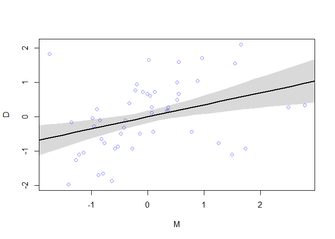<!-- -->

### 5.1.1. Think before you regress.


```r
## R code 5.7
#install.packages('dagitty')
library(dagitty)
dag5.1 <- dagitty( "dag {
    A -> D
    A -> M
    M -> D
}")
coordinates(dag5.1) <- list( x=c(A=0,D=1,M=2) , y=c(A=0,D=1,M=0) )
plot( dag5.1 )
```

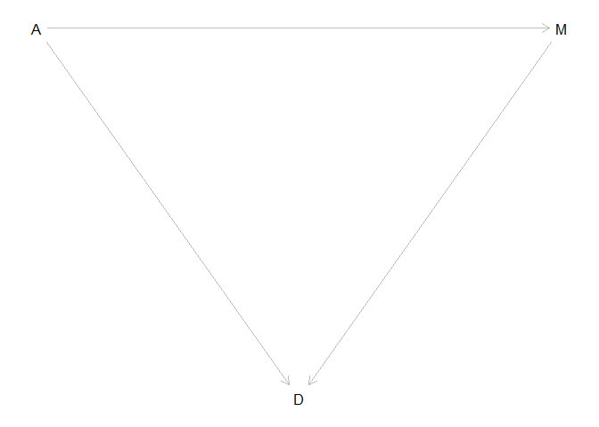<!-- -->

### 5.1.2. Multiple regression notation. 


```r
## R code 5.8
m5.3 <- quap(
    alist(
        D ~ dnorm( mu , sigma ) ,
        mu <- a + bM*M + bA*A ,
        a ~ dnorm( 0 , 0.2 ) ,
        bM ~ dnorm( 0 , 0.5 ) ,
        bA ~ dnorm( 0 , 0.5 ) ,
        sigma ~ dexp( 1 )
    ) , data = d )
precis( m5.3 )
```

```
##                mean         sd       5.5%      94.5%
## a     -1.100372e-05 0.09708000 -0.1551636  0.1551416
## bM    -6.537672e-02 0.15078010 -0.3063524  0.1755990
## bA    -6.135168e-01 0.15099056 -0.8548289 -0.3722047
## sigma  7.851600e-01 0.07785376  0.6607347  0.9095854
```

```r
## R code 5.9
plot(coeftab(m5.1,m5.2,m5.3), par=c("bA","bM") )
```

<!-- -->


```r
## R code 5.10
N <- 50 # number of simulated States
age <- rnorm( N )        # sim A
mar <- rnorm( N , age )  # sim A -> M
div <- rnorm( N , age )  # sim A -> D
```

### 5.1.4. Plotting multivariate posteriors.


```r
## R code 5.11
m5.4 <- quap(
    alist(
        M ~ dnorm( mu , sigma ) ,
        mu <- a + bAM * A ,
        a ~ dnorm( 0 , 0.2 ) ,
        bAM ~ dnorm( 0 , 0.5 ) ,
        sigma ~ dexp( 1 )
    ) , data = d )
```


```r
## R code 5.12
mu <- link(m5.4)
mu_mean <- apply( mu , 2 , mean )
mu_resid <- d$M - mu_mean
```


```r
## R code 5.13
# prepare new counterfactual data
M_seq <- seq( from=-2 , to=3 , length.out=30 )
pred_data <- data.frame( M = M_seq , A = 0 )

# compute counterfactual mean divorce (mu)
mu <- link( m5.3 , data=pred_data )
mu_mean <- apply( mu , 2 , mean )
mu_PI <- apply( mu , 2 , PI )

# simulate counterfactual divorce outcomes
D_sim <- sim( m5.3 , data=pred_data , n=1e4 )
D_PI <- apply( D_sim , 2 , PI )

# display predictions, hiding raw data with type="n"
plot( D ~ M , data=d , type="n" )
mtext( "Median age marriage (std) = 0" )
lines( M_seq , mu_mean )
shade( mu_PI , M_seq )
shade( D_PI , M_seq )
```

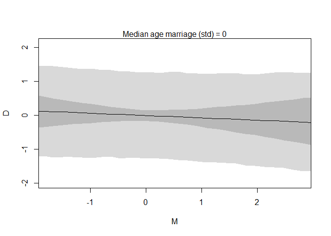<!-- -->


```r
## R code 5.13
# prepare new counterfactual data
A_seq <- seq( from=-3 , to=4 , length.out=30 )
pred_data <- data.frame( A = A_seq , M = 0 )

# compute counterfactual mean divorce (mu)
mu <- link( m5.3 , data=pred_data )
mu_mean <- apply( mu , 2 , mean )
mu_PI <- apply( mu , 2 , PI )

# simulate counterfactual divorce outcomes
D_sim <- sim( m5.3 , data=pred_data , n=1e4 )
D_PI <- apply( D_sim , 2 , PI )

# display predictions, hiding raw data with type="n"
plot( D ~ A , data=d , type="n" )
mtext( "Median age marriage (std) = 0" )
lines( A_seq , mu_mean )
shade( mu_PI , A_seq )
shade( D_PI , A_seq )
```

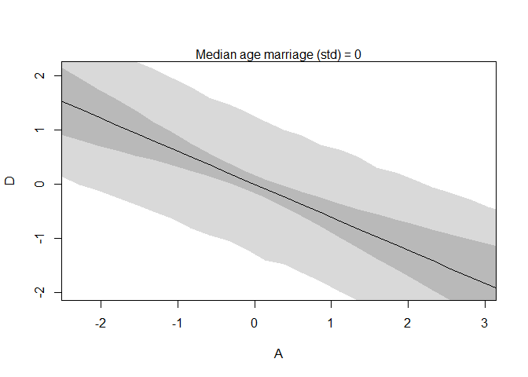<!-- -->


```r
## R code 5.14
# call link without specifying new data
# so it uses original data
mu <- link( m5.3 )

# summarize samples across cases
mu_mean <- apply( mu , 2 , mean )
mu_PI <- apply( mu , 2 , PI )

# simulate observations
# again no new data, so uses original data
D_sim <- sim( m5.3 , n=1e4 )
D_PI <- apply( D_sim , 2 , PI )
```


```r
## R code 5.15
plot( mu_mean ~ d$D , col=rangi2 , ylim=range(mu_PI) ,
    xlab="Observed divorce" , ylab="Predicted divorce" )
abline( a=0 , b=1 , lty=2 )
for ( i in 1:nrow(d) ) lines( rep(d$D[i],2) , mu_PI[,i] , col=rangi2 )

## R code 5.16
identify( x=d$D , y=mu_mean , labels=d$Loc )
```

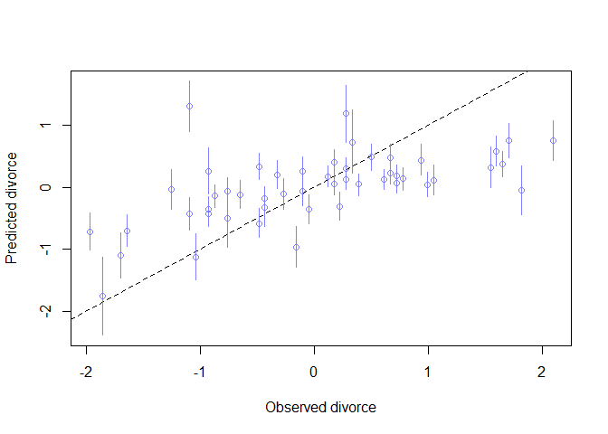<!-- -->

```
## integer(0)
```


```r
## R code 5.17
N <- 100                         # number of cases
x_real <- rnorm( N )             # x_real as Gaussian with mean 0 and stddev 1
x_spur <- rnorm( N , x_real )    # x_spur as Gaussian with mean=x_real
y <- rnorm( N , x_real )         # y as Gaussian with mean=x_real
d <- data.frame(y,x_real,x_spur) # bind all together in data frame
```

## 5.2. Masked relationship


```r
## R code 5.18
library(rethinking)
data(milk)
d <- milk
str(d)
```

```
## 'data.frame':	29 obs. of  8 variables:
##  $ clade         : Factor w/ 4 levels "Ape","New World Monkey",..: 4 4 4 4 4 2 2 2 2 2 ...
##  $ species       : Factor w/ 29 levels "A palliata","Alouatta seniculus",..: 11 8 9 10 16 2 1 6 28 27 ...
##  $ kcal.per.g    : num  0.49 0.51 0.46 0.48 0.6 0.47 0.56 0.89 0.91 0.92 ...
##  $ perc.fat      : num  16.6 19.3 14.1 14.9 27.3 ...
##  $ perc.protein  : num  15.4 16.9 16.9 13.2 19.5 ...
##  $ perc.lactose  : num  68 63.8 69 71.9 53.2 ...
##  $ mass          : num  1.95 2.09 2.51 1.62 2.19 5.25 5.37 2.51 0.71 0.68 ...
##  $ neocortex.perc: num  55.2 NA NA NA NA ...
```


```r
## R code 5.19
d$K <- scale( d$kcal.per.g )
d$N <- scale( d$neocortex.perc )
d$M <- scale( log(d$mass) )
```


```r
## R code 5.20
#m5.5_draft <- quap(
#    alist(
#        K ~ dnorm( mu , sigma ) ,
#        mu <- a + bN*N ,
#        a ~ dnorm( 0 , 1 ) ,
#        bN ~ dnorm( 0 , 1 ) ,
#        sigma ~ dexp( 1 )
#    ) , data=d )
```


```r
## R code 5.21
d$neocortex.perc
```

```
##  [1] 55.16    NA    NA    NA    NA 64.54 64.54 67.64    NA 68.85 58.85
## [12] 61.69 60.32    NA    NA 69.97    NA 70.41    NA 73.40    NA 67.53
## [23]    NA 71.26 72.60    NA 70.24 76.30 75.49
```


```r
## R code 5.22
dcc <- d[ complete.cases(d$K,d$N,d$M) , ]
```


```r
## R code 5.23
m5.5_draft <- quap(
    alist(
        K ~ dnorm( mu , sigma ) ,
        mu <- a + bN*N ,
        a ~ dnorm( 0 , 1 ) ,
        bN ~ dnorm( 0 , 1 ) ,
        sigma ~ dexp( 1 )
    ) , data=dcc )
```


```r
## R code 5.24
prior <- extract.prior( m5.5_draft )
xseq <- c(-2,2)
mu <- link( m5.5_draft , post=prior , data=list(N=xseq) )
plot( NULL , xlim=xseq , ylim=xseq )
for ( i in 1:50 ) lines( xseq , mu[i,] , col=col.alpha("black",0.3) )
```

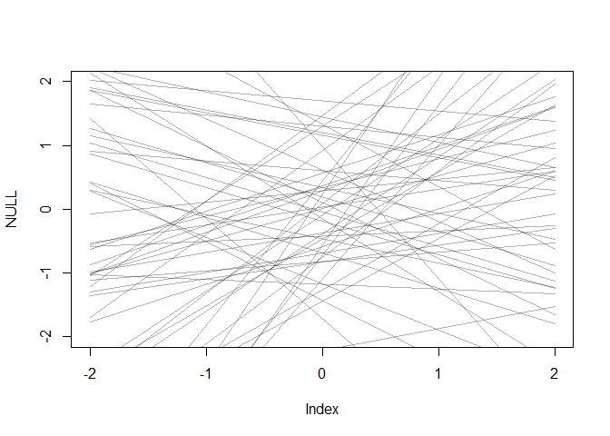<!-- -->


```r
## R code 5.25
m5.5 <- quap(
    alist(
        K ~ dnorm( mu , sigma ) ,
        mu <- a + bN*N ,
        a ~ dnorm( 0 , 0.2 ) ,
        bN ~ dnorm( 0 , 0.5 ) ,
        sigma ~ dexp( 1 )
    ) , data=dcc )

## R code 5.26
precis( m5.5 )
```

```
##             mean        sd       5.5%     94.5%
## a     0.03993986 0.1544908 -0.2069663 0.2868460
## bN    0.13323453 0.2237470 -0.2243564 0.4908255
## sigma 0.99982111 0.1647084  0.7365853 1.2630569
```

```r
## R code 5.24
prior <- extract.prior( m5.5 )
xseq <- c(-2,2)
mu <- link( m5.5 , post=prior , data=list(N=xseq) )
plot( NULL , xlim=xseq , ylim=xseq )
for ( i in 1:50 ) lines( xseq , mu[i,] , col=col.alpha("black",0.3) )
```

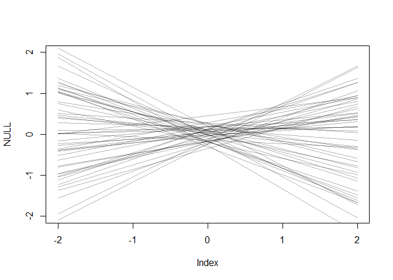<!-- -->


```r
## R code 5.27
xseq <- seq( from=min(dcc$N)-0.15 , to=max(dcc$N)+0.15 , length.out=30 )
mu <- link( m5.5 , data=list(N=xseq) )
mu_mean <- apply(mu,2,mean)
mu_PI <- apply(mu,2,PI)
plot( K ~ N , data=dcc )
lines( xseq , mu_mean , lwd=2 )
shade( mu_PI , xseq )
```

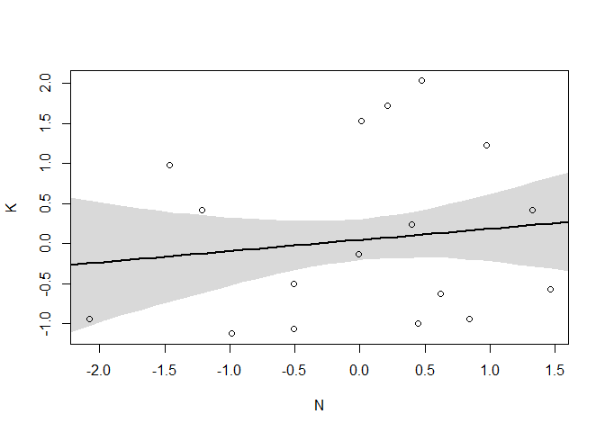<!-- -->


```r
## R code 5.28
m5.6 <- quap(
    alist(
        K ~ dnorm( mu , sigma ) ,
        mu <- a + bM*M ,
        a ~ dnorm( 0 , 0.2 ) ,
        bM ~ dnorm( 0 , 0.5 ) ,
        sigma ~ dexp( 1 )
    ) , data=dcc )
precis(m5.6)
```

```
##              mean        sd       5.5%     94.5%
## a      0.04653203 0.1512861 -0.1952523 0.2883164
## bM    -0.28246406 0.1928984 -0.5907529 0.0258248
## sigma  0.94936657 0.1570971  0.6982950 1.2004381
```


```r
## R code 5.29
m5.7 <- quap(
    alist(
        K ~ dnorm( mu , sigma ) ,
        mu <- a + bN*N + bM*M ,
        a ~ dnorm( 0 , 0.2 ) ,
        bN ~ dnorm( 0 , 0.5 ) ,
        bM ~ dnorm( 0 , 0.5 ) ,
        sigma ~ dexp( 1 )
    ) , data=dcc )
precis(m5.7)
```

```
##              mean        sd       5.5%      94.5%
## a      0.06799188 0.1339987 -0.1461639  0.2821476
## bN     0.67511805 0.2482985  0.2782890  1.0719471
## bM    -0.70299124 0.2207869 -1.0558514 -0.3501311
## sigma  0.73801412 0.1324618  0.5263147  0.9497136
```

```r
## R code 5.30
plot( coeftab( m5.5 , m5.6 , m5.7 ) , pars=c("bM","bN") )
```

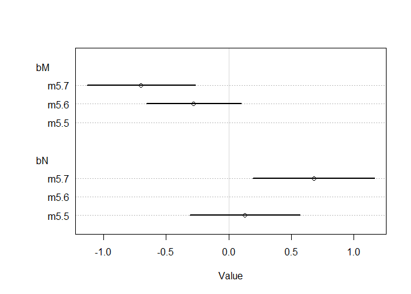<!-- -->


```r
## R code 5.31
xseq <- seq( from=min(dcc$M)-0.15 , to=max(dcc$M)+0.15 , length.out=30 )
mu <- link( m5.7 , data=data.frame( M=xseq , N=0 ) )
mu_mean <- apply(mu,2,mean)
mu_PI <- apply(mu,2,PI)
plot( NULL , xlim=range(dcc$M) , ylim=range(dcc$K) )
lines( xseq , mu_mean , lwd=2 )
shade( mu_PI , xseq )
```

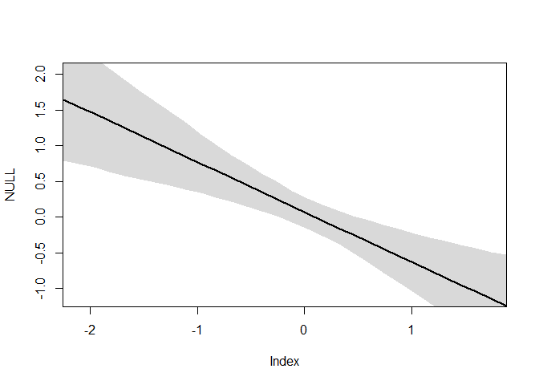<!-- -->


```r
## R code 5.32
# M -> K <- N
# M -> N
n <- 100
M <- rnorm( n )
N <- rnorm( n , M )
K <- rnorm( n , N - M )
d_sim <- data.frame(K=K,N=N,M=M)
```


```r
## R code 5.29
m5.7sim1 <- quap(
    alist(
        K ~ dnorm( mu , sigma ) ,
        mu <- a + bN*N + bM*M ,
        a ~ dnorm( 0 , 0.2 ) ,
        bN ~ dnorm( 0 , 0.5 ) ,
        bM ~ dnorm( 0 , 0.5 ) ,
        sigma ~ dexp( 1 )
    ) , data=d_sim )
precis(m5.7sim1)
```

```
##             mean         sd        5.5%      94.5%
## a      0.1195250 0.09997576 -0.04025559  0.2793055
## bN     0.8098914 0.11226147  0.63047590  0.9893069
## bM    -0.7613936 0.14999837 -1.00111994 -0.5216672
## sigma  1.1317794 0.07991567  1.00405874  1.2595001
```

```r
## R code 5.33
# M -> K <- N
# N -> M
n <- 100
N <- rnorm( n )
M <- rnorm( n , N )
K <- rnorm( n , N - M )
d_sim2 <- data.frame(K=K,N=N,M=M)
```


```r
## R code 5.29
m5.7sim2 <- quap(
    alist(
        K ~ dnorm( mu , sigma ) ,
        mu <- a + bN*N + bM*M ,
        a ~ dnorm( 0 , 0.2 ) ,
        bN ~ dnorm( 0 , 0.5 ) ,
        bM ~ dnorm( 0 , 0.5 ) ,
        sigma ~ dexp( 1 )
    ) , data=d_sim2 )
precis(m5.7sim2)
```

```
##             mean         sd       5.5%       94.5%
## a     -0.1180029 0.08903966 -0.2603055  0.02429962
## bN     0.6061351 0.13104894  0.3966936  0.81557659
## bM    -0.8860200 0.09344197 -1.0353583 -0.73668164
## sigma  0.9803595 0.06912642  0.8698821  1.09083682
```


```r
# M -> K <- N
# M <- U -> N
n <- 100
U <- rnorm( n )
N <- rnorm( n , U )
M <- rnorm( n , U )
K <- rnorm( n , N - M )
d_sim3 <- data.frame(K=K,N=N,M=M)
```


```r
## R code 5.29
m5.7sim3 <- quap(
    alist(
        K ~ dnorm( mu , sigma ) ,
        mu <- a + bN*N + bM*M ,
        a ~ dnorm( 0 , 0.2 ) ,
        bN ~ dnorm( 0 , 0.5 ) ,
        bM ~ dnorm( 0 , 0.5 ) ,
        sigma ~ dexp( 1 )
    ) , data=d_sim3 )
precis(m5.7sim3)
```

```
##              mean         sd       5.5%      94.5%
## a     -0.04160137 0.09012247 -0.1856345  0.1024317
## bN     0.98646975 0.07457936  0.8672775  1.1056620
## bM    -1.10688331 0.09084709 -1.2520745 -0.9616921
## sigma  0.98094681 0.06913295  0.8704590  1.0914346
```

## 5.3. Categorical variables


```r
## R code 5.34
data(Howell1)
d <- Howell1
str(d)
```

```
## 'data.frame':	544 obs. of  4 variables:
##  $ height: num  152 140 137 157 145 ...
##  $ weight: num  47.8 36.5 31.9 53 41.3 ...
##  $ age   : num  63 63 65 41 51 35 32 27 19 54 ...
##  $ male  : int  1 0 0 1 0 1 0 1 0 1 ...
```


```r
## R code 5.35
mu_female <- rnorm(1e4,178,20)
mu_male <- rnorm(1e4,178,20) + rnorm(1e4,0,10)
precis( data.frame( mu_female , mu_male ) )
```

```
##               mean       sd     5.5%    94.5%  histogram
## mu_female 178.1808 20.02623 146.3127 210.1583   ▁▁▃▇▇▂▁▁
## mu_male   177.7806 22.31776 142.2321 213.5896 ▁▁▁▃▇▇▃▁▁▁
```


```r
## R code 5.36
d$sex <- ifelse( d$male==1 , 2 , 1 )
str( d$sex )
```

```
##  num [1:544] 2 1 1 2 1 2 1 2 1 2 ...
```


```r
## R code 5.37
m5.8 <- quap(
    alist(
        height ~ dnorm( mu , sigma ) ,
        mu <- a[sex] ,
        a[sex] ~ dnorm( 178 , 20 ) ,
        sigma ~ dunif( 0 , 50 )
    ) , data=d )
precis( m5.8 , depth=2 )
```

```
##           mean        sd      5.5%     94.5%
## a[1]  134.9112 1.6069245 132.34301 137.47936
## a[2]  142.5779 1.6974627 139.86498 145.29072
## sigma  27.3098 0.8280298  25.98645  28.63315
```


```r
## R code 5.38
post <- extract.samples(m5.8)
post$diff_fm <- post$a[,1] - post$a[,2]
precis( post , depth=2 )
```

```
##               mean        sd      5.5%      94.5%       histogram
## sigma    27.304827 0.8293816  25.98622  28.608457   ▁▁▁▁▃▇▇▇▃▂▁▁▁
## a[1]    134.899377 1.6138389 132.32268 137.479244        ▁▁▃▇▃▁▁▁
## a[2]    142.562513 1.7183029 139.82579 145.309564 ▁▁▁▁▂▃▅▇▇▃▂▁▁▁▁
## diff_fm  -7.663136 2.3692962 -11.44000  -3.870505      ▁▁▁▃▇▇▃▁▁▁
```


```r
## R code 5.39
data(milk)
d <- milk
unique(d$clade)
```

```
## [1] Strepsirrhine    New World Monkey Old World Monkey Ape             
## Levels: Ape New World Monkey Old World Monkey Strepsirrhine
```


```r
## R code 5.40
d$clade_id <- as.integer( d$clade )
```


```r
## R code 5.41
d$K <- scale( d$kcal.per.g )
m5.9 <- quap(
    alist(
        K ~ dnorm( mu , sigma ),
        mu <- a[clade_id],
        a[clade_id] ~ dnorm( 0 , 0.5 ),
        sigma ~ dexp( 1 )
    ) , data=d )
labels <- paste( "a[" , 1:4 , "]:" , levels(d$clade) , sep="" )
plot( precis( m5.9 , depth=2 , pars="a" ) , labels=labels , xlab="expected kcal (std)" )
```

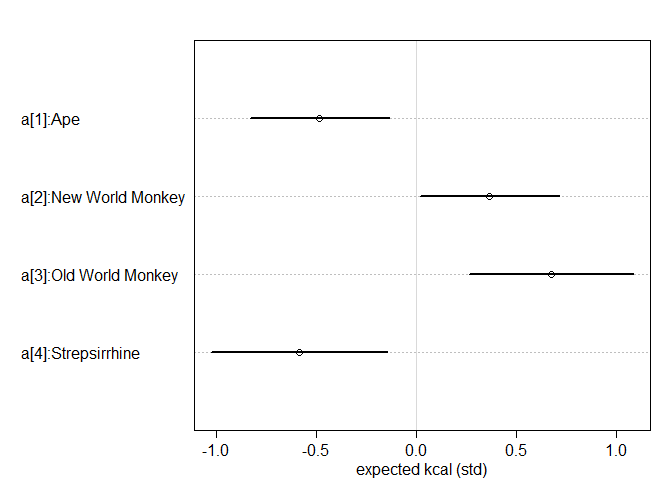<!-- -->


```r
## R code 5.42
set.seed(63)
d$house <- sample( rep(1:4,each=8) , size=nrow(d) )

## R code 5.43
m5.10 <- quap(
    alist(
        K ~ dnorm( mu , sigma ),
        mu <- a[clade_id] + h[house],
        a[clade_id] ~ dnorm( 0 , 0.5 ),
        h[house] ~ dnorm( 0 , 0.5 ),
        sigma ~ dexp( 1 )
    ) , data=d )
```


## Easy.
### 5E1. Which of the linear models below are multiple linear regressions?
(1) 
$$
\mu_i = \alpha + \beta x_i
$$
(2) 
$$
\mu_i = \beta_x x_i + \beta_z z_i
$$
(3) 
$$
\mu_i = \alpha + \beta (x_i-z_i)
$$
(4) 
$$
\mu_i = \alpha + \beta_x x_i + \beta_z z_i
$$

>  2, 3, and 4 are multiple regressions because these models have two predictors.

### 5E3.  Write down a multiple regression to evaluate the claim: Neither amount of funding nor size of laboratory is by itself a good predictor of time to PhD degree; but together these variables are both positively associated with time to degree. Write down the model definition and indicate which side of zero each slope parameter should be on.

> F is amount of funding; S is size of laboratory.

$$
\mu_i = \alpha + \beta_F F_i + \beta_S S_i
$$
$\beta_F$ and $\beta_S$ should be positive.

## Medium.
### 5M2. Invent your own example of a masked relationship. An outcome variable should be correlated with both predictor variables, but in opposite directions. And the two predictor variables should be correlated with one another.


```r
## change from R code 5.17
library(ggplot2)
library(GGally)
set.seed(1)
N <- 1000                         # number of cases
x_real <- rnorm( N )             # x_real as Gaussian with mean 0 and stddev 1
x_spur <- rnorm( N , x_real*0.5 )    # x_spur as Gaussian with mean=x_real*0.5
y <- rnorm( N , x_real-x_spur )         # y as Gaussian with mean=x_real-x_spur
d <- data.frame(y,x_real,x_spur) # bind all together in data frame
ggpairs(d)
```

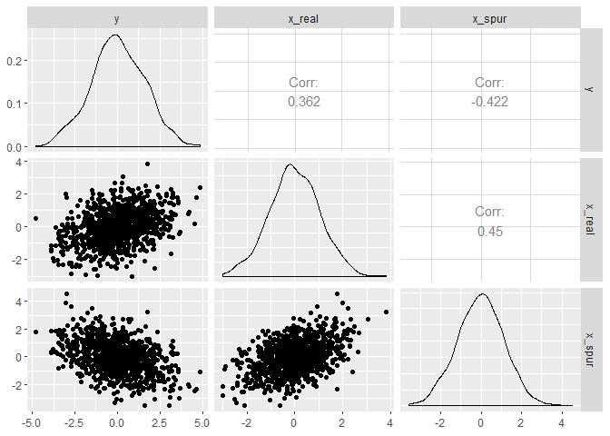<!-- -->

```r
precis(lm(y~x_spur, d))
```

```
##                    mean         sd        5.5%       94.5%
## (Intercept)  0.01331642 0.04453195 -0.05785423  0.08448707
## x_spur      -0.56282083 0.03825134 -0.62395386 -0.50168779
```

```r
precis(lm(y~x_real, d))
```

```
##                  mean         sd        5.5%     94.5%
## (Intercept) 0.0320690 0.04579135 -0.04111443 0.1052524
## x_real      0.5427579 0.04426579  0.47201264 0.6135032
```

```r
precis(lm(y~x_real+x_spur, d))
```

```
##                   mean         sd        5.5%       94.5%
## (Intercept)  0.0162384 0.03259731 -0.03585839  0.06833519
## x_real       1.0380403 0.03528265  0.98165184  1.09442880
## x_spur      -0.9779830 0.03135466 -1.02809377 -0.92787217
```

### 5M3. It is sometimes observed that the best predictor of fire risk is the presence of firefighters—States and localities with many firefighters also have more fires. Presumably firefighters do not cause fires. Nevertheless, this is not a spurious correlation. Instead fires cause firefighters. Consider the same reversal of causal inference in the context of the divorce and marriage data. How might a high divorce rate cause a higher marriage rate? Can you think of a way to evaluate this relationship, using multiple regression?

> I think a high divorce rate may cause more single individuals and these divorced people can also marriage again. Therefore, to evaluate this relationship, I can use multiple regression by regressing marriage rate on both divorce rate and non-first marriage rate. If there is little or no additional predictive power in also knowing divorce rate once we know non-first marriage rate, this means my hypothesis is correct.


### 5M4. In the divorce data, States with high numbers of Mormons (members of The Church of Jesus Christ of Latter-day Saints, LDS) have much lower divorce rates than the regression models expected. Find a list of LDS population by State and use those numbers as a predictor variable, predicting divorce rate using marriage rate, median age at marriage, and percent LDS population (possibly standardized). You may want to consider transformations of the raw percent LDS variable.


```r
library(rethinking)
data(WaffleDivorce)
d <- WaffleDivorce
str(d)
```

```
## 'data.frame':	50 obs. of  13 variables:
##  $ Location         : Factor w/ 50 levels "Alabama","Alaska",..: 1 2 3 4 5 6 7 8 9 10 ...
##  $ Loc              : Factor w/ 50 levels "AK","AL","AR",..: 2 1 4 3 5 6 7 9 8 10 ...
##  $ Population       : num  4.78 0.71 6.33 2.92 37.25 ...
##  $ MedianAgeMarriage: num  25.3 25.2 25.8 24.3 26.8 25.7 27.6 26.6 29.7 26.4 ...
##  $ Marriage         : num  20.2 26 20.3 26.4 19.1 23.5 17.1 23.1 17.7 17 ...
##  $ Marriage.SE      : num  1.27 2.93 0.98 1.7 0.39 1.24 1.06 2.89 2.53 0.58 ...
##  $ Divorce          : num  12.7 12.5 10.8 13.5 8 11.6 6.7 8.9 6.3 8.5 ...
##  $ Divorce.SE       : num  0.79 2.05 0.74 1.22 0.24 0.94 0.77 1.39 1.89 0.32 ...
##  $ WaffleHouses     : int  128 0 18 41 0 11 0 3 0 133 ...
##  $ South            : int  1 0 0 1 0 0 0 0 0 1 ...
##  $ Slaves1860       : int  435080 0 0 111115 0 0 0 1798 0 61745 ...
##  $ Population1860   : int  964201 0 0 435450 379994 34277 460147 112216 75080 140424 ...
##  $ PropSlaves1860   : num  0.45 0 0 0.26 0 0 0 0.016 0 0.44 ...
```

```r
d$Location
```

```
##  [1] Alabama              Alaska               Arizona             
##  [4] Arkansas             California           Colorado            
##  [7] Connecticut          Delaware             District of Columbia
## [10] Florida              Georgia              Hawaii              
## [13] Idaho                Illinois             Indiana             
## [16] Iowa                 Kansas               Kentucky            
## [19] Louisiana            Maine                Maryland            
## [22] Massachusetts        Michigan             Minnesota           
## [25] Mississippi          Missouri             Montana             
## [28] Nebraska             New Hampshire        New Jersey          
## [31] New Mexico           New York             North Carolina      
## [34] North Dakota         Ohio                 Oklahoma            
## [37] Oregon               Pennsylvania         Rhode Island        
## [40] South Carolina       South Dakota         Tennessee           
## [43] Texas                Utah                 Vermont             
## [46] Virginia             Washington           West Virginia       
## [49] Wisconsin            Wyoming             
## 50 Levels: Alabama Alaska Arizona Arkansas California ... Wyoming
```

> Download data from https://www.worldatlas.com/articles/mormon-population-by-state.html and save it as CSV


```r
LDS <- read.csv("LDS.csv", header = TRUE)
LDS
```

```
##                   State PercentageofMormonResidents
## 1               Alabama                      0.0077
## 2                Alaska                      0.0456
## 3               Arizona                      0.0610
## 4              Arkansas                      0.0103
## 5            California                      0.0197
## 6              Colorado                      0.0274
## 7           Connecticut                      0.0044
## 8              Delaware                      0.0057
## 9  District of Columbia                      0.0040
## 10              Florida                      0.0075
## 11              Georgia                      0.0082
## 12               Hawaii                      0.0517
## 13                Idaho                      0.2642
## 14             Illinois                      0.0045
## 15              Indiana                      0.0067
## 16                 Iowa                      0.0090
## 17               Kansas                      0.0129
## 18             Kentucky                      0.0079
## 19            Louisiana                      0.0064
## 20                Maine                      0.0082
## 21             Maryland                      0.0072
## 22        Massachusetts                      0.0040
## 23             Michigan                      0.0045
## 24            Minnesota                      0.0059
## 25          Mississippi                      0.0073
## 26             Missouri                      0.0116
## 27              Montana                      0.0481
## 28             Nebraska                      0.0130
## 29        New Hampshire                      0.0065
## 30           New Jersey                      0.0037
## 31           New Mexico                      0.0335
## 32             New York                      0.0041
## 33       North Carolina                      0.0084
## 34         North Dakota                      0.0149
## 35                 Ohio                      0.0053
## 36             Oklahoma                      0.0121
## 37               Oregon                      0.0376
## 38         Pennsylvania                      0.0040
## 39         Rhode Island                      0.0039
## 40       South Carolina                      0.0081
## 41         South Dakota                      0.0121
## 42            Tennessee                      0.0075
## 43                Texas                      0.0125
## 44                 Utah                      0.6770
## 45              Vermont                      0.0073
## 46             Virginia                      0.0113
## 47           Washington                      0.0394
## 48        West Virginia                      0.0093
## 49            Wisconsin                      0.0046
## 50              Wyoming                      0.1153
```

```r
str(LDS)
```

```
## 'data.frame':	50 obs. of  2 variables:
##  $ State                      : Factor w/ 50 levels "Alabama","Alaska",..: 1 2 3 4 5 6 7 8 9 10 ...
##  $ PercentageofMormonResidents: num  0.0077 0.0456 0.061 0.0103 0.0197 0.0274 0.0044 0.0057 0.004 0.0075 ...
```


```r
d$LDS <- LDS$PercentageofMormonResidents
str(d)
```

```
## 'data.frame':	50 obs. of  14 variables:
##  $ Location         : Factor w/ 50 levels "Alabama","Alaska",..: 1 2 3 4 5 6 7 8 9 10 ...
##  $ Loc              : Factor w/ 50 levels "AK","AL","AR",..: 2 1 4 3 5 6 7 9 8 10 ...
##  $ Population       : num  4.78 0.71 6.33 2.92 37.25 ...
##  $ MedianAgeMarriage: num  25.3 25.2 25.8 24.3 26.8 25.7 27.6 26.6 29.7 26.4 ...
##  $ Marriage         : num  20.2 26 20.3 26.4 19.1 23.5 17.1 23.1 17.7 17 ...
##  $ Marriage.SE      : num  1.27 2.93 0.98 1.7 0.39 1.24 1.06 2.89 2.53 0.58 ...
##  $ Divorce          : num  12.7 12.5 10.8 13.5 8 11.6 6.7 8.9 6.3 8.5 ...
##  $ Divorce.SE       : num  0.79 2.05 0.74 1.22 0.24 0.94 0.77 1.39 1.89 0.32 ...
##  $ WaffleHouses     : int  128 0 18 41 0 11 0 3 0 133 ...
##  $ South            : int  1 0 0 1 0 0 0 0 0 1 ...
##  $ Slaves1860       : int  435080 0 0 111115 0 0 0 1798 0 61745 ...
##  $ Population1860   : int  964201 0 0 435450 379994 34277 460147 112216 75080 140424 ...
##  $ PropSlaves1860   : num  0.45 0 0 0.26 0 0 0 0.016 0 0.44 ...
##  $ LDS              : num  0.0077 0.0456 0.061 0.0103 0.0197 0.0274 0.0044 0.0057 0.004 0.0075 ...
```


```r
d$logLDS <- log(d$LDS)
d$L <- scale(d$logLDS)
d$A <- scale(d$MedianAgeMarriage)
d$D <- scale(d$Divorce)
d$M <- scale(d$Marriage)
str(d)
```

```
## 'data.frame':	50 obs. of  19 variables:
##  $ Location         : Factor w/ 50 levels "Alabama","Alaska",..: 1 2 3 4 5 6 7 8 9 10 ...
##  $ Loc              : Factor w/ 50 levels "AK","AL","AR",..: 2 1 4 3 5 6 7 9 8 10 ...
##  $ Population       : num  4.78 0.71 6.33 2.92 37.25 ...
##  $ MedianAgeMarriage: num  25.3 25.2 25.8 24.3 26.8 25.7 27.6 26.6 29.7 26.4 ...
##  $ Marriage         : num  20.2 26 20.3 26.4 19.1 23.5 17.1 23.1 17.7 17 ...
##  $ Marriage.SE      : num  1.27 2.93 0.98 1.7 0.39 1.24 1.06 2.89 2.53 0.58 ...
##  $ Divorce          : num  12.7 12.5 10.8 13.5 8 11.6 6.7 8.9 6.3 8.5 ...
##  $ Divorce.SE       : num  0.79 2.05 0.74 1.22 0.24 0.94 0.77 1.39 1.89 0.32 ...
##  $ WaffleHouses     : int  128 0 18 41 0 11 0 3 0 133 ...
##  $ South            : int  1 0 0 1 0 0 0 0 0 1 ...
##  $ Slaves1860       : int  435080 0 0 111115 0 0 0 1798 0 61745 ...
##  $ Population1860   : int  964201 0 0 435450 379994 34277 460147 112216 75080 140424 ...
##  $ PropSlaves1860   : num  0.45 0 0 0.26 0 0 0 0.016 0 0.44 ...
##  $ LDS              : num  0.0077 0.0456 0.061 0.0103 0.0197 0.0274 0.0044 0.0057 0.004 0.0075 ...
##  $ logLDS           : num  -4.87 -3.09 -2.8 -4.58 -3.93 ...
##  $ L                : num [1:50, 1] -0.399 1.2 1.462 -0.137 0.446 ...
##   ..- attr(*, "scaled:center")= num -4.42
##   ..- attr(*, "scaled:scale")= num 1.11
##  $ A                : num [1:50, 1] -0.606 -0.687 -0.204 -1.41 0.6 ...
##   ..- attr(*, "scaled:center")= num 26.1
##   ..- attr(*, "scaled:scale")= num 1.24
##  $ D                : num [1:50, 1] 1.654 1.544 0.611 2.094 -0.927 ...
##   ..- attr(*, "scaled:center")= num 9.69
##   ..- attr(*, "scaled:scale")= num 1.82
##  $ M                : num [1:50, 1] 0.0226 1.5498 0.049 1.6551 -0.267 ...
##   ..- attr(*, "scaled:center")= num 20.1
##   ..- attr(*, "scaled:scale")= num 3.8
```


```r
## change from R code 5.8
m5M4 <- quap(
    alist(
        D ~ dnorm( mu , sigma ) ,
        mu <- a + bM*M + bA*A + bL*L ,
        a ~ dnorm( 0 , 0.2 ) ,
        bM ~ dnorm( 0 , 0.5 ) ,
        bA ~ dnorm( 0 , 0.5 ) ,
        bL ~ dnorm( 0 , 0.5 ) ,
        sigma ~ dexp( 1 )
    ) , data = d )
precis( m5M4 )
```

```
##                mean         sd       5.5%       94.5%
## a      3.774338e-07 0.09389243 -0.1500579  0.15005861
## bM     7.232558e-02 0.16203996 -0.1866456  0.33129673
## bA    -6.999038e-01 0.15142397 -0.9419085 -0.45789902
## bL    -2.908551e-01 0.14914422 -0.5292164 -0.05249382
## sigma  7.519313e-01 0.07470950  0.6325311  0.87133152
```

```r
## R code 5.9
plot(coeftab(m5.1,m5.2,m5.3,m5M4), par=c("bA","bM","bL") )
```

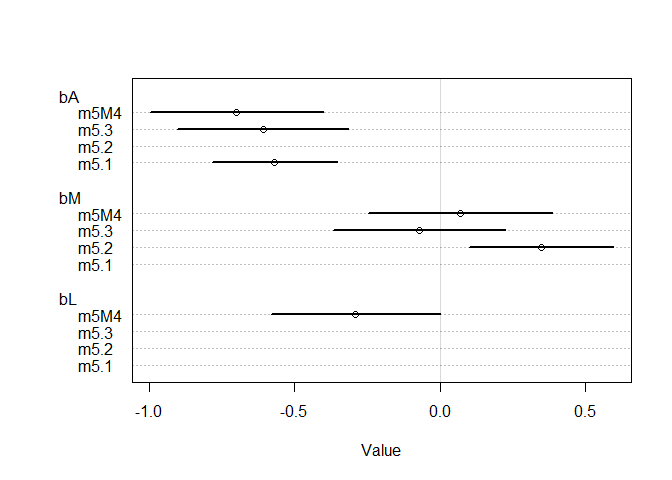<!-- -->

## Hard. 
### All three exercises below use the same data, data(foxes) (part of rethinking). 79 The urban fox (Vulpes vulpes) is a successful exploiter of human habitat. Since urban foxes move in packs and defend territories, data on habitat quality and population density is also included. The data frame has five columns:
(1) group: Number of the social group the individual fox belongs to
(2) avgfood: Th e average amount of food available in the territory
(3) groupsize: Th e number of foxes in the social group
(4) area: Size of the territory
(5) weight: Body weight of the individual fox

### 5H1. Fit two bivariate Gaussian regressions, using quap: (1) body weight as a linear function of territory size (area), and (2) body weight as a linear function of groupsize. Plot the results of these regressions, displaying the MAP regression line and the 95% interval of the mean. Is either variable important for predicting fox body weight?


```r
library(rethinking)
data(foxes)
d <- foxes
str(d)
```

```
## 'data.frame':	116 obs. of  5 variables:
##  $ group    : int  1 1 2 2 3 3 4 4 5 5 ...
##  $ avgfood  : num  0.37 0.37 0.53 0.53 0.49 0.49 0.45 0.45 0.74 0.74 ...
##  $ groupsize: int  2 2 2 2 2 2 2 2 3 3 ...
##  $ area     : num  1.09 1.09 2.05 2.05 2.12 2.12 1.29 1.29 3.78 3.78 ...
##  $ weight   : num  5.02 2.84 5.33 6.07 5.85 3.25 4.53 4.09 6.13 5.59 ...
```


```r
d$W <- scale(d$weight)
d$A <- scale(d$area)
d$S <- scale(d$groupsize)
str(d)
```

```
## 'data.frame':	116 obs. of  8 variables:
##  $ group    : int  1 1 2 2 3 3 4 4 5 5 ...
##  $ avgfood  : num  0.37 0.37 0.53 0.53 0.49 0.49 0.45 0.45 0.74 0.74 ...
##  $ groupsize: int  2 2 2 2 2 2 2 2 3 3 ...
##  $ area     : num  1.09 1.09 2.05 2.05 2.12 2.12 1.29 1.29 3.78 3.78 ...
##  $ weight   : num  5.02 2.84 5.33 6.07 5.85 3.25 4.53 4.09 6.13 5.59 ...
##  $ W        : num [1:116, 1] 0.414 -1.427 0.676 1.301 1.115 ...
##   ..- attr(*, "scaled:center")= num 4.53
##   ..- attr(*, "scaled:scale")= num 1.18
##  $ A        : num [1:116, 1] -2.24 -2.24 -1.21 -1.21 -1.13 ...
##   ..- attr(*, "scaled:center")= num 3.17
##   ..- attr(*, "scaled:scale")= num 0.928
##  $ S        : num [1:116, 1] -1.52 -1.52 -1.52 -1.52 -1.52 ...
##   ..- attr(*, "scaled:center")= num 4.34
##   ..- attr(*, "scaled:scale")= num 1.54
```


```r
## change from R code 5.3
m5H1.1 <- quap(
    alist(
        W ~ dnorm( mu , sigma ) ,
        mu <- a + bA * A ,
        a ~ dnorm( 0 , 0.2 ) ,
        bA ~ dnorm( 0 , 0.5 ) ,
        sigma ~ dexp( 1 )
    ) , data = d )
precis(m5H1.1)
```

```
##                mean         sd       5.5%    94.5%
## a     -4.758921e-06 0.08359801 -0.1336105 0.133601
## bA     1.883166e-02 0.09088225 -0.1264157 0.164079
## sigma  9.911130e-01 0.06464158  0.8878032 1.094423
```


```r
## change from R code 5.5
# compute percentile interval of mean
A_seq <- seq( from= min(d$A) , to= max(d$A) , length.out=30 )
mu <- link( m5H1.1 , data=list(A=A_seq) )
mu.mean <- apply( mu , 2, mean )
mu.PI <- apply( mu , 2 , PI )

# plot it all
plot( W ~ A , data=d , col=rangi2 )
lines( A_seq , mu.mean , lwd=2 )
shade( mu.PI , A_seq )
```

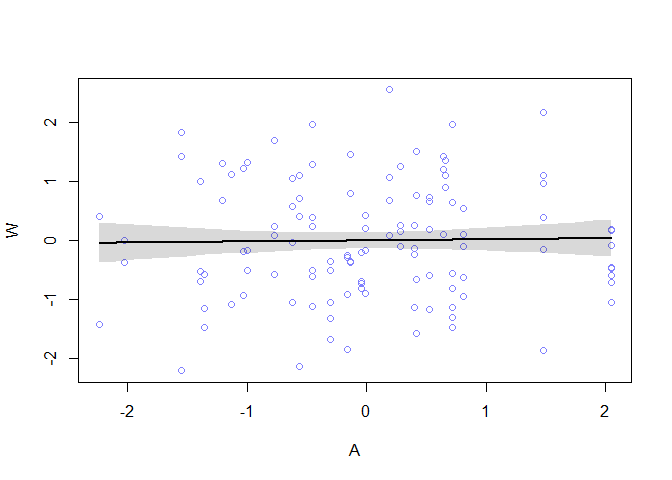<!-- -->


```r
## change from R code 5.3
m5H1.2 <- quap(
    alist(
        W ~ dnorm( mu , sigma ) ,
        mu <- a + bS * S ,
        a ~ dnorm( 0 , 0.2 ) ,
        bS ~ dnorm( 0 , 0.5 ) ,
        sigma ~ dexp( 1 )
    ) , data = d )
precis(m5H1.2)
```

```
##                mean         sd       5.5%       94.5%
## a     -2.412531e-07 0.08272324 -0.1322080  0.13220748
## bS    -1.558038e-01 0.08977333 -0.2992789 -0.01232867
## sigma  9.785878e-01 0.06384628  0.8765492  1.08062652
```


```r
## change from R code 5.5
# compute percentile interval of mean
S_seq <- seq( from= min(d$S) , to= max(d$S) , length.out=30 )
mu <- link( m5H1.2 , data=list(S=S_seq) )
mu.mean <- apply( mu , 2, mean )
mu.PI <- apply( mu , 2 , PI )

# plot it all
plot( W ~ S , data=d , col=rangi2 )
lines( S_seq , mu.mean , lwd=2 )
shade( mu.PI , S_seq )
```

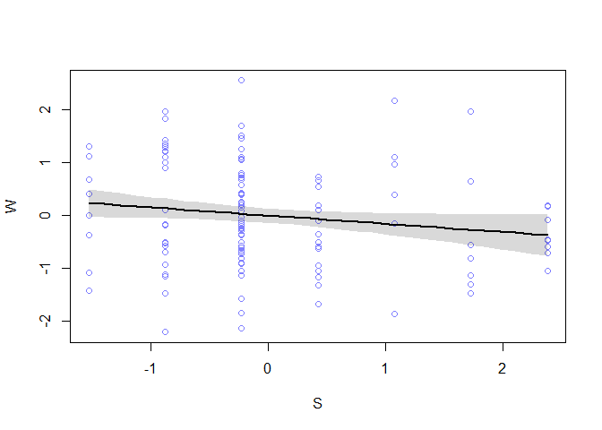<!-- -->


### 5H2. Now fit a multiple linear regression with weight as the outcome and both area and groupsize as predictor variables. Plot the predictions of the model for each predictor, holding the other predictor constant at its mean. What does this model say about the importance of each variable? Why do you get diff erent results than you got in the exercise just above?


```r
## change from R code 5.8
m5H2 <- quap(
    alist(
        W ~ dnorm( mu , sigma ) ,
        mu <- a + bS*S + bA*A ,
        a ~ dnorm( 0 , 0.2 ) ,
        bS ~ dnorm( 0 , 0.5 ) ,
        bA ~ dnorm( 0 , 0.5 ) ,
        sigma ~ dexp( 1 )
    ) , data = d )
precis( m5H2 )
```

```
##                mean         sd       5.5%      94.5%
## a     -8.418241e-08 0.08013109 -0.1280650  0.1280649
## bS    -4.820002e-01 0.14537270 -0.7143339 -0.2496666
## bA     4.058528e-01 0.14536267  0.1735351  0.6381704
## sigma  9.419462e-01 0.06159420  0.8435068  1.0403856
```

```r
## R code 5.9
plot(coeftab(m5H1.1,m5H1.2,m5H2), par=c("bS","bA") )
```

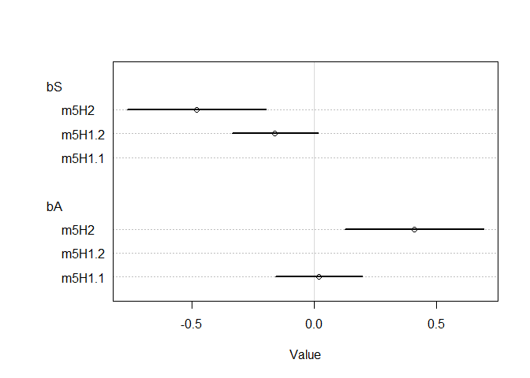<!-- -->


```r
## change from R code 5.13
# prepare new counterfactual data
S_seq <- seq( from= min(d$S) , to= max(d$S) , length.out=30 )
pred_data <- data.frame( S = S_seq , A = 0 )

# compute counterfactual mean divorce (mu)
mu <- link( m5H2 , data=pred_data )
mu_mean <- apply( mu , 2 , mean )
mu_PI <- apply( mu , 2 , PI )

# simulate counterfactual divorce outcomes
W_sim <- sim( m5H2 , data=pred_data , n=1e4 )
W_PI <- apply( W_sim , 2 , PI )

# display predictions, hiding raw data with type="n"
plot( W ~ S , data=d , type="n" )
mtext( "Area (std) = 0" )
lines( S_seq , mu_mean )
shade( mu_PI , S_seq )
shade( W_PI , S_seq )
```

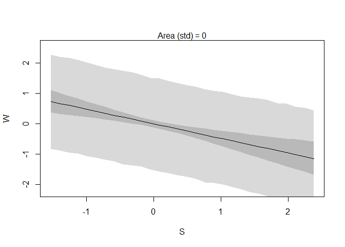<!-- -->


```r
## change from R code 5.13
# prepare new counterfactual data
A_seq <- seq( from= min(d$A) , to= max(d$A) , length.out=30 )
pred_data <- data.frame( A = A_seq , S = 0 )

# compute counterfactual mean divorce (mu)
mu <- link( m5H2 , data=pred_data )
mu_mean <- apply( mu , 2 , mean )
mu_PI <- apply( mu , 2 , PI )

# simulate counterfactual divorce outcomes
W_sim <- sim( m5H2 , data=pred_data , n=1e4 )
W_PI <- apply( W_sim , 2 , PI )

# display predictions, hiding raw data with type="n"
plot( W ~ A , data=d , type="n" )
mtext( "Groupsize (std) = 0" )
lines( A_seq , mu_mean )
shade( mu_PI , A_seq )
shade( W_PI , A_seq )
```

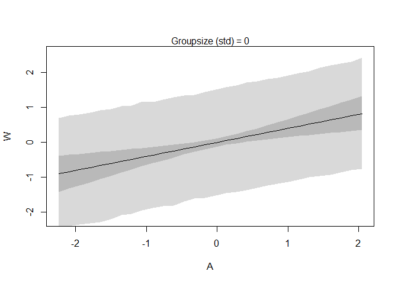<!-- -->
