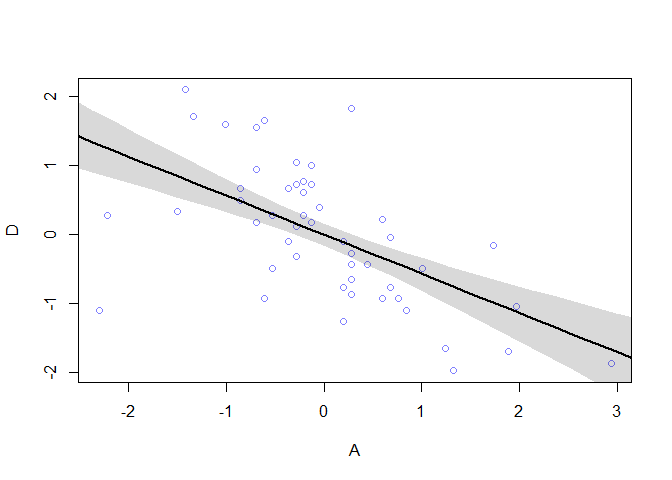

# The Many Variables & The Spurious Waffles
## 5.1. Spurious association


```r
## R code 5.1
# load data and copy
library(rethinking)
```

```
## Loading required package: rstan
```

```
## Warning: package 'rstan' was built under R version 3.5.3
```

```
## Loading required package: ggplot2
```

```
## Loading required package: StanHeaders
```

```
## Warning: package 'StanHeaders' was built under R version 3.5.3
```

```
## rstan (Version 2.18.2, GitRev: 2e1f913d3ca3)
```

```
## For execution on a local, multicore CPU with excess RAM we recommend calling
## options(mc.cores = parallel::detectCores()).
## To avoid recompilation of unchanged Stan programs, we recommend calling
## rstan_options(auto_write = TRUE)
```

```
## For improved execution time, we recommend calling
## Sys.setenv(LOCAL_CPPFLAGS = '-march=native')
## although this causes Stan to throw an error on a few processors.
```

```
## Loading required package: parallel
```

```
## rethinking (Version 1.88)
```

```r
data(WaffleDivorce)
d <- WaffleDivorce

# standardize variables
d$A <- scale( d$MedianAgeMarriage )
d$D <- scale( d$Divorce )

## R code 5.2
sd( d$MedianAgeMarriage )
```

```
## [1] 1.24363
```

```r
## R code 5.3
m5.1 <- quap(
    alist(
        D ~ dnorm( mu , sigma ) ,
        mu <- a + bA * A ,
        a ~ dnorm( 0 , 0.2 ) ,
        bA ~ dnorm( 0 , 0.5 ) ,
        sigma ~ dexp( 1 )
    ) , data = d )

## R code 5.4
set.seed(10)
prior <- extract.prior( m5.1 )
mu <- link( m5.1 , post=prior , data=list( A=c(-2,2) ) )
plot( NULL , xlim=c(-2,2) , ylim=c(-2,2) )
for ( i in 1:50 ) lines( c(-2,2) , mu[i,] , col=col.alpha("black",0.4) )
```

<!-- -->

```r
## R code 5.5
# compute percentile interval of mean
A_seq <- seq( from=-3 , to=3.2 , length.out=30 )
mu <- link( m5.1 , data=list(A=A_seq) )
mu.mean <- apply( mu , 2, mean )
mu.PI <- apply( mu , 2 , PI )

# plot it all
plot( D ~ A , data=d , col=rangi2 )
lines( A_seq , mu.mean , lwd=2 )
shade( mu.PI , A_seq )
```

<!-- -->

```r
## R code 5.6
d$M <- scale( d$Marriage )
m5.2 <- quap(
    alist(
        D ~ dnorm( mu , sigma ) ,
        mu <- a + bM * M ,
        a ~ dnorm( 0 , 0.2 ) ,
        bM ~ dnorm( 0 , 0.5 ) ,
        sigma ~ dexp( 1 )
    ) , data = d )
```

### 5.1.1. Think before you regress.


```r
## R code 5.7
install.packages('dagitty')
```

```
## Installing package into 'C:/Users/Min-Yao/Documents/R/win-library/3.5'
## (as 'lib' is unspecified)
```

```
## Warning: unable to access index for repository http://www.stats.ox.ac.uk/pub/RWin/bin/windows/contrib/3.5:
##   無法開啟 URL 'http://www.stats.ox.ac.uk/pub/RWin/bin/windows/contrib/3.5/PACKAGES'
```

```
## package 'dagitty' successfully unpacked and MD5 sums checked
## 
## The downloaded binary packages are in
## 	C:\Users\Min-Yao\AppData\Local\Temp\RtmpaUmdTu\downloaded_packages
```

```r
library(dagitty)
dag5.1 <- dagitty( "dag {
    A -> D
    A -> M
    M -> D
}")
coordinates(dag5.1) <- list( x=c(A=0,D=1,M=2) , y=c(A=0,D=1,M=0) )
plot( dag5.1 )
```

<!-- -->

### 5.1.2. Multiple regression notation. 


```r
## R code 5.8
m5.3 <- quap(
    alist(
        D ~ dnorm( mu , sigma ) ,
        mu <- a + bM*M + bA*A ,
        a ~ dnorm( 0 , 0.2 ) ,
        bM ~ dnorm( 0 , 0.5 ) ,
        bA ~ dnorm( 0 , 0.5 ) ,
        sigma ~ dexp( 1 )
    ) , data = d )
precis( m5.3 )
```

```
##                mean         sd       5.5%      94.5%
## a     -2.828642e-05 0.09707123 -0.1551669  0.1551103
## bM    -6.553086e-02 0.15076312 -0.3064794  0.1754177
## bA    -6.136370e-01 0.15097351 -0.8549218 -0.3723521
## sigma  7.850672e-01 0.07783076  0.6606786  0.9094558
```

```r
## R code 5.9
plot( coeftab(m5.1,m5.2,m5.3), par=c("bA","bM") )
```

<!-- -->

```r
## R code 5.10
N <- 50 # number of simulated States
age <- rnorm( N )        # sim A
mar <- rnorm( N , age )  # sim A -> M
div <- rnorm( N , age )  # sim A -> D
```

### 5.1.4. Plotting multivariate posteriors.


```r
## R code 5.11
m5.4 <- quap(
    alist(
        M ~ dnorm( mu , sigma ) ,
        mu <- a + bAM * A ,
        a ~ dnorm( 0 , 0.2 ) ,
        bAM ~ dnorm( 0 , 0.5 ) ,
        sigma ~ dexp( 1 )
    ) , data = d )

## R code 5.12
mu <- link(m5.4)
mu_mean <- apply( mu , 2 , mean )
mu_resid <- d$M - mu_mean

## R code 5.13
# prepare new counterfactual data
M_seq <- seq( from=-2 , to=3 , length.out=30 )
pred_data <- data.frame( M = M_seq , A = 0 )

# compute counterfactual mean divorce (mu)
mu <- link( m5.3 , data=pred_data )
mu_mean <- apply( mu , 2 , mean )
mu_PI <- apply( mu , 2 , PI )

# simulate counterfactual divorce outcomes
D_sim <- sim( m5.3 , data=pred_data , n=1e4 )
D_PI <- apply( D_sim , 2 , PI )

# display predictions, hiding raw data with type="n"
plot( D ~ M , data=d , type="n" )
mtext( "Median age marriage (std) = 0" )
lines( M_seq , mu_mean )
shade( mu_PI , M_seq )
shade( D_PI , M_seq )
```

<!-- -->

```r
## R code 5.14
# call link without specifying new data
# so it uses original data
mu <- link( m5.3 )

# summarize samples across cases
mu_mean <- apply( mu , 2 , mean )
mu_PI <- apply( mu , 2 , PI )

# simulate observations
# again no new data, so uses original data
D_sim <- sim( m5.3 , n=1e4 )
D_PI <- apply( D_sim , 2 , PI )

## R code 5.15
plot( mu_mean ~ d$D , col=rangi2 , ylim=range(mu_PI) ,
    xlab="Observed divorce" , ylab="Predicted divorce" )
abline( a=0 , b=1 , lty=2 )
for ( i in 1:nrow(d) ) lines( rep(d$D[i],2) , mu_PI[,i] , col=rangi2 )

## R code 5.16
identify( x=d$D , y=mu_mean , labels=d$Loc )
```

<!-- -->

```
## integer(0)
```

```r
## R code 5.17
N <- 100                         # number of cases
x_real <- rnorm( N )             # x_real as Gaussian with mean 0 and stddev 1
x_spur <- rnorm( N , x_real )    # x_spur as Gaussian with mean=x_real
y <- rnorm( N , x_real )         # y as Gaussian with mean=x_real
d <- data.frame(y,x_real,x_spur) # bind all together in data frame
```

## 5.2. Masked relationship


```r
## R code 5.18
library(rethinking)
data(milk)
d <- milk
str(d)
```

```
## 'data.frame':	29 obs. of  8 variables:
##  $ clade         : Factor w/ 4 levels "Ape","New World Monkey",..: 4 4 4 4 4 2 2 2 2 2 ...
##  $ species       : Factor w/ 29 levels "A palliata","Alouatta seniculus",..: 11 8 9 10 16 2 1 6 28 27 ...
##  $ kcal.per.g    : num  0.49 0.51 0.46 0.48 0.6 0.47 0.56 0.89 0.91 0.92 ...
##  $ perc.fat      : num  16.6 19.3 14.1 14.9 27.3 ...
##  $ perc.protein  : num  15.4 16.9 16.9 13.2 19.5 ...
##  $ perc.lactose  : num  68 63.8 69 71.9 53.2 ...
##  $ mass          : num  1.95 2.09 2.51 1.62 2.19 5.25 5.37 2.51 0.71 0.68 ...
##  $ neocortex.perc: num  55.2 NA NA NA NA ...
```

```r
## R code 5.19
d$K <- scale( d$kcal.per.g )
d$N <- scale( d$neocortex.perc )
d$M <- scale( log(d$mass) )

## R code 5.20
#m5.5_draft <- quap(
#    alist(
#        K ~ dnorm( mu , sigma ) ,
#        mu <- a + bN*N ,
#        a ~ dnorm( 0 , 1 ) ,
#        bN ~ dnorm( 0 , 1 ) ,
#        sigma ~ dexp( 1 )
#    ) , data=d )

## R code 5.21
d$neocortex.perc
```

```
##  [1] 55.16    NA    NA    NA    NA 64.54 64.54 67.64    NA 68.85 58.85
## [12] 61.69 60.32    NA    NA 69.97    NA 70.41    NA 73.40    NA 67.53
## [23]    NA 71.26 72.60    NA 70.24 76.30 75.49
```

```r
## R code 5.22
dcc <- d[ complete.cases(d$K,d$N,d$M) , ]

## R code 5.23
m5.5_draft <- quap(
    alist(
        K ~ dnorm( mu , sigma ) ,
        mu <- a + bN*N ,
        a ~ dnorm( 0 , 1 ) ,
        bN ~ dnorm( 0 , 1 ) ,
        sigma ~ dexp( 1 )
    ) , data=dcc )

## R code 5.24
prior <- extract.prior( m5.5_draft )
xseq <- c(-2,2)
mu <- link( m5.5_draft , post=prior , data=list(N=xseq) )
plot( NULL , xlim=xseq , ylim=xseq )
for ( i in 1:50 ) lines( xseq , mu[i,] , col=col.alpha("black",0.3) )
```

<!-- -->

```r
## R code 5.25
m5.5 <- quap(
    alist(
        K ~ dnorm( mu , sigma ) ,
        mu <- a + bN*N ,
        a ~ dnorm( 0 , 0.2 ) ,
        bN ~ dnorm( 0 , 0.5 ) ,
        sigma ~ dexp( 1 )
    ) , data=dcc )

## R code 5.26
precis( m5.5 )
```

```
##             mean        sd       5.5%     94.5%
## a     0.03993997 0.1544908 -0.2069661 0.2868461
## bN    0.13323473 0.2237469 -0.2243560 0.4908255
## sigma 0.99982044 0.1647081  0.7365851 1.2630558
```

```r
## R code 5.27
xseq <- seq( from=min(dcc$N)-0.15 , to=max(dcc$N)+0.15 , length.out=30 )
mu <- link( m5.5 , data=list(N=xseq) )
mu_mean <- apply(mu,2,mean)
mu_PI <- apply(mu,2,PI)
plot( K ~ N , data=dcc )
lines( xseq , mu_mean , lwd=2 )
shade( mu_PI , xseq )
```

<!-- -->

```r
## R code 5.28
m5.6 <- quap(
    alist(
        K ~ dnorm( mu , sigma ) ,
        mu <- a + bM*M ,
        a ~ dnorm( 0 , 0.2 ) ,
        bM ~ dnorm( 0 , 0.5 ) ,
        sigma ~ dexp( 1 )
    ) , data=dcc )
precis(m5.6)
```

```
##              mean        sd       5.5%      94.5%
## a      0.04654166 0.1512801 -0.1952331 0.28831640
## bM    -0.28253580 0.1928818 -0.5907982 0.02572664
## sigma  0.94927970 0.1570616  0.6982649 1.20029455
```

```r
## R code 5.29
m5.7 <- quap(
    alist(
        K ~ dnorm( mu , sigma ) ,
        mu <- a + bN*N + bM*M ,
        a ~ dnorm( 0 , 0.2 ) ,
        bN ~ dnorm( 0 , 0.5 ) ,
        bM ~ dnorm( 0 , 0.5 ) ,
        sigma ~ dexp( 1 )
    ) , data=dcc )
precis(m5.7)
```

```
##              mean        sd       5.5%      94.5%
## a      0.06799173 0.1339987 -0.1461640  0.2821475
## bN     0.67511790 0.2482986  0.2782889  1.0719469
## bM    -0.70299099 0.2207870 -1.0558512 -0.3501308
## sigma  0.73801416 0.1324618  0.5263147  0.9497136
```

```r
## R code 5.30
plot( coeftab( m5.5 , m5.6 , m5.7 ) , pars=c("bM","bN") )
```

<!-- -->

```r
## R code 5.31
xseq <- seq( from=min(dcc$M)-0.15 , to=max(dcc$M)+0.15 , length.out=30 )
mu <- link( m5.7 , data=data.frame( M=xseq , N=0 ) )
mu_mean <- apply(mu,2,mean)
mu_PI <- apply(mu,2,PI)
plot( NULL , xlim=range(dcc$M) , ylim=range(dcc$K) )
lines( xseq , mu_mean , lwd=2 )
shade( mu_PI , xseq )
```

<!-- -->

```r
## R code 5.32
# M -> K <- N
# M -> N
n <- 100
M <- rnorm( n )
N <- rnorm( n , M )
K <- rnorm( n , N - M )
d_sim <- data.frame(K=K,N=N,M=M)

## R code 5.33
# M -> K <- N
# N -> M
n <- 100
N <- rnorm( n )
M <- rnorm( n , N )
K <- rnorm( n , N - M )
d_sim2 <- data.frame(K=K,N=N,M=M)

# M -> K <- N
# M <- U -> N
n <- 100
U <- rnorm( n )
N <- rnorm( n , U )
M <- rnorm( n , U )
K <- rnorm( n , N - M )
d_sim3 <- data.frame(K=K,N=N,M=M)
```

## 5.3. Categorical variables


```r
## R code 5.34
data(Howell1)
d <- Howell1
str(d)
```

```
## 'data.frame':	544 obs. of  4 variables:
##  $ height: num  152 140 137 157 145 ...
##  $ weight: num  47.8 36.5 31.9 53 41.3 ...
##  $ age   : num  63 63 65 41 51 35 32 27 19 54 ...
##  $ male  : int  1 0 0 1 0 1 0 1 0 1 ...
```

```r
## R code 5.35
mu_female <- rnorm(1e4,178,20)
mu_male <- rnorm(1e4,178,20) + rnorm(1e4,0,10)
precis( data.frame( mu_female , mu_male ) )
```

```
##               mean       sd     5.5%    94.5%  histogram
## mu_female 177.8163 20.10280 146.0157 210.3759   ▁▁▃▇▇▂▁▁
## mu_male   177.6827 22.48943 141.6933 213.6470 ▁▁▁▃▇▇▂▁▁▁
```

```r
## R code 5.36
d$sex <- ifelse( d$male==1 , 2 , 1 )
str( d$sex )
```

```
##  num [1:544] 2 1 1 2 1 2 1 2 1 2 ...
```

```r
## R code 5.37
m5.8 <- quap(
    alist(
        height ~ dnorm( mu , sigma ) ,
        mu <- a[sex] ,
        a[sex] ~ dnorm( 178 , 20 ) ,
        sigma ~ dunif( 0 , 50 )
    ) , data=d )
precis( m5.8 , depth=2 )
```

```
##            mean        sd     5.5%     94.5%
## a[1]  134.91082 1.6069408 132.3426 137.47902
## a[2]  142.57680 1.6974793 139.8639 145.28970
## sigma  27.31009 0.8280518  25.9867  28.63348
```

```r
## R code 5.38
post <- extract.samples(m5.8)
post$diff_fm <- post$a[,1] - post$a[,2]
precis( post , depth=2 )
```

```
##               mean        sd      5.5%      94.5%      histogram
## sigma    27.320465 0.8189833  25.99753  28.630624 ▁▁▁▁▃▇▇▇▃▂▁▁▁▁
## a[1]    134.890777 1.6035671 132.32135 137.432977       ▁▁▁▃▇▃▁▁
## a[2]    142.539951 1.6959089 139.85435 145.246264 ▁▁▁▂▃▇▇▇▃▂▁▁▁▁
## diff_fm  -7.649174 2.3439145 -11.41281  -3.885842     ▁▁▁▂▇▇▃▁▁▁
```

```r
## R code 5.39
data(milk)
d <- milk
unique(d$clade)
```

```
## [1] Strepsirrhine    New World Monkey Old World Monkey Ape             
## Levels: Ape New World Monkey Old World Monkey Strepsirrhine
```

```r
## R code 5.40
d$clade_id <- as.integer( d$clade )

## R code 5.41
d$K <- scale( d$kcal.per.g )
m5.9 <- quap(
    alist(
        K ~ dnorm( mu , sigma ),
        mu <- a[clade_id],
        a[clade_id] ~ dnorm( 0 , 0.5 ),
        sigma ~ dexp( 1 )
    ) , data=d )
labels <- paste( "a[" , 1:4 , "]:" , levels(d$clade) , sep="" )
plot( precis( m5.9 , depth=2 , pars="a" ) , labels=labels ,
    xlab="expected kcal (std)" )
```

<!-- -->

```r
## R code 5.42
set.seed(63)
d$house <- sample( rep(1:4,each=8) , size=nrow(d) )

## R code 5.43
m5.10 <- quap(
    alist(
        K ~ dnorm( mu , sigma ),
        mu <- a[clade_id] + h[house],
        a[clade_id] ~ dnorm( 0 , 0.5 ),
        h[house] ~ dnorm( 0 , 0.5 ),
        sigma ~ dexp( 1 )
    ) , data=d )
```


## Easy.
### 5E1. Which of the linear models below are multiple linear regressions?
(1) 
$$
\mu_i = \alpha + \beta x_i
$$
(2) 
$$
\mu_i = \beta_x x_i + \beta_z z_i
$$
(3) 
$$
\mu_i = \alpha + \beta (x_i-z_i)
$$
(4) 
$$
\mu_i = \alpha + \beta_x x_i + \beta_z z_i
$$

### 5E3.  Write down a multiple regression to evaluate the claim: Neither amount of funding nor size of laboratory is by itself a good predictor of time to PhD degree; but together these variables are both positively associated with time to degree. Write down the model defi nition and indicate which side of zero each slope parameter should be on.

## Medium.
### 5M2. Invent your own example of a masked relationship. An outcome variable should be correlated with both predictor variables, but in opposite directions. And the two predictor variables should be correlated with one another.

### 5M3. It is sometimes observed that the best predictor of fire risk is the presence of fi refi ghters—States and localities with many fi refi ghters also have more fi res. Presumably fi refi ghtersdonot cause fires. Nevertheless, this is not a spurious correlation. Instead fires cause fi refi ghters. Considerthe same reversal of causal inference in the context of the divorce and marriage data. How might a high divorce rate cause a higher marriage rate? Can you think of a way to evaluate this relationship, using multiple regression?

### 5M4. In the divorce data, States with high numbers of Mormons (members of The Church of Jesus Christ of Latter-day Saints, LDS) have much lower divorce rates than the regression models expected. Find a list of LDS population by State and use those numbers as a predictor variable, predicting divorce rate using marriage rate, median age at marriage, and percent LDS population (possibly standardized). You may want to consider transformations of the raw percent LDS variable.

## Hard. 
### All three exercises below use the same data, data(foxes) (part of rethinking). 79 The urban fox (Vulpes vulpes) is a successful exploiter of human habitat. Since urban foxes move in packs and defend territories, data on habitat quality and population density is also included. The data frame has five columns:
(1) group: Number of the social group the individual fox belongs to
(2) avgfood: Th e average amount of food available in the territory
(3) groupsize: Th e number of foxes in the social group
(4) area: Size of the territory
(5) weight: Body weight of the individual fox

### 5H1. Fit two bivariate Gaussian regressions, using quap: (1) body weight as a linear function of territory size (area), and (2) body weight as a linear function of groupsize. Plot the results of these regressions, displaying the MAP regression line and the 95% interval of the mean. Is either variable important for predicting fox body weight?

### 5H2. Now fi t a multiple linear regression with weight as the outcome and both area and groupsize as predictor variables. Plot the predictions of the model for each predictor, holding the other predictor constant at its mean. What does this model say about the importance of each variable? Why do you get diff erent results than you got in the exercise just above?
