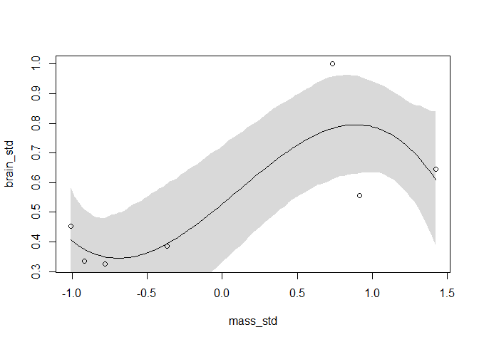

```r
library(rethinking)
```

```
## Loading required package: rstan
```

```
## Warning: package 'rstan' was built under R version 3.5.3
```

```
## Loading required package: ggplot2
```

```
## Loading required package: StanHeaders
```

```
## Warning: package 'StanHeaders' was built under R version 3.5.3
```

```
## rstan (Version 2.18.2, GitRev: 2e1f913d3ca3)
```

```
## For execution on a local, multicore CPU with excess RAM we recommend calling
## options(mc.cores = parallel::detectCores()).
## To avoid recompilation of unchanged Stan programs, we recommend calling
## rstan_options(auto_write = TRUE)
```

```
## For improved execution time, we recommend calling
## Sys.setenv(LOCAL_CPPFLAGS = '-march=native')
## although this causes Stan to throw an error on a few processors.
```

```
## Loading required package: parallel
```

```
## rethinking (Version 1.88)
```
# 7 Ulysses’ Compass
## 7.1. Th e problem with parameters
### 7.1.1. More parameters always improve fit.


```r
## R code 7.1
sppnames <- c( "afarensis","africanus","habilis","boisei",
    "rudolfensis","ergaster","sapiens")
brainvolcc <- c( 438 , 452 , 612, 521, 752, 871, 1350 )
masskg <- c( 37.0 , 35.5 , 34.5 , 41.5 , 55.5 , 61.0 , 53.5 )
d <- data.frame( species=sppnames , brain=brainvolcc , mass=masskg )

## R code 7.2
d$mass_std <- (d$mass - mean(d$mass))/sd(d$mass)
d$brain_std <- d$brain / max(d$brain)

## R code 7.3
m7.1 <- quap(
    alist(
        brain_std ~ dnorm( mu , exp(log_sigma) ),
        mu <- a + b*mass_std,
        a ~ dnorm( 0.5 , 1 ),
        b ~ dnorm( 0 , 10 ),
        log_sigma ~ dnorm( 0 , 1 )
    ), data=d )

## R code 7.4
set.seed(12)
s <- sim( m7.1 )
r <- apply(s,2,mean) - d$brain_std
resid_var <- var2(r)
outcome_var <- var2( d$brain_std )
1 - resid_var/outcome_var
```

```
## [1] 0.4774589
```

```r
## R code 7.5
R2_is_bad <- function( quap_fit ) {
    s <- sim( quap_fit , refresh=0 )
    r <- apply(s,2,mean) - d$brain_std
    1 - var2(r)/var2(d$brain_std)
}

## R code 7.6
m7.2 <- quap(
    alist(
        brain_std ~ dnorm( mu , exp(log_sigma) ),
        mu <- a + b[1]*mass_std + b[2]*mass_std^2,
        a ~ dnorm( 0.5 , 1 ),
        b ~ dnorm( 0 , 10 ),
        log_sigma ~ dnorm( 0 , 1 )
    ), data=d , start=list(b=rep(0,2)) )

## R code 7.7
m7.3 <- quap(
    alist(
        brain_std ~ dnorm( mu , exp(log_sigma) ),
        mu <- a + b[1]*mass_std + b[2]*mass_std^2 +
                  b[3]*mass_std^3,
        a ~ dnorm( 0.5 , 1 ),
        b ~ dnorm( 0 , 10 ),
        log_sigma ~ dnorm( 0 , 1 )
    ), data=d , start=list(b=rep(0,3)) )

m7.4 <- quap(
    alist(
        brain_std ~ dnorm( mu , exp(log_sigma) ),
        mu <- a + b[1]*mass_std + b[2]*mass_std^2 +
                  b[3]*mass_std^3 + b[4]*mass_std^4,
        a ~ dnorm( 0.5 , 1 ),
        b ~ dnorm( 0 , 10 ),
        log_sigma ~ dnorm( 0 , 1 )
    ), data=d , start=list(b=rep(0,4)) )

m7.5 <- quap(
    alist(
        brain_std ~ dnorm( mu , exp(log_sigma) ),
        mu <- a + b[1]*mass_std + b[2]*mass_std^2 +
                  b[3]*mass_std^3 + b[4]*mass_std^4 +
                  b[5]*mass_std^5,
        a ~ dnorm( 0.5 , 1 ),
        b ~ dnorm( 0 , 10 ),
        log_sigma ~ dnorm( 0 , 1 )
    ), data=d , start=list(b=rep(0,5)) )

## R code 7.8
m7.6 <- quap(
    alist(
        brain_std ~ dnorm( mu , 0.001 ),
        mu <- a + b[1]*mass_std + b[2]*mass_std^2 +
                  b[3]*mass_std^3 + b[4]*mass_std^4 +
                  b[5]*mass_std^5 + b[6]*mass_std^6,
        a ~ dnorm( 0.5 , 1 ),
        b ~ dnorm( 0 , 10 )
    ), data=d , start=list(b=rep(0,6)) )

## R code 7.9
post <- extract.samples(m7.1)
mass_seq <- seq( from=min(d$mass_std) , to=max(d$mass_std) , length.out=100 )
l <- link( m7.1 , data=list( mass_std=mass_seq ) )
mu <- apply( l , 2 , mean )
ci <- apply( l , 2 , PI )
plot( brain_std ~ mass_std , data=d )
lines( mass_seq , mu )
shade( ci , mass_seq )
```

<!-- -->

```r
## R code 7.9
post <- extract.samples(m7.2)
mass_seq <- seq( from=min(d$mass_std) , to=max(d$mass_std) , length.out=100 )
l <- link( m7.2 , data=list( mass_std=mass_seq ) )
mu <- apply( l , 2 , mean )
ci <- apply( l , 2 , PI )
plot( brain_std ~ mass_std , data=d )
lines( mass_seq , mu )
shade( ci , mass_seq )
```

<!-- -->

```r
## R code 7.9
post <- extract.samples(m7.3)
mass_seq <- seq( from=min(d$mass_std) , to=max(d$mass_std) , length.out=100 )
l <- link( m7.3 , data=list( mass_std=mass_seq ) )
mu <- apply( l , 2 , mean )
ci <- apply( l , 2 , PI )
plot( brain_std ~ mass_std , data=d )
lines( mass_seq , mu )
shade( ci , mass_seq )
```

<!-- -->

```r
## R code 7.9
post <- extract.samples(m7.4)
mass_seq <- seq( from=min(d$mass_std) , to=max(d$mass_std) , length.out=100 )
l <- link( m7.4 , data=list( mass_std=mass_seq ) )
mu <- apply( l , 2 , mean )
ci <- apply( l , 2 , PI )
plot( brain_std ~ mass_std , data=d )
lines( mass_seq , mu )
shade( ci , mass_seq )
```

<!-- -->

```r
## R code 7.9
post <- extract.samples(m7.5)
mass_seq <- seq( from=min(d$mass_std) , to=max(d$mass_std) , length.out=100 )
l <- link( m7.5 , data=list( mass_std=mass_seq ) )
mu <- apply( l , 2 , mean )
ci <- apply( l , 2 , PI )
plot( brain_std ~ mass_std , data=d )
lines( mass_seq , mu )
shade( ci , mass_seq )
```

<!-- -->

```r
## R code 7.9
post <- extract.samples(m7.6)
mass_seq <- seq( from=min(d$mass_std) , to=max(d$mass_std) , length.out=100 )
l <- link( m7.6 , data=list( mass_std=mass_seq ) )
mu <- apply( l , 2 , mean )
ci <- apply( l , 2 , PI )
plot( brain_std ~ mass_std , data=d )
lines( mass_seq , mu )
shade( ci , mass_seq )
```

<!-- -->

```r
## R code 7.10
m7.1_OLS <- lm( brain_std ~ mass_std , data=d )
post <- extract.samples( m7.1_OLS )
```

### 7.1.2. Too few parameters hurts, too.


```r
## R code 7.11
m7.7 <- quap(
    alist(
        brain_std ~ dnorm( mu , exp(log_sigma) ),
        mu <- a,
        a ~ dnorm( 0.5 , 1 ),
        log_sigma ~ dnorm( 0 , 1 )
    ), data=d )

## R code 7.12
#d_minus_i <- d[ -i , ]
```

## 7.2. Entropy and accuracy
### 7.2.1. Firing the weatherperson.
### 7.2.2. Information and uncertainty.


```r
## R code 7.13
p <- c( 0.3 , 0.7 )
-sum( p*log(p) )
```

```
## [1] 0.6108643
```

### 7.2.3. From entropy to accuracy. 
### 7.2.4. Estimating divergence.


```r
## R code 7.14
set.seed(1)
lppd( m7.1 , n=1e4 )
```

```
## [1]  0.6098667  0.6483437  0.5496092  0.6234933  0.4648142  0.4347604
## [7] -0.8444630
```

```r
## R code 7.15
set.seed(1)
logprob <- sim( m7.1 , ll=TRUE , n=1e4 )
head(logprob)
```

```
##           [,1]      [,2]      [,3]      [,4]      [,5]      [,6]
## [1,] 0.5633620 0.7001153 0.9653882 0.6593739 0.8085216 0.9116708
## [2,] 0.4205889 0.5069910 0.7337399 0.5147647 0.6675698 0.7243339
## [3,] 0.8334093 0.9220777 0.9443597 0.9265669 1.0305151 1.0078591
## [4,] 0.3185758 0.3183599 0.2070564 0.3170016 0.2727487 0.2083463
## [5,] 0.3130858 0.4259732 0.6880980 0.3463323 0.3634271 0.4484070
## [6,] 0.8519018 0.9494456 0.8960931 0.8858421 0.9091613 0.9761491
##            [,7]
## [1,] -2.1369494
## [2,] -1.3346472
## [3,] -3.9686344
## [4,] -1.4528392
## [5,] -0.4730225
## [6,] -2.8414700
```

```r
n <- ncol(logprob)
ns <- nrow(logprob) # the total number of sample
f <- function( i ) log_sum_exp( logprob[,i] ) - log(ns)
( lppd <- sapply( 1:n , f ) )
```

```
## [1]  0.6098667  0.6483437  0.5496092  0.6234933  0.4648142  0.4347604
## [7] -0.8444630
```

### 7.2.5. Scoring the right data.


```r
## R code 7.16
set.seed(1)
sapply( list(m7.1,m7.2,m7.3,m7.4,m7.5,m7.6) , function(m) sum(lppd(m)) )
```

```
## [1]  2.490390  2.566165  3.707343  5.333750 14.124459 39.445390
```

```r
## R code 7.17
N <- 20
kseq <- 1:5
dev <- sapply( kseq , function(k) {
        print(k);
        r <- replicate( 10 , sim_train_test( N=N, k=k ) );
        c( mean(r[1,]) , mean(r[2,]) , sd(r[1,]) , sd(r[2,]) )
    } )
```

```
## [1] 1
## [1] 2
## [1] 3
## [1] 4
## [1] 5
```

```r
## R code 7.18
#        r <- mcreplicate( 1e4 , sim_train_test( N=N, k=k ) , mc.cores=4 )

## R code 7.19
plot( 1:5 , dev[1,] , ylim=c( min(dev[1:2,])-5 , max(dev[1:2,])+10 ) ,
    xlim=c(1,5.1) , xlab="number of parameters" , ylab="deviance" ,
    pch=16 , col=rangi2 )
mtext( concat( "N = ",N ) )
points( (1:5)+0.1 , dev[2,] )
for ( i in kseq ) {
    pts_in <- dev[1,i] + c(-1,+1)*dev[3,i]
    pts_out <- dev[2,i] + c(-1,+1)*dev[4,i]
    lines( c(i,i) , pts_in , col=rangi2 )
    lines( c(i,i)+0.1 , pts_out )
}
```

<!-- -->


## 7.3. Golem Taming: Regularization
## 7.4. Predicting predictive accuracy
### 7.4.1. Cross-validation.
### 7.4.2. Information criteria. 


```r
## R code 7.20
data(cars)
m <- quap(
    alist(
        dist ~ dnorm(mu,sigma),
        mu <- a + b*speed,
        a ~ dnorm(0,100),
        b ~ dnorm(0,10),
        sigma ~ dexp(1)
    ) , data=cars )
set.seed(94)
post <- extract.samples(m,n=1000)

## R code 7.21
n_samples <- 1000
logprob <- sapply( 1:n_samples ,
    function(s) {
        mu <- post$a[s] + post$b[s]*cars$speed
        dnorm( cars$dist , mu , post$sigma[s] , log=TRUE )
    } )

## R code 7.22
n_cases <- nrow(cars)
lppd <- sapply( 1:n_cases , function(i) log_sum_exp(logprob[i,]) - log(n_samples) )

## R code 7.23
pWAIC <- sapply( 1:n_cases , function(i) var(logprob[i,]) )

## R code 7.24
-2*( sum(lppd) - sum(pWAIC) )
```

```
## [1] 423.3194
```

```r
## R code 7.25
waic_vec <- -2*( lppd - pWAIC )
sqrt( n_cases*var(waic_vec) )
```

```
## [1] 17.82204
```

### 7.4.3. Comparing LOOCV, LOOIS, and WAIC.
## 7.5. Using cross-validation and information criteria
### 7.5.1. Model mis-selection.

## 6.2. Post-treatment bias


```r
## R code 6.14
set.seed(71)
# number of plants
N <- 100

# simulate initial heights
h0 <- rnorm(N,10,2)

# assign treatments and simulate fungus and growth
treatment <- rep( 0:1 , each=N/2 )
fungus <- rbinom( N , size=1 , prob=0.5 - treatment*0.4 )
h1 <- h0 + rnorm(N, 5 - 3*fungus)

# compose a clean data frame
d <- data.frame( h0=h0 , h1=h1 , treatment=treatment , fungus=fungus )
precis(d)
```

```
##               mean        sd      5.5%    94.5%    histogram
## h0         9.95978 2.1011623  6.570328 13.07874 ▁▂▂▂▇▃▂▃▁▁▁▁
## h1        14.39920 2.6880870 10.618002 17.93369     ▁▁▃▇▇▇▁▁
## treatment  0.50000 0.5025189  0.000000  1.00000   ▇▁▁▁▁▁▁▁▁▇
## fungus     0.23000 0.4229526  0.000000  1.00000   ▇▁▁▁▁▁▁▁▁▂
```
### 6.2.1. A prior is born.


```r
## R code 6.15
sim_p <- rlnorm( 1e4 , 0 , 0.25 )
precis( data.frame(sim_p) )
```

```
##          mean        sd     5.5%    94.5%    histogram
## sim_p 1.03699 0.2629894 0.670683 1.496397 ▁▁▃▇▇▃▁▁▁▁▁▁
```

```r
## R code 6.16
m6.6 <- quap(
    alist(
        h1 ~ dnorm( mu , sigma ),
        mu <- h0*p,
        p ~ dlnorm( 0 , 0.25 ),
        sigma ~ dexp( 1 )
    ), data=d )
precis(m6.6)
```

```
##           mean         sd     5.5%    94.5%
## p     1.426626 0.01760992 1.398482 1.454770
## sigma 1.793286 0.12517262 1.593236 1.993336
```

```r
## R code 6.17
m6.7 <- quap(
    alist(
        h1 ~ dnorm( mu , sigma ),
        mu <- h0 * p,
        p <- a + bt*treatment + bf*fungus,
        a ~ dlnorm( 0 , 0.2 ) ,
        bt ~ dnorm( 0 , 0.5 ),
        bf ~ dnorm( 0 , 0.5 ),
        sigma ~ dexp( 1 )
    ), data=d )
precis(m6.7)
```

```
##               mean         sd        5.5%       94.5%
## a      1.481391468 0.02451069  1.44221865  1.52056429
## bt     0.002412222 0.02986965 -0.04532525  0.05014969
## bf    -0.266718915 0.03654772 -0.32512923 -0.20830860
## sigma  1.408797442 0.09862070  1.25118251  1.56641237
```

### 6.2.2. Blocked by consequence.


```r
## R code 6.18
m6.8 <- quap(
    alist(
        h1 ~ dnorm( mu , sigma ),
        mu <- h0 * p,
        p <- a + bt*treatment,
        a ~ dlnorm( 0 , 0.2 ),
        bt ~ dnorm( 0 , 0.5 ),
        sigma ~ dexp( 1 )
    ), data=d )
precis(m6.8)
```

```
##             mean         sd       5.5%     94.5%
## a     1.38035767 0.02517554 1.34012229 1.4205931
## bt    0.08499924 0.03429718 0.03018573 0.1398128
## sigma 1.74631655 0.12191552 1.55147200 1.9411611
```


```r
## R code 7.26
set.seed(11)
WAIC( m6.7 )
```

```
## [1] 361.4511
## attr(,"lppd")
## [1] -177.1724
## attr(,"pWAIC")
## [1] 3.553198
## attr(,"se")
## [1] 14.17033
```

```r
## R code 7.27
set.seed(77)
compare( m6.6 , m6.7 , m6.8 )
```

```
##          WAIC    pWAIC    dWAIC       weight       SE      dSE
## m6.7 361.8901 3.839491  0.00000 1.000000e+00 14.26190       NA
## m6.8 402.7757 2.645879 40.88562 1.323732e-09 11.28257 10.47837
## m6.6 405.9139 1.581312 44.02380 2.756471e-10 11.64641 12.22582
```

```r
## R code 7.28
set.seed(91)
waic_m6.6 <- WAIC( m6.6 , pointwise=TRUE )
waic_m6.7 <- WAIC( m6.7 , pointwise=TRUE )
waic_m6.8 <- WAIC( m6.8 , pointwise=TRUE )
n <- length(waic_m6.6)
diff_m6.7_m6.8 <- waic_m6.7 - waic_m6.8

## R code 7.29
40.0 + c(-1,1)*10.4*2.6
```

```
## [1] 12.96 67.04
```

```r
## R code 7.30
plot( compare( m6.6 , m6.7 , m6.8 ) )
```

<!-- -->

```r
## R code 7.31
set.seed(92)
waic_m6.6 <- WAIC( m6.6 , pointwise=TRUE )
diff_m6.6_m6.8 <- waic_m6.6 - waic_m6.8
sqrt( n*var( diff_m6.6_m6.8 ) )
```

```
## [1] 4.860371
```

```r
## R code 7.32
set.seed(93)
compare( m6.6 , m6.7 , m6.8 )@dSE
```

```
##           m6.6     m6.7      m6.8
## m6.6        NA 12.20191  4.930467
## m6.7 12.201914       NA 10.426817
## m6.8  4.930467 10.42682        NA
```

### 7.5.2. Something about Cebus.


```r
## R code 7.33
data(Primates301)
d <- Primates301

## R code 7.34
d$log_L <- scale( log(d$longevity) )
d$log_B <- scale( log(d$brain) )
d$log_M <- scale( log(d$body) )

## R code 7.35
sapply( d[,c("log_L","log_B","log_M")] , function(x) sum(is.na(x)) )
```

```
## log_L log_B log_M 
##   181   117    63
```

```r
## R code 7.36
d2 <- d[ complete.cases( d$log_L , d$log_M , d$log_B ) , ]
nrow(d2)
```

```
## [1] 112
```

```r
## R code 7.37
m7.8 <- quap(
    alist(
        log_L ~ dnorm( mu , sigma ),
        mu <- a + bM*log_M + bB*log_B,
        a ~ dnorm(0,0.1),
        bM ~ dnorm(0,0.5),
        bB ~ dnorm(0,0.5),
        sigma ~ dexp(1)
    ) , data=d2 )

## R code 7.38
m7.9 <- quap(
    alist(
        log_L ~ dnorm( mu , sigma ),
        mu <- a + bB*log_B,
        a ~ dnorm(0,0.1),
        bB ~ dnorm(0,0.5),
        sigma ~ dexp(1)
    ) , data=d2 )
m7.10 <- quap(
    alist(
        log_L ~ dnorm( mu , sigma ),
        mu <- a + bM*log_M,
        a ~ dnorm(0,0.1),
        bM ~ dnorm(0,0.5),
        sigma ~ dexp(1)
    ) , data=d2 )

## R code 7.39
set.seed(301)
compare( m7.8 , m7.9 , m7.10 )
```

```
##           WAIC    pWAIC      dWAIC       weight       SE      dSE
## m7.8  216.2261 3.472685  0.0000000 0.5335026238 14.71922       NA
## m7.9  216.4977 2.603003  0.2715816 0.4657612510 14.83667 1.507168
## m7.10 229.3978 2.465432 13.1716380 0.0007361252 16.30327 7.006331
```

```r
## R code 7.40
plot( compare( m7.8 , m7.9 , m7.10 ) )
```

<!-- -->

```r
## R code 7.41
#plot( coeftab( m7.8 , m7.9 , m7.10 ) , pars=c("bM","bB") )

## R code 7.42
cor( d2$log_B , d2$log_M )
```

```
##           [,1]
## [1,] 0.9796272
```

```r
## R code 7.43
waic_m7.8 <- WAIC( m7.8 , pointwise=TRUE )
waic_m7.9 <- WAIC( m7.9 , pointwise=TRUE )

## R code 7.44
# compute point scaling
x <- d2$log_B - d2$log_M
x <- x - min(x)
x <- x / max(x)

# draw the plot
plot( waic_m7.8 - waic_m7.9 , d2$log_L ,
    xlab="pointwise difference in WAIC" , ylab="log longevity (std)" , pch=21 ,
    col=col.alpha("black",0.8) , cex=1+x , lwd=2 , bg=col.alpha(rangi2,0.4) )
abline( v=0 , lty=2 )
abline( h=0 , lty=2 )
```

<!-- -->

```r
## R code 7.45
m7.11 <- quap(
    alist(
        log_B ~ dnorm( mu , sigma ),
        mu <- a + bM*log_M + bL*log_L,
        a ~ dnorm(0,0.1),
        bM ~ dnorm(0,0.5),
        bL ~ dnorm(0,0.5),
        sigma ~ dexp(1)
    ) , data=d2 )
precis( m7.11 )
```

```
##              mean         sd        5.5%       94.5%
## a     -0.04506873 0.01795371 -0.07376224 -0.01637523
## bM     0.93842037 0.02602549  0.89682661  0.98001413
## bL     0.11549564 0.02723920  0.07196215  0.15902914
## sigma  0.18997589 0.01267748  0.16971483  0.21023695
```

## 7.6. Summary
## 7.7. Practice

### Medium.

#### 6M1. Write down and compare the definitions of AIC, DIC, and WAIC. Which of these criteria is most general? Which assumptions are required to transform a more general criterion into a less general one?

> WAIC is more general than both AIC and DIC. (WAIC > DIC > AIC)

AIC
AIC = D_train + 2p = 2lppd + 2p
(1) The priors are flat or overwhelmed by the likelihood.
(2) The posterior distribution is approximately multivariate Gaussian.
(3) The sample size N is much greater than the number of parameters k.

DIC
(1) DIC accommodates informative priors.
(2) The posterior is multivariate Gaussian 
(3) N ≫ k.

WAIC
(1)  no assumption about the shape of the posterior

> assumptions: (WAIC) no > (DIC) Gaussian posterior > (AIC) Gaussian posterior + flat priors

#### 6M2. Explain the difference between model selection and model averaging. What information is lost under model selection? What information is lost under model averaging?

> Model selection: choosing the model with the lowest criterion value and then discarding the others.

> Model selection discards the information about relative model accuracy contained in the diffrences among the LOOCV/LOOIS/WAIC values. (p.221) Another reason to never select models based upon WAIC/LOOCV/LOOIS alone is that we might care about causal inference. Maximizing expected predictive accuracy is not the same as inferring causation.

> model averaging: a family of methods for combining the predictions of multiple models. We won’t cover it in this book. (p.225)

#### 6M3. When comparing models with an information criterion, why must all models be fit to exactly the same observations? What would happen to the information criterion values, if the models were fit to different numbers of observations? Perform some experiments, if you are not sure. 

> Information criteria construct a theoretical estimate of the relative out-of-sample K-L Divergence. According to information criteria, a model with more observations will have a higher deviance and thus worse accuracy.

> I used the example from chapter 4 to calculate WAIC for models fit to increasingly small subsamples of the same data.


```r
## R code 4.7
library(rethinking)
data(Howell1)
d <- Howell1

## R code 4.8
str( d )
```

```
## 'data.frame':	544 obs. of  4 variables:
##  $ height: num  152 140 137 157 145 ...
##  $ weight: num  47.8 36.5 31.9 53 41.3 ...
##  $ age   : num  63 63 65 41 51 35 32 27 19 54 ...
##  $ male  : int  1 0 0 1 0 1 0 1 0 1 ...
```

```r
## R code 4.9
precis( d )
```

```
##               mean         sd      5.5%     94.5%     histogram
## height 138.2635963 27.6024476 81.108550 165.73500 ▁▁▁▁▁▁▁▂▁▇▇▅▁
## weight  35.6106176 14.7191782  9.360721  54.50289 ▁▂▃▂▂▂▂▅▇▇▃▂▁
## age     29.3443934 20.7468882  1.000000  66.13500     ▇▅▅▃▅▂▂▁▁
## male     0.4724265  0.4996986  0.000000   1.00000    ▇▁▁▁▁▁▁▁▁▇
```

```r
## R code 4.10
d$height
```

```
##   [1] 151.7650 139.7000 136.5250 156.8450 145.4150 163.8300 149.2250
##   [8] 168.9100 147.9550 165.1000 154.3050 151.1300 144.7800 149.9000
##  [15] 150.4950 163.1950 157.4800 143.9418 121.9200 105.4100  86.3600
##  [22] 161.2900 156.2100 129.5400 109.2200 146.4000 148.5900 147.3200
##  [29] 137.1600 125.7300 114.3000 147.9550 161.9250 146.0500 146.0500
##  [36] 152.7048 142.8750 142.8750 147.9550 160.6550 151.7650 162.8648
##  [43] 171.4500 147.3200 147.9550 144.7800 121.9200 128.9050  97.7900
##  [50] 154.3050 143.5100 146.7000 157.4800 127.0000 110.4900  97.7900
##  [57] 165.7350 152.4000 141.6050 158.8000 155.5750 164.4650 151.7650
##  [64] 161.2900 154.3050 145.4150 145.4150 152.4000 163.8300 144.1450
##  [71] 129.5400 129.5400 153.6700 142.8750 146.0500 167.0050 158.4198
##  [78]  91.4400 165.7350 149.8600 147.9550 137.7950 154.9400 160.9598
##  [85] 161.9250 147.9550 113.6650 159.3850 148.5900 136.5250 158.1150
##  [92] 144.7800 156.8450 179.0700 118.7450 170.1800 146.0500 147.3200
##  [99] 113.0300 162.5600 133.9850 152.4000 160.0200 149.8600 142.8750
## [106] 167.0050 159.3850 154.9400 148.5900 111.1250 111.7600 162.5600
## [113] 152.4000 124.4600 111.7600  86.3600 170.1800 146.0500 159.3850
## [120] 151.1300 160.6550 169.5450 158.7500  74.2950 149.8600 153.0350
## [127]  96.5200 161.9250 162.5600 149.2250 116.8400 100.0760 163.1950
## [134] 161.9250 145.4150 163.1950 151.1300 150.4950 141.6050 170.8150
## [141]  91.4400 157.4800 152.4000 149.2250 129.5400 147.3200 145.4150
## [148] 121.9200 113.6650 157.4800 154.3050 120.6500 115.6000 167.0050
## [155] 142.8750 152.4000  96.5200 160.0000 159.3850 149.8600 160.6550
## [162] 160.6550 149.2250 125.0950 140.9700 154.9400 141.6050 160.0200
## [169] 150.1648 155.5750 103.5050  94.6150 156.2100 153.0350 167.0050
## [176] 149.8600 147.9550 159.3850 161.9250 155.5750 159.3850 146.6850
## [183] 172.7200 166.3700 141.6050 142.8750 133.3500 127.6350 119.3800
## [190] 151.7650 156.8450 148.5900 157.4800 149.8600 147.9550 102.2350
## [197] 153.0350 160.6550 149.2250 114.3000 100.9650 138.4300  91.4400
## [204] 162.5600 149.2250 158.7500 149.8600 158.1150 156.2100 148.5900
## [211] 143.5100 154.3050 131.4450 157.4800 157.4800 154.3050 107.9500
## [218] 168.2750 145.4150 147.9550 100.9650 113.0300 149.2250 154.9400
## [225] 162.5600 156.8450 123.1900 161.0106 144.7800 143.5100 149.2250
## [232] 110.4900 149.8600 165.7350 144.1450 157.4800 154.3050 163.8300
## [239] 156.2100 153.6700 134.6200 144.1450 114.3000 162.5600 146.0500
## [246] 120.6500 154.9400 144.7800 106.6800 146.6850 152.4000 163.8300
## [253] 165.7350 156.2100 152.4000 140.3350 158.1150 163.1950 151.1300
## [260] 171.1198 149.8600 163.8300 141.6050  93.9800 149.2250 105.4100
## [267] 146.0500 161.2900 162.5600 145.4150 145.4150 170.8150 127.0000
## [274] 159.3850 159.4000 153.6700 160.0200 150.4950 149.2250 127.0000
## [281] 142.8750 142.1130 147.3200 162.5600 164.4650 160.0200 153.6700
## [288] 167.0050 151.1300 147.9550 125.3998 111.1250 153.0350 139.0650
## [295] 152.4000 154.9400 147.9550 143.5100 117.9830 144.1450  92.7100
## [302] 147.9550 155.5750 150.4950 155.5750 154.3050 130.6068 101.6000
## [309] 157.4800 168.9100 150.4950 111.7600 160.0200 167.6400 144.1450
## [316] 145.4150 160.0200 147.3200 164.4650 153.0350 149.2250 160.0200
## [323] 149.2250  85.0900  84.4550  59.6138  92.7100 111.1250  90.8050
## [330] 153.6700  99.6950  62.4840  81.9150  96.5200  80.0100 150.4950
## [337] 151.7650 140.6398  88.2650 158.1150 149.2250 151.7650 154.9400
## [344] 123.8250 104.1400 161.2900 148.5900  97.1550  93.3450 160.6550
## [351] 157.4800 167.0050 157.4800  91.4400  60.4520 137.1600 152.4000
## [358] 152.4000  81.2800 109.2200  71.1200  89.2048  67.3100  85.0900
## [365]  69.8500 161.9250 152.4000  88.9000  90.1700  71.7550  83.8200
## [372] 159.3850 142.2400 142.2400 168.9100 123.1900  74.9300  74.2950
## [379]  90.8050 160.0200  67.9450 135.8900 158.1150  85.0900  93.3450
## [386] 152.4000 155.5750 154.3050 156.8450 120.0150 114.3000  83.8200
## [393] 156.2100 137.1600 114.3000  93.9800 168.2750 147.9550 139.7000
## [400] 157.4800  76.2000  66.0400 160.7000 114.3000 146.0500 161.2900
## [407]  69.8500 133.9850  67.9450 150.4950 163.1950 148.5900 148.5900
## [414] 161.9250 153.6700  68.5800 151.1300 163.8300 153.0350 151.7650
## [421] 132.0800 156.2100 140.3350 158.7500 142.8750  84.4550 151.9428
## [428] 161.2900 127.9906 160.9852 144.7800 132.0800 117.9830 160.0200
## [435] 154.9400 160.9852 165.9890 157.9880 154.9400  97.9932  64.1350
## [442] 160.6550 147.3200 146.7000 147.3200 172.9994 158.1150 147.3200
## [449] 124.9934 106.0450 165.9890 149.8600  76.2000 161.9250 140.0048
## [456]  66.6750  62.8650 163.8300 147.9550 160.0200 154.9400 152.4000
## [463]  62.2300 146.0500 151.9936 157.4800  55.8800  60.9600 151.7650
## [470] 144.7800 118.1100  78.1050 160.6550 151.1300 121.9200  92.7100
## [477] 153.6700 147.3200 139.7000 157.4800  91.4400 154.9400 143.5100
## [484]  83.1850 158.1150 147.3200 123.8250  88.9000 160.0200 137.1600
## [491] 165.1000 154.9400 111.1250 153.6700 145.4150 141.6050 144.7800
## [498] 163.8300 161.2900 154.9000 161.3000 170.1800 149.8600 123.8250
## [505]  85.0900 160.6550 154.9400 106.0450 126.3650 166.3700 148.2852
## [512] 124.4600  89.5350 101.6000 151.7650 148.5900 153.6700  53.9750
## [519] 146.6850  56.5150 100.9650 121.9200  81.5848 154.9400 156.2100
## [526] 132.7150 125.0950 101.6000 160.6550 146.0500 132.7150  87.6300
## [533] 156.2100 152.4000 162.5600 114.9350  67.9450 142.8750  76.8350
## [540] 145.4150 162.5600 156.2100  71.1200 158.7500
```

```r
## R code 4.11
d2 <- d[ d$age >= 18 , ]
precis( d2 )
```

```
##             mean         sd     5.5%     94.5%       histogram
## height 154.59709  7.7423321 142.8750 167.00500       ▁▃▇▇▅▇▂▁▁
## weight  44.99049  6.4567081  35.1375  55.76588         ▁▅▇▇▃▂▁
## age     41.13849 15.9678551  20.0000  70.00000 ▂▅▇▅▃▇▃▃▂▂▂▁▁▁▁
## male     0.46875  0.4997328   0.0000   1.00000      ▇▁▁▁▁▁▁▁▁▇
```


```r
set.seed(1)
d <- Howell1[complete.cases(Howell1), ]
d_500 <- d[sample(1:nrow(d), size = 500, replace = FALSE), ]
d_400 <- d[sample(1:nrow(d), size = 400, replace = FALSE), ]
d_300 <- d[sample(1:nrow(d), size = 300, replace = FALSE), ]
```


```r
m.500 <- alist( 
  height ~ dnorm(mu, sigma),
  mu <- a + b * log(weight)
  )
m_500 <- quap( m.500 , data = d_500, start = list(a = mean(d_500$height), b = 0, sigma = sd(d_400$height)))

m.400 <- alist( 
  height ~ dnorm(mu, sigma),
  mu <- a + b * log(weight)
  )
m_400 <- quap( m.400 , data = d_400, start = list(a = mean(d_400$height), b = 0, sigma = sd(d_400$height)))

m.300 <- alist( 
  height ~ dnorm(mu, sigma),
  mu <- a + b * log(weight)
  )
m_300 <- quap( m.300 , data = d_300, start = list(a = mean(d_300$height), b = 0, sigma = sd(d_300$height)))
```


```r
model.compare <- compare(m_500, m_400, m_300)
```

```
## Warning in compare(m_500, m_400, m_300): Different numbers of observations found for at least two models.
## Information criteria only valid for comparing models fit to exactly same observations.
## Number of observations for each model:
## m_500 500 
## m_400 400 
## m_300 300
```

```
## Warning in waic_ptw1 - waic_ptw2: 較長的物件長度並非較短物件長度的倍數

## Warning in waic_ptw1 - waic_ptw2: 較長的物件長度並非較短物件長度的倍數

## Warning in waic_ptw1 - waic_ptw2: 較長的物件長度並非較短物件長度的倍數
```

```r
model.compare
```

```
##           WAIC    pWAIC     dWAIC        weight       SE      dSE
## m_300 1826.139 3.155719    0.0000  1.000000e+00 26.18493       NA
## m_400 2429.385 3.188987  603.2466 1.015441e-131 31.58435 43.78938
## m_500 3060.608 3.351110 1234.4696 8.676039e-269 32.76849 47.36700
```

> The WAIC increased when n increased. The compare() function also returns a warning about the number of observations being different.

#### 6M4. What happens to the effective number of parameters, as measured by DIC or WAIC, as a prior becomes more concentrated? Why? Perform some experiments, if you are not sure.

> As a prior becomes more concentrated, the effective number of parameters decreases. With more concentrated priors, the model becomes less flexible.

> The penalty term in WAIC is called the effective number of parameters, labeled pwaic. In WAIC, the penalty term means, “compute the variance in log-probabilities for each observation i, and then sum up these variances to get the total penalty.”


```r
d <- Howell1[complete.cases(Howell1), ]

d$height.log <- log(d$height)
d$height.log.z <- (d$height.log - mean(d$height.log)) / sd(d$height.log)
d$weight.log <- log(d$weight)
d$weight.log.z <- (d$weight.log - mean(d$weight.log)) / sd(d$weight.log)

m_wide <- quap(
  alist(
    height.log.z ~ dnorm(mu, sigma),
    mu <- a + b * weight.log.z,
    a ~ dnorm(0, 10),
    b ~ dnorm(1, 10),
    sigma ~ dunif(0, 10)
  ),
  data = d
)
m_narrow <- quap(
  alist(
    height.log.z ~ dnorm(mu, sigma),
    mu <- a + b * weight.log.z,
    a ~ dnorm(0, 0.10),
    b ~ dnorm(1, 0.10),
    sigma ~ dunif(0, 1)
  ),
  data = d
)
WAIC(m_wide, refresh = 0)
```

```
## [1] -103
## attr(,"lppd")
## [1] 55.58544
## attr(,"pWAIC")
## [1] 4.08545
## attr(,"se")
## [1] 36.56574
```

```r
WAIC(m_narrow, refresh = 0)
```

```
## [1] -102.8564
## attr(,"lppd")
## [1] 55.61104
## attr(,"pWAIC")
## [1] 4.182829
## attr(,"se")
## [1] 36.41297
```

```r
compare(m_wide, m_narrow)
```

```
##               WAIC    pWAIC     dWAIC    weight       SE      dSE
## m_narrow -102.9509 4.076643 0.0000000 0.5505027 36.54533       NA
## m_wide   -102.5455 4.374031 0.4054041 0.4494973 36.54733 0.158219
```


#### 6M5. Provide an informal explanation of why informative priors reduce overfitting.

> Overfitting occurs when a model learns too much from the sample, both regular and irregular features.Informative priors constrain the flexibility of the model, so it's less likely for extreme parameter values to be assigned high posterior probability. Such a prior, when tuned properly, reduces overfi tting while still allowing the model to learn the regular features of a sample.

#### 6M6. Provide an information explanation of why overly informative priors result in underfitting.

> Overly informative priors will constrain the flexibility of the model too much. Overly informative priors prevents the model from learning enough from the sample data and leads to underfitting. In summary, regularizing priors are great, because they reduce overfi tting. But if they are too skeptical, they prevent the model from learning from the data.


```r
## R code 7.46
library(rethinking)
data(Howell1)
d <- Howell1
d$age <- (d$age - mean(d$age))/sd(d$age)
set.seed( 1000 )
i <- sample(1:nrow(d),size=nrow(d)/2)
d1 <- d[ i , ]
d2 <- d[ -i , ]

## R code 7.47
#sum( dnorm( d2$height , mu , sigma , log=TRUE ) )
```
