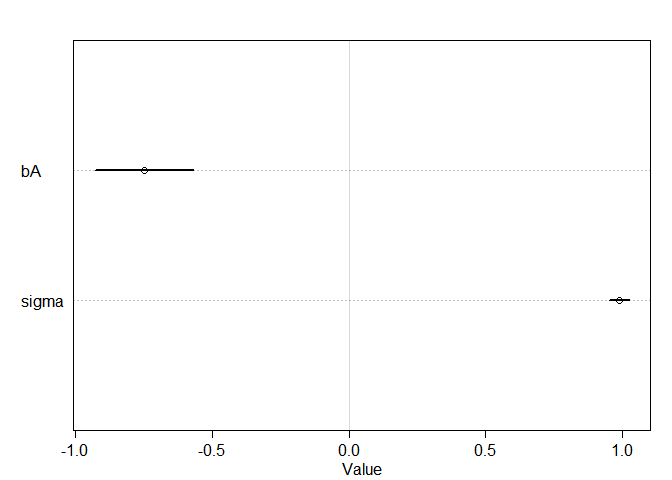
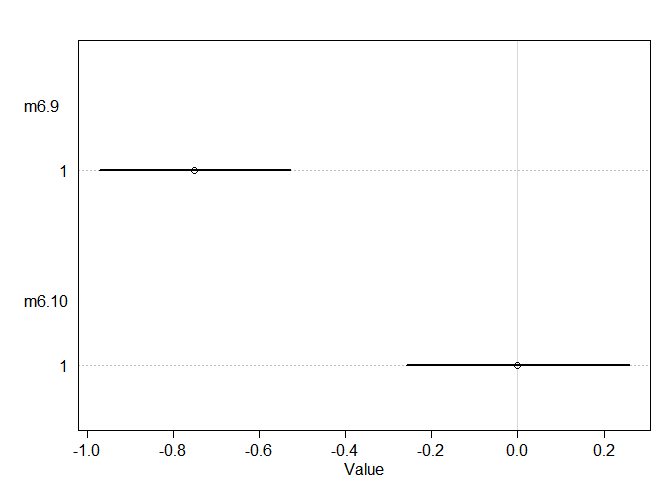
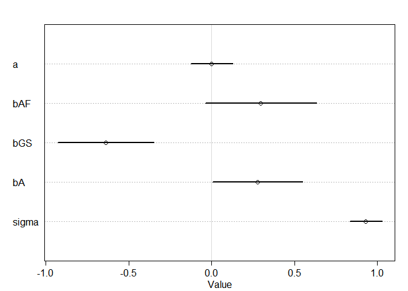
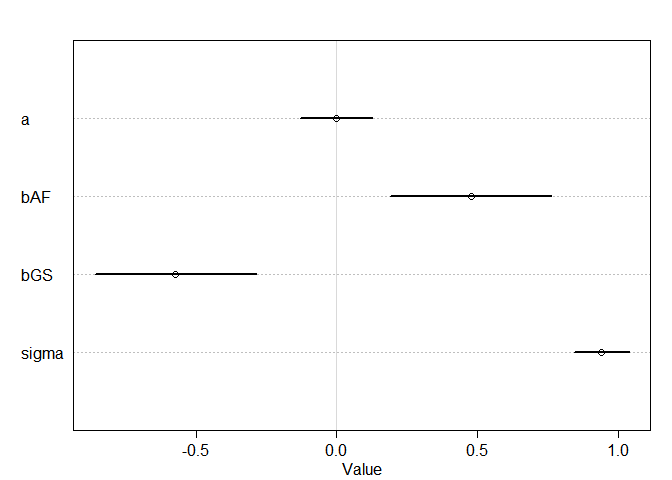
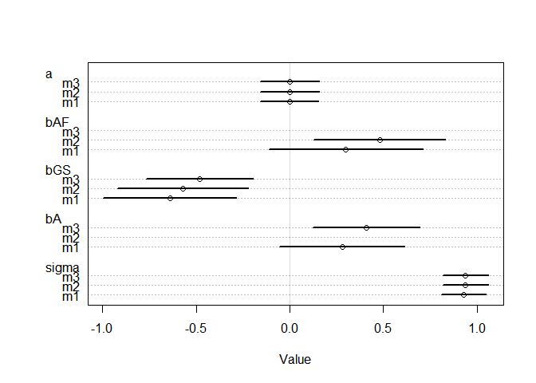
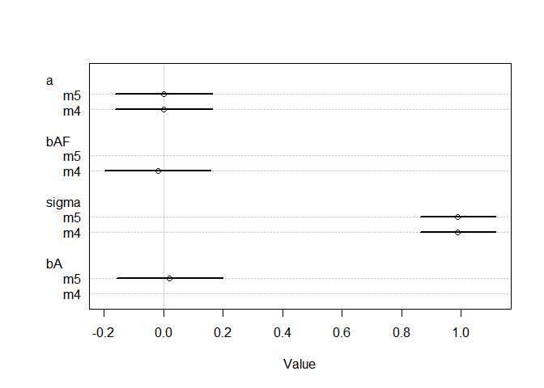

```r
library(rethinking)
```

```
## Loading required package: rstan
```

```
## Warning: package 'rstan' was built under R version 3.5.3
```

```
## Loading required package: ggplot2
```

```
## Loading required package: StanHeaders
```

```
## Warning: package 'StanHeaders' was built under R version 3.5.3
```

```
## rstan (Version 2.18.2, GitRev: 2e1f913d3ca3)
```

```
## For execution on a local, multicore CPU with excess RAM we recommend calling
## options(mc.cores = parallel::detectCores()).
## To avoid recompilation of unchanged Stan programs, we recommend calling
## rstan_options(auto_write = TRUE)
```

```
## For improved execution time, we recommend calling
## Sys.setenv(LOCAL_CPPFLAGS = '-march=native')
## although this causes Stan to throw an error on a few processors.
```

```
## Loading required package: parallel
```

```
## rethinking (Version 1.88)
```

## 7.5. Using cross-validation and information criteria
### 7.5.1. Model mis-selection.

## 6.2. Post-treatment bias


```r
## R code 6.14
set.seed(71)
# number of plants
N <- 100

# simulate initial heights
h0 <- rnorm(N,10,2)

# assign treatments and simulate fungus and growth
treatment <- rep( 0:1 , each=N/2 )
fungus <- rbinom( N , size=1 , prob=0.5 - treatment*0.4 )
h1 <- h0 + rnorm(N, 5 - 3*fungus)

# compose a clean data frame
d <- data.frame( h0=h0 , h1=h1 , treatment=treatment , fungus=fungus )
precis(d)
```

```
##               mean        sd      5.5%    94.5%    histogram
## h0         9.95978 2.1011623  6.570328 13.07874 ▁▂▂▂▇▃▂▃▁▁▁▁
## h1        14.39920 2.6880870 10.618002 17.93369     ▁▁▃▇▇▇▁▁
## treatment  0.50000 0.5025189  0.000000  1.00000   ▇▁▁▁▁▁▁▁▁▇
## fungus     0.23000 0.4229526  0.000000  1.00000   ▇▁▁▁▁▁▁▁▁▂
```
### 6.2.1. A prior is born.


```r
## R code 6.15
sim_p <- rlnorm( 1e4 , 0 , 0.25 )
precis( data.frame(sim_p) )
```

```
##          mean        sd     5.5%    94.5%    histogram
## sim_p 1.03699 0.2629894 0.670683 1.496397 ▁▁▃▇▇▃▁▁▁▁▁▁
```

```r
## R code 6.16
m6.6 <- quap(
    alist(
        h1 ~ dnorm( mu , sigma ),
        mu <- h0*p,
        p ~ dlnorm( 0 , 0.25 ),
        sigma ~ dexp( 1 )
    ), data=d )
precis(m6.6)
```

```
##           mean         sd     5.5%    94.5%
## p     1.426626 0.01760992 1.398482 1.454770
## sigma 1.793286 0.12517262 1.593236 1.993336
```

```r
## R code 6.17
m6.7 <- quap(
    alist(
        h1 ~ dnorm( mu , sigma ),
        mu <- h0 * p,
        p <- a + bt*treatment + bf*fungus,
        a ~ dlnorm( 0 , 0.2 ) ,
        bt ~ dnorm( 0 , 0.5 ),
        bf ~ dnorm( 0 , 0.5 ),
        sigma ~ dexp( 1 )
    ), data=d )
precis(m6.7)
```

```
##               mean         sd        5.5%       94.5%
## a      1.481391468 0.02451069  1.44221865  1.52056429
## bt     0.002412222 0.02986965 -0.04532525  0.05014969
## bf    -0.266718915 0.03654772 -0.32512923 -0.20830860
## sigma  1.408797442 0.09862070  1.25118251  1.56641237
```

### 6.2.2. Blocked by consequence.


```r
## R code 6.18
m6.8 <- quap(
    alist(
        h1 ~ dnorm( mu , sigma ),
        mu <- h0 * p,
        p <- a + bt*treatment,
        a ~ dlnorm( 0 , 0.2 ),
        bt ~ dnorm( 0 , 0.5 ),
        sigma ~ dexp( 1 )
    ), data=d )
precis(m6.8)
```

```
##             mean         sd       5.5%     94.5%
## a     1.38035767 0.02517554 1.34012229 1.4205931
## bt    0.08499924 0.03429718 0.03018573 0.1398128
## sigma 1.74631655 0.12191552 1.55147200 1.9411611
```


```r
## R code 7.26
set.seed(11)
WAIC( m6.7 )
```

```
## [1] 361.4511
## attr(,"lppd")
## [1] -177.1724
## attr(,"pWAIC")
## [1] 3.553198
## attr(,"se")
## [1] 14.17033
```

```r
## R code 7.27
set.seed(77)
compare( m6.6 , m6.7 , m6.8 )
```

```
##          WAIC    pWAIC    dWAIC       weight       SE      dSE
## m6.7 361.8901 3.839491  0.00000 1.000000e+00 14.26190       NA
## m6.8 402.7757 2.645879 40.88562 1.323732e-09 11.28257 10.47837
## m6.6 405.9139 1.581312 44.02380 2.756471e-10 11.64641 12.22582
```

```r
## R code 7.28
set.seed(91)
waic_m6.6 <- WAIC( m6.6 , pointwise=TRUE )
waic_m6.7 <- WAIC( m6.7 , pointwise=TRUE )
waic_m6.8 <- WAIC( m6.8 , pointwise=TRUE )
n <- length(waic_m6.6)
diff_m6.7_m6.8 <- waic_m6.7 - waic_m6.8

## R code 7.29
40.0 + c(-1,1)*10.4*2.6
```

```
## [1] 12.96 67.04
```

```r
## R code 7.30
plot( compare( m6.6 , m6.7 , m6.8 ) )
```

<!-- -->

```r
## R code 7.31
set.seed(92)
waic_m6.6 <- WAIC( m6.6 , pointwise=TRUE )
diff_m6.6_m6.8 <- waic_m6.6 - waic_m6.8
sqrt( n*var( diff_m6.6_m6.8 ) )
```

```
## [1] 4.860371
```

```r
## R code 7.32
set.seed(93)
compare( m6.6 , m6.7 , m6.8 )@dSE
```

```
##           m6.6     m6.7      m6.8
## m6.6        NA 12.20191  4.930467
## m6.7 12.201914       NA 10.426817
## m6.8  4.930467 10.42682        NA
```

### 7.5.2. Something about Cebus.


```r
## R code 7.33
data(Primates301)
d <- Primates301

## R code 7.34
d$log_L <- scale( log(d$longevity) )
d$log_B <- scale( log(d$brain) )
d$log_M <- scale( log(d$body) )

## R code 7.35
sapply( d[,c("log_L","log_B","log_M")] , function(x) sum(is.na(x)) )
```

```
## log_L log_B log_M 
##   181   117    63
```

```r
## R code 7.36
d2 <- d[ complete.cases( d$log_L , d$log_M , d$log_B ) , ]
nrow(d2)
```

```
## [1] 112
```

```r
## R code 7.37
m7.8 <- quap(
    alist(
        log_L ~ dnorm( mu , sigma ),
        mu <- a + bM*log_M + bB*log_B,
        a ~ dnorm(0,0.1),
        bM ~ dnorm(0,0.5),
        bB ~ dnorm(0,0.5),
        sigma ~ dexp(1)
    ) , data=d2 )

## R code 7.38
m7.9 <- quap(
    alist(
        log_L ~ dnorm( mu , sigma ),
        mu <- a + bB*log_B,
        a ~ dnorm(0,0.1),
        bB ~ dnorm(0,0.5),
        sigma ~ dexp(1)
    ) , data=d2 )
m7.10 <- quap(
    alist(
        log_L ~ dnorm( mu , sigma ),
        mu <- a + bM*log_M,
        a ~ dnorm(0,0.1),
        bM ~ dnorm(0,0.5),
        sigma ~ dexp(1)
    ) , data=d2 )

## R code 7.39
set.seed(301)
compare( m7.8 , m7.9 , m7.10 )
```

```
##           WAIC    pWAIC      dWAIC       weight       SE      dSE
## m7.8  216.2261 3.472685  0.0000000 0.5335026238 14.71922       NA
## m7.9  216.4977 2.603003  0.2715816 0.4657612510 14.83667 1.507168
## m7.10 229.3978 2.465432 13.1716380 0.0007361252 16.30327 7.006331
```

```r
## R code 7.40
plot( compare( m7.8 , m7.9 , m7.10 ) )
```

<!-- -->

```r
## R code 7.41
plot( coeftab( m7.8 , m7.9 , m7.10 ) , pars=c("bM","bB") )
```

<!-- -->

```r
## R code 7.42
cor( d2$log_B , d2$log_M )
```

```
##           [,1]
## [1,] 0.9796272
```

```r
## R code 7.43
waic_m7.8 <- WAIC( m7.8 , pointwise=TRUE )
waic_m7.9 <- WAIC( m7.9 , pointwise=TRUE )

## R code 7.44
# compute point scaling
x <- d2$log_B - d2$log_M
x <- x - min(x)
x <- x / max(x)

# draw the plot
plot( waic_m7.8 - waic_m7.9 , d2$log_L ,
    xlab="pointwise difference in WAIC" , ylab="log longevity (std)" , pch=21 ,
    col=col.alpha("black",0.8) , cex=1+x , lwd=2 , bg=col.alpha(rangi2,0.4) )
abline( v=0 , lty=2 )
abline( h=0 , lty=2 )
```

<!-- -->

```r
## R code 7.45
m7.11 <- quap(
    alist(
        log_B ~ dnorm( mu , sigma ),
        mu <- a + bM*log_M + bL*log_L,
        a ~ dnorm(0,0.1),
        bM ~ dnorm(0,0.5),
        bL ~ dnorm(0,0.5),
        sigma ~ dexp(1)
    ) , data=d2 )
precis( m7.11 )
```

```
##              mean         sd        5.5%       94.5%
## a     -0.04506873 0.01795371 -0.07376224 -0.01637523
## bM     0.93842037 0.02602549  0.89682661  0.98001413
## bL     0.11549564 0.02723920  0.07196215  0.15902914
## sigma  0.18997589 0.01267748  0.16971483  0.21023695
```

### 1. Consider three fictional Polynesian islands. On each there is a Royal Ornithologist charged by the king with surveying the birb population. They have each found the following proportions of 5 important birb species:

Birb A Birb B Birb C Birb D Birb E
Island 1 0.2 0.2 0.2 0.2 0.2
Island 2 0.8 0.1 0.05 0.025 0.025
Island 3 0.05 0.15 0.7 0.05 0.05

#### Notice that each row sums to 1, all the birbs. This problem has two parts. It is not computationally complicated. But it is conceptually tricky. 
#### First, compute the entropy of each island’s birb distribution. Interpret these entropy values.
#### Second, use each island’s birb distribution to predict the other two. This means to compute the K-L Divergence of each island from the others, treating each island as if it were a statistical model of the other islands. You should end up with 6 different K-L Divergence values. Which island predicts the others best? Why?


```r
island <-list()
island$one <- c( 0.2 , 0.2 , 0.2 , 0.2 , 0.2 )
island$two <- c( 0.8 , 0.1 , 0.05 , 0.025 , 0.025 )
island$three <- c( 0.05 , 0.15 , 0.7 , 0.05 , 0.05 )
island
```

```
## $one
## [1] 0.2 0.2 0.2 0.2 0.2
## 
## $two
## [1] 0.800 0.100 0.050 0.025 0.025
## 
## $three
## [1] 0.05 0.15 0.70 0.05 0.05
```

```r
entropy <- function(p) {
  -sum(p*log(p))}

sapply( island , entropy )
```

```
##       one       two     three 
## 1.6094379 0.7430039 0.9836003
```


```r
KLD <- function(p,q) {
  sum( p*(log(p)-log(q)))}

Divergence <-list()
Divergence$"1.2" <- KLD ( island$one , island$two )
Divergence$"1.3" <- KLD ( island$one , island$three )
Divergence$"2.1" <- KLD ( island$two , island$one )
Divergence$"2.3" <- KLD ( island$two , island$three )
Divergence$"3.1" <- KLD ( island$three , island$one )
Divergence$"3.2" <- KLD ( island$three , island$two )

Divergence
```

```
## $`1.2`
## [1] 0.9704061
## 
## $`1.3`
## [1] 0.6387604
## 
## $`2.1`
## [1] 0.866434
## 
## $`2.3`
## [1] 2.010914
## 
## $`3.1`
## [1] 0.6258376
## 
## $`3.2`
## [1] 1.838845
```

>  First island predicts the others best because first island has the highest entropy.

### 2. Recall the marriage, age, and happiness collider bias example from Chapter 6. Run models m6.9 and m6.10 again. Compare these two models using WAIC (or LOO, they will produce identical results). Which model is expected to make better predictions? Which model provides the correct causal inference about the influence of age on happiness? Can you explain why the answers to these two questions disagree?

## 6.3. Collider bias

### 6.3.1. Collider of false sorrow.


```r
## R code 6.22
d <- sim_happiness( seed=1977 , N_years=1000 )
precis(d)
```

```
##                    mean        sd      5.5%     94.5%     histogram
## age        3.300000e+01 18.768883  4.000000 62.000000 ▇▇▇▇▇▇▇▇▇▇▇▇▇
## married    3.007692e-01  0.458769  0.000000  1.000000    ▇▁▁▁▁▁▁▁▁▃
## happiness -1.000070e-16  1.214421 -1.789474  1.789474      ▇▅▇▅▅▇▅▇
```

```r
## R code 6.23
d2 <- d[ d$age>17 , ] # only adults
d2$A <- ( d2$age - 18 ) / ( 65 - 18 )

## R code 6.24
d2$mid <- d2$married + 1
m6.9 <- quap(
    alist(
        happiness ~ dnorm( mu , sigma ),
        mu <- a[mid] + bA*A,
        a[mid] ~ dnorm( 0 , 1 ),
        bA ~ dnorm( 0 , 2 ),
        sigma ~ dexp(1)
    ) , data=d2 )
precis(m6.9,depth=2)
```

```
##             mean         sd       5.5%      94.5%
## a[1]  -0.2350877 0.06348986 -0.3365568 -0.1336186
## a[2]   1.2585517 0.08495989  1.1227694  1.3943340
## bA    -0.7490274 0.11320112 -0.9299447 -0.5681102
## sigma  0.9897080 0.02255800  0.9536559  1.0257600
```

```r
plot(precis(m6.9))
```

```
## 2 vector or matrix parameters hidden. Use depth=2 to show them.
```

<!-- -->

```r
## R code 6.25
m6.10 <- quap(
    alist(
        happiness ~ dnorm( mu , sigma ),
        mu <- a + bA*A,
        a ~ dnorm( 0 , 1 ),
        bA ~ dnorm( 0 , 2 ),
        sigma ~ dexp(1)
    ) , data=d2 )
precis(m6.10)
```

```
##                mean         sd       5.5%     94.5%
## a      1.649248e-07 0.07675015 -0.1226614 0.1226617
## bA    -2.728620e-07 0.13225976 -0.2113769 0.2113764
## sigma  1.213188e+00 0.02766080  1.1689803 1.2573949
```

```r
plot(precis(m6.10))
```

<!-- -->


```r
compare( m6.9 , m6.10 )
```

```
##           WAIC    pWAIC    dWAIC       weight       SE      dSE
## m6.9  2713.971 3.738532   0.0000 1.000000e+00 37.54465       NA
## m6.10 3101.906 2.340445 387.9347 5.768312e-85 27.74379 35.40032
```

```r
plot(compare( m6.9 , m6.10 ))
```

<!-- -->

```r
plot( coeftab( m6.9 , m6.10 ) , pars=c("bA") )
```

<!-- -->

> Happiness (H) and age (A) both cause marriage (M). Marriage is therefore a collider. Even though there is no causal association between happiness and age, if we condition on marriage — which means here, if we include it as a predictor in a regression—then it will induce a statistical association between age and happiness. And this can mislead us to think that happiness changes with age, when in fact it is constant.

> In model m6.9, that age is negatively associated with happiness. But this is just a statistical association, not a causal association. Once we know whether someone is married or not, then their age does provide information about how happy they are.

> Therefore,  m6.9 model is expected to make better predictions. m6.10 model provides the correct causal inference about the influence of age on happiness.

### 3. Reconsider the urban fox analysis from last week’s homework. Use WAIC or LOO based model comparison on five different models, each using weight as the outcome, and containing these sets of predictor variables:
(1) avgfood + groupsize + area
(2) avgfood + groupsize
(3) groupsize + area
(4) avgfood
(5) area
#### Can you explain the relative differences in WAIC scores, using the fox DAG from last week’s homework? Be sure to pay attention to the standard error of the score differences(dSE).


```r
data(foxes)
fox_data <- foxes
fox_data$st_weight <- scale(fox_data$weight)
fox_data$st_area <- scale(fox_data$area)
fox_data$st_avgfood <- scale(fox_data$avgfood)
fox_data$st_groupsize <- scale(fox_data$groupsize)

str(fox_data)
```

```
## 'data.frame':	116 obs. of  9 variables:
##  $ group       : int  1 1 2 2 3 3 4 4 5 5 ...
##  $ avgfood     : num  0.37 0.37 0.53 0.53 0.49 0.49 0.45 0.45 0.74 0.74 ...
##  $ groupsize   : int  2 2 2 2 2 2 2 2 3 3 ...
##  $ area        : num  1.09 1.09 2.05 2.05 2.12 2.12 1.29 1.29 3.78 3.78 ...
##  $ weight      : num  5.02 2.84 5.33 6.07 5.85 3.25 4.53 4.09 6.13 5.59 ...
##  $ st_weight   : num [1:116, 1] 0.414 -1.427 0.676 1.301 1.115 ...
##   ..- attr(*, "scaled:center")= num 4.53
##   ..- attr(*, "scaled:scale")= num 1.18
##  $ st_area     : num [1:116, 1] -2.24 -2.24 -1.21 -1.21 -1.13 ...
##   ..- attr(*, "scaled:center")= num 3.17
##   ..- attr(*, "scaled:scale")= num 0.928
##  $ st_avgfood  : num [1:116, 1] -1.92 -1.92 -1.12 -1.12 -1.32 ...
##   ..- attr(*, "scaled:center")= num 0.752
##   ..- attr(*, "scaled:scale")= num 0.198
##  $ st_groupsize: num [1:116, 1] -1.52 -1.52 -1.52 -1.52 -1.52 ...
##   ..- attr(*, "scaled:center")= num 4.34
##   ..- attr(*, "scaled:scale")= num 1.54
```

```r
head(fox_data)
```

```
##   group avgfood groupsize area weight  st_weight   st_area st_avgfood
## 1     1    0.37         2 1.09   5.02  0.4141347 -2.239596  -1.924829
## 2     1    0.37         2 1.09   2.84 -1.4270464 -2.239596  -1.924829
## 3     2    0.53         2 2.05   5.33  0.6759540 -1.205508  -1.118035
## 4     2    0.53         2 2.05   6.07  1.3009421 -1.205508  -1.118035
## 5     3    0.49         2 2.12   5.85  1.1151348 -1.130106  -1.319734
## 6     3    0.49         2 2.12   3.25 -1.0807692 -1.130106  -1.319734
##   st_groupsize
## 1    -1.524089
## 2    -1.524089
## 3    -1.524089
## 4    -1.524089
## 5    -1.524089
## 6    -1.524089
```


```r
m1 <- quap(
  alist(
    st_weight ~ dnorm( mu , sigma ),
    mu <- a + bAF*st_avgfood + bGS*st_groupsize + bA*st_area,
    a ~ dnorm(0,0.2),
    c(bAF,bGS,bA) ~ dnorm(0,0.5),
    sigma ~ dexp(1)
    ), data=fox_data )
precis(m1)
```

```
##                mean         sd         5.5%      94.5%
## a     -1.083245e-05 0.07936248 -0.126847405  0.1268257
## bAF    2.968635e-01 0.20960154 -0.038120244  0.6318472
## bGS   -6.396302e-01 0.18161573 -0.929887233 -0.3493732
## bA     2.782728e-01 0.17011319  0.006399094  0.5501466
## sigma  9.312129e-01 0.06100115  0.833721292  1.0287045
```

```r
plot(precis(m1))
```

<!-- -->


```r
m2 <- quap(
  alist(
    st_weight ~ dnorm( mu , sigma ),
    mu <- a + bAF*st_avgfood + bGS*st_groupsize,
    a ~ dnorm(0,0.2),
    c(bAF,bGS) ~ dnorm(0,0.5),
    sigma ~ dexp(1)
    ), data=fox_data )
precis(m2)
```

```
##                mean         sd       5.5%      94.5%
## a      1.728373e-09 0.08013768 -0.1280755  0.1280755
## bAF    4.772501e-01 0.17912245  0.1909778  0.7635224
## bGS   -5.735234e-01 0.17914094 -0.8598252 -0.2872216
## sigma  9.420385e-01 0.06175167  0.8433474  1.0407296
```

```r
plot(precis(m2))
```

<!-- -->


```r
m3 <- quap(
  alist(
    st_weight ~ dnorm( mu , sigma ),
    mu <- a + bGS*st_groupsize + bA*st_area,
    a ~ dnorm(0,0.2),
    c(bGS,bA) ~ dnorm(0,0.5),
    sigma ~ dexp(1)
    ), data=fox_data )
precis(m3)
```

```
##                mean         sd       5.5%      94.5%
## a     -8.334279e-07 0.08013101 -0.1280657  0.1280640
## bGS   -4.819988e-01 0.14537256 -0.7143322 -0.2496654
## bA     4.058504e-01 0.14536254  0.1735330  0.6381678
## sigma  9.419451e-01 0.06159401  0.8435060  1.0403842
```

```r
plot(precis(m3))
```

<!-- -->


```r
m4 <- quap(
  alist(
    st_weight ~ dnorm( mu , sigma ),
    mu <- a + bAF*st_avgfood,
    a ~ dnorm(0,0.2),
    bAF ~ dnorm(0,0.5),
    sigma ~ dexp(1)
    ), data=fox_data )
precis(m4)
```

```
##                mean         sd       5.5%     94.5%
## a      5.593046e-07 0.08360020 -0.1336087 0.1336098
## bAF   -2.421258e-02 0.09088506 -0.1694645 0.1210393
## sigma  9.911444e-01 0.06465866  0.8878074 1.0944814
```

```r
plot(precis(m4))
```

<!-- -->


```r
m5 <- quap(
  alist(
    st_weight ~ dnorm( mu , sigma ),
    mu <- a + bA*st_area,
    a ~ dnorm(0,0.2),
    bA ~ dnorm(0,0.5),
    sigma ~ dexp(1)
    ), data=fox_data )
precis(m5)
```

```
##               mean         sd       5.5%     94.5%
## a     1.410074e-09 0.08360867 -0.1336228 0.1336228
## bA    1.883359e-02 0.09089582 -0.1264355 0.1641027
## sigma 9.912661e-01 0.06466649  0.8879166 1.0946156
```

```r
plot(precis(m5))
```

<!-- -->


```r
compare( m1 , m2 , m3 , m4 , m5 )
```

```
##        WAIC    pWAIC      dWAIC      weight       SE      dSE
## m1 323.5280 4.989281  0.0000000 0.352276030 16.42686       NA
## m2 323.6879 3.648213  0.1599654 0.325197393 16.10271 3.405631
## m3 323.7320 3.636476  0.2040592 0.318106257 15.76867 3.134629
## m4 333.4691 2.431423  9.9411241 0.002444530 13.83617 7.300046
## m5 333.8949 2.708263 10.3668927 0.001975791 13.89930 7.369417
```


```r
coeftab(m1,m2,m3)
```

```
##       m1      m2      m3     
## a           0       0       0
## bAF      0.30    0.48      NA
## bGS     -0.64   -0.57   -0.48
## bA       0.28      NA    0.41
## sigma    0.93    0.94    0.94
## nobs      116     116     116
```

```r
plot(coeftab(m1,m2,m3))
```

<!-- -->

```r
coeftab(m4,m5)
```

```
##       m4      m5     
## a           0       0
## bAF     -0.02      NA
## sigma    0.99    0.99
## bA         NA    0.02
## nobs      116     116
```

```r
plot(coeftab(m4,m5))
```

<!-- -->

> m1,m2,m3 have very similar lower WAIC values, and m4,m5 have very similar higher WAIC values
