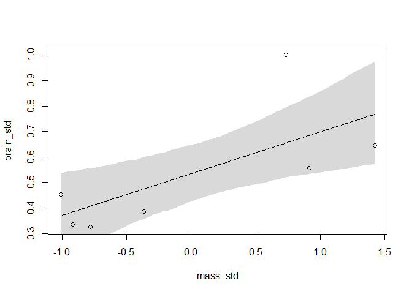
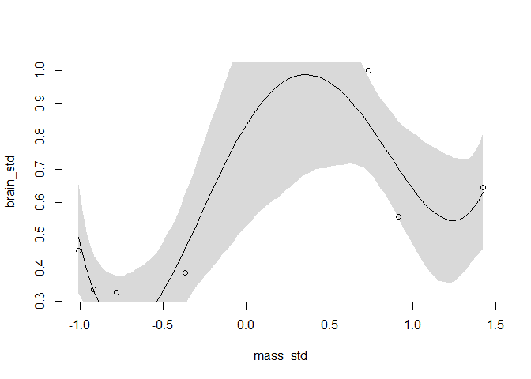
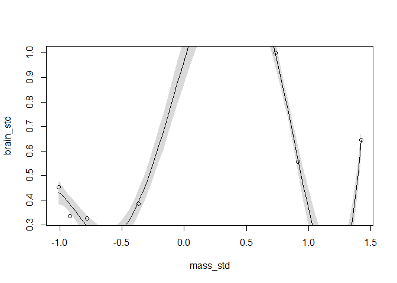

```r
library(rethinking)
```

```
## Loading required package: rstan
```

```
## Warning: package 'rstan' was built under R version 3.5.3
```

```
## Loading required package: ggplot2
```

```
## Loading required package: StanHeaders
```

```
## Warning: package 'StanHeaders' was built under R version 3.5.3
```

```
## rstan (Version 2.18.2, GitRev: 2e1f913d3ca3)
```

```
## For execution on a local, multicore CPU with excess RAM we recommend calling
## options(mc.cores = parallel::detectCores()).
## To avoid recompilation of unchanged Stan programs, we recommend calling
## rstan_options(auto_write = TRUE)
```

```
## For improved execution time, we recommend calling
## Sys.setenv(LOCAL_CPPFLAGS = '-march=native')
## although this causes Stan to throw an error on a few processors.
```

```
## Loading required package: parallel
```

```
## rethinking (Version 1.88)
```

# 7 Ulysses’ Compass
## 7.1. Th e problem with parameters
### 7.1.1. More parameters always improve fit.


```r
## R code 7.1
sppnames <- c( "afarensis","africanus","habilis","boisei",
    "rudolfensis","ergaster","sapiens")
brainvolcc <- c( 438 , 452 , 612, 521, 752, 871, 1350 )
masskg <- c( 37.0 , 35.5 , 34.5 , 41.5 , 55.5 , 61.0 , 53.5 )
d <- data.frame( species=sppnames , brain=brainvolcc , mass=masskg )

## R code 7.2
d$mass_std <- (d$mass - mean(d$mass))/sd(d$mass)
d$brain_std <- d$brain / max(d$brain)

## R code 7.3
m7.1 <- quap(
    alist(
        brain_std ~ dnorm( mu , exp(log_sigma) ),
        mu <- a + b*mass_std,
        a ~ dnorm( 0.5 , 1 ),
        b ~ dnorm( 0 , 10 ),
        log_sigma ~ dnorm( 0 , 1 )
    ), data=d )

## R code 7.4
set.seed(12)
s <- sim( m7.1 )
r <- apply(s,2,mean) - d$brain_std
resid_var <- var2(r)
outcome_var <- var2( d$brain_std )
1 - resid_var/outcome_var
```

```
## [1] 0.4774595
```

```r
## R code 7.5
R2_is_bad <- function( quap_fit ) {
    s <- sim( quap_fit , refresh=0 )
    r <- apply(s,2,mean) - d$brain_std
    1 - var2(r)/var2(d$brain_std)
}

## R code 7.6
m7.2 <- quap(
    alist(
        brain_std ~ dnorm( mu , exp(log_sigma) ),
        mu <- a + b[1]*mass_std + b[2]*mass_std^2,
        a ~ dnorm( 0.5 , 1 ),
        b ~ dnorm( 0 , 10 ),
        log_sigma ~ dnorm( 0 , 1 )
    ), data=d , start=list(b=rep(0,2)) )

## R code 7.7
m7.3 <- quap(
    alist(
        brain_std ~ dnorm( mu , exp(log_sigma) ),
        mu <- a + b[1]*mass_std + b[2]*mass_std^2 +
                  b[3]*mass_std^3,
        a ~ dnorm( 0.5 , 1 ),
        b ~ dnorm( 0 , 10 ),
        log_sigma ~ dnorm( 0 , 1 )
    ), data=d , start=list(b=rep(0,3)) )

m7.4 <- quap(
    alist(
        brain_std ~ dnorm( mu , exp(log_sigma) ),
        mu <- a + b[1]*mass_std + b[2]*mass_std^2 +
                  b[3]*mass_std^3 + b[4]*mass_std^4,
        a ~ dnorm( 0.5 , 1 ),
        b ~ dnorm( 0 , 10 ),
        log_sigma ~ dnorm( 0 , 1 )
    ), data=d , start=list(b=rep(0,4)) )

m7.5 <- quap(
    alist(
        brain_std ~ dnorm( mu , exp(log_sigma) ),
        mu <- a + b[1]*mass_std + b[2]*mass_std^2 +
                  b[3]*mass_std^3 + b[4]*mass_std^4 +
                  b[5]*mass_std^5,
        a ~ dnorm( 0.5 , 1 ),
        b ~ dnorm( 0 , 10 ),
        log_sigma ~ dnorm( 0 , 1 )
    ), data=d , start=list(b=rep(0,5)) )

## R code 7.8
m7.6 <- quap(
    alist(
        brain_std ~ dnorm( mu , 0.001 ),
        mu <- a + b[1]*mass_std + b[2]*mass_std^2 +
                  b[3]*mass_std^3 + b[4]*mass_std^4 +
                  b[5]*mass_std^5 + b[6]*mass_std^6,
        a ~ dnorm( 0.5 , 1 ),
        b ~ dnorm( 0 , 10 )
    ), data=d , start=list(b=rep(0,6)) )

## R code 7.9
post <- extract.samples(m7.1)
mass_seq <- seq( from=min(d$mass_std) , to=max(d$mass_std) , length.out=100 )
l <- link( m7.1 , data=list( mass_std=mass_seq ) )
mu <- apply( l , 2 , mean )
ci <- apply( l , 2 , PI )
plot( brain_std ~ mass_std , data=d )
lines( mass_seq , mu )
shade( ci , mass_seq )
```

<!-- -->

```r
## R code 7.9
post <- extract.samples(m7.2)
mass_seq <- seq( from=min(d$mass_std) , to=max(d$mass_std) , length.out=100 )
l <- link( m7.2 , data=list( mass_std=mass_seq ) )
mu <- apply( l , 2 , mean )
ci <- apply( l , 2 , PI )
plot( brain_std ~ mass_std , data=d )
lines( mass_seq , mu )
shade( ci , mass_seq )
```

<!-- -->

```r
## R code 7.9
post <- extract.samples(m7.3)
mass_seq <- seq( from=min(d$mass_std) , to=max(d$mass_std) , length.out=100 )
l <- link( m7.3 , data=list( mass_std=mass_seq ) )
mu <- apply( l , 2 , mean )
ci <- apply( l , 2 , PI )
plot( brain_std ~ mass_std , data=d )
lines( mass_seq , mu )
shade( ci , mass_seq )
```

<!-- -->

```r
## R code 7.9
post <- extract.samples(m7.4)
mass_seq <- seq( from=min(d$mass_std) , to=max(d$mass_std) , length.out=100 )
l <- link( m7.4 , data=list( mass_std=mass_seq ) )
mu <- apply( l , 2 , mean )
ci <- apply( l , 2 , PI )
plot( brain_std ~ mass_std , data=d )
lines( mass_seq , mu )
shade( ci , mass_seq )
```

<!-- -->

```r
## R code 7.9
post <- extract.samples(m7.5)
mass_seq <- seq( from=min(d$mass_std) , to=max(d$mass_std) , length.out=100 )
l <- link( m7.5 , data=list( mass_std=mass_seq ) )
mu <- apply( l , 2 , mean )
ci <- apply( l , 2 , PI )
plot( brain_std ~ mass_std , data=d )
lines( mass_seq , mu )
shade( ci , mass_seq )
```

<!-- -->

```r
## R code 7.9
post <- extract.samples(m7.6)
mass_seq <- seq( from=min(d$mass_std) , to=max(d$mass_std) , length.out=100 )
l <- link( m7.6 , data=list( mass_std=mass_seq ) )
mu <- apply( l , 2 , mean )
ci <- apply( l , 2 , PI )
plot( brain_std ~ mass_std , data=d )
lines( mass_seq , mu )
shade( ci , mass_seq )
```

<!-- -->

```r
## R code 7.10
m7.1_OLS <- lm( brain_std ~ mass_std , data=d )
post <- extract.samples( m7.1_OLS )
```

### 7.1.2. Too few parameters hurts, too.


```r
## R code 7.11
m7.7 <- quap(
    alist(
        brain_std ~ dnorm( mu , exp(log_sigma) ),
        mu <- a,
        a ~ dnorm( 0.5 , 1 ),
        log_sigma ~ dnorm( 0 , 1 )
    ), data=d )

## R code 7.12
#d_minus_i <- d[ -i , ]
```

## 7.2. Entropy and accuracy
### 7.2.1. Firing the weatherperson.
### 7.2.2. Information and uncertainty.


```r
## R code 7.13
p <- c( 0.3 , 0.7 )
-sum( p*log(p) )
```

```
## [1] 0.6108643
```

### 7.2.3. From entropy to accuracy. 
### 7.2.4. Estimating divergence.


```r
## R code 7.14
set.seed(1)
lppd( m7.1 , n=1e4 )
```

```
## [1]  0.6098734  0.6483613  0.5496684  0.6235097  0.4648872  0.4348502
## [7] -0.8446646
```

```r
## R code 7.15
set.seed(1)
logprob <- sim( m7.1 , ll=TRUE , n=1e4 )
n <- ncol(logprob)
ns <- nrow(logprob)
f <- function( i ) log_sum_exp( logprob[,i] ) - log(ns)
( lppd <- sapply( 1:n , f ) )
```

```
## [1]  0.6098734  0.6483613  0.5496684  0.6235097  0.4648872  0.4348502
## [7] -0.8446646
```

### 7.2.5. Scoring the right data.


```r
## R code 7.16
set.seed(1)
sapply( list(m7.1,m7.2,m7.3,m7.4,m7.5,m7.6) , function(m) sum(lppd(m)) )
```

```
## [1]  2.490449  2.566165  3.707343  5.333750 14.124459 39.445390
```

```r
## R code 7.17
N <- 20
kseq <- 1:5
dev <- sapply( kseq , function(k) {
        print(k);
        r <- replicate( 10 , sim_train_test( N=N, k=k ) );
        c( mean(r[1,]) , mean(r[2,]) , sd(r[1,]) , sd(r[2,]) )
    } )
```

```
## [1] 1
## [1] 2
## [1] 3
## [1] 4
## [1] 5
```

```r
## R code 7.18
#        r <- mcreplicate( 1e4 , sim_train_test( N=N, k=k ) , mc.cores=4 )

## R code 7.19
plot( 1:5 , dev[1,] , ylim=c( min(dev[1:2,])-5 , max(dev[1:2,])+10 ) ,
    xlim=c(1,5.1) , xlab="number of parameters" , ylab="deviance" ,
    pch=16 , col=rangi2 )
mtext( concat( "N = ",N ) )
points( (1:5)+0.1 , dev[2,] )
for ( i in kseq ) {
    pts_in <- dev[1,i] + c(-1,+1)*dev[3,i]
    pts_out <- dev[2,i] + c(-1,+1)*dev[4,i]
    lines( c(i,i) , pts_in , col=rangi2 )
    lines( c(i,i)+0.1 , pts_out )
}
```

<!-- -->

## 7.6. Summary
## 7.7. Practice

### Easy.
#### 7E1. State the three motivating criteria that define information entropy. Try to express each in your own words.

> (1) The measure of uncertainty should be continuous. 

> (2) The measure of uncertainty should increase as the number of possible events in-
creases.

> (3) The measure of uncertainty should be additive. 

#### 7E2. Suppose a coin is weighted such that, when it is tossed and lands on a table, it comes up heads 70% of the time. What is the entropy of this coin?


```r
## R code 7.13
p <- c( 0.7 , 0.3 )
-sum( p*log(p) )
```

```
## [1] 0.6108643
```

#### 7E3. Suppose a four-sided die is loaded such that, when tossed onto a table, it shows “1” 20%, “2” 25%, ”3” 25%, and ”4” 30% of the time. What is the entropy of this die?


```r
## R code 7.13
p <- c( 0.2 , 0.25 , 0.25, 0.3 )
-sum( p*log(p) )
```

```
## [1] 1.376227
```

#### 7E4. Suppose another four-sided die is loaded such that it never shows “4”. The other three sides show equally often. What is the entropy of this die?


```r
## R code 7.13
p <- c( 1/3 , 1/3 , 1/3 )
-sum( p*log(p) )
```

```
## [1] 1.098612
```


