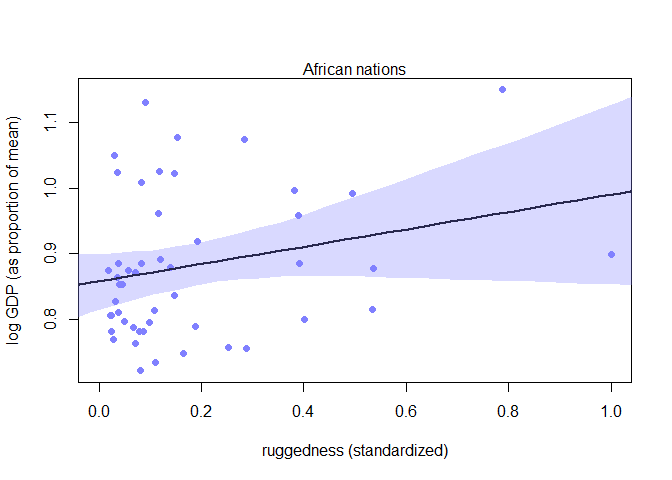
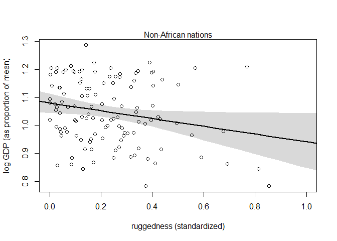

```r
## R code 8.1
library(rethinking)
```

```
## Loading required package: rstan
```

```
## Warning: package 'rstan' was built under R version 3.5.3
```

```
## Loading required package: ggplot2
```

```
## Loading required package: StanHeaders
```

```
## Warning: package 'StanHeaders' was built under R version 3.5.3
```

```
## rstan (Version 2.18.2, GitRev: 2e1f913d3ca3)
```

```
## For execution on a local, multicore CPU with excess RAM we recommend calling
## options(mc.cores = parallel::detectCores()).
## To avoid recompilation of unchanged Stan programs, we recommend calling
## rstan_options(auto_write = TRUE)
```

```
## For improved execution time, we recommend calling
## Sys.setenv(LOCAL_CPPFLAGS = '-march=native')
## although this causes Stan to throw an error on a few processors.
```

```
## Loading required package: parallel
```

```
## rethinking (Version 1.88)
```

```r
data(rugged)
d <- rugged

# make log version of outcome
d$log_gdp <- log( d$rgdppc_2000 )

# extract countries with GDP data
dd <- d[ complete.cases(d$rgdppc_2000) , ]

# rescale variables
dd$log_gdp_std <- dd$log_gdp / mean(dd$log_gdp)
dd$rugged_std <- dd$rugged / max(dd$rugged)

# split countries into Africa and not-Africa
d.A1 <- dd[ dd$cont_africa==1 , ] # Africa
d.A0 <- dd[ dd$cont_africa==0 , ] # not Africa

## R code 8.2
m8.1 <- quap(
    alist(
        log_gdp_std ~ dnorm( mu , sigma ) ,
        mu <- a + b*( rugged_std - 0.215 ) ,
        a ~ dnorm( 1 , 1 ) ,
        b ~ dnorm( 0 , 1 ) ,
        sigma ~ dexp( 1 )
    ) , data=d.A1 )

## R code 8.3
set.seed(7)
prior <- extract.prior( m8.1 )

# set up the plot dimensions
plot( NULL , xlim=c(0,1) , ylim=c(0.5,1.5) ,
    xlab="ruggedness" , ylab="log GDP" )
abline( h=min(dd$log_gdp_std) , lty=2 )
abline( h=max(dd$log_gdp_std) , lty=2 )

# draw 50 lines from the prior
rugged_seq <- seq( from=-0.1 , to=1.1 , length.out=30 )
mu <- link( m8.1 , post=prior , data=data.frame(rugged_std=rugged_seq) )
for ( i in 1:50 ) lines( rugged_seq , mu[i,] , col=col.alpha("black",0.3) )
```

<!-- -->

```r
## R code 8.4
sum( abs(prior$b) > 0.6 ) / length(prior$bR)
```

```
## [1] Inf
```

```r
## R code 8.5
m8.1 <- quap(
    alist(
        log_gdp_std ~ dnorm( mu , sigma ) ,
        mu <- a + b*( rugged_std - 0.215 ) ,
        a ~ dnorm( 1 , 0.1 ) ,
        b ~ dnorm( 0 , 0.3 ) ,
        sigma ~ dexp(1)
    ) , data=d.A1 )

## R code 8.6
# Non-African nations
m8.2 <- quap(
    alist(
        log_gdp_std ~ dnorm( mu , sigma ) ,
        mu <- a + b*( rugged_std - 0.215 ) ,
        a ~ dnorm( 1 , 0.1 ) ,
        b ~ dnorm( 0 , 0.25 ) ,
        sigma ~ dexp(1)
    ) ,
    data=d.A0 )

## R code 8.7
m8.3 <- quap(
    alist(
        log_gdp_std ~ dnorm( mu , sigma ) ,
        mu <- a + b*( rugged_std - 0.215 ) ,
        a ~ dnorm( 1 , 0.1 ) ,
        b ~ dnorm( 0 , 0.3 ) ,
        sigma ~ dexp( 1 )
    ) ,
    data=dd )

## R code 8.8
# make variable to index Africa (1) or not (2)
dd$cid <- ifelse( dd$cont_africa==1 , 1 , 2 )

## R code 8.9
m8.4 <- quap(
    alist(
        log_gdp_std ~ dnorm( mu , sigma ) ,
        mu <- a[cid] + b*( rugged_std - 0.215 ) ,
        a[cid] ~ dnorm( 1 , 0.1 ) ,
        b ~ dnorm( 0 , 0.3 ) ,
        sigma ~ dexp( 1 )
    ) ,
    data=dd )

## R code 8.10
compare( m8.3 , m8.4 )
```

```
##           WAIC    pWAIC   dWAIC       weight       SE      dSE
## m8.4 -252.2793 4.251978  0.0000 1.000000e+00 15.29497       NA
## m8.3 -188.7519 2.693455 63.5274 1.603984e-14 13.28923 15.14053
```

```r
## R code 8.11
precis( m8.4 , depth=2 )
```

```
##              mean          sd       5.5%      94.5%
## a[1]   0.88041473 0.015943392  0.8549341 0.90589535
## a[2]   1.04915430 0.010189703  1.0328692 1.06543941
## b     -0.04668912 0.045704973 -0.1197345 0.02635625
## sigma  0.11243357 0.006097339  0.1026888 0.12217830
```

```r
## R code 8.12
rugged.seq <- seq( from=-0.1 , to=1.1 , length.out=30 )

# compute mu over samples, fixing cid=2
mu.NotAfrica <- link( m8.4 ,
    data=data.frame( cid=2 , rugged_std=rugged.seq ) )

# compute mu over samples, fixing cid=1
mu.Africa <- link( m8.4 ,
    data=data.frame( cid=1 , rugged_std=rugged.seq ) )

# summarize to means and intervals
mu.NotAfrica_mu <- apply( mu.NotAfrica , 2 , mean )
mu.NotAfrica_ci <- apply( mu.NotAfrica , 2 , PI , prob=0.97 )
mu.Africa_mu <- apply( mu.Africa , 2 , mean )
mu.Africa_ci <- apply( mu.Africa , 2 , PI , prob=0.97 )

## R code 8.13
m8.5 <- quap(
    alist(
        log_gdp_std ~ dnorm( mu , sigma ) ,
        mu <- a[cid] + b[cid]*( rugged_std - 0.215 ) ,
        a[cid] ~ dnorm( 1 , 0.1 ) ,
        b[cid] ~ dnorm( 0 , 0.3 ) ,
        sigma ~ dexp( 1 )
    ) ,
    data=dd )

## R code 8.14
precis( m8.5 , depth=2 )
```

```
##             mean          sd        5.5%       94.5%
## a[1]   0.8865644 0.015675083  0.86151262  0.91161624
## a[2]   1.0505641 0.009936215  1.03468415  1.06644413
## b[1]   0.1325049 0.074201648  0.01391632  0.25109345
## b[2]  -0.1425769 0.054747277 -0.23007367 -0.05508023
## sigma  0.1094897 0.005934704  0.10000492  0.11897452
```

```r
## R code 8.15
compare( m8.3 , m8.4 , m8.5 )
```

```
##           WAIC    pWAIC     dWAIC       weight       SE       dSE
## m8.5 -258.2581 5.608769  0.000000 9.544522e-01 15.26863        NA
## m8.4 -252.1734 4.288529  6.084752 4.554778e-02 15.29425  6.764469
## m8.3 -188.9108 2.616449 69.347319 8.340176e-16 13.34484 15.593212
```

```r
## R code 8.16
waic_list <- WAIC( m8.5 , pointwise=TRUE )

## R code 8.17
# plot Africa - cid=1
plot( d.A1$rugged_std , d.A1$log_gdp_std , pch=16 , col=rangi2 ,
    xlab="ruggedness (standardized)" , ylab="log GDP (as proportion of mean)" ,
    xlim=c(0,1) )
mu <- link( m8.5 , data=data.frame( cid=1 , rugged_std=rugged_seq ) )
mu_mean <- apply( mu , 2 , mean )
mu_ci <- apply( mu , 2 , PI , prob=0.97 )
lines( rugged_seq , mu_mean , lwd=2 )
shade( mu_ci , rugged_seq , col=col.alpha(rangi2,0.3) )
mtext("African nations")
```

<!-- -->

```r
# plot non-Africa - cid=2
plot( d.A0$rugged_std , d.A0$log_gdp_std , pch=1 , col="black" ,
    xlab="ruggedness (standardized)" , ylab="log GDP (as proportion of mean)" ,
    xlim=c(0,1) )
mu <- link( m8.5 , data=data.frame( cid=2 , rugged_std=rugged_seq ) )
mu_mean <- apply( mu , 2 , mean )
mu_ci <- apply( mu , 2 , PI , prob=0.97 )
lines( rugged_seq , mu_mean , lwd=2 )
shade( mu_ci , rugged_seq )
mtext("Non-African nations")
```

<!-- -->

## 8.5. Practice

### 7E1. For each of the causal relationships below, name a hypothetical third variable that would lead to an interaction eff ect.
(1) Bread dough rises because of yeast.
(2) Education leads to higher income.
(3) Gasoline makes a car go.

### 7M3. In parts of North America, ravens depend upon wolves for their food. Th is is because ravens are carnivorous but cannot usually kill or open carcasses of prey. Wolves however can and do kill and tear open animals, and they tolerate ravens co-feeding at their kills. Th is species relationship is generally described as a “species interaction.” Can you invent a hypothetical set of data on raven population size in which this relationship would manifest as a statistical interaction? Do you think the biological interaction could be linear? Why or why not?

### 7H3. Consider again the data(rugged) data on economic development and terrain ruggedness, examined in this chapter. One of the African countries in that example, Seychelles, is far outside the cloud of other nations, being a rare country with both relatively high GDP and high ruggedness. Seychelles is also unusual, in that it is a group of islands far from the coast of mainland Africa, and its main economic activity is tourism. One might suspect that this one nation is exerting a strong infl uence on the conclusions. In this problem, I want you to drop Seychelles from the data and re-evaluate the hypothesis that the relationship of African economies with ruggedness is diff erent from that on other continents.

(a) Begin by using map to fi t just the interaction model:
y i  Normal(i; )
i =  + A A i + R R i + AR A i R i
where y is log GDP per capita in the year 2000 (log of rgdppc_2000); A is cont_africa, the dummy
variable for being an African nation; and R is the variable rugged. Choose your own priors. Compare
the inference from this model fi t to the data without Seychelles to the same model fi t to the full data.
Does it still seem like the eff ect of ruggedness depends upon continent? How much has the expected
relationship changed?

(b) Now plot the predictions of the interaction model, with and without Seychelles. Does it still
seem like the eff ect of ruggedness depends upon continent? How much has the expected relationship
changed?

(c) Finally, conduct a model comparison analysis, using WAIC. Fit three models to the data with-
out Seychelles:
Model 1 : y i  Normal(i; )
i =  + R R i
Model 2 : y i  Normal(i; )
i =  + A A i + R R i
Model 3 : y i  Normal(i; )
i =  + A A i + R R i + AR A i R i
Use whatever priors you think are sensible. Plot the model-averaged predictions of this model set.
Do your inferences diff er from those in (b)? Why or why not?
