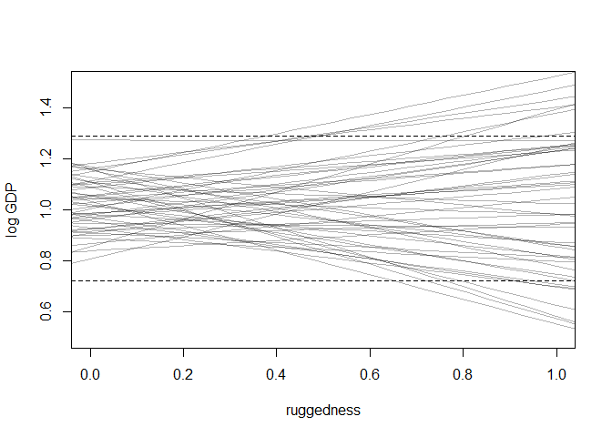

# 8 Conditional Manatees

## 8.1. Building an interaction

### 8.1.1. Making two models.


```r
## R code 8.1
library(rethinking)
```

```
## Loading required package: rstan
```

```
## Warning: package 'rstan' was built under R version 3.5.3
```

```
## Loading required package: ggplot2
```

```
## Loading required package: StanHeaders
```

```
## Warning: package 'StanHeaders' was built under R version 3.5.3
```

```
## rstan (Version 2.18.2, GitRev: 2e1f913d3ca3)
```

```
## For execution on a local, multicore CPU with excess RAM we recommend calling
## options(mc.cores = parallel::detectCores()).
## To avoid recompilation of unchanged Stan programs, we recommend calling
## rstan_options(auto_write = TRUE)
```

```
## For improved execution time, we recommend calling
## Sys.setenv(LOCAL_CPPFLAGS = '-march=native')
## although this causes Stan to throw an error on a few processors.
```

```
## Loading required package: parallel
```

```
## rethinking (Version 1.88)
```

```r
data(rugged)
d <- rugged

# make log version of outcome
d$log_gdp <- log( d$rgdppc_2000 )

# extract countries with GDP data
dd <- d[ complete.cases(d$rgdppc_2000) , ]

# rescale variables
dd$log_gdp_std <- dd$log_gdp / mean(dd$log_gdp)
dd$rugged_std <- dd$rugged / max(dd$rugged)

# split countries into Africa and not-Africa
d.A1 <- dd[ dd$cont_africa==1 , ] # Africa
d.A0 <- dd[ dd$cont_africa==0 , ] # not Africa

## R code 8.2
m8.1 <- quap(
    alist(
        log_gdp_std ~ dnorm( mu , sigma ) ,
        mu <- a + b*( rugged_std - 0.215 ) ,
        a ~ dnorm( 1 , 1 ) ,
        b ~ dnorm( 0 , 1 ) ,
        sigma ~ dexp( 1 )
    ) , data=d.A1 )

## R code 8.3
set.seed(7)
prior <- extract.prior( m8.1 )

# set up the plot dimensions
plot( NULL , xlim=c(0,1) , ylim=c(0.5,1.5) ,
    xlab="ruggedness" , ylab="log GDP" )
abline( h=min(dd$log_gdp_std) , lty=2 )
abline( h=max(dd$log_gdp_std) , lty=2 )

# draw 50 lines from the prior
rugged_seq <- seq( from=-0.1 , to=1.1 , length.out=30 )
mu <- link( m8.1 , post=prior , data=data.frame(rugged_std=rugged_seq) )
for ( i in 1:50 ) lines( rugged_seq , mu[i,] , col=col.alpha("black",0.3) )
```

<!-- -->


```r
## R code 8.4
sum( abs(prior$b) > 0.6 ) / length(prior$bR)
```

```
## [1] Inf
```

```r
## R code 8.5
m8.1 <- quap(
    alist(
        log_gdp_std ~ dnorm( mu , sigma ) ,
        mu <- a + b*( rugged_std - 0.215 ) ,
        a ~ dnorm( 1 , 0.1 ) ,
        b ~ dnorm( 0 , 0.3 ) ,
        sigma ~ dexp(1)
    ) , data=d.A1 )

## R code 8.3
set.seed(7)
prior <- extract.prior( m8.1 )

# set up the plot dimensions
plot( NULL , xlim=c(0,1) , ylim=c(0.5,1.5) ,
    xlab="ruggedness" , ylab="log GDP" )
abline( h=min(dd$log_gdp_std) , lty=2 )
abline( h=max(dd$log_gdp_std) , lty=2 )

# draw 50 lines from the prior
rugged_seq <- seq( from=-0.1 , to=1.1 , length.out=30 )
mu <- link( m8.1 , post=prior , data=data.frame(rugged_std=rugged_seq) )
for ( i in 1:50 ) lines( rugged_seq , mu[i,] , col=col.alpha("black",0.3) )
```

<!-- -->

```r
precis(m8.1)
```

```
##            mean         sd       5.5%     94.5%
## a     0.8863552 0.01502624 0.86234041 0.9103701
## b     0.1329985 0.07121913 0.01917662 0.2468205
## sigma 0.1048078 0.01057309 0.08790992 0.1217056
```


```r
## R code 8.6
# Non-African nations
m8.2 <- quap(
    alist(
        log_gdp_std ~ dnorm( mu , sigma ) ,
        mu <- a + b*( rugged_std - 0.215 ) ,
        a ~ dnorm( 1 , 0.1 ) ,
        b ~ dnorm( 0 , 0.25 ) ,
        sigma ~ dexp(1)
    ) ,
    data=d.A0 )

## R code 8.3
set.seed(7)
prior <- extract.prior( m8.2 )

# set up the plot dimensions
plot( NULL , xlim=c(0,1) , ylim=c(0.5,1.5) ,
    xlab="ruggedness" , ylab="log GDP" )
abline( h=min(dd$log_gdp_std) , lty=2 )
abline( h=max(dd$log_gdp_std) , lty=2 )

# draw 50 lines from the prior
rugged_seq <- seq( from=-0.1 , to=1.1 , length.out=30 )
mu <- link( m8.2 , post=prior , data=data.frame(rugged_std=rugged_seq) )
for ( i in 1:50 ) lines( rugged_seq , mu[i,] , col=col.alpha("black",0.3) )
```

<!-- -->

```r
precis(m8.2)
```

```
##             mean          sd        5.5%       94.5%
## a      1.0505205 0.010097481  1.03438280  1.06665825
## b     -0.1402914 0.055205401 -0.22852025 -0.05206247
## sigma  0.1112893 0.007148252  0.09986506  0.12271363
```

### 8.1.2. Adding an indicator variable doesn’t work.


```r
## R code 8.7
m8.3 <- quap(
    alist(
        log_gdp_std ~ dnorm( mu , sigma ) ,
        mu <- a + b*( rugged_std - 0.215 ) ,
        a ~ dnorm( 1 , 0.1 ) ,
        b ~ dnorm( 0 , 0.3 ) ,
        sigma ~ dexp( 1 )
    ) ,
    data=dd )

## R code 8.11
precis( m8.3 )
```

```
##              mean          sd       5.5%      94.5%
## a     0.999999515 0.010411972  0.9833592 1.01663986
## b     0.001990935 0.054793464 -0.0855796 0.08956147
## sigma 0.136497402 0.007396152  0.1246769 0.14831788
```


```r
## R code 8.8
# make variable to index Africa (1) or not (2)
dd$cid <- ifelse( dd$cont_africa==1 , 1 , 2 )

## R code 8.9
m8.4 <- quap(
    alist(
        log_gdp_std ~ dnorm( mu , sigma ) ,
        mu <- a[cid] + b*( rugged_std - 0.215 ) ,
        a[cid] ~ dnorm( 1 , 0.1 ) ,
        b ~ dnorm( 0 , 0.3 ) ,
        sigma ~ dexp( 1 )
    ) ,
    data=dd )

## R code 8.10
compare( m8.3 , m8.4 )
```

```
##           WAIC    pWAIC    dWAIC       weight       SE      dSE
## m8.4 -252.2694 4.258180  0.00000 1.000000e+00 15.30363       NA
## m8.3 -188.7489 2.693351 63.52044 1.609579e-14 13.29716 15.14767
```

```r
## R code 8.11
precis( m8.4 , depth=2 )
```

```
##              mean          sd       5.5%     94.5%
## a[1]   0.88041699 0.015937691  0.8549455 0.9058885
## a[2]   1.04915863 0.010185998  1.0328794 1.0654378
## b     -0.04651242 0.045688674 -0.1195318 0.0265069
## sigma  0.11239229 0.006091743  0.1026565 0.1221281
```


```r
###
## R code 8.3
set.seed(7)
prior <- extract.prior( m8.4 )

# set up the plot dimensions
plot( NULL , xlim=c(0,1) , ylim=c(0.5,1.5) ,
    xlab="ruggedness" , ylab="log GDP" )
abline( h=min(dd$log_gdp_std) , lty=2 )
abline( h=max(dd$log_gdp_std) , lty=2 )
###

## R code 8.12
rugged.seq <- seq( from=-0.1 , to=1.1 , length.out=30 )

# compute mu over samples, fixing cid=2
mu.NotAfrica <- link( m8.4 ,
    data=data.frame( cid=2 , rugged_std=rugged.seq ) )
for ( i in 1:50 ) lines( rugged_seq , mu.NotAfrica[i,] , col=col.alpha("black",0.3) )

# compute mu over samples, fixing cid=1
mu.Africa <- link( m8.4 ,
    data=data.frame( cid=1 , rugged_std=rugged.seq ) )
for ( i in 1:50 ) lines( rugged_seq , mu.Africa[i,] , col=col.alpha("blue",0.3) )
```

<!-- -->

```r
# summarize to means and intervals
mu.NotAfrica_mu <- apply( mu.NotAfrica , 2 , mean )
mu.NotAfrica_ci <- apply( mu.NotAfrica , 2 , PI , prob=0.97 )
mu.Africa_mu <- apply( mu.Africa , 2 , mean )
mu.Africa_ci <- apply( mu.Africa , 2 , PI , prob=0.97 )
```

### 8.1.3. Adding an interaction does work.


```r
## R code 8.13
m8.5 <- quap(
    alist(
        log_gdp_std ~ dnorm( mu , sigma ) ,
        mu <- a[cid] + b[cid]*( rugged_std - 0.215 ) ,
        a[cid] ~ dnorm( 1 , 0.1 ) ,
        b[cid] ~ dnorm( 0 , 0.3 ) ,
        sigma ~ dexp( 1 )
    ) ,
    data=dd )

## R code 8.14
precis( m8.5 , depth=2 )
```

```
##             mean          sd        5.5%       94.5%
## a[1]   0.8865634 0.015675185  0.86151147  0.91161541
## a[2]   1.0505700 0.009936278  1.03468991  1.06645009
## b[1]   0.1325060 0.074202119  0.01391664  0.25109527
## b[2]  -0.1425764 0.054747637 -0.23007366 -0.05507906
## sigma  0.1094905 0.005934804  0.10000550  0.11897543
```

```r
## R code 8.15
compare( m8.3 , m8.4 , m8.5 )
```

```
##           WAIC    pWAIC     dWAIC       weight       SE       dSE
## m8.5 -259.0324 5.164257  0.000000 9.740827e-01 15.14943        NA
## m8.4 -251.7792 4.493010  7.253167 2.591735e-02 15.39028  6.755541
## m8.3 -188.6221 2.755280 70.410284 5.002612e-16 13.30933 15.364700
```

```r
## R code 8.16
waic_list <- WAIC( m8.5 , pointwise=TRUE )
```

### 8.1.4. Plotting the interaction.


```r
## R code 8.17
# plot Africa - cid=1
plot( d.A1$rugged_std , d.A1$log_gdp_std , pch=16 , col=rangi2 ,
    xlab="ruggedness (standardized)" , ylab="log GDP (as proportion of mean)" ,
    xlim=c(0,1) )
mu <- link( m8.5 , data=data.frame( cid=1 , rugged_std=rugged_seq ) )
mu_mean <- apply( mu , 2 , mean )
mu_ci <- apply( mu , 2 , PI , prob=0.97 )
lines( rugged_seq , mu_mean , lwd=2 )
shade( mu_ci , rugged_seq , col=col.alpha(rangi2,0.3) )
mtext("African nations")
```

<!-- -->

```r
# plot non-Africa - cid=2
plot( d.A0$rugged_std , d.A0$log_gdp_std , pch=1 , col="black" ,
    xlab="ruggedness (standardized)" , ylab="log GDP (as proportion of mean)" ,
    xlim=c(0,1) )
mu <- link( m8.5 , data=data.frame( cid=2 , rugged_std=rugged_seq ) )
mu_mean <- apply( mu , 2 , mean )
mu_ci <- apply( mu , 2 , PI , prob=0.97 )
lines( rugged_seq , mu_mean , lwd=2 )
shade( mu_ci , rugged_seq )
mtext("Non-African nations")
```

<!-- -->

## 8.5. Practice

### 7E1. For each of the causal relationships below, name a hypothetical third variable that would lead to an interaction effect.

#### (1) Bread dough rises because of yeast.

> 1. tmeperature; 2. the amount or percentage of other ingredients of the dough (like vinegar, flour, sugar)

#### (2) Education leads to higher income.

> 1. family background; 2. work attitudes; 3. location (like which city or country)

#### (3) Gasoline makes a car go.

> 1. what types of car

### 7M3. In parts of North America, ravens depend upon wolves for their food. This is because ravens are carnivorous but cannot usually kill or open carcasses of prey. Wolves however can and do kill and tear open animals, and they tolerate ravens co-feeding at their kills. This species relationship is generally described as a “species interaction.” Can you invent a hypothetical set of data on raven population size in which this relationship would manifest as a statistical interaction? Do you think the biological interaction could be linear? Why or why not?

> Based on the information, I assume that prey population and wolf population interact in predicting raven population. Here is my model:

> raven_pop ~ a1 + beta_prey X prey_pop + beta_wolf X wolf_pop + beta_prey_wolf X prey_pop X wolf_pop


```r
N <- 1000 # simulation size
# Simulate data
prey <- rnorm(n = N, mean = 0, sd = 1)

rPW <- 0.6 # correlation between prey and wolf
wolf <- rnorm(n = N, mean = rPW * prey, sd = 1)

bP <- 0.3 # regression coefficient for prey
bW <- 0.1 # regression coefficient for wolf
bPW <- 0.5 # regression coefficient for prey-by-wolf interaction

raven <- rnorm(n = N, mean = bP*prey + bW*wolf + bPW*prey*wolf, sd = 1)

d <- data.frame(raven, prey, wolf)
str(d)
```

```
## 'data.frame':	1000 obs. of  3 variables:
##  $ raven: num  2.3333 0.2261 2.6944 1.5904 -0.0532 ...
##  $ prey : num  0.8383 -1.0996 -2.2598 0.0586 -0.2455 ...
##  $ wolf : num  0.871 -0.431 -3.371 -1.333 -1.605 ...
```


```r
m7m3 <- quap(
  alist(
    raven ~ dnorm(mu, sigma),
    mu <- a + bP*prey + bW*wolf + bPW*prey*wolf,
    a ~ dnorm(0, 1),
    bW ~ dnorm(0, 1),
    bP ~ dnorm(0, 1),
    bPW ~ dnorm(0, 1),
    sigma ~ dunif(0, 5)
  ),
  data = d)
precis(m7m3)
```

```
##              mean         sd        5.5%      94.5%
## a     -0.02432628 0.03634241 -0.08240847 0.03375591
## bW     0.12415471 0.03318055  0.07112579 0.17718364
## bP     0.27790034 0.03953137  0.21472157 0.34107911
## bPW    0.46410072 0.02320396  0.42701630 0.50118513
## sigma  1.04212299 0.02330251  1.00488107 1.07936491
```


### 7H3. Consider again the data(rugged) data on economic development and terrain ruggedness, examined in this chapter. One of the African countries in that example, Seychelles, is far outside the cloud of other nations, being a rare country with both relatively high GDP and high ruggedness. Seychelles is also unusual, in that it is a group of islands far from the coast of mainland Africa, and its main economic activity is tourism. One might suspect that this one nation is exerting a strong influence on the conclusions. In this problem, I want you to drop Seychelles from the data and re-evaluate the hypothesis that the relationship of African economies with ruggedness is diff erent from that on other continents.

#### (a) Begin by using map to fit just the interaction model:
y i ~ Normal(ui; sigma)
ui = a + bAXAi + bRXRi + bARXAiXRi

#### where y is log GDP per capita in the year 2000 (log of rgdppc_2000); A is cont_africa, the dummy variable for being an African nation; and R is the variable rugged. Choose your own priors. Compare the inference from this model fi t to the data without Seychelles to the same model fit to the full data. Does it still seem like the effect of ruggedness depends upon continent? How much has the expected relationship changed?


```r
## R code 8.1
data(rugged)
d <- rugged
# make log version of outcome
d$log_gdp <- log( d$rgdppc_2000 )

# extract countries with GDP data
d <- d[ complete.cases(d$rgdppc_2000) , ]

d2 <- dd[d$country != "Seychelles", ]

# rescale variables
d$log_gdp_std <- d$log_gdp / mean(dd$log_gdp)
d$rugged_std <- d$rugged / max(dd$rugged)
d2$log_gdp_std <- d2$log_gdp / mean(dd$log_gdp)
d2$rugged_std <- d2$rugged / max(dd$rugged)

## R code 8.8
# make variable to index Africa (1) or not (2)
d$cid <- ifelse( d$cont_africa==1 , 1 , 2 )
d2$cid <- ifelse( d2$cont_africa==1 , 1 , 2 )

# split countries into Africa and not-Africa
d.A1 <- d[ d$cont_africa==1 , ] # Africa
d.A0 <- d[ d$cont_africa==0 , ] # not Africa
d2.A1 <- d2[ d2$cont_africa==1 , ] # Africa
d2.A0 <- d2[ d2$cont_africa==0 , ] # not Africa

#str(d)
#str(d2)
```


```r
m7H3_with <- quap(
  alist(
    log_gdp_std ~ dnorm( mu , sigma ) ,
    mu <- a[cid] + b[cid]*( rugged_std - 0.215 ) ,
    a[cid] ~ dnorm( 1 , 0.1 ) ,
    b[cid] ~ dnorm( 0 , 0.3 ) ,
    sigma ~ dexp( 1 )
  ),
  data = d)

m7H3_without <- quap(
  alist(
    log_gdp_std ~ dnorm( mu , sigma ) ,
    mu <- a[cid] + b[cid]*( rugged_std - 0.215 ) ,
    a[cid] ~ dnorm( 1 , 0.1 ) ,
    b[cid] ~ dnorm( 0 , 0.3 ) ,
    sigma ~ dexp( 1 )
  ),
  data = d2)

coeftab(m7H3_with, m7H3_without)
```

```
##       m7H3_with m7H3_without
## a[1]     0.89      0.88     
## a[2]     1.05      1.05     
## b[1]     0.13      0.07     
## b[2]    -0.14     -0.14     
## sigma    0.11      0.11     
## nobs      170       169
```

> a[1] and b[1] decreased. 

#### (b) Now plot the predictions of the interaction model, with and without Seychelles. Does it still seem like the eff ect of ruggedness depends upon continent? How much has the expected relationship changed?


```r
par(mfrow = c(2, 2))
##### with
## R code 8.12
rugged.seq <- seq( from=-0.1 , to=1.1 , length.out=30 )
# compute mu over samples, fixing cid=2
mu.NotAfrica <- link( m7H3_with ,
    data=data.frame( cid=2 , rugged_std=rugged.seq ) )
# compute mu over samples, fixing cid=1
mu.Africa <- link( m7H3_with ,
    data=data.frame( cid=1 , rugged_std=rugged.seq ) )
# summarize to means and intervals
mu.NotAfrica_mu <- apply( mu.NotAfrica , 2 , mean )
mu.NotAfrica_ci <- apply( mu.NotAfrica , 2 , PI , prob=0.97 )
mu.Africa_mu <- apply( mu.Africa , 2 , mean )
mu.Africa_ci <- apply( mu.Africa , 2 , PI , prob=0.97 )

## R code 8.17
# plot Africa - cid=1
plot( d.A1$rugged_std , d.A1$log_gdp_std , pch=16 , col=rangi2 ,
    xlab="ruggedness (standardized)" , ylab="log GDP (as proportion of mean)" ,
    xlim=c(0,1) , ylim=c(0.6,1.4))
mu <- link( m7H3_with , data=data.frame( cid=1 , rugged_std=rugged_seq ) )
mu_mean <- apply( mu , 2 , mean )
mu_ci <- apply( mu , 2 , PI , prob=0.97 )
lines( rugged_seq , mu_mean , lwd=2 )
shade( mu_ci , rugged_seq , col=col.alpha(rangi2,0.3) )
mtext("African nations_with")

# plot non-Africa - cid=2
plot( d.A0$rugged_std , d.A0$log_gdp_std , pch=1 , col="black" ,
    xlab="ruggedness (standardized)" , ylab="log GDP (as proportion of mean)" ,
    xlim=c(0,1) , ylim=c(0.6,1.4))
mu <- link( m7H3_with , data=data.frame( cid=2 , rugged_std=rugged_seq ) )
mu_mean <- apply( mu , 2 , mean )
mu_ci <- apply( mu , 2 , PI , prob=0.97 )
lines( rugged_seq , mu_mean , lwd=2 )
shade( mu_ci , rugged_seq )
mtext("Non-African nations_with")

##### without

## R code 8.12
rugged.seq <- seq( from=-0.1 , to=1.1 , length.out=30 )
# compute mu over samples, fixing cid=2
mu.NotAfrica <- link( m7H3_without ,
    data=data.frame( cid=2 , rugged_std=rugged.seq ) )
# compute mu over samples, fixing cid=1
mu.Africa <- link( m7H3_without ,
    data=data.frame( cid=1 , rugged_std=rugged.seq ) )
# summarize to means and intervals
mu.NotAfrica_mu <- apply( mu.NotAfrica , 2 , mean )
mu.NotAfrica_ci <- apply( mu.NotAfrica , 2 , PI , prob=0.97 )
mu.Africa_mu <- apply( mu.Africa , 2 , mean )
mu.Africa_ci <- apply( mu.Africa , 2 , PI , prob=0.97 )

## R code 8.17
# plot Africa - cid=1
plot( d2.A1$rugged_std , d2.A1$log_gdp_std , pch=16 , col=rangi2 ,
    xlab="ruggedness (standardized)" , ylab="log GDP (as proportion of mean)" ,
    xlim=c(0,1) , ylim=c(0.6,1.4))
mu <- link( m7H3_without , data=data.frame( cid=1 , rugged_std=rugged_seq ) )
mu_mean <- apply( mu , 2 , mean )
mu_ci <- apply( mu , 2 , PI , prob=0.97 )
lines( rugged_seq , mu_mean , lwd=2 )
shade( mu_ci , rugged_seq , col=col.alpha(rangi2,0.3) )
mtext("African nations_without")

# plot non-Africa - cid=2
plot( d2.A0$rugged_std , d2.A0$log_gdp_std , pch=1 , col="black" ,
    xlab="ruggedness (standardized)" , ylab="log GDP (as proportion of mean)" ,
    xlim=c(0,1) , ylim=c(0.6,1.4))
mu <- link( m7H3_without , data=data.frame( cid=2 , rugged_std=rugged_seq ) )
mu_mean <- apply( mu , 2 , mean )
mu_ci <- apply( mu , 2 , PI , prob=0.97 )
lines( rugged_seq , mu_mean , lwd=2 )
shade( mu_ci , rugged_seq )
mtext("Non-African nations_without")
```

<!-- -->

> Without Seychelles, the slope of African nations_without is a bit shallower. The uncertainty of African nations_without at higher ruggedness is larger.

#### Method 2 (fit ui = a + bAXAi + bRXRi + bARXAiXRi)


```r
d <- rugged[complete.cases(rugged$rgdppc_2000), ]
d$log_gdp <- log(d$rgdppc_2000)
d2 <- d[d$country != "Seychelles", ]
m_with <- quap(
  alist(
    log_gdp ~ dnorm(mu, sigma),
    mu <- a + bA*cont_africa + bR*rugged + bAR*cont_africa*rugged,
    a ~ dnorm(8, 100),
    bA ~ dnorm(0, 1),
    bR ~ dnorm(0, 1),
    bAR ~ dnorm(0, 1),
    sigma ~ dunif(0, 10)
  ),
  data = d
)
m_without <- quap(
  alist(
    log_gdp ~ dnorm(mu, sigma),
    mu <- a + bA*cont_africa + bR*rugged + bAR*cont_africa*rugged,
    a ~ dnorm(8, 100),
    bA ~ dnorm(0, 1),
    bR ~ dnorm(0, 1),
    bAR ~ dnorm(0, 1),
    sigma ~ dunif(0, 10)
  ),
  data = d2
)
coeftab(m_with, m_without)
```

```
##       m_with  m_without
## a        9.18    9.19  
## bA      -1.85   -1.78  
## bR      -0.18   -0.19  
## bAR      0.35    0.25  
## sigma    0.93    0.93  
## nobs      170     169
```


```r
par(mfrow = c(2, 2))
# Predictions for model with Seychelles
rugged.seq <- seq(from = -1, to = 8, by = 0.25)
mu.Africa <- link(m_with, data = data.frame(cont_africa = 1, rugged = rugged.seq), refresh = 0)
mu.Africa.mean <- apply(mu.Africa, 2, mean)
mu.Africa.PI <- apply(mu.Africa, 2, PI, prob = 0.97)
mu.NotAfrica <- link(m_with, data = data.frame(cont_africa = 0, rugged = rugged.seq), refresh = 0)
mu.NotAfrica.mean <- apply(mu.NotAfrica, 2, mean)
mu.NotAfrica.PI <- apply(mu.NotAfrica, 2, PI, prob = 0.97)
d.A1 <- d[d$cont_africa == 1, ]
plot(log_gdp ~ rugged, data = d.A1, col = rangi2)
mtext("African nations, with Seychelles", 3)
lines(rugged.seq, mu.Africa.mean, col = rangi2)
shade(mu.Africa.PI, rugged.seq, col = col.alpha(rangi2, 0.3))

d.A0 <- d[d$cont_africa == 0, ]
plot(log_gdp ~ rugged, data = d.A0)
mtext("Non-African nations, with Seychelles", 3)
lines(rugged.seq, mu.NotAfrica.mean)
shade(mu.NotAfrica.PI, rugged.seq)


# Predictions for model without Seychelles
rugged.seq <- seq(from = -1, to = 8, by = 0.25)
mu.Africa <- link(m_without, data = data.frame(cont_africa = 1, rugged = rugged.seq), refresh = 0)
mu.Africa.mean <- apply(mu.Africa, 2, mean)
mu.Africa.PI <- apply(mu.Africa, 2, PI, prob = 0.97)
mu.NotAfrica <- link(m_without, data = data.frame(cont_africa = 0, rugged = rugged.seq), refresh = 0)
mu.NotAfrica.mean <- apply(mu.NotAfrica, 2, mean)
mu.NotAfrica.PI <- apply(mu.NotAfrica, 2, PI, prob = 0.97)
d.A1 <- d2[d2$cont_africa == 1, ]
plot(log_gdp ~ rugged, data = d.A1, col = rangi2)
mtext("African nations, without Seychelles", 3)
lines(rugged.seq, mu.Africa.mean, col = rangi2)
shade(mu.Africa.PI, rugged.seq, col = col.alpha(rangi2, 0.3))

d.A0 <- d2[d2$cont_africa == 0, ]
plot(log_gdp ~ rugged, data = d.A0)
mtext("Non-African nations, without Seychelles", 3) 
lines(rugged.seq, mu.NotAfrica.mean)
shade(mu.NotAfrica.PI, rugged.seq)
```

<!-- -->


#### (c) Finally, conduct a model comparison analysis, using WAIC. Fit three models to the data without Seychelles:

Model 1 : y i ~ Normal(ui; sigma)
ui = a + bRXRi


Model 2 : y i ~ Normal(ui; sigma)
ui = a + bAXAi + bRXRi


Model 3 : y i ~ Normal(ui; sigma)
ui = a + bAXAi + bRXRi + bARXAiXRi

#### Use whatever priors you think are sensible. Plot the model-averaged predictions of this model set. Do your inferences diff er from those in (b)? Why or why not?


```r
m_with1 <- quap(
  alist(
    log_gdp ~ dnorm(mu, sigma),
    mu <- a + bR*rugged,
    a ~ dnorm(8, 100),
    bR ~ dnorm(0, 1),
    sigma ~ dunif(0, 10)
  ),
  data = d
)
m_with2 <- quap(
  alist(
    log_gdp ~ dnorm(mu, sigma),
    mu <- a + bA*cont_africa + bR*rugged,
    a ~ dnorm(8, 100),
    bA ~ dnorm(0, 1),
    bR ~ dnorm(0, 1),
    sigma ~ dunif(0, 10)
  ),
  data = d
)
m_with3 <- quap(
  alist(
    log_gdp ~ dnorm(mu, sigma),
    mu <- a + bA*cont_africa + bR*rugged + bAR*cont_africa*rugged,
    a ~ dnorm(8, 100),
    bA ~ dnorm(0, 1),
    bR ~ dnorm(0, 1),
    bAR ~ dnorm(0, 1),
    sigma ~ dunif(0, 10)
  ),
  data = d
)
compare(m_with1, m_with2, m_with3)
```

```
##             WAIC    pWAIC     dWAIC       weight       SE       dSE
## m_with3 469.7994 5.410058  0.000000 9.681149e-01 15.12988        NA
## m_with2 476.6258 4.529583  6.826426 3.188508e-02 15.31300  6.240441
## m_with1 539.3187 2.566464 69.519250 7.762712e-16 13.24398 15.204642
```


```r
m_without1 <- quap(
  alist(
    log_gdp ~ dnorm(mu, sigma),
    mu <- a + bR*rugged,
    a ~ dnorm(8, 100),
    bR ~ dnorm(0, 1),
    sigma ~ dunif(0, 10)
  ),
  data = d2
)
m_without2 <- quap(
  alist(
    log_gdp ~ dnorm(mu, sigma),
    mu <- a + bA*cont_africa + bR*rugged,
    a ~ dnorm(8, 100),
    bA ~ dnorm(0, 1),
    bR ~ dnorm(0, 1),
    sigma ~ dunif(0, 10)
  ),
  data = d2
)
m_without3 <- quap(
  alist(
    log_gdp ~ dnorm(mu, sigma),
    mu <- a + bA*cont_africa + bR*rugged + bAR*cont_africa*rugged,
    a ~ dnorm(8, 100),
    bA ~ dnorm(0, 1),
    bR ~ dnorm(0, 1),
    bAR ~ dnorm(0, 1),
    sigma ~ dunif(0, 10)
  ),
  data = d2
)
compare(m_without1, m_without2, m_without3)
```

```
##                WAIC    pWAIC     dWAIC       weight       SE       dSE
## m_without3 463.3993 4.611781  0.000000 7.927508e-01 15.03314        NA
## m_without2 466.0825 3.921004  2.683174 2.072492e-01 14.29358  3.267518
## m_without1 536.2942 2.747910 72.894829 1.175509e-16 13.34212 15.289606
```

> Without Seychelles, m_without3 has less weight than m_with3. This indicates that Seychelles affects the interaction term.


#### 1. Use the tomato.csv (attached) data set and evaluate whether hypocotyl length ("hyp") is affected by shade ("trt"), species ("species") and their interaction.


```r
tomato <- read.csv("Tomato.csv")
str(tomato)
```

```
## 'data.frame':	1008 obs. of  25 variables:
##  $ shelf   : Factor w/ 6 levels "U","V","W","X",..: 6 6 6 6 6 6 6 6 6 6 ...
##  $ flat    : int  1 1 1 1 1 1 1 1 1 1 ...
##  $ col     : Factor w/ 9 levels "A","B","C","D",..: 2 3 4 5 6 7 9 2 3 4 ...
##  $ row     : int  1 1 1 1 1 1 1 2 2 2 ...
##  $ acs     : Factor w/ 36 levels "LA1028","LA1305",..: 23 2 19 26 30 5 14 32 7 34 ...
##  $ trt     : Factor w/ 2 levels "H","L": 1 1 1 1 1 1 1 1 1 1 ...
##  $ days    : int  28 28 28 28 28 28 28 28 28 28 ...
##  $ date    : Factor w/ 2 levels "5/5/08","5/6/08": 1 1 1 1 1 1 1 1 1 1 ...
##  $ hyp     : num  19.5 31.3 56.6 35.2 35.3 ...
##  $ int1    : num  2.37 3.34 8.43 0.56 0.82 1.07 2.85 2.08 5.43 4.08 ...
##  $ int2    : num  1.59 0.01 2.39 0 0.02 6.69 0.41 0.53 0.81 3.26 ...
##  $ int3    : num  1.87 9.19 6.7 1.6 1.49 5.72 3.79 1.9 3.63 3.49 ...
##  $ int4    : num  0.51 1.62 3.69 0.61 0.46 4.76 3.25 NA 2.66 3.02 ...
##  $ intleng : num  6.34 14.16 21.21 2.77 2.79 ...
##  $ totleng : num  25.8 45.4 77.9 38 38.1 ...
##  $ petleng : num  15.78 12.36 13.05 8.08 7.68 ...
##  $ leafleng: num  30.5 22.9 46.7 26.8 22.4 ...
##  $ leafwid : num  34.4 14 43.8 33.3 23.6 ...
##  $ leafnum : int  5 4 5 5 5 5 5 4 5 5 ...
##  $ ndvi    : int  111 120 110 105 106 132 118 112 107 123 ...
##  $ lat     : num  -9.52 -13.38 -16.23 -20.48 -20.92 ...
##  $ lon     : num  -78 -75.4 -71.7 -70 -69.1 ...
##  $ alt     : int  740 3360 2585 1020 2460 2000 2920 480 75 3540 ...
##  $ species : Factor w/ 5 levels "S. chilense",..: 4 5 5 1 1 2 3 4 5 5 ...
##  $ who     : Factor w/ 2 levels "Dan","Pepe": 1 1 1 1 1 1 1 1 1 1 ...
```

```r
head(tomato)
```

```
##   shelf flat col row    acs trt days   date   hyp int1 int2 int3 int4
## 1     Z    1   B   1 LA2580   H   28 5/5/08 19.46 2.37 1.59 1.87 0.51
## 2     Z    1   C   1 LA1305   H   28 5/5/08 31.28 3.34 0.01 9.19 1.62
## 3     Z    1   D   1 LA1973   H   28 5/5/08 56.65 8.43 2.39 6.70 3.69
## 4     Z    1   E   1 LA2748   H   28 5/5/08 35.18 0.56 0.00 1.60 0.61
## 5     Z    1   F   1 LA2931   H   28 5/5/08 35.32 0.82 0.02 1.49 0.46
## 6     Z    1   G   1 LA1317   H   28 5/5/08 28.74 1.07 6.69 5.72 4.76
##   intleng totleng petleng leafleng leafwid leafnum ndvi      lat      lon
## 1    6.34   25.80   15.78    30.53   34.44       5  111  -9.5167 -78.0083
## 2   14.16   45.44   12.36    22.93   13.99       4  120 -13.3833 -75.3583
## 3   21.21   77.86   13.05    46.71   43.78       5  110 -16.2333 -71.7000
## 4    2.77   37.95    8.08    26.82   33.28       5  105 -20.4833 -69.9833
## 5    2.79   38.11    7.68    22.40   23.61       5  106 -20.9167 -69.0667
## 6   18.24   46.98   23.66    42.35   42.35       5  132 -13.4167 -73.8417
##    alt         species who
## 1  740    S. pennellii Dan
## 2 3360   S. peruvianum Dan
## 3 2585   S. peruvianum Dan
## 4 1020     S. chilense Dan
## 5 2460     S. chilense Dan
## 6 2000 S. chmielewskii Dan
```


```r
tomato2 <- subset(tomato, select = c(hyp, trt, species))
str(tomato2)
```

```
## 'data.frame':	1008 obs. of  3 variables:
##  $ hyp    : num  19.5 31.3 56.6 35.2 35.3 ...
##  $ trt    : Factor w/ 2 levels "H","L": 1 1 1 1 1 1 1 1 1 1 ...
##  $ species: Factor w/ 5 levels "S. chilense",..: 4 5 5 1 1 2 3 4 5 5 ...
```

```r
head(tomato2)
```

```
##     hyp trt         species
## 1 19.46   H    S. pennellii
## 2 31.28   H   S. peruvianum
## 3 56.65   H   S. peruvianum
## 4 35.18   H     S. chilense
## 5 35.32   H     S. chilense
## 6 28.74   H S. chmielewskii
```


```r
tomato2$species_number <- as.numeric(as.factor(tomato2$species))
tomato2$trt_number <- as.numeric(as.factor(tomato2$trt))
str(tomato2)
```

```
## 'data.frame':	1008 obs. of  5 variables:
##  $ hyp           : num  19.5 31.3 56.6 35.2 35.3 ...
##  $ trt           : Factor w/ 2 levels "H","L": 1 1 1 1 1 1 1 1 1 1 ...
##  $ species       : Factor w/ 5 levels "S. chilense",..: 4 5 5 1 1 2 3 4 5 5 ...
##  $ species_number: num  4 5 5 1 1 2 3 4 5 5 ...
##  $ trt_number    : num  1 1 1 1 1 1 1 1 1 1 ...
```

```r
head(tomato2)
```

```
##     hyp trt         species species_number trt_number
## 1 19.46   H    S. pennellii              4          1
## 2 31.28   H   S. peruvianum              5          1
## 3 56.65   H   S. peruvianum              5          1
## 4 35.18   H     S. chilense              1          1
## 5 35.32   H     S. chilense              1          1
## 6 28.74   H S. chmielewskii              2          1
```


```r
### no interaction model
tomato_m1 <- quap(
  alist(
    hyp ~ dnorm( mu , sigma ) ,
    mu <- a[species_number] + b*trt_number ,
    a[species_number] ~ dnorm( 5 , 1 ) ,
    b ~ dnorm( 0 , 1 ) ,
    sigma ~ dexp( 1 )) ,
    data=tomato2 )

precis(tomato_m1, depth=2)
```

```
##            mean        sd      5.5%     94.5%
## a[1]  10.734058 0.6687726  9.665231 11.802886
## a[2]   8.982234 0.6541013  7.936854 10.027614
## a[3]   8.723509 0.6489675  7.686333  9.760684
## a[4]   6.205911 0.7187012  5.057288  7.354535
## a[5]  13.271721 0.6720296 12.197687 14.345754
## b     13.987256 0.3068375 13.496871 14.477642
## sigma 10.287942 0.2396901  9.904870 10.671013
```

```r
### no interaction model
tomato_m2 <- quap(
  alist(
    hyp ~ dnorm( mu , sigma ) ,
    mu <- a[species_number] + b*trt_number + bST[species_number]*trt_number,
    a[species_number] ~ dnorm( 5 , 1 ) ,
    b ~ dnorm( 0 , 1 ) ,
    bST[species_number] ~ dnorm( 0 , 1 ),
    sigma ~ dexp( 1 )) ,
    data=tomato2 )

precis(tomato_m2, depth=2)
```

```
##             mean        sd       5.5%     94.5%
## a[1]    9.833507 0.8421049  8.4876603 11.179353
## a[2]    9.674329 0.8403223  8.3313312 11.017326
## a[3]    9.507598 0.8335139  8.1754815 10.839714
## a[4]    6.754812 0.8664218  5.3701021  8.139521
## a[5]   11.147988 0.8434453  9.8000000 12.495977
## b      11.810329 0.4831767 11.0381196 12.582539
## bST[1]  3.093091 0.6609089  2.0368312  4.149351
## bST[2]  1.516184 0.6552103  0.4690312  2.563336
## bST[3]  1.401378 0.6602501  0.3461714  2.456586
## bST[4]  1.531893 0.6848538  0.4373648  2.626422
## bST[5]  4.267782 0.6572204  3.2174170  5.318147
## sigma  10.265047 0.2380173  9.8846490 10.645444
```


```r
compare(tomato_m1,tomato_m2)
```

```
##               WAIC    pWAIC    dWAIC    weight       SE     dSE
## tomato_m2 7578.296 6.547331 0.000000 0.6735461 53.09664      NA
## tomato_m1 7579.744 5.023227 1.448535 0.3264539 52.96892 5.75006
```

