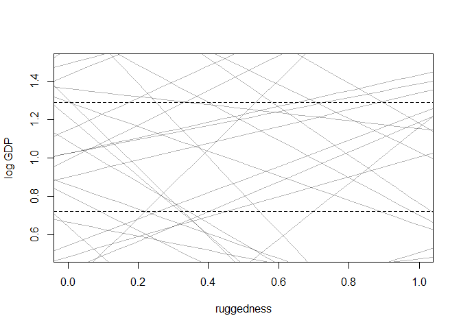
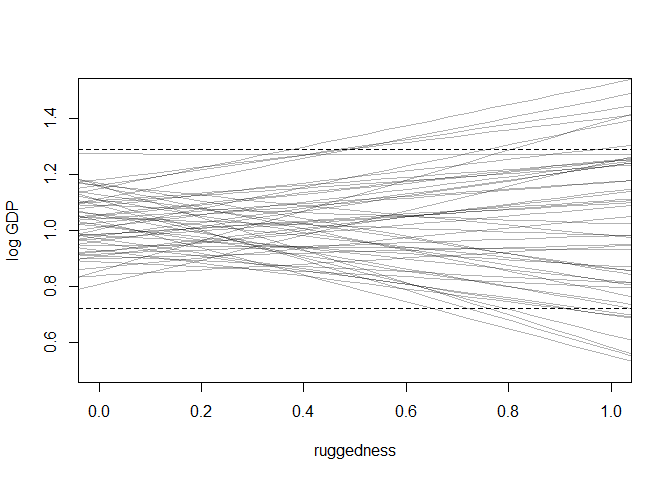
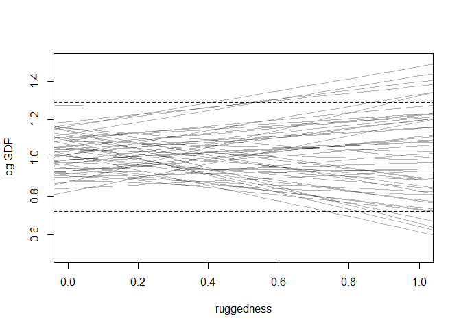
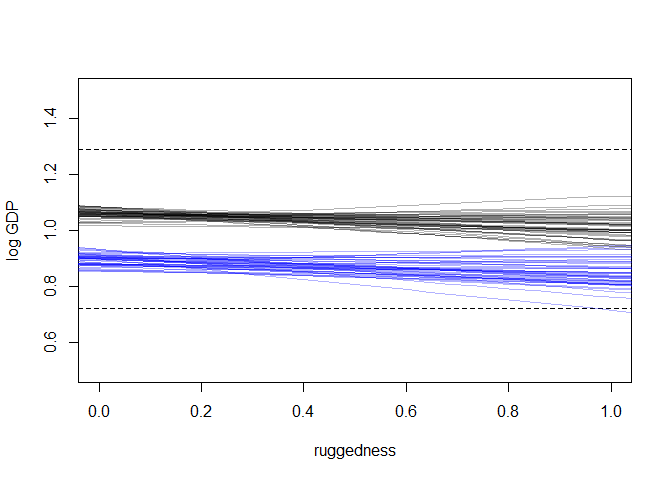
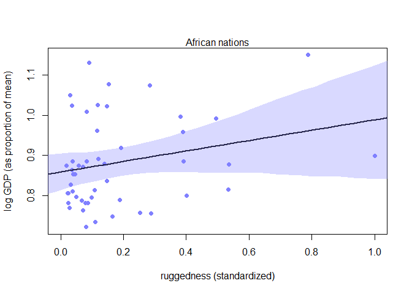
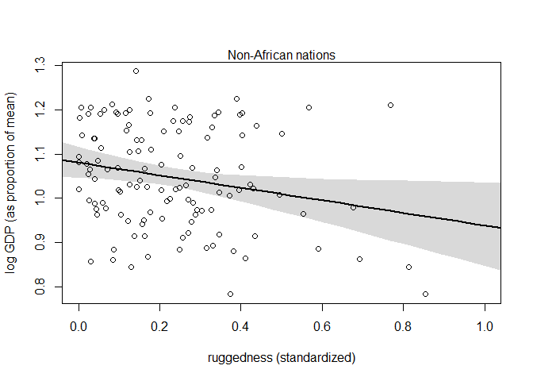
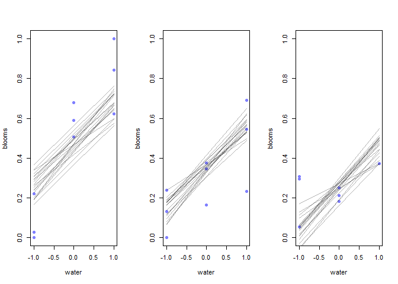
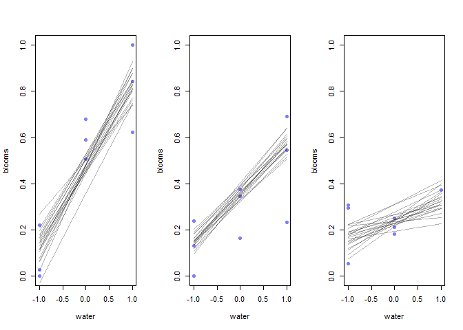
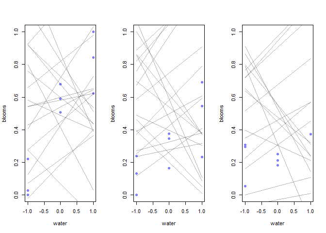
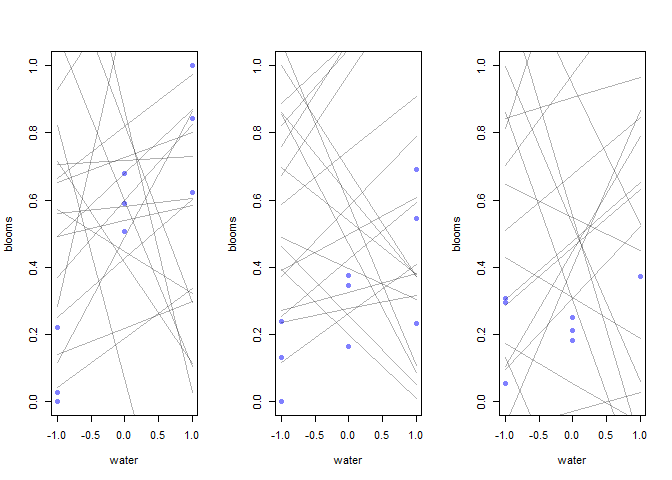

# 8 Conditional Manatees

## 8.1. Building an interaction

### 8.1.1. Making two models.


```r
## R code 8.1
library(rethinking)
```

```
## Loading required package: rstan
```

```
## Warning: package 'rstan' was built under R version 3.5.3
```

```
## Loading required package: ggplot2
```

```
## Loading required package: StanHeaders
```

```
## Warning: package 'StanHeaders' was built under R version 3.5.3
```

```
## rstan (Version 2.18.2, GitRev: 2e1f913d3ca3)
```

```
## For execution on a local, multicore CPU with excess RAM we recommend calling
## options(mc.cores = parallel::detectCores()).
## To avoid recompilation of unchanged Stan programs, we recommend calling
## rstan_options(auto_write = TRUE)
```

```
## For improved execution time, we recommend calling
## Sys.setenv(LOCAL_CPPFLAGS = '-march=native')
## although this causes Stan to throw an error on a few processors.
```

```
## Loading required package: parallel
```

```
## rethinking (Version 1.88)
```

```r
data(rugged)
d <- rugged

# make log version of outcome
d$log_gdp <- log( d$rgdppc_2000 )

# extract countries with GDP data
dd <- d[ complete.cases(d$rgdppc_2000) , ]

# rescale variables
dd$log_gdp_std <- dd$log_gdp / mean(dd$log_gdp)
dd$rugged_std <- dd$rugged / max(dd$rugged)

# split countries into Africa and not-Africa
d.A1 <- dd[ dd$cont_africa==1 , ] # Africa
d.A0 <- dd[ dd$cont_africa==0 , ] # not Africa

## R code 8.2
m8.1 <- quap(
    alist(
        log_gdp_std ~ dnorm( mu , sigma ) ,
        mu <- a + b*( rugged_std - 0.215 ) ,
        a ~ dnorm( 1 , 1 ) ,
        b ~ dnorm( 0 , 1 ) ,
        sigma ~ dexp( 1 )
    ) , data=d.A1 )

## R code 8.3
set.seed(7)
prior <- extract.prior( m8.1 )

# set up the plot dimensions
plot( NULL , xlim=c(0,1) , ylim=c(0.5,1.5) ,
    xlab="ruggedness" , ylab="log GDP" )
abline( h=min(dd$log_gdp_std) , lty=2 )
abline( h=max(dd$log_gdp_std) , lty=2 )

# draw 50 lines from the prior
rugged_seq <- seq( from=-0.1 , to=1.1 , length.out=30 )
mu <- link( m8.1 , post=prior , data=data.frame(rugged_std=rugged_seq) )
for ( i in 1:50 ) lines( rugged_seq , mu[i,] , col=col.alpha("black",0.3) )
```

<!-- -->


```r
## R code 8.4
sum( abs(prior$b) > 0.6 ) / length(prior$bR)
```

```
## [1] Inf
```

```r
## R code 8.5
m8.1 <- quap(
    alist(
        log_gdp_std ~ dnorm( mu , sigma ) ,
        mu <- a + b*( rugged_std - 0.215 ) ,
        a ~ dnorm( 1 , 0.1 ) ,
        b ~ dnorm( 0 , 0.3 ) ,
        sigma ~ dexp(1)
    ) , data=d.A1 )

## R code 8.3
set.seed(7)
prior <- extract.prior( m8.1 )

# set up the plot dimensions
plot( NULL , xlim=c(0,1) , ylim=c(0.5,1.5) ,
    xlab="ruggedness" , ylab="log GDP" )
abline( h=min(dd$log_gdp_std) , lty=2 )
abline( h=max(dd$log_gdp_std) , lty=2 )

# draw 50 lines from the prior
rugged_seq <- seq( from=-0.1 , to=1.1 , length.out=30 )
mu <- link( m8.1 , post=prior , data=data.frame(rugged_std=rugged_seq) )
for ( i in 1:50 ) lines( rugged_seq , mu[i,] , col=col.alpha("black",0.3) )
```

<!-- -->

```r
precis(m8.1)
```

```
##            mean         sd       5.5%     94.5%
## a     0.8863552 0.01502624 0.86234041 0.9103701
## b     0.1329985 0.07121913 0.01917662 0.2468205
## sigma 0.1048078 0.01057309 0.08790992 0.1217056
```


```r
## R code 8.6
# Non-African nations
m8.2 <- quap(
    alist(
        log_gdp_std ~ dnorm( mu , sigma ) ,
        mu <- a + b*( rugged_std - 0.215 ) ,
        a ~ dnorm( 1 , 0.1 ) ,
        b ~ dnorm( 0 , 0.25 ) ,
        sigma ~ dexp(1)
    ) ,
    data=d.A0 )

## R code 8.3
set.seed(7)
prior <- extract.prior( m8.2 )

# set up the plot dimensions
plot( NULL , xlim=c(0,1) , ylim=c(0.5,1.5) ,
    xlab="ruggedness" , ylab="log GDP" )
abline( h=min(dd$log_gdp_std) , lty=2 )
abline( h=max(dd$log_gdp_std) , lty=2 )

# draw 50 lines from the prior
rugged_seq <- seq( from=-0.1 , to=1.1 , length.out=30 )
mu <- link( m8.2 , post=prior , data=data.frame(rugged_std=rugged_seq) )
for ( i in 1:50 ) lines( rugged_seq , mu[i,] , col=col.alpha("black",0.3) )
```

<!-- -->

```r
precis(m8.2)
```

```
##             mean          sd        5.5%       94.5%
## a      1.0505205 0.010097481  1.03438280  1.06665825
## b     -0.1402914 0.055205401 -0.22852025 -0.05206247
## sigma  0.1112893 0.007148252  0.09986506  0.12271363
```

### 8.1.2. Adding an indicator variable doesn’t work.


```r
## R code 8.7
m8.3 <- quap(
    alist(
        log_gdp_std ~ dnorm( mu , sigma ) ,
        mu <- a + b*( rugged_std - 0.215 ) ,
        a ~ dnorm( 1 , 0.1 ) ,
        b ~ dnorm( 0 , 0.3 ) ,
        sigma ~ dexp( 1 )
    ) ,
    data=dd )

## R code 8.11
precis( m8.3 )
```

```
##              mean          sd       5.5%      94.5%
## a     0.999999515 0.010411972  0.9833592 1.01663986
## b     0.001990935 0.054793464 -0.0855796 0.08956147
## sigma 0.136497402 0.007396152  0.1246769 0.14831788
```


```r
## R code 8.8
# make variable to index Africa (1) or not (2)
dd$cid <- ifelse( dd$cont_africa==1 , 1 , 2 )

## R code 8.9
m8.4 <- quap(
    alist(
        log_gdp_std ~ dnorm( mu , sigma ) ,
        mu <- a[cid] + b*( rugged_std - 0.215 ) ,
        a[cid] ~ dnorm( 1 , 0.1 ) ,
        b ~ dnorm( 0 , 0.3 ) ,
        sigma ~ dexp( 1 )
    ) ,
    data=dd )

## R code 8.10
compare( m8.3 , m8.4 )
```

```
##           WAIC    pWAIC    dWAIC       weight       SE      dSE
## m8.4 -252.2694 4.258180  0.00000 1.000000e+00 15.30363       NA
## m8.3 -188.7489 2.693351 63.52044 1.609579e-14 13.29716 15.14767
```

```r
## R code 8.11
precis( m8.4 , depth=2 )
```

```
##              mean          sd       5.5%     94.5%
## a[1]   0.88041699 0.015937691  0.8549455 0.9058885
## a[2]   1.04915863 0.010185998  1.0328794 1.0654378
## b     -0.04651242 0.045688674 -0.1195318 0.0265069
## sigma  0.11239229 0.006091743  0.1026565 0.1221281
```


```r
###
## R code 8.3
set.seed(7)
prior <- extract.prior( m8.4 )

# set up the plot dimensions
plot( NULL , xlim=c(0,1) , ylim=c(0.5,1.5) ,
    xlab="ruggedness" , ylab="log GDP" )
abline( h=min(dd$log_gdp_std) , lty=2 )
abline( h=max(dd$log_gdp_std) , lty=2 )
###

## R code 8.12
rugged.seq <- seq( from=-0.1 , to=1.1 , length.out=30 )

# compute mu over samples, fixing cid=2
mu.NotAfrica <- link( m8.4 ,
    data=data.frame( cid=2 , rugged_std=rugged.seq ) )
for ( i in 1:50 ) lines( rugged_seq , mu.NotAfrica[i,] , col=col.alpha("black",0.3) )

# compute mu over samples, fixing cid=1
mu.Africa <- link( m8.4 ,
    data=data.frame( cid=1 , rugged_std=rugged.seq ) )
for ( i in 1:50 ) lines( rugged_seq , mu.Africa[i,] , col=col.alpha("blue",0.3) )
```

<!-- -->

```r
# summarize to means and intervals
mu.NotAfrica_mu <- apply( mu.NotAfrica , 2 , mean )
mu.NotAfrica_ci <- apply( mu.NotAfrica , 2 , PI , prob=0.97 )
mu.Africa_mu <- apply( mu.Africa , 2 , mean )
mu.Africa_ci <- apply( mu.Africa , 2 , PI , prob=0.97 )
```

### 8.1.3. Adding an interaction does work.


```r
## R code 8.13
m8.5 <- quap(
    alist(
        log_gdp_std ~ dnorm( mu , sigma ) ,
        mu <- a[cid] + b[cid]*( rugged_std - 0.215 ) ,
        a[cid] ~ dnorm( 1 , 0.1 ) ,
        b[cid] ~ dnorm( 0 , 0.3 ) ,
        sigma ~ dexp( 1 )
    ) ,
    data=dd )

## R code 8.14
precis( m8.5 , depth=2 )
```

```
##             mean          sd        5.5%       94.5%
## a[1]   0.8865634 0.015675185  0.86151147  0.91161541
## a[2]   1.0505700 0.009936278  1.03468991  1.06645009
## b[1]   0.1325060 0.074202119  0.01391664  0.25109527
## b[2]  -0.1425764 0.054747637 -0.23007366 -0.05507906
## sigma  0.1094905 0.005934804  0.10000550  0.11897543
```

```r
## R code 8.15
compare( m8.3 , m8.4 , m8.5 )
```

```
##           WAIC    pWAIC     dWAIC       weight       SE       dSE
## m8.5 -259.0324 5.164257  0.000000 9.740827e-01 15.14943        NA
## m8.4 -251.7792 4.493010  7.253167 2.591735e-02 15.39028  6.755541
## m8.3 -188.6221 2.755280 70.410284 5.002612e-16 13.30933 15.364700
```

```r
## R code 8.16
waic_list <- WAIC( m8.5 , pointwise=TRUE )
```

### 8.1.4. Plotting the interaction.


```r
## R code 8.17
# plot Africa - cid=1
plot( d.A1$rugged_std , d.A1$log_gdp_std , pch=16 , col=rangi2 ,
    xlab="ruggedness (standardized)" , ylab="log GDP (as proportion of mean)" ,
    xlim=c(0,1) )
mu <- link( m8.5 , data=data.frame( cid=1 , rugged_std=rugged_seq ) )
mu_mean <- apply( mu , 2 , mean )
mu_ci <- apply( mu , 2 , PI , prob=0.97 )
lines( rugged_seq , mu_mean , lwd=2 )
shade( mu_ci , rugged_seq , col=col.alpha(rangi2,0.3) )
mtext("African nations")
```

<!-- -->

```r
# plot non-Africa - cid=2
plot( d.A0$rugged_std , d.A0$log_gdp_std , pch=1 , col="black" ,
    xlab="ruggedness (standardized)" , ylab="log GDP (as proportion of mean)" ,
    xlim=c(0,1) )
mu <- link( m8.5 , data=data.frame( cid=2 , rugged_std=rugged_seq ) )
mu_mean <- apply( mu , 2 , mean )
mu_ci <- apply( mu , 2 , PI , prob=0.97 )
lines( rugged_seq , mu_mean , lwd=2 )
shade( mu_ci , rugged_seq )
mtext("Non-African nations")
```

<!-- -->

## 8.2. Symmetry of interactions


```r
## R code 8.18
rugged_seq <- seq(from=-0.2,to=1.2,length.out=30)
muA <- link( m8.5 , data=data.frame(cid=1,rugged_std=rugged_seq) )
muN <- link( m8.5 , data=data.frame(cid=2,rugged_std=rugged_seq) )
delta <- muA - muN
```

## 8.3. Continuous interactions
### 8.3.1. A winter flower.


```r
## R code 8.19
library(rethinking)
data(tulips)
d <- tulips
str(d)
```

```
## 'data.frame':	27 obs. of  4 variables:
##  $ bed   : Factor w/ 3 levels "a","b","c": 1 1 1 1 1 1 1 1 1 2 ...
##  $ water : int  1 1 1 2 2 2 3 3 3 1 ...
##  $ shade : int  1 2 3 1 2 3 1 2 3 1 ...
##  $ blooms: num  0 0 111 183.5 59.2 ...
```

### 8.3.2. The models.


```r
## R code 8.20
d$blooms_std <- d$blooms / max(d$blooms)
d$water_cent <- d$water - mean(d$water)
d$shade_cent <- d$shade - mean(d$shade)

## R code 8.21
a <- rnorm( 1e4 , 0.5 , 1 )
sum( a < 0 | a > 1 ) / length( a )
```

```
## [1] 0.617
```

```r
## R code 8.22
a <- rnorm( 1e4 , 0.5 , 0.25 )
sum( a < 0 | a > 1 ) / length( a )
```

```
## [1] 0.0458
```

```r
## R code 8.23
m8.6 <- quap(
    alist(
        blooms_std ~ dnorm( mu , sigma ) ,
        mu <- a + bw*water_cent + bs*shade_cent ,
        a ~ dnorm( 0.5 , 0.25 ) ,
        bw ~ dnorm( 0 , 0.25 ) ,
        bs ~ dnorm( 0 , 0.25 ) ,
        sigma ~ dexp( 1 )
    ) ,
    data=d )

## R code 8.24
m8.7 <- quap(
    alist(
        blooms_std ~ dnorm( mu , sigma ) ,
        mu <- a + bw*water_cent + bs*shade_cent + bws*water_cent*shade_cent ,
        a ~ dnorm( 0.5 , 0.25 ) ,
        bw ~ dnorm( 0 , 0.25 ) ,
        bs ~ dnorm( 0 , 0.25 ) ,
        bws ~ dnorm( 0 , 0.25 ) ,
        sigma ~ dexp( 1 )
    ) ,
    data=d )

## R code 8.25
par(mfrow=c(1,3)) # 3 plots in 1 row
for ( s in -1:1 ) {
    idx <- which( d$shade_cent==s )
    plot( d$water_cent[idx] , d$blooms_std[idx] , xlim=c(-1,1) , ylim=c(0,1) ,
        xlab="water" , ylab="blooms" , pch=16 , col=rangi2 )
    mu <- link( m8.6 , data=data.frame( shade_cent=s , water_cent=-1:1 ) )
    for ( i in 1:20 ) lines( -1:1 , mu[i,] , col=col.alpha("black",0.3) )
}
```

<!-- -->

```r
## R code 8.25
par(mfrow=c(1,3)) # 3 plots in 1 row
for ( s in -1:1 ) {
    idx <- which( d$shade_cent==s )
    plot( d$water_cent[idx] , d$blooms_std[idx] , xlim=c(-1,1) , ylim=c(0,1) ,
        xlab="water" , ylab="blooms" , pch=16 , col=rangi2 )
    mu <- link( m8.7 , data=data.frame( shade_cent=s , water_cent=-1:1 ) )
    for ( i in 1:20 ) lines( -1:1 , mu[i,] , col=col.alpha("black",0.3) )
}
```

<!-- -->

```r
## R code 8.26
set.seed(7)
prior <- extract.prior(m8.6)

## R code 8.25
par(mfrow=c(1,3)) # 3 plots in 1 row
for ( s in -1:1 ) {
    idx <- which( d$shade_cent==s )
    plot( d$water_cent[idx] , d$blooms_std[idx] , xlim=c(-1,1) , ylim=c(0,1) ,
        xlab="water" , ylab="blooms" , pch=16 , col=rangi2 )
    mu <- link( m8.6 , post=prior, data=data.frame( shade_cent=s , water_cent=-1:1 ) )
    for ( i in 1:20 ) lines( -1:1 , mu[i,] , col=col.alpha("black",0.3) )
}
```

<!-- -->

```r
## R code 8.26
set.seed(7)
prior <- extract.prior(m8.7)

## R code 8.25
par(mfrow=c(1,3)) # 3 plots in 1 row
for ( s in -1:1 ) {
    idx <- which( d$shade_cent==s )
    plot( d$water_cent[idx] , d$blooms_std[idx] , xlim=c(-1,1) , ylim=c(0,1) ,
        xlab="water" , ylab="blooms" , pch=16 , col=rangi2 )
    mu <- link( m8.7 , post=prior, data=data.frame( shade_cent=s , water_cent=-1:1 ) )
    for ( i in 1:20 ) lines( -1:1 , mu[i,] , col=col.alpha("black",0.3) )
}
```

<!-- -->


## 8.5. Practice.

7M1. Recall the tulips example from the chapter. Suppose another set of treatments adjusted the
temperature in the greenhouse over two levels: cold and hot. Th e data in the chapter were collected
at the cold temperature. You fi nd none of the plants grown under the hot temperature developed
any blooms at all, regardless of the water and shade levels. Can you explain this result in terms of
interactions between water, shade, and temperature?

7M2. Can you invent a regression equation that would make the bloom size zero, whenever the
temperature is hot?

7H1. Return to the data(tulips) example in the chapter. Now include the bed variable as a pre-
dictor in the interaction model. Don’t interact bed with the other predictors; just include it as a main
eff ect. Note that bed is categorical. So to use it properly, you will need to either construct dummy
variables or rather an index variable, as explained in Chapter ??.

7H2.  Use WAIC to compare the model from 7H1 to a model that omits bed. What do you infer
from this comparison? Can you reconcile the WAIC results with the posterior distribution of the bed
coeffi cients?

7H4. Th e values in data(nettle) are data on language diversity in 74 nations. 130 Th e meaning of
each column is given below.
(1) country: Name of the country
(2) num.lang: Number of recognized languages spoken
(3) area: Area in square kilometers
(4) k.pop: Population, in thousands
(5) num.stations: Number of weather stations that provided data for the next two columns
(6) mean.growing.season: Average length of growing season, in months
(7) sd.growing.season: Standard deviation of length of growing season, in months
Use these data to evaluate the hypothesis that language diversity is partly a product of food se-
curity. Th e notion is that, in productive ecologies, people don’t need large social networks to buffer
them against risk of food shortfalls. Th is means ethnic groups can be smaller and more self-suffi cient,
leading to more languages per capita. In contrast, in a poor ecology, there is more subsistence risk,
and so human societies have adapted by building larger networks of mutual obligation to provide
food insurance. Th is in turn creates social forces that help prevent languages from diversifying.
Specifi cally, you will try to model the number of languages per capita as the outcome variable:


```r
## R code 8.27
#d$lang.per.cap <- d$num.lang / d$k.pop
```

Use the logarithm of this new variable as your regression outcome. (A count model would be better
here, but you’ll learn those later, in Chapter 11.)
Th is problem is open ended, allowing you to decide how you address the hypotheses and the
uncertain advice the modeling provides. If you think you need to use WAIC anyplace, please do. If
you think you need certain priors, argue for them. If you think you need to plot predictions in a
certain way, please do. Just try to honestly evaluate the main eff ects of both mean.growing.season
and sd.growing.season, as well as their two-way interaction, as outlined in parts (a), (b), and (c)
below. If you are not sure which approach to use, try several.
(a) Evaluate the hypothesis that language diversity, as measured by log(lang.per.cap), is pos-
itively associated with the average length of the growing season, mean.growing.season. Consider
log(area) in your regression(s) as a covariate (not an interaction). Interpret your results.
(b) Now evaluate the hypothesis that language diversity is negatively associated with the stan-
dard deviation of length of growing season, sd.growing.season. Th is hypothesis follows from
uncertainty in harvest favoring social insurance through larger social networks and therefore fewer
languages. Again, consider log(area) as a covariate (not an interaction). Interpret your results.
(c) Finally, evaluate the hypothesis that mean.growing.season and sd.growing.season in-
teract to synergistically reduce language diversity. Th e idea is that, in nations with longer average
growing seasons, high variance makes storage and redistribution even more important than it would
be otherwise. Th at way, people can cooperate to preserve and protect windfalls to be used during the
droughts. Th ese forces in turn may lead to greater social integration and fewer languages.
