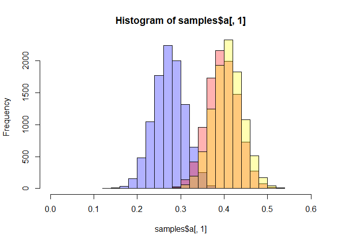
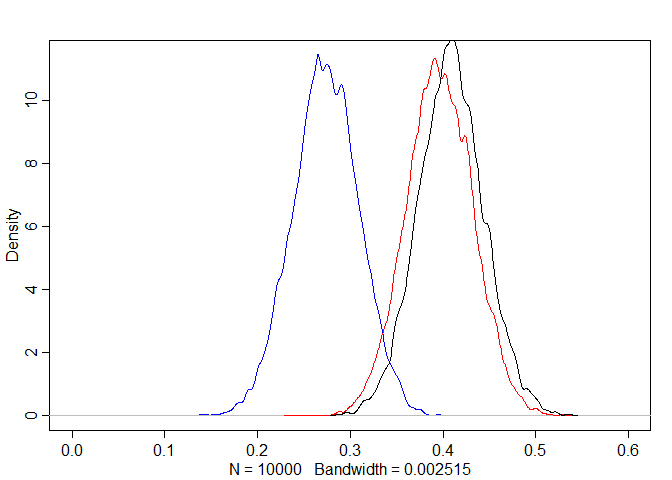
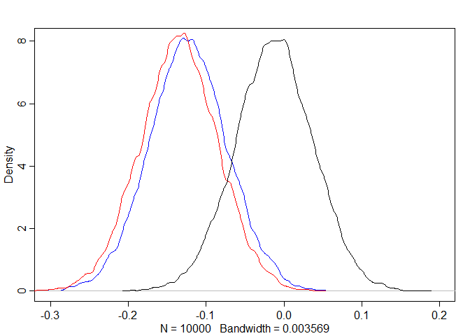
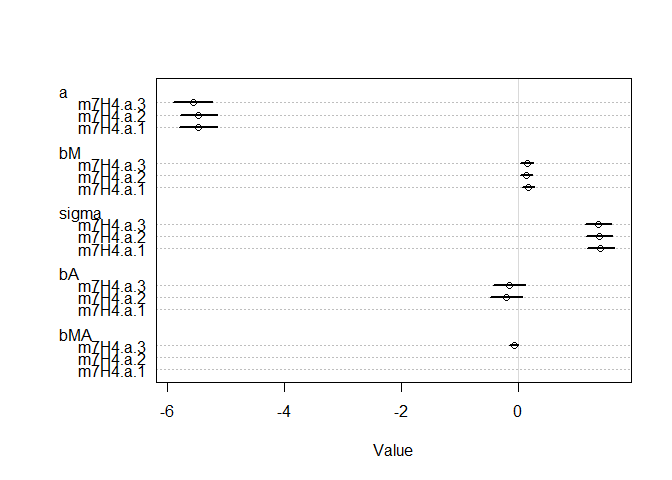
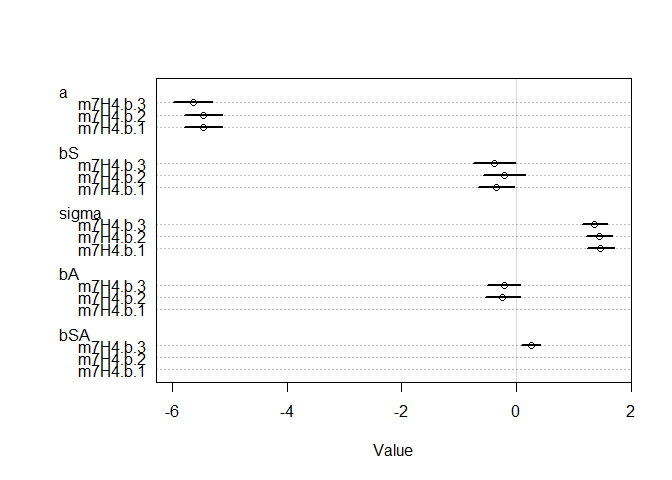
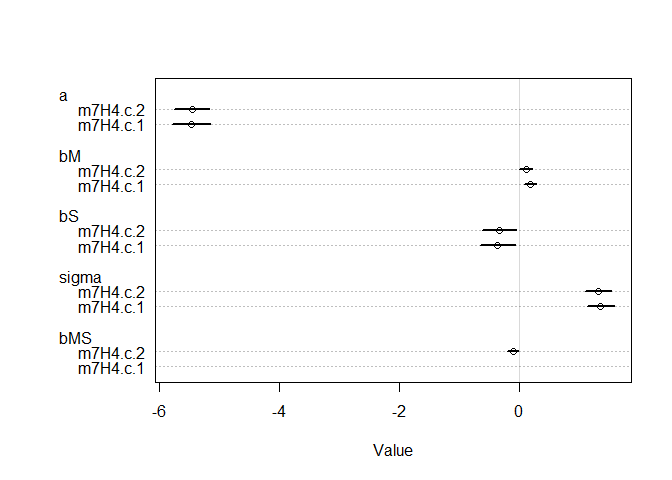
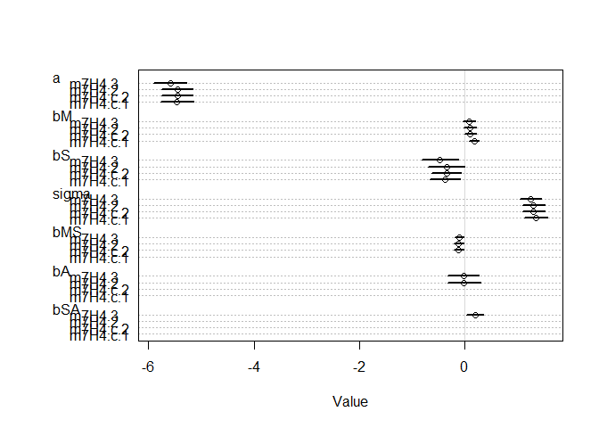

# 8 Conditional Manatees

## 8.1. Building an interaction

### 8.1.1. Making two models.


```r
## R code 8.1
library(rethinking)
```

```
## Loading required package: rstan
```

```
## Warning: package 'rstan' was built under R version 3.5.3
```

```
## Loading required package: ggplot2
```

```
## Loading required package: StanHeaders
```

```
## Warning: package 'StanHeaders' was built under R version 3.5.3
```

```
## rstan (Version 2.18.2, GitRev: 2e1f913d3ca3)
```

```
## For execution on a local, multicore CPU with excess RAM we recommend calling
## options(mc.cores = parallel::detectCores()).
## To avoid recompilation of unchanged Stan programs, we recommend calling
## rstan_options(auto_write = TRUE)
```

```
## For improved execution time, we recommend calling
## Sys.setenv(LOCAL_CPPFLAGS = '-march=native')
## although this causes Stan to throw an error on a few processors.
```

```
## Loading required package: parallel
```

```
## rethinking (Version 1.88)
```

```r
data(rugged)
d <- rugged

# make log version of outcome
d$log_gdp <- log( d$rgdppc_2000 )

# extract countries with GDP data
dd <- d[ complete.cases(d$rgdppc_2000) , ]

# rescale variables
dd$log_gdp_std <- dd$log_gdp / mean(dd$log_gdp)
dd$rugged_std <- dd$rugged / max(dd$rugged)

# split countries into Africa and not-Africa
d.A1 <- dd[ dd$cont_africa==1 , ] # Africa
d.A0 <- dd[ dd$cont_africa==0 , ] # not Africa

## R code 8.2
m8.1 <- quap(
    alist(
        log_gdp_std ~ dnorm( mu , sigma ) ,
        mu <- a + b*( rugged_std - 0.215 ) ,
        a ~ dnorm( 1 , 1 ) ,
        b ~ dnorm( 0 , 1 ) ,
        sigma ~ dexp( 1 )
    ) , data=d.A1 )

## R code 8.3
set.seed(7)
prior <- extract.prior( m8.1 )

# set up the plot dimensions
plot( NULL , xlim=c(0,1) , ylim=c(0.5,1.5) ,
    xlab="ruggedness" , ylab="log GDP" )
abline( h=min(dd$log_gdp_std) , lty=2 )
abline( h=max(dd$log_gdp_std) , lty=2 )

# draw 50 lines from the prior
rugged_seq <- seq( from=-0.1 , to=1.1 , length.out=30 )
mu <- link( m8.1 , post=prior , data=data.frame(rugged_std=rugged_seq) )
for ( i in 1:50 ) lines( rugged_seq , mu[i,] , col=col.alpha("black",0.3) )
```

<!-- -->


```r
## R code 8.4
sum( abs(prior$b) > 0.6 ) / length(prior$bR)
```

```
## [1] Inf
```

```r
## R code 8.5
m8.1 <- quap(
    alist(
        log_gdp_std ~ dnorm( mu , sigma ) ,
        mu <- a + b*( rugged_std - 0.215 ) ,
        a ~ dnorm( 1 , 0.1 ) ,
        b ~ dnorm( 0 , 0.3 ) ,
        sigma ~ dexp(1)
    ) , data=d.A1 )

## R code 8.3
set.seed(7)
prior <- extract.prior( m8.1 )

# set up the plot dimensions
plot( NULL , xlim=c(0,1) , ylim=c(0.5,1.5) ,
    xlab="ruggedness" , ylab="log GDP" )
abline( h=min(dd$log_gdp_std) , lty=2 )
abline( h=max(dd$log_gdp_std) , lty=2 )

# draw 50 lines from the prior
rugged_seq <- seq( from=-0.1 , to=1.1 , length.out=30 )
mu <- link( m8.1 , post=prior , data=data.frame(rugged_std=rugged_seq) )
for ( i in 1:50 ) lines( rugged_seq , mu[i,] , col=col.alpha("black",0.3) )
```

<!-- -->

```r
precis(m8.1)
```

```
##            mean         sd       5.5%     94.5%
## a     0.8863552 0.01502624 0.86234041 0.9103701
## b     0.1329985 0.07121913 0.01917662 0.2468205
## sigma 0.1048078 0.01057309 0.08790992 0.1217056
```


```r
## R code 8.6
# Non-African nations
m8.2 <- quap(
    alist(
        log_gdp_std ~ dnorm( mu , sigma ) ,
        mu <- a + b*( rugged_std - 0.215 ) ,
        a ~ dnorm( 1 , 0.1 ) ,
        b ~ dnorm( 0 , 0.25 ) ,
        sigma ~ dexp(1)
    ) ,
    data=d.A0 )

## R code 8.3
set.seed(7)
prior <- extract.prior( m8.2 )

# set up the plot dimensions
plot( NULL , xlim=c(0,1) , ylim=c(0.5,1.5) ,
    xlab="ruggedness" , ylab="log GDP" )
abline( h=min(dd$log_gdp_std) , lty=2 )
abline( h=max(dd$log_gdp_std) , lty=2 )

# draw 50 lines from the prior
rugged_seq <- seq( from=-0.1 , to=1.1 , length.out=30 )
mu <- link( m8.2 , post=prior , data=data.frame(rugged_std=rugged_seq) )
for ( i in 1:50 ) lines( rugged_seq , mu[i,] , col=col.alpha("black",0.3) )
```

<!-- -->

```r
precis(m8.2)
```

```
##             mean          sd        5.5%       94.5%
## a      1.0505205 0.010097481  1.03438280  1.06665825
## b     -0.1402914 0.055205401 -0.22852025 -0.05206247
## sigma  0.1112893 0.007148252  0.09986506  0.12271363
```

### 8.1.2. Adding an indicator variable doesn’t work.


```r
## R code 8.7
m8.3 <- quap(
    alist(
        log_gdp_std ~ dnorm( mu , sigma ) ,
        mu <- a + b*( rugged_std - 0.215 ) ,
        a ~ dnorm( 1 , 0.1 ) ,
        b ~ dnorm( 0 , 0.3 ) ,
        sigma ~ dexp( 1 )
    ) ,
    data=dd )

## R code 8.11
precis( m8.3 )
```

```
##              mean          sd       5.5%      94.5%
## a     0.999999515 0.010411972  0.9833592 1.01663986
## b     0.001990935 0.054793464 -0.0855796 0.08956147
## sigma 0.136497402 0.007396152  0.1246769 0.14831788
```


```r
## R code 8.8
# make variable to index Africa (1) or not (2)
dd$cid <- ifelse( dd$cont_africa==1 , 1 , 2 )

## R code 8.9
m8.4 <- quap(
    alist(
        log_gdp_std ~ dnorm( mu , sigma ) ,
        mu <- a[cid] + b*( rugged_std - 0.215 ) ,
        a[cid] ~ dnorm( 1 , 0.1 ) ,
        b ~ dnorm( 0 , 0.3 ) ,
        sigma ~ dexp( 1 )
    ) ,
    data=dd )

## R code 8.10
compare( m8.3 , m8.4 )
```

```
##           WAIC    pWAIC    dWAIC       weight       SE      dSE
## m8.4 -252.2694 4.258180  0.00000 1.000000e+00 15.30363       NA
## m8.3 -188.7489 2.693351 63.52044 1.609579e-14 13.29716 15.14767
```

```r
## R code 8.11
precis( m8.4 , depth=2 )
```

```
##              mean          sd       5.5%     94.5%
## a[1]   0.88041699 0.015937691  0.8549455 0.9058885
## a[2]   1.04915863 0.010185998  1.0328794 1.0654378
## b     -0.04651242 0.045688674 -0.1195318 0.0265069
## sigma  0.11239229 0.006091743  0.1026565 0.1221281
```


```r
###
## R code 8.3
set.seed(7)
prior <- extract.prior( m8.4 )

# set up the plot dimensions
plot( NULL , xlim=c(0,1) , ylim=c(0.5,1.5) ,
    xlab="ruggedness" , ylab="log GDP" )
abline( h=min(dd$log_gdp_std) , lty=2 )
abline( h=max(dd$log_gdp_std) , lty=2 )
###

## R code 8.12
rugged.seq <- seq( from=-0.1 , to=1.1 , length.out=30 )

# compute mu over samples, fixing cid=2
mu.NotAfrica <- link( m8.4 ,
    data=data.frame( cid=2 , rugged_std=rugged.seq ) )
for ( i in 1:50 ) lines( rugged_seq , mu.NotAfrica[i,] , col=col.alpha("black",0.3) )

# compute mu over samples, fixing cid=1
mu.Africa <- link( m8.4 ,
    data=data.frame( cid=1 , rugged_std=rugged.seq ) )
for ( i in 1:50 ) lines( rugged_seq , mu.Africa[i,] , col=col.alpha("blue",0.3) )
```

<!-- -->

```r
# summarize to means and intervals
mu.NotAfrica_mu <- apply( mu.NotAfrica , 2 , mean )
mu.NotAfrica_ci <- apply( mu.NotAfrica , 2 , PI , prob=0.97 )
mu.Africa_mu <- apply( mu.Africa , 2 , mean )
mu.Africa_ci <- apply( mu.Africa , 2 , PI , prob=0.97 )
```

### 8.1.3. Adding an interaction does work.


```r
## R code 8.13
m8.5 <- quap(
    alist(
        log_gdp_std ~ dnorm( mu , sigma ) ,
        mu <- a[cid] + b[cid]*( rugged_std - 0.215 ) ,
        a[cid] ~ dnorm( 1 , 0.1 ) ,
        b[cid] ~ dnorm( 0 , 0.3 ) ,
        sigma ~ dexp( 1 )
    ) ,
    data=dd )

## R code 8.14
precis( m8.5 , depth=2 )
```

```
##             mean          sd        5.5%       94.5%
## a[1]   0.8865634 0.015675185  0.86151147  0.91161541
## a[2]   1.0505700 0.009936278  1.03468991  1.06645009
## b[1]   0.1325060 0.074202119  0.01391664  0.25109527
## b[2]  -0.1425764 0.054747637 -0.23007366 -0.05507906
## sigma  0.1094905 0.005934804  0.10000550  0.11897543
```

```r
## R code 8.15
compare( m8.3 , m8.4 , m8.5 )
```

```
##           WAIC    pWAIC     dWAIC       weight       SE       dSE
## m8.5 -259.0324 5.164257  0.000000 9.740827e-01 15.14943        NA
## m8.4 -251.7792 4.493010  7.253167 2.591735e-02 15.39028  6.755541
## m8.3 -188.6221 2.755280 70.410284 5.002612e-16 13.30933 15.364700
```

```r
## R code 8.16
waic_list <- WAIC( m8.5 , pointwise=TRUE )
```

### 8.1.4. Plotting the interaction.


```r
## R code 8.17
# plot Africa - cid=1
plot( d.A1$rugged_std , d.A1$log_gdp_std , pch=16 , col=rangi2 ,
    xlab="ruggedness (standardized)" , ylab="log GDP (as proportion of mean)" ,
    xlim=c(0,1) )
mu <- link( m8.5 , data=data.frame( cid=1 , rugged_std=rugged_seq ) )
mu_mean <- apply( mu , 2 , mean )
mu_ci <- apply( mu , 2 , PI , prob=0.97 )
lines( rugged_seq , mu_mean , lwd=2 )
shade( mu_ci , rugged_seq , col=col.alpha(rangi2,0.3) )
mtext("African nations")
```

<!-- -->

```r
# plot non-Africa - cid=2
plot( d.A0$rugged_std , d.A0$log_gdp_std , pch=1 , col="black" ,
    xlab="ruggedness (standardized)" , ylab="log GDP (as proportion of mean)" ,
    xlim=c(0,1) )
mu <- link( m8.5 , data=data.frame( cid=2 , rugged_std=rugged_seq ) )
mu_mean <- apply( mu , 2 , mean )
mu_ci <- apply( mu , 2 , PI , prob=0.97 )
lines( rugged_seq , mu_mean , lwd=2 )
shade( mu_ci , rugged_seq )
mtext("Non-African nations")
```

<!-- -->

## 8.2. Symmetry of interactions


```r
## R code 8.18
rugged_seq <- seq(from=-0.2,to=1.2,length.out=30)
muA <- link( m8.5 , data=data.frame(cid=1,rugged_std=rugged_seq) )
muN <- link( m8.5 , data=data.frame(cid=2,rugged_std=rugged_seq) )
delta <- muA - muN
```

## 8.3. Continuous interactions
### 8.3.1. A winter flower.


```r
## R code 8.19
library(rethinking)
data(tulips)
d <- tulips
str(d)
```

```
## 'data.frame':	27 obs. of  4 variables:
##  $ bed   : Factor w/ 3 levels "a","b","c": 1 1 1 1 1 1 1 1 1 2 ...
##  $ water : int  1 1 1 2 2 2 3 3 3 1 ...
##  $ shade : int  1 2 3 1 2 3 1 2 3 1 ...
##  $ blooms: num  0 0 111 183.5 59.2 ...
```

### 8.3.2. The models.


```r
## R code 8.20
d$blooms_std <- d$blooms / max(d$blooms)
d$water_cent <- d$water - mean(d$water)
d$shade_cent <- d$shade - mean(d$shade)

## R code 8.21
a <- rnorm( 1e4 , 0.5 , 1 )
sum( a < 0 | a > 1 ) / length( a )
```

```
## [1] 0.617
```

```r
## R code 8.22
a <- rnorm( 1e4 , 0.5 , 0.25 )
sum( a < 0 | a > 1 ) / length( a )
```

```
## [1] 0.0458
```

```r
## R code 8.23
m8.6 <- quap(
    alist(
        blooms_std ~ dnorm( mu , sigma ) ,
        mu <- a + bw*water_cent + bs*shade_cent ,
        a ~ dnorm( 0.5 , 0.25 ) ,
        bw ~ dnorm( 0 , 0.25 ) ,
        bs ~ dnorm( 0 , 0.25 ) ,
        sigma ~ dexp( 1 )
    ) ,
    data=d )

## R code 8.24
m8.7 <- quap(
    alist(
        blooms_std ~ dnorm( mu , sigma ) ,
        mu <- a + bw*water_cent + bs*shade_cent + bws*water_cent*shade_cent ,
        a ~ dnorm( 0.5 , 0.25 ) ,
        bw ~ dnorm( 0 , 0.25 ) ,
        bs ~ dnorm( 0 , 0.25 ) ,
        bws ~ dnorm( 0 , 0.25 ) ,
        sigma ~ dexp( 1 )
    ) ,
    data=d )

## R code 8.25
par(mfrow=c(1,3)) # 3 plots in 1 row
for ( s in -1:1 ) {
    idx <- which( d$shade_cent==s )
    plot( d$water_cent[idx] , d$blooms_std[idx] , xlim=c(-1,1) , ylim=c(0,1) ,
        xlab="water" , ylab="blooms" , pch=16 , col=rangi2 )
    mu <- link( m8.6 , data=data.frame( shade_cent=s , water_cent=-1:1 ) )
    for ( i in 1:20 ) lines( -1:1 , mu[i,] , col=col.alpha("black",0.3) )
}
```

<!-- -->

```r
## R code 8.25
par(mfrow=c(1,3)) # 3 plots in 1 row
for ( s in -1:1 ) {
    idx <- which( d$shade_cent==s )
    plot( d$water_cent[idx] , d$blooms_std[idx] , xlim=c(-1,1) , ylim=c(0,1) ,
        xlab="water" , ylab="blooms" , pch=16 , col=rangi2 )
    mu <- link( m8.7 , data=data.frame( shade_cent=s , water_cent=-1:1 ) )
    for ( i in 1:20 ) lines( -1:1 , mu[i,] , col=col.alpha("black",0.3) )
}
```

<!-- -->

```r
## R code 8.26
set.seed(7)
prior <- extract.prior(m8.6)

## R code 8.25
par(mfrow=c(1,3)) # 3 plots in 1 row
for ( s in -1:1 ) {
    idx <- which( d$shade_cent==s )
    plot( d$water_cent[idx] , d$blooms_std[idx] , xlim=c(-1,1) , ylim=c(0,1) ,
        xlab="water" , ylab="blooms" , pch=16 , col=rangi2 )
    mu <- link( m8.6 , post=prior, data=data.frame( shade_cent=s , water_cent=-1:1 ) )
    for ( i in 1:20 ) lines( -1:1 , mu[i,] , col=col.alpha("black",0.3) )
}
```

<!-- -->

```r
## R code 8.26
set.seed(7)
prior <- extract.prior(m8.7)

## R code 8.25
par(mfrow=c(1,3)) # 3 plots in 1 row
for ( s in -1:1 ) {
    idx <- which( d$shade_cent==s )
    plot( d$water_cent[idx] , d$blooms_std[idx] , xlim=c(-1,1) , ylim=c(0,1) ,
        xlab="water" , ylab="blooms" , pch=16 , col=rangi2 )
    mu <- link( m8.7 , post=prior, data=data.frame( shade_cent=s , water_cent=-1:1 ) )
    for ( i in 1:20 ) lines( -1:1 , mu[i,] , col=col.alpha("black",0.3) )
}
```

<!-- -->


## 8.5. Practice.

#### 7M1. Recall the tulips example from the chapter. Suppose another set of treatments adjusted the temperature in the greenhouse over two levels: cold and hot. The data in the chapter were collected at the cold temperature. You find none of the plants grown under the hot temperature developed any blooms at all, regardless of the water and shade levels. Can you explain this result in terms of interactions between water, shade, and temperature?

> Because we find none of the plants grown under the hot temperature developed any blooms at all, this indicates that the relationship between blossoms and water and the relationship between blossoms and shade depend upon temperature. Therefore, there are interactions (blossoms-shade, blossoms-water, shade-water, blossoms-shade-water).

#### 7M2. Can you invent a regression equation that would make the bloom size zero, whenever the temperature is hot?

$$ μi = α + βW*Wi + βS*Si + βT*Ti + βWS*Wi*Si+ βWT*Wi*Ti + βST*Si*Ti + βWST*Wi*Si*Ti$$

Set cold temperature = 1 (Ti=1); hot temperature = 0 (Ti=0)

$$ μi = α + βW*Wi + βS*Si + βWS*Wi*Si $$

When Ti=0, the full regression equation will perform the same as it did without temperature.

In short,
$$ bloom ~ is_temp_cold * (α + βW*Wi + βS*Si + βWS*Wi*Si)$$

#### 7H1. Return to the data (tulips) example in the chapter. Now include the bed variable as a predictor in the interaction model. Don’t interact bed with the other predictors; just include it as a main effect. Note that bed is categorical. So to use it properly, you will need to either construct dummy variables or rather an index variable, as explained in Chapter ??.


```r
## R code 8.19
library(rethinking)
data(tulips)
d <- tulips
str(d)
```

```
## 'data.frame':	27 obs. of  4 variables:
##  $ bed   : Factor w/ 3 levels "a","b","c": 1 1 1 1 1 1 1 1 1 2 ...
##  $ water : int  1 1 1 2 2 2 3 3 3 1 ...
##  $ shade : int  1 2 3 1 2 3 1 2 3 1 ...
##  $ blooms: num  0 0 111 183.5 59.2 ...
```

```r
## R code 8.20
d$blooms_std <- d$blooms / max(d$blooms)
d$water_cent <- d$water - mean(d$water)
d$shade_cent <- d$shade - mean(d$shade)
# add bed index
d$bed.idx <- coerce_index(d$bed)

## R code 8.23
m8.6 <- quap(
    alist(
        blooms_std ~ dnorm( mu , sigma ) ,
        mu <- a + bw*water_cent + bs*shade_cent ,
        a ~ dnorm( 0.5 , 0.25 ) ,
        bw ~ dnorm( 0 , 0.25 ) ,
        bs ~ dnorm( 0 , 0.25 ) ,
        sigma ~ dexp( 1 )
    ) ,
    data=d )
precis(m8.6)
```

```
##             mean         sd       5.5%       94.5%
## a      0.3587624 0.03021843  0.3104675  0.40705732
## bw     0.2050325 0.03688901  0.1460768  0.26398830
## bs    -0.1125318 0.03687513 -0.1714654 -0.05359822
## sigma  0.1581519 0.02144293  0.1238820  0.19242184
```

```r
## R code 8.24
m8.7 <- quap(
    alist(
        blooms_std ~ dnorm( mu , sigma ) ,
        mu <- a + bw*water_cent + bs*shade_cent + bws*water_cent*shade_cent ,
        a ~ dnorm( 0.5 , 0.25 ) ,
        bw ~ dnorm( 0 , 0.25 ) ,
        bs ~ dnorm( 0 , 0.25 ) ,
        bws ~ dnorm( 0 , 0.25 ) ,
        sigma ~ dexp( 1 )
    ) ,
    data=d )
precis(m8.7)
```

```
##             mean         sd        5.5%       94.5%
## a      0.3579825 0.02391841  0.31975628  0.39620875
## bw     0.2067289 0.02923404  0.16000721  0.25345049
## bs    -0.1134610 0.02922701 -0.16017139 -0.06675058
## bws   -0.1431613 0.03567904 -0.20018325 -0.08613926
## sigma  0.1248427 0.01693969  0.09776984  0.15191563
```

```r
## new model
m7H1 <- quap(
    alist(
        blooms_std ~ dnorm( mu , sigma ) ,
        mu <- a[bed.idx] + bw*water_cent + bs*shade_cent + bws*water_cent*shade_cent ,
        a[bed.idx] ~ dnorm( 0.5 , 0.25 ) ,
        bw ~ dnorm( 0 , 0.25 ) ,
        bs ~ dnorm( 0 , 0.25 ) ,
        bws ~ dnorm( 0 , 0.25 ) ,
        sigma ~ dexp( 1 )
    ) ,
    data=d )
precis(m7H1, depth = 2)
```

```
##             mean         sd        5.5%       94.5%
## a[1]   0.2732669 0.03571508  0.21618727  0.33034645
## a[2]   0.3963996 0.03569760  0.33934791  0.45345125
## a[3]   0.4091127 0.03569654  0.35206271  0.46616265
## bw     0.2074354 0.02537500  0.16688121  0.24798952
## bs    -0.1138480 0.02537037 -0.15439478 -0.07330129
## bws   -0.1438871 0.03099594 -0.19342464 -0.09434963
## sigma  0.1081873 0.01469443  0.08470276  0.13167183
```

```r
coeftab(m8.6, m8.7, m7H1)
```

```
##       m8.6    m8.7    m7H1   
## a        0.36    0.36      NA
## bw       0.21    0.21    0.21
## bs      -0.11   -0.11   -0.11
## sigma    0.16    0.12    0.11
## bws        NA   -0.14   -0.14
## a[1]       NA      NA    0.27
## a[2]       NA      NA     0.4
## a[3]       NA      NA    0.41
## nobs       27      27      27
```

```r
# add interaction of water and shade with bed
m7H2 <- quap(
    alist(
        blooms_std ~ dnorm( mu , sigma ) ,
        mu <- a[bed.idx] + bw[bed.idx]*water_cent + bs[bed.idx]*shade_cent + bws*water_cent*shade_cent ,
        a[bed.idx] ~ dnorm( 0.5 , 0.25 ) ,
        bw[bed.idx] ~ dnorm( 0 , 0.25 ) ,
        bs[bed.idx] ~ dnorm( 0 , 0.25 ) ,
        bws ~ dnorm( 0 , 0.25 ) ,
        sigma ~ dexp( 1 )
    ) ,
    data=d )
precis(m7H2, depth = 2)
```

```
##              mean         sd        5.5%       94.5%
## a[1]   0.27169907 0.02918272  0.22505944  0.31833870
## a[2]   0.39568212 0.02917302  0.34905800  0.44230624
## a[3]   0.40848182 0.02917243  0.36185865  0.45510499
## bw[1]  0.15019228 0.03561502  0.09327259  0.20711196
## bw[2]  0.22926891 0.03562787  0.17232870  0.28620912
## bw[3]  0.23657093 0.03562935  0.17962835  0.29351352
## bs[1] -0.03869415 0.03560603 -0.09559947  0.01821116
## bs[2] -0.19622035 0.03562189 -0.25315100 -0.13928969
## bs[3] -0.10318503 0.03560994 -0.16009659 -0.04627346
## bws   -0.14462606 0.02530874 -0.18507431 -0.10417781
## sigma  0.08811326 0.01198876  0.06895291  0.10727361
```

```r
coeftab(m8.6, m8.7, m7H1, m7H2)
```

```
##       m8.6    m8.7    m7H1    m7H2   
## a        0.36    0.36      NA      NA
## bw       0.21    0.21    0.21      NA
## bs      -0.11   -0.11   -0.11      NA
## sigma    0.16    0.12    0.11    0.09
## bws        NA   -0.14   -0.14   -0.14
## a[1]       NA      NA    0.27    0.27
## a[2]       NA      NA     0.4     0.4
## a[3]       NA      NA    0.41    0.41
## bw[1]      NA      NA      NA    0.15
## bw[2]      NA      NA      NA    0.23
## bw[3]      NA      NA      NA    0.24
## bs[1]      NA      NA      NA   -0.04
## bs[2]      NA      NA      NA    -0.2
## bs[3]      NA      NA      NA    -0.1
## nobs       27      27      27      27
```

#### 7H2.  Use WAIC to compare the model from 7H1 to a model that omits bed. What do you infer from this comparison? Can you reconcile the WAIC results with the posterior distribution of the bed coefficients?


```r
compare(m8.6, m8.7, m7H1)
```

```
##           WAIC    pWAIC     dWAIC      weight        SE      dSE
## m7H1 -23.83717 9.505989  0.000000 0.716084914  9.884935       NA
## m8.7 -21.97468 6.683720  1.862495 0.282181771 10.609346 8.037427
## m8.6 -11.78965 5.511412 12.047526 0.001733315  9.093911 8.477365
```

```r
compare(m8.6, m8.7, m7H1, m7H2)
```

```
##           WAIC     pWAIC     dWAIC      weight        SE      dSE
## m7H2 -22.63480 15.043034  0.000000 0.536201593 11.977576       NA
## m7H1 -21.04576 10.921744  1.589040 0.242254843 10.826390 10.14757
## m8.7 -20.83891  7.228836  1.795893 0.218451377 10.834905 11.54466
## m8.6 -12.32354  5.282180 10.311263 0.003092187  8.903239 12.43794
```

```r
samples <- extract.samples(m7H1)
str(samples)
```

```
## List of 5
##  $ bw   : num [1:10000] 0.243 0.226 0.213 0.249 0.231 ...
##  $ bs   : num [1:10000] -0.1207 -0.1304 -0.1003 -0.0971 -0.135 ...
##  $ bws  : num [1:10000] -0.188 -0.13 -0.141 -0.122 -0.138 ...
##  $ sigma: num [1:10000] 0.1412 0.1003 0.1183 0.086 0.0979 ...
##  $ a    : num [1:10000, 1:3] 0.312 0.217 0.183 0.22 0.264 ...
##  - attr(*, "source")= chr "quap posterior: 10000 samples from m7H1"
```

```r
hist(samples$a[,1], xlim=c(0,0.6), col=col.alpha('blue',0.3))
hist(samples$a[,2], add=T, col=col.alpha('red',0.3))
hist(samples$a[,3], add=T, col=col.alpha('yellow',0.3))
```

<!-- -->

```r
dens(samples$a[,1], xlim=c(0,0.6), col='blue')
dens(samples$a[,2], add=T, col='red')
dens(samples$a[,3], add=T, col='black')
```

<!-- -->

```r
dens(samples$a[,1]-samples$a[,2], xlim=c(-0.3,0.2), col='blue')
dens(samples$a[,1]-samples$a[,3], add=T, col='red')
dens(samples$a[,2]-samples$a[,3], add=T, col='black')
```

<!-- -->


#### 7H4. The values in data (nettle) are data on language diversity in 74 nations. 130 The meaning of each column is given below.
#### (1) country: Name of the country
#### (2) num.lang: Number of recognized languages spoken
#### (3) area: Area in square kilometers
#### (4) k.pop: Population, in thousands
#### (5) num.stations: Number of weather stations that provided data for the next two columns
#### (6) mean.growing.season: Average length of growing season, in months
#### (7) sd.growing.season: Standard deviation of length of growing season, in months 

Use these data to evaluate the hypothesis that language diversity is partly a product of food security. The notion is that, in productive ecologies, people don’t need large social networks to buffer them against risk of food shortfalls. This means ethnic groups can be smaller and more self-sufficient, leading to more languages per capita. In contrast, in a poor ecology, there is more subsistence risk, and so human societies have adapted by building larger networks of mutual obligation to provide food insurance. This in turn creates social forces that help prevent languages from diversifying. Specifically, you will try to model the number of languages per capita as the outcome variable:


```r
data(nettle)
d <- nettle
str(d)
```

```
## 'data.frame':	74 obs. of  7 variables:
##  $ country            : Factor w/ 74 levels "Algeria","Angola",..: 1 2 3 4 5 6 7 8 9 12 ...
##  $ num.lang           : int  18 42 234 37 52 38 27 209 75 94 ...
##  $ area               : int  2381741 1246700 7713364 143998 112622 1098581 581730 8511965 274000 622984 ...
##  $ k.pop              : int  25660 10303 17336 118745 4889 7612 1348 153322 9242 3127 ...
##  $ num.stations       : int  102 50 134 20 7 48 10 245 6 13 ...
##  $ mean.growing.season: num  6.6 6.22 6 7.4 7.14 6.92 4.6 9.71 5.17 8.08 ...
##  $ sd.growing.season  : num  2.29 1.87 4.17 0.73 0.99 2.5 1.69 5.87 1.07 1.21 ...
```


```r
## R code 8.27
d$lang.per.cap <- d$num.lang / d$k.pop
```

#### Use the logarithm of this new variable as your regression outcome. (A count model would be better here, but you’ll learn those later, in Chapter 11.)


```r
d$log.lang.per.cap <- log(d$lang.per.cap)
d$log.area <- log(d$area)
d$log.area.c <- d$log.area - mean(d$log.area)
d$mean.growing.season.c <- d$mean.growing.season - mean(d$mean.growing.season)
d$sd.growing.season.c <- d$sd.growing.season - mean(d$sd.growing.season)
str(d)
```

```
## 'data.frame':	74 obs. of  13 variables:
##  $ country              : Factor w/ 74 levels "Algeria","Angola",..: 1 2 3 4 5 6 7 8 9 12 ...
##  $ num.lang             : int  18 42 234 37 52 38 27 209 75 94 ...
##  $ area                 : int  2381741 1246700 7713364 143998 112622 1098581 581730 8511965 274000 622984 ...
##  $ k.pop                : int  25660 10303 17336 118745 4889 7612 1348 153322 9242 3127 ...
##  $ num.stations         : int  102 50 134 20 7 48 10 245 6 13 ...
##  $ mean.growing.season  : num  6.6 6.22 6 7.4 7.14 6.92 4.6 9.71 5.17 8.08 ...
##  $ sd.growing.season    : num  2.29 1.87 4.17 0.73 0.99 2.5 1.69 5.87 1.07 1.21 ...
##  $ lang.per.cap         : num  0.000701 0.004076 0.013498 0.000312 0.010636 ...
##  $ log.lang.per.cap     : num  -7.26 -5.5 -4.31 -8.07 -4.54 ...
##  $ log.area             : num  14.7 14 15.9 11.9 11.6 ...
##  $ log.area.c           : num  1.75 1.1 2.92 -1.06 -1.3 ...
##  $ mean.growing.season.c: num  -0.4415 -0.8215 -1.0415 0.3585 0.0985 ...
##  $ sd.growing.season.c  : num  0.591 0.171 2.471 -0.969 -0.709 ...
```

```r
summary(d)
```

```
##        country      num.lang           area             k.pop       
##  Algeria   : 1   Min.   :  1.00   Min.   :  12189   Min.   :   102  
##  Angola    : 1   1st Qu.: 17.25   1st Qu.: 167708   1st Qu.:  3829  
##  Australia : 1   Median : 40.00   Median : 434796   Median :  9487  
##  Bangladesh: 1   Mean   : 89.73   Mean   : 880698   Mean   : 33574  
##  Benin     : 1   3rd Qu.: 93.75   3rd Qu.:1080316   3rd Qu.: 24745  
##  Bolivia   : 1   Max.   :862.00   Max.   :8511965   Max.   :849638  
##  (Other)   :68                                                      
##   num.stations    mean.growing.season sd.growing.season
##  Min.   :  1.00   Min.   : 0.000      Min.   :0.0000   
##  1st Qu.: 10.00   1st Qu.: 5.348      1st Qu.:0.9375   
##  Median : 20.50   Median : 7.355      Median :1.6900   
##  Mean   : 37.91   Mean   : 7.041      Mean   :1.6992   
##  3rd Qu.: 44.75   3rd Qu.: 9.283      3rd Qu.:2.1075   
##  Max.   :272.00   Max.   :12.000      Max.   :5.8700   
##                                                        
##   lang.per.cap       log.lang.per.cap     log.area        log.area.c      
##  Min.   :0.0000931   Min.   :-9.2814   Min.   : 9.408   Min.   :-3.52662  
##  1st Qu.:0.0019901   1st Qu.:-6.2196   1st Qu.:12.029   1st Qu.:-0.90595  
##  Median :0.0041066   Median :-5.4952   Median :12.981   Median : 0.04564  
##  Mean   :0.0206464   Mean   :-5.4566   Mean   :12.935   Mean   : 0.00000  
##  3rd Qu.:0.0100059   3rd Qu.:-4.6111   3rd Qu.:13.892   3rd Qu.: 0.95742  
##  Max.   :0.6809816   Max.   :-0.3842   Max.   :15.957   Max.   : 3.02207  
##                                                                           
##  mean.growing.season.c sd.growing.season.c
##  Min.   :-7.0415       Min.   :-1.699189  
##  1st Qu.:-1.6940       1st Qu.:-0.761689  
##  Median : 0.3135       Median :-0.009189  
##  Mean   : 0.0000       Mean   : 0.000000  
##  3rd Qu.: 2.2410       3rd Qu.: 0.408311  
##  Max.   : 4.9585       Max.   : 4.170811  
## 
```

#### This problem is open ended, allowing you to decide how you address the hypotheses and the uncertain advice the modeling provides. If you think you need to use WAIC anyplace, please do. If you think you need certain priors, argue for them. If you think you need to plot predictions in a certain way, please do. Just try to honestly evaluate the main effects of both mean.growing.season and sd.growing.season, as well as their two-way interaction, as outlined in parts (a), (b), and (c) below. If you are not sure which approach to use, try several. 

##### (a) Evaluate the hypothesis that language diversity, as measured by log(lang.per.cap), is positively associated with the average length of the growing season, mean.growing.season. Consider log(area) in your regression(s) as a covariate (not an interaction). Interpret your results.


```r
m7H4.a.1 <- quap(
  alist(
    log.lang.per.cap ~ dnorm( mu , sigma ),
    mu <- a + bM*mean.growing.season.c,
    a ~ dnorm(-5, 5),
    bM ~ dnorm(0, 5),
    sigma ~ dunif(0, 10)
  ),
  data = d
)
precis(m7H4.a.1)
```

```
##             mean         sd        5.5%      94.5%
## a     -5.4557644 0.16374555 -5.71746141 -5.1940674
## bM     0.1739138 0.05246525  0.09006424  0.2577634
## sigma  1.4093479 0.11584396  1.22420691  1.5944889
```

```r
m7H4.a.2 <- quap(
  alist(
    log.lang.per.cap ~ dnorm( mu , sigma ),
    mu <- a + bM*mean.growing.season.c + bA*log.area.c,
    a ~ dnorm(-5, 5),
    bM ~ dnorm(0, 5),
    bA ~ dnorm(0, 5),
    sigma ~ dunif(0, 10)
  ),
  data = d
)
precis(m7H4.a.2)
```

```
##             mean         sd        5.5%       94.5%
## a     -5.4560936 0.16141067 -5.71405902 -5.19812817
## bM     0.1437994 0.05564484  0.05486825  0.23273064
## bA    -0.2015072 0.13743179 -0.42114971  0.01813539
## sigma  1.3892310 0.11418439  1.20674225  1.57171968
```

```r
m7H4.a.3 <- quap(
  alist(
    log.lang.per.cap ~ dnorm( mu , sigma ),
    mu <- a + bM*mean.growing.season.c + bA*log.area.c + bMA*mean.growing.season.c*log.area.c,
    a ~ dnorm(-5, 5),
    bM ~ dnorm(0, 5),
    bA ~ dnorm(0, 5),
    bMA ~ dnorm(0, 5),
    sigma ~ dunif(0, 10)
  ),
  data = d
)
precis(m7H4.a.3)
```

```
##              mean         sd        5.5%        94.5%
## a     -5.55255713 0.17016941 -5.82452072 -5.280593544
## bM     0.15072585 0.05491450  0.06296188  0.238489821
## bA    -0.14591715 0.13974753 -0.36926069  0.077426399
## bMA   -0.06617385 0.04203507 -0.13335400  0.001006306
## sigma  1.36663055 0.11234167  1.18708686  1.546174236
```

```r
compare(m7H4.a.1, m7H4.a.2, m7H4.a.3)
```

```
##              WAIC    pWAIC     dWAIC    weight       SE      dSE
## m7H4.a.1 267.9622 3.741134 0.0000000 0.4128785 15.34256       NA
## m7H4.a.2 268.4131 5.048567 0.4508992 0.3295420 15.83022 3.672026
## m7H4.a.3 268.9058 6.539852 0.9436505 0.2575794 15.34617 5.839561
```

```r
coeftab(m7H4.a.1, m7H4.a.2, m7H4.a.3)
```

```
##       m7H4.a.1 m7H4.a.2 m7H4.a.3
## a       -5.46    -5.46    -5.55 
## bM       0.17     0.14     0.15 
## sigma    1.41     1.39     1.37 
## bA         NA    -0.20    -0.15 
## bMA        NA       NA    -0.07 
## nobs       74       74       74
```

```r
plot(coeftab(m7H4.a.1, m7H4.a.2, m7H4.a.3))
```

<!-- -->

> m7H4.a.1 (model without area) is the best model.

##### (b) Now evaluate the hypothesis that language diversity is negatively associated with the standard deviation of length of growing season, sd.growing.season. Th is hypothesis follows from uncertainty in harvest favoring social insurance through larger social networks and therefore fewer languages. Again, consider log(area) as a covariate (not an interaction). Interpret your results.


```r
m7H4.b.1 <- quap(
  alist(
    log.lang.per.cap ~ dnorm( mu , sigma ),
    mu <- a + bS*sd.growing.season.c,
    a ~ dnorm(-5, 5),
    bS ~ dnorm(0, 5),
    sigma ~ dunif(0, 10)
  ),
  data = d
)
precis(m7H4.b.1)
```

```
##             mean        sd       5.5%      94.5%
## a     -5.4560801 0.1697564 -5.7273836 -5.1847767
## bS    -0.3610844 0.1603310 -0.6173243 -0.1048445
## sigma  1.4611417 0.1201049  1.2691909  1.6530925
```

```r
m7H4.b.2 <- quap(
  alist(
    log.lang.per.cap ~ dnorm( mu , sigma ),
    mu <- a + bS*sd.growing.season.c + bA*log.area.c,
    a ~ dnorm(-5, 5),
    bS ~ dnorm(0, 5),
    bA ~ dnorm(0, 5),
    sigma ~ dunif(0, 10)
  ),
  data = d
)
precis(m7H4.b.2)
```

```
##             mean        sd       5.5%       94.5%
## a     -5.4560628 0.1671178 -5.7231493 -5.18897631
## bS    -0.2091880 0.1863452 -0.5070037  0.08862762
## bA    -0.2395069 0.1561322 -0.4890363  0.01002258
## sigma  1.4384051 0.1182303  1.2494503  1.62735986
```

```r
m7H4.b.3 <- quap(
  alist(
    log.lang.per.cap ~ dnorm( mu , sigma ),
    mu <- a + bS*sd.growing.season.c + bA*log.area.c + bSA*sd.growing.season.c*log.area.c,
    a ~ dnorm(-5, 5),
    bS ~ dnorm(0, 5),
    bA ~ dnorm(0, 5),
    bSA ~ dnorm(0, 5),
    sigma ~ dunif(0, 10)
  ),
  data = d
)
precis(m7H4.b.3)
```

```
##             mean         sd       5.5%       94.5%
## a     -5.6355098 0.17000809 -5.9072156 -5.36380402
## bS    -0.3920592 0.18751265 -0.6917406 -0.09237776
## bA    -0.2175270 0.14814756 -0.4542954  0.01924139
## bSA    0.2521661 0.08694759  0.1132070  0.39112511
## sigma  1.3629505 0.11203368  1.1838990  1.54200196
```

```r
compare(m7H4.b.1, m7H4.b.2, m7H4.b.3)
```

```
##              WAIC    pWAIC    dWAIC     weight       SE      dSE
## m7H4.b.3 269.9305 7.318909 0.000000 0.76699259 17.69072       NA
## m7H4.b.1 273.4082 3.848269 3.477725 0.13477606 17.14102 9.186573
## m7H4.b.2 274.0408 5.450992 4.110303 0.09823135 17.02042 7.715779
```

```r
coeftab(m7H4.b.1, m7H4.b.2, m7H4.b.3)
```

```
##       m7H4.b.1 m7H4.b.2 m7H4.b.3
## a       -5.46    -5.46    -5.64 
## bS      -0.36    -0.21    -0.39 
## sigma    1.46     1.44     1.36 
## bA         NA    -0.24    -0.22 
## bSA        NA       NA     0.25 
## nobs       74       74       74
```

```r
plot(coeftab(m7H4.b.1, m7H4.b.2, m7H4.b.3))
```

<!-- -->

> m7H4.b.3 is the best model (with interaction between sd.growing.season.c & log.area.c). 

##### (c) Finally, evaluate the hypothesis that mean.growing.season and sd.growing.season interact to synergistically reduce language diversity. The idea is that, in nations with longer average growing seasons, high variance makes storage and redistribution even more important than it would be otherwise. That way, people can cooperate to preserve and protect windfalls to be used during the droughts. These forces in turn may lead to greater social integration and fewer languages.


```r
m7H4.c.1 <- quap(
  alist(
    log.lang.per.cap ~ dnorm( mu , sigma ),
    mu <- a + bM*mean.growing.season.c + bS*sd.growing.season.c,
    a ~ dnorm(-5, 5),
    bM ~ dnorm(0, 5),
    bS ~ dnorm(0, 5),
    sigma ~ dunif(0, 10)
  ),
  data = d
)
precis(m7H4.c.1)
```

```
##             mean         sd        5.5%      94.5%
## a     -5.4561547 0.15721237 -5.70741041 -5.2048990
## bM     0.1766429 0.05038157  0.09612341  0.2571624
## bS    -0.3722557 0.14851601 -0.60961296 -0.1348984
## sigma  1.3530608 0.11122074  1.17530856  1.5308130
```

```r
m7H4.c.2 <- quap(
  alist(
    log.lang.per.cap ~ dnorm( mu , sigma ),
    mu <- a + bM*mean.growing.season.c + bS*sd.growing.season.c + bMS*mean.growing.season.c*sd.growing.season.c,
    a ~ dnorm(-5, 5),
    bM ~ dnorm(0, 5),
    bS ~ dnorm(0, 5),
    bMS ~ dnorm(0, 5),
    sigma ~ dunif(0, 10)
  ),
  data = d
)
precis(m7H4.c.2)
```

```
##             mean         sd        5.5%       94.5%
## a     -5.4485022 0.15186180 -5.69120674 -5.20579775
## bM     0.1146635 0.05554399  0.02589349  0.20343356
## bS    -0.3440352 0.14394531 -0.57408758 -0.11398277
## bMS   -0.1088719 0.04706559 -0.18409178 -0.03365199
## sigma  1.3066545 0.10740607  1.13499887  1.47831017
```

```r
compare(m7H4.c.1,m7H4.c.2)
```

```
##              WAIC    pWAIC    dWAIC    weight       SE      dSE
## m7H4.c.2 261.1451 5.736475 0.000000 0.8057822 16.03634       NA
## m7H4.c.1 263.9908 4.731431 2.845667 0.1942178 15.37353 4.752365
```

```r
coeftab(m7H4.c.1,m7H4.c.2)
```

```
##       m7H4.c.1 m7H4.c.2
## a       -5.46    -5.45 
## bM       0.18     0.11 
## bS      -0.37    -0.34 
## sigma    1.35     1.31 
## bMS        NA    -0.11 
## nobs       74       74
```

```r
plot(coeftab(m7H4.c.1,m7H4.c.2))
```

<!-- -->

> m7H4.c.2 is a better model (with interaction between mean.growing.season.c & sd.growing.season.c).


```r
m7H4.2 <- quap(
  alist(
    log.lang.per.cap ~ dnorm( mu , sigma ),
    mu <- a + bM*mean.growing.season.c + bS*sd.growing.season.c + bMS*mean.growing.season.c*sd.growing.season.c + bA*log.area.c,
    a ~ dnorm(-5, 5),
    bM ~ dnorm(0, 5),
    bS ~ dnorm(0, 5),
    bMS ~ dnorm(0, 5),
    bA ~ dnorm(0, 5),
    sigma ~ dunif(0, 10)
  ),
  data = d
)
precis(m7H4.2)
```

```
##               mean         sd        5.5%       94.5%
## a     -5.448503218 0.15186073 -5.69120599 -5.20580044
## bM     0.113809686 0.06055801  0.01702629  0.21059308
## bS    -0.340419959 0.17650061 -0.62250202 -0.05833790
## bMS   -0.108850725 0.04706905 -0.18407617 -0.03362528
## bA    -0.005617881 0.15878640 -0.25938922  0.24815346
## sigma  1.306645222 0.10740541  1.13499063  1.47829982
```

```r
compare(m7H4.c.1,m7H4.c.2, m7H4.2)
```

```
##              WAIC    pWAIC    dWAIC    weight       SE       dSE
## m7H4.c.2 261.5314 5.968549 0.000000 0.6416716 16.13404        NA
## m7H4.2   263.9001 7.099530 2.368683 0.1963178 16.28826 0.5449345
## m7H4.c.1 264.2842 4.861046 2.752831 0.1620105 15.44949 4.7605887
```

```r
m7H4.3 <- quap(
  alist(
    log.lang.per.cap ~ dnorm( mu , sigma ),
    mu <- a + bM*mean.growing.season.c + bS*sd.growing.season.c + bMS*mean.growing.season.c*sd.growing.season.c + bA*log.area.c + bSA*sd.growing.season.c*log.area.c,
    a ~ dnorm(-5, 5),
    bM ~ dnorm(0, 5),
    bS ~ dnorm(0, 5),
    bMS ~ dnorm(0, 5),
    bA ~ dnorm(0, 5),
    bSA ~ dnorm(0, 5),
    sigma ~ dunif(0, 10)
  ),
  data = d
)
precis(m7H4.3)
```

```
##              mean         sd          5.5%       94.5%
## a     -5.59400349 0.15691863 -5.844790e+00 -5.34321721
## bM     0.09388218 0.05868351  9.460232e-05  0.18766976
## bS    -0.46928539 0.17706641 -7.522717e-01 -0.18629906
## bMS   -0.10355717 0.04523918 -1.758581e-01 -0.03125622
## bA    -0.01793976 0.15253598 -2.617217e-01  0.22584219
## bSA    0.20371604 0.08133224  7.373141e-02  0.33370068
## sigma  1.25447794 0.10311971  1.089673e+00  1.41928315
```

```r
compare(m7H4.c.1,m7H4.c.2, m7H4.2, m7H4.3)
```

```
##              WAIC    pWAIC    dWAIC     weight       SE      dSE
## m7H4.3   259.7568 7.724301 0.000000 0.59885231 17.56623       NA
## m7H4.c.2 261.3482 5.847119 1.591329 0.27025078 16.00426 5.462602
## m7H4.2   263.8888 7.123051 4.131977 0.07587038 16.30634 5.680150
## m7H4.c.1 264.5312 5.012974 4.774399 0.05502653 15.62189 8.890530
```

```r
coeftab(m7H4.c.1,m7H4.c.2, m7H4.2, m7H4.3)
```

```
##       m7H4.c.1 m7H4.c.2 m7H4.2  m7H4.3 
## a       -5.46    -5.45    -5.45   -5.59
## bM       0.18     0.11     0.11    0.09
## bS      -0.37    -0.34    -0.34   -0.47
## sigma    1.35     1.31     1.31    1.25
## bMS        NA    -0.11    -0.11   -0.10
## bA         NA       NA    -0.01   -0.02
## bSA        NA       NA       NA     0.2
## nobs       74       74       74      74
```

```r
plot(coeftab(m7H4.c.1,m7H4.c.2, m7H4.2, m7H4.3))
```

<!-- -->

> Therefore, my best model is m7H4.3.

