```r
library(rethinking)
```

```
## Loading required package: rstan
```

```
## Loading required package: StanHeaders
```

```
## Loading required package: ggplot2
```

```
## rstan (Version 2.19.2, GitRev: 2e1f913d3ca3)
```

```
## For execution on a local, multicore CPU with excess RAM we recommend calling
## options(mc.cores = parallel::detectCores()).
## To avoid recompilation of unchanged Stan programs, we recommend calling
## rstan_options(auto_write = TRUE)
```

```
## For improved execution time, we recommend calling
## Sys.setenv(LOCAL_CPPFLAGS = '-march=native')
## although this causes Stan to throw an error on a few processors.
```

```
## Loading required package: parallel
```

```
## Loading required package: dagitty
```

```
## rethinking (Version 1.90)
```

```
## 
## Attaching package: 'rethinking'
```

```
## The following object is masked from 'package:stats':
## 
##     rstudent
```

```r
library(rstan)
```

# 9 Markov Chain Monte Carlo

## 9.1. Good King Markov and His island kingdom


```r
## R code 9.1
num_weeks <- 1e5
positions <- rep(0,num_weeks)
current <- 10
for ( i in 1:num_weeks ) {
    # record current position
    positions[i] <- current

    # flip coin to generate proposal
    proposal <- current + sample( c(-1,1) , size=1 )
    # now make sure he loops around the archipelago
    if ( proposal < 1 ) proposal <- 10
    if ( proposal > 10 ) proposal <- 1

    # move?
    prob_move <- proposal/current
    current <- ifelse( runif(1) < prob_move , proposal , current )
}
hist(positions)
```

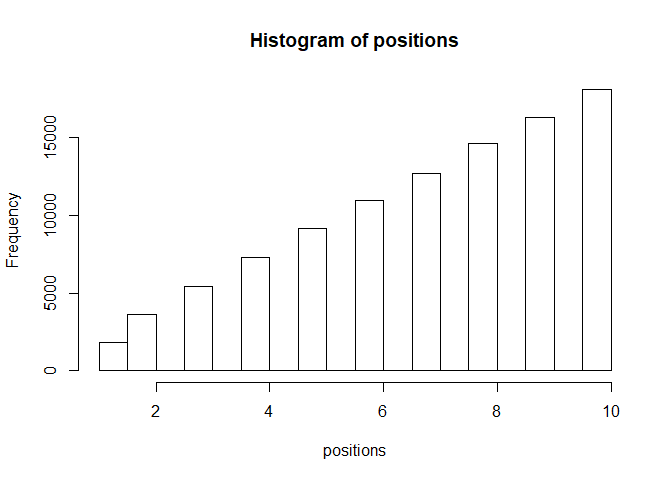<!-- -->

## 9.2. Metropolis, Gibbs, and Sadness
### 9.2.1. Gibbs sampling.
### 9.2.2. High-dimensional sadness.


```r
## R code 9.2
D <- 10
T <- 1e3
Y <- rmvnorm(T,rep(0,D),diag(D))
rad_dist <- function( Y ) sqrt( sum(Y^2) )
Rd <- sapply( 1:T , function(i) rad_dist( Y[i,] ) )
dens( Rd )
```

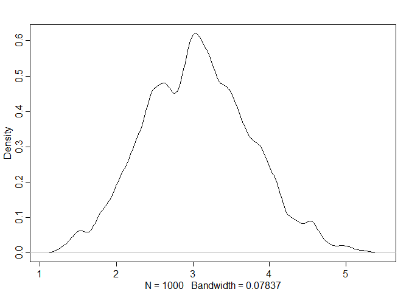<!-- -->

## 9.3. Hamiltonian Monte Carlo
### 9.3.1. Another parable.
### 9.3.2. Particles in space.


```r
## R code 9.3
# U needs to return neg-log-probability
myU4 <- function( q , a=0 , b=1 , k=0 , d=1 ) {
    muy <- q[1]
    mux <- q[2]
    U <- sum( dnorm(y,muy,1,log=TRUE) ) + sum( dnorm(x,mux,1,log=TRUE) ) +
        dnorm(muy,a,b,log=TRUE) + dnorm(mux,k,d,log=TRUE)
    return( -U )
}

## R code 9.4
# gradient function
# need vector of partial derivatives of U with respect to vector q
myU_grad4 <- function( q , a=0 , b=1 , k=0 , d=1 ) {
    muy <- q[1]
    mux <- q[2]
    G1 <- sum( y - muy ) + (a - muy)/b^2 #dU/dmuy
    G2 <- sum( x - mux ) + (k - mux)/d^2 #dU/dmuy
    return( c( -G1 , -G2 ) ) # negative bc energy is neg-log-prob
}
# test data
set.seed(7)
y <- rnorm(50)
x <- rnorm(50)
x <- as.numeric(scale(x))
y <- as.numeric(scale(y))

## R code 9.5
library(shape) # for fancy arrows
Q <- list()
Q$q <- c(-0.1,0.2)
pr <- 0.3
plot( NULL , ylab="muy" , xlab="mux" , xlim=c(-pr,pr) , ylim=c(-pr,pr) )
step <- 0.03
L <- 11 # 0.03/28 for U-turns --- 11 for working example
n_samples <- 4
path_col <- col.alpha("black",0.5)
points( Q$q[1] , Q$q[2] , pch=4 , col="black" )
for ( i in 1:n_samples ) {
    Q <- HMC2( myU4 , myU_grad4 , step , L , Q$q )
    if ( n_samples < 10 ) {
      for ( j in 1:L ) {
        K0 <- sum(Q$ptraj[j,]^2)/2 # kinetic energy
        lines( Q$traj[j:(j+1),1] , Q$traj[j:(j+1),2] , col=path_col , lwd=1+2*K0 )
      }
      points( Q$traj[1:L+1,] , pch=16 , col="white" , cex=0.35 )
      Arrows( Q$traj[L,1] , Q$traj[L,2] , Q$traj[L+1,1] , Q$traj[L+1,2] ,
          arr.length=0.35 , arr.adj = 0.7 )
      text( Q$traj[L+1,1] , Q$traj[L+1,2] , i , cex=0.8 , pos=4 , offset=0.4 )
    }
    points( Q$traj[L+1,1] , Q$traj[L+1,2] , pch=ifelse( Q$accept==1 , 16 , 1 ) ,
        col=ifelse( abs(Q$dH)>0.1 , "red" , "black" ) )
}
```

<!-- -->


```r
## R code 9.6
HMC2 <- function (U, grad_U, epsilon, L, current_q) {
  q = current_q
  p = rnorm(length(q),0,1) # random flick - p is momentum.
  current_p = p
  # Make a half step for momentum at the beginning
  p = p - epsilon * grad_U(q) / 2
  # initialize bookkeeping - saves trajectory
  qtraj <- matrix(NA,nrow=L+1,ncol=length(q))
  ptraj <- qtraj
  qtraj[1,] <- current_q
  ptraj[1,] <- p

## R code 9.7
  # Alternate full steps for position and momentum
  for ( i in 1:L ) {
    q = q + epsilon * p # Full step for the position
    # Make a full step for the momentum, except at end of trajectory
    if ( i!=L ) {
        p = p - epsilon * grad_U(q)
        ptraj[i+1,] <- p
    }
    qtraj[i+1,] <- q
  }

## R code 9.8
  # Make a half step for momentum at the end
  p = p - epsilon * grad_U(q) / 2
  ptraj[L+1,] <- p
  # Negate momentum at end of trajectory to make the proposal symmetric
  p = -p
  # Evaluate potential and kinetic energies at start and end of trajectory
  current_U = U(current_q)
  current_K = sum(current_p^2) / 2
  proposed_U = U(q)
  proposed_K = sum(p^2) / 2
  # Accept or reject the state at end of trajectory, returning either
  # the position at the end of the trajectory or the initial position
  accept <- 0
  if (runif(1) < exp(current_U-proposed_U+current_K-proposed_K)) {
    new_q <- q  # accept
    accept <- 1
  } else new_q <- current_q  # reject
  return(list( q=new_q, traj=qtraj, ptraj=ptraj, accept=accept ))
}
```

### 9.3.3. Limitations.

## 9.4. Easy HMC: ulam


```r
## R code 9.9
library(rethinking)
data(rugged)
d <- rugged
d$log_gdp <- log(d$rgdppc_2000)
dd <- d[ complete.cases(d$rgdppc_2000) , ]
dd$log_gdp_std <- dd$log_gdp / mean(dd$log_gdp)
dd$rugged_std <- dd$rugged / max(dd$rugged)
dd$cid <- ifelse( dd$cont_africa==1 , 1 , 2 )

## R code 9.10
m8.5 <- quap(
    alist(
        log_gdp_std ~ dnorm( mu , sigma ) ,
        mu <- a[cid] + b[cid]*( rugged_std - 0.215 ) ,
        a[cid] ~ dnorm( 1 , 0.1 ) ,
        b[cid] ~ dnorm( 0 , 0.3 ) ,
        sigma ~ dexp( 1 )
    ) ,
    data=dd )
precis( m8.5 , depth=2 )
```

```
##             mean          sd        5.5%       94.5%
## a[1]   0.8865640 0.015674552  0.86151302  0.91161495
## a[2]   1.0505666 0.009935872  1.03468714  1.06644602
## b[1]   0.1324981 0.074199237  0.01391344  0.25108286
## b[2]  -0.1426057 0.054745410 -0.23009945 -0.05511197
## sigma  0.1094859 0.005934188  0.10000194  0.11896990
```

### 9.4.1. Preparation.


```r
## R code 9.11
dat_slim <- list(
    log_gdp_std = dd$log_gdp_std,
    rugged_std = dd$rugged_std,
    cid = as.integer( dd$cid )
)
str(dat_slim)
```

```
## List of 3
##  $ log_gdp_std: num [1:170] 0.88 0.965 1.166 1.104 0.915 ...
##  $ rugged_std : num [1:170] 0.138 0.553 0.124 0.125 0.433 ...
##  $ cid        : int [1:170] 1 2 2 2 2 2 2 2 2 1 ...
```

```r
library(rstan)

## R code 9.12
m9.1 <- ulam(
    alist(
        log_gdp_std ~ dnorm( mu , sigma ) ,
        mu <- a[cid] + b[cid]*( rugged_std - 0.215 ) ,
        a[cid] ~ dnorm( 1 , 0.1 ) ,
        b[cid] ~ dnorm( 0 , 0.3 ) ,
        sigma ~ dexp( 1 )
    ) ,
    data=dat_slim , chains=1 )
```

```
## 
## SAMPLING FOR MODEL '4e638bc82c4247257e76c1202e0a46c7' NOW (CHAIN 1).
## Chain 1: 
## Chain 1: Gradient evaluation took 0 seconds
## Chain 1: 1000 transitions using 10 leapfrog steps per transition would take 0 seconds.
## Chain 1: Adjust your expectations accordingly!
## Chain 1: 
## Chain 1: 
## Chain 1: Iteration:   1 / 1000 [  0%]  (Warmup)
## Chain 1: Iteration: 100 / 1000 [ 10%]  (Warmup)
## Chain 1: Iteration: 200 / 1000 [ 20%]  (Warmup)
## Chain 1: Iteration: 300 / 1000 [ 30%]  (Warmup)
## Chain 1: Iteration: 400 / 1000 [ 40%]  (Warmup)
## Chain 1: Iteration: 500 / 1000 [ 50%]  (Warmup)
## Chain 1: Iteration: 501 / 1000 [ 50%]  (Sampling)
## Chain 1: Iteration: 600 / 1000 [ 60%]  (Sampling)
## Chain 1: Iteration: 700 / 1000 [ 70%]  (Sampling)
## Chain 1: Iteration: 800 / 1000 [ 80%]  (Sampling)
## Chain 1: Iteration: 900 / 1000 [ 90%]  (Sampling)
## Chain 1: Iteration: 1000 / 1000 [100%]  (Sampling)
## Chain 1: 
## Chain 1:  Elapsed Time: 0.07 seconds (Warm-up)
## Chain 1:                0.055 seconds (Sampling)
## Chain 1:                0.125 seconds (Total)
## Chain 1:
```

```r
## R code 9.13
precis( m9.1 , depth=2 )
```

```
##             mean          sd       5.5%       94.5%    n_eff      Rhat
## a[1]   0.8860276 0.015017334  0.8610820  0.90935448 611.9029 0.9992640
## a[2]   1.0507103 0.009962509  1.0346462  1.06597616 758.1026 0.9983919
## b[1]   0.1283696 0.069453611  0.0178113  0.23858296 383.5598 0.9991305
## b[2]  -0.1441684 0.054272764 -0.2330822 -0.05543733 651.4452 0.9987844
## sigma  0.1110400 0.005960409  0.1021757  0.12117579 693.2185 0.9997997
```

### 9.4.3. Sampling again, in parallel.


```r
## R code 9.14
m9.1 <- ulam(
    alist(
        log_gdp_std ~ dnorm( mu , sigma ) ,
        mu <- a[cid] + b[cid]*( rugged_std - 0.215 ) ,
        a[cid] ~ dnorm( 1 , 0.1 ) ,
        b[cid] ~ dnorm( 0 , 0.3 ) ,
        sigma ~ dexp( 1 )
    ) ,
    data=dat_slim , chains=4 , cores=4 , iter=1000 )
```

```
## recompiling to avoid crashing R session
```

```r
## R code 9.15
show( m9.1 )
```

```
## Hamiltonian Monte Carlo approximation
## 2000 samples from 4 chains
## 
## Sampling durations (seconds):
##         warmup sample total
## chain:1   0.10   0.07  0.17
## chain:2   0.19   0.11  0.30
## chain:3   0.11   0.08  0.19
## chain:4   0.09   0.06  0.15
## 
## Formula:
## log_gdp_std ~ dnorm(mu, sigma)
## mu <- a[cid] + b[cid] * (rugged_std - 0.215)
## a[cid] ~ dnorm(1, 0.1)
## b[cid] ~ dnorm(0, 0.3)
## sigma ~ dexp(1)
```

```r
## R code 9.16
precis( m9.1 , 2 )
```

```
##             mean          sd         5.5%       94.5%    n_eff      Rhat
## a[1]   0.8864428 0.016284165  0.859943580  0.91291113 2632.242 0.9986519
## a[2]   1.0507178 0.010446356  1.034351525  1.06743151 2894.188 1.0000595
## b[1]   0.1316973 0.077286606  0.004242543  0.25560170 2333.190 0.9998321
## b[2]  -0.1426273 0.056011176 -0.229962049 -0.05168892 2801.616 1.0007067
## sigma  0.1117562 0.006122426  0.102490248  0.12173577 2010.857 0.9996732
```

```r
## R code 9.17
pairs( m9.1 )
```

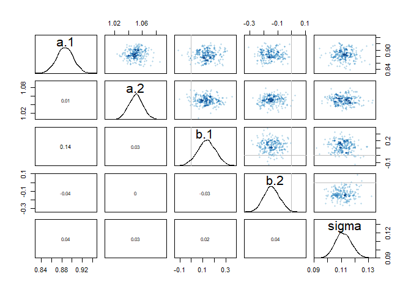<!-- -->

### 9.4.5. Checking the chain.

```r
## R code 9.18
traceplot( m9.1 )
trankplot( m9.1 , n_cols=2 )
```

<!-- --><!-- -->

## 9.5. Care and feeding of your Markov chain
### 9.5.1. How many samples do you need?
### 9.5.2. How many chains do you need?
### 9.5.3. Taming a wild chain.


```r
## R code 9.19
y <- c(1.000001,-1.000001)
set.seed(11)

m9.2 <- ulam(
    alist(
        y ~ dnorm( mu , sigma ) ,
        mu <- alpha ,
        alpha ~ dnorm( 0 , 1000 ) ,
        sigma ~ dexp( 0.0001 )
    ) ,
    data=list(y=y) , chains=2 )
```

```
## 
## SAMPLING FOR MODEL 'd26c527083e7eda89b17a8c2eccd6019' NOW (CHAIN 1).
## Chain 1: 
## Chain 1: Gradient evaluation took 0 seconds
## Chain 1: 1000 transitions using 10 leapfrog steps per transition would take 0 seconds.
## Chain 1: Adjust your expectations accordingly!
## Chain 1: 
## Chain 1: 
## Chain 1: Iteration:   1 / 1000 [  0%]  (Warmup)
## Chain 1: Iteration: 100 / 1000 [ 10%]  (Warmup)
## Chain 1: Iteration: 200 / 1000 [ 20%]  (Warmup)
## Chain 1: Iteration: 300 / 1000 [ 30%]  (Warmup)
## Chain 1: Iteration: 400 / 1000 [ 40%]  (Warmup)
## Chain 1: Iteration: 500 / 1000 [ 50%]  (Warmup)
## Chain 1: Iteration: 501 / 1000 [ 50%]  (Sampling)
## Chain 1: Iteration: 600 / 1000 [ 60%]  (Sampling)
## Chain 1: Iteration: 700 / 1000 [ 70%]  (Sampling)
## Chain 1: Iteration: 800 / 1000 [ 80%]  (Sampling)
## Chain 1: Iteration: 900 / 1000 [ 90%]  (Sampling)
## Chain 1: Iteration: 1000 / 1000 [100%]  (Sampling)
## Chain 1: 
## Chain 1:  Elapsed Time: 0.09 seconds (Warm-up)
## Chain 1:                0.349 seconds (Sampling)
## Chain 1:                0.439 seconds (Total)
## Chain 1: 
## 
## SAMPLING FOR MODEL 'd26c527083e7eda89b17a8c2eccd6019' NOW (CHAIN 2).
## Chain 2: 
## Chain 2: Gradient evaluation took 0 seconds
## Chain 2: 1000 transitions using 10 leapfrog steps per transition would take 0 seconds.
## Chain 2: Adjust your expectations accordingly!
## Chain 2: 
## Chain 2: 
## Chain 2: Iteration:   1 / 1000 [  0%]  (Warmup)
## Chain 2: Iteration: 100 / 1000 [ 10%]  (Warmup)
## Chain 2: Iteration: 200 / 1000 [ 20%]  (Warmup)
## Chain 2: Iteration: 300 / 1000 [ 30%]  (Warmup)
## Chain 2: Iteration: 400 / 1000 [ 40%]  (Warmup)
## Chain 2: Iteration: 500 / 1000 [ 50%]  (Warmup)
## Chain 2: Iteration: 501 / 1000 [ 50%]  (Sampling)
## Chain 2: Iteration: 600 / 1000 [ 60%]  (Sampling)
## Chain 2: Iteration: 700 / 1000 [ 70%]  (Sampling)
## Chain 2: Iteration: 800 / 1000 [ 80%]  (Sampling)
## Chain 2: Iteration: 900 / 1000 [ 90%]  (Sampling)
## Chain 2: Iteration: 1000 / 1000 [100%]  (Sampling)
## Chain 2: 
## Chain 2:  Elapsed Time: 0.117 seconds (Warm-up)
## Chain 2:                0.144 seconds (Sampling)
## Chain 2:                0.261 seconds (Total)
## Chain 2:
```

```
## Warning: There were 2 divergent transitions after warmup. Increasing adapt_delta above 0.95 may help. See
## http://mc-stan.org/misc/warnings.html#divergent-transitions-after-warmup
```

```
## Warning: There were 1 transitions after warmup that exceeded the maximum treedepth. Increase max_treedepth above 10. See
## http://mc-stan.org/misc/warnings.html#maximum-treedepth-exceeded
```

```
## Warning: Examine the pairs() plot to diagnose sampling problems
```

```
## Warning: The largest R-hat is 1.09, indicating chains have not mixed.
## Running the chains for more iterations may help. See
## http://mc-stan.org/misc/warnings.html#r-hat
```

```
## Warning: Bulk Effective Samples Size (ESS) is too low, indicating posterior means and medians may be unreliable.
## Running the chains for more iterations may help. See
## http://mc-stan.org/misc/warnings.html#bulk-ess
```

```
## Warning: Tail Effective Samples Size (ESS) is too low, indicating posterior variances and tail quantiles may be unreliable.
## Running the chains for more iterations may help. See
## http://mc-stan.org/misc/warnings.html#tail-ess
```

```r
## R code 9.20
precis( m9.2 )
```

```
##            mean        sd        5.5%     94.5%     n_eff     Rhat
## alpha  59.38425  394.4026 -334.724932  726.1444  78.40695 1.019956
## sigma 761.70657 2056.2837    5.714878 3209.5629 126.43502 1.009607
```

```r
pairs(m9.2@stanfit)
```

```
## Warning in KernSmooth::bkde2D(x, bandwidth = bandwidth, gridsize = nbin, :
## Binning grid too coarse for current (small) bandwidth: consider increasing
## 'gridsize'
```

```
## Warning in KernSmooth::bkde2D(x, bandwidth = bandwidth, gridsize = nbin, :
## Binning grid too coarse for current (small) bandwidth: consider increasing
## 'gridsize'

## Warning in KernSmooth::bkde2D(x, bandwidth = bandwidth, gridsize = nbin, :
## Binning grid too coarse for current (small) bandwidth: consider increasing
## 'gridsize'
```

<!-- -->

```r
traceplot(m9.2)
```

<!-- -->


```r
## R code 9.21
set.seed(11)
m9.3 <- ulam(
    alist(
        y ~ dnorm( mu , sigma ) ,
        mu <- alpha ,
        alpha ~ dnorm( 1 , 10 ) ,
        sigma ~ dexp( 1 )
    ) ,
    data=list(y=y) , chains=2 )
```

```
## 
## SAMPLING FOR MODEL '593afb1307e5b69f89a21ad207f22894' NOW (CHAIN 1).
## Chain 1: 
## Chain 1: Gradient evaluation took 0 seconds
## Chain 1: 1000 transitions using 10 leapfrog steps per transition would take 0 seconds.
## Chain 1: Adjust your expectations accordingly!
## Chain 1: 
## Chain 1: 
## Chain 1: Iteration:   1 / 1000 [  0%]  (Warmup)
## Chain 1: Iteration: 100 / 1000 [ 10%]  (Warmup)
## Chain 1: Iteration: 200 / 1000 [ 20%]  (Warmup)
## Chain 1: Iteration: 300 / 1000 [ 30%]  (Warmup)
## Chain 1: Iteration: 400 / 1000 [ 40%]  (Warmup)
## Chain 1: Iteration: 500 / 1000 [ 50%]  (Warmup)
## Chain 1: Iteration: 501 / 1000 [ 50%]  (Sampling)
## Chain 1: Iteration: 600 / 1000 [ 60%]  (Sampling)
## Chain 1: Iteration: 700 / 1000 [ 70%]  (Sampling)
## Chain 1: Iteration: 800 / 1000 [ 80%]  (Sampling)
## Chain 1: Iteration: 900 / 1000 [ 90%]  (Sampling)
## Chain 1: Iteration: 1000 / 1000 [100%]  (Sampling)
## Chain 1: 
## Chain 1:  Elapsed Time: 0.027 seconds (Warm-up)
## Chain 1:                0.022 seconds (Sampling)
## Chain 1:                0.049 seconds (Total)
## Chain 1: 
## 
## SAMPLING FOR MODEL '593afb1307e5b69f89a21ad207f22894' NOW (CHAIN 2).
## Chain 2: 
## Chain 2: Gradient evaluation took 0 seconds
## Chain 2: 1000 transitions using 10 leapfrog steps per transition would take 0 seconds.
## Chain 2: Adjust your expectations accordingly!
## Chain 2: 
## Chain 2: 
## Chain 2: Iteration:   1 / 1000 [  0%]  (Warmup)
## Chain 2: Iteration: 100 / 1000 [ 10%]  (Warmup)
## Chain 2: Iteration: 200 / 1000 [ 20%]  (Warmup)
## Chain 2: Iteration: 300 / 1000 [ 30%]  (Warmup)
## Chain 2: Iteration: 400 / 1000 [ 40%]  (Warmup)
## Chain 2: Iteration: 500 / 1000 [ 50%]  (Warmup)
## Chain 2: Iteration: 501 / 1000 [ 50%]  (Sampling)
## Chain 2: Iteration: 600 / 1000 [ 60%]  (Sampling)
## Chain 2: Iteration: 700 / 1000 [ 70%]  (Sampling)
## Chain 2: Iteration: 800 / 1000 [ 80%]  (Sampling)
## Chain 2: Iteration: 900 / 1000 [ 90%]  (Sampling)
## Chain 2: Iteration: 1000 / 1000 [100%]  (Sampling)
## Chain 2: 
## Chain 2:  Elapsed Time: 0.026 seconds (Warm-up)
## Chain 2:                0.027 seconds (Sampling)
## Chain 2:                0.053 seconds (Total)
## Chain 2:
```

```r
precis( m9.3 )
```

```
##             mean        sd       5.5%    94.5%    n_eff     Rhat
## alpha -0.1434589 1.2328258 -2.1110053 1.619507 275.6055 1.000705
## sigma  1.5653786 0.8405426  0.6544161 3.185414 215.5023 1.003858
```

```r
pairs(m9.3@stanfit)
```

<!-- -->

```r
traceplot(m9.3)
```

<!-- -->

### 9.5.4. Non-identifiable parameters.


```r
## R code 9.22
set.seed(41)
y <- rnorm( 100 , mean=0 , sd=1 )

## R code 9.23
m9.4 <- ulam(
    alist(
        y ~ dnorm( mu , sigma ) ,
        mu <- a1 + a2 ,
        a1 ~ dnorm( 0 , 1000 ),
        a2 ~ dnorm( 0 , 1000 ),
        sigma ~ dexp( 1 )
    ) ,
    data=list(y=y) , chains=2 )
```

```
## 
## SAMPLING FOR MODEL 'e6372181749abf126ca67665f3f2df39' NOW (CHAIN 1).
## Chain 1: 
## Chain 1: Gradient evaluation took 0 seconds
## Chain 1: 1000 transitions using 10 leapfrog steps per transition would take 0 seconds.
## Chain 1: Adjust your expectations accordingly!
## Chain 1: 
## Chain 1: 
## Chain 1: Iteration:   1 / 1000 [  0%]  (Warmup)
## Chain 1: Iteration: 100 / 1000 [ 10%]  (Warmup)
## Chain 1: Iteration: 200 / 1000 [ 20%]  (Warmup)
## Chain 1: Iteration: 300 / 1000 [ 30%]  (Warmup)
## Chain 1: Iteration: 400 / 1000 [ 40%]  (Warmup)
## Chain 1: Iteration: 500 / 1000 [ 50%]  (Warmup)
## Chain 1: Iteration: 501 / 1000 [ 50%]  (Sampling)
## Chain 1: Iteration: 600 / 1000 [ 60%]  (Sampling)
## Chain 1: Iteration: 700 / 1000 [ 70%]  (Sampling)
## Chain 1: Iteration: 800 / 1000 [ 80%]  (Sampling)
## Chain 1: Iteration: 900 / 1000 [ 90%]  (Sampling)
## Chain 1: Iteration: 1000 / 1000 [100%]  (Sampling)
## Chain 1: 
## Chain 1:  Elapsed Time: 1.788 seconds (Warm-up)
## Chain 1:                2.145 seconds (Sampling)
## Chain 1:                3.933 seconds (Total)
## Chain 1: 
## 
## SAMPLING FOR MODEL 'e6372181749abf126ca67665f3f2df39' NOW (CHAIN 2).
## Chain 2: 
## Chain 2: Gradient evaluation took 0 seconds
## Chain 2: 1000 transitions using 10 leapfrog steps per transition would take 0 seconds.
## Chain 2: Adjust your expectations accordingly!
## Chain 2: 
## Chain 2: 
## Chain 2: Iteration:   1 / 1000 [  0%]  (Warmup)
## Chain 2: Iteration: 100 / 1000 [ 10%]  (Warmup)
## Chain 2: Iteration: 200 / 1000 [ 20%]  (Warmup)
## Chain 2: Iteration: 300 / 1000 [ 30%]  (Warmup)
## Chain 2: Iteration: 400 / 1000 [ 40%]  (Warmup)
## Chain 2: Iteration: 500 / 1000 [ 50%]  (Warmup)
## Chain 2: Iteration: 501 / 1000 [ 50%]  (Sampling)
## Chain 2: Iteration: 600 / 1000 [ 60%]  (Sampling)
## Chain 2: Iteration: 700 / 1000 [ 70%]  (Sampling)
## Chain 2: Iteration: 800 / 1000 [ 80%]  (Sampling)
## Chain 2: Iteration: 900 / 1000 [ 90%]  (Sampling)
## Chain 2: Iteration: 1000 / 1000 [100%]  (Sampling)
## Chain 2: 
## Chain 2:  Elapsed Time: 1.986 seconds (Warm-up)
## Chain 2:                3.322 seconds (Sampling)
## Chain 2:                5.308 seconds (Total)
## Chain 2:
```

```
## Warning: There were 850 transitions after warmup that exceeded the maximum treedepth. Increase max_treedepth above 10. See
## http://mc-stan.org/misc/warnings.html#maximum-treedepth-exceeded
```

```
## Warning: Examine the pairs() plot to diagnose sampling problems
```

```
## Warning: The largest R-hat is 1.44, indicating chains have not mixed.
## Running the chains for more iterations may help. See
## http://mc-stan.org/misc/warnings.html#r-hat
```

```
## Warning: Bulk Effective Samples Size (ESS) is too low, indicating posterior means and medians may be unreliable.
## Running the chains for more iterations may help. See
## http://mc-stan.org/misc/warnings.html#bulk-ess
```

```
## Warning: Tail Effective Samples Size (ESS) is too low, indicating posterior variances and tail quantiles may be unreliable.
## Running the chains for more iterations may help. See
## http://mc-stan.org/misc/warnings.html#tail-ess
```

```r
precis( m9.4 )
```

```
##              mean           sd          5.5%       94.5%    n_eff     Rhat
## a1    -647.972890 246.15123408 -1031.3053795 -289.083627 1.977311 1.641353
## a2     648.165109 246.15155921   289.2819267 1031.524094 1.977290 1.641338
## sigma    1.026928   0.07054863     0.9272982    1.165109 4.069786 1.444470
```

```r
traceplot(m9.4)
```

<!-- -->

```r
## R code 9.23
m9.4.2 <- ulam(
    alist(
        y ~ dnorm( mu , sigma ) ,
        mu <- a1 + a2 ,
        a1 ~ dnorm( 0 , 1000 ),
        a2 ~ dnorm( 0 , 1000 ),
        sigma ~ dexp( 1 )
    ) ,
    data=list(y=y) , chains=2 , control = list(max_treedepth=15))
```

```
## recompiling to avoid crashing R session
```

```
## 
## SAMPLING FOR MODEL 'e6372181749abf126ca67665f3f2df39' NOW (CHAIN 1).
## Chain 1: 
## Chain 1: Gradient evaluation took 0 seconds
## Chain 1: 1000 transitions using 10 leapfrog steps per transition would take 0 seconds.
## Chain 1: Adjust your expectations accordingly!
## Chain 1: 
## Chain 1: 
## Chain 1: Iteration:   1 / 1000 [  0%]  (Warmup)
## Chain 1: Iteration: 100 / 1000 [ 10%]  (Warmup)
## Chain 1: Iteration: 200 / 1000 [ 20%]  (Warmup)
## Chain 1: Iteration: 300 / 1000 [ 30%]  (Warmup)
## Chain 1: Iteration: 400 / 1000 [ 40%]  (Warmup)
## Chain 1: Iteration: 500 / 1000 [ 50%]  (Warmup)
## Chain 1: Iteration: 501 / 1000 [ 50%]  (Sampling)
## Chain 1: Iteration: 600 / 1000 [ 60%]  (Sampling)
## Chain 1: Iteration: 700 / 1000 [ 70%]  (Sampling)
## Chain 1: Iteration: 800 / 1000 [ 80%]  (Sampling)
## Chain 1: Iteration: 900 / 1000 [ 90%]  (Sampling)
## Chain 1: Iteration: 1000 / 1000 [100%]  (Sampling)
## Chain 1: 
## Chain 1:  Elapsed Time: 36.498 seconds (Warm-up)
## Chain 1:                44.999 seconds (Sampling)
## Chain 1:                81.497 seconds (Total)
## Chain 1: 
## 
## SAMPLING FOR MODEL 'e6372181749abf126ca67665f3f2df39' NOW (CHAIN 2).
## Chain 2: 
## Chain 2: Gradient evaluation took 0 seconds
## Chain 2: 1000 transitions using 10 leapfrog steps per transition would take 0 seconds.
## Chain 2: Adjust your expectations accordingly!
## Chain 2: 
## Chain 2: 
## Chain 2: Iteration:   1 / 1000 [  0%]  (Warmup)
## Chain 2: Iteration: 100 / 1000 [ 10%]  (Warmup)
## Chain 2: Iteration: 200 / 1000 [ 20%]  (Warmup)
## Chain 2: Iteration: 300 / 1000 [ 30%]  (Warmup)
## Chain 2: Iteration: 400 / 1000 [ 40%]  (Warmup)
## Chain 2: Iteration: 500 / 1000 [ 50%]  (Warmup)
## Chain 2: Iteration: 501 / 1000 [ 50%]  (Sampling)
## Chain 2: Iteration: 600 / 1000 [ 60%]  (Sampling)
## Chain 2: Iteration: 700 / 1000 [ 70%]  (Sampling)
## Chain 2: Iteration: 800 / 1000 [ 80%]  (Sampling)
## Chain 2: Iteration: 900 / 1000 [ 90%]  (Sampling)
## Chain 2: Iteration: 1000 / 1000 [100%]  (Sampling)
## Chain 2: 
## Chain 2:  Elapsed Time: 32.096 seconds (Warm-up)
## Chain 2:                47.802 seconds (Sampling)
## Chain 2:                79.898 seconds (Total)
## Chain 2:
```

```
## Warning: There were 279 transitions after warmup that exceeded the maximum treedepth. Increase max_treedepth above 15. See
## http://mc-stan.org/misc/warnings.html#maximum-treedepth-exceeded
```

```
## Warning: Examine the pairs() plot to diagnose sampling problems
```

```
## Warning: Bulk Effective Samples Size (ESS) is too low, indicating posterior means and medians may be unreliable.
## Running the chains for more iterations may help. See
## http://mc-stan.org/misc/warnings.html#bulk-ess
```

```r
precis( m9.4.2 )
```

```
##            mean           sd          5.5%       94.5%    n_eff     Rhat
## a1    -2.846370 714.87772229 -1038.0764013 1146.202166 173.0693 1.007198
## a2     3.036046 714.87616587 -1145.9703863 1038.176004 173.0738 1.007199
## sigma  1.032415   0.07976383     0.9095945    1.160942 326.9122 1.002502
```

```r
traceplot(m9.4.2)
```

<!-- -->

```r
## R code 9.24
m9.5 <- ulam(
    alist(
        y ~ dnorm( mu , sigma ) ,
        mu <- a1 + a2 ,
        a1 ~ dnorm( 0 , 10 ),
        a2 ~ dnorm( 0 , 10 ),
        sigma ~ dexp( 1 )
    ) ,
    data=list(y=y) , chains=2 )
```

```
## 
## SAMPLING FOR MODEL '60743fdda5f692fb7902c70d7f6403b7' NOW (CHAIN 1).
## Chain 1: 
## Chain 1: Gradient evaluation took 0 seconds
## Chain 1: 1000 transitions using 10 leapfrog steps per transition would take 0 seconds.
## Chain 1: Adjust your expectations accordingly!
## Chain 1: 
## Chain 1: 
## Chain 1: Iteration:   1 / 1000 [  0%]  (Warmup)
## Chain 1: Iteration: 100 / 1000 [ 10%]  (Warmup)
## Chain 1: Iteration: 200 / 1000 [ 20%]  (Warmup)
## Chain 1: Iteration: 300 / 1000 [ 30%]  (Warmup)
## Chain 1: Iteration: 400 / 1000 [ 40%]  (Warmup)
## Chain 1: Iteration: 500 / 1000 [ 50%]  (Warmup)
## Chain 1: Iteration: 501 / 1000 [ 50%]  (Sampling)
## Chain 1: Iteration: 600 / 1000 [ 60%]  (Sampling)
## Chain 1: Iteration: 700 / 1000 [ 70%]  (Sampling)
## Chain 1: Iteration: 800 / 1000 [ 80%]  (Sampling)
## Chain 1: Iteration: 900 / 1000 [ 90%]  (Sampling)
## Chain 1: Iteration: 1000 / 1000 [100%]  (Sampling)
## Chain 1: 
## Chain 1:  Elapsed Time: 0.523 seconds (Warm-up)
## Chain 1:                0.617 seconds (Sampling)
## Chain 1:                1.14 seconds (Total)
## Chain 1: 
## 
## SAMPLING FOR MODEL '60743fdda5f692fb7902c70d7f6403b7' NOW (CHAIN 2).
## Chain 2: 
## Chain 2: Gradient evaluation took 0 seconds
## Chain 2: 1000 transitions using 10 leapfrog steps per transition would take 0 seconds.
## Chain 2: Adjust your expectations accordingly!
## Chain 2: 
## Chain 2: 
## Chain 2: Iteration:   1 / 1000 [  0%]  (Warmup)
## Chain 2: Iteration: 100 / 1000 [ 10%]  (Warmup)
## Chain 2: Iteration: 200 / 1000 [ 20%]  (Warmup)
## Chain 2: Iteration: 300 / 1000 [ 30%]  (Warmup)
## Chain 2: Iteration: 400 / 1000 [ 40%]  (Warmup)
## Chain 2: Iteration: 500 / 1000 [ 50%]  (Warmup)
## Chain 2: Iteration: 501 / 1000 [ 50%]  (Sampling)
## Chain 2: Iteration: 600 / 1000 [ 60%]  (Sampling)
## Chain 2: Iteration: 700 / 1000 [ 70%]  (Sampling)
## Chain 2: Iteration: 800 / 1000 [ 80%]  (Sampling)
## Chain 2: Iteration: 900 / 1000 [ 90%]  (Sampling)
## Chain 2: Iteration: 1000 / 1000 [100%]  (Sampling)
## Chain 2: 
## Chain 2:  Elapsed Time: 0.71 seconds (Warm-up)
## Chain 2:                0.734 seconds (Sampling)
## Chain 2:                1.444 seconds (Total)
## Chain 2:
```

```
## Warning: There were 1 transitions after warmup that exceeded the maximum treedepth. Increase max_treedepth above 10. See
## http://mc-stan.org/misc/warnings.html#maximum-treedepth-exceeded
```

```
## Warning: Examine the pairs() plot to diagnose sampling problems
```

```r
precis( m9.5 )
```

```
##              mean         sd        5.5%     94.5%    n_eff     Rhat
## a1     0.22938288 6.55984510 -10.5266256 10.654199 341.1499 1.003040
## a2    -0.04112721 6.55712824 -10.4846416 10.690694 341.9746 1.003088
## sigma  1.04469079 0.06887638   0.9412379  1.157347 271.1016 1.006299
```

```r
traceplot(m9.5)
```

<!-- -->

## 9.6. Summary

## 9.7. Practice
### Easy.
#### 8E1. Which of the following is a requirement of the simple Metropolis algorithm?
#### (1) The parameters must be discrete.
> No. The parameter values can take on a continuous range of values as usual
#### (2) The likelihood function must be Gaussian.
> No.
#### (3) The proposal distribution must be symmetric.
> Yes. The Metropolis algorithm works whenever the probability of proposing a jump to B from A is equal to the probability of proposing A from B, when the proposal distribution is symmetric.

#### 8E2. Gibbs sampling is more efficient than the Metropolis algorithm. How does it achieve this extra efficiency? Are there any limitations to the Gibbs sampling strategy?
>  The improvement arises from adaptive proposals in which the distribution of proposed parameter values adjusts itself intelligently, depending upon the parameter values at the moment.

#### 8E3. Which sort of parameters can Hamiltonian Monte Carlo not handle? Can you explain why?

> HMC requires continuous parameters. It can’t glide through a discrete parameter.

### 8E4. Explain the diff erence between the effective number of samples, n_eff as calculated by Stan, and the actual number of samples.

> The effective number of samples is an estimate of the number of independent samples from the posterior distribution. Ideal samples should be entirely uncorrelated. Markov chains are typically autocorrelated, so that sequential samples are not entirely independent. Stan chains tend to be less autocorrelated than those produced by other engines, but there is always some autocorrelation. Stan provides an estimate of effective number of samples as n_eff.

#### 8M1. Re-estimate the terrain ruggedness model from the chapter, but now using a uniform prior and an exponential prior for the standard deviation, sigma. The uniform prior should be dunif(0,10) and the exponential should be dexp(1). Do the different priors have any detectible influence on the posterior distribution?


```r
## R code 9.9
library(rethinking)
data(rugged)
d <- rugged
d$log_gdp <- log(d$rgdppc_2000)
dd <- d[ complete.cases(d$rgdppc_2000) , ]
dd$log_gdp_std <- dd$log_gdp / mean(dd$log_gdp)
dd$rugged_std <- dd$rugged / max(dd$rugged)
dd$cid <- ifelse( dd$cont_africa==1 , 1 , 2 )
```


```r
## R code 9.11
dat_slim <- list(
    log_gdp_std = dd$log_gdp_std,
    rugged_std = dd$rugged_std,
    cid = as.integer( dd$cid )
)
str(dat_slim)
```

```
## List of 3
##  $ log_gdp_std: num [1:170] 0.88 0.965 1.166 1.104 0.915 ...
##  $ rugged_std : num [1:170] 0.138 0.553 0.124 0.125 0.433 ...
##  $ cid        : int [1:170] 1 2 2 2 2 2 2 2 2 1 ...
```

```r
library(rstan)

## R code 9.14
m9.1 <- ulam(
    alist(
        log_gdp_std ~ dnorm( mu , sigma ) ,
        mu <- a[cid] + b[cid]*( rugged_std - 0.215 ) ,
        a[cid] ~ dnorm( 1 , 0.1 ) ,
        b[cid] ~ dnorm( 0 , 0.3 ) ,
        sigma ~ dexp( 1 )
    ) ,
    data=dat_slim , chains=4 , cores=4 , iter=1000 )
```

```
## recompiling to avoid crashing R session
```

```r
## R code 9.15
show( m9.1 )
```

```
## Hamiltonian Monte Carlo approximation
## 2000 samples from 4 chains
## 
## Sampling durations (seconds):
##         warmup sample total
## chain:1   0.14   0.10  0.25
## chain:2   0.12   0.13  0.24
## chain:3   0.15   0.10  0.25
## chain:4   0.12   0.08  0.19
## 
## Formula:
## log_gdp_std ~ dnorm(mu, sigma)
## mu <- a[cid] + b[cid] * (rugged_std - 0.215)
## a[cid] ~ dnorm(1, 0.1)
## b[cid] ~ dnorm(0, 0.3)
## sigma ~ dexp(1)
```

```r
## R code 9.16
precis( m9.1 , 2 )
```

```
##             mean          sd         5.5%       94.5%    n_eff      Rhat
## a[1]   0.8867219 0.016307649  0.860622815  0.91335040 2302.490 1.0004417
## a[2]   1.0504167 0.009758093  1.034544049  1.06591461 3491.217 0.9984662
## b[1]   0.1345032 0.077765350  0.007548392  0.25534822 2312.001 0.9992399
## b[2]  -0.1439613 0.057818853 -0.232479077 -0.05151766 2565.620 1.0002569
## sigma  0.1117693 0.006277021  0.102286132  0.12216952 2233.835 0.9993693
```

```r
## R code 9.17
pairs( m9.1 )
```

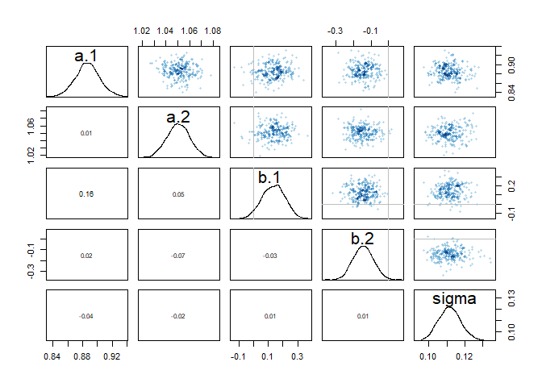<!-- -->

```r
## R code 9.18
traceplot( m9.1 )

trankplot( m9.1 , n_cols=2 )
```

<!-- --><!-- -->


```r
## R code 9.14
m9.1_unif <- ulam(
    alist(
        log_gdp_std ~ dnorm( mu , sigma ) ,
        mu <- a[cid] + b[cid]*( rugged_std - 0.215 ) ,
        a[cid] ~ dnorm( 1 , 0.1 ) ,
        b[cid] ~ dnorm( 0 , 0.3 ) ,
        sigma ~ dunif(0,10)
    ) ,
    data=dat_slim , chains=4 , cores=4 , iter=1000 )

## R code 9.15
show( m9.1_unif )
```

```
## Hamiltonian Monte Carlo approximation
## 2000 samples from 4 chains
## 
## Sampling durations (seconds):
##         warmup sample total
## chain:1   0.21   0.12  0.33
## chain:2   0.09   0.06  0.15
## chain:3   0.12   0.08  0.19
## chain:4   0.19   0.23  0.42
## 
## Formula:
## log_gdp_std ~ dnorm(mu, sigma)
## mu <- a[cid] + b[cid] * (rugged_std - 0.215)
## a[cid] ~ dnorm(1, 0.1)
## b[cid] ~ dnorm(0, 0.3)
## sigma ~ dunif(0, 10)
```

```r
## R code 9.16
precis( m9.1_unif , 2 )
```

```
##             mean          sd        5.5%       94.5%    n_eff      Rhat
## a[1]   0.8865367 0.015571510  0.86194764  0.91140468 2978.485 0.9998775
## a[2]   1.0508401 0.010418194  1.03440501  1.06771557 3368.347 0.9990657
## b[1]   0.1340269 0.076843348  0.01379107  0.25762209 2633.300 1.0006035
## b[2]  -0.1432294 0.055674470 -0.23073697 -0.05346043 2567.353 0.9998971
## sigma  0.1113296 0.006385865  0.10148157  0.12185025 2517.391 0.9990316
```

```r
## R code 9.17
pairs( m9.1_unif )
```

<!-- -->

```r
## R code 9.18
traceplot( m9.1_unif )

trankplot( m9.1_unif , n_cols=2 )
```

<!-- --><!-- -->


```r
## R code 9.14
m9.1_cauchy <- ulam(
    alist(
        log_gdp_std ~ dnorm( mu , sigma ) ,
        mu <- a[cid] + b[cid]*( rugged_std - 0.215 ) ,
        a[cid] ~ dnorm( 1 , 0.1 ) ,
        b[cid] ~ dnorm( 0 , 0.3 ) ,
        sigma ~ dcauchy( 0, 1 )
    ) ,
    data=dat_slim , chains=4 , cores=4 , iter=1000 )

## R code 9.15
show( m9.1_cauchy )
```

```
## Hamiltonian Monte Carlo approximation
## 2000 samples from 4 chains
## 
## Sampling durations (seconds):
##         warmup sample total
## chain:1   0.12   0.06  0.17
## chain:2   0.12   0.08  0.20
## chain:3   0.10   0.08  0.17
## chain:4   0.12   0.07  0.19
## 
## Formula:
## log_gdp_std ~ dnorm(mu, sigma)
## mu <- a[cid] + b[cid] * (rugged_std - 0.215)
## a[cid] ~ dnorm(1, 0.1)
## b[cid] ~ dnorm(0, 0.3)
## sigma ~ dcauchy(0, 1)
```

```r
## R code 9.16
precis( m9.1_cauchy , 2 )
```

```
##             mean          sd        5.5%       94.5%    n_eff      Rhat
## a[1]   0.8870365 0.016003676  0.86137419  0.91230545 2554.909 1.0002880
## a[2]   1.0503319 0.010414065  1.03357276  1.06635822 2974.255 0.9986433
## b[1]   0.1326777 0.075274721  0.01025123  0.25354994 2433.469 0.9995088
## b[2]  -0.1423994 0.053971878 -0.22826566 -0.05675017 2253.079 0.9993371
## sigma  0.1116418 0.005944596  0.10239730  0.12166933 3242.132 1.0005287
```

```r
## R code 9.17
pairs( m9.1_cauchy )
```

<!-- -->

```r
## R code 9.18
traceplot( m9.1_cauchy )

trankplot( m9.1_cauchy , n_cols=2 )
```

<!-- -->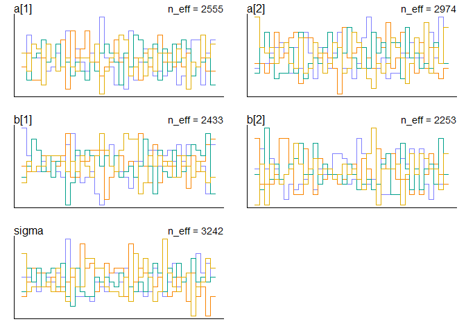<!-- -->


#### 8M2. The Cauchy and exponential priors from the terrain ruggedness model are very weak. They can be made more informative by reducing their scale. Compare the dcauchy and dexp priors for progressively smaller values of the scaling parameter. As these priors become stronger, how does each infl uence the posterior distribution?


```r
## R code 9.14
m9.1_0.1 <- ulam(
    alist(
        log_gdp_std ~ dnorm( mu , sigma ) ,
        mu <- a[cid] + b[cid]*( rugged_std - 0.215 ) ,
        a[cid] ~ dnorm( 1 , 0.1 ) ,
        b[cid] ~ dnorm( 0 , 0.3 ) ,
        sigma ~ dexp( 0.1 )
    ) ,
    data=dat_slim , chains=4 , cores=4 , iter=1000 )

## R code 9.15
show( m9.1_0.1 )
```

```
## Hamiltonian Monte Carlo approximation
## 2000 samples from 4 chains
## 
## Sampling durations (seconds):
##         warmup sample total
## chain:1   0.10   0.10  0.20
## chain:2   0.08   0.08  0.15
## chain:3   0.10   0.08  0.17
## chain:4   0.16   0.10  0.26
## 
## Formula:
## log_gdp_std ~ dnorm(mu, sigma)
## mu <- a[cid] + b[cid] * (rugged_std - 0.215)
## a[cid] ~ dnorm(1, 0.1)
## b[cid] ~ dnorm(0, 0.3)
## sigma ~ dexp(0.1)
```

```r
## R code 9.16
precis( m9.1_0.1 , 2 )
```

```
##             mean          sd        5.5%       94.5%    n_eff      Rhat
## a[1]   0.8861983 0.015798352  0.86161732  0.91173744 2365.583 0.9996843
## a[2]   1.0508876 0.010369200  1.03417996  1.06774408 3163.802 0.9998937
## b[1]   0.1287138 0.074444116  0.01234143  0.24914922 2183.802 1.0014008
## b[2]  -0.1430335 0.057359642 -0.23588839 -0.05239179 2934.495 0.9997149
## sigma  0.1115126 0.006180425  0.10216103  0.12196574 2620.802 1.0012187
```

```r
## R code 9.17
pairs( m9.1_0.1 )
```

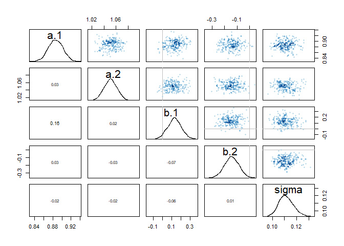<!-- -->

```r
## R code 9.18
traceplot( m9.1_0.1 )

trankplot( m9.1_0.1 , n_cols=2 )
```

<!-- --><!-- -->


```r
## R code 9.14
m9.1_0.01 <- ulam(
    alist(
        log_gdp_std ~ dnorm( mu , sigma ) ,
        mu <- a[cid] + b[cid]*( rugged_std - 0.215 ) ,
        a[cid] ~ dnorm( 1 , 0.1 ) ,
        b[cid] ~ dnorm( 0 , 0.3 ) ,
        sigma ~ dexp( 0.01 )
    ) ,
    data=dat_slim , chains=4 , cores=4 , iter=1000 )

## R code 9.15
show( m9.1_0.01 )
```

```
## Hamiltonian Monte Carlo approximation
## 2000 samples from 4 chains
## 
## Sampling durations (seconds):
##         warmup sample total
## chain:1   0.15   0.15  0.30
## chain:2   0.13   0.12  0.26
## chain:3   0.10   0.08  0.18
## chain:4   0.09   0.07  0.16
## 
## Formula:
## log_gdp_std ~ dnorm(mu, sigma)
## mu <- a[cid] + b[cid] * (rugged_std - 0.215)
## a[cid] ~ dnorm(1, 0.1)
## b[cid] ~ dnorm(0, 0.3)
## sigma ~ dexp(0.01)
```

```r
## R code 9.16
precis( m9.1_0.01 , 2 )
```

```
##             mean         sd         5.5%       94.5%    n_eff      Rhat
## a[1]   0.8864790 0.01562514  0.861124513  0.91074374 2825.296 0.9990707
## a[2]   1.0505454 0.01029437  1.034339337  1.06700147 3592.879 0.9987981
## b[1]   0.1294557 0.07532686  0.009776612  0.24764555 1988.290 1.0009870
## b[2]  -0.1442739 0.05609617 -0.231566389 -0.05554782 2642.989 0.9993952
## sigma  0.1116129 0.00577947  0.102643469  0.12108509 2423.820 0.9982919
```

```r
## R code 9.17
pairs( m9.1_0.01 )
```

<!-- -->

```r
## R code 9.18
traceplot( m9.1_0.01 )

trankplot( m9.1_0.01 , n_cols=2 )
```

<!-- --><!-- -->


```r
## R code 9.14
m9.1_cauchy_0.1 <- ulam(
    alist(
        log_gdp_std ~ dnorm( mu , sigma ) ,
        mu <- a[cid] + b[cid]*( rugged_std - 0.215 ) ,
        a[cid] ~ dnorm( 1 , 0.1 ) ,
        b[cid] ~ dnorm( 0 , 0.3 ) ,
        sigma ~ dcauchy( 0, 0.1 )
    ) ,
    data=dat_slim , chains=4 , cores=4 , iter=1000 )

## R code 9.15
show( m9.1_cauchy_0.1 )
```

```
## Hamiltonian Monte Carlo approximation
## 2000 samples from 4 chains
## 
## Sampling durations (seconds):
##         warmup sample total
## chain:1   0.14   0.08  0.22
## chain:2   0.13   0.07  0.20
## chain:3   0.15   0.09  0.24
## chain:4   0.11   0.08  0.20
## 
## Formula:
## log_gdp_std ~ dnorm(mu, sigma)
## mu <- a[cid] + b[cid] * (rugged_std - 0.215)
## a[cid] ~ dnorm(1, 0.1)
## b[cid] ~ dnorm(0, 0.3)
## sigma ~ dcauchy(0, 0.1)
```

```r
## R code 9.16
precis( m9.1_cauchy_0.1 , 2 )
```

```
##             mean          sd        5.5%       94.5%    n_eff      Rhat
## a[1]   0.8870086 0.016004272  0.86208402  0.91216762 2407.842 1.0000762
## a[2]   1.0506630 0.009873566  1.03456284  1.06682031 3522.824 0.9996252
## b[1]   0.1311461 0.075189003  0.01276021  0.25067437 2411.082 0.9986032
## b[2]  -0.1443528 0.054760891 -0.23347613 -0.06033243 2378.073 0.9987410
## sigma  0.1110936 0.006231780  0.10193122  0.12123864 3286.359 0.9991018
```

```r
## R code 9.17
pairs( m9.1_cauchy_0.1 )
```

<!-- -->

```r
## R code 9.18
traceplot( m9.1_cauchy_0.1 )

trankplot( m9.1_cauchy_0.1 , n_cols=2 )
```

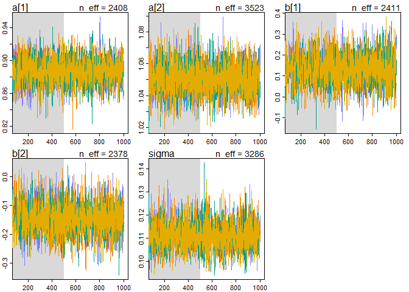<!-- --><!-- -->


```r
## R code 9.14
m9.1_cauchy_0.01 <- ulam(
    alist(
        log_gdp_std ~ dnorm( mu , sigma ) ,
        mu <- a[cid] + b[cid]*( rugged_std - 0.215 ) ,
        a[cid] ~ dnorm( 1 , 0.1 ) ,
        b[cid] ~ dnorm( 0 , 0.3 ) ,
        sigma ~ dcauchy( 0, 0.01 )
    ) ,
    data=dat_slim , chains=4 , cores=4 , iter=1000 )

## R code 9.15
show( m9.1_cauchy_0.01 )
```

```
## Hamiltonian Monte Carlo approximation
## 2000 samples from 4 chains
## 
## Sampling durations (seconds):
##         warmup sample total
## chain:1   0.12   0.07  0.19
## chain:2   0.10   0.06  0.17
## chain:3   0.14   0.08  0.23
## chain:4   0.11   0.06  0.16
## 
## Formula:
## log_gdp_std ~ dnorm(mu, sigma)
## mu <- a[cid] + b[cid] * (rugged_std - 0.215)
## a[cid] ~ dnorm(1, 0.1)
## b[cid] ~ dnorm(0, 0.3)
## sigma ~ dcauchy(0, 0.01)
```

```r
## R code 9.16
precis( m9.1_cauchy_0.01 , 2 )
```

```
##             mean          sd         5.5%       94.5%    n_eff      Rhat
## a[1]   0.8869167 0.016588620  0.860191068  0.91289639 2263.161 0.9990138
## a[2]   1.0503730 0.010395900  1.033351418  1.06647246 2852.642 0.9998075
## b[1]   0.1335435 0.078974433  0.005217984  0.25829415 2357.423 0.9990111
## b[2]  -0.1427813 0.056034566 -0.233934212 -0.05476347 2520.325 0.9994278
## sigma  0.1111945 0.006281844  0.101635355  0.12198727 2730.227 0.9998560
```

```r
## R code 9.17
pairs( m9.1_cauchy_0.01 )
```

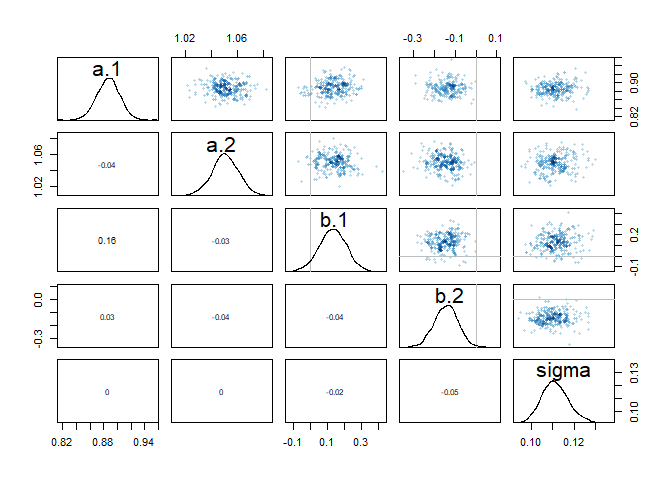<!-- -->

```r
## R code 9.18
traceplot( m9.1_cauchy_0.01 )

trankplot( m9.1_cauchy_0.01 , n_cols=2 )
```

<!-- --><!-- -->

### 8M3. Re-estimate one of the Stan models from the chapter, but at different numbers of warmup iterations. Be sure to use the same number of sampling iterations in each case. Compare the n_eff values. How much warmup is enough?


```r
## R code 9.14
m9.1 <- ulam(
    alist(
        log_gdp_std ~ dnorm( mu , sigma ) ,
        mu <- a[cid] + b[cid]*( rugged_std - 0.215 ) ,
        a[cid] ~ dnorm( 1 , 0.1 ) ,
        b[cid] ~ dnorm( 0 , 0.3 ) ,
        sigma ~ dexp( 1 )
    ) ,
    data=dat_slim , chains=4 , cores=4 , iter=1000 )
```

```
## recompiling to avoid crashing R session
```

```r
## R code 9.15
show( m9.1 )
```

```
## Hamiltonian Monte Carlo approximation
## 2000 samples from 4 chains
## 
## Sampling durations (seconds):
##         warmup sample total
## chain:1   0.10   0.08  0.19
## chain:2   0.14   0.11  0.25
## chain:3   0.12   0.07  0.19
## chain:4   0.10   0.07  0.17
## 
## Formula:
## log_gdp_std ~ dnorm(mu, sigma)
## mu <- a[cid] + b[cid] * (rugged_std - 0.215)
## a[cid] ~ dnorm(1, 0.1)
## b[cid] ~ dnorm(0, 0.3)
## sigma ~ dexp(1)
```

```r
## R code 9.16
precis( m9.1 , 2 )
```

```
##             mean          sd        5.5%       94.5%    n_eff      Rhat
## a[1]   0.8866864 0.016081462  0.86119771  0.91238117 2479.849 0.9995532
## a[2]   1.0506342 0.009981776  1.03465351  1.06687158 3086.514 0.9986569
## b[1]   0.1317209 0.076293712  0.00864851  0.25541803 2812.326 1.0000048
## b[2]  -0.1436872 0.055861290 -0.22979434 -0.05316767 3005.640 0.9992442
## sigma  0.1115027 0.006137147  0.10229557  0.12142451 2279.156 1.0001135
```

```r
## R code 9.17
pairs( m9.1 )
```

<!-- -->

```r
## R code 9.18
traceplot( m9.1 )
trankplot( m9.1 , n_cols=2 )
```

<!-- --><!-- -->


```r
m9.1_test100 <- ulam(
    alist(
        log_gdp_std ~ dnorm( mu , sigma ) ,
        mu <- a[cid] + b[cid]*( rugged_std - 0.215 ) ,
        a[cid] ~ dnorm( 1 , 0.1 ) ,
        b[cid] ~ dnorm( 0 , 0.3 ) ,
        sigma ~ dexp( 1 )
    ) ,
    data=dat_slim , chains=4 , cores=4 , warmup=100 , iter=1000 )
```

```
## recompiling to avoid crashing R session
```

```r
## R code 9.15
show( m9.1_test100 )
```

```
## Hamiltonian Monte Carlo approximation
## 3600 samples from 4 chains
## 
## Sampling durations (seconds):
##         warmup sample total
## chain:1   0.03   0.36  0.39
## chain:2   0.03   0.52  0.55
## chain:3   0.03   0.30  0.32
## chain:4   0.02   0.36  0.38
## 
## Formula:
## log_gdp_std ~ dnorm(mu, sigma)
## mu <- a[cid] + b[cid] * (rugged_std - 0.215)
## a[cid] ~ dnorm(1, 0.1)
## b[cid] ~ dnorm(0, 0.3)
## sigma ~ dexp(1)
```

```r
## R code 9.16
precis( m9.1_test100 , 2 )
```

```
##             mean          sd        5.5%       94.5%    n_eff      Rhat
## a[1]   0.8865618 0.015902374  0.86173768  0.91267053 4130.342 0.9993226
## a[2]   1.0503899 0.010211543  1.03396098  1.06640003 3953.485 1.0005718
## b[1]   0.1317528 0.076812960  0.01279993  0.25358496 1462.623 1.0001165
## b[2]  -0.1439434 0.057424402 -0.23544159 -0.05213057 2344.412 1.0023903
## sigma  0.1114446 0.006026755  0.10218372  0.12150605 2133.988 1.0019303
```

```r
## R code 9.17
pairs( m9.1_test100 )
```

<!-- -->

```r
## R code 9.18
traceplot( m9.1_test100 )
trankplot( m9.1_test100 , n_cols=2 )
```

<!-- --><!-- -->


```r
m9.1_test10 <- ulam(
    alist(
        log_gdp_std ~ dnorm( mu , sigma ) ,
        mu <- a[cid] + b[cid]*( rugged_std - 0.215 ) ,
        a[cid] ~ dnorm( 1 , 0.1 ) ,
        b[cid] ~ dnorm( 0 , 0.3 ) ,
        sigma ~ dexp( 1 )
    ) ,
    data=dat_slim , chains=4 , cores=4 , warmup=10 , iter=1000 )
```

```
## recompiling to avoid crashing R session
```

```
## Warning: There were 386 divergent transitions after warmup. Increasing adapt_delta above 0.95 may help. See
## http://mc-stan.org/misc/warnings.html#divergent-transitions-after-warmup
```

```
## Warning: There were 1 chains where the estimated Bayesian Fraction of Missing Information was low. See
## http://mc-stan.org/misc/warnings.html#bfmi-low
```

```
## Warning: Examine the pairs() plot to diagnose sampling problems
```

```
## Warning: Bulk Effective Samples Size (ESS) is too low, indicating posterior means and medians may be unreliable.
## Running the chains for more iterations may help. See
## http://mc-stan.org/misc/warnings.html#bulk-ess
```

```
## Warning: Tail Effective Samples Size (ESS) is too low, indicating posterior variances and tail quantiles may be unreliable.
## Running the chains for more iterations may help. See
## http://mc-stan.org/misc/warnings.html#tail-ess
```

```r
## R code 9.15
show( m9.1_test10 )
```

```
## Hamiltonian Monte Carlo approximation
## 3960 samples from 4 chains
## 
## Sampling durations (seconds):
##         warmup sample total
## chain:1      0   0.37  0.38
## chain:2      0   0.18  0.18
## chain:3      0   0.12  0.12
## chain:4      0   0.40  0.40
## 
## Formula:
## log_gdp_std ~ dnorm(mu, sigma)
## mu <- a[cid] + b[cid] * (rugged_std - 0.215)
## a[cid] ~ dnorm(1, 0.1)
## b[cid] ~ dnorm(0, 0.3)
## sigma ~ dexp(1)
```

```r
## R code 9.16
precis( m9.1_test10 , 2 )
```

```
##             mean          sd         5.5%       94.5%     n_eff     Rhat
## a[1]   0.8863864 0.016053126  0.860027191  0.91126493 1865.0743 1.000983
## a[2]   1.0510611 0.010832637  1.034033238  1.06977479  956.8407 1.005474
## b[1]   0.1262008 0.089472039  0.001728146  0.24952994  259.4341 1.007068
## b[2]  -0.1449254 0.060546845 -0.231041773 -0.05420227  416.8806 1.012469
## sigma  0.1120250 0.007179053  0.102430184  0.12216103  419.5310 1.017851
```

```r
## R code 9.17
pairs( m9.1_test10 )
```

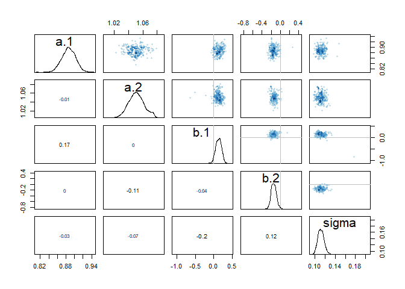<!-- -->

```r
## R code 9.18
traceplot( m9.1_test10 )
trankplot( m9.1_test10 , n_cols=2 )
```

<!-- --><!-- -->


```r
m9.1_test5 <- ulam(
    alist(
        log_gdp_std ~ dnorm( mu , sigma ) ,
        mu <- a[cid] + b[cid]*( rugged_std - 0.215 ) ,
        a[cid] ~ dnorm( 1 , 0.1 ) ,
        b[cid] ~ dnorm( 0 , 0.3 ) ,
        sigma ~ dexp( 1 )
    ) ,
    data=dat_slim , chains=4 , cores=4 , warmup=5 , iter=1000 )
```

```
## recompiling to avoid crashing R session
```

```
## Warning: There were 2441 divergent transitions after warmup. Increasing adapt_delta above 0.95 may help. See
## http://mc-stan.org/misc/warnings.html#divergent-transitions-after-warmup
```

```
## Warning: There were 3 chains where the estimated Bayesian Fraction of Missing Information was low. See
## http://mc-stan.org/misc/warnings.html#bfmi-low
```

```
## Warning: Examine the pairs() plot to diagnose sampling problems
```

```
## Warning: The largest R-hat is 2.87, indicating chains have not mixed.
## Running the chains for more iterations may help. See
## http://mc-stan.org/misc/warnings.html#r-hat
```

```
## Warning: Bulk Effective Samples Size (ESS) is too low, indicating posterior means and medians may be unreliable.
## Running the chains for more iterations may help. See
## http://mc-stan.org/misc/warnings.html#bulk-ess
```

```
## Warning: Tail Effective Samples Size (ESS) is too low, indicating posterior variances and tail quantiles may be unreliable.
## Running the chains for more iterations may help. See
## http://mc-stan.org/misc/warnings.html#tail-ess
```

```r
## R code 9.15
show( m9.1_test5 )
```

```
## Hamiltonian Monte Carlo approximation
## 3980 samples from 4 chains
## 
## Sampling durations (seconds):
##         warmup sample total
## chain:1      0   0.04  0.04
## chain:2      0   0.08  0.08
## chain:3      0   0.07  0.07
## chain:4      0   0.05  0.06
## 
## Formula:
## log_gdp_std ~ dnorm(mu, sigma)
## mu <- a[cid] + b[cid] * (rugged_std - 0.215)
## a[cid] ~ dnorm(1, 0.1)
## b[cid] ~ dnorm(0, 0.3)
## sigma ~ dexp(1)
```

```r
## R code 9.16
precis( m9.1_test5 , 2 )
```

```
##              mean         sd       5.5%     94.5%    n_eff      Rhat
## a[1]   0.84849233 0.05890107  0.7699806 0.9182694 3.069281  1.848115
## a[2]   0.95961101 0.15132650  0.6983222 1.0670722      NaN 15.366974
## b[1]  -0.04984647 0.29685200 -0.2907690 0.2824541 2.913386  2.298334
## b[2]   0.06126341 0.21797049 -0.2333207 0.3336027 3.557711  1.961947
## sigma  0.18124083 0.08446780  0.1061315 0.2976352 2.835213  1.927073
```

```r
## R code 9.17
pairs( m9.1_test5 )
```

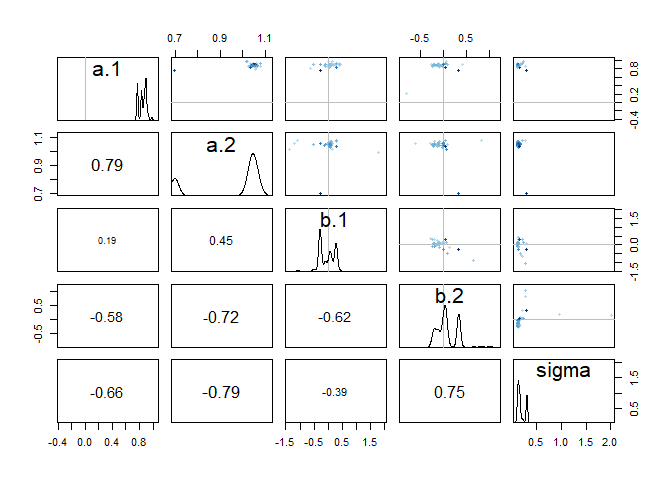<!-- -->

```r
## R code 9.18
traceplot( m9.1_test5 )
trankplot( m9.1_test5 , n_cols=2 )
```

<!-- --><!-- -->


```r
m9.1_test1 <- ulam(
    alist(
        log_gdp_std ~ dnorm( mu , sigma ) ,
        mu <- a[cid] + b[cid]*( rugged_std - 0.215 ) ,
        a[cid] ~ dnorm( 1 , 0.1 ) ,
        b[cid] ~ dnorm( 0 , 0.3 ) ,
        sigma ~ dexp( 1 )
    ) ,
    data=dat_slim , chains=4 , cores=4 , warmup=1 , iter=1000 )
```

```
## recompiling to avoid crashing R session
```

```
## Warning: There were 3996 divergent transitions after warmup. Increasing adapt_delta above 0.95 may help. See
## http://mc-stan.org/misc/warnings.html#divergent-transitions-after-warmup
```

```
## Warning: Examine the pairs() plot to diagnose sampling problems
```

```
## Warning: The largest R-hat is Inf, indicating chains have not mixed.
## Running the chains for more iterations may help. See
## http://mc-stan.org/misc/warnings.html#r-hat
```

```
## Warning: Bulk Effective Samples Size (ESS) is too low, indicating posterior means and medians may be unreliable.
## Running the chains for more iterations may help. See
## http://mc-stan.org/misc/warnings.html#bulk-ess
```

```
## Warning: Tail Effective Samples Size (ESS) is too low, indicating posterior variances and tail quantiles may be unreliable.
## Running the chains for more iterations may help. See
## http://mc-stan.org/misc/warnings.html#tail-ess
```

```r
## R code 9.15
show( m9.1_test1 )
```

```
## Hamiltonian Monte Carlo approximation
## 3996 samples from 4 chains
## 
## Sampling durations (seconds):
##         warmup sample total
## chain:1      0   0.59  0.59
## chain:2      0   0.03  0.03
## chain:3      0   0.39  0.39
## chain:4      0   0.03  0.03
## 
## Formula:
## log_gdp_std ~ dnorm(mu, sigma)
## mu <- a[cid] + b[cid] * (rugged_std - 0.215)
## a[cid] ~ dnorm(1, 0.1)
## b[cid] ~ dnorm(0, 0.3)
## sigma ~ dexp(1)
```

```r
## R code 9.16
precis( m9.1_test1 , 2 )
```

```
##             mean        sd       5.5%     94.5%    n_eff         Rhat
## a[1]  0.97550293 0.2033370  0.7052949 1.1992500      NaN 2.143483e+14
## a[2]  0.24552173 0.3979171 -0.1882376 0.7513262 2.003008 4.227211e+14
## b[1]  0.05363873 1.0826995 -0.9858384 1.8714126 2.003008 4.701718e+14
## b[2]  0.20096050 0.6598170 -0.7624039 0.9507326 2.003008 6.098494e+14
## sigma 0.82457984 0.4683709  0.2141496 1.4641239 2.003008 4.639905e+14
```

```r
## R code 9.17
pairs( m9.1_test1 )
```

<!-- -->

```r
## R code 9.18
traceplot( m9.1_test1 )
trankplot( m9.1_test1 , n_cols=2 )
```

<!-- --><!-- -->

> warmup = 100 is fine, but less than that. The problem shows up.


#### 8H1. Run the model below and then inspect the posterior distribution and explain what it is accomplishing.


```r
## R code 9.25
mp <- ulam(
    alist(
        a ~ dnorm(0,1),
        b ~ dcauchy(0,1)
    ),
    data=list(y=1),
    start=list(a=0,b=0),
    iter=1e4, warmup=100, chains = 4, cores = 4)
```

```
## Warning: There were 52 transitions after warmup that exceeded the maximum treedepth. Increase max_treedepth above 10. See
## http://mc-stan.org/misc/warnings.html#maximum-treedepth-exceeded
```

```
## Warning: Examine the pairs() plot to diagnose sampling problems
```


```r
## R code 9.15
show( mp )
```

```
## Hamiltonian Monte Carlo approximation
## 39600 samples from 4 chains
## 
## Sampling durations (seconds):
##         warmup sample total
## chain:1   0.00   0.90  0.90
## chain:2   0.00   0.69  0.70
## chain:3   0.00   0.62  0.62
## chain:4   0.01   0.52  0.53
## 
## Formula:
## a ~ dnorm(0, 1)
## b ~ dcauchy(0, 1)
```

```r
## R code 9.16
precis( mp , 2 )
```

```
##           mean          sd      5.5%    94.5%      n_eff     Rhat
## a  0.002766864   0.9962504 -1.589014 1.582553 28042.3241 1.000078
## b -4.208111888 120.1570831 -5.754417 5.364262   707.5147 1.005741
```

```r
## R code 9.17
pairs( mp )
```

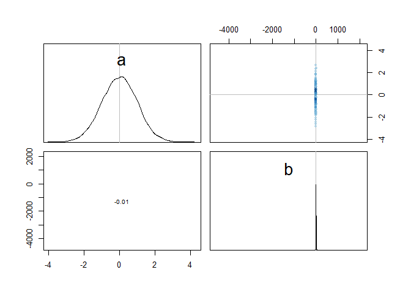<!-- -->

```r
## R code 9.18
traceplot( mp )
trankplot( mp , n_cols=2 )
```

<!-- --><!-- -->

#### Compare the samples for the parameters a and b. Can you explain the different trace plots, using what you know about the Cauchy distribution?

#### 8H2. Recall the divorce rate example from Chapter 5. Repeat that analysis, using ulam this time, fitting models m5.1, m5.2, and m5.3. Use compare to compare the models on the basis of WAIC. Explain the results.

### 8H3. Sometimes changing a prior for one parameter has unanticipated effects on other parameters. This is because when a parameter is highly correlated with another parameter in the posterior, the prior influences both parameters. Here’s an example to work and think through.

Go back to the leg length example in Chapter 5. Here is the code again, which simulates height
and leg lengths for 100 imagined individuals:


```r
## R code 9.26
N <- 100                          # number of individuals
height <- rnorm(N,10,2)           # sim total height of each
leg_prop <- runif(N,0.4,0.5)      # leg as proportion of height
leg_left <- leg_prop*height +     # sim left leg as proportion + error
    rnorm( N , 0 , 0.02 )
leg_right <- leg_prop*height +    # sim right leg as proportion + error
    rnorm( N , 0 , 0.02 )
                                  # combine into data frame
d <- data.frame(height,leg_left,leg_right)
```

And below is the model you fit before, resulting in a highly correlated posterior for the two beta
parameters. This time, fit the model using map2stan:


```r
## R code 9.27
m5.8s <- map2stan(
    alist(
        height ~ dnorm( mu , sigma ) ,
        mu <- a + bl*leg_left + br*leg_right ,
        a ~ dnorm( 10 , 100 ) ,
        bl ~ dnorm( 2 , 10 ) ,
        br ~ dnorm( 2 , 10 ) ,
        sigma ~ dcauchy( 0 , 1 )
    ) ,
    data=d, chains=4,
    #log_lik = TRUE,
    start=list(a=10,bl=0,br=0,sigma=1) )
```

```
## 
## SAMPLING FOR MODEL '99002b5212fdc1720810afc192abcdc8' NOW (CHAIN 1).
## Chain 1: 
## Chain 1: Gradient evaluation took 0 seconds
## Chain 1: 1000 transitions using 10 leapfrog steps per transition would take 0 seconds.
## Chain 1: Adjust your expectations accordingly!
## Chain 1: 
## Chain 1: 
## Chain 1: Iteration:    1 / 2000 [  0%]  (Warmup)
## Chain 1: Iteration:  200 / 2000 [ 10%]  (Warmup)
## Chain 1: Iteration:  400 / 2000 [ 20%]  (Warmup)
## Chain 1: Iteration:  600 / 2000 [ 30%]  (Warmup)
## Chain 1: Iteration:  800 / 2000 [ 40%]  (Warmup)
## Chain 1: Iteration: 1000 / 2000 [ 50%]  (Warmup)
## Chain 1: Iteration: 1001 / 2000 [ 50%]  (Sampling)
## Chain 1: Iteration: 1200 / 2000 [ 60%]  (Sampling)
## Chain 1: Iteration: 1400 / 2000 [ 70%]  (Sampling)
## Chain 1: Iteration: 1600 / 2000 [ 80%]  (Sampling)
## Chain 1: Iteration: 1800 / 2000 [ 90%]  (Sampling)
## Chain 1: Iteration: 2000 / 2000 [100%]  (Sampling)
## Chain 1: 
## Chain 1:  Elapsed Time: 7.148 seconds (Warm-up)
## Chain 1:                7.683 seconds (Sampling)
## Chain 1:                14.831 seconds (Total)
## Chain 1: 
## 
## SAMPLING FOR MODEL '99002b5212fdc1720810afc192abcdc8' NOW (CHAIN 2).
## Chain 2: 
## Chain 2: Gradient evaluation took 0 seconds
## Chain 2: 1000 transitions using 10 leapfrog steps per transition would take 0 seconds.
## Chain 2: Adjust your expectations accordingly!
## Chain 2: 
## Chain 2: 
## Chain 2: Iteration:    1 / 2000 [  0%]  (Warmup)
## Chain 2: Iteration:  200 / 2000 [ 10%]  (Warmup)
## Chain 2: Iteration:  400 / 2000 [ 20%]  (Warmup)
## Chain 2: Iteration:  600 / 2000 [ 30%]  (Warmup)
## Chain 2: Iteration:  800 / 2000 [ 40%]  (Warmup)
## Chain 2: Iteration: 1000 / 2000 [ 50%]  (Warmup)
## Chain 2: Iteration: 1001 / 2000 [ 50%]  (Sampling)
## Chain 2: Iteration: 1200 / 2000 [ 60%]  (Sampling)
## Chain 2: Iteration: 1400 / 2000 [ 70%]  (Sampling)
## Chain 2: Iteration: 1600 / 2000 [ 80%]  (Sampling)
## Chain 2: Iteration: 1800 / 2000 [ 90%]  (Sampling)
## Chain 2: Iteration: 2000 / 2000 [100%]  (Sampling)
## Chain 2: 
## Chain 2:  Elapsed Time: 7.434 seconds (Warm-up)
## Chain 2:                7.733 seconds (Sampling)
## Chain 2:                15.167 seconds (Total)
## Chain 2: 
## 
## SAMPLING FOR MODEL '99002b5212fdc1720810afc192abcdc8' NOW (CHAIN 3).
## Chain 3: 
## Chain 3: Gradient evaluation took 0 seconds
## Chain 3: 1000 transitions using 10 leapfrog steps per transition would take 0 seconds.
## Chain 3: Adjust your expectations accordingly!
## Chain 3: 
## Chain 3: 
## Chain 3: Iteration:    1 / 2000 [  0%]  (Warmup)
## Chain 3: Iteration:  200 / 2000 [ 10%]  (Warmup)
## Chain 3: Iteration:  400 / 2000 [ 20%]  (Warmup)
## Chain 3: Iteration:  600 / 2000 [ 30%]  (Warmup)
## Chain 3: Iteration:  800 / 2000 [ 40%]  (Warmup)
## Chain 3: Iteration: 1000 / 2000 [ 50%]  (Warmup)
## Chain 3: Iteration: 1001 / 2000 [ 50%]  (Sampling)
## Chain 3: Iteration: 1200 / 2000 [ 60%]  (Sampling)
## Chain 3: Iteration: 1400 / 2000 [ 70%]  (Sampling)
## Chain 3: Iteration: 1600 / 2000 [ 80%]  (Sampling)
## Chain 3: Iteration: 1800 / 2000 [ 90%]  (Sampling)
## Chain 3: Iteration: 2000 / 2000 [100%]  (Sampling)
## Chain 3: 
## Chain 3:  Elapsed Time: 7.213 seconds (Warm-up)
## Chain 3:                8.217 seconds (Sampling)
## Chain 3:                15.43 seconds (Total)
## Chain 3: 
## 
## SAMPLING FOR MODEL '99002b5212fdc1720810afc192abcdc8' NOW (CHAIN 4).
## Chain 4: 
## Chain 4: Gradient evaluation took 0 seconds
## Chain 4: 1000 transitions using 10 leapfrog steps per transition would take 0 seconds.
## Chain 4: Adjust your expectations accordingly!
## Chain 4: 
## Chain 4: 
## Chain 4: Iteration:    1 / 2000 [  0%]  (Warmup)
## Chain 4: Iteration:  200 / 2000 [ 10%]  (Warmup)
## Chain 4: Iteration:  400 / 2000 [ 20%]  (Warmup)
## Chain 4: Iteration:  600 / 2000 [ 30%]  (Warmup)
## Chain 4: Iteration:  800 / 2000 [ 40%]  (Warmup)
## Chain 4: Iteration: 1000 / 2000 [ 50%]  (Warmup)
## Chain 4: Iteration: 1001 / 2000 [ 50%]  (Sampling)
## Chain 4: Iteration: 1200 / 2000 [ 60%]  (Sampling)
## Chain 4: Iteration: 1400 / 2000 [ 70%]  (Sampling)
## Chain 4: Iteration: 1600 / 2000 [ 80%]  (Sampling)
## Chain 4: Iteration: 1800 / 2000 [ 90%]  (Sampling)
## Chain 4: Iteration: 2000 / 2000 [100%]  (Sampling)
## Chain 4: 
## Chain 4:  Elapsed Time: 6.982 seconds (Warm-up)
## Chain 4:                7.798 seconds (Sampling)
## Chain 4:                14.78 seconds (Total)
## Chain 4:
```

```
## Warning: There were 1616 transitions after warmup that exceeded the maximum treedepth. Increase max_treedepth above 10. See
## http://mc-stan.org/misc/warnings.html#maximum-treedepth-exceeded
```

```
## Warning: Examine the pairs() plot to diagnose sampling problems
```

```
## Computing WAIC
```

Compare the posterior distribution produced by the code above to the posterior distribution pro-
duced when you change the prior for br so that it is strictly positive:


```r
## R code 9.28
m5.8s2 <- map2stan(
    alist(
        height ~ dnorm( mu , sigma ) ,
        mu <- a + bl*leg_left + br*leg_right ,
        a ~ dnorm( 10 , 100 ) ,
        bl ~ dnorm( 2 , 10 ) ,
        br ~ dnorm( 2 , 10 ) & T[0,] ,
        sigma ~ dcauchy( 0 , 1 )
    ) ,
    data=d, chains=4,
    #log_lik = TRUE,
    start=list(a=10,bl=0,br=0,sigma=1) )
```

```
## 
## SAMPLING FOR MODEL '073993e8a574e64fea40cee945eeabea' NOW (CHAIN 1).
## Chain 1: 
## Chain 1: Gradient evaluation took 0 seconds
## Chain 1: 1000 transitions using 10 leapfrog steps per transition would take 0 seconds.
## Chain 1: Adjust your expectations accordingly!
## Chain 1: 
## Chain 1: 
## Chain 1: Iteration:    1 / 2000 [  0%]  (Warmup)
## Chain 1: Iteration:  200 / 2000 [ 10%]  (Warmup)
## Chain 1: Iteration:  400 / 2000 [ 20%]  (Warmup)
## Chain 1: Iteration:  600 / 2000 [ 30%]  (Warmup)
## Chain 1: Iteration:  800 / 2000 [ 40%]  (Warmup)
## Chain 1: Iteration: 1000 / 2000 [ 50%]  (Warmup)
## Chain 1: Iteration: 1001 / 2000 [ 50%]  (Sampling)
## Chain 1: Iteration: 1200 / 2000 [ 60%]  (Sampling)
## Chain 1: Iteration: 1400 / 2000 [ 70%]  (Sampling)
## Chain 1: Iteration: 1600 / 2000 [ 80%]  (Sampling)
## Chain 1: Iteration: 1800 / 2000 [ 90%]  (Sampling)
## Chain 1: Iteration: 2000 / 2000 [100%]  (Sampling)
## Chain 1: 
## Chain 1:  Elapsed Time: 7.064 seconds (Warm-up)
## Chain 1:                8.335 seconds (Sampling)
## Chain 1:                15.399 seconds (Total)
## Chain 1: 
## 
## SAMPLING FOR MODEL '073993e8a574e64fea40cee945eeabea' NOW (CHAIN 2).
## Chain 2: 
## Chain 2: Gradient evaluation took 0 seconds
## Chain 2: 1000 transitions using 10 leapfrog steps per transition would take 0 seconds.
## Chain 2: Adjust your expectations accordingly!
## Chain 2: 
## Chain 2: 
## Chain 2: Iteration:    1 / 2000 [  0%]  (Warmup)
## Chain 2: Iteration:  200 / 2000 [ 10%]  (Warmup)
## Chain 2: Iteration:  400 / 2000 [ 20%]  (Warmup)
## Chain 2: Iteration:  600 / 2000 [ 30%]  (Warmup)
## Chain 2: Iteration:  800 / 2000 [ 40%]  (Warmup)
## Chain 2: Iteration: 1000 / 2000 [ 50%]  (Warmup)
## Chain 2: Iteration: 1001 / 2000 [ 50%]  (Sampling)
## Chain 2: Iteration: 1200 / 2000 [ 60%]  (Sampling)
## Chain 2: Iteration: 1400 / 2000 [ 70%]  (Sampling)
## Chain 2: Iteration: 1600 / 2000 [ 80%]  (Sampling)
## Chain 2: Iteration: 1800 / 2000 [ 90%]  (Sampling)
## Chain 2: Iteration: 2000 / 2000 [100%]  (Sampling)
## Chain 2: 
## Chain 2:  Elapsed Time: 6.564 seconds (Warm-up)
## Chain 2:                7.39 seconds (Sampling)
## Chain 2:                13.954 seconds (Total)
## Chain 2: 
## 
## SAMPLING FOR MODEL '073993e8a574e64fea40cee945eeabea' NOW (CHAIN 3).
## Chain 3: 
## Chain 3: Gradient evaluation took 0 seconds
## Chain 3: 1000 transitions using 10 leapfrog steps per transition would take 0 seconds.
## Chain 3: Adjust your expectations accordingly!
## Chain 3: 
## Chain 3: 
## Chain 3: Iteration:    1 / 2000 [  0%]  (Warmup)
## Chain 3: Iteration:  200 / 2000 [ 10%]  (Warmup)
## Chain 3: Iteration:  400 / 2000 [ 20%]  (Warmup)
## Chain 3: Iteration:  600 / 2000 [ 30%]  (Warmup)
## Chain 3: Iteration:  800 / 2000 [ 40%]  (Warmup)
## Chain 3: Iteration: 1000 / 2000 [ 50%]  (Warmup)
## Chain 3: Iteration: 1001 / 2000 [ 50%]  (Sampling)
## Chain 3: Iteration: 1200 / 2000 [ 60%]  (Sampling)
## Chain 3: Iteration: 1400 / 2000 [ 70%]  (Sampling)
## Chain 3: Iteration: 1600 / 2000 [ 80%]  (Sampling)
## Chain 3: Iteration: 1800 / 2000 [ 90%]  (Sampling)
## Chain 3: Iteration: 2000 / 2000 [100%]  (Sampling)
## Chain 3: 
## Chain 3:  Elapsed Time: 6.622 seconds (Warm-up)
## Chain 3:                7.153 seconds (Sampling)
## Chain 3:                13.775 seconds (Total)
## Chain 3: 
## 
## SAMPLING FOR MODEL '073993e8a574e64fea40cee945eeabea' NOW (CHAIN 4).
## Chain 4: 
## Chain 4: Gradient evaluation took 0 seconds
## Chain 4: 1000 transitions using 10 leapfrog steps per transition would take 0 seconds.
## Chain 4: Adjust your expectations accordingly!
## Chain 4: 
## Chain 4: 
## Chain 4: Iteration:    1 / 2000 [  0%]  (Warmup)
## Chain 4: Iteration:  200 / 2000 [ 10%]  (Warmup)
## Chain 4: Iteration:  400 / 2000 [ 20%]  (Warmup)
## Chain 4: Iteration:  600 / 2000 [ 30%]  (Warmup)
## Chain 4: Iteration:  800 / 2000 [ 40%]  (Warmup)
## Chain 4: Iteration: 1000 / 2000 [ 50%]  (Warmup)
## Chain 4: Iteration: 1001 / 2000 [ 50%]  (Sampling)
## Chain 4: Iteration: 1200 / 2000 [ 60%]  (Sampling)
## Chain 4: Iteration: 1400 / 2000 [ 70%]  (Sampling)
## Chain 4: Iteration: 1600 / 2000 [ 80%]  (Sampling)
## Chain 4: Iteration: 1800 / 2000 [ 90%]  (Sampling)
## Chain 4: Iteration: 2000 / 2000 [100%]  (Sampling)
## Chain 4: 
## Chain 4:  Elapsed Time: 6.594 seconds (Warm-up)
## Chain 4:                8.929 seconds (Sampling)
## Chain 4:                15.523 seconds (Total)
## Chain 4:
```

```
## Warning: There were 192 divergent transitions after warmup. Increasing adapt_delta above 0.95 may help. See
## http://mc-stan.org/misc/warnings.html#divergent-transitions-after-warmup
```

```
## Warning: There were 1600 transitions after warmup that exceeded the maximum treedepth. Increase max_treedepth above 10. See
## http://mc-stan.org/misc/warnings.html#maximum-treedepth-exceeded
```

```
## Warning: Examine the pairs() plot to diagnose sampling problems
```

```
## Computing WAIC
```

```
## Warning in map2stan(alist(height ~ dnorm(mu, sigma), mu <- a + bl * leg_left + : There were 192 divergent iterations during sampling.
## Check the chains (trace plots, n_eff, Rhat) carefully to ensure they are valid.
```

Note that T[0,] on the right-hand side of the prior for br. What the T[0,] does is truncate the normal distribution so that it has positive probability only above zero. In other words, that prior ensures that the posterior distribution for br will have no probability mass below zero.
Compare the two posterior distributions for m5.8s and m5.8s2. What has changed in the posterior distribution of both beta parameters? Can you explain the change induced by the change in prior?


```r
#plot(m5.8s)
#plot(m5.8s2)

## R code 9.15
show( m5.8s )
```

```
## map2stan model
## 4000 samples from 4 chains
## 
## Sampling durations (seconds):
##         warmup sample total
## chain:1   7.15   7.68 14.83
## chain:2   7.43   7.73 15.17
## chain:3   7.21   8.22 15.43
## chain:4   6.98   7.80 14.78
## 
## Formula:
## height ~ dnorm(mu, sigma)
## mu <- a + bl * leg_left + br * leg_right
## a ~ dnorm(10, 100)
## bl ~ dnorm(2, 10)
## br ~ dnorm(2, 10)
## sigma ~ dcauchy(0, 1)
## 
## WAIC (SE): 186.66 (10.3)
## pWAIC: 3.35
```

```r
show( m5.8s2 )
```

```
## map2stan model
## 4000 samples from 4 chains
## 
## Sampling durations (seconds):
##         warmup sample total
## chain:1   7.06   8.34 15.40
## chain:2   6.56   7.39 13.95
## chain:3   6.62   7.15 13.77
## chain:4   6.59   8.93 15.52
## 
## Formula:
## height ~ dnorm(mu, sigma)
## mu <- a + bl * leg_left + br * leg_right
## a ~ dnorm(10, 100)
## bl ~ dnorm(2, 10)
## br ~ dnorm(2, 10) & T[0, ]
## sigma ~ dcauchy(0, 1)
## 
## WAIC (SE): 186.13 (10.4)
## pWAIC: 3.12
```

```r
## R code 9.16
precis( m5.8s , 2 )
```

```
##             mean         sd       5.5%     94.5%    n_eff     Rhat
## a      0.6516675 0.31589505  0.1292020 1.1555987 2406.347 1.000174
## bl    -2.2170636 2.13217473 -5.6212222 1.1677972 1689.011 1.006328
## br     4.2987375 2.13074778  0.9158738 7.7049801 1694.590 1.006279
## sigma  0.6064281 0.04423898  0.5405831 0.6793522 2351.003 1.000238
```

```r
precis( m5.8s2 , 2 )
```

```
##             mean         sd       5.5%     94.5%    n_eff     Rhat
## a      0.6755852 0.29497458  0.1923812 1.1424747 1754.018 1.002044
## bl    -2.2575334 1.95863300 -5.5127894 0.8550063 1315.015 1.002174
## br     4.3342417 1.95820643  1.2345441 7.5913901 1320.964 1.002157
## sigma  0.6061283 0.04450378  0.5403171 0.6827886 2119.273 1.000034
```

```r
## R code 9.17
pairs( m5.8s )
```

<!-- -->

```r
pairs( m5.8s2 )
```

<!-- -->

```r
trankplot(m5.8s)

plotchains(m5.8s)
```

```
## Warning: Ignoring unknown parameters: ask
```

```r
trankplot(m5.8s2)
```

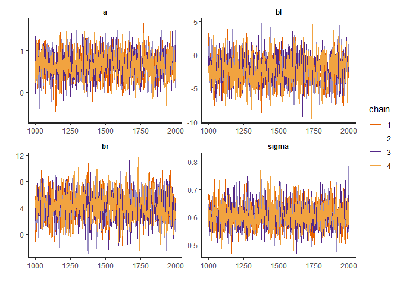<!-- -->

```r
plotchains(m5.8s2)
```

```
## Warning: Ignoring unknown parameters: ask
```

```r
#coeftab(m5.8s, m5.8s2)
compare(m5.8s, m5.8s2)
```

```
##           WAIC    pWAIC     dWAIC    weight       SE       dSE
## m5.8s2 186.131 3.118123 0.0000000 0.5658699 10.35666        NA
## m5.8s  186.661 3.353227 0.5300399 0.4341301 10.34286 0.1783166
```

<!-- -->

> bR is always postive, bL is always negative.

> Second model has worse convergence and smaller n_eff for a, bl, br and sigma 

### 8H4. For the two models fit in the previous problem, use DIC or WAIC to compare the effective numbers of parameters for each model. Which model has more effective parameters? Why?


```r
compare(m5.8s, m5.8s2)
```

```
##           WAIC    pWAIC     dWAIC    weight       SE       dSE
## m5.8s2 186.131 3.118123 0.0000000 0.5658699 10.35666        NA
## m5.8s  186.661 3.353227 0.5300399 0.4341301 10.34286 0.1783166
```

```r
WAIC(m5.8s)  
```

```
## [1] 186.661
## attr(,"lppd")
## [1] -89.97729
## attr(,"pWAIC")
## [1] 3.353227
## attr(,"se")
## [1] 10.34286
```

```r
WAIC(m5.8s2) 
```

```
## [1] 186.131
## attr(,"lppd")
## [1] -89.94738
## attr(,"pWAIC")
## [1] 3.118123
## attr(,"se")
## [1] 10.35666
```

> Effective number of parameters for the second model is smaller. pWAIC is defined as sum of variance of the points likelihood, thus the second model has smaller variance of data likelihood, 'more restricted'

#### optional: 8H6. Modify the Metropolis algorithm code from the chapter to write your own simple MCMC estimator for globe tossing data and model from Chapter

