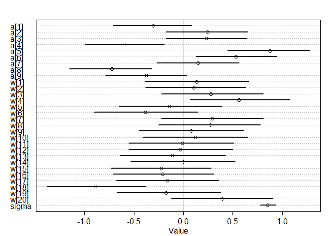
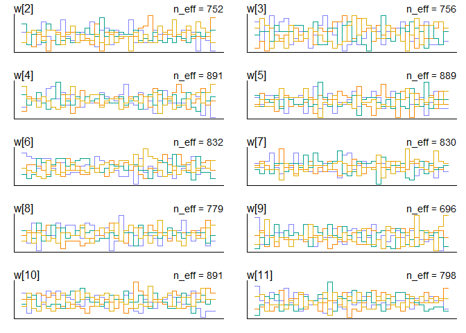
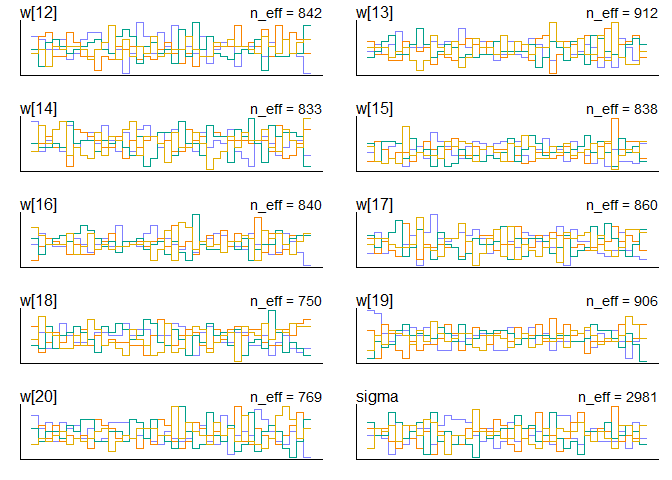
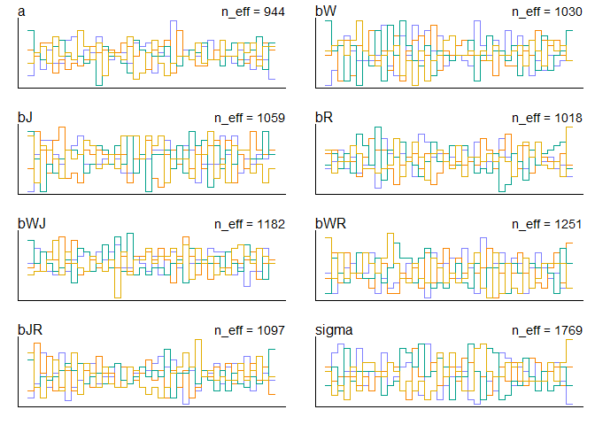

# STATISTICAL RETHINKING WINTER 2019

# HOMEWORK, WEEK 5

#### 1. Consider the data(Wines2012) data table. These data are expert ratings of 20 different French and American wines by 9 different French and American judges. Your goal is to model score, the subjective rating assigned by each judge to each wine. I recommend standardizing it. In this first problem, consider only variation among judges and wines. Construct index variables of judge and wine and then use these index variables to construct a linear regression model. Justify your priors. You should end up with 9 judge parameters and 20 wine parameters. Use ulam instead of quap to build this model, and be sure to check the chains for convergence. If you’d rather build the model directly in Stan or PyMC3, go ahead. I just want you to use Hamiltonian Monte Carlo instead of quadratic approximation. How do you interpret the variation among individual judges and individual wines? Do you notice any patterns, just by plotting the differences? Which judges gave the highest/lowest ratings? Which wines were rated worst/best on average?


```r
library(rethinking)
```

```
## Loading required package: rstan
```

```
## Loading required package: StanHeaders
```

```
## Loading required package: ggplot2
```

```
## rstan (Version 2.19.2, GitRev: 2e1f913d3ca3)
```

```
## For execution on a local, multicore CPU with excess RAM we recommend calling
## options(mc.cores = parallel::detectCores()).
## To avoid recompilation of unchanged Stan programs, we recommend calling
## rstan_options(auto_write = TRUE)
```

```
## For improved execution time, we recommend calling
## Sys.setenv(LOCAL_CPPFLAGS = '-march=native')
## although this causes Stan to throw an error on a few processors.
```

```
## Loading required package: parallel
```

```
## Loading required package: dagitty
```

```
## rethinking (Version 1.90)
```

```
## 
## Attaching package: 'rethinking'
```

```
## The following object is masked from 'package:stats':
## 
##     rstudent
```

```r
data(Wines2012)

data_wine <- Wines2012
summary(data_wine)
```

```
##              judge      flight        wine         score     
##  Daniele Meulder:20   red  :90   A1     :  9   Min.   : 7.0  
##  Francis Schott :20   white:90   A2     :  9   1st Qu.:12.0  
##  Jamal Rayyis   :20              B1     :  9   Median :14.5  
##  Jean-M Cardebat:20              B2     :  9   Mean   :14.2  
##  John Foy       :20              C1     :  9   3rd Qu.:16.0  
##  Linda Murphy   :20              C2     :  9   Max.   :19.5  
##  (Other)        :60              (Other):126                 
##    wine.amer     judge.amer    
##  Min.   :0.0   Min.   :0.0000  
##  1st Qu.:0.0   1st Qu.:0.0000  
##  Median :1.0   Median :1.0000  
##  Mean   :0.6   Mean   :0.5556  
##  3rd Qu.:1.0   3rd Qu.:1.0000  
##  Max.   :1.0   Max.   :1.0000  
## 
```

```r
str(data_wine)
```

```
## 'data.frame':	180 obs. of  6 variables:
##  $ judge     : Factor w/ 9 levels "Daniele Meulder",..: 4 4 4 4 4 4 4 4 4 4 ...
##  $ flight    : Factor w/ 2 levels "red","white": 2 2 2 2 2 2 2 2 2 2 ...
##  $ wine      : Factor w/ 20 levels "A1","A2","B1",..: 1 3 5 7 9 11 13 15 17 19 ...
##  $ score     : num  10 13 14 15 8 13 15 11 9 12 ...
##  $ wine.amer : int  1 1 0 0 1 1 1 0 1 0 ...
##  $ judge.amer: int  0 0 0 0 0 0 0 0 0 0 ...
```

```r
head(data_wine)
```

```
##             judge flight wine score wine.amer judge.amer
## 1 Jean-M Cardebat  white   A1    10         1          0
## 2 Jean-M Cardebat  white   B1    13         1          0
## 3 Jean-M Cardebat  white   C1    14         0          0
## 4 Jean-M Cardebat  white   D1    15         0          0
## 5 Jean-M Cardebat  white   E1     8         1          0
## 6 Jean-M Cardebat  white   F1    13         1          0
```

```r
new_wine <- list(
  jid = as.integer(data_wine$judge),
  wid = as.integer(data_wine$wine),
  S = scale(data_wine$score)
  )
summary(new_wine)
```

```
##     Length Class  Mode   
## jid 180    -none- numeric
## wid 180    -none- numeric
## S   180    -none- numeric
```

```r
str(new_wine)
```

```
## List of 3
##  $ jid: int [1:180] 4 4 4 4 4 4 4 4 4 4 ...
##  $ wid: int [1:180] 1 3 5 7 9 11 13 15 17 19 ...
##  $ S  : num [1:180, 1] -1.5766 -0.4505 -0.0751 0.3003 -2.3274 ...
##   ..- attr(*, "scaled:center")= num 14.2
##   ..- attr(*, "scaled:scale")= num 2.66
```


```r
HW9_m1 <- ulam(
  alist(
    S ~ dnorm( mu , sigma ),
    mu <- a[jid] + w[wid],
    a[jid] ~ dnorm(0,1),
    w[wid] ~ dnorm(0,1),
    sigma ~ dexp(1)
    ), 
  data=new_wine , chains=4 , cores=4 )
```

> Because we standardized the outcome, we can use N(0,1) for the outcome.


```r
## R code 9.15
show( HW9_m1 )
```

```
## Hamiltonian Monte Carlo approximation
## 2000 samples from 4 chains
## 
## Sampling durations (seconds):
##         warmup sample total
## chain:1   0.14   0.10  0.25
## chain:2   0.14   0.13  0.27
## chain:3   0.18   0.13  0.31
## chain:4   0.14   0.12  0.26
## 
## Formula:
## S ~ dnorm(mu, sigma)
## mu <- a[jid] + w[wid]
## a[jid] ~ dnorm(0, 1)
## w[wid] ~ dnorm(0, 1)
## sigma ~ dexp(1)
```

```r
## R code 9.16
precis( HW9_m1 , 2 )
```

```
##              mean         sd        5.5%       94.5%     n_eff      Rhat
## a[1]  -0.30764161 0.26117229 -0.72593601  0.11117016  502.8814 1.0069192
## a[2]   0.23585903 0.26159498 -0.17704264  0.64379423  554.2792 1.0056613
## a[3]   0.22889739 0.25532188 -0.19587500  0.63563814  491.7631 1.0095078
## a[4]  -0.59752286 0.25733349 -1.02084838 -0.18306912  511.9205 1.0089605
## a[5]   0.87847713 0.26157123  0.43263261  1.28437700  521.1076 1.0098329
## a[6]   0.52639535 0.25785267  0.11366191  0.95053522  496.1157 1.0100125
## a[7]   0.14492260 0.25705938 -0.26706686  0.56399648  512.5950 1.0096379
## a[8]  -0.72144688 0.25285238 -1.13343835 -0.32762011  426.9909 1.0122105
## a[9]  -0.37485902 0.26001287 -0.78343210  0.05106214  458.0304 1.0108004
## w[1]   0.14114512 0.32463236 -0.38662787  0.65611640  660.0407 1.0122052
## w[2]   0.10697194 0.33080669 -0.41146450  0.63124833  886.7541 1.0054662
## w[3]   0.27698599 0.33700017 -0.26616719  0.81847784  787.2462 1.0056663
## w[4]   0.56901362 0.33310157  0.03803244  1.10528157  763.8070 1.0034548
## w[5]  -0.12610818 0.33058629 -0.63922914  0.40851114  760.1150 1.0056627
## w[6]  -0.38657083 0.32397354 -0.91258872  0.14358238  728.3222 1.0038162
## w[7]   0.30483676 0.32349570 -0.20181419  0.80559623  739.4127 1.0078567
## w[8]   0.27879509 0.31843947 -0.22881511  0.78392161  690.9186 1.0029612
## w[9]   0.08006165 0.31834571 -0.42976453  0.57382144  741.1314 1.0040045
## w[10]  0.12928792 0.32742108 -0.38967012  0.66350649  756.0595 1.0066145
## w[11] -0.02103319 0.32751993 -0.55064264  0.49962995  773.7533 1.0039776
## w[12] -0.03994573 0.31871612 -0.54387505  0.45432464  670.0452 1.0082241
## w[13] -0.09814541 0.32615509 -0.61483881  0.43093425  738.2149 1.0036952
## w[14]  0.01452921 0.32820966 -0.49812493  0.52136130  747.7306 1.0054177
## w[15] -0.22878669 0.32332919 -0.73187498  0.27222471  796.3694 1.0053636
## w[16] -0.20248935 0.31688632 -0.69955674  0.31021455  882.7903 1.0036190
## w[17] -0.14561399 0.31641512 -0.65843197  0.34818743  746.7014 1.0045329
## w[18] -0.88264778 0.32746433 -1.40505333 -0.35662171  695.0909 1.0058651
## w[19] -0.16824112 0.32906648 -0.69333499  0.35469490  807.8984 1.0047542
## w[20]  0.39534426 0.32269982 -0.11946264  0.91632710  760.4518 1.0062518
## sigma  0.85190331 0.04888273  0.77634702  0.93020029 2738.8593 0.9987242
```

```r
plot(precis( HW9_m1 , 2 ))
```

<!-- -->

```r
## R code 9.17
#pairs( HW9_m1 )

## R code 9.18
traceplot( HW9_m1 )
```

```
## Waiting to draw page 2 of 2
```

<!-- --><!-- -->

```r
trankplot( HW9_m1 , n_cols=2 )
```

```
## Waiting to draw page 2 of 3
```

<!-- -->

```
## Waiting to draw page 3 of 3
```

<!-- --><!-- -->

>  They pass the hairy-caterpillar-ocular-inspection-test. There is larger variation from judges. FOr example, judge 4 and 8 have much lower average scores; judge 5 and 6 have much higher average scores. The variation from wine is smaller. Only the wine 18 has a much lower average score; and wine 4 has a much higher average score.

#### 2. Now consider three features of the wines and judges:
(1) flight: Whether the wine is red or white.
(2) wine.amer: Indicator variable for American wines.
(3) judge.amer: Indicator variable for American judges.

#### Use indicator or index variables to model the influence of these features on the scores. Omit the individual judge and wine index variables from Problem 1. Do not include interaction effects yet. Again use ulam, justify your priors, and be sure to check the chains. What do you conclude about the differences among the wines and judges? Try to relate the results to the inferences in Problem 1.


```r
new_wine2 <- list(
  S = scale(data_wine$score),
  RID = as.integer(data_wine$flight), #white=2, red=1
  WID = as.integer(data_wine$wine.amer)+1, #American=2, French=1
  JID = as.integer(data_wine$judge.amer)+1 #American=2, French=1
  )
summary(new_wine2)
```

```
##     Length Class  Mode   
## S   180    -none- numeric
## RID 180    -none- numeric
## WID 180    -none- numeric
## JID 180    -none- numeric
```

```r
str(new_wine2)
```

```
## List of 4
##  $ S  : num [1:180, 1] -1.5766 -0.4505 -0.0751 0.3003 -2.3274 ...
##   ..- attr(*, "scaled:center")= num 14.2
##   ..- attr(*, "scaled:scale")= num 2.66
##  $ RID: int [1:180] 2 2 2 2 2 2 2 2 2 2 ...
##  $ WID: num [1:180] 2 2 1 1 2 2 2 1 2 1 ...
##  $ JID: num [1:180] 1 1 1 1 1 1 1 1 1 1 ...
```


```r
HW9_m2 <- ulam(
  alist(
    S ~ dnorm( mu , sigma ),
    mu <- W[WID] + J[JID] + R[RID],
    W[WID] ~ dnorm( 0 , 1 ), 
    J[JID] ~ dnorm( 0 , 1 ), 
    R[RID] ~ dnorm( 0 , 1 ),
    sigma ~ dexp(1)
    ),
  data=new_wine2 , chains=4 , cores=4 )
precis( HW9_m2 , 2 )
```

```
##              mean         sd       5.5%     94.5%     n_eff     Rhat
## W[1]   0.08934203 0.58173455 -0.8420303 1.0333905  765.9485 1.004363
## W[2]  -0.09783498 0.58213327 -0.9948347 0.8367989  754.7711 1.005346
## J[1]  -0.10021708 0.60107029 -1.0393253 0.8970889  590.4618 1.009166
## J[2]   0.14641449 0.60094960 -0.7779844 1.1423080  591.8830 1.009916
## R[1]  -0.01345051 0.58338104 -0.9437513 0.9196082  590.1106 1.003178
## R[2]  -0.01360363 0.58424622 -0.9219467 0.9100688  582.6906 1.004249
## sigma  0.99971824 0.05487947  0.9146195 1.0899461 1273.2488 1.002576
```


```r
## R code 9.15
show( HW9_m2 )
```

```
## Hamiltonian Monte Carlo approximation
## 2000 samples from 4 chains
## 
## Sampling durations (seconds):
##         warmup sample total
## chain:1   0.35   0.37  0.72
## chain:2   0.39   0.35  0.74
## chain:3   0.45   0.38  0.83
## chain:4   0.35   0.38  0.73
## 
## Formula:
## S ~ dnorm(mu, sigma)
## mu <- W[WID] + J[JID] + R[RID]
## W[WID] ~ dnorm(0, 1)
## J[JID] ~ dnorm(0, 1)
## R[RID] ~ dnorm(0, 1)
## sigma ~ dexp(1)
```

```r
## R code 9.16

plot(precis( HW9_m2 , 2 ))
```

<!-- -->

```r
## R code 9.17
pairs( HW9_m2 )
```

<!-- -->

```r
## R code 9.18
traceplot( HW9_m2 )

trankplot( HW9_m2 , n_cols=2 )
```

<!-- --><!-- -->

> There is no big difference between red or white wine, American or French wines, and American or French judges. American judges seem to give slightly higher scores. French wines seems to be slightly prefered.

#### 3. Now consider two-way interactions among the three features. You should end up with three different interaction terms in your model. These will be easier to build, if you use indicator variables. Again use ulam, justify your priors, and be sure to check the chains. Explain what each interaction means. Be sure to interpret the model’s predictions on the outcome scale (mu, the expected score), not on the scale of individual parameters. You can use link to help with this, or just use your knowledge of the linear model instead. What do you conclude about the features and the scores? Can you relate the results of your model(s) to the individual judge and wine inferences from Problem 1?


```r
new_wine3 <- list(
  S = scale(data_wine$score),
  R = as.integer(data_wine$flight), #white=2, red=1
  W = as.integer(data_wine$wine.amer)+1, #American=2, French=1
  J = as.integer(data_wine$judge.amer)+1 #American=2, French=1
  )
summary(new_wine3)
```

```
##   Length Class  Mode   
## S 180    -none- numeric
## R 180    -none- numeric
## W 180    -none- numeric
## J 180    -none- numeric
```

```r
str(new_wine3)
```

```
## List of 4
##  $ S: num [1:180, 1] -1.5766 -0.4505 -0.0751 0.3003 -2.3274 ...
##   ..- attr(*, "scaled:center")= num 14.2
##   ..- attr(*, "scaled:scale")= num 2.66
##  $ R: int [1:180] 2 2 2 2 2 2 2 2 2 2 ...
##  $ W: num [1:180] 2 2 1 1 2 2 2 1 2 1 ...
##  $ J: num [1:180] 1 1 1 1 1 1 1 1 1 1 ...
```


```r
HW9_m3 <- ulam(
  alist(
    S ~ dnorm( mu , sigma ),
    mu <- a + bW*W + bJ*J + bR*R + bWJ*W*J + bWR*W*R + bJR*J*R,
    a ~ dnorm(0,0.5),
    bW ~ dnorm(0,1),
    bJ ~ dnorm(0,1),
    bR ~ dnorm(0,1),
    bWJ ~ dnorm(0,0.5),
    bWR ~ dnorm(0,0.5),
    bJR ~ dnorm(0,0.5),
    sigma ~ dexp(1)
    ),
  data=new_wine3 , chains=4 , cores=4 )
```


```r
## R code 9.15
show( HW9_m3 )
```

```
## Hamiltonian Monte Carlo approximation
## 2000 samples from 4 chains
## 
## Sampling durations (seconds):
##         warmup sample total
## chain:1   3.87   4.74  8.62
## chain:2   4.74   3.96  8.69
## chain:3   4.91   3.25  8.17
## chain:4   5.18   2.88  8.07
## 
## Formula:
## S ~ dnorm(mu, sigma)
## mu <- a + bW * W + bJ * J + bR * R + bWJ * W * J + bWR * W * 
##     R + bJR * J * R
## a ~ dnorm(0, 0.5)
## bW ~ dnorm(0, 1)
## bJ ~ dnorm(0, 1)
## bR ~ dnorm(0, 1)
## bWJ ~ dnorm(0, 0.5)
## bWR ~ dnorm(0, 0.5)
## bJR ~ dnorm(0, 0.5)
## sigma ~ dexp(1)
```

```r
## R code 9.16
precis( HW9_m3 , 2 )
```

```
##              mean         sd        5.5%     94.5%    n_eff      Rhat
## a      0.08873443 0.43836475 -0.63044477 0.7636158 1162.599 1.0011147
## bW    -0.41363487 0.35813331 -0.98506205 0.1663871 1095.848 1.0013686
## bJ     0.54760526 0.38340580 -0.06126501 1.1657860 1082.020 1.0018881
## bR    -0.34964263 0.38380480 -0.94960579 0.2584957 1109.678 1.0019884
## bWJ   -0.12898388 0.21740772 -0.48567362 0.2190540 1092.412 1.0037617
## bWR    0.29446414 0.20692039 -0.04030081 0.6195059 1068.340 1.0013905
## bJR   -0.06089326 0.20092225 -0.38430810 0.2582713 1017.278 1.0029179
## sigma  0.99730939 0.05187693  0.91787390 1.0832857 1837.200 0.9996572
```

```r
plot(precis( HW9_m3 , 2 ))
```

<!-- -->

```r
## R code 9.17
pairs( HW9_m3 )
```

<!-- -->

```r
## R code 9.18
traceplot( HW9_m3 )

trankplot( HW9_m3 , n_cols=2 )
```

<!-- --><!-- -->

> after adding interactions, we noticed that the main effect of red or white wine, American or French wines, and American or French judges become more obvious.
