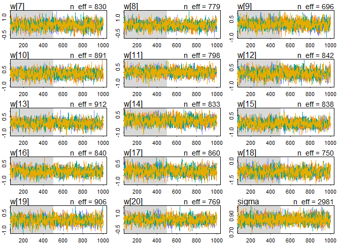
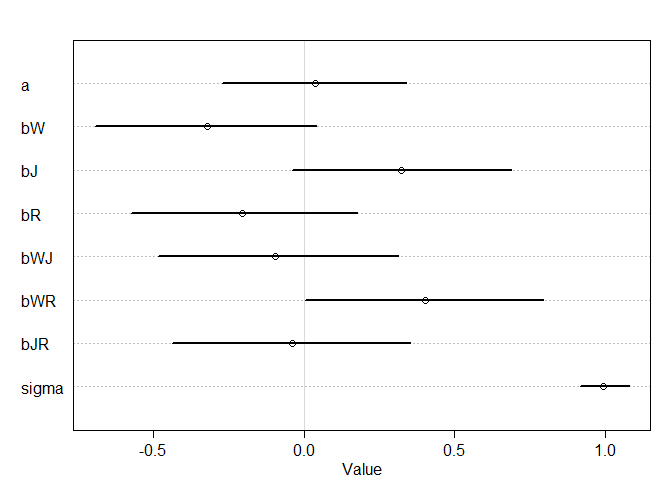
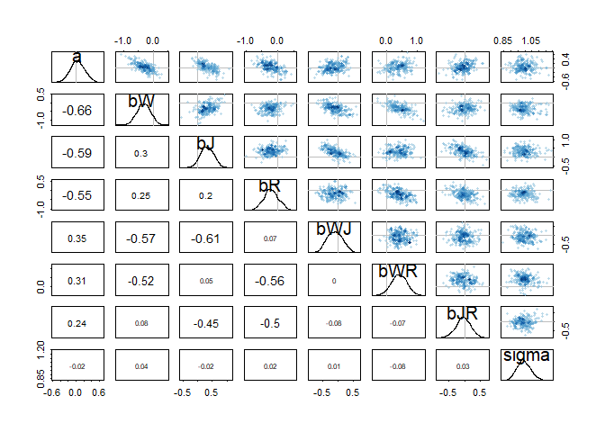

# STATISTICAL RETHINKING WINTER 2019

# HOMEWORK, WEEK 5

#### 1. Consider the data(Wines2012) data table. These data are expert ratings of 20 different French and American wines by 9 different French and American judges. Your goal is to model score, the subjective rating assigned by each judge to each wine. I recommend standardizing it. In this first problem, consider only variation among judges and wines. Construct index variables of judge and wine and then use these index variables to construct a linear regression model. Justify your priors. You should end up with 9 judge parameters and 20 wine parameters. Use ulam instead of quap to build this model, and be sure to check the chains for convergence. If you’d rather build the model directly in Stan or PyMC3, go ahead. I just want you to use Hamiltonian Monte Carlo instead of quadratic approximation. How do you interpret the variation among individual judges and individual wines? Do you notice any patterns, just by plotting the differences? Which judges gave the highest/lowest ratings? Which wines were rated worst/best on average?


```r
library(rethinking)
```

```
## Loading required package: rstan
```

```
## Loading required package: StanHeaders
```

```
## Loading required package: ggplot2
```

```
## rstan (Version 2.19.2, GitRev: 2e1f913d3ca3)
```

```
## For execution on a local, multicore CPU with excess RAM we recommend calling
## options(mc.cores = parallel::detectCores()).
## To avoid recompilation of unchanged Stan programs, we recommend calling
## rstan_options(auto_write = TRUE)
```

```
## For improved execution time, we recommend calling
## Sys.setenv(LOCAL_CPPFLAGS = '-march=native')
## although this causes Stan to throw an error on a few processors.
```

```
## Loading required package: parallel
```

```
## Loading required package: dagitty
```

```
## rethinking (Version 1.90)
```

```
## 
## Attaching package: 'rethinking'
```

```
## The following object is masked from 'package:stats':
## 
##     rstudent
```

```r
data(Wines2012)

data_wine <- Wines2012
summary(data_wine)
```

```
##              judge      flight        wine         score     
##  Daniele Meulder:20   red  :90   A1     :  9   Min.   : 7.0  
##  Francis Schott :20   white:90   A2     :  9   1st Qu.:12.0  
##  Jamal Rayyis   :20              B1     :  9   Median :14.5  
##  Jean-M Cardebat:20              B2     :  9   Mean   :14.2  
##  John Foy       :20              C1     :  9   3rd Qu.:16.0  
##  Linda Murphy   :20              C2     :  9   Max.   :19.5  
##  (Other)        :60              (Other):126                 
##    wine.amer     judge.amer    
##  Min.   :0.0   Min.   :0.0000  
##  1st Qu.:0.0   1st Qu.:0.0000  
##  Median :1.0   Median :1.0000  
##  Mean   :0.6   Mean   :0.5556  
##  3rd Qu.:1.0   3rd Qu.:1.0000  
##  Max.   :1.0   Max.   :1.0000  
## 
```

```r
str(data_wine)
```

```
## 'data.frame':	180 obs. of  6 variables:
##  $ judge     : Factor w/ 9 levels "Daniele Meulder",..: 4 4 4 4 4 4 4 4 4 4 ...
##  $ flight    : Factor w/ 2 levels "red","white": 2 2 2 2 2 2 2 2 2 2 ...
##  $ wine      : Factor w/ 20 levels "A1","A2","B1",..: 1 3 5 7 9 11 13 15 17 19 ...
##  $ score     : num  10 13 14 15 8 13 15 11 9 12 ...
##  $ wine.amer : int  1 1 0 0 1 1 1 0 1 0 ...
##  $ judge.amer: int  0 0 0 0 0 0 0 0 0 0 ...
```

```r
head(data_wine)
```

```
##             judge flight wine score wine.amer judge.amer
## 1 Jean-M Cardebat  white   A1    10         1          0
## 2 Jean-M Cardebat  white   B1    13         1          0
## 3 Jean-M Cardebat  white   C1    14         0          0
## 4 Jean-M Cardebat  white   D1    15         0          0
## 5 Jean-M Cardebat  white   E1     8         1          0
## 6 Jean-M Cardebat  white   F1    13         1          0
```

```r
new_wine <- list(
  jid = as.integer(data_wine$judge),
  wid = as.integer(data_wine$wine),
  S = scale(data_wine$score)
  )
summary(new_wine)
```

```
##     Length Class  Mode   
## jid 180    -none- numeric
## wid 180    -none- numeric
## S   180    -none- numeric
```

```r
str(new_wine)
```

```
## List of 3
##  $ jid: int [1:180] 4 4 4 4 4 4 4 4 4 4 ...
##  $ wid: int [1:180] 1 3 5 7 9 11 13 15 17 19 ...
##  $ S  : num [1:180, 1] -1.5766 -0.4505 -0.0751 0.3003 -2.3274 ...
##   ..- attr(*, "scaled:center")= num 14.2
##   ..- attr(*, "scaled:scale")= num 2.66
```


```r
HW9_m1 <- ulam(
  alist(
    S ~ dnorm( mu , sigma ),
    mu <- a[jid] + w[wid],
    a[jid] ~ dnorm(0,1),
    w[wid] ~ dnorm(0,1),
    sigma ~ dexp(1)
    ), 
  data=new_wine , chains=4 , cores=4 )
```

> Because we standardized the outcome, we can use N(0,1) for the outcome.


```r
## R code 9.15
show( HW9_m1 )
```

```
## Hamiltonian Monte Carlo approximation
## 2000 samples from 4 chains
## 
## Sampling durations (seconds):
##         warmup sample total
## chain:1   0.27   0.28  0.54
## chain:2   0.28   0.22  0.49
## chain:3   0.32   0.20  0.52
## chain:4   0.31   0.18  0.48
## 
## Formula:
## S ~ dnorm(mu, sigma)
## mu <- a[jid] + w[wid]
## a[jid] ~ dnorm(0, 1)
## w[wid] ~ dnorm(0, 1)
## sigma ~ dexp(1)
```

```r
## R code 9.16
precis( HW9_m1 , 2 )
```

```
##              mean         sd        5.5%       94.5%     n_eff      Rhat
## a[1]  -0.29993494 0.26185130 -0.71418509  0.11898809  490.9763 1.0061720
## a[2]   0.24461441 0.25850201 -0.17092569  0.64922689  543.5546 1.0044004
## a[3]   0.23457600 0.26486402 -0.18459012  0.66199222  573.2700 1.0042227
## a[4]  -0.58743516 0.26281759 -1.02053030 -0.17332457  586.6623 1.0053893
## a[5]   0.89261720 0.25658999  0.47271293  1.29857409  543.9070 1.0063534
## a[6]   0.54014581 0.26144770  0.10781408  0.97244897  474.9606 1.0055756
## a[7]   0.15923366 0.25865452 -0.24584678  0.57978651  476.5337 1.0057449
## a[8]  -0.71178252 0.26070774 -1.12482122 -0.29765055  498.5380 1.0066303
## a[9]  -0.37012156 0.26303178 -0.80482793  0.02967119  546.7089 1.0062778
## w[1]   0.13661308 0.32431760 -0.37697322  0.64801759  770.1480 1.0027805
## w[2]   0.08741352 0.32712238 -0.42890644  0.61800917  887.8472 1.0018088
## w[3]   0.27043767 0.32306558 -0.25351018  0.80464191  766.6311 1.0024097
## w[4]   0.55544047 0.32211122  0.05252839  1.06632573  816.3563 1.0012260
## w[5]  -0.14611712 0.32698316 -0.67416860  0.36737910  686.8273 1.0049731
## w[6]  -0.39075213 0.32276823 -0.91343320  0.12228804  839.2466 1.0008244
## w[7]   0.28395677 0.33084475 -0.24243723  0.80259282  771.9708 1.0040310
## w[8]   0.26795029 0.33476245 -0.27321786  0.80016995  914.4100 1.0020223
## w[9]   0.07591391 0.32578533 -0.44070337  0.59350852  885.0550 1.0010086
## w[10]  0.10484156 0.34217380 -0.44510037  0.64184716  829.1058 1.0007779
## w[11] -0.02341551 0.31926193 -0.52876987  0.49908370  714.2536 1.0038990
## w[12] -0.03766688 0.32390039 -0.53796799  0.47847278  773.6671 1.0028402
## w[13] -0.10761870 0.32576565 -0.63939257  0.38500634  864.2806 1.0019325
## w[14] -0.00595294 0.32243127 -0.51183851  0.50648726  823.1074 1.0040266
## w[15] -0.22954600 0.32578088 -0.75559390  0.28345257  778.8810 1.0057051
## w[16] -0.21350499 0.32880213 -0.74125641  0.31519439  857.2746 1.0025528
## w[17] -0.16280263 0.32408577 -0.66762662  0.36949779  916.3750 1.0015769
## w[18] -0.89108439 0.33022737 -1.41657042 -0.36637066  742.6877 1.0035884
## w[19] -0.18040935 0.32130781 -0.68505456  0.34466186  741.1538 1.0042714
## w[20]  0.37187101 0.31632687 -0.14783926  0.86585830  738.9687 1.0050243
## sigma  0.85414727 0.04943354  0.78163414  0.93676182 2181.0923 0.9996182
```

```r
plot(precis( HW9_m1 , 2 ))
```

<!-- -->

```r
## R code 9.17
#pairs( HW9_m1 )

## R code 9.18
traceplot( HW9_m1 )
```

```
## Waiting to draw page 2 of 2
```

<!-- --><!-- -->

```r
trankplot( HW9_m1 , n_cols=2 )
```

```
## Waiting to draw page 2 of 3
```

<!-- -->

```
## Waiting to draw page 3 of 3
```

<!-- --><!-- -->

>  They pass the hairy-caterpillar-ocular-inspection-test. There is larger variation from judges. FOr example, judge 4 and 8 have much lower average scores; judge 5 has much higher average scores. The variation from wine is smaller. Only the wine 18 has a much lower average score.

#### 2. Now consider three features of the wines and judges:
(1) flight: Whether the wine is red or white.
(2) wine.amer: Indicator variable for American wines.
(3) judge.amer: Indicator variable for American judges.

#### Use indicator or index variables to model the influence of these features on the scores. Omit the individual judge and wine index variables from Problem 1. Do not include interaction effects yet. Again use ulam, justify your priors, and be sure to check the chains. What do you conclude about the differences among the wines and judges? Try to relate the results to the inferences in Problem 1.


```r
new_wine2 <- list(
  S = scale(data_wine$score),
  RID = as.integer(data_wine$flight), #white=2, red=1
  WID = as.integer(data_wine$wine.amer)+1, #American=2, French=1
  JID = as.integer(data_wine$judge.amer)+1 #American=2, French=1
  )
summary(new_wine2)
```

```
##     Length Class  Mode   
## S   180    -none- numeric
## RID 180    -none- numeric
## WID 180    -none- numeric
## JID 180    -none- numeric
```

```r
str(new_wine2)
```

```
## List of 4
##  $ S  : num [1:180, 1] -1.5766 -0.4505 -0.0751 0.3003 -2.3274 ...
##   ..- attr(*, "scaled:center")= num 14.2
##   ..- attr(*, "scaled:scale")= num 2.66
##  $ RID: int [1:180] 2 2 2 2 2 2 2 2 2 2 ...
##  $ WID: num [1:180] 2 2 1 1 2 2 2 1 2 1 ...
##  $ JID: num [1:180] 1 1 1 1 1 1 1 1 1 1 ...
```


```r
HW9_m2 <- ulam(
  alist(
    S ~ dnorm( mu , sigma ),
    mu <- W[WID] + J[JID] + R[RID],
    W[WID] ~ dnorm( 0 , 1 ), 
    J[JID] ~ dnorm( 0 , 1 ), 
    R[RID] ~ dnorm( 0 , 1 ),
    sigma ~ dexp(1)
    ),
  data=new_wine2 , chains=4 , cores=4 )
precis( HW9_m2 , 2 )
```

```
##              mean        sd       5.5%     94.5%     n_eff      Rhat
## W[1]   0.04768040 0.5810917 -0.8431728 1.0036964  769.1286 1.0038945
## W[2]  -0.14599641 0.5796608 -1.0320562 0.7833597  781.0222 1.0034167
## J[1]  -0.08022563 0.5752941 -0.9929311 0.8531175  863.2021 1.0019708
## J[2]   0.16596137 0.5716148 -0.7423328 1.1110094  880.2579 1.0024538
## R[1]   0.01033113 0.5894999 -0.9573687 0.9580776  754.3321 1.0011672
## R[2]   0.01401034 0.5910388 -0.9599165 0.9731435  770.3617 1.0014887
## sigma  1.00153253 0.0525581  0.9221630 1.0902508 1316.1670 0.9986342
```


```r
## R code 9.15
show( HW9_m2 )
```

```
## Hamiltonian Monte Carlo approximation
## 2000 samples from 4 chains
## 
## Sampling durations (seconds):
##         warmup sample total
## chain:1   0.50   0.53  1.02
## chain:2   0.57   0.43  1.00
## chain:3   0.42   0.45  0.87
## chain:4   0.40   0.36  0.76
## 
## Formula:
## S ~ dnorm(mu, sigma)
## mu <- W[WID] + J[JID] + R[RID]
## W[WID] ~ dnorm(0, 1)
## J[JID] ~ dnorm(0, 1)
## R[RID] ~ dnorm(0, 1)
## sigma ~ dexp(1)
```

```r
## R code 9.16

plot(precis( HW9_m2 , 2 ))
```

<!-- -->

```r
## R code 9.17
pairs( HW9_m2 )
```

<!-- -->

```r
## R code 9.18
traceplot( HW9_m2 )

trankplot( HW9_m2 , n_cols=2 )
```

<!-- --><!-- -->

> There is no big difference between red or white wine, American or French wines, and American or French judges. American judges seem to give slightly higher scores. French wines seems to be slightly prefered.

#### 3. Now consider two-way interactions among the three features. You should end up with three different interaction terms in your model. These will be easier to build, if you use indicator variables. Again use ulam, justify your priors, and be sure to check the chains. Explain what each interaction means. Be sure to interpret the model’s predictions on the outcome scale (mu, the expected score), not on the scale of individual parameters. You can use link to help with this, or just use your knowledge of the linear model instead. What do you conclude about the features and the scores? Can you relate the results of your model(s) to the individual judge and wine inferences from Problem 1?


```r
new_wine3 <- list(
  S = scale(data_wine$score),
  R = as.integer(data_wine$flight), #white=2, red=1
  W = as.integer(data_wine$wine.amer)+1, #American=2, French=1
  J = as.integer(data_wine$judge.amer)+1 #American=2, French=1
  )
summary(new_wine3)
```

```
##   Length Class  Mode   
## S 180    -none- numeric
## R 180    -none- numeric
## W 180    -none- numeric
## J 180    -none- numeric
```

```r
str(new_wine3)
```

```
## List of 4
##  $ S: num [1:180, 1] -1.5766 -0.4505 -0.0751 0.3003 -2.3274 ...
##   ..- attr(*, "scaled:center")= num 14.2
##   ..- attr(*, "scaled:scale")= num 2.66
##  $ R: int [1:180] 2 2 2 2 2 2 2 2 2 2 ...
##  $ W: num [1:180] 2 2 1 1 2 2 2 1 2 1 ...
##  $ J: num [1:180] 1 1 1 1 1 1 1 1 1 1 ...
```


```r
HW9_m3 <- ulam(
  alist(
    S ~ dnorm( mu , sigma ),
    mu <- a + bW*W + bJ*J + bR*R + bWJ*W*J + bWR*W*R + bJR*J*R,
    a ~ dnorm(0,0.5),
    bW ~ dnorm(0,1),
    bJ ~ dnorm(0,1),
    bR ~ dnorm(0,1),
    bWJ ~ dnorm(0,0.5),
    bWR ~ dnorm(0,0.5),
    bJR ~ dnorm(0,0.5),
    sigma ~ dexp(1)
    ),
  data=new_wine3 , chains=4 , cores=4 )
```


```r
## R code 9.15
show( HW9_m3 )
```

```
## Hamiltonian Monte Carlo approximation
## 2000 samples from 4 chains
## 
## Sampling durations (seconds):
##         warmup sample total
## chain:1   4.08   3.44  7.53
## chain:2   3.77   3.63  7.40
## chain:3   4.22   3.00  7.22
## chain:4   4.48   2.46  6.94
## 
## Formula:
## S ~ dnorm(mu, sigma)
## mu <- a + bW * W + bJ * J + bR * R + bWJ * W * J + bWR * W * 
##     R + bJR * J * R
## a ~ dnorm(0, 0.5)
## bW ~ dnorm(0, 1)
## bJ ~ dnorm(0, 1)
## bR ~ dnorm(0, 1)
## bWJ ~ dnorm(0, 0.5)
## bWR ~ dnorm(0, 0.5)
## bJR ~ dnorm(0, 0.5)
## sigma ~ dexp(1)
```

```r
## R code 9.16
precis( HW9_m3 , 2 )
```

```
##              mean         sd        5.5%     94.5%    n_eff      Rhat
## a      0.08331458 0.41030118 -0.60684204 0.7259815 1167.065 1.0026657
## bW    -0.41734100 0.35716690 -0.99973028 0.1507511 1248.361 1.0014904
## bJ     0.54559421 0.37795563 -0.05242789 1.1444400 1006.806 1.0002861
## bR    -0.34382648 0.37764241 -0.95676932 0.2330032 1164.689 1.0025942
## bWJ   -0.12301859 0.21014400 -0.45754348 0.2087196 1094.941 1.0018454
## bWR    0.29447911 0.20652224 -0.04178722 0.6158151 1084.428 0.9989806
## bJR   -0.06451392 0.20932789 -0.40685516 0.2706141 1208.951 1.0028251
## sigma  0.99666437 0.05252796  0.91806866 1.0865441 1424.995 1.0037062
```

```r
plot(precis( HW9_m3 , 2 ))
```

<!-- -->

```r
## R code 9.17
pairs( HW9_m3 )
```

<!-- -->

```r
## R code 9.18
traceplot( HW9_m3 )

trankplot( HW9_m3 , n_cols=2 )
```

<!-- --><!-- -->
