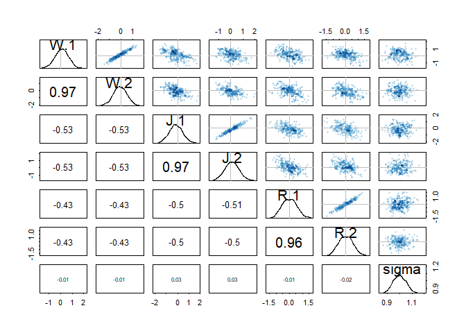

# STATISTICAL RETHINKING WINTER 2019

# HOMEWORK, WEEK 5

#### 1. Consider the data(Wines2012) data table. These data are expert ratings of 20 different French and American wines by 9 different French and American judges. Your goal is to model score, the subjective rating assigned by each judge to each wine. I recommend standardizing it. In this first problem, consider only variation among judges and wines. Construct index variables of judge and wine and then use these index variables to construct a linear regression model. Justify your priors. You should end up with 9 judge parameters and 20 wine parameters. Use ulam instead of quap to build this model, and be sure to check the chains for convergence. If you’d rather build the model directly in Stan or PyMC3, go ahead. I just want you to use Hamiltonian Monte Carlo instead of quadratic approximation. How do you interpret the variation among individual judges and individual wines? Do you notice any patterns, just by plotting the differences? Which judges gave the highest/lowest ratings? Which wines were rated worst/best on average?


```r
library(rethinking)
```

```
## Loading required package: rstan
```

```
## Loading required package: StanHeaders
```

```
## Loading required package: ggplot2
```

```
## rstan (Version 2.19.2, GitRev: 2e1f913d3ca3)
```

```
## For execution on a local, multicore CPU with excess RAM we recommend calling
## options(mc.cores = parallel::detectCores()).
## To avoid recompilation of unchanged Stan programs, we recommend calling
## rstan_options(auto_write = TRUE)
```

```
## For improved execution time, we recommend calling
## Sys.setenv(LOCAL_CPPFLAGS = '-march=native')
## although this causes Stan to throw an error on a few processors.
```

```
## Loading required package: parallel
```

```
## Loading required package: dagitty
```

```
## rethinking (Version 1.90)
```

```
## 
## Attaching package: 'rethinking'
```

```
## The following object is masked from 'package:stats':
## 
##     rstudent
```

```r
data(Wines2012)

data_wine <- Wines2012
summary(data_wine)
```

```
##              judge      flight        wine         score     
##  Daniele Meulder:20   red  :90   A1     :  9   Min.   : 7.0  
##  Francis Schott :20   white:90   A2     :  9   1st Qu.:12.0  
##  Jamal Rayyis   :20              B1     :  9   Median :14.5  
##  Jean-M Cardebat:20              B2     :  9   Mean   :14.2  
##  John Foy       :20              C1     :  9   3rd Qu.:16.0  
##  Linda Murphy   :20              C2     :  9   Max.   :19.5  
##  (Other)        :60              (Other):126                 
##    wine.amer     judge.amer    
##  Min.   :0.0   Min.   :0.0000  
##  1st Qu.:0.0   1st Qu.:0.0000  
##  Median :1.0   Median :1.0000  
##  Mean   :0.6   Mean   :0.5556  
##  3rd Qu.:1.0   3rd Qu.:1.0000  
##  Max.   :1.0   Max.   :1.0000  
## 
```

```r
str(data_wine)
```

```
## 'data.frame':	180 obs. of  6 variables:
##  $ judge     : Factor w/ 9 levels "Daniele Meulder",..: 4 4 4 4 4 4 4 4 4 4 ...
##  $ flight    : Factor w/ 2 levels "red","white": 2 2 2 2 2 2 2 2 2 2 ...
##  $ wine      : Factor w/ 20 levels "A1","A2","B1",..: 1 3 5 7 9 11 13 15 17 19 ...
##  $ score     : num  10 13 14 15 8 13 15 11 9 12 ...
##  $ wine.amer : int  1 1 0 0 1 1 1 0 1 0 ...
##  $ judge.amer: int  0 0 0 0 0 0 0 0 0 0 ...
```

```r
head(data_wine)
```

```
##             judge flight wine score wine.amer judge.amer
## 1 Jean-M Cardebat  white   A1    10         1          0
## 2 Jean-M Cardebat  white   B1    13         1          0
## 3 Jean-M Cardebat  white   C1    14         0          0
## 4 Jean-M Cardebat  white   D1    15         0          0
## 5 Jean-M Cardebat  white   E1     8         1          0
## 6 Jean-M Cardebat  white   F1    13         1          0
```

```r
new_wine <- list(
  jid = as.integer(data_wine$judge),
  wid = as.integer(data_wine$wine),
  S = scale(data_wine$score)
  )
summary(new_wine)
```

```
##     Length Class  Mode   
## jid 180    -none- numeric
## wid 180    -none- numeric
## S   180    -none- numeric
```

```r
str(new_wine)
```

```
## List of 3
##  $ jid: int [1:180] 4 4 4 4 4 4 4 4 4 4 ...
##  $ wid: int [1:180] 1 3 5 7 9 11 13 15 17 19 ...
##  $ S  : num [1:180, 1] -1.5766 -0.4505 -0.0751 0.3003 -2.3274 ...
##   ..- attr(*, "scaled:center")= num 14.2
##   ..- attr(*, "scaled:scale")= num 2.66
```


```r
HW9_m1 <- ulam(
  alist(
    S ~ dnorm( mu , sigma ),
    mu <- a[jid] + w[wid],
    a[jid] ~ dnorm(0,1),
    w[wid] ~ dnorm(0,1),
    sigma ~ dexp(1)
    ), 
  data=new_wine , chains=4 , cores=4 )
```

> Because we standardized the outcome, we can use N(0,1) for the outcome.


```r
## R code 9.15
show( HW9_m1 )
```

```
## Hamiltonian Monte Carlo approximation
## 2000 samples from 4 chains
## 
## Sampling durations (seconds):
##         warmup sample total
## chain:1   0.34   0.26  0.59
## chain:2   0.42   0.28  0.70
## chain:3   0.18   0.20  0.38
## chain:4   0.22   0.16  0.38
## 
## Formula:
## S ~ dnorm(mu, sigma)
## mu <- a[jid] + w[wid]
## a[jid] ~ dnorm(0, 1)
## w[wid] ~ dnorm(0, 1)
## sigma ~ dexp(1)
```

```r
## R code 9.16
precis( HW9_m1 , 2 )
```

```
##                mean        sd        5.5%       94.5%     n_eff     Rhat
## a[1]  -0.3022253391 0.2515275 -0.71491699  0.08493792  534.8334 1.001805
## a[2]   0.2444254453 0.2602921 -0.17985924  0.65167566  546.9345 1.003823
## a[3]   0.2349102378 0.2454961 -0.17385484  0.63724220  504.7051 1.003159
## a[4]  -0.5914365854 0.2533400 -0.98925221 -0.19615884  569.6988 1.002261
## a[5]   0.8787131899 0.2591105  0.44347321  1.28065053  560.4000 1.001361
## a[6]   0.5336129873 0.2581199  0.12439887  0.94693660  612.7041 1.002598
## a[7]   0.1519417660 0.2581531 -0.26730985  0.56230524  507.2042 1.004480
## a[8]  -0.7242074087 0.2616568 -1.15535359 -0.32089304  591.1030 1.003215
## a[9]  -0.3737450383 0.2581161 -0.78704576  0.03582646  569.0271 1.003189
## w[1]   0.1362030791 0.3260343 -0.38866086  0.66275132  787.8162 1.001505
## w[2]   0.1031541200 0.3229754 -0.38200346  0.62656152  751.9131 1.003797
## w[3]   0.2781260217 0.3285038 -0.22317930  0.80627454  756.1627 1.001972
## w[4]   0.5617659290 0.3168583  0.06527305  1.07527087  891.1407 1.001141
## w[5]  -0.1387155517 0.3326108 -0.65003893  0.39031190  889.3640 1.000147
## w[6]  -0.3834577316 0.3336818 -0.90004932  0.14659372  832.2594 1.001160
## w[7]   0.2918032371 0.3251879 -0.22578140  0.80888518  830.0924 1.000965
## w[8]   0.2759636141 0.3218766 -0.25321490  0.77566601  779.1317 1.000114
## w[9]   0.0808251457 0.3284040 -0.45337707  0.61083879  695.7994 1.003849
## w[10]  0.1179531675 0.3278291 -0.40213352  0.64534562  890.9690 1.002146
## w[11] -0.0120299161 0.3313132 -0.55111149  0.50809699  798.4551 1.002338
## w[12] -0.0321277005 0.3285641 -0.55243509  0.49935243  842.1205 1.001770
## w[13] -0.1119461758 0.3338821 -0.63973875  0.42215066  911.8684 1.000391
## w[14]  0.0001453675 0.3274186 -0.53933388  0.52157287  832.8077 1.002537
## w[15] -0.2220027317 0.3194070 -0.73184375  0.27818991  837.9217 1.002994
## w[16] -0.2069240889 0.3203541 -0.71155858  0.30610714  839.5984 1.000739
## w[17] -0.1587252969 0.3197214 -0.67835499  0.35875372  860.1140 1.000623
## w[18] -0.8855222434 0.3109466 -1.38219192 -0.37902744  750.3937 1.001271
## w[19] -0.1721262203 0.3294710 -0.67873642  0.37899735  905.6546 1.001127
## w[20]  0.3933340843 0.3225419 -0.12655593  0.90801970  769.2441 1.003100
## sigma  0.8510886019 0.0484566  0.77903792  0.93148079 2980.7013 1.000370
```

```r
plot(precis( HW9_m1 , 2 ))
```

<!-- -->

```r
## R code 9.17
#pairs( HW9_m1 )

## R code 9.18
traceplot( HW9_m1 )
```

```
## Waiting to draw page 2 of 2
```

<!-- --><!-- -->

```r
trankplot( HW9_m1 , n_cols=2 )
```

```
## Waiting to draw page 2 of 3
```

<!-- -->

```
## Waiting to draw page 3 of 3
```

<!-- --><!-- -->

>  They pass the hairy-caterpillar-ocular-inspection-test. There is larger variation from judges. FOr example, judge 4 and 8 have much lower average scores; judge 5 and 6 have much higher average scores. The variation from wine is smaller. Only the wine 18 has a much lower average score; and wine 4 has a much higher average score.

#### 2. Now consider three features of the wines and judges:
(1) flight: Whether the wine is red or white.
(2) wine.amer: Indicator variable for American wines.
(3) judge.amer: Indicator variable for American judges.

#### Use indicator or index variables to model the influence of these features on the scores. Omit the individual judge and wine index variables from Problem 1. Do not include interaction effects yet. Again use ulam, justify your priors, and be sure to check the chains. What do you conclude about the differences among the wines and judges? Try to relate the results to the inferences in Problem 1.


```r
new_wine2 <- list(
  S = scale(data_wine$score),
  RID = as.integer(data_wine$flight), #white=2, red=1
  WID = as.integer(data_wine$wine.amer)+1, #American=2, French=1
  JID = as.integer(data_wine$judge.amer)+1 #American=2, French=1
  )
summary(new_wine2)
```

```
##     Length Class  Mode   
## S   180    -none- numeric
## RID 180    -none- numeric
## WID 180    -none- numeric
## JID 180    -none- numeric
```

```r
str(new_wine2)
```

```
## List of 4
##  $ S  : num [1:180, 1] -1.5766 -0.4505 -0.0751 0.3003 -2.3274 ...
##   ..- attr(*, "scaled:center")= num 14.2
##   ..- attr(*, "scaled:scale")= num 2.66
##  $ RID: int [1:180] 2 2 2 2 2 2 2 2 2 2 ...
##  $ WID: num [1:180] 2 2 1 1 2 2 2 1 2 1 ...
##  $ JID: num [1:180] 1 1 1 1 1 1 1 1 1 1 ...
```


```r
HW9_m2 <- ulam(
  alist(
    S ~ dnorm( mu , sigma ),
    mu <- W[WID] + J[JID] + R[RID],
    W[WID] ~ dnorm( 0 , 1 ), 
    J[JID] ~ dnorm( 0 , 1 ), 
    R[RID] ~ dnorm( 0 , 1 ),
    sigma ~ dexp(1)
    ),
  data=new_wine2 , chains=4 , cores=4 )
precis( HW9_m2 , 2 )
```

```
##              mean         sd       5.5%     94.5%     n_eff     Rhat
## W[1]   0.09983688 0.57497428 -0.8200131 0.9897929  758.6189 1.003557
## W[2]  -0.09345090 0.57386287 -0.9878620 0.8281741  768.4050 1.003680
## J[1]  -0.14386060 0.59801023 -1.1099689 0.8369087  787.3226 1.002807
## J[2]   0.10615253 0.59943560 -0.8450219 1.0811480  779.0564 1.002958
## R[1]   0.01680355 0.56299888 -0.8605813 0.9245884  786.7938 1.007444
## R[2]   0.02409155 0.56073223 -0.8589557 0.9356880  790.9619 1.007638
## sigma  0.99987148 0.05184808  0.9180454 1.0830670 1442.9744 1.000528
```


```r
## R code 9.15
show( HW9_m2 )
```

```
## Hamiltonian Monte Carlo approximation
## 2000 samples from 4 chains
## 
## Sampling durations (seconds):
##         warmup sample total
## chain:1   0.36   0.57  0.93
## chain:2   0.37   0.46  0.82
## chain:3   0.40   0.34  0.74
## chain:4   0.36   0.31  0.67
## 
## Formula:
## S ~ dnorm(mu, sigma)
## mu <- W[WID] + J[JID] + R[RID]
## W[WID] ~ dnorm(0, 1)
## J[JID] ~ dnorm(0, 1)
## R[RID] ~ dnorm(0, 1)
## sigma ~ dexp(1)
```

```r
## R code 9.16

plot(precis( HW9_m2 , 2 ))
```

<!-- -->

```r
## R code 9.17
pairs( HW9_m2 )
```

<!-- -->

```r
## R code 9.18
traceplot( HW9_m2 )

trankplot( HW9_m2 , n_cols=2 )
```

<!-- --><!-- -->

> There is no big difference between red or white wine, American or French wines, and American or French judges. American judges seem to give slightly higher scores. French wines seems to be slightly prefered.

#### 3. Now consider two-way interactions among the three features. You should end up with three different interaction terms in your model. These will be easier to build, if you use indicator variables. Again use ulam, justify your priors, and be sure to check the chains. Explain what each interaction means. Be sure to interpret the model’s predictions on the outcome scale (mu, the expected score), not on the scale of individual parameters. You can use link to help with this, or just use your knowledge of the linear model instead. What do you conclude about the features and the scores? Can you relate the results of your model(s) to the individual judge and wine inferences from Problem 1?


```r
new_wine3 <- list(
  S = scale(data_wine$score),
  R = as.integer(data_wine$flight)-1, #white=1, red=0
  W = as.integer(data_wine$wine.amer), #American=1, French=0
  J = as.integer(data_wine$judge.amer) #American=1, French=0
  )
summary(new_wine3)
```

```
##   Length Class  Mode   
## S 180    -none- numeric
## R 180    -none- numeric
## W 180    -none- numeric
## J 180    -none- numeric
```

```r
str(new_wine3)
```

```
## List of 4
##  $ S: num [1:180, 1] -1.5766 -0.4505 -0.0751 0.3003 -2.3274 ...
##   ..- attr(*, "scaled:center")= num 14.2
##   ..- attr(*, "scaled:scale")= num 2.66
##  $ R: num [1:180] 1 1 1 1 1 1 1 1 1 1 ...
##  $ W: int [1:180] 1 1 0 0 1 1 1 0 1 0 ...
##  $ J: int [1:180] 0 0 0 0 0 0 0 0 0 0 ...
```


```r
HW9_m3 <- ulam(
  alist(
    S ~ dnorm( mu , sigma ),
    mu <- a + bW*W + bJ*J + bR*R + bWJ*W*J + bWR*W*R + bJR*J*R,
    a ~ dnorm(0,0.5),
    bW ~ dnorm(0,1),
    bJ ~ dnorm(0,1),
    bR ~ dnorm(0,1),
    bWJ ~ dnorm(0,0.5),
    bWR ~ dnorm(0,0.5),
    bJR ~ dnorm(0,0.5),
    sigma ~ dexp(1)
    ),
  data=new_wine3 , chains=4 , cores=4 )
```


```r
## R code 9.15
show( HW9_m3 )
```

```
## Hamiltonian Monte Carlo approximation
## 2000 samples from 4 chains
## 
## Sampling durations (seconds):
##         warmup sample total
## chain:1   1.12   0.67  1.79
## chain:2   0.82   0.53  1.35
## chain:3   0.69   0.55  1.24
## chain:4   0.52   0.44  0.96
## 
## Formula:
## S ~ dnorm(mu, sigma)
## mu <- a + bW * W + bJ * J + bR * R + bWJ * W * J + bWR * W * 
##     R + bJR * J * R
## a ~ dnorm(0, 0.5)
## bW ~ dnorm(0, 1)
## bJ ~ dnorm(0, 1)
## bR ~ dnorm(0, 1)
## bWJ ~ dnorm(0, 0.5)
## bWR ~ dnorm(0, 0.5)
## bJR ~ dnorm(0, 0.5)
## sigma ~ dexp(1)
```

```r
## R code 9.16
precis( HW9_m3 , 2 )
```

```
##              mean         sd         5.5%      94.5%     n_eff      Rhat
## a      0.03745063 0.19022400 -0.270284232 0.34059292  944.3513 1.0008119
## bW    -0.32308298 0.23251148 -0.695103944 0.04000856 1029.5491 0.9990374
## bJ     0.32282606 0.22779290 -0.038174158 0.68763213 1058.5646 1.0024181
## bR    -0.20446452 0.23127032 -0.574256446 0.17734686 1017.6775 0.9997672
## bWJ   -0.09674061 0.25339656 -0.483180490 0.31164174 1182.1377 0.9998861
## bWR    0.40352452 0.24801891  0.004621092 0.79590999 1251.1560 0.9991738
## bJR   -0.03907242 0.24395299 -0.439244916 0.35113311 1097.3799 1.0016209
## sigma  0.99357041 0.05233414  0.915952873 1.08012584 1768.7883 1.0016832
```

```r
plot(precis( HW9_m3 , 2 ))
```

<!-- -->

```r
## R code 9.17
pairs( HW9_m3 )
```

<!-- -->

```r
## R code 9.18
traceplot( HW9_m3 )

trankplot( HW9_m3 , n_cols=2 )
```

<!-- --><!-- -->

> after adding interactions, we noticed that the main effect of red or white wine, American or French wines, and American or French judges become more obvious.
