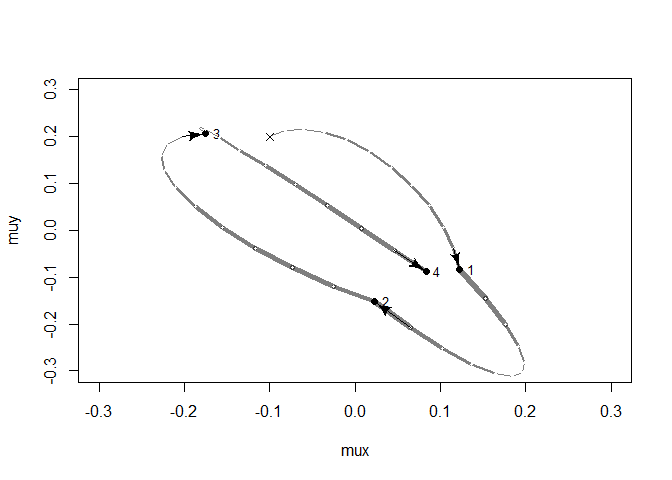

```r
library(rethinking)
```

```
## Loading required package: rstan
```

```
## Warning: package 'rstan' was built under R version 3.5.3
```

```
## Loading required package: ggplot2
```

```
## Loading required package: StanHeaders
```

```
## Warning: package 'StanHeaders' was built under R version 3.5.3
```

```
## rstan (Version 2.18.2, GitRev: 2e1f913d3ca3)
```

```
## For execution on a local, multicore CPU with excess RAM we recommend calling
## options(mc.cores = parallel::detectCores()).
## To avoid recompilation of unchanged Stan programs, we recommend calling
## rstan_options(auto_write = TRUE)
```

```
## For improved execution time, we recommend calling
## Sys.setenv(LOCAL_CPPFLAGS = '-march=native')
## although this causes Stan to throw an error on a few processors.
```

```
## Loading required package: parallel
```

```
## rethinking (Version 1.88)
```

# 9 Markov Chain Monte Carlo

## 9.1. Good King Markov and His island kingdom


```r
## R code 9.1
num_weeks <- 1e5
positions <- rep(0,num_weeks)
current <- 10
for ( i in 1:num_weeks ) {
    # record current position
    positions[i] <- current

    # flip coin to generate proposal
    proposal <- current + sample( c(-1,1) , size=1 )
    # now make sure he loops around the archipelago
    if ( proposal < 1 ) proposal <- 10
    if ( proposal > 10 ) proposal <- 1

    # move?
    prob_move <- proposal/current
    current <- ifelse( runif(1) < prob_move , proposal , current )
}
hist(positions)
```

<!-- -->

## 9.2. Metropolis, Gibbs, and Sadness
### 9.2.1. Gibbs sampling.
### 9.2.2. High-dimensional sadness.


```r
## R code 9.2
D <- 10
T <- 1e3
Y <- rmvnorm(T,rep(0,D),diag(D))
rad_dist <- function( Y ) sqrt( sum(Y^2) )
Rd <- sapply( 1:T , function(i) rad_dist( Y[i,] ) )
dens( Rd )
```

<!-- -->

## 9.3. Hamiltonian Monte Carlo
### 9.3.1. Another parable.
### 9.3.2. Particles in space.


```r
## R code 9.3
# U needs to return neg-log-probability
myU4 <- function( q , a=0 , b=1 , k=0 , d=1 ) {
    muy <- q[1]
    mux <- q[2]
    U <- sum( dnorm(y,muy,1,log=TRUE) ) + sum( dnorm(x,mux,1,log=TRUE) ) +
        dnorm(muy,a,b,log=TRUE) + dnorm(mux,k,d,log=TRUE)
    return( -U )
}

## R code 9.4
# gradient function
# need vector of partial derivatives of U with respect to vector q
myU_grad4 <- function( q , a=0 , b=1 , k=0 , d=1 ) {
    muy <- q[1]
    mux <- q[2]
    G1 <- sum( y - muy ) + (a - muy)/b^2 #dU/dmuy
    G2 <- sum( x - mux ) + (k - mux)/d^2 #dU/dmuy
    return( c( -G1 , -G2 ) ) # negative bc energy is neg-log-prob
}
# test data
set.seed(7)
y <- rnorm(50)
x <- rnorm(50)
x <- as.numeric(scale(x))
y <- as.numeric(scale(y))

## R code 9.5
library(shape) # for fancy arrows
Q <- list()
Q$q <- c(-0.1,0.2)
pr <- 0.3
plot( NULL , ylab="muy" , xlab="mux" , xlim=c(-pr,pr) , ylim=c(-pr,pr) )
step <- 0.03
L <- 11 # 0.03/28 for U-turns --- 11 for working example
n_samples <- 4
path_col <- col.alpha("black",0.5)
points( Q$q[1] , Q$q[2] , pch=4 , col="black" )
for ( i in 1:n_samples ) {
    Q <- HMC2( myU4 , myU_grad4 , step , L , Q$q )
    if ( n_samples < 10 ) {
      for ( j in 1:L ) {
        K0 <- sum(Q$ptraj[j,]^2)/2 # kinetic energy
        lines( Q$traj[j:(j+1),1] , Q$traj[j:(j+1),2] , col=path_col , lwd=1+2*K0 )
      }
      points( Q$traj[1:L+1,] , pch=16 , col="white" , cex=0.35 )
      Arrows( Q$traj[L,1] , Q$traj[L,2] , Q$traj[L+1,1] , Q$traj[L+1,2] ,
          arr.length=0.35 , arr.adj = 0.7 )
      text( Q$traj[L+1,1] , Q$traj[L+1,2] , i , cex=0.8 , pos=4 , offset=0.4 )
    }
    points( Q$traj[L+1,1] , Q$traj[L+1,2] , pch=ifelse( Q$accept==1 , 16 , 1 ) ,
        col=ifelse( abs(Q$dH)>0.1 , "red" , "black" ) )
}
```

<!-- -->


```r
## R code 9.6
HMC2 <- function (U, grad_U, epsilon, L, current_q) {
  q = current_q
  p = rnorm(length(q),0,1) # random flick - p is momentum.
  current_p = p
  # Make a half step for momentum at the beginning
  p = p - epsilon * grad_U(q) / 2
  # initialize bookkeeping - saves trajectory
  qtraj <- matrix(NA,nrow=L+1,ncol=length(q))
  ptraj <- qtraj
  qtraj[1,] <- current_q
  ptraj[1,] <- p

## R code 9.7
  # Alternate full steps for position and momentum
  for ( i in 1:L ) {
    q = q + epsilon * p # Full step for the position
    # Make a full step for the momentum, except at end of trajectory
    if ( i!=L ) {
        p = p - epsilon * grad_U(q)
        ptraj[i+1,] <- p
    }
    qtraj[i+1,] <- q
  }

## R code 9.8
  # Make a half step for momentum at the end
  p = p - epsilon * grad_U(q) / 2
  ptraj[L+1,] <- p
  # Negate momentum at end of trajectory to make the proposal symmetric
  p = -p
  # Evaluate potential and kinetic energies at start and end of trajectory
  current_U = U(current_q)
  current_K = sum(current_p^2) / 2
  proposed_U = U(q)
  proposed_K = sum(p^2) / 2
  # Accept or reject the state at end of trajectory, returning either
  # the position at the end of the trajectory or the initial position
  accept <- 0
  if (runif(1) < exp(current_U-proposed_U+current_K-proposed_K)) {
    new_q <- q  # accept
    accept <- 1
  } else new_q <- current_q  # reject
  return(list( q=new_q, traj=qtraj, ptraj=ptraj, accept=accept ))
}
```

### 9.3.3. Limitations.

## 9.4. Easy HMC: ulam


```r
## R code 9.9
library(rethinking)
data(rugged)
d <- rugged
d$log_gdp <- log(d$rgdppc_2000)
dd <- d[ complete.cases(d$rgdppc_2000) , ]
dd$log_gdp_std <- dd$log_gdp / mean(dd$log_gdp)
dd$rugged_std <- dd$rugged / max(dd$rugged)
dd$cid <- ifelse( dd$cont_africa==1 , 1 , 2 )

## R code 9.10
m8.5 <- quap(
    alist(
        log_gdp_std ~ dnorm( mu , sigma ) ,
        mu <- a[cid] + b[cid]*( rugged_std - 0.215 ) ,
        a[cid] ~ dnorm( 1 , 0.1 ) ,
        b[cid] ~ dnorm( 0 , 0.3 ) ,
        sigma ~ dexp( 1 )
    ) ,
    data=dd )
precis( m8.5 , depth=2 )
```

```
##             mean          sd        5.5%       94.5%
## a[1]   0.8865640 0.015674552  0.86151302  0.91161495
## a[2]   1.0505666 0.009935872  1.03468714  1.06644602
## b[1]   0.1324981 0.074199237  0.01391344  0.25108286
## b[2]  -0.1426057 0.054745410 -0.23009945 -0.05511197
## sigma  0.1094859 0.005934188  0.10000194  0.11896990
```

### 9.4.1. Preparation.


```r
## R code 9.11
dat_slim <- list(
    log_gdp_std = dd$log_gdp_std,
    rugged_std = dd$rugged_std,
    cid = as.integer( dd$cid )
)
str(dat_slim)
```

```
## List of 3
##  $ log_gdp_std: num [1:170] 0.88 0.965 1.166 1.104 0.915 ...
##  $ rugged_std : num [1:170] 0.138 0.553 0.124 0.125 0.433 ...
##  $ cid        : int [1:170] 1 2 2 2 2 2 2 2 2 1 ...
```

```r
library(rstan)

## R code 9.12
m9.1 <- ulam(
    alist(
        log_gdp_std ~ dnorm( mu , sigma ) ,
        mu <- a[cid] + b[cid]*( rugged_std - 0.215 ) ,
        a[cid] ~ dnorm( 1 , 0.1 ) ,
        b[cid] ~ dnorm( 0 , 0.3 ) ,
        sigma ~ dexp( 1 )
    ) ,
    data=dat_slim , chains=1 )
```

```
## 
## SAMPLING FOR MODEL '4e638bc82c4247257e76c1202e0a46c7' NOW (CHAIN 1).
## Chain 1: 
## Chain 1: Gradient evaluation took 0 seconds
## Chain 1: 1000 transitions using 10 leapfrog steps per transition would take 0 seconds.
## Chain 1: Adjust your expectations accordingly!
## Chain 1: 
## Chain 1: 
## Chain 1: Iteration:   1 / 1000 [  0%]  (Warmup)
## Chain 1: Iteration: 100 / 1000 [ 10%]  (Warmup)
## Chain 1: Iteration: 200 / 1000 [ 20%]  (Warmup)
## Chain 1: Iteration: 300 / 1000 [ 30%]  (Warmup)
## Chain 1: Iteration: 400 / 1000 [ 40%]  (Warmup)
## Chain 1: Iteration: 500 / 1000 [ 50%]  (Warmup)
## Chain 1: Iteration: 501 / 1000 [ 50%]  (Sampling)
## Chain 1: Iteration: 600 / 1000 [ 60%]  (Sampling)
## Chain 1: Iteration: 700 / 1000 [ 70%]  (Sampling)
## Chain 1: Iteration: 800 / 1000 [ 80%]  (Sampling)
## Chain 1: Iteration: 900 / 1000 [ 90%]  (Sampling)
## Chain 1: Iteration: 1000 / 1000 [100%]  (Sampling)
## Chain 1: 
## Chain 1:  Elapsed Time: 0.069 seconds (Warm-up)
## Chain 1:                0.042 seconds (Sampling)
## Chain 1:                0.111 seconds (Total)
## Chain 1:
```

```r
## R code 9.13
precis( m9.1 , depth=2 )
```

```
##             mean          sd         5.5%      94.5%    n_eff      Rhat
## a[1]   0.8868592 0.016145058  0.861388135  0.9122303 623.1949 0.9984831
## a[2]   1.0506023 0.009757382  1.035175527  1.0664952 759.0145 0.9995359
## b[1]   0.1304762 0.081122734  0.003666055  0.2633354 821.6967 0.9980814
## b[2]  -0.1416984 0.055714430 -0.228069295 -0.0508553 926.1774 0.9998695
## sigma  0.1115384 0.006167257  0.102747907  0.1213266 704.1658 1.0014432
```

### 9.4.3. Sampling again, in parallel.


```r
## R code 9.14
m9.1 <- ulam(
    alist(
        log_gdp_std ~ dnorm( mu , sigma ) ,
        mu <- a[cid] + b[cid]*( rugged_std - 0.215 ) ,
        a[cid] ~ dnorm( 1 , 0.1 ) ,
        b[cid] ~ dnorm( 0 , 0.3 ) ,
        sigma ~ dexp( 1 )
    ) ,
    data=dat_slim , chains=4 , cores=4 , iter=1000 )
```

```
## recompiling to avoid crashing R session
```

```r
## R code 9.15
show( m9.1 )
```

```
## Hamiltonian Monte Carlo approximation
## 2000 samples from 4 chains
## 
## Sampling durations (seconds):
##         warmup sample total
## chain:1   0.14   0.07  0.21
## chain:2   0.07   0.05  0.11
## chain:3   0.10   0.07  0.16
## chain:4   0.07   0.05  0.12
## 
## Formula:
## log_gdp_std ~ dnorm(mu, sigma)
## mu <- a[cid] + b[cid] * (rugged_std - 0.215)
## a[cid] ~ dnorm(1, 0.1)
## b[cid] ~ dnorm(0, 0.3)
## sigma ~ dexp(1)
```

```r
## R code 9.16
precis( m9.1 , 2 )
```

```
##             mean          sd        5.5%       94.5%    n_eff      Rhat
## a[1]   0.8866487 0.016307201  0.86075364  0.91205534 2543.033 1.0002840
## a[2]   1.0507846 0.010433763  1.03380680  1.06707201 3146.192 0.9986590
## b[1]   0.1334444 0.076407342  0.01128085  0.25639131 2924.255 0.9996238
## b[2]  -0.1430293 0.058570981 -0.23577609 -0.05108777 3094.211 0.9985685
## sigma  0.1114841 0.005964027  0.10210873  0.12132315 2287.570 0.9995046
```

```r
## R code 9.17
pairs( m9.1 )
```

<!-- -->

### 9.4.5. Checking the chain.

```r
## R code 9.18
traceplot( m9.1 )
```

<!-- -->

## 9.5. Care and feeding of your Markov chain
### 9.5.1. How many samples do you need?
### 9.5.2. How many chains do you need?
### 9.5.3. Taming a wild chain.


```r
## R code 9.19
y <- c(-1,1)
set.seed(11)
m9.2 <- ulam(
    alist(
        y ~ dnorm( mu , sigma ) ,
        mu <- alpha ,
        alpha ~ dnorm( 0 , 1000 ) ,
        sigma ~ dexp( 0.0001 )
    ) ,
    data=list(y=y) , chains=2 )
```

```
## Cautionary note:
```

```
## Variable y contains only integers but is not type 'integer'. If you intend it as an index variable, you should as.integer() it before passing to ulam.
```

```
## 
## SAMPLING FOR MODEL 'd26c527083e7eda89b17a8c2eccd6019' NOW (CHAIN 1).
## Chain 1: 
## Chain 1: Gradient evaluation took 0 seconds
## Chain 1: 1000 transitions using 10 leapfrog steps per transition would take 0 seconds.
## Chain 1: Adjust your expectations accordingly!
## Chain 1: 
## Chain 1: 
## Chain 1: Iteration:   1 / 1000 [  0%]  (Warmup)
## Chain 1: Iteration: 100 / 1000 [ 10%]  (Warmup)
## Chain 1: Iteration: 200 / 1000 [ 20%]  (Warmup)
## Chain 1: Iteration: 300 / 1000 [ 30%]  (Warmup)
## Chain 1: Iteration: 400 / 1000 [ 40%]  (Warmup)
## Chain 1: Iteration: 500 / 1000 [ 50%]  (Warmup)
## Chain 1: Iteration: 501 / 1000 [ 50%]  (Sampling)
## Chain 1: Iteration: 600 / 1000 [ 60%]  (Sampling)
## Chain 1: Iteration: 700 / 1000 [ 70%]  (Sampling)
## Chain 1: Iteration: 800 / 1000 [ 80%]  (Sampling)
## Chain 1: Iteration: 900 / 1000 [ 90%]  (Sampling)
## Chain 1: Iteration: 1000 / 1000 [100%]  (Sampling)
## Chain 1: 
## Chain 1:  Elapsed Time: 0.059 seconds (Warm-up)
## Chain 1:                0.023 seconds (Sampling)
## Chain 1:                0.082 seconds (Total)
## Chain 1: 
## 
## SAMPLING FOR MODEL 'd26c527083e7eda89b17a8c2eccd6019' NOW (CHAIN 2).
## Chain 2: 
## Chain 2: Gradient evaluation took 0 seconds
## Chain 2: 1000 transitions using 10 leapfrog steps per transition would take 0 seconds.
## Chain 2: Adjust your expectations accordingly!
## Chain 2: 
## Chain 2: 
## Chain 2: Iteration:   1 / 1000 [  0%]  (Warmup)
## Chain 2: Iteration: 100 / 1000 [ 10%]  (Warmup)
## Chain 2: Iteration: 200 / 1000 [ 20%]  (Warmup)
## Chain 2: Iteration: 300 / 1000 [ 30%]  (Warmup)
## Chain 2: Iteration: 400 / 1000 [ 40%]  (Warmup)
## Chain 2: Iteration: 500 / 1000 [ 50%]  (Warmup)
## Chain 2: Iteration: 501 / 1000 [ 50%]  (Sampling)
## Chain 2: Iteration: 600 / 1000 [ 60%]  (Sampling)
## Chain 2: Iteration: 700 / 1000 [ 70%]  (Sampling)
## Chain 2: Iteration: 800 / 1000 [ 80%]  (Sampling)
## Chain 2: Iteration: 900 / 1000 [ 90%]  (Sampling)
## Chain 2: Iteration: 1000 / 1000 [100%]  (Sampling)
## Chain 2: 
## Chain 2:  Elapsed Time: 0.062 seconds (Warm-up)
## Chain 2:                0.02 seconds (Sampling)
## Chain 2:                0.082 seconds (Total)
## Chain 2:
```

```
## Warning: There were 96 divergent transitions after warmup. Increasing adapt_delta above 0.95 may help. See
## http://mc-stan.org/misc/warnings.html#divergent-transitions-after-warmup
```

```
## Warning: Examine the pairs() plot to diagnose sampling problems
```

```r
## R code 9.20
precis( m9.2 )
```

```
##             mean       sd      5.5%     94.5%     n_eff     Rhat
## alpha  -6.165245  344.395 -466.7449  395.5068 163.66023 1.001072
## sigma 625.958020 1918.365   17.1891 2281.9234  37.48127 1.032970
```

```r
pairs(m9.2@stanfit)
```

```
## Warning in KernSmooth::bkde2D(x, bandwidth = bandwidth, gridsize = nbin, :
## Binning grid too coarse for current (small) bandwidth: consider increasing
## 'gridsize'
```

```
## Warning in KernSmooth::bkde2D(x, bandwidth = bandwidth, gridsize = nbin, :
## Binning grid too coarse for current (small) bandwidth: consider increasing
## 'gridsize'

## Warning in KernSmooth::bkde2D(x, bandwidth = bandwidth, gridsize = nbin, :
## Binning grid too coarse for current (small) bandwidth: consider increasing
## 'gridsize'
```

<!-- -->

```r
traceplot(m9.2)
```

<!-- -->


```r
## R code 9.21
set.seed(11)
m9.3 <- ulam(
    alist(
        y ~ dnorm( mu , sigma ) ,
        mu <- alpha ,
        alpha ~ dnorm( 1 , 10 ) ,
        sigma ~ dexp( 1 )
    ) ,
    data=list(y=y) , chains=2 )
```

```
## Cautionary note:
```

```
## Variable y contains only integers but is not type 'integer'. If you intend it as an index variable, you should as.integer() it before passing to ulam.
```

```
## 
## SAMPLING FOR MODEL '593afb1307e5b69f89a21ad207f22894' NOW (CHAIN 1).
## Chain 1: 
## Chain 1: Gradient evaluation took 0 seconds
## Chain 1: 1000 transitions using 10 leapfrog steps per transition would take 0 seconds.
## Chain 1: Adjust your expectations accordingly!
## Chain 1: 
## Chain 1: 
## Chain 1: Iteration:   1 / 1000 [  0%]  (Warmup)
## Chain 1: Iteration: 100 / 1000 [ 10%]  (Warmup)
## Chain 1: Iteration: 200 / 1000 [ 20%]  (Warmup)
## Chain 1: Iteration: 300 / 1000 [ 30%]  (Warmup)
## Chain 1: Iteration: 400 / 1000 [ 40%]  (Warmup)
## Chain 1: Iteration: 500 / 1000 [ 50%]  (Warmup)
## Chain 1: Iteration: 501 / 1000 [ 50%]  (Sampling)
## Chain 1: Iteration: 600 / 1000 [ 60%]  (Sampling)
## Chain 1: Iteration: 700 / 1000 [ 70%]  (Sampling)
## Chain 1: Iteration: 800 / 1000 [ 80%]  (Sampling)
## Chain 1: Iteration: 900 / 1000 [ 90%]  (Sampling)
## Chain 1: Iteration: 1000 / 1000 [100%]  (Sampling)
## Chain 1: 
## Chain 1:  Elapsed Time: 0.018 seconds (Warm-up)
## Chain 1:                0.016 seconds (Sampling)
## Chain 1:                0.034 seconds (Total)
## Chain 1: 
## 
## SAMPLING FOR MODEL '593afb1307e5b69f89a21ad207f22894' NOW (CHAIN 2).
## Chain 2: 
## Chain 2: Gradient evaluation took 0 seconds
## Chain 2: 1000 transitions using 10 leapfrog steps per transition would take 0 seconds.
## Chain 2: Adjust your expectations accordingly!
## Chain 2: 
## Chain 2: 
## Chain 2: Iteration:   1 / 1000 [  0%]  (Warmup)
## Chain 2: Iteration: 100 / 1000 [ 10%]  (Warmup)
## Chain 2: Iteration: 200 / 1000 [ 20%]  (Warmup)
## Chain 2: Iteration: 300 / 1000 [ 30%]  (Warmup)
## Chain 2: Iteration: 400 / 1000 [ 40%]  (Warmup)
## Chain 2: Iteration: 500 / 1000 [ 50%]  (Warmup)
## Chain 2: Iteration: 501 / 1000 [ 50%]  (Sampling)
## Chain 2: Iteration: 600 / 1000 [ 60%]  (Sampling)
## Chain 2: Iteration: 700 / 1000 [ 70%]  (Sampling)
## Chain 2: Iteration: 800 / 1000 [ 80%]  (Sampling)
## Chain 2: Iteration: 900 / 1000 [ 90%]  (Sampling)
## Chain 2: Iteration: 1000 / 1000 [100%]  (Sampling)
## Chain 2: 
## Chain 2:  Elapsed Time: 0.017 seconds (Warm-up)
## Chain 2:                0.013 seconds (Sampling)
## Chain 2:                0.03 seconds (Total)
## Chain 2:
```

```r
precis( m9.3 )
```

```
##             mean        sd       5.5%    94.5%    n_eff     Rhat
## alpha 0.04516953 1.2538264 -1.9903854 1.801000 213.1397 1.008117
## sigma 1.55272622 0.7945071  0.7041972 3.097116 265.3611 1.013683
```

```r
pairs(m9.3@stanfit)
```

<!-- -->

```r
traceplot(m9.3)
```

<!-- -->

### 9.5.4. Non-identifiable parameters.


```r
## R code 9.22
set.seed(41)
y <- rnorm( 100 , mean=0 , sd=1 )

## R code 9.23
m9.4 <- ulam(
    alist(
        y ~ dnorm( mu , sigma ) ,
        mu <- a1 + a2 ,
        a1 ~ dnorm( 0 , 1000 ),
        a2 ~ dnorm( 0 , 1000 ),
        sigma ~ dexp( 1 )
    ) ,
    data=list(y=y) , chains=2 )
```

```
## 
## SAMPLING FOR MODEL 'e6372181749abf126ca67665f3f2df39' NOW (CHAIN 1).
## Chain 1: 
## Chain 1: Gradient evaluation took 0 seconds
## Chain 1: 1000 transitions using 10 leapfrog steps per transition would take 0 seconds.
## Chain 1: Adjust your expectations accordingly!
## Chain 1: 
## Chain 1: 
## Chain 1: Iteration:   1 / 1000 [  0%]  (Warmup)
## Chain 1: Iteration: 100 / 1000 [ 10%]  (Warmup)
## Chain 1: Iteration: 200 / 1000 [ 20%]  (Warmup)
## Chain 1: Iteration: 300 / 1000 [ 30%]  (Warmup)
## Chain 1: Iteration: 400 / 1000 [ 40%]  (Warmup)
## Chain 1: Iteration: 500 / 1000 [ 50%]  (Warmup)
## Chain 1: Iteration: 501 / 1000 [ 50%]  (Sampling)
## Chain 1: Iteration: 600 / 1000 [ 60%]  (Sampling)
## Chain 1: Iteration: 700 / 1000 [ 70%]  (Sampling)
## Chain 1: Iteration: 800 / 1000 [ 80%]  (Sampling)
## Chain 1: Iteration: 900 / 1000 [ 90%]  (Sampling)
## Chain 1: Iteration: 1000 / 1000 [100%]  (Sampling)
## Chain 1: 
## Chain 1:  Elapsed Time: 1.638 seconds (Warm-up)
## Chain 1:                1.926 seconds (Sampling)
## Chain 1:                3.564 seconds (Total)
## Chain 1: 
## 
## SAMPLING FOR MODEL 'e6372181749abf126ca67665f3f2df39' NOW (CHAIN 2).
## Chain 2: 
## Chain 2: Gradient evaluation took 0 seconds
## Chain 2: 1000 transitions using 10 leapfrog steps per transition would take 0 seconds.
## Chain 2: Adjust your expectations accordingly!
## Chain 2: 
## Chain 2: 
## Chain 2: Iteration:   1 / 1000 [  0%]  (Warmup)
## Chain 2: Iteration: 100 / 1000 [ 10%]  (Warmup)
## Chain 2: Iteration: 200 / 1000 [ 20%]  (Warmup)
## Chain 2: Iteration: 300 / 1000 [ 30%]  (Warmup)
## Chain 2: Iteration: 400 / 1000 [ 40%]  (Warmup)
## Chain 2: Iteration: 500 / 1000 [ 50%]  (Warmup)
## Chain 2: Iteration: 501 / 1000 [ 50%]  (Sampling)
## Chain 2: Iteration: 600 / 1000 [ 60%]  (Sampling)
## Chain 2: Iteration: 700 / 1000 [ 70%]  (Sampling)
## Chain 2: Iteration: 800 / 1000 [ 80%]  (Sampling)
## Chain 2: Iteration: 900 / 1000 [ 90%]  (Sampling)
## Chain 2: Iteration: 1000 / 1000 [100%]  (Sampling)
## Chain 2: 
## Chain 2:  Elapsed Time: 1.658 seconds (Warm-up)
## Chain 2:                1.931 seconds (Sampling)
## Chain 2:                3.589 seconds (Total)
## Chain 2:
```

```
## Warning: There were 782 transitions after warmup that exceeded the maximum treedepth. Increase max_treedepth above 10. See
## http://mc-stan.org/misc/warnings.html#maximum-treedepth-exceeded
```

```
## Warning: Examine the pairs() plot to diagnose sampling problems
```

```r
precis( m9.4 )
```

```
##              mean           sd        5.5%      94.5%     n_eff     Rhat
## a1    -164.783735 486.53823919 -857.070587 517.032434  1.137622 3.541076
## a2     164.978286 486.53148787 -516.790505 857.282431  1.137631 3.541029
## sigma    1.054353   0.07618037    0.943012   1.178602 18.129300 1.041663
```

```r
traceplot(m9.4)
```

<!-- -->

```r
## R code 9.23
m9.4.2 <- ulam(
    alist(
        y ~ dnorm( mu , sigma ) ,
        mu <- a1 + a2 ,
        a1 ~ dnorm( 0 , 1000 ),
        a2 ~ dnorm( 0 , 1000 ),
        sigma ~ dexp( 1 )
    ) ,
    data=list(y=y) , chains=2 , control = list(max_treedepth=15))
```

```
## recompiling to avoid crashing R session
```

```
## 
## SAMPLING FOR MODEL 'e6372181749abf126ca67665f3f2df39' NOW (CHAIN 1).
## Chain 1: 
## Chain 1: Gradient evaluation took 0 seconds
## Chain 1: 1000 transitions using 10 leapfrog steps per transition would take 0 seconds.
## Chain 1: Adjust your expectations accordingly!
## Chain 1: 
## Chain 1: 
## Chain 1: Iteration:   1 / 1000 [  0%]  (Warmup)
## Chain 1: Iteration: 100 / 1000 [ 10%]  (Warmup)
## Chain 1: Iteration: 200 / 1000 [ 20%]  (Warmup)
## Chain 1: Iteration: 300 / 1000 [ 30%]  (Warmup)
## Chain 1: Iteration: 400 / 1000 [ 40%]  (Warmup)
## Chain 1: Iteration: 500 / 1000 [ 50%]  (Warmup)
## Chain 1: Iteration: 501 / 1000 [ 50%]  (Sampling)
## Chain 1: Iteration: 600 / 1000 [ 60%]  (Sampling)
## Chain 1: Iteration: 700 / 1000 [ 70%]  (Sampling)
## Chain 1: Iteration: 800 / 1000 [ 80%]  (Sampling)
## Chain 1: Iteration: 900 / 1000 [ 90%]  (Sampling)
## Chain 1: Iteration: 1000 / 1000 [100%]  (Sampling)
## Chain 1: 
## Chain 1:  Elapsed Time: 34.626 seconds (Warm-up)
## Chain 1:                45.12 seconds (Sampling)
## Chain 1:                79.746 seconds (Total)
## Chain 1: 
## 
## SAMPLING FOR MODEL 'e6372181749abf126ca67665f3f2df39' NOW (CHAIN 2).
## Chain 2: 
## Chain 2: Gradient evaluation took 0 seconds
## Chain 2: 1000 transitions using 10 leapfrog steps per transition would take 0 seconds.
## Chain 2: Adjust your expectations accordingly!
## Chain 2: 
## Chain 2: 
## Chain 2: Iteration:   1 / 1000 [  0%]  (Warmup)
## Chain 2: Iteration: 100 / 1000 [ 10%]  (Warmup)
## Chain 2: Iteration: 200 / 1000 [ 20%]  (Warmup)
## Chain 2: Iteration: 300 / 1000 [ 30%]  (Warmup)
## Chain 2: Iteration: 400 / 1000 [ 40%]  (Warmup)
## Chain 2: Iteration: 500 / 1000 [ 50%]  (Warmup)
## Chain 2: Iteration: 501 / 1000 [ 50%]  (Sampling)
## Chain 2: Iteration: 600 / 1000 [ 60%]  (Sampling)
## Chain 2: Iteration: 700 / 1000 [ 70%]  (Sampling)
## Chain 2: Iteration: 800 / 1000 [ 80%]  (Sampling)
## Chain 2: Iteration: 900 / 1000 [ 90%]  (Sampling)
## Chain 2: Iteration: 1000 / 1000 [100%]  (Sampling)
## Chain 2: 
## Chain 2:  Elapsed Time: 29.751 seconds (Warm-up)
## Chain 2:                46.018 seconds (Sampling)
## Chain 2:                75.769 seconds (Total)
## Chain 2:
```

```
## Warning: There were 343 transitions after warmup that exceeded the maximum treedepth. Increase max_treedepth above 15. See
## http://mc-stan.org/misc/warnings.html#maximum-treedepth-exceeded

## Warning: Examine the pairs() plot to diagnose sampling problems
```

```r
precis( m9.4.2 )
```

```
##             mean           sd          5.5%       94.5%    n_eff      Rhat
## a1    -54.733146 717.69082862 -1220.5477925 1048.100809 300.3297 1.0029164
## a2     54.920023 717.69062303 -1048.0716969 1220.771664 300.3304 1.0029163
## sigma   1.036914   0.07621926     0.9261534    1.161317 306.9035 0.9995505
```

```r
traceplot(m9.4.2)
```

<!-- -->

```r
## R code 9.24
m9.5 <- ulam(
    alist(
        y ~ dnorm( mu , sigma ) ,
        mu <- a1 + a2 ,
        a1 ~ dnorm( 0 , 10 ),
        a2 ~ dnorm( 0 , 10 ),
        sigma ~ dexp( 1 )
    ) ,
    data=list(y=y) , chains=2 )
```

```
## 
## SAMPLING FOR MODEL '60743fdda5f692fb7902c70d7f6403b7' NOW (CHAIN 1).
## Chain 1: 
## Chain 1: Gradient evaluation took 0 seconds
## Chain 1: 1000 transitions using 10 leapfrog steps per transition would take 0 seconds.
## Chain 1: Adjust your expectations accordingly!
## Chain 1: 
## Chain 1: 
## Chain 1: Iteration:   1 / 1000 [  0%]  (Warmup)
## Chain 1: Iteration: 100 / 1000 [ 10%]  (Warmup)
## Chain 1: Iteration: 200 / 1000 [ 20%]  (Warmup)
## Chain 1: Iteration: 300 / 1000 [ 30%]  (Warmup)
## Chain 1: Iteration: 400 / 1000 [ 40%]  (Warmup)
## Chain 1: Iteration: 500 / 1000 [ 50%]  (Warmup)
## Chain 1: Iteration: 501 / 1000 [ 50%]  (Sampling)
## Chain 1: Iteration: 600 / 1000 [ 60%]  (Sampling)
## Chain 1: Iteration: 700 / 1000 [ 70%]  (Sampling)
## Chain 1: Iteration: 800 / 1000 [ 80%]  (Sampling)
## Chain 1: Iteration: 900 / 1000 [ 90%]  (Sampling)
## Chain 1: Iteration: 1000 / 1000 [100%]  (Sampling)
## Chain 1: 
## Chain 1:  Elapsed Time: 0.606 seconds (Warm-up)
## Chain 1:                0.573 seconds (Sampling)
## Chain 1:                1.179 seconds (Total)
## Chain 1: 
## 
## SAMPLING FOR MODEL '60743fdda5f692fb7902c70d7f6403b7' NOW (CHAIN 2).
## Chain 2: 
## Chain 2: Gradient evaluation took 0 seconds
## Chain 2: 1000 transitions using 10 leapfrog steps per transition would take 0 seconds.
## Chain 2: Adjust your expectations accordingly!
## Chain 2: 
## Chain 2: 
## Chain 2: Iteration:   1 / 1000 [  0%]  (Warmup)
## Chain 2: Iteration: 100 / 1000 [ 10%]  (Warmup)
## Chain 2: Iteration: 200 / 1000 [ 20%]  (Warmup)
## Chain 2: Iteration: 300 / 1000 [ 30%]  (Warmup)
## Chain 2: Iteration: 400 / 1000 [ 40%]  (Warmup)
## Chain 2: Iteration: 500 / 1000 [ 50%]  (Warmup)
## Chain 2: Iteration: 501 / 1000 [ 50%]  (Sampling)
## Chain 2: Iteration: 600 / 1000 [ 60%]  (Sampling)
## Chain 2: Iteration: 700 / 1000 [ 70%]  (Sampling)
## Chain 2: Iteration: 800 / 1000 [ 80%]  (Sampling)
## Chain 2: Iteration: 900 / 1000 [ 90%]  (Sampling)
## Chain 2: Iteration: 1000 / 1000 [100%]  (Sampling)
## Chain 2: 
## Chain 2:  Elapsed Time: 0.62 seconds (Warm-up)
## Chain 2:                0.556 seconds (Sampling)
## Chain 2:                1.176 seconds (Total)
## Chain 2:
```

```r
precis( m9.5 )
```

```
##             mean         sd       5.5%     94.5%    n_eff     Rhat
## a1     0.5275862 6.69344967 -10.732676 11.203462 307.9819 1.001498
## a2    -0.3372118 6.69416564 -11.119454 10.890430 307.9078 1.001552
## sigma  1.0378599 0.07176114   0.930671  1.146949 339.4975 1.009322
```

```r
traceplot(m9.5)
```

<!-- -->

## 9.6. Summary

## 9.7. Practice
### Easy.
#### 8E1. Which of the following is a requirement of the simple Metropolis algorithm?
#### (1) The parameters must be discrete.
> No. The parameter values can take on a continuous range of values as usual
#### (2) The likelihood function must be Gaussian.
> No.
#### (3) The proposal distribution must be symmetric.
> Yes. The Metropolis algorithm works whenever the probability of proposing a jump to B from A is equal to the probability of proposing A from B, when the proposal distribution is symmetric.

#### 8E2. Gibbs sampling is more efficient than the Metropolis algorithm. How does it achieve this extra efficiency? Are there any limitations to the Gibbs sampling strategy?
>  The improvement arises from adaptive proposals in which the distribution of proposed parameter values adjusts itself intelligently, depending upon the parameter values at the moment.


#### 8E3. Which sort of parameters can Hamiltonian Monte Carlo not handle? Can you explain why?


#### 8M1. Re-estimate the terrain ruggedness model from the chapter, but now using a uniform prior and an exponential prior for the standard deviation, sigma. The uniform prior should be dunif(0,10) and the exponential should be dexp(1). Do the diff erent priors have any detectible infl uence on the posterior distribution?


#### 8M2. Th e Cauchy and exponential priors from the terrain ruggedness model are very weak. They can be made more informative by reducing their scale. Compare the dcauchy and dexp priors for progressively smaller values of the scaling parameter. As these priors become stronger, how does each infl uence the posterior distribution?


#### 8H1. Run the model below and then inspect the posterior distribution and explain what it is accomplishing.


```r
## R code 9.25
mp <- map2stan(
    alist(
        a ~ dnorm(0,1),
        b ~ dcauchy(0,1)
    ),
    data=list(y=1),
    start=list(a=0,b=0),
    iter=1e4, warmup=100 , WAIC=FALSE )
```

```
## 
## SAMPLING FOR MODEL '0ba88fa39c3a963580572a6cdef7447b' NOW (CHAIN 1).
## Chain 1: 
## Chain 1: Gradient evaluation took 0 seconds
## Chain 1: 1000 transitions using 10 leapfrog steps per transition would take 0 seconds.
## Chain 1: Adjust your expectations accordingly!
## Chain 1: 
## Chain 1: 
## Chain 1: WARNING: There aren't enough warmup iterations to fit the
## Chain 1:          three stages of adaptation as currently configured.
## Chain 1:          Reducing each adaptation stage to 15%/75%/10% of
## Chain 1:          the given number of warmup iterations:
## Chain 1:            init_buffer = 15
## Chain 1:            adapt_window = 75
## Chain 1:            term_buffer = 10
## Chain 1: 
## Chain 1: Iteration:    1 / 10000 [  0%]  (Warmup)
## Chain 1: Iteration:  101 / 10000 [  1%]  (Sampling)
## Chain 1: Iteration: 1100 / 10000 [ 11%]  (Sampling)
## Chain 1: Iteration: 2100 / 10000 [ 21%]  (Sampling)
## Chain 1: Iteration: 3100 / 10000 [ 31%]  (Sampling)
## Chain 1: Iteration: 4100 / 10000 [ 41%]  (Sampling)
## Chain 1: Iteration: 5100 / 10000 [ 51%]  (Sampling)
## Chain 1: Iteration: 6100 / 10000 [ 61%]  (Sampling)
## Chain 1: Iteration: 7100 / 10000 [ 71%]  (Sampling)
## Chain 1: Iteration: 8100 / 10000 [ 81%]  (Sampling)
## Chain 1: Iteration: 9100 / 10000 [ 91%]  (Sampling)
## Chain 1: Iteration: 10000 / 10000 [100%]  (Sampling)
## Chain 1: 
## Chain 1:  Elapsed Time: 0.003 seconds (Warm-up)
## Chain 1:                0.416 seconds (Sampling)
## Chain 1:                0.419 seconds (Total)
## Chain 1:
```

```
## Warning: There were 1 transitions after warmup that exceeded the maximum treedepth. Increase max_treedepth above 10. See
## http://mc-stan.org/misc/warnings.html#maximum-treedepth-exceeded
```

```
## Warning: Examine the pairs() plot to diagnose sampling problems
```

#### Compare the samples for the parameters a and b. Can you explain the diff erent trace plots, using what you know about the Cauchy distribution?

#### 8H2. Recall the divorce rate example from Chapter 5. Repeat that analysis, using map2stan this time, fi tting models m5.1, m5.2, and m5.3. Use compare to compare the models on the basis of WAIC. Explain the results.


```r
## R code 9.26
N <- 100                          # number of individuals
height <- rnorm(N,10,2)           # sim total height of each
leg_prop <- runif(N,0.4,0.5)      # leg as proportion of height
leg_left <- leg_prop*height +     # sim left leg as proportion + error
    rnorm( N , 0 , 0.02 )
leg_right <- leg_prop*height +    # sim right leg as proportion + error
    rnorm( N , 0 , 0.02 )
                                  # combine into data frame
d <- data.frame(height,leg_left,leg_right)

## R code 9.27
m5.8s <- map2stan(
    alist(
        height ~ dnorm( mu , sigma ) ,
        mu <- a + bl*leg_left + br*leg_right ,
        a ~ dnorm( 10 , 100 ) ,
        bl ~ dnorm( 2 , 10 ) ,
        br ~ dnorm( 2 , 10 ) ,
        sigma ~ dcauchy( 0 , 1 )
    ) ,
    data=d, chains=4,
    start=list(a=10,bl=0,br=0,sigma=1) )
```

```
## 
## SAMPLING FOR MODEL '412d2b7346e0129467d080cbc2f292bb' NOW (CHAIN 1).
## Chain 1: 
## Chain 1: Gradient evaluation took 0 seconds
## Chain 1: 1000 transitions using 10 leapfrog steps per transition would take 0 seconds.
## Chain 1: Adjust your expectations accordingly!
## Chain 1: 
## Chain 1: 
## Chain 1: Iteration:    1 / 2000 [  0%]  (Warmup)
## Chain 1: Iteration:  200 / 2000 [ 10%]  (Warmup)
## Chain 1: Iteration:  400 / 2000 [ 20%]  (Warmup)
## Chain 1: Iteration:  600 / 2000 [ 30%]  (Warmup)
## Chain 1: Iteration:  800 / 2000 [ 40%]  (Warmup)
## Chain 1: Iteration: 1000 / 2000 [ 50%]  (Warmup)
## Chain 1: Iteration: 1001 / 2000 [ 50%]  (Sampling)
## Chain 1: Iteration: 1200 / 2000 [ 60%]  (Sampling)
## Chain 1: Iteration: 1400 / 2000 [ 70%]  (Sampling)
## Chain 1: Iteration: 1600 / 2000 [ 80%]  (Sampling)
## Chain 1: Iteration: 1800 / 2000 [ 90%]  (Sampling)
## Chain 1: Iteration: 2000 / 2000 [100%]  (Sampling)
## Chain 1: 
## Chain 1:  Elapsed Time: 5.929 seconds (Warm-up)
## Chain 1:                7.384 seconds (Sampling)
## Chain 1:                13.313 seconds (Total)
## Chain 1: 
## 
## SAMPLING FOR MODEL '412d2b7346e0129467d080cbc2f292bb' NOW (CHAIN 2).
## Chain 2: 
## Chain 2: Gradient evaluation took 0 seconds
## Chain 2: 1000 transitions using 10 leapfrog steps per transition would take 0 seconds.
## Chain 2: Adjust your expectations accordingly!
## Chain 2: 
## Chain 2: 
## Chain 2: Iteration:    1 / 2000 [  0%]  (Warmup)
## Chain 2: Iteration:  200 / 2000 [ 10%]  (Warmup)
## Chain 2: Iteration:  400 / 2000 [ 20%]  (Warmup)
## Chain 2: Iteration:  600 / 2000 [ 30%]  (Warmup)
## Chain 2: Iteration:  800 / 2000 [ 40%]  (Warmup)
## Chain 2: Iteration: 1000 / 2000 [ 50%]  (Warmup)
## Chain 2: Iteration: 1001 / 2000 [ 50%]  (Sampling)
## Chain 2: Iteration: 1200 / 2000 [ 60%]  (Sampling)
## Chain 2: Iteration: 1400 / 2000 [ 70%]  (Sampling)
## Chain 2: Iteration: 1600 / 2000 [ 80%]  (Sampling)
## Chain 2: Iteration: 1800 / 2000 [ 90%]  (Sampling)
## Chain 2: Iteration: 2000 / 2000 [100%]  (Sampling)
## Chain 2: 
## Chain 2:  Elapsed Time: 6.069 seconds (Warm-up)
## Chain 2:                6.754 seconds (Sampling)
## Chain 2:                12.823 seconds (Total)
## Chain 2: 
## 
## SAMPLING FOR MODEL '412d2b7346e0129467d080cbc2f292bb' NOW (CHAIN 3).
## Chain 3: 
## Chain 3: Gradient evaluation took 0 seconds
## Chain 3: 1000 transitions using 10 leapfrog steps per transition would take 0 seconds.
## Chain 3: Adjust your expectations accordingly!
## Chain 3: 
## Chain 3: 
## Chain 3: Iteration:    1 / 2000 [  0%]  (Warmup)
## Chain 3: Iteration:  200 / 2000 [ 10%]  (Warmup)
## Chain 3: Iteration:  400 / 2000 [ 20%]  (Warmup)
## Chain 3: Iteration:  600 / 2000 [ 30%]  (Warmup)
## Chain 3: Iteration:  800 / 2000 [ 40%]  (Warmup)
## Chain 3: Iteration: 1000 / 2000 [ 50%]  (Warmup)
## Chain 3: Iteration: 1001 / 2000 [ 50%]  (Sampling)
## Chain 3: Iteration: 1200 / 2000 [ 60%]  (Sampling)
## Chain 3: Iteration: 1400 / 2000 [ 70%]  (Sampling)
## Chain 3: Iteration: 1600 / 2000 [ 80%]  (Sampling)
## Chain 3: Iteration: 1800 / 2000 [ 90%]  (Sampling)
## Chain 3: Iteration: 2000 / 2000 [100%]  (Sampling)
## Chain 3: 
## Chain 3:  Elapsed Time: 6.297 seconds (Warm-up)
## Chain 3:                6.834 seconds (Sampling)
## Chain 3:                13.131 seconds (Total)
## Chain 3: 
## 
## SAMPLING FOR MODEL '412d2b7346e0129467d080cbc2f292bb' NOW (CHAIN 4).
## Chain 4: 
## Chain 4: Gradient evaluation took 0 seconds
## Chain 4: 1000 transitions using 10 leapfrog steps per transition would take 0 seconds.
## Chain 4: Adjust your expectations accordingly!
## Chain 4: 
## Chain 4: 
## Chain 4: Iteration:    1 / 2000 [  0%]  (Warmup)
## Chain 4: Iteration:  200 / 2000 [ 10%]  (Warmup)
## Chain 4: Iteration:  400 / 2000 [ 20%]  (Warmup)
## Chain 4: Iteration:  600 / 2000 [ 30%]  (Warmup)
## Chain 4: Iteration:  800 / 2000 [ 40%]  (Warmup)
## Chain 4: Iteration: 1000 / 2000 [ 50%]  (Warmup)
## Chain 4: Iteration: 1001 / 2000 [ 50%]  (Sampling)
## Chain 4: Iteration: 1200 / 2000 [ 60%]  (Sampling)
## Chain 4: Iteration: 1400 / 2000 [ 70%]  (Sampling)
## Chain 4: Iteration: 1600 / 2000 [ 80%]  (Sampling)
## Chain 4: Iteration: 1800 / 2000 [ 90%]  (Sampling)
## Chain 4: Iteration: 2000 / 2000 [100%]  (Sampling)
## Chain 4: 
## Chain 4:  Elapsed Time: 6.665 seconds (Warm-up)
## Chain 4:                7.859 seconds (Sampling)
## Chain 4:                14.524 seconds (Total)
## Chain 4:
```

```
## Warning: There were 1731 transitions after warmup that exceeded the maximum treedepth. Increase max_treedepth above 10. See
## http://mc-stan.org/misc/warnings.html#maximum-treedepth-exceeded
```

```
## Warning: Examine the pairs() plot to diagnose sampling problems
```

```
## Computing WAIC
```

```r
## R code 9.28
m5.8s2 <- map2stan(
    alist(
        height ~ dnorm( mu , sigma ) ,
        mu <- a + bl*leg_left + br*leg_right ,
        a ~ dnorm( 10 , 100 ) ,
        bl ~ dnorm( 2 , 10 ) ,
        br ~ dnorm( 2 , 10 ) & T[0,] ,
        sigma ~ dcauchy( 0 , 1 )
    ) ,
    data=d, chains=4,
    start=list(a=10,bl=0,br=0,sigma=1) )
```

```
## 
## SAMPLING FOR MODEL '5807133e8a4b840fa2fceb9eda387e04' NOW (CHAIN 1).
## Chain 1: 
## Chain 1: Gradient evaluation took 0.001 seconds
## Chain 1: 1000 transitions using 10 leapfrog steps per transition would take 10 seconds.
## Chain 1: Adjust your expectations accordingly!
## Chain 1: 
## Chain 1: 
## Chain 1: Iteration:    1 / 2000 [  0%]  (Warmup)
## Chain 1: Iteration:  200 / 2000 [ 10%]  (Warmup)
## Chain 1: Iteration:  400 / 2000 [ 20%]  (Warmup)
## Chain 1: Iteration:  600 / 2000 [ 30%]  (Warmup)
## Chain 1: Iteration:  800 / 2000 [ 40%]  (Warmup)
## Chain 1: Iteration: 1000 / 2000 [ 50%]  (Warmup)
## Chain 1: Iteration: 1001 / 2000 [ 50%]  (Sampling)
## Chain 1: Iteration: 1200 / 2000 [ 60%]  (Sampling)
## Chain 1: Iteration: 1400 / 2000 [ 70%]  (Sampling)
## Chain 1: Iteration: 1600 / 2000 [ 80%]  (Sampling)
## Chain 1: Iteration: 1800 / 2000 [ 90%]  (Sampling)
## Chain 1: Iteration: 2000 / 2000 [100%]  (Sampling)
## Chain 1: 
## Chain 1:  Elapsed Time: 2.806 seconds (Warm-up)
## Chain 1:                3.358 seconds (Sampling)
## Chain 1:                6.164 seconds (Total)
## Chain 1: 
## 
## SAMPLING FOR MODEL '5807133e8a4b840fa2fceb9eda387e04' NOW (CHAIN 2).
## Chain 2: 
## Chain 2: Gradient evaluation took 0 seconds
## Chain 2: 1000 transitions using 10 leapfrog steps per transition would take 0 seconds.
## Chain 2: Adjust your expectations accordingly!
## Chain 2: 
## Chain 2: 
## Chain 2: Iteration:    1 / 2000 [  0%]  (Warmup)
## Chain 2: Iteration:  200 / 2000 [ 10%]  (Warmup)
## Chain 2: Iteration:  400 / 2000 [ 20%]  (Warmup)
## Chain 2: Iteration:  600 / 2000 [ 30%]  (Warmup)
## Chain 2: Iteration:  800 / 2000 [ 40%]  (Warmup)
## Chain 2: Iteration: 1000 / 2000 [ 50%]  (Warmup)
## Chain 2: Iteration: 1001 / 2000 [ 50%]  (Sampling)
## Chain 2: Iteration: 1200 / 2000 [ 60%]  (Sampling)
## Chain 2: Iteration: 1400 / 2000 [ 70%]  (Sampling)
## Chain 2: Iteration: 1600 / 2000 [ 80%]  (Sampling)
## Chain 2: Iteration: 1800 / 2000 [ 90%]  (Sampling)
## Chain 2: Iteration: 2000 / 2000 [100%]  (Sampling)
## Chain 2: 
## Chain 2:  Elapsed Time: 2.615 seconds (Warm-up)
## Chain 2:                3.503 seconds (Sampling)
## Chain 2:                6.118 seconds (Total)
## Chain 2: 
## 
## SAMPLING FOR MODEL '5807133e8a4b840fa2fceb9eda387e04' NOW (CHAIN 3).
## Chain 3: 
## Chain 3: Gradient evaluation took 0 seconds
## Chain 3: 1000 transitions using 10 leapfrog steps per transition would take 0 seconds.
## Chain 3: Adjust your expectations accordingly!
## Chain 3: 
## Chain 3: 
## Chain 3: Iteration:    1 / 2000 [  0%]  (Warmup)
## Chain 3: Iteration:  200 / 2000 [ 10%]  (Warmup)
## Chain 3: Iteration:  400 / 2000 [ 20%]  (Warmup)
## Chain 3: Iteration:  600 / 2000 [ 30%]  (Warmup)
## Chain 3: Iteration:  800 / 2000 [ 40%]  (Warmup)
## Chain 3: Iteration: 1000 / 2000 [ 50%]  (Warmup)
## Chain 3: Iteration: 1001 / 2000 [ 50%]  (Sampling)
## Chain 3: Iteration: 1200 / 2000 [ 60%]  (Sampling)
## Chain 3: Iteration: 1400 / 2000 [ 70%]  (Sampling)
## Chain 3: Iteration: 1600 / 2000 [ 80%]  (Sampling)
## Chain 3: Iteration: 1800 / 2000 [ 90%]  (Sampling)
## Chain 3: Iteration: 2000 / 2000 [100%]  (Sampling)
## Chain 3: 
## Chain 3:  Elapsed Time: 2.631 seconds (Warm-up)
## Chain 3:                2.997 seconds (Sampling)
## Chain 3:                5.628 seconds (Total)
## Chain 3: 
## 
## SAMPLING FOR MODEL '5807133e8a4b840fa2fceb9eda387e04' NOW (CHAIN 4).
## Chain 4: 
## Chain 4: Gradient evaluation took 0 seconds
## Chain 4: 1000 transitions using 10 leapfrog steps per transition would take 0 seconds.
## Chain 4: Adjust your expectations accordingly!
## Chain 4: 
## Chain 4: 
## Chain 4: Iteration:    1 / 2000 [  0%]  (Warmup)
## Chain 4: Iteration:  200 / 2000 [ 10%]  (Warmup)
## Chain 4: Iteration:  400 / 2000 [ 20%]  (Warmup)
## Chain 4: Iteration:  600 / 2000 [ 30%]  (Warmup)
## Chain 4: Iteration:  800 / 2000 [ 40%]  (Warmup)
## Chain 4: Iteration: 1000 / 2000 [ 50%]  (Warmup)
## Chain 4: Iteration: 1001 / 2000 [ 50%]  (Sampling)
## Chain 4: Iteration: 1200 / 2000 [ 60%]  (Sampling)
## Chain 4: Iteration: 1400 / 2000 [ 70%]  (Sampling)
## Chain 4: Iteration: 1600 / 2000 [ 80%]  (Sampling)
## Chain 4: Iteration: 1800 / 2000 [ 90%]  (Sampling)
## Chain 4: Iteration: 2000 / 2000 [100%]  (Sampling)
## Chain 4: 
## Chain 4:  Elapsed Time: 3.05 seconds (Warm-up)
## Chain 4:                2.858 seconds (Sampling)
## Chain 4:                5.908 seconds (Total)
## Chain 4:
```

```
## Warning: There were 1908 divergent transitions after warmup. Increasing adapt_delta above 0.95 may help. See
## http://mc-stan.org/misc/warnings.html#divergent-transitions-after-warmup

## Warning: Examine the pairs() plot to diagnose sampling problems
```

```
## Computing WAIC
```

```
## Warning in map2stan(alist(height ~ dnorm(mu, sigma), mu <- a + bl * leg_left + : There were 1908 divergent iterations during sampling.
## Check the chains (trace plots, n_eff, Rhat) carefully to ensure they are valid.
```


#### optional: 8H6. Modify the Metropolis algorithm code from the chapter to write your own simple MCMC estimator for globe tossing data and model from Chapter

